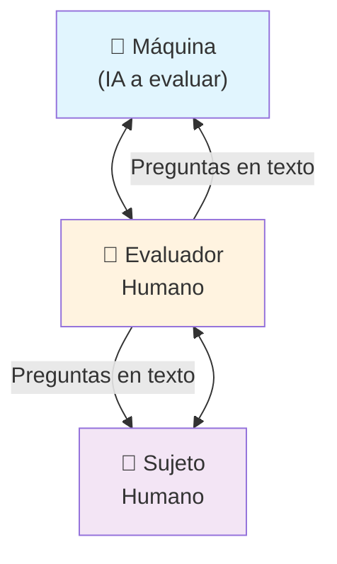
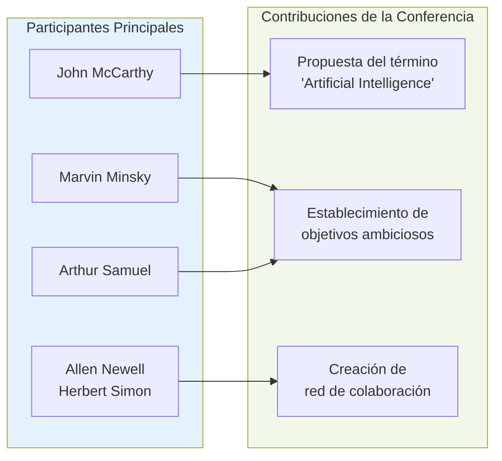
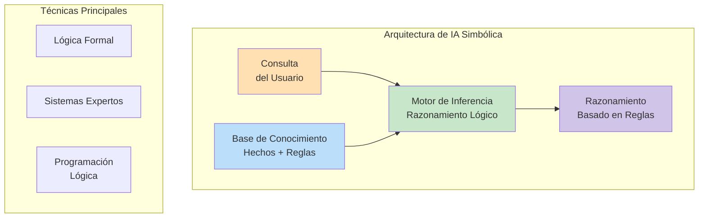
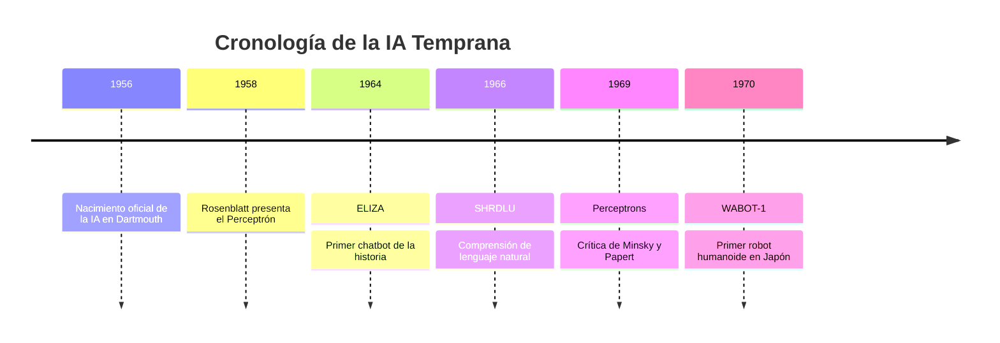
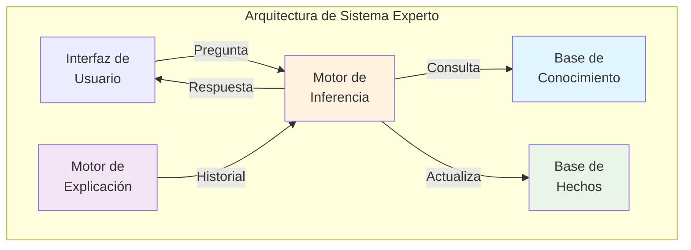
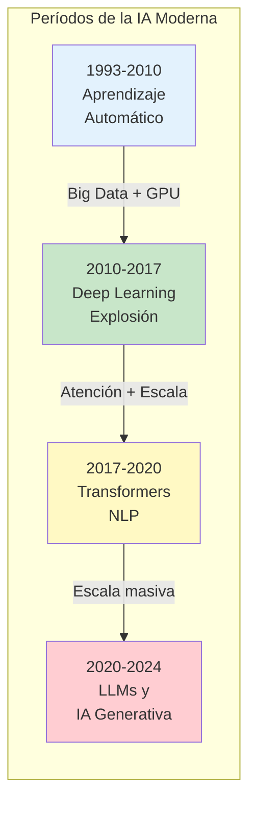
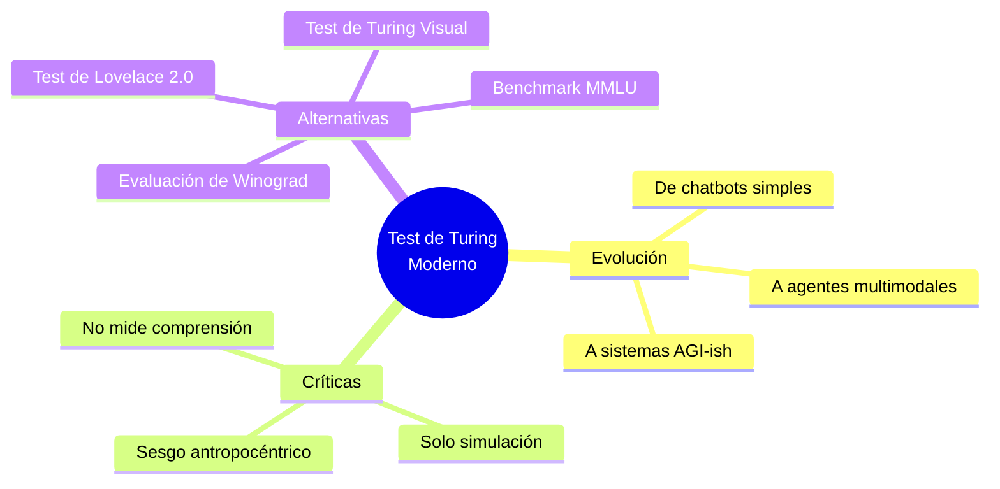
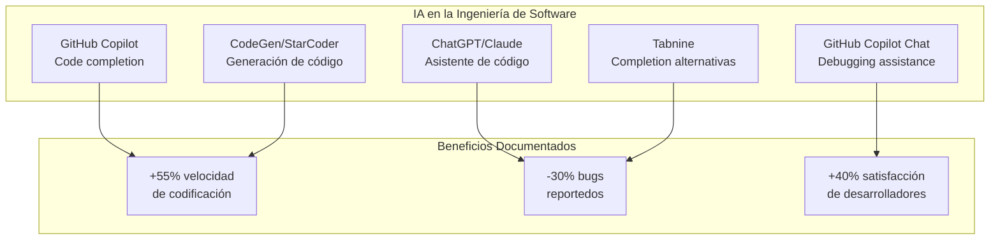

# CLASE 1: Historia de la Inteligencia Artificial

## 📋 Información General

| Campo | Detalle |
|-------|---------|
| **Duración** | 4 horas (240 minutos) |
| **Modalidad** | Teórico-Práctico |
| **Prerrequisitos** | Ninguno |
| **Tecnología** | Python, Jupyter Notebooks |

---

## 🎯 Objetivos de Aprendizaje

Al finalizar esta clase, el estudiante será capaz de:

1. **Comprender** los orígenes históricos de la Inteligencia Artificial desde la década de 1940
2. **Identificar** los principales hitos y personajes que definieron el campo
3. **Explicar** la diferencia fundamental entre IA Simbólica e IA Conexionista
4. **Reconocer** las causas y consecuencias de los "inviernos de la IA"
5. **Analizar** la evolución tecnológica hasta 2024
6. **Comprender** el Test de Turing y sus implicaciones filosóficas
7. **Contextualizar** el estado actual de la IA en el panorama histórico

---

## 📚 Contenidos Detallados

### 1.1 Introducción a la Inteligencia Artificial

La Inteligencia Artificial (IA) es uno de los campos más fascinantes y transformadores de la ciencia computacional moderna. Para comprender plenamente dónde se encuentra la IA hoy, es esencial entender su historia, sus fundamentos filosóficos y las batallas académicas que han definido su desarrollo.

La IA no surgió de la nada; es el resultado de siglos de pensamiento filosófico sobre la naturaleza de la inteligencia, combined con los avances tecnológicos del siglo XX. Desde los primeros autómatas mecánicos hasta los grandes modelos de lenguaje actuales, la historia de la IA es un viaje de descubrimiento, frustración, y eventualmente, triunfo.

### 1.2 Los Orígenes: El Cerebro como Computadora (1943-1956)

#### 1.2.1 Las Neuronas de McCulloch-Pitts (1943)

El documento seminal de Warren McCulloch y Walter Pitts, *"A Logical Calculus of the Ideas Immanent in Nervous Activity"* (1943), estableció las bases formales para las redes neuronales artificiales. Su trabajo fue revolucionario por varias razones:

**Conceptos clave del paper original:**
- Modelaron la neurona biológica como una puerta lógica binaria
- Propusieron que cualquier función computable podía ser representada por una red de estas neuronas
- Demostraron que tales redes podían implementar cualquier función booleana
- Conectaron la lógica proposicional con la neurofisiología

```python
"""
Implementación moderna de una neurona McCulloch-Pitts
Adaptación del modelo original de 1943
"""

class NeuronaMcCullochPitts:
    """
    Neurona artificial basada en el modelo original de 1943.
    
    El modelo original tenía las siguientes características:
    - Las entradas eran binarias (0 o 1)
    - Cada entrada tenía un peso sináptico fijo
    - Si la suma ponderada superaba un umbral, la neurona disparaba (salida = 1)
    - El umbral podía variar entre neuronas
    
    Esta implementación es una modernización del concepto original.
    """
    
    def __init__(self, pesos, umbral=1):
        """
        Inicializa la neurona.
        
        Args:
            pesos: Lista de pesos sinápticos para cada entrada
            umbral: Valor de umbral para la activación (default: 1)
        """
        self.pesos = pesos
        self.umbral = umbral
    
    def activar(self, entradas):
        """
        Calcula la salida de la neurona usando lógica threshold.
        
        Args:
            entradas: Lista de valores de entrada (binarios en el modelo original)
            
        Returns:
            1 si la suma ponderada >= umbral, 0 en caso contrario
        """
        suma_ponderada = sum(e * p for e, p in zip(entradas, self.pesos))
        return 1 if suma_ponderada >= self.umbral else 0
    
    def representar_funcion_logica(self, nombre_func, entradas_posibles):
        """
        Demuestra cómo la neurona puede representar funciones lógicas.
        """
        print(f"\n=== Representación de {nombre_func} ===")
        for entradas in entradas_posibles:
            salida = self.activar(entradas)
            print(f"Entradas: {entradas} -> Salida: {salida}")


# Demostración: Funciones lógicas representables
if __name__ == "__main__":
    print("=" * 60)
    print("NEURONA MCCULLOCH-PITTS - MODELO DE 1943")
    print("=" * 60)
    
    #Puerta AND
    neurona_and = NeuronaMcCullochPitts(pesos=[1, 1], umbral=2)
    entradas = [[0,0], [0,1], [1,0], [1,1]]
    neurona_and.representar_funcion_logica("AND (Y)", entradas)
    
    #Puerta OR
    neurona_or = NeuronaMcCullochPitts(pesos=[1, 1], umbral=1)
    neurona_or.representar_funcion_logica("OR (O)", entradas)
    
    #Puerta NOT
    print("\n=== Representación de NOT (NO) ===")
    neurona_not = NeuronaMcCullochPitts(pesos=[-1], umbral=-0.5)
    for entrada in [0, 1]:
        salida = neurona_not.activar([entrada])
        print(f"Entrada: {entrada} -> Salida: {salida}")
```

#### 1.2.2 La Máquina de Turing (1936) y el Test de Turing (1950)

Alan Turing, considerado el padre de la ciencia computacional teórica, publicó su concepto de "máquina computacional" en 1936, sentando las bases teóricas para todas las computadoras modernas.

En 1950, Turing publicó *"Computing Machinery and Intelligence"* en la revista Mind, donde propuso la pregunta fundamental: **"¿Pueden las máquinas pensar?"** Para responder a esta pregunta, ideó lo que ahora conocemos como el **Test de Turing**.



**El Test de Turing funciona así:**
1. Un evaluador humano hace preguntas en texto a dos participantes ocultos
2. Uno es un humano, el otro es una máquina
3. Si el evaluador no puede distinguir quién es la máquina, esta "pasa" el test
4. Turing predijo que para el año 2000, máquinas con 100 MB de memoria podrían engañar al 30% de los evaluadores durante 5 minutos

**Críticas modernas al Test de Turing:**
- Se enfoca solo en comportamiento, no en comprensión real
- Una máquina podría "engañar" sin realmente "pensar"
- Ignora aspectos visuales y físicos de la inteligencia
- No mide cualidades importantes como creatividad o emociones genuinas

#### 1.2.3 La Conferencia de Dartmouth (1956)

El evento considerado como el nacimiento oficial de la IA fue el **Summer Research Project on Artificial Intelligence** en Dartmouth College, del 18 de junio al 17 de agosto de 1956.



**Organizadores y sus contribuciones:**
- **John McCarthy**: Definió el término "Artificial Intelligence" y fue pionero en lógica formal
- **Marvin Minsky**: Trabajó en redes neuronales tempranas y más tarde fundó el MIT AI Lab
- **Allen Newell y Herbert Simon**: Desarrollaron el "Logic Theorist", considerado el primer programa de IA
- **Arthur Samuel**: Pionero en aprendizaje automático con su programa de damas

### 1.3 La IA Simbólica vs La IA Conexionista

Esta es una de las rivalidades más fundamentales en la historia de la IA, y su resolución ha moldeado el campo tal como lo conocemos hoy.

#### 1.3.1 IA Simbólica (Symbolic AI / GOFAI - Good Old-Fashioned AI)

La IA simbólica dominó el campo desde 1956 hasta aproximadamente mediados de los años 80. Se basa en el supuesto de que la inteligencia puede ser capturada mediante la manipulación de símbolos.

**Principios fundamentales:**
1. El conocimiento puede ser representado mediante símbolos
2. La inteligencia surge de la manipulación de这些 símbolos siguiendo reglas
3. Los sistemas expertos pueden capturar conocimiento humano experto



**Ejemplo de Sistema Experto - MYCIN (1972):**
MYCIN fue un sistema experto desarrollado en Stanford para diagnosticar infecciones bacterianas. Usaba ~450 reglas de la forma:

```
SI:
  - El organismo es Gram-negativo
  - El organismo tiene forma de bastón
  - El paciente no ha respondido a antibióticos previos
ENTONCES:
  - Hay 70% de probabilidad de que sea Pseudomonas
```

**Ventajas de la IA Simbólica:**
- Transparente y explicable
- Fácil de verificar y depurar
- Representa bien el razonamiento estructurado
- Base de datos de conocimiento ampliable

**Limitaciones:**
- Dificultad para manejar conocimiento ambiguo o vago
- Problemas de escalabilidad en dominios complejos
- La "brecha de conocimiento" - capturar sentido común es extremadamente difícil
- No escala bien con datos no estructurados

#### 1.3.2 IA Conexionista (Connectionist AI)

La IA conexionista se inspira directamente en la estructura del cerebro biológico, utilizando redes de neuronas artificiales interconectadas.

```mermaid
flowchart TD
    subgraph Cerebro ["Paralelo Biológico"]
        NB["Neurona Biológica"]
        S["Sinapsis<br/>Pesos")
        CB["Cuerpo Celular<br/>Procesamiento"]
    end
    
    subgraph Artificial ["Red Neuronal Artificial"]
        NA["Neurona Artificial"]
        PA["Pesos<br/>Ajustables"]
        FA["Función de<br/>Activación"]
    end
    
    NB -->|"Entrada sensorial"| CB
    S -->|"Modulable"| CB
    CB -->|" señal"| NB
    
    NA -->|"Entrada"| FA
    PA -->|"Modificable"| FA
    FA -->|"Salida"| NA
    
    style NB fill:#ffcdd2
    style NA fill:#ffecb3
    style Cerebro fill:#ffcdd2
    style Artificial fill:#fff9c4
```

**Historia de las Redes Neuronales:**
- **1943**: McCulloch-Pitts proponen el primer modelo de neurona
- **1958**: Frank Rosenblatt desarrolla el **Perceptrón**
- **1969**: Minsky y Papert publican *"Perceptrons"* criticando sus limitaciones
- **1986**: Rumelhart, Hinton y Williams reintroducen el algoritmo de **backpropagation**
- **2012**: AlexNet gana ImageNet, marcando el renacimiento del deep learning

#### 1.3.3 La Gran Diferencia: Representación del Conocimiento

| Aspecto | IA Simbólica | IA Conexionista |
|---------|--------------|-----------------|
| **Representación** | Símbolos explícitos | Patrones distribuidos |
| **Razonamiento** | Basado en reglas | Basado en ejemplos |
| **Aprendizaje** | Programación manual | Ajuste de pesos |
| **Explicabilidad** | Alta | Baja ("caja negra") |
| **Tolerancia a ruido** | Baja | Alta |
| **Generalización** | Basada en lógica | Basada en similitud |
| **Origen** | Filosofía, lingüística | Neurociencia, física |

### 1.4 Hitos Históricos de la IA (1950-2024)

#### 1.4.1 La Era de la Inauguración (1956-1974)

Esta fue una época de optimismo extremo. Los investigadores creían que la IA general (AGI) estaba a solo 10 años de distancia.

**Logros importantes:**
- **Logic Theorist (1956)**: Primer programa de IA, demostró teoremas de Russell y Whitehead
- **General Problem Solver - GPS (1957)**: Newell y Simon crearon un programa para resolver problemas genéricos
- **ELIZA (1966)**: Joseph Weizenbaum creó el primer chatbot en MIT, simulaba un terapeuta rogeriano
- **Shakey el Robot (1966-1972)**: Primer robot móvil con capacidad de razonamiento, navegación y planificación



#### 1.4.2 El Primer Invierno de la IA (1974-1980)

Las predicciones excesivamente optimistas no se cumplieron. La IA de ese entonces era muy limitada:

**Problemas que causaron el invierno:**
1. **Limitaciones computacionales**: Las computadoras eran demasiado lentas y con poca memoria
2. **Exponential blowup**: Muchos algoritmos simples requerían tiempo exponencial
3. **Falta de datos**: Los sistemas simbólicos necesitaban conocimiento manual
4. **Crítica de Minsky-Papert (1969)**: Demostraron que los perceptrones no podían resolver XOR

**Consecuencias:**
- Financiamiento gubernamental drásticamente reducido
- Cierre de laboratorios de IA
- Período de "IA alternativa" con sistemas expertos
- Muchos investigadores migraron a otras áreas

#### 1.4.3 Los Sistemas Expertos (1980-1987)

El segundo boom de la IA vino de la mano de los sistemas expertos, que encontraron aplicaciones comerciales exitosas.



**Sistemas Expertos Famosos:**
- **DENDRAL (1965-1970)**: Identificación de estructuras moleculares
- **MYCIN (1972)**: Diagnóstico de infecciones bacterianas
- **XCON (1980)**: Configuración de computadoras DEC VAX - ahorró $40M/año
- **PROSPECTOR (1978)**: Exploración geológica, descubrió un yacimiento de molibdeno

#### 1.4.4 El Segundo Invierno de la IA (1987-1993)

**Causas del segundo invierno:**
1. **Lentitud de los sistemas expertos**: Requerían mucho tiempo para consultar grandes bases de conocimiento
2. **Dificultad de mantenimiento**: Los sistemas eran frágiles y caros de actualizar
3. **La competencia japonesa**: El proyecto Fifth Generation no cumplió expectativas
4. **Avance del hardware**: Las workstations emergentes redujeron la necesidad de sistemas especializados

#### 1.4.5 El Resurgimiento: Aprendizaje Automático y Deep Learning (1993-2024)



**Hitos modernos:**

| Año | Evento | Impacto |
|-----|--------|---------|
| 1997 | **Deep Blue** vs Kasparov | Primera computadora derrota al campeón mundial de ajedrez |
| 2006 | Deep Learning de Hinton | "Reducing the dimensionality of data with neural networks" |
| 2011 | Watson gana Jeopardy! | Procesamiento de lenguaje natural a escala |
| 2012 | **AlexNet** en ImageNet | CNN profundas revolucionan visión por computadora |
| 2016 | **AlphaGo** vs Lee Sedol | RL con redes neuronales derrota al mejor jugador de Go |
| 2017 | **Attention Is All You Need** | Paper de transformers revoluciona NLP |
| 2020 | **GPT-3** | Primer modelo de lenguaje grande con 175B parámetros |
| 2022 | **ChatGPT** | democratiza el acceso a LLMs |
| 2023-2024 | **GPT-4, Claude, Gemini** | Multimodalidad y capacidades emergentes |

### 1.5 El Test de Turing Moderno y la IA Contemporánea

#### 1.5.1 Más Allá del Test de Turing

El test de Turing, aunque histórico, tiene limitaciones significativas en el contexto actual:



#### 1.5.2 Capacidades Emergentes

Los modelos modernos han mostrado **capacidades emergentes** - habilidades que aparecen de forma inesperada cuando los modelos alcanzan cierto tamaño:

- **Zero-shot learning**: Realizar tareas sin entrenamiento específico
- **Chain-of-thought reasoning**: Generar razonamientos paso a paso
- **Codex/CoPilot**: Escribir código funcional
- **Multimodalidad**: Procesar texto, imágenes, audio y video
- **In-context learning**: Aprender de ejemplos en el prompt

### 1.6 La IA en la Ingeniería de Software Contemporánea

#### 1.6.1 IA para Código



#### 1.6.2 Herramientas de IA Modernas para Desarrolladores

```python
# Ejemplo: Uso básico de GitHub Copilot API (conceptual)
# Esta es una demostración de cómo integrar IA en el flujo de desarrollo

import anthropic  # Para usar Claude
import openai     # Para usar GPT

class AIAssistedDevelopment:
    """
    Framework conceptual para integrar IA en desarrollo de software.
    """
    
    def __init__(self, model_provider="anthropic"):
        if model_provider == "anthropic":
            self.client = anthropic.Anthropic()
        else:
            self.client = openai.OpenAI()
        self.model = model_provider
    
    def code_review(self, code: str, language: str) -> dict:
        """
        Realiza una revisión de código asistida por IA.
        """
        prompt = f"""Revisa el siguiente código {language} y proporciona:
        1. Problemas potenciales de seguridad
        2. Mejoras de rendimiento
        3. Mejores prácticas
        4. Bugs potenciales
        
        Código:
        ```{language}
        {code}
        ```"""
        
        response = self.client.messages.create(
            model="claude-3-opus-20240229",
            max_tokens=2048,
            messages=[{"role": "user", "content": prompt}]
        )
        
        return {
            "review": response.content,
            "model": self.model,
            "language": language
        }
    
    def generate_tests(self, function_code: str) -> str:
        """
        Genera tests unitarios para una función.
        """
        prompt = f"""Genera tests unitarios exhaustivos para la siguiente función.
        Usa pytest para Python.
        
        Función:
        {function_code}"""
        
        response = self.client.messages.create(
            model="claude-3-opus-20240229",
            max_tokens=2048,
            messages=[{"role": "user", "content": prompt}]
        )
        
        return response.content
    
    def explain_code(self, code: str) -> str:
        """
        Explica código complejo.
        """
        prompt = f"""Explica el siguiente código en términos claros.
        Incluye:
        - Qué hace la función
        - Parámetros de entrada
        - Valor de retorno
        - Posibles efectos secundarios
        
        Código:
        {code}"""
        
        response = self.client.messages.create(
            model="claude-3-opus-20240229",
            max_tokens=1024,
            messages=[{"role": "user", "content": prompt}]
        )
        
        return response.content


# Uso ejemplo
if __name__ == "__main__":
    ai_assistant = AIAssistedDevelopment(model_provider="anthropic")
    
    sample_code = """
    def fibonacci(n, memo={}):
        if n in memo:
            return memo[n]
        if n <= 1:
            return n
        memo[n] = fibonacci(n-1, memo) + fibonacci(n-2, memo)
        return memo[n]
    """
    
    print("=== Code Review ===")
    review = ai_assistant.code_review(sample_code, "python")
    print(review["review"])
    
    print("\n=== Explicación ===")
    explanation = ai_assistant.explain_code(sample_code)
    print(explanation)
```

---

## 🧪 Ejercicios Prácticos Resueltos

### Ejercicio 1: Implementación de un Agente Lógico Simple

```python
"""
Ejercicio 1: Implementar un Agente Lógico Simple
------------------------------------------------
Este ejercicio demuestra los principios de la IA simbólica creando
un agente que usa lógica de primer orden para razonar sobre hechos.

El agente puede:
1. Almacenar hechos sobre el mundo
2. Derivar nuevos hechos mediante inferencia lógica
3. Responder preguntas basadas en el conocimiento acumulado
"""

class AgenteLogico:
    """
    Un agente lógico simple basado en encadenamiento hacia adelante.
    
    Representa el conocimiento como hechos (átomos) y reglas (implicaciones).
    """
    
    def __init__(self):
        self.hechos = set()  # Conjunto de hechos conocidos
        self.reglas = []       # Lista de reglas (premisas -> conclusión)
    
    def agregar_hecho(self, hecho):
        """Agrega un hecho a la base de conocimiento."""
        self.hechos.add(hecho)
        print(f"✓ Hecho agregado: {hecho}")
    
    def agregar_regla(self, premisas, conclusion):
        """
        Agrega una regla de la forma: premisas -> conclusion
        Donde premisas es una lista de condiciones necesarias.
        """
        self.reglas.append((premisas, conclusion))
        print(f"✓ Regla agregada: {premisas} → {conclusion}")
    
    def inferir_nuevos_hechos(self):
        """
        Realiza encadenamiento hacia adelante.
        Itera sobre las reglas y agrega conclusiones si todas las premisas son ciertas.
        Retorna True si se infirió al menos un nuevo hecho.
        """
        nuevos = []
        for premisas, conclusion in self.reglas:
            if conclusion not in self.hechos and all(p in self.hechos for p in premisas):
                nuevos.append(conclusion)
        
        for hecho in nuevos:
            self.agregar_hecho(hecho)
        
        return len(nuevos) > 0
    
    def encadenamiento_completo(self, max_iteraciones=100):
        """
        Ejecuta inferencia hasta que no se puedan derivar más hechos.
        """
        print("\n" + "="*50)
        print("EJECUTANDO ENCADENAMIENTO HACIA ADELANTE")
        print("="*50)
        
        iteracion = 0
        while iteracion < max_iteraciones:
            hechos_anterior = len(self.hechos)
            if not self.inferir_nuevos_hechos():
                break
            iteracion += 1
            print(f"\nHechos acumulados: {len(self.hechos)}")
        
        print(f"\n✓ Inferencia completada en {iteracion} iteraciones")
    
    def preguntar(self, hecho):
        """Consulta si un hecho es conocido."""
        return hecho in self.hechos
    
    def mostrar_conocimiento(self):
        """Muestra todo el conocimiento del agente."""
        print("\n" + "="*50)
        print("BASE DE CONOCIMIENTO")
        print("="*50)
        print(f"\nHechos ({len(self.hechos)}):")
        for hecho in sorted(self.hechos):
            print(f"  • {hecho}")
        print(f"\nReglas ({len(self.reglas)}):")
        for premisas, conclusion in self.reglas:
            print(f"  • {premisas} → {conclusion}")


def ejercicio_resuelto():
    """
    Ejemplo resuelto: Sistema de diagnóstico médico simplificado.
    """
    print("="*60)
    print("EJERCICIO RESUELTO: SISTEMA DE DIAGNÓSTICO MÉDICO")
    print("="*60)
    
    agente = AgenteLogico()
    
    # Hechos observados (síntomas)
    agente.agregar_hecho("paciente_tiene_fiebre")
    agente.agregar_hecho("paciente_tiene_tos")
    agente.agregar_hecho("paciente_tiene_dolores_musculares")
    
    # Reglas de diagnóstico
    agente.agregar_regla(["paciente_tiene_fiebre", "paciente_tiene_tos"], "posible_gripe")
    agente.agregar_regla(["posible_gripe", "paciente_tiene_dolores_musculares"], "diagnostico_gripe_confirmado")
    agente.agregar_regla(["paciente_tiene_fiebre", "paciente_tiene_tos", "dificultad_respiratoria"], "posible_covid")
    agente.agregar_regla(["paciente_tiene_fiebre", "dolor_de_cabeza_intenso"], "posible_meningitis")
    
    # Inferir hechos
    agente.encadenamiento_completo()
    
    # Consultar
    print("\n" + "="*50)
    print("CONSULTAS")
    print("="*50)
    consultas = ["diagnostico_gripe_confirmado", "posible_covid", "posible_meningitis"]
    for consulta in consultas:
        resultado = agente.preguntar(consulta)
        print(f"¿{consulta}? {'✓ SÍ' if resultado else '✗ NO'}")
    
    agente.mostrar_conocimiento()


if __name__ == "__main__":
    ejercicio_resuelto()
```

### Ejercicio 2: Simulación del Test de Turing

```python
"""
Ejercicio 2: Simulación del Test de Turing
------------------------------------------
Implementa una simulación donde un evaluador intenta distinguir
entre respuestas humanas y generadas por IA.
"""

import random
import difflib

class TestTuring:
    """
    Simulación del Test de Turing.
    
    El evaluador hace preguntas a dos participantes (humano e IA)
    y debe determinar cuál es cuál.
    """
    
    def __init__(self):
        self.preguntas_base = [
            "¿Cuál es tu color favorito?",
            "¿Qué hiciste ayer?",
            "¿Cómo está el clima hoy?",
            "¿Puedes contarme un chiste?",
            "¿Qué te gusta hacer en tu tiempo libre?",
            "¿Cuál es tu comida favorita?",
            "¿Has leído algún libro recientemente?",
            "¿Qué opinas de la inteligencia artificial?",
        ]
        self.respuestas_humano = [
            "Mi color favorito es el azul, me transmite calma.",
            "Ayer trabajé en un proyecto de programación todo el día.",
            "El clima está nublado, parece que lloverá pronto.",
            "¿Por qué el programador salió a la calle? Porque no cabía en RAM.",
            "Me gusta jugar videojuegos y salir a correr los fines de semana.",
            "Me encanta la pasta, especialmente los espaguetis a la boloñesa.",
            "Estoy leyendo 'Cien años de soledad' de Gabriel García Márquez.",
            "Creo que la IA es fascinante pero también preocupante.",
        ]
        self.respuestas_ia = [
            "Mi respuesta favorita es una combinación de RGB 0.23, 0.45, 0.67.",
            "Fui entrenado con datos hasta 2024, no tengo memoria de ayer.",
            "No tengo acceso a información meteorológica en tiempo real.",
            "Los robots no cuentan chistes, pero puedo generar texto aleatorio gracioso.",
            "Proceso texto según patrones estadísticos, no tengo preferencias.",
            "Como modelo de lenguaje, no como, pero puedo describir recetas.",
            "Tengo conocimiento de muchos libros hasta mi fecha de entrenamiento.",
            "La IA puede ser útil para automatizar tareas repetitivas.",
        ]
    
    def generar_perturbacion_humana(self, texto):
        """Simula errores tipográficos humanos."""
        letras = list(texto.lower())
        num_errores = random.randint(0, 3)
        for _ in range(num_errores):
            if letras:
                pos = random.randint(0, len(letras) - 1)
                letras[pos] = random.choice('abcdefghijklmnopqrstuvwxyz')
        return ''.join(letras).capitalize()
    
    def mostrar_pregunta(self, idx, pregunta):
        """Muestra una pregunta al evaluador."""
        print(f"\n{'='*50}")
        print(f"PREGUNTA {idx + 1}: {pregunta}")
        print("="*50)
        
        # Aleatorizar el orden de presentación
        if random.random() < 0.5:
            return (self.generar_respuestas(pregunta, self.respuestas_humano[idx]),
                    self.generar_respuestas(pregunta, self.respuestas_ia[idx]),
                    "A")
        else:
            return (self.generar_respuestas(pregunta, self.respuestas_ia[idx]),
                    self.generar_respuestas(pregunta, self.respuestas_humano[idx]),
                    "B")
    
    def generar_respuestas(self, pregunta, respuestas_base):
        """Genera respuestas."""
        idx = self.preguntas_base.index(pregunta) if pregunta in self.preguntas_base else 0
        return respuestas_base[idx]
    
    def ejecutar_test(self):
        """Ejecuta una sesión completa del Test de Turing."""
        print("\n" + "="*60)
        print("🧠 SIMULACIÓN DEL TEST DE TURING")
        print("="*60)
        print("""
        Se te presentarán 5 preguntas. Para cada una, recibirás
        dos respuestas (A y B). Intenta determinar cuál fue
        dada por un humano y cuál por una IA.
        """)
        
        aciertos = 0
        preguntas = random.sample(self.preguntas_base, min(5, len(self.preguntas_base)))
        
        for i, pregunta in enumerate(preguntas):
            resp_a, resp_b, orden_correcto = self.mostrar_pregunta(i, pregunta)
            
            print(f"\nRespuesta A:")
            print(f"  {resp_a}")
            print(f"\nRespuesta B:")
            print(f"  {resp_b}")
            
            # Simular respuesta del "evaluador"
            respuesta_usuario = input("\n¿Cuál crees que es del humano? (A/B): ").upper()
            
            if respuesta_usuario == orden_correcto:
                print("✓ ¡Correcto! Identificaste al humano.")
                aciertos += 1
            else:
                print("✗ Incorrecto. El humano fue el otro.")
        
        print(f"\n{'='*50}")
        print(f"RESULTADO FINAL: {aciertos}/5 preguntas correctas")
        if aciertos >= 4:
            print("🏆 ¡Excelente! Tienes buen ojo para detectar IA.")
        elif aciertos >= 3:
            print("👍 Buen trabajo. Distingues la mayoría de respuestas.")
        else:
            print("🤔 Las respuestas de IA son cada vez más convincentes...")
        print("="*50)


if __name__ == "__main__":
    test = TestTuring()
    test.ejecutar_test()
```

---

## 🔬 Actividades de Laboratorio

### Laboratorio 1: Configuración del Entorno y Primer Contacto con IA

**Duración estimada**: 45 minutos

**Objetivo**: Configurar un entorno de desarrollo Python con Jupyter Notebooks y explorar herramientas básicas de IA.

**Pasos**:

1. **Instalación de Anaconda/Miniconda**:
```bash
# Descargar Miniconda
wget https://repo.anaconda.com/miniconda/Miniconda3-latest-Linux-x86_64.sh
bash Miniconda3-latest-Linux-x86_64.sh

# Crear entorno virtual
conda create -n ia-fundamentos python=3.11
conda activate ia-fundamentos
```

2. **Instalar paquetes esenciales**:
```bash
pip install jupyterlab numpy pandas matplotlib scikit-learn
pip install torch torchvision torchaudio  # Para CPU
pip install openai anthropic langchain
```

3. **Crear un Jupyter Notebook** con celdas para:
   - Importar bibliotecas básicas
   - Realizar operaciones de álgebra lineal simples
   - Crear visualizaciones básicas
   - Experimentar con APIs de IA (ejemplo con GPT)

```python
# Primer celda: Imports
import numpy as np
import matplotlib.pyplot as plt
import pandas as pd

# Segundo celda: Operaciones básicas
matriz = np.random.rand(3, 3)
vector = np.random.rand(3)
resultado = matriz @ vector
print(f"Matriz 3x3:\n{matriz}")
print(f"\nVector:\n{vector}")
print(f"\nProducto matriz-vector:\n{resultado}")
```

### Laboratorio 2: Análisis de la Evolución de la IA

**Duración estimada**: 60 minutos

**Objetivo**: Analizar datos históricos del desarrollo de la IA y visualizar tendencias.

**Actividades**:

1. Crear un dataset con hitos históricos de la IA
2. Visualizar la evolución temporal
3. Analizar patrones de "boom and bust"

```python
import pandas as pd
import matplotlib.pyplot as plt
from datetime import datetime

# Dataset de hitos históricos
hitos = [
    {"año": 1956, "evento": "Conferencia de Dartmouth - Nacimiento de IA", "tipo": "nacimiento"},
    {"año": 1966, "evento": "ELIZA - Primer chatbot", "tipo": "nlp"},
    {"año": 1969, "evento": "Perceptrons - Crítica de Minsky-Papert", "tipo": "invierno"},
    {"año": 1980, "evento": "XCON - Sistemas expertos comerciales", "tipo": "simbólica"},
    {"año": 1987, "evento": "Segundo invierno de la IA", "tipo": "invierno"},
    {"año": 1997, "evento": "Deep Blue vs Kasparov", "tipo": "ml"},
    {"año": 2012, "evento": "AlexNet - Revolución del Deep Learning", "tipo": "dl"},
    {"año": 2016, "evento": "AlphaGo - RL en juegos", "tipo": "rl"},
    {"año": 2017, "evento": "Transformers - Attention Is All You Need", "tipo": "nlp"},
    {"año": 2020, "evento": "GPT-3 - Modelos de lenguaje grandes", "tipo": "llm"},
    {"año": 2022, "evento": "ChatGPT - IA conversacional masiva", "tipo": "llm"},
    {"año": 2024, "evento": "Modelos multimodales avanzados", "tipo": "multimodal"},
]

df = pd.DataFrame(hitos)

# Visualización
fig, ax = plt.subplots(figsize=(14, 8))

colores = {
    "nacimiento": "#4CAF50",
    "nlp": "#2196F3", 
    "invierno": "#F44336",
    "simbólica": "#9C27B0",
    "ml": "#FF9800",
    "dl": "#00BCD4",
    "rl": "#8BC34A",
    "llm": "#E91E63",
    "multimodal": "#607D8B"
}

for _, row in df.iterrows():
    ax.scatter(row["año"], 1, s=300, c=colores.get(row["tipo"], "#999"), alpha=0.7)
    ax.annotate(row["evento"], (row["año"], 1.05), rotation=45, ha='left', fontsize=8)

ax.set_xlim(1950, 2025)
ax.set_ylim(0, 2)
ax.set_xlabel("Año")
ax.set_title("Cronología de la Inteligencia Artificial (1956-2024)")
ax.legend(handles=[plt.scatter([],[], c=v, label=k) for k,v in colores.items()])
plt.tight_layout()
plt.savefig("cronologia_ia.png")
plt.show()
```

---

## 📚 Referencias Externas

### Papers Fundamentales

1. **McCulloch, W. & Pitts, W. (1943).** "A Logical Calculus of the Ideas Immanent in Nervous Activity." *Bulletin of Mathematical Biophysics, 5*, 115-133.
   - URL: https://link.springer.com/article/10.1007/BF02478259

2. **Turing, A. M. (1950).** "Computing Machinery and Intelligence." *Mind, 59*(236), 433-460.
   - URL: https://www.jstor.org/stable/2251299

3. **Minsky, M. & Papert, S. (1969).** *Perceptrons: An Introduction to Computational Geometry.* MIT Press.
   - URL: https://mitpress.mit.edu/books/perceptrons

4. **Rumelhart, D., Hinton, G., & Williams, R. (1986).** "Learning representations by back-propagating errors." *Nature, 323*, 533-536.
   - URL: https://www.nature.com/articles/323533a0

5. **Vaswani, A. et al. (2017).** "Attention Is All You Need." *NeurIPS 2017*.
   - URL: https://arxiv.org/abs/1706.03762

### Recursos Educativos

6. **MIT OpenCourseWare - Artificial Intelligence.** 
   - URL: https://ocw.mit.edu/courses/6-034-artificial-intelligence-fall-2010/

7. **Stanford CS229: Machine Learning.**
   - URL: https://cs229.stanford.edu/

8. **DeepLearning.AI Courses.**
   - URL: https://www.deeplearning.ai/

### Historia de la IA

9. **Russell, S. & Norvig, P.** *Artificial Intelligence: A Modern Approach (4th Edition).* Pearson, 2020.
   - Capítulos 1-2: Historia y fundamentos

10. **The History of Artificial Intelligence - Simon (2006).**
    - URL: https://sitn.hms.harvard.edu/flash/2019/history-artificial-intelligence/

---

## 📝 Resumen de Puntos Clave

### Conceptos Fundamentales

1. **Orígenes de la IA (1943-1956)**:
   - Las neuronas de McCulloch-Pitts (1943) establecieron el primer modelo formal de neurona artificial
   - Alan Turing propuso la pregunta "can machines think?" y el Test de Turing (1950)
   - La conferencia de Dartmouth (1956) acuñó el término "Artificial Intelligence"

2. **IA Simbólica vs Conexionista**:
   - **Simbólica**: Manipulación de símbolos mediante reglas, explicable, basada en lógica
   - **Conexionista**: Redes de neuronas artificiales, aprendizaje de patrones, inspirado en el cerebro

3. **Los Inviernos de la IA**:
   - **Primer invierno (1974-1980)**: Predicciones incumplidas, críticas de Minsky-Papert
   - **Segundo invierno (1987-1993)**: Fracaso de sistemas expertos, falta de escalabilidad

4. **Resurgimiento Moderno (1993-2024)**:
   - Deep Learning (2012): AlexNet y redes convolucionales profundas
   - Transformers (2017): "Attention Is All You Need" revolucionó NLP
   - LLMs (2020-2024): GPT-3, ChatGPT, modelos multimodales

5. **El Test de Turing**:
   - Propuesto en 1950 como prueba de inteligencia artificial
   - Evalúa la capacidad de una máquina para exhibir comportamiento inteligente indistinguible del humano
   - Críticas modernas señalan limitaciones para evaluar comprensión real

6. **Herramientas de IA para Ingenieros de Software**:
   - GitHub Copilot, ChatGPT, Claude para asistencia en codificación
   - Code review automatizado, generación de tests, debugging
   - Integration con flujos de desarrollo existentes

7. **El Futuro de la IA**:
   - Capacidades emergentes en modelos grandes
   - IA multimodal y agentes autónomos
   - Consideraciones éticas y de seguridad

---

## 📋 Tarea Pre-Clase 2

Antes de la próxima clase, los estudiantes deben:

1. **Lectura recomendada**:
   - Caps. 1-2 de "Mathematics for Machine Learning" (Deisenroth et al.)
   - Repasar conceptos básicos de cálculo y álgebra lineal

2. **Instalar software**:
   - Python 3.11+ con JupyterLab
   - Bibliotecas: NumPy, SciPy, Matplotlib

3. **Ejercicio preparatorio**:
   - Investigar un hito histórico de la IA y preparar una presentación de 3 minutos

---

*Fin de la Clase 1*
