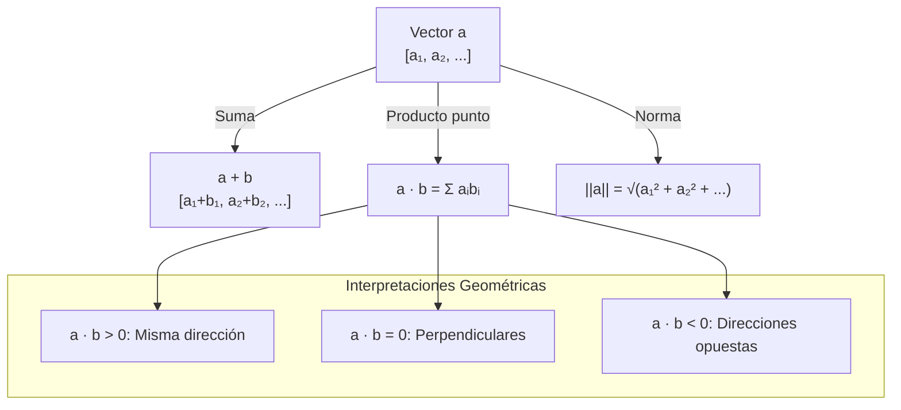
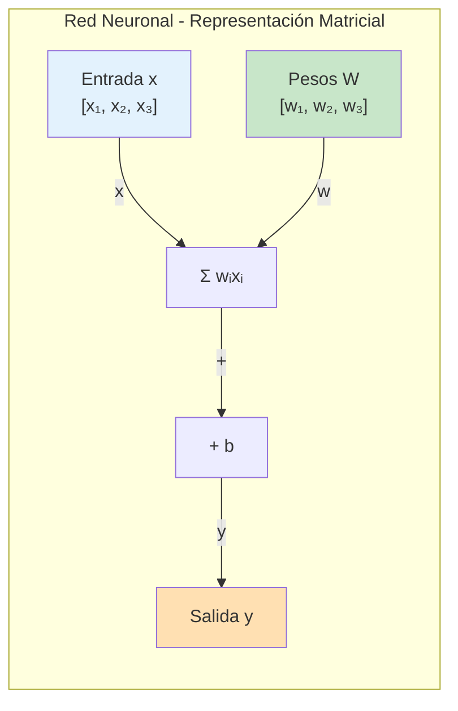
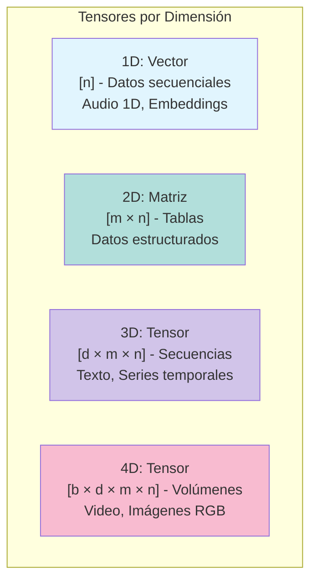
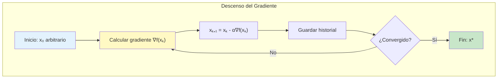

# CLASE 2: Fundamentos Matemáticos para IA

## 📋 Información General

| Campo | Detalle |
|-------|---------|
| **Duración** | 4 horas (240 minutos) |
| **Modalidad** | Teórico-Práctico |
| **Prerrequisitos** | Clase 1 completada, conocimientos básicos de Python |
| **Tecnología** | NumPy, SciPy, Matplotlib |

---

## 🎯 Objetivos de Aprendizaje

Al finalizar esta clase, el estudiante será capaz de:

1. **Comprender** y manipular vectores, matrices y tensores como estructuras de datos fundamentales
2. **Aplicar** operaciones de álgebra lineal (productos punto, productos cruz, descomposiciones)
3. **Calcular** derivadas y gradientes para funciones univariadas y multivariadas
4. **Implementar** descenso del gradiente desde cero
5. **Aplicar** conceptos de probabilidad y estadística en contextos de ML
6. **Visualizar** conceptos matemáticos mediante NumPy y Matplotlib
7. **Preparar** las bases matemáticas necesarias para redes neuronales

---

## 📚 Contenidos Detallados

### 2.1 Introducción: Por qué las Matemáticas son Esenciales para la IA

Las matemáticas constituyen el lenguaje fundamental de la Inteligencia Artificial. Sin una comprensión sólida de los conceptos matemáticos subyacentes, es imposible:

- Entender **por qué** funcionan los algoritmos de ML
- **Depurar** modelos cuando fallan
- **Innovar** creando nuevas arquitecturas
- **Interpretar** resultados y métricas

En esta clase cubriremos tres pilares matemáticos:
1. **Álgebra Lineal**: El lenguaje de los datos y las transformaciones
2. **Cálculo**: Cómo cambian las funciones, esencial para el aprendizaje
3. **Probabilidad y Estadística**: Cómo manejar la incertidumbre

### 2.2 Álgebra Lineal: Vectores, Matrices y Tensores

#### 2.2.1 Vectores: Direcciones en el Espacio

Un vector es una quantity con magnitud y dirección. En computación, representamos vectores como arrays unidimensionales.

```python
import numpy as np
import matplotlib.pyplot as plt

# Creación de vectores
v1 = np.array([3, 4])  # Vector 2D
v2 = np.array([1, 0, -1])  # Vector 3D

print(f"Vector v1: {v1}")
print(f"Forma: {v1.shape}")
print(f"Norma (longitud): {np.linalg.norm(v1)}")

# Visualización de vectores 2D
fig, ax = plt.subplots(figsize=(8, 8))

# Dibujar vectores desde el origen
for vec, color, label in [(v1, 'blue', 'v1=[3,4]'), 
                            (np.array([4, 1]), 'red', 'v2=[4,1]')]:
    ax.arrow(0, 0, vec[0], vec[1], head_width=0.15, head_length=0.1, 
             fc=color, ec=color, length_includes_head=True, linewidth=2)
    ax.text(vec[0]*0.9, vec[1]*0.9, label, fontsize=12, color=color)

ax.set_xlim(-1, 5)
ax.set_ylim(-1, 5)
ax.set_xlabel('x')
ax.set_ylabel('y')
ax.set_title('Representación Visual de Vectores')
ax.axhline(y=0, color='k', linewidth=0.5)
ax.axvline(x=0, color='k', linewidth=0.5)
ax.grid(True, alpha=0.3)
ax.set_aspect('equal')
plt.show()
```

**Operaciones con vectores:**

```python
# Suma de vectores
a = np.array([1, 2, 3])
b = np.array([4, 5, 6])
suma = a + b  # [5, 7, 9]

# Multiplicación por escalar
escala = 3 * a  # [3, 6, 9]

# Producto punto (dot product)
producto_punto = np.dot(a, b)  # 1*4 + 2*5 + 3*6 = 32

# El producto punto tiene una interpretación geométrica:
# a · b = |a| * |b| * cos(θ)
# donde θ es el ángulo entre los vectores

def producto_punto_manual(v1, v2):
    """Calcula el producto punto manualmente."""
    resultado = 0
    for x1, x2 in zip(v1, v2):
        resultado += x1 * x2
    return resultado

# Verificación
print(f"np.dot(a, b) = {np.dot(a, b)}")
print(f"producto_punto_manual(a, b) = {producto_punto_manual(a, b)}")
```



#### 2.2.2 Matrices: Transformaciones Lineales

Una matriz es un array 2D de números. Las matrices representan transformaciones lineales.

```python
# Creación de matrices
A = np.array([[1, 2], 
              [3, 4]])
B = np.array([[5, 6], 
              [7, 8]])

print(f"Matriz A:\n{A}")
print(f"Forma: {A.shape}")

# Operaciones básicas
print(f"\nA + B:\n{A + B}")
print(f"\nA * 2:\n{A * 2}")

# Producto matricial
C = np.matmul(A, B)  # o A @ B
print(f"\nA @ B:\n{C}")
```

**El producto matricial es fundamental en redes neuronales:**

```python
# Cada neurona: y = w·x + b
# Donde w es el vector de pesos, x la entrada, b el sesgo

def forward_neurona(pesos, entrada, sesgo):
    """
    Calcula la salida de una neurona simple.
    
    Args:
        pesos: Vector de pesos sinápticos [w₁, w₂, ..., wₙ]
        entrada: Vector de entrada [x₁, x₂, ..., xₙ]
        sesgo: Valor de sesgo (scalar)
    
    Returns:
        Salida pre-activación
    """
    producto_punto = np.dot(pesos, entrada)
    return producto_punto + sesgo

# Ejemplo
pesos = np.array([0.5, -0.3, 0.8])
entrada = np.array([1.0, 2.0, 3.0])
sesgo = 0.1

salida = forward_neurona(pesos, entrada, sesgo)
print(f"Salida de la neurona: {salida}")
```



#### 2.2.3 Tensores: Generalización a Más Dimensiones

Un tensor es una generalización de vectores y matrices a más dimensiones.

```python
# Vector (1D tensor): shape (n,)
vector = np.array([1, 2, 3])
print(f"Vector - Forma: {vector.shape}")

# Matriz (2D tensor): shape (m, n)
matriz = np.random.rand(3, 4)
print(f"Matriz - Forma: {matriz.shape}")

# Tensor 3D: shape (batch, height, width)
tensor_3d = np.random.rand(10, 28, 28)  # 10 imágenes de 28x28
print(f"Tensor 3D - Forma: {tensor_3d.shape}")

# Tensor 4D: (batch, channels, height, width)
tensor_4d = np.random.rand(10, 3, 224, 224)  # 10 imágenes RGB de 224x224
print(f"Tensor 4D - Forma: {tensor_4d.shape}")

# En deep learning, los tensores son omnipresentes:
# - Imágenes: 4D tensors (batch, height, width, channels)
# - Texto: 3D tensors (batch, sequence_length, embedding_dim)
# - Audio: 2D tensors (samples, features) o 3D (batch, time, features)
```



#### 2.2.4 Operaciones Matriciales Esenciales

```python
# Transposición: intercambia filas y columnas
A = np.array([[1, 2, 3],
              [4, 5, 6]])
print(f"A:\n{A}")
print(f"A.T:\n{A.T}")

# Traza: suma de elementos diagonales
matriz_cuadrada = np.array([[1, 2, 3],
                           [4, 5, 6],
                           [7, 8, 9]])
print(f"Traza: {np.trace(matriz_cuadrada)}")

# Determinante
det_A = np.linalg.det(A @ A.T)
print(f"Determinante: {det_A}")

# Inversa
try:
    inv_A = np.linalg.inv(A @ A.T)
    print(f"Inversa de A@A.T:\n{inv_A}")
except np.linalg.LinAlgError:
    print("La matriz no es invertible")

# Descomposición SVD (muy importante en ML)
U, S, Vt = np.linalg.svd(A)
print(f"\nSVD:")
print(f"U shape: {U.shape}")
print(f"S: {S}")
print(f"Vt shape: {Vt.shape}")
```

### 2.3 Cálculo: Derivadas y Gradientes

#### 2.3.1 Derivadas: Razón de Cambio

La derivada representa la tasa de cambio instantánea de una función.

```python
def derivada_numerica(f, x, h=1e-5):
    """
    Calcula la derivada numéricamente.
    
    Usa la definición: f'(x) ≈ [f(x+h) - f(x-h)] / (2h)
    """
    return (f(x + h) - f(x - h)) / (2 * h)

# Ejemplos de funciones
funciones = {
    'x²': lambda x: x**2,
    'sin(x)': np.sin,
    'eˣ': np.exp,
    'ln(x)': np.log,
}

x = 2.0
print("Derivadas numéricas en x = 2:")
for nombre, f in funciones.items():
    derivada = derivada_numerica(f, x)
    print(f"  d/dx({nombre}) = {derivada:.6f}")

# Visualización de derivadas
fig, axes = plt.subplots(2, 2, figsize=(12, 10))

xs = np.linspace(-3, 3, 100)
for idx, (nombre, f) in enumerate(funciones.items()):
    ax = axes[idx // 2, idx % 2]
    ys = [f(x) for x in xs]
    dys = [derivada_numerica(f, x) for x in xs]
    
    ax.plot(xs, ys, 'b-', label='f(x)', linewidth=2)
    ax.plot(xs, dys, 'r--', label="f'(x)", linewidth=2)
    ax.set_title(f"Función: {nombre}")
    ax.legend()
    ax.grid(True, alpha=0.3)

plt.suptitle('Funciones y sus Derivadas')
plt.tight_layout()
plt.show()
```

#### 2.3.2 Gradientes: Derivadas en Múltiples Dimensiones

El gradiente es la generalización de la derivada para funciones multivariadas. Es un vector que apunta en la dirección de máximo crecimiento.

```python
def gradiente_numerico(f, x, h=1e-5):
    """
    Calcula el gradiente numéricamente para funciones de múltiples variables.
    
    Args:
        f: Función a derivar
        x: Vector de entrada [x₁, x₂, ..., xₙ]
        h: Pequeño incremento
    
    Returns:
        Vector gradiente [∂f/∂x₁, ∂f/∂x₂, ..., ∂f/∂xₙ]
    """
    n = len(x)
    grad = np.zeros(n)
    
    for i in range(n):
        x_mas = x.copy()
        x_menos = x.copy()
        x_mas[i] += h
        x_menos[i] -= h
        
        grad[i] = (f(x_mas) - f(x_menos)) / (2 * h)
    
    return grad

# Ejemplo: f(x, y) = x² + y²
def funcion_ejemplo(x):
    return x[0]**2 + x[1]**2

x = np.array([3.0, 4.0])
grad = gradiente_numerico(funcion_ejemplo, x)
print(f"Punto: ({x[0]}, {x[1]})")
print(f"Valor de f: {funcion_ejemplo(x)}")
print(f"Gradiente: ({grad[0]}, {grad[1]})")
print(f"\nEl gradiente apunta hacia el origen (0, 0)")

# Visualización del gradiente
fig, ax = plt.subplots(figsize=(10, 10))

# Curvas de nivel
x_range = np.linspace(-5, 5, 100)
y_range = np.linspace(-5, 5, 100)
X, Y = np.meshgrid(x_range, y_range)
Z = X**2 + Y**2

contours = ax.contour(X, Y, Z, levels=20, cmap='viridis')
ax.clabel(contours, inline=True, fontsize=8)

# Puntos y gradientes
puntos = [(3, 4), (4, 2), (2, 4), (-3, -4)]
for px, py in puntos:
    p = np.array([px, py])
    g = gradiente_numerico(funcion_ejemplo, p)
    ax.scatter(px, py, s=100, c='red', zorder=5)
    ax.annotate(f'({px},{py})', (px, py), textcoords="offset points", 
                xytext=(5,5), fontsize=10)
    ax.arrow(px, py, -g[0]*0.3, -g[1]*0.3, head_width=0.15, 
             head_length=0.1, fc='blue', ec='blue')

ax.set_xlabel('x')
ax.set_ylabel('y')
ax.set_title('Curvas de Nivel de f(x,y) = x² + y²\n(Flechas muestran gradiente)')
ax.set_aspect('equal')
plt.grid(True, alpha=0.3)
plt.colorbar(contours, label='f(x,y)')
plt.show()
```

```mermaid
flowchart TD
    subgraph Gradiente ["El Gradiente"]
        F["f(x₁, x₂, ..., xₙ)"]
        G["∇f = [∂f/∂x₁, ∂f/∂x₂, ..., ∂f/∂xₙ]"]
        P["Propiedades"]
        
        F -->|"Para f: ℝⁿ → ℝ"| G
        
        P -->|"1. Apunta en dirección<br/>de máximo crecimiento"
        P -->|"2. Es perpendicular<br/>a las curvas de nivel"
        P -->|"3. Su magnitud = tasa<br/>máxima de crecimiento"
    end
```

#### 2.3.3 La Regla de la Cadena: Fundamento de Backpropagation

La regla de la cadena es esencial para entender cómo las redes neuronales aprenden mediante backpropagation.

```python
def regla_cadena_demostracion():
    """
    Demuestra la regla de la cadena con un ejemplo concreto.
    
    Si y = f(g(x)), entonces dy/dx = f'(g(x)) · g'(x)
    
    Ejemplo: y = sin(x²)
    - u = x²
    - y = sin(u)
    - dy/dx = cos(u) · 2x = cos(x²) · 2x
    """
    import sympy as sp
    x = sp.symbols('x')
    
    # Definir función
    y = sp.sin(x**2)
    
    # Calcular derivada analíticamente
    dy_dx = sp.diff(y, x)
    print(f"Función: y = sin(x²)")
    print(f"Derivada (analítica): dy/dx = {sp.simplify(dy_dx)}")
    
    # Verificar numéricamente
    x_val = 1.5
    dy_dx_eval = sp.lambdify(x, dy_dx)(x_val)
    print(f"\nEn x = {x_val}:")
    print(f"  dy/dx ≈ {dy_dx_eval:.6f}")
    
    # Comparar con derivada numérica
    h = 1e-7
    num_deriv = (sp.sin((x_val + h)**2) - sp.sin((x_val - h)**2)) / (2 * h)
    print(f"  dy/dx (numérico) ≈ {num_deriv:.6f}")
    
    return dy_dx

regla_cadena_demostracion()
```

### 2.4 Descenso del Gradiente: El Algoritmo de Optimización Central

#### 2.4.1 Introducción al Descenso del Gradiente

El descenso del gradiente es el algoritmo fundamental de optimización en machine learning. Su idea es simple: para minimizar una función, muévete en la dirección opuesta al gradiente.

```python
def descenso_gradiente(f, grad_f, x_inicial, learning_rate=0.1, 
                      n_iteraciones=100, tolerancia=1e-6):
    """
    Implementación del descenso del gradiente.
    
    Args:
        f: Función objetivo a minimizar
        grad_f: Función que calcula el gradiente
        x_inicial: Punto de partida
        learning_rate: Tamaño de paso (α)
        n_iteraciones: Máximo de iteraciones
        tolerancia: Para cuando el cambio es muy pequeño
    
    Returns:
        x_opt: Punto óptimo encontrado
        historial: Lista de valores en cada iteración
    """
    x = x_inicial.copy()
    historial = []
    
    for i in range(n_iteraciones):
        gradiente = grad_f(x)
        x_anterior = x.copy()
        
        # Actualizar: x_nuevo = x_anterior - α * gradiente
        x = x - learning_rate * gradiente
        
        valor_actual = f(x)
        historial.append({
            'iteracion': i,
            'x': x.copy(),
            'f(x)': valor_actual,
            '||grad||': np.linalg.norm(gradiente)
        })
        
        # Verificar convergencia
        if np.linalg.norm(x - x_anterior) < tolerancia:
            print(f"✓ Convergió en {i+1} iteraciones")
            break
    
    return x, historial


# Ejemplo: Minimizar f(x,y) = x² + y²
def f(x):
    return x[0]**2 + x[1]**2

def grad_f(x):
    return np.array([2*x[0], 2*x[1]])

# Ejecutar desde diferentes puntos iniciales
puntos_iniciales = [
    np.array([5.0, 5.0]),
    np.array([-3.0, 4.0]),
    np.array([0.0, 5.0]),
]

fig, ax = plt.subplots(figsize=(10, 10))

for x0 in puntos_iniciales:
    x_opt, historial = descenso_gradiente(f, grad_f, x0, learning_rate=0.1)
    
    xs = [h['x'][0] for h in historial]
    ys = [h['x'][1] for h in historial]
    fs = [h['f(x)'] for h in historial]
    
    ax.plot(xs, ys, 'o-', markersize=3, label=f'Desde {x0}')
    ax.scatter(xs[0], ys[0], s=100, c='green', zorder=5, marker='s')
    ax.scatter(xs[-1], ys[-1], s=100, c='red', zorder=5, marker='*')

# Curvas de nivel
x_range = np.linspace(-6, 6, 100)
y_range = np.linspace(-6, 6, 100)
X, Y = np.meshgrid(x_range, y_range)
Z = X**2 + Y**2

contours = ax.contour(X, Y, Z, levels=15, cmap='viridis')
ax.clabel(contours, inline=True, fontsize=8)

ax.set_xlabel('x')
ax.set_ylabel('y')
ax.set_title('Descenso del Gradiente desde Diferentes Puntos Iniciales')
ax.legend()
ax.set_aspect('equal')
plt.grid(True, alpha=0.3)
plt.colorbar(contours, label='f(x,y)')
plt.show()

print(f"\nPunto óptimo: {x_opt}")
print(f"Valor mínimo: {f(x_opt)}")
```



#### 2.4.2 Variantes del Descenso del Gradiente

```python
class Optimizadores:
    """
    Comparación de diferentes variantes del descenso del gradiente.
    """
    
    @staticmethod
    def descenso_gradiente_batch(X, y, pesos, tasa_aprendizaje, n_epocas):
        """
        Descenso de gradiente por lotes (batch gradient descent).
        
        Usa TODOS los datos en cada iteración.
        Converge suavemente pero es lento para datasets grandes.
        """
        m = len(y)
        historial = []
        
        for _ in range(n_epocas):
            predicciones = X @ pesos
            errores = predicciones - y
            gradiente = (X.T @ errores) / m
            pesos = pesos - tasa_aprendizaje * gradiente
            costo = np.mean(errores**2)
            historial.append(costo)
        
        return pesos, historial
    
    @staticmethod
    def descenso_gradiente_estocastico(X, y, pesos, tasa_aprendizaje, n_epocas):
        """
        Descenso de gradiente estocástico (SGD).
        
        Usa UNA muestra aleatoria en cada iteración.
        Más rápido pero más ruidoso.
        """
        m = len(y)
        historial = []
        
        for _ in range(n_epocas):
            for i in range(m):
                idx = np.random.randint(m)
                xi = X[idx:idx+1]
                yi = y[idx]
                prediccion = xi @ pesos
                error = prediccion - yi
                gradiente = xi.T * error
                pesos = pesos - tasa_aprendizaje * gradiente.flatten()
            
            predicciones = X @ pesos
            costo = np.mean((predicciones - y)**2)
            historial.append(costo)
        
        return pesos, historial
    
    @staticmethod
    def mini_batch_gradient_descent(X, y, pesos, tasa_aprendizaje, n_epocas, batch_size=32):
        """
        Descenso de gradiente por mini-lotes (mini-batch GD).
        
        Usa un subconjunto de datos en cada iteración.
        Combina las ventajas de batch y SGD.
        """
        m = len(y)
        historial = []
        
        for _ in range(n_epocas):
            indices = np.random.permutation(m)
            X_shuffled = X[indices]
            y_shuffled = y[indices]
            
            for start in range(0, m, batch_size):
                end = min(start + batch_size, m)
                X_batch = X_shuffled[start:end]
                y_batch = y_shuffled[start:end]
                
                predicciones = X_batch @ pesos
                errores = predicciones - y_batch
                gradiente = (X_batch.T @ errores) / len(y_batch)
                pesos = pesos - tasa_aprendizaje * gradiente
            
            predicciones = X @ pesos
            costo = np.mean((predicciones - y)**2)
            historial.append(costo)
        
        return pesos, historial


# Demostración con datos sintéticos
np.random.seed(42)
n_muestras = 1000
X = np.random.randn(n_muestras, 3)
y = X @ np.array([2, -1, 3]) + 0.5 + np.random.randn(n_muestras) * 0.1

pesos_inicial = np.zeros(3)

resultados = {}
tasas = {'Batch GD': (0.1, 100), 
         'SGD': (0.01, 50),
         'Mini-Batch GD': (0.1, 100)}

fig, axes = plt.subplots(1, 2, figsize=(14, 5))

for nombre, (lr, epocas) in tasas.items():
    if nombre == 'Batch GD':
        pesos, hist = Optimizadores.descenso_gradiente_batch(X, y, pesos_inicial.copy(), lr, epocas)
    elif nombre == 'SGD':
        pesos, hist = Optimizadores.descenso_gradiente_estocastico(X, y, pesos_inicial.copy(), lr, epocas)
    else:
        pesos, hist = Optimizadores.mini_batch_gradient_descent(X, y, pesos_inicial.copy(), lr, epocas)
    
    resultados[nombre] = (pesos, hist)
    axes[0].plot(hist, label=nombre, linewidth=2)

axes[0].set_xlabel('Época')
axes[0].set_ylabel('Loss (MSE)')
axes[0].set_title('Comparación de Algoritmos de Optimización')
axes[0].legend()
axes[0].grid(True, alpha=0.3)

# Mostrar pesos encontrados
nombres_pesos = ['w₁', 'w₂', 'w₃']
pesos_reales = [2, -1, 3]

x_pos = np.arange(len(nombres_pesos))
width = 0.35

axes[1].bar(x_pos - width/2, pesos_reales, width, label='Reales', color='blue', alpha=0.7)
for i, (nombre, (pesos, _)) in enumerate(resultados.items()):
    axes[1].bar(x_pos + width/2, pesos, width, label=nombre, alpha=0.7)

axes[1].set_xlabel('Parámetro')
axes[1].set_ylabel('Valor')
axes[1].set_title('Pesos Encontrados vs Reales')
axes[1].set_xticks(x_pos)
axes[1].set_xticklabels(nombres_pesos)
axes[1].legend()
axes[1].grid(True, alpha=0.3)

plt.tight_layout()
plt.show()
```

### 2.5 Probabilidad y Estadística

#### 2.5.1 Conceptos Fundamentales de Probabilidad

```python
import scipy.stats as stats

# Variables aleatorias discretas
# Ejemplo: Lanzamiento de dado
valores = [1, 2, 3, 4, 5, 6]
probabilidades = [1/6] * 6

# Media (esperanza)
media = sum(v * p for v, p in zip(valores, probabilidades))
print(f"Media de dado: {media}")  # Debería ser 3.5

# Varianza
varianza = sum(p * (v - media)**2 for v, p in zip(valores, probabilidades))
print(f"Varianza: {varianza}")  # Debería ser 35/12 ≈ 2.92

# Usando NumPy/SciPy
dado = stats.randint(1, 7)
print(f"\nCon scipy.stats:")
print(f"Media: {dado.mean()}")
print(f"Varianza: {dado.var()}")

# Distribución Normal (Gaussiana)
mu = 0      # Media
sigma = 1   # Desviación estándar

x = np.linspace(-5, 5, 100)
pdf = stats.norm.pdf(x, mu, sigma)

fig, axes = plt.subplots(1, 2, figsize=(14, 5))

# PDF de distribución normal
axes[0].plot(x, pdf, 'b-', linewidth=2)
axes[0].fill_between(x, pdf, alpha=0.3)
axes[0].set_xlabel('x')
axes[0].set_ylabel('Densidad de Probabilidad')
axes[0].set_title(f'Distribución Normal (μ={mu}, σ={sigma})')
axes[0].axvline(mu, color='r', linestyle='--', label=f'μ={mu}')
axes[0].grid(True, alpha=0.3)
axes[0].legend()

# Diferentes desviaciones estándar
sigmas = [0.5, 1, 2]
for s in sigmas:
    pdf_s = stats.norm.pdf(x, mu, s)
    axes[0].plot(x, pdf_s, '--', linewidth=1.5, label=f'σ={s}')

axes[0].legend()

# Muestreo de una distribución normal
muestras = np.random.normal(mu, sigma, 1000)
axes[1].hist(muestras, bins=30, density=True, alpha=0.7, color='blue')
axes[1].plot(x, pdf, 'r-', linewidth=2, label='PDF teórica')
axes[1].set_xlabel('x')
axes[1].set_ylabel('Frecuencia relativa')
axes[1].set_title('Histograma de Muestras vs PDF Teórica')
axes[1].legend()
axes[1].grid(True, alpha=0.3)

plt.tight_layout()
plt.show()
```

#### 2.5.2 Probabilidad en Machine Learning: El Teorema de Bayes

El teorema de Bayes es fundamental para muchos algoritmos de ML, especialmente clasificación naive bayes.

```python
def teorema_bayes():
    """
    Demostración del Teorema de Bayes.
    
    P(A|B) = P(B|A) * P(A) / P(B)
    
    Ejemplo: Diagnóstico médico
    - P(C) = 0.01 (1% de la población tiene la enfermedad)
    - P(+|C) = 0.99 (99% de sensibilidad: detecta la enfermedad cuando está presente)
    - P(+|¬C) = 0.05 (5% de falsos positivos)
    
    Pregunta: ¿Cuál es P(C|+)? La probabilidad de tener la enfermedad 
    dado que el test fue positivo.
    """
    # Probabilidades conocidas
    P_C = 0.01       # Prevalencia de la enfermedad
    P_no_C = 0.99    # Probabilidad de no tenerla
    
    P_pos_dado_C = 0.99     # Sensibilidad del test
    P_pos_dado_no_C = 0.05  # Tasa de falsos positivos
    
    # Teorema de Bayes
    # P(C|+) = P(+|C) * P(C) / P(+)
    # donde P(+) = P(+|C)*P(C) + P(+|¬C)*P(¬C)
    
    P_pos = (P_pos_dado_C * P_C) + (P_pos_dado_no_C * P_no_C)
    
    P_C_dado_pos = (P_pos_dado_C * P_C) / P_pos
    
    print("="*50)
    print("TEOREMA DE BAYES - DIAGNÓSTICO MÉDICO")
    print("="*50)
    print(f"\nDatos:")
    print(f"  P(Enfermedad) = {P_C:.4f} (1%)")
    print(f"  P(Test+|Enfermedad) = {P_pos_dado_C:.4f} (Sensibilidad 99%)")
    print(f"  P(Test+|No Enfermedad) = {P_pos_dado_no_C:.4f} (Falsos positivos 5%)")
    
    print(f"\nCálculo:")
    print(f"  P(Test+) = {P_pos:.4f}")
    print(f"           = {P_pos_dado_C:.4f} × {P_C:.4f} + {P_pos_dado_no_C:.4f} × {P_no_C:.4f}")
    print(f"           = {P_pos_dado_C * P_C:.6f} + {P_pos_dado_no_C * P_no_C:.6f}")
    
    print(f"\nResultado:")
    print(f"  P(Enfermedad|Test+) = {P_C_dado_pos:.4f}")
    print(f"                       = ({P_pos_dado_C:.4f} × {P_C:.4f}) / {P_pos:.4f}")
    
    print(f"\n⚠️ Interesante: Aunque el test tiene 99% de precisión,")
    print(f"   solo hay {P_C_dado_pos*100:.1f}% de probabilidad de tener la enfermedad")
    print(f"   si el test dio positivo. Esto se debe a la baja prevalencia.")


teorema_bayes()


# Visualización del teorema de Bayes
fig, axes = plt.subplots(1, 2, figsize=(14, 5))

# Diagrama de árbol de probabilidades
p_enfermedad = [0.01, 0.99]
test_resultados = {
    0: {'pos': 0.99, 'neg': 0.01},  # Con enfermedad
    1: {'pos': 0.05, 'neg': 0.95}   # Sin enfermedad
}

labels = ['Con Enfermedad\n(1%)', 'Sin Enfermedad\n(99%)']
x_pos = [0, 1]

for idx, (label, prob) in enumerate(zip(labels, p_enfermedad)):
    axes[0].bar(idx, prob, width=0.3, color='blue', alpha=0.7)
    axes[0].text(idx, prob/2, f'{prob*100:.1f}%', ha='center', fontsize=12)

axes[0].set_xticks(x_pos)
axes[0].set_xticklabels(labels)
axes[0].set_ylabel('Probabilidad')
axes[0].set_title('Probabilidad Previa')
axes[0].set_ylim(0, 1.2)

# Probabilidades condicionales
prob_pos = 0.01 * 0.99 + 0.99 * 0.05
axes[0].bar(0.5, 0.99 * 0.01, width=0.1, color='green', alpha=0.7, label='Verdaderos positivos')
axes[0].bar(0.5, 0.01 * 0.01, width=0.1, bottom=0.99 * 0.01, color='red', alpha=0.7, label='Falsos negativos')

axes[0].bar(1.5, 0.05 * 0.99, width=0.1, color='orange', alpha=0.7, label='Falsos positivos')
axes[0].bar(1.5, 0.95 * 0.99, width=0.1, bottom=0.05 * 0.99, color='green', alpha=0.7, label='Verdaderos negativos')

axes[0].legend(loc='upper right')
axes[0].set_title('Desglose de Resultados del Test')
axes[0].set_ylabel('Probabilidad')
axes[0].grid(True, alpha=0.3)

# Gráfico de Bayes
prevalencias = np.linspace(0.001, 0.5, 100)
sensibilidad = 0.99
especificidad = 0.95

probs_posterior = (sensibilidad * prevalencias) / (sensibilidad * prevalencias + (1-especificidad) * (1-prevalencias))

axes[1].plot(prevalencias * 100, probs_posterior * 100, 'b-', linewidth=2)
axes[1].plot([1], [P_C_dado_pos * 100], 'ro', markersize=10, label='Nuestro ejemplo')
axes[1].plot([0, 50], [0, 100], 'k--', alpha=0.3, label='Línea y=x')
axes[1].set_xlabel('Prevalencia de Enfermedad (%)')
axes[1].set_ylabel('P(Enfermedad|Test+) (%)')
axes[1].set_title('Probabilidad Posterior vs Prevalencia')
axes[1].legend()
axes[1].grid(True, alpha=0.3)

plt.tight_layout()
plt.show()
```

```mermaid
flowchart TD
    subgraph Bayes ["Teorema de Bayes"]
        A["P(Hipotesis|Datos)"] -->|"=| E["P(Datos|Hipotesis) × P(Hipotesis)"]
        A -->|"÷"| F["P(Datos)"]
        E --> G["Verosimilitud × Prior"]
        F --> H["Evidencia"]
    end
    
    subgraph Interpretacion ["En ML/IA"]
        I["Clasificación:<br/>P(Clase|Características)"]
        I --> A
    end
```

### 2.6 Proyecto Práctico: Regresión Lineal desde Cero

Para consolidar los conceptos matemáticos, implementaremos regresión lineal usando solo NumPy.

```python
"""
Regresión Lineal: Implementación desde cero
--------------------------------------------
Este proyecto integra todos los conceptos matemáticos de la clase:
- Álgebra lineal (multiplicación de matrices)
- Cálculo (derivadas, gradientes)
- Probabilidad (estimación de parámetros)
- Descenso del gradiente
"""

class RegresionLineal:
    """
    Regresión lineal simple y múltiple implementada con NumPy.
    
    Modelo: y = X @ w + b
    donde w son los pesos y b es el sesgo.
    
    El objetivo es encontrar w y b que minimicen el Error Cuadrático Medio (MSE).
    """
    
    def __init__(self, learning_rate=0.01, n_iteraciones=1000):
        self.lr = learning_rate
        self.n_iteraciones = n_iteraciones
        self.pesos = None
        self.sesgo = None
        self.historial_costo = []
    
    def _inicializar_parametros(self, n_features):
        """Inicializa pesos y sesgo."""
        np.random.seed(42)
        self.pesos = np.random.randn(n_features) * 0.01
        self.sesgo = 0.0
    
    def _calcular_mse(self, y_true, y_pred):
        """Calcula el Error Cuadrático Medio."""
        return np.mean((y_true - y_pred) ** 2)
    
    def _calcular_gradientes(self, X, y_true, y_pred):
        """
        Calcula los gradientes para los pesos y sesgo.
        
        Derivadas del MSE con respecto a:
        - Pesos: -(2/n) * X.T @ (y_true - y_pred)
        - Sesgo: -(2/n) * sum(y_true - y_pred)
        """
        n = len(y_true)
        error = y_pred - y_true
        grad_pesos = (2/n) * X.T @ error
        grad_sesgo = (2/n) * np.sum(error)
        return grad_pesos, grad_sesgo
    
    def fit(self, X, y):
        """
        Entrena el modelo usando descenso del gradiente.
        
        Args:
            X: Matriz de características (n_samples, n_features)
            y: Vector de objetivos (n_samples,)
        """
        n_samples, n_features = X.shape
        self._inicializar_parametros(n_features)
        
        print(f"Entrenando con {n_samples} muestras y {n_features} características")
        print(f"Tasa de aprendizaje: {self.lr}")
        print(f"Iteraciones: {self.n_iteraciones}")
        print("-" * 50)
        
        for i in range(self.n_iteraciones):
            # Propagación hacia adelante
            y_pred = X @ self.pesos + self.sesgo
            
            # Calcular gradientes
            grad_pesos, grad_sesgo = self._calcular_gradientes(X, y, y_pred)
            
            # Actualizar parámetros (descenso del gradiente)
            self.pesos -= self.lr * grad_pesos
            self.sesgo -= self.lr * grad_sesgo
            
            # Registrar costo
            costo = self._calcular_mse(y, y_pred)
            self.historial_costo.append(costo)
            
            if i % 100 == 0:
                print(f"Iteración {i:4d}: MSE = {costo:.6f}")
        
        print("-" * 50)
        print(f"Pesos finales: {self.pesos}")
        print(f"Sesgo final: {self.sesgo:.6f}")
        
        return self
    
    def predict(self, X):
        """Realiza predicciones."""
        return X @ self.pesos + self.sesgo
    
    def score(self, X, y):
        """Calcula R² (coeficiente de determinación)."""
        y_pred = self.predict(X)
        ss_res = np.sum((y - y_pred) ** 2)
        ss_tot = np.sum((y - np.mean(y)) ** 2)
        return 1 - (ss_res / ss_tot)
    
    def plot_entrenamiento(self):
        """Visualiza la curva de aprendizaje."""
        fig, axes = plt.subplots(1, 2, figsize=(14, 5))
        
        # Curva de costo
        axes[0].plot(self.historial_costo, 'b-', linewidth=1.5)
        axes[0].set_xlabel('Iteración')
        axes[0].set_ylabel('MSE')
        axes[0].set_title('Curva de Aprendizaje')
        axes[0].grid(True, alpha=0.3)
        
        # En escala logarítmica
        axes[1].semilogy(self.historial_costo, 'b-', linewidth=1.5)
        axes[1].set_xlabel('Iteración')
        axes[1].set_ylabel('MSE (escala log)')
        axes[1].set_title('Curva de Aprendizaje (Escala Logarítmica)')
        axes[1].grid(True, alpha=0.3)
        
        plt.tight_layout()
        plt.show()


def main():
    """
    Ejemplo completo: Predicción de precios de casas.
    """
    np.random.seed(42)
    
    # Generar datos sintéticos: precio = 50*area + 20*habitaciones + 10*banos + constante
    n_muestras = 500
    
    area = np.random.uniform(50, 300, n_muestras)
    habitaciones = np.random.randint(1, 6, n_muestras)
    banos = np.random.randint(1, 4, n_muestras)
    distancia_centro = np.random.uniform(0, 20, n_muestras)
    
    # Crear matriz de características
    X = np.column_stack([area, habitaciones, banos, distancia_centro])
    
    # Generar precios con algo de ruido
    y = (50000 + 50*area + 20000*habitaciones + 15000*banos 
         - 2000*distancia_centro + np.random.randn(n_muestras) * 10000)
    
    # Normalizar características
    X_mean = X.mean(axis=0)
    X_std = X.std(axis=0)
    X_normalizado = (X - X_mean) / X_std
    
    print("="*60)
    print("REGRESIÓN LINEAL: PREDICCIÓN DE PRECIOS DE CASAS")
    print("="*60)
    print(f"\nCaracterísticas:")
    print(f"  - Área (pies²)")
    print(f"  - Número de habitaciones")
    print(f"  - Número de baños")
    print(f"  - Distancia al centro (millas)")
    
    # Entrenar modelo
    modelo = RegresionLineal(learning_rate=0.1, n_iteraciones=1000)
    modelo.fit(X_normalizado, y)
    
    # Evaluar
    r2_train = modelo.score(X_normalizado, y)
    print(f"\nR² en entrenamiento: {r2_train:.4f}")
    
    # Visualizar
    modelo.plot_entrenamiento()
    
    # Predicciones
    print("\n" + "="*50)
    print("EJEMPLO DE PREDICCIONES")
    print("="*50)
    
    casas_ejemplo = np.array([
        [150, 3, 2, 5],    # Casa pequeña
        [250, 4, 3, 10],   # Casa mediana
        [350, 5, 4, 2],    # Casa grande
    ])
    
    casas_norm = (casas_ejemplo - X_mean) / X_std
    precios_predichos = modelo.predict(casas_norm)
    
    for i, (casa, precio) in enumerate(zip(casas_ejemplo, precios_predichos)):
        print(f"\nCasa {i+1}: {casa[0]} pies², {casa[1]} hab, {casa[2]} baños")
        print(f"  Precio predicho: ${precio:,.0f}")


if __name__ == "__main__":
    main()
```

---

## 🧪 Ejercicios Prácticos Resueltos

### Ejercicio 1: Operaciones Matriciales en NumPy

```python
"""
Ejercicio 1: Operaciones Matriciales Esenciales
----------------------------------------------
Resolver paso a paso problemas de álgebra lineal comunes en ML.
"""

import numpy as np

def ejercicio_operaciones_matriciales():
    """
    Ejercicio resuelto: Operaciones matriciales comunes en redes neuronales.
    """
    print("="*60)
    print("EJERCICIO: OPERACIONES MATRICIALES EN REDES NEURONALES")
    print("="*60)
    
    # Problema: Simular una capa densa de red neuronal
    # Una capa densa procesa: y = activation(X @ W + b)
    
    # Datos de entrada: batch de 4 muestras, 3 características
    X = np.array([
        [1.0, 2.0, 3.0],
        [4.0, 5.0, 6.0],
        [7.0, 8.0, 9.0],
        [10.0, 11.0, 12.0]
    ])
    print(f"\n1. Entrada X (4 muestras × 3 características):")
    print(X)
    
    # Pesos: 3 características de entrada → 4 neuronas
    W = np.array([
        [0.1, 0.2, 0.3],
        [0.4, 0.5, 0.6],
        [0.7, 0.8, 0.9],
        [1.0, 1.1, 1.2]
    ])
    print(f"\n2. Pesos W (3 × 4 matriz de pesos):")
    print(W)
    
    # Sesgos: un sesgo por neurona
    b = np.array([0.1, 0.2, 0.3, 0.4])
    print(f"\n3. Sesgos b (4 valores):")
    print(b)
    
    # Paso 1: Multiplicación matricial X @ W
    Z = X @ W  # (4×3) @ (3×4) = (4×4)
    print(f"\n4. Producto matricial Z = X @ W:")
    print(Z)
    print(f"   Forma: {Z.shape}")
    
    # Paso 2: Sumar sesgos (broadcasting)
    Z_con_sesgo = Z + b  # Broadcasting: (4×4) + (4,)
    print(f"\n5. Con sesgos: Z + b (con broadcasting):")
    print(Z_con_sesgo)
    
    # Paso 3: Aplicar función de activación (ReLU)
    def relu(x):
        return np.maximum(0, x)
    
    A = relu(Z_con_sesgo)
    print(f"\n6. Después de ReLU (activación):")
    print(A)
    
    # Verificar dimensiones
    print(f"\n" + "="*50)
    print("VERIFICACIÓN DE DIMENSIONES")
    print("="*50)
    print(f"X: {X.shape} (batch_size, n_features)")
    print(f"W: {W.shape} (n_features, n_neurons)")
    print(f"b: {b.shape} (n_neurons,)")
    print(f"Z = X@W: {Z.shape}")
    print(f"Z+b: {Z_con_sesgo.shape}")
    print(f"A = relu(Z+b): {A.shape}")
    print(f"\n✓ Dimensiones consistentes!")


def ejercicio_descomposicion_svd():
    """
    Ejercicio resuelto: Descomposición SVD y su aplicación.
    """
    print("\n" + "="*60)
    print("EJERCICIO: DESCOMPOSICIÓN SVD")
    print("="*60)
    
    # Crear una matriz de datos
    A = np.array([
        [1, 2, 0, 4],
        [0, 0, 3, 1],
        [1, 1, 1, 1],
        [2, 3, 1, 5]
    ], dtype=float)
    
    print(f"Matriz original A:")
    print(A)
    
    # Descomposición SVD: A = U @ S @ V.T
    U, S, Vt = np.linalg.svd(A)
    
    print(f"\n1. Matriz U ({U.shape}):")
    print(U)
    
    print(f"\n2. Valores singulares S:")
    print(S)
    
    print(f"\n3. Matriz V.T ({Vt.shape}):")
    print(Vt)
    
    # Reconstruir A desde SVD
    S_mat = np.diag(S)
    if U.shape[1] > S_mat.shape[0]:
        S_mat = np.pad(S_mat, ((0, 0), (0, U.shape[1] - S_mat.shape[1])))
    
    A_reconstruida = U @ S_mat @ Vt
    print(f"\n4. A reconstruida desde SVD:")
    print(np.round(A_reconstruida, 6))
    
    print(f"\n5. Error de reconstrucción: {np.linalg.norm(A - A_reconstruida):.10f}")
    
    # Reducción de dimensionalidad
    print(f"\n" + "="*50)
    print("REDUCCIÓN DE DIMENSIONALIDAD")
    print("="*50)
    
    for k in [1, 2, 3, 4]:
        # Solo usar los k mayores valores singulares
        U_k = U[:, :k]
        S_k = np.diag(S[:k])
        Vt_k = Vt[:k, :]
        
        A_reducida = U_k @ S_k @ Vt_k
        error = np.linalg.norm(A - A_reducida)
        varianza_explicada = np.sum(S[:k]**2) / np.sum(S**2)
        
        print(f"\nk={k}: Error={error:.4f}, Varianza explicada={varianza_explicada*100:.1f}%")


if __name__ == "__main__":
    ejercicio_operaciones_matriciales()
    ejercicio_descomposicion_svd()
```

### Ejercicio 2: Implementación del Descenso del Gradiente

```python
"""
Ejercicio 2: Descenso del Gradiente con Diferentes Tasas de Aprendizaje
----------------------------------------------------------------------
Demostrar cómo la tasa de aprendizaje afecta la convergencia.
"""

import numpy as np
import matplotlib.pyplot as plt

def descenso_gradiente_1d(f, df, x0, lr, n_iter):
    """
    Descenso del gradiente para funciones 1D.
    
    Args:
        f: Función objetivo
        df: Derivada de la función
        x0: Punto inicial
        lr: Tasa de aprendizaje
        n_iter: Número de iteraciones
    
    Returns:
        historial de valores de x y f(x)
    """
    x = x0
    historial_x = [x]
    historial_f = [f(x)]
    
    for _ in range(n_iter):
        grad = df(x)
        x = x - lr * grad
        historial_x.append(x)
        historial_f.append(f(x))
    
    return np.array(historial_x), np.array(historial_f)


def main_ejercicio2():
    """
    Comparar diferentes tasas de aprendizaje.
    """
    # Función de prueba: f(x) = x⁴ - 2x³ - 5x² + 2
    # Tiene múltiples mínimos locales
    def f(x):
        return x**4 - 2*x**3 - 5*x**2 + 2
    
    def df(x):
        return 4*x**3 - 6*x**2 - 10*x
    
    x_range = np.linspace(-2.5, 2.5, 500)
    
    # Diferentes tasas de aprendizaje
    learning_rates = [0.001, 0.01, 0.05, 0.1, 0.2, 0.5]
    puntos_iniciales = [-2.0, -1.5, -1.0, 0.0, 1.0, 1.5]
    
    fig, axes = plt.subplots(2, 3, figsize=(15, 10))
    axes = axes.flatten()
    
    np.random.seed(42)
    
    for idx, lr in enumerate(learning_rates):
        ax = axes[idx]
        
        # Graficar función
        ax.plot(x_range, f(x_range), 'b-', linewidth=2, label='f(x)')
        
        # Probar desde múltiples puntos iniciales
        colores = plt.cm.rainbow(np.linspace(0, 1, len(puntos_iniciales)))
        
        for i, x0 in enumerate(puntos_iniciales):
            hist_x, hist_f = descenso_gradiente_1d(f, df, x0, lr, 50)
            
            # Graficar trayectoria
            ax.plot(hist_x, hist_f, 'o-', color=colores[i], 
                   markersize=3, alpha=0.7, linewidth=1)
        
        ax.set_xlabel('x')
        ax.set_ylabel('f(x)')
        ax.set_title(f'Tasa de aprendizaje: {lr}')
        ax.grid(True, alpha=0.3)
        
        if idx == 0:
            ax.legend(['f(x)', 'Trayectorias'], loc='upper right')
    
    plt.suptitle('Efecto de la Tasa de Aprendizaje en el Descenso del Gradiente',
                fontsize=14, fontweight='bold')
    plt.tight_layout()
    plt.show()
    
    # Análisis de convergencia
    print("\n" + "="*60)
    print("ANÁLISIS DE CONVERGENCIA")
    print("="*60)
    
    x0 = 1.5  # Punto inicial
    
    for lr in [0.001, 0.01, 0.05, 0.1, 0.2]:
        hist_x, hist_f = descenso_gradiente_1d(f, df, x0, lr, 100)
        
        print(f"\nTasa de aprendizaje: {lr}")
        print(f"  x final: {hist_x[-1]:.6f}")
        print(f"  f(x) final: {hist_f[-1]:.6f}")
        print(f"  Mínimo global real: f(-1.57) = {f(-1.57):.6f}")


if __name__ == "__main__":
    main_ejercicio2()
```

---

## 🔬 Actividades de Laboratorio

### Laboratorio 1: Visualización de Operaciones Matriciales

**Duración**: 45 minutos

**Objetivo**: Crear visualizaciones interactivas de transformaciones lineales.

```python
"""
Laboratorio 1: Transformaciones Lineales Visualizadas
-----------------------------------------------------
Visualizar cómo las matrices transforman el espacio 2D.
"""

import numpy as np
import matplotlib.pyplot as plt

def crear_matriz_transformacion(tipo, **kwargs):
    """Crea diferentes tipos de matrices de transformación."""
    if tipo == 'rotacion':
        angulo = kwargs.get('angulo', 45)  # grados
        theta = np.radians(angulo)
        return np.array([[np.cos(theta), -np.sin(theta)],
                          [np.sin(theta), np.cos(theta)]])
    elif tipo == 'escala':
        sx = kwargs.get('sx', 2)
        sy = kwargs.get('sy', 0.5)
        return np.array([[sx, 0], [0, sy]])
    elif tipo == 'shear':
        k = kwargs.get('k', 0.5)
        return np.array([[1, k], [0, 1]])
    elif tipo == 'reflexion':
        eje = kwargs.get('eje', 'x')
        if eje == 'x':
            return np.array([[1, 0], [0, -1]])
        elif eje == 'y':
            return np.array([[-1, 0], [0, 1]])
        elif eje == 'linea':
            # Reflexión sobre línea y=x
            return np.array([[0, 1], [1, 0]])


def visualizar_transformacion(M, titulo, ax):
    """Visualiza una transformación lineal."""
    # Crear grid de puntos
    x = np.linspace(-2, 2, 10)
    y = np.linspace(-2, 2, 10)
    X, Y = np.meshgrid(x, y)
    
    # Puntos originales (apilados como vectores columna)
    puntos_orig = np.vstack([X.ravel(), Y.ravel()])
    
    # Aplicar transformación
    puntos_transf = M @ puntos_orig
    
    # Graficar
    ax.clear()
    
    # Grid original
    for i in range(len(x)):
        ax.plot([X[i, 0], X[i, -1]], [Y[i, 0], Y[i, -1]], 
               'b-', alpha=0.3, linewidth=1)
    for j in range(len(y)):
        ax.plot([X[0, j], X[-1, j]], [Y[0, j], Y[-1, j]], 
               'b-', alpha=0.3, linewidth=1)
    
    # Grid transformado
    X_transf = puntos_transf[0].reshape(X.shape)
    Y_transf = puntos_transf[1].reshape(Y.shape)
    
    for i in range(len(x)):
        ax.plot([X_transf[i, 0], X_transf[i, -1]], 
               [Y_transf[i, 0], Y_transf[i, -1]], 
               'r-', alpha=0.8, linewidth=1.5)
    for j in range(len(y)):
        ax.plot([X_transf[0, j], X_transf[-1, j]], 
               [Y_transf[0, j], Y_transf[-1, j]], 
               'r-', alpha=0.8, linewidth=1.5)
    
    # Vectores unitarios
    e1_orig = np.array([[0, 1], [0, 0]])  # (1,0)
    e2_orig = np.array([[0, 0], [0, 1]])  # (0,1)
    
    e1_transf = M @ e1_orig
    e2_transf = M @ e2_orig
    
    # Original
    ax.arrow(0, 0, 1, 0, head_width=0.1, head_length=0.05, 
             fc='blue', ec='blue', linewidth=2)
    ax.arrow(0, 0, 0, 1, head_width=0.1, head_length=0.05, 
             fc='blue', ec='blue', linewidth=2)
    ax.text(1.1, 0, 'e₁', fontsize=12, color='blue')
    ax.text(0.1, 1.1, 'e₂', fontsize=12, color='blue')
    
    # Transformado
    ax.arrow(0, 0, e1_transf[0, 1], e1_transf[1, 1], 
             head_width=0.1, head_length=0.05, 
             fc='red', ec='red', linewidth=2)
    ax.arrow(0, 0, e2_transf[0, 1], e2_transf[1, 1], 
             head_width=0.1, head_length=0.05, 
             fc='red', ec='red', linewidth=2)
    
    ax.set_xlim(-3, 3)
    ax.set_ylim(-3, 3)
    ax.set_xlabel('x')
    ax.set_ylabel('y')
    ax.set_title(titulo)
    ax.grid(True, alpha=0.3)
    ax.set_aspect('equal')


def main():
    fig, axes = plt.subplots(2, 3, figsize=(15, 10))
    
    transformaciones = [
        ('identidad', {}, 'Identidad'),
        ('rotacion', {'angulo': 45}, 'Rotación 45°'),
        ('rotacion', {'angulo': 90}, 'Rotación 90°'),
        ('escala', {'sx': 2, 'sy': 0.5}, 'Escala (2x, 0.5y)'),
        ('shear', {'k': 0.5}, 'Shear (k=0.5)'),
        ('reflexion', {'eje': 'linea'}, 'Reflexión y=x'),
    ]
    
    for idx, (tipo, params, titulo) in enumerate(transformaciones):
        ax = axes[idx // 3, idx % 3]
        M = crear_matriz_transformacion(tipo, **params)
        visualizar_transformacion(M, titulo, ax)
        
        # Mostrar determinante
        det = np.linalg.det(M)
        ax.text(-2.8, -2.5, f'det = {det:.2f}', fontsize=10, 
                bbox=dict(boxstyle='round', facecolor='wheat', alpha=0.5))
    
    plt.suptitle('Transformaciones Lineales en ℝ²', fontsize=14, fontweight='bold')
    plt.tight_layout()
    plt.show()
    
    # Demostrar composición de transformaciones
    print("\n" + "="*60)
    print("COMPOSICIÓN DE TRANSFORMACIONES")
    print("="*60)
    
    # Rotar 45°, luego escalar
    R = crear_matriz_transformacion('rotacion', angulo=45)
    S = crear_matriz_transformacion('escala', sx=2, sy=0.5)
    
    # R @ S vs S @ R: ¿Son iguales?
    RS = R @ S
    SR = S @ R
    
    print(f"\nR @ S (rotar luego escalar):\n{RS}")
    print(f"\nS @ R (escalar luego rotar):\n{SR}")
    print(f"\n¿R @ S == S @ R? {np.allclose(RS, SR)}")


if __name__ == "__main__":
    main()
```

### Laboratorio 2: Implementación Completa de Descenso del Gradiente

**Duración**: 60 minutos

Implementar y comparar diferentes variantes del descenso del gradiente en un problema de regresión.

```python
"""
Laboratorio 2: Comparación de Algoritmos de Optimización
--------------------------------------------------------
Implementar Batch GD, SGD y Mini-Batch GD y compararlos.
"""

import numpy as np
import matplotlib.pyplot as plt

class ComparacionOptimizadores:
    
    @staticmethod
    def descenso_gradiente_batch(X, y, pesos, lr, n_epocas):
        """Descenso por lotes completo."""
        m = len(y)
        historial = []
        
        for _ in range(n_epocas):
            predicciones = X @ pesos
            errores = predicciones - y
            gradiente = (X.T @ errores) / m
            pesos = pesos - lr * gradiente
            historial.append(np.mean(errores**2))
        
        return historial
    
    @staticmethod
    defsgd(X, y, pesos, lr, n_epocas):
        """Descenso de gradiente estocástico."""
        m = len(y)
        historial = []
        
        for _ in range(n_epocas):
            for i in np.random.permutation(m):
                xi = X[i:i+1]
                yi = y[i]
                error = (xi @ pesos - yi)
                gradiente = xi.T * error
                pesos = pesos - lr * gradiente.flatten()
            
            predicciones = X @ pesos
            historial.append(np.mean((predicciones - y)**2))
        
        return historial
    
    @staticmethod
    def mini_batch(X, y, pesos, lr, n_epocas, batch_size=32):
        """Descenso por mini-lotes."""
        m = len(y)
        historial = []
        
        for _ in range(n_epocas):
            indices = np.random.permutation(m)
            X_shuffled = X[indices]
            y_shuffled = y[indices]
            
            for start in range(0, m, batch_size):
                end = min(start + batch_size, m)
                X_batch = X_shuffled[start:end]
                y_batch = y_shuffled[start:end]
                
                errores = X_batch @ pesos - y_batch
                gradiente = X_batch.T @ errores / len(y_batch)
                pesos = pesos - lr * gradiente
            
            predicciones = X @ pesos
            historial.append(np.mean((predicciones - y)**2))
        
        return historial
    
    @staticmethod
    def momentum(X, y, pesos, lr, n_epocas, beta=0.9):
        """Descenso con momentum."""
        m = len(y)
        historial = []
        velocidad = np.zeros_like(pesos)
        
        for _ in range(n_epocas):
            errores = X @ pesos - y
            gradiente = X.T @ errores / m
            velocidad = beta * velocidad + lr * gradiente
            pesos = pesos - velocidad
            historial.append(np.mean(errores**2))
        
        return historial


def main():
    np.random.seed(42)
    
    # Generar datos de prueba
    n = 1000
    X = np.random.randn(n, 5)
    y = X @ np.array([2, -1, 0.5, 3, -2]) + 5 + np.random.randn(n) * 0.5
    
    # Normalizar
    X = (X - X.mean(axis=0)) / X.std(axis=0)
    
    # Probar diferentes optimizadores
    resultados = {}
    
    for nombre, optimizador, params in [
        ('Batch GD', ComparacionOptimizadores.descenso_gradiente_batch, {'lr': 0.1, 'n_epocas': 100}),
        ('SGD', ComparacionOptimizadores.sgd, {'lr': 0.01, 'n_epocas': 50}),
        ('Mini-Batch', ComparacionOptimizadores.mini_batch, {'lr': 0.1, 'n_epocas': 100}),
        ('Momentum', ComparacionOptimizadores.momentum, {'lr': 0.1, 'n_epocas': 100}),
    ]:
        pesos = np.zeros(5)
        historial = optimizador(X, y, pesos, **params)
        resultados[nombre] = historial
        print(f"{nombre}: Loss final = {historial[-1]:.6f}")
    
    # Visualizar
    fig, axes = plt.subplots(1, 2, figsize=(14, 5))
    
    for nombre, historial in resultados.items():
        axes[0].plot(historial, label=nombre, linewidth=2)
    
    axes[0].set_xlabel('Época')
    axes[0].set_ylabel('Loss (MSE)')
    axes[0].set_title('Comparación de Algoritmos de Optimización')
    axes[0].legend()
    axes[0].grid(True, alpha=0.3)
    axes[0].set_yscale('log')
    
    # Zoom en las primeras épocas
    for nombre, historial in resultados.items():
        axes[1].plot(historial[:20], label=nombre, linewidth=2)
    
    axes[1].set_xlabel('Época')
    axes[1].set_ylabel('Loss (MSE)')
    axes[1].set_title('Detalle: Primeras 20 Épocas')
    axes[1].legend()
    axes[1].grid(True, alpha=0.3)
    
    plt.tight_layout()
    plt.show()


if __name__ == "__main__":
    main()
```

---

## 📚 Referencias Externas

### Libros de Texto

1. **Deisenroth, A. A., Faisal, A. A., & Ong, C. S. (2020).** *Mathematics for Machine Learning.* Cambridge University Press.
   - URL: https://mml-book.github.io/
   - Capítulos 2-5: Álgebra lineal, cálculo, probabilidad

2. **Goodfellow, I., Bengio, Y., & Courville, A. (2016).** *Deep Learning.* MIT Press.
   - URL: https://www.deeplearningbook.org/
   - Capítulo 2: Álgebra lineal aplicada
   - Capítulo 3: Probabilidad y teoría de la información

3. **Strang, G. (2023).** *Linear Algebra and Learning from Data.* Wellesley-Cambridge Press.

### Cursos Online

4. **Khan Academy - Álgebra Lineal**
   - URL: https://www.khanacademy.org/math/linear-algebra

5. **MIT OpenCourseWare - 18.06 Linear Algebra**
   - URL: https://ocw.mit.edu/courses/18-06-linear-algebra-spring-2010/

6. **3Blue1Brown - Essence of Linear Algebra** (Videos)
   - URL: https://www.3blue1brown.com/topics/linear-algebra

### Documentación Técnica

7. **NumPy Documentation**
   - URL: https://numpy.org/doc/stable/

8. **SciPy Documentation**
   - URL: https://docs.scipy.org/doc/scipy/

9. **Matplotlib Documentation**
   - URL: https://matplotlib.org/stable/contents.html

---

## 📝 Resumen de Puntos Clave

### Álgebra Lineal

1. **Vectores**: Arrays 1D que representan puntos/direcciones en el espacio
   - Producto punto: a·b = Σ aᵢbᵢ = |a||b|cos(θ)
   - Norma: ||a|| = √(Σ aᵢ²)

2. **Matrices**: Arrays 2D que representan transformaciones lineales
   - Multiplicación: (m×n) @ (n×p) = (m×p)
   - Transposición, inversa, determinante

3. **Tensores**: Generalización a más dimensiones
   - Esenciales para deep learning (imágenes, secuencias, etc.)

4. **SVD**: Descomposición en valores singulares
   - Fundamental para reducción de dimensionalidad y compresión

### Cálculo

5. **Derivadas**: Razón de cambio instantánea
   - Regla de la cadena: d/dx[f(g(x))] = f'(g(x)) · g'(x)

6. **Gradientes**: Vector de derivadas parciales
   - Apunta en dirección de máximo crecimiento
   - Perpendicular a superficies de nivel

7. **Descenso del Gradiente**: Optimización iterativa
   - xₖ₊₁ = xₖ - α∇f(xₖ)
   - La tasa de aprendizaje α es crítica

### Probabilidad

8. **Variables aleatorias**: Funciones que asignan valores a resultados de experimentos

9. **Teorema de Bayes**: P(A|B) = P(B|A)·P(A)/P(B)
   - Fundamental para inferencia y clasificación

10. **Distribuciones**: Normal, Bernoulli, etc.
    - Parámetros: media, varianza
    - Muestreo e inferencia

---

## 📋 Tarea Pre-Clase 3

1. **Lectura**: Caps. 1-3 de "Hands-On Machine Learning" (Géron) - sobre perceptrones
2. **Instalar**: scikit-learn
3. **Ejercicio**: Implementar el perceptrón simple visto en clase y probarlo con datos linealmente separables

---

*Fin de la Clase 2*
