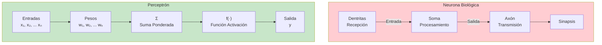
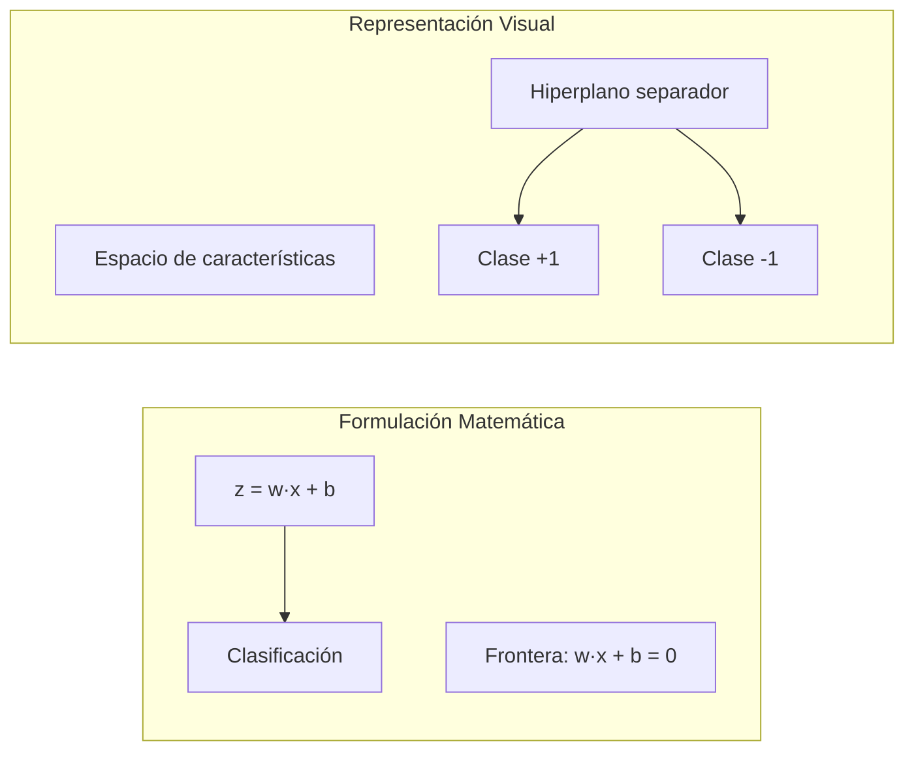
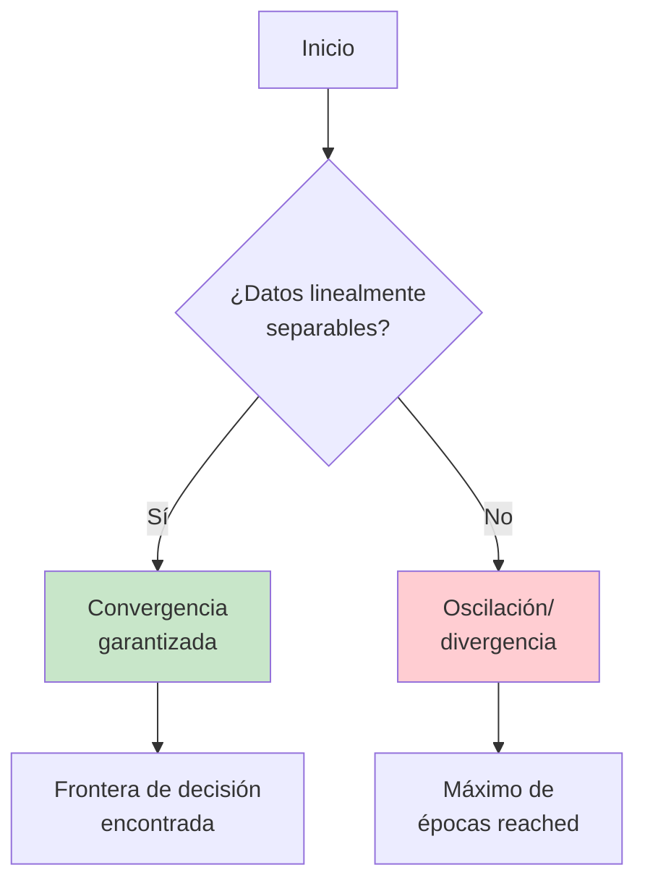
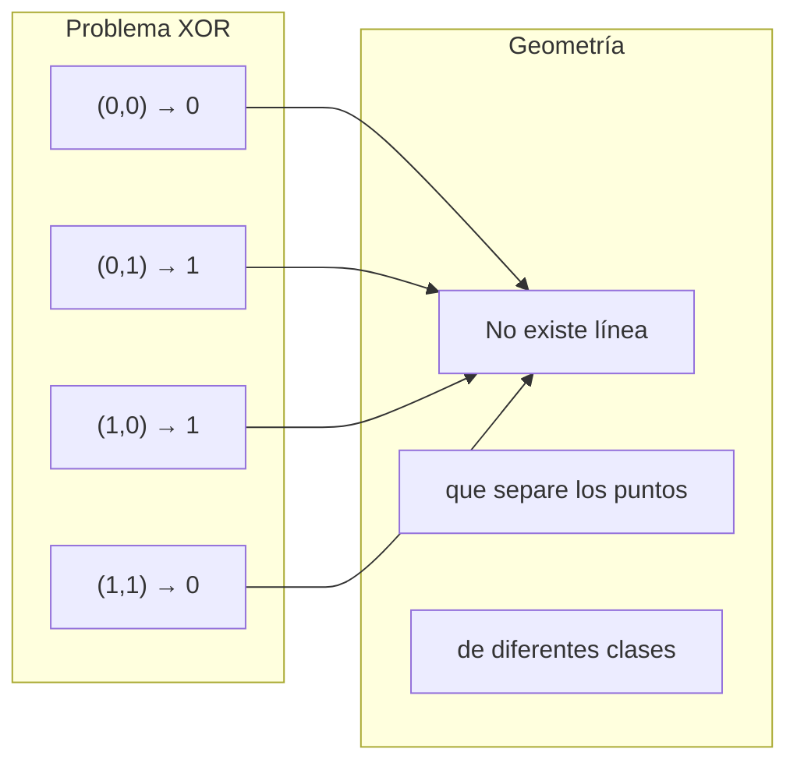
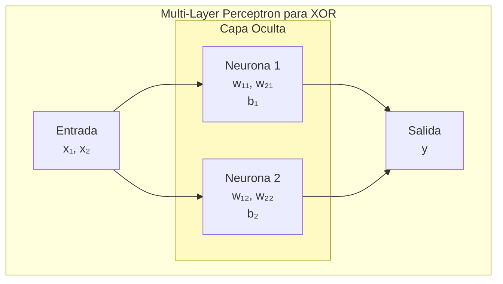

# CLASE 3: El Perceptrón - Neurona Artificial

## 📋 Información General

| Campo | Detalle |
|-------|---------|
| **Duración** | 4 horas (240 minutos) |
| **Modalidad** | Teórico-Práctico |
| **Prerrequisitos** | Clase 2 completada (álgebra lineal básica), conocimientos de Python |
| **Tecnología** | scikit-learn, NumPy, Matplotlib |

---

## 🎯 Objetivos de Aprendizaje

Al finalizar esta clase, el estudiante será capaz de:

1. **Comprender** la estructura matemática del perceptrón como modelo de neurona artificial
2. **Implementar** desde cero el algoritmo de aprendizaje del perceptrón
3. **Aplicar** funciones de activación threshold y sus variantes
4. **Analizar** las limitaciones fundamentales del perceptrón simple (problema XOR)
5. **Utilizar** implementaciones de scikit-learn para clasificadores lineales
6. **Visualizar** geométricamente las regiones de decisión de un perceptrón
7. **Comprender** la relación entre el perceptrón y las redes neuronales modernas

---

## 📚 Contenidos Detallados

### 3.1 Introducción: De la Neurona Biológica al Perceptrón

El perceptrón, propuesto por Frank Rosenblatt en 1958, representa el primer modelo computacional de una neurona artificial. Este modelo fue inspirado en el funcionamiento de las neuronas biológicas del cerebro humano, donde:

- Las **dentritas** reciben señales de otras neuronas
- El **cuerpo celular** (soma) procesa estas señales
- El **axón** transmite la señal de salida a otras neuronas



### 3.2 Estructura del Perceptrón

#### 3.2.1 Componentes Fundamentales

El perceptrón es un modelo de clasificación binaria lineal que consiste en:

1. **Entradas (x)**: Un vector de n características de entrada
2. **Pesos (w)**: Un vector de pesos sinápticos ajustables
3. **Bias (b)**: Un término de sesgo que permite desplazar la frontera de decisión
4. **Función de agregación**: Suma ponderada de entradas
5. **Función de activación**: Transforma la suma en salida binaria

Matemáticamente:

$$z = \sum_{i=1}^{n} w_i x_i + b = \mathbf{w}^T \mathbf{x} + b$$

$$y = f(z) = \begin{cases} 1 & \text{si } z \geq 0 \\ 0 & \text{si } z < 0 \end{cases}$$

#### 3.2.2 Representación Geométrica

La decisión del perceptrón puede interpretarse geométricamente como un hiperplano que separa el espacio en dos regiones:



### 3.3 Algoritmo de Aprendizaje del Perceptrón

#### 3.3.1 El Proceso de Entrenamiento

El algoritmo de aprendizaje del perceptrón es un proceso iterativo que ajusta los pesos para minimizar los errores de clasificación:

```python
"""
Implementación completa del Perceptrón desde cero
Incluye visualización y análisis detallado
"""

import numpy as np
import matplotlib.pyplot as plt
from matplotlib.colors import ListedColormap

class Perceptron:
    """
    Implementación del Perceptrón de Frank Rosenblatt (1958).
    
    El perceptrón aprende mediante un proceso iterativo simple:
    1. Inicializar pesos aleatoriamente
    2. Para cada muestra, calcular la predicción
    3. Si hay error, ajustar los pesos en la dirección correcta
    4. Repetir hasta convergencia o máximo de épocas
    
    Este algoritmo converge si los datos son linealmente separables.
    """
    
    def __init__(self, learning_rate=0.1, n_epochs=100, random_state=42):
        """
        Inicializa el perceptrón.
        
        Args:
            learning_rate: Tasa de aprendizaje (α)
            n_epochs: Número máximo de épocas
            random_state: Semilla para reproducibilidad
        """
        self.learning_rate = learning_rate
        self.n_epochs = n_epochs
        self.random_state = random_state
        self.weights = None
        self.bias = None
        self.history = []  # Guardar historial de entrenamiento
        
    def _init_weights(self, n_features):
        """Inicializa los pesos aleatoriamente."""
        np.random.seed(self.random_state)
        # Inicialización Xavier para mejor convergencia
        self.weights = np.random.randn(n_features) * np.sqrt(2.0 / n_features)
        self.bias = 0.0
        
    def activation(self, z):
        """
        Función de activación: Función escalón (step function).
        
        Returns:
            1 si z >= 0, 0 en caso contrario
        """
        return np.where(z >= 0, 1, 0)
    
    def predict(self, X):
        """
        Predice las etiquetas para las muestras X.
        
        Args:
            X: Array de shape (n_samples, n_features)
            
        Returns:
            Array de predictions de shape (n_samples,)
        """
        z = np.dot(X, self.weights) + self.bias
        return self.activation(z)
    
    def fit(self, X, y):
        """
        Entrena el perceptrón ajustando pesos y bias.
        
        Args:
            X: Array de shape (n_samples, n_features)
            y: Array de labels de shape (n_samples,)
            
        Returns:
            self
        """
        n_samples, n_features = X.shape
        self._init_weights(n_features)
        
        print("=" * 60)
        print("ENTRENAMIENTO DEL PERCEPTRÓN")
        print("=" * 60)
        
        for epoch in range(self.n_epochs):
            errors = 0
            epoch_loss = 0
            
            for idx, x_i in enumerate(X):
                # Paso 1: Calcular la predicción
                z = np.dot(x_i, self.weights) + self.bias
                y_pred = self.activation(z)
                
                # Paso 2: Calcular el error
                error = y[idx] - y_pred
                
                # Paso 3: Actualizar pesos si hay error
                if error != 0:
                    # w = w + α * error * x
                    # b = b + α * error
                    self.weights += self.learning_rate * error * x_i
                    self.bias += self.learning_rate * error
                    errors += 1
                    epoch_loss += abs(error)
            
            # Guardar historial
            self.history.append({
                'epoch': epoch + 1,
                'errors': errors,
                'weights': self.weights.copy(),
                'bias': self.bias
            })
            
            if (epoch + 1) % 10 == 0:
                print(f"Época {epoch + 1:3d}: Errores = {errors:4d}")
            
            # Convergencia: si no hay errores, detener
            if errors == 0:
                print(f"\n✓ Convergencia alcanzada en época {epoch + 1}")
                break
        
        return self
    
    def score(self, X, y):
        """Calcula la precisión del modelo."""
        predictions = self.predict(X)
        return np.mean(predictions == y)
    
    def get_decision_boundary(self):
        """
        Retorna los parámetros de la frontera de decisión.
        
        La frontera está definida por: w₁x₁ + w₂x₂ + b = 0
        Despejando: x₂ = -(w₁x₁ + b) / w₂
        """
        if self.weights is None:
            return None
        
        def boundary(x1):
            if self.weights[1] == 0:
                return None
            return -(self.weights[0] * x1 + self.bias) / self.weights[1]
        
        return boundary


def ejemplo_and():
    """
    Ejemplo resuelto: Problema AND
    """
    print("\n" + "=" * 60)
    print("EJEMPLO RESUELTO: PUERTA LÓGICA AND")
    print("=" * 60)
    
    # Datos de entrenamiento: Puerta AND
    X = np.array([
        [0, 0],
        [0, 1],
        [1, 0],
        [1, 1]
    ])
    y = np.array([0, 0, 0, 1])  # AND: solo 1,1 da 1
    
    print("\nDatos de entrenamiento:")
    print("X (entradas):")
    for i, row in enumerate(X):
        print(f"  {row} -> y = {y[i]}")
    
    # Crear y entrenar perceptrón
    perceptron = Perceptron(learning_rate=0.1, n_epochs=100)
    perceptron.fit(X, y)
    
    print(f"\nPesos finales: w = {perceptron.weights}")
    print(f"Bias final: b = {perceptron.bias}")
    print(f"Precisión: {perceptron.score(X, y) * 100}%")
    
    # Predicciones
    print("\nPredicciones:")
    for i, row in enumerate(X):
        pred = perceptron.predict(row.reshape(1, -1))[0]
        print(f"  AND({row[0]}, {row[1]}) = {pred} (esperado: {y[i]})")


def ejemplo_or():
    """
    Ejemplo resuelto: Problema OR
    """
    print("\n" + "=" * 60)
    print("EJEMPLO RESUELTO: PUERTA LÓGICA OR")
    print("=" * 60)
    
    X = np.array([
        [0, 0],
        [0, 1],
        [1, 0],
        [1, 1]
    ])
    y = np.array([0, 1, 1, 1])  # OR: cualquier 1 da 1
    
    perceptron = Perceptron(learning_rate=0.1, n_epochs=100)
    perceptron.fit(X, y)
    
    print(f"\nPesos finales: {perceptron.weights}")
    print(f"Bias: {perceptron.bias}")
    print(f"Precisión: {perceptron.score(X, y) * 100}%")
    
    print("\nPredicciones:")
    for i, row in enumerate(X):
        pred = perceptron.predict(row.reshape(1, -1))[0]
        print(f"  OR({row[0]}, {row[1]}) = {pred}")


if __name__ == "__main__":
    ejemplo_and()
    ejemplo_or()
```

#### 3.3.2 Convergencia del Perceptrón

El teorema de convergencia del perceptrón (Block, 1962; Novikoff, 1963) establece:

> Si los datos son linealmente separables, el algoritmo del perceptrón converge en un número finito de pasos.



### 3.4 Funciones de Activación

#### 3.4.1 Tipos de Funciones de Activación

Las funciones de activación transforman la suma ponderada en una salida útil:

```python
import numpy as np
import matplotlib.pyplot as plt

def plot_activation_functions():
    """Visualiza las principales funciones de activación."""
    
    x = np.linspace(-5, 5, 200)
    
    # Definir funciones
    functions = {
        'Step (Escalón)': lambda z: np.where(z >= 0, 1, 0),
        'Sign': lambda z: np.where(z >= 0, 1, -1),
        'Sigmoid': lambda z: 1 / (1 + np.exp(-z)),
        'Tanh': lambda z: np.tanh(z),
        'ReLU': lambda z: np.maximum(0, z),
        'Leaky ReLU': lambda z: np.where(z > 0, z, 0.01 * z),
    }
    
    fig, axes = plt.subplots(2, 3, figsize=(15, 10))
    axes = axes.flatten()
    
    for ax, (name, func) in zip(axes, functions.items()):
        y = func(x)
        ax.plot(x, y, 'b-', linewidth=2)
        ax.axhline(y=0, color='k', linewidth=0.5)
        ax.axvline(x=0, color='k', linewidth=0.5)
        ax.set_title(name, fontsize=14)
        ax.set_xlabel('z')
        ax.set_ylabel('f(z)')
        ax.grid(True, alpha=0.3)
        ax.set_ylim(-1.5, 1.5)
    
    plt.tight_layout()
    plt.savefig('activation_functions.png', dpi=150)
    plt.show()


def activation_functions_demo():
    """Demuestra las funciones de activación con código."""
    
    z = np.array([-2, -1, 0, 1, 2])
    
    print("Funciones de Activación para z =", z)
    print("=" * 50)
    
    print("\n1. Step (Escalón unitario):")
    print(f"   f(z) = 1 si z >= 0, 0 en caso contrario")
    step = np.where(z >= 0, 1, 0)
    print(f"   Resultado: {step}")
    
    print("\n2. Sigmoid:")
    print(f"   f(z) = 1 / (1 + e^(-z))")
    sigmoid = 1 / (1 + np.exp(-z))
    print(f"   Resultado: {np.round(sigmoid, 4)}")
    
    print("\n3. Tangente Hiperbólica (tanh):")
    print(f"   f(z) = (e^z - e^(-z)) / (e^z + e^(-z))")
    tanh = np.tanh(z)
    print(f"   Resultado: {np.round(tanh, 4)}")
    
    print("\n4. ReLU (Rectified Linear Unit):")
    print(f"   f(z) = max(0, z)")
    relu = np.maximum(0, z)
    print(f"   Resultado: {relu}")
    
    print("\n5. Leaky ReLU:")
    print(f"   f(z) = z si z > 0, 0.01*z en caso contrario")
    leaky = np.where(z > 0, z, 0.01 * z)
    print(f"   Resultado: {leaky}")


if __name__ == "__main__":
    activation_functions_demo()
    plot_activation_functions()
```

### 3.5 Limitaciones del Perceptrón: El Problema XOR

#### 3.5.1 ¿Por qué el Perceptrón Simple No Puede Resolver XOR?

El problema XOR (OR exclusivo) es fundamental en la historia de las redes neuronales. Su importancia radica en que demuestra las limitaciones del perceptrón simple:



```python
def problema_xor():
    """
    Demuestra que el perceptrón simple NO puede resolver XOR.
    """
    print("=" * 60)
    print("PROBLEMA XOR: LIMITACIÓN DEL PERCEPTRÓN SIMPLE")
    print("=" * 60)
    
    # Datos XOR
    X = np.array([
        [0, 0],
        [0, 1],
        [1, 0],
        [1, 1]
    ])
    y = np.array([0, 1, 1, 0])  # XOR: salida 1 solo si inputs diferentes
    
    print("\nDatos XOR:")
    for row, label in zip(X, y):
        print(f"  {row} -> {label}")
    
    print("\nIntentar entrenar perceptrón...")
    perceptron = Perceptron(learning_rate=0.1, n_epochs=1000)
    perceptron.fit(X, y)
    
    print(f"\nPrecisión: {perceptron.score(X, y) * 100}%")
    print("El perceptrón NO puede alcanzar 100% de precisión para XOR")
    print("\nEsto demostró que se necesitaban REDES de perceptrones")
    print("(mlp - Multi-Layer Perceptron) para resolver problemas no lineales")


def visualizar_regiones_decision():
    """Visualiza las regiones de decisión para diferentes problemas."""
    
    fig, axes = plt.subplots(1, 3, figsize=(15, 5))
    
    problemas = {
        'AND': (np.array([[0,0],[0,1],[1,0],[1,1]]), np.array([0,0,0,1])),
        'OR': (np.array([[0,0],[0,1],[1,0],[1,1]]), np.array([0,1,1,1])),
        'XOR': (np.array([[0,0],[0,1],[1,0],[1,1]]), np.array([0,1,1,0])),
    }
    
    for ax, (nombre, (X, y)) in zip(axes, problemas.items()):
        # Crear grid para visualizar
        x1_min, x1_max = -0.5, 1.5
        x2_min, x2_max = -0.5, 1.5
        xx1, xx2 = np.meshgrid(np.linspace(x1_min, x1_max, 100),
                                np.linspace(x2_min, x2_max, 100))
        
        # Para visualización, usar perceptrón (solo funciona para AND/OR)
        if nombre != 'XOR':
            p = Perceptron(learning_rate=0.1, n_epochs=100)
            p.fit(X, y)
            grid = np.c_[xx1.ravel(), xx2.ravel()]
            Z = p.predict(grid).reshape(xx1.shape)
            ax.contourf(xx1, xx2, Z, alpha=0.3, cmap='RdYlGn')
        
        # Plot points
        colors = ['red' if label == 0 else 'green' for label in y]
        ax.scatter(X[:, 0], X[:, 1], c=colors, s=200, edgecolors='black')
        
        for i, (x1, x2) in enumerate(X):
            ax.annotate(str(y[i]), (x1, x2), fontsize=14, ha='center', va='center')
        
        ax.set_xlim(x1_min, x1_max)
        ax.set_ylim(x2_min, x2_max)
        ax.set_xlabel('x₁')
        ax.set_ylabel('x₂')
        ax.set_title(f'Problema {nombre}')
        ax.grid(True, alpha=0.3)


if __name__ == "__main__":
    problema_xor()
    visualizar_regiones_decision()
```

#### 3.5.2 La Solución: Perceptrones Multicapa (MLP)

Para resolver XOR, necesitamos al menos una capa oculta:



### 3.6 Implementación con scikit-learn

```python
from sklearn.linear_model import Perceptron as SklearnPerceptron
from sklearn.datasets import make_classification
from sklearn.model_selection import train_test_split

def usar_sklearn():
    """Ejemplo usando scikit-learn."""
    
    print("=" * 60)
    print("USANDO SCIKIT-LEARN")
    print("=" * 60)
    
    # Crear dataset linealmente separable
    X, y = make_classification(
        n_samples=200,
        n_features=2,
        n_redundant=0,
        n_informative=2,
        n_clusters_per_class=1,
        flip_y=0,
        random_state=42
    )
    
    X_train, X_test, y_train, y_test = train_test_split(
        X, y, test_size=0.2, random_state=42
    )
    
    # Crear y entrenar perceptrón
    perc = SklearnPerceptron(
        max_iter=1000,
        tol=1e-3,
        learning_rate='constant',
        eta0=0.1,
        random_state=42
    )
    perc.fit(X_train, y_train)
    
    # Evaluar
    train_score = perc.score(X_train, y_train)
    test_score = perc.score(X_test, y_test)
    
    print(f"Precisión entrenamiento: {train_score * 100:.2f}%")
    print(f"Precisión test: {test_score * 100:.2f}%")
    print(f"Pesos: {perc.coef_}")
    print(f"Bias: {perc.intercept_}")
    
    # Probar con datos no linealmente separables
    print("\n" + "=" * 60)
    print("PROBLEMA NO LINEALMENTE SEPARABLE")
    print("=" * 60)
    
    # Crear dataset circular (no linealmente separable)
    from sklearn.datasets import make_circles
    X_circ, y_circ = make_circles(n_samples=200, noise=0.1, factor=0.5, random_state=42)
    
    perc_circ = SklearnPerceptron(max_iter=1000)
    perc_circ.fit(X_circ, y_circ)
    
    print(f"Precisión en datos circulares: {perc_circ.score(X_circ, y_circ) * 100:.2f}%")
    print("El perceptrón simple NO puede separar círculos!")
    print("Se necesitan más capas (MLP)")


if __name__ == "__main__":
    usar_sklearn()
```

---

## 🔬 Actividades de Laboratorio

### Laboratorio 1: Implementación del Perceptrón desde Cero

**Duración**: 60 minutos

**Objetivo**: Implementar un perceptrón funcional que pueda resolver problemas linealmente separables.

**Pasos**:
1. Crear una clase Perceptron con los métodos: `__init__`, `fit`, `predict`, `activation`
2. Probar con los datos AND, OR, NOT
3. Visualizar la evolución de los pesos durante el entrenamiento
4. Medir el número de épocas hasta convergencia

```python
# Solución del laboratorio
import numpy as np

class PerceptronLab:
    def __init__(self, learning_rate=0.1, n_epochs=100):
        self.lr = learning_rate
        self.n_epochs = n_epochs
        self.weights = None
        self.bias = None
        
    def fit(self, X, y):
        n_features = X.shape[1]
        self.weights = np.zeros(n_features)
        self.bias = 0
        
        for epoch in range(self.n_epochs):
            for x_i, y_i in zip(X, y):
                z = np.dot(x_i, self.weights) + self.bias
                y_pred = 1 if z >= 0 else 0
                
                error = y_i - y_pred
                if error != 0:
                    self.weights += self.lr * error * x_i
                    self.bias += self.lr * error
        
        return self
    
    def predict(self, X):
        z = np.dot(X, self.weights) + self.bias
        return np.where(z >= 0, 1, 0)

# Probar
X_and = np.array([[0,0], [0,1], [1,0], [1,1]])
y_and = np.array([0, 0, 0, 1])

p = PerceptronLab()
p.fit(X_and, y_and)
print(f"AND: {p.predict(X_and)}")
```

### Laboratorio 2: Análisis del Problema XOR

**Duración**: 45 minutos

**Objetivo**: Demostrar visualmente por qué el perceptrón simple no puede resolver XOR y cómo un MLP sí puede.

```python
from sklearn.neural_network import MLPClassifier

# Datos XOR
X_xor = np.array([[0,0], [0,1], [1,0], [1,1]])
y_xor = np.array([0, 1, 1, 0])

# Perceptrón simple (1 capa) - NO funciona
p_simple = SklearnPerceptron(max_iter=1000)
p_simple.fit(X_xor, y_xor)
print(f"Perceptrón simple: {p_simple.predict(X_xor)}")

# MLP (con capa oculta) - SÍ funciona
mlp = MLPClassifier(hidden_layer_sizes=(2,), max_iter=1000, random_state=42)
mlp.fit(X_xor, y_xor)
print(f"MLP: {mlp.predict(X_xor)}")
```

### Laboratorio 3: Visualización de Regiones de Decisión

**Duración**: 60 minutos

Crear visualizaciones de las regiones de decisión para diferentes problemas de clasificación.

---

## 🧪 Ejercicios Prácticos Resueltos

### Ejercicio 1: Implementar Perceptrón con Diferentes Tasas de Aprendizaje

```python
"""
Ejercicio 1: Comparar diferentes tasas de aprendizaje
"""

import numpy as np
import matplotlib.pyplot as plt

def comparar_tasas_aprendizaje():
    """Compara el efecto de diferentes learning rates."""
    
    # Datos AND
    X = np.array([[0, 0], [0, 1], [1, 0], [1, 1]])
    y = np.array([0, 0, 0, 1])
    
    learning_rates = [0.01, 0.1, 0.5, 1.0]
    
    fig, axes = plt.subplots(2, 2, figsize=(12, 10))
    axes = axes.flatten()
    
    resultados = {}
    
    for ax, lr in zip(axes, learning_rates):
        # Entrenar perceptrón
        p = Perceptron(learning_rate=lr, n_epochs=50)
        
        # Guardar errores por época
        errors_history = []
        for epoch in range(50):
            errors = 0
            for x_i, y_i in zip(X, y):
                z = np.dot(x_i, p.weights) if p.weights is not None else 0
                y_pred = 0
                if p.weights is not None:
                    z = np.dot(x_i, p.weights) + p.bias
                    y_pred = 1 if z >= 0 else 0
                
                if y_pred != y_i:
                    errors += 1
            
            # Entrenar una época
            p.fit(X, y)
            errors_history.append(errors)
        
        ax.plot(errors_history, 'b-', linewidth=2)
        ax.set_title(f'Learning Rate = {lr}')
        ax.set_xlabel('Época')
        ax.set_ylabel('Errores')
        ax.grid(True, alpha=0.3)
        
        resultados[lr] = errors_history[-1]
    
    plt.tight_layout()
    plt.savefig('learning_rates_comparison.png')
    plt.show()
    
    print("Errores finales por learning rate:")
    for lr, errors in resultados.items():
        print(f"  LR={lr}: {errors} errores")


if __name__ == "__main__":
    comparar_tasas_aprendizaje()
```

### Ejercicio 2: Clasificación de Flores Iris con Perceptrón

```python
"""
Ejercicio 2: Clasificación de Iris con Perceptrón
"""

from sklearn.datasets import load_iris
from sklearn.preprocessing import StandardScaler

def ejercicio_iris():
    """Clasificar iris usando perceptrón."""
    
    # Cargar datos
    iris = load_iris()
    X = iris.data
    y = iris.target
    
    # Usar solo 2 clases (setosa vs versicolor) para problema lineal
    mask = y < 2
    X_binary = X[mask]
    y_binary = y[mask]
    
    # Normalizar datos
    scaler = StandardScaler()
    X_scaled = scaler.fit_transform(X_binary)
    
    # Entrenar perceptrón
    from sklearn.model_selection import train_test_split
    X_train, X_test, y_train, y_test = train_test_split(
        X_scaled, y_binary, test_size=0.3, random_state=42
    )
    
    p = SklearnPerceptron(max_iter=1000)
    p.fit(X_train, y_train)
    
    print(f"Precisión entrenamiento: {p.score(X_train, y_train) * 100:.2f}%")
    print(f"Precisión test: {p.score(X_test, y_test) * 100:.2f}%")
    print(f"\nClases: {iris.target_names}")
    print(f"Coeficientes shape: {p.coef_.shape}")


if __name__ == "__main__":
    ejercicio_iris()
```

---

## 📚 Referencias Externas

### Documentación y Tutoriales

1. **Scikit-learn Perceptron**
   - URL: https://scikit-learn.org/stable/modules/linear_model.html#perceptron

2. **Neural Networks and Learning Machines - Simon Haykin**
   - Capítulos 1-3: Fundamentos del perceptrón

3. **Pattern Classification and Scene Analysis - Duda & Hart**
   - Sección sobre perceptrones

### Papers Fundamentales

4. **Rosenblatt, F. (1958).** "The Perceptron: A Probabilistic Model for Information Storage and Organization in the Brain."
   - Psychological Review, 65(6), 386-408.
   - URL: https://psycnet.apa.org/record/1959-09854-001

5. **Minsky, M. & Papert, S. (1969).** *Perceptrons: An Introduction to Computational Geometry.*
   - MIT Press. (El libro que demostró las limitaciones del perceptrón)

6. **Block, H.D. (1962).** "The Perceptron: A Model for Brain Functioning I."
   - Reviews of Modern Physics, 34(1), 123-135.

### Recursos Online

7. **3Blue1Brown - Neural Networks**
   - URL: https://www.3blue1brown.com/topics/neural-networks
   - Excelentes visualizaciones de cómo funcionan las redes neuronales

8. **Stanford CS231n - Neural Networks**
   - URL: https://cs231n.github.io/neural-networks-1/
   - Material detallado sobre redes neuronales

---

## 📝 Resumen de Puntos Clave

### Conceptos Fundamentales

1. **El Perceptrón** es la unidad básica de una red neuronal:
   - Recibe múltiples entradas
   - Cada entrada tiene un peso asociado
   - Calcula una suma ponderada + bias
   - Aplica una función de activación
   - Produce una salida binaria

2. **El algoritmo de aprendizaje** del perceptrón:
   - Inicializa pesos aleatoriamente
   - Para cada ejemplo, calcula predicción
   - Si hay error, ajusta: w = w + α * error * x
   - Repite hasta convergencia o máximo de épocas

3. **Convergencia garantizada**: Si los datos son linealmente separables, el perceptrón converge en número finito de pasos (Teorema de Novikoff).

4. **Limitaciones fundamentales**:
   - Solo puede resolver problemas linealmente separables
   - No puede resolver XOR (problema no lineal)
   - Necesita múltiples capas (MLP) para problemas complejos

5. **Funciones de activación** comunes:
   - Step (escalón): simple pero no differentiable
   - Sigmoid: smooth,output [0,1]
   - ReLU: popular en deep learning moderno

6. ** scikit-learn** proporciona `Perceptron` y `MLPClassifier`:
   - Perceptron: solo para problemas lineales
   - MLPClassifier: para problemas no lineales

---

## 📋 Tarea Pre-Clase 4

Antes de la próxima clase, los estudiantes deben:

1. **Lectura recomendada**:
   - Revisar funciones de activación en detalle
   - Estudiar la derivada de funciones sigmoid, tanh, ReLU

2. **Ejercicio preparatorio**:
   - Calcular manualmente la backpropagation para un perceptrón de 2 capas

3. **Investigar**:
   - ¿Qué es el problema del gradiente vanishing?
   - ¿Por qué ReLU ayuda a mitigarlo?

---

*Fin de la Clase 3*