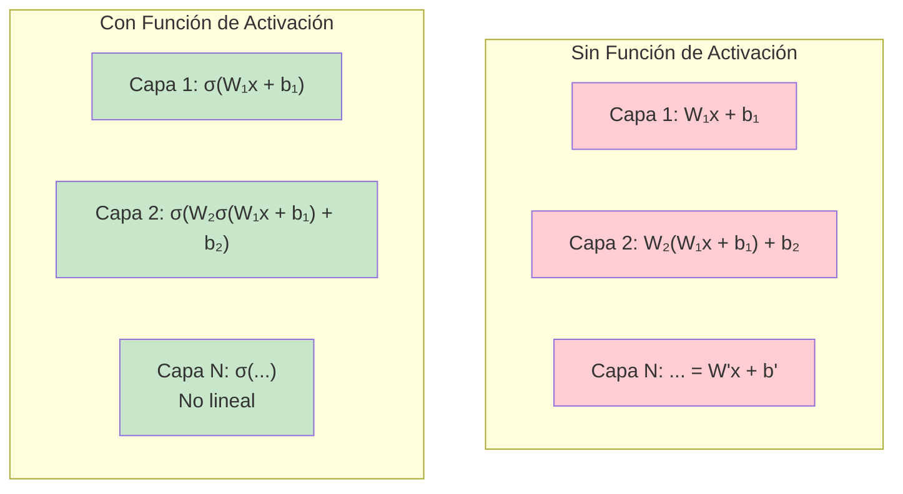
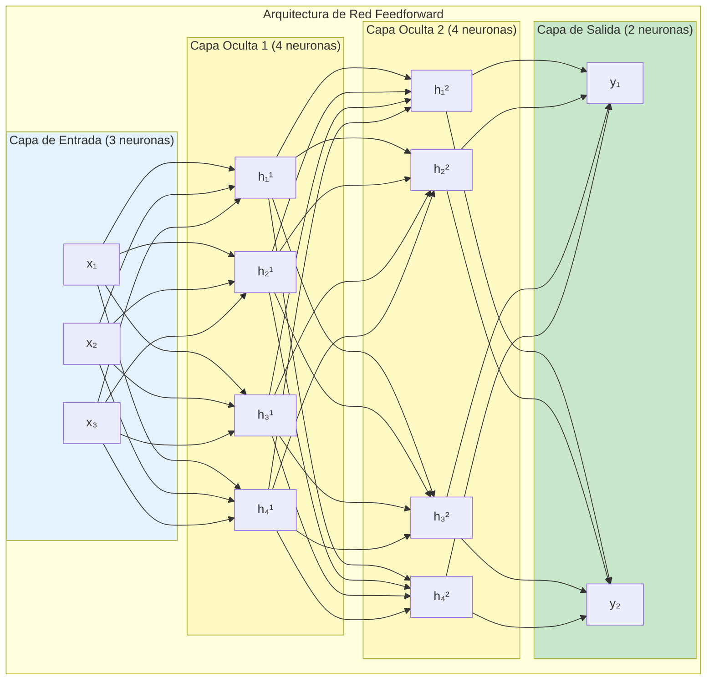

# CLASE 4: Funciones de Activación y Redes Feedforward

## 📋 Información General

| Campo | Detalle |
|-------|---------|
| **Duración** | 4 horas (240 minutos) |
| **Modalidad** | Teórico-Práctico |
| **Prerrequisitos** | Clase 3 completada (perceptrón), conocimientos de Python, NumPy |
| **Tecnología** | NumPy, PyTorch, Matplotlib |

---

## 🎯 Objetivos de Aprendizaje

Al finalizar esta clase, el estudiante será capaz de:

1. **Comprender** las propiedades matemáticas de las funciones de activación (diferenciabilidad, monotonía)
2. **Implementar** y comparar sigmoid, tanh, ReLU, Leaky ReLU y ELU
3. **Diseñar** arquitecturas de redes feedforward multicapa
4. **Implementar** la propagación hacia adelante (forward propagation)
5. **Calcular** y visualizar gradientes en redes neuronales
6. **Utilizar** PyTorch para crear redes neuronales feedforward
7. **Diagnosticar** problemas comunes como el vanishing gradient

---

## 📚 Contenidos Detallados

### 4.1 Introducción: ¿Por Qué Necesitamos Funciones de Activación?

Las funciones de activación son el corazón no lineal de las redes neuronales. Sin ellas, una red feedforward sería equivalente a un simple modelo lineal, sin importar cuántas capas tenga.



### 4.2 Análisis Detallado de Funciones de Activación

#### 4.2.1 Sigmoid (Función Logística)

La función sigmoid transforma cualquier valor real en el rango (0, 1):

$$\sigma(z) = \frac{1}{1 + e^{-z}}$$

```python
"""
Análisis completo de la función Sigmoid
"""

import numpy as np
import matplotlib.pyplot as plt

class FuncionSigmoid:
    """
    Implementación detallada de la función sigmoid con derivadas.
    """
    
    @staticmethod
    def sigmoid(z):
        """
        Función sigmoid: σ(z) = 1 / (1 + e^(-z))
        
        Características:
        - Output en rango (0, 1)
        - Forma de 'S' (sigmoide)
        - Probabilidad interpretación
        """
        # Clip para evitar overflow numérico
        z = np.clip(z, -500, 500)
        return 1 / (1 + np.exp(-z))
    
    @staticmethod
    def sigmoid_derivative(z):
        """
        Derivada de sigmoid: σ'(z) = σ(z) * (1 - σ(z))
        
        Esta fórmula es muy útil computacionalmente porque
        podemos calcular la derivada usando solo la salida.
        """
        s = FuncionSigmoid.sigmoid(z)
        return s * (1 - s)
    
    @staticmethod
    def plot_sigmoid():
        """Visualiza sigmoid y su derivada."""
        
        z = np.linspace(-10, 10, 200)
        
        fig, (ax1, ax2) = plt.subplots(1, 2, figsize=(14, 5))
        
        # Sigmoid
        y = FuncionSigmoid.sigmoid(z)
        ax1.plot(z, y, 'b-', linewidth=2)
        ax1.axhline(y=0, color='k', linewidth=0.5)
        ax1.axvline(x=0, color='k', linewidth=0.5)
        ax1.axhline(y=1, color='r', linewidth=0.5, linestyle='--')
        ax1.axhline(y=0, color='r', linewidth=0.5, linestyle='--')
        ax1.set_xlabel('z')
        ax1.set_ylabel('σ(z)')
        ax1.set_title('Función Sigmoid')
        ax1.grid(True, alpha=0.3)
        
        # Anotaciones
        ax1.annotate('σ(0) = 0.5', xy=(0, 0.5), xytext=(2, 0.7),
                    arrowprops=dict(arrowstyle='->'), fontsize=10)
        
        # Derivada
        dy = FuncionSigmoid.sigmoid_derivative(z)
        ax2.plot(z, dy, 'g-', linewidth=2)
        ax2.axhline(y=0, color='k', linewidth=0.5)
        ax2.axvline(x=0, color='k', linewidth=0.5)
        ax2.set_xlabel('z')
        ax2.set_ylabel("σ'(z)")
        ax2.set_title('Derivada de Sigmoid')
        ax2.grid(True, alpha=0.3)
        
        # Máximo de la derivada
        max_idx = np.argmax(dy)
        ax2.annotate(f"Máx en z=0: {dy[max_idx]:.3f}", 
                    xy=(0, dy[max_idx]), xytext=(3, 0.2),
                    arrowprops=dict(arrowstyle='->'), fontsize=10)
        
        plt.tight_layout()
        plt.savefig('sigmoid_analysis.png', dpi=150)
        plt.show()


def analizar_sigmoid():
    """Análisis numérico de sigmoid."""
    
    print("=" * 60)
    print("ANÁLISIS DE LA FUNCIÓN SIGMOID")
    print("=" * 60)
    
    valores = np.array([-10, -5, -2, -1, 0, 1, 2, 5, 10])
    
    print("\n{:<10} {:<15} {:<15}".format("z", "σ(z)", "σ'(z)"))
    print("-" * 40)
    
    for z in valores:
        sig = FuncionSigmoid.sigmoid(z)
        dsig = FuncionSigmoid.sigmoid_derivative(z)
        print(f"{z:<10} {sig:<15.6f} {dsig:<15.6f}")
    
    print("\nPropiedades clave:")
    print("  - Límite cuando z → -∞: 0")
    print("  - Límite cuando z → +∞: 1")
    print("  - σ(0) = 0.5")
    print("  - Máximo de derivada: 0.25 en z=0")
    print("  - Derivada máxima = 0.25 → problema de gradiente vanishing")


if __name__ == "__main__":
    FuncionSigmoid.plot_sigmoid()
    analizar_sigmoid()
```

#### 4.2.2 Tangente Hiperbólica (tanh)

La función tanh es una versión escalada y desplazada de sigmoid:

$$\tanh(z) = \frac{e^z - e^{-z}}{e^z + e^{-z}} = 2\sigma(2z) - 1$$

```python
def analizar_tanh():
    """Análisis de la función tangente hiperbólica."""
    
    print("=" * 60)
    print("ANÁLISIS DE LA FUNCIÓN TANH")
    print("=" * 60)
    
    z = np.linspace(-10, 10, 200)
    
    y = np.tanh(z)
    dy = 1 - y**2  # Derivada de tanh
    
    fig, (ax1, ax2) = plt.subplots(1, 2, figsize=(14, 5))
    
    ax1.plot(z, y, 'b-', linewidth=2)
    ax1.axhline(y=0, color='k', linewidth=0.5)
    ax1.axvline(x=0, color='k', linewidth=0.5)
    ax1.axhline(y=1, color='r', linewidth=0.5, linestyle='--')
    ax1.axhline(y=-1, color='r', linewidth=0.5, linestyle='--')
    ax1.set_xlabel('z')
    ax1.set_ylabel('tanh(z)')
    ax1.set_title('Función Tangente Hiperbólica')
    ax1.grid(True, alpha=0.3)
    
    ax2.plot(z, dy, 'g-', linewidth=2)
    ax2.axhline(y=0, color='k', linewidth=0.5)
    ax2.axvline(x=0, color='k', linewidth=0.5)
    ax2.set_xlabel('z')
    ax2.set_ylabel("tanh'(z)")
    ax2.set_title('Derivada de tanh')
    ax2.grid(True, alpha=0.3)
    
    plt.tight_layout()
    plt.savefig('tanh_analysis.png', dpi=150)
    plt.show()
    
    print("\nPropiedades de tanh:")
    print("  - Output en rango (-1, 1)")
    print("  - Centrada en 0 (mejor que sigmoid)")
    print("  - Derivada máxima: 1 en z=0")
    print("  - Sigue teniendo problema de gradiente vanishing")


analizar_tanh()
```

#### 4.2.3 ReLU (Rectified Linear Unit)

ReLU ha revolucionado el deep learning por su simplicidad y efectividad:

$$f(z) = \max(0, z)$$

```python
def analizar_relu():
    """Análisis de ReLU y sus variantes."""
    
    print("=" * 60)
    print("ANÁLISIS DE ReLU Y VARIANTES")
    print("=" * 60)
    
    z = np.linspace(-5, 5, 200)
    
    # ReLU estándar
    relu = np.maximum(0, z)
    drelu = np.where(z > 0, 1, 0)
    
    # Leaky ReLU
    leaky = np.where(z > 0, z, 0.01 * z)
    dleaky = np.where(z > 0, 1, 0.01)
    
    # ELU (Exponential Linear Unit)
    alpha = 1.0
    elu = np.where(z > 0, z, alpha * (np.exp(z) - 1))
    delu = np.where(z > 0, 1, alpha * np.exp(z))
    
    fig, axes = plt.subplots(2, 3, figsize=(15, 10))
    
    funciones = [
        ('ReLU', relu, drelu),
        ('Leaky ReLU (α=0.01)', leaky, dleaky),
        ('ELU (α=1)', elu, delu)
    ]
    
    for i, (name, y, dy) in enumerate(funciones):
        axes[0, i].plot(z, y, 'b-', linewidth=2)
        axes[0, i].axhline(y=0, color='k', linewidth=0.5)
        axes[0, i].axvline(x=0, color='k', linewidth=0.5)
        axes[0, i].set_title(f'{name}')
        axes[0, i].grid(True, alpha=0.3)
        
        axes[1, i].plot(z, dy, 'g-', linewidth=2)
        axes[1, i].axhline(y=0, color='k', linewidth=0.5)
        axes[1, i].axvline(x=0, color='k', linewidth=0.5)
        axes[1, i].set_title(f'Derivada de {name}')
        axes[1, i].grid(True, alpha=0.3)
    
    plt.tight_layout()
    plt.savefig('relu_variants.png', dpi=150)
    plt.show()
    
    print("\nComparación de funciones de activación:")
    print("=" * 60)
    print("\n1. ReLU (Rectified Linear Unit):")
    print("   f(z) = max(0, z)")
    print("   Ventajas: Simple, eficiente, reduce vanishing gradient")
    print("   Desventajas: 'Dying ReLU' - neuronas que siempre dan 0")
    print("\n2. Leaky ReLU:")
    print("   f(z) = z si z > 0, 0.01*z si z ≤ 0")
    print("   Ventajas: Evita neuronas muertas")
    print("   Desventajas: Pequeño溢出的 parámetro fijo")
    print("\n3. ELU (Exponential Linear Unit):")
    print("   f(z) = z si z > 0, α*(e^z - 1) si z ≤ 0")
    print("   Ventajas: Más suave, mejor gradiente para z<0")
    print("   Desventajas: Más costoso computacionalmente")


analizar_relu()
```

### 4.3 Arquitectura de Redes Feedforward

#### 4.3.1 Estructura General

Una red feedforward (también llamada MLP - Multi-Layer Perceptron) consiste en:

- **Capa de entrada**: Recibe los datos crudos
- **Capas ocultas**: Procesan la información (pueden ser una o muchas)
- **Capa de salida**: Produce la predicción final



#### 4.3.2 Propagación Hacia Adelante (Forward Propagation)

La propagación hacia adelante calcula la salida de la red capa por capa:

```python
"""
Implementación completa de Forward Propagation
"""

import numpy as np

class RedFeedforward:
    """
    Implementación de una red feedforward desde cero.
    
    La red realiza las siguientes operaciones para cada capa:
    1. Calcular z[l] = W[l] * a[l-1] + b[l]  (pre-activación)
    2. Calcular a[l] = σ(z[l])                (activación)
    """
    
    def __init__(self, layer_sizes, activation='relu'):
        """
        Inicializa la red feedforward.
        
        Args:
            layer_sizes: Lista con el número de neuronas por capa
                         ej: [3, 4, 4, 2] = entrada:3, ocultas:4,4, salida:2
            activation: Función de activación ('relu', 'sigmoid', 'tanh')
        """
        self.layer_sizes = layer_sizes
        self.n_layers = len(layer_sizes) - 1
        self.activation_name = activation
        
        # Inicializar pesos y bias
        self.weights = []
        self.biases = []
        
        for i in range(self.n_layers):
            # Inicialización Xavier/Glorot
            n_in = layer_sizes[i]
            n_out = layer_sizes[i + 1]
            
            # Xavier initialization
            limit = np.sqrt(6.0 / (n_in + n_out))
            W = np.random.uniform(-limit, limit, (n_in, n_out))
            b = np.zeros((1, n_out))
            
            self.weights.append(W)
            self.biases.append(b)
        
        # Seleccionar función de activación
        self.activation_func, self.activation_deriv = self._get_activation(activation)
    
    def _get_activation(self, name):
        """Retorna la función de activación y su derivada."""
        activations = {
            'sigmoid': (self._sigmoid, self._sigmoid_derivative),
            'tanh': (self._tanh, self._tanh_derivative),
            'relu': (self._relu, self._relu_derivative),
            'leaky_relu': (self._leaky_relu, self._leaky_relu_derivative),
        }
        return activations.get(name, (self._relu, self._relu_derivative))
    
    @staticmethod
    def _sigmoid(z):
        z = np.clip(z, -500, 500)
        return 1 / (1 + np.exp(-z))
    
    @staticmethod
    def _sigmoid_derivative(z):
        s = RedFeedforward._sigmoid(z)
        return s * (1 - s)
    
    @staticmethod
    def _tanh(z):
        return np.tanh(z)
    
    @staticmethod
    def _tanh_derivative(z):
        return 1 - np.tanh(z) ** 2
    
    @staticmethod
    def _relu(z):
        return np.maximum(0, z)
    
    @staticmethod
    def _relu_derivative(z):
        return np.where(z > 0, 1, 0)
    
    @staticmethod
    def _leaky_relu(z, alpha=0.01):
        return np.where(z > 0, z, alpha * z)
    
    @staticmethod
    def _leaky_relu_derivative(z, alpha=0.01):
        return np.where(z > 0, 1, alpha)
    
    def forward(self, X):
        """
        Propagación hacia adelante completa.
        
        Args:
            X: Array de shape (n_samples, n_features)
            
        Returns:
            Output de la red y guardamos activaciones intermedias
        """
        self.cache = []  # Guardar z y a para backpropagation
        a = X
        
        for i in range(self.n_layers):
            # Calcular pre-activación
            z = np.dot(a, self.weights[i]) + self.biases[i]
            
            # Aplicar activación (excepto última capa si es softmax)
            if i < self.n_layers - 1:
                a = self.activation_func(z)
            else:
                # Capa de salida: usar softmax para clasificación
                a = self._softmax(z)
            
            self.cache.append((z, a))
        
        return a
    
    @staticmethod
    def _softmax(z):
        """Softmax para clasificación multiclase."""
        exp_z = np.exp(z - np.max(z, axis=1, keepdims=True))
        return exp_z / np.sum(exp_z, axis=1, keepdims=True)
    
    def predict(self, X):
        """Retorna la clase predicha."""
        output = self.forward(X)
        return np.argmax(output, axis=1)


def ejemplo_forward_propagation():
    """Ejemplo de forward propagation."""
    
    print("=" * 60)
    print("EJEMPLO: FORWARD PROPAGATION")
    print("=" * 60)
    
    # Crear red: entrada 3, oculta 4, oculta 4, salida 2
    red = RedFeedforward([3, 4, 4, 2], activation='relu')
    
    # Datos de ejemplo
    X = np.array([
        [1.0, 0.5, -0.5],
        [0.0, 1.0, 0.0],
        [-1.0, 0.0, 1.0]
    ])
    
    print(f"\nInput shape: {X.shape}")
    print(f"Arquitectura: {red.layer_sizes}")
    print(f"Pesos: {len(red.weights)} matrices")
    
    # Forward pass
    output = red.forward(X)
    
    print(f"\nOutput shape: {output.shape}")
    print(f"Output (probabilidades):")
    print(output)
    
    # Predicciones
    predicciones = red.predict(X)
    print(f"\nPredicciones (clase): {predicciones}")


def explicar_matematicamente():
    """Explicación matemática de la forward propagation."""
    
    print("\n" + "=" * 60)
    print("EXPLICACIÓN MATEMÁTICA")
    print("=" * 60)
    
    print("""
    Para una red con L capas:
    
    Para cada capa l = 1, 2, ..., L:
    
    1. Pre-activación (z^[l]):
       z^[l] = W^[l] · a^[l-1] + b^[l]
       
       - W^[l]: Matriz de pesos de forma (n^[l-1], n^[l])
       - a^[l-1]: Activaciones de capa anterior (n_samples, n^[l-1])
       - b^[l]: Bias de forma (1, n^[l])
       - z^[l]: Resultado de forma (n_samples, n^[l])
    
    2. Activación (a^[l]):
       a^[l] = σ(z^[l])
       
       donde σ puede ser: sigmoid, tanh, ReLU, etc.
    
    Ejemplo para red [3, 4, 2]:
    - Capa 1 (entrada→oculta): z¹ = X·W¹ + b¹, a¹ = σ(z¹)
    - Capa 2 (oculta→salida): z² = a¹·W² + b², a² = softmax(z²)
    """)


if __name__ == "__main__":
    ejemplo_forward_propagation()
    explicar_matematicamente()
```

### 4.4 Implementación con PyTorch

```python
"""
Implementación de redes feedforward con PyTorch
"""

import torch
import torch.nn as nn
import torch.optim as optim
from torchvision import datasets, transforms
from torch.utils.data import DataLoader

class RedFeedforwardPyTorch(nn.Module):
    """
    Red feedforward usando nn.Module de PyTorch.
    """
    
    def __init__(self, input_size, hidden_sizes, output_size, activation='relu'):
        super(RedFeedforwardPyTorch, self).__init__()
        
        capas = []
        sizes = [input_size] + hidden_sizes + [output_size]
        
        for i in range(len(sizes) - 1):
            capas.append(nn.Linear(sizes[i], sizes[i+1]))
            
            # No agregar activación después de la última capa
            if i < len(sizes) - 2:
                if activation == 'relu':
                    capas.append(nn.ReLU())
                elif activation == 'sigmoid':
                    capas.append(nn.Sigmoid())
                elif activation == 'tanh':
                    capas.append(nn.Tanh())
                elif activation == 'leaky_relu':
                    capas.append(nn.LeakyReLU(0.01))
        
        self.network = nn.Sequential(*capas)
    
    def forward(self, x):
        return self.network(x)


def ejemplo_pytorch():
    """Ejemplo completo con PyTorch."""
    
    print("=" * 60)
    print("EJEMPLO: RED FEEDFORWARD CON PYTORCH")
    print("=" * 60)
    
    # Usar GPU si está disponible
    device = torch.device('cuda' if torch.cuda.is_available() else 'cpu')
    print(f"Dispositivo: {device}")
    
    # Cargar MNIST
    transform = transforms.Compose([
        transforms.ToTensor(),
        transforms.Normalize((0.1307,), (0.3081,))
    ])
    
    train_dataset = datasets.MNIST('./data', train=True, download=True, transform=transform)
    test_dataset = datasets.MNIST('./data', train=False, transform=transform)
    
    train_loader = DataLoader(train_dataset, batch_size=64, shuffle=True)
    test_loader = DataLoader(test_dataset, batch_size=64, shuffle=False)
    
    # Crear modelo
    model = RedFeedforwardPyTorch(
        input_size=784,    # 28x28 pixels
        hidden_sizes=[256, 128],
        output_size=10,
        activation='relu'
    ).to(device)
    
    print(f"\nArquitectura del modelo:")
    print(model)
    
    # Función de pérdida y optimizador
    criterion = nn.CrossEntropyLoss()
    optimizer = optim.Adam(model.parameters(), lr=0.001)
    
    # Entrenamiento
    print("\nEntrenando...")
    epochs = 5
    
    for epoch in range(epochs):
        model.train()
        total_loss = 0
        correct = 0
        total = 0
        
        for batch_idx, (data, target) in enumerate(train_loader):
            data, target = data.to(device), target.to(device)
            data = data.view(data.size(0), -1)  # Flatten
            
            optimizer.zero_grad()
            output = model(data)
            loss = criterion(output, target)
            loss.backward()
            optimizer.step()
            
            total_loss += loss.item()
            _, predicted = output.max(1)
            total += target.size(0)
            correct += predicted.eq(target).sum().item()
        
        accuracy = 100. * correct / total
        print(f"Epoch {epoch+1}/{epochs}: Loss={total_loss/len(train_loader):.4f}, Acc={accuracy:.2f}%")
    
    # Evaluación
    model.eval()
    test_correct = 0
    test_total = 0
    
    with torch.no_grad():
        for data, target in test_loader:
            data, target = data.to(device), target.to(device)
            data = data.view(data.size(0), -1)
            output = model(data)
            _, predicted = output.max(1)
            test_total += target.size(0)
            test_correct += predicted.eq(target).sum().item()
    
    print(f"\nPrecisión en test: {100. * test_correct / test_total:.2f}%")


if __name__ == "__main__":
    ejemplo_pytorch()
```

### 4.5 Análisis del Gradiente que Desaparece (Vanishing Gradient)

```python
def analizar_vanishing_gradient():
    """
    Análisis del problema de gradiente que desaparece.
    """
    
    print("=" * 60)
    print("PROBLEMA DEL GRADIENTE QUE DESAPARECE")
    print("=" * 60)
    
    print("""
    El problema del gradiente que desaparece (vanishing gradient) ocurre
    cuando los gradientes se vuelven muy pequeños durante la backpropagation,
    causando que las capas cercanas a la entrada prácticamente no aprendan.
    
    Causa principal:
    - Para sigmoid: σ'(z) ≤ 0.25 para todo z
    - Para tanh: tanh'(z) ≤ 1 para todo z
    - En redes profundas, el producto de muchas derivadas pequeñas → 0
    
    Ejemplo:
    Si σ'(z) ≈ 0.25 en cada capa, después de 10 capas:
    gradiente ≈ 0.25^10 ≈ 9.5 × 10^-7
    
    Soluciones:
    1. Usar ReLU (derivada = 1 para z > 0)
    2. Inicialización correcta (Xavier, He)
    3. arquitecturas modernas (ResNet, skip connections)
    4. Normalización de entradas (batch norm)
    """)
    
    # Simulación numérica
    z = np.linspace(-5, 5, 100)
    
    derivatives = {
        'Sigmoid': FuncionSigmoid.sigmoid_derivative(z),
        'Tanh': 1 - np.tanh(z)**2,
        'ReLU': np.where(z > 0, 1, 0),
    }
    
    plt.figure(figsize=(10, 6))
    for name, dy in derivatives.items():
        plt.plot(z, dy, linewidth=2, label=name)
    
    plt.axhline(y=0, color='k', linewidth=0.5)
    plt.axvline(x=0, color='k', linewidth=0.5)
    plt.xlabel('z')
    plt.ylabel("Derivada f'(z)")
    plt.title('Comparación de Derivadas de Funciones de Activación')
    plt.legend()
    plt.grid(True, alpha=0.3)
    plt.savefig('derivatives_comparison.png', dpi=150)
    plt.show()


analizar_vanishing_gradient()
```

---

## 🔬 Actividades de Laboratorio

### Laboratorio 1: Comparar Funciones de Activación

**Duración**: 45 minutos

Crear una red feedforward para MNIST y comparar diferentes funciones de activación.

```python
# Comparar ReLU vs Sigmoid
funciones = ['sigmoid', 'relu', 'leaky_relu']

for func in funciones:
    # Crear modelo
    model = RedFeedforwardPyTorch(784, [256, 128], 10, activation=func)
    # Entrenar 3 épocas
    # Comparar precisión
```

### Laboratorio 2: Visualizar Activaciones Intermedias

**Duración**: 60 minutos

```python
# Guardar activaciones de capas intermedias
class RedConGuardado(nn.Module):
    def __init__(self):
        super().__init__()
        self.fc1 = nn.Linear(784, 256)
        self.fc2 = nn.Linear(256, 128)
        self.fc3 = nn.Linear(128, 10)
        self.activations = {}
    
    def forward(self, x):
        x = torch.relu(self.fc1(x))
        self.activations['fc1'] = x
        x = torch.relu(self.fc2(x))
        self.activations['fc2'] = x
        x = self.fc3(x)
        return x
```

### Laboratorio 3: Experimentos con Inicialización de Pesos

**Duración**: 45 minutos

Comparar inicialización Xavier vs aleatoria vs constant.

---

## 🧪 Ejercicios Prácticos Resueltos

### Ejercicio 1: Implementar Leaky ReLU y ELU

```python
"""
Ejercicio 1: Implementar Leaky ReLU y ELU con sus derivadas
"""

class FuncionesActivacion:
    """Colección de funciones de activación."""
    
    @staticmethod
    def leaky_relu(z, alpha=0.01):
        """Leaky ReLU: evita el problema de neuronas muertas."""
        return np.where(z > 0, z, alpha * z)
    
    @staticmethod
    def leaky_relu_derivative(z, alpha=0.01):
        """Derivada de Leaky ReLU."""
        return np.where(z > 0, 1, alpha)
    
    @staticmethod
    def elu(z, alpha=1.0):
        """ELU (Exponential Linear Unit)."""
        return np.where(z > 0, z, alpha * (np.exp(z) - 1))
    
    @staticmethod
    def elu_derivative(z, alpha=1.0):
        """Derivada de ELU."""
        return np.where(z > 0, 1, alpha * np.exp(z))
    
    @staticmethod
    def swish(z):
        """Swish: función de activación descubierta automáticamente."""
        return z / (1 + np.exp(-z))
    
    @staticmethod
    def swish_derivative(z):
        """Derivada de Swish."""
        sig = 1 / (1 + np.exp(-z))
        return sig + z * sig * (1 - sig)
    
    @staticmethod
    def gelu(x):
        """GELU (Gaussian Error Linear Unit) - usada en transformers."""
        return 0.5 * x * (1 + np.tanh(np.sqrt(2 / np.pi) * (x + 0.044715 * x**3)))


def probar_funciones():
    """Probar todas las funciones de activación."""
    
    z = np.linspace(-3, 3, 100)
    
    funciones = {
        'Leaky ReLU': (FuncionesActivacion.leaky_relu, 
                      FuncionesActivacion.leaky_relu_derivative),
        'ELU': (FuncionesActivacion.elu, FuncionesActivacion.elu_derivative),
    }
    
    fig, axes = plt.subplots(1, 2, figsize=(14, 5))
    
    for ax, (name, (func, deriv)) in zip(axes, funciones.items()):
        y = func(z)
        dy = deriv(z)
        
        ax.plot(z, y, 'b-', label=f'{name}')
        ax.plot(z, dy, 'g--', label=f"Derivada")
        ax.axhline(y=0, color='k', linewidth=0.5)
        ax.axvline(x=0, color='k', linewidth=0.5)
        ax.legend()
        ax.grid(True, alpha=0.3)
    
    plt.tight_layout()
    plt.savefig('advanced_activations.png')
    plt.show()


probar_funciones()
```

### Ejercicio 2: Construir una Red para Clasificación de Dígitos

```python
"""
Ejercicio 2: Clasificador de dígitos manuscritos
"""

import torch
import torch.nn as nn
from sklearn.datasets import load_digits
from sklearn.model_selection import train_test_split
from sklearn.preprocessing import StandardScaler

def ejercicio_digitos():
    """Clasificador de dígitos usando PyTorch."""
    
    # Cargar dígitos
    digits = load_digits()
    X, y = digits.data, digits.target
    
    # Normalizar
    scaler = StandardScaler()
    X = scaler.fit_transform(X)
    
    # Train/test split
    X_train, X_test, y_train, y_test = train_test_split(
        X, y, test_size=0.2, random_state=42
    )
    
    # Convertir a tensores
    X_train_t = torch.FloatTensor(X_train)
    y_train_t = torch.LongTensor(y_train)
    X_test_t = torch.FloatTensor(X_test)
    y_test_t = torch.LongTensor(y_test)
    
    # Definir modelo
    class ClasificadorDigitos(nn.Module):
        def __init__(self):
            super().__init__()
            self.fc1 = nn.Linear(64, 128)
            self.fc2 = nn.Linear(128, 64)
            self.fc3 = nn.Linear(64, 10)
            self.dropout = nn.Dropout(0.2)
        
        def forward(self, x):
            x = torch.relu(self.fc1(x))
            x = self.dropout(x)
            x = torch.relu(self.fc2(x))
            x = self.dropout(x)
            x = self.fc3(x)
            return x
    
    model = ClasificadorDigitos()
    criterion = nn.CrossEntropyLoss()
    optimizer = optim.Adam(model.parameters(), lr=0.001)
    
    # Entrenar
    print("Entrenando clasificador de dígitos...")
    epochs = 50
    train_losses = []
    
    for epoch in range(epochs):
        optimizer.zero_grad()
        outputs = model(X_train_t)
        loss = criterion(outputs, y_train_t)
        loss.backward()
        optimizer.step()
        train_losses.append(loss.item())
        
        if (epoch + 1) % 10 == 0:
            print(f"Epoch {epoch+1}: Loss = {loss.item():.4f}")
    
    # Evaluar
    model.eval()
    with torch.no_grad():
        outputs = model(X_test_t)
        _, predictions = torch.max(outputs, 1)
        accuracy = (predictions == y_test_t).float().mean()
    
    print(f"\nPrecisión en test: {accuracy.item() * 100:.2f}%")


if __name__ == "__main__":
    ejercicio_digitos()
```

---

## 📚 Referencias Externas

### Documentación

1. **PyTorch Documentation - Neural Networks**
   - URL: https://pytorch.org/docs/stable/nn.html

2. **CS231n Convolutional Neural Networks**
   - URL: https://cs231n.github.io/

### Papers Importantes

3. **Glorot, X. & Bengio, Y. (2010).** "Understanding the difficulty of training deep feedforward neural networks."
   - URL: http://proceedings.mlr.press/v9/glorot10a.html

4. **He, K. et al. (2015).** "Delving Deep into Rectifiers: Surpassing Human-Level Performance on ImageNet Classification."
   - URL: https://arxiv.org/abs/1502.01852

5. **Clevert, D. et al. (2015).** "Fast and Accurate Deep Network Learning by Exponential Linear Units (ELUs)."
   - URL: https://arxiv.org/abs/1511.07289

### Tutoriales

6. **Deep Learning with Python - Keras Tutorial**
   - URL: https://keras.io/getting_started/intro_to_keras_for_developers/

---

## 📝 Resumen de Puntos Clave

### Funciones de Activación

1. **Sigmoid**: σ(z) = 1/(1+e^(-z))
   - Output (0, 1), útil para probabilidades
   - Derivada máxima 0.25 → gradiente vanishing

2. **Tanh**: Output (-1, 1), centrada en 0
   - Mejor que sigmoid para隐藏 capas
   - Derivada máxima 1 → menos vanishing

3. **ReLU**: f(z) = max(0, z)
   - Simple y eficiente
   - Evita parcialmente el vanishing gradient
   - Problema: "Dying ReLU" (neuronas que siempre dan 0)

4. **Leaky ReLU**: f(z) = z si z>0, αz si z≤0
   - Evita neuronas muertas con α pequeño (0.01)

5. **ELU**: Suaviza la transición para z<0
   - Mejor gradiente para valores negativos

### Redes Feedforward

6. **Arquitectura**: entrada → capas ocultas → salida

7. **Forward propagation**:
   - z^[l] = W^[l] · a^[l-1] + b^[l]
   - a^[l] = σ(z^[l])

8. **Problema del gradiente vanishing**:
   - Causado por derivadas pequeñas en sigmoid/tanh
   - Soluciones: ReLU, inicialización Xavier, batch norm

9. **PyTorch**: framework moderno para redes neuronales
   - `nn.Module` para definir modelos
   - `DataLoader` para manejar datos
   - `optim` para optimizadores

---

## 📋 Tarea Pre-Clase 5

Antes de la próxima clase, los estudiantes deben:

1. **Lectura recomendada**:
   - Estudiar algoritmos de búsqueda: BFS, DFS, A*

2. **Investigar**:
   - ¿Qué son las heurísticas admissibles?
   - ¿Cómo se usa la cola de prioridad en A*?

---

*Fin de la Clase 4*