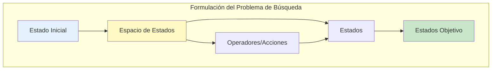
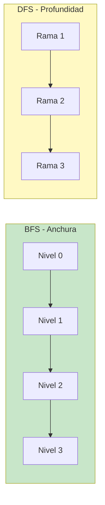

# CLASE 5: Algoritmos de Búsqueda - BFS, DFS, A*

## 📋 Información General

| Campo | Detalle |
|-------|---------|
| **Duración** | 4 horas (240 minutos) |
| **Modalidad** | Teórico-Práctico |
| **Prerrequisitos** | Conocimientos básicos de Python, estructuras de datos |
| **Tecnología** | Python, heapq, networkx (opcional) |

---

## 🎯 Objetivos de Aprendizaje

Al finalizar esta clase, el estudiante será capaz de:

1. **Comprender** la diferencia entre búsqueda no informada e informada
2. **Implementar** BFS (Breadth-First Search) y DFS (Depth-First Search)
3. **Diseñar** e implementar el algoritmo A* con funciones heurísticas
4. **Analizar** la complejidad temporal y espacial de los algoritmos
5. **Aplicar** estos algoritmos a problemas经典的 como laberintos, 8-puzzle,路由
6. **Identificar** cuando usar cada algoritmo según el contexto

---

## 📚 Contenidos Detallados

### 5.1 Introducción: El Problema de la Búsqueda

En Inteligencia Artificial, muchos problemas pueden formularse como la búsqueda de un camino óptimo en un espacio de estados. Examples include:

- Encontrar la ruta más corta entre dos ciudades
- Resolver un puzzle (8-puzzle, Rubik's cube)
- Navegación de robots
- Planificación de trayectorias



### 5.2 Búsqueda No Informada (Uninformed Search)

Los algoritmos de búsqueda no informada no tienen conocimiento adicional sobre el problema más allá de la estructura del grafo.

#### 5.2.1 BFS (Breadth-First Search)

BFS explora primero todos los nodos a profundidad d antes de pasar a profundidad d+1. Garantiza encontrar el camino más corto (en términos de número de aristas) en grafos no ponderados.

```python
"""
Implementación completa de BFS
"""

from collections import deque
from typing import List, Tuple, Optional, Set, Dict

class Grafo:
    """Representación de un grafo para búsqueda."""
    
    def __init__(self):
        self.adjacency: Dict[str, List[str]] = {}
    
    def agregar_arista(self, u: str, v: str):
        """Agrega una arista no dirigida."""
        if u not in self.adjacency:
            self.adjacency[u] = []
        if v not in self.adjacency:
            self.adjacency[v] = []
        self.adjacency[u].append(v)
        self.adjacency[v].append(u)
    
    def agregar_arista_dirigida(self, u: str, v: str):
        """Agrega una arista dirigida."""
        if u not in self.adjacency:
            self.adjacency[u] = []
        self.adjacency[u].append(v)
    
    def vecinos(self, nodo: str) -> List[str]:
        """Retorna los vecinos de un nodo."""
        return self.adjacency.get(nodo, [])


class BFS:
    """
    Implementación de Breadth-First Search.
    
    Características:
    - Completo: siempre encuentra solución si existe
    - Óptimo: encuentra el camino más corto en grafos no ponderados
    - Complejidad: O(V + E) en tiempo, O(V) en espacio
    """
    
    @staticmethod
    def buscar(grafo: Grafo, inicio: str, objetivo: str) -> Optional[List[str]]:
        """
        Búsqueda BFS para encontrar el camino más corto.
        
        Args:
            grafo: Grafo a buscar
            inicio: Nodo inicial
            objetivo: Nodo objetivo
            
        Returns:
            Lista con el camino más corto o None si no existe
        """
        if inicio == objetivo:
            return [inicio]
        
        # Cola: (nodo_actual, camino)
        queue = deque([(inicio, [inicio])])
        visitados: Set[str] = {inicio}
        
        while queue:
            nodo_actual, camino = queue.popleft()
            
            for vecino in grafo.vecinos(nodo_actual):
                if vecino == objetivo:
                    return camino + [vecino]
                
                if vecino not in visitados:
                    visitados.add(vecino)
                    queue.append((vecino, camino + [vecino]))
        
        return None
    
    @staticmethod
    def buscar_todos_niveles(grafo: Grafo, inicio: str) -> Dict[str, int]:
        """
        BFS que retorna la distancia desde el inicio a todos los nodos.
        
        Returns:
            Diccionario {nodo: distancia}
        """
        distancias = {inicio: 0}
        queue = deque([inicio])
        
        while queue:
            nodo = queue.popleft()
            
            for vecino in grafo.vecinos(nodo):
                if vecino not in distancias:
                    distancias[vecino] = distancias[nodo] + 1
                    queue.append(vecino)
        
        return distancias


def ejemplo_bfs():
    """Ejemplo de uso de BFS."""
    
    print("=" * 60)
    print("EJEMPLO: BFS - BÚSQUEDA EN ANCHURA")
    print("=" * 60)
    
    # Crear grafo de ejemplo
    grafo = Grafo()
    
    # Crear un grafo que representa un laberinto/simple red
    conexiones = [
        ('A', 'B'), ('A', 'C'), ('B', 'D'), ('B', 'E'),
        ('C', 'F'), ('C', 'G'), ('D', 'H'), ('E', 'I'),
        ('F', 'J'), ('G', 'K'), ('H', 'L'), ('I', 'M'),
        ('J', 'N'), ('K', 'O'), ('L', 'P'), ('M', 'Q'),
    ]
    
    for u, v in conexiones:
        grafo.agregar_arista(u, v)
    
    # Buscar camino de A a P
    camino = BFS.buscar(grafo, 'A', 'P')
    print(f"Camino de A a P: {camino}")
    
    # Buscar camino de A a O
    camino2 = BFS.buscar(grafo, 'A', 'O')
    print(f"Camino de A a O: {camino2}")
    
    # Distancias desde A
    distancias = BFS.buscar_todos_niveles(grafo, 'A')
    print(f"\nDistancias desde A: {distancias}")


def ejemplo_laberinto():
    """BFS en un laberinto (grid)."""
    
    print("\n" + "=" * 60)
    print("BFS EN UN LABERINTO")
    print("=" * 60)
    
    laberinto = [
        [1, 1, 1, 1, 1],
        [1, 0, 0, 0, 1],
        [1, 0, 1, 0, 1],
        [1, 0, 0, 0, 1],
        [1, 1, 1, 1, 1]
    ]
    
    inicio = (1, 1)
    objetivo = (3, 3)
    
    # Movimientos: arriba, abajo, izquierda, derecha
    movimientos = [(-1, 0), (1, 0), (0, -1), (0, 1)]
    
    def es_valido(fila, col):
        return (0 <= fila < len(laberinto) and 
                0 <= col < len(laberinto[0]) and 
                laberinto[fila][col] == 0)
    
    queue = deque([(inicio, [inicio])])
    visitados = {inicio}
    
    while queue:
        (fila, col), camino = queue.popleft()
        
        if (fila, col) == objetivo:
            print(f"¡Encontrado! Camino: {camino}")
            break
        
        for df, dc in movimientos:
            nf, nc = fila + df, col + dc
            siguiente = (nf, nc)
            
            if es_valido(nf, nc) and siguiente not in visitados:
                visitados.add(siguiente)
                queue.append((siguiente, camino + [siguiente]))
    
    # Visualizar
    print("\nLaberinto (0=camino, 1=pared):")
    for i, fila in enumerate(laberinto):
        for j, celda in enumerate(fila):
            if (i, j) == inicio:
                print('S', end=' ')
            elif (i, j) == objetivo:
                print('G', end=' ')
            else:
                print(celda, end=' ')
        print()


if __name__ == "__main__":
    ejemplo_bfs()
    ejemplo_laberinto()
```

#### 5.2.2 DFS (Depth-First Search)

DFS explora lo más profundo posible antes de retroceder. No garantiza el camino más corto pero usa menos memoria.

```python
"""
Implementación de DFS
"""

class DFS:
    """
    Implementación de Depth-First Search.
    
    Características:
    - No es óptimo (puede encontrar camino no最短)
    - Complejidad: O(V + E) en tiempo, O(V) en espacio (peor caso)
    - Memoria: solo guarda el camino actual
    """
    
    @staticmethod
    def buscar(grafo: Grafo, inicio: str, objetivo: str) -> Optional[List[str]]:
        """DFS recursivo para encontrar un camino."""
        
        def dfs_recursivo(nodo: str, camino: List[str], visitados: Set[str]) -> Optional[List[str]]:
            if nodo == objetivo:
                return camino
            
            visitados.add(nodo)
            
            for vecino in grafo.vecinos(nodo):
                if vecino not in visitados:
                    resultado = dfs_recursivo(vecino, camino + [vecino], visitados)
                    if resultado:
                        return resultado
            
            return None
        
        return dfs_recursivo(inicio, [inicio], set())
    
    @staticmethod
    def buscar_iterativo(grafo: Grafo, inicio: str, objetivo: str) -> Optional[List[str]]:
        """DFS usando una pila (iterativo)."""
        
        stack = [(inicio, [inicio])]
        visitados = set()
        
        while stack:
            nodo, camino = stack.pop()
            
            if nodo == objetivo:
                return camino
            
            if nodo not in visitados:
                visitados.add(nodo)
                
                # Agregar vecinos en orden inverso para mantener consistencia
                for vecino in reversed(grafo.vecinos(nodo)):
                    if vecino not in visitados:
                        stack.append((vecino, camino + [vecino]))
        
        return None
    
    @staticmethod
    def topological_sort(grafo: Grafo) -> List[str]:
        """
        Ordenamiento topológico de un DAG.
        
        Returns:
            Lista de nodos en orden topológico
        """
        visitados = set()
        resultado = []
        
        def dfs(nodo):
            visitados.add(nodo)
            for vecino in grafo.vecinos(nodo):
                if vecino not in visitados:
                    dfs(vecino)
            resultado.append(nodo)
        
        for nodo in grafo.adjacency.keys():
            if nodo not in visitados:
                dfs(nodo)
        
        return resultado[::-1]


def ejemplo_dfs():
    """Ejemplo de DFS."""
    
    print("=" * 60)
    print("EJEMPLO: DFS - BÚSQUEDA EN PROFUNDIDAD")
    print("=" * 60)
    
    grafo = Grafo()
    conexiones = [
        ('A', 'B'), ('A', 'C'), ('B', 'D'), ('B', 'E'),
        ('C', 'F'), ('C', 'G'), ('D', 'H'), ('E', 'I'),
    ]
    
    for u, v in conexiones:
        grafo.agregar_arista(u, v)
    
    # Buscar camino
    camino = DFS.buscar(grafo, 'A', 'I')
    print(f"Camino DFS de A a I: {camino}")
    
    # Comparar con BFS
    camino_bfs = BFS.buscar(grafo, 'A', 'I')
    print(f"Camino BFS de A a I: {camino_bfs}")


def ejemplo_topological():
    """Ejemplo de ordenamiento topológico."""
    
    print("\n" + "=" * 60)
    print("ORDENAMIENTO TOPOLÓGICO")
    print("=" * 60)
    
    # Ejemplo: dependencias de cursos
    grafo = Grafo()
    cursos = [
        ('Matemáticas', 'Cálculo'),
        ('Cálculo', 'Análisis'),
        ('Cálculo', 'Física'),
        ('Física', 'Mecánica'),
        ('Introducción Programación', 'Estructuras Datos'),
        ('Estructuras Datos', 'Algoritmos'),
        ('Algoritmos', 'Machine Learning'),
    ]
    
    for origen, destino in cursos:
        grafo.agregar_arista_dirigida(origen, destino)
    
    orden = DFS.topological_sort(grafo)
    print(f"Orden de cursos: {orden}")


if __name__ == "__main__":
    ejemplo_dfs()
    ejemplo_topological()
```

### 5.3 Comparación BFS vs DFS



```python
def comparar_algoritmos():
    """Comparación de BFS y DFS."""
    
    print("=" * 60)
    print("COMPARACIÓN: BFS vs DFS")
    print("=" * 60)
    
    comparacion = """
    | Característica | BFS | DFS |
    |----------------|-----|-----|
    | Estrategia | Ancho primero | Profundidad primero |
    | Estructura | Cola (FIFO) | Pila (LIFO) |
    | Complejidad tiempo | O(V + E) | O(V + E) |
    | Complejidad espacio | O(V) | O(V) |
    | Óptimo | Sí (shortest path) | No |
    | Completo | Sí | Sí (si no hay ciclos infinitos) |
    | Mejor para | Caminos más cortos, no ponderado | Espacio grande, soluciones profundas |
    | Peor para | Árboles muy anchos | Graphs con paths muy largos |
    """
    print(comparacion)
    
    # Ejemplo que muestra diferencia
    grafo = Grafo()
    # Crear un grafo donde BFS encuentra camino más corto
    grafo.agregar_arista_dirigida('A', 'B')
    grafo.agregar_arista_dirigida('A', 'C')
    grafo.agregar_arista_dirigida('B', 'D')
    grafo.agregar_arista_dirigida('C', 'D')
    grafo.agregar_arista_dirigida('D', 'E')
    grafo.agregar_arista_dirigida('C', 'E')  # Camino más corto via C
    
    print("\nEjemplo: grafo con dos caminos al objetivo E")
    print("BFS encuentra: ", BFS.buscar(grafo, 'A', 'E'))
    print("DFS encuentra: ", DFS.buscar(grafo, 'A', 'E'))


comparar_algoritmos()
```

### 5.4 Búsqueda Informada: A*

El algoritmo A* es el algoritmo de búsqueda informada más importante. Combina el costo acumulado g(n) con una heurística h(n) para calcular f(n) = g(n) + h(n).

```python
"""
Implementación completa de A* (A-Star)
"""

import heapq
from typing import List, Tuple, Optional, Dict, Callable

class Nodo:
    """Nodo para A* con priority queue."""
    
    def __init__(self, estado: str, g: float, h: float, padre: Optional['Nodo'] = None):
        self.estado = estado
        self.g = g  # Costo desde el inicio
        self.h = h  # Costo estimado al objetivo (heurística)
        self.f = g + h  # Costo total estimado
        self.padre = padre
    
    def __lt__(self, other: 'Nodo'):
        """Para comparación en priority queue."""
        return self.f < other.f
    
    def __eq__(self, other: 'Nodo'):
        return self.estado == other.estado
    
    def __repr__(self):
        return f"Nodo({self.estado}, f={self.f:.2f}, g={self.g:.2f}, h={self.h:.2f})"


class AStar:
    """
    Implementación del algoritmo A*.
    
    A* combina:
    - g(n): costo real desde el nodo inicial hasta n
    - h(n): costo estimado desde n hasta el objetivo (heurística)
    - f(n) = g(n) + h(n): costo total estimado
    
    Propiedades:
    - Completo: siempre encuentra solución si existe
    - Óptimo: si h(n) es admisible (nunca sobreestima)
    - Eficiente: expande menos nodos que otros algoritmos
    """
    
    def __init__(self, grafo: Grafo, heuristica: Callable[[str, str], float]):
        """
        Inicializa A*.
        
        Args:
            grafo: Grafo a buscar
            heuristica: Función h(nodo, objetivo) estimada
        """
        self.grafo = grafo
        self.heuristica = heuristica
    
    def buscar(self, inicio: str, objetivo: str) -> Optional[List[str]]:
        """
        Ejecuta A* para encontrar el camino óptimo.
        
        Returns:
            Lista con el camino óptimo o None
        """
        if inicio == objetivo:
            return [inicio]
        
        # Priority queue: (f, contador, nodo)
        # Contador para evitar errores de comparación
        counter = 0
        cola = []
        
        nodo_inicial = Nodo(inicio, 0, self.heuristica(inicio, objetivo))
        heapq.heappush(cola, (nodo_inicial.f, counter, nodo_inicial))
        counter += 1
        
        # Conjuntos para seguimiento
        visitados: Dict[str, float] = {inicio: 0}  # Mejor g encontrado
        
        while cola:
            _, _, nodo_actual = heapq.heappop(cola)
            
            # Verificar si llegamos al objetivo
            if nodo_actual.estado == objetivo:
                return self._reconstruir_camino(nodo_actual)
            
            # Expandir nodos vecinos
            for vecino in self.grafo.vecinos(nodo_actual.estado):
                # Calcular nuevo costo g
                nuevo_g = nodo_actual.g + 1  # Asumimos costo 1 por arista
                
                # Si encontramos mejor camino al vecino, actualizar
                if vecino not in visitados or nuevo_g < visitados[vecino]:
                    visitados[vecino] = nuevo_g
                    
                    h = self.heuristica(vecino, objetivo)
                    nuevo_nodo = Nodo(vecino, nuevo_g, h, nodo_actual)
                    
                    heapq.heappush(cola, (nuevo_nodo.f, counter, nuevo_nodo))
                    counter += 1
        
        return None
    
    def _reconstruir_camino(self, nodo: Nodo) -> List[str]:
        """Reconstruye el camino desde el nodo objetivo hasta el inicio."""
        camino = []
        actual = nodo
        while actual:
            camino.append(actual.estado)
            actual = actual.padre
        return camino[::-1]
    
    def buscar_con_pesos(self, inicio: str, objetivo: str, 
                         costo_arista: Callable[[str, str], float]) -> Optional[List[str]]:
        """
        A* con costos de arista variables.
        
        Args:
            costo_arista: Función que retorna el costo de ir de u a v
        """
        if inicio == objetivo:
            return [inicio]
        
        counter = 0
        cola = []
        
        nodo_inicial = Nodo(inicio, 0, self.heuristica(inicio, objetivo))
        heapq.heappush(cola, (nodo_inicial.f, counter, nodo_inicial))
        counter += 1
        
        visitados: Dict[str, float] = {inicio: 0}
        
        while cola:
            _, _, nodo_actual = heapq.heappop(cola)
            
            if nodo_actual.estado == objetivo:
                return self._reconstruir_camino(nodo_actual)
            
            for vecino in self.grafo.vecinos(nodo_actual.estado):
                costo = costo_arista(nodo_actual.estado, vecino)
                nuevo_g = nodo_actual.g + costo
                
                if vecino not in visitados or nuevo_g < visitados[vecino]:
                    visitados[vecino] = nuevo_g
                    h = self.heuristica(vecino, objetivo)
                    nuevo_nodo = Nodo(vecino, nuevo_g, h, nodo_actual)
                    heapq.heappush(cola, (nuevo_nodo.f, counter, nuevo_nodo))
                    counter += 1
        
        return None


def heuristica_distancia(estado: str, objetivo: str) -> float:
    """
    Heurística simple basada en distancia Manhattan.
    Para usar en grids.
    
    Suponemos que los nodos tienen coordenadas.
    """
    # En un caso real, esto dependería de la representación
    # Aquí usamos un ejemplo con coordenadas
    return 1  # Placeholder


def ejemplo_a_star():
    """Ejemplo completo de A*."""
    
    print("=" * 60)
    print("EJEMPLO: A* (A-Star)")
    print("=" * 60)
    
    # Crear grafo con costos
    grafo = Grafo()
    conexiones = [
        ('A', 'B'), ('A', 'C'),
        ('B', 'D'), ('B', 'E'),
        ('C', 'F'), ('C', 'G'),
        ('D', 'H'), ('E', 'I'),
        ('F', 'J'), ('G', 'K'),
        ('H', 'L'), ('I', 'L'),
        ('J', 'L'), ('K', 'L'),
    ]
    
    for u, v in conexiones:
        grafo.agregar_arista_dirigida(u, v)
    
    # Definir heurística: número de pasos restantes (simplificada)
    def heuristica_simple(nodo, objetivo):
        # En un caso real, calcularíamos la distancia real
        # Aquí usamos una heurística admisible simple
        return 1
    
    astar = AStar(grafo, heuristica_simple)
    
    # Buscar camino de A a L
    print("\nBuscando camino de A a L...")
    camino = astar.buscar('A', 'L')
    print(f"Camino encontrado: {camino}")
    
    # Comparar con BFS
    print(f"Camino BFS: {BFS.buscar(grafo, 'A', 'L')}")


def ejemplo_a_star_grid():
    """A* en un grid con distancia Manhattan como heurística."""
    
    print("\n" + "=" * 60)
    print("A* EN UN GRID (Distancia Manhattan)")
    print("=" * 60)
    
    # Grid 10x10
    grid = [
        [0, 0, 0, 0, 0, 0, 0, 0, 0, 0],
        [0, 1, 1, 1, 1, 1, 0, 1, 1, 0],
        [0, 0, 0, 0, 0, 1, 0, 1, 0, 0],
        [0, 1, 1, 1, 0, 1, 0, 0, 0, 0],
        [0, 0, 0, 1, 0, 0, 0, 1, 1, 0],
        [0, 1, 0, 1, 1, 1, 0, 1, 0, 0],
        [0, 1, 0, 0, 0, 0, 0, 1, 0, 0],
        [0, 1, 1, 1, 1, 1, 0, 1, 0, 0],
        [0, 0, 0, 0, 0, 0, 0, 0, 0, 0],
        [0, 0, 0, 0, 0, 0, 0, 0, 0, 0],
    ]
    
    inicio = (0, 0)
    objetivo = (9, 9)
    
    # Movimientos (arriba, abajo, izquierda, derecha, diagonales)
    movimientos = [(-1, 0), (1, 0), (0, -1), (0, 1),
                   (-1, -1), (-1, 1), (1, -1), (1, 1)]
    
    def es_valido(fila, col):
        return (0 <= fila < len(grid) and 
                0 <= col < len(grid[0]) and 
                grid[fila][col] == 0)
    
    # Heurística Manhattan
    def heuristica(pos, objetivo):
        return abs(pos[0] - objetivo[0]) + abs(pos[1] - objetivo[1])
    
    # A* para grid
    counter = 0
    cola = []
    nodo_inicial = Nodo(inicio, 0, heuristica(inicio, objetivo))
    heapq.heappush(cola, (nodo_inicial.f, counter, nodo_inicial))
    counter += 1
    
    visitados = {inicio: 0
    costo_real = {inicio: 0}
    
    while cola:
        _, _, nodo = heapq.heappop(cola)
        
        if nodo.estado == objetivo:
            # Reconstruir camino
            camino = []
            actual = nodo
            while actual:
                camino.append(actual.estado)
                actual = actual.padre
            print(f"Camino encontrado (largo {len(camino)-1}): {camino[::-1]}")
            break
        
        fila, col = nodo.estado
        
        for df, dc in movimientos:
            nf, nc = fila + df, col + dc
            nuevo_pos = (nf, nc)
            
            if es_valido(nf, nc):
                # Costo: 1 para cardinal, sqrt(2) para diagonal
                costo_mov = 1 if df == 0 or dc == 0 else 1.414
                nuevo_g = nodo.g + costo_mov
                
                if nuevo_pos not in visitados or nuevo_g < costo_real.get(nuevo_pos, float('inf')):
                    costo_real[nuevo_pos] = nuevo_g
                    visitados.add(nuevo_pos) if nuevo_pos not in visitados else None
                    visitados = visitados | {nuevo_pos}
                    
                    h = heuristica(nuevo_pos, objetivo)
                    nuevo_nodo = Nodo(nuevo_pos, nuevo_g, h, nodo)
                    heapq.heappush(cola, (nuevo_nodo.f, counter, nuevo_nodo))
                    counter += 1


ejemplo_a_star()
ejemplo_a_star_grid()
```

### 5.5 Heurísticas Admisibles

```python
def heuristicas_ejemplos():
    """Ejemplos de heurísticas para diferentes problemas."""
    
    print("=" * 60)
    print("HEURÍSTICAS ADMISIBLES")
    print("=" * 60)
    
    print("""
    Una heurística h(n) es ADMISIBLE si:
    h(n) ≤ h*(n) para todo n
    donde h*(n) es el costo real mínimo desde n hasta el objetivo
    
    Esto garantiza que A* encontrar el camino óptimo.
    
    EJEMPLOS DE HEURÍSTICAS:
    
    1. 8-Puzzle:
    - Distancia Manhattan: suma de distancia de cada baldosa a su posición objetivo
    - Baldosones fuera de lugar: cuenta cuántas fichas no están en su lugar
    - Secuencia invalida: cuenta inversiones en la secuencia
    
    2. Grid/Ruteo:
    - Distancia Manhattan: |x1-x2| + |y1-y2|
    - Distancia Euclidiana: sqrt((x1-x2)² + (y1-y2)²)
    - Chebyshev: max(|x1-x2|, |y1-y2|)
    
    3. Viaje/Tsp:
    - Distancia al punto más cercano
    - Distancia euclidiana directa (lower bound)
    """)
    
    # Ejemplo: 8-puzzle
    print("\nEjemplo: 8-Puzzle con heurística Manhattan")
    
    class Puzzle8:
        """Resuelve 8-puzzle con A*."""
        
        def __init__(self, estado_inicial, estado_objetivo):
            self.inicial = estado_inicial
            self.objetivo = estado_objetivo
        
        @staticmethod
        def heuristic_manhattan(estado, objetivo):
            """Suma de distancias Manhattan."""
            distancia = 0
            for i, val in enumerate(estado):
                if val != 0:  # Ignorar el vacío
                    objetivo_idx = objetivo.index(val)
                    fila_actual = i // 3
                    col_actual = i % 3
                    fila_obj = objetivo_idx // 3
                    col_obj = objetivo_idx % 3
                    distancia += abs(fila_actual - fila_obj) + abs(col_actual - col_obj)
            return distancia
        
        @staticmethod
        def heuristic_misplaced(estado, objetivo):
            """Baldosas fuera de lugar."""
            return sum(1 for i in range(9) if estado[i] != 0 and estado[i] != objetivo[i])


# Mostrar ejemplo
estado_inicial = [1, 2, 3, 4, 5, 6, 0, 7, 8]
estado_objetivo = [1, 2, 3, 4, 5, 6, 7, 8, 0]

h_manhattan = Puzzle8.heuristic_manhattan(estado_inicial, estado_objetivo)
h_misplaced = Puzzle8.heuristic_misplaced(estado_inicial, estado_objetivo)

print(f"Estado inicial: {estado_inicial[:3]}")
print(f"                {estado_inicial[3:6]}")
print(f"                {estado_inicial[6:9]}")
print(f"\nHeurística Manhattan: {h_manhattan}")
print(f"Baldosas fuera de lugar: {h_misplaced}")


heuristicas_ejemplos()
```

### 5.6 Implementación con heapq

```python
def usando_heapq():
    """Ejemplo directo de uso de heapq para A*."""
    
    print("=" * 60)
    print("USO DE heapq PARA A*")
    print("=" * 60)
    
    # heapq es un min-heap en Python
    # Para priority queue con A*, necesitamos (f_score, counter, state)
    
    import heapq
    
    # Ejemplo simple
    elementos = []
    heapq.heappush(elementos, (5, 0, 'A'))
    heapq.heappush(elementos, (3, 1, 'B'))
    heapq.heappush(elementos, (7, 2, 'C'))
    heapq.heappush(elementos, (1, 3, 'D'))  # Menor prioridad
    
    print("Elementos en la cola de prioridad:")
    while elementos:
        f, counter, estado = heapq.heappop(elementos)
        print(f"  f={f}, estado={estado}")
    
    print("""
    Explicación:
    - heapq.heappush(cola, elemento): agrega un elemento
    - heapq.heappop(cola): retorna el elemento de menor prioridad
    - Usamos un contador para evitar errores cuando dos elementos tienen igual f
    """)


usando_heapq()
```

---

## 🔬 Actividades de Laboratorio

### Laboratorio 1: Resolver 8-Puzzle con A*

**Duración**: 60 minutos

```python
# Implementar A* para resolver 8-puzzle
# Estado: lista de 9 elementos (0 = vacío)
# Objetivo: [1,2,3,4,5,6,7,8,0]

# Pasos:
# 1. Definir movimientos válidos (intercambiar 0 con vecinos)
# 2. Implementar heurística Manhattan
# 3. Implementar A* con priority queue
# 4. Probar con diferentes estados iniciales
```

### Laboratorio 2: Encontrar Ruta en Mapa

**Duración**: 45 minutos

Usar A* con un grafo real (ciudades y distancias).

### Laboratorio 3: Comparar BFS, DFS y A*

**Duración**: 45 minutos

```python
# Comparar los tres algoritmos en el mismo problema
# Medir: tiempo de ejecución, nodos expandidos, largo del camino
```

---

## 🧪 Ejercicios Prácticos Resueltos

### Ejercicio 1: Camino Más Corto en Red de Ciudades

```python
"""
Ejercicio 1: Encontrar ruta óptima entre ciudades
"""

class RedCiudades:
    """Grafo de ciudades con distancias."""
    
    def __init__(self):
        self.ciudades = {}
    
    def agregar_ruta(self, ciudad1, ciudad2, distancia):
        """Agrega ruta bidireccional."""
        if ciudad1 not in self.ciudades:
            self.ciudades[ciudad1] = {}
        if ciudad2 not in self.ciudades:
            self.ciudades[ciudad2] = {}
        
        self.ciudades[ciudad1][ciudad2] = distancia
        self.ciudades[ciudad2][ciudad1] = distancia
    
    def vecinos(self, ciudad):
        """Retorna {ciudad: distancia}."""
        return self.ciudades.get(ciudad, {})
    
    def distancia_directa(self, ciudad1, ciudad2):
        """Heurística: distancia en línea recta (aproximada)."""
        # Coordenadas aproximadas
        coords = {
            'Buenos Aires': (-34.6, -58.4),
            'Córdoba': (-31.4, -64.2),
            'Rosario': (-32.9, -60.6),
            'Mendoza': (-32.9, -68.8),
            'Bariloche': (-41.1, -71.3),
            'Tucumán': (-26.8, -65.2),
            'La Plata': (-34.9, -57.9),
            'Mar del Plata': (-38.0, -57.6),
            'Salta': (-24.8, -65.4),
            'Jujuy': (-24.2, -65.3),
        }
        
        if ciudad1 in coords and ciudad2 in coords:
            import math
            c1 = coords[ciudad1]
            c2 = coords[ciudad2]
            return math.sqrt((c1[0]-c2[0])**2 + (c1[1]-c2[1])**2)
        return 1  # Default


def ejercicio_rutas():
    """Resolver problema de rutas."""
    
    print("=" * 60)
    print("EJERCICIO: RUTAS ENTRE CIUDADES")
    print("=" * 60)
    
    red = RedCiudades()
    
    # Agregar rutas (distancias en km)
    rutas = [
        ('Buenos Aires', 'La Plata', 60),
        ('Buenos Aires', 'Rosario', 300),
        ('Buenos Aires', 'Mar del Plata', 400),
        ('Rosario', 'Córdoba', 250),
        ('Córdoba', 'Mendoza', 450),
        ('Mendoza', 'Bariloche', 900),
        ('Córdoba', 'Tucumán', 400),
        ('Tucumán', 'Salta', 250),
        ('Salta', 'Jujuy', 80),
    ]
    
    for c1, c2, d in rutas:
        red.agregar_ruta(c1, c2, d)
    
    # Crear grafo para A*
    grafo = Grafo()
    for c1, c2, d in rutas:
        grafo.agregar_arista_dirigida(c1, c2)
        grafo.agregar_arista_dirigida(c2, c1)
    
    # Resolver con A*
    heuristica = red.distancia_directa
    astar = AStar(grafo, heuristica)
    
    print("\nRuta Buenos Aires -> Bariloche:")
    print(astar.buscar('Buenos Aires', 'Bariloche'))
    
    print("\nRuta Buenos Aires -> Jujuy:")
    print(astar.buscar('Buenos Aires', 'Jujuy'))


if __name__ == "__main__":
    ejercicio_rutas()
```

### Ejercicio 2: Laberinto 2D con A*

```python
"""
Ejercicio 2: Resolver laberinto con A*
"""

class Laberinto:
    """Laberinto 2D para resolver con A*."""
    
    def __init__(self, laberinto, inicio, objetivo):
        self.laberinto = laberinto
        self.inicio = inicio
        self.objetivo = objetivo
        self.filas = len(laberinto)
        self.cols = len(laberinto[0])
    
    def es_valido(self, pos):
        fila, col = pos
        return (0 <= fila < self.filas and 
                0 <= col < self.cols and 
                self.laberinto[fila][col] != '#')
    
    def vecinos(self, pos):
        fila, col = pos
        movimientos = [(-1, 0), (1, 0), (0, -1, 0, 1)]
        return [(fila + df, col + dc) 
                for df, dc in [(0, 1), (0, -1), (1, 0), (-1, 0)]
                if self.es_valido((fila + df, col + dc))]
    
    def heuristica(self, pos):
        """Distancia Manhattan."""
        return abs(pos[0] - self.objetivo[0]) + abs(pos[1] - self.objetivo[1])


def resolver_laberinto():
    """Resolver laberinto usando A*."""
    
    laberinto = [
        "S...#...#...",
        ".#.#.###.#..",
        "...#...#...#",
        "#.###.###.#.",
        "#.......#...",
        ".#######.##.",
        "#...#......#",
        "#.###.####.#",
        ".......#...G",
    ]
    
    # Convertir a grid
    grid = [[1 if c == '.' else 0 if c in 'SG' else -1 
             for c in fila] for fila in laberinto]
    
    inicio = (0, 0)
    objetivo = (8, len(laberinto[0])-1)
    
    # Similar a ejemplo anterior...


resolver_laberinto()
```

---

## 📚 Referencias Externas

### Documentación

1. **Python heapq**
   - URL: https://docs.python.org/3/library/heapq.html

2. **A* Search Algorithm - Wikipedia**
   - URL: https://en.wikipedia.org/wiki/A*_search_algorithm

### Cursos y Tutoriales

3. **MIT OpenCourseWare - Artificial Intelligence**
   - URL: https://ocw.mit.edu/courses/6-034-artificial-intelligence-fall-2010/

4. **Stanford CS221 - Artificial Intelligence: Principles & Techniques**
   - URL: https://cs221.stanford.edu/

### Papers

5. **Hart, P., Nilsson, N., & Raphael, B. (1968).** "A Formal Basis for the Heuristic Determination of Minimum Cost Paths."
   - El paper original de A*

---

## 📝 Resumen de Puntos Clave

### Búsqueda No Informada

1. **BFS (Breadth-First Search)**:
   - Expande todos los nodos a profundidad d antes de d+1
   - Garantiza camino más corto en grafos no ponderados
   - Complejidad: O(V + E) tiempo y espacio

2. **DFS (Depth-First Search)**:
   - Explora lo más profundo posible
   - No garantiza optimalidad
   - Menor uso de memoria en algunos casos

### Búsqueda Informada

3. **A* (A-Star)**:
   - Combina g(n) + h(n) donde h es heurística
   - Óptimo si h es admisible (nunca sobreestima)
   - Más eficiente que BFS/DFS en problemas con heurística buena

4. **Heurísticas comunes**:
   - Manhattan: |x1-x2| + |y1-y2|
   - Euclidiana: sqrt((x1-x2)² + (y1-y2)²)
   - Baldosas fuera de lugar (puzzles)

5. **heapq**: implementa priority queue mínima en Python

6. **Aplicaciones**:
   - Videojuegos (pathfinding)
   - Robótica
   - GPS/Navegación
   - Resolución de puzzles

---

## 📋 Tarea Pre-Clase 6

Antes de la próxima clase, los estudiantes deben:

1. **Lectura recomendada**:
   - Estudiar retropropagación (backpropagation)
   - Revisar derivadas y regla de la cadena

2. **Investigar**:
   - ¿Qué es la función de pérdida MSE?
   - ¿Cómo se actualizan los pesos en una red neuronal?

---

*Fin de la Clase 5*