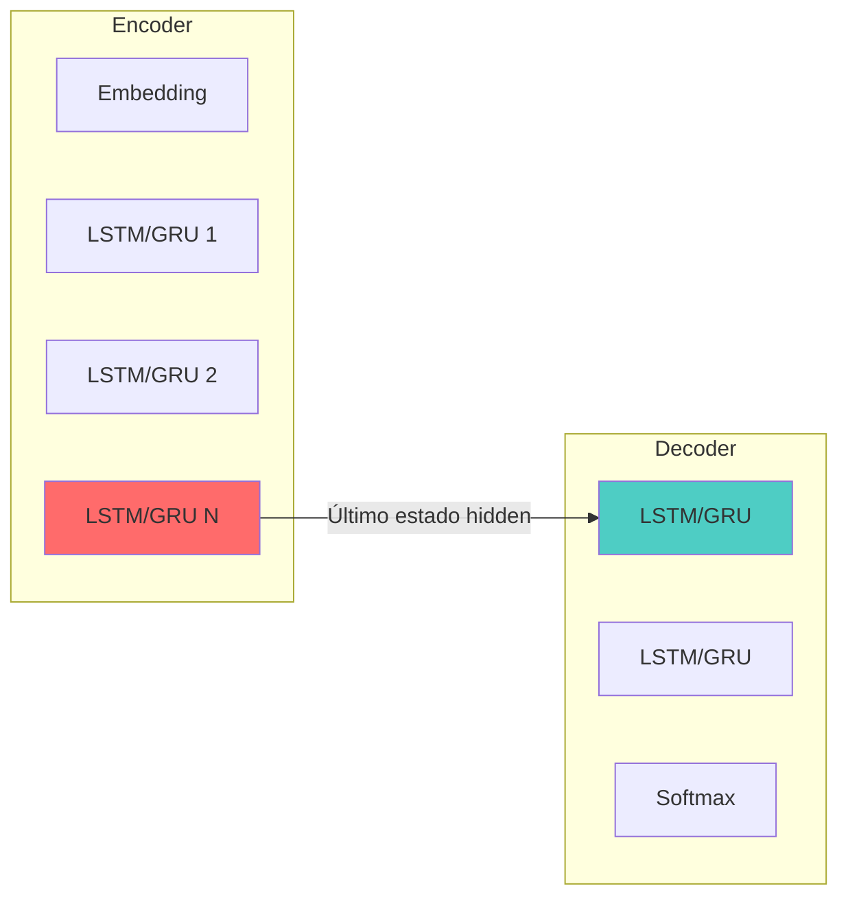
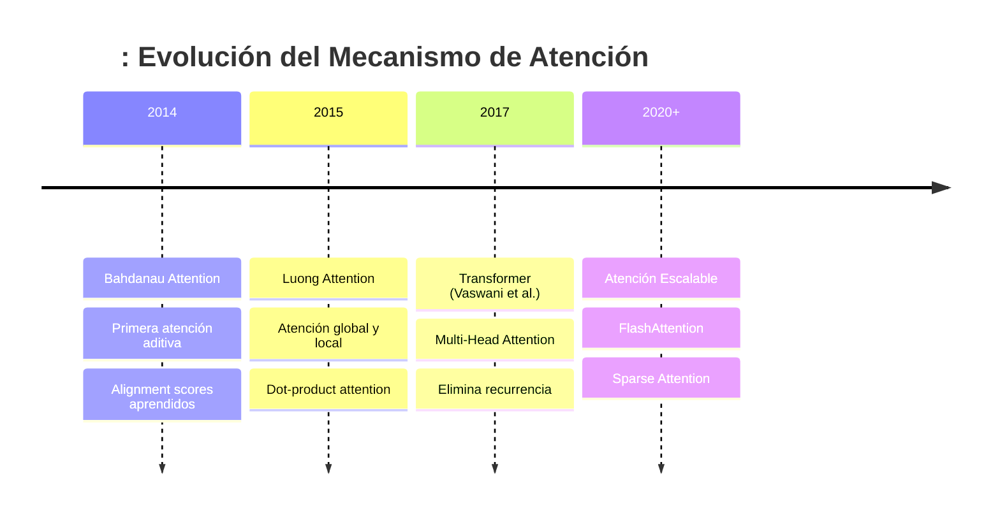
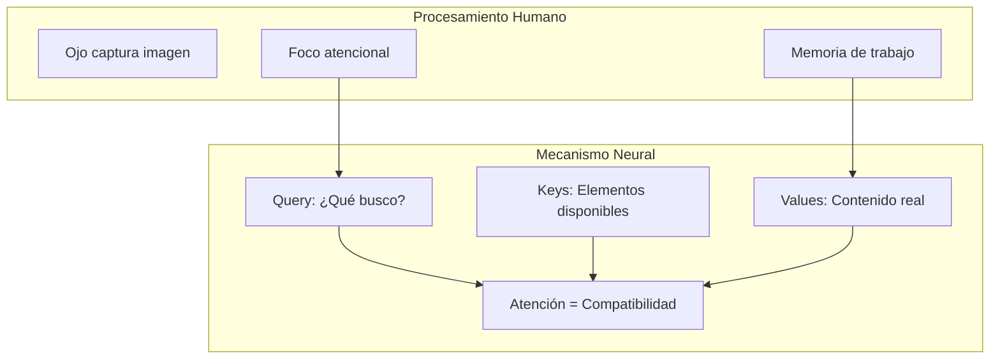
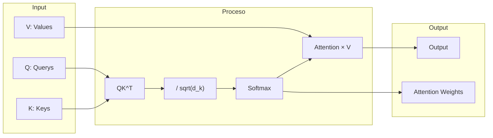
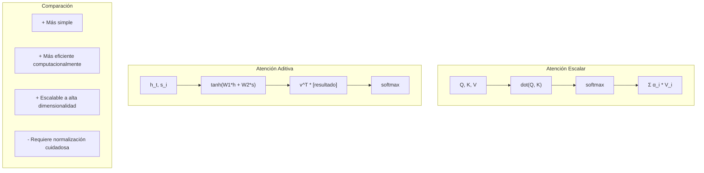
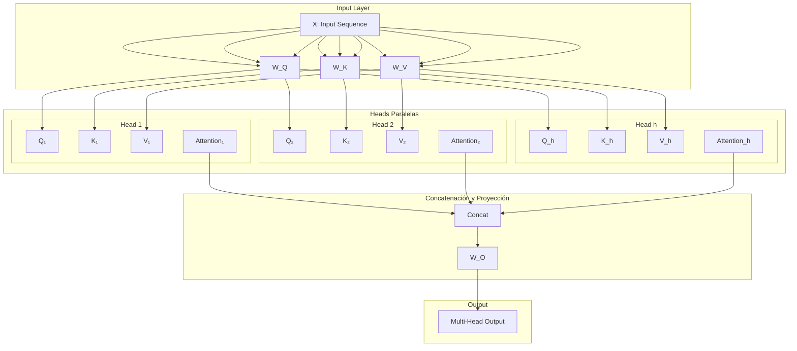
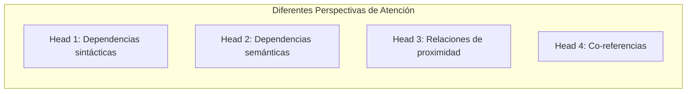
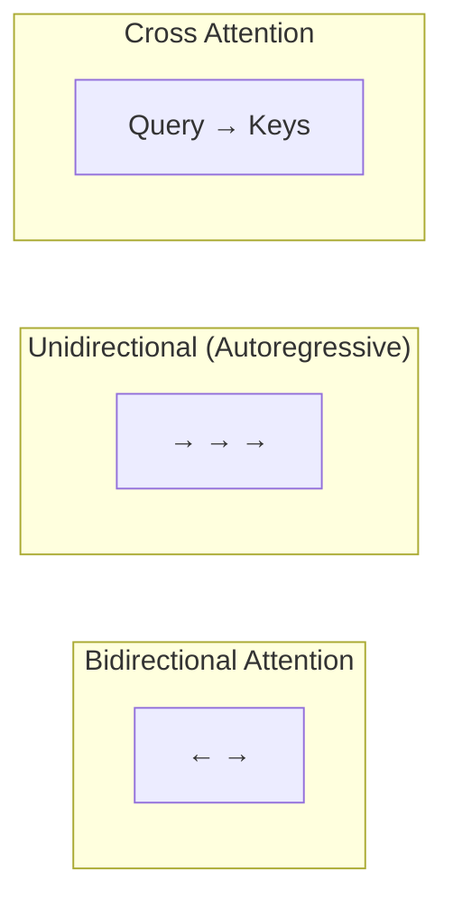
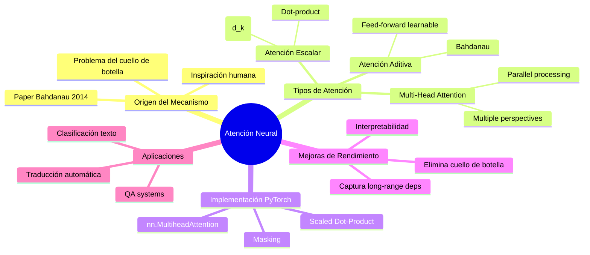

# Clase 9: Attention Mechanism - Atención Neural

## Duración: 4 horas

---

## 1. Objetivos de Aprendizaje

Al finalizar esta clase, el estudiante será capaz de:

1. **Comprender el origen histórico y la necesidad del mecanismo de atención** en el procesamiento de secuencias
2. **Explicar los diferentes tipos de atención**: escalar, vectorial y multi-head
3. **Implementar el mecanismo de atención desde cero** utilizando PyTorch
4. **Analizar cómo la atención mejora el rendimiento** en modelos de secuencia a secuencia
5. **Aplicar `nn.MultiheadAttention`** de PyTorch en proyectos reales
6. **Visualizar e interpretar** los patrones de atención aprendidos

---

## 2. Contenidos Detallados

### 2.1 Origen Histórico del Mecanismo de Atención

#### 2.1.1 El Problema del Cuello de Botella Informacional

Antes de 2014, los modelos de Sequence-to-Sequence (Seq2Seq) enfrentaban un problema fundamental: **el cuello de botella informacional**. En arquitecturas encoder-decoder tradicionales:



En esta arquitectura:
- **Toda la información** de la secuencia de entrada debe comprimirse en un **vector de contexto único** (el estado oculto final del encoder)
- Para oraciones largas, esta compresión causa **pérdida de información crítica**
- El decoder debe depender exclusivamente de este vector único para generar toda la salida

#### 2.1.2 El Paper Fundacional (2014)

En el paper **"Neural Machine Translation by Jointly Learning to Align and Translate"** (Bahdanau et al., 2014), se introdujo por primera vez el mecanismo de atención:



**Citación del paper original:**
> "Las redes neuronales encoder-decoder necesitan comprimir toda la información de la oración fuente en un vector de longitud fija. Esta formulación impone una presión sobre el encoder para comprimir toda la información de la oración, lo cual dificulta que el decoder dealt con oraciones largas."

#### 2.1.3 La Intuición Detrás de la Atención

La atención se inspira en cómo los humanos procesamos información:



**Analogía práctica**: Cuando traduces una oración del francés al español:
- No memorizas toda la oración en un solo vector
- Al traducer cada palabra, "miras" las palabras relevantes del original
- La atención es este "mirar selectivo" modelado matemáticamente

---

### 2.2 Tipos de Mecanismos de Atención

#### 2.2.1 Atención Escalar (Dot-Product Attention)

Es la forma más simple, utilizada en el Transformer original:

```python
import torch
import torch.nn as nn
import torch.nn.functional as F
import math

class ScalarAttention(nn.Module):
    """
    Implementación de Atención Escalar (Scaled Dot-Product Attention)
    
    Fórmula: Attention(Q, K, V) = softmax(QK^T / sqrt(d_k))V
    
    donde:
    - Q: Query matrix (queries)
    - K: Key matrix (claves)  
    - V: Value matrix (valores)
    - d_k: dimensión de las claves
    """
    
    def __init__(self, d_k: int):
        super().__init__()
        self.d_k = d_k
    
    def forward(self, Q: torch.Tensor, K: torch.Tensor, V: torch.Tensor, mask: torch.Tensor = None) -> tuple:
        """
        Args:
            Q: Tensor de forma (batch, seq_len_q, d_k)
            K: Tensor de forma (batch, seq_len_k, d_k)
            V: Tensor de forma (batch, seq_len_v, d_v)
            mask: Máscara opcional (batch, seq_len_q, seq_len_k)
        
        Returns:
            output: Tensor de salida (batch, seq_len_q, d_v)
            attention_weights: Pesos de atención (batch, seq_len_q, seq_len_k)
        """
        # Paso 1: Calcular scores de atención
        # QK^T: (batch, seq_len_q, d_k) @ (batch, d_k, seq_len_k) = (batch, seq_len_q, seq_len_k)
        scores = torch.matmul(Q, K.transpose(-2, -1))
        
        # Paso 2: Escalar por sqrt(d_k) para evitar gradientes explosivos
        scores = scores / math.sqrt(self.d_k)
        
        # Paso 3: Aplicar mask si existe (para padding o autoregressive)
        if mask is not None:
            scores = scores.masked_fill(mask == 0, float('-inf'))
        
        # Paso 4: Aplicar softmax para obtener pesos que sumen 1
        attention_weights = F.softmax(scores, dim=-1)
        
        # Paso 5: Ponderar values por los pesos de atención
        output = torch.matmul(attention_weights, V)
        
        return output, attention_weights
```

**Diagrama del flujo de atención escalar:**



#### 2.2.2 Atención Vectorial (Additive Attention)

Propuesta por Bahdanau, usa una capa feed-forward para calcular compatibilidad:

```python
class AdditiveAttention(nn.Module):
    """
    Atención Aditiva (Bahdanau Attention)
    
    score(h_t, s_i) = v^T * tanh(W_1 * h_t + W_2 * s_i)
    
    donde:
    - h_t: estado del decoder (query)
    - s_i: estado del encoder (key)
    - v, W_1, W_2: parámetros aprendidos
    """
    
    def __init__(self, hidden_size: int):
        super().__init__()
        # Proyección para query
        self.W_q = nn.Linear(hidden_size, hidden_size, bias=False)
        # Proyección para key
        self.W_k = nn.Linear(hidden_size, hidden_size, bias=False)
        # Vector de puntaje
        self.v = nn.Linear(hidden_size, 1, bias=False)
    
    def forward(self, query: torch.Tensor, keys: torch.Tensor, values: torch.Tensor, mask: torch.Tensor = None) -> tuple:
        """
        Args:
            query: (batch, hidden_size) - estado actual del decoder
            keys: (batch, seq_len, hidden_size) - estados del encoder
            values: (batch, seq_len, hidden_size) - valores del encoder
            mask: (batch, seq_len) - máscara opcional
        
        Returns:
            context: (batch, hidden_size)
            attention_weights: (batch, seq_len)
        """
        # Expandir query para broadcasting
        query_expanded = query.unsqueeze(1)  # (batch, 1, hidden_size)
        
        # Calcular scores de atención: v^T * tanh(W_q*q + W_k*k)
        energy = torch.tanh(self.W_q(query_expanded) + self.W_k(keys))
        # energy: (batch, seq_len, hidden_size)
        
        scores = self.v(energy).squeeze(-1)  # (batch, seq_len)
        
        # Aplicar máscara si existe
        if mask is not None:
            scores = scores.masked_fill(mask == 0, float('-inf'))
        
        # Softmax para obtener pesos
        attention_weights = F.softmax(scores, dim=-1)  # (batch, seq_len)
        
        # Ponderar valores
        context = torch.bmm(attention_weights.unsqueeze(1), values).squeeze(1)
        # context: (batch, hidden_size)
        
        return context, attention_weights
```

**Comparación de arquitecturas:**



#### 2.2.3 Atención Multi-Head (Multi-Head Attention)

La atención multi-head permite al modelo aprender diferentes tipos de relaciones simultáneamente:

```python
class MultiHeadAttention(nn.Module):
    """
    Implementación de Multi-Head Attention
    
    MHA(Q, K, V) = Concat(head_1, ..., head_h) * W_O
    
    donde head_i = Attention(Q*W_Q_i, K*W_K_i, V*W_V_i)
    
    Parámetros:
    - h: número de heads (cabezas)
    - d_model: dimensión del modelo
    - d_k: d_model / h (dimensión de cada head)
    """
    
    def __init__(self, d_model: int, num_heads: int, dropout: float = 0.1):
        super().__init__()
        assert d_model % num_heads == 0, "d_model debe ser divisible por num_heads"
        
        self.d_model = d_model
        self.num_heads = num_heads
        self.d_k = d_model // num_heads
        
        # Proyecciones lineales
        self.W_q = nn.Linear(d_model, d_model)
        self.W_k = nn.Linear(d_model, d_model)
        self.W_v = nn.Linear(d_model, d_model)
        self.W_o = nn.Linear(d_model, d_model)
        
        self.dropout = nn.Dropout(dropout)
        self.scale = math.sqrt(self.d_k)
    
    def split_heads(self, x: torch.Tensor) -> torch.Tensor:
        """
        Divide el tensor en múltiples heads
        
        Input: (batch, seq_len, d_model)
        Output: (batch, num_heads, seq_len, d_k)
        """
        batch_size, seq_len, _ = x.shape
        x = x.reshape(batch_size, seq_len, self.num_heads, self.d_k)
        return x.transpose(1, 2)
    
    def forward(self, query: torch.Tensor, key: torch.Tensor, value: torch.Tensor, 
                mask: torch.Tensor = None) -> tuple:
        """
        Args:
            query: (batch, seq_len_q, d_model)
            key: (batch, seq_len_k, d_model)
            value: (batch, seq_len_v, d_model)
            mask: (batch, 1, seq_len_q, seq_len_k) - broadcast
        
        Returns:
            output: (batch, seq_len_q, d_model)
            attention_weights: (batch, num_heads, seq_len_q, seq_len_k)
        """
        batch_size = query.size(0)
        
        # Proyectar y dividir en heads
        Q = self.split_heads(self.W_q(query))
        K = self.split_heads(self.W_k(key))
        V = self.split_heads(self.W_v(value))
        
        # Calcular atención para cada head
        # Q @ K^T: (batch, heads, seq_len_q, d_k) @ (batch, heads, d_k, seq_len_k)
        scores = torch.matmul(Q, K.transpose(-2, -1)) / self.scale
        
        # Aplicar máscara
        if mask is not None:
            scores = scores.masked_fill(mask == 0, float('-inf'))
        
        # Softmax sobre las keys
        attention_weights = F.softmax(scores, dim=-1)
        attention_weights = self.dropout(attention_weights)
        
        # Ponderar values
        # attention_weights @ V: (batch, heads, seq_len_q, seq_len_k) @ (batch, heads, seq_len_k, d_k)
        context = torch.matmul(attention_weights, V)
        
        # Recombinar heads
        # context: (batch, heads, seq_len_q, d_k) -> (batch, seq_len_q, heads, d_k) -> (batch, seq_len_q, d_model)
        context = context.transpose(1, 2).contiguous()
        context = context.view(batch_size, -1, self.d_model)
        
        # Proyección final
        output = self.W_o(context)
        
        return output, attention_weights
```

**Diagrama conceptual de Multi-Head Attention:**



**¿Por qué Multi-Head Attention?**

Cada cabeza puede aprender diferentes tipos de relaciones:



---

### 2.3 Implementación con PyTorch (nn.MultiheadAttention)

PyTorch proporciona una implementación optimizada y lista para usar:

```python
import torch
import torch.nn as nn
import torch.nn.functional as F
import math

class TransformerEncoderLayerWithPyTorch(nn.Module):
    """
    Ejemplo de uso de nn.MultiheadAttention de PyTorch
    """
    
    def __init__(self, d_model: int = 512, num_heads: int = 8, dim_feedforward: int = 2048, dropout: float = 0.1):
        super().__init__()
        
        # Multi-Head Attention de PyTorch
        self.self_attn = nn.MultiheadAttention(
            embed_dim=d_model,
            num_heads=num_heads,
            dropout=dropout,
            batch_first=True  # Importante: batch_first=True
        )
        
        # Feed-Forward Network
        self.linear1 = nn.Linear(d_model, dim_feedforward)
        self.dropout = nn.Dropout(dropout)
        self.linear2 = nn.Linear(dim_feedforward, d_model)
        
        # Normalización
        self.norm1 = nn.LayerNorm(d_model)
        self.norm2 = nn.LayerNorm(d_model)
        
        self.dropout1 = nn.Dropout(dropout)
        self.dropout2 = nn.Dropout(dropout)
        
        self.activation = nn.ReLU()
    
    def forward(self, src: torch.Tensor, src_mask: torch.Tensor = None, src_key_padding_mask: torch.Tensor = None):
        """
        Args:
            src: (batch, seq_len, d_model)
            src_mask: máscara para atención (seq_len, seq_len) o (batch*num_heads, seq_len, seq_len)
            src_key_padding_mask: máscara para padding (batch, seq_len)
        """
        
        # Self-Attention con skip connection
        src2, attn_weights = self.self_attn(
            src, src, src,
            attn_mask=src_mask,
            key_padding_mask=src_key_padding_mask
        )
        src = src + self.dropout1(src2)
        src = self.norm1(src)
        
        # Feed-Forward con skip connection
        src2 = self.linear2(self.dropout(self.activation(self.linear1(src))))
        src = src + self.dropout2(src2)
        src = self.norm2(src)
        
        return src, attn_weights


# Ejemplo de uso
def example_multihead_attention():
    """Ejemplo completo de uso de MultiheadAttention"""
    
    # Configuración
    batch_size = 2
    seq_len = 10
    d_model = 512
    num_heads = 8
    
    # Crear input aleatorio
    x = torch.randn(batch_size, seq_len, d_model)
    
    # Crear máscara de padding (1s válidos, 0s padding)
    key_padding_mask = torch.zeros(batch_size, seq_len, dtype=torch.bool)
    key_padding_mask[0, -2:] = True  # Últimos 2 tokens de la primera secuencia son padding
    key_padding_mask[1, -1:] = True  # Último token de la segunda secuencia es padding
    
    # Crear capa con atención
    layer = TransformerEncoderLayerWithPyTorch(d_model, num_heads)
    layer.eval()
    
    # Forward pass
    with torch.no_grad():
        output, attention_weights = layer(x, src_key_padding_mask=key_padding_mask)
    
    print(f"Input shape: {x.shape}")
    print(f"Output shape: {output.shape}")
    print(f"Attention weights shape: {attention_weights.shape}")
    # attention_weights: (batch, num_heads, seq_len, seq_len)
    
    # Visualizar atención de un head específico
    print("\nPesos de atención del head 0, batch 0:")
    print(attention_weights[0, 0])
    
    return output, attention_weights

if __name__ == "__main__":
    output, weights = example_multihead_attention()
```

---

### 2.4 Cómo la Atención Mejora el Rendimiento

#### 2.4.1 Eliminación del Cuello de Botella

```mermaid
flowchart TD
    subgraph "Sin Atención (Seq2Seq Tradicional)"
        T1["Input: 'El gato negro'"]
        T2["Encoder LSTM"]
        T3["Vector C (fijo)"]
        T4["Decoder LSTM"]
        T5["Output: Traducción"]
        
        T1 --> T2 --> T3 --> T4 --> T5
        style T3 fill:#ff6b6b
    end
    
    subgraph "Con Atención"
        T6["Input: 'El gato negro'"]
        T7["Encoder LSTM"]
        T8["Todos los estados h_i"]
        T9["Atención Dinámica"]
        T10["Decoder LSTM"]
        T11["Output: Traducción"]
        
        T6 --> T7 --> T8
        T8 --> T9
        T9 --> T10 --> T11
    end
```



#### 2.4.2 Direcciones de Atención



#### 2.4.3 Visualización de Patrones de Atención

```python
import matplotlib.pyplot as plt
import seaborn as sns

def visualize_attention(attention_weights: torch.Tensor, source_tokens: list, 
                        target_tokens: list, head_idx: int = 0, batch_idx: int = 0):
    """
    Visualiza los pesos de atención como heatmap
    
    Args:
        attention_weights: (batch, num_heads, tgt_len, src_len)
        source_tokens: tokens de entrada
        target_tokens: tokens de salida
        head_idx: qué head visualizar
        batch_idx: qué batch visualizar
    """
    # Extraer pesos del head específico
    attn = attention_weights[batch_idx, head_idx].numpy()
    
    # Crear figura
    plt.figure(figsize=(10, 8))
    
    # Heatmap
    sns.heatmap(
        attn,
        xticklabels=source_tokens,
        yticklabels=target_tokens,
        cmap='viridis',
        cbar_kw={'label': 'Attention Weight'},
        annot=False
    )
    
    plt.xlabel('Source Tokens')
    plt.ylabel('Target Tokens')
    plt.title(f'Attention Patterns - Head {head_idx}')
    plt.tight_layout()
    plt.savefig(f'attention_head_{head_idx}.png', dpi=150)
    plt.show()


def visualize_multihead_attention(attention_weights: torch.Tensor, source_tokens: list,
                                  target_tokens: list, batch_idx: int = 0):
    """Visualiza todos los heads de atención"""
    num_heads = attention_weights.shape[1]
    
    fig, axes = plt.subplots(2, num_heads // 2, figsize=(15, 6))
    axes = axes.flatten()
    
    for h in range(num_heads):
        attn = attention_weights[batch_idx, h].numpy()
        
        sns.heatmap(
            attn,
            xticklabels=source_tokens,
            yticklabels=target_tokens,
            cmap='viridis',
            ax=axes[h],
            cbar=False
        )
        axes[h].set_title(f'Head {h}')
        axes[h].tick_params(axis='both', labelsize=6)
    
    plt.tight_layout()
    plt.savefig('all_heads_attention.png', dpi=150)
    plt.show()
```

---

## 3. Ejercicios Prácticos Resueltos y Explicados

### Ejercicio 1: Implementación de Atención Seq2Seq para Traducción

**Enunciado:** Implementar un modelo seq2seq con atención para traducir oraciones simples del inglés al francés.

```python
"""
Ejercicio 1: Modelo Seq2Seq con Atención para Traducción
=========================================================
Objetivo: Implementar un encoder-decoder con mecanismo de atención
para traducción de inglés a francés.
"""

import torch
import torch.nn as nn
import torch.optim as optim
from torch.utils.data import Dataset, DataLoader
import random
import math

# =============================================================================
# PARTE 1: DEFINICIÓN DEL VOCABULARIO Y DATOS
# =============================================================================

class Vocabulary:
    """Clase para manejar vocabularios y tokenización"""
    
    def __init__(self):
        self.word2idx = {'<PAD>': 0, '<SOS>': 1, '<EOS>': 2, '<UNK>': 3}
        self.idx2word = {0: '<PAD>', 1: '<SOS>', 2: '<EOS>', 3: '<UNK>'}
        self.word_count = {}
        self.n_words = 4
    
    def add_sentence(self, sentence: str):
        """Agrega una oración al vocabulario"""
        for word in sentence.split():
            self.add_word(word)
    
    def add_word(self, word: str):
        """Agrega una palabra al vocabulario"""
        if word not in self.word2idx:
            self.word2idx[word] = self.n_words
            self.idx2word[self.n_words] = word
            self.word_count[word] = 1
            self.n_words += 1
        else:
            self.word_count[word] += 1
    
    def encode(self, sentence: str, add_sos: bool = False, add_eos: bool = True) -> list:
        """Convierte oración a índices"""
        indices = []
        if add_sos:
            indices.append(self.word2idx['<SOS>'])
        for word in sentence.split():
            indices.append(self.word2idx.get(word, self.word2idx['<UNK>']))
        if add_eos:
            indices.append(self.word2idx['<EOS>'])
        return indices
    
    def decode(self, indices: list) -> str:
        """Convierte índices a oración"""
        words = []
        for idx in indices:
            word = self.idx2word.get(idx, '<UNK>')
            if word not in ['<PAD>', '<SOS>', '<EOS>', '<UNK>']:
                words.append(word)
        return ' '.join(words)


# Datos de ejemplo (inglés -> francés)
training_pairs = [
    ("i am a student", "je suis un étudiant"),
    ("you are a teacher", "tu es un professeur"),
    ("he is a doctor", "il est un médecin"),
    ("she is a nurse", "elle est une infirmière"),
    ("we are friends", "nous sommes amis"),
    ("they are developers", "ils sont développeurs"),
    ("the cat is on the table", "le chat est sur la table"),
    ("the dog is in the garden", "le chien est dans le jardin"),
    ("i love programming", "j adore la programmation"),
    ("she reads books", "elle lit des livres"),
]

# Crear vocabularios
src_vocab = Vocabulary()
tgt_vocab = Vocabulary()

for src, tgt in training_pairs:
    src_vocab.add_sentence(src)
    tgt_vocab.add_sentence(tgt)

print(f"Vocabulario fuente: {src_vocab.n_words} palabras")
print(f"Vocabulario objetivo: {tgt_vocab.n_words} palabras")


# =============================================================================
# PARTE 2: DATASET Y DATALOADER
# =============================================================================

class TranslationDataset(Dataset):
    """Dataset para traducción"""
    
    def __init__(self, pairs, src_vocab, tgt_vocab, max_len=20):
        self.pairs = pairs
        self.src_vocab = src_vocab
        self.tgt_vocab = tgt_vocab
        self.max_len = max_len
    
    def __len__(self):
        return len(self.pairs)
    
    def __getitem__(self, idx):
        src, tgt = self.pairs[idx]
        
        # Codificar
        src_enc = self.src_vocab.encode(src, add_sos=False, add_eos=True)
        tgt_enc = self.tgt_vocab.encode(tgt, add_sos=True, add_eos=True)
        
        return (
            torch.tensor(src_enc, dtype=torch.long),
            torch.tensor(tgt_enc, dtype=torch.long)
        )


def collate_fn(batch):
    """Función para agrupar batches de diferente longitud"""
    srcs, tgts = zip(*batch)
    
    # Padding
    src_lens = torch.tensor([len(s) for s in srcs])
    tgt_lens = torch.tensor([len(t) for t in tgts])
    
    src_padded = torch.nn.utils.rnn.pad_sequence(srcs, batch_first=True, padding_value=0)
    tgt_padded = torch.nn.utils.rnn.pad_sequence(tgts, batch_first=True, padding_value=0)
    
    return src_padded, tgt_padded, src_lens, tgt_lens


# Crear dataloader
dataset = TranslationDataset(training_pairs, src_vocab, tgt_vocab)
dataloader = DataLoader(dataset, batch_size=4, shuffle=True, collate_fn=collate_fn)


# =============================================================================
# PARTE 3: MODELO ENCODER CON BIDIRECTIONAL LSTM
# =============================================================================

class Encoder(nn.Module):
    """
    Encoder Bidireccional
    - Input: secuencia de tokens
    - Output: estados ocultos y último estado
    """
    
    def __init__(self, vocab_size: int, embed_size: int, hidden_size: int, 
                 num_layers: int = 1, dropout: float = 0.2):
        super().__init__()
        
        self.embedding = nn.Embedding(vocab_size, embed_size, padding_idx=0)
        self.lstm = nn.LSTM(
            embed_size, 
            hidden_size, 
            num_layers, 
            batch_first=True, 
            bidirectional=True,
            dropout=dropout if num_layers > 1 else 0
        )
        self.hidden_size = hidden_size
        self.num_layers = num_layers
        
        # Proyección para combinar estados bidireccionales
        self.fc_hidden = nn.Linear(hidden_size * 2, hidden_size)
        self.fc_cell = nn.Linear(hidden_size * 2, hidden_size)
        self.dropout = nn.Dropout(dropout)
    
    def forward(self, x: torch.Tensor, lengths: torch.Tensor):
        """
        Args:
            x: (batch, seq_len)
            lengths: (batch,)
        
        Returns:
            outputs: (batch, seq_len, hidden_size * 2) - todos los estados
            hidden: (num_layers, batch, hidden_size)
            cell: (num_layers, batch, hidden_size)
        """
        # Embedding
        embedded = self.dropout(self.embedding(x))  # (batch, seq_len, embed_size)
        
        # packing para manejar secuencias de longitud variable
        packed = nn.utils.rnn.pack_padded_sequence(
            embedded, lengths.cpu(), batch_first=True, enforce_sorted=False
        )
        
        # LSTM
        outputs, (hidden, cell) = self.lstm(packed)
        
        # unpack
        outputs, _ = nn.utils.rnn.pad_packed_sequence(outputs, batch_first=True)
        # outputs: (batch, seq_len, hidden_size * 2)
        
        # Combinar estados bidireccionales
        # hidden: (num_layers * 2, batch, hidden_size)
        hidden = self._combine_directions(hidden)  # (num_layers, batch, hidden_size)
        cell = self._combine_directions(cell)
        
        return outputs, hidden, cell
    
    def _combine_directions(self, state):
        """Combina estados de direcciones opuestas"""
        # state: (num_layers * 2, batch, hidden_size)
        batch_size = state.size(1)
        
        # Interleaving: [forward_1, backward_1, forward_2, backward_2] -> [combined_1, combined_2]
        combined = torch.cat([
            state[0:state.size(0):2],  # forward layers
            state[1:state.size(0):2]   # backward layers
        ], dim=2)  # (num_layers, batch, hidden_size * 2)
        
        # Proyectar a hidden_size
        if self.num_layers == 1:
            combined = combined.squeeze(0)  # (batch, hidden_size * 2)
            return self.fc_hidden(combined).unsqueeze(0)  # (1, batch, hidden_size)
        else:
            # Para múltiples capas, necesitamos proyectar cada capa
            new_hidden = []
            for i in range(self.num_layers):
                h = torch.cat([combined[i], combined[self.num_layers + i]], dim=1)
                new_hidden.append(self.fc_hidden(h))
            return torch.stack(new_hidden, dim=0)


# =============================================================================
# PARTE 4: MECANISMO DE ATENCIÓN
# =============================================================================

class BahdanauAttention(nn.Module):
    """
    Atención Aditiva (Bahdanau Attention)
    
    Este es el mecanismo de atención original propuesto por Bahdanau et al. (2014)
    
    score(s_i, h_j) = v^T * tanh(W_1 * s_i + W_2 * h_j)
    
    donde:
    - s_i: estado actual del decoder (query)
    - h_j: estado del encoder (key)
    """
    
    def __init__(self, hidden_size: int, encoder_output_size: int):
        super().__init__()
        
        self.hidden_size = hidden_size
        self.encoder_output_size = encoder_output_size
        
        # Proyecciones
        self.W_a = nn.Linear(hidden_size, hidden_size, bias=False)
        self.U_a = nn.Linear(encoder_output_size, hidden_size, bias=False)
        self.v_a = nn.Linear(hidden_size, 1, bias=False)
    
    def forward(self, decoder_hidden: torch.Tensor, encoder_outputs: torch.Tensor,
                mask: torch.Tensor = None):
        """
        Args:
            decoder_hidden: (batch, hidden_size) - estado oculto del decoder
            encoder_outputs: (batch, src_len, encoder_output_size) - estados del encoder
            mask: (batch, src_len) - máscara para posiciones de padding
        
        Returns:
            context: (batch, encoder_output_size) - vector de contexto
            attention_weights: (batch, src_len) - pesos de atención
        """
        # Repetir decoder_hidden para cada posición de la fuente
        # decoder_hidden: (batch, hidden_size) -> (batch, 1, hidden_size)
        decoder_hidden_repeated = decoder_hidden.unsqueeze(1)
        
        # Calcular scores de atención
        # tanh(W_a * s_i + U_a * h_j)
        energy = torch.tanh(
            self.W_a(decoder_hidden_repeated) + 
            self.U_a(encoder_outputs)
        )  # (batch, src_len, hidden_size)
        
        # v^T * energy
        scores = self.v_a(energy).squeeze(-1)  # (batch, src_len)
        
        # Aplicar máscara si existe
        if mask is not None:
            scores = scores.masked_fill(mask == 0, float('-inf'))
        
        # Softmax para obtener pesos
        attention_weights = F.softmax(scores, dim=-1)  # (batch, src_len)
        
        # Calcular vector de contexto
        # attention_weights: (batch, src_len)
        # encoder_outputs: (batch, src_len, encoder_output_size)
        # context: (batch, encoder_output_size)
        context = torch.bmm(attention_weights.unsqueeze(1), encoder_outputs).squeeze(1)
        
        return context, attention_weights


# =============================================================================
# PARTE 5: DECODER CON ATENCIÓN
# =============================================================================

class Decoder(nn.Module):
    """
    Decoder con Mecanismo de Atención
    
    En cada paso de decodificación:
    1. Calcular atención sobre los estados del encoder
    2. Combinar contexto con embedding del token anterior
    3. LSTM paso
    4. Generar siguiente token
    """
    
    def __init__(self, vocab_size: int, embed_size: int, hidden_size: int,
                 encoder_output_size: int, num_layers: int = 1, dropout: float = 0.2):
        super().__init__()
        
        self.embedding = nn.Embedding(vocab_size, embed_size, padding_idx=0)
        self.attention = BahdanauAttention(hidden_size, encoder_output_size)
        
        self.lstm = nn.LSTM(
            embed_size + encoder_output_size,
            hidden_size,
            num_layers,
            batch_first=True,
            dropout=dropout if num_layers > 1 else 0
        )
        
        self.fc = nn.Linear(hidden_size + encoder_output_size + embed_size, vocab_size)
        self.dropout = nn.Dropout(dropout)
        self.hidden_size = hidden_size
    
    def forward(self, x: torch.Tensor, decoder_hidden: tuple,
                encoder_outputs: torch.Tensor, mask: torch.Tensor = None):
        """
        Args:
            x: (batch, 1) - token de entrada
            decoder_hidden: (hidden, cell) estados del decoder
            encoder_outputs: (batch, src_len, encoder_output_size)
            mask: (batch, src_len)
        
        Returns:
            output: (batch, vocab_size)
            decoder_hidden: actualizado
            attention_weights: (batch, src_len)
        """
        # Embedding del token actual
        embedded = self.dropout(self.embedding(x))  # (batch, 1, embed_size)
        
        # Obtener último estado oculto
        hidden_state = decoder_hidden[0][-1]  # (batch, hidden_size)
        
        # Calcular contexto usando atención
        context, attention_weights = self.attention(
            hidden_state, encoder_outputs, mask
        )  # context: (batch, encoder_output_size), attention_weights: (batch, src_len)
        
        # Concatenar embedding con contexto
        context_expanded = context.unsqueeze(1)  # (batch, 1, encoder_output_size)
        lstm_input = torch.cat([embedded, context_expanded], dim=-1)
        # lstm_input: (batch, 1, embed_size + encoder_output_size)
        
        # LSTM paso
        output, decoder_hidden = self.lstm(lstm_input, decoder_hidden)
        # output: (batch, 1, hidden_size)
        
        # Combinar para predicción
        output = output.squeeze(1)  # (batch, hidden_size)
        context = context  # (batch, encoder_output_size)
        embedded = embedded.squeeze(1)  # (batch, embed_size)
        
        prediction = self.fc(torch.cat([output, context, embedded], dim=-1))
        # prediction: (batch, vocab_size)
        
        return prediction, decoder_hidden, attention_weights


# =============================================================================
# PARTE 6: MODELO COMPLETO SEQ2SEQ CON ATENCIÓN
# =============================================================================

class Seq2SeqAttention(nn.Module):
    """
    Modelo Seq2Seq completo con Atención
    """
    
    def __init__(self, encoder, decoder, device):
        super().__init__()
        self.encoder = encoder
        self.decoder = decoder
        self.device = device
    
    def create_mask(self, src: torch.Tensor):
        """Crea máscara para posiciones de padding"""
        # src: (batch, src_len)
        mask = (src != 0).float()  # 1 donde hay token real, 0 donde hay padding
        return mask
    
    def forward(self, src: torch.Tensor, src_len: torch.Tensor, 
                tgt: torch.Tensor, teacher_forcing_ratio: float = 0.5):
        """
        Args:
            src: (batch, src_len)
            src_len: (batch,)
            tgt: (batch, tgt_len)
            teacher_forcing_ratio: probabilidad de usar teacher forcing
        
        Returns:
            outputs: (batch, tgt_len, vocab_size)
            attention_weights_list: lista de pesos de atención
        """
        batch_size = src.size(0)
        tgt_len = tgt.size(1)
        tgt_vocab_size = self.decoder.fc.out_features
        
        # Inicializar tensors de salida
        outputs = torch.zeros(batch_size, tgt_len, tgt_vocab_size).to(self.device)
        attention_weights_list = []
        
        # Encoder
        encoder_outputs, encoder_hidden, encoder_cell = self.encoder(src, src_len)
        # encoder_outputs: (batch, src_len, hidden_size * 2)
        
        # Crear máscara
        mask = self.create_mask(src)  # (batch, src_len)
        
        # Inicializar estado del decoder con estados del encoder
        decoder_hidden = (encoder_hidden, encoder_cell)
        
        # Primer input: <SOS>
        decoder_input = tgt[:, 0:1]  # <SOS>
        
        for t in range(1, tgt_len):
            # Decoder paso
            output, decoder_hidden, attn_weights = self.decoder(
                decoder_input, decoder_hidden, encoder_outputs, mask
            )
            
            # Guardar salida
            outputs[:, t] = output
            attention_weights_list.append(attn_weights)
            
            # Teacher forcing
            teacher_force = random.random() < teacher_forcing_ratio
            top1 = output.argmax(1)  # token predicho
            
            decoder_input = tgt[:, t:t+1] if teacher_force else top1.unsqueeze(1)
        
        return outputs, attention_weights_list
    
    def translate(self, src: torch.Tensor, src_len: torch.Tensor, 
                  max_len: int = 50, sos_idx: int = 1, eos_idx: int = 2):
        """
        Traduce una oración usando greedy decoding
        
        Args:
            src: (batch, src_len)
            src_len: (batch,)
            max_len: longitud máxima de traducción
            sos_idx: índice de token start
            eos_idx: índice de token end
        
        Returns:
            translations: lista de traducciones
            attention_weights: pesos de atención
        """
        self.eval()
        
        with torch.no_grad():
            # Encoder
            encoder_outputs, encoder_hidden, encoder_cell = self.encoder(src, src_len)
            mask = self.create_mask(src)
            decoder_hidden = (encoder_hidden, encoder_cell)
            
            # Iniciar con <SOS>
            decoder_input = torch.tensor([[sos_idx]] * src.size(0)).to(self.device)
            
            translations = [[] for _ in range(src.size(0))]
            attention_weights = []
            
            for _ in range(max_len):
                output, decoder_hidden, attn_weights = self.decoder(
                    decoder_input, decoder_hidden, encoder_outputs, mask
                )
                attention_weights.append(attn_weights)
                
                # Greedy decoding
                top1 = output.argmax(1)
                
                for i in range(src.size(0)):
                    token = top1[i].item()
                    if token == eos_idx:
                        continue
                    translations[i].append(token)
                
                decoder_input = top1.unsqueeze(1)
                
                # Si todos han terminado, salir
                if all(token == eos_idx for token in top1):
                    break
        
        return translations, attention_weights


# =============================================================================
# PARTE 7: ENTRENAMIENTO
# =============================================================================

def train_epoch(model: Seq2SeqAttention, dataloader, optimizer, criterion, device, clip: float = 1.0):
    """Entrena por una época"""
    model.train()
    total_loss = 0
    
    for src, tgt, src_lens, tgt_lens in dataloader:
        src = src.to(device)
        tgt = tgt.to(device)
        
        optimizer.zero_grad()
        
        # Forward
        outputs, _ = model(src, src_lens, tgt, teacher_forcing_ratio=0.5)
        # outputs: (batch, tgt_len, vocab_size)
        # tgt: (batch, tgt_len)
        
        # Calcular pérdida (ignorar padding)
        # Reshape para cross_entropy: (batch*seq, vocab) vs (batch*seq)
        outputs = outputs[:, 1:].contiguous().view(-1, outputs.size(-1))  # skip first <SOS>
        tgt = tgt[:, 1:].contiguous().view(-1)
        
        loss = criterion(outputs, tgt)
        loss.backward()
        
        # Gradient clipping
        torch.nn.utils.clip_grad_norm_(model.parameters(), clip)
        
        optimizer.step()
        total_loss += loss.item()
    
    return total_loss / len(dataloader)


def evaluate(model: Seq2SeqAttention, dataloader, criterion, device):
    """Evalúa el modelo"""
    model.eval()
    total_loss = 0
    
    with torch.no_grad():
        for src, tgt, src_lens, tgt_lens in dataloader:
            src = src.to(device)
            tgt = tgt.to(device)
            
            outputs, _ = model(src, src_lens, tgt, teacher_forcing_ratio=0)
            
            outputs = outputs[:, 1:].contiguous().view(-1, outputs.size(-1))
            tgt = tgt[:, 1:].contiguous().view(-1)
            
            loss = criterion(outputs, tgt)
            total_loss += loss.item()
    
    return total_loss / len(dataloader)


# =============================================================================
# PARTE 8: EJECUCIÓN PRINCIPAL
# =============================================================================

def main():
    # Configuración
    DEVICE = torch.device('cuda' if torch.cuda.is_available() else 'cpu')
    print(f"Usando dispositivo: {DEVICE}")
    
    # Hiperparámetros
    EMBED_SIZE = 128
    HIDDEN_SIZE = 256
    NUM_LAYERS = 1
    DROPOUT = 0.2
    LEARNING_RATE = 0.001
    NUM_EPOCHS = 100
    
    # Crear modelo
    encoder = Encoder(
        vocab_size=src_vocab.n_words,
        embed_size=EMBED_SIZE,
        hidden_size=HIDDEN_SIZE,
        num_layers=NUM_LAYERS,
        dropout=DROPOUT
    )
    
    decoder = Decoder(
        vocab_size=tgt_vocab.n_words,
        embed_size=EMBED_SIZE,
        hidden_size=HIDDEN_SIZE,
        encoder_output_size=HIDDEN_SIZE * 2,  # bidireccional
        num_layers=NUM_LAYERS,
        dropout=DROPOUT
    )
    
    model = Seq2SeqAttention(encoder, decoder, DEVICE).to(DEVICE)
    
    # Pérdida y optimizador
    criterion = nn.CrossEntropyLoss(ignore_index=0)  # ignorar padding
    optimizer = optim.Adam(model.parameters(), lr=LEARNING_RATE)
    
    # Imprimir arquitectura
    print(f"\nParámetros del modelo: {sum(p.numel() for p in model.parameters()):,}")
    print(f"Encoder parámetros: {sum(p.numel() for p in encoder.parameters()):,}")
    print(f"Decoder parámetros: {sum(p.numel() for p in decoder.parameters()):,}")
    
    # Entrenamiento
    print("\nIniciando entrenamiento...")
    print("-" * 50)
    
    for epoch in range(NUM_EPOCHS):
        train_loss = train_epoch(model, dataloader, optimizer, criterion, DEVICE)
        
        if (epoch + 1) % 10 == 0:
            eval_loss = evaluate(model, dataloader, criterion, DEVICE)
            print(f"Epoch {epoch+1:3d} | Train Loss: {train_loss:.4f} | Eval Loss: {eval_loss:.4f}")
    
    # Pruebas de traducción
    print("\n" + "=" * 50)
    print("PRUEBAS DE TRADUCCIÓN")
    print("=" * 50)
    
    model.eval()
    
    test_pairs = [
        ("i am a student", "je suis un étudiant"),
        ("the cat is on the table", "le chat est sur la table"),
        ("she reads books", "elle lit des livres"),
    ]
    
    for src_sentence, expected in test_pairs:
        src_enc = src_vocab.encode(src_sentence, add_sos=False, add_eos=True)
        src_tensor = torch.tensor([src_enc]).to(DEVICE)
        src_len = torch.tensor([len(src_enc)])
        
        translations, attention_weights = model.translate(
            src_tensor, src_len, sos_idx=1, eos_idx=2
        )
        
        translated = tgt_vocab.decode(translations[0])
        
        print(f"\nInglés:    {src_sentence}")
        print(f"Esperado:  {expected}")
        print(f"Traducido: {translated}")


if __name__ == "__main__":
    main()
```

**Explicación paso a paso:**

1. **Vocabulary**: Maneja tokenización y conversión a índices
2. **Encoder**: LSTM bidireccional que produce estados ocultos para cada posición
3. **BahdanauAttention**: Calcula relevancia de cada estado del encoder
4. **Decoder**: Usa atención para generar cada token de salida
5. **Seq2SeqAttention**: Une encoder-decoder con teacher forcing opcional

### Ejercicio 2: Visualización de Atención

```python
"""
Ejercicio 2: Visualización de Patrones de Atención
==================================================
"""

import matplotlib.pyplot as plt
import seaborn as sns
import numpy as np

def visualize_attention_heatmap(attention_weights: torch.Tensor, 
                                 src_tokens: list, 
                                 tgt_tokens: list,
                                 title: str = "Attention Heatmap"):
    """
    Visualiza los pesos de atención como heatmap
    
    Args:
        attention_weights: Tensor de forma (tgt_len, src_len)
        src_tokens: Lista de tokens fuente
        tgt_tokens: Lista de tokens objetivo
    """
    attn = attention_weights.cpu().numpy()
    
    plt.figure(figsize=(12, 8))
    sns.heatmap(
        attn,
        xticklabels=src_tokens,
        yticklabels=tgt_tokens,
        cmap='YlOrRd',
        annot=True,
        fmt='.2f',
        cbar_kw={'label': 'Attention Weight'}
    )
    plt.xlabel('Source Tokens (English)')
    plt.ylabel('Target Tokens (French)')
    plt.title(title)
    plt.tight_layout()
    plt.show()


def visualize_multihead_patterns(attention_weights_per_head: torch.Tensor,
                                  src_tokens: list,
                                  tgt_tokens: list,
                                  num_heads: int = 8):
    """
    Visualiza patrones de atención para múltiples heads
    
    Args:
        attention_weights_per_head: (num_heads, tgt_len, src_len)
    """
    fig, axes = plt.subplots(2, 4, figsize=(20, 10))
    axes = axes.flatten()
    
    for h in range(num_heads):
        attn = attention_weights_per_head[h].cpu().numpy()
        
        sns.heatmap(
            attn,
            xticklabels=src_tokens,
            yticklabels=tgt_tokens,
            cmap='viridis',
            ax=axes[h],
            cbar=False,
            xticklabelsize=8,
            yticklabelsize=8
        )
        axes[h].set_title(f'Head {h+1}', fontsize=10)
    
    plt.suptitle('Multi-Head Attention Patterns', fontsize=14)
    plt.tight_layout()
    plt.show()


def analyze_attention_statistics(attention_weights: torch.Tensor):
    """
    Analiza estadísticas de los pesos de atención
    
    Returns:
        dict con estadísticas
    """
    attn = attention_weights.cpu().numpy()
    
    stats = {
        'mean': np.mean(attn),
        'std': np.std(attn),
        'max': np.max(attn),
        'min': np.min(attn),
        'sparsity': np.mean(attn < 0.01),  # proporción de pesos muy pequeños
        'entropy': -np.sum(attn * np.log(attn + 1e-10), axis=-1).mean(),  # entropía promedio
    }
    
    return stats


# =============================================================================
# EJEMPLO DE USO
# =============================================================================

def example_visualization():
    """Ejemplo de visualización de atención"""
    
    # Crear pesos de atención sintéticos (como los de un traductor)
    np.random.seed(42)
    
    src_tokens = ['<PAD>', 'i', 'am', 'a', 'student', '<EOS>']
    tgt_tokens = ['<SOS>', 'je', 'suis', 'un', 'étudiant', '<EOS>']
    
    # Simular pesos de atención (tgt_len x src_len)
    # En una traducción real, "je" debería attends strongly a "i"
    # "suis" debería attends strongly a "am", etc.
    attention_weights = np.array([
        [0.01, 0.02, 0.01, 0.02, 0.01, 0.01],  # <SOS> attends uniformly
        [0.02, 0.85, 0.05, 0.03, 0.03, 0.02],  # je -> i
        [0.01, 0.05, 0.80, 0.05, 0.05, 0.04],   # suis -> am
        [0.01, 0.03, 0.05, 0.80, 0.05, 0.06],  # un -> a
        [0.02, 0.02, 0.03, 0.03, 0.85, 0.05],   # étudiant -> student
        [0.01, 0.01, 0.01, 0.02, 0.01, 0.94],   # <EOS> -> <EOS>
    ])
    
    attention_tensor = torch.tensor(attention_weights)
    
    # Visualizar
    visualize_attention_heatmap(
        attention_tensor,
        src_tokens,
        tgt_tokens,
        title="Attention from French to English Words"
    )
    
    # Análisis de estadísticas
    stats = analyze_attention_statistics(attention_tensor)
    print("Estadísticas de Atención:")
    for key, value in stats.items():
        print(f"  {key}: {value:.4f}")


if __name__ == "__main__":
    example_visualization()
```

---

## 4. Actividades de Laboratorio

### Laboratorio 1: Implementación de Attention para Clasificación de Texto

**Objetivo:** Implementar un clasificador de sentimiento usando atención para identificar palabras importantes.

**Tiempo estimado:** 90 minutos

**Archivos a crear:**

```
lab1_attention_classifier/
├── vocab.py
├── dataset.py
├── attention_classifier.py
├── train.py
└── utils.py
```

**Código base:**

```python
"""
Laboratorio 1: Clasificador de Sentimiento con Atención
========================================================
"""

import torch
import torch.nn as nn
import torch.optim as optim
from torch.utils.data import Dataset, DataLoader
import torch.nn.functional as F
from typing import List, Tuple
import random
import math

# ============================================================
# PARTE A: DATOS Y PREPROCESAMIENTO
# ============================================================

class SentimentDataset(Dataset):
    """Dataset de reseñas con etiquetas de sentimiento"""
    
    def __init__(self, texts: List[str], labels: List[int], vocab: dict, 
                 max_len: int = 100):
        self.texts = texts
        self.labels = labels
        self.vocab = vocab
        self.max_len = max_len
    
    def __len__(self):
        return len(self.texts)
    
    def __getitem__(self, idx):
        text = self.texts[idx]
        label = self.labels[idx]
        
        # Tokenizar
        tokens = text.lower().split()
        
        # Codificar
        indices = [self.vocab.get(w, self.vocab['<UNK>']) for w in tokens]
        
        # Padding/truncation
        if len(indices) < self.max_len:
            indices += [self.vocab['<PAD>']] * (self.max_len - len(indices))
        else:
            indices = indices[:self.max_len]
        
        return (
            torch.tensor(indices, dtype=torch.long),
            torch.tensor(label, dtype=torch.long)
        )


def create_vocabulary(texts: List[str], min_freq: int = 2) -> dict:
    """Crea vocabulario a partir de textos"""
    word_freq = {}
    for text in texts:
        for word in text.lower().split():
            word_freq[word] = word_freq.get(word, 0) + 1
    
    vocab = {'<PAD>': 0, '<UNK>': 1}
    idx = 2
    for word, freq in word_freq.items():
        if freq >= min_freq:
            vocab[word] = idx
            idx += 1
    
    return vocab


# Datos de ejemplo
positive_reviews = [
    "this movie is amazing and wonderful",
    "i loved this film it was great",
    "best movie i have ever seen",
    "fantastic acting and beautiful story",
    "absolutely loved it highly recommend",
    "incredible film very inspiring",
    "outstanding performance by the cast",
    "perfect movie for everyone",
    "amazing cinematography and soundtrack",
    "truly a masterpiece of cinema",
]

negative_reviews = [
    "this movie is terrible and boring",
    "i hated this film it was awful",
    "worst movie i have ever seen",
    "terrible acting and stupid story",
    "absolutely hated it waste of time",
    "horrible film very disappointing",
    "awful performance by the cast",
    "complete disaster of a movie",
    "terrible cinematography and soundtrack",
    "truly a waste of everyone's time",
]

all_texts = positive_reviews + negative_reviews
all_labels = [1] * len(positive_reviews) + [0] * len(negative_reviews)

# Crear vocabulario
vocab = create_vocabulary(all_texts)
print(f"Tamaño del vocabulario: {len(vocab)}")

# Dividir en train/test
combined = list(zip(all_texts, all_labels))
random.shuffle(combined)
all_texts, all_labels = zip(*combined)

train_texts, train_labels = all_texts[:16], all_labels[:16]
test_texts, test_labels = all_texts[16:], all_labels[16:]

train_dataset = SentimentDataset(train_texts, train_labels, vocab)
test_dataset = SentimentDataset(test_texts, test_labels, vocab)


# ============================================================
# PARTE B: MODELO CON ATENCIÓN
# ============================================================

class AttentionClassifier(nn.Module):
    """
    Clasificador de sentimiento con mecanismo de atención
    
    Arquitectura:
    1. Embedding layer
    2. Bidirectional LSTM encoder
    3. Self-Attention para calcular importancia de palabras
    4. Clasificación softmax
    """
    
    def __init__(self, vocab_size: int, embed_dim: int, hidden_dim: int,
                 num_classes: int, dropout: float = 0.3):
        super().__init__()
        
        self.embedding = nn.Embedding(vocab_size, embed_dim, padding_idx=0)
        
        self.lstm = nn.LSTM(
            embed_dim, hidden_dim,
            batch_first=True,
            bidirectional=True,
            dropout=dropout
        )
        
        # Atención: Query es el promedio de estados,
        # Keys y Values son los estados del LSTM
        self.attention = SelfAttention(hidden_dim * 2, hidden_dim)
        
        # Clasificador
        self.fc = nn.Sequential(
            nn.Linear(hidden_dim * 2, hidden_dim),
            nn.ReLU(),
            nn.Dropout(dropout),
            nn.Linear(hidden_dim, num_classes)
        )
    
    def forward(self, x: torch.Tensor):
        """
        Args:
            x: (batch, seq_len)
        
        Returns:
            logits: (batch, num_classes)
            attention_weights: (batch, seq_len) - importancia de cada palabra
        """
        # Embedding
        embedded = self.embedding(x)  # (batch, seq_len, embed_dim)
        
        # LSTM
        lstm_out, _ = self.lstm(embedded)  # (batch, seq_len, hidden_dim * 2)
        
        # Atención
        context, attention_weights = self.attention(lstm_out)  # (batch, hidden_dim * 2)
        
        # Clasificación
        logits = self.fc(context)  # (batch, num_classes)
        
        return logits, attention_weights


class SelfAttention(nn.Module):
    """
    Self-Attention para identificar palabras importantes
    
    Usa una versión simplificada de atención donde
    aprendemos a generar queries, keys y values.
    """
    
    def __init__(self, input_dim: int, hidden_dim: int):
        super().__init__()
        
        self.query = nn.Linear(input_dim, hidden_dim)
        self.key = nn.Linear(input_dim, hidden_dim)
        self.value = nn.Linear(input_dim, hidden_dim)
        
        self.scale = math.sqrt(hidden_dim)
    
    def forward(self, x: torch.Tensor) -> Tuple[torch.Tensor, torch.Tensor]:
        """
        Args:
            x: (batch, seq_len, input_dim)
        
        Returns:
            context: (batch, input_dim)
            attention_weights: (batch, seq_len)
        """
        # Generar Q, K, V
        Q = self.query(x)  # (batch, seq_len, hidden_dim)
        K = self.key(x)    # (batch, seq_len, hidden_dim)
        V = self.value(x)  # (batch, seq_len, hidden_dim)
        
        # Calcular scores
        scores = torch.matmul(Q, K.transpose(-2, -1)) / self.scale
        # scores: (batch, seq_len, seq_len)
        
        # Softmax
        attention_weights = F.softmax(scores, dim=-1)
        # attention_weights: (batch, seq_len, seq_len)
        
        # Contexto: promedio ponderado de todos los estados
        # Usamos el primero como "query" para agregar información
        # Alternativamente, podemos usar el promedio como query
        avg_query = x.mean(dim=1, keepdim=True)  # (batch, 1, input_dim)
        avg_query_proj = self.query(avg_query)  # (batch, 1, hidden_dim)
        
        # Ponderar por compatibilidad con el query promedio
        context_weights = torch.matmul(avg_query_proj, K.transpose(-2, -1)).squeeze(1) / self.scale
        # context_weights: (batch, seq_len)
        context_weights = F.softmax(context_weights, dim=-1)
        
        # Contexto ponderado
        context = torch.matmul(context_weights.unsqueeze(1), V).squeeze(1)
        # context: (batch, hidden_dim)
        
        return context, context_weights


# ============================================================
# PARTE C: ENTRENAMIENTO
# ============================================================

def train_model(model: nn.Module, train_loader: DataLoader,
                test_loader: DataLoader, epochs: int = 50,
                lr: float = 0.001):
    """Entrena el modelo"""
    
    device = torch.device('cuda' if torch.cuda.is_available() else 'cpu')
    model = model.to(device)
    
    criterion = nn.CrossEntropyLoss()
    optimizer = optim.Adam(model.parameters(), lr=lr)
    
    best_acc = 0
    
    for epoch in range(epochs):
        # Entrenamiento
        model.train()
        train_loss = 0
        train_correct = 0
        train_total = 0
        
        for batch_x, batch_y in train_loader:
            batch_x, batch_y = batch_x.to(device), batch_y.to(device)
            
            optimizer.zero_grad()
            logits, _ = model(batch_x)
            loss = criterion(logits, batch_y)
            loss.backward()
            optimizer.step()
            
            train_loss += loss.item()
            _, predicted = logits.max(1)
            train_total += batch_y.size(0)
            train_correct += predicted.eq(batch_y).sum().item()
        
        train_acc = 100. * train_correct / train_total
        
        # Evaluación
        model.eval()
        test_correct = 0
        test_total = 0
        
        with torch.no_grad():
            for batch_x, batch_y in test_loader:
                batch_x, batch_y = batch_x.to(device), batch_y.to(device)
                logits, _ = model(batch_x)
                _, predicted = logits.max(1)
                test_total += batch_y.size(0)
                test_correct += predicted.eq(batch_y).sum().item()
        
        test_acc = 100. * test_correct / test_total
        
        if test_acc > best_acc:
            best_acc = test_acc
        
        if (epoch + 1) % 10 == 0:
            print(f"Epoch {epoch+1:3d} | "
                  f"Train Loss: {train_loss/len(train_loader):.4f} | "
                  f"Train Acc: {train_acc:.2f}% | "
                  f"Test Acc: {test_acc:.2f}%")
    
    print(f"\nMejor accuracy: {best_acc:.2f}%")


def analyze_attention(model: nn.Module, texts: List[str], vocab: dict):
    """Analiza qué palabras son más importantes según la atención"""
    
    device = torch.device('cuda' if torch.cuda.is_available() else 'cpu')
    model = model.to(device)
    model.eval()
    
    dataset = SentimentDataset(texts, [0] * len(texts), vocab)
    loader = DataLoader(dataset, batch_size=1, shuffle=False)
    
    print("\n" + "=" * 60)
    print("ANÁLISIS DE ATENCIÓN POR PALABRA")
    print("=" * 60)
    
    idx_to_word = {v: k for k, v in vocab.items()}
    
    with torch.no_grad():
        for i, (batch_x, _) in enumerate(loader):
            batch_x = batch_x.to(device)
            _, attention_weights = model(batch_x)
            
            # Obtener tokens no-padded
            tokens = [idx_to_word.get(idx.item(), '<UNK>') 
                     for idx in batch_x[0] if idx.item() != vocab['<PAD>']]
            weights = attention_weights[0, :len(tokens)].cpu().numpy()
            
            print(f"\nTexto: {' '.join(tokens)}")
            print("Importancia por palabra:")
            for token, weight in zip(tokens, weights):
                bar = "█" * int(weight * 50)
                print(f"  {token:15s} | {bar} ({weight:.3f})")


# ============================================================
# EJECUCIÓN DEL LABORATORIO
# ============================================================

def main():
    # Crear dataloaders
    train_loader = DataLoader(train_dataset, batch_size=4, shuffle=True)
    test_loader = DataLoader(test_dataset, batch_size=4, shuffle=False)
    
    # Crear modelo
    model = AttentionClassifier(
        vocab_size=len(vocab),
        embed_dim=64,
        hidden_dim=64,
        num_classes=2
    )
    
    print(f"Parámetros del modelo: {sum(p.numel() for p in model.parameters()):,}")
    
    # Entrenar
    train_model(model, train_loader, test_loader, epochs=100)
    
    # Analizar atención
    analyze_attention(model, positive_reviews[:3], vocab)
    analyze_attention(model, negative_reviews[:3], vocab)


if __name__ == "__main__":
    main()
```

---

## 5. Tecnologías Específicas

### PyTorch: `nn.MultiheadAttention`

```python
import torch
import torch.nn as nn

# Configuración típica de MultiheadAttention
class TransformerConfig:
    d_model = 512      # Dimensionalidad del modelo
    num_heads = 8      # Número de cabezas de atención
    d_ff = 2048        # Dimensionalidad de la red feed-forward
    dropout = 0.1      # Dropout
    num_layers = 6     # Número de capas

config = TransformerConfig()

# Crear capa de atención
mha = nn.MultiheadAttention(
    embed_dim=config.d_model,
    num_heads=config.num_heads,
    dropout=config.dropout,
    batch_first=True  # Input/output como (batch, seq, feature)
)

# Ejemplo de uso
batch_size = 2
seq_len = 10

query = torch.randn(batch_size, seq_len, config.d_model)
key = torch.randn(batch_size, seq_len, config.d_model)
value = torch.randn(batch_size, seq_len, config.d_model)

# Forward pass
output, attn_weights = mha(query, key, value)

print(f"Output shape: {output.shape}")           # (2, 10, 512)
print(f"Attention weights shape: {attn_weights.shape}")  # (2, 10, 10)
```

### PyTorch: Scaled Dot-Product Attention (Manual)

```python
def scaled_dot_product_attention(Q, K, V, mask=None):
    """
    Implementación manual de scaled dot-product attention
    
    Args:
        Q: (batch, num_heads, seq_len_q, d_k)
        K: (batch, num_heads, seq_len_k, d_k)
        V: (batch, num_heads, seq_len_v, d_v)
        mask: (batch, num_heads, seq_len_q, seq_len_k)
    """
    d_k = Q.size(-1)
    
    # Calcular scores: QK^T / sqrt(d_k)
    scores = torch.matmul(Q, K.transpose(-2, -1)) / math.sqrt(d_k)
    
    # Aplicar máscara si existe
    if mask is not None:
        scores = scores.masked_fill(mask == 0, float('-inf'))
    
    # Softmax
    attention_weights = F.softmax(scores, dim=-1)
    
    # Ponderar valores
    output = torch.matmul(attention_weights, V)
    
    return output, attention_weights
```

---

## 6. Resumen de Puntos Clave



### Puntos Clave:

1. **El mecanismo de atención resuelve el problema del cuello de botella** al permitir que el decoder acceda a todos los estados del encoder, no solo al último.

2. **Tres tipos principales**:
   - Atención escalar (dot-product): simple y eficiente
   - Atención aditiva (Bahdanau): usa redes neuronales para calcular compatibilidad
   - Multi-head attention: múltiples perspectivas en paralelo

3. **Fórmula central**:
   ```
   Attention(Q, K, V) = softmax(QK^T / √d_k)V
   ```

4. **PyTorch proporciona `nn.MultiheadAttention`** optimizado y listo para usar.

5. **La visualización de atención** permite interpretar qué partes del input son relevantes para cada predicción.

6. **Aplicaciones**: traducción, clasificación, QA, resumen, y cualquier tarea seq2seq.

---

## 7. Referencias Externas

1. **Paper Original - Bahdanau Attention:**
   - Bahdanau, D., Cho, K., & Bengio, Y. (2014). "Neural Machine Translation by Jointly Learning to Align and Translate"
   - URL: https://arxiv.org/abs/1409.0473

2. **Paper - Luong Attention:**
   - Luong, M. T., Pham, H., & Manning, C. D. (2015). "Effective Approaches to Attention-based Neural Machine Translation"
   - URL: https://arxiv.org/abs/1508.04025

3. **Paper - Attention Is All You Need (Transformer):**
   - Vaswani, A., et al. (2017). "Attention Is All You Need"
   - URL: https://arxiv.org/abs/1706.03762

4. **Documentación PyTorch - nn.MultiheadAttention:**
   - URL: https://pytorch.org/docs/stable/generated/torch.nn.MultiheadAttention.html

5. **Tutorial PyTorch sobre Atención:**
   - URL: https://pytorch.org/tutorials/intermediate/seq2seq_translation_tutorial.html

6. **Visualización de Atención:**
   - URL: https://github.com/jessevig/seq2seq-viz

7. **Blog - The Illustrated Transformer:**
   - URL: https://jalammar.github.io/illustrated-transformer/

8. **Blog - Attention? Attention! (Lilian Weng):**
   - URL: https://lilianweng.github.io/posts/2018-06-24-attention/

---

## 8. Ejercicios Propuestos (Sin Resolver)

1. **Implementar Luong Attention**: Modificar el código del decoder para usar atención de producto puntual en lugar de Bahdanau.

2. **Comparar arquitecturas**: Entrenar el mismo modelo con y sin atención y comparar BLEU scores en traducción.

3. **Extender a multi-head**: Implementar atención multi-head desde cero y comparar con `nn.MultiheadAttention`.

4. **Masked attention**: Implementar atención causal para generación autoregresiva de texto.

5. **Analizar patrones**: Entrenar en un dataset más grande y visualizar los patrones de atención aprendidos.

---

**Fin de la Clase 9: Attention Mechanism - Atención Neural**
