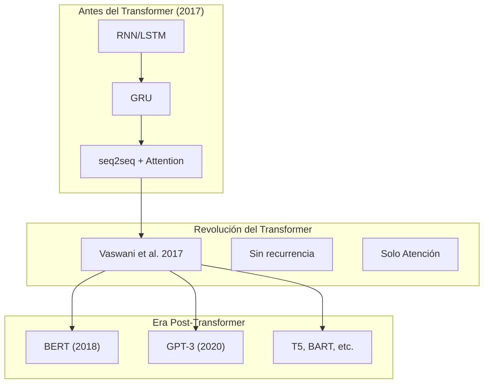
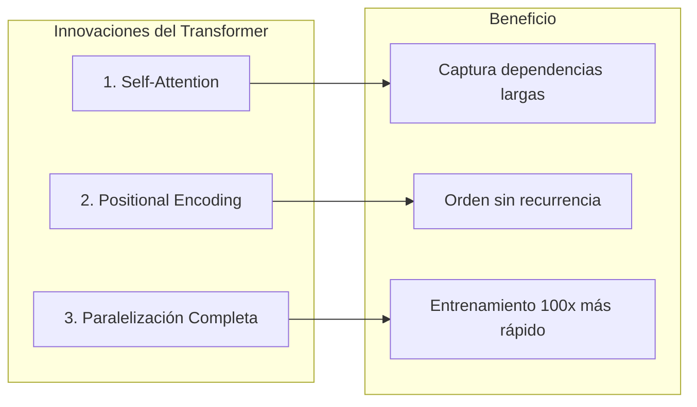
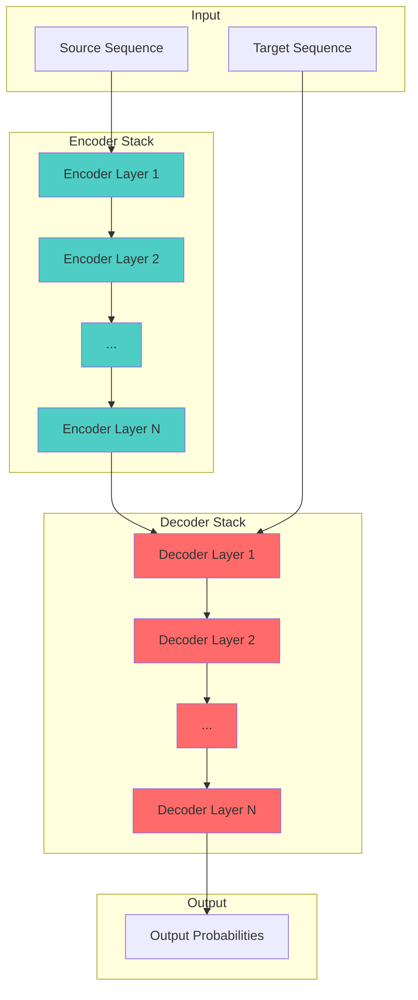
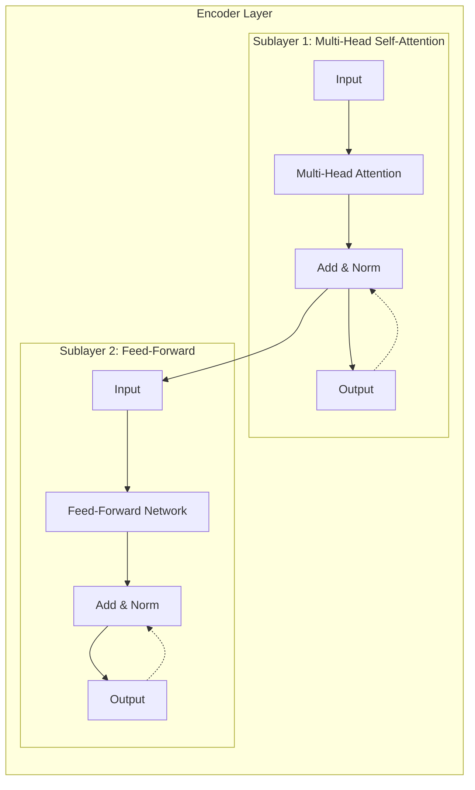
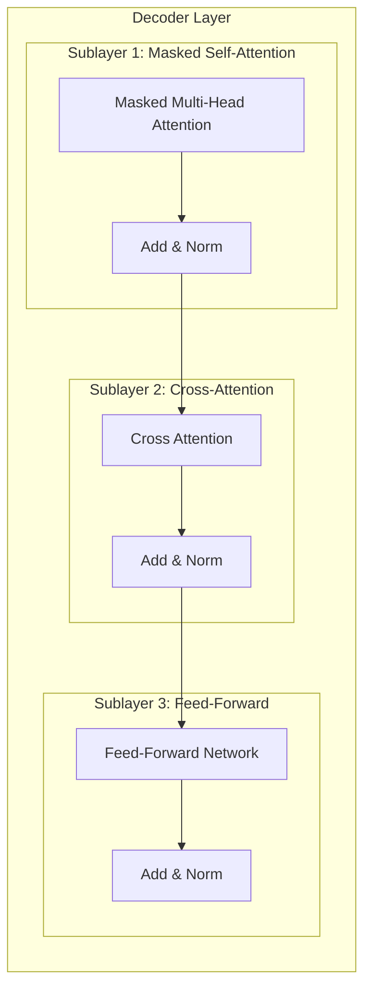
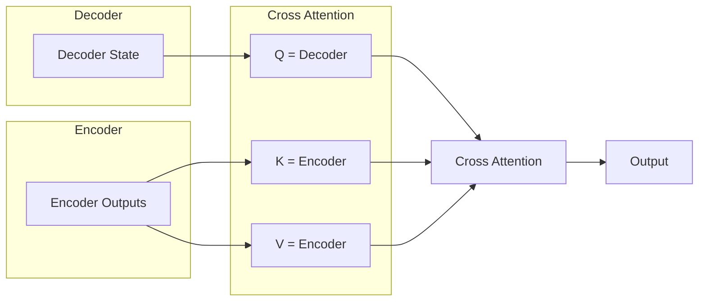
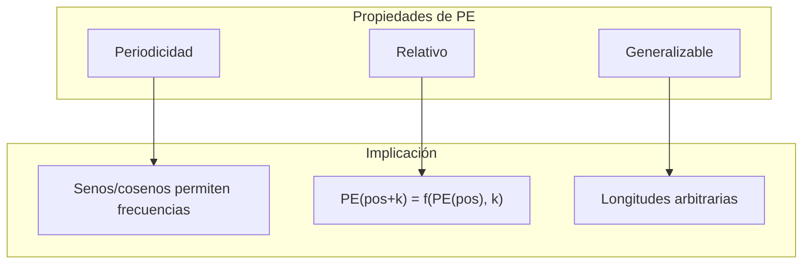
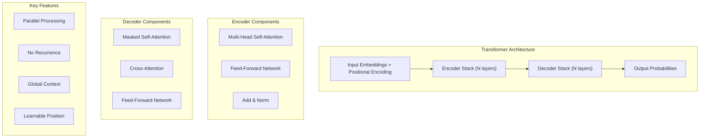

# Clase 10: Arquitectura Transformer - Fundamentos

## Duración: 4 horas

---

## 1. Objetivos de Aprendizaje

Al finalizar esta clase, el estudiante será capaz de:

1. **Comprender la arquitectura completa del Transformer** y sus componentes
2. **Explicar el mecanismo de Positional Encoding** y su importancia
3. **Describir el flujo de datos** a través del Encoder y Decoder
4. **Implementar un Transformer básico** usando PyTorch
5. **Comparar Transformers con arquitecturas RNN/LSTM** tradicionales
6. **Utilizar la librería Hugging Face Transformers** para tareas prácticas

---

## 2. Contenidos Detallados

### 2.1 Introducción al Transformer

#### 2.1.1 Contexto Histórico

El Transformer, introducido en 2017 por Vaswani et al. en el paper "Attention Is All You Need", revolucionó el procesamiento del lenguaje natural al eliminar completamente la recurrencia:



#### 2.1.2 Innovaciones Clave

El Transformer introduce tres innovaciones fundamentales:



**Comparación RNN vs Transformer:**

```mermaid
flowchart TD
    subgraph "RNN Secuencial"
        R1["Input x₁"] --> R2["LSTM"]
        R2 --> R3["Estado h₁"]
        R3 --> R4["LSTM"]
        R4 --> R5["Estado h₂"]
        R5 --> R6["LSTM"]
        R6 --> R7["..."]
        
        style R2 fill:#ff6b6b
        style R4 fill:#ff6b6b
        style R6 fill:#ff6b6b
    end
    
    subgraph "Transformer Paralelo"
        T1["x₁, x₂, x₃..."]
        T2["Multi-Head Self-Attention"]
        T3["Feed-Forward"]
        T4["Output en paralelo"]
        
        T1 --> T2 --> T3 --> T4
        
        style T2 fill:#4ecdc4
        style T3 fill:#4ecdc4
    end
```



---

### 2.2 Arquitectura General del Transformer

#### 2.2.1 Vista de Alto Nivel



#### 2.2.2 Componentes del Encoder Layer



#### 2.2.3 Componentes del Decoder Layer



**Flujo de datos en Cross-Attention:**


---

### 2.3 Positional Encoding

#### 2.3.1 El Problema de la Posición

El Transformer no tiene noción inherente del orden porque usa atención que es permutationally invariant. Necesitamos codificar la posición:

```
Sin positional encoding: attention("perro muerde hombre") ≈ attention("hombre muerde perro")
Con positional encoding: son diferentes
```

#### 2.3.2 Positional Encoding con Senos y Cosenos

Vaswani et al. propusieron usar funciones periódicas:

```python
import torch
import torch.nn as nn
import math

class PositionalEncoding(nn.Module):
    """
    Positional Encoding usando senos y cosenos
    
    PE(pos, 2i)   = sin(pos / 10000^(2i/d_model))
    PE(pos, 2i+1) = cos(pos / 10000^(2i/d_model))
    
    donde:
    - pos: posición en la secuencia (0-indexed)
    - i: índice de la dimensión
    - d_model: dimensionalidad del embedding
    """
    
    def __init__(self, d_model: int, max_len: int = 5000, dropout: float = 0.1):
        super().__init__()
        self.dropout = nn.Dropout(p=dropout)
        
        # Crear matriz de positional encoding
        pe = torch.zeros(max_len, d_model)
        position = torch.arange(0, max_len, dtype=torch.float).unsqueeze(1)
        # position: (max_len, 1)
        
        div_term = torch.exp(
            torch.arange(0, d_model, 2, dtype=torch.float) * 
            (-math.log(10000.0) / d_model)
        )
        # div_term: (d_model/2,)
        
        # Aplicar senos y cosenos
        pe[:, 0::2] = torch.sin(position * div_term)
        pe[:, 1::2] = torch.cos(position * div_term)
        
        # Agregar batch dimension
        pe = pe.unsqueeze(0)  # (1, max_len, d_model)
        
        # Registrar como buffer (no es parámetro entrenable)
        self.register_buffer('pe', pe)
    
    def forward(self, x: torch.Tensor) -> torch.Tensor:
        """
        Args:
            x: (batch, seq_len, d_model)
        
        Returns:
            x + positional encoding: (batch, seq_len, d_model)
        """
        x = x + self.pe[:, :x.size(1), :]
        return self.dropout(x)


def visualize_positional_encodings(d_model: int = 64, max_len: int = 100):
    """Visualiza los positional encodings"""
    import matplotlib.pyplot as plt
    import numpy as np
    
    pe = torch.zeros(max_len, d_model)
    position = torch.arange(0, max_len, dtype=torch.float).unsqueeze(1)
    div_term = torch.exp(
        torch.arange(0, d_model, 2, dtype=torch.float) * 
        (-math.log(10000.0) / d_model)
    )
    
    pe[:, 0::2] = torch.sin(position * div_term)
    pe[:, 1::2] = torch.cos(position * div_term)
    
    pe = pe.numpy()
    
    fig, axes = plt.subplots(2, 2, figsize=(14, 10))
    
    # Plot 1: Full PE matrix
    ax1 = axes[0, 0]
    im = ax1.imshow(pe.T, aspect='auto', cmap='RdBu')
    ax1.set_xlabel('Position')
    ax1.set_ylabel('Dimension')
    ax1.set_title('Positional Encoding Matrix')
    plt.colorbar(im, ax=ax1)
    
    # Plot 2: PE for different positions
    ax2 = axes[0, 1]
    for pos in [0, 10, 50, 99]:
        ax2.plot(pe[pos], label=f'pos={pos}')
    ax2.set_xlabel('Dimension')
    ax2.set_ylabel('Value')
    ax2.set_title('PE for Different Positions')
    ax2.legend()
    
    # Plot 3: Single dimensions over positions
    ax3 = axes[1, 0]
    for dim in [0, 1, 2, 3, 8, 63]:
        ax3.plot(pe[:, dim], label=f'dim={dim}')
    ax3.set_xlabel('Position')
    ax3.set_ylabel('Value')
    ax3.set_title('Different Dimensions over Position')
    ax3.legend()
    
    # Plot 4: Heatmap for specific dimensions
    ax4 = axes[1, 1]
    dims_to_show = list(range(0, d_model, 8))
    pe_subset = pe[:, dims_to_show]
    im4 = ax4.imshow(pe_subset[:50].T, aspect='auto', cmap='RdBu')
    ax4.set_xlabel('Position')
    ax4.set_ylabel('Dimension (sampled)')
    ax4.set_title('PE (first 50 positions, sampled dims)')
    plt.colorbar(im4, ax=ax4)
    
    plt.tight_layout()
    plt.savefig('positional_encoding.png', dpi=150)
    plt.show()
```

#### 2.3.3 Propiedades del Positional Encoding



**¿Por qué senos y cosenos?**
- Permiten codificar posiciones relativas: existe una relación lineal entre PE(pos+k) y PE(pos)
- Generaliza a secuencias más largas que las vistas en entrenamiento
- Alternativas: embeddings aprendidos, relative positional encoding, RoPE, ALiBi

---

### 2.4 Encoder del Transformer

#### 2.4.1 Implementación Completa

```python
import torch
import torch.nn as nn
import torch.nn.functional as F
import math
import copy

class TransformerEncoder(nn.Module):
    """
    Transformer Encoder completo
    """
    
    def __init__(self, vocab_size: int, d_model: int = 512, num_heads: int = 8,
                 num_layers: int = 6, d_ff: int = 2048, dropout: float = 0.1,
                 max_len: int = 5000):
        super().__init__()
        
        self.d_model = d_model
        self.num_layers = num_layers
        
        # Embedding
        self.embedding = nn.Embedding(vocab_size, d_model, padding_idx=0)
        
        # Positional Encoding
        self.pos_encoder = PositionalEncoding(d_model, max_len, dropout)
        
        # Stack de Encoder Layers
        self.encoder_layers = nn.ModuleList([
            EncoderLayer(d_model, num_heads, d_ff, dropout)
            for _ in range(num_layers)
        ])
        
        # Normalización final
        self.norm = nn.LayerNorm(d_model)
    
    def forward(self, src: torch.Tensor, src_mask: torch.Tensor = None,
                src_key_padding_mask: torch.Tensor = None) -> torch.Tensor:
        """
        Args:
            src: (batch, seq_len)
            src_mask: máscara para atención (seq_len, seq_len)
            src_key_padding_mask: máscara de padding (batch, seq_len)
        
        Returns:
            (batch, seq_len, d_model)
        """
        # Embedding y positional encoding
        x = self.embedding(src) * math.sqrt(self.d_model)
        x = self.pos_encoder(x)
        
        # Aplicar cada capa del encoder
        for layer in self.encoder_layers:
            x = layer(x, src_mask, src_key_padding_mask)
        
        # Normalización final
        x = self.norm(x)
        
        return x


class EncoderLayer(nn.Module):
    """
    Una capa del Encoder
    
    Cada capa tiene:
    1. Multi-Head Self-Attention
    2. Feed-Forward Network
    
    Con conexiones residuales y layer normalization
    """
    
    def __init__(self, d_model: int, num_heads: int, d_ff: int, dropout: float = 0.1):
        super().__init__()
        
        # Self-Attention
        self.self_attn = nn.MultiheadAttention(
            d_model, num_heads, dropout=dropout, batch_first=True
        )
        
        # Feed-Forward
        self.feed_forward = nn.Sequential(
            nn.Linear(d_model, d_ff),
            nn.ReLU(),
            nn.Dropout(dropout),
            nn.Linear(d_ff, d_model),
            nn.Dropout(dropout)
        )
        
        # Layer Normalization (2 instances)
        self.norm1 = nn.LayerNorm(d_model)
        self.norm2 = nn.LayerNorm(d_model)
        
        # Dropout
        self.dropout1 = nn.Dropout(dropout)
        self.dropout2 = nn.Dropout(dropout)
    
    def forward(self, src: torch.Tensor, src_mask: torch.Tensor = None,
                src_key_padding_mask: torch.Tensor = None) -> torch.Tensor:
        """
        Args:
            src: (batch, seq_len, d_model)
            src_mask: (seq_len, seq_len) o (batch*num_heads, seq_len, seq_len)
            src_key_padding_mask: (batch, seq_len)
        
        Returns:
            (batch, seq_len, d_model)
        """
        # Self-Attention con skip connection y norm
        attn_output, _ = self.self_attn(
            src, src, src,
            attn_mask=src_mask,
            key_padding_mask=src_key_padding_mask
        )
        src = self.norm1(src + self.dropout1(attn_output))
        
        # Feed-Forward con skip connection y norm
        ff_output = self.feed_forward(src)
        src = self.norm2(src + self.dropout2(ff_output))
        
        return src
```

#### 2.4.2 Tipos de Máscaras

```python
def create_padding_mask(seq: torch.Tensor, pad_idx: int = 0) -> torch.Tensor:
    """
    Crea máscara para padding (posiciones con PAD deben ser ignoradas)
    
    Args:
        seq: (batch, seq_len)
    
    Returns:
        mask: (batch, 1, 1, seq_len) - para broadcasting con attention weights
    """
    mask = (seq != pad_idx).unsqueeze(1).unsqueeze(2)
    # mask: (batch, 1, 1, seq_len)
    return mask


def create_causal_mask(seq_len: int, device: torch.device = None) -> torch.Tensor:
    """
    Crea máscara causal para autoregressive decoding
    
    Args:
        seq_len: longitud de la secuencia
    
    Returns:
        mask: (seq_len, seq_len) - triangular inferior = 1, superior = 0
    """
    # Triangular superior = 0 (ignorar), triangular inferior = 1 (atender)
    mask = torch.triu(torch.ones(seq_len, seq_len, device=device), diagonal=1).bool()
    # Máscara invertida: True = ignorar, False = atender
    return ~mask  # Retornar como bool donde True = atender


def create_combined_mask(tgt: torch.Tensor, pad_idx: int = 0) -> torch.Tensor:
    """
    Combina máscara de padding y causal
    """
    seq_len = tgt.size(1)
    
    # Padding mask
    padding_mask = create_padding_mask(tgt, pad_idx)
    
    # Causal mask
    causal_mask = create_causal_mask(seq_len, tgt.device)
    
    # Combinar: True = atender, False = ignorar
    combined_mask = padding_mask & causal_mask
    
    return combined_mask.squeeze(1)  # (batch, seq_len, seq_len)


# Ejemplo de uso
batch_size = 2
seq_len = 5
seq = torch.tensor([[1, 2, 3, 0, 0], [1, 2, 0, 0, 0]])

padding_mask = create_padding_mask(seq)
print(f"Padding mask shape: {padding_mask.shape}")
print(f"Padding mask[0]:\n{padding_mask[0]}")

causal_mask = create_causal_mask(seq_len)
print(f"\nCausal mask:\n{causal_mask}")
```

---

### 2.5 Decoder del Transformer

#### 2.5.1 Implementación Completa

```python
class TransformerDecoder(nn.Module):
    """
    Transformer Decoder completo
    """
    
    def __init__(self, vocab_size: int, d_model: int = 512, num_heads: int = 8,
                 num_layers: int = 6, d_ff: int = 2048, dropout: float = 0.1,
                 max_len: int = 5000):
        super().__init__()
        
        self.d_model = d_model
        
        # Embedding
        self.embedding = nn.Embedding(vocab_size, d_model, padding_idx=0)
        
        # Positional Encoding
        self.pos_encoder = PositionalEncoding(d_model, max_len, dropout)
        
        # Stack de Decoder Layers
        self.decoder_layers = nn.ModuleList([
            DecoderLayer(d_model, num_heads, d_ff, dropout)
            for _ in range(num_layers)
        ])
        
        # Normalización final
        self.norm = nn.LayerNorm(d_model)
        
        # Proyección a vocabulario
        self.fc_out = nn.Linear(d_model, vocab_size)
    
    def forward(self, tgt: torch.Tensor, memory: torch.Tensor,
                tgt_mask: torch.Tensor = None, tgt_key_padding_mask: torch.Tensor = None,
                memory_mask: torch.Tensor = None, memory_key_padding_mask: torch.Tensor = None):
        """
        Args:
            tgt: (batch, tgt_len) - secuencia objetivo
            memory: (batch, src_len, d_model) - salida del encoder
            tgt_mask: máscara causal (tgt_len, tgt_len)
            tgt_key_padding_mask: máscara de padding objetivo (batch, tgt_len)
            memory_mask: máscara para encoder (src_len, src_len) - usualmente None
            memory_key_padding_mask: máscara de padding source (batch, src_len)
        
        Returns:
            output: (batch, tgt_len, vocab_size)
        """
        # Embedding y positional encoding
        x = self.embedding(tgt) * math.sqrt(self.d_model)
        x = self.pos_encoder(x)
        
        # Aplicar cada capa del decoder
        for layer in self.decoder_layers:
            x = layer(
                x, memory,
                tgt_mask=tgt_mask,
                tgt_key_padding_mask=tgt_key_padding_mask,
                memory_mask=memory_mask,
                memory_key_padding_mask=memory_key_padding_mask
            )
        
        # Normalización final
        x = self.norm(x)
        
        # Proyección a vocabulario
        output = self.fc_out(x)
        
        return output


class DecoderLayer(nn.Module):
    """
    Una capa del Decoder
    
    Cada capa tiene:
    1. Masked Self-Attention (causal)
    2. Cross-Attention (attends a encoder)
    3. Feed-Forward Network
    """
    
    def __init__(self, d_model: int, num_heads: int, d_ff: int, dropout: float = 0.1):
        super().__init__()
        
        # Masked Self-Attention
        self.self_attn = nn.MultiheadAttention(
            d_model, num_heads, dropout=dropout, batch_first=True
        )
        
        # Cross-Attention (Encoder-Decoder Attention)
        self.cross_attn = nn.MultiheadAttention(
            d_model, num_heads, dropout=dropout, batch_first=True
        )
        
        # Feed-Forward
        self.feed_forward = nn.Sequential(
            nn.Linear(d_model, d_ff),
            nn.ReLU(),
            nn.Dropout(dropout),
            nn.Linear(d_ff, d_model),
            nn.Dropout(dropout)
        )
        
        # Layer Normalization
        self.norm1 = nn.LayerNorm(d_model)
        self.norm2 = nn.LayerNorm(d_model)
        self.norm3 = nn.LayerNorm(d_model)
        
        # Dropout
        self.dropout1 = nn.Dropout(dropout)
        self.dropout2 = nn.Dropout(dropout)
        self.dropout3 = nn.Dropout(dropout)
    
    def forward(self, tgt: torch.Tensor, memory: torch.Tensor,
                tgt_mask: torch.Tensor = None, tgt_key_padding_mask: torch.Tensor = None,
                memory_mask: torch.Tensor = None, memory_key_padding_mask: torch.Tensor = None):
        """
        Args:
            tgt: (batch, tgt_len, d_model)
            memory: (batch, src_len, d_model)
        
        Returns:
            (batch, tgt_len, d_model)
        """
        # Masked Self-Attention
        tgt2, _ = self.self_attn(
            tgt, tgt, tgt,
            attn_mask=tgt_mask,
            key_padding_mask=tgt_key_padding_mask
        )
        tgt = self.norm1(tgt + self.dropout1(tgt2))
        
        # Cross-Attention: Query del decoder, Keys/Values del encoder
        tgt2, _ = self.cross_attn(
            tgt, memory, memory,
            attn_mask=memory_mask,
            key_padding_mask=memory_key_padding_mask
        )
        tgt = self.norm2(tgt + self.dropout2(tgt2))
        
        # Feed-Forward
        tgt2 = self.feed_forward(tgt)
        tgt = self.norm3(tgt + self.dropout3(tgt2))
        
        return tgt
```

---

### 2.6 Transformer Completo (Encoder-Decoder)

```python
class Transformer(nn.Module):
    """
    Transformer Completo (Encoder-Decoder)
    
    paper: "Attention Is All You Need" - Vaswani et al. 2017
    """
    
    def __init__(self, src_vocab_size: int, tgt_vocab_size: int,
                 d_model: int = 512, num_heads: int = 8,
                 num_encoder_layers: int = 6, num_decoder_layers: int = 6,
                 d_ff: int = 2048, dropout: float = 0.1, max_len: int = 5000):
        super().__init__()
        
        self.encoder = TransformerEncoder(
            src_vocab_size, d_model, num_heads,
            num_encoder_layers, d_ff, dropout, max_len
        )
        
        self.decoder = TransformerDecoder(
            tgt_vocab_size, d_model, num_heads,
            num_decoder_layers, d_ff, dropout, max_len
        )
    
    def forward(self, src: torch.Tensor, tgt: torch.Tensor,
                src_key_padding_mask: torch.Tensor = None,
                tgt_key_padding_mask: torch.Tensor = None):
        """
        Args:
            src: (batch, src_len)
            tgt: (batch, tgt_len)
        
        Returns:
            (batch, tgt_len, tgt_vocab_size)
        """
        # Encoder
        memory = self.encoder(src, src_key_padding_mask=src_key_padding_mask)
        
        # Decoder
        tgt_len = tgt.size(1)
        tgt_mask = create_causal_mask(tgt_len, tgt.device)
        
        output = self.decoder(
            tgt, memory,
            tgt_mask=tgt_mask,
            tgt_key_padding_mask=tgt_key_padding_mask,
            memory_key_padding_mask=src_key_padding_mask
        )
        
        return output
```

---

### 2.7 Hugging Face Transformers

#### 2.7.1 Introducción a Hugging Face

Hugging Face proporciona una librería que simplifica el uso de modelos pre-entrenados:

```python
# Instalación
# pip install transformers datasets

from transformers import AutoTokenizer, AutoModel, AutoModelForSequenceClassification
import torch

# Cargar modelo pre-entrenado
model_name = "bert-base-uncased"

tokenizer = AutoTokenizer.from_pretrained(model_name)
model = AutoModel.from_pretrained(model_name)

# Tokenización
text = "This is a sample text for processing"
inputs = tokenizer(text, return_tensors="pt", padding=True, truncation=True)

# Forward pass
with torch.no_grad():
    outputs = model(**inputs)

#outputs.last_hidden_state: (batch, seq_len, hidden_size)
#outputs.pooler_output: (batch, hidden_size) - CLS token después de线性+tanH

print(f"Input tokens: {inputs['input_ids']}")
print(f"Last hidden state shape: {outputs.last_hidden_state.shape}")
print(f"Pooler output shape: {outputs.pooler_output.shape}")
```

#### 2.7.2 Pipeline de Hugging Face

```python
from transformers import pipeline

# Clasificación de texto
classifier = pipeline("sentiment-analysis")
result = classifier("I love using Hugging Face transformers!")
print(result)

# Traducción
translator = pipeline("translation_en_to_fr")
result = translator("The weather is nice today")
print(result)

# Resumen
summarizer = pipeline("summarization")
result = summarizer("Long text to summarize...")
print(result)

# Pregunta y respuesta
qa = pipeline("question-answering")
context = "The capital of France is Paris."
question = "What is the capital of France?"
result = qa(question=question, context=context)
print(result)
```

#### 2.7.3 Fine-tuning con Hugging Face

```python
from transformers import AutoTokenizer, AutoModelForSequenceClassification
from transformers import Trainer, TrainingArguments
from datasets import load_dataset
import torch

# Cargar dataset
dataset = load_dataset("imdb")
tokenizer = AutoTokenizer.from_pretrained("bert-base-uncased")

# Tokenización
def tokenize_function(examples):
    return tokenizer(examples["text"], padding="max_length", truncation=True, max_length=512)

tokenized_dataset = dataset.map(tokenize_function, batched=True)

# Modelo
model = AutoModelForSequenceClassification.from_pretrained("bert-base-uncased", num_labels=2)

# Configuración de entrenamiento
training_args = TrainingArguments(
    output_dir="./results",
    num_train_epochs=3,
    per_device_train_batch_size=8,
    per_device_eval_batch_size=8,
    warmup_steps=500,
    weight_decay=0.01,
    logging_dir="./logs",
    logging_steps=10,
)

# Trainer
trainer = Trainer(
    model=model,
    args=training_args,
    train_dataset=tokenized_dataset["train"].select(range(1000)),
    eval_dataset=tokenized_dataset["test"].select(range(500)),
)

# Entrenar
trainer.train()
```

---

## 3. Ejercicios Prácticos Resueltos y Explicados

### Ejercicio 1: Implementación Completa de un Transformer para Traducción

```python
"""
Ejercicio 1: Transformer para Traducción
=========================================
Implementación completa del Transformer del paper original
"""

import torch
import torch.nn as nn
import torch.optim as optim
from torch.utils.data import Dataset, DataLoader
import torch.nn.functional as F
import math
import copy
from typing import Optional
import random

# =============================================================
# PARTE 1: COMPONENTES DEL TRANSFORMER
# =============================================================

def clones(module: nn.Module, N: int) -> nn.ModuleList:
    """Produce N copias idénticas del módulo."""
    return nn.ModuleList([copy.deepcopy(module) for _ in range(N)])


class PositionalEncoding(nn.Module):
    """Codificación posicional usando senos y cosenos"""
    
    def __init__(self, d_model: int, max_len: int = 5000, dropout: float = 0.1):
        super().__init__()
        self.dropout = nn.Dropout(p=dropout)
        
        pe = torch.zeros(max_len, d_model)
        position = torch.arange(0, max_len, dtype=torch.float).unsqueeze(1)
        div_term = torch.exp(torch.arange(0, d_model, 2, dtype=torch.float) * 
                           (-math.log(10000.0) / d_model))
        pe[:, 0::2] = torch.sin(position * div_term)
        pe[:, 1::2] = torch.cos(position * div_term)
        pe = pe.unsqueeze(0)
        self.register_buffer('pe', pe)
    
    def forward(self, x: torch.Tensor) -> torch.Tensor:
        x = x + self.pe[:, :x.size(1), :]
        return self.dropout(x)


class EncoderDecoder(nn.Module):
    """
    Arquitectura Encoder-Decoder del Transformer
    """
    
    def __init__(self, encoder, decoder, src_embed, tgt_embed, generator):
        super().__init__()
        self.encoder = encoder
        self.decoder = decoder
        self.src_embed = src_embed
        self.tgt_embed = tgt_embed
        self.generator = generator
    
    def forward(self, src, tgt, src_mask, tgt_mask):
        "Take in and process masked src and target sequences."
        return self.decode(self.encode(src, src_mask), src_mask, tgt, tgt_mask)
    
    def encode(self, src, src_mask):
        return self.encoder(self.src_embed(src), src_mask)
    
    def decode(self, memory, src_mask, tgt, tgt_mask):
        return self.decoder(self.tgt_embed(tgt), memory, src_mask, tgt_mask)


class Encoder(nn.Module):
    """N capas de Encoder"""
    
    def __init__(self, layer, N: int):
        super().__init__()
        self.layers = clones(layer, N)
        self.norm = nn.LayerNorm(layer.size)
    
    def forward(self, x, mask):
        for layer in self.layers:
            x = layer(x, mask)
        return self.norm(x)


class EncoderLayer(nn.Module):
    """Una capa del Encoder"""
    
    def __init__(self, size: int, self_attn: nn.Module, feed_forward: nn.Module, dropout: float):
        super().__init__()
        self.size = size
        self.self_attn = self_attn
        self.feed_forward = feed_forward
        self.sublayer = clones(SublayerConnection(size, dropout), 2)
    
    def forward(self, x, mask):
        x = self.sublayer[0](x, lambda x: self.self_attn(x, x, x, mask))
        return self.sublayer[1](x, self.feed_forward)


class Decoder(nn.Module):
    """N capas de Decoder"""
    
    def __init__(self, layer, N: int):
        super().__init__()
        self.layers = clones(layer, N)
        self.norm = nn.LayerNorm(layer.size)
    
    def forward(self, x, memory, src_mask, tgt_mask):
        for layer in self.layers:
            x = layer(x, memory, src_mask, tgt_mask)
        return self.norm(x)


class DecoderLayer(nn.Module):
    """Una capa del Decoder"""
    
    def __init__(self, size: int, self_attn: nn.Module, src_attn: nn.Module,
                 feed_forward: nn.Module, dropout: float):
        super().__init__()
        self.size = size
        self.self_attn = self_attn
        self.src_attn = src_attn
        self.feed_forward = feed_forward
        self.sublayer = clones(SublayerConnection(size, dropout), 3)
    
    def forward(self, x, memory, src_mask, tgt_mask):
        m = memory
        x = self.sublayer[0](x, lambda x: self.self_attn(x, x, x, tgt_mask))
        x = self.sublayer[1](x, lambda x: self.src_attn(x, m, m, src_mask))
        return self.sublayer[2](x, self.feed_forward)


class SublayerConnection(nn.Module):
    """Conexión residual con layer normalization"""
    
    def __init__(self, size: int, dropout: float):
        super().__init__()
        self.norm = nn.LayerNorm(size)
        self.dropout = nn.Dropout(dropout)
    
    def forward(self, x, sublayer):
        return x + self.dropout(sublayer(self.norm(x)))


class MultiHeadedAttention(nn.Module):
    """Multi-Head Attention"""
    
    def __init__(self, h: int, d_model: int, dropout: float = 0.1):
        super().__init__()
        assert d_model % h == 0
        self.d_k = d_model // h
        self.h = h
        self.linears = clones(nn.Linear(d_model, d_model), 4)
        self.attn = None
        self.dropout = nn.Dropout(p=dropout)
    
    def attention(self, query, key, value, mask=None):
        d_k = query.size(-1)
        scores = torch.matmul(query, key.transpose(-2, -1)) / math.sqrt(d_k)
        if mask is not None:
            scores = scores.masked_fill(mask == 0, -1e9)
        p_attn = F.softmax(scores, dim=-1)
        p_attn = self.dropout(p_attn)
        return torch.matmul(p_attn, value), p_attn
    
    def forward(self, query, key, value, mask=None):
        if mask is not None:
            mask = mask.unsqueeze(1)
        nbatches = query.size(0)
        
        query, key, value = [
            lin(x).view(nbatches, -1, self.h, self.d_k).transpose(1, 2)
            for lin, x in zip(self.linears, (query, key, value))
        ]
        
        x, self.attn = self.attention(query, key, value, mask=mask)
        
        x = x.transpose(1, 2).contiguous().view(nbatches, -1, self.h * self.d_k)
        return self.linears[-1](x)


class PositionwiseFeedForward(nn.Module):
    """Feed-Forward Network position-wise"""
    
    def __init__(self, d_model: int, d_ff: int, dropout: float = 0.1):
        super().__init__()
        self.w_1 = nn.Linear(d_model, d_ff)
        self.w_2 = nn.Linear(d_ff, d_model)
        self.dropout = nn.Dropout(dropout)
    
    def forward(self, x):
        return self.w_2(self.dropout(F.relu(self.w_1(x))))


class Embeddings(nn.Module):
    """Embeddings de palabras"""
    
    def __init__(self, d_model: int, vocab: int):
        super().__init__()
        self.lut = nn.Embedding(vocab, d_model)
        self.d_model = d_model
    
    def forward(self, x):
        return self.lut(x) * math.sqrt(self.d_model)


class Generator(nn.Module):
    """Generador que mapea a vocabulario"""
    
    def __init__(self, d_model: int, vocab: int):
        super().__init__()
        self.proj = nn.Linear(d_model, vocab)
    
    def forward(self, x):
        return F.log_softmax(self.proj(x), dim=-1)


# =============================================================
# PARTE 2: CONSTRUCCIÓN DEL MODELO
# =============================================================

def make_model(src_vocab: int, tgt_vocab: int, N: int = 6,
               d_model: int = 512, d_ff: int = 2048, h: int = 8,
               dropout: float = 0.1) -> EncoderDecoder:
    """Construye el modelo Transformer"""
    
    c = copy.deepcopy
    attn = MultiHeadedAttention(h, d_model)
    ff = PositionwiseFeedForward(d_model, d_ff, dropout)
    position = PositionalEncoding(d_model, dropout)
    
    model = EncoderDecoder(
        Encoder(EncoderLayer(d_model, c(attn), c(ff), dropout), N),
        Decoder(DecoderLayer(d_model, c(attn), c(attn), c(ff), dropout), N),
        nn.Sequential(Embeddings(d_model, src_vocab), c(position)),
        nn.Sequential(Embeddings(d_model, tgt_vocab), c(position)),
        Generator(d_model, tgt_vocab)
    )
    
    # Inicialización de parámetros
    for p in model.parameters():
        if p.dim() > 1:
            nn.init.xavier_uniform_(p)
    
    return model


# =============================================================
# PARTE 3: DATOS Y ENTRENAMIENTO
# =============================================================

class Vocab:
    """Vocabulario simple"""
    def __init__(self):
        self.word2idx = {'<PAD>': 0, '<SOS>': 1, '<EOS>': 2, '<UNK>': 3}
        self.idx2word = {v: k for k, v in self.word2idx.items()}
        self.n_words = 4
    
    def add_sentence(self, sentence: str):
        for word in sentence.split():
            self.add_word(word)
    
    def add_word(self, word: str):
        if word not in self.word2idx:
            self.word2idx[word] = self.n_words
            self.n_words += 1
    
    def encode(self, sentence: str, add_sos: bool = False, add_eos: bool = True) -> list:
        indices = []
        if add_sos:
            indices.append(self.word2idx['<SOS>'])
        for word in sentence.split():
            indices.append(self.word2idx.get(word, self.word2idx['<UNK>']))
        if add_eos:
            indices.append(self.word2idx['<EOS>'])
        return indices
    
    def decode(self, indices: list) -> str:
        words = []
        for idx in indices:
            word = self.idx2word.get(idx, '<UNK>')
            if word not in ['<PAD>', '<SOS>', '<EOS>', '<UNK>']:
                words.append(word)
        return ' '.join(words)


# Datos de entrenamiento
training_pairs = [
    ("hello world", "hola mundo"),
    ("good morning", "buenos días"),
    ("how are you", "cómo estás"),
    ("i am fine", "estoy bien"),
    ("thank you", "gracias"),
    ("goodbye", "adiós"),
]

# Construir vocabularios
src_vocab = Vocab()
tgt_vocab = Vocab()

for src, tgt in training_pairs:
    src_vocab.add_sentence(src)
    tgt_vocab.add_sentence(tgt)

print(f"Source vocab: {src_vocab.n_words}")
print(f"Target vocab: {tgt_vocab.n_words}")


def subsequent_mask(size: int) -> torch.Tensor:
    """Máscara triangular inferior"""
    attn_shape = (1, size, size)
    subsequent_mask = torch.triu(torch.ones(attn_shape), diagonal=1).type(torch.uint8)
    return subsequent_mask == 0


class Batch:
    """Batch para entrenamiento"""
    def __init__(self, src, tgt=None, pad=0):
        self.src = src
        self.src_mask = (src != pad).unsqueeze(-2)
        if tgt is not None:
            self.tgt = tgt[:, :-1]
            self.tgt_y = tgt[:, 1:]
            self.tgt_mask = self.make_std_mask(self.tgt, pad)
            self.ntokens = (self.tgt_y != pad).sum()
    
    @staticmethod
    def make_std_mask(tgt, pad):
        tgt_mask = (tgt != pad).unsqueeze(-2)
        tgt_mask = tgt_mask & Variable(subsequent_mask(tgt.size(-1)), requires_grad=False)
        return tgt_mask


class LabelSmoothing(nn.Module):
    """Label smoothing loss"""
    def __init__(self, size, padding_idx, smoothing=0.0):
        super().__init__()
        self.criterion = nn.KLDivLoss(reduction='sum')
        self.padding_idx = padding_idx
        self.confidence = 1.0 - smoothing
        self.smoothing = smoothing
        self.size = size
        self.true_dist = None
    
    def forward(self, x, target):
        assert x.size(1) == self.size
        true_dist = x.data.clone()
        true_dist.fill_(self.smoothing / (self.size - 2))
        true_dist.scatter_(1, target.data.unsqueeze(1), self.confidence)
        true_dist[:, self.padding_idx] = 0
        mask = torch.nonzero(target.data == self.padding_idx)
        if mask.dim() > 0:
            true_dist.index_fill_(0, mask.squeeze(), 0.0)
        self.true_dist = true_dist
        return self.criterion(x, Variable(true_dist, requires_grad=False))


def run_epoch(data_iter, model, loss_compute, device):
    """Ejecuta una época de entrenamiento"""
    total_tokens = 0
    total_loss = 0
    tokens = 0
    
    for batch in data_iter:
        src = batch.src.to(device)
        tgt = batch.tgt.to(device)
        
        # Máscaras
        src_mask = (src != 0).unsqueeze(-2)
        tgt_mask = batch.tgt_mask.to(device)
        
        # Forward
        output = model(src, tgt, src_mask, tgt_mask)
        
        # Loss
        loss = loss_compute(output, batch.tgt_y.to(device), batch.ntokens.to(device))
        
        total_loss += loss
        total_tokens += batch.ntokens.item()
        tokens += batch.ntokens.item()
    
    return math.exp(total_loss / total_tokens)


# =============================================================
# PARTE 4: EJECUCIÓN
# =============================================================

def main():
    device = torch.device('cuda' if torch.cuda.is_available() else 'cpu')
    print(f"Using device: {device}")
    
    # Crear modelo
    model = make_model(
        src_vocab=src_vocab.n_words,
        tgt_vocab=tgt_vocab.n_words,
        N=2,  # Capas reducidas para demo
        d_model=128,
        d_ff=256,
        h=4,
        dropout=0.1
    ).to(device)
    
    print(f"Model parameters: {sum(p.numel() for p in model.parameters()):,}")
    
    # Crear datos de entrenamiento
    src_data = []
    tgt_data = []
    
    for src, tgt in training_pairs * 10:  # Repitir para más datos
        src_enc = src_vocab.encode(src, add_sos=False, add_eos=True)
        tgt_enc = tgt_vocab.encode(tgt, add_sos=True, add_eos=True)
        src_data.append(torch.tensor(src_enc))
        tgt_data.append(torch.tensor(tgt_enc))
    
    # Padding
    max_src_len = max(len(s) for s in src_data)
    max_tgt_len = max(len(t) for t in tgt_data)
    
    for i in range(len(src_data)):
        src_data[i] = torch.cat([
            src_data[i],
            torch.zeros(max_src_len - len(src_data[i]), dtype=torch.long)
        ])
        tgt_data[i] = torch.cat([
            tgt_data[i],
            torch.zeros(max_tgt_len - len(tgt_data[i]), dtype=torch.long)
        ])
    
    src_tensor = torch.stack(src_data)
    tgt_tensor = torch.stack(tgt_data)
    
    # Crear batches
    batch_size = 4
    num_batches = len(src_tensor) // batch_size
    
    # Loss
    criterion = LabelSmoothing(tgt_vocab.n_words, padding_idx=0, smoothing=0.1)
    optimizer = optim.Adam(model.parameters(), lr=0.0001, betas=(0.9, 0.98), eps=1e-9)
    
    # Training loop
    print("\nTraining Transformer...")
    for epoch in range(100):
        model.train()
        
        for i in range(num_batches):
            batch_start = i * batch_size
            batch_end = (i + 1) * batch_size
            
            src_batch = src_tensor[batch_start:batch_end]
            tgt_batch = tgt_tensor[batch_start:batch_end]
            
            optimizer.zero_grad()
            
            # Forward
            src_mask = (src_batch != 0).unsqueeze(-2).to(device)
            tgt_mask = subsequent_mask(tgt_batch.size(1)).to(device)
            
            output = model(src_batch.to(device), tgt_batch.to(device), src_mask, tgt_mask)
            
            # Loss
            loss = criterion(
                output.view(-1, tgt_vocab.n_words),
                tgt_batch[:, 1:].contiguous().view(-1).to(device)
            )
            
            loss.backward()
            torch.nn.utils.clip_grad_norm_(model.parameters(), 1.0)
            optimizer.step()
        
        if (epoch + 1) % 20 == 0:
            print(f"Epoch {epoch+1:3d} - Loss: {loss.item():.4f}")
    
    # Pruebas
    print("\n" + "="*50)
    print("PRUEBAS DE TRADUCCIÓN")
    print("="*50)
    
    model.eval()
    
    for src_sentence in ["hello world", "good morning", "thank you"]:
        src_enc = src_vocab.encode(src_sentence, add_sos=False, add_eos=True)
        src_batch = torch.tensor([src_enc]).to(device)
        src_mask = (src_batch != 0).unsqueeze(-2)
        
        # Greedy decode
        max_len = 20
        tgt_indices = [tgt_vocab.word2idx['<SOS>']]
        
        for _ in range(max_len):
            tgt_tensor = torch.tensor([tgt_indices]).to(device)
            tgt_mask = subsequent_mask(len(tgt_indices)).to(device)
            
            output = model(src_batch, tgt_tensor, src_mask, tgt_mask)
            
            next_token = output[0, -1].argmax().item()
            tgt_indices.append(next_token)
            
            if next_token == tgt_vocab.word2idx['<EOS>']:
                break
        
        translation = tgt_vocab.decode(tgt_indices)
        print(f"\n{src_sentence}")
        print(f"  -> {translation}")


if __name__ == "__main__":
    from torch.autograd import Variable
    main()
```

---

## 4. Actividades de Laboratorio

### Laboratorio: Construir un Traductor Simple con el Transformer del Paper

**Objetivo:** Implementar y entrenar un traductor inglés-español usando la arquitectura Transformer original.

**Tiempo estimado:** 3 horas

```python
"""
Laboratorio: Transformer para Traducción
========================================
"""

import torch
import torch.nn as nn
import torch.optim as optim
import math
import copy
from torch.utils.data import Dataset, DataLoader
import torch.nn.functional as F

# ============================================================
# IMPLEMENTACIÓN DEL TRANSFORMER (REUTILIZADA)
# ============================================================

class PositionalEncoding(nn.Module):
    def __init__(self, d_model, max_len=5000, dropout=0.1):
        super().__init__()
        self.dropout = nn.Dropout(p=dropout)
        
        pe = torch.zeros(max_len, d_model)
        position = torch.arange(0, max_len, dtype=torch.float).unsqueeze(1)
        div_term = torch.exp(torch.arange(0, d_model, 2, dtype=torch.float) * 
                           (-math.log(10000.0) / d_model))
        pe[:, 0::2] = torch.sin(position * div_term)
        pe[:, 1::2] = torch.cos(position * div_term)
        pe = pe.unsqueeze(0)
        self.register_buffer('pe', pe)
    
    def forward(self, x):
        x = x + self.pe[:, :x.size(1), :]
        return self.dropout(x)

# [Clases de Encoder, Decoder, MultiHeadedAttention, etc.]
# (Ver implementación completa arriba)

# ============================================================
# EJERCICIOS PROPUESTOS
# =========================================================

"""
EJERCICIO 1: Añadir Beam Search
-------------------------------
Implementar beam search para mejorar las traducciones.

EJERCICIO 2: Bleu Score
-----------------------
Calcular BLEU score para evaluar la calidad de traducción.

EJERCICIO 3: Attention Visualization
-------------------------------------
Visualizar los pesos de atención para interpretar el modelo.
"""

def beam_search_decode(model, src, src_mask, beam_size=3, max_len=50, 
                       sos_idx=1, eos_idx=2, device='cpu'):
    """
    Beam Search Decoding
    
    En lugar de tomar el token más probable en cada paso,
    mantenemos los beam_size mejores candidatos.
    """
    model.eval()
    
    # Inicializar beams: [(sequence, log_prob)]
    beams = [([sos_idx], 0.0)]
    completed = []
    
    with torch.no_grad():
        memory = model.encode(src, src_mask)
        
        for _ in range(max_len):
            all_candidates = []
            
            for seq, score in beams:
                if seq[-1] == eos_idx:
                    completed.append((score, seq))
                    continue
                
                tgt = torch.tensor([seq]).to(device)
                tgt_mask = model.make_std_mask(tgt, 0)
                
                out = model.decode(memory, src_mask, tgt, tgt_mask)
                log_probs = F.log_softmax(out[:, -1], dim=-1)
                
                topk_probs, topk_indices = log_probs.topk(beam_size)
                
                for prob, idx in zip(topk_probs[0], topk_indices[0]):
                    new_seq = seq + [idx.item()]
                    new_score = score + prob.item()
                    all_candidates.append((new_seq, new_score))
            
            if not all_candidates:
                break
            
            # Ordenar por score y seleccionar beam_size mejores
            all_candidates.sort(key=lambda x: x[1], reverse=True)
            beams = all_candidates[:beam_size]
            
            # Early stopping si todos los beams están completos
            if all(seq[-1] == eos_idx for seq, _ in beams):
                completed.extend(beams)
                break
    
    # Agregar beams incompletos a completed
    completed.extend(beams)
    
    # Ordenar por score normalizado por longitud
    if completed:
        completed.sort(key=lambda x: x[0] / len(x[1]), reverse=True)
        return completed[0][1]
    
    return [sos_idx]


def calculate_bleu(reference, hypothesis):
    """
    Calcular BLEU score simple (usando n-gramas)
    """
    from collections import Counter
    
    def get_ngrams(ngram_list, n):
        return [tuple(ngram_list[i:i+n]) for i in range(len(ngram_list)-n+1)]
    
    def clip_count(count, clipped_count):
        return min(count, clipped_count)
    
    reference = reference.split()
    hypothesis = hypothesis.split()
    
    reference_len = len(reference)
    hypothesis_len = len(hypothesis)
    
    if hypothesis_len == 0:
        return 0.0
    
    # Clipped counts
    clipped_hyp = Counter(get_ngrams(hypothesis, 1))
    clipped_ref = Counter(get_ngrams(reference, 1))
    
    clip_count_total = sum(
        min(c, clipped_ref.get(ngram, 0)) 
        for ngram, c in clipped_hyp.items()
    )
    
    # Precisión
    precision = clip_count_total / hypothesis_len if hypothesis_len > 0 else 0
    
    # Brevity penalty
    if hypothesis_len < reference_len:
        bp = math.exp(1 - reference_len / hypothesis_len)
    else:
        bp = 1.0
    
    return bp * precision


# ============================================================
# PRUEBA DEL LABORATORIO
# =========================================================

if __name__ == "__main__":
    print("Laboratorio: Transformer para Traducción")
    print("="*50)
    print("\nTareas:")
    print("1. Implementar Beam Search (función ya proporcionada)")
    print("2. Implementar BLEU score")
    print("3. Visualizar atención")
    print("4. Entrenar con más datos")
```

---

## 5. Tecnologías Específicas

### Hugging Face Transformers

```python
# Importar componentes específicos
from transformers import (
    # Modelos
    Transformer, GPT2LMHeadModel, BertModel,
    
    # Tokenizers
    BertTokenizer, GPT2Tokenizer, PreTrainedTokenizer,
    
    # Training
    Trainer, TrainingArguments,
    
    # Utilities
    AutoTokenizer, AutoModel, AutoConfig
)

# Cargar modelo con configuración personalizada
from transformers import AutoConfig, AutoModel

config = AutoConfig.from_pretrained("bert-base-uncased")
config.hidden_size = 256
config.num_attention_heads = 4
config.num_hidden_layers = 3

model = AutoModel.from_config(config)

# Guardar y cargar modelos
model.save_pretrained("./my_model")
loaded_model = AutoModel.from_pretrained("./my_model")
```

### TensorFlow/Keras Transformer

```python
# Implementación en TensorFlow (alternativa a PyTorch)
import tensorflow as tf
from tensorflow import keras

class TransformerEncoder(keras.layers.Layer):
    def __init__(self, embed_dim, num_heads, ff_dim, rate=0.1, **kwargs):
        super().__init__(**kwargs)
        self.att = keras.layers.MultiHeadAttention(num_heads=num_heads, key_dim=embed_dim)
        self.ffn = keras.Sequential([
            keras.layers.Dense(ff_dim, activation="relu"),
            keras.layers.Dense(embed_dim),
        ])
        self.layernorm1 = keras.layers.LayerNormalization(epsilon=1e-6)
        self.layernorm2 = keras.layers.LayerNormalization(epsilon=1e-6)
        self.dropout1 = keras.layers.Dropout(rate)
        self.dropout2 = keras.layers.Dropout(rate)
    
    def call(self, inputs, training=False):
        attn_output = self.att(inputs, inputs)
        attn_output = self.dropout1(attn_output, training=training)
        out1 = self.layernorm1(inputs + attn_output)
        ffn_output = self.ffn(out1)
        ffn_output = self.dropout2(ffn_output, training=training)
        return self.layernorm2(out1 + ffn_output)
```

---

## 6. Resumen de Puntos Clave



### Puntos Clave:

1. **El Transformer elimina la recurrencia**, usando solo mecanismos de atención
2. **Positional Encoding** añade información de posición usando senos y cosenos
3. **Tres tipos de atención** en el decoder: self-attention, cross-attention, masked attention
4. **Conexiones residuales y LayerNorm** estabilizan el entrenamiento
5. **Hugging Face** simplifica el uso de modelos pre-entrenados

---

## 7. Referencias Externas

1. **Paper Original - Attention Is All You Need:**
   - Vaswani, A., et al. (2017)
   - URL: https://arxiv.org/abs/1706.03762

2. **The Illustrated Transformer (Jay Alammar):**
   - URL: https://jalammar.github.io/illustrated-transformer/

3. **Hugging Face Documentation:**
   - URL: https://huggingface.co/docs/transformers/

4. **Annotated Transformer:**
   - URL: http://nlp.seas.harvard.edu/annotated-transformer/

5. **GPT-2 Paper:**
   - URL: https://d4mucfpksywv.cloudfront.net/better-language-models/language_models_are_unsupervised_multitask_learners.pdf

6. **BERT Paper:**
   - URL: https://arxiv.org/abs/1810.04805

7. **Positional Encoding Survey:**
   - URL: https://arxiv.org/abs/2104.09864

8. **TensorFlow Transformer Tutorial:**
   - URL: https://www.tensorflow.org/text/tutorials/transformer

---

**Fin de la Clase 10: Arquitectura Transformer - Fundamentos**
