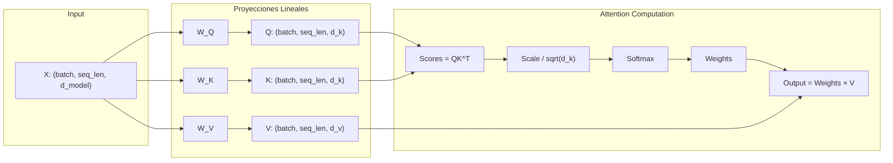
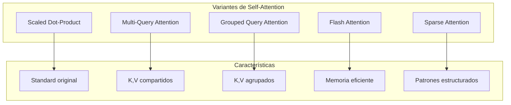
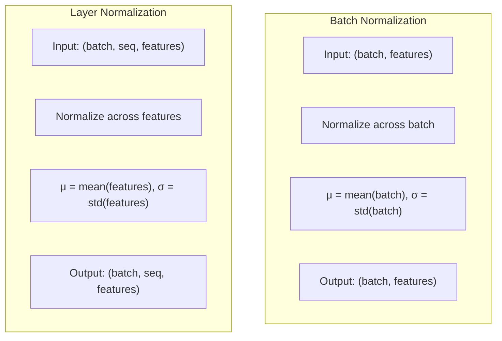
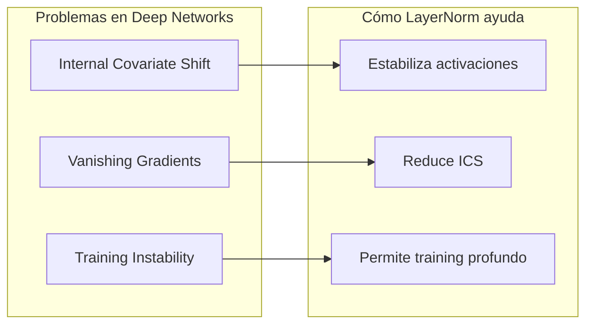
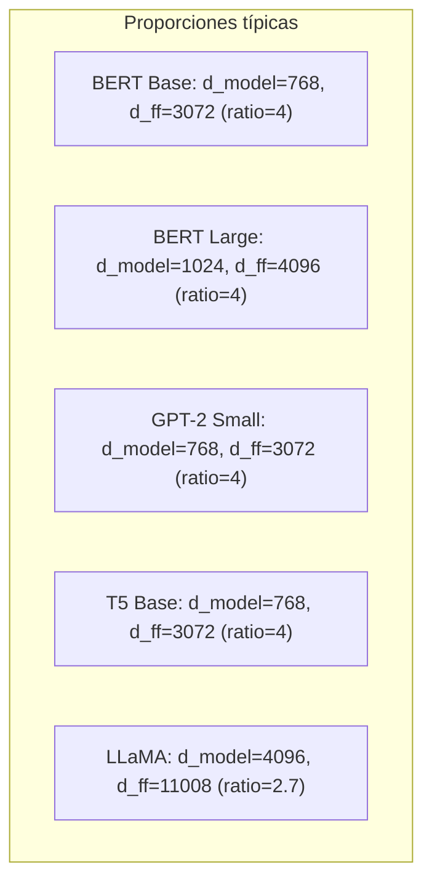
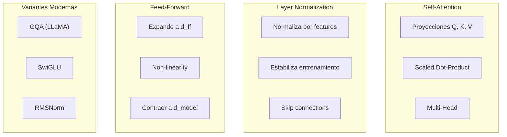

# Clase 11: Transformers en Profundidad

## Duración: 4 horas

---

## 1. Objetivos de Aprendizaje

Al finalizar esta clase, el estudiante será capaz de:

1. **Implementar Self-Attention desde cero** con comprensión detallada de cada componente
2. **Explicar Layer Normalization** y su papel en la estabilización del entrenamiento
3. **Describir Feed-Forward Networks** y sus configuraciones óptimas
4. **Analizar los gradientes y el flujo de información** en Transformers
5. **Implementar un Transformer completo** sin dependencias externas
6. **Optimizar implementaciones** para diferentes tamaños de modelo

---

## 2. Contenidos Detallados

### 2.1 Self-Attention Detallado

#### 2.1.1 La Matemática Profunda de Self-Attention



#### 2.1.2 Implementación Paso a Paso

```python
import torch
import torch.nn as nn
import torch.nn.functional as F
import math

class DetailedSelfAttention(nn.Module):
    """
    Self-Attention con implementación detallada paso a paso
    
    Esta implementación desglosa cada operación para entender
    exactamente qué está sucediendo matemáticamente.
    """
    
    def __init__(self, d_model: int, num_heads: int, dropout: float = 0.1):
        super().__init__()
        
        assert d_model % num_heads == 0, "d_model must be divisible by num_heads"
        
        self.d_model = d_model
        self.num_heads = num_heads
        self.d_k = d_model // num_heads  # Dimensión por head
        self.d_v = self.d_k  # Usualmente igual a d_k
        
        # Proyecciones lineales para Q, K, V
        self.W_q = nn.Linear(d_model, d_model)
        self.W_k = nn.Linear(d_model, d_model)
        self.W_v = nn.Linear(d_model, d_model)
        
        # Proyección final de salida
        self.W_o = nn.Linear(d_model, d_model)
        
        self.dropout = nn.Dropout(dropout)
        self.scale = math.sqrt(self.d_k)
    
    def split_heads(self, x: torch.Tensor) -> torch.Tensor:
        """
        Divide el tensor en múltiples heads
        
        Input:  (batch, seq_len, d_model)
        Output: (batch, num_heads, seq_len, d_k)
        """
        batch_size, seq_len, _ = x.shape
        
        # reshape: (batch, seq_len, num_heads, d_k)
        # transpose: (batch, num_heads, seq_len, d_k)
        x = x.view(batch_size, seq_len, self.num_heads, self.d_k)
        return x.transpose(1, 2)
    
    def compute_attention_scores(self, Q: torch.Tensor, K: torch.Tensor) -> torch.Tensor:
        """
        Calcula los scores de atención entre Q y K
        
        Args:
            Q: (batch, num_heads, seq_len_q, d_k)
            K: (batch, num_heads, seq_len_k, d_k)
        
        Returns:
            scores: (batch, num_heads, seq_len_q, seq_len_k)
        
        Mathematical operation:
        score[i,j] = <Q[i], K[j]> / sqrt(d_k)
        
        where <Q[i], K[j]> = sum(Q[i,k] * K[j,k]) for k in 0..d_k-1
        """
        # Q @ K^T: (batch, heads, seq_len_q, d_k) @ (batch, heads, d_k, seq_len_k)
        # = (batch, heads, seq_len_q, seq_len_k)
        scores = torch.matmul(Q, K.transpose(-2, -1))
        
        # Escalar por sqrt(d_k)
        # Esto previene que los gradientes sean demasiado pequeños
        # cuando d_k es grande
        scores = scores / self.scale
        
        return scores
    
    def apply_attention_weights(self, scores: torch.Tensor, V: torch.Tensor,
                                mask: torch.Tensor = None) -> tuple:
        """
        Aplica los pesos de atención a los valores
        
        Args:
            scores: (batch, num_heads, seq_len_q, seq_len_k)
            V: (batch, num_heads, seq_len_k, d_k)
            mask: máscara opcional
        
        Returns:
            output: (batch, num_heads, seq_len_q, d_k)
            attention_weights: (batch, num_heads, seq_len_q, seq_len_k)
        """
        # Aplicar máscara si existe
        if mask is not None:
            # Usualmente la máscara tiene 0 donde queremos ignorar
            # Y 1 donde queremos atender
            scores = scores.masked_fill(mask == 0, float('-inf'))
        
        # Softmax: convierte scores en probabilidades que suman 1
        # softmax(scores)[i] = exp(scores[i]) / sum(exp(scores[j]))
        attention_weights = F.softmax(scores, dim=-1)
        
        # Aplicar dropout (opcional, solo durante entrenamiento)
        attention_weights = self.dropout(attention_weights)
        
        # Ponderar valores: output[i] = sum(attention_weights[i,j] * V[j])
        output = torch.matmul(attention_weights, V)
        
        return output, attention_weights
    
    def combine_heads(self, x: torch.Tensor) -> torch.Tensor:
        """
        Combina múltiples heads en uno solo
        
        Input:  (batch, num_heads, seq_len, d_k)
        Output: (batch, seq_len, d_model)
        """
        batch_size, _, seq_len, _ = x.shape
        
        # Transpose: (batch, seq_len, num_heads, d_k)
        # Reshape: (batch, seq_len, num_heads * d_k) = (batch, seq_len, d_model)
        x = x.transpose(1, 2)
        return x.contiguous().view(batch_size, seq_len, self.d_model)
    
    def forward(self, query: torch.Tensor, key: torch.Tensor, value: torch.Tensor,
                mask: torch.Tensor = None) -> tuple:
        """
        Forward pass completo de Self-Attention
        
        Args:
            query: (batch, seq_len_q, d_model)
            key: (batch, seq_len_k, d_model)
            value: (batch, seq_len_v, d_model)
            mask: máscara opcional
        
        Returns:
            output: (batch, seq_len_q, d_model)
            attention_weights: (batch, num_heads, seq_len_q, seq_len_k)
        """
        batch_size = query.size(0)
        
        # 1. Proyecciones lineales
        Q = self.W_q(query)  # (batch, seq_len, d_model)
        K = self.W_k(key)
        V = self.W_v(value)
        
        # 2. Dividir en heads
        Q = self.split_heads(Q)  # (batch, num_heads, seq_len, d_k)
        K = self.split_heads(K)
        V = self.split_heads(V)
        
        # 3. Calcular scores de atención
        scores = self.compute_attention_scores(Q, K)
        
        # 4. Aplicar pesos de atención a valores
        output, attention_weights = self.apply_attention_weights(scores, V, mask)
        
        # 5. Combinar heads
        output = self.combine_heads(output)  # (batch, seq_len_q, d_model)
        
        # 6. Proyección final
        output = self.W_o(output)
        
        return output, attention_weights


def visualize_attention_computation():
    """
    Visualización detallada de los cálculos de atención
    """
    import numpy as np
    
    # Ejemplo simple con 3 tokens, d_model=4, num_heads=1
    print("="*60)
    print("VISUALIZACIÓN DE SELF-ATTENTION")
    print("="*60)
    
    # Input: 3 tokens con embedding de 4 dimensiones
    x = torch.tensor([
        [1.0, 0.0, 1.0, 0.0],  # token 1: [La]
        [0.0, 1.0, 0.0, 1.0],  # token 2: [gato]
        [1.0, 1.0, 0.0, 0.0],  # token 3: [negro]
    ])
    
    print("\nInput embeddings (3 tokens, d_model=4):")
    print(x.numpy())
    
    # Proyecciones (simuladas)
    W_q = torch.eye(4)
    W_k = torch.eye(4)
    W_v = torch.eye(4)
    
    Q = x @ W_q.T
    K = x @ W_k.T
    V = x @ W_v.T
    
    print("\nQ (Query):")
    print(Q.numpy())
    
    print("\nK (Key):")
    print(K.numpy())
    
    print("\nV (Value):")
    print(V.numpy())
    
    # Calcular scores: Q @ K^T
    scores = Q @ K.T
    print("\nRaw scores (QK^T):")
    print(scores.numpy())
    
    # Escalar
    scale = math.sqrt(4)
    scores_scaled = scores / scale
    print(f"\nScaled scores (divide by sqrt(4)={scale}):")
    print(scores_scaled.numpy())
    
    # Softmax
    attention_weights = F.softmax(scores_scaled, dim=-1)
    print("\nAttention weights (softmax):")
    print(attention_weights.numpy())
    
    # Output: attention_weights @ V
    output = attention_weights @ V
    print("\nOutput (attention_weights @ V):")
    print(output.numpy())


if __name__ == "__main__":
    visualize_attention_computation()
```

#### 2.1.3 Variantes de Self-Attention



```python
class MultiQueryAttention(nn.Module):
    """
    Multi-Query Attention (MQA)
    
    Variante donde múltiples query heads comparten las mismas keys y values.
    Reduce significativamente el costo computacional.
    
    Paper: "Fast Transformer Decoding: One Write-Head is All You Need"
    """
    
    def __init__(self, d_model: int, num_heads: int, dropout: float = 0.1):
        super().__init__()
        
        self.d_model = d_model
        self.num_heads = num_heads
        self.d_k = d_model // num_heads
        
        # Una sola proyección para Q (múltiples heads)
        self.W_q = nn.Linear(d_model, d_model)
        
        # UNA sola proyección para K y V (compartidas entre todos los heads)
        self.W_k = nn.Linear(d_model, self.d_k)  # Solo d_k, no d_model
        self.W_v = nn.Linear(d_model, self.d_k)  # Solo d_k, no d_model
        
        self.W_o = nn.Linear(d_model, d_model)
        self.scale = math.sqrt(self.d_k)
    
    def forward(self, query, key, value, mask=None):
        batch_size = query.size(0)
        seq_len = query.size(1)
        
        # Q: proyectar y dividir en heads
        Q = self.W_q(query)
        Q = Q.view(batch_size, seq_len, self.num_heads, self.d_k).transpose(1, 2)
        
        # K, V: una sola cabeza (expandir después)
        K = self.W_k(key).unsqueeze(1)  # (batch, 1, seq_len, d_k)
        V = self.W_v(value).unsqueeze(1)  # (batch, 1, seq_len, d_k)
        
        # Calcular atención
        scores = torch.matmul(Q, K.transpose(-2, -1)) / self.scale
        
        if mask is not None:
            scores = scores.masked_fill(mask == 0, float('-inf'))
        
        attention_weights = F.softmax(scores, dim=-1)
        output = torch.matmul(attention_weights, V)
        
        # Combinar heads
        output = output.transpose(1, 2).contiguous().view(batch_size, seq_len, self.d_model)
        
        return self.W_o(output), attention_weights


class GroupedQueryAttention(nn.Module):
    """
    Grouped Query Attention (GQA)
    
    Divide los query heads en grupos, donde cada grupo comparte
    una key y value head.
    
    Paper: "GQA: Training Generalized Multi-Query Transformer"
    
    Usado en LLaMA 2 y Mistral.
    """
    
    def __init__(self, d_model: int, num_query_heads: int, 
                 num_kv_heads: int, dropout: float = 0.1):
        super().__init__()
        
        assert num_query_heads % num_kv_heads == 0
        
        self.d_model = d_model
        self.num_query_heads = num_query_heads
        self.num_kv_heads = num_kv_heads
        self.num_groups = num_query_heads // num_kv_heads
        self.d_k = d_model // num_query_heads
        
        # Proyecciones
        self.W_q = nn.Linear(d_model, d_model)
        self.W_k = nn.Linear(d_model, num_kv_heads * self.d_k)
        self.W_v = nn.Linear(d_model, num_kv_heads * self.d_k)
        self.W_o = nn.Linear(d_model, d_model)
        
        self.scale = math.sqrt(self.d_k)
    
    def forward(self, query, key, value, mask=None):
        batch_size = query.size(0)
        seq_len = query.size(1)
        
        # Q: múltiples heads
        Q = self.W_q(query)
        Q = Q.view(batch_size, seq_len, self.num_query_heads, self.d_k).transpose(1, 2)
        
        # K, V: menos heads
        K = self.W_k(key)
        K = K.view(batch_size, seq_len, self.num_kv_heads, self.d_k).transpose(1, 2)
        
        V = self.W_v(value)
        V = V.view(batch_size, seq_len, self.num_kv_heads, self.d_k).transpose(1, 2)
        
        # Repetir K, V para cada grupo de Q heads
        K = K.repeat_interleave(self.num_groups, dim=1)
        V = V.repeat_interleave(self.num_groups, dim=1)
        
        # Atención estándar
        scores = torch.matmul(Q, K.transpose(-2, -1)) / self.scale
        
        if mask is not None:
            scores = scores.masked_fill(mask == 0, float('-inf'))
        
        attention_weights = F.softmax(scores, dim=-1)
        output = torch.matmul(attention_weights, V)
        
        output = output.transpose(1, 2).contiguous().view(batch_size, seq_len, self.d_model)
        
        return self.W_o(output), attention_weights
```

---

### 2.2 Layer Normalization

#### 2.2.1 Fundamentos Matemáticos

Layer Normalization normaliza las activaciones a través de las características, no a través del batch:



**Fórmula de Layer Normalization:**
```
LayerNorm(x) = γ * (x - μ) / (σ + ε) + β

donde:
- μ = mean(x, axis=-1)  # media sobre la última dimensión
- σ = std(x, axis=-1)   # desviación estándar sobre la última dimensión
- γ, β = parámetros aprendidos (scale y shift)
```

#### 2.2.2 Implementación Detallada

```python
class LayerNorm(nn.Module):
    """
    Layer Normalization
    
    Normalización aplicada a través de las características (última dimensión)
    para cada elemento individual en el batch.
    
    Proceso:
    1. Calcular media de las características
    2. Calcular varianza de las características
    3. Normalizar
    4. Escalar (γ) y desplazar (β)
    """
    
    def __init__(self, normalized_shape: int, eps: float = 1e-5, 
                 elementwise_affine: bool = True):
        super().__init__()
        
        self.normalized_shape = (normalized_shape,)
        self.eps = eps
        self.elementwise_affine = elementwise_affine
        
        if self.elementwise_affine:
            self.weight = nn.Parameter(torch.ones(normalized_shape))
            self.bias = nn.Parameter(torch.zeros(normalized_shape))
        else:
            self.register_parameter('weight', None)
            self.register_parameter('bias', None)
    
    def forward(self, x: torch.Tensor) -> torch.Tensor:
        """
        Args:
            x: (batch, ..., normalized_shape) o (batch, seq_len, normalized_shape)
        
        Returns:
            Normalized tensor con la misma forma
        """
        # Calcular media sobre la última dimensión
        # keepdim=True mantiene la dimensión para broadcasting
        mean = x.mean(dim=-1, keepdim=True)
        
        # Calcular varianza
        var = x.var(dim=-1, keepdim=True, unbiased=False)
        
        # Normalizar
        x_norm = (x - mean) / torch.sqrt(var + self.eps)
        
        # Escalar y desplazar si es affine
        if self.elementwise_affine:
            x_norm = self.weight * x_norm + self.bias
        
        return x_norm


class RMSNorm(nn.Module):
    """
    RMSNorm (Root Mean Square Normalization)
    
    Variante más simple que solo usa RMS, sin media.
    
    Paper: "RMSNorm: A Novel Normalization Technique"
    """
    
    def __init__(self, normalized_shape: int, eps: float = 1e-5):
        super().__init__()
        self.normalized_shape = (normalized_shape,)
        self.eps = eps
        self.weight = nn.Parameter(torch.ones(normalized_shape))
    
    def forward(self, x: torch.Tensor) -> torch.Tensor:
        # RMS = sqrt(mean(x^2))
        rms = torch.sqrt(x.pow(2).mean(dim=-1, keepdim=True) + self.eps)
        
        # Normalizar por RMS
        x_norm = x / rms * self.weight
        
        return x_norm


class SubLayerWithNorm(nn.Module):
    """
    SubLayer con Layer Normalization y Skip Connection
    
    Esta es la estructura exacta usada en el Transformer:
    
    output = LayerNorm(x + SubLayer(x))
    """
    
    def __init__(self, sublayer: nn.Module, d_model: int, dropout: float = 0.1):
        super().__init__()
        self.sublayer = sublayer
        self.norm = LayerNorm(d_model)
        self.dropout = nn.Dropout(dropout)
    
    def forward(self, x: torch.Tensor, *args, **kwargs) -> torch.Tensor:
        # Aplicar sublayer y agregar skip connection
        # La sublayer puede tomar argumentos adicionales (como máscara)
        if callable(self.sublayer):
            return self.norm(x + self.dropout(self.sublayer(x, *args, **kwargs)))
        else:
            return self.norm(x + self.dropout(self.sublayer))


def compare_normalizations():
    """Compara diferentes tipos de normalización"""
    
    batch_size, seq_len, d_model = 2, 10, 64
    
    # Input aleatorio
    x = torch.randn(batch_size, seq_len, d_model)
    
    # BatchNorm (sobre features para secuencia)
    bn = nn.BatchNorm1d(d_model)
    x_bn = x.permute(0, 2, 1)  # (batch, features, seq)
    x_bn = bn(x_bn)
    x_bn = x_bn.permute(0, 2, 1)
    
    # LayerNorm
    ln = nn.LayerNorm(d_model)
    x_ln = ln(x)
    
    # RMSNorm
    rmsn = RMSNorm(d_model)
    x_rmsn = rmsn(x)
    
    print("Input shape:", x.shape)
    print("BatchNorm output shape:", x_bn.shape)
    print("LayerNorm output shape:", x_ln.shape)
    print("RMSNorm output shape:", x_rmsn.shape)
    
    # Verificar que LayerNorm produce media ~0 y std ~1
    print("\nLayerNorm statistics:")
    print(f"  Mean (should be ~0): {x_ln.mean(dim=-1).mean().item():.6f}")
    print(f"  Std (should be ~1): {x_ln.std(dim=-1).mean().item():.6f}")
```

#### 2.2.3 Por qué Layer Normalization en Transformers?



---

### 2.3 Feed-Forward Networks

#### 2.3.1 Arquitectura del FFN

```python
class FeedForwardNetwork(nn.Module):
    """
    Position-wise Feed-Forward Network
    
    Aplicado independientemente a cada posición:
    FFN(x) = max(0, xW₁ + b₁)W₂ + b₂
    
    O equivalentemente:
    FFN(x) = activation(xW₁ + b₁) @ W₂ + b₂
    """
    
    def __init__(self, d_model: int, d_ff: int, dropout: float = 0.1,
                 activation: str = "relu"):
        super().__init__()
        
        self.d_model = d_model
        self.d_ff = d_ff
        
        # Capa 1: expande de d_model a d_ff
        self.w_1 = nn.Linear(d_model, d_ff)
        
        # Capa 2: contrae de d_ff a d_model
        self.w_2 = nn.Linear(d_ff, d_model)
        
        self.dropout = nn.Dropout(dropout)
        
        # Función de activación
        if activation == "relu":
            self.activation = nn.ReLU()
        elif activation == "gelu":
            self.activation = nn.GELU()
        elif activation == "swiglu":
            # SwiGLU usado en Llama, Mistral, etc.
            self.activation = None  # Especial
        else:
            raise ValueError(f"Unknown activation: {activation}")
    
    def forward(self, x: torch.Tensor) -> torch.Tensor:
        """
        Args:
            x: (batch, seq_len, d_model)
        
        Returns:
            (batch, seq_len, d_model)
        """
        x = self.w_1(x)
        x = self.activation(x)
        x = self.dropout(x)
        x = self.w_2(x)
        return x


class SwiGLUFeedForward(nn.Module):
    """
    SwiGLU Feed-Forward Network
    
    Usado en LLaMA, Mistral, Phi, etc.
    
    FFN_SwiGLU(x) = Swish(xW₁) @ (xW₂)
    
    donde Swish(x) = x * sigmoid(x)
    """
    
    def __init__(self, d_model: int, d_ff: int, dropout: float = 0.1):
        super().__init__()
        
        # Tres proyecciones en lugar de dos
        self.w_1 = nn.Linear(d_model, d_ff)  # Para Swish
        self.w_2 = nn.Linear(d_ff, d_model)   # Para gate
        self.w_3 = nn.Linear(d_model, d_ff)   # Para Swish input
        self.dropout = nn.Dropout(dropout)
    
    def forward(self, x: torch.Tensor) -> torch.Tensor:
        # Swish gate
        gate = F.silu(self.w_1(x))
        
        # Swish input
        swish_input = self.w_3(x)
        
        # SwiGLU
        x = gate * swish_input
        
        x = self.dropout(x)
        x = self.w_2(x)
        
        return x


def compare_ffn_variants():
    """Compara diferentes variantes de FFN"""
    
    d_model = 512
    d_ff = 2048
    batch_size = 2
    seq_len = 10
    
    x = torch.randn(batch_size, seq_len, d_model)
    
    # ReLU FFN
    ffn_relu = FeedForwardNetwork(d_model, d_ff, activation="relu")
    
    # GELU FFN
    ffn_gelu = FeedForwardNetwork(d_model, d_ff, activation="gelu")
    
    # SwiGLU FFN
    ffn_swiglu = SwiGLUFeedForward(d_model, d_ff)
    
    print("Input shape:", x.shape)
    print(f"\nReLU FFN parameters: {sum(p.numel() for p in ffn_relu.parameters()):,}")
    print(f"GELU FFN parameters: {sum(p.numel() for p in ffn_gelu.parameters()):,}")
    print(f"SwiGLU FFN parameters: {sum(p.numel() for p in ffn_swiglu.parameters()):,}")
    
    out_relu = ffn_relu(x)
    out_gelu = ffn_gelu(x)
    out_swiglu = ffn_swiglu(x)
    
    print(f"\nOutput shapes: {out_relu.shape}, {out_gelu.shape}, {out_swiglu.shape}")
```

#### 2.3.2 Proporción Entre d_model y d_ff



---

### 2.4 Implementación Completa del Transformer

```python
"""
Implementación completa y detallada del Transformer
para entender todos los componentes internos
"""

import torch
import torch.nn as nn
import torch.nn.functional as F
import math
import copy
from typing import Optional, Tuple


class PositionalEncoding(nn.Module):
    """Positional Encoding con senos y cosenos"""
    
    def __init__(self, d_model: int, max_len: int = 5000, dropout: float = 0.1):
        super().__init__()
        self.dropout = nn.Dropout(p=dropout)
        
        pe = torch.zeros(max_len, d_model)
        position = torch.arange(0, max_len, dtype=torch.float).unsqueeze(1)
        div_term = torch.exp(torch.arange(0, d_model, 2, dtype=torch.float) * 
                           (-math.log(10000.0) / d_model))
        pe[:, 0::2] = torch.sin(position * div_term)
        pe[:, 1::2] = torch.cos(position * div_term)
        pe = pe.unsqueeze(0)
        self.register_buffer('pe', pe)
    
    def forward(self, x: torch.Tensor) -> torch.Tensor:
        x = x + self.pe[:, :x.size(1), :]
        return self.dropout(x)


class TransformerEncoderLayer(nn.Module):
    """Capa del Encoder con detallado"""
    
    def __init__(self, d_model: int, num_heads: int, d_ff: int, 
                 dropout: float = 0.1, activation: str = "relu"):
        super().__init__()
        
        # Self-Attention
        self.self_attn = nn.MultiheadAttention(
            d_model, num_heads, dropout=dropout, batch_first=True
        )
        
        # Feed-Forward
        self.feed_forward = FeedForwardNetwork(d_model, d_ff, dropout, activation)
        
        # Layer Normalization
        self.norm1 = nn.LayerNorm(d_model)
        self.norm2 = nn.LayerNorm(d_model)
        
        # Dropout
        self.dropout1 = nn.Dropout(dropout)
        self.dropout2 = nn.Dropout(dropout)
    
    def forward(self, src: torch.Tensor, src_mask: Optional[torch.Tensor] = None,
                src_key_padding_mask: Optional[torch.Tensor] = None) -> torch.Tensor:
        """
        Args:
            src: (batch, seq_len, d_model)
            src_mask: (seq_len, seq_len)
            src_key_padding_mask: (batch, seq_len)
        
        Returns:
            (batch, seq_len, d_model)
        """
        # Self-Attention con skip connection
        _attn_output, _ = self.self_attn(
            src, src, src,
            attn_mask=src_mask,
            key_padding_mask=src_key_padding_mask
        )
        src = self.norm1(src + self.dropout1(_attn_output))
        
        # Feed-Forward con skip connection
        src = self.norm2(src + self.dropout2(self.feed_forward(src)))
        
        return src


class TransformerDecoderLayer(nn.Module):
    """Capa del Decoder con detallado"""
    
    def __init__(self, d_model: int, num_heads: int, d_ff: int,
                 dropout: float = 0.1, activation: str = "relu"):
        super().__init__()
        
        # Masked Self-Attention
        self.self_attn = nn.MultiheadAttention(
            d_model, num_heads, dropout=dropout, batch_first=True
        )
        
        # Cross-Attention (Encoder-Decoder)
        self.cross_attn = nn.MultiheadAttention(
            d_model, num_heads, dropout=dropout, batch_first=True
        )
        
        # Feed-Forward
        self.feed_forward = FeedForwardNetwork(d_model, d_ff, dropout, activation)
        
        # Layer Normalization
        self.norm1 = nn.LayerNorm(d_model)
        self.norm2 = nn.LayerNorm(d_model)
        self.norm3 = nn.LayerNorm(d_model)
        
        # Dropout
        self.dropout1 = nn.Dropout(dropout)
        self.dropout2 = nn.Dropout(dropout)
        self.dropout3 = nn.Dropout(dropout)
    
    def forward(self, tgt: torch.Tensor, memory: torch.Tensor,
                tgt_mask: Optional[torch.Tensor] = None,
                tgt_key_padding_mask: Optional[torch.Tensor] = None,
                memory_mask: Optional[torch.Tensor] = None,
                memory_key_padding_mask: Optional[torch.Tensor] = None) -> torch.Tensor:
        """
        Args:
            tgt: (batch, tgt_len, d_model)
            memory: (batch, src_len, d_model)
        """
        # Masked Self-Attention
        _attn_output, _ = self.self_attn(
            tgt, tgt, tgt,
            attn_mask=tgt_mask,
            key_padding_mask=tgt_key_padding_mask
        )
        tgt = self.norm1(tgt + self.dropout1(_attn_output))
        
        # Cross-Attention
        _attn_output, _ = self.cross_attn(
            tgt, memory, memory,
            attn_mask=memory_mask,
            key_padding_mask=memory_key_padding_mask
        )
        tgt = self.norm2(tgt + self.dropout2(_attn_output))
        
        # Feed-Forward
        tgt = self.norm3(tgt + self.dropout3(self.feed_forward(tgt)))
        
        return tgt


def make_transformer_model(
    src_vocab_size: int, tgt_vocab_size: int,
    num_layers: int = 6, num_heads: int = 8,
    d_model: int = 512, d_ff: int = 2048,
    dropout: float = 0.1, max_len: int = 5000
) -> nn.Module:
    """Construye el modelo Transformer completo"""
    
    # Embeddings
    src_embedding = nn.Embedding(src_vocab_size, d_model)
    tgt_embedding = nn.Embedding(tgt_vocab_size, d_model)
    
    # Positional Encoding
    pos_encoder = PositionalEncoding(d_model, max_len, dropout)
    
    # Encoder Stack
    encoder_layers = [
        TransformerEncoderLayer(d_model, num_heads, d_ff, dropout)
        for _ in range(num_layers)
    ]
    encoder_norm = nn.LayerNorm(d_model)
    
    # Decoder Stack
    decoder_layers = [
        TransformerDecoderLayer(d_model, num_heads, d_ff, dropout)
        for _ in range(num_layers)
    ]
    decoder_norm = nn.LayerNorm(d_model)
    
    # Output projection
    generator = nn.Linear(d_model, tgt_vocab_size)
    
    # Inicializar pesos
    for p in encoder_layers[0].parameters():
        if p.dim() > 1:
            nn.init.xavier_uniform_(p)
    
    model = TransformerModel(
        encoder_layers, decoder_layers,
        src_embedding, tgt_embedding,
        pos_encoder, generator,
        encoder_norm, decoder_norm
    )
    
    return model


class TransformerModel(nn.Module):
    """Modelo Transformer completo"""
    
    def __init__(self, encoder_layers, decoder_layers,
                 src_embedding, tgt_embedding,
                 pos_encoder, generator,
                 encoder_norm, decoder_norm):
        super().__init__()
        
        self.encoder_layers = nn.ModuleList(encoder_layers)
        self.decoder_layers = nn.ModuleList(decoder_layers)
        self.src_embedding = src_embedding
        self.tgt_embedding = tgt_embedding
        self.pos_encoder = pos_encoder
        self.generator = generator
        self.encoder_norm = encoder_norm
        self.decoder_norm = decoder_norm
    
    def encode(self, src: torch.Tensor, src_mask: torch.Tensor = None,
               src_key_padding_mask: torch.Tensor = None) -> torch.Tensor:
        """Codifica la secuencia source"""
        # Embedding + Positional Encoding
        src = self.src_embedding(src)
        src = self.pos_encoder(src)
        
        # Encoder layers
        for layer in self.encoder_layers:
            src = layer(src, src_mask, src_key_padding_mask)
        
        return self.encoder_norm(src)
    
    def decode(self, tgt: torch.Tensor, memory: torch.Tensor,
               tgt_mask: torch.Tensor = None,
               tgt_key_padding_mask: torch.Tensor = None,
               memory_key_padding_mask: torch.Tensor = None) -> torch.Tensor:
        """Decodifica la secuencia target"""
        # Embedding + Positional Encoding
        tgt = self.tgt_embedding(tgt)
        tgt = self.pos_encoder(tgt)
        
        # Decoder layers
        for layer in self.decoder_layers:
            tgt = layer(
                tgt, memory,
                tgt_mask=tgt_mask,
                tgt_key_padding_mask=tgt_key_padding_mask,
                memory_key_padding_mask=memory_key_padding_mask
            )
        
        return self.decoder_norm(tgt)
    
    def forward(self, src: torch.Tensor, tgt: torch.Tensor,
                src_mask: torch.Tensor = None,
                tgt_mask: torch.Tensor = None,
                src_key_padding_mask: torch.Tensor = None,
                tgt_key_padding_mask: torch.Tensor = None) -> torch.Tensor:
        """
        Forward pass completo
        
        Args:
            src: (batch, src_len)
            tgt: (batch, tgt_len)
        
        Returns:
            (batch, tgt_len, tgt_vocab_size)
        """
        # Encode
        memory = self.encode(src, src_mask, src_key_padding_mask)
        
        # Decode
        decoder_output = self.decode(
            tgt, memory, tgt_mask,
            tgt_key_padding_mask, src_key_padding_mask
        )
        
        # Generate
        return self.generator(decoder_output)
    
    def make_tgt_mask(self, tgt: torch.Tensor, pad_idx: int = 0) -> torch.Tensor:
        """Crea máscara causal para el target"""
        seq_len = tgt.size(1)
        
        # Padding mask
        padding_mask = (tgt != pad_idx).unsqueeze(1)  # (batch, 1, seq_len)
        
        # Causal mask: triangular inferior
        causal_mask = torch.triu(
            torch.ones(seq_len, seq_len, device=tgt.device, dtype=torch.bool),
            diagonal=1
        )
        
        # Combinar
        return padding_mask & ~causal_mask
```

---

### 2.5 Análisis de Gradientes y Flujo de Información

```python
class GradientFlowAnalysis:
    """
    Análisis del flujo de gradientes en Transformers
    """
    
    @staticmethod
    def visualize_gradient_flow(model: nn.Module):
        """Visualiza cómo fluyen los gradientes a través del modelo"""
        
        parameters = list(model.parameters())
        grads = []
        layers = []
        
        for name, param in model.named_parameters():
            if param.grad is not None:
                if param.dim() > 1:  # Solo weights, no biases
                    layers.append(name)
                    grads.append(param.grad.abs().mean().item())
        
        # Plot
        import matplotlib.pyplot as plt
        
        plt.figure(figsize=(12, 6))
        plt.bar(range(len(grads)), grads)
        plt.xlabel('Layer')
        plt.ylabel('Mean Gradient Magnitude')
        plt.title('Gradient Flow Analysis')
        plt.xticks(range(len(layers)), layers, rotation=90)
        plt.tight_layout()
        plt.savefig('gradient_flow.png', dpi=150)
        plt.show()
    
    @staticmethod
    def check_gradient_norms(model: nn.Module, threshold: float = 1.0):
        """Verifica si hay gradientes explosivos o que desaparecen"""
        
        total_norm = 0.0
        for p in model.parameters():
            if p.grad is not None:
                param_norm = p.grad.data.norm(2)
                total_norm += param_norm.item() ** 2
        total_norm = total_norm ** 0.5
        
        status = "OK"
        if total_norm > threshold * 10:
            status = "EXPLODING"
        elif total_norm < threshold / 10:
            status = "VANISHING"
        
        return total_norm, status
```

---

## 3. Ejercicios Prácticos Resueltos

### Ejercicio 1: Implementación de Multi-Head Attention desde Cero

```python
"""
Ejercicio 1: Multi-Head Attention Completo
==========================================
Implementación detallada para entender cada operación
"""

import torch
import torch.nn as nn
import torch.nn.functional as F
import math

def multi_head_attention_forward(
    Q: torch.Tensor, K: torch.Tensor, V: torch.Tensor,
    num_heads: int, d_model: int,
    dropout: float = 0.1,
    mask: torch.Tensor = None
) -> Tuple[torch.Tensor, torch.Tensor]:
    """
    Implementación funcional de Multi-Head Attention
    
    Args:
        Q: (batch, seq_len_q, d_model)
        K: (batch, seq_len_k, d_model)
        V: (batch, seq_len_v, d_model)
        num_heads: número de cabezas
        d_model: dimensión del modelo
        dropout: tasa de dropout
        mask: máscara opcional
    
    Returns:
        output: (batch, seq_len_q, d_model)
        attention_weights: (batch, num_heads, seq_len_q, seq_len_k)
    """
    batch_size, seq_len_q = Q.size(0), Q.size(1)
    seq_len_k = K.size(1)
    
    d_k = d_model // num_heads
    
    # 1. Proyecciones lineales
    # W_Q, W_K, W_V son learned parameters
    # Por simplicidad, asumimos que ya están aplicados
    
    # 2. Reshape para múltiples heads
    # Q: (batch, seq_len_q, d_model) -> (batch, seq_len_q, num_heads, d_k) -> (batch, num_heads, seq_len_q, d_k)
    Q = Q.view(batch_size, seq_len_q, num_heads, d_k).transpose(1, 2)
    K = K.view(batch_size, seq_len_k, num_heads, d_k).transpose(1, 2)
    V = V.view(batch_size, seq_len_k, num_heads, d_k).transpose(1, 2)
    
    # 3. Calcular attention scores
    # scores = Q @ K^T / sqrt(d_k)
    scores = torch.matmul(Q, K.transpose(-2, -1)) / math.sqrt(d_k)
    
    # 4. Aplicar máscara
    if mask is not None:
        # Expandir máscara para heads
        if mask.dim() == 2:  # (seq_len_q, seq_len_k)
            mask = mask.unsqueeze(0).unsqueeze(0)  # (1, 1, seq_len_q, seq_len_k)
        elif mask.dim() == 3:  # (batch, seq_len_q, seq_len_k)
            mask = mask.unsqueeze(1)  # (batch, 1, seq_len_q, seq_len_k)
        scores = scores.masked_fill(mask == 0, float('-inf'))
    
    # 5. Softmax
    attention_weights = F.softmax(scores, dim=-1)
    
    # 6. Dropout (durante entrenamiento)
    if dropout > 0:
        attention_weights = F.dropout(attention_weights, p=dropout)
    
    # 7. Ponderar valores
    output = torch.matmul(attention_weights, V)  # (batch, num_heads, seq_len_q, d_k)
    
    # 8. Concatenar heads
    # (batch, num_heads, seq_len_q, d_k) -> (batch, seq_len_q, num_heads, d_k) -> (batch, seq_len_q, d_model)
    output = output.transpose(1, 2).contiguous()
    output = output.view(batch_size, seq_len_q, d_model)
    
    return output, attention_weights


class ManualMultiHeadAttention(nn.Module):
    """
    MHA con parámetros learned y métodos auxiliares
    """
    
    def __init__(self, d_model: int, num_heads: int, dropout: float = 0.1):
        super().__init__()
        
        assert d_model % num_heads == 0
        
        self.d_model = d_model
        self.num_heads = num_heads
        self.d_k = d_model // num_heads
        
        # Proyecciones lineales
        self.W_Q = nn.Linear(d_model, d_model)
        self.W_K = nn.Linear(d_model, d_model)
        self.W_V = nn.Linear(d_model, d_model)
        self.W_O = nn.Linear(d_model, d_model)
        
        self.dropout = dropout
    
    def split_heads(self, x: torch.Tensor) -> torch.Tensor:
        batch_size = x.size(0)
        seq_len = x.size(1)
        
        x = x.view(batch_size, seq_len, self.num_heads, self.d_k)
        return x.transpose(1, 2)  # (batch, num_heads, seq_len, d_k)
    
    def forward(self, query: torch.Tensor, key: torch.Tensor, value: torch.Tensor,
                mask: torch.Tensor = None) -> Tuple[torch.Tensor, torch.Tensor]:
        batch_size = query.size(0)
        
        # Proyecciones lineales
        Q = self.W_Q(query)
        K = self.W_K(key)
        V = self.W_V(value)
        
        # Split heads
        Q = self.split_heads(Q)
        K = self.split_heads(K)
        V = self.split_heads(V)
        
        # Attention
        output, attn_weights = multi_head_attention_forward(
            Q, K, V, self.num_heads, self.d_model, self.dropout, mask
        )
        
        # Final linear
        output = self.W_O(output)
        
        return output, attn_weights


def test_multi_head_attention():
    """Test de la implementación"""
    
    batch_size = 2
    seq_len = 10
    d_model = 64
    num_heads = 4
    
    # Input
    x = torch.randn(batch_size, seq_len, d_model)
    
    # Mask (opcional)
    mask = torch.ones(batch_size, seq_len, seq_len)
    
    # Crear atención
    mha = ManualMultiHeadAttention(d_model, num_heads)
    
    # Forward
    output, weights = mha(x, x, x, mask)
    
    print(f"Input shape: {x.shape}")
    print(f"Output shape: {output.shape}")
    print(f"Attention weights shape: {weights.shape}")
    
    # Verificar formas
    assert output.shape == x.shape, f"Expected {x.shape}, got {output.shape}"
    assert weights.shape == (batch_size, num_heads, seq_len, seq_len)
    
    # Verificar que softmax suma a 1
    attention_sums = weights.sum(dim=-1)
    print(f"\nAttention sums (should be ~1): {attention_sums[0, 0]}")
    assert torch.allclose(attention_sums, torch.ones_like(attention_sums), atol=1e-5)
    
    print("\n✓ All tests passed!")


if __name__ == "__main__":
    test_multi_head_attention()
```

### Ejercicio 2: Comparación de Normalizaciones

```python
"""
Ejercicio 2: Comparación de Normalizations en Transformers
============================================================
"""

import torch
import torch.nn as nn
import numpy as np

def compare_normalization_effects():
    """
    Compara el efecto de diferentes normalizaciones en el entrenamiento
    """
    
    print("="*60)
    print("COMPARACIÓN DE NORMALIZACIONES")
    print("="*60)
    
    d_model = 512
    seq_len = 100
    batch_size = 32
    
    # Simular activaciones típicas después de una capa
    x = torch.randn(batch_size, seq_len, d_model) * 5 + 10
    
    # Layer Norm
    ln = nn.LayerNorm(d_model)
    x_ln = ln(x)
    
    # Batch Norm (aplicado por posición)
    bn = nn.BatchNorm1d(d_model)
    x_bn = x.permute(0, 2, 1)  # (batch, d_model, seq)
    x_bn = bn(x_bn).permute(0, 2, 1)  # Volver a (batch, seq, d_model)
    
    # RMS Norm
    rms = torch.sqrt(x.pow(2).mean(dim=-1, keepdim=True) + 1e-5)
    x_rms = x / rms
    
    print("\nAntes de normalización:")
    print(f"  Media: {x.mean().item():.4f}")
    print(f"  Std: {x.std().item():.4f}")
    print(f"  Min: {x.min().item():.4f}")
    print(f"  Max: {x.max().item():.4f}")
    
    print("\nLayer Norm:")
    print(f"  Media: {x_ln.mean().item():.6f}")
    print(f"  Std: {x_ln.std().item():.4f}")
    print(f"  Min: {x_ln.min().item():.4f}")
    print(f"  Max: {x_ln.max().item():.4f}")
    
    print("\nBatch Norm:")
    print(f"  Media: {x_bn.mean().item():.4f}")
    print(f"  Std: {x_bn.std().item():.4f}")
    
    print("\nRMS Norm:")
    print(f"  Media: {x_rms.mean().item():.4f}")
    print(f"  Std: {x_rms.std().item():.4f}")
    
    # Análisis de estabilidad
    print("\n" + "="*60)
    print("ANÁLISIS DE ESTABILIDAD")
    print("="*60)
    
    # Simular múltiples capas
    num_layers = 12
    activations = x.clone()
    
    for layer in range(num_layers):
        # Simular skip connection
        hidden = torch.randn_like(activations) * 2
        
        # Crear activaciones potenciales
        potential_output = activations + hidden * (0.5 + torch.rand(1))
        
        # LayerNorm
        ln = nn.LayerNorm(d_model)
        potential_output = ln(potential_output)
        
        activations = potential_output
    
    print(f"\nDespués de {num_layers} capas:")
    print(f"  Media final: {activations.mean().item():.6f}")
    print(f"  Std final: {activations.std().item():.4f}")
    
    # Verificar estabilidad
    is_stable = activations.abs().max().item() < 10
    print(f"  ¿Estable? {'Sí' if is_stable else 'No'}")


def benchmark_inference_speed():
    """Benchmark de velocidad entre normalizaciones"""
    import time
    
    d_model = 512
    batch_size = 64
    seq_len = 512
    num_iterations = 100
    
    x = torch.randn(batch_size, seq_len, d_model)
    
    ln = nn.LayerNorm(d_model)
    bn = nn.BatchNorm1d(d_model)
    
    # Warmup
    for _ in range(10):
        _ = ln(x)
        _ = x.permute(0, 2, 1); _ = bn(_); _ = _.permute(0, 2, 1)
    
    # Benchmark LayerNorm
    start = time.time()
    for _ in range(num_iterations):
        _ = ln(x)
    ln_time = time.time() - start
    
    # Benchmark BatchNorm
    start = time.time()
    for _ in range(num_iterations):
        y = x.permute(0, 2, 1)
        y = bn(y)
        _ = y.permute(0, 2, 1)
    bn_time = time.time() - start
    
    print(f"\nVelocidad de inferencia ({num_iterations} iteraciones):")
    print(f"  LayerNorm: {ln_time*1000:.2f}ms")
    print(f"  BatchNorm: {bn_time*1000:.2f}ms")
    print(f"  Speedup: {bn_time/ln_time:.2f}x")


if __name__ == "__main__":
    compare_normalization_effects()
    benchmark_inference_speed()
```

---

## 4. Actividades de Laboratorio

### Laboratorio: Implementar Transformer Completo y Medir Rendimiento

```python
"""
Laboratorio: Transformer Completo
==================================
"""

import torch
import torch.nn as nn
import torch.optim as optim
import time
import math

def benchmark_transformer_components():
    """
    Mide el tiempo y memoria de cada componente del Transformer
    """
    
    print("="*60)
    print("BENCHMARK DE COMPONENTES DEL TRANSFORMER")
    print("="*60)
    
    batch_size = 8
    seq_len = 256
    d_model = 512
    num_heads = 8
    d_ff = 2048
    
    # Input
    x = torch.randn(batch_size, seq_len, d_model)
    memory = torch.randn(batch_size, seq_len, d_model)
    
    # Componentes
    mha = nn.MultiheadAttention(d_model, num_heads, batch_first=True)
    ffn = nn.Sequential(
        nn.Linear(d_model, d_ff),
        nn.GELU(),
        nn.Linear(d_ff, d_model)
    )
    ln = nn.LayerNorm(d_model)
    
    # Warmup
    for _ in range(5):
        _ = mha(x, x, x)
        _ = ffn(x)
        _ = ln(x)
    
    # Benchmark Multi-Head Attention
    num_iters = 50
    
    start = time.time()
    for _ in range(num_iters):
        _ = mha(x, x, x)
    mha_time = (time.time() - start) / num_iters * 1000
    
    # Benchmark FFN
    start = time.time()
    for _ in range(num_iters):
        _ = ffn(x)
    ffn_time = (time.time() - start) / num_iters * 1000
    
    # Benchmark LayerNorm
    start = time.time()
    for _ in range(num_iters):
        _ = ln(x)
    ln_time = (time.time() - start) / num_iters * 1000
    
    print(f"\nBatch size: {batch_size}, Seq len: {seq_len}, d_model: {d_model}")
    print(f"\nTiempo promedio por componente:")
    print(f"  Multi-Head Attention: {mha_time:.2f}ms")
    print(f"  Feed-Forward: {ffn_time:.2f}ms")
    print(f"  Layer Norm: {ln_time:.2f}ms")
    print(f"\nProporción MHA:FFN: {mha_time/ffn_time:.2f}:1")
    
    # Memoria
    print(f"\nMemoria por componente:")
    print(f"  MHA params: {sum(p.numel() for p in mha.parameters()):,} ({sum(p.numel() for p in mha.parameters())*4/1024:.1f} KB)")
    print(f"  FFN params: {sum(p.numel() for p in ffn.parameters()):,} ({sum(p.numel() for p in ffn.parameters())*4/1024:.1f} KB)")
    print(f"  LN params: {sum(p.numel() for p in ln.parameters()):,} ({sum(p.numel() for p in ln.parameters())*4/1024:.1f} KB)")


def profile_flops():
    """
    Estima FLOPs para diferentes componentes
    """
    
    print("\n" + "="*60)
    print("ESTIMACIÓN DE FLOPs")
    print("="*60)
    
    batch_size = 8
    seq_len = 256
    d_model = 512
    num_heads = 8
    d_k = d_model // num_heads
    d_ff = 2048
    
    # Self-Attention FLOPs
    # QK^T: 2 * batch * num_heads * seq_len^2 * d_k
    qk_flops = 2 * batch_size * num_heads * seq_len * seq_len * d_k
    
    # Softmax: batch * num_heads * seq_len^2
    softmax_flops = batch_size * num_heads * seq_len * seq_len
    
    # Softmax * V: 2 * batch * num_heads * seq_len^2 * d_k
    sv_flops = 2 * batch_size * num_heads * seq_len * seq_len * d_k
    
    # Proyecciones: 4 * batch * seq_len * d_model^2 (Q, K, V, O)
    proj_flops = 4 * batch_size * seq_len * d_model * d_model
    
    mha_flops = qk_flops + softmax_flops + sv_flops + proj_flops
    
    # FFN FLOPs
    # Intermedia: 2 * batch * seq_len * d_model * d_ff
    # Output: 2 * batch * seq_len * d_ff * d_model
    ffn_flops = 2 * batch_size * seq_len * d_model * d_ff * 2
    
    print(f"\nEstimación FLOPs:")
    print(f"  Self-Attention: {mha_flops/1e9:.2f} GFLOPs")
    print(f"  Feed-Forward: {ffn_flops/1e9:.2f} GFLOPs")
    print(f"  Total por capa: {(mha_flops + ffn_flops)/1e9:.2f} GFLOPs")
    print(f"\nProporción MHA:FFN: {mha_flops/ffn_flops:.2f}:1")


if __name__ == "__main__":
    benchmark_transformer_components()
    profile_flops()
```

---

## 5. Resumen de Puntos Clave



### Puntos Clave:

1. **Self-Attention** calcula relaciones entre todas las posiciones en O(1) respecto a la distancia
2. **Multi-Head Attention** permite aprender diferentes tipos de relaciones
3. **Layer Normalization** es esencial para entrenamiento estable de Transformers profundos
4. **Skip Connections** permiten el flujo de gradientes en redes profundas
5. **FFN** aporta capacidad computacional no-lineal

---

## 6. Referencias Externas

1. **Layer Norm Paper:**
   - Ba, J. L., et al. (2016). "Layer Normalization"
   - URL: https://arxiv.org/abs/1607.06450

2. **RMSNorm Paper:**
   - Zhang, B., & Sennrich, R. (2019). "Root Mean Square Layer Normalization"
   - URL: https://arxiv.org/abs/1910.07467

3. **GQA Paper:**
   - Ainslie, J., et al. (2023). "GQA: Training Generalized Multi-Query Transformer"
   - URL: https://arxiv.org/abs/2305.13245

4. **Flash Attention Paper:**
   - Dao, T., et al. (2022). "FlashAttention: Fast and Memory-Efficient Exact Attention with IO-Awareness"
   - URL: https://arxiv.org/abs/2205.14135

5. **SwiGLU Paper:**
   - Shazeer, N. (2020). "GLU Variants Improve Transformer"
   - URL: https://arxiv.org/abs/2002.05202

---

**Fin de la Clase 11: Transformers en Profundidad**
