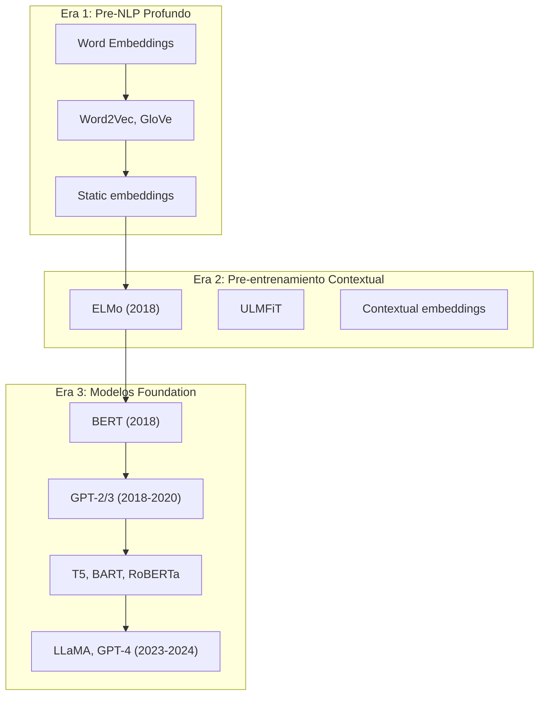
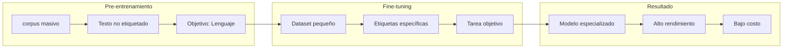
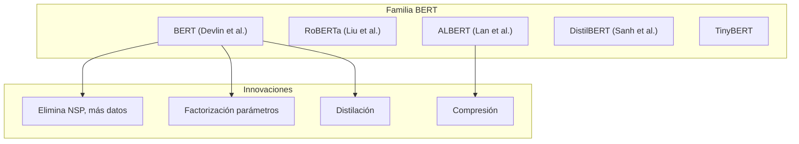
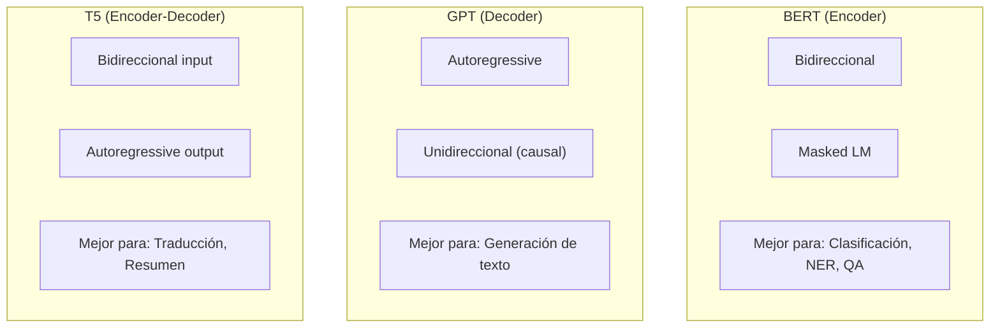
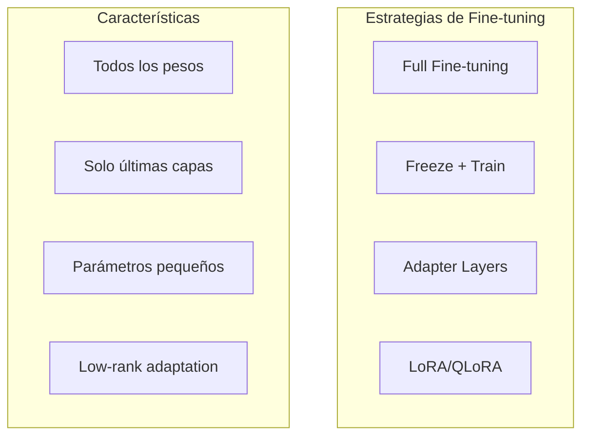
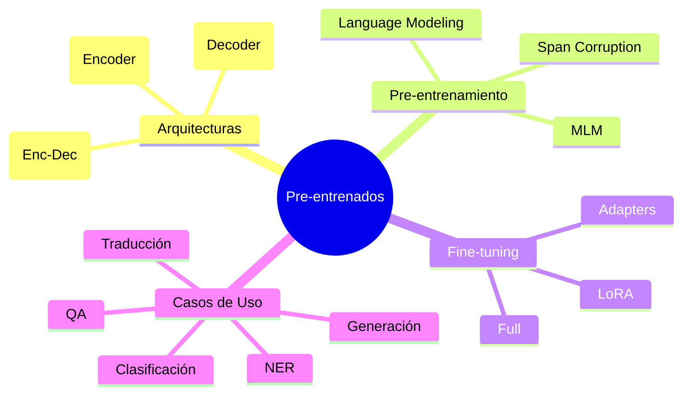

# Clase 12: Modelos Pre-entrenados y Transfer Learning

## Duración: 4 horas

---

## 1. Objetivos de Aprendizaje

Al finalizar esta clase, el estudiante será capaz de:

1. **Comprender los conceptos de Transfer Learning** y pre-entrenamiento en NLP
2. **Explicar las arquitecturas de BERT, GPT y T5**
3. **Implementar fine-tuning** de modelos pre-entrenados con Hugging Face
4. **Usar el Hugging Face Hub** para acceder a modelos y datasets
5. **Aplicar modelos pre-entrenados** a tareas específicas
6. **Evaluar modelos** usando métricas apropiadas

---

## 2. Contenidos Detallados

### 2.1 Fundamentos de Transfer Learning en NLP

#### 2.1.1 Evolución del Pre-entrenamiento



#### 2.1.2 El Paradigma de Transfer Learning



**¿Por qué Transfer Learning?**

1. **Datos limitados**: No tenemos millones de ejemplos etiquetados para cada tarea
2. **Costo computacional**: Pre-entrenar un modelo grande es muy costoso
3. **Conocimiento general**: El modelo aprende representaciones útiles del lenguaje

---

### 2.2 BERT: Bidirectional Encoder Representations from Transformers

#### 2.2.1 Arquitectura y Pre-entrenamiento

```python
"""
BERT: Bidirectional Encoder Representations from Transformers
Paper: Devlin et al. (2018) - "BERT: Pre-training of Deep Bidirectional 
       Transformers for Language Understanding"
"""

import torch
import torch.nn as nn
from transformers import BertModel, BertTokenizer, BertConfig

class BERTOverview:
    """
    Visión general de BERT
    
    Arquitectura: Transformer Encoder (solo encoder)
    Pre-entrenamiento: Masked Language Modeling (MLM) + Next Sentence Prediction (NSP)
    """
    
    @staticmethod
    def mlm_objective():
        """
        Masked Language Modeling
        
        Objetivo: Predecir tokens enmascarados
        
        Ejemplo:
        Input:  "El [MASK] es inteligente"
        Output: "gato" (o "perro")
        
        15% de tokens son [MASK], 80% de ellos son reemplazados por [MASK],
        10% por token aleatorio, 10% se mantienen (pero aún se predice).
        """
        print("="*50)
        print("MASKED LANGUAGE MODELING (MLM)")
        print("="*50)
        print("\nObjetivo: Predecir tokens enmascarados")
        print("Permite atención bidireccional")
        print("15% de tokens son candidatos a mask")
        print("  - 80% -> [MASK]")
        print("  - 10% -> token aleatorio")
        print("  - 10% -> original (sin mask)")
    
    @staticmethod
    def nsp_objective():
        """
        Next Sentence Prediction
        
        Objetivo: Predecir si la oración B sigue a la oración A
        
        Ejemplo:
        Input:  "El gato está en el jardín. [SEP] Come mouse. [SEP]"
        Output: False (Next) o True (IsNext)
        
        Usado para tareas que requieren entender relaciones entre oraciones.
        """
        print("\n" + "="*50)
        print("NEXT SENTENCE PREDICTION (NSP)")
        print("="*50)
        print("\nObjetivo: Predecir relación entre oraciones")
        print("50% positivos (B sigue a A)")
        print("50% negativos (B no sigue a A)")
        print("Ayuda en QA y NLI")
    
    @staticmethod
    def show_architecture():
        """Muestra la arquitectura de BERT"""
        print("\n" + "="*50)
        print("ARQUITECTURA BERT")
        print("="*50)
        print("\nBERT-Base:")
        print("  - 12 capas (Transformer Encoder)")
        print("  - 768 hidden dimensions")
        print("  - 12 attention heads")
        print("  - 110M parameters")
        print("\nBERT-Large:")
        print("  - 24 capas")
        print("  - 1024 hidden dimensions")
        print("  - 16 attention heads")
        print("  - 340M parameters")


def bert_usage_example():
    """Ejemplo de uso de BERT con Hugging Face"""
    
    from transformers import BertTokenizer, BertModel
    import torch
    
    # Cargar tokenizer y modelo pre-entrenado
    model_name = "bert-base-uncased"
    tokenizer = BertTokenizer.from_pretrained(model_name)
    model = BertModel.from_pretrained(model_name)
    
    # Texto de entrada
    text = "The cat sat on the mat because it was tired."
    
    # Tokenización
    inputs = tokenizer(
        text,
        return_tensors="pt",
        padding=True,
        truncation=True,
        max_length=512
    )
    
    print("Tokens de entrada:")
    print(f"  Input IDs: {inputs['input_ids']}")
    print(f"  Attention Mask: {inputs['attention_mask']}")
    
    # Forward pass
    with torch.no_grad():
        outputs = model(**inputs)
    
    #last_hidden_state: (batch, seq_len, hidden_size)
    #pooler_output: (batch, hidden_size) - CLS token after linear+tanH
    
    print(f"\nOutput shapes:")
    print(f"  Last hidden state: {outputs.last_hidden_state.shape}")
    print(f"  Pooler output: {outputs.pooler_output.shape}")
    
    # Obtener embeddings
    embeddings = outputs.last_hidden_state
    print(f"\nEmbedding shape: {embeddings.shape}")
    
    # CLS token representa la oración completa
    cls_embedding = embeddings[:, 0, :]
    print(f"CLS embedding shape: {cls_embedding.shape}")


bert = BERTOverview()
bert.mlm_objective()
bert.nsp_objective()
bert.show_architecture()
```

#### 2.2.2 Variantes de BERT



```python
class BERTVariantsComparison:
    """Comparación de variantes de BERT"""
    
    variants = {
        "BERT-Base": {
            "layers": 12,
            "hidden": 768,
            "heads": 12,
            "params": "110M",
            "desc": "Baseline original"
        },
        "BERT-Large": {
            "layers": 24,
            "hidden": 1024,
            "heads": 16,
            "params": "340M",
            "desc": "Mayor capacidad"
        },
        "RoBERTa-Base": {
            "layers": 12,
            "hidden": 768,
            "heads": 12,
            "params": "125M",
            "desc": "Sin NSP, más datos, más epochs"
        },
        "ALBERT-Base": {
            "layers": 12,
            "hidden": 768,
            "heads": 12,
            "params": "12M",
            "desc": "Parameter sharing, embedding factorization"
        },
        "DistilBERT": {
            "layers": 6,
            "hidden": 768,
            "heads": 12,
            "params": "66M",
            "desc": "Distilled from BERT, 60% faster"
        },
        "TinyBERT": {
            "layers": 4,
            "hidden": 312,
            "heads": 12,
            "params": "14M",
            "desc": "Knowledge distillation"
        }
    }
    
    @staticmethod
    def print_comparison():
        print("\n" + "="*80)
        print("COMPARACIÓN DE VARIANTES BERT")
        print("="*80)
        
        print(f"\n{'Modelo':<15} {'Layers':<8} {'Hidden':<8} {'Heads':<8} {'Params':<10} Descripción")
        print("-"*80)
        
        for name, specs in BERTVariantsComparison.variants.items():
            print(f"{name:<15} {specs['layers']:<8} {specs['hidden']:<8} "
                  f"{specs['heads']:<8} {specs['params']:<10} {specs['desc']}")

BERTVariantsComparison.print_comparison()
```

---

### 2.3 GPT: Generative Pre-trained Transformer

#### 2.3.1 Arquitectura y Pre-entrenamiento

```python
"""
GPT: Generative Pre-trained Transformer
Paper: Radford et al. (2018) - "Improving Language Understanding 
       by Generative Pre-Training"
"""

class GPTOverview:
    """
    Visión general de GPT
    
    Arquitectura: Transformer Decoder (autoregressive)
    Pre-entrenamiento: Language Modeling (predecir siguiente token)
    """
    
    @staticmethod
    def autoregressive_lm():
        """
        Language Modeling Autoregressive
        
        Objetivo: Predecir el siguiente token dado los anteriores
        
        Ejemplo:
        Input:  "El gato"
        Output: "está" (o "no" o "come")
        
        La atención es causal (masked) - solo ve tokens anteriores.
        """
        print("="*50)
        print("AUTOREGRESSIVE LANGUAGE MODELING")
        print("="*50)
        print("\nObjetivo: Predecir siguiente token")
        print("Generación secuencial")
        print("Atención causal (masked)")
        print("Tokens anteriores -> siguiente token")
    
    @staticmethod
    def show_architecture():
        """Muestra la arquitectura de GPT"""
        print("\n" + "="*50)
        print("ARQUITECTURA GPT")
        print("="*50)
        print("\nGPT-1:")
        print("  - 12 capas")
        print("  - 768 hidden dimensions")
        print("  - 117M parameters")
        
        print("\nGPT-2:")
        print("  - 12-48 capas según tamaño")
        print("  - 768-1600 hidden dimensions")
        print("  - 117M - 1.5B parameters")
        
        print("\nGPT-3:")
        print("  - 96 capas")
        print("  - 12288 hidden dimensions")
        print("  - 175B parameters")
        print("  - Few-shot learning capability")


def gpt_generation_example():
    """Ejemplo de generación de texto con GPT"""
    
    from transformers import GPT2Tokenizer, GPT2LMHeadModel
    import torch
    
    # Cargar modelo y tokenizer
    model_name = "gpt2"
    tokenizer = GPT2Tokenizer.from_pretrained(model_name)
    model = GPT2LMHeadModel.from_pretrained(model_name)
    
    # Texto de entrada
    prompt = "The future of artificial intelligence is"
    
    # Tokenización
    inputs = tokenizer(prompt, return_tensors="pt")
    
    print("Prompt:", prompt)
    print("Input IDs:", inputs['input_ids'])
    
    # Generación
    model.eval()
    with torch.no_grad():
        # Greedy decoding
        outputs = model.generate(
            inputs['input_ids'],
            max_length=50,
            num_return_sequences=1,
            no_repeat_ngram_size=2,
            do_sample=True,
            top_k=50,
            top_p=0.95,
            temperature=0.7
        )
    
    # Decodificar
    generated_text = tokenizer.decode(outputs[0], skip_special_tokens=True)
    print("\nGenerado (greedy):")
    print(generated_text)
    
    # Beam search
    with torch.no_grad():
        beam_outputs = model.generate(
            inputs['input_ids'],
            max_length=50,
            num_beams=5,
            no_repeat_ngram_size=2,
            early_stopping=True
        )
    
    beam_text = tokenizer.decode(beam_outputs[0], skip_special_tokens=True)
    print("\nGenerado (beam search):")
    print(beam_text)


GPTOverview.autoregressive_lm()
GPTOverview.show_architecture()
```

#### 2.3.2 Comparación BERT vs GPT



```python
class BERTvsGPTComparison:
    """Comparación detallada entre BERT y GPT"""
    
    @staticmethod
    def print_comparison():
        print("\n" + "="*80)
        print("COMPARACIÓN BERT vs GPT")
        print("="*80)
        
        comparison = """
        Característica         | BERT                    | GPT
        --------------------- | ----------------------- | -----------------------
        Arquitectura          | Encoder (bidireccional) | Decoder (causal)
        Pre-entrenamiento     | MLM + NSP               | Language Modeling
        Atención               | Bidireccional          | Unidireccional (causal)
        Tamaño típico         | 110M-340M               | 117M-175B
        Uso de memoria         | Alto (2x seq len)      | Medio
        Fine-tuning           | Rápido                  | Lento (especialmente GPT-3)
        Generación texto       | Limitado                | Excelente
        Clasificación          | Excelente               | Bueno (con CLS)
        Few-shot learning      | No                      | Sí (GPT-3+)
        
        Casos de uso:
        - BERT: Clasificación, NER, POS tagging, QA, NLI
        - GPT: Generación de texto, chat, completion, coding
        """
        print(comparison)

BERTvsGPTComparison.print_comparison()
```

---

### 2.4 T5: Text-to-Text Transfer Transformer

```python
"""
T5: Text-to-Text Transfer Transformer
Paper: Raffel et al. (2020) - "Exploring the Limits of Transfer Learning 
       with a Unified Text-to-Text Transformer"
"""

class T5Overview:
    """
    Visión general de T5
    
    Arquitectura: Encoder-Decoder (completo)
    Pre-entrenamiento: span corruption (similar a MLM)
    Enfoque: Todas las tareas como text-to-text
    """
    
    @staticmethod
    def text_to_text_framework():
        """
        Framework Text-to-Text
        
        Todas las tareas se formulan como:
        Input: "translate English to German: Hello"
        Output: "Hallo"
        
        Tareas soportadas:
        - Traducción
        - Resumen
        - Clasificación (con prefijo)
        - QA
        - Generación
        """
        print("="*50)
        print("T5: TEXT-TO-TEXT FRAMEWORK")
        print("="*50)
        
        tasks = """
        Tarea                    | Input                          | Output
        ------------------------ | ------------------------------ | ---------------
        Traducción EN->DE        | "translate English to German: Hello world" | "Hallo Welt"
        Resumen                  | "summarize: The article text..." | "Short summary"
        Clasificación             | "sst2: This movie is great"     | "positive"
        Pregunta-Respuesta       | "question: What is AI? context: AI is..." | "the simulation..."
        CoLA (gramática)         | "cola: The cat on the mat"     | "acceptable"
        """
        print(tasks)
    
    @staticmethod
    def show_architecture():
        """Muestra la arquitectura de T5"""
        print("\n" + "="*50)
        print("ARQUITECTURA T5")
        print("="*50)
        print("\nT5-Base:")
        print("  - 12 capas encoder, 12 capas decoder")
        print("  - 768 hidden dimensions")
        print("  - 12 attention heads")
        print("  - 220M parameters")
        
        print("\nT5-Large:")
        print("  - 24 capas encoder, 24 capas decoder")
        print("  - 1024 hidden dimensions")
        print("  - 16 attention heads")
        print("  - 770M parameters")


def t5_example():
    """Ejemplo de uso de T5"""
    
    from transformers import T5Tokenizer, T5ForConditionalGeneration
    
    # Cargar modelo
    model_name = "t5-small"
    tokenizer = T5Tokenizer.from_pretrained(model_name)
    model = T5ForConditionalGeneration.from_pretrained(model_name)
    
    # Traducción
    input_text = "translate English to French: The weather is nice today."
    inputs = tokenizer(input_text, return_tensors="pt")
    
    with torch.no_grad():
        outputs = model.generate(**inputs, max_length=50)
    
    translation = tokenizer.decode(outputs[0], skip_special_tokens=True)
    print(f"Input: {input_text}")
    print(f"Translation: {translation}")
    
    # Resumen
    input_text = "summarize: Artificial intelligence (AI) is intelligence demonstrated by machines, in contrast to the natural intelligence displayed by humans and animals. Leading AI textbooks define the field as the study of 'intelligent agents': any device that perceives its environment and takes actions that maximize its chance of successfully achieving its goals."
    inputs = tokenizer(input_text, return_tensors="pt", max_length=512, truncation=True)
    
    with torch.no_grad():
        outputs = model.generate(**inputs, max_length=100)
    
    summary = tokenizer.decode(outputs[0], skip_special_tokens=True)
    print(f"\nInput: {input_text[:100]}...")
    print(f"Summary: {summary}")

T5Overview.text_to_text_framework()
T5Overview.show_architecture()
```

---

### 2.5 Fine-Tuning de Modelos Pre-entrenados

#### 2.5.1 Estrategias de Fine-Tuning



#### 2.5.2 Implementación de Fine-Tuning

```python
"""
Fine-tuning de BERT para Clasificación de Sentimiento
"""

import torch
from torch.utils.data import Dataset, DataLoader
from transformers import (
    BertTokenizer, 
    BertForSequenceClassification,
    AdamW,
    get_linear_schedule_with_warmup
)
import numpy as np
from sklearn.metrics import accuracy_score, f1_score
import pandas as pd

class SentimentDataset(Dataset):
    """Dataset para clasificación de sentimiento"""
    
    def __init__(self, texts, labels, tokenizer, max_len=128):
        self.texts = texts
        self.labels = labels
        self.tokenizer = tokenizer
        self.max_len = max_len
    
    def __len__(self):
        return len(self.texts)
    
    def __getitem__(self, idx):
        text = str(self.texts[idx])
        label = self.labels[idx]
        
        encoding = self.tokenizer.encode_plus(
            text,
            add_special_tokens=True,
            max_length=self.max_len,
            return_token_type_ids=False,
            padding='max_length',
            truncation=True,
            return_attention_mask=True,
            return_tensors='pt'
        )
        
        return {
            'input_ids': encoding['input_ids'].flatten(),
            'attention_mask': encoding['attention_mask'].flatten(),
            'labels': torch.tensor(label, dtype=torch.long)
        }


class BertSentimentClassifier:
    """
    Clasificador de sentimiento usando BERT
    """
    
    def __init__(self, model_name='bert-base-uncased', num_labels=2, max_len=128):
        self.tokenizer = BertTokenizer.from_pretrained(model_name)
        self.model = BertForSequenceClassification.from_pretrained(
            model_name,
            num_labels=num_labels,
            output_attentions=False,
            output_hidden_states=False
        )
        self.max_len = max_len
        self.device = torch.device('cuda' if torch.cuda.is_available() else 'cpu')
        self.model.to(self.device)
    
    def prepare_data(self, texts, labels, batch_size=16, shuffle=True):
        """Prepara el dataloader"""
        dataset = SentimentDataset(texts, labels, self.tokenizer, self.max_len)
        return DataLoader(dataset, batch_size=batch_size, shuffle=shuffle)
    
    def train_epoch(self, data_loader, optimizer, scheduler, device):
        """Entrena por una época"""
        self.model.train()
        total_loss = 0
        predictions, true_labels = [], []
        
        for batch in data_loader:
            optimizer.zero_grad()
            
            input_ids = batch['input_ids'].to(device)
            attention_mask = batch['attention_mask'].to(device)
            labels = batch['labels'].to(device)
            
            outputs = self.model(
                input_ids=input_ids,
                attention_mask=attention_mask,
                labels=labels
            )
            
            loss = outputs.loss
            total_loss += loss.item()
            
            loss.backward()
            torch.nn.utils.clip_grad_norm_(self.model.parameters(), 1.0)
            
            optimizer.step()
            scheduler.step()
            
            preds = torch.argmax(outputs.logits, dim=1)
            predictions.extend(preds.cpu().numpy())
            true_labels.extend(labels.cpu().numpy())
        
        avg_loss = total_loss / len(data_loader)
        accuracy = accuracy_score(true_labels, predictions)
        
        return avg_loss, accuracy
    
    def eval_model(self, data_loader, device):
        """Evalúa el modelo"""
        self.model.eval()
        total_loss = 0
        predictions, true_labels = [], []
        
        with torch.no_grad():
            for batch in data_loader:
                input_ids = batch['input_ids'].to(device)
                attention_mask = batch['attention_mask'].to(device)
                labels = batch['labels'].to(device)
                
                outputs = self.model(
                    input_ids=input_ids,
                    attention_mask=attention_mask,
                    labels=labels
                )
                
                loss = outputs.loss
                total_loss += loss.item()
                
                preds = torch.argmax(outputs.logits, dim=1)
                predictions.extend(preds.cpu().numpy())
                true_labels.extend(labels.cpu().numpy())
        
        avg_loss = total_loss / len(data_loader)
        accuracy = accuracy_score(true_labels, predictions)
        f1 = f1_score(true_labels, predictions, average='weighted')
        
        return avg_loss, accuracy, f1
    
    def fine_tune(self, train_texts, train_labels, val_texts, val_labels,
                  epochs=3, batch_size=16, learning_rate=2e-5):
        """
        Fine-tuning completo
        """
        print(f"Training on: {self.device}")
        print(f"Training samples: {len(train_texts)}")
        print(f"Validation samples: {len(val_texts)}")
        
        # Crear dataloaders
        train_loader = self.prepare_data(train_texts, train_labels, batch_size, shuffle=True)
        val_loader = self.prepare_data(val_texts, val_labels, batch_size, shuffle=False)
        
        # Optimizer y scheduler
        optimizer = AdamW(
            self.model.parameters(),
            lr=learning_rate,
            eps=1e-8
        )
        
        total_steps = len(train_loader) * epochs
        scheduler = get_linear_schedule_with_warmup(
            optimizer,
            num_warmup_steps=0,
            num_training_steps=total_steps
        )
        
        # Training loop
        best_val_loss = float('inf')
        
        for epoch in range(epochs):
            print(f"\nEpoch {epoch + 1}/{epochs}")
            print("-" * 40)
            
            # Train
            train_loss, train_acc = self.train_epoch(
                train_loader, optimizer, scheduler, self.device
            )
            print(f"Train Loss: {train_loss:.4f} | Train Accuracy: {train_acc:.4f}")
            
            # Evaluate
            val_loss, val_acc, val_f1 = self.eval_model(val_loader, self.device)
            print(f"Val Loss: {val_loss:.4f} | Val Accuracy: {val_acc:.4f} | Val F1: {val_f1:.4f}")
            
            # Save best model
            if val_loss < best_val_loss:
                best_val_loss = val_loss
                torch.save(self.model.state_dict(), 'best_model.pt')
                print("Saved best model!")
        
        return best_val_loss
    
    def predict(self, texts):
        """Predice el sentimiento de nuevos textos"""
        self.model.eval()
        
        predictions = []
        
        for text in texts:
            encoding = self.tokenizer.encode_plus(
                text,
                add_special_tokens=True,
                max_length=self.max_len,
                return_token_type_ids=False,
                padding='max_length',
                truncation=True,
                return_attention_mask=True,
                return_tensors='pt'
            )
            
            input_ids = encoding['input_ids'].to(self.device)
            attention_mask = encoding['attention_mask'].to(self.device)
            
            with torch.no_grad():
                outputs = self.model(input_ids=input_ids, attention_mask=attention_mask)
                pred = torch.argmax(outputs.logits, dim=1).item()
            
            predictions.append(pred)
        
        return predictions


def main():
    # Datos de ejemplo
    train_texts = [
        "This movie is amazing! I loved it.",
        "Terrible film, waste of time.",
        "Great acting and storyline!",
        "Boring and predictable.",
        "One of the best films I've seen.",
        "Not good at all.",
        "Fantastic! Will watch again.",
        "Awful, do not recommend.",
        "Very entertaining and fun.",
        "Disappointing experience."
    ] * 50  # Multiplicar para tener más datos
    
    train_labels = [1, 0, 1, 0, 1, 0, 1, 0, 1, 0] * 50
    
    # Split simple
    split_idx = int(len(train_texts) * 0.8)
    train_texts_split = train_texts[:split_idx]
    train_labels_split = train_labels[:split_idx]
    val_texts = train_texts[split_idx:]
    val_labels = train_labels[split_idx:]
    
    # Crear y entrenar clasificador
    classifier = BertSentimentClassifier()
    
    # Fine-tuning
    classifier.fine_tune(
        train_texts_split, train_labels_split,
        val_texts, val_labels,
        epochs=2,
        batch_size=16
    )
    
    # Predicciones
    test_texts = [
        "This is a great film!",
        "I hated this movie.",
        "Amazing performance!"
    ]
    
    predictions = classifier.predict(test_texts)
    
    print("\nPredictions:")
    for text, pred in zip(test_texts, predictions):
        sentiment = "Positive" if pred == 1 else "Negative"
        print(f"  '{text}' -> {sentiment}")


if __name__ == "__main__":
    main()
```

#### 2.5.3 LoRA: Low-Rank Adaptation

```python
"""
LoRA: Low-Rank Adaptation of Large Language Models
Paper: Hu et al. (2021) - "LoRA: Low-Rank Adaptation of Large Language Models"
"""

import torch
import torch.nn as nn
import math

class LoRALinear(nn.Module):
    """
    Capa lineal con LoRA
    
    W original: (d_out, d_in)
    LoRA: A @ B donde A es (d_out, r) y B es (r, d_in)
    r << min(d_out, d_in)
    
    Forward: x @ W + x @ A @ B * alpha/r
    """
    
    def __init__(self, in_features: int, out_features: int, 
                 rank: int = 4, alpha: int = 1, dropout: float = 0.0):
        super().__init__()
        
        self.in_features = in_features
        self.out_features = out_features
        self.rank = rank
        self.alpha = alpha
        self.scaling = alpha / rank
        
        # W frozen (no se entrena)
        self.weight = nn.Parameter(
            torch.randn(out_features, in_features),
            requires_grad=False
        )
        nn.init.kaiming_uniform_(self.weight, a=math.sqrt(5))
        
        # LoRA trainable matrices
        self.lora_A = nn.Parameter(torch.randn(rank, in_features) * 0.01)
        self.lora_B = nn.Parameter(torch.zeros(out_features, rank))
        
        if dropout > 0:
            self.lora_dropout = nn.Dropout(dropout)
        else:
            self.lora_dropout = nn.Identity()
    
    def forward(self, x: torch.Tensor) -> torch.Tensor:
        # Original output
        base_output = torch.nn.functional.linear(x, self.weight)
        
        # LoRA output
        lora_output = x @ self.lora_A.T @ self.lora_B.T * self.scaling
        
        return base_output + lora_output
    
    def merge_weights(self):
        """Merge LoRA weights into original for inference"""
        delta_W = self.lora_B @ self.lora_A * self.scaling
        merged_weight = self.weight + delta_W
        return merged_weight


class LoRAConfig:
    """Configuración para LoRA"""
    
    def __init__(
        self,
        r: int = 4,
        lora_alpha: int = 1,
        lora_dropout: float = 0.0,
        target_modules: list = ["q_proj", "v_proj"],
        bias: str = "none",
        task_type: str = "CAUSAL_LM"
    ):
        self.r = r
        self.lora_alpha = lora_alpha
        self.lora_dropout = lora_dropout
        self.target_modules = target_modules
        self.bias = bias
        self.task_type = task_type


def apply_lora_to_model(model, config: LoRAConfig):
    """
    Aplica LoRA a un modelo existente
    """
    from transformers import AutoModelForCausalLM
    
    # Reemplazar capas lineales con LoRA
    for name, module in model.named_modules():
        if any(target in name for target in config.target_modules):
            if isinstance(module, nn.Linear):
                # Reemplazar con LoRA
                parent = model.get_submodule('.'.join(name.split('.')[:-1]))
                layer_name = name.split('.')[-1]
                
                lora_layer = LoRALinear(
                    module.in_features,
                    module.out_features,
                    rank=config.r,
                    alpha=config.lora_alpha,
                    dropout=config.lora_dropout
                )
                
                # Copiar pesos originales
                lora_layer.weight.data = module.weight.data.clone()
                
                # Reemplazar
                setattr(parent, layer_name, lora_layer)
    
    return model


def count_parameters(model, trainable_only=False):
    """Cuenta parámetros del modelo"""
    if trainable_only:
        return sum(p.numel() for p in model.parameters() if p.requires_grad)
    return sum(p.numel() for p in model.parameters())


def lora_efficiency_demo():
    """Demuestra la eficiencia de LoRA"""
    
    # Modelo ejemplo
    in_features = 768
    out_features = 768
    batch_size = 8
    seq_len = 512
    
    # Capa lineal completa
    full_layer = nn.Linear(in_features, out_features)
    
    # LoRA
    lora_layer = LoRALinear(in_features, out_features, rank=4, alpha=8)
    
    # Copiar pesos para公平的 comparación
    lora_layer.weight.data = full_layer.weight.data.clone()
    
    # Input
    x = torch.randn(batch_size, seq_len, in_features)
    
    # Forward pass
    with torch.no_grad():
        _ = full_layer(x)
        _ = lora_layer(x)
    
    # Parámetros
    full_params = full_layer.weight.numel()
    
    # LoRA parameters: lora_A + lora_B
    lora_params = lora_layer.lora_A.numel() + lora_layer.lora_B.numel()
    
    print("="*50)
    print("COMPARACIÓN DE PARÁMETROS")
    print("="*50)
    print(f"\nCapa lineal completa: {full_params:,} parameters")
    print(f"LoRA (rank=4): {lora_params:,} parameters")
    print(f"Reducción: {100*(1-lora_params/full_params):.2f}%")
    print(f"\nTrainable parameters:")
    print(f"  Original: {full_params:,}")
    print(f"  LoRA: {lora_params:,}")
    print(f"  Reducción: {100*(1-lora_params/full_params):.2f}%")

lora_efficiency_demo()
```

---

### 2.6 Hugging Face Hub

```python
"""
Uso del Hugging Face Hub
"""

from huggingface_hub import HfApi, list_models, list_datasets, login

# Login (opcional para modelos privados)
# login("your_token_here")

# Listar modelos populares
api = HfApi()

print("="*50)
print("MODELOS POPULARES EN HUGGING FACE")
print("="*50)

# Modelos más descargados
models = list_models(sort="downloads", direction=-1, limit=10)
print("\nTop 10 modelos más descargados:")
for i, model in enumerate(models, 1):
    print(f"  {i}. {model.id} - {model.downloads:,} downloads")

# Modelos específicos por tarea
print("\nModelos para clasificación de texto:")
text_classification_models = list_models(
    task="text-classification", 
    sort="downloads", 
    direction=-1, 
    limit=5
)
for model in text_classification_models:
    print(f"  - {model.id}")

print("\nModelos para generación de texto:")
text_generation_models = list_models(
    task="text-generation",
    sort="downloads",
    direction=-1,
    limit=5
)
for model in text_generation_models:
    print(f"  - {model.id}")

# Listar datasets
print("\n" + "="*50)
print("DATASETS POPULARES")
print("="*50)

datasets = list_datasets(sort="downloads", direction=-1, limit=10)
for i, dataset in enumerate(datasets, 1):
    print(f"  {i}. {dataset.id} - {dataset.downloads:,} downloads")

# Descargar y usar un modelo
def download_and_use_model():
    """Ejemplo de descarga y uso de modelo"""
    from transformers import pipeline
    
    # Crear pipeline (descarga automáticamente)
    classifier = pipeline(
        "sentiment-analysis",
        model="distilbert-base-uncased-finetuned-sst-2-english"
    )
    
    result = classifier("I love using Hugging Face!")
    print(f"\nSentiment: {result}")
    
    # Traducción
    translator = pipeline(
        "translation_en_to_fr",
        model="t5-small"
    )
    result = translator("The weather is nice today")
    print(f"Translation: {result}")

#download_and_use_model()
```

---

## 3. Ejercicios Prácticos Resueltos

### Ejercicio: Fine-tuning de BERT para NER (Named Entity Recognition)

```python
"""
Ejercicio: Fine-tuning de BERT para NER
========================================
"""

import torch
from torch.utils.data import Dataset, DataLoader
from transformers import (
    BertTokenizerFast,
    BertForTokenClassification,
    AdamW,
    get_linear_schedule_with_warmup
)
import numpy as np
from seqeval.metrics import f1_score, classification_report
import warnings
warnings.filterwarnings('ignore')

class NERDataset(Dataset):
    """Dataset para NER"""
    
    def __init__(self, sentences, tags, tokenizer, tag2id, max_len=128):
        self.sentences = sentences
        self.tags = tags
        self.tokenizer = tokenizer
        self.tag2id = tag2id
        self.max_len = max_len
    
    def __len__(self):
        return len(self.sentences)
    
    def __getitem__(self, idx):
        sentence = self.sentences[idx]
        tags = self.tags[idx]
        
        # Tokenizar con alineación de labels
        encoding = self.tokenizer(
            sentence,
            is_split_into_words=True,
            max_length=self.max_len,
            padding='max_length',
            truncation=True,
            return_tensors='pt'
        )
        
        # Alinear labels con tokens
        word_ids = encoding.word_ids()
        label_ids = []
        previous_word_idx = None
        
        for word_idx in word_ids:
            if word_idx is None:
                label_ids.append(-100)  # Special tokens
            elif word_idx != previous_word_idx:
                label_ids.append(self.tag2id.get(tags[word_idx], 0))
            else:
                label_ids.append(-100)  # Subtokens, ignore
            previous_word_idx = word_idx
        
        return {
            'input_ids': encoding['input_ids'].flatten(),
            'attention_mask': encoding['attention_mask'].flatten(),
            'labels': torch.tensor(label_ids, dtype=torch.long)
        }


class BertNER:
    """
    NER usando BERT
    """
    
    def __init__(self, model_name='bert-base-uncased', num_labels=9):
        self.tokenizer = BertTokenizerFast.from_pretrained(model_name)
        self.model = BertForTokenClassification.from_pretrained(
            model_name,
            num_labels=num_labels
        )
        self.device = torch.device('cuda' if torch.cuda.is_available() else 'cpu')
        self.model.to(self.device)
        
        # Tag mapping
        self.id2tag = {
            0: 'O',
            1: 'B-PER', 2: 'I-PER',
            3: 'B-ORG', 4: 'I-ORG',
            5: 'B-LOC', 6: 'I-LOC',
            7: 'B-MISC', 8: 'I-MISC'
        }
        self.tag2id = {v: k for k, v in self.id2tag.items()}
    
    def train(self, train_sentences, train_tags, val_sentences, val_tags,
              epochs=3, batch_size=16, lr=2e-5):
        """Entrena el modelo"""
        
        train_dataset = NERDataset(
            train_sentences, train_tags, self.tokenizer, self.tag2id
        )
        val_dataset = NERDataset(
            val_sentences, val_tags, self.tokenizer, self.tag2id
        )
        
        train_loader = DataLoader(train_dataset, batch_size=batch_size, shuffle=True)
        val_loader = DataLoader(val_dataset, batch_size=batch_size)
        
        optimizer = AdamW(self.model.parameters(), lr=lr)
        total_steps = len(train_loader) * epochs
        scheduler = get_linear_schedule_with_warmup(
            optimizer, num_warmup_steps=0, num_training_steps=total_steps
        )
        
        for epoch in range(epochs):
            # Training
            self.model.train()
            total_loss = 0
            
            for batch in train_loader:
                optimizer.zero_grad()
                
                input_ids = batch['input_ids'].to(self.device)
                attention_mask = batch['attention_mask'].to(self.device)
                labels = batch['labels'].to(self.device)
                
                outputs = self.model(
                    input_ids=input_ids,
                    attention_mask=attention_mask,
                    labels=labels
                )
                
                loss = outputs.loss
                total_loss += loss.item()
                
                loss.backward()
                torch.nn.utils.clip_grad_norm_(self.model.parameters(), 1.0)
                optimizer.step()
                scheduler.step()
            
            print(f"Epoch {epoch+1} - Train Loss: {total_loss/len(train_loader):.4f}")
            
            # Validation
            self.model.eval()
            all_preds, all_labels = [], []
            
            with torch.no_grad():
                for batch in val_loader:
                    input_ids = batch['input_ids'].to(self.device)
                    attention_mask = batch['attention_mask'].to(self.device)
                    labels = batch['labels'].to(self.device)
                    
                    outputs = self.model(
                        input_ids=input_ids,
                        attention_mask=attention_mask
                    )
                    
                    preds = torch.argmax(outputs.logits, dim=2)
                    
                    for i in range(len(preds)):
                        pred_tags = []
                        label_tags = []
                        
                        for j in range(len(preds[i])):
                            if labels[i, j].item() != -100:
                                pred_tags.append(self.id2tag[preds[i, j].item()])
                                label_tags.append(self.id2tag[labels[i, j].item()])
                        
                        if pred_tags:
                            all_preds.append(pred_tags)
                            all_labels.append(label_tags)
            
            f1 = f1_score(all_labels, all_preds)
            print(f"Epoch {epoch+1} - Val F1: {f1:.4f}")
            print(classification_report(all_labels, all_preds))
        
        return self.model
    
    def predict(self, sentence):
        """Predice entidades en una oración"""
        self.model.eval()
        
        tokens = sentence.split()
        encoding = self.tokenizer(
            sentence,
            is_split_into_words=True,
            return_tensors='pt'
        )
        
        input_ids = encoding['input_ids'].to(self.device)
        attention_mask = encoding['attention_mask'].to(self.device)
        
        with torch.no_grad():
            outputs = self.model(input_ids=input_ids, attention_mask=attention_mask)
            preds = torch.argmax(outputs.logits, dim=2)[0]
        
        # Extraer predicciones
        word_ids = encoding.word_ids()
        predictions = []
        previous_word_idx = None
        
        for i, (word_idx, pred) in enumerate(zip(word_ids, preds)):
            if word_idx is not None and word_idx != previous_word_idx:
                predictions.append((tokens[word_idx], self.id2tag[pred.item()]))
            previous_word_idx = word_idx
        
        return predictions


def main():
    # Datos de ejemplo simplificados
    train_sentences = [
        ["John", "works", "at", "Google", "in", "Mountain", "View"],
        ["Mary", "visited", "Paris", "last", "week"],
        ["Apple", "released", "new", "iPhone", "yesterday"],
        ["Elon", "Musk", "is", "CEO", "of", "Tesla", "and", "SpaceX"],
    ] * 25
    
    train_tags = [
        ["B-PER", "O", "O", "B-ORG", "O", "B-LOC", "I-LOC"],
        ["B-PER", "O", "B-LOC", "O", "O"],
        ["B-ORG", "O", "O", "B-MISC", "O"],
        ["B-PER", "I-PER", "O", "O", "O", "B-ORG", "O", "B-ORG"],
    ] * 25
    
    # Split
    split = int(len(train_sentences) * 0.8)
    
    # Entrenar
    ner = BertNER()
    ner.train(
        train_sentences[:split], train_tags[:split],
        train_sentences[split:], train_tags[split:],
        epochs=3
    )
    
    # Predecir
    test_sentences = [
        "John works at Microsoft in Seattle",
        "Tesla is building a factory in Berlin",
        "Tim Cook leads Apple from California"
    ]
    
    print("\n" + "="*50)
    print("PREDICCIONES NER")
    print("="*50)
    
    for sentence in test_sentences:
        print(f"\n{sentence}")
        entities = ner.predict(sentence)
        for word, tag in entities:
            if tag != 'O':
                print(f"  {word}: {tag}")


if __name__ == "__main__":
    main()
```

---

## 4. Actividades de Laboratorio

### Laboratorio: Construir un Chatbot con Fine-tuning

```python
"""
Laboratorio: Fine-tuning de GPT-2 para Diálogo
==============================================
"""

# Implementar un chatbot que responde preguntas
# usando fine-tuning de GPT-2

def lab_instructions():
    print("""
    LABORATORIO: Fine-tuning de GPT-2 para Chatbot
    
    Objetivos:
    1. Preparar dataset de diálogos
    2. Aplicar formato de chat a los datos
    3. Fine-tunar GPT-2
    4. Generar respuestas
    
    Dataset sugerido: Cornell Movie-Dialogs Corpus
    o simplemente usa datos de conversación propios
    
    Pasos:
    1. Instalar librerías: pip install transformers datasets
    2. Preparar datos en formato prompt-response
    3. Tokenizar con GPT2Tokenizer
    4. Crear Dataset y DataLoader
    5. Configurar GPT2LMHeadModel
    6. Entrenar con teacher forcing
    7. Generar respuestas
    
    Este laboratorio puede completarse en 2-3 horas.
    """)

lab_instructions()
```

---

## 5. Resumen de Puntos Clave



### Puntos Clave:

1. **Transfer Learning** permite usar conocimiento de lenguaje general
2. **BERT** usa MLM bidireccional para representaciones completas
3. **GPT** usa Language Modeling autoregresivo para generación
4. **T5** unifica todas las tareas como text-to-text
5. **Fine-tuning** adapta modelos pre-entrenados a tareas específicas
6. **LoRA** reduce significativamente el costo de fine-tuning

---

## 6. Referencias Externas

1. **BERT Paper:**
   - Devlin et al. (2018). "BERT: Pre-training of Deep Bidirectional Transformers"
   - URL: https://arxiv.org/abs/1810.04805

2. **GPT Paper:**
   - Radford et al. (2018). "Language Models are Unsupervised Multitask Learners"
   - URL: https://d4mucfpksywv.cloudfront.net/better-language-models/language_models_are_unsupervised_multitask_learners.pdf

3. **T5 Paper:**
   - Raffel et al. (2020). "Exploring the Limits of Transfer Learning"
   - URL: https://arxiv.org/abs/1910.10683

4. **LoRA Paper:**
   - Hu et al. (2021). "LoRA: Low-Rank Adaptation of Large Language Models"
   - URL: https://arxiv.org/abs/2106.09685

5. **Hugging Face Documentation:**
   - URL: https://huggingface.co/docs

---

**Fin de la Clase 12: Modelos Pre-entrenados y Transfer Learning**
