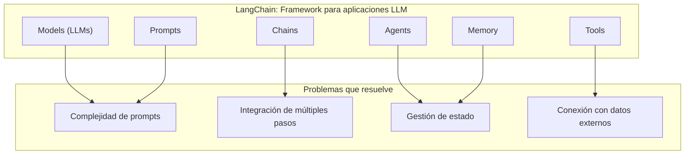
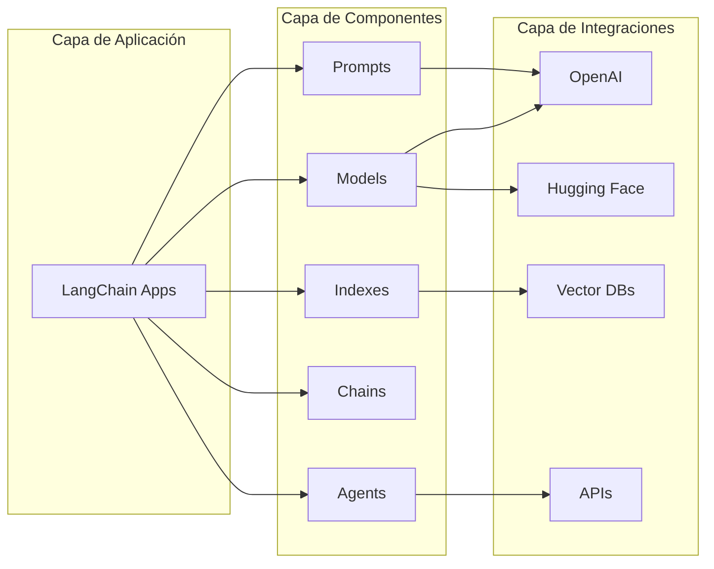
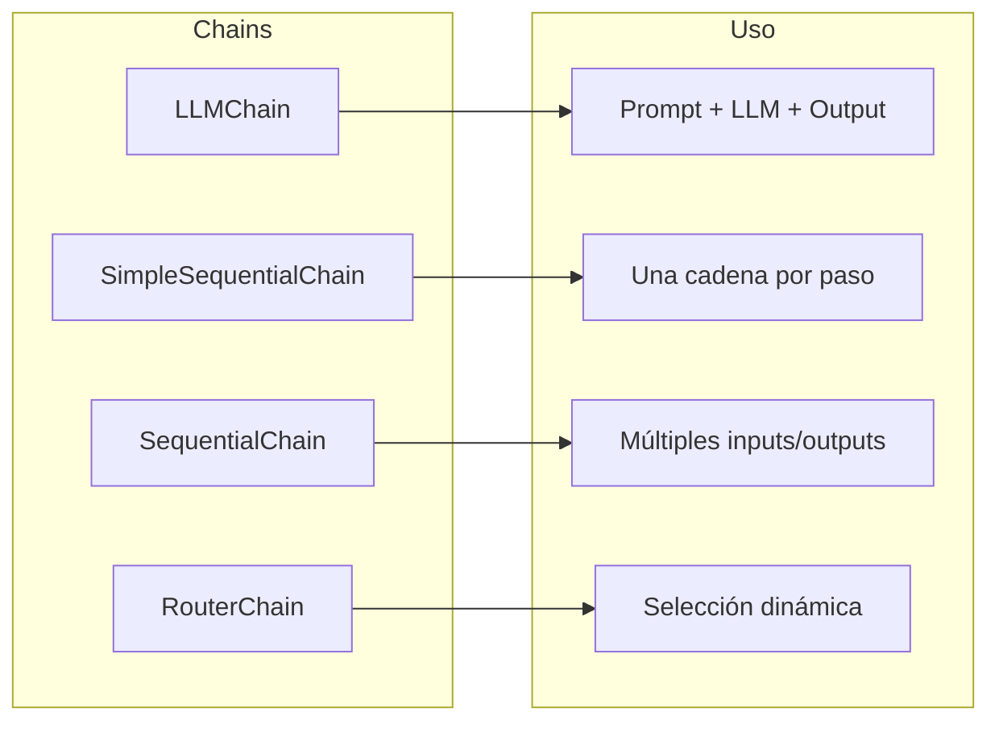
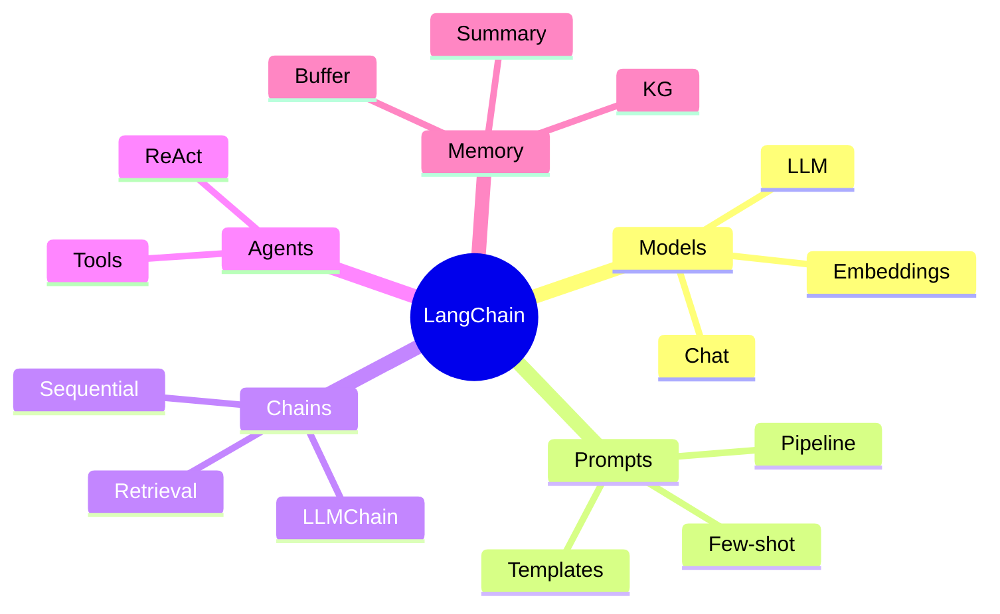

# Clase 13: Introducción a LangChain

## Duración: 4 horas

---

## 1. Objetivos de Aprendizaje

Al finalizar esta clase, el estudiante será capaz de:

1. **Comprender los conceptos fundamentales de LangChain**
2. **Explicar los componentes principales**: Models, Prompts, Chains, Agents
3. **Crear Chains básicos** para procesamiento de texto
4. **Implementar Prompt Templates** con variables dinámicas
5. **Usar memoria en Chains** para mantener contexto
6. **Conectar con APIs externas** y bases de datos

---

## 2. Contenidos Detallados

### 2.1 ¿Qué es LangChain?



#### 2.1.1 Arquitectura de LangChain



---

### 2.2 Instalación y Configuración

```python
"""
Instalación de LangChain y dependencias
"""

# Instalación básica
# pip install langchain

# Para usar OpenAI
# pip install openai

# Para usar Hugging Face
# pip install huggingface-hub

# Para herramientas adicionales
# pip install langchain[all]

# Verificar instalación
import langchain
print(f"LangChain version: {langchain.__version__}")
```

---

### 2.3 Models en LangChain

#### 2.3.1 LLMs (Language Model Wrappers)

```python
"""
Models en LangChain
===================
LangChain proporciona wrappers para diferentes modelos de lenguaje.
"""

from langchain.llms import OpenAI
from langchain.llms import HuggingFaceHub
from langchain.chat_models import ChatOpenAI
from langchain.schema import HumanMessage, SystemMessage, AIMessage

# ============================================================
# OPENAI LLM
# ============================================================

def openai_llm_example():
    """Ejemplo de uso de OpenAI LLM"""
    
    # Configuración con API key
    # export OPENAI_API_KEY="sk-..."
    
    # Crear instancia
    llm = OpenAI(
        model_name="gpt-3.5-turbo-instruct",
        temperature=0.7,
        max_tokens=100
    )
    
    # Generación simple
    response = llm("What is machine learning?")
    print(f"Response: {response}")
    
    # Generación con stop
    response = llm(
        "Write a haiku about AI:\n",
        stop=["\n"]
    )
    print(f"Haiku: {response}")
    
    # Batch de prompts
    responses = llm.generate([
        "What is Python?",
        "What is Java?",
        "What is Rust?"
    ])
    
    for gen in responses.generations:
        print(f"  - {gen[0].text}")
    
    return llm

# ============================================================
# CHAT MODELS
# ============================================================

def chat_model_example():
    """Ejemplo de Chat Models (GPT-3.5-turbo, GPT-4)"""
    
    # Crear chat model
    chat = ChatOpenAI(
        model_name="gpt-3.5-turbo",
        temperature=0.7,
        max_tokens=100
    )
    
    # Mensajes
    messages = [
        SystemMessage(content="You are a helpful coding assistant."),
        HumanMessage(content="Write a Python function to calculate fibonacci.")
    ]
    
    # Llamada
    response = chat(messages)
    print(f"Chat Response:\n{response.content}")
    
    # Múltiples turnos (contexto)
    messages = [
        SystemMessage(content="You are a helpful assistant."),
        HumanMessage(content="My name is John."),
        AIMessage(content="Hello John! How can I help you today?"),
        HumanMessage(content="What is my name?")
    ]
    
    response = chat(messages)
    print(f"\nContextual Response: {response.content}")
    
    return chat

# ============================================================
# HUGGING FACE
# ============================================================

def huggingface_example():
    """Ejemplo de uso con Hugging Face"""
    
    # Usar modelos de Hugging Face Hub
    llm = HuggingFaceHub(
        repo_id="google/flan-t5-large",
        model_kwargs={"temperature": 0.7, "max_length": 100}
    )
    
    response = llm("What is the capital of France?")
    print(f"HF Response: {response}")
    
    return llm


# Ejecución
if __name__ == "__main__":
    print("="*60)
    print("LANGCHAIN MODELS EXAMPLES")
    print("="*60)
    
    # Descomenta para ejecutar (requiere API key)
    # llm = openai_llm_example()
    # chat = chat_model_example()
    # hf = huggingface_example()
    
    print("\nModelos configurados correctamente.")
```

#### 2.3.2 Configuración de Modelos

```python
"""
Configuraciones avanzadas de modelos
"""

from langchain.llms import OpenAI
from langchain.chat_models import ChatOpenAI
from langchain.callbacks import get_openai_callback
import time

class ModelConfiguration:
    """Ejemplos de configuraciones avanzadas"""
    
    @staticmethod
    def streaming_example():
        """Generación con streaming"""
        from langchain.callbacks.streaming_stdout import StreamingStdOutCallbackHandler
        
        llm = OpenAI(
            streaming=True,
            callbacks=[StreamingStdOutCallbackHandler()],
            temperature=0
        )
        
        # La respuesta se muestra token por token
        response = llm("Write a short story about a robot:")
        return response
    
    @staticmethod
    def token_tracking():
        """Seguimiento de uso de tokens"""
        llm = OpenAI(temperature=0)
        
        with get_openai_callback() as cb:
            response = llm("What is artificial intelligence?")
            
            print(f"Tokens usados: {cb.total_tokens}")
            print(f"Tokens en prompt: {cb.prompt_tokens}")
            print(f"Tokens en completion: {cb.completion_tokens}")
            print(f"Costo total: ${cb.total_cost:.4f}")
        
        return response
    
    @staticmethod
    def retry_and_timeout():
        """Manejo de errores y timeouts"""
        from langchain.llms import OpenAI
        from langchain.callbacks import StdOutCallbackHandler
        
        llm = OpenAI(
            max_retries=3,
            timeout=60,  # 60 segundos
            model_kwargs={"max_tokens": 100}
        )
        
        try:
            response = llm("Hello!")
            print(f"Response: {response}")
        except Exception as e:
            print(f"Error: {e}")
        
        return llm
    
    @staticmethod
    def caching_example():
        """Caching de respuestas"""
        from langchain.cache import InMemoryCache
        from langchain.llms import OpenAI
        import langchain
        
        # Habilitar cache
        langchain.llm_cache = InMemoryCache()
        
        llm = OpenAI(temperature=0)
        
        # Primera llamada (más lenta)
        start = time.time()
        response1 = llm("What is 2+2?")
        time1 = time.time() - start
        
        # Segunda llamada (usa cache, más rápida)
        start = time.time()
        response2 = llm("What is 2+2?")
        time2 = time.time() - start
        
        print(f"Primera llamada: {time1:.4f}s")
        print(f"Segunda llamada (cached): {time2:.4f}s")
        print(f"Speedup: {time1/time2:.2f}x")
        
        return llm

ModelConfiguration.caching_example()
```

---

### 2.4 Prompt Templates

#### 2.4.1 Concepto y Uso Básico

```python
"""
Prompt Templates en LangChain
=============================
Los Prompt Templates permiten crear prompts dinámicos con variables.
"""

from langchain import PromptTemplate
from langchain.prompts import PromptTemplate, FewShotPromptTemplate
from langchain.prompts.example_selector import LengthBasedExampleSelector
from langchain.schema import HumanMessage, SystemMessage

# ============================================================
# PROMPT TEMPLATE BÁSICO
# ============================================================

def basic_prompt_template():
    """Uso básico de PromptTemplate"""
    
    # Template simple
    template = """
    Translate the following text from English to {target_language}:
    
    Text: {text}
    
    Translation:
    """
    
    # Crear prompt template
    prompt = PromptTemplate(
        input_variables=["text", "target_language"],
        template=template
    )
    
    # Formatear con variables
    formatted_prompt = prompt.format(
        text="Hello, how are you?",
        target_language="Spanish"
    )
    
    print("Formatted Prompt:")
    print(formatted_prompt)
    print()
    
    # Usar con LLM
    from langchain.llms import OpenAI
    llm = OpenAI(temperature=0)
    
    # El LLM recibe el prompt formateado
    response = llm(formatted_prompt)
    print(f"Response: {response}")
    
    return prompt

# ============================================================
# CHAT PROMPT TEMPLATES
# ============================================================

def chat_prompt_template():
    """Prompt templates para Chat Models"""
    
    from langchain.prompts.chat import (
        ChatPromptTemplate,
        SystemMessagePromptTemplate,
        HumanMessagePromptTemplate,
        AIMessagePromptTemplate
    )
    
    # System prompt
    system_template = "You are a helpful assistant that speaks in {language}."
    system_prompt = SystemMessagePromptTemplate.from_template(system_template)
    
    # Human prompt
    human_template = "{user_input}"
    human_prompt = HumanMessagePromptTemplate.from_template(human_template)
    
    # Crear chat prompt
    chat_prompt = ChatPromptTemplate.from_messages([system_prompt, human_prompt])
    
    # Formatear
    messages = chat_prompt.format_prompt(
        language="Spanish",
        user_input="What is Python?"
    ).to_messages()
    
    print("Chat Messages:")
    for msg in messages:
        print(f"  [{type(msg).__name__}]: {msg.content}")
    
    # Usar con ChatOpenAI
    from langchain.chat_models import ChatOpenAI
    chat = ChatOpenAI(temperature=0)
    
    response = chat(messages)
    print(f"\nResponse: {response.content}")
    
    return chat_prompt

# ============================================================
# FEW-SHOT PROMPTING
# ============================================================

def few_shot_prompting():
    """Few-shot prompting con ejemplos"""
    
    from langchain.prompts import FewShotPromptTemplate
    from langchain.prompts.example_selector import SemanticSimilarityExampleSelector
    
    # Ejemplos
    examples = [
        {
            "input": "What is the capital of France?",
            "output": "Paris"
        },
        {
            "input": "What is 2 + 2?",
            "output": "4"
        },
        {
            "input": "What is the color of the sky?",
            "output": "Blue"
        },
        {
            "input": "Who wrote Hamlet?",
            "output": "William Shakespeare"
        }
    ]
    
    # Template para ejemplos
    example_template = """
    Question: {input}
    Answer: {output}
    """
    
    example_prompt = PromptTemplate(
        input_variables=["input", "output"],
        template=example_template
    )
    
    # Selector de ejemplos
    from langchain.prompts.example_selector import RandomExampleSelector
    
    example_selector = RandomExampleSelector(
        examples=examples,
        n=2  # Seleccionar 2 ejemplos aleatorios
    )
    
    # Few-shot prompt
    few_shot_prompt = FewShotPromptTemplate(
        example_prompt=example_prompt,
        example_selector=example_selector,
        prefix="Answer the following questions:",
        suffix="Question: {input}\nAnswer:",
        input_variables=["input"]
    )
    
    # Formatear
    formatted = few_shot_prompt.format(input="What is 3 + 3?")
    print("Few-shot Prompt:")
    print(formatted)
    print()
    
    return few_shot_prompt


# Ejecutar ejemplos
if __name__ == "__main__":
    print("="*60)
    print("PROMPT TEMPLATES EXAMPLES")
    print("="*60)
    
    prompt1 = basic_prompt_template()
    print("\n" + "-"*60 + "\n")
    
    chat_prompt = chat_prompt_template()
    print("\n" + "-"*60 + "\n")
    
    few_shot = few_shot_prompting()
```

#### 2.4.2 Plantillas Avanzadas

```python
"""
Plantillas de prompts avanzadas
"""

from langchain import PromptTemplate
from langchain.prompts import pipeline_prompt_template, StringPromptTemplate
from typing import List

# ============================================================
# PIPELINE PROMPT
# ============================================================

def pipeline_prompt():
    """Encadenar múltiples templates"""
    
    from langchain.prompts import PipelinePromptTemplate
    
    # Templates parciales
    introduction = PromptTemplate(
        input_variables=["topic"],
        template="You are an expert in {topic}."
    )
    
    main_prompt = PromptTemplate(
        input_variables=["topic", "question"],
        template="{introduction}\n\nPlease answer this question: {question}"
    )
    
    # Pipeline
    full_prompt = PipelinePromptTemplate(
        final_prompt=main_prompt,
        pipeline_prompts=[
            ("introduction", introduction)
        ]
    )
    
    formatted = full_prompt.format(topic="Python", question="What is a decorator?")
    print("Pipeline Prompt:")
    print(formatted)
    
    return full_prompt

# ============================================================
# CUSTOM PROMPT TEMPLATE
# ============================================================

class CustomPromptTemplate(StringPromptTemplate):
    """Template personalizado con lógica adicional"""
    
    @property
    def template(self) -> str:
        return """Given the following context, answer the question.
    
    Context: {context}
    
    Question: {question}
    
    Answer the question based on the context above.
    Format your answer as follows:
    - First sentence: Direct answer
    - Second sentence: Brief explanation
    - Confidence level: [High/Medium/Low]
    """
    
    def format(self, **kwargs) -> str:
        kwargs["question"] = kwargs["question"].capitalize() + "?"
        return super().format(**kwargs)


def custom_template_example():
    """Ejemplo de template personalizado"""
    
    template = CustomPromptTemplate(input_variables=["context", "question"])
    
    formatted = template.format(
        context="Python is a programming language created by Guido van Rossum in 1991.",
        question="what is python"
    )
    
    print("Custom Template Output:")
    print(formatted)
    
    return template

pipeline_prompt()
custom_template_example()
```

---

### 2.5 Chains en LangChain

#### 2.5.1 Concepto y Tipos de Chains



#### 2.5.2 LLMChain

```python
"""
LLMChain: La chain más básica
============================
Combina un prompt template con un LLM.
"""

from langchain import PromptTemplate, LLMChain
from langchain.llms import OpenAI

def llm_chain_example():
    """Ejemplo de LLMChain"""
    
    # Template
    template = """You are a helpful AI assistant.
    
    User's question: {question}
    
    Provide a clear and concise answer.
    """
    
    prompt = PromptTemplate(
        input_variables=["question"],
        template=template
    )
    
    # Crear LLM
    llm = OpenAI(temperature=0.7)
    
    # Crear chain
    chain = LLMChain(llm=llm, prompt=prompt)
    
    # Ejecutar
    response = chain.run(question="What is the difference between AI and ML?")
    print("LLMChain Response:")
    print(response)
    print()
    
    # Batch execution
    questions = [
        "What is Python?",
        "What is JavaScript?",
        "What is Rust?"
    ]
    
    responses = chain.generate(questions)
    for q, gen in zip(questions, responses):
        print(f"Q: {q}")
        print(f"A: {gen[0].text}\n")
    
    return chain

# ============================================================
# SIMPLE SEQUENTIAL CHAIN
# ============================================================

def simple_sequential_chain():
    """Cadenas secuenciales simples"""
    
    from langchain.chains import LLMChain, SimpleSequentialChain
    from langchain import PromptTemplate
    
    # Chain 1: Generar nombre de empresa
    template1 = """Based on the following industry, generate a creative company name.
    
    Industry: {industry}
    
    Company name:"""
    
    prompt1 = PromptTemplate(input_variables=["industry"], template=template1)
    chain1 = LLMChain(llm=OpenAI(temperature=0), prompt=prompt1)
    
    # Chain 2: Generar slogan
    template2 = """Based on the following company name, generate a catchy slogan.
    
    Company: {company_name}
    
    Slogan:"""
    
    prompt2 = PromptTemplate(input_variables=["company_name"], template=template2)
    chain2 = LLMChain(llm=OpenAI(temperature=0), prompt=prompt2)
    
    # Combinar en Sequential Chain
    full_chain = SimpleSequentialChain(chains=[chain1, chain2], verbose=True)
    
    # Ejecutar
    result = full_chain.run("technology")
    print(f"\nFinal Result:\n{result}")
    
    return full_chain

# ============================================================
# SEQUENTIAL CHAIN (MULTI-INPUT/OUTPUT)
# ============================================================

def sequential_chain():
    """Cadenas secuenciales con múltiples inputs/outputs"""
    
    from langchain.chains import SequentialChain
    from langchain import PromptTemplate
    
    # Chain 1: Análisis de texto
    template1 = """Analyze the following text and identify:
    1. The main topic
    2. The sentiment (positive/negative/neutral)
    3. Key entities mentioned
    
    Text: {text}
    
    Analysis:"""
    
    prompt1 = PromptTemplate(input_variables=["text"], template=template1)
    chain1 = LLMChain(llm=OpenAI(temperature=0), prompt=prompt1, output_key="analysis")
    
    # Chain 2: Resumen basado en análisis
    template2 = """Based on the following analysis, write a brief summary.
    
    Analysis: {analysis}
    
    Summary:"""
    
    prompt2 = PromptTemplate(input_variables=["analysis"], template=template2)
    chain2 = LLMChain(llm=OpenAI(temperature=0), prompt=prompt2, output_key="summary")
    
    # Chain 3: hashtags
    template3 = """Based on the following summary, suggest relevant hashtags.
    
    Summary: {summary}
    
    Hashtags:"""
    
    prompt3 = PromptTemplate(input_variables=["summary"], template=template3)
    chain3 = LLMChain(llm=OpenAI(temperature=0), prompt=prompt3, output_key="hashtags")
    
    # Combinar
    full_chain = SequentialChain(
        chains=[chain1, chain2, chain3],
        input_variables=["text"],
        output_variables=["analysis", "summary", "hashtags"],
        verbose=True
    )
    
    # Ejecutar
    result = full_chain({
        "text": "The new iPhone 15 was released today with impressive camera improvements and a new titanium design."
    })
    
    print("\n" + "="*60)
    print("RESULTS:")
    print("="*60)
    print(f"\nAnalysis:\n{result['analysis']}")
    print(f"\nSummary:\n{result['summary']}")
    print(f"\nHashtags:\n{result['hashtags']}")
    
    return full_chain

# ============================================================
# TRANSFORMATION CHAIN
# ============================================================

def transformation_chain():
    """Chain que transforma el input antes de procesarlo"""
    
    from langchain.chains import TransformChain
    from langchain import PromptTemplate, LLMChain
    
    def transform_func(inputs: dict) -> dict:
        """Transforma el texto a lowercase y elimina puntuación"""
        text = inputs["text"]
        text = text.lower()
        text = "".join(c if c.isalnum() or c.isspace() else "" for c in text)
        return {"cleaned_text": text}
    
    # Transform chain
    transform_chain = TransformChain(
        input_variables=["text"],
        output_variables=["cleaned_text"],
        transform=transform_func
    )
    
    # LLM Chain
    template = "Count the number of words in this text:\n\n{cleaned_text}\n\nWord count:"
    prompt = PromptTemplate(input_variables=["cleaned_text"], template=template)
    llm_chain = LLMChain(llm=OpenAI(temperature=0), prompt=prompt)
    
    # Combine
    from langchain.chains import SequentialChain
    chain = SequentialChain(
        chains=[transform_chain, llm_chain],
        input_variables=["text"],
        output_variables=["text"],
        verbose=True
    )
    
    # Execute
    result = chain.run("Hello, World! This is a TEST.")
    print(f"\nResult: {result}")
    
    return chain

# Ejecutar ejemplos
if __name__ == "__main__":
    print("="*60)
    print("CHAINS EXAMPLES")
    print("="*60)
    
    chain1 = llm_chain_example()
    print("\n" + "="*60 + "\n")
    
    chain2 = simple_sequential_chain()
    print("\n" + "="*60 + "\n")
    
    chain3 = sequential_chain()
    print("\n" + "="*60 + "\n")
    
    chain4 = transformation_chain()
```

#### 2.5.3 Chains con Herramientas

```python
"""
Chains con herramientas externas
================================
"""

from langchain.chains import LLMChain
from langchain.agents import initialize_agent, Tool
from langchain.llms import OpenAI
from langchain import PromptTemplate

# ============================================================
# DEFINIR HERRAMIENTAS
# ============================================================

def search_function(query: str) -> str:
    """Simula una función de búsqueda"""
    # En producción, usar API de búsqueda real
    results = {
        "python": "Python is a high-level programming language.",
        "java": "Java is a class-based, object-oriented language.",
        "javascript": "JavaScript is a scripting language for web pages."
    }
    return results.get(query.lower(), f"No information found about {query}")

def calculate_function(expression: str) -> str:
    """Calculadora simple"""
    try:
        result = eval(expression)
        return str(result)
    except:
        return "Error in calculation"

def wikipedia_function(query: str) -> str:
    """Simula búsqueda en Wikipedia"""
    info = {
        "ai": "Artificial Intelligence (AI) is intelligence demonstrated by machines.",
        "ml": "Machine Learning (ML) is a subset of AI that enables systems to learn.",
        "dl": "Deep Learning (DL) uses neural networks with many layers."
    }
    return info.get(query.lower(), f"Wikipedia article not found for {query}")

# Definir tools
tools = [
    Tool(
        name="Search",
        func=search_function,
        description="Search for information about programming languages"
    ),
    Tool(
        name="Calculator",
        func=calculate_function,
        description="Evaluate mathematical expressions"
    ),
    Tool(
        name="Wikipedia",
        func=wikipedia_function,
        description="Get information from Wikipedia"
    )
]

def tools_example():
    """Ejemplo de uso de herramientas"""
    
    # Crear LLM
    llm = OpenAI(temperature=0)
    
    # Inicializar agente con herramientas
    agent = initialize_agent(
        tools,
        llm,
        agent="zero-shot-react-description",
        verbose=True
    )
    
    # Ejecutar queries
    queries = [
        "What is Python and calculate 2+2?",
        "Search for Java and then look it up on Wikipedia"
    ]
    
    for query in queries:
        print(f"\nQuery: {query}")
        print("-" * 40)
        response = agent.run(query)
        print(f"Response: {response}")
    
    return agent

tools_example()
```

---

### 2.6 Memory en Chains

```python
"""
Memory en LangChain
==================
Permite mantener contexto entre múltiples interacciones.
"""

from langchain.chains import ConversationChain
from langchain.memory import (
    ConversationBufferMemory,
    ConversationBufferWindowMemory,
    ConversationSummaryMemory,
    ConversationKGMemory
)
from langchain.llms import OpenAI
from langchain.chat_models import ChatOpenAI

def memory_examples():
    """Ejemplos de diferentes tipos de memoria"""
    
    # ============================================================
    # CONVERSATION BUFFER MEMORY
    # ============================================================
    print("="*60)
    print("CONVERSATION BUFFER MEMORY")
    print("="*60)
    
    memory = ConversationBufferMemory()
    chat = ChatOpenAI(temperature=0)
    
    conversation = ConversationChain(
        llm=chat,
        memory=memory,
        verbose=True
    )
    
    response = conversation.predict(input="Hi, my name is John.")
    print(f"\nAI: {response}")
    
    response = conversation.predict(input="What is my name?")
    print(f"\nAI: {response}")
    
    # Ver contenido de memoria
    print(f"\nMemory variables: {memory.chat_memory.messages}")
    
    # ============================================================
    # CONVERSATION WINDOW MEMORY
    # ============================================================
    print("\n" + "="*60)
    print("CONVERSATION WINDOW MEMORY")
    print("="*60)
    
    memory = ConversationBufferWindowMemory(k=2)  # Solo últimos 2 exchanges
    conversation = ConversationChain(
        llm=chat,
        memory=memory,
        verbose=False
    )
    
    conversation.predict(input="Fact 1: The sky is blue")
    conversation.predict(input="Fact 2: Water is wet")
    conversation.predict(input="Fact 3: Fire is hot")
    conversation.predict(input="Fact 4: Ice is cold")
    
    response = conversation.predict(input="What is Fact 1?")
    print(f"AI: {response}")
    # Debería haber olvidado Fact 1
    
    # ============================================================
    # CONVERSATION SUMMARY MEMORY
    # ============================================================
    print("\n" + "="*60)
    print("CONVERSATION SUMMARY MEMORY")
    print("="*60)
    
    memory = ConversationSummaryMemory(llm=chat)
    conversation = ConversationChain(
        llm=chat,
        memory=memory,
        verbose=False
    )
    
    # Conversación larga
    conversation.predict(input="I work at Google as a software engineer.")
    conversation.predict(input="I've been there for 5 years.")
    conversation.predict(input="Before that, I was at Microsoft for 3 years.")
    
    print(f"Summary: {memory.buffer}")
    
    response = conversation.predict(input="Where do I work?")
    print(f"AI: {response}")
    
    # ============================================================
    # KNOWLEDGE GRAPH MEMORY
    # ============================================================
    print("\n" + "="*60)
    print("KNOWLEDGE GRAPH MEMORY")
    print("="*60)
    
    memory = ConversationKGMemory(llm=chat)
    conversation = ConversationChain(
        llm=chat,
        memory=memory,
        verbose=False
    )
    
    conversation.predict(input="John works at Google.")
    conversation.predict(input="He lives in San Francisco.")
    conversation.predict(input="Sarah is John's wife.")
    
    # Obtener conocimiento
    entities = conversation.memory.get_entities()
    relations = conversation.memory.get_knowledge(entities[0] if entities else "John")
    
    print(f"Entities: {entities}")
    print(f"Relations for John: {relations}")
    
    return conversation

memory_examples()
```

---

## 3. Ejercicios Prácticos Resueltos

### Ejercicio: Construir un Asistente de Análisis de Documentos

```python
"""
Ejercicio: Asistente de Análisis de Documentos
==============================================
Construir una chain que analiza documentos y responde preguntas.
"""

from langchain import PromptTemplate, LLMChain
from langchain.chains import SequentialChain
from langchain.llms import OpenAI
from langchain.text_splitter import CharacterTextSplitter
from typing import List, Dict

class DocumentAnalysisAssistant:
    """
    Asistente que analiza documentos y responde preguntas.
    """
    
    def __init__(self, openai_api_key: str = None):
        """Inicializa el asistente"""
        import os
        if openai_api_key:
            os.environ["OPENAI_API_KEY"] = openai_api_key
        
        self.llm = OpenAI(temperature=0.3)
        self.document_text = ""
        self.summary_chain = None
        self.qa_chain = None
        
        self._setup_chains()
    
    def _setup_chains(self):
        """Configura las chains"""
        
        # Chain 1: Resumen
        summary_template = """You are a document analysis assistant.

Analyze the following document and provide:
1. A brief summary (2-3 sentences)
2. Key topics covered
3. Main conclusions

Document:
{document}

Analysis:"""

        self.summary_prompt = PromptTemplate(
            input_variables=["document"],
            template=summary_template
        )
        
        self.summary_chain = LLMChain(
            llm=self.llm,
            prompt=self.summary_prompt,
            output_key="summary"
        )
        
        # Chain 2: Q&A sobre el documento
        qa_template = """Based on the following document summary, answer the question.

Summary:
{summary}

Question: {question}

Answer based on the document, or say "I don't have enough information" if unsure."""

        self.qa_prompt = PromptTemplate(
            input_variables=["summary", "question"],
            template=qa_template
        )
        
        self.qa_chain = LLMChain(
            llm=self.llm,
            prompt=self.qa_prompt,
            output_key="answer"
        )
        
        # Sequential Chain
        self.full_chain = SequentialChain(
            chains=[self.summary_chain, self.qa_chain],
            input_variables=["document", "question"],
            output_variables=["summary", "answer"],
            verbose=False
        )
    
    def load_document(self, text: str):
        """Carga un documento"""
        self.document_text = text
        print(f"Document loaded: {len(text)} characters")
    
    def summarize(self) -> str:
        """Genera un resumen del documento"""
        if not self.document_text:
            return "No document loaded"
        
        result = self.summary_chain.run(document=self.document_text)
        return result
    
    def ask_question(self, question: str) -> str:
        """Responde una pregunta sobre el documento"""
        if not self.document_text:
            return "No document loaded"
        
        result = self.full_chain.run(
            document=self.document_text,
            question=question
        )
        return result["answer"]
    
    def analyze(self, question: str) -> Dict[str, str]:
        """Análisis completo con resumen y respuesta"""
        if not self.document_text:
            return {"error": "No document loaded"}
        
        result = self.full_chain.run(
            document=self.document_text,
            question=question
        )
        
        return {
            "summary": result["summary"],
            "answer": result["answer"]
        }


def main():
    """Ejemplo de uso"""
    
    # Documento de ejemplo
    sample_document = """
    Artificial Intelligence (AI) is transforming industries across the globe. 
    Machine Learning, a subset of AI, enables computers to learn from data without 
    being explicitly programmed. Deep Learning, a further subset, uses neural 
    networks with many layers to achieve remarkable results in image recognition, 
    natural language processing, and autonomous systems.

    Key applications of AI include:
    - Healthcare: Drug discovery, medical imaging, personalized medicine
    - Finance: Fraud detection, algorithmic trading, risk assessment
    - Transportation: Self-driving cars, traffic optimization, logistics
    - Customer Service: Chatbots, virtual assistants, sentiment analysis

    The future of AI raises important questions about ethics, job displacement, 
    and the role of human oversight in autonomous systems. Organizations must 
    carefully consider these implications while embracing the benefits of AI.
    """
    
    # Crear asistente
    assistant = DocumentAnalysisAssistant()
    
    # Cargar documento
    assistant.load_document(sample_document)
    
    # Generar resumen
    print("\n" + "="*60)
    print("SUMMARIZATION")
    print("="*60)
    summary = assistant.summarize()
    print(f"\nSummary:\n{summary}")
    
    # Preguntas
    print("\n" + "="*60)
    print("Q&A")
    print("="*60)
    
    questions = [
        "What are the key applications of AI?",
        "How is AI used in healthcare?",
        "What are the ethical concerns mentioned?"
    ]
    
    for q in questions:
        print(f"\nQuestion: {q}")
        answer = assistant.ask_question(q)
        print(f"Answer: {answer}")
    
    # Análisis completo
    print("\n" + "="*60)
    print("FULL ANALYSIS")
    print("="*60)
    
    result = assistant.analyze("What is the role of Deep Learning in AI?")
    print(f"\nSummary: {result['summary']}")
    print(f"\nAnswer: {result['answer']}")


if __name__ == "__main__":
    main()
```

---

## 4. Actividades de Laboratorio

### Laboratorio: Construir un Bot de Preguntas Frecuentes

```python
"""
Laboratorio: FAQ Bot con LangChain
==================================
Construir un bot que responde preguntas frecuentes usando RAG.
"""

def lab_instructions():
    print("""
    LABORATORIO: FAQ Bot con LangChain
    
    Objetivo: Construir un bot de preguntas frecuentes usando
    recuperación de información y generación.
    
    Estructura:
    1. Crear base de conocimiento con FAQs
    2. Indexar usando VectorStore
    3. Crear chain de retrieval + generation
    4. Implementar respuestas contextuales
    
    Pasos:
    1. Preparar datos de FAQs
    2. Crear embeddings con OpenAI o sentence-transformers
    3. Indexar en vector store (FAISS o Chroma)
    4. Implementar retrieval chain
    5. Probar con preguntas de usuario
    
    Este laboratorio puede completarse en 2 horas.
    
    Código base proporcionado a continuación:
    """)

def faq_bot_example():
    """Ejemplo de FAQ bot básico"""
    
    from langchain.chains import RetrievalQA
    from langchain.embeddings import OpenAIEmbeddings
    from langchain.vectorstores import FAISS
    from langchain.llms import OpenAI
    from langchain.document_loaders import TextLoader
    from langchain.text_splitter import CharacterTextSplitter
    
    # ============================================================
    # 1. PREPARAR DATOS
    # ============================================================
    
    faq_data = """
    Q: How do I reset my password?
    A: To reset your password, go to Settings > Security > Reset Password. 
       You will receive an email with instructions.
    
    Q: How do I contact support?
    A: You can contact support via email at support@example.com or call 
       our hotline at 1-800-EXAMPLE.
    
    Q: What are the subscription plans?
    A: We offer three plans: Free (basic features), Pro ($9.99/month with 
       advanced features), and Enterprise (custom pricing).
    
    Q: How do I cancel my subscription?
    A: To cancel, go to Account > Subscription > Cancel Plan. Your access 
       will continue until the end of the billing period.
    
    Q: Do you offer refunds?
    A: Yes, we offer full refunds within 30 days of purchase. After 30 days, 
       no refunds are available but you can cancel future billing.
    
    Q: How do I update my payment method?
    A: Go to Account > Billing > Payment Methods. Click Add New Card or 
       Update to change your payment information.
    
    Q: Is there a mobile app?
    A: Yes, we have apps for iOS (App Store) and Android (Google Play). 
       Download free with your account credentials.
    
    Q: How do I enable two-factor authentication?
    A: Go to Settings > Security > Two-Factor Authentication. Scan the QR 
       code with your authenticator app to enable 2FA.
    """
    
    # Guardar temporalmente
    with open("faq_data.txt", "w") as f:
        f.write(faq_data)
    
    # ============================================================
    # 2. CARGAR Y PROCESAR DOCUMENTOS
    # ============================================================
    
    from langchain.document_loaders import TextLoader
    from langchain.text_splitter import CharacterTextSplitter
    
    loader = TextLoader("faq_data.txt")
    documents = loader.load()
    
    splitter = CharacterTextSplitter(
        chunk_size=100,
        chunk_overlap=20,
        separator="\n"
    )
    
    texts = splitter.split_documents(documents)
    print(f"Created {len(texts)} text chunks")
    
    # ============================================================
    # 3. CREAR VECTOR STORE (requiere API key de OpenAI)
    # ============================================================
    
    # Descomenta para usar con OpenAI (requiere API key)
    """
    embeddings = OpenAIEmbeddings()
    
    vectorstore = FAISS.from_documents(texts, embeddings)
    
    # Guardar vector store
    vectorstore.save_local("faiss_index")
    
    # ============================================================
    # 4. CREAR QA CHAIN
    # ============================================================
    
    from langchain.chains import RetrievalQA
    
    llm = OpenAI(temperature=0)
    
    qa_chain = RetrievalQA.from_chain_type(
        llm=llm,
        chain_type="stuff",
        retriever=vectorstore.as_retriever()
    )
    
    # ============================================================
    # 5. PREGUNTAR
    # ============================================================
    
    questions = [
        "How do I reset my password?",
        "What subscription plans do you offer?",
        "Is there a mobile app?"
    ]
    
    for q in questions:
        print(f"\nQ: {q}")
        answer = qa_chain.run(q)
        print(f"A: {answer}")
    """
    
    print("\nFAQ Bot preparado.")
    print("Descomenta las líneas con # para ejecutar con API key de OpenAI.")

faq_bot_example()
```

---

## 5. Resumen de Puntos Clave



### Puntos Clave:

1. **LangChain** es un framework para construir aplicaciones LLM
2. **Models** wrappean diferentes LLMs (OpenAI, HuggingFace, etc.)
3. **Prompt Templates** permiten crear prompts dinámicos
4. **Chains** conectan componentes en pipelines
5. **Memory** mantiene estado entre interacciones
6. **Agents** usan herramientas para completar tareas

---

## 6. Referencias Externas

1. **LangChain Documentation:**
   - URL: https://python.langchain.com/docs/

2. **LangChain GitHub:**
   - URL: https://github.com/hwchase17/langchain

3. **LangChain Academy:**
   - URL: https://academy.langchain.com/

4. **Prompt Engineering Guide:**
   - URL: https://www.promptingguide.ai/

---

**Fin de la Clase 13: Introducción a LangChain**
