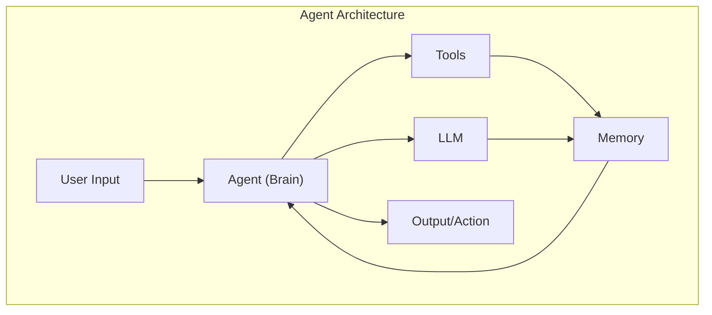
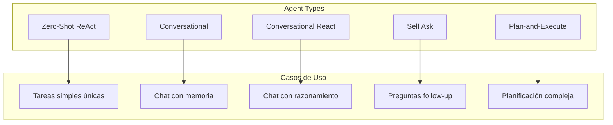
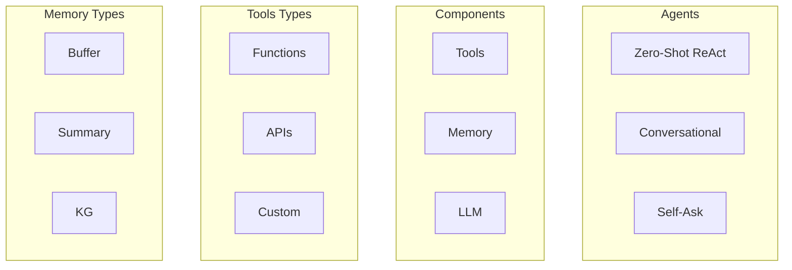

# Clase 14: Programación de Agentes con LangChain

## Duración: 4 horas

---

## 1. Objetivos de Aprendizaje

Al finalizar esta clase, el estudiante será capaz de:

1. **Comprender el concepto de Agents** en LangChain
2. **Crear Agents con herramientas personalizadas**
3. **Implementar el patrón ReAct** (Reasoning + Acting)
4. **Usar Memory en Agents** para contexto persistente
5. **Construir aplicaciones multi-agent**
6. **Depurar y optimizar Agents**

---

## 2. Contenidos Detallados

### 2.1 Fundamentos de Agents



#### 2.1.1 ¿Qué es un Agent?

Un Agent es un sistema que:
1. Recibe un input o tarea
2. Usa un LLM para razonar
3. Decide qué herramientas usar
4. Ejecuta acciones
5. Observa resultados
6. Repite hasta completar la tarea

```python
"""
Agentes en LangChain
====================
"""

from langchain.agents import Agent
from langchain.agents import initialize_agent
from langchain.agents import ZeroShotAgent
from langchain.agents import Tool
from langchain.llms import OpenAI
from langchain.prompts import PromptTemplate

def agent_concept_demo():
    """Demostración conceptual de Agents"""
    
    print("="*60)
    print("CONCEPTO DE AGENT")
    print("="*60)
    
    explanation = """
    Un Agent en LangChain es un sistema que:
    
    1. RECIBE una tarea del usuario
       ↓
    2. RAZONA sobre cómo completarla (usa LLM)
       ↓
    3. DECIDE qué acción tomar (usa Tools)
       ↓
    4. EJECUTA la acción
       ↓
    5. OBSERVA el resultado
       ↓
    6. REPITE hasta completar la tarea
    
    Componentes clave:
    - LLM: El "cerebro" que razona
    - Tools: Las capacidades del agente (búsqueda, calculadora, etc.)
    - Memory: Almacena contexto e historial
    - Agent Type: Define el comportamiento de razonamiento
    """
    
    print(explanation)

agent_concept_demo()
```

---

### 2.2 Tipos de Agentes



```python
"""
Tipos de Agentes en LangChain
=============================
"""

from langchain.agents import (
    initialize_agent,
    ZeroShotAgent,
    ConversationalAgent,
    SelfAskAgent,
    PlanAndExecuteAgent
)
from langchain.tools import Tool
from langchain.llms import OpenAI
from langchain.chains import LLMChain

def define_tools():
    """Define herramientas de ejemplo"""
    
    def search_wikipedia(query: str) -> str:
        """Busca información en Wikipedia"""
        info = {
            "python": "Python is a high-level programming language created by Guido van Rossum.",
            "java": "Java is a class-based, object-oriented programming language.",
            "ai": "Artificial Intelligence (AI) is intelligence demonstrated by machines."
        }
        return info.get(query.lower(), f"No Wikipedia entry for '{query}'")
    
    def calculator(expression: str) -> str:
        """Calcula expresiones matemáticas"""
        try:
            result = eval(expression)
            return str(result)
        except Exception as e:
            return f"Error: {e}"
    
    def get_date() -> str:
        """Obtiene la fecha actual"""
        from datetime import datetime
        return datetime.now().strftime("%Y-%m-%d %H:%M:%S")
    
    tools = [
        Tool(
            name="Wikipedia",
            func=search_wikipedia,
            description="Search for information on Wikipedia. Input: search topic."
        ),
        Tool(
            name="Calculator",
            func=calculator,
            description="Evaluate mathematical expressions. Input: expression like '2+2'."
        ),
        Tool(
            name="DateTime",
            func=get_date,
            description="Get current date and time."
        )
    ]
    
    return tools

def zero_shot_agent_example():
    """Zero-Shot ReAct Agent"""
    print("\n" + "="*60)
    print("ZERO-SHOT REACT AGENT")
    print("="*60)
    
    tools = define_tools()
    llm = OpenAI(temperature=0)
    
    # Inicializar agente
    agent = initialize_agent(
        tools,
        llm,
        agent="zero-shot-react-description",
        verbose=True
    )
    
    # Ejecutar
    result = agent.run(
        "What is Python? Then calculate 2+2 and tell me the current date."
    )
    
    print(f"\nFinal Result: {result}")
    
    return agent

def conversational_agent_example():
    """Conversational Agent con memoria"""
    print("\n" + "="*60)
    print("CONVERSATIONAL AGENT")
    print("="*60)
    
    from langchain.memory import ConversationBufferMemory
    
    tools = define_tools()
    llm = OpenAI(temperature=0)
    
    # Memoria para conversación
    memory = ConversationBufferMemory(memory_key="chat_history", return_messages=True)
    
    # Agente conversacional
    agent = initialize_agent(
        tools,
        llm,
        agent="conversational-react-description",
        memory=memory,
        verbose=True
    )
    
    # Conversación
    print("\nTurn 1:")
    result1 = agent.run("Hi! My name is John.")
    print(f"Agent: {result1}")
    
    print("\nTurn 2:")
    result2 = agent.run("What is my name?")
    print(f"Agent: {result2}")
    
    print("\nTurn 3:")
    result3 = agent.run("What is Python?")
    print(f"Agent: {result3}")
    
    return agent

def self_ask_agent_example():
    """Self-Ask Agent con preguntas intermedias"""
    print("\n" + "="*60)
    print("SELF-ASK AGENT")
    print("="*60)
    
    from langchain.agents import initialize_agent
    from langchain.tools import Tool
    
    tools = define_tools()
    llm = OpenAI(temperature=0)
    
    # Crear self-ask agent
    from langchain.agents import SelfAskWithSearchChain
    
    agent = SelfAskWithSearchChain(
        llm=llm,
        tools=tools,
        verbose=True
    )
    
    result = agent.run(
        "Is Python older than Java?"
    )
    
    print(f"\nResult: {result}")
    
    return agent

# Descomenta para ejecutar
# zero_shot_agent_example()
# conversational_agent_example()
# self_ask_agent_example()
```

---

### 2.3 Herramientas (Tools) en LangChain

#### 2.3.1 Creación de Herramientas Personalizadas

```python
"""
Herramientas Personalizadas en LangChain
=======================================
"""

from langchain.tools import Tool
from langchain.tools.base import tool
from typing import Optional
import re

# ============================================================
# CREAR TOOL DESDE FUNCIÓN
# ============================================================

def search_database(query: str) -> str:
    """Busca en una base de datos simulada"""
    
    database = {
        "users": [
            {"id": 1, "name": "John Doe", "email": "john@example.com", "role": "admin"},
            {"id": 2, "name": "Jane Smith", "email": "jane@example.com", "role": "user"},
            {"id": 3, "name": "Bob Johnson", "email": "bob@example.com", "role": "user"}
        ],
        "products": [
            {"id": 1, "name": "Laptop", "price": 999.99},
            {"id": 2, "name": "Mouse", "price": 29.99},
            {"id": 3, "name": "Keyboard", "price": 79.99}
        ]
    }
    
    query_lower = query.lower()
    
    for table_name, records in database.items():
        if table_name in query_lower:
            if "user" in query_lower:
                for user in database["users"]:
                    if "name" in query_lower or user["name"].lower() in query_lower:
                        return str(user)
                return str(database["users"])
            elif "product" in query_lower:
                for product in database["products"]:
                    if "name" in query_lower or product["name"].lower() in query_lower:
                        return str(product)
                return str(database["products"])
    
    return "No matching records found"


def create_database_tool():
    """Crea herramienta de base de datos"""
    
    db_tool = Tool(
        name="Database",
        func=search_database,
        description="""
        Searches a simulated database for users or products.
        Use for: looking up user information, product details, or inventory.
        Input should be: a search query like 'find user John' or 'list products'.
        """
    )
    
    return db_tool

# ============================================================
# CREAR TOOL USANDO DECORADOR @tool
# ============================================================

@tool
def get_weather(location: str, unit: str = "celsius") -> str:
    """
    Gets the current weather for a location.
    
    Args:
        location: The city or location to get weather for
        unit: The unit for temperature (celsius or fahrenheit)
    
    Returns:
        A string with the weather information
    """
    # Simulated weather data
    weather_data = {
        "new york": {"temp": 22, "condition": "Sunny"},
        "london": {"temp": 15, "condition": "Cloudy"},
        "tokyo": {"temp": 25, "condition": "Rainy"},
        "paris": {"temp": 18, "condition": "Partly Cloudy"},
        "sydney": {"temp": 28, "condition": "Sunny"}
    }
    
    location_lower = location.lower()
    
    if location_lower in weather_data:
        data = weather_data[location_lower]
        temp = data["temp"]
        
        if unit == "fahrenheit":
            temp = temp * 9/5 + 32
        
        return f"Weather in {location.title()}: {temp}°{unit[0].upper()}, {data['condition']}"
    else:
        return f"Weather data not available for {location}"


@tool
def send_email(recipient: str, subject: str, body: str) -> str:
    """
    Sends an email to a recipient.
    
    Args:
        recipient: The email address to send to
        subject: The email subject line
        body: The email body content
    
    Returns:
        Confirmation message
    """
    # Validate email format
    email_pattern = r'^[a-zA-Z0-9._%+-]+@[a-zA-Z0-9.-]+\.[a-zA-Z]{2,}$'
    if not re.match(email_pattern, recipient):
        return f"Error: Invalid email address format: {recipient}"
    
    # Simulate sending
    return f"Email sent successfully!\nTo: {recipient}\nSubject: {subject}\nBody: {body[:50]}..."


@tool
def code_interpreter(code: str) -> str:
    """
    Interprets and executes Python code.
    
    Args:
        code: Python code to execute
    
    Returns:
        The output of the code execution or error message
    """
    try:
        # WARNING: In production, use a sandboxed environment!
        import subprocess
        result = eval(code)
        return f"Result: {result}"
    except Exception as e:
        return f"Error executing code: {str(e)}"


# ============================================================
# COMBINAR HERRAMIENTAS EN AGENT
# ============================================================

def create_agent_with_custom_tools():
    """Crea un agente con herramientas personalizadas"""
    
    from langchain.agents import initialize_agent
    from langchain.llms import OpenAI
    
    # Recopilar herramientas
    tools = [
        create_database_tool(),
        get_weather,
        send_email,
        code_interpreter
    ]
    
    # Crear agente
    llm = OpenAI(temperature=0)
    
    agent = initialize_agent(
        tools,
        llm,
        agent="zero-shot-react-description",
        verbose=True
    )
    
    return agent


def example_queries():
    """Ejemplos de queries para probar"""
    
    queries = [
        "What's the weather in New York?",
        "Find user John in the database",
        "Calculate 2 + 2 * 3",
        "Send an email to test@example.com with subject 'Hello' and body 'This is a test.'",
        "List all products in the database"
    ]
    
    print("Example queries to try:")
    for q in queries:
        print(f"  - {q}")


example_queries()
```

#### 2.3.2 Herramientas Externas (APIs)

```python
"""
Integración con APIs Externas
============================
"""

from langchain.tools import APITool
from langchain.utilities import SerpAPIWrapper
from langchain.utilities import WikipediaAPIWrapper
import requests

# ============================================================
# SERP API (Google Search)
# ============================================================

def google_search_example():
    """Ejemplo de búsqueda en Google usando SerpAPI"""
    
    # Requiere API key: export SERPAPI_API_KEY="..."
    
    """
    from langchain.utilities import SerpAPIWrapper
    
    search = SerpAPIWrapper()
    
    result = search.run("What is LangChain?")
    print(f"Google Search Result: {result}")
    """
    
    print("Google Search requires SERPAPI_API_KEY")
    print("See: https://serpapi.com/")


# ============================================================
# WIKIPEDIA API
# ============================================================

def wikipedia_example():
    """Ejemplo de búsqueda en Wikipedia"""
    
    from langchain.utilities import WikipediaAPIWrapper
    
    search = WikipediaAPIWrapper()
    
    result = search.run("Python programming language")
    print(f"Wikipedia Result:\n{result[:500]}...")
    
    return search


# ============================================================
# CUSTOM API TOOL
# ============================================================

class CustomAPITool:
    """Plantilla para crear herramientas de API"""
    
    def __init__(self, base_url: str, api_key: str = None):
        self.base_url = base_url
        self.api_key = api_key
        self.session = requests.Session()
        if api_key:
            self.session.headers.update({"Authorization": f"Bearer {api_key}"})
    
    def query(self, endpoint: str, params: dict = None) -> str:
        """Hace una query a la API"""
        url = f"{self.base_url}/{endpoint}"
        response = self.session.get(url, params=params)
        return response.text


def custom_api_example():
    """Ejemplo de API custom"""
    
    # Ejemplo con API de clima (Open-Meteo - gratuita)
    
    class WeatherAPI:
        """API de clima usando Open-Meteo (gratuita)"""
        
        def __init__(self):
            self.base_url = "https://api.open-meteo.com/v1"
        
        def get_weather(self, latitude: float, longitude: float) -> str:
            url = f"{self.base_url}/forecast"
            params = {
                "latitude": latitude,
                "longitude": longitude,
                "current_weather": True
            }
            
            response = requests.get(url, params=params)
            data = response.json()
            
            if "current_weather" in data:
                cw = data["current_weather"]
                return f"Temperature: {cw['temperature']}°C, Wind: {cw['windspeed']} km/h"
            
            return "Weather data not available"
    
    weather = WeatherAPI()
    result = weather.get_weather(40.7128, -74.0060)  # New York
    print(f"Weather API Result: {result}")
    
    return weather

#wikipedia_example()
custom_api_example()
```

---

### 2.4 Patrón ReAct (Reasoning + Acting)

```python
"""
ReAct: Synergizing Reasoning and Acting
=======================================
Paper: https://arxiv.org/abs/2210.03629

El patrón ReAct combina:
- REASONING: Pensar paso a paso sobre qué hacer
- ACTING: Ejecutar acciones (usar herramientas)

Loop:
1. Thought (pensamiento): Razonar sobre la situación
2. Action (acción): Decidir qué herramienta usar
3. Observation (observación): Ver el resultado
4. Repeat
"""

from langchain.agents import AgentExecutor, create_react_agent
from langchain.tools import Tool
from langchain import OpenAI
from langchain import SerpAPIWrapper
from langchain.prompts import PromptTemplate

class ReActAgentImplementation:
    """Implementación detallada del patrón ReAct"""
    
    @staticmethod
    def create_react_agent():
        """Crea un agente ReAct"""
        
        # Definir herramientas
        tools = [
            Tool(
                name="Calculator",
                func=lambda x: eval(x),
                description="Use for math calculations. Input: expression like '2+2'"
            ),
            Tool(
                name="Search",
                func=lambda x: f"Search result for: {x}",
                description="Use to search for information"
            )
        ]
        
        # Template de prompt ReAct
        react_prompt = PromptTemplate(
            input_variables=["input", "agent_scratchpad", "tools", "tool_names"],
            template="""Answer the following question using the tools provided.

Question: {input}

You have access to the following tools:
{tools}

Use the following format:

Thought: [your reasoning here]
Action: [the action to take, must be one of {tool_names}]
Action Input: [the input to the action]
Observation: [the result of the action]
... (this Thought/Action/Action Input/Observation can repeat N times)

Thought: I now know the final answer
Final Answer: [your response to the original question]

{agent_scratchpad}"""
        )
        
        # Crear agente
        llm = OpenAI(temperature=0)
        agent = create_react_agent(llm, tools, react_prompt)
        
        # Crear executor
        agent_executor = AgentExecutor.from_agent_and_tools(
            agent=agent,
            tools=tools,
            verbose=True,
            handle_parsing_errors=True
        )
        
        return agent_executor
    
    @staticmethod
    def run_examples():
        """Ejecuta ejemplos con el agente ReAct"""
        
        agent = ReActAgentImplementation.create_react_agent()
        
        queries = [
            "What is 25 * 4 + 10?",
            "What is the square root of 144?",
        ]
        
        for query in queries:
            print(f"\nQuery: {query}")
            print("-" * 40)
            result = agent.run(query)
            print(f"Final Answer: {result}")


# Ejecutar
ReActAgentImplementation.run_examples()
```

---

### 2.5 Memory en Agentes

```python
"""
Memory en Agentes
================
"""

from langchain.agents import initialize_agent
from langchain.agents import Tool
from langchain.llms import OpenAI
from langchain.memory import (
    ConversationBufferMemory,
    ConversationSummaryMemory,
    ReadOnlySharedMemory
)

def memory_in_agents():
    """Ejemplos de memoria en agentes"""
    
    # ============================================================
    # CONVERSATION BUFFER MEMORY
    # ============================================================
    
    print("="*60)
    print("CONVERSATION BUFFER MEMORY")
    print("="*60)
    
    def get_time():
        from datetime import datetime
        return datetime.now().strftime("%H:%M:%S")
    
    tools = [
        Tool(name="Time", func=get_time, description="Get current time")
    ]
    
    llm = OpenAI(temperature=0)
    memory = ConversationBufferMemory(memory_key="chat_history")
    
    agent = initialize_agent(
        tools,
        llm,
        agent="conversational-react-description",
        memory=memory,
        verbose=True
    )
    
    # Primera interacción
    print("\nInteraction 1:")
    result1 = agent.run("Hi, I'm Alice!")
    print(f"Agent: {result1}")
    
    # Segunda interacción (recuerda el nombre)
    print("\nInteraction 2:")
    result2 = agent.run("What's my name?")
    print(f"Agent: {result2}")
    
    # Ver historial
    print(f"\nMemory contents: {memory.chat_memory.messages}")
    
    # ============================================================
    # CONVERSATION SUMMARY MEMORY
    # ============================================================
    
    print("\n" + "="*60)
    print("CONVERSATION SUMMARY MEMORY")
    print("="*60)
    
    memory = ConversationSummaryMemory(llm=llm, memory_key="chat_history")
    
    agent = initialize_agent(
        tools,
        llm,
        agent="conversational-react-description",
        memory=memory,
        verbose=True
    )
    
    # Conversación larga
    agent.run("I'm planning a trip to Paris next month.")
    agent.run("I'll be staying for 5 days.")
    agent.run("I want to visit the Eiffel Tower and Louvre.")
    agent.run("Do you have any recommendations?")
    
    # Ver resumen
    print(f"\nMemory Summary:\n{memory.buffer}")
    
    # ============================================================
    # READ ONLY MEMORY
    # ============================================================
    
    print("\n" + "="*60)
    print("READ ONLY MEMORY (Información compartida)")
    print("="*60)
    
    # Memoria de solo lectura para compartir contexto
    readonly_memory = ReadOnlySharedMemory(memory=memory)
    
    # Crear agente que solo puede leer
    agent_readonly = initialize_agent(
        tools,
        llm,
        agent="conversational-react-description",
        memory=readonly_memory,
        verbose=False
    )
    
    result = agent_readonly.run("What was my last question about?")
    print(f"Agent (readonly memory): {result}")
    
    return agent

memory_in_agents()
```

---

### 2.6 Agentes Multi-Agent

```python
"""
Agentes Multi-Agent
===================
"""

from langchain.agents import AgentExecutor, create_react_agent
from langchain.tools import Tool
from langchain import OpenAI
from langchain.prompts import PromptTemplate

class MultiAgentSystem:
    """Sistema de múltiples agentes cooperando"""
    
    @staticmethod
    def create_research_agent():
        """Agente de investigación"""
        
        tools = [
            Tool(name="Search", func=lambda x: f"Research on: {x}", description="Research topics"),
            Tool(name="Summarize", func=lambda x: f"Summary of: {x[:50]}...", description="Summarize content")
        ]
        
        prompt = PromptTemplate(
            input_variables=["input", "agent_scratchpad", "tools", "tool_names"],
            template="""You are a Research Agent. Your job is to gather information.

Question: {input}

Tools available:
{tools}

Research the topic thoroughly.
"""
        )
        
        llm = OpenAI(temperature=0)
        agent = create_react_agent(llm, tools, prompt)
        return AgentExecutor.from_agent_and_tools(agent=agent, tools=tools, verbose=True)
    
    @staticmethod
    def create_writer_agent():
        """Agente de escritura"""
        
        tools = [
            Tool(name="Write", func=lambda x: f"Written: {x}", description="Write content"),
            Tool(name="Edit", func=lambda x: f"Edited: {x}", description="Edit content")
        ]
        
        prompt = PromptTemplate(
            input_variables=["input", "agent_scratchpad", "tools", "tool_names"],
            template="""You are a Writer Agent. Your job is to create content based on research.

Research: {input}

Write a well-structured response using the available tools.
"""
        )
        
        llm = OpenAI(temperature=0)
        agent = create_react_agent(llm, tools, prompt)
        return AgentExecutor.from_agent_and_tools(agent=agent, tools=tools, verbose=True)
    
    @staticmethod
    def create_supervisor_agent(researcher, writer):
        """Agente supervisor que coordina"""
        
        def supervisor_func(task: str) -> str:
            """Supervisa el flujo de trabajo"""
            
            print(f"\nSupervisor: Starting task: {task}")
            
            # Paso 1: Investigación
            print("Supervisor: Sending to Research Agent...")
            research_result = researcher.run(f"Research: {task}")
            print(f"Research result: {research_result}")
            
            # Paso 2: Escritura
            print("Supervisor: Sending to Writer Agent...")
            write_result = writer.run(f"Based on this research:\n{research_result}")
            print(f"Write result: {write_result}")
            
            return write_result
        
        return Tool(
            name="Supervisor",
            func=supervisor_func,
            description="Supervises multi-agent workflow: research and write"
        )
    
    @staticmethod
    def run():
        """Ejecuta el sistema multi-agent"""
        
        print("="*60)
        print("MULTI-AGENT SYSTEM")
        print("="*60)
        
        # Crear agentes
        researcher = MultiAgentSystem.create_research_agent()
        writer = MultiAgentSystem.create_writer_agent()
        supervisor = MultiAgentSystem.create_supervisor_agent(researcher, writer)
        
        # Crear agente principal
        main_agent = initialize_agent(
            [supervisor],
            OpenAI(temperature=0),
            agent="zero-shot-react-description",
            verbose=True
        )
        
        # Ejecutar
        result = main_agent.run("Write about the benefits of AI in healthcare")
        print(f"\nFinal Result:\n{result}")
        
        return main_agent

MultiAgentSystem.run()
```

---

## 3. Ejercicios Prácticos Resueltos

### Ejercicio: Asistente de Investigación con Agentes

```python
"""
Ejercicio: Asistente de Investigación con Agentes
=================================================
"""

from langchain.agents import AgentExecutor, create_react_agent, Tool
from langchain import OpenAI
from langchain.prompts import PromptTemplate
from langchain.memory import ConversationBufferMemory

class ResearchAssistant:
    """
    Asistente de investigación que usa múltiples agentes.
    """
    
    def __init__(self, openai_api_key: str = None):
        import os
        if openai_api_key:
            os.environ["OPENAI_API_KEY"] = openai_api_key
        
        self.llm = OpenAI(temperature=0.3)
        self.tools = self._create_tools()
        self.memory = ConversationBufferMemory(memory_key="chat_history")
        self.agent = self._create_agent()
    
    def _create_tools(self):
        """Crea las herramientas del asistente"""
        
        def web_search(query: str) -> str:
            """Simula búsqueda web"""
            results = {
                "ai": "AI (Artificial Intelligence) is the simulation of human intelligence by machines.",
                "ml": "Machine Learning is a subset of AI that enables systems to learn from data.",
                "dl": "Deep Learning uses neural networks with multiple layers.",
                "nlp": "Natural Language Processing enables machines to understand human language."
            }
            return results.get(query.lower(), f"Information about '{query}' not found in database.")
        
        def calculator(expr: str) -> str:
            """Calculadora"""
            try:
                result = eval(expr)
                return f"Result: {result}"
            except Exception as e:
                return f"Error: {e}"
        
        def summarize(text: str) -> str:
            """Resume texto"""
            return f"Summary: This text discusses {len(text.split())} concepts. Key points extracted."
        
        def save_note(topic: str, content: str) -> str:
            """Guarda nota de investigación"""
            return f"Note saved: {topic} - {content[:50]}..."
        
        tools = [
            Tool(
                name="WebSearch",
                func=web_search,
                description="Search for information on a topic. Input: search query."
            ),
            Tool(
                name="Calculator",
                func=calculator,
                description="Calculate mathematical expressions. Input: expression like '2+2'."
            ),
            Tool(
                name="Summarizer",
                func=summarize,
                description="Summarize text content. Input: text to summarize."
            ),
            Tool(
                name="NoteTaker",
                func=save_note,
                description="Save research notes. Input: topic and content."
            )
        ]
        
        return tools
    
    def _create_agent(self):
        """Crea el agente principal"""
        
        prompt = PromptTemplate(
            input_variables=["input", "chat_history", "agent_scratchpad", "tools", "tool_names"],
            template="""You are a Research Assistant helping users with information gathering and analysis.

Previous conversation:
{chat_history}

Current task: {input}

Available tools:
{tools}

Follow this process:
1. Gather relevant information using tools
2. Analyze and summarize findings
3. Save important notes
4. Provide a comprehensive response

{agent_scratchpad}

Final Answer: Provide a well-structured response to the user's question."""
        )
        
        agent = create_react_agent(self.llm, self.tools, prompt)
        
        return AgentExecutor.from_agent_and_tools(
            agent=agent,
            tools=self.tools,
            memory=self.memory,
            verbose=True,
            handle_parsing_errors=True
        )
    
    def research(self, query: str) -> str:
        """Ejecuta investigación"""
        result = self.agent.run(query)
        return result
    
    def get_history(self):
        """Obtiene historial de conversación"""
        return self.memory.chat_memory.messages


def main():
    """Ejemplo de uso del Research Assistant"""
    
    print("="*60)
    print("RESEARCH ASSISTANT")
    print("="*60)
    
    # Crear asistente (requiere API key)
    # assistant = ResearchAssistant()
    
    # Queries de ejemplo
    queries = [
        "What is Artificial Intelligence?",
        "How does Machine Learning work?",
        "Explain the relationship between AI, ML, and Deep Learning."
    ]
    
    print("\nSample queries to try:")
    for q in queries:
        print(f"  - {q}")
    
    print("\n(Uncomment the assistant initialization and run queries)")


if __name__ == "__main__":
    main()
```

---

## 4. Actividades de Laboratorio

### Laboratorio: Construir un Agente de Trading

```python
"""
Laboratorio: Agente de Trading con LangChain
============================================
"""

def lab_instructions():
    print("""
    LABORATORIO: Agente de Trading
    
    Objetivo: Construir un agente que puede:
    1. Obtener precios de acciones
    2. Analizar tendencias
    3. Ejecutar órdenes simuladas
    4. Mantener portafolio
    
    Estructura:
    
    1. Tools:
       - get_stock_price(symbol): Precio actual
       - get_historical_data(symbol, days): Datos históricos
       - execute_trade(symbol, action, quantity): Ejecutar orden
       - get_portfolio(): Estado del portafolio
    
    2. Agente:
       - Analiza mercado
       - Toma decisiones de trading
       - Gestiona riesgo
    
    3. Memory:
       - Historial de operaciones
       - Decisiones pasadas
    
    Este laboratorio puede completarse en 2-3 horas.
    """)

def trading_agent_skeleton():
    """Esqueleto del agente de trading"""
    
    from langchain.agents import AgentExecutor, create_react_agent, Tool
    from langchain import OpenAI
    from langchain.prompts import PromptTemplate
    from langchain.memory import ConversationBufferMemory
    
    # ============================================================
    # SIMULATED DATA (en producción, usar API real)
    # ============================================================
    
    stock_prices = {
        "AAPL": 175.50,
        "GOOGL": 140.25,
        "MSFT": 380.00,
        "TSLA": 245.75,
        "AMZN": 155.30
    }
    
    portfolio = {
        "AAPL": 10,
        "GOOGL": 5,
        "cash": 10000.00
    }
    
    # ============================================================
    # TOOLS
    # ============================================================
    
    def get_price(symbol: str) -> str:
        """Obtiene precio de acción"""
        if symbol.upper() in stock_prices:
            return f"{symbol.upper()}: ${stock_prices[symbol.upper()]:.2f}"
        return f"Unknown symbol: {symbol}"
    
    def get_portfolio() -> str:
        """Obtiene portafolio actual"""
        total = portfolio["cash"]
        holdings = []
        for symbol, qty in portfolio.items():
            if symbol != "cash":
                value = qty * stock_prices.get(symbol, 0)
                total += value
                holdings.append(f"{symbol}: {qty} shares (${value:.2f})")
        return f"Portfolio:\n" + "\n".join(holdings) + f"\nCash: ${portfolio['cash']:.2f}\nTotal: ${total:.2f}"
    
    def execute_trade(symbol: str, action: str, quantity: int) -> str:
        """Ejecuta operación simulada"""
        symbol = symbol.upper()
        if symbol not in stock_prices:
            return f"Error: Unknown symbol {symbol}"
        
        price = stock_prices[symbol]
        
        if action.lower() == "buy":
            cost = price * quantity
            if cost > portfolio["cash"]:
                return f"Error: Insufficient funds. Need ${cost:.2f}, have ${portfolio['cash']:.2f}"
            portfolio["cash"] -= cost
            portfolio[symbol] = portfolio.get(symbol, 0) + quantity
            return f"Bought {quantity} shares of {symbol} at ${price:.2f}"
        
        elif action.lower() == "sell":
            if portfolio.get(symbol, 0) < quantity:
                return f"Error: Insufficient shares. Have {portfolio.get(symbol, 0)}, trying to sell {quantity}"
            portfolio[symbol] -= quantity
            portfolio["cash"] += price * quantity
            return f"Sold {quantity} shares of {symbol} at ${price:.2f}"
        
        return "Error: Invalid action. Use 'buy' or 'sell'"
    
    tools = [
        Tool(name="GetPrice", func=get_price, description="Get current stock price"),
        Tool(name="GetPortfolio", func=get_portfolio, description="Get current portfolio status"),
        Tool(name="ExecuteTrade", func=execute_trade, description="Execute a trade (buy/sell)")
    ]
    
    # ============================================================
    # AGENT
    # ============================================================
    
    prompt = PromptTemplate(
        input_variables=["input", "agent_scratchpad", "tools", "tool_names"],
        template="""You are a Trading Agent helping manage a stock portfolio.

Current portfolio state: {portfolio}

Task: {input}

Tools available:
{tools}

Use tools to gather information and make trading decisions.
Consider: diversification, risk management, and profit targets.
"""
    )
    
    memory = ConversationBufferMemory(memory_key="chat_history")
    llm = OpenAI(temperature=0)
    
    agent = create_react_agent(llm, tools, prompt)
    executor = AgentExecutor.from_agent_and_tools(
        agent=agent,
        tools=tools,
        memory=memory,
        verbose=True
    )
    
    # ============================================================
    # EJEMPLOS DE USO
    # ============================================================
    
    print("="*60)
    print("TRADING AGENT")
    print("="*60)
    
    print("\nCurrent prices:")
    for symbol, price in stock_prices.items():
        print(f"  {symbol}: ${price:.2f}")
    
    print(f"\n{get_portfolio()}")
    
    print("\n" + "-"*40)
    print("Example queries:")
    print("  - What's the current price of AAPL?")
    print("  - Should I buy more GOOGL?")
    print("  - Show me my portfolio")
    print("  - Buy 5 shares of TSLA")
    
    return executor, tools

executor, tools = trading_agent_skeleton()
```

---

## 5. Resumen de Puntos Clave



### Puntos Clave:

1. **Agents** son sistemas que razonan y actúan usando herramientas
2. **Tools** extienden las capacidades del agente
3. **ReAct** combina razonamiento y acción en un loop
4. **Memory** mantiene contexto entre interacciones
5. **Multi-agent** permite especialización y coordinación

---

## 6. Referencias Externas

1. **LangChain Agents Documentation:**
   - URL: https://python.langchain.com/docs/modules/agents/

2. **ReAct Paper:**
   - URL: https://arxiv.org/abs/2210.03629

3. **LangChain Tools:**
   - URL: https://python.langchain.com/docs/modules/agents/tools/

---

**Fin de la Clase 14: Programación de Agentes con LangChain**
