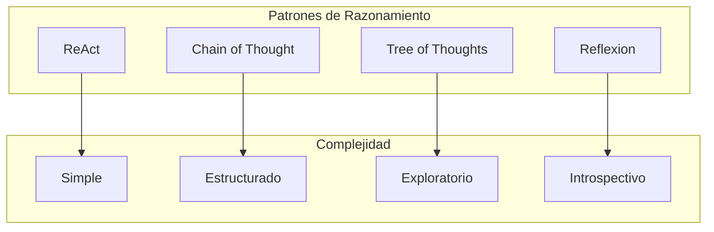
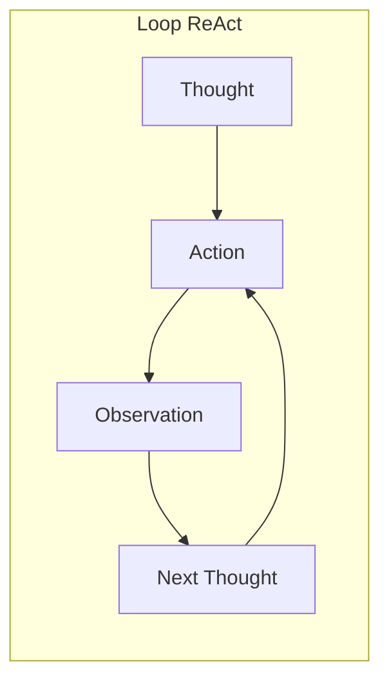
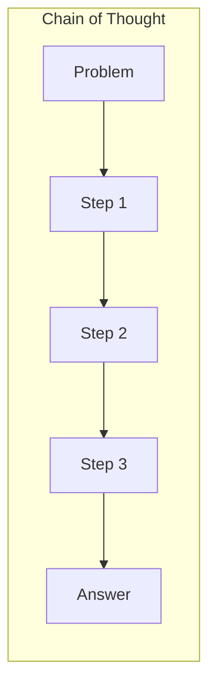
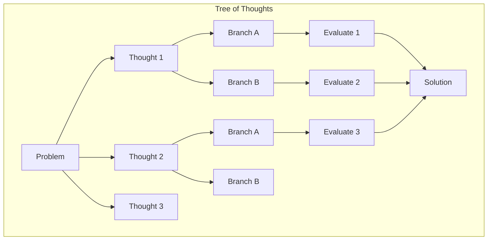
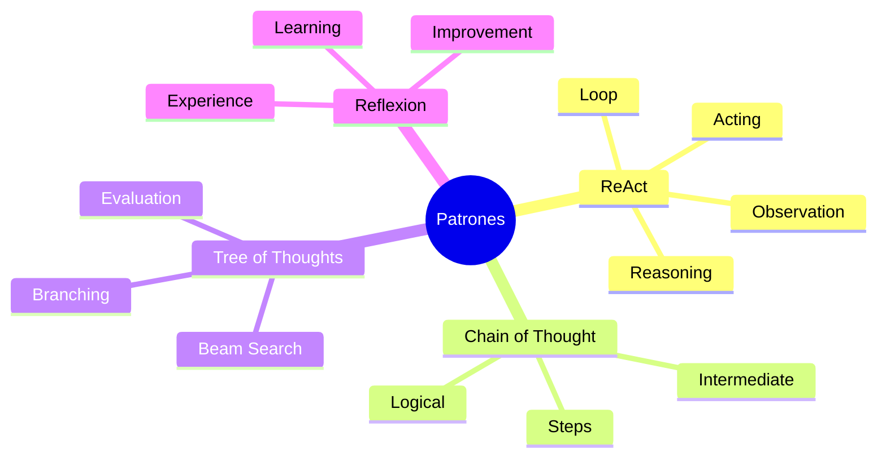

# Clase 15: Patrones de Diseño para Agentes IA

## Duración: 4 horas

---

## 1. Objetivos de Aprendizaje

Al finalizar esta clase, el estudiante será capable de:

1. **Comprender y aplicar el patrón ReAct** (Reasoning + Acting)
2. **Implementar Chain of Thought** para razonamiento estructurado
3. **Diseñar soluciones con Tree of Thoughts** para exploración
4. **Crear agentes con múltiples patrones** combinados
5. **Evaluar y comparar** diferentes patrones de razonamiento
6. **Aplicar estos patrones** en proyectos reales de IA

---

## 2. Contenidos Detallados

### 2.1 Introducción a Patrones de Razonamiento



**¿Por qué necesitamos patrones de razonamiento?**

1. Los LLMs no razonan perfectamente de forma nativa
2. Patrones estructurados mejoran la calidad de las respuestas
3. Permiten debugging e interpretabilidad
4. Habilitan tareas complejas multi-paso

---

### 2.2 Patrón ReAct (Reasoning + Acting)

#### 2.2.1 Concepto y paper original



Paper: **"ReAct: Synergizing Reasoning and Acting in Language Models"** (Yao et al., 2022)

#### 2.2.2 Implementación completa de ReAct

```python
"""
Patrón ReAct: Reasoning + Acting
==============================
Implementación detallada del patrón ReAct para agentes.
"""

from typing import List, Dict, Any, Optional, Callable
from dataclasses import dataclass
from enum import Enum
import json

class AgentAction(Enum):
    """Tipos de acciones que puede tomar un agente"""
    THINK = "think"
    USE_TOOL = "use_tool"
    ANSWER = "answer"
    ASK_CLARIFICATION = "ask_clarification"

@dataclass
class ReActStep:
    """Un paso en el proceso ReAct"""
    thought: str
    action: Optional[str]
    action_input: Optional[str]
    observation: Optional[str]
    
    def to_string(self) -> str:
        parts = [f"Thought: {self.thought}"]
        if self.action:
            parts.append(f"Action: {self.action}")
        if self.action_input:
            parts.append(f"Action Input: {self.action_input}")
        if self.observation:
            parts.append(f"Observation: {self.observation}")
        return "\n".join(parts)

class ReActAgent:
    """
    Implementación del patrón ReAct.
    
    El agente razona sobre la situación, decide una acción,
    la ejecuta, y observa el resultado. Repite hasta completar la tarea.
    """
    
    def __init__(self, llm: Callable, tools: Dict[str, Callable], 
                 max_iterations: int = 10):
        """
        Args:
            llm: Función que recibe un prompt y retorna respuesta
            tools: Diccionario de {nombre: función}
            max_iterations: Máximo de iteraciones del loop
        """
        self.llm = llm
        self.tools = tools
        self.max_iterations = max_iterations
        
        self.tool_names = list(tools.keys())
        self.history: List[ReActStep] = []
    
    def create_react_prompt(self, question: str) -> str:
        """Crea el prompt para el modo ReAct"""
        
        tool_descriptions = []
        for name, func in self.tools.items():
            doc = func.__doc__ or "No description"
            tool_descriptions.append(f"- {name}: {doc.strip()}")
        
        tools_str = "\n".join(tool_descriptions)
        tool_names_str = ", ".join(self.tool_names)
        
        # Construir historial de pasos anteriores
        history_str = ""
        if self.history:
            history_parts = []
            for step in self.history:
                step_str = f"Thought: {step.thought}"
                if step.action:
                    step_str += f"\nAction: {step.action}"
                if step.action_input:
                    step_str += f"\nAction Input: {step.action_input}"
                if step.observation:
                    step_str += f"\nObservation: {step.observation}"
                history_parts.append(step_str)
            history_str = "\n\n".join(history_parts)
        
        prompt = f"""You are a helpful AI assistant that uses tools to answer questions.

You have access to the following tools:
{tools_str}

Use the following format for each step:

Thought: [your reasoning about what to do next]
Action: [the action to take, must be one of {tool_names_str}]
Action Input: [the input to the action]
Observation: [the result of the action]

When you know the answer, respond with:

Thought: I now know the answer
Action: Final Answer
Action Input: [your final answer]

Question: {question}

{"Previous steps:\n" + history_str if history_str else ""}

{"Thought:" if not history_str else "Thought:"}
"""
        return prompt
    
    def parse_response(self, response: str) -> tuple:
        """Parsea la respuesta del LLM para extraer componentes ReAct"""
        
        thought = ""
        action = None
        action_input = None
        
        lines = response.strip().split("\n")
        
        for line in lines:
            line = line.strip()
            
            if line.startswith("Thought:"):
                thought = line.replace("Thought:", "").strip()
            elif line.startswith("Action:"):
                action = line.replace("Action:", "").strip()
            elif line.startswith("Action Input:"):
                action_input = line.replace("Action Input:", "").strip()
        
        return thought, action, action_input
    
    def execute_action(self, action: str, action_input: str) -> str:
        """Ejecuta una acción usando las herramientas disponibles"""
        
        if action == "Final Answer" or action is None:
            return None
        
        if action not in self.tools:
            return f"Error: Unknown tool '{action}'. Available tools: {self.tool_names}"
        
        try:
            result = self.tools[action](action_input)
            return str(result)
        except Exception as e:
            return f"Error executing {action}: {str(e)}"
    
    def run(self, question: str, verbose: bool = True) -> str:
        """
        Ejecuta el loop ReAct completo.
        
        Args:
            question: La pregunta o tarea a resolver
        
        Returns:
            La respuesta final
        """
        self.history = []
        
        if verbose:
            print(f"Question: {question}")
            print("=" * 60)
        
        for iteration in range(self.max_iterations):
            # Crear prompt con contexto
            prompt = self.create_react_prompt(question)
            
            # Obtener respuesta del LLM
            response = self.llm(prompt)
            
            # Parsear respuesta
            thought, action, action_input = self.parse_response(response)
            
            # Crear paso
            step = ReActStep(
                thought=thought,
                action=action,
                action_input=action_input,
                observation=None
            )
            
            if verbose:
                print(f"\n[Iteration {iteration + 1}]")
                print(f"Thought: {thought}")
                if action:
                    print(f"Action: {action}")
                if action_input:
                    print(f"Action Input: {action_input}")
            
            # Verificar si es respuesta final
            if action == "Final Answer" or action is None:
                if verbose:
                    print(f"\nFinal Answer: {thought}")
                self.history.append(step)
                return thought
            
            # Ejecutar acción
            if action_input:
                observation = self.execute_action(action, action_input)
                step.observation = observation
                
                if verbose:
                    print(f"Observation: {observation[:100]}..." if len(str(observation)) > 100 else f"Observation: {observation}")
            
            self.history.append(step)
        
        # Max iterations reached
        return "I couldn't complete the task within the maximum number of iterations."
    
    def get_trace(self) -> List[Dict[str, Any]]:
        """Obtiene el trace completo del razonamiento"""
        return [
            {
                "thought": step.thought,
                "action": step.action,
                "action_input": step.action_input,
                "observation": step.observation
            }
            for step in self.history
        ]


def create_react_agent_demo():
    """Demostración del agente ReAct"""
    
    # Simular LLM (en producción, usar OpenAI, Anthropic, etc.)
    def mock_llm(prompt: str) -> str:
        """Simula respuestas del LLM basadas en el contexto"""
        
        if "Previous steps" in prompt and "I now know" in prompt:
            return "Thought: I have gathered enough information\nAction: Final Answer\nAction Input: Based on my research, Python is a programming language."
        
        if "Wikipedia" in prompt or "python" in prompt.lower():
            return """Thought: I should search for information about this topic
Action: Wikipedia
Action Input: Python programming language
Observation: Python is a high-level, general-purpose programming language. Its design philosophy emphasizes code readability with the use of significant indentation."""
        
        if "calculate" in prompt.lower() or "2 + 2" in prompt:
            return """Thought: I need to calculate this math expression
Action: Calculator
Action Input: 2 + 2
Observation: 4"""
        
        if "weather" in prompt.lower():
            return """Thought: I should check the weather
Action: WeatherAPI
Action Input: New York
Observation: Temperature: 22°C, Sunny"""
        
        return """Thought: I need to think about this more carefully
Action: None
Action Input: None
Observation: Let me reconsider the approach."""
    
    # Definir herramientas
    def search_wikipedia(query: str) -> str:
        info = {
            "python": "Python is a high-level programming language created by Guido van Rossum in 1991.",
            "java": "Java is a class-based, object-oriented programming language developed by Sun Microsystems.",
            "ai": "Artificial Intelligence (AI) is intelligence demonstrated by machines."
        }
        return info.get(query.lower(), f"No information found for '{query}'")
    
    def calculate(expr: str) -> str:
        try:
            result = eval(expr)
            return str(result)
        except:
            return "Error in calculation"
    
    def get_weather(location: str) -> str:
        return f"Temperature: 22°C, Sunny in {location}"
    
    tools = {
        "Wikipedia": search_wikipedia,
        "Calculator": calculate,
        "WeatherAPI": get_weather
    }
    
    # Crear agente
    agent = ReActAgent(mock_llm, tools, max_iterations=5)
    
    # Ejecutar
    print("="*60)
    print("REACT AGENT DEMO")
    print("="*60)
    
    result = agent.run("What is Python and what is 2+2?")
    print(f"\nFinal Result: {result}")
    
    print("\n" + "="*60)
    print("TRACE")
    print("="*60)
    for i, step in enumerate(agent.get_trace(), 1):
        print(f"\nStep {i}:")
        print(f"  Thought: {step['thought']}")
        print(f"  Action: {step['action']}")
        print(f"  Observation: {step['observation']}")
    
    return agent

create_react_agent_demo()
```

---

### 2.3 Patrón Chain of Thought (CoT)

#### 2.3.1 Concepto



Paper: **"Chain-of-Thought Prompting Elicits Reasoning in Large Language Models"** (Wei et al., 2022)

#### 2.3.2 Implementación de CoT

```python
"""
Patrón Chain of Thought (CoT)
=============================
Implementación del razonamiento paso a paso.
"""

from typing import List, Optional, Callable
from dataclasses import dataclass

@dataclass
class ReasoningStep:
    """Un paso en el razonamiento"""
    step_number: int
    description: str
    calculation: Optional[str] = None
    result: Optional[str] = None

class ChainOfThoughtAgent:
    """
    Implementación del patrón Chain of Thought.
    
    El agente descompone problemas complejos en pasos
    de razonamiento intermedios.
    """
    
    def __init__(self, llm: Callable):
        self.llm = llm
    
    def create_cot_prompt(self, question: str, include_examples: bool = True) -> str:
        """Crea prompt con razonamiento en cadena"""
        
        examples = ""
        if include_examples:
            examples = """
Examples of chain of thought:

Example 1:
Question: John has 5 apples. He buys 3 more. How many apples does John have?
Thought: I need to add 5 + 3 to find the answer.
Step 1: Start with 5 apples
Step 2: Add 3 more apples
Step 3: 5 + 3 = 8
Answer: John has 8 apples.

Example 2:
Question: A store sells 12 items per hour. How many items in 8 hours?
Thought: I need to multiply items per hour by hours.
Step 1: Items per hour = 12
Step 2: Hours = 8
Step 3: 12 × 8 = 96
Answer: 96 items in 8 hours.

"""
        
        prompt = f"""{examples}
Now solve this problem step by step:

Question: {question}

Think through this step by step:
"""
        return prompt
    
    def solve(self, question: str, verbose: bool = True) -> str:
        """Resuelve usando Chain of Thought"""
        
        prompt = self.create_cot_prompt(question)
        response = self.llm(prompt)
        
        if verbose:
            print(f"Question: {question}")
            print("-" * 40)
            print("Chain of Thought:")
            print(response)
        
        return response
    
    def solve_with_validation(self, question: str, 
                               validate_fn: Optional[Callable] = None) -> dict:
        """
        Resuelve con validación de cada paso.
        
        Args:
            question: La pregunta
            validate_fn: Función opcional para validar cada paso
        
        Returns:
            Dict con solución, pasos y validación
        """
        prompt = self.create_cot_prompt(question)
        response = self.llm(prompt)
        
        # Parsear pasos
        steps = self._parse_steps(response)
        
        # Validar si hay función de validación
        validation_results = []
        if validate_fn:
            for step in steps:
                is_valid = validate_fn(step)
                validation_results.append(is_valid)
        
        return {
            "question": question,
            "solution": response,
            "steps": steps,
            "validation": validation_results if validate_fn else None
        }
    
    def _parse_steps(self, response: str) -> List[ReasoningStep]:
        """Parsea los pasos del razonamiento"""
        steps = []
        
        lines = response.strip().split("\n")
        step_num = 0
        
        for line in lines:
            line = line.strip()
            
            if line.startswith("Step") or line.startswith("Thought"):
                step_num += 1
                steps.append(ReasoningStep(
                    step_number=step_num,
                    description=line
                ))
        
        return steps


def cot_with_self_consistency(question: str, llm: Callable, n_samples: int = 5) -> dict:
    """
    Chain of Thought con Self-Consistency.
    
    Genera múltiples cadenas de razonamiento y toma
    la respuesta más consistente.
    
    Paper: "Self-Consistency Improves Chain of Thought Reasoning in Language Models"
    """
    from collections import Counter
    
    print(f"\nRunning Self-Consistency with {n_samples} samples...")
    
    answers = []
    chains = []
    
    for i in range(n_samples):
        # Crear prompt con CoT
        prompt = f"""Solve this problem step by step:

Question: {question}

Think through this step by step:
"""
        # Generar respuesta
        response = llm(prompt)
        chains.append(response)
        
        # Extraer respuesta final
        lines = response.strip().split("\n")
        final_answer = ""
        for line in lines:
            if line.startswith("Answer:"):
                final_answer = line.replace("Answer:", "").strip()
                break
        
        if not final_answer:
            # Intentar otra forma
            final_answer = lines[-1].strip() if lines else ""
        
        answers.append(final_answer)
    
    # Contar respuestas
    answer_counts = Counter(answers)
    most_common = answer_counts.most_common()
    
    print("\nChain of Thought Responses:")
    for i, chain in enumerate(chains, 1):
        print(f"\n--- Chain {i} ---")
        print(chain[:300] + "..." if len(chain) > 300 else chain)
    
    print("\n" + "="*60)
    print("SELF-CONSISTENCY RESULTS")
    print("="*60)
    print("\nAnswer Distribution:")
    for answer, count in most_common:
        print(f"  {answer}: {count}/{n_samples}")
    
    # Respuesta más consistente
    consensus_answer = most_common[0][0]
    confidence = most_common[0][1] / n_samples
    
    print(f"\nConsensus Answer: {consensus_answer}")
    print(f"Confidence: {confidence:.1%}")
    
    return {
        "chains": chains,
        "answers": answers,
        "consensus": consensus_answer,
        "confidence": confidence
    }


def cot_demo():
    """Demostración de Chain of Thought"""
    
    # Simular LLM
    def mock_llm(prompt: str) -> str:
        if "5 apples" in prompt or "John" in prompt:
            return """Think through this step by step:

Step 1: Start with 5 apples
Step 2: John buys 3 more apples
Step 3: Add: 5 + 3 = 8
Answer: John has 8 apples."""
        
        if "store" in prompt or "items" in prompt:
            return """Think through this step by step:

Step 1: Identify the rate: 12 items per hour
Step 2: Identify the time: 8 hours
Step 3: Multiply: 12 × 8 = 96
Answer: The store sells 96 items in 8 hours."""
        
        if "小明" in prompt or "books" in prompt.lower():
            return """Think through this step by step:

Step 1: Start with 15 books
Step 2: He gives away 8 books
Step 3: Subtract: 15 - 8 = 7
Answer: 小明 has 7 books remaining."""
        
        return "Let me think step by step...\nAnswer: Some answer."
    
    # Crear agente
    agent = ChainOfThoughtAgent(mock_llm)
    
    print("="*60)
    print("CHAIN OF THOUGHT DEMO")
    print("="*60)
    
    # Ejemplo 1
    result1 = agent.solve("John has 5 apples. He buys 3 more. How many apples does John have?")
    
    # Ejemplo 2
    result2 = agent.solve("A store sells 12 items per hour. How many items in 8 hours?")
    
    # Self-consistency
    print("\n" + "="*60)
    print("SELF-CONSISTENCY DEMO")
    print("="*60)
    
    result = cot_with_self_consistency(
        "A store sells 12 items per hour. How many items in 8 hours?",
        mock_llm,
        n_samples=3
    )
    
    return agent

cot_demo()
```

---

### 2.4 Patrón Tree of Thoughts (ToT)

#### 2.4.1 Concepto



Paper: **"Tree of Thoughts: Deliberate Problem Solving with Large Language Models"** (Yao et al., 2023)

#### 2.4.2 Implementación de ToT

```python
"""
Patrón Tree of Thoughts (ToT)
=============================
Implementación de exploración de árbol de pensamientos.
"""

from typing import List, Dict, Any, Optional, Callable
from dataclasses import dataclass, field
from enum import Enum
import heapq

@dataclass
class ThoughtNode:
    """Un nodo en el árbol de pensamientos"""
    content: str
    parent: Optional['ThoughtNode'] = None
    children: List['ThoughtNode'] = field(default_factory=list)
    value: float = 0.0
    depth: int = 0
    visits: int = 0
    
    def get_path(self) -> List[str]:
        """Obtiene el camino desde la raíz hasta este nodo"""
        path = []
        node = self
        while node:
            path.append(node.content)
            node = node.parent
        return list(reversed(path))
    
    def __lt__(self, other: 'ThoughtNode') -> bool:
        return self.value < other.value

class TreeOfThoughts:
    """
    Implementación del patrón Tree of Thoughts.
    
    Explora múltiples ramas de razonamiento en paralelo,
    evaluando y podando ramas menos prometedoras.
    """
    
    def __init__(self, llm: Callable, 
                 generate_fn: Optional[Callable] = None,
                 evaluate_fn: Optional[Callable] = None,
                 max_depth: int = 5,
                 beam_width: int = 2):
        """
        Args:
            llm: Función de LLM
            generate_fn: Función para generar pensamientos hijos
            evaluate_fn: Función para evaluar nodos
            max_depth: Profundidad máxima del árbol
            beam_width: Número de ramas a mantener (beam search)
        """
        self.llm = llm
        self.generate_fn = generate_fn or self._default_generate
        self.evaluate_fn = evaluate_fn or self._default_evaluate
        self.max_depth = max_depth
        self.beam_width = beam_width
        
        self.root: Optional[ThoughtNode] = None
        self.all_nodes: List[ThoughtNode] = []
    
    def _default_generate(self, node: ThoughtNode, n: int = 2) -> List[str]:
        """Generación por defecto de pensamientos hijos"""
        
        prompt = f"""Given the current thought, generate {n} possible next thoughts.

Current thought: {node.content}

Generate {n} different directions or approaches:
"""
        response = self.llm(prompt)
        
        thoughts = []
        lines = response.strip().split("\n")
        for line in lines[:n]:
            # Limpiar línea
            line = line.strip()
            if line and (line[0].isdigit() or line.startswith("-")):
                line = line.split(".", 1)[-1].strip() if "." in line else line
                thoughts.append(line)
        
        return thoughts if thoughts else [f"Continue exploring from: {node.content}"]
    
    def _default_evaluate(self, node: ThoughtNode) -> float:
        """Evaluación por defecto basada en heurísticas simples"""
        
        content = node.content.lower()
        
        # Puntuación basada en indicadores
        score = 0.5  # Base score
        
        # Penalizar si ya exploramos mucho
        if node.visits > 0:
            score -= 0.1 * node.visits
        
        # Bonificar si parece solución
        solution_keywords = ["answer", "conclusion", "therefore", "thus"]
        for kw in solution_keywords:
            if kw in content:
                score += 0.2
        
        return max(0.0, min(1.0, score))  # Clamp entre 0 y 1
    
    def solve(self, initial_thought: str, 
              verbose: bool = True) -> Dict[str, Any]:
        """
        Resuelve el problema usando Tree of Thoughts.
        
        Args:
            initial_thought: El pensamiento inicial o problema
        
        Returns:
            Dict con la mejor solución y trace
        """
        if verbose:
            print("="*60)
            print("TREE OF THOUGHTS")
            print("="*60)
            print(f"Initial: {initial_thought}")
        
        # Crear nodo raíz
        self.root = ThoughtNode(content=initial_thought, depth=0)
        self.all_nodes = [self.root]
        
        # BFS con beam search
        current_nodes = [self.root]
        best_solution = None
        best_value = 0.0
        
        for depth in range(self.max_depth):
            if verbose:
                print(f"\n--- Depth {depth + 1} ---")
                print(f"Exploring {len(current_nodes)} nodes...")
            
            # Generar hijos para cada nodo actual
            all_candidates = []
            
            for node in current_nodes:
                # Generar pensamientos hijos
                children_contents = self.generate_fn(node, n=self.beam_width * 2)
                
                for content in children_contents:
                    child = ThoughtNode(
                        content=content,
                        parent=node,
                        depth=depth + 1
                    )
                    node.children.append(child)
                    self.all_nodes.append(child)
                    
                    # Evaluar
                    value = self.evaluate_fn(child)
                    child.value = value
                    
                    all_candidates.append(child)
                    
                    if verbose:
                        print(f"  Generated: {content[:50]}... (value: {value:.2f})")
            
            # Beam search: seleccionar mejores candidatos
            if not all_candidates:
                break
            
            # Ordenar por valor y seleccionar top-k
            all_candidates.sort(key=lambda x: x.value, reverse=True)
            current_nodes = all_candidates[:self.beam_width]
            
            # Verificar si encontramos solución
            for node in all_candidates:
                if "answer:" in node.content.lower() or "conclusion" in node.content.lower():
                    if node.value > best_value:
                        best_value = node.value
                        best_solution = node
        
        # Encontrar el mejor nodo si no hay solución explícita
        if not best_solution:
            if current_nodes:
                best_solution = max(current_nodes, key=lambda x: x.value)
        
        if verbose and best_solution:
            print("\n" + "="*60)
            print("BEST SOLUTION FOUND")
            print("="*60)
            print(f"Path: {' -> '.join(best_solution.get_path())}")
            print(f"Value: {best_solution.value:.2f}")
        
        return {
            "solution": best_solution.content if best_solution else None,
            "path": best_solution.get_path() if best_solution else [],
            "value": best_solution.value if best_solution else 0.0,
            "nodes_explored": len(self.all_nodes),
            "depth_reached": best_solution.depth if best_solution else 0
        }
    
    def visualize_tree(self) -> str:
        """Genera una visualización textual del árbol"""
        
        if not self.root:
            return "No tree available"
        
        lines = []
        
        def print_node(node: ThoughtNode, prefix: str = "", is_last: bool = True):
            connector = "└── " if is_last else "├── "
            value_str = f"[{node.value:.2f}]" if node.value > 0 else ""
            lines.append(f"{prefix}{connector}{node.content[:50]}... {value_str}")
            
            prefix += "    " if is_last else "│   "
            
            for i, child in enumerate(node.children):
                print_node(child, prefix, i == len(node.children) - 1)
        
        print_node(self.root, "", True)
        return "\n".join(lines)


def tot_demo():
    """Demostración de Tree of Thoughts"""
    
    # Simular LLM
    def mock_llm(prompt: str) -> str:
        if "generate" in prompt.lower():
            return """1. Try using dynamic programming approach
2. Consider a recursive solution with memoization
3. Explore using greedy algorithm
4. Consider brute force with optimizations"""
        
        if "route" in prompt.lower() or "travelling" in prompt.lower():
            return """1. Start with nearest city
2. Start with farthest city
3. Random start point with nearest neighbor heuristic"""
        
        return """The current approach seems reasonable. Continue exploring."""
    
    # Crear ToT
    tot = TreeOfThoughts(
        mock_llm,
        max_depth=3,
        beam_width=2
    )
    
    print("="*60)
    print("TREE OF THOUGHTS DEMO")
    print("="*60)
    
    # Resolver un problema
    result = tot.solve(
        "Find the shortest route visiting: A, B, C, D",
        verbose=True
    )
    
    print("\n" + "="*60)
    print("TREE VISUALIZATION")
    print("="*60)
    print(tot.visualize_tree())
    
    return tot

tot_demo()
```

---

### 2.5 Patrón Reflexion (Self-Reflection)

```python
"""
Patrón Reflexion: Self-Reflection Agent
======================================
El agente reflexiona sobre sus acciones pasadas y aprende de errores.
"""

from typing import List, Dict, Any, Callable, Optional
from dataclasses import dataclass
from enum import Enum

@dataclass
class Experience:
    """Una experiencia del agente"""
    task: str
    action: str
    result: str
    reflection: str
    success: bool

class ReflexionAgent:
    """
    Agente que reflexiona sobre sus acciones.
    
    Después de cada tarea, el agente:
    1. Evalúa el resultado
    2. Reflexiona sobre qué salió bien/mal
    3. Genera insights para futuras acciones
    """
    
    def __init__(self, llm: Callable, max_experiences: int = 10):
        self.llm = llm
        self.experiences: List[Experience] = []
        self.max_experiences = max_experiences
    
    def reflect(self, task: str, action: str, result: str) -> str:
        """Genera reflexión sobre una acción"""
        
        prompt = f"""Reflect on the following experience:

Task: {task}
Action taken: {action}
Result: {result}

What went well? What could be improved? What did you learn?

Reflection:"""
        
        reflection = self.llm(prompt)
        
        # Guardar experiencia
        experience = Experience(
            task=task,
            action=action,
            result=result,
            reflection=reflection,
            success=self._evaluate_success(result)
        )
        
        self.experiences.append(experience)
        
        # Mantener máximo de experiencias
        if len(self.experiences) > self.max_experiences:
            self.experiences.pop(0)
        
        return reflection
    
    def _evaluate_success(self, result: str) -> bool:
        """Evalúa si el resultado fue exitoso"""
        
        # En una implementación real, esto sería más sofisticado
        success_indicators = ["success", "correct", "right", "solved"]
        failure_indicators = ["error", "fail", "wrong", "incorrect"]
        
        result_lower = result.lower()
        
        for indicator in success_indicators:
            if indicator in result_lower:
                return True
        
        for indicator in failure_indicators:
            if indicator in result_lower:
                return False
        
        return "answer" in result_lower or "result" in result_lower
    
    def get_insights(self) -> List[str]:
        """Obtiene insights learned de experiencias pasadas"""
        
        if not self.experiences:
            return ["No experiences yet"]
        
        experiences_text = "\n\n".join([
            f"Task: {exp.task}\nReflection: {exp.reflection}"
            for exp in self.experiences[-5:]  # Últimas 5 experiencias
        ])
        
        prompt = f"""Based on these past experiences, what are the key insights?

{experiences_text}

Key Insights:"""
        
        response = self.llm(prompt)
        
        insights = [
            line.strip() 
            for line in response.split("\n") 
            if line.strip()
        ]
        
        return insights
    
    def use_past_experiences(self, new_task: str) -> str:
        """Usa experiencias pasadas para abordar nueva tarea"""
        
        if not self.experiences:
            return ""
        
        # Seleccionar experiencias relevantes
        relevant_exp = [
            exp for exp in self.experiences[-3:]
            if exp.task.lower() in new_task.lower() or 
               new_task.lower() in exp.task.lower()
        ]
        
        if not relevant_exp:
            relevant_exp = self.experiences[-3:]  # Usar recientes
        
        context = "\n\n".join([
            f"Task: {exp.task}\nAction: {exp.action}\nResult: {exp.result}\nLearnings: {exp.reflection}"
            for exp in relevant_exp
        ])
        
        return f"""
Past experiences that might help:
{context}
"""


def reflexion_demo():
    """Demostración del agente de reflexión"""
    
    def mock_llm(prompt: str) -> str:
        if "reflect" in prompt.lower():
            return """What went well: The approach was systematic and logical.
What could be improved: Should have considered alternative approaches earlier.
Learned: Breaking down complex problems helps find solutions."""
        
        if "insights" in prompt.lower():
            return """1. Always verify assumptions before proceeding
2. Break complex problems into smaller steps
3. Consider multiple perspectives before deciding"""
        
        return "This is a reasonable approach. Let's proceed step by step."
    
    agent = ReflexionAgent(mock_llm)
    
    print("="*60)
    print("REFLEXION AGENT DEMO")
    print("="*60)
    
    # Simular experiencias
    tasks = [
        ("Calculate 2+2", "Use calculator tool", "Result: 4"),
        ("Find file", "Search in directory", "Result: File not found"),
        ("Write code", "Generate Python function", "Result: Code works correctly"),
    ]
    
    for task, action, result in tasks:
        reflection = agent.reflect(task, action, result)
        print(f"\nTask: {task}")
        print(f"Action: {action}")
        print(f"Reflection: {reflection[:100]}...")
    
    # Obtener insights
    print("\n" + "-"*40)
    print("KEY INSIGHTS:")
    insights = agent.get_insights()
    for insight in insights:
        print(f"  - {insight}")
    
    return agent

reflexion_demo()
```

---

### 2.6 Combinación de Patrones

```python
"""
Combinación de Patrones: ReAct + CoT + Reflexion
================================================
"""

from typing import Dict, Any, List, Callable
from dataclasses import dataclass

@dataclass
class HybridAgentConfig:
    """Configuración para el agente híbrido"""
    use_react: bool = True
    use_cot: bool = True
    use_reflexion: bool = True
    max_iterations: int = 5
    beam_width: int = 2

class HybridAgent:
    """
    Agente que combina múltiples patrones de razonamiento:
    - ReAct: Para usar herramientas y actuar
    - Chain of Thought: Para razonamiento estructurado
    - Reflexion: Para aprender de experiencias
    """
    
    def __init__(self, llm: Callable, tools: Dict[str, Callable],
                 config: HybridAgentConfig = None):
        self.llm = llm
        self.tools = tools
        self.config = config or HybridAgentConfig()
        
        # Componentes
        self.experiences: List[Dict] = []
    
    def create_hybrid_prompt(self, task: str, context: str = "") -> str:
        """Crea prompt combinando patrones"""
        
        tools_desc = "\n".join([
            f"- {name}: {func.__doc__ or ''}" 
            for name, func in self.tools.items()
        ])
        
        # Incluir experiencias relevantes si hay reflexion
        experiences_context = ""
        if self.config.use_reflexion and self.experiences:
            experiences_context = f"""
Past experiences:
{chr(10).join([f"- {exp['reflection']}" for exp in self.experiences[-3:]])}

"""
        
        prompt = f"""Solve this task using deliberate reasoning and tool use.

Task: {task}

{experiences_context}
Available tools:
{tools_desc}

Think step by step (Chain of Thought) about what to do, then take actions (ReAct), and reflect on the results.

Follow this format:
Thought: [your reasoning]
Action: [tool name or Final Answer]
Action Input: [input to tool]
Observation: [result from tool]

{context}

Thought:"""
        
        return prompt
    
    def parse_and_execute(self, response: str, verbose: bool = True) -> tuple:
        """Parsea respuesta y ejecuta acciones"""
        
        thought = ""
        action = None
        action_input = None
        
        for line in response.split("\n"):
            line = line.strip()
            if line.startswith("Thought:"):
                thought = line.replace("Thought:", "").strip()
            elif line.startswith("Action:"):
                action = line.replace("Action:", "").strip()
            elif line.startswith("Action Input:"):
                action_input = line.replace("Action Input:", "").strip()
        
        # Ejecutar si hay acción
        observation = None
        if action and action not in ["Final Answer", "None", ""]:
            if action in self.tools:
                try:
                    observation = self.tools[action](action_input)
                    if verbose:
                        print(f"  Action: {action}")
                        print(f"  Observation: {observation}")
                except Exception as e:
                    observation = f"Error: {e}"
        
        return thought, action, action_input, observation
    
    def reflect_on_experience(self, task: str, steps: List[Dict[str, str]], 
                              success: bool) -> str:
        """Reflexiona sobre la experiencia completa"""
        
        steps_text = "\n".join([
            f"- Thought: {s.get('thought', '')}\n  Action: {s.get('action', '')}\n  Result: {s.get('observation', '')}"
            for s in steps
        ])
        
        prompt = f"""Reflect on this problem-solving experience:

Task: {task}

Steps taken:
{steps_text}

Outcome: {'Success' if success else 'Failed'}

What lessons can be learned?

Reflection:"""
        
        reflection = self.llm(prompt)
        
        # Guardar experiencia
        self.experiences.append({
            "task": task,
            "steps": steps,
            "success": success,
            "reflection": reflection
        })
        
        # Mantener máximo
        if len(self.experiences) > 10:
            self.experiences.pop(0)
        
        return reflection
    
    def run(self, task: str, verbose: bool = True) -> Dict[str, Any]:
        """Ejecuta el agente híbrido completo"""
        
        if verbose:
            print("="*60)
            print("HYBRID AGENT (ReAct + CoT + Reflexion)")
            print("="*60)
            print(f"Task: {task}")
        
        steps = []
        context = ""
        
        for iteration in range(self.config.max_iterations):
            if verbose:
                print(f"\n--- Iteration {iteration + 1} ---")
            
            # Crear prompt
            prompt = self.create_hybrid_prompt(task, context)
            
            # Obtener respuesta
            response = self.llm(prompt)
            
            # Parsear y ejecutar
            thought, action, action_input, observation = self.parse_and_execute(
                response, verbose
            )
            
            # Guardar paso
            step = {
                "thought": thought,
                "action": action,
                "action_input": action_input,
                "observation": observation
            }
            steps.append(step)
            
            # Verificar si completamos
            if action == "Final Answer" or iteration == self.config.max_iterations - 1:
                result = thought if thought else observation
                
                # Reflexionar
                if self.config.use_reflexion:
                    success = "answer" in thought.lower() or observation
                    reflection = self.reflect_on_experience(task, steps, success)
                    if verbose:
                        print(f"\nReflection: {reflection}")
                
                if verbose:
                    print(f"\nFinal Result: {result}")
                
                return {
                    "result": result,
                    "steps": steps,
                    "success": action == "Final Answer"
                }
            
            # Actualizar contexto
            context = f"\nPrevious result: {observation}\n"
        
        return {"result": "Could not complete task", "steps": steps, "success": False}


def hybrid_agent_demo():
    """Demostración del agente híbrido"""
    
    def mock_llm(prompt: str) -> str:
        if "Wikipedia" in prompt or "python" in prompt.lower():
            return """Thought: I should search Wikipedia for Python information
Action: Wikipedia
Action Input: Python programming language
Observation: Python is a high-level programming language created by Guido van Rossum."""
        
        if "calculator" in prompt.lower() or "2 + 2" in prompt:
            return """Thought: Let me calculate this
Action: Calculator
Action Input: 2 + 2
Observation: 4"""
        
        return """Thought: I need to think step by step about this task
Action: None
Action Input: None
Observation: Let me reconsider."""
    
    def wiki_search(query: str) -> str:
        return f"Wikipedia result for '{query}': Python is a programming language."
    
    def calculate(expr: str) -> str:
        return str(eval(expr))
    
    tools = {"Wikipedia": wiki_search, "Calculator": calculate}
    config = HybridAgentConfig(use_reflexion=True, max_iterations=3)
    
    agent = HybridAgent(mock_llm, tools, config)
    
    result = agent.run("What is Python? Also calculate 2+2.")
    
    print("\n" + "="*60)
    print("RESULT")
    print("="*60)
    print(f"Result: {result['result']}")
    print(f"Steps: {len(result['steps'])}")
    print(f"Success: {result['success']}")

hybrid_agent_demo()
```

---

## 3. Ejercicios Prácticos Resueltos

### Ejercicio: Sistema de Resolución de Problemas con Patrones

```python
"""
Ejercicio: Sistema de Resolución de Problemas
==============================================
Implementar un sistema que combina múltiples patrones.
"""

from typing import Dict, Any, List, Callable, Optional
from enum import Enum

class ReasoningMode(Enum):
    """Modos de razonamiento disponibles"""
    DIRECT = "direct"
    CHAIN_OF_THOUGHT = "chain_of_thought"
    REACT = "react"
    TREE_OF_TOUGHTS = "tree_of_thoughts"

class ProblemSolver:
    """
    Sistema de resolución de problemas con múltiples modos de razonamiento.
    """
    
    def __init__(self, llm: Callable, tools: Dict[str, Callable] = None):
        self.llm = llm
        self.tools = tools or {}
    
    def solve_direct(self, problem: str) -> str:
        """Resuelve directamente sin razonamiento estructurado"""
        prompt = f"Solve this problem: {problem}\n\nAnswer:"
        return self.llm(prompt)
    
    def solve_cot(self, problem: str) -> str:
        """Resuelve con Chain of Thought"""
        prompt = f"""Solve this problem step by step:

Problem: {problem}

Think through each step carefully:
Step 1:"""
        return self.llm(prompt)
    
    def solve_react(self, problem: str, verbose: bool = False) -> str:
        """Resuelve con ReAct"""
        # Implementación similar a ReActAgent
        # (simplificado para este ejercicio)
        
        prompt = f"""Solve using tools and reasoning:

Problem: {problem}

Available tools: {list(self.tools.keys())}

Think, then act, then observe.
"""
        return self.llm(prompt)
    
    def solve(self, problem: str, mode: ReasoningMode = ReasoningMode.CHAIN_OF_THOUGHT,
              verbose: bool = True) -> Dict[str, Any]:
        """
        Resuelve el problema usando el modo especificado.
        """
        
        if verbose:
            print(f"Problem: {problem}")
            print(f"Mode: {mode.value}")
            print("-" * 40)
        
        if mode == ReasoningMode.DIRECT:
            solution = self.solve_direct(problem)
        elif mode == ReasoningMode.CHAIN_OF_THOUGHT:
            solution = self.solve_cot(problem)
        elif mode == ReasoningMode.REACT:
            solution = self.solve_react(problem, verbose)
        else:
            solution = self.solve_cot(problem)
        
        return {
            "problem": problem,
            "mode": mode.value,
            "solution": solution
        }
    
    def solve_multiple_modes(self, problem: str) -> Dict[str, Dict]:
        """Resuelve el problema con múltiples modos y compara"""
        
        results = {}
        
        for mode in ReasoningMode:
            if mode == ReasoningMode.TREE_OF_TOUGHTS:
                continue  # Skip para simplicidad
            
            try:
                result = self.solve(problem, mode, verbose=False)
                results[mode.value] = result["solution"]
            except Exception as e:
                results[mode.value] = f"Error: {e}"
        
        return results


def main():
    """Ejemplo de uso"""
    
    # Simular LLM
    def mock_llm(prompt: str) -> str:
        return f"Mock solution for: {prompt[:50]}..."
    
    # Crear solver
    solver = ProblemSolver(mock_llm)
    
    # Problema de ejemplo
    problem = "If a train travels 60 miles per hour, how far will it travel in 2.5 hours?"
    
    print("="*60)
    print("PROBLEM SOLVER COMPARISON")
    print("="*60)
    
    # Resolver con múltiples modos
    results = solver.solve_multiple_modes(problem)
    
    print("\nResults by mode:")
    for mode, solution in results.items():
        print(f"\n{mode.upper()}:")
        print(f"  {solution}")
    
    # Resolver con modo específico
    result = solver.solve(problem, ReasoningMode.CHAIN_OF_THOUGHT)
    print(f"\n\nFinal (CoT): {result['solution']}")


if __name__ == "__main__":
    main()
```

---

## 4. Resumen de Puntos Clave



### Puntos Clave:

1. **ReAct** combina razonamiento verbal con acciones
2. **Chain of Thought** descompone problemas en pasos
3. **Tree of Thoughts** explora múltiples ramas
4. **Reflexion** permite aprendizaje de experiencias
5. **La combinación** de patrones mejora resultados

---

## 5. Referencias Externas

1. **ReAct Paper:**
   - URL: https://arxiv.org/abs/2210.03629

2. **Chain of Thought Paper:**
   - URL: https://arxiv.org/abs/2201.11903

3. **Tree of Thoughts Paper:**
   - URL: https://arxiv.org/abs/2305.10601

4. **Reflexion Paper:**
   - URL: https://arxiv.org/abs/2303.11366

---

**Fin de la Clase 15: Patrones de Diseño para Agentes IA**
