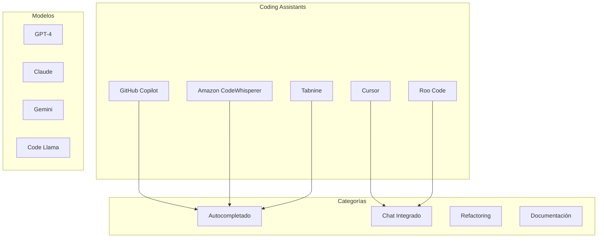
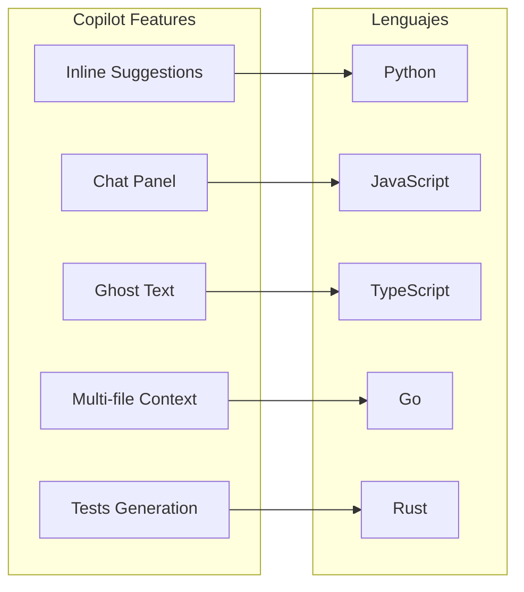
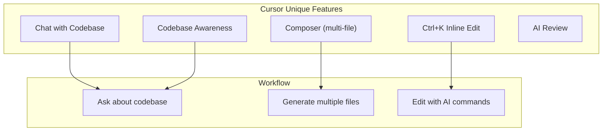
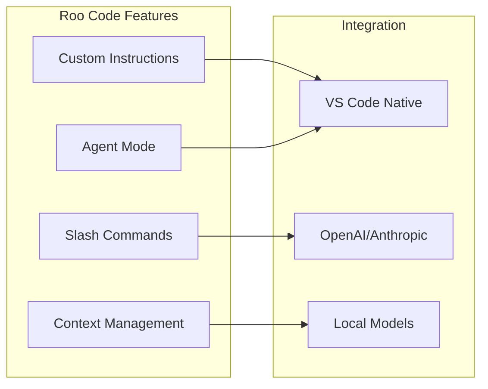
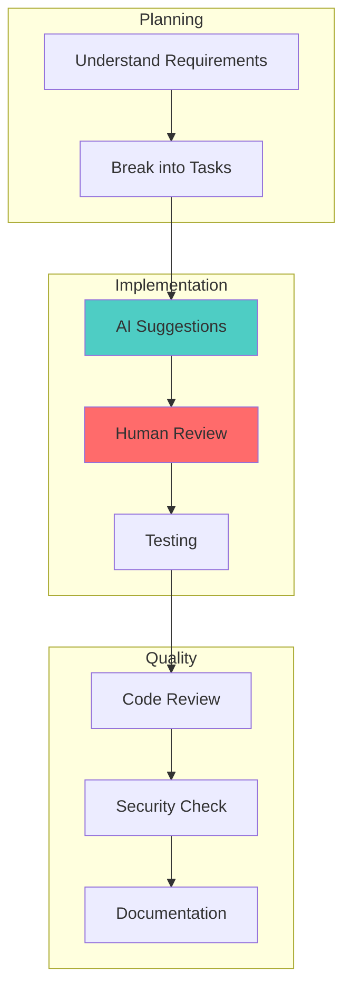
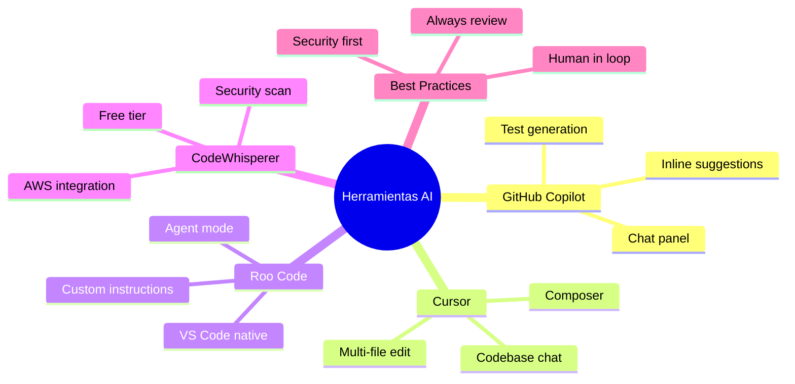

# Clase 16: Herramientas de Desarrollo Asistido por IA

## Duración: 4 horas

---

## 1. Objetivos de Aprendizaje

Al finalizar esta clase, el estudiante será capable de:

1. **Evaluar y comparar** herramientas de coding assistant (Cursor, GitHub Copilot, Roo Code)
2. **Integrar efectivamente** estas herramientas en flujos de trabajo de desarrollo
3. **Aplicar mejores prácticas** para maximizar la productividad
4. **Entender las limitaciones** y riesgos de las herramientas de IA
5. **Crear workflows personalizados** adaptados a sus necesidades

---

## 2. Contenidos Detallados

### 2.1 Panorama de Herramientas de Coding AI



---

### 2.2 GitHub Copilot

#### 2.2.1 Características y Funcionalidades



```python
"""
Ejemplos de uso de GitHub Copilot
================================
"""

# ============================================================
# 1. AUTOCOMPLETADO INTELIGENTE
# ============================================================

def autocomplete_examples():
    """
    GitHub Copilot sugiere código basándose en contexto.
    
    # Ejemplo 1: Función con documentación
    """
    
    # Escribe el comentario, Copilot sugiere el cuerpo:
    def calculate_fibonacci(n: int) -> int:
        """
        Calculate the nth Fibonacci number using dynamic programming.
        Time complexity: O(n), Space complexity: O(n)
        """
        if n <= 1:
            return n
        
        # Copilot sugiere:
        dp = [0] * (n + 1)
        dp[1] = 1
        
        for i in range(2, n + 1):
            dp[i] = dp[i-1] + dp[i-2]
        
        return dp[n]
    
    # Ejemplo 2: Clase con métodos
    class User:
        def __init__(self, name: str, email: str):
            self.name = name
            self.email = email
            self.created_at = datetime.now()
    
    # Copilot sugiere: __str__, __repr__, validate_email, etc.


# ============================================================
# 2. GENERACIÓN DE TESTS
# ============================================================

def test_generation_example():
    """
    Copilot puede generar tests automáticamente.
    """
    
    # Given this function:
    def add(a: int, b: int) -> int:
        """Add two numbers."""
        return a + b
    
    # Copilot sugiere tests:
    # import pytest
    #
    # def test_add_positive_numbers():
    #     assert add(2, 3) == 5
    #
    # def test_add_negative_numbers():
    #     assert add(-1, -1) == -2
    #
    # def test_add_mixed():
    #     assert add(-1, 1) == 0


# ============================================================
# 3. REFACTORING INTELIGENTE
# ============================================================

def refactoring_example():
    """
    Copilot sugiere mejoras de código.
    """
    
    # Código legacy:
    # def process_data(data):
    #     result = []
    #     for item in data:
    #         if item > 0:
    #             result.append(item * 2)
    #     return result
    
    # Copilot sugiere:
    def process_data(data: list) -> list:
        """Process data by filtering and transforming."""
        return [x * 2 for x in data if x > 0]
    
    # O incluso más idiomático:
    from typing import List, Callable

    def process_data(
        data: List[int], 
        transform: Callable[[int], int] = lambda x: x * 2,
        predicate: Callable[[int], bool] = lambda x: x > 0
    ) -> List[int]:
        """Process data with configurable transformation and filtering."""
        return [transform(item) for item in data if predicate(item)]


# ============================================================
# 4. DOCUMENTACIÓN AUTOMÁTICA
# ============================================================

def documentation_example():
    """
    Copilot ayuda a escribir documentación.
    """
    
    # Escribe el docstring inicial, Copilot completa:
    class APIClient:
        """
        Client for interacting with the REST API.
        
        Attributes:
            base_url: The base URL of the API
            timeout: Request timeout in seconds
            headers: Default headers for all requests
            
        Example:
            >>> client = APIClient('https://api.example.com')
            >>> response = client.get('/users')
        """
        
        def __init__(self, base_url: str, timeout: int = 30):
            self.base_url = base_url
            self.timeout = timeout
            self.headers = {"Content-Type": "application/json"}
```

#### 2.2.2 Configuración y Personalización

```yaml
# .github/copilot-config.yml (ejemplo)
# Configuración de GitHub Copilot

# Habilitar/deshabilitar características
copilot:
  suggestions:
    enabled: true
    languages:
      python: true
      javascript: true
      typescript: true
  
  chat:
    enabled: true
    suggestions: true
  
  # Configuración de privacidad
  telemetry:
    enabled: false  # No enviar datos de uso

# Personalización de prompts
prompt_customization:
  include_docstrings: true
  include_type_hints: true
  include_comments: true
```

---

### 2.3 Cursor AI

#### 2.3.1 Características Diferenciadoras



#### 2.3.2 Uso Efectivo de Cursor

```python
"""
Guía de uso de Cursor AI
========================
"""

# ============================================================
# 1. COMPOSER: GENERAR MÚLTIPLES ARCHIVOS
# ============================================================

def composer_example():
    """
    Cursor Composer permite crear múltiples archivos relacionados.
    
    # Para usar en Cursor:
    # 1. Cmd+K o Ctrl+K para abrir Composer
    # 2. Describir lo que quieres crear
    # 3. Cursor genera todos los archivos necesarios
    """
    
    # Ejemplo: Crear una API REST completa
    
    # app.py - Punto de entrada
    # models.py - Modelos de datos
    # routes.py - Rutas de la API
    # database.py - Configuración de BD
    # tests/ - Tests unitarios
    
    pass

# ============================================================
# 2. CMD+K: EDICIÓN INTELIGENTE
# ============================================================

def cmdk_example():
    """
    Cmd+K permite editar código con IA de forma contextual.
    
    # Uso:
    # 1. Selecciona código a editar
    # 2. Cmd+K
    # 3. Describe el cambio
    # 4. IA aplica los cambios
    """
    
    # Antes: Función simple
    def get_user(id):
        return db.query(User).filter_by(id=id).first()
    
    # Después de Cmd+K "Add error handling and logging":
    def get_user(id: int) -> Optional[User]:
        """Fetch user by ID with error handling."""
        try:
            user = db.query(User).filter_by(id=id).first()
            if user is None:
                logger.warning(f"User {id} not found")
            return user
        except SQLAlchemyError as e:
            logger.error(f"Database error fetching user {id}: {e}")
            raise


# ============================================================
# 3. CHAT CON CONTEXTO
# ============================================================

def chat_example():
    """
    Cursor Chat entiende el contexto de tu proyecto.
    
    # Comandos útiles de chat:
    # @files - Referencia archivos específicos
    # @folders - Referencia carpetas
    # @git - Contexto de git
    # @search - Resultados de búsqueda
    """
    
    # Ejemplo de conversación:
    # User: "@files src/models/*.py Cómo debería estructurar los tests?"
    # AI: "Basándome en tus modelos, sugiero..."
    
    pass

# ============================================================
# 4. CÓDIGO SEGURO
# ============================================================

def security_checklist():
    """
    Checklist de seguridad al usar AI coding assistants:
    """
    
    checklist = {
        "validar_codigo": [
            "Revisar TODAS las sugerencias de IA",
            "No confiar en autenticación/autorización sugerida",
            "Validar queries SQL generadas",
            "Verificar sanitización de inputs",
            "Revisar manejo de errores",
            "Verificar tests cubran edge cases"
        ],
        "privacidad": [
            "No enviar código propietario a servicios externos sin aprobación",
            "Usar configurations on-premise para código sensible",
            "Revisar términos de servicio de herramientas",
            "Considerar alternativas self-hosted"
        ],
        "calidad": [
            "AI no garantiza código óptimo o seguro",
            "Los tests generados pueden no cubrir todos los casos",
            "La documentación puede ser inexacta",
            "Siempre hacer code review humano"
        ]
    }
    
    return checklist
```

---

### 2.4 Roo Code (VS Code Extension)



```json
// Roo Code Configuration Example
// .vscode/roo-code.json

{
  "rooCode": {
    "customInstructions": [
      {
        "id": "coding-standards",
        "content": "Follow these coding standards:\n- Use type hints for all functions\n- Add docstrings to public methods\n- Prefer composition over inheritance\n- Use dataclasses for data structures"
      },
      {
        "id": "security-first",
        "content": "Always consider security:\n- Validate all inputs\n- Use parameterized queries\n- Never hardcode secrets\n- Follow OWASP guidelines"
      }
    ],
    "agent": {
      "enabled": true,
      "model": "claude-sonnet-4",
      "maxTokens": 4096,
      "temperature": 0.3
    },
    "slashCommands": [
      {
        "command": "/refactor",
        "description": "Refactor selected code",
        "prompt": "Refactor this code for better readability and performance:"
      },
      {
        "command": "/test",
        "description": "Generate tests",
        "prompt": "Generate comprehensive unit tests for:"
      },
      {
        "command": "/doc",
        "description": "Document code",
        "prompt": "Add documentation to this code:"
      }
    ]
  }
}
```

```python
"""
Uso de Roo Code con Python
==========================
"""

# ============================================================
# CONFIGURACIÓN EN PYTHON PROJECT
# ============================================================

# pyproject.toml
"""
[tool.roo-code]
enabled = true
custom_instructions = [
    "Use type hints",
    "Follow PEP 8",
    "Use dataclasses for DTOs"
]
"""

# ============================================================
# SLASH COMMANDS EN ACCIÓN
# ============================================================

# Ejemplo de /refactor
# Selection:
def process(data):
    result=[]
    for i in data:
        if i['type']=='a':
            result.append(i['value']*2)
    return result

# Result after /refactor:
from typing import List, Dict
from dataclasses import dataclass

@dataclass
class ProcessedItem:
    value: int

def process(data: List[Dict[str, any]]) -> List[ProcessedItem]:
    """
    Process items of type 'a' and double their values.
    
    Args:
        data: List of items with 'type' and 'value' keys
        
    Returns:
        List of ProcessedItem with doubled values
    """
    return [
        ProcessedItem(value=item['value'] * 2)
        for item in data
        if item.get('type') == 'a'
    ]


# ============================================================
# AGENT MODE
# ============================================================

def agent_mode_example():
    """
    Roo Code Agent Mode puede ejecutar tareas complejas.
    
    # Ejemplo de task:
    # Task: "Create a REST API for user management"
    # 
    # Agent:
    # 1. Creates app.py
    # 2. Creates models.py
    # 3. Creates routes.py
    # 4. Creates tests/
    # 5. Updates requirements.txt
    """
    pass
```

---

### 2.5 Amazon CodeWhisperer

```python
"""
Amazon CodeWhisperer
====================
"""

# ============================================================
# CARACTERÍSTICAS PRINCIPALES
# ============================================================

def codewhisperer_features():
    """
    CodeWhisperer features:
    
    1. Real-time code suggestions
    2. Security scanning
    3. Reference tracking
    4. AWS integration
    5. CLI support (VS Code, JetBrains)
    """
    pass

# ============================================================
# INTEGRACIÓN CON AWS
# ============================================================

def aws_integration_example():
    """
    CodeWhisperer tiene integración especial con AWS.
    """
    
    # S3 Operations
    import boto3
    
    def upload_to_s3(file_path: str, bucket: str, key: str) -> str:
        """Upload file to S3."""
        s3 = boto3.client('s3')
        s3.upload_file(file_path, bucket, key)
        return f"s3://{bucket}/{key}"
    
    # Lambda Function
    def create_lambda_handler(event, context):
        """Lambda handler for processing records."""
        records = event.get('Records', [])
        return {'processed': len(records)}


# ============================================================
# SECURITY SCANNING
# ============================================================

def security_scan_example():
    """
    CodeWhisperer detecta problemas de seguridad.
    
    # Detecta:
    # - SQL Injection vulnerabilities
    # - Hardcoded credentials
    # - Insecure dependencies
    # - XSS vulnerabilities
    """
    
    # Código con problema (CodeWhisperer sugierefix):
    # user_input = request.args.get('username')
    # query = f"SELECT * FROM users WHERE name = '{user_input}'"  # Vulnerable!
    
    # CodeWhisperer sugiere:
    from sqlalchemy import text
    
    def get_user_secure(username: str) -> User:
        """Securely query user by username."""
        query = text("SELECT * FROM users WHERE name = :username")
        result = db.session.execute(query, {"username": username})
        return result.fetchone()
```

---

### 2.6 Mejores Prácticas y Workflows

#### 2.6.1 Workflow de Desarrollo con AI



```python
"""
Best Practices para AI Coding Assistants
========================================
"""

class AICodingBestPractices:
    """Guía de mejores prácticas para usar AI coding assistants."""
    
    @staticmethod
    def do_list():
        """Lo que SÍ debes hacer."""
        return [
            "✓ Revisar TODO el código generado",
            "✓ Usar AI para boilerplate y patrones conocidos",
            "✓ Usar AI para generación de tests",
            "✓ Usar AI para documentación inicial",
            "✓ Mantener contexto claro en prompts",
            "✓ Iterar y refinar sugerencias",
            "✓ Combinar múltiples herramientas",
            "✓ Mantener actualizada la documentación del proyecto"
        ]
    
    @staticmethod
    def dont_list():
        """Lo que NO debes hacer."""
        return [
            "✗ No confiar ciegamente en sugerencias",
            "✗ No usar AI para lógica de negocio crítica sin revisión",
            "✗ No ignorar warnings de seguridad",
            "✗ No enviar código sensible a servicios externos",
            "✗ No usar código sin entenderlo completamente",
            "✗ No depender de AI para arquitectura",
            "✗ No ignorar las limitaciones del modelo"
        ]
    
    @staticmethod
    def prompt_engineering_tips():
        """Tips para mejores prompts."""
        return {
            "be_specific": "Ser específico en el contexto y requerimiento",
            "provide_examples": "Incluir ejemplos de código similar",
            "specify_constraints": "Mencionar constraints (performance, seguridad)",
            "iterate": "Iterar en las instrucciones si no funciona",
            "split_tasks": "Dividir tareas complejas en pasos",
            "mention_frameworks": "Especificar frameworks y versiones"
        }
    
    @staticmethod
    def security_checklist():
        """Checklist de seguridad."""
        return {
            "input_validation": "Validar inputs generados",
            "sql_injection": "Verificar no haya SQL injection",
            "secrets": "No hardcodear credenciales",
            "dependencies": "Verificar dependencias sugeridas",
            "api_keys": "No exponer API keys",
            "auth": "Revisar lógica de autenticación",
            "permissions": "Verificar permisos y accesos"
        }

def create_ai_workflow():
    """Crea un workflow de desarrollo con AI."""
    
    workflow = """
    ╔════════════════════════════════════════════════════════════╗
    ║           WORKFLOW DE DESARROLLO CON AI                   ║
    ╠════════════════════════════════════════════════════════════╣
    ║                                                            ║
    ║  1. PLANNING                                               ║
    ║     ├─ Entender requisitos                                 ║
    ║     ├─ Definir arquitectura                                ║
    ║     └─ Crear subtareas                                     ║
    ║                                                            ║
    ║  2. IMPLEMENTACIÓN                                         ║
    ║     ├─ Usar AI para scaffolding                            ║
    ║     ├─ Implementar lógica principal                        ║
    ║     ├─ Generar tests                                      ║
    ║     └─ Revisar código generado                            ║
    ║                                                            ║
    ║  3. QUALITY ASSURANCE                                      ║
    ║     ├─ Code review manual                                 ║
    ║     ├─ Security scan                                      ║
    ║     ├─ Performance check                                   ║
    ║     └─ Documentation                                      ║
    ║                                                            ║
    ║  4. ITERATION                                              ║
    ║     ├─ Refinar based on feedback                          ║
    ║     ├─ Optimizar prompts                                  ║
    ║     └─ Actualizar codebase awareness                      ║
    ║                                                            ║
    ╚════════════════════════════════════════════════════════════╝
    """
    
    print(workflow)
    
    return workflow

create_ai_workflow()
```

#### 2.6.2 Integración con CI/CD

```yaml
# .github/workflows/ai-assisted.yml
name: AI-Assisted Development Workflow

on:
  push:
    branches: [main, develop]
  pull_request:
    branches: [main]

jobs:
  lint-and-test:
    runs-on: ubuntu-latest
    
    steps:
      - uses: actions/checkout@v3
      
      - name: Set up Python
        uses: actions/setup-python@v4
        with:
          python-version: '3.11'
      
      - name: Install dependencies
        run: |
          pip install -r requirements.txt
          pip install black flake8 pytest
      
      # Linting tradicional
      - name: Run linting
        run: |
          black --check .
          flake8 .
      
      # Tests generados por AI
      - name: Run AI-generated tests
        run: |
          pytest tests/ -v --cov=src
      
      # Security scan
      - name: Security scan
        run: |
          pip install bandit safety
          bandit -r src/
          safety check

  code-review:
    runs-on: ubuntu-latest
    needs: lint-and-test
    
    steps:
      - uses: actions/checkout@v3
      
      # Usar AI para code review (ejemplo conceptual)
      - name: AI Code Review
        run: |
          echo "AI Code Review would analyze:"
          echo "- Code patterns"
          echo "- Potential bugs"
          echo "- Security issues"
          echo "- Performance concerns"
```

---

### 2.7 Limitaciones y Consideraciones Éticas

```python
"""
Limitaciones y Ética en AI Coding Assistants
=============================================
"""

class AIAssistantLimitations:
    """Lista de limitaciones y riesgos."""
    
    @staticmethod
    def technical_limitations():
        """Limitaciones técnicas."""
        return {
            "knowledge_cutoff": "El modelo puede no conocer APIs recientes",
            "context_window": "Limitado en código muy extenso",
            "hallucination": "Puede generar código incorrecto que parece correcto",
            "bias": "Puede perpetuar patrones de código problemáticos",
            "security": "Puede sugerir código vulnerable",
            "licensing": "Código generado puede tener implicaciones de licencia"
        }
    
    @staticmethod
    def ethical_considerations():
        """Consideraciones éticas."""
        return {
            "attribution": "¿Cómo dar crédito al código generado por IA?",
            "employment": "¿Impacto en trabajos de desarrolladores?",
            "bias": "Sesgos en las sugerencias pueden afectar equidad",
            "privacy": "Riesgos de privacidad con código sensible",
            "responsibility": "Quién es responsable por bugs en código AI-generated",
            "transparency": "¿Debería marcarse código generado por IA?"
        }
    
    @staticmethod
    def mitigation_strategies():
        """Estrategias de mitigación."""
        return [
            "Siempre revisar código generado",
            "Usar herramientas de security scanning",
            "Mantener humanos en el loop",
            "Documentar uso de AI en el proyecto",
            "Verificar licencias de código generado",
            "Capacitar al equipo en limitaciones de AI",
            "Establecer políticas de uso responsable"
        ]

def risk_assessment():
    """Evalúa riesgos del uso de AI coding assistants."""
    
    risk_matrix = """
    ╔════════════════════════════════════════════════════════════╗
    ║              MATRIZ DE RIESGOS                            ║
    ╠════════════════════════════════════════════════════════════╣
    ║                                                            ║
    ║  RIESGO                  │ PROBABILIDAD │ IMPACTO │ RIESGO║
    ║  ─────────────────────────────────────────────────────────║
    ║  Código incorrecto       │    Alta      │  Alto   │ Alto  ║
    ║  Vulnerabilidades         │    Media     │  Alto   │ Alto  ║
    ║  Violación de licencia   │    Media     │  Medio  │ Medio ║
    ║  Fuga de información     │    Baja      │  Alto   │ Medio ║
    ║  Dependencia excesiva    │    Alta      │  Medio  │ Medio ║
    ║  Bias en código          │    Baja      │  Medio  │ Bajo  ║
    ║                                                            ║
    ╚════════════════════════════════════════════════════════════╝
    """
    
    print(risk_matrix)

risk_assessment()
```

---

## 3. Ejercicios Prácticos

### Ejercicio: Configurar un Environment de Desarrollo AI-Assisted

```python
"""
Ejercicio: Configurar Environment de Desarrollo AI-Assisted
=========================================================
"""

def setup_guide():
    """
    Guía paso a paso para configurar un environment
    de desarrollo potenciado por AI.
    """
    
    setup_steps = """
    ╔════════════════════════════════════════════════════════════╗
    ║     SETUP DE DESARROLLO AI-ASSISTED                      ║
    ╠════════════════════════════════════════════════════════════╣
    ║                                                            ║
    ║  PASO 1: Elegir IDE/Editor                                ║
    ║  ├─ VS Code (con Copilot/Roo Code)                       ║
    ║  ├─ Cursor (AI-first editor)                              ║
    ║  └─ JetBrains (con Copilot)                              ║
    ║                                                            ║
    ║  PASO 2: Instalar Extensiones                             ║
    ║  ├─ GitHub Copilot                                        ║
    ║  ├─ GitHub Copilot Chat                                  ║
    ║  ├─ Cursor (o Roo Code)                                  ║
    ║  └─ Prettier, ESLint, etc.                               ║
    ║                                                            ║
    ║  PASO 3: Configurar API Keys                              ║
    ║  ├─ OpenAI API (para GPT)                                ║
    ║  ├─ GitHub token (para Copilot)                          ║
    ║  └─ Anthropic API (para Claude)                          ║
    ║                                                            ║
    ║  PASO 4: Configurar Proyecto                             ║
    ║  ├─ requirements.txt o pyproject.toml                    ║
    ║  ├─ Configuración de linters                             ║
    ║  └─ Configuración de AI (en .vscode/)                    ║
    ║                                                            ║
    ║  PASO 5: Workflow de Desarrollo                           ║
    ║  ├─ Planning con AI                                       ║
    ║  ├─ Implementation con sugerencias                        ║
    ║  ├─ Code review manual                                    ║
    ║  └─ Testing y security scan                               ║
    ║                                                            ║
    ╚════════════════════════════════════════════════════════════╝
    """
    
    print(setup_steps)
    
    # Configuraciones específicas
    configs = {
        "vscode_settings": """
        {
            "github.copilot.enable": {
                "*": true,
                "yaml": false,
                "plaintext": false,
                "markdown": false
            },
            "editor.formatOnSave": true,
            "editor.codeActionsOnSave": {
                "source.organizeImports": true,
                "source.fixAll": true
            }
        }
        """,
        
        "gitignore_updates": """
        # AI Generated files to review
        # ai_generated/
        
        # API Keys - NEVER commit
        .env
        .env.local
        api_keys.json
        
        # Temporary AI files
        *.ai-suggestion
        .cursor-temp/
        """,
        
        "pre_commit_hooks": """
        # .pre-commit-config.yaml
        repos:
          - repo: https://github.com/pre-commit/pre-commit-hooks
            rev: v4.5.0
            hooks:
              - id: trailing-whitespace
              - id: end-of-file-fixer
              - id: check-yaml
              
          - repo: https://github.com/psf/black
            rev: 24.1.1
            hooks:
              - id: black
                language_version: python3.11
        """
    }
    
    return configs

configs = setup_guide()

print("\n" + "="*60)
print("CONFIGURACIÓN DE VS CODE")
print("="*60)
print(configs["vscode_settings"])

print("\n" + "="*60)
print("GITIGNORE UPDATES")
print("="*60)
print(configs["gitignore_updates"])
```

---

## 4. Comparativa de Herramientas

```python
"""
Comparativa de Herramientas AI Coding Assistants
================================================
"""

class ToolComparison:
    """Comparación de herramientas de AI coding."""
    
    tools = {
        "GitHub Copilot": {
            "price": "$10/mes o $100/año",
            "models": "GPT-4 + Codex",
            "features": [
                "Inline suggestions",
                "Chat panel",
                "Test generation",
                "Multi-language support"
            ],
            "pros": [
                "Excelente para boilerplate",
                "Integración profunda en IDEs",
                "Buen contexto de código"
            ],
            "cons": [
                "Costo adicional",
                "Dependencia de GitHub",
                "Limitado en arquitecturas complejas"
            ],
            "best_for": "Desarrollo general, prototyping rápido"
        },
        
        "Cursor": {
            "price": "$20/mes (Pro) o Free tier",
            "models": "GPT-4, Claude 3",
            "features": [
                "Composer (multi-file)",
                "Chat con codebase",
                "Ctrl+K editing",
                "Codebase awareness"
            ],
            "pros": [
                "AI-first editor",
                "Excelente para refactoring",
                "Contexto de proyecto completo"
            ],
            "cons": [
                "Editor menos maduro que VS Code",
                "Menos extensiones disponibles"
            ],
            "best_for": "Refactoring, multi-file operations"
        },
        
        "Roo Code": {
            "price": "Free (VS Code extension)",
            "models": "Configurable (OpenAI, Claude, local)",
            "features": [
                "Custom instructions",
                "Agent mode",
                "Slash commands",
                "Flexible context"
            ],
            "pros": [
                "Gratuito y open source",
                "Muy personalizable",
                "Soporta modelos locales"
            ],
            "cons": [
                "Requiere setup de API keys",
                "Menos polished que Copilot"
            ],
            "best_for": "Desarrolladores que quieren control total"
        },
        
        "Amazon CodeWhisperer": {
            "price": "Free (individual)",
            "models": "Amazon Titan + modelos custom",
            "features": [
                "Real-time suggestions",
                "Security scanning",
                "AWS integration",
                "Reference tracking"
            ],
            "pros": [
                "Gratuito",
                "Excelente para AWS",
                "Security scanning integrado"
            ],
            "cons": [
                "Menos potente que Copilot",
                "Mejor para AWS-focused"
            ],
            "best_for": "Proyectos AWS, presupuesto limitado"
        },
        
        "Tabnine": {
            "price": "Free tier, Pro $12/mes",
            "models": "Modelos propios + GPT",
            "features": [
                "Local execution option",
                "Privacy-focused",
                "Team learning"
            ],
            "pros": [
                "Ejecución local disponible",
                "Muy respetuoso de privacidad",
                "Aprende de tu código"
            ],
            "cons": [
                "Sugerencias menos avanzadas",
                "Requiere entrenamiento del modelo"
            ],
            "best_for": "Código sensible, privacidad priority"
        }
    }
    
    @staticmethod
    def print_comparison():
        """Imprime comparativa completa."""
        
        print("="*80)
        print("COMPARATIVA DE HERRAMIENTAS AI CODING ASSISTANTS")
        print("="*80)
        
        for name, details in ToolComparison.tools.items():
            print(f"\n{'='*40}")
            print(f"  {name.upper()}")
            print(f"{'='*40}")
            
            print(f"\n  Precio: {details['price']}")
            print(f"  Modelos: {details['models']}")
            
            print(f"\n  Características:")
            for feature in details['features']:
                print(f"    • {feature}")
            
            print(f"\n  Pros:")
            for pro in details['pros']:
                print(f"    ✓ {pro}")
            
            print(f"\n  Cons:")
            for con in details['cons']:
                print(f"    ✗ {con}")
            
            print(f"\n  Mejor para: {details['best_for']}")

ToolComparison.print_comparison()
```

---

## 5. Resumen de Puntos Clave



### Puntos Clave:

1. **GitHub Copilot** es el más maduro para desarrollo general
2. **Cursor** destaca en edición multi-archivo y refactoring
3. **Roo Code** ofrece máxima personalización y es gratuito
4. **CodeWhisperer** es ideal para proyectos AWS con budget limitado
5. **Siempre hay que revisar** el código generado por IA
6. **Seguridad y privacidad** deben ser prioritarias

---

## 6. Referencias Externas

1. **GitHub Copilot:**
   - URL: https://github.com/features/copilot

2. **Cursor:**
   - URL: https://cursor.sh

3. **Roo Code:**
   - URL: https://github.com/RooVetGit/roo-code

4. **Amazon CodeWhisperer:**
   - URL: https://aws.amazon.com/codewhisperer/

5. **Tabnine:**
   - URL: https://www.tabnine.com/

6. **AI Ethics in Software Development:**
   - URL: https://arxiv.org/abs/2306.12050

---

**Fin de la Clase 16: Herramientas de Desarrollo Asistido por IA**
