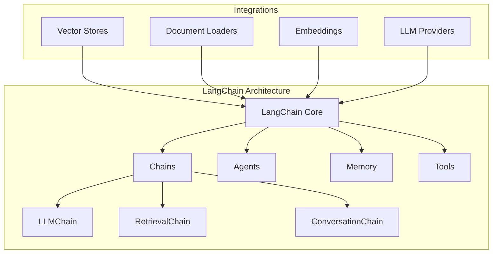
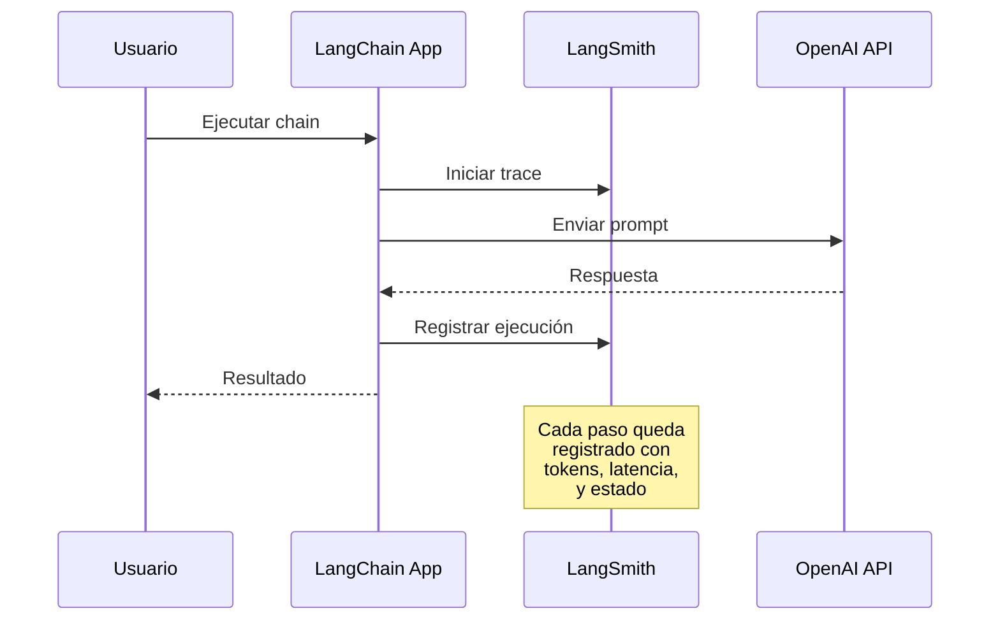
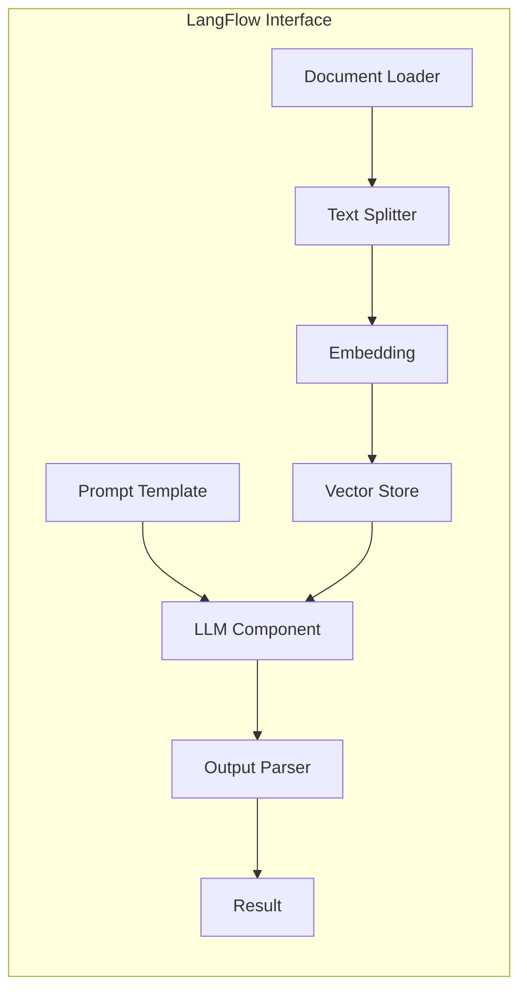
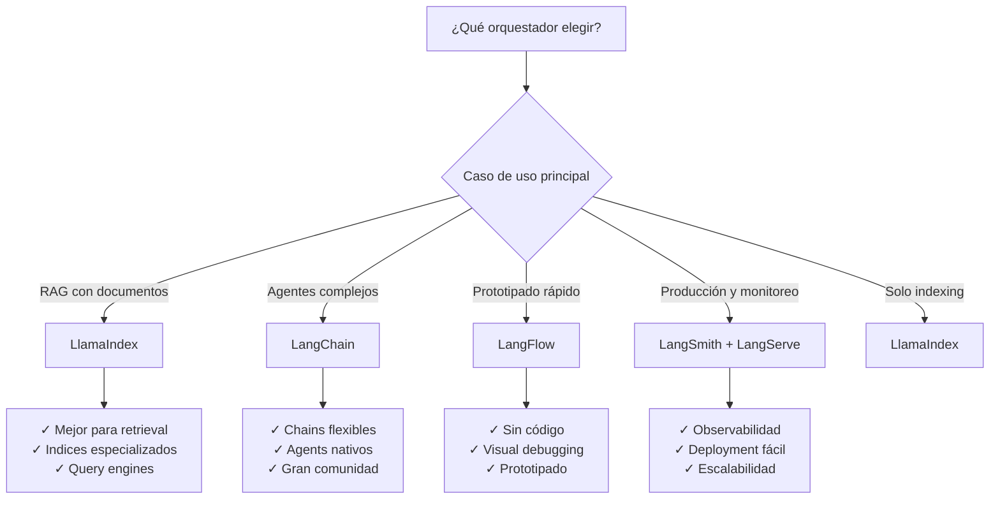

# CLASE 17: Orquestadores de Código Abierto para IA

## Duración: 4 horas

---

## 1. Objetivos de Aprendizaje

Al finalizar esta clase, el estudiante será capaz de:

- Comprender el concepto y propósito de los orquestadores de código abierto en el ecosistema de IA
- Evaluar y comparar las características de LangChain, LangSmith, LangServe y LangFlow
- Implementar soluciones utilizando LlamaIndex como alternativa y complemento
- Diseñar arquitecturas de aplicación utilizando orquestadores de IA
- Desplegar aplicaciones de IA en contenedores Docker
- Implementar debugging y monitoreo con LangSmith
- Crear interfaces visuales con LangFlow para prototipado rápido

---

## 2. Contenidos Detallados

### 2.1 Fundamentos de Orquestadores de IA

Los orquestadores de código abierto son marcos de trabajo (frameworks) que facilitan la integración de modelos de lenguaje grandes (LLMs) con fuentes de datos externas, herramientas y flujos de trabajo. En el contexto de la ingeniería de software moderna, estos frameworks permiten:

**¿Por qué necesitamos orquestadores?**

```
┌─────────────────────────────────────────────────────────────────┐
│                    Problemas sin Orquestadores                  │
├─────────────────────────────────────────────────────────────────┤
│  • Codificación manual de cada API de LLM                       │
│  • Gestión compleja de contexto y memoria                       │
│  • Integración manual de múltiples herramientas                 │
│  • Difícil escalabilidad y mantenimiento                        │
│  • Ausencia de patrones estandarizados                          │
└─────────────────────────────────────────────────────────────────┘
                              ↓
┌─────────────────────────────────────────────────────────────────┐
│                 Con Orquestadores                               │
├─────────────────────────────────────────────────────────────────┤
│  • Abstracción de APIs de LLM                                   │
│  • Gestión automática de chains y agents                        │
│  • Composición visual y programática de flujos                  │
│  • Patrones probados y optimizados                              │
│  • Logging, monitoreo y evaluación integrados                   │
└─────────────────────────────────────────────────────────────────┘
```

### 2.2 LangChain: Arquitectura Fundamental

LangChain es un framework de código abierto creado por Harrison Chase que se convirtió en el estándar de facto para el desarrollo de aplicaciones basadas en LLMs. Su arquitectura se basa en varios componentes fundamentales:

#### 2.2.1 Componentes Principales



#### 2.2.2 Modelo de Programación

LangChain sigue un modelo de programación basado en **componentes reutilizables**:

```python
# Estructura básica de una aplicación LangChain
from langchain.llms import OpenAI
from langchain.prompts import PromptTemplate
from langchain.chains import LLMChain

# 1. Configurar el LLM
llm = OpenAI(temperature=0.7, model_name="gpt-4")

# 2. Definir el prompt
prompt = PromptTemplate(
    input_variables=["product"],
    template="¿Cuál es un nombre creativo para una empresa de {product}?"
)

# 3. Crear la chain
chain = LLMChain(llm=llm, prompt=prompt)

# 4. Ejecutar
resultado = chain.run("software de gestión de proyectos")
```

### 2.3 LangSmith: Observabilidad y Debugging

LangSmith es la plataforma de observabilidad de LangChain que permite:

- **Tracing**: Seguimiento detallado de cada ejecución
- **Evaluación**: Benchmarking de prompts y chains
- **Monitoreo**: Métricas de rendimiento en producción
- **Dataset Management**: Gestión de casos de prueba

#### 2.3.1 Configuración de LangSmith

```python
import os
from langchain.callbacks import LangChainCallbackHandler
from langchain_openai import ChatOpenAI
from langsmith import traceable

# Configuración de entorno
os.environ["LANGCHAIN_TRACING_V2"] = "true"
os.environ["LANGCHAIN_API_KEY"] = "your-api-key"
os.environ["LANGCHAIN_PROJECT"] = "mi-proyecto"

# Implementación con tracing automático
@traceable(project_name="mi-proyecto")
def procesar_documento(documento: str) -> str:
    """Función decorada para tracing automático"""
    llm = ChatOpenAI(model="gpt-4")
    prompt = f"Resume el siguiente documento:\n{documento}"
    return llm.invoke(prompt)

# Callback handler para debugging en tiempo real
class DebugCallbackHandler:
    def on_chain_start(self, serialized, inputs):
        print(f"Iniciando chain: {serialized}")
        print(f"Inputs: {inputs}")
    
    def on_chain_end(self, outputs):
        print(f"Outputs: {outputs}")
    
    def on_llm_error(self, error):
        print(f"Error en LLM: {error}")
```

#### 2.3.2 Sistema de Tracing Detallado



### 2.4 LangServe: Despliegue de APIs

LangServe permite desplegar chains de LangChain como APIs RESTful de manera sencilla:

#### 2.4.1 Estructura de Proyecto LangServe

```
mi-proyecto-langserve/
├── app/
│   ├── __init__.py
│   ├── server.py          # Configuración del servidor
│   └── chains/
│       ├── __init__.py
│       └── mi_chain.py    # Definición de chains
├── requirements.txt
├── Dockerfile
└── docker-compose.yaml
```

#### 2.4.2 Implementación de LangServe

```python
# app/chains/mi_chain.py
from langchain.prompts import ChatPromptTemplate
from langchain.chat_models import ChatOpenAI
from langchain.schema import BaseOutputParser
from typing import List

class LineListOutputParser(BaseOutputParser[List[str]]):
    """Parser personalizado para separar respuestas por líneas"""
    
    def parse(self, text: str) -> List[str]:
        return [line.strip() for line in text.strip().split("\n") if line.strip()]

# Definición del chain
def create_analysis_chain():
    llm = ChatOpenAI(temperature=0, model="gpt-4")
    
    prompt = ChatPromptTemplate.from_messages([
        ("system", "Eres un analista de código experto."),
        ("human", "Analiza el siguiente código y proporciona:\n1. Propósito\n2. Complejidad\n3. Mejoras sugeridas\n\nCódigo:\n{code}")
    ])
    
    return prompt | llm | LineListOutputParser()

# app/server.py
from fastapi import FastAPI
from langserve import add_routes
from app.chains.mi_chain import create_analysis_chain

app = FastAPI(
    title="API de Análisis de Código",
    version="1.0",
    description="API para análisis automático de código"
)

add_routes(app, create_analysis_chain(), path="/analisis")
```

#### 2.4.3 Dockerfile para Despliegue

```dockerfile
# Dockerfile
FROM python:3.11-slim

WORKDIR /app

# Instalar dependencias del sistema
RUN apt-get update && apt-get install -y \
    gcc \
    && rm -rf /var/lib/apt/lists/*

# Copiar archivos de dependencias
COPY requirements.txt .
RUN pip install --no-cache-dir -r requirements.txt

# Dependencias específicas de LangServe
RUN pip install \
    langchain \
    langserve \
    fastapi \
    uvicorn[standard] \
    langchain-openai

# Copiar código de la aplicación
COPY app ./app

# Exponer puerto
EXPOSE 8000

# Comando de inicio
CMD ["uvicorn", "app.server:app", "--host", "0.0.0.0", "--port", "8000"]
```

### 2.5 LangFlow: Interfaces Visuales

LangFlow proporciona una interfaz gráfica para diseñar flujos de LangChain mediante drag-and-drop:



#### 2.5.1 Tipos de Componentes en LangFlow

| Categoría | Componentes | Función |
|-----------|-------------|---------|
| **LLMs** | OpenAI, Anthropic, HuggingFace | Modelos de lenguaje base |
| **Chains** | LLMChain, RetrievalChain, AgentChain | Orquestación de flujos |
| **Memory** | BufferMemory, VectorStoreMemory | Persistencia de contexto |
| **Tools** | Search, Calculator, Python REPL | Capacidades externas |
| **Prompts** | PromptTemplate, ChatPromptTemplate | Ingeniería de prompts |
| **Vectorstores** | Pinecone, Chroma, FAISS | Almacenamiento de embeddings |

### 2.6 LlamaIndex: Recuperación de Información

LlamaIndex (anteriormente GPT Index) se especializa en la ingestión y recuperación de información desde fuentes de datos estructuradas y no estructuradas:

```python
# Ejemplo completo de LlamaIndex
from llama_index import VectorStoreIndex, SimpleDirectoryReader
from llama_index.storage.storage_context import StorageContext
from llama_index.vector_stores import ChromaVectorStore
import chromadb

# 1. Cargar documentos
documents = SimpleDirectoryReader('./data').load_data()

# 2. Configurar ChromaDB como vector store
chroma_client = chromadb.PersistentClient(path="./chroma_db")
vector_store = ChromaVectorStore(chroma_client=chroma_client)
storage_context = StorageContext.from_defaults(vector_store=vector_store)

# 3. Crear índice
index = VectorStoreIndex.from_documents(
    documents,
    storage_context=storage_context
)

# 4. Configurar motor de query
query_engine = index.as_query_engine(
    similarity_top_k=3,
    response_mode="compact"
)

# 5. Realizar consultas
response = query_engine.query("¿Cuáles son los principales objetivos del proyecto?")
print(response)
```

### 2.7 Comparativa de Orquestadores



#### Matriz de Comparación Detallada

| Característica | LangChain | LlamaIndex | LangFlow |
|----------------|-----------|------------|----------|
| **Enfoque principal** | Agentes y chains | Retrieval y indexing | UI visual |
| **Curva de aprendizaje** | Media-Alta | Baja-Media | Muy baja |
| **Comunidad** | Muy grande | Grande | En crecimiento |
| **Documentación** | Excelente | Muy buena | Buena |
| **Casos de uso óptimos** | Agentes, automatización | RAG, QA sobre documentos | Prototipado |
| **Integración vector stores** | Excelente | Excelente | Buena |
| **Soporte para agents** | Nativo | Limitado | No |
| **Maturity** | Maduro | Maduro | Beta |

### 2.8 Docker y Contenedores para IA

```yaml
# docker-compose.yaml completo
version: '3.8'

services:
  # API de LangServe
  api:
    build: .
    ports:
      - "8000:8000"
    environment:
      - OPENAI_API_KEY=${OPENAI_API_KEY}
      - LANGCHAIN_TRACING_V2=true
      - LANGCHAIN_API_KEY=${LANGCHAIN_API_KEY}
    volumes:
      - ./app:/app/app
    depends_on:
      - chromadb
    networks:
      - ai-network

  # ChromaDB para embeddings
  chromadb:
    image: chromadb/chroma:latest
    ports:
      - "8001:8000"
    volumes:
      - chroma_data:/chroma/chroma
    networks:
      - ai-network

  # LangFlow (opcional, para desarrollo)
  langflow:
    image: logspace-ai/langflow:latest
    ports:
      - "7860:7860"
    environment:
      - LANGCHAIN_TRACING_V2=true
    volumes:
      - langflow_data:/app
    networks:
      - ai-network

volumes:
  chroma_data:
  langflow_data:

networks:
  ai-network:
    driver: bridge
```

---

## 3. Tecnologías y Herramientas Específicas

### 3.1 Stack Tecnológico Completo

```bash
# requirements.txt
langchain==0.1.0
langchain-openai==0.0.5
langserve==0.0.20
langsmith==0.0.50
llama-index==0.9.48
chromadb==0.4.22
fastapi==0.109.0
uvicorn[standard]==0.27.0
docker==7.0.0
pydantic==2.5.3
```

### 3.2 Instalación y Configuración

```bash
# Crear entorno virtual
python -m venv venv
source venv/bin/activate  # Linux/Mac
# venv\Scripts\activate   # Windows

# Instalar dependencias
pip install langchain langchain-openai langserve langsmith

# Verificar instalación
python -c "import langchain; print(langchain.__version__)"
```

---

## 4. Ejercicios Prácticos Resueltos

### Ejercicio 1: Implementar un RAG System con LangChain

**Problema**: Crear un sistema de Retrieval-Augmented Generation que pueda responder preguntas sobre documentos PDF de una biblioteca técnica.

**Solución paso a paso**:

```python
"""
Sistema RAG con LangChain
========================
Este ejercicio implementa un sistema completo de RAG para responder
preguntas sobre documentación técnica.
"""

from langchain.document_loaders import PyPDFLoader
from langchain.text_splitter import RecursiveCharacterTextSplitter
from langchain.embeddings import OpenAIEmbeddings
from langchain.vectorstores import Chroma
from langchain.chains import RetrievalQA
from langchain.chat_models import ChatOpenAI
from langchain.prompts import PromptTemplate
import os

class RAGSystem:
    """
    Sistema de Retrieval-Augmented Generation para documentación técnica.
    
    Este sistema:
    1. Carga documentos PDF
    2. Los fragmenta en chunks semánticos
    3. Genera embeddings y los almacena en ChromaDB
    4. Responde preguntas usando retrieval + generación
    """
    
    def __init__(self, openai_api_key: str):
        """
        Inicializa el sistema RAG.
        
        Args:
            openai_api_key: Clave API de OpenAI
        """
        os.environ["OPENAI_API_KEY"] = openai_api_key
        self.embeddings = OpenAIEmbeddings()
        self.vector_store = None
        self.qa_chain = None
        
    def load_documents(self, pdf_paths: list) -> list:
        """
        Carga documentos PDF y los convierte en documentos procesables.
        
        Args:
            pdf_paths: Lista de rutas a archivos PDF
            
        Returns:
            Lista de documentos cargados
        """
        from langchain.schema import Document
        
        all_documents = []
        
        for pdf_path in pdf_paths:
            print(f"Cargando: {pdf_path}")
            loader = PyPDFLoader(pdf_path)
            pages = loader.load_and_split()
            
            # Agregar metadatos
            for page in pages:
                page.metadata["source"] = pdf_path
                
            all_documents.extend(pages)
            print(f"  - {len(pages)} páginas cargadas")
            
        return all_documents
    
    def split_documents(self, documents: list, chunk_size: int = 1000, 
                        chunk_overlap: int = 200) -> list:
        """
        Fragmenta documentos en chunks más pequeños para embedding.
        
        Args:
            documents: Documentos a fragmentar
            chunk_size: Tamaño máximo de cada chunk
            chunk_overlap: Superposición entre chunks
            
        Returns:
            Lista de chunks fragmentados
        """
        text_splitter = RecursiveCharacterTextSplitter(
            separators=["\n\n", "\n", ". ", " ", ""],
            chunk_size=chunk_size,
            chunk_overlap=chunk_overlap,
            length_function=len,
        )
        
        chunks = text_splitter.split_documents(documents)
        print(f"Generados {len(chunks)} chunks")
        return chunks
    
    def create_vector_store(self, chunks: list, persist_directory: str = "./chroma_db"):
        """
        Crea y persiste el vector store en ChromaDB.
        
        Args:
            chunks: Chunks de documentos
            persist_directory: Directorio para persistir la base de datos
        """
        self.vector_store = Chroma.from_documents(
            documents=chunks,
            embedding=self.embeddings,
            persist_directory=persist_directory
        )
        print(f"Vector store creado en {persist_directory}")
        
    def setup_qa_chain(self):
        """
        Configura el chain de Question Answering con prompt personalizado.
        """
        # Prompt personalizado para documentación técnica
        prompt_template = """
        Eres un experto en documentación técnica de software.
        Usa el siguiente contexto para responder la pregunta del usuario.
        
        Si la respuesta no está en el contexto, indica que no tienes
        suficiente información para responder.
        
        Contexto:
        {context}
        
        Pregunta: {question}
        
        Respuesta (sé específico y cita las secciones relevantes):
        """
        
        PROMPT = PromptTemplate(
            template=prompt_template,
            input_variables=["context", "question"]
        )
        
        # Crear el chain
        self.qa_chain = RetrievalQA.from_chain_type(
            llm=ChatOpenAI(model="gpt-4", temperature=0),
            chain_type="stuff",  # stuff: mete todo el contexto en un prompt
            retriever=self.vector_store.as_retriever(
                search_kwargs={"k": 3}  # Recuperar top 3 documentos
            ),
            chain_type_kwargs={"prompt": PROMPT},
            return_source_documents=True  # Para mostrar las fuentes
        )
        
    def query(self, question: str) -> dict:
        """
        Ejecuta una consulta al sistema RAG.
        
        Args:
            question: Pregunta del usuario
            
        Returns:
            Diccionario con respuesta y fuentes
        """
        if not self.qa_chain:
            raise ValueError("QA chain no configurado. Ejecuta setup_qa_chain() primero.")
            
        result = self.qa_chain({"query": question})
        
        return {
            "answer": result["result"],
            "sources": [
                {
                    "content": doc.page_content[:200] + "...",
                    "source": doc.metadata.get("source", "Unknown"),
                    "page": doc.metadata.get("page", "N/A")
                }
                for doc in result.get("source_documents", [])
            ]
        }


# EJEMPLO DE USO
if __name__ == "__main__":
    # Inicializar sistema
    rag = RAGSystem(openai_api_key="your-api-key")
    
    # Cargar documentos
    documents = rag.load_documents([
        "./docs/arquitectura.pdf",
        "./docs/api_reference.pdf"
    ])
    
    # Fragmentar
    chunks = rag.split_documents(documents)
    
    # Crear vector store
    rag.create_vector_store(chunks)
    
    # Configurar QA chain
    rag.setup_qa_chain()
    
    # Realizar consultas
    respuesta = rag.query("¿Cuáles son los patrones de arquitectura recomendados?")
    print(f"Respuesta: {respuesta['answer']}")
    print(f"Fuentes: {respuesta['sources']}")
```

### Ejercicio 2: Crear un Agente con LangChain y Tools

```python
"""
Agente LangChain con Tools Personalizadas
=========================================
Este ejercicio implementa un agente que puede usar múltiples herramientas
para resolver problemas de ingeniería de software.
"""

from langchain.agents import AgentExecutor, create_openai_functions_agent
from langchain.chat_models import ChatOpenAI
from langchain.prompts import ChatPromptTemplate, MessagesPlaceholder
from langchain.tools import Tool, StructuredTool
from langchain.schema import SystemMessage
from pydantic import BaseModel, Field
from typing import List, Optional
import json

# Definición de tools con esquemas

class CodeAnalysisInput(BaseModel):
    code: str = Field(description="Código a analizar")
    language: str = Field(description="Lenguaje de programación")

class CodeReviewInput(BaseModel):
    code: str = Field(description="Código a revisar")
    focus: str = Field(description="Área de enfoque: security, performance, style")

# Tools personalizadas

def analyze_code(code: str, language: str) -> str:
    """
    Analiza código y devuelve métricas básicas.
    
    Args:
        code: Código fuente a analizar
        language: Lenguaje de programación
        
    Returns:
        Análisis en formato JSON
    """
    lines = code.split('\n')
    metrics = {
        "total_lines": len(lines),
        "code_lines": len([l for l in lines if l.strip() and not l.strip().startswith('#')]),
        "comment_lines": len([l for l in lines if l.strip().startswith('#') or l.strip().startswith('//')]),
        "blank_lines": len([l for l in lines if not l.strip()]),
        "estimated_complexity": "low" if len([l for l in lines if 'if' in l or 'for' in l]) < 5 else "medium"
    }
    return json.dumps(metrics, indent=2)

def review_code(code: str, focus: str) -> str:
    """
    Realiza una revisión de código enfocada en un área específica.
    
    Args:
        code: Código a revisar
        focus: security | performance | style
        
    Returns:
        Informe de revisión
    """
    issues = []
    suggestions = []
    
    if focus == "security":
        if "eval(" in code:
            issues.append("Uso de eval() detectado - riesgo de inyección")
        if "password" in code.lower() and "=" in code:
            issues.append("Posible hardcodeo de contraseña detectado")
        if "input(" in code:
            suggestions.append("Considerar sanitización de entrada de usuario")
            
    elif focus == "performance":
        if code.count("for") > 3:
            suggestions.append("Posibles bucles anidados - considerar optimización")
        if "list(" in code and "for" in code:
            suggestions.append("Considerar uso de list comprehensions para mejor rendimiento")
            
    elif focus == "style":
        if "snake_case" not in code and any(c.isupper() for c in code.split()):
            suggestions.append("Inconsistencia en convenciones de nombres")
            
    return json.dumps({
        "focus": focus,
        "issues": issues if issues else ["No se encontraron problemas críticos"],
        "suggestions": suggestions if suggestions else ["El código parece seguir buenas prácticas"]
    }, indent=2)

def calculate_complexity(code: str) -> str:
    """Calcula la complejidad ciclomática aproximada."""
    decision_points = code.count('if') + code.count('for') + code.count('while') + code.count('and') + code.count('or')
    return f"Complejidad ciclomática aproximada: {decision_points + 1}"

# Crear herramientas
tools = [
    Tool.from_function(
        func=analyze_code,
        name="analyze_code",
        description="Analiza código y devuelve métricas como líneas de código, comentarios, y complejidad estimada.",
        args_schema=CodeAnalysisInput
    ),
    Tool.from_function(
        func=review_code,
        name="review_code",
        description="Revisa código enfocándose en seguridad, rendimiento o estilo.",
        args_schema=CodeReviewInput
    ),
    Tool.from_function(
        func=calculate_complexity,
        name="calculate_complexity",
        description="Calcula la complejidad ciclomática del código."
    )
]

# Configurar prompt del agente
prompt = ChatPromptTemplate.from_messages([
    SystemMessage(content="""
    Eres un asistente de revisión de código experto. Tienes acceso a herramientas
    que te permiten:
    - analyze_code: Analizar métricas básicas de código
    - review_code: Realizar revisiones enfocadas (security/performance/style)
    - calculate_complexity: Calcular complejidad ciclomática
    
    Usa estas herramientas para ayudar al usuario a mejorar su código.
    """),
    ("human", "{input}"),
    MessagesPlaceholder(variable_name="agent_scratchpad")
])

# Crear agente
llm = ChatOpenAI(model="gpt-4", temperature=0)
agent = create_openai_functions_agent(llm, tools, prompt)
agent_executor = AgentExecutor(agent=agent, tools=tools, verbose=True)

# Ejecutar
result = agent_executor.invoke({
    "input": "Analiza este código Python:\n\ndef fibonacci(n):\n    if n <= 1:\n        return n\n    return fibonacci(n-1) + fibonacci(n-2)\n\nfor i in range(10):\n    print(fibonacci(i))"
})

print(result["output"])
```

---

## 5. Actividades de Laboratorio

### Laboratorio 1: Despliegue de API RAG con LangServe y Docker

**Duración estimada**: 90 minutos

**Objetivo**: Desplegar un sistema RAG completo usando LangServe, ChromaDB y Docker.

**Pasos**:

1. Crear estructura de proyecto
2. Implementar chain de RAG
3. Configurar LangServe
4. Crear Dockerfile
5. Desplegar y probar

```bash
# Estructura de comandos
mkdir -p mi-rag-api/{app/chains,data,models}
cd mi-rag-api
```

### Laboratorio 2: Construir un Dashboard de Monitoreo con LangSmith

**Duración estimada**: 60 minutos

**Objetivo**: Configurar LangSmith para monitorear las ejecución de chains en desarrollo.

### Laboratorio 3: Prototipado Visual con LangFlow

**Duración estimada**: 60 minutos

**Objetivo**: Utilizar LangFlow para crear un flujo de RAG visualmente.

---

## 6. Resumen de Puntos Clave

### 6.1 Conceptos Fundamentales

| Concepto | Descripción |
|----------|-------------|
| **Orquestador** | Framework que facilita integración de LLMs con herramientas y datos |
| **Chain** | Secuencia de componentes que procesan inputs secuencialmente |
| **Agent** | Sistema que puede decidir qué acciones tomar basándose en el contexto |
| **Retrieval** | Recuperación de información relevante de fuentes de datos |
| **Vector Store** | Base de datos optimizada para búsqueda por similitud |

### 6.2 Cuándo Usar Cada Herramienta

- **LangChain**: Agentes complejos, automatización de múltiples pasos
- **LlamaIndex**: Sistemas RAG, indexing de documentos, query engines
- **LangServe**: Despliegue de APIs de producción
- **LangSmith**: Debugging, evaluación, monitoreo en desarrollo
- **LangFlow**: Prototipado rápido, visualización de flujos

### 6.3 Mejores Prácticas

1. **Inicio de proyecto**: Evaluar requisitos → Elegir framework
2. **Prototipado**: LangFlow para validar flujos antes de codificar
3. **Desarrollo**: LangChain/LlamaIndex con testing con LangSmith
4. **Producción**: LangServe + Docker con logging en LangSmith
5. **Monitoreo**: Configurar alerts en LangSmith para producción

---

## 7. Referencias Externas

1. **LangChain Documentation** - https://python.langchain.com/docs/get_started/introduction
2. **LangSmith Documentation** - https://docs.smith.langchain.com/
3. **LangServe Documentation** - https://python.langchain.com/docs/langserve/
4. **LlamaIndex Documentation** - https://docs.llamaindex.ai/
5. **LangFlow GitHub** - https://github.com/logspace-ai/langflow
6. **ChromaDB Documentation** - https://docs.trychroma.com/
7. **Docker + LangChain Guide** - https://python.langchain.com/docs/guides/deployments/docker
8. **LangChain Academy** - https://academy.langchain.com/

---

## 8. Glosario de Términos

| Término | Definición |
|---------|------------|
| **Chain** | Composición de componentes de LLM |
| **Agent** | Sistema que usa tools para completar tareas |
| **Tool** | Funciones que un agent puede invocar |
| **Vector Store** | Almacenamiento de embeddings para búsqueda |
| **Embedding** | Representación vectorial de texto |
| **RAG** | Retrieval-Augmented Generation |
| **Callback** | Handler para observar ejecución de chains |
| **Trace** | Registro completo de una ejecución |

---

*Última actualización: Clase 17 - Semana 9*
