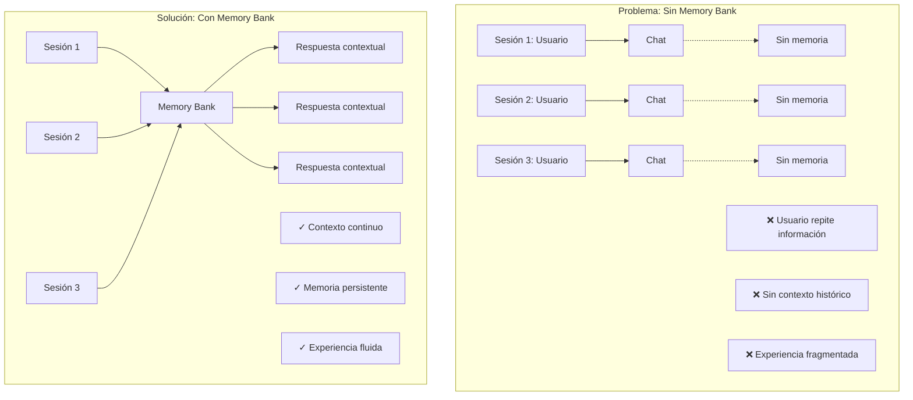
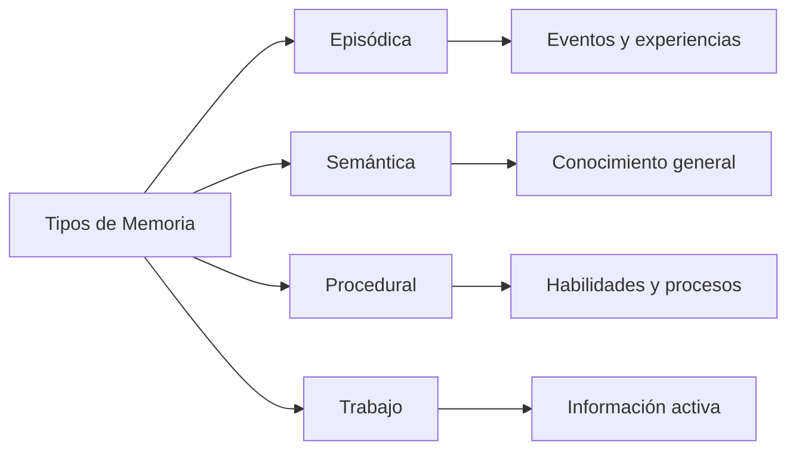
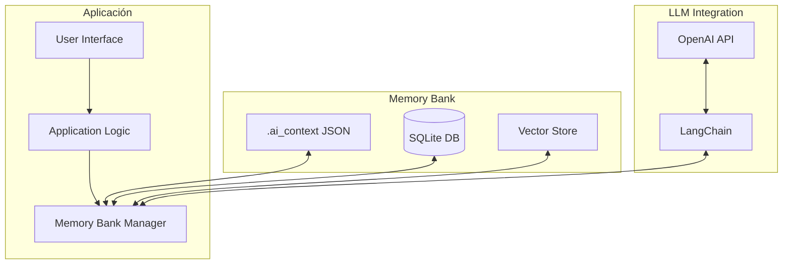
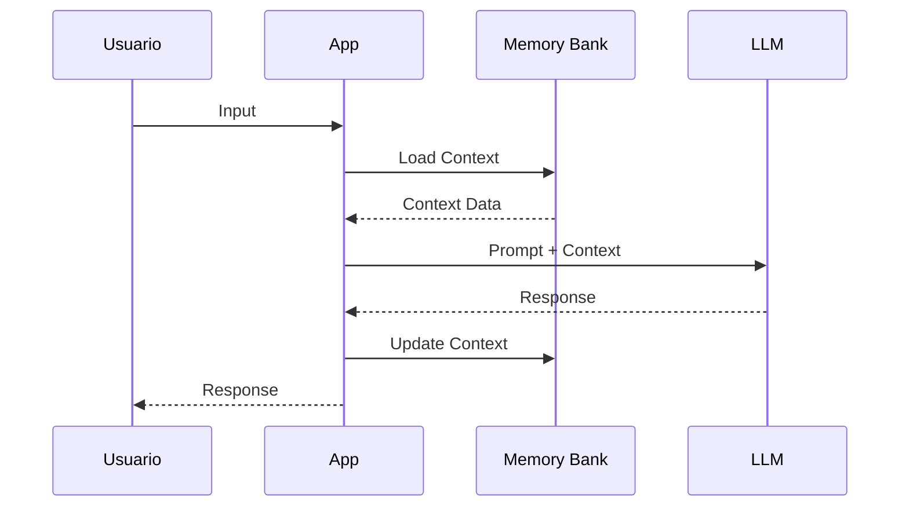

# CLASE 18: Patrón Memory Bank - Fundamentos

## Duración: 4 horas

---

## 1. Objetivos de Aprendizaje

Al finalizar esta clase, el estudiante será capaz de:

- Comprender el concepto y la importancia del contexto persistente en aplicaciones de IA
- Diseñar e implementar la estructura del archivo `.ai_context`
- Implementar sistemas de Memory Bank básicos utilizando Python
- Persistir y recuperar información de sesión utilizando JSON y bases de datos
- Aplicar el patrón Memory Bank en proyectos de desarrollo reales
- Integrar Memory Bank con frameworks como LangChain y LlamaIndex
- Optimizar el rendimiento de sistemas de memoria persistente

---

## 2. Contenidos Detallados

### 2.1 Introducción al Patrón Memory Bank

El patrón Memory Bank surge como respuesta a una de las limitaciones más significativas de los modelos de lenguaje: la falta de memoria persistente. Los LLMs, por diseño, no mantienen estado entre conversaciones, lo que limita su utilidad en aplicaciones que requieren continuidad.



### 2.2 Fundamentos del Contexto Persistente

#### 2.2.1 Tipos de Memoria en Sistemas de IA



**Tabla Comparativa**:

| Tipo de Memoria | Descripción | Duración | Ejemplo |
|-----------------|-------------|----------|---------|
| **Episódica** | Almacena experiencias específicas | Sesión actual | "Usuario preguntó sobre X ayer" |
| **Semántica** | Conocimiento general y facts | Persistente | "Python es un lenguaje de programación" |
| **Procedural** | Cómo realizar tareas | Persistente | "Para hacer deploy, ejecutar estos pasos" |
| **Trabajo** | Info activa durante procesamiento | Transitoria | Variables temporales |

### 2.3 Estructura del Archivo `.ai_context`

El archivo `.ai_context` es el componente central del patrón Memory Bank. Es un archivo estructurado que mantiene el contexto del proyecto, preferencias del usuario y estado de la conversación.

#### 2.3.1 Esquema JSON del .ai_context

```json
{
  "version": "1.0.0",
  "project_metadata": {
    "name": "Nombre del Proyecto",
    "description": "Descripción breve del proyecto",
    "language": "es",
    "tech_stack": ["Python", "FastAPI", "PostgreSQL"],
    "last_modified": "2024-01-15T10:30:00Z"
  },
  "user_preferences": {
    "coding_style": "pep8",
    "communication_tone": "formal",
    "explanation_level": "detailed",
    "preferred_tools": ["pytest", "black"]
  },
  "conversation_context": {
    "current_focus": "Implementando módulo de autenticación",
    "recent_discussions": [
      {
        "topic": "Diseño de API REST",
        "summary": "Acordamos usar autenticación JWT con refresh tokens",
        "timestamp": "2024-01-15T09:00:00Z"
      }
    ],
    "pending_tasks": [
      {
        "description": "Implementar endpoint de login",
        "status": "in_progress",
        "priority": "high"
      }
    ]
  },
  "project_state": {
    "current_phase": "development",
    "completed_features": ["CRUD de usuarios", "Validación de entrada"],
    "ongoing_features": ["Autenticación JWT"],
    "planned_features": ["Reset de password", "OAuth2"]
  },
  "knowledge_base": {
    "architecture_decisions": [
      {
        "topic": "Base de datos",
        "decision": "PostgreSQL con SQLAlchemy",
        "rationale": "Escalabilidad y soporte JSON"
      }
    ],
    "conventions": {
      "naming": "snake_case",
      "testing": "pytest con fixtures"
    }
  }
}
```

#### 2.3.2 Implementación de la Clase MemoryBank

```python
"""
Memory Bank - Sistema de Contexto Persistente
==============================================
Este módulo implementa el patrón Memory Bank para mantener
contexto persistente en aplicaciones de IA.
"""

import json
import os
from datetime import datetime
from pathlib import Path
from typing import Any, Dict, List, Optional
from dataclasses import dataclass, field, asdict
from enum import Enum

class Priority(Enum):
    LOW = "low"
    MEDIUM = "medium"
    HIGH = "high"
    CRITICAL = "critical"

class TaskStatus(Enum):
    PENDING = "pending"
    IN_PROGRESS = "in_progress"
    COMPLETED = "completed"
    CANCELLED = "cancelled"

@dataclass
class Discussion:
    """Representa una discusión en el contexto del proyecto."""
    topic: str
    summary: str
    timestamp: str
    key_points: List[str] = field(default_factory=list)
    outcome: Optional[str] = None

@dataclass
class Task:
    """Representa una tarea en el contexto del proyecto."""
    description: str
    status: str
    priority: str
    created_at: str = field(default_factory=lambda: datetime.now().isoformat())
    completed_at: Optional[str] = None
    assignee: Optional[str] = None
    related_topics: List[str] = field(default_factory=list)

@dataclass
class ArchitectureDecision:
    """Representa una decisión de arquitectura documentada."""
    topic: str
    decision: str
    rationale: str
    date: str
    alternatives_considered: List[str] = field(default_factory=list)
    implications: List[str] = field(default_factory=list)

class MemoryBank:
    """
    Sistema de contexto persistente para proyectos de IA.
    
    El Memory Bank mantiene:
    - Metadatos del proyecto
    - Preferencias del usuario
    - Contexto de conversación actual
    - Estado del proyecto
    - Base de conocimiento
    
    Uso:
        mb = MemoryBank("./mi_proyecto/.ai_context")
        mb.initialize_if_not_exists()
        mb.add_discussion("API Design", "Usaremos REST con OpenAPI")
        mb.add_task("Implementar auth", Priority.HIGH)
    """
    
    VERSION = "1.0.0"
    
    def __init__(self, file_path: str):
        """
        Inicializa el Memory Bank.
        
        Args:
            file_path: Ruta al archivo .ai_context
        """
        self.file_path = Path(file_path)
        self.data: Dict[str, Any] = {}
        
    def initialize_if_not_exists(self, project_name: str = "Nuevo Proyecto") -> None:
        """
        Inicializa el archivo de contexto si no existe.
        
        Args:
            project_name: Nombre del proyecto
        """
        if self.file_path.exists():
            self.load()
        else:
            self.file_path.parent.mkdir(parents=True, exist_ok=True)
            self.data = self._create_default_context(project_name)
            self.save()
            
    def _create_default_context(self, project_name: str) -> Dict[str, Any]:
        """Crea la estructura por defecto del contexto."""
        return {
            "version": self.VERSION,
            "project_metadata": {
                "name": project_name,
                "description": "",
                "language": "es",
                "tech_stack": [],
                "created_at": datetime.now().isoformat(),
                "last_modified": datetime.now().isoformat()
            },
            "user_preferences": {
                "coding_style": "pep8",
                "communication_tone": "professional",
                "explanation_level": "detailed",
                "preferred_tools": []
            },
            "conversation_context": {
                "current_focus": "",
                "recent_discussions": [],
                "pending_tasks": []
            },
            "project_state": {
                "current_phase": "planning",
                "completed_features": [],
                "ongoing_features": [],
                "planned_features": []
            },
            "knowledge_base": {
                "architecture_decisions": [],
                "conventions": {},
                "glossary": {}
            }
        }
    
    def load(self) -> None:
        """Carga el contexto desde el archivo."""
        if not self.file_path.exists():
            raise FileNotFoundError(f"No existe el archivo: {self.file_path}")
            
        with open(self.file_path, 'r', encoding='utf-8') as f:
            self.data = json.load(f)
            
    def save(self) -> None:
        """Guarda el contexto en el archivo."""
        self.data["project_metadata"]["last_modified"] = datetime.now().isoformat()
        
        self.file_path.parent.mkdir(parents=True, exist_ok=True)
        
        with open(self.file_path, 'w', encoding='utf-8') as f:
            json.dump(self.data, f, indent=2, ensure_ascii=False)
            
    # ==================== PROJECT METADATA ====================
    
    def update_project_metadata(self, **kwargs) -> None:
        """Actualiza los metadatos del proyecto."""
        self.data["project_metadata"].update(kwargs)
        self.save()
        
    def set_tech_stack(self, tech_stack: List[str]) -> None:
        """Define el stack tecnológico del proyecto."""
        self.data["project_metadata"]["tech_stack"] = tech_stack
        self.save()
        
    def get_tech_stack(self) -> List[str]:
        """Obtiene el stack tecnológico."""
        return self.data.get("project_metadata", {}).get("tech_stack", [])
    
    # ==================== USER PREFERENCES ====================
    
    def update_preferences(self, **kwargs) -> None:
        """Actualiza las preferencias del usuario."""
        self.data["user_preferences"].update(kwargs)
        self.save()
        
    def get_preference(self, key: str, default: Any = None) -> Any:
        """Obtiene una preferencia específica."""
        return self.data.get("user_preferences", {}).get(key, default)
    
    # ==================== DISCUSSION CONTEXT ====================
    
    def add_discussion(self, topic: str, summary: str, 
                       key_points: List[str] = None,
                       outcome: str = None) -> None:
        """
        Registra una nueva discusión.
        
        Args:
            topic: Tema de la discusión
            summary: Resumen de lo discutido
            key_points: Puntos clave
            outcome: Resultado o decisión tomada
        """
        discussion = Discussion(
            topic=topic,
            summary=summary,
            timestamp=datetime.now().isoformat(),
            key_points=key_points or [],
            outcome=outcome
        )
        
        self.data["conversation_context"]["recent_discussions"].append(
            asdict(discussion)
        )
        
        # Mantener solo las últimas 20 discusiones
        if len(self.data["conversation_context"]["recent_discussions"]) > 20:
            self.data["conversation_context"]["recent_discussions"] = \
                self.data["conversation_context"]["recent_discussions"][-20:]
                
        self.save()
        
    def get_discussions(self, topic: str = None) -> List[Dict]:
        """Obtiene discusiones, opcionalmente filtradas por tema."""
        discussions = self.data.get("conversation_context", {}).get(
            "recent_discussions", []
        )
        
        if topic:
            return [d for d in discussions if topic.lower() in d["topic"].lower()]
        return discussions
        
    def set_current_focus(self, focus: str) -> None:
        """Define el foco actual de la conversación."""
        self.data["conversation_context"]["current_focus"] = focus
        self.save()
        
    def get_current_focus(self) -> str:
        """Obtiene el foco actual."""
        return self.data.get("conversation_context", {}).get("current_focus", "")
    
    # ==================== TASKS ====================
    
    def add_task(self, description: str, priority: Priority = Priority.MEDIUM,
                 assignee: str = None) -> None:
        """
        Añade una tarea pendiente.
        
        Args:
            description: Descripción de la tarea
            priority: Prioridad de la tarea
            assignee: Persona asignada
        """
        task = Task(
            description=description,
            status=TaskStatus.PENDING.value,
            priority=priority.value,
            assignee=assignee
        )
        
        self.data["conversation_context"]["pending_tasks"].append(asdict(task))
        self.save()
        
    def update_task_status(self, description: str, status: TaskStatus) -> None:
        """
        Actualiza el estado de una tarea.
        
        Args:
            description: Descripción de la tarea a buscar
            status: Nuevo estado
        """
        tasks = self.data["conversation_context"]["pending_tasks"]
        
        for task in tasks:
            if description.lower() in task["description"].lower():
                task["status"] = status.value
                if status == TaskStatus.COMPLETED:
                    task["completed_at"] = datetime.now().isoformat()
                    
        self.save()
        
    def get_pending_tasks(self, priority: Priority = None) -> List[Dict]:
        """Obtiene tareas pendientes."""
        tasks = self.data.get("conversation_context", {}).get("pending_tasks", [])
        
        if priority:
            return [t for t in tasks if t.get("priority") == priority.value]
            
        return [t for t in tasks if t.get("status") != TaskStatus.COMPLETED.value]
    
    # ==================== PROJECT STATE ====================
    
    def add_completed_feature(self, feature: str) -> None:
        """Registra una característica completada."""
        completed = self.data["project_state"]["completed_features"]
        if feature not in completed:
            completed.append(feature)
            
        # Remover de ongoing si estaba ahí
        ongoing = self.data["project_state"]["ongoing_features"]
        if feature in ongoing:
            ongoing.remove(feature)
            
        self.save()
        
    def set_ongoing_feature(self, feature: str) -> None:
        """Marca una característica como en desarrollo."""
        ongoing = self.data["project_state"]["ongoing_features"]
        if feature not in ongoing:
            ongoing.append(feature)
        self.save()
    
    # ==================== KNOWLEDGE BASE ====================
    
    def add_architecture_decision(self, topic: str, decision: str,
                                   rationale: str,
                                   alternatives: List[str] = None) -> None:
        """
        Documenta una decisión de arquitectura.
        
        Args:
            topic: Tema de la decisión
            decision: Decisión tomada
            rationale: Justificación
            alternatives: Alternativas consideradas
        """
        ad = ArchitectureDecision(
            topic=topic,
            decision=decision,
            rationale=rationale,
            date=datetime.now().isoformat(),
            alternatives_considered=alternatives or []
        )
        
        self.data["knowledge_base"]["architecture_decisions"].append(asdict(ad))
        self.save()
        
    def get_architecture_decisions(self, topic: str = None) -> List[Dict]:
        """Obtiene decisiones de arquitectura."""
        decisions = self.data.get("knowledge_base", {}).get(
            "architecture_decisions", []
        )
        
        if topic:
            return [d for d in decisions if topic.lower() in d["topic"].lower()]
        return decisions
        
    def add_convention(self, key: str, value: str) -> None:
        """Añade una convención del proyecto."""
        self.data["knowledge_base"]["conventions"][key] = value
        self.save()
        
    def get_convention(self, key: str, default: str = None) -> str:
        """Obtiene una convención específica."""
        return self.data.get("knowledge_base", {}).get("conventions", {}).get(
            key, default
        )
    
    # ==================== UTILITY METHODS ====================
    
    def get_full_context(self) -> str:
        """
        Genera un contexto completo formateado para prompts.
        
        Returns:
            String con el contexto formateado
        """
        context_parts = []
        
        # Metadatos
        meta = self.data.get("project_metadata", {})
        context_parts.append(f"## Proyecto: {meta.get('name', 'N/A')}")
        context_parts.append(f"- Descripción: {meta.get('description', 'N/A')}")
        context_parts.append(f"- Stack: {', '.join(meta.get('tech_stack', []))}")
        
        # Foco actual
        focus = self.get_current_focus()
        if focus:
            context_parts.append(f"\n## Foco Actual: {focus}")
        
        # Tareas pendientes
        tasks = self.get_pending_tasks()
        if tasks:
            context_parts.append("\n## Tareas Pendientes:")
            for task in tasks:
                priority_emoji = {
                    "high": "🔴",
                    "critical": "🚨",
                    "medium": "🟡",
                    "low": "🟢"
                }.get(task.get("priority", "medium"), "⚪")
                context_parts.append(f"{priority_emoji} {task['description']}")
        
        # Decisiones de arquitectura
        decisions = self.get_architecture_decisions()
        if decisions:
            context_parts.append("\n## Decisiones de Arquitectura:")
            for ad in decisions[-3:]:  # Últimas 3
                context_parts.append(f"- {ad['topic']}: {ad['decision']}")
        
        # Convenciones
        conventions = self.data.get("knowledge_base", {}).get("conventions", {})
        if conventions:
            context_parts.append("\n## Convenciones:")
            for key, value in conventions.items():
                context_parts.append(f"- {key}: {value}")
        
        return "\n".join(context_parts)
    
    def export_to_markdown(self) -> str:
        """Exporta el contexto a formato Markdown."""
        md_parts = ["# Memory Bank Export\n"]
        
        # Metadata
        meta = self.data.get("project_metadata", {})
        md_parts.append("## Metadatos del Proyecto\n")
        md_parts.append(f"- **Nombre**: {meta.get('name')}")
        md_parts.append(f"- **Descripción**: {meta.get('description')}")
        md_parts.append(f"- **Stack**: {', '.join(meta.get('tech_stack', []))}\n")
        
        # Estado
        state = self.data.get("project_state", {})
        md_parts.append("## Estado del Proyecto\n")
        md_parts.append(f"- **Fase**: {state.get('current_phase')}\n")
        md_parts.append(f"- **Completadas**: {len(state.get('completed_features', []))}\n")
        md_parts.append(f"- **En progreso**: {len(state.get('ongoing_features', []))}\n")
        
        # Decisiones
        decisions = self.get_architecture_decisions()
        if decisions:
            md_parts.append("## Decisiones de Arquitectura\n")
            for ad in decisions:
                md_parts.append(f"### {ad['topic']}")
                md_parts.append(f"**Decisión**: {ad['decision']}")
                md_parts.append(f"**Justificación**: {ad['rationale']}\n")
        
        return "\n".join(md_parts)
```

### 2.4 Integración con LangChain

```python
"""
Integración de Memory Bank con LangChain
========================================
Este módulo demuestra cómo usar Memory Bank con LangChain
para mantener contexto persistente.
"""

from memory_bank import MemoryBank
from langchain.prompts import PromptTemplate
from langchain.chat_models import ChatOpenAI
from langchain.chains import LLMChain
from langchain.memory import ConversationBufferMemory
from typing import Dict, Any

class PersistentContextChain:
    """
    Chain de LangChain con integración de Memory Bank.
    
    Combina:
    - Memoria conversacional de LangChain (corto plazo)
    - Contexto persistente del Memory Bank (largo plazo)
    """
    
    def __init__(self, memory_bank_path: str, openai_api_key: str):
        """
        Inicializa el chain con contexto persistente.
        
        Args:
            memory_bank_path: Ruta al archivo .ai_context
            openai_api_key: Clave de API de OpenAI
        """
        # Inicializar Memory Bank
        self.memory_bank = MemoryBank(memory_bank_path)
        self.memory_bank.initialize_if_not_exists()
        
        # Inicializar memoria de LangChain para conversación reciente
        self.chat_memory = ConversationBufferMemory(
            memory_key="chat_history",
            return_messages=True
        )
        
        # Crear el template de prompt con contexto
        self.prompt = self._create_prompt_template()
        
        # Inicializar LLM
        self.llm = ChatOpenAI(
            model="gpt-4",
            temperature=0.7,
            openai_api_key=openai_api_key
        )
        
        # Crear chain
        self.chain = LLMChain(
            llm=self.llm,
            prompt=self.prompt,
            memory=self.chat_memory,
            verbose=True
        )
        
    def _create_prompt_template(self) -> PromptTemplate:
        """Crea el template de prompt incluyendo contexto del Memory Bank."""
        
        template = """Eres un asistente de desarrollo de software experto.

## CONTEXTO DEL PROYECTO (desde Memory Bank):
{project_context}

## HISTORIAL DE CONVERSACIÓN:
{chat_history}

## INSTRUCCIONES DEL USUARIO:
{input}

Responde considerando:
1. El contexto del proyecto definido en el Memory Bank
2. El historial de conversación para mantener coherencia
3. Las convenciones y preferencias establecidas

Sidetectas que el usuario está discutiendo algo relevante para el proyecto,
sugiere actualizar el Memory Bank.
"""
        
        return PromptTemplate(
            template=template,
            input_variables=["input", "chat_history", "project_context"]
        )
    
    def run(self, user_input: str) -> Dict[str, Any]:
        """
        Ejecuta el chain con el input del usuario.
        
        Args:
            user_input: Input del usuario
            
        Returns:
            Diccionario con respuesta y metadatos
        """
        # Obtener contexto del proyecto
        project_context = self.memory_bank.get_full_context()
        
        # Ejecutar chain
        response = self.chain.run(
            input=user_input,
            project_context=project_context
        )
        
        # Analizar si se debe actualizar el Memory Bank
        self._analyze_and_update_context(user_input, response)
        
        return {
            "response": response,
            "project_context": project_context
        }
    
    def _analyze_and_update_context(self, user_input: str, 
                                    response: str) -> None:
        """
        Analiza la conversación y sugiere actualizaciones al Memory Bank.
        
        Args:
            user_input: Input del usuario
            response: Respuesta del LLM
        """
        update_keywords = {
            "decisión": ["decidimos", "acordamos", "vamos a usar", "elegimos"],
            "tarea": ["necesito", "hay que", "deberíamos", "tarea"],
            "convención": ["convención", "estándar", "pattern", "patrón"]
        }
        
        user_lower = user_input.lower()
        
        # Detectar decisiones
        for keyword in update_keywords["decisión"]:
            if keyword in user_lower:
                # El usuario ha tomado una decisión - registrar
                print(f"💡 Sugerencia: Registrar decisión en Memory Bank")
                break
                
    def suggest_memory_update(self, conversation_summary: str) -> Dict[str, Any]:
        """
        Sugiere actualizaciones al Memory Bank basadas en la conversación.
        
        Args:
            conversation_summary: Resumen de la conversación
            
        Returns:
            Diccionario con sugerencias de actualización
        """
        suggestions = {
            "new_tasks": [],
            "new_decisions": [],
            "new_conventions": []
        }
        
        # Usar el LLM para analizar la conversación
        analysis_prompt = f"""
        Analiza esta conversación y sugiere qué información debería
        guardarse en el Memory Bank del proyecto:
        
        Conversación:
        {conversation_summary}
        
        Responde en JSON con el formato:
        {{
            "new_tasks": ["descripción de tarea"],
            "new_decisions": [{{"topic": "tema", "decision": "decisión"}}],
            "new_conventions": {{"key": "value"}}
        }}
        """
        
        # Aquí se usaría el LLM para analizar
        # Por simplicidad, retornamos la estructura
        return suggestions
```

### 2.5 Persistencia con Bases de Datos

```python
"""
Memory Bank con Persistencia en Base de Datos
==============================================
Implementación usando SQLite para persistencia robusta.
"""

import sqlite3
import json
from datetime import datetime
from typing import List, Dict, Any, Optional
from pathlib import Path
from memory_bank import MemoryBank

class MemoryBankDatabase(MemoryBank):
    """
    Extensión de MemoryBank con persistencia en SQLite.
    
    Ventajas sobre JSON:
    - Mejor rendimiento en proyectos grandes
    - Consultas estructuradas
    - Control de versiones
    - Multi-usuario
    """
    
    def __init__(self, db_path: str, file_path: str = None):
        """
        Inicializa con base de datos.
        
        Args:
            db_path: Ruta a la base de datos SQLite
            file_path: Ruta al archivo .ai_context (opcional, para compatibilidad)
        """
        super().__init__(file_path or ".ai_context")
        self.db_path = db_path
        self._init_database()
        
    def _init_database(self) -> None:
        """Inicializa el esquema de la base de datos."""
        conn = sqlite3.connect(self.db_path)
        cursor = conn.cursor()
        
        # Tabla de conversaciones
        cursor.execute("""
            CREATE TABLE IF NOT EXISTS conversations (
                id INTEGER PRIMARY KEY AUTOINCREMENT,
                session_id TEXT NOT NULL,
                user_input TEXT NOT NULL,
                assistant_output TEXT,
                timestamp TEXT NOT NULL,
                metadata TEXT
            )
        """)
        
        # Tabla de contexto del proyecto
        cursor.execute("""
            CREATE TABLE IF NOT EXISTS project_context (
                id INTEGER PRIMARY KEY AUTOINCREMENT,
                key TEXT UNIQUE NOT NULL,
                value TEXT NOT NULL,
                updated_at TEXT NOT NULL
            )
        """)
        
        # Tabla de decisiones de arquitectura
        cursor.execute("""
            CREATE TABLE IF NOT EXISTS architecture_decisions (
                id INTEGER PRIMARY KEY AUTOINCREMENT,
                topic TEXT NOT NULL,
                decision TEXT NOT NULL,
                rationale TEXT,
                alternatives TEXT,
                created_at TEXT NOT NULL,
                status TEXT DEFAULT 'active'
            )
        """)
        
        # Tabla de tareas
        cursor.execute("""
            CREATE TABLE IF NOT EXISTS tasks (
                id INTEGER PRIMARY KEY AUTOINCREMENT,
                description TEXT NOT NULL,
                priority TEXT DEFAULT 'medium',
                status TEXT DEFAULT 'pending',
                assignee TEXT,
                created_at TEXT NOT NULL,
                completed_at TEXT,
                related_context TEXT
            )
        """)
        
        # Índice para búsquedas
        cursor.execute("""
            CREATE INDEX IF NOT EXISTS idx_conversations_session 
            ON conversations(session_id)
        """)
        
        conn.commit()
        conn.close()
        
    def save_conversation(self, session_id: str, user_input: str,
                          assistant_output: str = None,
                          metadata: Dict = None) -> int:
        """
        Guarda un turno de conversación.
        
        Args:
            session_id: ID de la sesión
            user_input: Input del usuario
            assistant_output: Respuesta del asistente
            metadata: Metadatos adicionales
            
        Returns:
            ID del registro creado
        """
        conn = sqlite3.connect(self.db_path)
        cursor = conn.cursor()
        
        cursor.execute("""
            INSERT INTO conversations 
            (session_id, user_input, assistant_output, timestamp, metadata)
            VALUES (?, ?, ?, ?, ?)
        """, (
            session_id,
            user_input,
            assistant_output,
            datetime.now().isoformat(),
            json.dumps(metadata) if metadata else None
        ))
        
        conversation_id = cursor.lastrowid
        conn.commit()
        conn.close()
        
        return conversation_id
    
    def get_conversation_history(self, session_id: str,
                                  limit: int = 50) -> List[Dict]:
        """
        Obtiene el historial de conversación de una sesión.
        
        Args:
            session_id: ID de la sesión
            limit: Número máximo de registros
            
        Returns:
            Lista de registros de conversación
        """
        conn = sqlite3.connect(self.db_path)
        cursor = conn.cursor()
        
        cursor.execute("""
            SELECT id, user_input, assistant_output, timestamp
            FROM conversations
            WHERE session_id = ?
            ORDER BY timestamp DESC
            LIMIT ?
        """, (session_id, limit))
        
        results = cursor.fetchall()
        conn.close()
        
        return [
            {
                "id": row[0],
                "user_input": row[1],
                "assistant_output": row[2],
                "timestamp": row[3]
            }
            for row in reversed(results)
        ]
    
    def search_conversations(self, query: str, 
                             session_id: str = None) -> List[Dict]:
        """
        Busca en el historial de conversaciones.
        
        Args:
            query: Texto a buscar
            session_id: Filtrar por sesión (opcional)
            
        Returns:
            Resultados de la búsqueda
        """
        conn = sqlite3.connect(self.db_path)
        cursor = conn.cursor()
        
        if session_id:
            cursor.execute("""
                SELECT id, session_id, user_input, assistant_output, timestamp
                FROM conversations
                WHERE session_id = ? AND (
                    user_input LIKE ? OR 
                    assistant_output LIKE ?
                )
                ORDER BY timestamp DESC
                LIMIT 20
            """, (session_id, f"%{query}%", f"%{query}%"))
        else:
            cursor.execute("""
                SELECT id, session_id, user_input, assistant_output, timestamp
                FROM conversations
                WHERE user_input LIKE ? OR assistant_output LIKE ?
                ORDER BY timestamp DESC
                LIMIT 20
            """, (f"%{query}%", f"%{query}%"))
            
        results = cursor.fetchall()
        conn.close()
        
        return [
            {
                "id": row[0],
                "session_id": row[1],
                "user_input": row[2],
                "assistant_output": row[3],
                "timestamp": row[4]
            }
            for row in results
        ]
    
    def get_project_context(self, key: str) -> Optional[str]:
        """Obtiene un valor del contexto del proyecto."""
        conn = sqlite3.connect(self.db_path)
        cursor = conn.cursor()
        
        cursor.execute("""
            SELECT value FROM project_context WHERE key = ?
        """, (key,))
        
        result = cursor.fetchone()
        conn.close()
        
        return result[0] if result else None
    
    def set_project_context(self, key: str, value: Any) -> None:
        """Guarda un valor en el contexto del proyecto."""
        conn = sqlite3.connect(self.db_path)
        cursor = conn.cursor()
        
        cursor.execute("""
            INSERT OR REPLACE INTO project_context (key, value, updated_at)
            VALUES (?, ?, ?)
        """, (key, json.dumps(value), datetime.now().isoformat()))
        
        conn.commit()
        conn.close()
```

---

## 3. Diagramas de Arquitectura





---

## 4. Tecnologías Específicas

| Tecnología | Uso en Memory Bank |
|------------|-------------------|
| **Python** | Lenguaje principal de implementación |
| **JSON** | Formato primario de `.ai_context` |
| **SQLite** | Persistencia robusta en base de datos |
| **LangChain** | Integración con chains y agents |
| **Pydantic** | Validación de esquemas |

---

## 5. Ejercicios Prácticos Resueltos

### Ejercicio: Sistema de Contexto para Proyecto de Software

```python
"""
Ejercicio completo: Implementar Memory Bank para un proyecto de desarrollo.
"""

def main():
    # 1. Crear instancia del Memory Bank
    mb = MemoryBank("./proyecto_ejemplo/.ai_context")
    mb.initialize_if_not_exists("Sistema de Gestión de Tareas")
    
    # 2. Configurar metadatos del proyecto
    mb.update_project_metadata(
        description="Sistema de gestión de tareas con colaboración en tiempo real",
        language="es"
    )
    mb.set_tech_stack(["Python", "FastAPI", "React", "PostgreSQL", "WebSocket"])
    
    # 3. Definir convenciones
    mb.add_convention("naming", "snake_case para variables, PascalCase para clases")
    mb.add_convention("api_versioning", "URL path versioning: /api/v1/")
    mb.add_convention("testing", "pytest con coverage mínimo 80%")
    
    # 4. Documentar decisiones de arquitectura
    mb.add_architecture_decision(
        topic="Base de datos",
        decision="PostgreSQL con SQLAlchemy ORM",
        rationale="Soporte para JSON, transacciones ACID, escalabilidad",
        alternatives=["MySQL", "MongoDB", "SQLite"]
    )
    
    mb.add_architecture_decision(
        topic="Autenticación",
        decision="JWT con refresh tokens",
        rationale="Stateless, estándar industry, fácil de escalar",
        alternatives=["Session cookies", "OAuth2 completo"]
    )
    
    # 5. Añadir tareas
    mb.add_task(
        "Diseñar schema de base de datos",
        priority=Priority.HIGH
    )
    mb.add_task(
        "Implementar CRUD de usuarios",
        priority=Priority.HIGH
    )
    mb.add_task(
        "Configurar WebSockets para notificaciones",
        priority=Priority.MEDIUM
    )
    
    # 6. Establecer foco actual
    mb.set_current_focus("Implementando módulo de autenticación con JWT")
    
    # 7. Registrar discusión
    mb.add_discussion(
        topic="Estrategia de caché",
        summary="Discutimos opciones de caché para mejorar rendimiento",
        key_points=[
            "Redis para caché de sesión",
            "ETags para recursos estáticos",
            "Invalidación en cambios de usuario"
        ],
        outcome="Usaremos Redis como caché principal"
    )
    
    # 8. Obtener contexto completo
    print("=== CONTEXTO DEL PROYECTO ===")
    print(mb.get_full_context())
    
    # 9. Exportar a Markdown
    print("\n=== EXPORT MARKDOWN ===")
    print(mb.export_to_markdown())
    
    # 10. Simular completar una tarea
    mb.update_task_status("CRUD de usuarios", TaskStatus.COMPLETED)
    mb.add_completed_feature("CRUD de usuarios")
    mb.set_ongoing_feature("Autenticación JWT")
    
    print("\n=== TAREAS PENDIENTES ===")
    for task in mb.get_pending_tasks():
        print(f"- [{task['status']}] {task['description']} ({task['priority']})")

if __name__ == "__main__":
    main()
```

---

## 6. Actividades de Laboratorio

### Laboratorio 1: Implementar Memory Bank para un Proyecto Existente

**Duración**: 60 minutos

**Pasos**:
1. Elegir un proyecto personal o de ejemplo
2. Crear la estructura de `.ai_context`
3. Documentar el estado actual del proyecto
4. Integrar con una sesión de chat

### Laboratorio 2: Sistema de Versiones de Contexto

**Duración**: 60 minutos

Implementar versionado de contexto para poder rastrear cambios.

### Laboratorio 3: Dashboard de Memory Bank

**Duración**: 60 minutos

Crear una interfaz web simple para visualizar y editar el Memory Bank.

---

## 7. Resumen de Puntos Clave

### 7.1 Conceptos Fundamentales

| Concepto | Descripción |
|----------|-------------|
| **Memory Bank** | Patrón para mantener contexto persistente |
| **.ai_context** | Archivo estructurado con estado del proyecto |
| **Contexto de sesión** | Memoria de corto plazo (LangChain Memory) |
| **Contexto persistente** | Memoria de largo plazo (JSON/DB) |

### 7.2 Estructura del .ai_context

```
.ai_context
├── project_metadata       # Info del proyecto
├── user_preferences      # Preferencias del usuario
├── conversation_context  # Foco y tareas actuales
├── project_state         # Estado del desarrollo
└── knowledge_base        # Decisiones y convenciones
```

### 7.3 Mejores Prácticas

1. **Inicializar temprano**: Crear `.ai_context` al inicio del proyecto
2. **Mantener actualizado**: Registrar decisiones y cambios regularmente
3. **Versionar**: Usar control de versiones para el archivo
4. **Exportar**: Generar exports en Markdown para documentación
5. **Integrar**: Conectar con LangChain para uso automático

---

## 8. Referencias Externas

1. **LangChain Memory Documentation** - https://python.langchain.com/docs/modules/memory/
2. **Context Management Patterns** - https://docs.microsoft.com/en-us/azure/architecture/patterns/context-preservation
3. **JSON Schema** - https://json-schema.org/
4. **Pydantic Models** - https://docs.pydantic.dev/
5. **SQLite Documentation** - https://docs.python.org/3/library/sqlite3.html

---

## 9. Glosario de Términos

| Término | Definición |
|---------|------------|
| **Memory Bank** | Sistema de contexto persistente |
| **.ai_context** | Archivo de configuración de contexto |
| **Session Context** | Memoria de conversación actual |
| **Project State** | Estado del proyecto de desarrollo |
| **Architecture Decision** | Decisión documentada sobre diseño |
| **Convention** | Regla o estándar del proyecto |

---

*Última actualización: Clase 18 - Semana 9*
