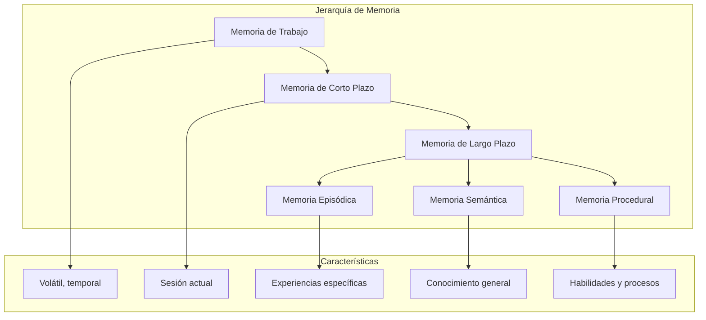
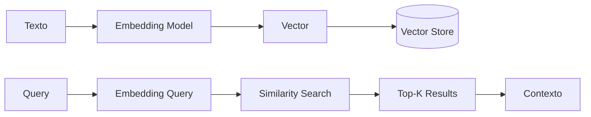
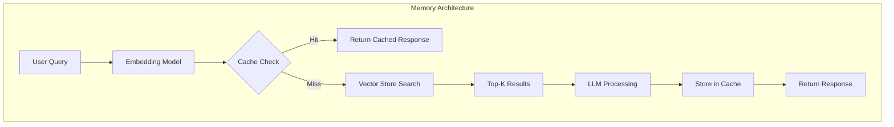
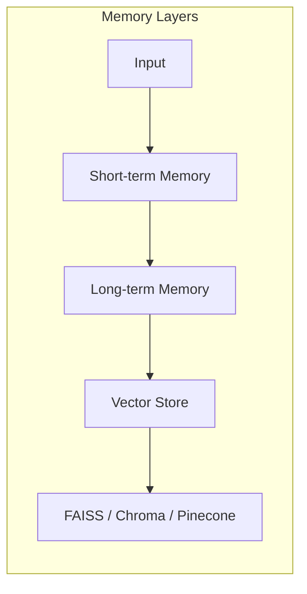

# CLASE 19: Gestión Avanzada de Memoria

## Duración: 4 horas

---

## 1. Objetivos de Aprendizaje

Al finalizar esta clase, el estudiante será capaz de:

- Implementar sistemas de memoria de corto y largo plazo para aplicaciones de IA
- Diseñar y utilizar vector stores para almacenar y recuperar embeddings
- Implementar estrategias de semantic caching
- Optimizar el rendimiento de sistemas de memoria con ChromaDB, FAISS y Pinecone
- Crear pipelines de memoria escalables y de producción
- Evaluar y comparar diferentes soluciones de almacenamiento vectorial

---

## 2. Contenidos Detallados

### 2.1 Fundamentos de la Gestión de Memoria en IA

La gestión de memoria en sistemas basados en LLM es crucial para mantener contexto, mejorar respuestas y crear experiencias de usuario coherentes. A diferencia de la memoria humana, la memoria en IA debe ser diseñada, implementada y mantenida explícitamente.



### 2.2 Memoria de Corto Plazo

La memoria de corto plazo mantiene información relevante durante una sesión activa. En el contexto de LLMs, esto se implementa típicamente mediante buffers de conversación.

```python
"""
Memoria de Corto Plazo con LangChain
=====================================
Implementación de diferentes tipos de memoria transaccional.
"""

from langchain.memory import (
    ConversationBufferMemory,
    ConversationBufferWindowMemory,
    ConversationSummaryMemory,
    CombinedMemory
)
from langchain.chat_models import ChatOpenAI
from langchain.schema import HumanMessage, AIMessage, SystemMessage
from typing import List, Dict, Any

class ShortTermMemoryManager:
    """
    Gestor de memoria de corto plazo para conversaciones.
    
    Proporciona diferentes estrategias de memoria:
    - Buffer simple: Todo el historial
    - Window: Últimos N mensajes
    - Summary: Resúmenes progresivos
    """
    
    def __init__(self, api_key: str):
        self.llm = ChatOpenAI(api_key=api_key, model="gpt-4")
        
    def create_buffer_memory(self) -> ConversationBufferMemory:
        """
        Crea memoria de buffer simple.
        
        Almacena toda la conversación en memoria.
        Ventaja: Conserve toda la información.
        Desventaja: Puede crecer indefinidamente.
        """
        return ConversationBufferMemory(
            memory_key="chat_history",
            output_key="answer",
            return_messages=True
        )
    
    def create_window_memory(self, k: int = 5) -> ConversationBufferWindowMemory:
        """
        Crea memoria de ventana deslizante.
        
        Solo mantiene los últimos k mensajes.
        Ventaja: Control de tamaño fijo.
        Desventaja: Pierde información antigua.
        
        Args:
            k: Número de mensajes a mantener
        """
        return ConversationBufferWindowMemory(
            memory_key="chat_history",
            output_key="answer",
            k=k,
            return_messages=True
        )
    
    def create_summary_memory(self) -> ConversationSummaryMemory:
        """
        Crea memoria con resúmenes.
        
        Genera resúmenes progresivos de la conversación.
        Ventaja: Mantiene esencia de conversación larga.
        Desventaja: Puede perder detalles.
        """
        return ConversationSummaryMemory(
            llm=self.llm,
            memory_key="chat_history",
            output_key="answer",
            return_messages=True
        )
    
    def create_combined_memory(self) -> CombinedMemory:
        """
        Crea memoria combinada.
        
        Combina buffer de mensajes recientes con resumen de históricos.
        """
        buffer = self.create_buffer_memory()
        summary = self.create_summary_memory()
        
        return CombinedMemory(
            memories=[buffer, summary]
        )


class AdvancedConversationBuffer:
    """
    Buffer de conversación avanzado con funcionalidades adicionales.
    
    Características:
    - Metadatos por mensaje
    - Tags y categorías
    - Búsqueda en historial
    - Exportación de contexto
    """
    
    def __init__(self):
        self.messages: List[Dict[str, Any]] = []
        self.tags_index: Dict[str, List[int]] = {}
        
    def add_message(self, role: str, content: str,
                    metadata: Dict[str, Any] = None,
                    tags: List[str] = None) -> int:
        """
        Añade un mensaje al buffer con metadatos y tags.
        
        Args:
            role: 'user', 'assistant', o 'system'
            content: Contenido del mensaje
            metadata: Metadatos adicionales
            tags: Lista de tags para categorización
            
        Returns:
            Índice del mensaje añadido
        """
        message = {
            "role": role,
            "content": content,
            "metadata": metadata or {},
            "tags": tags or [],
            "timestamp": self._get_timestamp()
        }
        
        self.messages.append(message)
        index = len(self.messages) - 1
        
        # Indexar por tags
        for tag in tags or []:
            if tag not in self.tags_index:
                self.tags_index[tag] = []
            self.tags_index[tag].append(index)
            
        return index
    
    def add_user_message(self, content: str, 
                         metadata: Dict[str, Any] = None) -> int:
        """Añade mensaje de usuario."""
        return self.add_message("user", content, metadata)
    
    def add_ai_message(self, content: str,
                        metadata: Dict[str, Any] = None) -> int:
        """Añade mensaje de IA."""
        return self.add_message("assistant", content, metadata)
    
    def get_recent_messages(self, n: int = 10) -> List[Dict]:
        """Obtiene los últimos n mensajes."""
        return self.messages[-n:] if n > 0 else self.messages
    
    def get_messages_by_tag(self, tag: str) -> List[Dict]:
        """Obtiene mensajes filtrados por tag."""
        indices = self.tags_index.get(tag, [])
        return [self.messages[i] for i in indices]
    
    def search_messages(self, query: str) -> List[Dict]:
        """
        Busca mensajes que contengan la query.
        
        Args:
            query: Texto a buscar
            
        Returns:
            Mensajes que coinciden
        """
        query_lower = query.lower()
        return [
            msg for msg in self.messages
            if query_lower in msg["content"].lower()
        ]
    
    def get_context_for_prompt(self, system_prompt: str = None,
                               max_messages: int = None) -> str:
        """
        Genera contexto formateado para usar en prompts.
        
        Args:
            system_prompt: Prompt del sistema a incluir
            max_messages: Máximo de mensajes a incluir
            
        Returns:
            String con contexto formateado
        """
        messages = self.messages
        if max_messages:
            messages = messages[-max_messages:]
            
        context_parts = []
        
        if system_prompt:
            context_parts.append(f"<system>{system_prompt}</system>")
            
        for msg in messages:
            role_tag = {
                "user": "<user>",
                "assistant": "<assistant>",
                "system": "<system>"
            }.get(msg["role"], "<unknown>")
            
            context_parts.append(f"{role_tag}{msg['content']}</{msg['role'].split('_')[0]}>")
            
        return "\n\n".join(context_parts)
    
    def export_to_json(self) -> str:
        """Exporta todo el buffer a JSON."""
        import json
        return json.dumps(self.messages, indent=2, ensure_ascii=False)
    
    def _get_timestamp(self) -> str:
        """Obtiene timestamp actual."""
        from datetime import datetime
        return datetime.now().isoformat()
    
    def clear(self) -> None:
        """Limpia el buffer."""
        self.messages = []
        self.tags_index = {}
```

### 2.3 Memoria de Largo Plazo con Vector Stores

La memoria de largo plazo utiliza vector stores para almacenar y recuperar información basándose en similitud semántica.



#### 2.3.1 ChromaDB: Vector Store Ligero

```python
"""
Implementación de Memoria con ChromaDB
=======================================
Vector store ligero ideal para desarrollo y testing.
"""

import chromadb
from chromadb.config import Settings
from langchain.vectorstores import Chroma
from langchain.embeddings import OpenAIEmbeddings
from langchain.text_splitter import RecursiveCharacterTextSplitter
from langchain.document_loaders import TextLoader, PyPDFLoader
from typing import List, Dict, Any, Optional, Callable
from datetime import datetime
import hashlib

class ChromaMemoryStore:
    """
    Sistema de memoria persistente usando ChromaDB.
    
    Permite:
    - Almacenar recuerdos con metadatos
    - Recuperar por similitud semántica
    - Filtrar por metadatos
    - Actualizar y eliminar recuerdos
    """
    
    def __init__(self, persist_directory: str = "./chroma_memory",
                 collection_name: str = "memory_store"):
        """
        Inicializa el store de memoria.
        
        Args:
            persist_directory: Directorio para persistencia
            collection_name: Nombre de la colección
        """
        self.persist_directory = persist_directory
        self.collection_name = collection_name
        
        # Configurar embeddings
        self.embeddings = OpenAIEmbeddings()
        
        # Inicializar ChromaDB
        self.client = chromadb.PersistentClient(
            path=persist_directory,
            settings=Settings(
                anonymized_telemetry=False,
                allow_reset=True
            )
        )
        
        # Obtener o crear colección
        self.collection = self.client.get_or_create_collection(
            name=collection_name,
            metadata={"description": "Long-term memory store"}
        )
        
        # Inicializar LangChain wrapper
        self.vectorstore = Chroma(
            client=self.client,
            collection_name=collection_name,
            embedding_function=self.embeddings
        )
        
    def add_memory(self, content: str, 
                   memory_type: str = "general",
                   importance: int = 5,
                   tags: List[str] = None,
                   metadata: Dict[str, Any] = None) -> str:
        """
        Añade un recuerdo a la memoria de largo plazo.
        
        Args:
            content: Contenido del recuerdo
            memory_type: Tipo de memoria (fact, preference, experience, etc.)
            importance: Importancia 1-10
            tags: Tags para categorización
            metadata: Metadatos adicionales
            
        Returns:
            ID del recuerdo creado
        """
        # Generar ID único
        memory_id = self._generate_memory_id(content)
        
        # Preparar metadatos
        meta = {
            "memory_type": memory_type,
            "importance": importance,
            "tags": tags or [],
            "created_at": datetime.now().isoformat(),
            **(metadata or {})
        }
        
        # Añadir a colección
        self.collection.add(
            documents=[content],
            ids=[memory_id],
            metadatas=[meta]
        )
        
        return memory_id
    
    def recall(self, query: str, 
               top_k: int = 5,
               memory_type: str = None,
               min_importance: int = None) -> List[Dict]:
        """
        Recupera recuerdos relevantes.
        
        Args:
            query: Query de búsqueda
            top_k: Número de resultados
            memory_type: Filtrar por tipo
            min_importance: Importancia mínima
            
        Returns:
            Lista de recuerdos con scores de similitud
        """
        # Buscar por similitud
        results = self.collection.query(
            query_texts=[query],
            n_results=top_k
        )
        
        # Formatear resultados
        memories = []
        if results["documents"]:
            for i, doc in enumerate(results["documents"][0]):
                meta = results["metadatas"][0][i]
                
                # Filtrar por tipo si se especifica
                if memory_type and meta.get("memory_type") != memory_type:
                    continue
                    
                # Filtrar por importancia
                if min_importance and meta.get("importance", 0) < min_importance:
                    continue
                    
                memories.append({
                    "id": results["ids"][0][i],
                    "content": doc,
                    "relevance": 1 - results["distances"][0][i],  # Convertir distancia a similitud
                    "metadata": meta
                })
                
        return memories
    
    def update_memory(self, memory_id: str, content: str = None,
                       importance: int = None, tags: List[str] = None) -> bool:
        """
        Actualiza un recuerdo existente.
        
        Args:
            memory_id: ID del recuerdo
            content: Nuevo contenido (opcional)
            importance: Nueva importancia (opcional)
            tags: Nuevos tags (opcional)
            
        Returns:
            True si se actualizó, False si no existe
        """
        # Verificar que existe
        existing = self.collection.get(ids=[memory_id])
        if not existing["documents"]:
            return False
            
        # Obtener metadatos actuales
        meta = existing["metadatas"][0]
        
        if content:
            meta["updated_at"] = datetime.now().isoformat()
        if importance is not None:
            meta["importance"] = importance
        if tags is not None:
            meta["tags"] = tags
            
        # Actualizar
        self.collection.update(
            ids=[memory_id],
            documents=[content] if content else existing["documents"],
            metadatas=[meta]
        )
        
        return True
    
    def delete_memory(self, memory_id: str) -> bool:
        """Elimina un recuerdo."""
        try:
            self.collection.delete(ids=[memory_id])
            return True
        except:
            return False
    
    def get_memory_stats(self) -> Dict[str, Any]:
        """Obtiene estadísticas de la memoria."""
        return {
            "total_memories": self.collection.count(),
            "by_type": self._count_by_field("memory_type"),
            "by_importance": self._count_by_field("importance"),
            "persist_directory": self.persist_directory
        }
    
    def _count_by_field(self, field: str) -> Dict[str, int]:
        """Cuenta memorias por un campo de metadatos."""
        all_data = self.collection.get()
        counts = {}
        
        for meta in all_data["metadatas"]:
            value = str(meta.get(field, "unknown"))
            counts[value] = counts.get(value, 0) + 1
            
        return counts
    
    def _generate_memory_id(self, content: str) -> str:
        """Genera ID único basado en hash del contenido."""
        hash_obj = hashlib.md5(
            f"{content}{datetime.now().isoformat()}".encode()
        )
        return f"mem_{hash_obj.hexdigest()[:12]}"
    
    def semantic_search(self, query: str, 
                        filter_func: Callable = None) -> List[Dict]:
        """
        Búsqueda semántica avanzada con filtro personalizado.
        
        Args:
            query: Query de búsqueda
            filter_func: Función que recibe metadata y retorna bool
            
        Returns:
            Resultados filtrados
        """
        results = self.recall(query, top_k=20)
        
        if filter_func:
            results = [r for r in results if filter_func(r["metadata"])]
            
        return results[:10]


# Integración con LangChain
def create_memory_retriever(chroma_store: ChromaMemoryStore,
                             memory_type: str = None,
                             top_k: int = 5):
    """
    Crea un retriever compatible con LangChain.
    
    Args:
        chroma_store: Instancia de ChromaMemoryStore
        memory_type: Filtrar por tipo de memoria
        top_k: Número de resultados
        
    Returns:
        Retriever de LangChain
    """
    return chroma_store.vectorstore.as_retriever(
        search_kwargs={
            "k": top_k,
            "filter": {"memory_type": memory_type} if memory_type else None
        }
    )
```

#### 2.3.2 FAISS: Vector Store de Alto Rendimiento

```python
"""
Implementación de Memoria con FAISS
===================================
Vector store optimizado para búsquedas de alta velocidad.
"""

import faiss
import numpy as np
from typing import List, Dict, Any, Tuple, Optional
import pickle
from pathlib import Path

class FAISSMemoryIndex:
    """
    Índice de memoria usando FAISS para búsqueda de similitud eficiente.
    
    FAISS es ideal para:
    - Grandes volúmenes de vectores
    - Búsquedas en tiempo real
    - Implementación de producción
    """
    
    def __init__(self, dimension: int = 1536, 
                 index_type: str = "IP",
                 metric: str = "cosine"):
        """
        Inicializa el índice FAISS.
        
        Args:
            dimension: Dimensión de los embeddings
            index_type: Tipo de índice (IVF, HNSW, etc.)
            metric: Métrica de similitud (cosine, euclidean, inner_product)
        """
        self.dimension = dimension
        self.metric = metric
        
        # Normalizar vectores para similitud coseno
        self.normalize = metric == "cosine"
        
        # Crear índice según tipo
        if index_type == "flat":
            if metric == "cosine" or metric == "IP":
                self.index = faiss.IndexFlatIP(dimension)
            else:
                self.index = faiss.IndexFlatL2(dimension)
        elif index_type == "IVF":
            quantizer = faiss.IndexFlatIP(dimension)
            nlist = 100  # Número de clusters
            self.index = faiss.IndexIVFFlat(quantizer, dimension, nlist)
        elif index_type == "HNSW":
            self.index = faiss.IndexHNSWFlat(dimension, 32)
        else:
            raise ValueError(f"Tipo de índice no soportado: {index_type}")
            
        self.id_to_metadata: Dict[int, Dict[str, Any]] = {}
        self.id_counter = 0
        self.is_trained = not index_type.startswith("IVF")
        
    def add_vectors(self, vectors: np.ndarray, 
                    metadata: List[Dict[str, Any]]) -> List[int]:
        """
        Añade vectores al índice.
        
        Args:
            vectors: Array numpy de vectores (n, dimension)
            metadata: Lista de metadatos correspondientes
            
        Returns:
            Lista de IDs asignados
        """
        if len(vectors) != len(metadata):
            raise ValueError("Número de vectores debe igualar número de metadatos")
            
        # Normalizar si es similitud coseno
        if self.normalize:
            vectors = self._normalize(vectors)
            
        # Entrenar si es necesario (IVF)
        if hasattr(self.index, "is_trained") and not self.index.is_trained:
            self.index.train(vectors)
            self.is_trained = True
            
        # Añadir al índice
        start_id = self.id_counter
        ids = list(range(start_id, start_id + len(vectors)))
        
        vectors = vectors.astype('float32')
        self.index.add(vectors)
        
        # Guardar metadatos
        for i, meta in enumerate(metadata):
            self.id_to_metadata[start_id + i] = meta
            
        self.id_counter += len(vectors)
        
        return ids
    
    def search(self, query_vector: np.ndarray, k: int = 5) -> List[Tuple[int, float, Dict]]:
        """
        Busca los k vectores más similares.
        
        Args:
            query_vector: Vector de consulta
            k: Número de resultados
            
        Returns:
            Lista de tuplas (id, distancia, metadatos)
        """
        if not self.is_trained:
            raise RuntimeError("Índice no entrenado. Añade vectores primero.")
            
        # Normalizar si es necesario
        if self.normalize:
            query_vector = self._normalize(query_vector.reshape(1, -1))[0]
            
        query_vector = query_vector.reshape(1, -1).astype('float32')
        
        # Buscar
        distances, indices = self.index.search(query_vector, k)
        
        # Formatear resultados
        results = []
        for dist, idx in zip(distances[0], indices[0]):
            if idx >= 0 and idx in self.id_to_metadata:
                # Convertir distancia a similitud si es necesario
                similarity = dist if self.metric != "cosine" else dist
                results.append((idx, float(similarity), self.id_to_metadata[idx]))
                
        return results
    
    def save(self, path: str) -> None:
        """
        Guarda el índice y metadatos en disco.
        
        Args:
            path: Ruta base para guardar
        """
        path = Path(path)
        path.parent.mkdir(parents=True, exist_ok=True)
        
        # Guardar índice
        faiss.write_index(self.index, str(path.with_suffix(".index")))
        
        # Guardar metadatos
        with open(path.with_suffix(".meta"), "wb") as f:
            pickle.dump({
                "id_to_metadata": self.id_to_metadata,
                "id_counter": self.id_counter,
                "dimension": self.dimension,
                "metric": self.metric
            }, f)
            
    def load(self, path: str) -> None:
        """
        Carga el índice y metadatos desde disco.
        
        Args:
            path: Ruta base del archivo
        """
        path = Path(path)
        
        # Cargar índice
        self.index = faiss.read_index(str(path.with_suffix(".index")))
        
        # Cargar metadatos
        with open(path.with_suffix(".meta"), "rb") as f:
            data = pickle.load(f)
            self.id_to_metadata = data["id_to_metadata"]
            self.id_counter = data["id_counter"]
            self.dimension = data["dimension"]
            self.metric = data["metric"]
            
        self.is_trained = True
        
    def _normalize(self, vectors: np.ndarray) -> np.ndarray:
        """Normaliza vectores para similitud coseno."""
        norms = np.linalg.norm(vectors, axis=1, keepdims=True)
        norms = np.where(norms == 0, 1, norms)
        return vectors / norms
    
    def get_stats(self) -> Dict[str, Any]:
        """Obtiene estadísticas del índice."""
        return {
            "total_vectors": self.id_counter,
            "dimension": self.dimension,
            "metric": self.metric,
            "index_type": type(self.index).__name__,
            "is_trained": self.is_trained
        }
```

#### 2.3.3 Pinecone: Vector Store Cloud

```python
"""
Implementación de Memoria con Pinecone
======================================
Vector store gestionado para aplicaciones cloud y producción.
"""

from pinecone import Pinecone, ServerlessSpec
from typing import List, Dict, Any, Optional
import os
from datetime import datetime

class PineconeMemoryStore:
    """
    Sistema de memoria usando Pinecone para escalabilidad cloud.
    
    Ventajas:
    - Escalabilidad automática
    - Alta disponibilidad
    - Sin gestión de infraestructura
    - Búsquedas rápidas globales
    """
    
    def __init__(self, api_key: str, environment: str = "us-east-1",
                 index_name: str = "memory-store"):
        """
        Inicializa el cliente Pinecone.
        
        Args:
            api_key: Clave API de Pinecone
            environment: Entorno de Pinecone
            index_name: Nombre del índice
        """
        self.pc = Pinecone(api_key=api_key)
        self.index_name = index_name
        
        # Verificar o crear índice
        if index_name not in [i.name for i in self.pc.list_indexes()]:
            self._create_index()
            
        self.index = self.pc.Index(index_name)
        
    def _create_index(self, dimension: int = 1536) -> None:
        """Crea el índice si no existe."""
        self.pc.create_index(
            name=self.index_name,
            dimension=dimension,
            metric="cosine",
            spec=ServerlessSpec(
                cloud="aws",
                region="us-east-1"
            )
        )
        
    def upsert_memories(self, memories: List[Dict[str, Any]],
                        namespace: str = "") -> None:
        """
        Inserta o actualiza memorias.
        
        Args:
            memories: Lista de memorias con id, content, metadata, embedding
            namespace: Namespace para separación de datos
        """
        vectors = []
        
        for memory in memories:
            vectors.append({
                "id": memory["id"],
                "values": memory["embedding"],
                "metadata": {
                    "content": memory["content"],
                    "created_at": memory.get("created_at", datetime.now().isoformat()),
                    **memory.get("metadata", {})
                }
            })
            
        self.index.upsert(vectors=vectors, namespace=namespace)
        
    def query(self, vector: List[float], top_k: int = 5,
              namespace: str = "",
              filter_dict: Dict = None,
              include_metadata: bool = True) -> List[Dict]:
        """
        Consulta el índice.
        
        Args:
            vector: Vector de embedding
            top_k: Número de resultados
            namespace: Namespace específico
            filter_dict: Filtros de metadatos
            include_metadata: Incluir metadatos en respuesta
            
        Returns:
            Lista de resultados
        """
        response = self.index.query(
            vector=vector,
            top_k=top_k,
            namespace=namespace,
            filter=filter_dict,
            include_metadata=include_metadata
        )
        
        return [
            {
                "id": match["id"],
                "score": match["score"],
                "metadata": match.get("metadata", {})
            }
            for match in response["matches"]
        ]
    
    def delete(self, ids: List[str], namespace: str = "") -> None:
        """Elimina vectores por ID."""
        self.index.delete(ids=ids, namespace=namespace)
        
    def describe_index(self) -> Dict[str, Any]:
        """Obtiene estadísticas del índice."""
        stats = self.index.describe_index_stats()
        return {
            "total_vectors": stats.total_vector_count,
            "dimension": stats.dimension,
            "namespaces": stats.namespaces
        }
```

### 2.4 Semantic Caching

El semantic caching mejora el rendimiento almacenando respuestas a queries similares.

```python
"""
Sistema de Semantic Caching
============================
Implementación de caché semántico para reducir llamadas a LLM.
"""

from typing import Dict, Any, Optional, List, Tuple
import hashlib
import numpy as np
from dataclasses import dataclass
from datetime import datetime, timedelta
import json

@dataclass
class CacheEntry:
    """Entrada del caché."""
    query: str
    query_vector: np.ndarray
    response: str
    metadata: Dict[str, Any]
    created_at: datetime
    access_count: int
    last_accessed: datetime
    
class SemanticCache:
    """
    Caché semántico que almacena respuestas basadas en similitud.
    
    Características:
    - Búsqueda por similitud de queries
    - TTL configurable
    - Métricas de hit rate
    - Invalidación inteligente
    """
    
    def __init__(self, similarity_threshold: float = 0.95,
                 max_entries: int = 1000,
                 ttl_hours: int = 24):
        """
        Inicializa el caché semántico.
        
        Args:
            similarity_threshold: Similitud mínima para hit (0-1)
            max_entries: Máximo de entradas en caché
            ttl_hours: Tiempo de vida en horas
        """
        self.similarity_threshold = similarity_threshold
        self.max_entries = max_entries
        self.ttl = timedelta(hours=ttl_hours)
        
        self.cache: Dict[str, CacheEntry] = {}
        self.hits = 0
        self.misses = 0
        
    def get(self, query: str, query_vector: np.ndarray) -> Optional[str]:
        """
        Obtiene una respuesta del caché si existe una similar.
        
        Args:
            query: Query original
            query_vector: Vector de embedding de la query
            
        Returns:
            Respuesta en caché o None
        """
        # Buscar entrada similar
        best_match = None
        best_similarity = 0
        
        for key, entry in self.cache.items():
            # Verificar TTL
            if datetime.now() - entry.created_at > self.ttl:
                continue
                
            # Calcular similitud
            similarity = self._cosine_similarity(query_vector, entry.query_vector)
            
            if similarity > best_similarity:
                best_similarity = similarity
                best_match = entry
                
        if best_match and best_similarity >= self.similarity_threshold:
            self.hits += 1
            best_match.access_count += 1
            best_match.last_accessed = datetime.now()
            return best_match.response
            
        self.misses += 1
        return None
    
    def put(self, query: str, query_vector: np.ndarray,
            response: str, metadata: Dict[str, Any] = None) -> str:
        """
        Almacena una respuesta en el caché.
        
        Args:
            query: Query original
            query_vector: Vector de embedding
            response: Respuesta a almacenar
            metadata: Metadatos adicionales
            
        Returns:
            Clave del caché asignada
        """
        # Limpiar entradas antiguas si estamos al límite
        if len(self.cache) >= self.max_entries:
            self._evict_oldest()
            
        # Generar clave
        cache_key = self._generate_key(query)
        
        # Crear entrada
        entry = CacheEntry(
            query=query,
            query_vector=query_vector.copy(),
            response=response,
            metadata=metadata or {},
            created_at=datetime.now(),
            access_count=1,
            last_accessed=datetime.now()
        )
        
        self.cache[cache_key] = entry
        return cache_key
    
    def invalidate(self, query: str) -> bool:
        """Invalida una entrada específica."""
        key = self._generate_key(query)
        if key in self.cache:
            del self.cache[key]
            return True
        return False
    
    def clear(self) -> None:
        """Limpia todo el caché."""
        self.cache = {}
        self.hits = 0
        self.misses = 0
        
    def get_stats(self) -> Dict[str, Any]:
        """Obtiene estadísticas del caché."""
        total = self.hits + self.misses
        hit_rate = self.hits / total if total > 0 else 0
        
        return {
            "total_entries": len(self.cache),
            "max_entries": self.max_entries,
            "hits": self.hits,
            "misses": self.misses,
            "hit_rate": f"{hit_rate:.2%}",
            "total_requests": total
        }
    
    def _cosine_similarity(self, v1: np.ndarray, v2: np.ndarray) -> float:
        """Calcula similitud coseno entre vectores."""
        dot = np.dot(v1, v2)
        norm1 = np.linalg.norm(v1)
        norm2 = np.linalg.norm(v2)
        
        if norm1 == 0 or norm2 == 0:
            return 0
            
        return dot / (norm1 * norm2)
    
    def _generate_key(self, query: str) -> str:
        """Genera clave hash para la query."""
        return hashlib.sha256(query.encode()).hexdigest()[:16]
    
    def _evict_oldest(self) -> None:
        """Elimina la entrada más antigua."""
        if not self.cache:
            return
            
        oldest_key = min(
            self.cache.keys(),
            key=lambda k: self.cache[k].last_accessed
        )
        del self.cache[oldest_key]


class CachedLLMChain:
    """
    Chain de LLM con caché semántico integrado.
    
    reduce costos y latencia almacenando respuestas a queries similares.
    """
    
    def __init__(self, llm, embeddings, cache: SemanticCache = None):
        """
        Inicializa el chain con caché.
        
        Args:
            llm: Instancia de LLM
            embeddings: Modelo de embeddings
            cache: Instancia de SemanticCache (crea nueva si no se provee)
        """
        self.llm = llm
        self.embeddings = embeddings
        self.cache = cache or SemanticCache()
        
    def invoke(self, query: str, **kwargs) -> Dict[str, Any]:
        """
        Ejecuta el chain con caché.
        
        Args:
            query: Query del usuario
            **kwargs: Argumentos adicionales para el LLM
            
        Returns:
            Diccionario con respuesta y metadatos de caché
        """
        # Generar embedding de la query
        query_vector = np.array(self.embeddings.embed_query(query))
        
        # Verificar caché
        cached_response = self.cache.get(query, query_vector)
        
        if cached_response:
            return {
                "response": cached_response,
                "cached": True,
                "cache_stats": self.cache.get_stats()
            }
            
        # Ejecutar LLM
        response = self.llm.invoke(query, **kwargs)
        response_text = response.content if hasattr(response, 'content') else str(response)
        
        # Almacenar en caché
        self.cache.put(query, query_vector, response_text)
        
        return {
            "response": response_text,
            "cached": False,
            "cache_stats": self.cache.get_stats()
        }
    
    def invalidate_context(self, context: str) -> int:
        """
        Invalida entradas del caché relacionadas con un contexto.
        
        Args:
            context: Texto de contexto
            
        Returns:
            Número de entradas invalidadas
        """
        invalidated = 0
        context_lower = context.lower()
        
        for key in list(self.cache.cache.keys()):
            entry = self.cache.cache[key]
            if context_lower in entry.query.lower():
                self.cache.invalidate(entry.query)
                invalidated += 1
                
        return invalidated
```

---

## 3. Diagramas de Arquitectura





---

## 4. Ejercicios Prácticos Resueltos

### Ejercicio: Implementar Sistema de Memoria Completo

```python
"""
Ejercicio: Implementar sistema de memoria con múltiples capas.
"""

from typing import List, Dict, Any

class MultiLayerMemory:
    """
    Sistema de memoria con múltiples capas:
    1. Working Memory (buffers)
    2. Short-term Memory (sesión)
    3. Long-term Memory (vectores)
    """
    
    def __init__(self, short_term_limit: int = 10):
        self.working_memory = {}  # Variables temporales
        self.short_term: List[Dict] = []  # Mensajes recientes
        self.short_term_limit = short_term_limit
        
    def store_fact(self, key: str, value: Any) -> None:
        """Almacena un hecho en memoria de trabajo."""
        self.working_memory[key] = value
        
    def recall_fact(self, key: str) -> Any:
        """Recupera un hecho de memoria de trabajo."""
        return self.working_memory.get(key)
    
    def add_to_short_term(self, item: Dict) -> None:
        """Añade un item a memoria de corto plazo."""
        self.short_term.append(item)
        if len(self.short_term) > self.short_term_limit:
            self.short_term.pop(0)
            
    def get_context_window(self) -> List[Dict]:
        """Obtiene la ventana de contexto actual."""
        return self.short_term.copy()
    
    def consolidate_to_long_term(self, vector_store, 
                                  importance_threshold: float = 0.7) -> int:
        """
        Consolida memoria de corto a largo plazo.
        
        Args:
            vector_store: Vector store de largo plazo
            importance_threshold: Umbral de importancia para guardar
            
        Returns:
            Número de items consolidados
        """
        consolidated = 0
        
        for item in self.short_term:
            if item.get("importance", 0) >= importance_threshold:
                vector_store.add_memory(
                    content=item["content"],
                    memory_type=item.get("type", "general"),
                    importance=item.get("importance", 5),
                    metadata={"consolidated_from": "short_term"}
                )
                consolidated += 1
                
        # Limpiar short term después de consolidar
        self.short_term = []
        
        return consolidated


# EJEMPLO DE USO
if __name__ == "__main__":
    # Crear sistema de memoria
    memory = MultiLayerMemory(short_term_limit=5)
    
    # Almacenar hechos en memoria de trabajo
    memory.store_fact("project_name", "Sistema de Gestión")
    memory.store_fact("language", "Python")
    
    # Añadir a short-term
    memory.add_to_short_term({
        "type": "decision",
        "content": "Usaremos PostgreSQL como base de datos principal",
        "importance": 0.9,
        "timestamp": "2024-01-15T10:00:00Z"
    })
    
    memory.add_to_short_term({
        "type": "preference",
        "content": "Usuario prefiere respuestas concisas",
        "importance": 0.6,
        "timestamp": "2024-01-15T10:05:00Z"
    })
    
    # Ver memoria actual
    print("=== Working Memory ===")
    print(f"project_name: {memory.recall_fact('project_name')}")
    print(f"language: {memory.recall_fact('language')}")
    
    print("\n=== Short-term Memory ===")
    for item in memory.get_context_window():
        print(f"- [{item['type']}] {item['content']} (importance: {item['importance']})")
```

---

## 5. Actividades de Laboratorio

### Laboratorio 1: Implementar Semantic Cache

**Duración**: 90 minutos

Crear un sistema de caché semántico que almacene respuestas a queries similares usando ChromaDB.

### Laboratorio 2: Pipeline de Memoria Multi-Capa

**Duración**: 90 minutos

Implementar un pipeline completo con:
- Working memory
- Short-term con ventana deslizante
- Long-term con vector store

### Laboratorio 3: Benchmark de Vector Stores

**Duración**: 60 minutos

Comparar rendimiento de ChromaDB, FAISS y Pinecone con diferentes volúmenes de datos.

---

## 6. Resumen de Puntos Clave

| Concepto | Descripción |
|----------|-------------|
| **Short-term Memory** | Buffer de conversación, se pierde entre sesiones |
| **Long-term Memory** | Persistencia en vector stores |
| **Semantic Cache** | Almacena respuestas a queries similares |
| **Vector Store** | Base de datos optimizada para búsqueda por similitud |
| **Embedding** | Representación vectorial de texto |

| Vector Store | Mejor para | Ventajas |
|--------------|------------|----------|
| **ChromaDB** | Desarrollo, prototyping | Ligero, fácil de usar |
| **FAISS** | Alta velocidad, producción | Muy rápido, control total |
| **Pinecone** | Cloud, escalabilidad | Gestionado, global |

---

## 7. Referencias Externas

1. **LangChain Memory Module** - https://python.langchain.com/docs/modules/memory/
2. **ChromaDB Documentation** - https://docs.trychroma.com/
3. **FAISS GitHub** - https://github.com/facebookresearch/faiss
4. **Pinecone Documentation** - https://docs.pinecone.io/
5. **Vector Database Comparison** - https://www.anyscale.com/blog/comparing-vector-databases

---

*Última actualización: Clase 19 - Semana 10*
