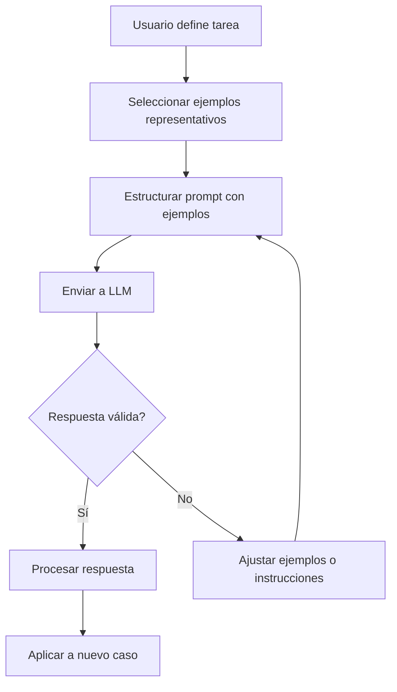
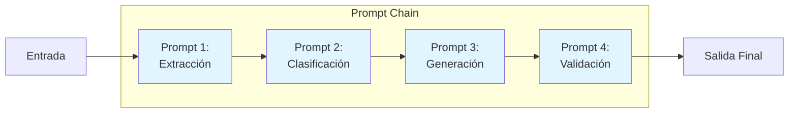
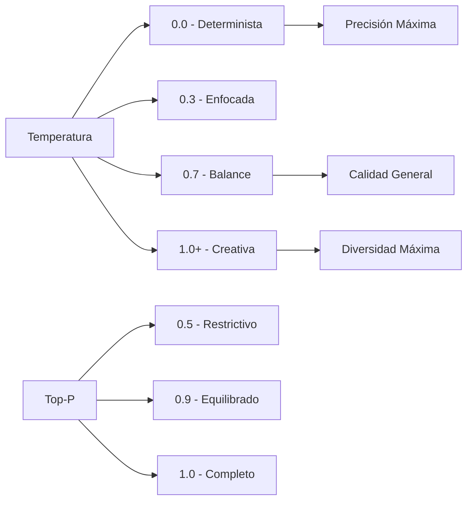

# Clase 20: Ingeniería de Prompts Avanzada

## Duración
4 horas

## Objetivos de Aprendizaje
- Comprender y aplicar técnicas avanzadas de few-shot learning en la ingeniería de prompts
- Dominar el encadenamiento de prompts (prompt chaining) para tareas complejas
- Configurar correctamente parámetros de temperatura y top-p para diferentes casos de uso
- Implementar estrategias de chain prompting para mejorar la calidad de las respuestas
- Integrar APIs de OpenAI y Anthropic para aplicaciones empresariales

## Contenidos Detallados

### 1. Fundamentos de Few-Shot Learning

El few-shot learning es una técnica fundamental en la ingeniería de prompts que permite que un modelo de lenguaje aprenda a realizar una tarea con solo unos pocos ejemplos (shots) proporcionados en el propio prompt. A diferencia del few-shot learning tradicional en machine learning, que requiere ajuste fino del modelo, el few-shot learning en prompts aprovecha la capacidad del modelo para generalizar a partir de ejemplos en contexto.

#### Conceptos Clave

La efectividad del few-shot learning se basa en la capacidad del modelo para identificar patrones en los ejemplos proporcionados y aplicarlos a nuevos casos. Los elementos esenciales incluyen:

- **Ejemplos representativos**: Deben cubrir diferentes casos y variaciones de la tarea
- **Formato consistente**: Los ejemplos deben seguir una estructura clara y predecible
- **Instrucciones claras**: El prompt debe indicar explícitamente qué se espera
- **Cantidad óptima**: Generalmente 3-5 ejemplos son suficientes

#### Estructura del Prompt con Few-Shot

Un prompt con few-shot learning típico sigue esta estructura:

```
Tarea: [Descripción de la tarea]
Ejemplos:
1. Entrada: [Ejemplo 1 entrada]
   Salida: [Ejemplo 1 salida]
2. Entrada: [Ejemplo 2 entrada]
   Salida: [Ejemplo 2 salida]
3. Entrada: [Ejemplo 3 entrada]
   Salida: [Ejemplo 3 salida]
Nueva entrada: [Entrada a procesar]
```

### 2. Chain Prompting y Prompt Chaining

El encadenamiento de prompts es una técnica avanzada que divide tareas complejas en una secuencia de pasos, donde cada prompt depende de la salida del anterior. Esta aproximación permite:

- Manejar tareas multi-paso de manera más precisa
- Facilitar la depuración y mejora de cada etapa
- Reducir la carga cognitiva en cada interacción individual
- Mejorar la trazabilidad del proceso

#### Chain Prompting vs Prompt Chaining

Es importante distinguir entre这两种 técnicas:

**Chain Prompting** se refiere a encadenar múltiples prompts secuencialmente donde cada uno procesa la salida del anterior:

```
Prompt 1 → Procesamiento inicial → 
Prompt 2 → Refinamiento → 
Prompt 3 → Resultado final
```

**Prompt Chaining** implica descomponer una tarea compleja en subtareas más pequeñas que se ejecutan independientemente y luego se combinan:

```
[Subtarea A]  →  [Subtarea B]  →  [Combinación]
      ↓              ↓
[Resultado 1]  [Resultado 2]
```

### 3. Parámetros de Temperatura y Top-P

#### Temperatura

El parámetro de temperatura controla la aleatoriedad de las respuestas del modelo:

- **Temperatura 0**: Respuestas deterministas, siempre elige el token más probable
- **Temperatura 0.7**: Balance entre creatividad y coherencia (recomendado para mayoría de casos)
- **Temperatura 1.0**: Mayor diversidad, respuestas más creativas pero potencialmente menos precisas
- **Temperatura > 1.0**: Alta aleatoriedad, respuestas menos coherentes

La temperatura se relaciona con la distribución de probabilidad de los tokens mediante la fórmula:

```
P(token_i) = exp(logit_i / temperatura) / sum(exp(logit_j / temperatura))
```

#### Top-P (Nucleus Sampling)

Top-p selecciona tokens cuya probabilidad acumulada supera el umbral p especificado:

```
Top-p = 0.9: Selecciona tokens hasta alcanzar 90% de probabilidad acumulada
```

A diferencia de top-k (que selecciona siempre los k tokens más probables), top-p adapta dinámicamente el número de tokens considerados basándose en la distribución de probabilidad.

#### Guía de Configuración

| Caso de Uso | Temperatura | Top-P | Justificación |
|------------|-------------|-------|---------------|
| Generación de código | 0.2 - 0.4 | 0.95 | Precisión y consistencia |
| Resúmenes | 0.3 - 0.5 | 0.9 | Equilibrio entre precisión y variación |
| Creatividad/Storytelling | 0.7 - 0.9 | 0.95 | Máxima diversidad |
| Clasificación | 0.0 - 0.2 | 0.9 | Resultados deterministas |
| Resolución de problemas | 0.4 - 0.6 | 0.9 | Balance guía-creatividad |

### 4. Integración con OpenAI y Anthropic API

#### OpenAI API

```python
import openai
from openai import OpenAI

client = OpenAI(api_key="tu-api-key")

def chat_with_temperature(system_prompt, user_prompt, temperature=0.7, max_tokens=2000):
    response = client.chat.completions.create(
        model="gpt-4o",
        messages=[
            {"role": "system", "content": system_prompt},
            {"role": "user", "content": user_prompt}
        ],
        temperature=temperature,
        max_tokens=max_tokens,
        top_p=0.95,
        frequency_penalty=0.0,
        presence_penalty=0.0
    )
    return response.choices[0].message.content
```

#### Anthropic API

```python
import anthropic

client = anthropic.Anthropic(api_key="tu-api-key")

def claude_chat(system_prompt, user_prompt, temperature=0.7, max_tokens=4096):
    response = client.messages.create(
        model="claude-3-5-sonnet-20241022",
        max_tokens=max_tokens,
        system=system_prompt,
        messages=[
            {"role": "user", "content": user_prompt}
        ],
        temperature=temperature,
        top_p=0.9,
        top_k=50
    )
    return response.content[0].text
```

## Diagramas en Mermaid

### Flujo de Few-Shot Learning



### Arquitectura de Prompt Chaining



### Relación Temperatura-Creatividad



## Referencias Externas

1. **OpenAI API Documentation**: https://platform.openai.com/docs/api-reference
2. **Anthropic Claude API**: https://docs.anthropic.com/en/docs/api-reference
3. **Few-Shot Learning in LLMs - Paper**: https://arxiv.org/abs/2005.14165
4. **Prompt Engineering Guide**: https://www.promptengineering.org/
5. **Anthropic Temperature Guide**: https://docs.anthropic.com/en/docs/claude-api/beta-features/temperature

## Ejercicios Prácticos Resueltos

### Ejercicio 1: Sistema de Clasificación de Sentimientos con Few-Shot

**Enunciado**: Crear un clasificador de sentimientos que use few-shot learning para clasificar reseñas de productos en categorías: positivo, negativo, neutral.

**Solución**:

```python
import openai
from openai import OpenAI
import json

client = OpenAI(api_key="tu-api-key")

# Prompt con few-shot learning
SYSTEM_PROMPT = """Eres un clasificador de sentimientos de reseñas de productos.
Clasifica cada reseña en una de estas categorías: positivo, negativo, neutral.
Responde únicamente con la categoría en lowercase."""

FEW_SHOT_EXAMPLES = """
Ejemplos de clasificación:

Reseña: "Este producto es increíblemte, supera todas mis expectativas. ¡Recomendado!"
Categoría: positivo

Reseña: "Llegó tarde y además estaba dañado. Muy mala experiencia."
Categoría: negativo

Reseña: "El producto funciona como se esperaba. Nada excepcional."
Categoría: neutral
"""

def classify_sentiment(review: str) -> str:
    user_prompt = f"{FEW_SHOT_EXAMPLES}\n\nReseña: {review}\nCategoría:"
    
    response = client.chat.completions.create(
        model="gpt-4o",
        messages=[
            {"role": "system", "content": SYSTEM_PROMPT},
            {"role": "user", "content": user_prompt}
        ],
        temperature=0.0,  # Para clasificación, queremos determinismo
        max_tokens=10
    )
    
    return response.choices[0].message.content.strip()

# Prueba del sistema
test_reviews = [
    "¡El mejor'achat que he hecho! Funciona perfectamente.",
    "Terrible, se rompió en una semana.",
    "Aceptable para el precio que tiene."
]

for review in test_reviews:
    result = classify_sentiment(review)
    print(f"Reseña: {review}")
    print(f"Clasificación: {result}\n")
```

**Explicación**:
- Usamos temperatura 0 para obtener resultados consistentes
- Los ejemplos few-shot demuestran el formato de salida esperado
- El modelo generaliza el patrón a nuevas reseñas

### Ejercicio 2: Sistema de Prompt Chaining para Análisis de Documentos

**Enunciado**: Implementar un sistema que analice documentos técnicos extrayendo entidades, clasificando el contenido y generando un resumen.

**Solución**:

```python
import openai
from openai import OpenAI
from typing import Dict, List, Any

client = OpenAI(api_key="tu-api-key")

class DocumentAnalyzer:
    def __init__(self):
        self.chain_results = {}
    
    def step1_extract_entities(self, document: str) -> Dict[str, Any]:
        """Paso 1: Extracción de entidades"""
        prompt = f"""Extrae las siguientes entidades del documento:
- Personas mencionadas
- Organizaciones
- Fechas importantes
- Tecnologías mencionadas
- Acrónimos y definiciones

Documento:
{document}

Formato de respuesta (JSON):
{{
    "personas": [],
    "organizaciones": [],
    "fechas": [],
    "tecnologias": [],
    "acronimos": {{}}
}}"""
        
        response = client.chat.completions.create(
            model="gpt-4o",
            messages=[{"role": "user", "content": prompt}],
            temperature=0.2,
            response_format={"type": "json_object"}
        )
        
        self.chain_results['entities'] = response.choices[0].message.content
        return self.chain_results['entities']
    
    def step2_classify_content(self, document: str) -> Dict[str, Any]:
        """Paso 2: Clasificación del contenido"""
        prompt = f"""Clasifica el documento en las siguientes categorías:
- Dominio principal (ej: desarrollo, seguridad, datos, etc.)
- Nivel técnico (básico, intermedio, avanzado)
- Propósito (tutorial, documentación, investigación, etc.)
- Audiencia objetivo

Documento:
{document[:1000]}...

Formato JSON:
{{
    "dominio": "",
    "nivel": "",
    "proposito": "",
    "audiencia": ""
}}"""
        
        response = client.chat.completions.create(
            model="gpt-4o",
            messages=[{"role": "user", "content": prompt}],
            temperature=0.3,
            response_format={"type": "json_object"}
        )
        
        self.chain_results['classification'] = response.choices[0].message.content
        return self.chain_results['classification']
    
    def step3_generate_summary(self, document: str) -> str:
        """Paso 3: Generación de resumen"""
        context = f"Entidades: {self.chain_results.get('entities', '')}\nClasificación: {self.chain_results.get('classification', '')}"
        
        prompt = f"""Genera un resumen ejecutivo del documento:
- Máximo 200 palabras
- Incluir las entidades clave
- Indicar el propósito principal

Contexto adicional:
{context}

Documento:
{document}
"""
        
        response = client.chat.completions.create(
            model="gpt-4o",
            messages=[{"role": "user", "content": prompt}],
            temperature=0.5,
            max_tokens=500
        )
        
        self.chain_results['summary'] = response.choices[0].message.content
        return self.chain_results['summary']
    
    def analyze(self, document: str) -> Dict[str, Any]:
        """Ejecutar análisis completo"""
        self.step1_extract_entities(document)
        self.step2_classify_content(document)
        self.step3_generate_summary(document)
        
        return {
            "entities": self.chain_results['entities'],
            "classification": self.chain_results['classification'],
            "summary": self.chain_results['summary']
        }

# Ejemplo de uso
sample_doc = """
El proyecto Alpha se inició en enero de 2024 con el objetivo de implementar 
un sistema de machine learning para predicción de demanda. El equipo de 
Stanford Research Institute colaboró con Python y TensorFlow para desarrollar 
los modelos. Los resultados demuestran una mejora del 35% en precisión.
"""

analyzer = DocumentAnalyzer()
results = analyzer.analyze(sample_doc)
print(json.dumps(results, indent=2))
```

### Ejercicio 3: Configuración Dinámica de Temperatura

**Enunciado**: Crear un sistema que ajuste dinámicamente la temperatura según el tipo de tarea.

**Solución**:

```python
import openai
from openai import OpenAI
from enum import Enum
from typing import Callable
from dataclasses import dataclass

client = OpenAI(api_key="tu-api-key")

class TaskType(Enum):
    CODE_GENERATION = "code_generation"
    CREATIVE_WRITING = "creative_writing"
    CLASSIFICATION = "classification"
    SUMMARIZATION = "summarization"
    PROBLEM_SOLVING = "problem_solving"
    TRANSLATION = "translation"

@dataclass
class TaskConfig:
    temperature: float
    top_p: float
    max_tokens: int
    
TASK_CONFIGS = {
    TaskType.CODE_GENERATION: TaskConfig(temperature=0.2, top_p=0.95, max_tokens=4000),
    TaskType.CREATIVE_WRITING: TaskConfig(temperature=0.8, top_p=0.95, max_tokens=2000),
    TaskType.CLASSIFICATION: TaskConfig(temperature=0.0, top_p=0.9, max_tokens=100),
    TaskType.SUMMARIZATION: TaskConfig(temperature=0.4, top_p=0.9, max_tokens=1000),
    TaskType.PROBLEM_SOLVING: TaskConfig(temperature=0.5, top_p=0.9, max_tokens=2000),
    TaskType.TRANSLATION: TaskConfig(temperature=0.3, top_p=0.95, max_tokens=3000),
}

class AdaptiveLLM:
    def __init__(self):
        self.client = client
    
    def generate(self, prompt: str, task_type: TaskType, 
                 system_prompt: str = None) -> str:
        config = TASK_CONFIGS[task_type]
        
        messages = []
        if system_prompt:
            messages.append({"role": "system", "content": system_prompt})
        messages.append({"role": "user", "content": prompt})
        
        response = self.client.chat.completions.create(
            model="gpt-4o",
            messages=messages,
            temperature=config.temperature,
            top_p=config.top_p,
            max_tokens=config.max_tokens
        )
        
        return response.choices[0].message.content

# Uso del sistema adaptativo
llm = AdaptiveLLM()

# Ejemplo: Generación de código
code_result = llm.generate(
    "Escribe una función en Python que calcule el factorial",
    task_type=TaskType.CODE_GENERATION
)
print("=== Código ===")
print(code_result)

# Ejemplo: Escritura creativa
creative_result = llm.generate(
    "Escribe un cortos poema sobre la IA",
    task_type=TaskType.CREATIVE_WRITING
)
print("\n=== Poema ===")
print(creative_result)

# Ejemplo: Clasificación
class_result = llm.generate(
    "Clasifica: 'Excelente producto, muy recomendado'",
    task_type=TaskType.CLASSIFICATION
)
print("\n=== Clasificación ===")
print(class_result)
```

## Tecnologías Específicas

| Tecnología | Propósito | Versión Recomendada |
|------------|-----------|---------------------|
| OpenAI API | Acceso a GPT-4o | Latest |
| Anthropic API | Acceso a Claude 3.5 | Latest |
| LangChain | Framework para chaining | 0.3.x |
| Python-dotenv | Gestión de API keys | 1.0.x |
| Tiktoken | Tokenización | Latest |

## Actividades de Laboratorio

### Laboratorio 1: Sistema de Generación de Código con Few-Shot

**Objetivo**: Implementar un sistema de generación de código que use few-shot learning para generar código en múltiples lenguajes.

**Pasos**:
1. Configurar acceso a OpenAI API
2. Crear prompt con ejemplos de código en Python, JavaScript y Java
3. Implementar función de generación que detecte el lenguaje objetivo
4. Probar con diferentes lenguajes de programación
5. Evaluar la calidad del código generado

### Laboratorio 2: Pipeline de Procesamiento de Documentos

**Objetivo**: Crear un pipeline completo que procese documentos usando prompt chaining.

**Pasos**:
1. Implementar clase DocumentProcessor con 4 etapas
2. Cada etapa debe procesar y pasar resultados a la siguiente
3. Implementar logging de cada etapa
4. Manejar errores y retries
5. Crear tests unitarios para cada etapa

### Laboratorio 3: Sistema Adaptativo de Temperatura

**Objetivo**: Desarrollar un sistema que ajuste parámetros dinámicamente.

**Pasos**:
1. Crear configurador de parámetros basado en tipo de tarea
2. Implementar métricas de calidad de respuesta
3. Ajustar automáticamente temperatura/top-p según feedback
4. Comparar resultados con configuración fija vs adaptativa

## Resumen de Puntos Clave

1. **Few-shot learning** permite que el modelo generalice de few ejemplos sin reentrenamiento
2. **Prompt chaining** descompone tareas complejas en pasos manejables
3. **Temperatura 0** = determinista, **Temperatura 1** = creativa
4. **Top-p** adapta dinámicamente el pool de tokens considerados
5. **Chain prompting** vs **prompt chaining** son técnicas diferentes con propósitos distintos
6. La **configuración óptima** depende del caso de uso específico
7. APIs de **OpenAI** y **Anthropic** ofrecen parámetros similares pero con sutiles diferencias
8. El few-shot learning requiere **ejemplos representativos y bien estructurados**
9. El monitoreo de respuestas ayuda a **afinar configuraciones**
10. La combinación de técnicas produce **mejores resultados** en aplicaciones reales
