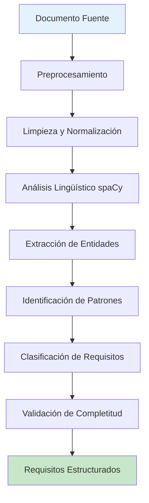
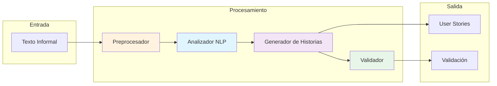
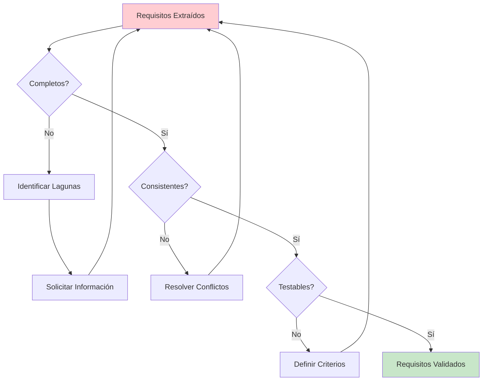

# Clase 21: Automatización de Requisitos con IA

## Duración
4 horas

## Objetivos de Aprendizaje
- Implementar sistemas de extracción automática de requisitos desde texto
- Generar user stories estructuradas a partir de descripciones informales
- Validar la completitud y consistencia de requisitos
- Integrar herramientas como LangChain y spaCy para procesamiento de lenguaje natural
- Aplicar mejores prácticas en la documentación de requisitos con asistencia de IA

## Contenidos Detallados

### 1. Extracción de Requisitos de Texto

La extracción automática de requisitos es el proceso de identificar y catalogar requisitos funcionales y no funcionales a partir de documentos de texto natural. Esta técnica combina procesamiento de lenguaje natural con heurísticas específicas para identificar:

- **Requisitos funcionales**: Características y funcionalidades que el sistema debe proporcionar
- **Requisitos no funcionales**: Atributos de calidad como rendimiento, seguridad, usabilidad
- **Restricciones**: Limitaciones técnicas, legales o de negocio
- **Supuestos**: Condiciones que se consideran verdaderas

#### Técnicas de Extracción

La extracción de requisitos utiliza múltiples técnicas de NLP:

1. **Reconocimiento de Entidades Nombradas (NER)**: Identifica actores, sistemas, datos específicos
2. **Análisis de Dependencias**: Determina relaciones entre componentes
3. **Extracción de Patrones**: Identifica estructuras lingüísticas características de requisitos
4. **Clasificación de Oraciones**: Distingue entre descripciones, requisitos, restricciones

#### Pipeline de Extracción

```
Documento → Preprocesamiento → NER → Extracción de Patrones → Clasificación → Requisitos Estructurados
```

### 2. Generación de User Stories

Las user stories son descripciones cortas de funcionalidad desde la perspectiva del usuario. El formato estándar es:

```
Como [actor], quiero [funcionalidad], para [beneficio]
```

La IA puede transformar descripciones textuales en user stories bien estructuradas siguiendo este formato y asegurando:

- Claridad en el actor
- Acciones específicas y medibles
- Beneficios tangibles
- Criterios de aceptación implícitos o explícitos

#### Plantillas de Generación

El sistema debe manejar diferentes tipos de descripciones:

```python
USER_STORY_TEMPLATE = """
Como {actor},
quiero {accion},
para {beneficio}

Criterios de aceptación:
{criteria}

Notas técnicas:
{technical_notes}
"""
```

### 3. Validación de Completitud

La validación de requisitos verifica que estos sean:

- **Completos**: Todos los aspectos necesarios están cubiertos
- **Consistentes**: No hay contradicciones entre requisitos
- **Viables**: Son técnicamente implementables
- **Testables**: Pueden verificarse objetivamente
- **Rastreables**: Pueden trazarse a documentación fuente

#### Checklist de Validación

| Aspecto | Pregunta de Verificación |
|---------|------------------------|
| Claridad | ¿El requisito tiene una única interpretación? |
| Completitud | ¿Están definidos todos los elementos necesarios? |
| Viabilidad | ¿Es técnicamente posible implementarlo? |
| Testabilidad | ¿Pueden verificarse los criterios de aceptación? |
| Dependencias | ¿Están identificadas las relaciones con otros requisitos? |

### 4. Integración con LangChain y spaCy

#### LangChain para Generación de Requisitos

LangChain proporciona capacidades de procesamiento de documentos y encadenamiento de operaciones:

```python
from langchain.text_splitter import RecursiveCharacterTextSplitter
from langchain_openai import ChatOpenAI
from langchain.chains import LLMChain
from langchain.prompts import PromptTemplate

llm = ChatOpenAI(model="gpt-4o", temperature=0.3)

requirement_extraction_prompt = PromptTemplate(
    template="""
Extrae todos los requisitos del siguiente documento.
Clasifica cada requisito como: funcional, no funcional, restricción o supuesto.

Para cada requisito proporciona:
1. Tipo
2. Descripción clara
3. Prioridad (alta, media, baja)
4. Criterios de aceptación

Documento:
{doc}

Respuesta en formato JSON:
""",
    input_variables=["doc"]
)

extraction_chain = LLMChain(llm=llm, prompt=requirement_extraction_prompt)
```

#### spaCy para Procesamiento Lingüístico

spaCy proporciona capacidades de NLP avanzadas:

```python
import spacy

# Cargar modelo de español
nlp = spacy.load("es_core_news_sm")

def extract_entities_requirements(text: str):
    """Extrae entidades relevantes para requisitos"""
    doc = nlp(text)
    
    entities = {
        "actors": [],
        "actions": [],
        "objects": [],
        "systems": []
    }
    
    for token in doc:
        # Identificar actores (sustantivos con roles)
        if token.pos_ == "NOUN" and token.dep_ in ("nsubj", "agent"):
            entities["actors"].append({
                "text": token.text,
                "lemma": token.lemma_,
                "label": "actor"
            })
        
        # Identificar acciones (verbos)
        if token.pos_ == "VERB":
            entities["actions"].append({
                "text": token.text,
                "lemma": token.lemma_,
                "tense": token.morph.get("Tense")
            })
        
        # Identificar objetos (complementos directos)
        if token.pos_ == "NOUN" and token.dep_ in ("dobj", "pobj"):
            entities["objects"].append({
                "text": token.text,
                "lemma": token.lemma_
            })
    
    # Identificar sistemas mencionados
    for ent in doc.ents:
        if ent.label_ in ("ORG", "PRODUCT", "TECH"):
            entities["systems"].append({
                "text": ent.text,
                "label": ent.label_
            })
    
    return entities
```

## Diagramas en Mermaid

### Pipeline de Extracción de Requisitos



### Arquitectura del Sistema de Generación



### Flujo de Validación



## Referencias Externas

1. **LangChain Documentation**: https://python.langchain.com/docs/
2. **spaCy Documentation**: https://spacy.io/usage
3. **IEEE Requirements Engineering Standards**: https://standards.ieee.org/standard/29148-2011.html
4. **Agile Alliance - User Stories**: https://www.agilealliance.org/glossary/user-stories/
5. **Requirements Classification - ScienceDirect**: https://www.sciencedirect.com/science/article/pii/S1877042814064228

## Ejercicios Prácticos Resueltos

### Ejercicio 1: Extracción de Requisitos desde Documento de Texto

**Enunciado**: Crear un sistema que extraiga requisitos funcionales y no funcionales desde un documento de especificaciones informal.

**Solución**:

```python
import json
import re
from typing import List, Dict, Any
import spacy
from langchain_openai import ChatOpenAI
from langchain.chains import LLMChain
from langchain.prompts import PromptTemplate

nlp = spacy.load("es_core_news_sm")
llm = ChatOpenAI(model="gpt-4o", temperature=0.2)

class RequirementExtractor:
    def __init__(self):
        self.requirements = []
        self.patterns = {
            "functional": [
                r"el sistema debe",
                r"el sistema podrá",
                r"se requiere que",
                r"se necesita que",
                r"la aplicación debe"
            ],
            "non_functional": [
                r"el sistema tendrá",
                r"debe ser",
                r"debe cumplir",
                r"deberá cumplir",
                r"el tiempo de"
            ],
            "constraint": [
                r"solo se permitirá",
                r"no se permitirá",
                r"está prohibido",
                r"se limitara a"
            ]
        }
    
    def preprocess(self, text: str) -> str:
        """Preprocesa el texto"""
        text = re.sub(r'\s+', ' ', text)
        text = re.sub(r'[^\w\s.,;:\-\(\)]', '', text)
        return text.strip()
    
    def classify_sentence(self, sentence: str) -> str:
        """Clasifica el tipo de requisito"""
        sentence_lower = sentence.lower()
        
        for req_type, patterns in self.patterns.items():
            for pattern in patterns:
                if re.search(pattern, sentence_lower):
                    return req_type
        
        return "functional"
    
    def extract_with_spacy(self, text: str) -> List[Dict[str, Any]]:
        """Extrae entidades con spaCy"""
        doc = nlp(text)
        entities = []
        
        for sent in doc.sents:
            entities.append({
                "sentence": sent.text,
                "type": self.classify_sentence(sent.text),
                "subject": self._extract_subject(sent),
                "action": self._extract_action(sent),
                "object": self._extract_object(sent)
            })
        
        return entities
    
    def _extract_subject(self, sent) -> str:
        for token in sent:
            if token.dep_ == "nsubj":
                return token.text
        return "sistema"
    
    def _extract_action(self, sent) -> str:
        for token in sent:
            if token.pos_ == "VERB":
                return token.text
        return "desarrollar"
    
    def _extract_object(self, sent) -> str:
        for token in sent:
            if token.dep_ in ("dobj", "pobj", "attr"):
                return token.text
        return ""
    
    def enhance_with_llm(self, raw_requirements: List[Dict]) -> str:
        """Mejora requisitos con LLM"""
        prompt = f"""
Eres un experto en ingeniería de requisitos.
Analiza los siguientes requisitos extraídos y:
1. Elimina duplicados
2. Consolida requisitos relacionados
3. Añade criterios de aceptación donde falten
4. Asigna prioridad

Requisitos sin procesar:
{json.dumps(raw_requirements, indent=2, ensure_ascii=False)}

Devuelve el resultado en JSON con este formato:
{{
    "requirements": [
        {{
            "id": "REQ-001",
            "type": "functional|non_functional|constraint",
            "description": "",
            "priority": "alta|media|baja",
            "acceptance_criteria": [],
            "source": ""
        }}
    ]
}}
"""
        
        response = llm.invoke(prompt)
        return response.content
    
    def process(self, document: str) -> Dict[str, Any]:
        """Proceso completo de extracción"""
        cleaned = self.preprocess(document)
        raw_requirements = self.extract_with_spacy(cleaned)
        enhanced = self.enhance_with_llm(raw_requirements)
        
        return json.loads(enhanced)

# Ejemplo de uso
document = """
El sistema de gestión de biblioteca debe permitir a los usuarios buscar libros por título, 
autor o isbn. El sistema deberá registrar los préstamos de libros y mantener un historial 
de cada usuario. Los tiempos de respuesta no deben superar los 2 segundos para ninguna consulta.
El sistema será accesible desde navegadores web modernos. Solo se permitirá el acceso 
a usuarios registrados. La base de datos debe manejar al menos 100,000 libros.
"""

extractor = RequirementExtractor()
result = extractor.process(document)
print(json.dumps(result, indent=2, ensure_ascii=False))
```

### Ejercicio 2: Generación de User Stories desde Descripciones

**Enunciado**: Implementar un sistema que transforme descripciones informales en user stories estructuradas.

**Solución**:

```python
from typing import List, Dict, Any
import json
from langchain_openai import ChatOpenAI
from langchain.prompts import PromptTemplate

llm = ChatOpenAI(model="gpt-4o", temperature=0.5)

class UserStoryGenerator:
    def __init__(self):
        self.stories = []
    
    def generate_from_description(self, description: str) -> Dict[str, Any]:
        """Genera user story desde descripción"""
        prompt = f"""
Convierte la siguiente descripción en user stories bien estructuradas.

Formato requerido:
Como [ACTOR],
quiero [FUNCIONALIDAD],
para [BENEFICIO]

Incluye también:
- Criterios de aceptación (mínimo 3)
- Notas técnicas si aplica
- Priority (High/Medium/Low)

Descripción: {description}

Devuelve en formato JSON:
{{
    "stories": [
        {{
            "id": "US-001",
            "actor": "",
            "action": "",
            "benefit": "",
            "acceptance_criteria": [],
            "priority": "",
            "technical_notes": ""
        }}
    ]
}}
"""
        
        response = llm.invoke(prompt)
        return json.loads(response.content)
    
    def generate_batch(self, descriptions: List[str]) -> List[Dict[str, Any]]:
        """Genera múltiples stories"""
        combined = "\n\n".join([
            f"{i+1}. {desc}" for i, desc in enumerate(descriptions)
        ])
        
        prompt = f"""
Convierte las siguientes descripciones en user stories individuales.
Cada descripción debe convertirse en exactamente una user story.

Descripciones:
{combined}

Formato JSON:
{{
    "stories": [
        {{
            "id": "US-001",
            "actor": "",
            "action": "",
            "benefit": "",
            "acceptance_criteria": [],
            "priority": ""
        }}
    ]
}}
"""
        
        response = llm.invoke(prompt)
        result = json.loads(response.content)
        return result["stories"]
    
    def validate_story(self, story: Dict[str, Any]) -> Dict[str, Any]:
        """Valida que la user story esté completa"""
        required_fields = ["actor", "action", "benefit", "acceptance_criteria"]
        warnings = []
        
        for field in required_fields:
            if field not in story or not story[field]:
                warnings.append(f"Campo faltante o vacío: {field}")
        
        if "acceptance_criteria" in story:
            if len(story["acceptance_criteria"]) < 2:
                warnings.append("Se necesitan más criterios de aceptación")
        
        return {
            "valid": len(warnings) == 0,
            "warnings": warnings,
            "story": story
        }

# Uso del sistema
generator = UserStoryGenerator()

# Ejemplo 1: Descripción única
description = "Los clientes deben poder ver el historial de sus pedidos anteriores para poder repetir una compra"

story = generator.generate_from_description(description)
print("=== User Story ===")
print(json.dumps(story, indent=2, ensure_ascii=False))

# Ejemplo 2: Múltiples descripciones
descriptions = [
    "Los usuarios pueden buscar productos por nombre",
    "Los administradores pueden agregar nuevos productos al catálogo",
    "Los clientes pueden guardar productos en wishlist"
]

stories = generator.generate_batch(descriptions)
print("\n=== Múltiples Stories ===")
print(json.dumps(stories, indent=2, ensure_ascii=False))
```

### Ejercicio 3: Sistema de Validación de Completitud

**Enunciado**: Crear un validador que verifique la completitud y consistencia de requisitos.

**Solución**:

```python
from typing import List, Dict, Any, Set
import json
from collections import defaultdict

class RequirementValidator:
    def __init__(self):
        self.validation_results = []
        self.issues = []
    
    def validate_completeness(self, requirements: List[Dict]) -> Dict[str, Any]:
        """Valida completitud de requisitos"""
        completeness_checklist = {
            "has_description": 0,
            "has_priority": 0,
            "has_acceptance_criteria": 0,
            "has_actor": 0,
            "has_source": 0
        }
        
        for req in requirements:
            if req.get("description"):
                completeness_checklist["has_description"] += 1
            if req.get("priority"):
                completeness_checklist["has_priority"] += 1
            if req.get("acceptance_criteria"):
                completeness_checklist["has_acceptance_criteria"] += 1
            if req.get("actor"):
                completeness_checklist["has_actor"] += 1
            if req.get("source"):
                completeness_checklist["has_source"] += 1
        
        total = len(requirements)
        completeness_score = sum(completeness_checklist.values()) / (total * len(completeness_checklist))
        
        return {
            "total_requirements": total,
            "completeness_checklist": completeness_checklist,
            "completeness_score": completeness_score,
            "is_complete": completeness_score >= 0.8
        }
    
    def validate_consistency(self, requirements: List[Dict]) -> Dict[str, Any]:
        """Valida consistencia entre requisitos"""
        inconsistencies = []
        
        # Verificar conflictos de prioridad entre requisitos relacionados
        for i, req1 in enumerate(requirements):
            for req2 in requirements[i+1:]:
                # Mismo actor y acción similar
                if (req1.get("actor") == req2.get("actor") and
                    self._similar_action(req1.get("description", ""), 
                                        req2.get("description", ""))):
                    
                    if req1.get("priority") == "alta" and req2.get("priority") == "baja":
                        inconsistencies.append({
                            "type": "priority_conflict",
                            "req1": req1.get("id"),
                            "req2": req2.get("id"),
                            "message": f"Conflicto de prioridad entre {req1.get('id')} y {req2.get('id')}"
                        })
        
        # Verificar contradicciones
        contradictions = self._find_contradictions(requirements)
        
        return {
            "inconsistencies": inconsistencies,
            "contradictions": contradictions,
            "is_consistent": len(inconsistencies) == 0 and len(contradictions) == 0
        }
    
    def _similar_action(self, desc1: str, desc2: str) -> bool:
        """Determina si dos descripciones son similares"""
        words1 = set(desc1.lower().split())
        words2 = set(desc2.lower().split())
        overlap = len(words1 & words2) / max(len(words1), len(words2))
        return overlap > 0.5
    
    def _find_contradictions(self, requirements: List[Dict]) -> List[Dict]:
        """Encuentra contradicciones entre requisitos"""
        contradictions = []
        
        negation_words = ["no", "nunca", "sin", "prohibido", "denegado"]
        
        for req in requirements:
            desc = req.get("description", "").lower()
            for neg in negation_words:
                if neg in desc:
                    # Buscar requisitos que contradigan
                    for other in requirements:
                        if other.get("id") != req.get("id"):
                            other_desc = other.get("description", "").lower()
                            # Verificación simple de contradicción
                            if self._check_contradiction(desc, other_desc):
                                contradictions.append({
                                    "req1": req.get("id"),
                                    "req2": other.get("id"),
                                    "description": f"Posible contradicción entre '{desc}' y '{other_desc}'"
                                })
        
        return contradictions
    
    def _check_contradiction(self, desc1: str, desc2: str) -> bool:
        """Verifica si dos descripciones se contradicen"""
        action_words = ["permitir", "habilitar", "autorizar", "dar acceso"]
        restriction_words = ["prohibir", "denegar", "no permitir", "restringir"]
        
        has_action = any(word in desc1 for word in action_words)
        has_restriction = any(word in desc2 for word in restriction_words)
        
        return has_action and has_restriction
    
    def validate_testability(self, requirements: List[Dict]) -> Dict[str, Any]:
        """Valida que los requisitos sean testables"""
        untestable = []
        
        vague_terms = ["adecuadamente", "adicionalmente", "óptimamente", "flexiblemente"]
        
        for req in requirements:
            desc = req.get("description", "").lower()
            
            # Verificar términos vagos
            if any(term in desc for term in vague_terms):
                untestable.append({
                    "id": req.get("id"),
                    "issue": "Términos vagos en descripción",
                    "suggestion": "Especificar criterios medibles"
                })
            
            # Verificar criterios de aceptación
            if not req.get("acceptance_criteria"):
                untestable.append({
                    "id": req.get("id"),
                    "issue": "Sin criterios de aceptación",
                    "suggestion": "Agregar criterios de aceptación medibles"
                })
            elif len(req.get("acceptance_criteria", [])) < 2:
                untestable.append({
                    "id": req.get("id"),
                    "issue": "Criterios de aceptación insuficientes",
                    "suggestion": "Agregar al menos 2-3 criterios"
                })
        
        return {
            "untestable_requirements": untestable,
            "is_testable": len(untestable) == 0
        }
    
    def generate_report(self, requirements: List[Dict]) -> Dict[str, Any]:
        """Genera reporte de validación completo"""
        completeness = self.validate_completeness(requirements)
        consistency = self.validate_consistency(requirements)
        testability = self.validate_testability(requirements)
        
        return {
            "summary": {
                "total_requirements": len(requirements),
                "completeness_score": completeness["completeness_score"],
                "is_consistent": consistency["is_consistent"],
                "is_testable": testability["is_testable"]
            },
            "completeness": completeness,
            "consistency": consistency,
            "testability": testability,
            "recommendations": self._generate_recommendations(requirements, completeness, consistency, testability)
        }
    
    def _generate_recommendations(self, requirements: List[Dict], 
                                   completeness: Dict, consistency: Dict,
                                   testability: Dict) -> List[str]:
        """Genera recomendaciones"""
        recommendations = []
        
        if not completeness["is_complete"]:
            recommendations.append("Completar campos faltantes en requisitos")
        
        if not consistency["is_consistent"]:
            recommendations.append("Revisar conflictos de prioridad y contradicciones")
        
        if not testability["is_testable"]:
            recommendations.append("Agregar criterios de aceptación específicos y medibles")
        
        return recommendations

# Ejemplo de uso
sample_requirements = [
    {
        "id": "REQ-001",
        "type": "functional",
        "description": "El sistema debe permitir a los usuarios buscar productos por nombre",
        "priority": "alta",
        "actor": "usuario",
        "acceptance_criteria": ["Búsqueda retorna resultados en menos de 2 segundos"],
        "source": "Entrevista con cliente"
    },
    {
        "id": "REQ-002",
        "type": "functional",
        "description": "El sistema debe mostrar resultados de búsqueda relevantes",
        "priority": "media",
        "acceptance_criteria": [],
        "source": "Entrevista con cliente"
    }
]

validator = RequirementValidator()
report = validator.generate_report(sample_requirements)
print(json.dumps(report, indent=2, ensure_ascii=False))
```

## Tecnologías Específicas

| Tecnología | Propósito | Versión Recomendada |
|------------|-----------|---------------------|
| LangChain | Framework de chaining | 0.3.x |
| spaCy | NLP procesamiento | 3.7.x |
| Python | Lenguaje de implementación | 3.10+ |
| LangChain OpenAI | Integración con OpenAI | Latest |
| JSON | Formato de salida | Estándar |

## Actividades de Laboratorio

### Laboratorio 1: Sistema de Extracción de Requisitos

**Objetivo**: Implementar un sistema completo de extracción de requisitos desde documentos.

**Pasos**:
1. Configurar spaCy para español
2. Crear pipeline de preprocesamiento
3. Implementar extractor de entidades
4. Integrar con LangChain para enriquecimiento
5. Probar con documentos de muestra

### Laboratorio 2: Generador de User Stories

**Objetivo**: Crear generador de user stories con validación.

**Pasos**:
1. Implementar generador con LLM
2. Añadir validación de formato
3. Crear interfaz CLI
4. Generar stories de prueba
5. Validar calidad de salida

### Laboratorio 3: Validador de Requisitos

**Objetivo**: Desarrollar sistema de validación automático.

**Pasos**:
1. Implementar validadores de completitud
2. Añadir detección de inconsistencias
3. Crear reporte de validación
4. Probar con requisitos incompletos
5. Medir efectividad

## Resumen de Puntos Clave

1. **Extracción automática** reduce tiempo de análisis manual de requisitos
2. **spaCy** proporciona NER y análisis sintáctico para identificación de actores y acciones
3. **LangChain** permite encadenar operaciones de procesamiento
4. **User stories** siguen formato estándar: Actor-Acción-Beneficio
5. **Validación** verifica completitud, consistencia y testabilidad
6. **Términos vagos** son indicador de requisitos no testables
7. **Contradicciones** deben resolverse antes de implementación
8. **Priorización** debe ser consistente entre requisitos relacionados
9. **Criterios de aceptación** deben ser medibles y verificables
10. **Integración** de NLP + LLM produce mejores resultados
