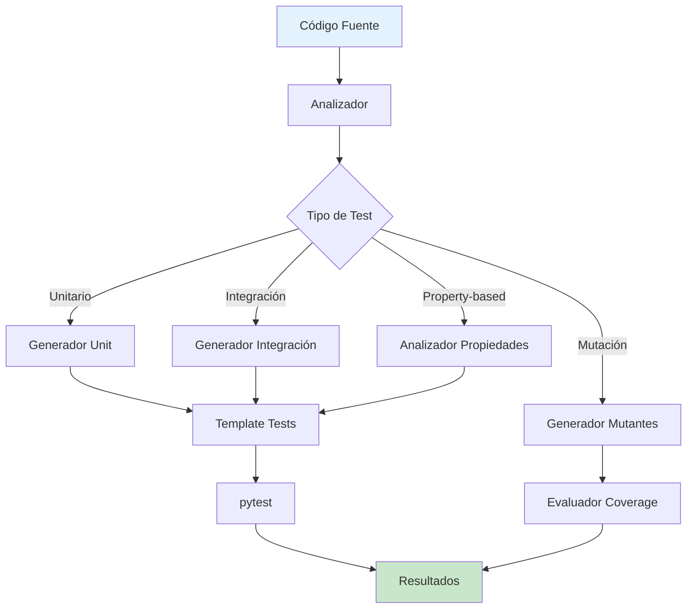
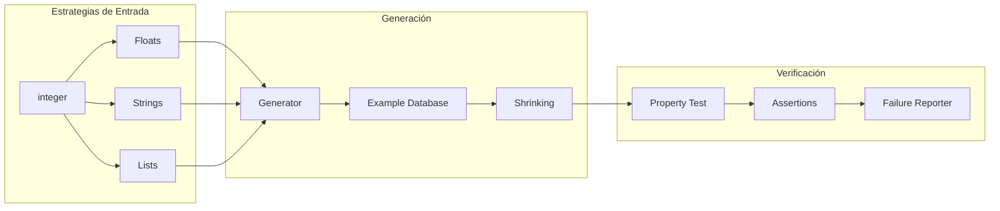
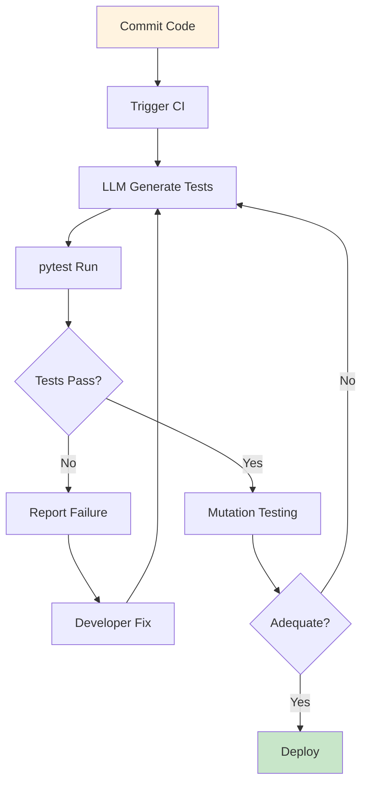

# Clase 22: Generación Automatizada de Pruebas

## Duración
4 horas

## Objetivos de Aprendizaje
- Implementar sistemas de generación automática de pruebas unitarias con IA
- Comprender y aplicar property-based testing para verificación exhaustiva
- Generar casos de prueba desde código fuente y especificaciones
- Integrar pytest, Hypothesis y LLM APIs en pipelines de testing
- Crear frameworks de testing automatizado para proyectos reales

## Contenidos Detallados

### 1. Fundamentos de Generación de Pruebas con IA

La generación automática de pruebas utiliza modelos de lenguaje para crear casos de prueba basados en código existente, especificaciones o documentación. Esta aproximación ofrece múltiples ventajas:

- **Reducción de tiempo**: Automatiza la creación de tests tediosos
- **Cobertura mejorada**: Identifica casos que podrían pasar desapercibidos
- **Consistencia**: Garantiza formato uniforme en todas las pruebas
- **Mantenibilidad**: Facilita actualización de pruebas cuando el código cambia

#### Tipos de Generación

| Tipo | Descripción | Caso de Uso |
|------|-------------|-------------|
| Unit tests | Pruebas de funciones individuales | Desarrollo cotidiano |
| Integration tests | Pruebas de componentes | Sistema completo |
| Property-based | Verificación de propiedades | Funciones puras |
| Mutation testing | Verificación de calidad | Evaluación de coverage |

### 2. Property-Based Testing con Hypothesis

Property-based testing verifica propiedades generales del código en lugar de casos específicos. Hypothesis es la librería líder para Python:

```python
from hypothesis import given, settings, assume, example
import hypothesis.strategies as st

@given(st.lists(st.integers(min_value=1, max_value=100)))
def test_sort_properties(nums):
    """Verifica propiedades de ordenamiento"""
    sorted_nums = sorted(nums)
    
    # Property 1: Misma longitud
    assert len(sorted_nums) == len(nums)
    
    # Property 2: Orden ascendente
    for i in range(len(sorted_nums) - 1):
        assert sorted_nums[i] <= sorted_nums[i + 1]
    
    # Property 3: Contiene los mismos elementos
    assert sorted(sorted_nums) == sorted(nums)
```

#### Estrategias de Hypothesis

Hypothesis proporciona estrategias para generar datos de prueba:

```python
# Números
st.integers(min_value=0, max_value=1000)
st.floats(min_value=-1.0, max_value=1.0, allow_nan=False)

# Colecciones
st.lists(st.integers(), min_size=1, max_size=50)
st.sets(st.integers())
st.dictionaries(st.text(), st.integers())

# Cadenas
st.text(min_size=1, max_size=100)
st.emails()
st.urls()

# Objetos compuestos
st.builds(MyClass, field_a=st.integers(), field_b=st.text())

# Fechas
st.datetimes(min_year=2000, max_year=2030)
```

### 3. Generación de Test Cases con LLM

Los modelos de lenguaje pueden generar casos de prueba basándose en código fuente:

```python
import openai
from openai import OpenAI
from typing import List, Dict, Any
import json

client = OpenAI(api_key="tu-api-key")

class TestGenerator:
    def __init__(self, model: str = "gpt-4o"):
        self.client = client
        self.model = model
    
    def generate_unit_tests(self, code: str, framework: str = "pytest") -> str:
        """Genera tests unitarios desde código fuente"""
        
        prompt = f"""
Eres un experto en testing de software.
Genera tests unitarios completos en {framework} para el siguiente código.

Requisitos:
1. Usa assertions apropiados
2. Incluye casos edge
3. Sigue mejores prácticas de testing
4. Usa fixtures de pytest cuando sea necesario
5. Mocks para dependencias externas

Código fuente:
```{code}
```

Genera solo el código de los tests, sin explicaciones adicionales.
"""
        
        response = self.client.chat.completions.create(
            model=self.model,
            messages=[{"role": "user", "content": prompt}],
            temperature=0.2,
            max_tokens=3000
        )
        
        return response.choices[0].message.content
    
    def generate_integration_tests(self, code: str, components: List[str]) -> str:
        """Genera tests de integración"""
        
        prompt = f"""
Genera tests de integración en pytest para el siguiente sistema.

Componentes a probar: {', '.join(components)}

Código:
```{code}
```

Incluye:
1. Setup de base de datos en memoria
2. Tests de flujo completo
3. Verificación de integración entre componentes
4. Cleanup apropiado
"""
        
        response = self.client.chat.completions.create(
            model=self.model,
            messages=[{"role": "user", "content": prompt}],
            temperature=0.3,
            max_tokens=3000
        )
        
        return response.choices[0].message.content
    
    def generate_property_tests(self, function_code: str) -> str:
        """Genera property-based tests con Hypothesis"""
        
        prompt = f"""
Analiza la siguiente función y genera property-based tests usando Hypothesis.

Función:
```{function_code}
```

Genera tests que verifiquen:
1. Propiedades de la función (ej: idempotencia, commutatividad)
2. Casos edge
3. Comportamiento con entradas inválidas
4. Invariantes del dominio

Usa las estrategias de hypothesis apropiadas.
"""
        
        response = self.client.chat.completions.create(
            model=self.model,
            messages=[{"role": "user", "content": prompt}],
            temperature=0.3,
            max_tokens=2500
        )
        
        return response.choices[0].message.content
```

### 4. Integración con pytest

pytest es el framework de testing más popular en Python:

```python
import pytest
from unittest.mock import Mock, patch
from mymodule import Calculator

@pytest.fixture
def calculator():
    """Fixture para calculadora"""
    return Calculator()

class TestCalculator:
    """Tests para Calculator"""
    
    def test_addition(self, calculator):
        assert calculator.add(2, 3) == 5
    
    def test_subtraction(self, calculator):
        assert calculator.subtract(10, 4) == 6
    
    @pytest.mark.parametrize("a,b,expected", [
        (0, 0, 0),
        (1, 1, 2),
        (-1, 1, 0),
        (100, 200, 300),
    ])
    def test_addition_params(self, calculator, a, b, expected):
        assert calculator.add(a, b) == expected
    
    def test_division_by_zero(self, calculator):
        with pytest.raises(ZeroDivisionError):
            calculator.divide(10, 0)
    
    @pytest.fixture(autouse=True)
    def mock_external_service(self):
        """Mock automático para servicio externo"""
        with patch('mymodule.external_api') as mock:
            mock.return_value = {"status": "ok"}
            yield mock

@pytest.fixture(scope="module")
def db_connection():
    """Fixture de base de datos"""
    db = create_test_db()
    yield db
    db.cleanup()
```

## Diagramas en Mermaid

### Pipeline de Generación de Tests



### Arquitectura de Property-Based Testing



### Flujo de Testing Automatizado



## Referencias Externas

1. **pytest Documentation**: https://docs.pytest.org/
2. **Hypothesis Documentation**: https://hypothesis.readthedocs.io/
3. **Property-Based Testing Book**: https://pragprog.com/titles/hbprop/
4. **OpenAI API - Code Generation**: https://platform.openai.com/docs/guides/code-generation
5. **Mutation Testing with Python**: https://pytest.mutmutation.io/

## Ejercicios Prácticos Resueltos

### Ejercicio 1: Generación Automatizada de Unit Tests

**Enunciado**: Crear un sistema que genere tests unitarios automáticamente para funciones Python.

**Solución**:

```python
import pytest
from unittest.mock import Mock, patch, MagicMock
from typing import Dict, List, Any
import json
import openai
from openai import OpenAI

client = OpenAI(api_key="tu-api-key")

class AutoTestGenerator:
    def __init__(self):
        self.test_templates = self._load_templates()
    
    def _load_templates(self) -> Dict[str, str]:
        """Carga templates de test"""
        return {
            "pytest": """import pytest
from unittest.mock import Mock, patch
from {module_name} import {class_name}

class Test{class_name}:
    @pytest.fixture
    def subject(self):
        return {class_name}({constructor_params})
    
{test_methods}
""",
            "test_method": """    def test_{method_name}(self, subject):
        # Arrange
        {arrange}
        
        # Act
        result = subject.{method_name}({act_params})
        
        # Assert
        assert result == {expected}
"""
        }
    
    def analyze_function(self, code: str) -> Dict[str, Any]:
        """Analiza función para entender estructura"""
        prompt = f"""
Analiza el siguiente código y extrae:
1. Nombre de la función/clase
2. Parámetros de entrada
3. Tipo de retorno
4. Dependencias externas
5. Casos edge obvios

Código:
{code}

Responde en JSON:
{{
    "name": "",
    "parameters": [],
    "return_type": "",
    "dependencies": [],
    "edge_cases": [],
    "expected_behavior": ""
}}
"""
        
        response = client.chat.completions.create(
            model="gpt-4o",
            messages=[{"role": "user", "content": prompt}],
            temperature=0.1,
            response_format={"type": "json_object"}
        )
        
        return json.loads(response.contents[0].message.content)
    
    def generate_tests(self, code: str, test_type: str = "comprehensive") -> str:
        """Genera tests para el código"""
        
        analysis = self.analyze_function(code)
        
        prompt = f"""
Genera tests unitarios completos en pytest para:

Código:
{code}

Análisis:
{json.dumps(analysis, indent=2)}

El código tiene las siguientes características:
- Nombre: {analysis.get('name')}
- Parámetros: {analysis.get('parameters')}
- Retorno: {analysis.get('return_type')}
- Dependencias: {analysis.get('dependencies')}
- Casos edge: {analysis.get('edge_cases')}

Genera:
1. Tests para casohappy path
2. Tests para cada caso edge
3. Tests para entradas inválidas
4. Tests con mocks si hay dependencias
5. Tests parametrizados cuando aplique

Formato: Solo código Python, sin markdown.
"""
        
        response = self.client.chat.completions.create(
            model="gpt-4o",
            messages=[{"role": "user", "content": prompt}],
            temperature=0.2,
            max_tokens=3000
        )
        
        return response.choices[0].message.content
    
    def add_test_to_file(self, test_code: str, output_path: str):
        """Guarda tests en archivo"""
        with open(output_path, 'w') as f:
            f.write(test_code)

# Ejemplo de uso
sample_code = """
def calculate_discount(price: float, discount_percent: float) -> float:
    '''Calcula el precio con descuento'''
    if price < 0:
        raise ValueError("Price cannot be negative")
    if discount_percent < 0 or discount_percent > 100:
        raise ValueError("Discount must be between 0 and 100")
    
    discount_amount = price * (discount_percent / 100)
    return price - discount_amount

class OrderProcessor:
    def __init__(self, tax_rate: float = 0.16):
        self.tax_rate = tax_rate
    
    def process_order(self, items: list, discount_percent: float = 0) -> dict:
        subtotal = sum(item['price'] * item['quantity'] for item in items)
        discount = calculate_discount(subtotal, discount_percent)
        tax = discount * self.tax_rate
        total = discount + tax
        
        return {
            'subtotal': subtotal,
            'discount': subtotal - discount,
            'tax': tax,
            'total': total
        }
"""

generator = AutoTestGenerator()
tests = generator.generate_tests(sample_code)
print(tests)
```

### Ejercicio 2: Property-Based Testing con Hypothesis

**Enunciado**: Implementar property-based tests para funciones de procesamiento de datos.

**Solución**:

```python
from hypothesis import given, settings, assume, example, Phase
import hypothesis.strategies as st
from typing import List, Tuple
import pytest

# ============================================
# FUNCIONES A PROBAR
# ============================================

def calculate_average(numbers: List[float]) -> float:
    """Calcula promedio"""
    if not numbers:
        raise ValueError("Cannot calculate average of empty list")
    return sum(numbers) / len(numbers)

def normalize_string(text: str) -> str:
    """Normaliza cadena"""
    return text.strip().lower().replace("  ", " ")

def validate_email(email: str) -> bool:
    """Valida email básico"""
    import re
    pattern = r'^[a-zA-Z0-9._%+-]+@[a-zA-Z0-9.-]+\.[a-zA-Z]{2,}$'
    return bool(re.match(pattern, email))

def calculate_percentage(part: float, total: float) -> float:
    """Calcula porcentaje"""
    if total <= 0:
        raise ValueError("Total must be positive")
    return (part / total) * 100

# ============================================
# PROPERTY-BASED TESTS
# ============================================

class TestAverageProperties:
    """Tests de propiedades para calculate_average"""
    
    @given(st.lists(st.floats(min_value=-1000, max_value=1000, allow_nan=False), 
                    min_size=1, max_size=100))
    def test_average_in_range(self, numbers):
        """El promedio siempre está entre el mínimo y máximo"""
        if numbers:
            avg = calculate_average(numbers)
            assert min(numbers) <= avg <= max(numbers)
    
    @given(st.lists(st.floats(min_value=-1000, max_value=1000, allow_nan=False), 
                    min_size=1, max_size=50))
    @settings(max_examples=100)
    def test_average_of_identical(self, numbers):
        """El promedio de valores idénticos es ese valor"""
        if numbers:
            constant = numbers[0]
            avg = calculate_average([constant] * len(numbers))
            assert avg == constant
    
    @given(st.lists(st.floats(min_value=0, max_value=100, allow_nan=False, allow_infinity=False), 
                    min_size=2, max_size=20))
    def test_average_no_negative(self, numbers):
        """Promedio de positivos es positivo"""
        avg = calculate_average(numbers)
        assert avg >= 0
    
    @given(st.lists(st.floats(min_value=-100, max_value=100, allow_nan=False), 
                    min_size=3, max_size=30))
    def test_average_linearity(self, numbers):
        """Promedio escalado = promedio de escalados"""
        if numbers:
            scale = 3.0
            scaled = [x * scale for x in numbers]
            avg_original = calculate_average(numbers)
            avg_scaled = calculate_average(scaled)
            assert abs(avg_scaled - (avg_original * scale)) < 0.0001


class TestNormalizeStringProperties:
    """Tests de propiedades para normalize_string"""
    
    @given(st.text(min_size=0, max_size=100))
    def test_normalize_not_empty(self, text):
        """Normalizar texto vacío o con espacios retorna cadena válida"""
        result = normalize_string(text)
        assert isinstance(result, str)
        assert "  " not in result
    
    @given(st.text(min_size=1, max_size=50))
    def test_normalize_no_leading_trailing(self, text):
        """No debe tener espacios al inicio/final"""
        result = normalize_string(text)
        assert result == result.strip()
    
    @given(st.text(min_size=1, max_size=50))
    def test_normalize_lowercase(self, text):
        """Todo debe ser lowercase"""
        result = normalize_string(text)
        assert result == result.lower()
    
    @given(st.text(min_size=1, max_size=50))
    def test_normalize_idempotent(self, text):
        """Normalizar dos veces es igual a normalizar una"""
        result1 = normalize_string(text)
        result2 = normalize_string(result1)
        assert result1 == result2


class TestEmailValidationProperties:
    """Tests de propiedades para validate_email"""
    
    @given(emails=st.lists(st.emails(), min_size=5, max_size=20))
    def test_valid_emails_accepted(self, emails):
        """Emails válidos deben pasar"""
        for email in emails:
            assert validate_email(email) == True
    
    @given(texts=st.lists(st.text(min_size=1, max_size=50).filter(lambda x: '@' not in x), 
                         min_size=10, max_size=30))
    def test_invalid_emails_rejected(self, texts):
        """Textos sin @ deben fallar"""
        for text in texts:
            assert validate_email(text) == False
    
    @given(st.emails())
    def test_email_contains_at(self, email):
        """Email válido debe contener @"""
        assert '@' in email


class TestPercentageProperties:
    """Tests de propiedades para calculate_percentage"""
    
    @given(
        part=st.floats(min_value=0, max_value=100, allow_nan=False),
        total=st.floats(min_value=0.01, max_value=100, allow_nan=False)
    )
    def test_percentage_in_range(self, part, total):
        """Porcentaje entre 0 y 100"""
        pct = calculate_percentage(part, total)
        assert 0 <= pct <= 100
    
    @given(
        part=st.floats(min_value=0, max_value=100, allow_nan=False),
        total=st.floats(min_value=0.01, max_value=100, allow_nan=False)
    )
    def test_percentage_of_total(self, part, total):
        """Porcentaje de total es parte"""
        pct = calculate_percentage(part, total)
        result_part = total * (pct / 100)
        assert abs(result_part - part) < 0.0001
    
    @given(value=st.floats(min_value=0, max_value=100, allow_nan=False))
    def test_percentage_of_itself(self, value):
        """100% de sí mismo"""
        pct = calculate_percentage(value, value)
        assert pct == 100.0


# ============================================
# EJECUCIÓN
# ============================================

if __name__ == "__main__":
    pytest.main([__file__, "-v", "--hypothesis-show-statistics"])
```

### Ejercicio 3: Sistema Completo de Generación de Tests

**Enunciado**: Crear un sistema completo que combine LLM con property-based testing.

**Solución**:

```python
import pytest
from hypothesis import given, settings, assume
import hypothesis.strategies as st
import json
from typing import Dict, List, Any, Callable
from dataclasses import dataclass
import inspect

@dataclass
class TestCase:
    """Caso de prueba"""
    name: str
    input_data: Any
    expected: Any
    type: str  # "unit", "edge", "property"

class TestGenerationPipeline:
    """Pipeline completo de generación de tests"""
    
    def __init__(self):
        self.generated_tests = []
        self.property_tests = []
    
    def analyze_function(self, func: Callable) -> Dict[str, Any]:
        """Analiza función para entender signature y comportamiento"""
        sig = inspect.signature(func)
        
        return {
            "name": func.__name__,
            "doc": func.__doc__,
            "parameters": [
                {
                    "name": p.name,
                    "annotation": p.annotation.__name__ if p.annotation != inspect.Parameter.empty else "Any",
                    "default": p.default if p.default != inspect.Parameter.empty else None
                }
                for p in sig.parameters.values()
            ],
            "return_annotation": sig.return_annotation.__name__ if sig.return_annotation != inspect.Parameter.empty else "Any",
            "is_pure": self._is_pure_function(func)
        }
    
    def _is_pure_function(self, func: Callable) -> bool:
        """Determina si la función es pura (sin side effects)"""
        # Análisis básico - no modifica globales, no I/O
        source = inspect.getsource(func)
        forbidden = ["global", "open(", "print(", "input(", ".write"]
        return not any(word in source for word in forbidden)
    
    def generate_unit_cases(self, func: Callable, count: int = 10) -> List[TestCase]:
        """Genera casos de prueba unitarios"""
        analysis = self.analyze_function(func)
        cases = []
        
        # Casos happy path
        cases.append(TestCase(
            name=f"{func.__name__}_basic",
            input_data=self._generate_basic_input(analysis),
            expected=None,  # LLM determina
            type="unit"
        ))
        
        # Casos edge
        edge_cases = [
            {"type": "zero", "description": "Con cero"},
            {"type": "negative", "description": "Con valores negativos"},
            {"type": "empty", "description": "Con colecciones vacías"},
            {"type": "max", "description": "Con valores máximos"},
        ]
        
        for edge in edge_cases:
            cases.append(TestCase(
                name=f"{func.__name__}_{edge['type']}",
                input_data=self._generate_edge_input(analysis, edge['type']),
                expected=None,
                type="edge"
            ))
        
        return cases
    
    def _generate_basic_input(self, analysis: Dict) -> Any:
        """Genera entrada básica según tipos"""
        params = analysis.get("parameters", [])
        
        if not params:
            return None
        
        result = {}
        for param in params:
            param_type = param.get("annotation", "Any")
            if param_type in ("int", "float"):
                result[param["name"]] = 42
            elif param_type in ("str", "string"):
                result[param["name"]] = "test"
            elif param_type in ("list", "List"):
                result[param["name"]] = [1, 2, 3]
            elif param_type in ("dict", "Dict"):
                result[param["name"]] = {"key": "value"}
        
        return result if len(result) > 1 else list(result.values())[0] if result else None
    
    def _generate_edge_input(self, analysis: Dict, edge_type: str) -> Any:
        """Genera entrada para caso edge"""
        params = analysis.get("parameters", [])
        
        if not params:
            return None
        
        result = {}
        for param in params:
            param_type = param.get("annotation", "Any")
            
            if edge_type == "zero":
                result[param["name"]] = 0 if param_type in ("int", "float") else ""
            elif edge_type == "negative":
                result[param["name"]] = -1 if param_type in ("int", "float") else ""
            elif edge_type == "empty":
                result[param["name"]] = [] if param_type in ("list", "List") else ""
            elif edge_type == "max":
                result[param["name"]] = float('inf') if param_type == "float" else 10**6
        
        return result if len(result) > 1 else list(result.values())[0] if result else None
    
    def generate_property_test(self, func: Callable) -> str:
        """Genera property-based test para función"""
        analysis = self.analyze_function(func)
        
        # Generar estrategia según tipo de retorno
        strategy = self._infer_strategy(analysis)
        
        test_code = f'''
@given({strategy})
def test_{func.__name__}_property_based(input_data):
    """Property-based test para {func.__name__}"""
    # Verificar propiedades
    result = {func.__name__}(input_data)
    
    # Properties a verificar según el tipo de función
    # Ajustar según análisis específica
    assert result is not None
'''
        
        return test_code
    
    def _infer_strategy(self, analysis: Dict) -> str:
        """Infiere estrategia de Hypothesis"""
        params = analysis.get("parameters", [])
        
        if not params:
            return "st.integers()"
        
        param = params[0]
        param_type = param.get("annotation", "Any").lower()
        
        strategies = {
            "int": "st.integers(min_value=-1000, max_value=1000)",
            "float": "st.floats(min_value=-1000, max_value=1000, allow_nan=False)",
            "str": "st.text(min_size=1, max_size=100)",
            "list": "st.lists(st.integers(), min_size=0, max_size=50)",
        }
        
        return strategies.get(param_type, "st.integers()")
    
    def generate_pytest_file(self, func: Callable, tests: List[TestCase]) -> str:
        """Genera archivo pytest completo"""
        analysis = self.analyze_function(func)
        
        file_content = f'''import pytest
from hypothesis import given, settings, assume
import hypothesis.strategies as st

# Función bajo prueba
{inspect.getsource(func)}

# ============================================
# TESTS GENERADOS
# ============================================

'''
        
        # Añadir tests unitarios
        for test in tests:
            if test.type == "unit":
                input_str = json.dumps(test.input_data) if isinstance(test.input_data, (dict, list)) else repr(test.input_data)
                file_content += f'''
def test_{test.name}():
    """Test: {test.name}"""
    input_data = {input_str}
    result = {func.__name__}(input_data)
    # TODO: Añadir assertion apropiada
    assert result is not None
'''
        
        # Añadir property test
        file_content += self.generate_property_test(func)
        
        return file_content


# ============================================
# EJEMPLO DE USO
# ============================================

def process_data(data: dict) -> dict:
    """Procesa datos aplicando transformaciones"""
    if not data:
        return {"error": "No data"}
    
    result = {}
    for key, value in data.items():
        if isinstance(value, (int, float)):
            result[key] = value * 2
        elif isinstance(value, str):
            result[key] = value.upper()
        else:
            result[key] = value
    
    return result

# Ejecutar pipeline
pipeline = TestGenerationPipeline()

# Analizar función
analysis = pipeline.analyze_function(process_data)
print("Análisis:", json.dumps(analysis, indent=2, default=str))

# Generar casos
cases = pipeline.generate_unit_cases(process_data)
print(f"\nGenerados {len(cases)} casos de prueba")

# Generar archivo de test
test_file = pipeline.generate_pytest_file(process_data, cases)
print("\n=== Archivo de test generado ===")
print(test_file)
```

## Tecnologías Específicas

| Tecnología | Propósito | Versión Recomendada |
|------------|-----------|---------------------|
| pytest | Framework de testing | 8.x |
| Hypothesis | Property-based testing | 6.x |
| OpenAI API | Generación LLM | Latest |
| unittest.mock | Mocking | stdlib |
| pytest-cov | Coverage | Latest |

## Actividades de Laboratorio

### Laboratorio 1: Generador de Unit Tests

**Objetivo**: Implementar sistema de generación de tests unitarios.

**Pasos**:
1. Configurar API de OpenAI
2. Crear analizador de funciones
3. Implementar generador de prompts
4. Generar tests de muestra
5. Ejecutar y verificar

### Laboratorio 2: Property-Based Testing

**Objetivo**: Crear property-based tests para funciones puras.

**Pasos**:
1. Seleccionar funciones objetivo
2. Identificar propiedades a verificar
3. Implementar estrategias
4. Ejecutar con Hypothesis
5. Analizar resultados

### Laboratorio 3: Pipeline de Testing Automatizado

**Objetivo**: Crear pipeline de generación y ejecución.

**Pasos**:
1. Integrar generación con pytest
2. Añadir coverage con pytest-cov
3. Configurar CI/CD básico
4. Automatizar ejecución
5. Generar reportes

## Resumen de Puntos Clave

1. **Generación con LLM** produce tests más completos que templates estáticos
2. **Property-based testing** verifica propiedades generales del código
3. **Hypothesis** genera casos de prueba diversos automáticamente
4. **pytest** proporciona fixtures, parametrización y reporting
5. **Estrategias de Hypothesis** adaptan la generación al tipo de dato
6. **Casos edge** son críticos para覆盖率 y deben incluirse
7. **Shrinking** de Hypothesis encuentra ejemplos mínimos de fallos
8. **Mocking** permite aislar unidades bajo prueba
9. **Mutation testing** evalúa efectividad de tests
10. **Automatización** reduce tiempo de mantenimiento de pruebas
