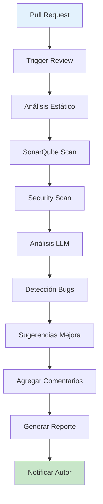
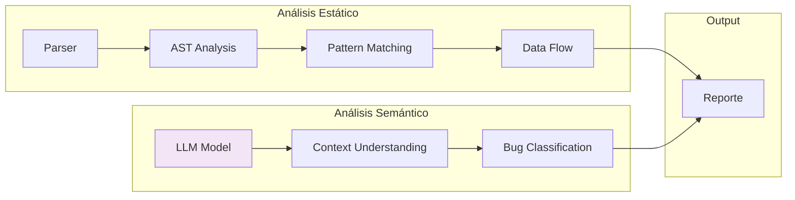

# Clase 23: Code Review Asistido por IA

## Duración
4 horas

## Objetivos de Aprendizaje
- Implementar sistemas de detección automática de bugs con IA
- Aplicar sugerencias de mejora de código automáticamente
- Integrar herramientas de security scanning potenciadas por IA
- Utilizar CodeRabbit, GitHub Copilot y SonarQube en flujos de trabajo reales
- Comprender las limitaciones y fortalezas del code review automatizado

## Contenidos Detallados

### 1. Fundamentos del Code Review Asistido por IA

El code review asistido por IA combina análisis estático tradicional con capacidades de modelos de lenguaje para identificar problemas, sugerir mejoras y mantener estándares de código. Las ventajas principales incluyen:

- **Velocidad**: Análisis instantáneo de código completo
- **Consistencia**: Aplica las mismas reglas uniformemente
- **Detección de patrones**: Identifica anti-patterns conocidos
- **Mejoras sugeridas**: Propone refactorizaciones específicas
- **Aprendizaje continuo**: Mejora con feedback del usuario

#### Tipos de Análisis

| Tipo | Descripción | Herramientas |
|------|-------------|---------------|
| Estático tradicional | Análisis de código sin ejecución | SonarQube, ESLint |
| Basado en LLM | Comprensión semántica profunda | CodeRabbit, Copilot |
| Híbrido | Combina ambos enfoques | CodeScene |
| Seguridad | Detección de vulnerabilidades | Snyk, Bandit |

### 2. Detección de Bugs con IA

La detección de bugs mediante IA utiliza múltiples técnicas:

#### Análisis Semántico con LLM

```python
import openai
from openai import OpenAI
from typing import List, Dict, Any
import json

client = OpenAI(api_key="tu-api-key")

class BugDetector:
    def __init__(self):
        self.bug_patterns = {
            "logic_error": r"if\s+\w+\s*==\s*\w+\s*(?:and|or)\s*",
            "null_pointer": r"\w+\.\w+\(\)(?!.*null)",
            "resource_leak": r"open\(|read\(|connect\(",
            "race_condition": r"(?:thread|async|await).*(?:global|shared)",
            "infinite_loop": r"while\s+True(?!\s*:)",
        }
    
    def detect_bugs(self, code: str, language: str = "python") -> List[Dict[str, Any]]:
        """Detecta bugs potenciales en el código"""
        
        prompt = f"""
Analiza el siguiente código en {language} y detecta TODOS los bugs potenciales.
No solo errores obvious, sino también:
- Errors lógicos
- Race conditions
- Memory leaks
- Null pointer exceptions
- Resource leaks
- Integer overflows
- Off-by-one errors
- SQL injection vulnerabilities

Para cada bug encontrado, proporciona:
1. Línea(s) afectada(s)
2. Severidad (critical, high, medium, low)
3. Descripción del problema
4. Código problematico
5. Sugerencia de corrección

Código:
```{code}
```

Responde en JSON:
{{
    "bugs": [
        {{
            "line": 0,
            "severity": "high",
            "type": "null_pointer",
            "description": "",
            "problematic_code": "",
            "fix": ""
        }}
    ]
}}
"""
        
        response = client.chat.completions.create(
            model="gpt-4o",
            messages=[{"role": "user", "content": prompt}],
            temperature=0.1,
            max_tokens=4000,
            response_format={"type": "json_object"}
        )
        
        result = json.loads(response.choices[0].message.content)
        return result.get("bugs", [])
    
    def analyze_code_quality(self, code: str) -> Dict[str, Any]:
        """Analiza calidad general del código"""
        
        prompt = f"""
Evalúa la calidad del siguiente código en una escala de 1-10 en cada categoría:
1. Legibilidad
2. Mantenibilidad
3. Rendimiento
4. Seguridad
5. documentacion

También identifica:
- Anti-patterns presentes
- Áreas de mejora prioritarias
- Código duplicado
- Complejidad ciclomática

Código:
```{code}
```

Responde en JSON:
{{
    "quality_score": {{
        "legibilidad": 0,
        "mantenibilidad": 0,
        "rendimiento": 0,
        "seguridad": 0,
        "documentacion": 0
    }},
    "anti_patterns": [],
    "areas_mejora": [],
    "duplicado": [],
    "complejidad": 0
}}
"""
        
        response = client.chat.completions.create(
            model="gpt-4o",
            messages=[{"role": "user", "content": prompt}],
            temperature=0.2,
            max_tokens=2000,
            response_format={"type": "json_object"}
        )
        
        return json.loads(response.choices[0].message.content)
```

### 3. Mejora de Código con Sugerencias Automáticas

El sistema puede generar sugerencias de mejora específicas:

```python
class CodeImprover:
    def __init__(self):
        self.client = OpenAI(api_key="tu-api-key")
    
    def suggest_refactoring(self, code: str, context: str = "") -> Dict[str, Any]:
        """Sugiere refactorizaciones"""
        
        prompt = f"""
Analiza el siguiente código y sugiere refactorizaciones para mejorarlo.
Considera:
1. Clean Code principles
2. SOLID principles
3. Design patterns aplicables
4. Performance improvements
5. Error handling

Contexto adicional: {context}

Código:
```{code}
```

Para cada sugerencia:
1. Tipo de mejora
2. Descripción detallada
3. Código actual vs código sugerido
4. Beneficio esperado
5. Dificultad de implementación (easy, medium, hard)

Responde en JSON:
{{
    "suggestions": [
        {{
            "type": "refactoring",
            "title": "",
            "description": "",
            "before": "",
            "after": "",
            "benefit": "",
            "difficulty": "easy"
        }}
    ]
}}
"""
        
        response = self.client.chat.completions.create(
            model="gpt-4o",
            messages=[{"role": "user", "content": prompt}],
            temperature=0.3,
            max_tokens=3000,
            response_format={"type": "json_object"}
        )
        
        return json.loads(response.choices[0].message.content)
    
    def generate_inline_comments(self, code: str) -> str:
        """Genera comentarios explicativos para el código"""
        
        prompt = f"""
Añade comentarios explicativos al siguiente código.
Cada comentario debe:
- Explicar el "por qué" no el "qué"
- Ser conciso (máx 1 línea)
- Estar en español

Código:
```{code}
```

Devuelve SOLO el código con comentarios añadidos.
"""
        
        response = self.client.chat.completions.create(
            model="gpt-4o",
            messages=[{"role": "user", "content": prompt}],
            temperature=0.2,
            max_tokens=4000
        )
        
        return response.choices[0].message.content
```

### 4. Security Scanning con IA

La seguridad en código requiere análisis especializado:

```python
import re
from typing import List, Dict, Any

class SecurityScanner:
    def __init__(self):
        self.vulnerability_patterns = {
            "sql_injection": {
                "pattern": r"(?:execute|query|cursor\.execute).*%s|'.*{.*}",
                "severity": "critical",
                "cwe": "CWE-89"
            },
            "xss": {
                "pattern": r"(?:innerHTML|outerHTML|document\.write).*\$|",
                "severity": "high",
                "cwe": "CWE-79"
            },
            "hardcoded_credentials": {
                "pattern": r"(?:password|secret|api[_-]?key|token)\s*=\s*['\"][^'\"{{}}]+['\"]",
                "severity": "critical",
                "cwe": "CWE-798"
            },
            "command_injection": {
                "pattern": r"(?:os\.system|subprocess\.|eval\(|exec\().*[\+\$]",
                "severity": "critical",
                "cwe": "CWE-78"
            },
            "path_traversal": {
                "pattern": r"(?:open|read|os\.path\.join).*[\+\$].*(?:\.\.|/etc)",
                "severity": "high",
                "cwe": "CWE-22"
            },
            "insecure_random": {
                "pattern": r"random\.(?:random|randint)",
                "severity": "medium",
                "cwe": "CWE-338"
            },
            "unvalidated_redirect": {
                "pattern": r"redirect\(|return.*redirect\(|Response\.redirect\(",
                "severity": "medium",
                "cwe": "CWE-601"
            }
        }
    
    def scan(self, code: str) -> List[Dict[str, Any]]:
        """Escanea código en busca de vulnerabilidades"""
        
        vulnerabilities = []
        
        for vuln_type, config in self.vulnerability_patterns.items():
            pattern = re.compile(config["pattern"], re.IGNORECASE)
            matches = pattern.finditer(code)
            
            for match in matches:
                vulnerabilities.append({
                    "type": vuln_type,
                    "severity": config["severity"],
                    "cwe": config["cwe"],
                    "line": code[:match.start()].count('\n') + 1,
                    "code": match.group(),
                    "description": self._get_description(vuln_type)
                })
        
        # Análisis adicional con LLM
        llm_vulns = self._scan_with_llm(code)
        vulnerabilities.extend(llm_vulns)
        
        return vulnerabilities
    
    def _scan_with_llm(self, code: str) -> List[Dict[str, Any]]:
        """Escaneo adicional con LLM"""
        
        prompt = f"""
Analiza el siguiente código en busca de vulnerabilidades de seguridad OWASP.
Busca específicamente:
1. Inyección SQL
2. XSS (Cross-Site Scripting)
3. CSRF
4. Broken Authentication
5. Sensitive Data Exposure
6. XML External Entities
7. Broken Access Control
8. Security Misconfiguration

Código:
```{code}
```

Responde en JSON:
{{
    "vulnerabilities": [
        {{
            "type": "",
            "severity": "high",
            "cwe": "",
            "description": "",
            "line": 0,
            "fix": ""
        }}
    ]
}}
"""
        
        response = client.chat.completions.create(
            model="gpt-4o",
            messages=[{"role": "user", "content": prompt}],
            temperature=0.1,
            max_tokens=2000,
            response_format={"type": "json_object"}
        )
        
        result = json.loads(response.choices[0].message.content)
        return result.get("vulnerabilities", [])
    
    def _get_description(self, vuln_type: str) -> str:
        descriptions = {
            "sql_injection": "Potencial inyección SQL - usar parámetros",
            "xss": "Potencial XSS - sanitizar salida",
            "hardcoded_credentials": "Credenciales hardcodeadas - usar variables de entorno",
            "command_injection": "Potencial inyección de comandos - validar entrada",
            "path_traversal": "Potencial path traversal - validar rutas",
            "insecure_random": "Generador aleatorio inseguro - usar secrets",
            "unvalidated_redirect": "Redirect no validado - verificar destino"
        }
        return descriptions.get(vuln_type, "Vulnerabilidad desconocida")
```

### 5. Integración con Herramientas Existentes

#### GitHub Copilot

```yaml
# .github/copilot-instructions.md
# Personalizar comportamiento de Copilot

# Analiza este código antes de sugerir
# Prioriza sugerencias de seguridad
# Evita código complejo sin comentarios
```

#### CodeRabbit

```yaml
# coderrabbit.yaml
version: "1"

review:
  profile: "default"
  high_level_summary: true
  auto_titlePlaceholder: ""
  review_status: true
  poem: false
  
  collapse_walkthrough: false
  
  categories:
    security: true
    bugs: true
    style: true
    optimization: true
    documentation: true
    testing: true
```

## Diagramas en Mermaid

### Flujo de Code Review Asistido



### Arquitectura de Detección de Bugs



## Referencias Externas

1. **SonarQube Documentation**: https://docs.sonarqube.org/
2. **GitHub Copilot Docs**: https://docs.github.com/en/copilot
3. **CodeRabbit Documentation**: https://coderabbit.ai/docs
4. **OWASP Top 10**: https://owasp.org/www-project-top-ten/
5. **Python Security Guide**: https://python-security.readthedocs.io/

## Ejercicios Prácticos Resueltos

### Ejercicio 1: Sistema Completo de Code Review

**Enunciado**: Crear un sistema completo de code review que combine análisis estático tradicional con análisis de LLM.

**Solución**:

```python
import json
from typing import Dict, List, Any
from dataclasses import dataclass
import subprocess
import tempfile
import os

@dataclass
class ReviewResult:
    """Resultado de review"""
    bugs: List[Dict]
    security: List[Dict]
    quality: Dict
    suggestions: List[Dict]
    score: int

class CodeReviewer:
    def __init__(self):
        self.bug_detector = BugDetector()
        self.security_scanner = SecurityScanner()
        self.code_improver = CodeImprover()
    
    def review(self, code: str, language: str = "python") -> ReviewResult:
        """Ejecuta review completo"""
        
        # Análisis paralelo
        bugs = self.bug_detector.detect_bugs(code, language)
        security = self.security_scanner.scan(code)
        quality = self.bug_detector.analyze_code_quality(code)
        suggestions = self.code_improver.suggest_refactoring(code)
        
        # Calcular score
        score = self._calculate_score(bugs, security, quality)
        
        return ReviewResult(
            bugs=bugs,
            security=security,
            quality=quality,
            suggestions=suggestions.get("suggestions", []),
            score=score
        )
    
    def _calculate_score(self, bugs: List, security: List, quality: Dict) -> int:
        """Calcula score de calidad (0-100)"""
        score = 100
        
        # Deducciones por bugs
        severity_weights = {"critical": 20, "high": 10, "medium": 5, "low": 2}
        for bug in bugs:
            score -= severity_weights.get(bug.get("severity", "low"), 0)
        
        # Deducciones por vulnerabilidades
        for vuln in security:
            score -= severity_weights.get(vuln.get("severity", "medium"), 0)
        
        # Ajustar por calidad
        if quality:
            scores = quality.get("quality_score", {})
            avg_quality = sum(scores.values()) / len(scores) if scores else 5
            score = int((score * 0.7) + (avg_quality * 10 * 0.3))
        
        return max(0, min(100, score))
    
    def generate_report(self, result: ReviewResult) -> str:
        """Genera reporte de review"""
        
        report = f"""
# Code Review Report
## Overall Score: {result.score}/100

### Critical Issues
"""
        
        critical_bugs = [b for b in result.bugs if b.get("severity") == "critical"]
        critical_sec = [s for s in result.security if s.get("severity") == "critical"]
        
        if critical_bugs:
            report += "\n**Bugs:**\n"
            for bug in critical_bugs:
                report += f"- Line {bug['line']}: {bug['description']}\n"
        
        if critical_sec:
            report += "\n**Security:**\n"
            for vuln in critical_sec:
                report += f"- {vuln['type']} ({vuln['cwe']}): {vuln['description']}\n"
        
        report += f"""
### Quality Metrics
| Category | Score |
|----------|-------|
| Legibilidad | {result.quality.get('quality_score', {}).get('legibilidad', 'N/A')} |
| Mantenibilidad | {result.quality.get('quality_score', {}).get('mantenibilidad', 'N/A')} |
| Rendimiento | {result.quality.get('quality_score', {}).get('rendimiento', 'N/A')} |
| Seguridad | {result.quality.get('quality_score', {}).get('seguridad', 'N/A')} |

### Suggestions
"""
        
        for i, sugg in enumerate(result.suggestions[:5], 1):
            report += f"{i}. **{sugg.get('title', 'Suggestion')}**: {sugg.get('description', '')}\n"
        
        return report


# Ejemplo de uso
sample_code = """
import sqlite3
import os

def get_user_data(user_id):
    conn = sqlite3.connect('app.db')
    cursor = conn.cursor()
    
    # SQL Injection vulnerable
    query = f"SELECT * FROM users WHERE id = {user_id}"
    cursor.execute(query)
    
    result = cursor.fetchone()
    conn.close()
    return result

def process_data(data):
    # Command injection vulnerable
    os.system('process ' + data)
    
    # Hardcoded credentials
    api_key = "sk-1234567890abcdef"
    
    return "Done"
"""

reviewer = CodeReviewer()
result = reviewer.review(sample_code)
print(result.score)
print(reviewer.generate_report(result))
```

### Ejercicio 2: Integración con GitHub Actions

**Enunciado**: Crear workflow de GitHub Actions para code review automático.

**Solución**:

```yaml
# .github/workflows/code-review.yml
name: AI Code Review

on:
  pull_request:
    branches: [main, develop]
  push:
    branches: [main, develop]

jobs:
  review:
    runs-on: ubuntu-latest
    permissions:
      contents: read
      pull-requests: write
    
    steps:
      - name: Checkout code
        uses: actions/checkout@v4
      
      - name: Set up Python
        uses: actions/setup-python@v5
        with:
          python-version: '3.11'
      
      - name: Install dependencies
        run: |
          pip install openai sonarqube-scanner bandit
      
      - name: Run static analysis
        run: |
          bandit -r . -f json -o bandit-report.json || true
          pylint **/*.py --output-format=json > pylint-report.json || true
      
      - name: Run AI Code Review
        env:
          OPENAI_API_KEY: ${{ secrets.OPENAI_API_KEY }}
        run: |
          python .github/scripts/ai_review.py
      
      - name: Post review comment
        uses: actions/github-script@v7
        with:
          script: |
            const fs = require('fs');
            const report = JSON.parse(fs.readFileSync('review-report.json', 'utf8'));
            
            const body = `
            ## 🤖 AI Code Review Results
            **Overall Score: ${report.score}/100**
            
            ### Critical Issues: ${report.critical_count}
            ${report.critical_issues.map(i => `- ${i}`).join('\n')}
            
            ### Security Issues: ${report.security_count}
            ${report.security_issues.map(s => `- ${s.type} (${s.cvery})`).join('\n')}
            
            ### Suggestions
            ${report.suggestions.slice(0, 5).map((s, i) => `${i+1}. ${s.title}`).join('\n')}
            `;
            
            github.rest.issues.createComment({
              issue_number: context.issue.number,
              owner: context.repo.owner,
              repo: context.repo.repo,
              body: body
            });
```

### Ejercicio 3: Detector de Bugs en Tiempo Real

**Enunciado**: Implementar un detector de bugs que se integra en el editor.

**Solución**:

```python
import json
import time
from typing import Dict, List, Any, Optional
from threading import Thread
import queue

class RealTimeBugDetector:
    """Detector de bugs en tiempo real para IDE"""
    
    def __init__(self, debounce_seconds: float = 1.0):
        self.debounce_seconds = debounce_seconds
        self.bug_queue = queue.Queue()
        self.last_analysis_time = 0
        self.is_analyzing = False
        self.current_bugs = []
    
    def analyze_async(self, code: str, callback):
        """Analiza código de forma asíncrona con debounce"""
        current_time = time.time()
        
        if current_time - self.last_analysis_time < self.debounce_seconds:
            return  # Too soon, skip
        
        self.last_analysis_time = current_time
        
        if self.is_analyzing:
            return  # Already analyzing
        
        thread = Thread(target=self._analyze, args=(code, callback))
        thread.start()
    
    def _analyze(self, code: str, callback):
        """Ejecuta análisis en background"""
        self.is_analyzing = True
        
        try:
            bugs = self.bug_detector.detect_bugs(code)
            security = self.security_scanner.scan(code)
            
            self.current_bugs = bugs + security
            
            # Notificar resultados
            callback({
                "bugs": self.current_bugs,
                "timestamp": time.time()
            })
        
        finally:
            self.is_analyzing = False
    
    def get_line_markers(self) -> List[Dict]:
        """Obtiene marcadores para líneas problemáticas"""
        markers = []
        
        for bug in self.current_bugs:
            severity_icons = {
                "critical": "🔴",
                "high": "🟠", 
                "medium": "🟡",
                "low": "🔵"
            }
            
            markers.append({
                "line": bug.get("line", 0),
                "severity": bug.get("severity", "low"),
                "icon": severity_icons.get(bug.get("severity", "low"), "⚪"),
                "message": bug.get("description", ""),
                "type": bug.get("type", "issue")
            })
        
        return markers


# Simulación de integración con IDE (VS Code mock)
class MockIDE:
    """Simulación de IDE para demostración"""
    
    def __init__(self):
        self.detector = RealTimeBugDetector(debounce_seconds=0.5)
        self.code = ""
    
    def on_code_change(self, new_code: str):
        """Called when code changes"""
        self.code = new_code
        
        def handle_results(results):
            print(f"\n🔍 Análisis completado: {len(results['bugs'])} issues")
            
            markers = self.detector.get_line_markers()
            for marker in markers:
                print(f"  {marker['icon']} Line {marker['line']}: {marker['message']}")
        
        self.detector.analyze_async(new_code, handle_results)


# Demo
sample_code = """
def divide(a, b):
    return a / b  # Possible division by zero

def get_user(id):
    # SQL Injection
    query = f"SELECT * FROM users WHERE id = {id}"
    return query
"""

ide = MockIDE()
ide.on_code_change(sample_code)
time.sleep(2)
```

## Tecnologías Específicas

| Tecnología | Propósito | Versión Recomendada |
|------------|-----------|---------------------|
| CodeRabbit | Code review automatizado | Latest |
| GitHub Copilot | Asistentes de código | Latest |
| SonarQube | Análisis estático | 10.x |
| Bandit | Security scanning Python | Latest |
| Pylint | Linting Python | Latest |

## Actividades de Laboratorio

### Laboratorio 1: Sistema de Code Review

**Objetivo**: Implementar sistema completo de code review.

**Pasos**:
1. Configurar detector de bugs
2. Añadir scanner de seguridad
3. Integrar análisis de calidad
4. Crear генератор de reportes
5. Probar con código real

### Laboratorio 2: Integración con GitHub Actions

**Objetivo**: Configurar CI con code review automático.

**Pasos**:
1. Crear workflow de GitHub Actions
2. Integrar análisis estático
3. Añadir paso de LLM review
4. Configurar comentarios en PR
5. Probar pipeline

### Laboratorio 3: Plugin de IDE

**Objetivo**: Crear detector en tiempo real.

**Pasos**:
1. Implementar detector con debounce
2. Crear sistema de callbacks
3. Simular integración con editor
4. Añadir análisis asíncrono
5. Optimizar rendimiento

## Resumen de Puntos Clave

1. **Code review automatizado** complementa revisión humana
2. **Análisis estático** detecta patrones conocidos eficientemente
3. **LLM añade comprensión** semántica profunda
4. **Security scanning** debe ser parte integral del proceso
5. **GitHub Actions** permite automatización en CI/CD
6. **CodeRabbit** proporciona review conversacional
7. **Copilot** sugiere mejoras contextuales durante codificación
8. **SonarQube** ofrece métricas de calidad históricas
9. **Debouncing** evita análisis excesivos en tiempo real
10. **Score de calidad** ayuda a priorizar esfuerzos
