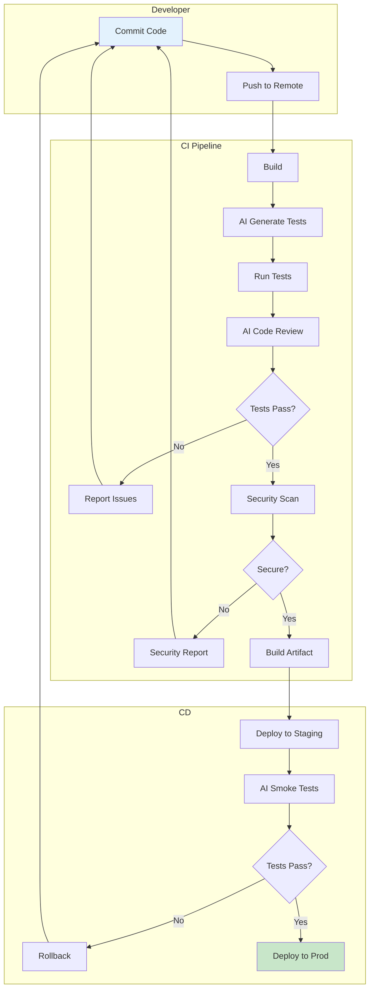
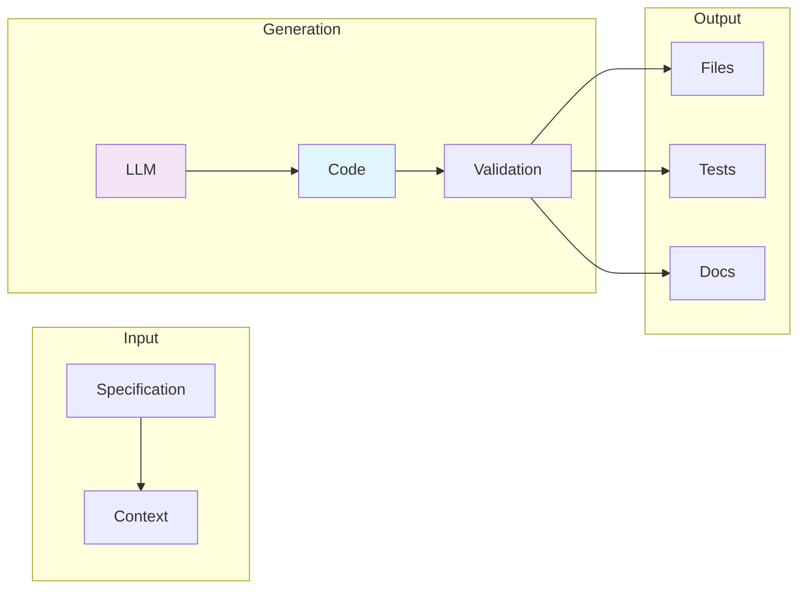

# Clase 24: Integración de IA en CI/CD

## Duración
4 horas

## Objetivos de Aprendizaje
- Implementar pipelines de CI/CD con asistencia de IA
- Automatizar generación de código en flujos de integración
- Configurar deployment asistido por IA
- Integrar herramientas como GitHub Actions, GitLab CI y Cursor
- Crear flujos de trabajo completos de automatización

## Contenidos Detallados

### 1. Fundamentos de CI/CD con IA

La integración de IA en pipelines de CI/CD transforma la automatización tradicional añadiendo capacidades de generación, análisis y optimización. Los beneficios incluyen:

- **Generación automática**: Crear código repetitivo automáticamente
- **Detección proactiva**: Identificar problemas antes de que lleguen a producción
- **Optimización continua**: Mejora automática de performance
- **Documentación automática**: Generación de docs desde código

#### Arquitectura de Pipeline con IA

```
 Código → Build → Test → Analyze → Deploy
              ↑        ↑        ↑        ↑
              └────────┴────────┴────────┘
                    IA Assistance
```

### 2. GitHub Actions con IA

GitHub Actions permite automatizar flujos de trabajo con asistencia de IA:

```yaml
# .github/workflows/ai-assist.yml
name: AI-Assisted Pipeline

on:
  push:
    branches: [main]
  pull_request:
    branches: [main]

env:
  OPENAI_API_KEY: ${{ secrets.OPENAI_API_KEY }}

jobs:
  generate-tests:
    runs-on: ubuntu-latest
    steps:
      - uses: actions/checkout@v4
      
      - name: Setup Python
        uses: actions/setup-python@v5
        with:
          python-version: '3.11'
      
      - name: Generate Unit Tests
        run: |
          python -m pip install openai
          python scripts/generate_tests.py
      
      - name: Run Tests
        run: pytest -v
      
      - name: AI Code Review
        run: |
          python scripts/ai_review.py
      
      - name: Upload Review Results
        uses: actions/upload-artifact@v4
        with:
          name: review-results
          path: review-results.json
```

#### Script de Generación Automática

```python
#!/usr/bin/env python3
"""Script de generación automática de tests"""

import os
import json
import subprocess
from pathlib import Path
import openai
from openai import OpenAI

client = OpenAI(api_key=os.environ.get("OPENAI_API_KEY"))

class TestGenerator:
    def __init__(self):
        self.source_files = self._find_source_files()
    
    def _find_source_files(self) -> list:
        """Encuentra archivos fuente Python"""
        return list(Path(".").rglob("*.py"))
    
    def generate_for_file(self, filepath: Path) -> str:
        """Genera tests para un archivo"""
        code = filepath.read_text()
        
        prompt = f"""
Genera tests unitarios completos en pytest para el siguiente código.
Incluye:
- Tests para casos happy path
- Tests para casos edge
- Tests con mocks cuando sea necesario

Código:
{code}
"""
        
        response = client.chat.completions.create(
            model="gpt-4o",
            messages=[{"role": "user", "content": prompt}],
            temperature=0.2,
            max_tokens=3000
        )
        
        return response.choices[0].message.content
    
    def process_all(self):
        """Procesa todos los archivos"""
        results = {}
        
        for filepath in self.source_files:
            if "test" not in filepath.name:
                try:
                    tests = self.generate_for_file(filepath)
                    test_file = filepath.parent / f"test_{filepath.name}"
                    test_file.write_text(tests)
                    results[str(filepath)] = "generated"
                except Exception as e:
                    results[str(filepath)] = f"error: {e}"
        
        return results

if __name__ == "__main__":
    generator = TestGenerator()
    results = generator.process_all()
    print(json.dumps(results, indent=2))
```

### 3. GitLab CI con Asistencia de IA

GitLab CI ofrece capacidades similares con configuración YAML:

```yaml
# .gitlab-ci.yml
stages:
  - generate
  - test
  - review
  - deploy

variables:
  OPENAI_API_KEY: ${OPENAI_API_KEY}

ai-generate:
  stage: generate
  image: python:3.11
  before_script:
    - pip install openai langchain
  script:
    - python scripts/generate_code.py
  artifacts:
    paths:
      - generated/
    expire_in: 1 day

ai-test:
  stage: test
  image: python:3.11
  needs:
    - ai-generate
  script:
    - pytest tests/ -v --junitxml=report.xml
  coverage: '/TOTAL.*\s+(\d+%)$/'
  artifacts:
    reports:
      junit: report.xml

ai-code-review:
  stage: review
  image: python:3.11
  needs:
    - ai-test
  script:
    - python scripts/ai_review.py > review.md
  artifacts:
    paths:
      - review.md

deploy-production:
  stage: deploy
  only:
    - main
  script:
    - ./deploy.sh
  environment:
    name: production
```

### 4. Cursor para Development Assisted

Cursor es un IDE potenciado por IA que facilita el desarrollo:

```python
# Ejemplo de uso programático de Cursor (vía API cuando esté disponible)

class CursorIntegration:
    """Integración con Cursor para desarrollo asistido"""
    
    def __init__(self):
        self.api_key = os.environ.get("CURSOR_API_KEY")
    
    def generate_code(self, specification: str) -> str:
        """Genera código desde especificación"""
        
        prompt = f"""
Eres un experto desarrollador.
Genera código completo y funcional desde la siguiente especificación.

Especificación:
{specification}

Requisitos:
1. Código completo y ejecutable
2. Sigue mejores prácticas
3. Incluye manejo de errores
4. documenta funciones
"""
        
        response = client.chat.completions.create(
            model="gpt-4o",
            messages=[{"role": "user", "content": prompt}],
            temperature=0.3,
            max_tokens=4000
        )
        
        return response.choices[0].message.content
    
    def explain_code(self, code: str) -> str:
        """Explica código existente"""
        
        prompt = f"""
Explica el siguiente código de manera clara y concisa.
Incluye:
- Propósito general
- Flujo de ejecución
- Puntos importantes

Código:
{code}
"""
        
        response = client.chat.completions.create(
            model="gpt-4o",
            messages=[{"role": "user", "content": prompt}],
            temperature=0.2,
            max_tokens=2000
        )
        
        return response.choices[0].message.content
    
    def suggest_improvements(self, code: str) -> str:
        """Sugiere mejoras para el código"""
        
        prompt = f"""
Analiza el siguiente código y sugiere mejoras en:
1. Rendimiento
2. Legibilidad
3. Mantenibilidad
4. Seguridad

Código:
{code}
"""
        
        response = client.chat.completions.create(
            model="gpt-4o",
            messages=[{"role": "user", "content": prompt}],
            temperature=0.3,
            max_tokens=2500
        )
        
        return response.choices[0].message.content
```

### 5. Automated Code Generation Pipeline

```python
import os
import json
import subprocess
from pathlib import Path
from dataclasses import dataclass
from typing import List, Dict, Any, Optional
from datetime import datetime
import hashlib

@dataclass
class CodeGenerationRequest:
    """Solicitud de generación de código"""
    specification: str
    language: str
    framework: Optional[str]
    context: Dict[str, Any]

class AutomatedCodeGenerator:
    """Generador automático de código para CI/CD"""
    
    def __init__(self, output_dir: str = "generated"):
        self.output_dir = Path(output_dir)
        self.output_dir.mkdir(exist_ok=True)
        self.client = OpenAI(api_key=os.environ.get("OPENAI_API_KEY"))
    
    def generate_from_spec(self, request: CodeGenerationRequest) -> Dict[str, Any]:
        """Genera código desde especificación"""
        
        prompt = self._build_prompt(request)
        
        response = self.client.chat.completions.create(
            model="gpt-4o",
            messages=[
                {"role": "system", "content": "Eres un experto desarrollador de software."},
                {"role": "user", "content": prompt}
            ],
            temperature=0.3,
            max_tokens=4000,
            response_format={"type": "json_object"}
        )
        
        result = json.loads(response.choices[0].message.content)
        
        # Guardar archivos generados
        return self._save_generated_files(result, request.language)
    
    def _build_prompt(self, request: CodeGenerationRequest) -> str:
        """Construye prompt completo"""
        
        framework_info = f" usando {request.framework}" if request.framework else ""
        
        return f"""
Genera código completo en {request.language}{framework_info} basado en la siguiente especificación.

Especificación:
{specification}

El código debe:
1. Ser completo y ejecutable
2. Seguir principios de Clean Code
3. Incluir manejo de errores
4. Tener tests unitarios
5. Incluir documentación básica

Responde en JSON:
{{
    "files": [
        {{
            "path": "ruta/del/archivo",
            "content": "contenido del archivo"
        }}
    ],
    "tests": [
        {{
            "path": "ruta/test",
            "content": "contenido del test"
        }}
    ]
}}
"""
    
    def _save_generated_files(self, result: Dict, language: str) -> Dict[str, Any]:
        """Guarda archivos generados"""
        saved = []
        
        for file_data in result.get("files", []):
            filepath = self.output_dir / file_data["path"]
            filepath.parent.mkdir(parents=True, exist_ok=True)
            filepath.write_text(file_data["content"])
            saved.append(str(filepath))
        
        return {
            "generated_files": saved,
            "timestamp": datetime.now().isoformat(),
            "total": len(saved)
        }
    
    def validate_generated_code(self, files: List[str]) -> Dict[str, Any]:
        """Valida el código generado"""
        
        results = []
        
        for filepath in files:
            ext = Path(filepath).suffix
            
            if ext == ".py":
                # Linting Python
                result = subprocess.run(
                    ["python", "-m", "py_compile", filepath],
                    capture_output=True
                )
                results.append({
                    "file": filepath,
                    "valid": result.returncode == 0,
                    "error": result.stderr.decode() if result.returncode != 0 else None
                })
            
            elif ext in (".js", ".ts"):
                # Linting JS/TS
                result = subprocess.run(
                    ["npx", "eslint", filepath],
                    capture_output=True
                )
                results.append({
                    "file": filepath,
                    "valid": result.returncode == 0,
                    "error": result.stderr.decode() if result.returncode != 0 else None
                })
        
        return {
            "validation_results": results,
            "all_valid": all(r["valid"] for r in results)
        }
```

## Diagramas en Mermaid

### Pipeline CI/CD con IA



### Flujo de Generación Automática



## Referencias Externas

1. **GitHub Actions Documentation**: https://docs.github.com/en/actions
2. **GitLab CI/CD Documentation**: https://docs.gitlab.com/ci/
3. **Cursor IDE**: https://cursor.sh/
4. **CI/CD Best Practices**: https://about.gitlab.com/topics/ci-cd/
5. **OpenAI API Pricing**: https://openai.com/pricing

## Ejercicios Prácticos Resueltos

### Ejercicio 1: Pipeline de Generación Automática

**Enunciado**: Crear pipeline completo que genere código automáticamente desde especificaciones.

**Solución**:

```python
import os
import json
import subprocess
from pathlib import Path
from datetime import datetime
from typing import Dict, List, Any, Optional
import tempfile
import shutil

class CIPipeline:
    """Pipeline de CI/CD con IA"""
    
    def __init__(self, workspace: str = "workspace"):
        self.workspace = Path(workspace)
        self.workspace.mkdir(exist_ok=True)
        self.client = OpenAI(api_key=os.environ.get("OPENAI_API_KEY"))
        
        self.stages = []
        self.results = {}
    
    def run(self, spec_file: str) -> Dict[str, Any]:
        """Ejecuta pipeline completo"""
        
        # Stage 1: Read Specification
        spec = self._read_specification(spec_file)
        self._log_stage("read_spec", "Specification loaded")
        
        # Stage 2: Generate Code
        generated_files = self._generate_code(spec)
        self._log_stage("generate_code", f"Generated {len(generated_files)} files")
        
        # Stage 3: Validate Syntax
        validation = self._validate_syntax(generated_files)
        self._log_stage("validate_syntax", f"Valid: {validation['valid_count']}")
        
        # Stage 4: Generate Tests
        tests = self._generate_tests(generated_files)
        self._log_stage("generate_tests", f"Generated {len(tests)} tests")
        
        # Stage 5: Run Tests
        test_results = self._run_tests(tests)
        self._log_stage("run_tests", f"Passed: {test_results['passed']}")
        
        # Stage 6: Generate Documentation
        docs = self._generate_docs(generated_files)
        self._log_stage("generate_docs", f"Generated {len(docs)} docs")
        
        self.results = {
            "stages": self.stages,
            "generated_files": generated_files,
            "tests": tests,
            "validation": validation,
            "test_results": test_results,
            "docs": docs,
            "success": test_results["passed"] > 0
        }
        
        return self.results
    
    def _read_specification(self, spec_file: str) -> Dict:
        """Lee especificación"""
        with open(spec_file) as f:
            return json.load(f)
    
    def _log_stage(self, name: str, message: str):
        """Registra progreso de stage"""
        self.stages.append({
            "stage": name,
            "message": message,
            "timestamp": datetime.now().isoformat()
        })
    
    def _generate_code(self, spec: Dict) -> List[str]:
        """Genera código"""
        
        prompt = f"""
Genera código completo para el siguiente requerimiento:

Nombre: {spec.get('name')}
Descripción: {spec.get('description')}
Lenguaje: {spec.get('language', 'python')}
Framework: {spec.get('framework', 'none')}

Genera todos los archivos necesarios.
Responde en JSON con estructura de archivos.
"""
        
        response = self.client.chat.completions.create(
            model="gpt-4o",
            messages=[{"role": "user", "content": prompt}],
            temperature=0.3,
            max_tokens=4000,
            response_format={"type": "json_object"}
        )
        
        result = json.loads(response.choices[0].message.content)
        
        # Guardar archivos
        generated = []
        for file_info in result.get("files", []):
            path = self.workspace / file_info["path"]
            path.parent.mkdir(parents=True, exist_ok=True)
            path.write_text(file_info["content"])
            generated.append(str(path))
        
        return generated
    
    def _validate_syntax(self, files: List[str]) -> Dict:
        """Valida sintaxis"""
        results = []
        
        for filepath in files:
            if filepath.endswith(".py"):
                result = subprocess.run(
                    ["python", "-m", "py_compile", filepath],
                    capture_output=True
                )
                results.append({
                    "file": filepath,
                    "valid": result.returncode == 0
                })
            else:
                results.append({"file": filepath, "valid": True})
        
        return {
            "results": results,
            "valid_count": sum(1 for r in results if r["valid"])
        }
    
    def _generate_tests(self, files: List[str]) -> List[str]:
        """Genera tests"""
        tests = []
        
        for filepath in files:
            if filepath.endswith(".py"):
                code = Path(filepath).read_text()
                
                prompt = f"""
Genera tests unitarios en pytest para:

{code}
"""
                
                response = self.client.chat.completions.create(
                    model="gpt-4o",
                    messages=[{"role": "user", "content": prompt}],
                    temperature=0.2,
                    max_tokens=2000
                )
                
                test_name = f"test_{Path(filepath).name}"
                test_path = self.workspace / test_name
                test_path.write_text(response.choices[0].message.content)
                tests.append(str(test_path))
        
        return tests
    
    def _run_tests(self, test_files: List[str]) -> Dict:
        """Ejecuta tests"""
        if not test_files:
            return {"passed": 0, "failed": 0}
        
        result = subprocess.run(
            ["pytest", "-v", "--tb=short"] + test_files,
            capture_output=True,
            cwd=self.workspace
        )
        
        output = result.stdout.decode()
        
        # Parsear resultados
        passed = output.count(" PASSED")
        failed = output.count(" FAILED")
        
        return {
            "passed": passed,
            "failed": failed,
            "output": output
        }
    
    def _generate_docs(self, files: List[str]) -> List[str]:
        """Genera documentación"""
        
        docs = []
        
        prompt = """
Genera README.md para el siguiente proyecto.
Incluye:
- Descripción
- Instalación
- Uso
- API
"""
        
        response = self.client.chat.completions.create(
            model="gpt-4o",
            messages=[{"role": "user", "content": prompt}],
            temperature=0.3,
            max_tokens=1500
        )
        
        readme = self.workspace / "README.md"
        readme.write_text(response.choices[0].message.content)
        docs.append(str(readme))
        
        return docs


# Ejemplo de uso
if __name__ == "__main__":
    spec = {
        "name": "API REST",
        "description": "API REST simple para gestión de tareas",
        "language": "python",
        "framework": "fastapi"
    }
    
    # Guardar especificación temporal
    with open("temp_spec.json", "w") as f:
        json.dump(spec, f)
    
    # Ejecutar pipeline
    pipeline = CIPipeline()
    result = pipeline.run("temp_spec.json")
    
    print(json.dumps(result, indent=2, default=str))
```

### Ejercicio 2: Deployment Asistido

**Enunciado**: Implementar sistema de deployment con asistencia de IA.

**Solución**:

```python
import os
import json
import subprocess
from pathlib import Path
from typing import Dict, List, Any
from dataclasses import dataclass
from datetime import datetime

@dataclass
class DeploymentConfig:
    """Configuración de deployment"""
    environment: str
    region: str
    instance_type: str
    auto_scaling: bool

class AIDeployment:
    """Sistema de deployment asistido por IA"""
    
    def __init__(self):
        self.client = OpenAI(api_key=os.environ.get("OPENAI_API_KEY"))
        self.deployments = []
    
    def analyze_requirements(self, application: Dict) -> Dict:
        """Analiza requisitos de la aplicación"""
        
        prompt = f"""
Analiza los siguientes requisitos de aplicación y recomienda configuración de deployment.

Application:
- Tipo: {application.get('type')}
- Tráfico esperado: {application.get('expected_traffic')}
- Lenguaje: {application.get('language')}
- Base de datos: {application.get('database')}

Recomienda:
1. Configuración de infraestructura
2. Recursos necesarios
3. Estrategia de scaling
4. Configuración de seguridad

Responde en JSON.
"""
        
        response = self.client.chat.completions.create(
            model="gpt-4o",
            messages=[{"role": "user", "content": prompt}],
            temperature=0.2,
            max_tokens=2000,
            response_format={"type": "json_object"}
        )
        
        return json.loads(response.choices[0].message.content)
    
    def generate_terraform(self, config: Dict) -> str:
        """Genera configuración Terraform"""
        
        prompt = f"""
Genera configuración de Terraform para:

{json.dumps(config, indent=2)}

Incluye:
- Provider AWS
- EC2 instances o ECS
- RDS si necesita base de datos
- Security groups
- Variables output

Devuelve solo código Terraform.
"""
        
        response = self.client.chat.completions.create(
            model="gpt-4o",
            messages=[{"role": "user", "content": prompt}],
            temperature=0.2,
            max_tokens=3000
        )
        
        return response.choices[0].message.content
    
    def generate_dockerfile(self, app_info: Dict) -> str:
        """Genera Dockerfile"""
        
        language = app_info.get("language", "python")
        framework = app_info.get("framework", "")
        
        prompts = {
            "python": "Genera Dockerfile multi-stage para aplicación Python/FastAPI",
            "nodejs": "Genera Dockerfile multi-stage para aplicación Node.js",
            "go": "Genera Dockerfile multi-stage para aplicación Go"
        }
        
        response = self.client.chat.completions.create(
            model="gpt-4o",
            messages=[{"role": "user", "content": prompts.get(language, prompts["python"])}],
            temperature=0.2,
            max_tokens=1500
        )
        
        return response.choices[0].message.content
    
    def deploy(self, config: DeploymentConfig, artifacts: List[str]) -> Dict:
        """Ejecuta deployment"""
        
        deployment_id = f"deploy-{datetime.now().strftime('%Y%m%d-%H%M%S')}"
        
        # Simular deployment
        print(f"Starting deployment {deployment_id}")
        
        # 1. Build Docker image
        print("Building Docker image...")
        
        # 2. Push to registry
        print("Pushing to registry...")
        
        # 3. Update infrastructure
        print("Updating infrastructure...")
        
        # 4. Deploy to environment
        print(f"Deploying to {config.environment}...")
        
        self.deployments.append({
            "id": deployment_id,
            "config": config,
            "status": "completed",
            "timestamp": datetime.now().isoformat()
        })
        
        return {
            "deployment_id": deployment_id,
            "status": "success",
            "environment": config.environment,
            "url": f"https://{config.environment}.example.com"
        }
    
    def monitor_deployment(self, deployment_id: str) -> Dict:
        """Monitorea deployment"""
        
        prompt = f"""
Genera recomendaciones de monitoreo para deployment {deployment_id}.
Incluye:
- Métricas a monitorear
- Alertas necesarias
- Logs importantes
"""
        
        response = self.client.chat.completions.create(
            model="gpt-4o",
            messages=[{"role": "user", "content": prompt}],
            temperature=0.3,
            max_tokens=1000
        )
        
        return {
            "deployment_id": deployment_id,
            "monitoring": response.choices[0].message.content
        }


# Ejemplo de uso
app_info = {
    "type": "REST API",
    "expected_traffic": "10000 req/min",
    "language": "python",
    "framework": "fastapi",
    "database": "postgresql"
}

deployer = AIDeployment()

# Analizar requisitos
requirements = deployer.analyze_requirements(app_info)
print("Requirements:", json.dumps(requirements, indent=2))

# Generar Docker
dockerfile = deployer.generate_dockerfile(app_info)
print("\nDockerfile:")
print(dockerfile)
```

### Ejercicio 3: GitLab CI Completo

**Enunciado**: Crear pipeline de GitLab CI completo con asistencia de IA.

**Solución**:

```yaml
# .gitlab-ci.yml completo
variables:
  OPENAI_API_KEY: ${OPENAI_API_KEY}
  DOCKER_IMAGE: ${CI_REGISTRY_IMAGE}:${CI_COMMIT_SHA}

stages:
  - generate
  - build
  - test
  - review
  - security
  - deploy

.default_before_script: &before_script
  before_script:
    - pip install -q openai pytest black pylint

generate-code:
  stage: generate
  image: python:3.11
  <<: *before_script
  script:
    - python scripts/generate_from_spec.py
  artifacts:
    paths:
      - generated/
    expire_in: 1 week
  rules:
    - if: $CI_PIPELINE_SOURCE == "merge_request_event"

build-image:
  stage: build
  image: docker:24
  services:
    - docker:24-dind
  script:
    - docker login -u $CI_REGISTRY_USER -p $CI_REGISTRY_PASSWORD $CI_REGISTRY
    - docker build -t $DOCKER_IMAGE .
    - docker push $DOCKER_IMAGE
  needs:
    - generate-code

run-tests:
  stage: test
  image: python:3.11
  <<: *before_script
  script:
    - pytest tests/ -v --junitxml=report.xml --cov=src --cov-report=xml
  artifacts:
    reports:
      junit: report.xml
      coverage_report:
        coverage_format: cobertura
        path: coverage.xml
  needs:
    - generate-code

ai-code-review:
  stage: review
  image: python:3.11
  <<: *before_script
  script:
    - python scripts/ai_review.py > review_report.md
  artifacts:
    paths:
      - review_report.md
    expire_in: 30 days
  needs:
    - run-tests
  rules:
    - if: $CI_PIPELINE_SOURCE == "merge_request_event"

security-scan:
  stage: security
  image: python:3.11
  script:
    - pip install -q bandit safety
    - bandit -r src/ -f json -o bandit.json || true
    - safety check --json > safety.json || true
  artifacts:
    paths:
      - bandit.json
      - safety.json
    expire_in: 7 days
  needs:
    - generate-code

deploy-staging:
  stage: deploy
  image: alpine:latest
  script:
    - apk add -q curl
    - |
      curl -X POST $DEPLOY_WEBHOOK \
        -d "environment=staging" \
        -d "image=$DOCKER_IMAGE"
  environment:
    name: staging
    url: https://staging.example.com
  needs:
    - security-scan
  rules:
    - if: $CI_COMMIT_BRANCH == "develop"

deploy-production:
  stage: deploy
  image: alpine:latest
  script:
    - apk add -q curl
    - |
      curl -X POST $DEPLOY_WEBHOOK \
        -d "environment=production" \
        -d "image=$DOCKER_IMAGE"
  environment:
    name: production
    url: https://example.com
  needs:
    - deploy-staging
  rules:
    - if: $CI_COMMIT_BRANCH == "main"
  when: manual
```

## Tecnologías Específicas

| Tecnología | Propósito | Versión Recomendada |
|------------|-----------|---------------------|
| GitHub Actions | CI/CD | Latest |
| GitLab CI | CI/CD | Latest |
| Cursor | IDE con IA | Latest |
| Docker | Contenerización | 24.x |
| Terraform | IaC | 1.6.x |

## Actividades de Laboratorio

### Laboratorio 1: Pipeline Básico con IA

**Objetivo**: Crear pipeline básico que genere tests automáticamente.

**Pasos**:
1. Configurar GitHub Actions
2. Crear script de generación
3. Integrar con OpenAI
4. Ejecutar pipeline
5. Analizar resultados

### Laboratorio 2: Sistema de Deployment

**Objetivo**: Implementar deployment asistido.

**Pasos**:
1. Crear generador de Dockerfiles
2. Configurar Terraform
3. Implementar despliegue
4. Añadir monitoreo
5. Probar rollback

### Laboratorio 3: Pipeline Completo

**Objetivo**: Crear pipeline end-to-end.

**Pasos**:
1. Diseñar stages
2. Integrar generación de código
3. Añadir análisis de seguridad
4. Configurar deployment
5. Implementar monitoreo

## Resumen de Puntos Clave

1. **CI/CD con IA** automatiza generación de código repetitivo
2. **GitHub Actions** permite pipelines configurables
3. **GitLab CI** ofrece infraestructura autoalojada
4. **Cursor** asiste desarrollo en tiempo real
5. **Generación automática** reduce tiempo de desarrollo
6. **Validación automática** asegura calidad
7. **Security scanning** debe integrarse en pipeline
8. **Deployment asistido** optimiza infraestructura
9. **Artifacts** facilitan trazabilidad
10. **Monitoreo** permite mejora continua
