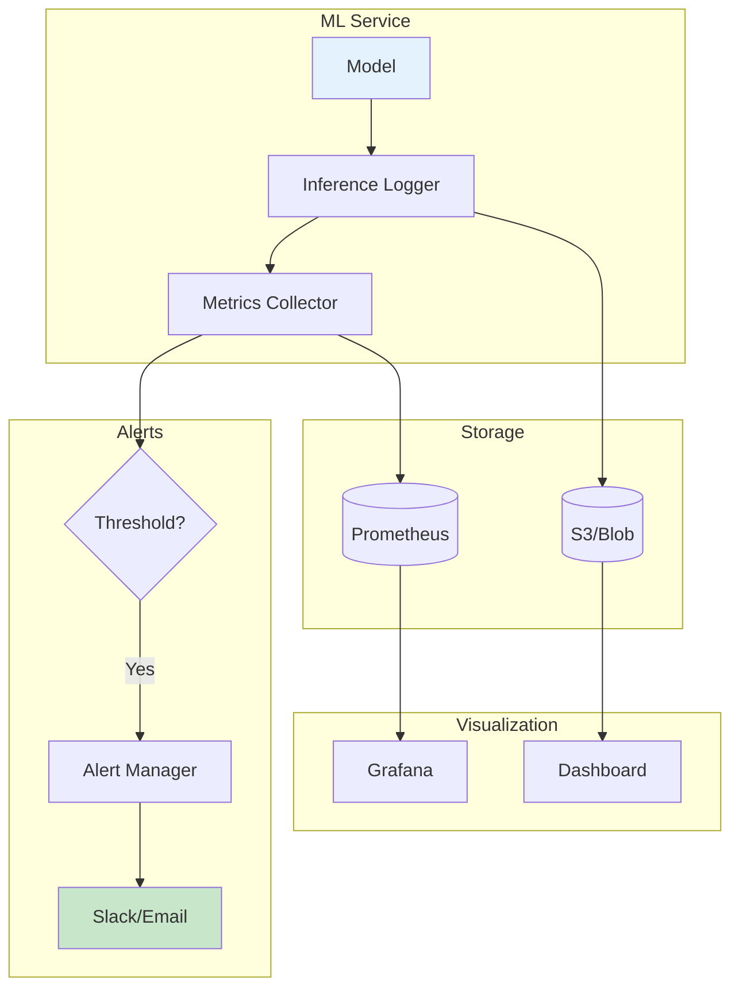
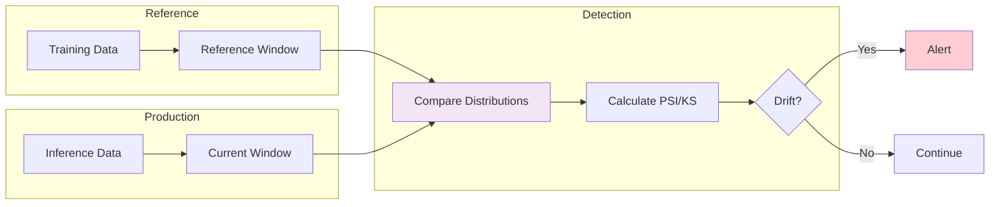

# Clase 26: Monitoreo y Observabilidad de Modelos

## Duración
4 horas

## Objetivos de Aprendizaje
- Implementar sistemas de logging de inferencias para modelos de IA
- Diseñar y configurar métricas de rendimiento específicas para ML
- Detectar y alertar sobre drift en modelos de producción
- Utilizar herramientas como LangSmith, Weights & Biases y MLflow
- Crear dashboards de observabilidad completos

## Contenidos Detallados

### 1. Fundamentos de Observabilidad en ML

La observabilidad en sistemas de machine learning es crítica para mantener la calidad del modelo en producción. A diferencia del software tradicional, los modelos de ML tienen comportamiento estocástico que requiere monitoreo especializado:

- **Logging de inferencias**: Registro de cada predicción realizada
- **Métricas de rendimiento**: accuracy, precision, recall, latencia
- **Detección de drift**: Identificación de cambios en datos o modelo
- **Debugging**: Capacidad de reproducir problemas

#### Componentes de Observabilidad

```
┌─────────────────────────────────────────────────────────┐
│                   OBSERVABILITY                         │
├─────────────────────────────────────────────────────────┤
│  Metrics    │   Logs        │   Traces    │   Alerts   │
│  Prometheus │   ELK Stack   │   Jaeger    │   PagerDuty│
│  Grafana   │   CloudWatch  │   Zipkin    │   OpsGenie │
└─────────────────────────────────────────────────────────┘
```

### 2. Logging de Inferencias

El logging de inferencias captura cada solicitud y respuesta del modelo:

```python
import json
import time
from datetime import datetime
from typing import Dict, Any, Optional, List
from dataclasses import dataclass, asdict
from pathlib import Path
import logging
from enum import Enum

class LogLevel(Enum):
    DEBUG = "DEBUG"
    INFO = "INFO"
    WARNING = "WARNING"
    ERROR = "ERROR"

@dataclass
class InferenceLog:
    """Registro de inferencia"""
    request_id: str
    timestamp: str
    model_name: str
    model_version: str
    input_data: Dict[str, Any]
    output_data: Dict[str, Any]
    latency_ms: float
    token_count: Optional[int] = None
    user_id: Optional[str] = None
    metadata: Optional[Dict] = None
    error: Optional[str] = None

class InferenceLogger:
    """Sistema de logging de inferencias"""
    
    def __init__(self, log_dir: str = "logs", service_name: str = "ml-service"):
        self.log_dir = Path(log_dir)
        self.log_dir.mkdir(exist_ok=True)
        self.service_name = service_name
        self.logger = self._setup_logger()
        self.request_logs = []
    
    def _setup_logger(self) -> logging.Logger:
        """Configura logger"""
        logger = logging.getLogger(self.service_name)
        logger.setLevel(logging.INFO)
        
        # Handler para archivo
        file_handler = logging.FileHandler(
            self.log_dir / f"{self.service_name}_{datetime.now().strftime('%Y%m%d')}.log"
        )
        file_handler.setLevel(logging.INFO)
        
        # Formato JSON
        formatter = logging.Formatter('%(message)s')
        file_handler.setFormatter(formatter)
        
        logger.addHandler(file_handler)
        return logger
    
    def log_inference(
        self,
        request_id: str,
        model_name: str,
        model_version: str,
        input_data: Dict,
        output_data: Dict,
        latency_ms: float,
        user_id: Optional[str] = None,
        metadata: Optional[Dict] = None,
        error: Optional[str] = None
    ):
        """Registra una inferencia"""
        
        log_entry = InferenceLog(
            request_id=request_id,
            timestamp=datetime.now().isoformat(),
            model_name=model_name,
            model_version=model_version,
            input_data=self._sanitize_data(input_data),
            output_data=self._sanitize_data(output_data),
            latency_ms=latency_ms,
            user_id=user_id,
            metadata=metadata,
            error=error
        )
        
        # Log a archivo
        log_dict = asdict(log_entry)
        self.logger.info(json.dumps(log_dict))
        
        # Guardar en memoria para métricas
        self.request_logs.append(log_entry)
        
        return log_entry
    
    def _sanitize_data(self, data: Dict) -> Dict:
        """Limpia datos sensibles"""
        sensitive_fields = ["password", "token", "secret", "api_key", "credit_card"]
        sanitized = data.copy()
        
        def sanitize_dict(d: Dict) -> Dict:
            result = {}
            for key, value in d.items():
                if any(s in key.lower() for s in sensitive_fields):
                    result[key] = "***REDACTED***"
                elif isinstance(value, dict):
                    result[key] = sanitize_dict(value)
                elif isinstance(value, list):
                    result[key] = [sanitize_dict(v) if isinstance(v, dict) else v for v in value]
                else:
                    result[key] = value
            return result
        
        return sanitize_dict(sanitized)
    
    def get_metrics(self, time_window: int = 3600) -> Dict[str, Any]:
        """Calcula métricas del time window"""
        
        now = datetime.now()
        cutoff = now.timestamp() - time_window
        
        recent_logs = [
            log for log in self.request_logs
            if datetime.fromisoformat(log.timestamp).timestamp() > cutoff
        ]
        
        if not recent_logs:
            return {"error": "No data"}
        
        latencies = [log.latency_ms for log in recent_logs]
        errors = [log for log in recent_logs if log.error]
        
        return {
            "total_requests": len(recent_logs),
            "successful": len(recent_logs) - len(errors),
            "failed": len(errors),
            "error_rate": len(errors) / len(recent_logs),
            "latency": {
                "mean": sum(latencies) / len(latencies),
                "p50": self._percentile(latencies, 50),
                "p95": self._percentile(latencies, 95),
                "p99": self._percentile(latencies, 99),
                "min": min(latencies),
                "max": max(latencies)
            },
            "tokens": {
                "total": sum(log.token_count or 0 for log in recent_logs),
                "mean": sum(log.token_count or 0 for log in recent_logs) / len(recent_logs)
            }
        }
    
    def _percentile(self, data: List[float], percentile: int) -> float:
        """Calcula percentil"""
        sorted_data = sorted(data)
        index = int(len(sorted_data) * percentile / 100)
        return sorted_data[min(index, len(sorted_data) - 1)]
```

### 3. Métricas de Rendimiento para ML

```python
from typing import Dict, List, Any, Optional
from dataclasses import dataclass
import numpy as np
from datetime import datetime, timedelta
import json

@dataclass
class ModelMetrics:
    """Métricas de modelo"""
    accuracy: float
    precision: float
    recall: float
    f1_score: float
    auc_roc: Optional[float] = None

class MLMetricsCollector:
    """Recolector de métricas para ML"""
    
    def __init__(self):
        self.predictions = []
        self.actuals = []
        self.model_metrics = {}
    
    def record_prediction(
        self,
        prediction: Any,
        actual: Any,
        features: Dict,
        metadata: Optional[Dict] = None
    ):
        """Registra predicción"""
        
        self.predictions.append(prediction)
        self.actuals.append(actual)
    
    def calculate_metrics(self) -> ModelMetrics:
        """Calcula métricas de rendimiento"""
        
        if not self.predictions:
            raise ValueError("No predictions recorded")
        
        predictions = np.array(self.predictions)
        actuals = np.array(self.actuals)
        
        # Accuracy
        accuracy = (predictions == actuals).mean()
        
        # Precision, Recall, F1
        tp = ((predictions == 1) & (actuals == 1)).sum()
        fp = ((predictions == 1) & (actuals == 0)).sum()
        fn = ((predictions == 0) & (actuals == 1)).sum()
        tn = ((predictions == 0) & (actuals == 0)).sum()
        
        precision = tp / (tp + fp) if (tp + fp) > 0 else 0
        recall = tp / (tp + fn) if (tp + fn) > 0 else 0
        f1 = 2 * precision * recall / (precision + recall) if (precision + recall) > 0 else 0
        
        return ModelMetrics(
            accuracy=accuracy,
            precision=precision,
            recall=recall,
            f1_score=f1
        )
    
    def get_drift_metrics(self, reference_data: List, current_data: List) -> Dict:
        """Calcula métricas de drift"""
        
        ref = np.array(reference_data)
        curr = np.array(current_data)
        
        # Distribution drift (KL divergence approximation)
        ref_hist = np.histogram(ref, bins=50, density=True)[0]
        curr_hist = np.histogram(curr, bins=50, density=True)[0]
        
        # Evitar división por cero
        ref_hist = ref_hist + 1e-10
        curr_hist = curr_hist + 1e-10
        
        kl_divergence = np.sum(ref_hist * np.log(ref_hist / curr_hist))
        
        # Statistical tests
        from scipy import stats
        ks_statistic, ks_pvalue = stats.ks_2samp(ref, curr)
        
        return {
            "kl_divergence": abs(kl_divergence),
            "ks_statistic": ks_statistic,
            "ks_pvalue": ks_pvalue,
            "drift_detected": ks_pvalue < 0.05,
            "mean_shift": abs(curr.mean() - ref.mean()),
            "std_shift": abs(curr.std() - ref.std())
        }
```

### 4. Detección de Drift

```python
from typing import Dict, List, Any, Optional, Tuple
import numpy as np
from datetime import datetime, timedelta
from dataclasses import dataclass
import json

@dataclass
class DriftAlert:
    """Alerta de drift"""
    timestamp: str
    drift_type: str  # concept, data, prediction
    severity: str   # low, medium, high, critical
    metric_name: str
    value: float
    threshold: float
    description: str

class DriftDetector:
    """Sistema de detección de drift"""
    
    def __init__(
        self,
        reference_window: int = 1000,
        detection_threshold: float = 0.05,
        alert_threshold: float = 0.1
    ):
        self.reference_window = reference_window
        self.detection_threshold = detection_threshold
        self.alert_threshold = alert_threshold
        
        self.reference_data = []
        self.current_window = []
        self.alerts = []
    
    def add_reference_data(self, data: np.ndarray):
        """Añade datos de referencia (training data)"""
        self.reference_data = data[-self.reference_window:]
    
    def add_prediction_data(self, data: np.ndarray):
        """Añade datos de predicción"""
        self.current_window.append(data)
        
        if len(self.current_window) > self.reference_window:
            self.current_window = self.current_window[-self.reference_window:]
    
    def detect_data_drift(self) -> Optional[DriftAlert]:
        """Detecta drift en datos de entrada"""
        
        if len(self.reference_data) < 100:
            return None
        
        ref = np.array(self.reference_data)
        curr = np.array(self.current_window[-100:])
        
        # Population Stability Index (PSI)
        psi = self._calculate_psi(ref, curr)
        
        if psi > self.alert_threshold:
            return DriftAlert(
                timestamp=datetime.now().isoformat(),
                drift_type="data",
                severity="critical" if psi > 0.25 else "high" if psi > 0.15 else "medium",
                metric_name="psi",
                value=psi,
                threshold=self.alert_threshold,
                description=f"Data drift detected: PSI={psi:.4f}"
            )
        
        return None
    
    def detect_prediction_drift(self) -> Optional[DriftAlert]:
        """Detecta drift en predicciones"""
        
        if len(self.current_window) < 100:
            return None
        
        predictions = np.array(self.current_window[-self.reference_window:])
        ref_predictions = np.array(self.reference_data[-self.reference_window:])
        
        # Comparar distribuciones
        from scipy import stats
        ks_stat, p_value = stats.ks_2samp(ref_predictions, predictions)
        
        if p_value < 0.05:
            mean_shift = abs(predictions.mean() - ref_predictions.mean())
            
            return DriftAlert(
                timestamp=datetime.now().isoformat(),
                drift_type="prediction",
                severity="high" if mean_shift > 0.1 else "medium",
                metric_name="prediction_distribution",
                value=mean_shift,
                threshold=self.detection_threshold,
                description=f"Prediction drift: KS={ks_stat:.4f}, shift={mean_shift:.4f}"
            )
        
        return None
    
    def _calculate_psi(self, ref: np.ndarray, curr: np.ndarray, buckets: int = 10) -> float:
        """Calcula Population Stability Index"""
        
        # Crear bins desde datos de referencia
        min_val, max_val = ref.min(), ref.max()
        bins = np.linspace(min_val, max_val, buckets + 1)
        
        # Calcular percentages en cada bin
        ref_percentages = np.histogram(ref, bins=bins, density=True)[0]
        curr_percentages = np.histogram(curr, bins=bins, density=True)[0]
        
        # Evitar división por cero
        ref_percentages = ref_percentages + 1e-10
        curr_percentages = curr_percentages + 1e-10
        
        # Calcular PSI
        psi = np.sum(
            (curr_percentages - ref_percentages) * 
            np.log(curr_percentages / ref_percentages)
        )
        
        return psi
```

### 5. Integración con Herramientas

#### LangSmith

```python
from langsmith import Client
import os

class LangSmithMonitor:
    """Monitor con LangSmith"""
    
    def __init__(self):
        self.client = Client(api_key=os.environ.get("LANGCHAIN_API_KEY"))
    
    def create_run(
        self,
        name: str,
        inputs: Dict,
        run_type: str = "chain"
    ):
        """Crea run en LangSmith"""
        
        run = self.client.create_run(
            name=name,
            inputs=inputs,
            run_type=run_type
        )
        
        return run
    
    def end_run(self, run_id: str, outputs: Dict, error: Optional[str] = None):
        """Finaliza run"""
        
        self.client.update_run(
            run_id=run_id,
            outputs=outputs,
            error=error
        )
    
    def get_metrics(self, project_name: str, time_range: int = 3600) -> Dict:
        """Obtiene métricas"""
        
        runs = self.client.list_examples(
            project_name=project_name,
            limit=100
        )
        
        latencies = []
        errors = 0
        
        for run in runs:
            if hasattr(run, 'latency_ms'):
                latencies.append(run.latency_ms)
            if hasattr(run, 'error') and run.error:
                errors += 1
        
        return {
            "total_runs": len(runs),
            "errors": errors,
            "error_rate": errors / len(runs) if runs else 0,
            "latency_mean": sum(latencies) / len(latencies) if latencies else 0,
            "latency_p95": sorted(latencies)[int(len(latencies) * 0.95)] if latencies else 0
        }
```

## Diagramas en Mermaid

### Arquitectura de Observabilidad



### Flujo de Detección de Drift



## Referencias Externas

1. **LangSmith Documentation**: https://docs.smith.langchain.com/
2. **Weights & Biases**: https://docs.wandb.ai/
3. **MLflow Documentation**: https://mlflow.org/docs/latest/
4. **Prometheus Metrics**: https://prometheus.io/docs/
5. **Drift Detection Methods**: https://arxiv.org/abs/2004.00445

## Ejercicios Prácticos Resueltos

### Ejercicio 1: Sistema de Logging Completo

**Enunciado**: Implementar sistema completo de logging para modelo de producción.

**Solución**:

```python
import json
import time
import uuid
from datetime import datetime
from typing import Dict, Any, Optional, List
from dataclasses import dataclass, asdict
import threading
from queue import Queue

@dataclass
class InferenceRecord:
    """Registro de inferencia"""
    request_id: str
    timestamp: str
    model_name: str
    version: str
    input_tokens: int
    output_tokens: int
    latency_ms: float
    user_id: Optional[str]
    success: bool
    error: Optional[str]

class ProductionLogger:
    """Sistema de logging para producción"""
    
    def __init__(self, output_file: str = "inference_logs.jsonl"):
        self.output_file = output_file
        self.log_queue = Queue()
        self.running = True
        
        # Hilo de escritura
        self.writer_thread = threading.Thread(target=self._writer_loop)
        self.writer_thread.start()
    
    def log(self, record: InferenceRecord):
        """Añade registro a cola"""
        self.log_queue.put(record)
    
    def _writer_loop(self):
        """Loop de escritura a archivo"""
        buffer = []
        buffer_size = 100
        flush_interval = 5  # segundos
        
        while self.running:
            try:
                # Añadir a buffer
                while not self.log_queue.empty() and len(buffer) < buffer_size:
                    buffer.append(self.log_queue.get())
                
                # Escribir buffer
                if buffer:
                    with open(self.output_file, 'a') as f:
                        for record in buffer:
                            f.write(json.dumps(asdict(record)) + '\n')
                    buffer.clear()
                
                time.sleep(flush_interval)
            
            except Exception as e:
                print(f"Writer error: {e}")
    
    def stop(self):
        """Detiene logger"""
        self.running = False
        self.writer_thread.join()


class ModelWrapper:
    """Wrapper de modelo con logging"""
    
    def __init__(self, model, logger: ProductionLogger):
        self.model = model
        self.logger = logger
        self.model_name = "gpt-wrapper"
        self.version = "1.0.0"
    
    def predict(
        self,
        prompt: str,
        user_id: Optional[str] = None,
        **kwargs
    ) -> Dict[str, Any]:
        """Predicción con logging"""
        
        request_id = str(uuid.uuid4())
        start_time = time.time()
        
        try:
            # Contar tokens input
            input_tokens = len(prompt.split()) * 4  # aproximación
            
            # Llamar al modelo
            result = self.model(prompt, **kwargs)
            
            # Extraer output
            output_text = result.get("choices", [{}])[0].get("text", "")
            output_tokens = len(output_text.split()) * 4
            
            # Registrar éxito
            self.logger.log(InferenceRecord(
                request_id=request_id,
                timestamp=datetime.now().isoformat(),
                model_name=self.model_name,
                version=self.version,
                input_tokens=input_tokens,
                output_tokens=output_tokens,
                latency_ms=(time.time() - start_time) * 1000,
                user_id=user_id,
                success=True,
                error=None
            ))
            
            return result
        
        except Exception as e:
            # Registrar error
            self.logger.log(InferenceRecord(
                request_id=request_id,
                timestamp=datetime.now().isoformat(),
                model_name=self.model_name,
                version=self.version,
                input_tokens=0,
                output_tokens=0,
                latency_ms=(time.time() - start_time) * 1000,
                user_id=user_id,
                success=False,
                error=str(e)
            ))
            
            raise


# Simulación de uso
class MockModel:
    """Modelo simulado"""
    def __call__(self, prompt: str, **kwargs):
        return {
            "choices": [{"text": f"Response to: {prompt[:50]}..."}],
            "usage": {"total_tokens": 100}
        }

# Uso
logger = ProductionLogger("logs/inference.jsonl")
model = ModelWrapper(MockModel(), logger)

# Simularinferencias
for i in range(10):
    result = model.predict(f"Pregunta {i}", user_id=f"user_{i % 3}")
    print(f"Request {i}: {result['choices'][0]['text'][:30]}")

# Detener
time.sleep(1)
logger.stop()
print("Logging completed")
```

### Ejercicio 2: Dashboard de Métricas

**Enunciado**: Crear dashboard de métricas en tiempo real.

**Solución**:

```python
import time
import threading
from datetime import datetime
from typing import Dict, List
import json
from dataclasses import dataclass, field

@dataclass
class MetricsWindow:
    """Ventana de métricas"""
    requests: List[Dict] = field(default_factory=list)
    window_seconds: int = 60

class RealTimeDashboard:
    """Dashboard en tiempo real"""
    
    def __init__(self, window_seconds: int = 60):
        self.window = MetricsWindow(window_seconds)
        self.lock = threading.Lock()
        self.running = True
    
    def record_request(self, latency_ms: float, success: bool, tokens: int):
        """Registra request"""
        
        with self.lock:
            self.window.requests.append({
                "timestamp": datetime.now(),
                "latency_ms": latency_ms,
                "success": success,
                "tokens": tokens
            })
            
            # Limpiar ventana antigua
            cutoff = datetime.now().timestamp() - self.window.window_seconds
            self.window.requests = [
                r for r in self.window.requests
                if r["timestamp"].timestamp() > cutoff
            ]
    
    def get_current_metrics(self) -> Dict:
        """Obtiene métricas actuales"""
        
        with self.lock:
            requests = self.window.requests
            
            if not requests:
                return {
                    "requests_per_minute": 0,
                    "avg_latency_ms": 0,
                    "p95_latency_ms": 0,
                    "error_rate": 0,
                    "tokens_per_minute": 0
                }
            
            latencies = [r["latency_ms"] for r in requests]
            successes = [r["success"] for r in requests]
            tokens = [r["tokens"] for r in requests]
            
            sorted_latencies = sorted(latencies)
            p95_idx = int(len(sorted_latencies) * 0.95)
            
            return {
                "requests_per_minute": len(requests),
                "avg_latency_ms": sum(latencies) / len(latencies),
                "p95_latency_ms": sorted_latencies[p95_idx] if sorted_latencies else 0,
                "max_latency_ms": max(latencies) if latencies else 0,
                "error_rate": (1 - sum(successes) / len(successes)) if successes else 0,
                "tokens_per_minute": sum(tokens),
                "timestamp": datetime.now().isoformat()
            }
    
    def render_console(self):
        """Renderiza dashboard en consola"""
        
        metrics = self.get_current_metrics()
        
        print("\n" + "="*50)
        print("  REAL-TIME MODEL METRICS")
        print("="*50)
        print(f"Requests/min:    {metrics['requests_per_minute']:>10.0f}")
        print(f"Avg latency:     {metrics['avg_latency_ms']:>10.1f} ms")
        print(f"P95 latency:     {metrics['p95_latency_ms']:>10.1f} ms")
        print(f"Max latency:     {metrics['max_latency_ms']:>10.1f} ms")
        print(f"Error rate:      {metrics['error_rate']:>10.1%}")
        print(f"Tokens/min:      {metrics['tokens_per_minute']:>10.0f}")
        print(f"Timestamp:       {metrics['timestamp']:>20}")
        print("="*50)


# Demo
dashboard = RealTimeDashboard()

def simulate_traffic():
    """Simula tráfico"""
    import random
    
    for i in range(50):
        latency = random.uniform(50, 500) if random.random() > 0.05 else random.uniform(1000, 3000)
        success = random.random() > 0.03
        tokens = random.randint(50, 500)
        
        dashboard.record_request(latency, success, tokens)
        time.sleep(0.1)

simulate_traffic()
dashboard.render_console()
```

### Ejercicio 3: Sistema de Drift Detection

**Enunciado**: Implementar detector de drift completo.

**Solución**:

```python
import numpy as np
from typing import Dict, List, Optional
from datetime import datetime
from dataclasses import dataclass
import json

@dataclass
class DriftConfig:
    """Configuración de detección"""
    psi_threshold: float = 0.1
    ks_threshold: float = 0.05
    window_size: int = 1000
    min_samples: int = 100

class CompleteDriftDetector:
    """Detector completo de drift"""
    
    def __init__(self, config: DriftConfig):
        self.config = config
        self.reference_data = []
        self.current_buffer = []
        self.alert_history = []
    
    def set_reference(self, data: List[float]):
        """Establece datos de referencia"""
        self.reference_data = list(data[-self.config.window_size:])
    
    def add_inference(self, value: float):
        """Añade resultado de inferencia"""
        self.current_buffer.append(value)
        
        if len(self.current_buffer) > self.config.window_size:
            self.current_buffer = self.current_buffer[-self.config.window_size:]
    
    def check_drift(self) -> Optional[Dict]:
        """Verifica drift"""
        
        if len(self.reference_data) < self.config.min_samples:
            return None
        
        if len(self.current_buffer) < self.config.min_samples:
            return None
        
        ref = np.array(self.reference_data)
        curr = np.array(self.current_buffer[-self.config.min_samples:])
        
        # PSI
        psi = self._calculate_psi(ref, curr)
        
        # KS test
        from scipy import stats
        ks_stat, ks_pval = stats.ks_2samp(ref, curr)
        
        alerts = []
        
        # Check PSI
        if psi > self.config.psi_threshold:
            alerts.append({
                "type": "psi",
                "severity": self._get_severity(psi, [0.1, 0.2, 0.3]),
                "value": psi,
                "threshold": self.config.psi_threshold
            })
        
        # Check KS
        if ks_pval < 0.05:
            alerts.append({
                "type": "ks",
                "severity": self._get_severity(ks_stat, [0.05, 0.1, 0.15]),
                "value": ks_stat,
                "threshold": self.config.ks_threshold,
                "p_value": ks_pval
            })
        
        if alerts:
            alert_record = {
                "timestamp": datetime.now().isoformat(),
                "alerts": alerts,
                "reference_mean": float(ref.mean()),
                "current_mean": float(curr.mean()),
                "reference_std": float(ref.std()),
                "current_std": float(curr.std())
            }
            
            self.alert_history.append(alert_record)
            
            return alert_record
        
        return None
    
    def _calculate_psi(self, ref: np.ndarray, curr: np.ndarray, n_bins: int = 10) -> float:
        """Calcula PSI"""
        
        min_val, max_val = min(ref.min(), curr.min()), max(ref.max(), curr.max())
        bins = np.linspace(min_val, max_val, n_bins + 1)
        
        ref_pct = np.histogram(ref, bins=bins, density=True)[0] + 1e-10
        curr_pct = np.histogram(curr, bins=bins, density=True)[0] + 1e-10
        
        return np.sum((curr_pct - ref_pct) * np.log(curr_pct / ref_pct))
    
    def _get_severity(self, value: float, thresholds: List[float]) -> str:
        """Determina severidad"""
        if value > thresholds[2]:
            return "critical"
        elif value > thresholds[1]:
            return "high"
        elif value > thresholds[0]:
            return "medium"
        return "low"
    
    def get_summary(self) -> Dict:
        """Obtiene resumen"""
        
        return {
            "total_alerts": len(self.alert_history),
            "recent_alerts": self.alert_history[-10:] if self.alert_history else [],
            "reference_stats": {
                "mean": float(np.mean(self.reference_data)) if self.reference_data else 0,
                "std": float(np.std(self.reference_data)) if self.reference_data else 0,
                "count": len(self.reference_data)
            },
            "current_stats": {
                "mean": float(np.mean(self.current_buffer)) if self.current_buffer else 0,
                "std": float(np.std(self.current_buffer)) if self.current_buffer else 0,
                "count": len(self.current_buffer)
            }
        }


# Demo
np.random.seed(42)
reference = np.random.normal(100, 15, 1000)

# Shift gradual
current = np.concatenate([
    np.random.normal(100, 15, 500),
    np.random.normal(110, 18, 500)  # Drift!
])

detector = CompleteDriftDetector(DriftConfig())
detector.set_reference(reference)

# Simularinferencias
for value in current[:100]:
    detector.add_inference(value)

# Check drift
result = detector.check_drift()
if result:
    print("DRIFT DETECTED!")
    print(json.dumps(result, indent=2))
else:
    print("No drift detected")

print("\nSummary:")
print(json.dumps(detector.get_summary(), indent=2))
```

## Tecnologías Específicas

| Tecnología | Propósito | Versión Recomendada |
|------------|-----------|---------------------|
| LangSmith | Observabilidad LLM | Latest |
| Weights & Biases | MLOps platform | Latest |
| MLflow | ML lifecycle | 2.x |
| Prometheus | Metrics | 2.x |
| Grafana | Visualization | 10.x |

## Actividades de Laboratorio

### Laboratorio 1: Sistema de Logging

**Objetivo**: Implementar sistema de logging de inferencias.

**Pasos**:
1. Crear clase InferenceLogger
2. Implementar sanitización de datos
3. Añadir logging a archivo y memoria
4. Crear métricas básicas
5. Probar con datos de ejemplo

### Laboratorio 2: Drift Detection

**Objetivo**: Implementar detector de drift.

**Pasos**:
1. Configurar detector PSI
2. Añadir KS test
3. Implementar alertas
4. Crear historial de drifts
5. Probar con datos simulados

### Laboratorio 3: Dashboard

**Objetivo**: Crear dashboard de métricas.

**Pasos**:
1. ImplementarMetricsCollector
2. Crearventana temporal
3. Calcular métricas en tiempo real
4. Renderizar en consola
5. Añadir alertas visuales

## Resumen de Puntos Clave

1. **Logging de inferencias** es esencial para debugging y auditoría
2. **Sanitización de datos** protege información sensible
3. **Métricas de ML** incluyen accuracy, latency, throughput
4. **Drift detection** previene degradación de modelo
5. **PSI y KS** son métricas comunes de drift
6. **LangSmith** proporciona observabilidad específica para LLMs
7. **Weights & Biases** ofrece tracking de experimentos
8. **MLflow** gestiona ciclo de vida de ML
9. **Alertas proactivas** permiten intervención temprana
10. **Dashboards** facilitan monitoreo continuo
