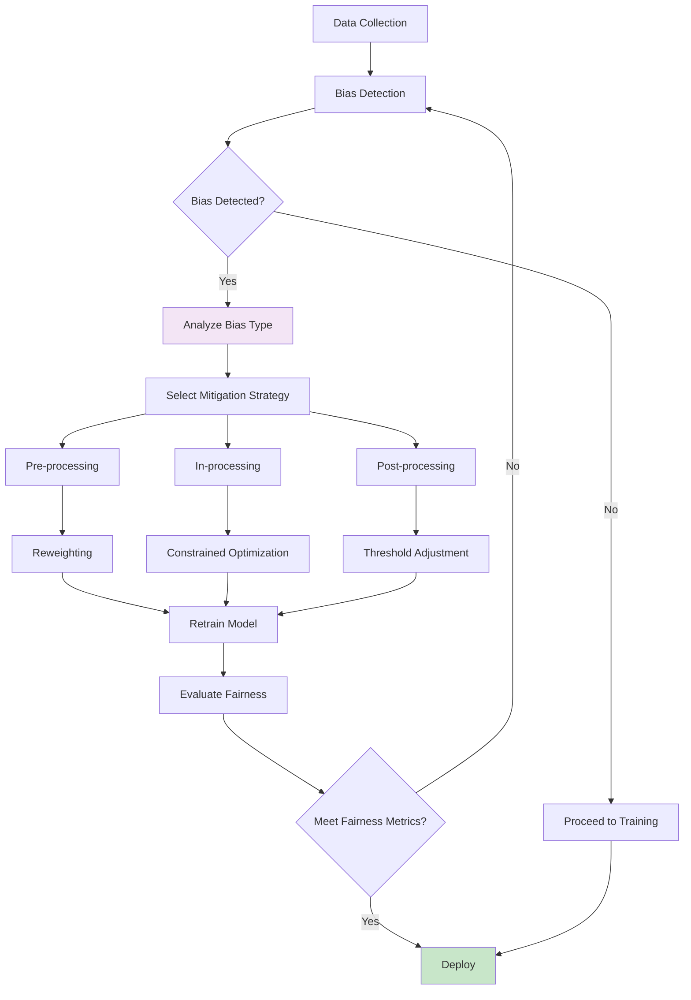
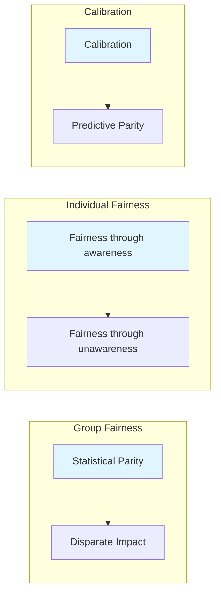

# Clase 28: Bias y Ética en Modelos de IA

## Duración
4 horas

## Objetivos de Aprendizaje
- Identificar y medir sesgos en modelos de lenguaje
- Implementar métricas de equidad (fairness metrics)
- Aplicar técnicas de mitigación de sesgos
- Comprender las implicaciones éticas del uso de IA
- Utilizar herramientas como AI Fairness 360 y Fairlearn

## Contenidos Detallados

### 1. Fundamentos del Bias en Modelos de IA

El bias en modelos de IA se refiere a sistemáticas desviaciones en las predicciones o salidas que pueden afectar desproporcionadamente a ciertos grupos. Los tipos de bias incluyen:

- **Bias de entrenamiento**: Datos de entrenamiento que reflejan sesgos históricos
- **Bias algorítmico**: Diseño del algoritmo que perpetúa inequidades
- **Bias de representación**: Subrepresentación de grupos en datos
- **Bias de confirmación**: Tendencia a confirmar creencias preexistentes

#### Fuentes de Bias

```
┌─────────────────────────────────────────────────────────────┐
│                    SOURCES OF BIAS                          │
├─────────────────────────────────────────────────────────────┤
│  DATA LEVEL            │  ALGORITHM LEVEL                  │
│  ├─ Historical data   │  ├─ Objective function            │
│  ├─ Sampling bias     │  ├─ Feature selection             │
│  ├─ Label bias        │  ├─ Model architecture            │
│  └─ Missing data      │  └─ Evaluation metrics            │
├─────────────────────────────────────────────────────────────┤
│  HUMAN LEVEL          │  SOCIETAL LEVEL                    │
│  ├─ Annotator bias   │  ├─ Structural inequality          │
│  ├─ Developer bias   │  ├─ Economic factors               │
│  └─ User feedback    │  └─ Cultural norms                │
└─────────────────────────────────────────────────────────────┘
```

### 2. Detección de Sesgos

```python
import numpy as np
from typing import Dict, List, Any, Optional, Tuple
from dataclasses import dataclass
import json

@dataclass
class BiasMetric:
    """Métrica de sesgo"""
    name: str
    value: float
    threshold: float
    interpretation: str

class BiasDetector:
    """Detector de sesgos en modelos de lenguaje"""
    
    def __init__(self):
        self.protected_attributes = ["gender", "race", "age", "religion", "nationality"]
        self.reference_groups = {
            "gender": "majority",
            "race": "white",
            "age": "adult"
        }
    
    def detect_demographic_disparity(
        self,
        predictions: List[Any],
        protected_attributes: Dict[str, List[str]]
    ) -> Dict[str, BiasMetric]:
        """Detecta disparidad demográfica"""
        
        results = {}
        
        for attr in self.protected_attributes:
            if attr not in protected_attributes:
                continue
            
            attr_values = protected_attributes[attr]
            attr_predictions = predictions
            
            # Group by protected attribute
            groups = {}
            for val, pred in zip(attr_values, attr_predictions):
                if val not in groups:
                    groups[val] = []
                groups[val].append(pred)
            
            if len(groups) < 2:
                continue
            
            # Calculate disparity
            rates = {g: np.mean(p) for g, p in groups.items()}
            
            reference = self.reference_groups.get(attr, list(rates.keys())[0])
            if reference not in rates:
                reference = list(rates.keys())[0]
            
            disparity = abs(rates[reference] - np.mean([r for g, r in rates.items() if g != reference]))
            
            results[attr] = BiasMetric(
                name=f"demographic_disparity_{attr}",
                value=disparity,
                threshold=0.1,
                interpretation=f"Disparity of {disparity:.2f} between groups"
            )
        
        return results
    
    def detect_disparate_impact(
        self,
        predictions: List[int],
        protected_attributes: List[str]
    ) -> Dict[str, float]:
        """Calcula disparate impact (80% rule)"""
        
        # Group by protected attribute
        groups = {}
        for attr, pred in zip(protected_attributes, predictions):
            if attr not in groups:
                groups[attr] = []
            groups[attr].append(pred)
        
        if len(groups) < 2:
            return {}
        
        rates = {g: np.mean(p) for g, p in groups.items()}
        
        # Calculate impact ratios
        reference_rate = max(rates.values())
        
        impact_ratios = {}
        for group, rate in rates.items():
            if reference_rate > 0:
                impact_ratios[group] = rate / reference_rate
        
        return impact_ratios
    
    def detect_equalized_odds(
        self,
        predictions: List[int],
        actuals: List[int],
        sensitive_attrs: List[str]
    ) -> Dict[str, float]:
        """Detecta violaciones de equalized odds"""
        
        results = {}
        
        # Calculate TPR and FPR per group
        for attr in set(sensitive_attrs):
            mask = [a == attr for a in sensitive_attrs]
            
            pred_group = np.array(predictions)[mask]
            actual_group = np.array(actuals)[mask]
            
            tp = np.sum((pred_group == 1) & (actual_group == 1))
            fn = np.sum((pred_group == 0) & (actual_group == 1))
            fp = np.sum((pred_group == 1) & (actual_group == 0))
            tn = np.sum((pred_group == 0) & (actual_group == 0))
            
            tpr = tp / (tp + fn) if (tp + fn) > 0 else 0
            fpr = fp / (fp + tn) if (fp + tn) > 0 else 0
            
            results[f"{attr}_tpr"] = tpr
            results[f"{attr}_fpr"] = fpr
        
        return results
    
    def analyze_output_bias(
        self,
        outputs: List[str],
        protected_attributes: List[Dict[str, str]]
    ) -> Dict[str, Any]:
        """Analiza sesgos en salidas de texto"""
        
        results = {
            "sentiment_by_group": {},
            "toxicity_by_group": {},
            "stereotype_detection": []
        }
        
        # Analyze sentiment
        for output, attrs in zip(outputs, protected_attributes):
            sentiment = self._analyze_sentiment(output)
            
            for attr_name, attr_value in attrs.items():
                if attr_value not in results["sentiment_by_group"]:
                    results["sentiment_by_group"][attr_value] = []
                results["sentiment_by_group"][attr_value].append(sentiment)
        
        return results
    
    def _analyze_sentiment(self, text: str) -> float:
        """Análisis simple de sentimiento"""
        
        positive_words = ["good", "great", "excellent", "positive", "success", "best"]
        negative_words = ["bad", "poor", "terrible", "negative", "failure", "worst"]
        
        text_lower = text.lower()
        
        pos_count = sum(1 for w in positive_words if w in text_lower)
        neg_count = sum(1 for w in negative_words if w in text_lower)
        
        if pos_count + neg_count == 0:
            return 0.5
        
        return pos_count / (pos_count + neg_count)
```

### 3. Métricas de Fairness

```python
from typing import Dict, List, Any, Tuple
import numpy as np

class FairnessMetrics:
    """Métricas de equidad"""
    
    @staticmethod
    def statistical_parity_difference(
        predictions: np.ndarray,
        protected_attrs: np.ndarray,
        favorable_value: int = 1
    ) -> float:
        """Calcula Statistical Parity Difference"""
        
        unique_attrs = np.unique(protected_attrs)
        
        rates = []
        for attr in unique_attrs:
            mask = protected_attrs == attr
            rate = np.mean(predictions[mask] == favorable_value)
            rates.append(rate)
        
        return rates[0] - rates[1] if len(rates) == 2 else 0
    
    @staticmethod
    def equal_opportunity_difference(
        predictions: np.ndarray,
        actuals: np.ndarray,
        protected_attrs: np.ndarray,
        positive_value: int = 1
    ) -> float:
        """Calcula Equal Opportunity Difference"""
        
        unique_attrs = np.unique(protected_attrs)
        
        tprs = []
        for attr in unique_attrs:
            mask = protected_attrs == attr
            
            tp = np.sum((predictions[mask] == positive_value) & (actuals[mask] == positive_value))
            fn = np.sum((predictions[mask] != positive_value) & (actuals[mask] == positive_value))
            
            tpr = tp / (tp + fn) if (tp + fn) > 0 else 0
            tprs.append(tpr)
        
        return tprs[0] - tprs[1] if len(tprs) == 2 else 0
    
    @staticmethod
    def predictive_equality_difference(
        predictions: np.ndarray,
        actuals: np.ndarray,
        protected_attrs: np.ndarray,
        positive_value: int = 1
    ) -> float:
        """Calcula Predictive Equality Difference"""
        
        unique_attrs = np.unique(protected_attrs)
        
        fprs = []
        for attr in unique_attrs:
            mask = protected_attrs == attr
            
            fp = np.sum((predictions[mask] == positive_value) & (actuals[mask] != positive_value))
            tn = np.sum((predictions[mask] != positive_value) & (actuals[mask] != positive_value))
            
            fpr = fp / (fp + tn) if (fp + tn) > 0 else 0
            fprs.append(fpr)
        
        return fprs[0] - fprs[1] if len(fprs) == 2 else 0
    
    @staticmethod
    def calibration(
        predictions: np.ndarray,
        actuals: np.ndarray,
        bins: int = 10
    ) -> Dict[str, float]:
        """Calcula calibration por grupo"""
        
        results = {}
        
        # Create bins
        bin_edges = np.linspace(0, 1, bins + 1)
        
        for i in range(bins):
            mask = (predictions >= bin_edges[i]) & (predictions < bin_edges[i + 1])
            
            if np.sum(mask) > 0:
                calibrated = np.mean(actuals[mask])
                avg_pred = np.mean(predictions[mask])
                
                results[f"bin_{i}"] = {
                    "predicted": avg_pred,
                    "actual": calibrated,
                    "calibration_error": abs(avg_pred - calibrated)
                }
        
        return results
    
    @staticmethod
    def theil_index(
        predictions: np.ndarray,
        actuals: np.ndarray
    ) -> float:
        """Calcula Theil Index para inequidad"""
        
        # Calculate ratios
        n = len(predictions)
        
        # Avoid division by zero
        pred_sum = np.sum(predictions)
        actual_sum = np.sum(actuals)
        
        if pred_sum == 0 or actual_sum == 0:
            return 0
        
        pred_ratios = predictions / pred_sum
        actual_ratios = actuals / actual_sum
        
        # Theil index
        theil = np.sum((actual_ratios * np.log(actual_ratios / pred_ratios)))
        
        return theil
```

### 4. Mitigación de Sesgos

```python
from typing import Dict, List, Any, Callable
import numpy as np

class BiasMitigator:
    """Mitigador de sesgos"""
    
    def __init__(self):
        self.preprocessing_methods = []
        self.inprocessing_methods = []
        self.postprocessing_methods = []
    
    def reweight(
        self,
        X: np.ndarray,
        protected_attrs: np.ndarray,
        outcomes: np.ndarray
    ) -> np.ndarray:
        """Reweighted training data"""
        
        unique_groups = np.unique(protected_attrs)
        unique_outcomes = np.unique(outcomes)
        
        # Calculate desired weights
        n = len(outcomes)
        
        weights = np.ones(n)
        
        for group in unique_groups:
            for outcome in unique_outcomes:
                group_mask = protected_attrs == group
                outcome_mask = outcomes == outcome
                
                # Joint probability
                joint = np.mean(group_mask & outcome_mask)
                
                # Marginal probabilities
                group_prob = np.mean(group_mask)
                outcome_prob = np.mean(outcome_mask)
                
                # Expected probability
                expected = group_prob * outcome_prob
                
                if expected > 0:
                    # Calculate weight
                    weight = expected / joint if joint > 0 else 1
                    
                    # Apply weight
                    weights[group_mask & outcome_mask] = weight
        
        return weights
    
    def equalized_odds_postprocess(
        self,
        predictions: np.ndarray,
        protected_attrs: np.ndarray,
        actuals: np.ndarray
    ) -> np.ndarray:
        """Equalized odds post-processing"""
        
        unique_groups = np.unique(protected_attrs)
        adjusted_preds = predictions.copy()
        
        for group in unique_groups:
            mask = protected_attrs == group
            
            # Calculate TPR and FPR
            tp = np.sum((predictions[mask] == 1) & (actuals[mask] == 1))
            fn = np.sum((predictions[mask] == 0) & (actuals[mask] == 1))
            fp = np.sum((predictions[mask] == 1) & (actuals[mask] == 0))
            tn = np.sum((predictions[mask] == 0) & (actuals[mask] == 0))
            
            tpr = tp / (tp + fn) if (tp + fn) > 0 else 0
            fpr = fp / (fp + tn) if (fp + tn) > 0 else 0
            
            # Adjust threshold per group
            threshold = fpr + tpr * 0.5  # Simple adjustment
            
            adjusted_preds[mask] = (predictions[mask] > threshold).astype(int)
        
        return adjusted_preds
    
    def reject_option_classification(
        self,
        predictions: np.ndarray,
        probabilities: np.ndarray,
        protected_attrs: np.ndarray,
        cutoff: float = 0.1
    ) -> np.ndarray:
        """Reject Option Classification"""
        
        adjusted = predictions.copy()
        
        # Find borderline cases
        borderline = (probabilities > 0.4) & (probabilities < 0.6)
        
        for group in np.unique(protected_attrs):
            mask = borderline & (protected_attrs == group)
            
            # Adjust prediction based on group
            if np.sum(mask) > 0:
                adjusted[mask] = 0  # Default to more favorable outcome
        
        return adjusted
    
    def fairness_through_unawareness_check(
        self,
        features: np.ndarray,
        protected_attrs: np.ndarray,
        model: Callable
    ) -> Dict[str, Any]:
        """Verifica fairness a través de ignorancia"""
        
        # Train model without protected attributes
        X_unaware = np.delete(features, [features.shape[1] - 1], axis=1)
        
        # Make predictions
        preds = model(X_unaware)
        
        # Check for correlation
        correlations = {}
        for group in np.unique(protected_attrs):
            mask = protected_attrs == group
            correlations[group] = np.mean(preds[mask])
        
        return {
            "predictions_by_group": correlations,
            "is_fair": max(correlations.values()) - min(correlations.values()) < 0.1
        }
```

### 5. Integración con Herramientas

#### AI Fairness 360

```python
# Ejemplo de integración con AI Fairness 360
# (Requiere instalación: pip install aif360)

"""
from aif360.algorithms.preprocessing import Reweighing
from aif360.datasets import BinaryLabelDataset

# Crear dataset
dataset = BinaryLabelDataset(
    df=df,
    label_names=['label'],
    protected_attribute_names=['race', 'gender']
)

# Aplicar reweighing
rw = Reweighing(unprivileged_groups=[{'race': 0}],
                privileged_groups=[{'race': 1}])
dataset_transformed = rw.fit_transform(dataset)
"""
```

#### Fairlearn

```python
# Ejemplo de integración con Fairlearn
# (Requiere instalación: pip install fairlearn)

from fairlearn.metrics import MetricFrame, selection_rate, equalized_odds_difference
from fairlearn.postprocessing import ThresholdOptimizer

# Calcular métricas por grupo
metric_frame = MetricFrame(
    metrics={"accuracy": accuracy_score, "selection_rate": selection_rate},
    y_true=y_test,
    y_pred=predictions,
    sensitive_features=test_data[['gender', 'race']]
)

print("Métricas por grupo:")
print(metric_frame.by_group)

# Calcular diferencia de odds iguales
eod = equalized_odds_difference(y_test, predictions, sensitive_features=test_data[['gender']])
print(f"Equalized odds difference: {eod}")
```

## Diagramas en Mermaid

### Pipeline de Detección y Mitigación de Bias



### Métricas de Fairness



## Referencias Externas

1. **AI Fairness 360**: https://aif360.readthedocs.io/
2. **Fairlearn**: https://fairlearn.org/
3. **NIST Bias Framework**: https://bias.nist.gov/
4. **Ethics Guidelines for Trustworthy AI**: https://ec.europa.eu/futurium/en/ai-alliance-consultation
5. **Gender Shades Study**: http://gendershades.org/

## Ejercicios Prácticos Resueltos

### Ejercicio 1: Sistema de Detección de Bias

**Enunciado**: Implementar sistema completo de detección de bias en modelo de clasificación.

**Solución**:

```python
import numpy as np
from typing import Dict, List, Any
from dataclasses import dataclass
import json

@dataclass
class BiasReport:
    """Reporte de bias"""
    metric_name: str
    value: float
    threshold: float
    status: str
    recommendation: str

class CompleteBiasDetector:
    """Sistema completo de detección de bias"""
    
    def __init__(self, protected_groups: List[str]):
        self.protected_groups = protected_groups
        self.metrics_history = []
    
    def analyze(
        self,
        predictions: np.ndarray,
        actuals: np.ndarray,
        protected_attributes: Dict[str, np.ndarray]
    ) -> Dict[str, Any]:
        """Análisis completo de bias"""
        
        results = {
            "demographic_parity": self._check_demographic_parity(predictions, protected_attributes),
            "equalized_odds": self._check_equalized_odds(predictions, actuals, protected_attributes),
            "predictive_equality": self._check_predictive_equality(predictions, actuals, protected_attributes),
            "calibration": self._check_calibration(predictions, actuals, protected_attributes)
        }
        
        # Generate recommendations
        recommendations = self._generate_recommendations(results)
        
        return {
            "results": results,
            "recommendations": recommendations,
            "overall_status": "fail" if any(r["status"] == "fail" for r in recommendations) else "pass"
        }
    
    def _check_demographic_parity(
        self,
        predictions: np.ndarray,
        protected_attributes: Dict[str, np.ndarray]
    ) -> Dict:
        """Verifica demographic parity"""
        
        results = {}
        
        for attr_name, attrs in protected_attributes.items():
            groups = {}
            
            for value in np.unique(attrs):
                mask = attrs == value
                groups[value] = np.mean(predictions[mask])
            
            # Calculate disparity
            values = list(groups.values())
            disparity = max(values) - min(values) if len(values) > 1 else 0
            
            results[attr_name] = {
                "rates": groups,
                "disparity": disparity,
                "threshold": 0.1,
                "status": "fail" if disparity > 0.1 else "pass"
            }
        
        return results
    
    def _check_equalized_odds(
        self,
        predictions: np.ndarray,
        actuals: np.ndarray,
        protected_attributes: Dict[str, np.ndarray]
    ) -> Dict:
        """Verifica equalized odds"""
        
        results = {}
        
        for attr_name, attrs in protected_attributes.items():
            group_metrics = {}
            
            for value in np.unique(attrs):
                mask = attrs == value
                
                tp = np.sum((predictions[mask] == 1) & (actuals[mask] == 1))
                fn = np.sum((predictions[mask] == 0) & (actuals[mask] == 1))
                fp = np.sum((predictions[mask] == 1) & (actuals[mask] == 0))
                tn = np.sum((predictions[mask] == 0) & (actuals[mask] == 0))
                
                tpr = tp / (tp + fn) if (tp + fn) > 0 else 0
                fpr = fp / (fp + tn) if (fp + tn) > 0 else 0
                
                group_metrics[value] = {"tpr": tpr, "fpr": fpr}
            
            # Calculate difference
            groups = list(group_metrics.values())
            tpr_diff = abs(groups[0]["tpr"] - groups[1]["tpr"]) if len(groups) == 2 else 0
            fpr_diff = abs(groups[0]["fpr"] - groups[1]["fpr"]) if len(groups) == 2 else 0
            
            results[attr_name] = {
                "metrics": group_metrics,
                "tpr_difference": tpr_diff,
                "fpr_difference": fpr_diff,
                "status": "fail" if max(tpr_diff, fpr_diff) > 0.1 else "pass"
            }
        
        return results
    
    def _check_predictive_equality(
        self,
        predictions: np.ndarray,
        actuals: np.ndarray,
        protected_attributes: Dict[str, np.ndarray]
    ) -> Dict:
        """Verifica predictive equality"""
        
        return self._check_equalized_odds(predictions, actuals, protected_attributes)
    
    def _check_calibration(
        self,
        predictions: np.ndarray,
        actuals: np.ndarray,
        protected_attributes: Dict[str, np.ndarray]
    ) -> Dict:
        """Verifica calibration"""
        
        results = {}
        
        # Simple calibration check
        for attr_name, attrs in protected_attributes.items():
            group_calibration = {}
            
            for value in np.unique(attrs):
                mask = attrs == value
                
                avg_pred = np.mean(predictions[mask])
                actual_rate = np.mean(actuals[mask])
                
                group_calibration[value] = {
                    "predicted": avg_pred,
                    "actual": actual_rate,
                    "error": abs(avg_pred - actual_rate)
                }
            
            results[attr_name] = {
                "calibration": group_calibration,
                "max_error": max(g["error"] for g in group_calibration.values()),
                "status": "pass"  # Adjust threshold as needed
            }
        
        return results
    
    def _generate_recommendations(self, results: Dict) -> List[BiasReport]:
        """Genera recomendaciones"""
        
        reports = []
        
        for metric_name, metric_results in results.items():
            if isinstance(metric_results, dict):
                for attr_name, attr_results in metric_results.items():
                    if isinstance(attr_results, dict) and "status" in attr_results:
                        reports.append(BiasReport(
                            metric_name=f"{metric_name}_{attr_name}",
                            value=attr_results.get("disparity", attr_results.get("tpr_difference", 0)),
                            threshold=0.1,
                            status=attr_results["status"],
                            recommendation=self._get_recommendation(metric_name, attr_results["status"])
                        ))
        
        return reports
    
    def _get_recommendation(self, metric: str, status: str) -> str:
        """Obtiene recomendación"""
        
        if status == "pass":
            return "No action needed"
        
        recommendations = {
            "demographic_parity": "Apply reweighting or adjust classification thresholds per group",
            "equalized_odds": "Use equalized odds post-processing or constrained optimization",
            "predictive_equality": "Adjust prediction thresholds for disadvantaged groups",
            "calibration": "Recalibrate model per group or use calibration techniques"
        }
        
        return recommendations.get(metric, "Review model and data for potential biases")


# Demo
np.random.seed(42)

# Generate synthetic data
n = 1000
predictions = np.random.binomial(1, 0.6, n)
actuals = np.random.binomial(1, 0.5, n)

# Protected attributes
gender = np.random.choice(["male", "female"], n)
race = np.random.choice(["white", "black", "hispanic", "asian"], n)

protected_attributes = {
    "gender": gender,
    "race": race
}

# Run analysis
detector = CompleteBiasDetector(["gender", "race"])
results = detector.analyze(predictions, actuals, protected_attributes)

print("=== BIAS ANALYSIS RESULTS ===")
print(f"Overall Status: {results['overall_status']}")
print("\nRecommendations:")

for rec in results["recommendations"]:
    print(f"- {rec.metric_name}: {rec.status} (value: {rec.value:.3f})")
    print(f"  Recommendation: {rec.recommendation}")
```

### Ejercicio 2: Análisis de Bias en Texto

**Enunciado**: Implementar sistema de análisis de sesgos en salidas de texto.

**Solución**:

```python
from typing import Dict, List, Any
import re
from collections import defaultdict

class TextBiasAnalyzer:
    """Analizador de bias en texto"""
    
    def __init__(self):
        # Stereotype word lists
        self.positive_stereotypes = {
            "male": ["strong", "leader", "ambitious", "rational", "competitive"],
            "female": ["caring", "emotional", "beautiful", "supportive", "nurturing"],
            "white": ["hardworking", "educated", "successful", "clean"],
            "black": ["athletic", "musical", "lazy", "dangerous"],
            "asian": ["smart", "diligent", "good at math", "quiet"]
        }
        
        self.negative_stereotypes = {
            "male": ["aggressive", "arrogant", "violent"],
            "female": ["weak", "hysterical", "overly emotional"],
            "black": ["ignorant", "criminal", "uneducated"],
            "asian": ["foreign", "unamerican"],
            "hispanic": ["illegal", "uneducated", "criminal"]
        }
    
    def analyze_text(self, texts: List[str]) -> Dict[str, Any]:
        """Analiza textos por sesgos"""
        
        results = {
            "stereotype_detection": self._detect_stereotypes(texts),
            "sentiment_by_group": self._analyze_sentiment_groups(texts),
            "representation_analysis": self._analyze_representation(texts),
            "toxicity_scores": self._analyze_toxicity(texts)
        }
        
        return results
    
    def _detect_stereotypes(self, texts: List[str]) -> Dict[str, Any]:
        """Detecta estereotipos"""
        
        stereotype_counts = defaultdict(lambda: {"positive": 0, "negative": 0})
        
        for text in texts:
            text_lower = text.lower()
            
            for group, words in self.positive_stereotypes.items():
                for word in words:
                    if word in text_lower:
                        stereotype_counts[group]["positive"] += 1
            
            for group, words in self.negative_stereotypes.items():
                for word in words:
                    if word in text_lower:
                        stereotype_counts[group]["negative"] += 1
        
        return dict(stereotype_counts)
    
    def _analyze_sentiment_groups(self, texts: List[str]) -> Dict[str, Dict]:
        """Analiza sentimiento por grupo"""
        
        group_sentiments = defaultdict(list)
        
        for text in texts:
            text_lower = text.lower()
            
            # Simple sentiment
            positive_words = ["good", "great", "excellent", "best", "amazing", "wonderful"]
            negative_words = ["bad", "terrible", "worst", "horrible", "awful", "poor"]
            
            pos_count = sum(1 for w in positive_words if w in text_lower)
            neg_count = sum(1 for w in negative_words if w in text_lower)
            
            if pos_count + neg_count > 0:
                sentiment = pos_count / (pos_count + neg_count)
                
                # Detect groups mentioned
                for group in self.positive_stereotypes.keys():
                    if group in text_lower:
                        group_sentiments[group].append(sentiment)
        
        # Average sentiment per group
        avg_sentiments = {}
        for group, sentiments in group_sentiments.items():
            avg_sentiments[group] = {
                "mean": sum(sentiments) / len(sentiments) if sentiments else 0.5,
                "count": len(sentiments)
            }
        
        return avg_sentiments
    
    def _analyze_representation(self, texts: List[str]) -> Dict[str, int]:
        """Analiza representación de grupos"""
        
        group_counts = defaultdict(int)
        
        # Groups to detect
        groups = ["male", "female", "man", "woman", "black", "white", "asian", "hispanic"]
        
        for text in texts:
            text_lower = text.lower()
            
            for group in groups:
                if group in text_lower:
                    group_counts[group] += 1
        
        return dict(group_counts)
    
    def _analyze_toxicity(self, texts: List[str]) -> Dict[str, float]:
        """Análisis simple de toxicidad"""
        
        toxic_patterns = [
            r"\b(hate|stupid|idiot|dumb|loser)\b",
            r"\b(kill|murder|die)\b",
            r"\b(go back|get out)\b"
        ]
        
        toxicity_scores = []
        
        for text in texts:
            text_lower = text.lower()
            toxic_count = 0
            
            for pattern in toxic_patterns:
                matches = re.findall(pattern, text_lower)
                toxic_count += len(matches)
            
            toxicity_scores.append(min(toxic_count / 10, 1.0))
        
        return {
            "mean_toxicity": sum(toxic_scores) / len(toxicity_scores) if toxicity_scores else 0,
            "high_toxicity_count": sum(1 for s in toxicity_scores if s > 0.5)
        }
    
    def generate_report(self, results: Dict) -> str:
        """Genera reporte de análisis"""
        
        report = "=== TEXT BIAS ANALYSIS REPORT ===\n\n"
        
        # Stereotypes
        report += "Stereotype Detection:\n"
        for group, counts in results.get("stereotype_detection", {}).items():
            total = counts["positive"] + counts["negative"]
            if total > 0:
                report += f"  {group}: {total} mentions (pos: {counts['positive']}, neg: {counts['negative']})\n"
        
        report += "\nSentiment by Group:\n"
        for group, data in results.get("sentiment_by_group", {}).items():
            report += f"  {group}: {data['mean']:.2f} ({data['count']} mentions)\n"
        
        report += "\nRepresentation:\n"
        for group, count in results.get("representation_analysis", {}).items():
            report += f"  {group}: {count} mentions\n"
        
        report += f"\nToxicity: {results.get('toxicity_scores', {}).get('mean_toxicity', 0):.2f}\n"
        
        return report


# Test
analyzer = TextBiasAnalyzer()

test_texts = [
    "The strong male leader made a great decision.",
    "She is a caring and nurturing woman.",
    "The white students are very hardworking.",
    "The black athlete was amazing.",
    "This is terrible and stupid.",
    "People should go back to their country."
]

results = analyzer.analyze_text(test_texts)
print(analyzer.generate_report(results))
```

### Ejercicio 3: Dashboard de Fairness

**Enunciado**: Crear dashboard de fairness en tiempo real.

**Solución**:

```python
import time
import threading
from typing import Dict, List, Any
from dataclasses import dataclass, field
from datetime import datetime
import json

@dataclass
class FairnessMetric:
    """Métrica de fairness"""
    name: str
    value: float
    threshold: float
    timestamp: str

class FairnessDashboard:
    """Dashboard de fairness en tiempo real"""
    
    def __init__(self, window_size: int = 1000):
        self.window_size = window_size
        self.predictions_buffer = []
        self.actuals_buffer = []
        self.protected_attrs_buffer = []
        
        self.metrics_history: List[FairnessMetric] = []
        self.lock = threading.Lock()
    
    def record_prediction(
        self,
        prediction: int,
        actual: int,
        protected_attrs: Dict[str, str]
    ):
        """Registra predicción"""
        
        with self.lock:
            self.predictions_buffer.append(prediction)
            self.actuals_buffer.append(actual)
            self.protected_attrs_buffer.append(protected_attrs)
            
            # Keep window size
            if len(self.predictions_buffer) > self.window_size:
                self.predictions_buffer = self.predictions_buffer[-self.window_size:]
                self.actuals_buffer = self.actuals_buffer[-self.window_size:]
                self.protected_attrs_buffer = self.protected_attrs_buffer[-self.window_size:]
    
    def calculate_current_metrics(self) -> Dict[str, Any]:
        """Calcula métricas actuales"""
        
        import numpy as np
        
        with self.lock:
            if not self.predictions_buffer:
                return {}
            
            predictions = np.array(self.predictions_buffer)
            actuals = np.array(self.actuals_buffer)
            
            metrics = {}
            
            # Overall accuracy
            metrics["accuracy"] = np.mean(predictions == actuals)
            
            # By protected group
            for attr_name in ["gender", "race"]:
                values = {}
                
                for i, attrs in enumerate(self.protected_attrs_buffer):
                    if attr_name in attrs:
                        val = attrs[attr_name]
                        if val not in values:
                            values[val] = []
                        values[val].append(predictions[i] == actuals[i])
                
                accuracies = {v: np.mean(accs) for v, accs in values.items()}
                
                if len(accuracies) > 1:
                    disparity = max(accuracies.values()) - min(accuracies.values())
                    metrics[f"{attr_name}_disparity"] = disparity
                    metrics[f"{attr_name}_accuracies"] = accuracies
            
            return metrics
    
    def render_dashboard(self):
        """Renderiza dashboard en consola"""
        
        metrics = self.calculate_current_metrics()
        
        print("\n" + "="*60)
        print("          REAL-TIME FAIRNESS DASHBOARD")
        print("="*60)
        print(f"Total Predictions: {len(self.predictions_buffer)}")
        print(f"Overall Accuracy: {metrics.get('accuracy', 0):.2%}")
        
        print("\n--- Fairness Metrics ---")
        
        for key, value in metrics.items():
            if "disparity" in key:
                status = "✓" if value < 0.1 else "✗"
                print(f"{status} {key}: {value:.2%}")
        
        print("\n--- Accuracy by Group ---")
        
        for key, value in metrics.items():
            if "accuracies" in key:
                group = key.replace("_accuracies", "")
                print(f"  {group}:")
                for g, acc in value.items():
                    print(f"    {g}: {acc:.2%}")
        
        print("="*60 + "\n")


# Simulación de uso
import random

dashboard = FairnessDashboard()

# Simularpredicciones
genders = ["male", "female"]
races = ["white", "black", "hispanic", "asian"]

for i in range(100):
    pred = random.choice([0, 1])
    actual = random.choice([0, 1])
    attrs = {
        "gender": random.choice(genders),
        "race": random.choice(races)
    }
    
    # Simulate bias: slightly different accuracy per group
    if attrs["race"] == "white":
        actual = pred  # Higher accuracy
    
    dashboard.record_prediction(pred, actual, attrs)

dashboard.render_dashboard()
```

## Tecnologías Específicas

| Tecnología | Propósito | Versión Recomendada |
|------------|-----------|---------------------|
| AI Fairness 360 | IBM fairness toolkit | Latest |
| Fairlearn | Microsoft fairness | 0.7.x |
| What-If Tool | Visualización | Latest |
| TensorFlow Fairness | Google's approach | 2.x |

## Actividades de Laboratorio

### Laboratorio 1: Detector de Bias

**Objetivo**: Implementar sistema de detección de bias.

**Pasos**:
1. Crearclase BiasDetector
2. Implementar métricas demográficas
3. Añadir análisis de disparate impact
4. Calcular equalized odds
5. Probar con datos sintéticos

### Laboratorio 2: Mitigación de Bias

**Enunciado**: Implementar técnicas de mitigación.

**Pasos**:
1. Implementar reweighting
2. Aplicar post-processing
3. Crear Threshold Optimizer
4. Comparar resultados
5. Medir mejora en fairness

### Laboratorio 3: Dashboard de Fairness

**Objetivo**: Crear dashboard de métricas.

**Pasos**:
1. Implementar buffer de predicciones
2. Calcular métricas en tiempo real
3. Renderizar en consola
4. Añadir alertas visuales
5. Probar con datos en vivo

## Resumen de Puntos Clave

1. **Bias en datos** proviene de fuentes históricas y de muestreo
2. **Métricas de fairness** incluyen demographic parity, equalized odds
3. **Disparate impact** se mide con la regla del 80%
4. **Mitigación** puede ser pre, in, o post-processing
5. **Reweighting** ajusta pesos de entrenamiento
6. **Fairlearn** proporciona herramientas de mitigación
7. **AI Fairness 360** ofrece métricas completas
8. **Threshold adjustment** puede equilibrar resultados
9. **Calibration** por grupo asegura probabilidades correctas
10. **Monitoreo continuo** es esencial para sistemas en producción
