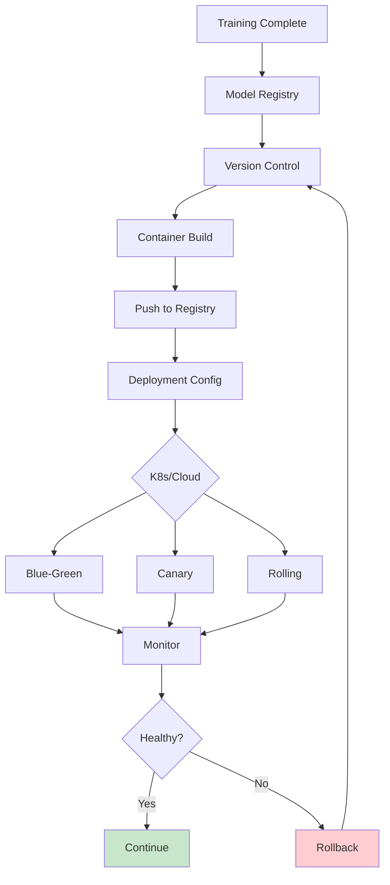
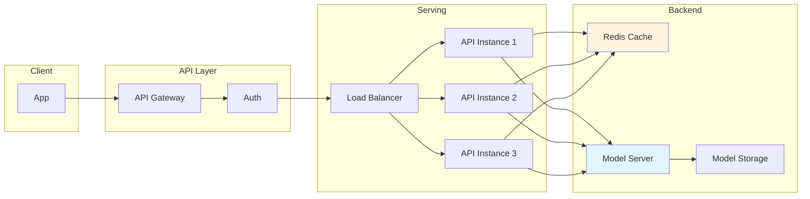

# Clase 29: Deployment de Modelos

## Duración
4 horas

## Objetivos de Aprendizaje
- Implementar serving de modelos de ML con FastAPI
- Crear APIs REST para inferencia de modelos
- Contenerizar aplicaciones de IA con Docker
- Utilizar TensorFlow Serving para modelos de producción
- Aplicar mejores prácticas de deployment

## Contenidos Detallados

### 1. Fundamentos de Model Serving

El model serving es el proceso de poner modelos de machine learning en producción para realizar inferencias. Los componentes clave incluyen:

- **API de inferencia**: Interfaz REST para realizar predicciones
- **Model registry**: Repositorio centralizado de modelos
- **Versioning**: Control de versiones de modelos
- **Monitoring**: Monitoreo de rendimiento y usage

#### Arquitectura de Serving

```
┌─────────────────────────────────────────────────────────────┐
│                   MODEL SERVING ARCHITECTURE                │
├─────────────────────────────────────────────────────────────┤
│                                                             │
│   Client → API Gateway → Model Server → Model Registry     │
│                        ↓                                    │
│                   Load Balancer                             │
│                        ↓                                    │
│              [Instance 1] [Instance 2] [Instance N]        │
│                        ↓                                    │
│                   Metrics Collection                        │
│                                                             │
└─────────────────────────────────────────────────────────────┘
```

### 2. FastAPI para Model Serving

FastAPI es un framework moderno y rápido para crear APIs en Python:

```python
from fastapi import FastAPI, HTTPException, BackgroundTasks
from pydantic import BaseModel, Field
from typing import List, Optional, Dict, Any
import numpy as np
from datetime import datetime
import time
import uuid

app = FastAPI(
    title="ML Model API",
    description="API para inferencia de modelos de ML",
    version="1.0.0"
)

# Modelos de datos de entrada/salida
class PredictionRequest(BaseModel):
    """Solicitud de predicción"""
    features: List[float] = Field(..., description="Features de entrada")
    model_version: Optional[str] = None
    metadata: Optional[Dict[str, Any]] = None

class PredictionResponse(BaseModel):
    """Respuesta de predicción"""
    request_id: str
    prediction: float
    probability: Optional[float] = None
    model_version: str
    timestamp: str
    latency_ms: float

class BatchPredictionRequest(BaseModel):
    """Solicitud de predicción en lote"""
    features: List[List[float]]
    model_version: Optional[str] = None

class BatchPredictionResponse(BaseModel):
    """Respuesta de predicción en lote"""
    request_id: str
    predictions: List[float]
    model_version: str
    timestamp: str
    total_latency_ms: float

# Almacenamiento en memoria (en producción usar base de datos)
model_cache = {}
prediction_history = []

# Endpoint de salud
@app.get("/health")
async def health_check():
    """Verifica el estado del servicio"""
    return {
        "status": "healthy",
        "timestamp": datetime.now().isoformat(),
        "models_loaded": list(model_cache.keys())
    }

@app.post("/predict", response_model=PredictionResponse)
async def predict(request: PredictionRequest):
    """Realiza una predicción"""
    
    start_time = time.time()
    request_id = str(uuid.uuid4())
    
    try:
        # Cargar modelo (simulado)
        model_version = request.model_version or "v1"
        
        # Realizar predicción (aquí va el modelo real)
        prediction = _predict_single(request.features)
        
        # Calcular latencia
        latency_ms = (time.time() - start_time) * 1000
        
        response = PredictionResponse(
            request_id=request_id,
            prediction=prediction,
            probability=0.85,  # En modelo real, calcular
            model_version=model_version,
            timestamp=datetime.now().isoformat(),
            latency_ms=latency_ms
        )
        
        # Guardar en historial
        prediction_history.append({
            "request_id": request_id,
            "timestamp": response.timestamp,
            "latency_ms": latency_ms,
            "model_version": model_version
        })
        
        return response
    
    except Exception as e:
        raise HTTPException(status_code=500, detail=str(e))

@app.post("/predict/batch", response_model=BatchPredictionResponse)
async def predict_batch(request: BatchPredictionRequest):
    """Realiza predicciones en lote"""
    
    start_time = time.time()
    request_id = str(uuid.uuid4())
    
    try:
        predictions = []
        for features in request.features:
            pred = _predict_single(features)
            predictions.append(pred)
        
        total_latency_ms = (time.time() - start_time) * 1000
        
        return BatchPredictionResponse(
            request_id=request_id,
            predictions=predictions,
            model_version=request.model_version or "v1",
            timestamp=datetime.now().isoformat(),
            total_latency_ms=total_latency_ms
        )
    
    except Exception as e:
        raise HTTPException(status_code=500, detail=str(e))

@app.get("/metrics")
async def get_metrics():
    """Obtiene métricas del servicio"""
    
    if not prediction_history:
        return {"error": "No predictions yet"}
    
    latencies = [p["latency_ms"] for p in prediction_history]
    
    return {
        "total_predictions": len(prediction_history),
        "avg_latency_ms": np.mean(latencies),
        "p50_latency_ms": np.percentile(latencies, 50),
        "p95_latency_ms": np.percentile(latencies, 95),
        "p99_latency_ms": np.percentile(latencies, 99),
        "min_latency_ms": min(latencies),
        "max_latency_ms": max(latencies)
    }

def _predict_single(features: List[float]) -> float:
    """Función de predicción (reemplazar con modelo real)"""
    # Simulardown predictions con un modelo simple
    return np.random.random() if features else 0.0
```

### 3. Contenerización con Docker

```dockerfile
# Dockerfile para servicio de inferencia
FROM python:3.11-slim

# Metadatos
LABEL maintainer="dev@example.com"
LABEL description="ML Model Inference API"

# Variables de entorno
ENV PYTHONUNBUFFERED=1
ENV PYTHONDONTWRITEBYTECODE=1

# Directorio de trabajo
WORKDIR /app

# Copiar requirements primero para cache
COPY requirements.txt .
RUN pip install --no-cache-dir -r requirements.txt

# Copiar aplicación
COPY . .

# Crear usuario no-root
RUN useradd -m -u 1000 appuser && chown -R appuser:appuser /app
USER appuser

# Exponer puerto
EXPOSE 8000

# Health check
HEALTHCHECK --interval=30s --timeout=3s --start-period=5s --retries=3 \
    CMD curl -f http://localhost:8000/health || exit 1

# Comando de inicio
CMD ["uvicorn", "main:app", "--host", "0.0.0.0", "--port", "8000"]
```

```yaml
# docker-compose.yml para desarrollo
version: '3.8'

services:
  api:
    build: .
    ports:
      - "8000:8000"
    environment:
      - MODEL_PATH=/models
      - API_KEY=${API_KEY}
    volumes:
      - ./models:/models
    healthcheck:
      test: ["CMD", "curl", "-f", "http://localhost:8000/health"]
      interval: 30s
      timeout: 10s
      retries: 3

  redis:
    image: redis:7-alpine
    ports:
      - "6379:6379"
    volumes:
      - redis_data:/data

volumes:
  redis_data:
```

```yaml
# docker-compose.yml para producción
version: '3.8'

services:
  api:
    build:
      context: .
      dockerfile: Dockerfile.prod
    deploy:
      replicas: 3
      resources:
        limits:
          cpus: '2'
          memory: 2G
        reservations:
          cpus: '1'
          memory: 1G
    environment:
      - REDIS_HOST=redis
      - MODEL_PATH=/models
    depends_on:
      - redis
    networks:
      - ml_network

  redis:
    image: redis:7-alpine
    command: redis-server --appendonly yes
    volumes:
      - redis_data:/data
    networks:
      - ml_network

  nginx:
    image: nginx:alpine
    ports:
      - "80:80"
      - "443:443"
    volumes:
      - ./nginx.conf:/etc/nginx/nginx.conf:ro
    depends_on:
      - api
    networks:
      - ml_network

networks:
  ml_network:
    driver: bridge

volumes:
  redis_data:
```

### 4. TensorFlow Serving

```python
# Ejemplo de cliente para TensorFlow Serving
import requests
import numpy as np
from typing import Dict, List, Any

class TensorFlowServingClient:
    """Cliente para TensorFlow Serving"""
    
    def __init__(self, host: str = "localhost", port: int = 8501, model_name: str = "my_model"):
        self.base_url = f"http://{host}:{port}/v1/models/{model_name}"
        self.predict_url = f"{self.base_url}:predict"
        self.metadata_url = f"{self.base_url}/metadata"
    
    def get_metadata(self) -> Dict:
        """Obtiene metadatos del modelo"""
        response = requests.get(self.metadata_url)
        response.raise_for_status()
        return response.json()
    
    def predict(self, inputs: np.ndarray) -> Dict:
        """Realiza predicción"""
        
        # Convertir a formato tensor
        instances = inputs.tolist() if isinstance(inputs, np.ndarray) else [inputs]
        
        payload = {
            "instances": instances
        }
        
        response = requests.post(self.predict_url, json=payload)
        response.raise_for_status()
        
        result = response.json()
        
        # Extraer predicciones
        if "predictions" in result:
            return {
                "predictions": np.array(result["predictions"]),
                "model_version": result.get("modelVersion", "unknown")
            }
        
        return result
    
    def predict_batch(self, inputs: List[np.ndarray]) -> Dict:
        """Predicción en lote"""
        
        instances = [inp.tolist() if isinstance(inp, np.ndarray) else inp for inp in inputs]
        
        payload = {
            "instances": instances
        }
        
        response = requests.post(self.predict_url, json=payload)
        response.raise_for_status()
        
        return response.json()
    
    def warmup(self, input_shape: tuple):
        """Warmup del modelo con datos dummy"""
        
        dummy_input = np.zeros(input_shape).tolist()
        
        payload = {
            "instances": [dummy_input]
        }
        
        response = requests.post(self.predict_url, json=payload)
        return response.status_code == 200
```

### 5. Deployment en Kubernetes

```yaml
# deployment.yaml
apiVersion: apps/v1
kind: Deployment
metadata:
  name: ml-model-deployment
  labels:
    app: ml-model
spec:
  replicas: 3
  selector:
    matchLabels:
      app: ml-model
  template:
    metadata:
      labels:
        app: ml-model
        version: v1
    spec:
      containers:
      - name: model-server
        image: myregistry/ml-model:v1.0.0
        ports:
        - containerPort: 8000
          name: http
        - containerPort: 9090
          name: grpc
        env:
        - name: MODEL_NAME
          value: "my_model"
        - name: REDIS_HOST
          valueFrom:
            configMapKeyRef:
              name: ml-config
              key: redis.host
        resources:
          requests:
            memory: "1Gi"
            cpu: "500m"
          limits:
            memory: "2Gi"
            cpu: "1000m"
        livenessProbe:
          httpGet:
            path: /health
            port: 8000
          initialDelaySeconds: 30
          periodSeconds: 10
        readinessProbe:
          httpGet:
            path: /health
            port: 8000
          initialDelaySeconds: 10
          periodSeconds: 5
        volumeMounts:
        - name: model-storage
          mountPath: /models
      volumes:
      - name: model-storage
        persistentVolumeClaim:
          claimName: model-pvc
---
apiVersion: v1
kind: Service
metadata:
  name: ml-model-service
spec:
  selector:
    app: ml-model
  ports:
  - name: http
    port: 80
    targetPort: 8000
  - name: grpc
    port: 9090
    targetPort: 9090
  type: ClusterIP
```

## Diagramas en Mermaid

### Flujo de Deployment



### Arquitectura de Serving con Cache



## Referencias Externas

1. **FastAPI Documentation**: https://fastapi.tiangolo.com/
2. **TensorFlow Serving**: https://www.tensorflow.org/tfx/guide/serving
3. **Docker Best Practices**: https://docs.docker.com/develop/develop-best-practices/
4. **Kubernetes for ML**: https://kubernetes.io/docs/concepts/configuration/overview/
5. **MLflow Model Registry**: https://mlflow.org/docs/latest/model-registry.html

## Ejercicios Prácticos Resueltos

### Ejercicio 1: API Completa de Model Serving

**Enunciado**: Crear API completa de model serving con FastAPI.

**Solución**:

```python
from fastapi import FastAPI, HTTPException, BackgroundTasks, Depends
from pydantic import BaseModel, Field
from typing import List, Optional, Dict, Any
import numpy as np
from datetime import datetime
import time
import uuid
import pickle
import os
from functools import lru_cache

app = FastAPI(title="ML Model API", version="1.0.0")

# Modelos de datos
class ModelInput(BaseModel):
    features: List[float] = Field(..., min_length=1, max_length=1000)
    return_probability: bool = False

class ModelOutput(BaseModel):
    request_id: str
    prediction: float
    probability: Optional[float] = None
    model_name: str
    model_version: str
    timestamp: str
    latency_ms: float

class BatchInput(BaseModel):
    features: List[List[float]]

class BatchOutput(BaseModel):
    request_id: str
    predictions: List[float]
    model_name: str
    timestamp: str
    total_latency_ms: float

class HealthResponse(BaseModel):
    status: str
    timestamp: str
    models: Dict[str, str]

class MetricsResponse(BaseModel):
    total_requests: int
    avg_latency_ms: float
    p95_latency_ms: float
    error_rate: float

# Simulación de modelo
class MockModel:
    def __init__(self, name: str, version: str):
        self.name = name
        self.version = version
        self._weights = np.random.randn(10)
    
    def predict(self, features: List[float], return_probability: bool = False) -> Dict:
        """Realiza predicción"""
        # Simular predicción
        features_array = np.array(features)
        
        # Producto punto simple
        score = np.dot(features_array[:len(self._weights)], self._weights)
        prob = 1 / (1 + np.exp(-score))
        
        result = {
            "prediction": 1 if prob > 0.5 else 0,
            "probability": float(prob) if return_probability else None
        }
        
        return result

# Almacenamiento
models = {
    "classifier": MockModel("classifier", "1.0.0")
}

request_metrics = []

def get_model(model_name: str = "classifier") -> MockModel:
    """Obtiene modelo por nombre"""
    if model_name not in models:
        raise HTTPException(status_code=404, detail=f"Model {model_name} not found")
    return models[model_name]

@app.get("/", response_model=HealthResponse)
async def root():
    """Endpoint raíz"""
    return HealthResponse(
        status="healthy",
        timestamp=datetime.now().isoformat(),
        models={name: model.version for name, model in models.items()}
    )

@app.get("/health", response_model=HealthResponse)
async def health_check():
    """Health check"""
    return HealthResponse(
        status="healthy",
        timestamp=datetime.now().isoformat(),
        models={name: model.version for name, model in models.items()}
    )

@app.post("/predict", response_model=ModelOutput)
async def predict(input_data: ModelInput, background_tasks: BackgroundTasks):
    """Predicción individual"""
    
    start_time = time.time()
    request_id = str(uuid.uuid4())
    
    try:
        model = get_model("classifier")
        result = model.predict(input_data.features, input_data.return_probability)
        
        latency_ms = (time.time() - start_time) * 1000
        
        # Guardar métrica
        request_metrics.append({
            "request_id": request_id,
            "timestamp": datetime.now(),
            "latency_ms": latency_ms,
            "error": False
        })
        
        return ModelOutput(
            request_id=request_id,
            prediction=result["prediction"],
            probability=result["probability"],
            model_name=model.name,
            model_version=model.version,
            timestamp=datetime.now().isoformat(),
            latency_ms=latency_ms
        )
    
    except Exception as e:
        # Registrar error
        request_metrics.append({
            "request_id": request_id,
            "timestamp": datetime.now(),
            "latency_ms": (time.time() - start_time) * 1000,
            "error": True
        })
        raise HTTPException(status_code=500, detail=str(e))

@app.post("/predict/batch", response_model=BatchOutput)
async def predict_batch(input_data: BatchInput):
    """Predicción en lote"""
    
    start_time = time.time()
    request_id = str(uuid.uuid4())
    
    try:
        model = get_model("classifier")
        
        predictions = []
        for features in input_data.features:
            result = model.predict(features)
            predictions.append(result["prediction"])
        
        total_latency_ms = (time.time() - start_time) * 1000
        
        return BatchOutput(
            request_id=request_id,
            predictions=predictions,
            model_name=model.name,
            timestamp=datetime.now().isoformat(),
            total_latency_ms=total_latency_ms
        )
    
    except Exception as e:
        raise HTTPException(status_code=500, detail=str(e))

@app.get("/metrics", response_model=MetricsResponse)
async def get_metrics():
    """Obtiene métricas"""
    
    if not request_metrics:
        return MetricsResponse(
            total_requests=0,
            avg_latency_ms=0,
            p95_latency_ms=0,
            error_rate=0
        )
    
    recent = request_metrics[-1000:]
    
    latencies = [m["latency_ms"] for m in recent]
    errors = sum(1 for m in recent if m["error"])
    
    return MetricsResponse(
        total_requests=len(recent),
        avg_latency_ms=np.mean(latencies),
        p95_latency_ms=np.percentile(latencies, 95),
        error_rate=errors / len(recent)
    )

@app.post("/models/{model_name}/reload")
async def reload_model(model_name: str):
    """Recarga modelo"""
    
    if model_name in models:
        # En producción, recargar desde archivo
        models[model_name] = MockModel(model_name, "1.0.1")
        return {"status": "reloaded", "model": model_name}
    
    raise HTTPException(status_code=404, detail=f"Model {model_name} not found")

# Testing
if __name__ == "__main__":
    import uvicorn
    uvicorn.run(app, host="0.0.0.0", port=8000)
```

### Ejercicio 2: Dockerización Completa

**Enunciado**: Crear configuración completa de Docker.

**Solución**:

```dockerfile
# Dockerfile completo
FROM python:3.11-slim as base

# Install system dependencies
RUN apt-get update && apt-get install -y \
    curl \
    && rm -rf /var/lib/apt/lists/*

WORKDIR /app

# Install Python dependencies
COPY requirements.txt .
RUN pip install --no-cache-dir -r requirements.txt

# Copy source code
COPY . .

# Create non-root user
RUN useradd -m -u 1000 appuser && \
    chown -R appuser:appuser /app

USER appuser

EXPOSE 8000

CMD ["python", "main.py"]
```

```yaml
# docker-compose.yaml completo
version: '3.8'

services:
  api:
    build:
      context: .
      dockerfile: Dockerfile
    ports:
      - "8000:8000"
    environment:
      - MODEL_NAME=classifier
      - LOG_LEVEL=INFO
      - REDIS_HOST=redis
    volumes:
      - ./models:/app/models
    depends_on:
      redis:
        condition: service_healthy
    healthcheck:
      test: ["CMD", "curl", "-f", "http://localhost:8000/health"]
      interval: 30s
      timeout: 5s
      retries: 3

  redis:
    image: redis:7-alpine
    ports:
      - "6379:6379"
    command: redis-server --appendonly yes --maxmemory 256mb --maxmemory-policy allkeys-lru
    healthcheck:
      test: ["CMD", "redis-cli", "ping"]
      interval: 10s
      timeout: 3s
      retries: 3
    volumes:
      - redis_data:/data

  nginx:
    image: nginx:alpine
    ports:
      - "80:80"
      - "443:443"
    volumes:
      - ./nginx.conf:/etc/nginx/nginx.conf:ro
    depends_on:
      - api

volumes:
  redis_data:
```

```yaml
# nginx.conf
events {
    worker_connections 1024;
}

http {
    upstream api_backend {
        server api:8000;
    }
    
    server {
        listen 80;
        
        location / {
            proxy_pass http://api_backend;
            proxy_set_header Host $host;
            proxy_set_header X-Real-IP $remote_addr;
            proxy_set_header X-Forwarded-For $proxy_add_x_forwarded_for;
            proxy_set_header X-Forwarded-Proto $scheme;
        }
        
        location /health {
            proxy_pass http://api_backend/health;
            access_log off;
        }
    }
}
```

```bash
# Build y run
#!/bin/bash
set -e

echo "Building Docker image..."
docker build -t ml-api:latest .

echo "Starting services..."
docker-compose up -d

echo "Waiting for services..."
sleep 5

echo "Checking health..."
curl -f http://localhost:8000/health || exit 1

echo "Testing prediction..."
curl -X POST http://localhost:8000/predict \
  -H "Content-Type: application/json" \
  -d '{"features": [1.0, 2.0, 3.0, 4.0, 5.0]}'

echo "Services are up!"
```

### Ejercicio 3: TensorFlow Serving

**Enunciado**: Configurar y usar TensorFlow Serving.

**Solución**:

```python
# Entrenamiento y guardado de modelo
import tensorflow as tf
from tensorflow import keras
import numpy as np
import os

def create_sample_model():
    """Crea modelo de ejemplo"""
    
    # Datos de ejemplo
    x_train = np.random.random((1000, 10))
    y_train = (x_train[:, 0] + x_train[:, 1] > 1).astype(int)
    
    # Modelo simple
    model = keras.Sequential([
        keras.layers.Dense(32, activation='relu', input_shape=(10,)),
        keras.layers.Dense(16, activation='relu'),
        keras.layers.Dense(1, activation='sigmoid')
    ])
    
    model.compile(
        optimizer='adam',
        loss='binary_crossentropy',
        metrics=['accuracy']
    )
    
    model.fit(x_train, y_train, epochs=10, verbose=0)
    
    return model

def save_model_for_serving(model, model_name: str, version: int):
    """Guarda modelo en formato SavedModel"""
    
    export_path = f"./models/{model_name}/{version}/"
    
    model.save(export_path, save_format='tf')
    
    print(f"Modelo guardado en: {export_path}")
    return export_path

# Guardar modelo
if __name__ == "__main__":
    model = create_sample_model()
    save_model_for_serving(model, "classifier", 1)
```

```bash
# docker-compose para TF Serving
version: '3.8'

services:
  tf-serving:
    image: tensorflow/serving:latest
    ports:
      - "8501:8501"  # REST API
      - "8500:8500"  # gRPC
    volumes:
      - ./models:/models
    environment:
      - MODEL_NAME=classifier
    healthcheck:
      test: ["CMD", "curl", "-f", "http://localhost:8501/v1/models/classifier"]
      interval: 30s
      timeout: 5s
      retries: 3
```

```python
# Cliente para TF Serving
import requests
import numpy as np
from typing import Dict, List, Union

class TensorFlowServingClient:
    """Cliente para TensorFlow Serving"""
    
    def __init__(self, host: str = "localhost", port: int = 8501, model_name: str = "classifier"):
        self.base_url = f"http://{host}:{port}/v1/models/{model_name}"
        self.predict_url = f"{self.base_url}:predict"
        self.metadata_url = f"{self.base_url}/metadata"
    
    def get_metadata(self) -> Dict:
        """Obtiene metadatos"""
        response = requests.get(self.metadata_url)
        response.raise_for_status()
        return response.json()
    
    def predict(self, features: Union[List[float], np.ndarray]) -> Dict:
        """Realiza predicción"""
        
        if isinstance(features, np.ndarray):
            features = features.tolist()
        
        payload = {
            "instances": [features]
        }
        
        response = requests.post(self.predict_url, json=payload)
        response.raise_for_status()
        
        result = response.json()
        
        return {
            "prediction": result["predictions"][0][0],
            "model_version": result.get("modelVersion", "unknown")
        }
    
    def predict_batch(self, features_list: List[Union[List[float], np.ndarray]]) -> List[float]:
        """Predicción en lote"""
        
        instances = [
            f.tolist() if isinstance(f, np.ndarray) else f 
            for f in features_list
        ]
        
        payload = {"instances": instances}
        
        response = requests.post(self.predict_url, json=payload)
        response.raise_for_status()
        
        result = response.json()
        
        return [p[0] for p in result["predictions"]]


# Testing
if __name__ == "__main__":
    client = TensorFlowServingClient(host="localhost", port=8501)
    
    # Get metadata
    print("Model Metadata:")
    print(client.get_metadata())
    
    # Predict
    features = [0.1, 0.2, 0.3, 0.4, 0.5, 0.6, 0.7, 0.8, 0.9, 1.0]
    result = client.predict(features)
    print(f"\nPrediction: {result}")
    
    # Batch predict
    batch_features = [
        [0.1] * 10,
        [0.5] * 10,
        [0.9] * 10
    ]
    results = client.predict_batch(batch_features)
    print(f"\nBatch Predictions: {results}")
```

## Tecnologías Específicas

| Tecnología | Propósito | Versión Recomendada |
|------------|-----------|---------------------|
| FastAPI | API framework | 0.100+ |
| Docker | Contenerización | 24.x |
| TensorFlow Serving | Model serving | 2.x |
| Kubernetes | Orchestration | 1.28+ |
| uvicorn | ASGI server | Latest |

## Actividades de Laboratorio

### Laboratorio 1: API de Predicción

**Objetivo**: Crear API completa de predicción.

**Pasos**:
1. Configurar FastAPI
2. Crear modelos de datos
3. Implementar endpoints
4. Añadir métricas
5. Probar con curl

### Laboratorio 2: Dockerización

**Enunciado**: Contenerizar la aplicación.

**Pasos**:
1. Crear Dockerfile
2. Configurar docker-compose
3. Añadir nginx reverse proxy
4. Configurar health checks
5. Probar en contenedor

### Laboratorio 3: TensorFlow Serving

**Objetivo**: Configurar TF Serving.

**Pasos**:
1. Guardar modelo en formato SavedModel
2. Configurar contenedor TF Serving
3. Crear cliente REST
4. Probarpredicciones
5. Comparar rendimiento

## Resumen de Puntos Clave

1. **FastAPI** proporciona API moderna y rápida
2. **Docker** permite deployment consistente
3. **Model registry** facilita versionado
4. **Health checks** permiten monitoreo
5. **Batch predictions** mejoran throughput
6. **TensorFlow Serving** es solución dedicada
7. **gRPC** ofrece comunicación más rápida
8. **Kubernetes** escala automáticamente
9. **Load balancing** distribuye tráfico
10. **Monitoring** es esencial en producción
