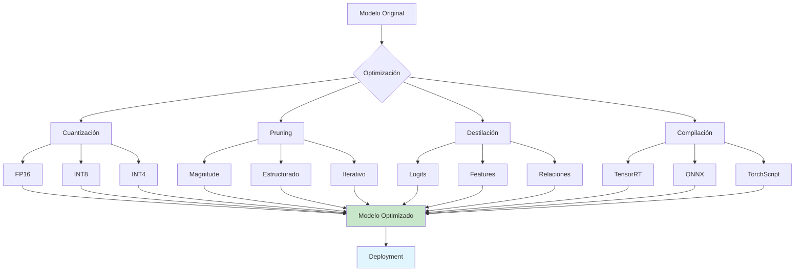
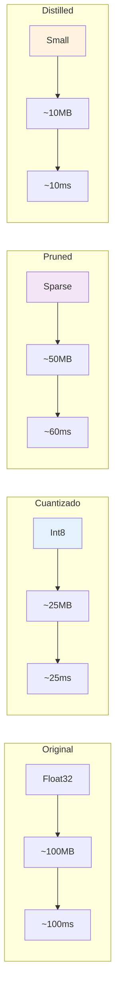

# Clase 30: Optimización de Inferencia

## Duración
4 horas

## Objetivos de Aprendizaje
- Implementar cuantización de modelos para reducir tamaño y latencia
- Aplicar pruning para eliminar pesos redundantes
- Utilizar destilación de conocimiento para crear modelos eficientes
- Integrar herramientas como ONNX, TensorRT y PyTorch
- Optimizar inferencia para dispositivos edge

## Contenidos Detallados

### 1. Fundamentos de Optimización de Inferencia

La optimización de inferencia busca reducir el tamaño del modelo, la latencia y los recursos computacionales manteniendo la mayor precisión posible. Las técnicas principales incluyen:

- **Cuantización**: Reducir precisión de pesos (float32 → int8)
- **Pruning**: Eliminar pesos de baja importancia
- **Destilación**: Entrenar modelo pequeño usando modelo grande
- **Compilación**: Optimizar grafos de computación

#### Comparación de Técnicas

| Técnica | Reducción Tamaño | Reducción Latencia | Pérdida Accuracy |
|---------|-------------------|-------------------|------------------|
| Cuantización 8-bit | ~4x | ~2-4x | ~1-2% |
| Cuantización 4-bit | ~8x | ~4-8x | ~3-5% |
| Pruning 50% | ~2x | ~1.5-2x | ~1-3% |
| Destilación | ~10x | ~10x | ~1-5% |
| Compilación | ~1x | ~2-3x | ~0% |

### 2. Cuantización de Modelos

```python
import torch
import torch.nn as nn
from typing import Dict, Any, Optional
import numpy as np

class QuantizationOptimizer:
    """Optimizador de cuantización"""
    
    @staticmethod
    def dynamic_quantization(model: nn.Module) -> nn.Module:
        """Cuantización dinámica (post-training)"""
        
        quantized_model = torch.quantization.quantize_dynamic(
            model,
            {nn.Linear, nn.LSTM, nn.GRU},
            dtype=torch.qint8
        )
        
        return quantized_model
    
    @staticmethod
    def static_quantization(model: nn.Module, calibration_data: torch.Tensor) -> nn.Module:
        """Cuantización estática con calibración"""
        
        # Preparar modelo
        model.eval()
        model_quantized = torch.quantization.prepare(model, inplace=False)
        
        # Calibrar con datos
        with torch.no_grad():
            for i in range(100):
                _ = model_quantized(calibration_data)
        
        # Convertir a modelo cuantizado
        model_quantized = torch.quantization.convert(model_quantized, inplace=False)
        
        return model_quantized
    
    @staticmethod
    def quantization_aware_training(model: nn.Module, train_loader, epochs: int = 10) -> nn.Module:
        """Cuantización aware training (QAT)"""
        
        # Seleccionar backend
        model.qconfig = torch.quantization.get_default_qconfig('qnnpack')
        
        # Preparar para QAT
        torch.quantization.prepare_qat(model, inplace=True)
        
        # Entrenar
        model.train()
        optimizer = torch.optim.SGD(model.parameters(), lr=0.001)
        criterion = nn.CrossEntropyLoss()
        
        for epoch in range(epochs):
            for batch_data, batch_labels in train_loader:
                optimizer.zero_grad()
                outputs = model(batch_data)
                loss = criterion(outputs, batch_labels)
                loss.backward()
                optimizer.step()
        
        # Convertir a modelo cuantizado
        model.eval()
        model = torch.quantization.convert(model, inplace=False)
        
        return model


class ONNXExporter:
    """Exportador a ONNX"""
    
    @staticmethod
    def export_to_onnx(
        model: nn.Module,
        input_shape: tuple,
        output_path: str,
        opset_version: int = 13
    ):
        """Exporta modelo a formato ONNX"""
        
        # Crear input dummy
        dummy_input = torch.randn(*input_shape)
        
        # Exportar
        torch.onnx.export(
            model,
            dummy_input,
            output_path,
            export_params=True,
            opset_version=opset_version,
            do_constant_folding=True,
            input_names=['input'],
            output_names=['output'],
            dynamic_axes={
                'input': {0: 'batch_size'},
                'output': {0: 'batch_size'}
            }
        )
        
        print(f"Modelo exportado a: {output_path}")
    
    @staticmethod
    def optimize_onnx_model(model_path: str, output_path: str):
        """Optimiza modelo ONNX"""
        
        import onnx
        from onnx import optimizer
        
        # Cargar modelo
        model = onnx.load(model_path)
        
        # Aplicar optimizaciones
        passes = [
            'eliminate_dead_end',
            'eliminate_nop_dropout',
            'eliminate_nop_flatten',
            'eliminate_nop_pad',
            'fuse_add_bias_into_conv',
            'fuse_bn_into_conv',
            'fuse_consecutive_concats',
            'fuse_consecutive_transposes',
            'fuse_transpose_into_gemm',
        ]
        
        optimized_model = optimizer.optimize(model, passes)
        
        # Guardar
        onnx.save(optimized_model, output_path)
        
        print(f"Modelo optimizado guardado en: {output_path}")


class ONNXRuntimeOptimizer:
    """Optimizador con ONNX Runtime"""
    
    def __init__(self, model_path: str):
        import onnxruntime as ort
        
        self.session = ort.InferenceSession(
            model_path,
            providers=[
                ('CUDAExecutionProvider', {'device_id': 0}),
                ('CPUExecutionProvider', {})
            ]
        )
    
    def predict(self, input_data: np.ndarray) -> np.ndarray:
        """Realiza predicción optimizada"""
        
        output = self.session.run(None, {'input': input_data})
        return output[0]
    
    def get_optimization_config(self) -> Dict[str, Any]:
        """Obtiene configuración de optimización"""
        
        return {
            "providers": self.session.get_providers(),
            "device": "GPU" if "CUDAExecutionProvider" in self.session.get_providers() else "CPU"
        }
```

### 3. Pruning de Modelos

```python
import torch
import torch.nn as nn
from torch.nn.utils import prune
from typing import Dict, Any, List, Tuple

class PruningOptimizer:
    """Optimizador de pruning"""
    
    @staticmethod
    def magnitude_pruning(
        model: nn.Module,
        amount: float = 0.5,
        scope: str = "global"
    ):
        """Pruning por magnitud"""
        
        if scope == "global":
            # Pruning global
            parameters_to_prune = []
            for module in model.modules():
                if isinstance(module, nn.Linear) or isinstance(module, nn.Conv2d):
                    parameters_to_prune.append((module, 'weight'))
            
            prune.global_unstructured(
                parameters_to_prune,
                pruning_method=prune.L1Unstructured,
                amount=amount
            )
        
        else:
            # Pruning por módulo
            for name, module in model.named_modules():
                if isinstance(module, nn.Linear) or isinstance(module, nn.Conv2d):
                    prune.l1_unstructured(module, name='weight', amount=amount)
        
        return model
    
    @staticmethod
    def structured_pruning(model: nn.Module, amount: float = 0.5):
        """Pruning estructurado (eliminar canales)"""
        
        for name, module in model.named_modules():
            if isinstance(module, nn.Conv2d):
                # Pruning de canales
                prune.ln_structured(
                    module,
                    name='weight',
                    amount=amount,
                    dim=0,  # Eliminar canales de salida
                    n=2,    # L2 norm
                    importance_grading=prune.LNStructuredImportance,
                    pruning_method=prune.LNStructured
                )
        
        return model
    
    @staticmethod
    def iterative_pruning(
        model: nn.Module,
        train_fn,
        data_loader,
        num_iterations: int = 10,
        amount_schedule: List[float] = None
    ):
        """Pruning iterativo"""
        
        if amount_schedule is None:
            amount_schedule = [0.1] * num_iterations
        
        for i in range(num_iterations):
            print(f"Iteration {i+1}/{num_iterations}")
            
            # Entrenar
            train_fn(model, data_loader)
            
            # Pruning
            amount = amount_schedule[i] if i < len(amount_schedule) else 0.5
            model = PruningOptimizer.magnitude_pruning(model, amount=amount, scope="global")
        
        return model
    
    @staticmethod
    def remove_pruning(model: nn.Module):
        """Elimina estructuras de pruning (mantiene pesos)"""
        
        for module in model.modules():
            if hasattr(module, 'weight'):
                prune.remove(module, 'weight')
        
        return model


class PruningAnalyzer:
    """Analizador de pruning"""
    
    @staticmethod
    def get_sparsity(model: nn.Module) -> Dict[str, float]:
        """Calcula sparsity por capa"""
        
        sparsity_dict = {}
        
        for name, module in model.named_modules():
            if hasattr(module, 'weight_mask'):
                # Modelo podado
                weight = module.weight_mask
            elif hasattr(module, 'weight'):
                weight = module.weight
            else:
                continue
            
            if weight is not None:
                zero = (weight == 0).sum().item()
                total = weight.numel()
                sparsity = zero / total
                sparsity_dict[name] = sparsity
        
        return sparsity_dict
    
    @staticmethod
    def analyze_importance(model: nn.Module) -> Dict[str, np.ndarray]:
        """Analiza importancia de pesos"""
        
        importance_dict = {}
        
        for name, module in model.named_modules():
            if hasattr(module, 'weight') and module.weight is not None:
                weight = module.weight.detach()
                
                # Calcular importancia (L1 por defecto)
                importance = torch.abs(weight).flatten().numpy()
                importance_dict[name] = importance
        
        return importance_dict
```

### 4. Destilación de Conocimiento

```python
import torch
import torch.nn as nn
import torch.nn.functional as F
from typing import Dict, Any, List, Callable

class KnowledgeDistillation:
    """Destilación de conocimiento"""
    
    def __init__(
        self,
        teacher_model: nn.Module,
        student_model: nn.Module,
        temperature: float = 4.0,
        alpha: float = 0.5
    ):
        self.teacher = teacher_model
        self.student = student_model
        self.temperature = temperature
        self.alpha = alpha  # Weight for hard labels
        
        # Freeze teacher
        for param in self.teacher.parameters():
            param.requires_grad = False
    
    def distillation_loss(
        self,
        student_logits: torch.Tensor,
        teacher_logits: torch.Tensor,
        labels: torch.Tensor
    ) -> torch.Tensor:
        """Calcula loss de destilación"""
        
        # Soft targets (teacher probabilities)
        soft_targets = F.softmax(teacher_logits / self.temperature, dim=-1)
        soft_student = F.log_softmax(student_logits / self.temperature, dim=-1)
        
        # Distillation loss (KL divergence)
        distill_loss = F.kl_div(
            soft_student,
            soft_targets,
            reduction='batchmean'
        ) * (self.temperature ** 2)
        
        # Hard labels loss
        hard_loss = F.cross_entropy(student_logits, labels)
        
        # Combined loss
        total_loss = self.alpha * distill_loss + (1 - self.alpha) * hard_loss
        
        return total_loss
    
    def train_student(
        self,
        train_loader,
        optimizer: torch.optim.Optimizer,
        num_epochs: int = 100
    ):
        """Entrena estudiante con destilación"""
        
        self.teacher.eval()
        self.student.train()
        
        for epoch in range(num_epochs):
            total_loss = 0
            
            for batch_data, batch_labels in train_loader:
                optimizer.zero_grad()
                
                # Teacher predictions
                with torch.no_grad():
                    teacher_logits = self.teacher(batch_data)
                
                # Student predictions
                student_logits = self.student(batch_data)
                
                # Calculate loss
                loss = self.distillation_loss(student_logits, teacher_logits, batch_labels)
                
                loss.backward()
                optimizer.step()
                
                total_loss += loss.item()
            
            avg_loss = total_loss / len(train_loader)
            print(f"Epoch {epoch+1}/{num_epochs}, Loss: {avg_loss:.4f}")
    
    def extract_knowledge_features(self, model: nn.Module, data_loader) -> Dict[str, Any]:
        """Extrae features de conocimiento del modelo"""
        
        model.eval()
        features = []
        
        with torch.no_grad():
            for batch_data, _ in data_loader:
                # Extraer features de capas intermedias
                features.append(model.extract_features(batch_data))
                break  # Solo un batch
        
        return {"features": features}


class FeatureDistillation(KnowledgeDistillation):
    """Destilación de features"""
    
    def __init__(self, teacher_model, student_model, feature_layers: List[str]):
        super().__init__(teacher_model, student_model)
        self.feature_layers = feature_layers
    
    def feature_matching_loss(self, student_features: Dict, teacher_features: Dict) -> torch.Tensor:
        """Calcula loss de matching de features"""
        
        loss = 0
        
        for layer_name in self.feature_layers:
            student_feat = student_features.get(layer_name)
            teacher_feat = teacher_features.get(layer_name)
            
            if student_feat is not None and teacher_feat is not None:
                # MSE between features
                loss += F.mse_loss(student_feat, teacher_feat)
        
        return loss
```

### 5. Integración con TensorRT

```python
import tensorrt as trt
import pycuda.driver as cuda
import pycuda.autoinit
import numpy as np
from typing import Any, Optional
import os

class TensorRTOptimizer:
    """Optimizador con TensorRT"""
    
    def __init__(self, onnx_path: str):
        self.onnx_path = onnx_path
        self.logger = trt.Logger(trt.Logger.WARNING)
        self.builder = trt.Builder(self.logger)
        self.network = self.builder.create_network(1 << int(trt.NetworkDefinitionCreationFlag.EXPLICIT_BATCH))
        self.config = self.builder.create_builder_config()
    
    def build_engine(self, max_batch_size: int = 1, max_workspace_size: int = 1 << 30):
        """Construye engine TensorRT"""
        
        # Parse ONNX
        parser = trt.OnnxParser(self.network, self.logger)
        with open(self.onnx_path, 'rb') as f:
            success = parser.parse(f.read())
        
        if not success:
            error = parser.get_error(0)
            raise Exception(f"ONNX parsing error: {error}")
        
        # Configurar build
        self.config.max_batch_size = max_batch_size
        self.config.max_workspace_size = max_workspace_size
        
        # Habilitar FP16
        self.config.set_flag(trt.BuilderFlag.FP16)
        
        # Habilitar INT8 (opcional)
        # self.config.set_flag(trt.BuilderFlag.INT8)
        
        # Build engine
        engine = self.builder.build_serialized_network(self.network, self.config)
        
        if engine is None:
            raise Exception("TensorRT engine build failed")
        
        return engine
    
    def save_engine(self, engine, output_path: str):
        """Guarda engine"""
        with open(output_path, 'wb') as f:
            f.write(engine)
        print(f"Engine guardado en: {output_path}")
    
    @staticmethod
    def load_engine(engine_path: str):
        """Carga engine"""
        logger = trt.Logger(trt.Logger.WARNING)
        with open(engine_path, 'rb') as f:
            engine = trt.Runtime(logger).deserialize_cuda_engine(f.read())
        return engine


class TensorRTInference:
    """Inference con TensorRT"""
    
    def __init__(self, engine_path: str):
        import pycuda.driver as cuda
        
        self.logger = trt.Logger(trt.Logger.ERROR)
        self.runtime = trt.Runtime(self.logger)
        
        with open(engine_path, 'rb') as f:
            self.engine = self.runtime.deserialize_cuda_engine(f.read())
        
        self.context = self.engine.create_execution_context()
        
        # Allocate buffers
        self.inputs = []
        self.outputs = []
        self.bindings = []
        
        for i in range(self.engine.num_bindings):
            name = self.engine.get_binding_name(i)
            dtype = trt.nptype(self.engine.get_binding_dtype(i))
            shape = self.engine.get_binding_shape(i)
            
            size = trt.volume(shape)
            host_mem = cuda.pagelocked_empty(size, dtype)
            device_mem = cuda.mem_alloc(host_mem.nbytes)
            
            self.bindings.append(int(device_mem))
            
            if self.engine.binding_is_input(i):
                self.inputs.append({'name': name, 'host': host_mem, 'device': device_mem})
            else:
                self.outputs.append({'name': name, 'host': host_mem, 'device': device_mem})
    
    def predict(self, input_data: np.ndarray) -> np.ndarray:
        """Realiza predicción"""
        
        import pycuda.driver as cuda
        
        # Copy input
        np.copyto(self.inputs[0]['host'], input_data.ravel())
        cuda.memcpy_htod(self.inputs[0]['device'], self.inputs[0]['host'])
        
        # Execute
        self.context.execute_async_v2(self.bindings)
        
        # Copy output
        cuda.memcpy_dtoh(self.outputs[0]['host'], self.outputs[0]['device'])
        
        # Reshape output
        output_shape = tuple(self.engine.get_binding_shape(1))
        return self.outputs[0]['host'].reshape(output_shape)
```

## Diagramas en Mermaid

### Pipeline de Optimización



### Comparación de Técnicas



## Referencias Externas

1. **PyTorch Quantization**: https://pytorch.org/docs/stable/quantization.html
2. **ONNX Runtime**: https://onnxruntime.ai/
3. **TensorRT**: https://developer.nvidia.com/tensorrt
4. **TensorFlow Model Optimization**: https://www.tensorflow.org/model_optimization
5. **Knowledge Distillation**: https://arxiv.org/abs/1503.02531

## Ejercicios Prácticos Resueltos

### Ejercicio 1: Cuantización Completa

**Enunciado**: Implementar pipeline completo de cuantización.

**Solución**:

```python
import torch
import torch.nn as nn
import numpy as np
from typing import Dict, List, Any
import time

class SimpleModel(nn.Module):
    """Modelo simple para demostración"""
    
    def __init__(self, input_size: int = 128, hidden_size: int = 256, output_size: int = 10):
        super().__init__()
        self.fc1 = nn.Linear(input_size, hidden_size)
        self.fc2 = nn.Linear(hidden_size, hidden_size)
        self.fc3 = nn.Linear(hidden_size, output_size)
        self.relu = nn.ReLU()
    
    def forward(self, x):
        x = self.relu(self.fc1(x))
        x = self.relu(self.fc2(x))
        return self.fc3(x)

class QuantizationPipeline:
    """Pipeline completo de cuantización"""
    
    def __init__(self, model: nn.Module):
        self.original_model = model
        self.quantized_model = None
        self.results = {}
    
    def benchmark_model(self, model: nn.Module, input_data: torch.Tensor, num_iterations: int = 100) -> Dict[str, float]:
        """Benchmark de modelo"""
        
        model.eval()
        
        # Warmup
        with torch.no_grad():
            for _ in range(10):
                _ = model(input_data)
        
        # Benchmark
        latencies = []
        
        with torch.no_grad():
            for _ in range(num_iterations):
                start = time.perf_counter()
                _ = model(input_data)
                latencies.append((time.perf_counter() - start) * 1000)
        
        # Calcular estadísticas
        latencies = np.array(latencies)
        
        return {
            "mean_ms": float(np.mean(latencies)),
            "std_ms": float(np.std(latencies)),
            "min_ms": float(np.min(latencies)),
            "max_ms": float(np.max(latencies)),
            "p95_ms": float(np.percentile(latencies, 95)),
            "p99_ms": float(np.percentile(latencies, 99))
        }
    
    def apply_dynamic_quantization(self):
        """Aplica cuantización dinámica"""
        
        quantized = torch.quantization.quantize_dynamic(
            self.original_model,
            {nn.Linear, nn.LSTM, nn.GRU},
            dtype=torch.qint8
        )
        
        self.quantized_model = quantized
        
        # Benchmark
        test_input = torch.randn(1, 128)
        
        self.results['dynamic'] = {
            'original': self.benchmark_model(self.original_model, test_input),
            'quantized': self.benchmark_model(quantized, test_input)
        }
        
        return quantized
    
    def apply_static_quantization(self, calibration_data: torch.Tensor):
        """Aplica cuantización estática"""
        
        model_copy = self.original_model.clone()
        model_copy.eval()
        
        # Preparar
        model_copy.qconfig = torch.quantization.get_default_qconfig('qnnpack')
        torch.quantization.prepare_(model_copy, inplace=True)
        
        # Calibrar
        with torch.no_grad():
            for i in range(100):
                _ = model_copy(calibration_data)
        
        # Convertir
        quantized = torch.quantization.convert(model_copy, inplace=False)
        
        self.quantized_model = quantized
        
        # Benchmark
        test_input = torch.randn(1, 128)
        
        self.results['static'] = {
            'original': self.benchmark_model(self.original_model, test_input),
            'quantized': self.benchmark_model(quantized, test_input)
        }
        
        return quantized
    
    def calculate_size_reduction(self) -> Dict[str, float]:
        """Calcula reducción de tamaño"""
        
        import os
        import tempfile
        
        # Guardar originales
        with tempfile.NamedTemporaryFile(delete=False, suffix='.pt') as f:
            torch.save(self.original_model.state_dict(), f.name)
            original_size = os.path.getsize(f.name) / (1024 * 1024)  # MB
        
        with tempfile.NamedTemporaryFile(delete=False, suffix='.pt') as f:
            torch.save(self.quantized_model.state_dict(), f.name)
            quantized_size = os.path.getsize(f.name) / (1024 * 1024)  # MB
        
        return {
            "original_mb": original_size,
            "quantized_mb": quantized_size,
            "reduction_percent": (1 - quantized_size / original_size) * 100
        }
    
    def print_results(self):
        """Imprime resultados"""
        
        print("=" * 60)
        print("QUANTIZATION RESULTS")
        print("=" * 60)
        
        if 'dynamic' in self.results:
            print("\nDynamic Quantization:")
            print(f"  Original: {self.results['dynamic']['original']['mean_ms']:.2f} ms")
            print(f"  Quantized: {self.results['dynamic']['quantized']['mean_ms']:.2f} ms")
            
            speedup = self.results['dynamic']['original']['mean_ms'] / self.results['dynamic']['quantized']['mean_ms']
            print(f"  Speedup: {speedup:.2f}x")
        
        size_reduction = self.calculate_size_reduction()
        print(f"\nSize Reduction:")
        print(f"  Original: {size_reduction['original_mb']:.2f} MB")
        print(f"  Quantized: {size_reduction['quantized_mb']:.2f} MB")
        print(f"  Reduction: {size_reduction['reduction_percent']:.1f}%")
        
        print("=" * 60)


# Ejecución
if __name__ == "__main__":
    # Crear modelo
    model = SimpleModel()
    
    # Pipeline
    pipeline = QuantizationPipeline(model)
    
    # Datos de calibración
    calibration_data = torch.randn(1000, 128)
    
    # Aplicar cuantización dinámica
    pipeline.apply_dynamic_quantization()
    
    # Imprimir resultados
    pipeline.print_results()
```

### Ejercicio 2: Pipeline de Pruning

**Enunciado**: Implementar pipeline de pruning iterativo.

**Solución**:

```python
import torch
import torch.nn as nn
import torch.optim as optim
from torch.utils.data import TensorDataset, DataLoader
import numpy as np
from typing import Dict, List, Any

class PruningPipeline:
    """Pipeline de pruning iterativo"""
    
    def __init__(self, model: nn.Module):
        self.model = model
        self.original_accuracy = None
        self.pruned_accuracy = None
    
    def train_model(self, train_loader, epochs: int = 10):
        """Entrena modelo base"""
        
        self.model.train()
        criterion = nn.CrossEntropyLoss()
        optimizer = optim.Adam(self.model.parameters(), lr=0.001)
        
        for epoch in range(epochs):
            total_loss = 0
            for data, target in train_loader:
                optimizer.zero_grad()
                output = self.model(data)
                loss = criterion(output, target)
                loss.backward()
                optimizer.step()
                total_loss += loss.item()
            
            if (epoch + 1) % 5 == 0:
                print(f"Epoch {epoch+1}: Loss = {total_loss/len(train_loader):.4f}")
    
    def evaluate_model(self, test_loader) -> float:
        """Evalúa modelo"""
        
        self.model.eval()
        correct = 0
        total = 0
        
        with torch.no_grad():
            for data, target in test_loader:
                output = self.model(data)
                pred = output.argmax(dim=1)
                correct += (pred == target).sum().item()
                total += target.size(0)
        
        return correct / total
    
    def iterative_pruning(
        self,
        train_loader,
        test_loader,
        num_steps: int = 10,
        initial_amount: float = 0.1,
        pruning_increment: float = 0.1
    ):
        """Pruning iterativo"""
        
        # Evaluación inicial
        self.original_accuracy = self.evaluate_model(test_loader)
        print(f"Original accuracy: {self.original_accuracy:.4f}")
        
        current_amount = initial_amount
        
        for step in range(num_steps):
            print(f"\nStep {step+1}/{num_steps}: Pruning amount = {current_amount:.2f}")
            
            # Pruning
            self._prune_model(current_amount)
            
            # Re-entrenamiento
            self.fine_tune(train_loader, epochs=5)
            
            # Evaluar
            accuracy = self.evaluate_model(test_loader)
            print(f"Accuracy after step {step+1}: {accuracy:.4f}")
            
            # Incrementar amount
            current_amount += pruning_increment
        
        self.pruned_accuracy = self.evaluate_model(test_loader)
        
        return {
            "original_accuracy": self.original_accuracy,
            "pruned_accuracy": self.pruned_accuracy,
            "accuracy_drop": self.original_accuracy - self.pruned_accuracy
        }
    
    def _prune_model(self, amount: float):
        """Aplica pruning"""
        
        for name, module in self.model.named_modules():
            if isinstance(module, nn.Linear):
                # Magnitude pruning
                weight = module.weight.data
                
                # Calcular threshold
                threshold = np.percentile(
                    torch.abs(weight).numpy(),
                    amount * 100
                )
                
                # Crear mask
                mask = torch.abs(weight) > threshold
                
                # Aplicar pruning
                module.weight.data *= mask.float()
    
    def fine_tune(self, train_loader, epochs: int = 5):
        """Fine-tuning después de pruning"""
        
        self.model.train()
        criterion = nn.CrossEntropyLoss()
        optimizer = optim.SGD(self.model.parameters(), lr=0.001, momentum=0.9)
        
        for epoch in range(epochs):
            for data, target in train_loader:
                optimizer.zero_grad()
                output = self.model(data)
                loss = criterion(output, target)
                loss.backward()
                optimizer.step()
    
    def get_sparsity(self) -> Dict[str, float]:
        """Calcula sparsity"""
        
        total_params = 0
        zero_params = 0
        
        for name, module in self.model.named_modules():
            if isinstance(module, nn.Linear):
                weight = module.weight.data
                total_params += weight.numel()
                zero_params += (weight == 0).sum().item()
        
        return {
            "total_params": total_params,
            "zero_params": zero_params,
            "sparsity_percent": (zero_params / total_params) * 100
        }


# Ejecución
if __name__ == "__main__":
    # Crear modelo simple
    model = nn.Sequential(
        nn.Linear(784, 256),
        nn.ReLU(),
        nn.Linear(256, 128),
        nn.ReLU(),
        nn.Linear(128, 10)
    )
    
    # Datos sintéticos
    X = torch.randn(5000, 784)
    y = torch.randint(0, 10, (5000,))
    
    train_dataset = TensorDataset(X, y)
    train_loader = DataLoader(train_dataset, batch_size=64, shuffle=True)
    
    # Pipeline
    pipeline = PruningPipeline(model)
    
    # Entrenar
    pipeline.train_model(train_loader, epochs=10)
    
    # Pruning iterativo
    results = pipeline.iterative_pruning(train_loader, train_loader, num_steps=5)
    
    print("\n=== FINAL RESULTS ===")
    print(f"Original accuracy: {results['original_accuracy']:.4f}")
    print(f"Pruned accuracy: {results['pruned_accuracy']:.4f}")
    print(f"Accuracy drop: {results['accuracy_drop']:.4f}")
    
    # Sparsity
    sparsity = pipeline.get_sparsity()
    print(f"Sparsity: {sparsity['sparsity_percent']:.2f}%")
```

### Ejercicio 3: Destilación de Conocimiento

**Enunciado**: Implementar destilación de conocimiento.

**Solución**:

```python
import torch
import torch.nn as nn
import torch.nn.functional as F
import torch.optim as optim
from torch.utils.data import TensorDataset, DataLoader
import numpy as np
from typing import Dict, List

# Modelos
class TeacherModel(nn.Module):
    """Modelo maestro (grande)"""
    
    def __init__(self, input_size: int = 784, hidden_size: int = 512, output_size: int = 10):
        super().__init__()
        self.fc1 = nn.Linear(input_size, hidden_size)
        self.fc2 = nn.Linear(hidden_size, hidden_size)
        self.fc3 = nn.Linear(hidden_size, hidden_size)
        self.fc4 = nn.Linear(hidden_size, output_size)
    
    def forward(self, x):
        x = F.relu(self.fc1(x))
        x = F.relu(self.fc2(x))
        x = F.relu(self.fc3(x))
        return self.fc4(x)

class StudentModel(nn.Module):
    """Modelo estudiante (pequeño)"""
    
    def __init__(self, input_size: int = 784, hidden_size: int = 64, output_size: int = 10):
        super().__init__()
        self.fc1 = nn.Linear(input_size, hidden_size)
        self.fc2 = nn.Linear(hidden_size, hidden_size)
        self.fc3 = nn.Linear(hidden_size, output_size)
    
    def forward(self, x):
        x = F.relu(self.fc1(x))
        x = F.relu(self.fc2(x))
        return self.fc3(x)

class DistillationTrainer:
    """Trainer de destilación"""
    
    def __init__(
        self,
        teacher: TeacherModel,
        student: StudentModel,
        temperature: float = 4.0,
        alpha: float = 0.7
    ):
        self.teacher = teacher
        self.student = student
        self.temperature = temperature
        self.alpha = alpha
        
        # Freeze teacher
        for param in teacher.parameters():
            param.requires_grad = False
    
    def distillation_loss(
        self,
        student_logits: torch.Tensor,
        teacher_logits: torch.Tensor,
        labels: torch.Tensor
    ) -> Dict[str, torch.Tensor]:
        """Calcula losses"""
        
        # Soft loss (KL divergence)
        soft_student = F.log_softmax(student_logits / self.temperature, dim=-1)
        soft_teacher = F.softmax(teacher_logits / self.temperature, dim=-1)
        
        soft_loss = F.kl_div(
            soft_student,
            soft_teacher,
            reduction='batchmean'
        ) * (self.temperature ** 2)
        
        # Hard loss
        hard_loss = F.cross_entropy(student_logits, labels)
        
        # Combined
        total_loss = self.alpha * soft_loss + (1 - self.alpha) * hard_loss
        
        return {
            "total": total_loss,
            "soft": soft_loss,
            "hard": hard_loss
        }
    
    def train(
        self,
        train_loader,
        test_loader,
        epochs: int = 20,
        lr: float = 0.001
    ):
        """Entrena estudiante"""
        
        optimizer = optim.Adam(self.student.parameters(), lr=lr)
        
        for epoch in range(epochs):
            self.student.train()
            total_loss = 0
            soft_loss_sum = 0
            hard_loss_sum = 0
            
            for data, target in train_loader:
                optimizer.zero_grad()
                
                # Teacher output
                with torch.no_grad():
                    teacher_out = self.teacher(data)
                
                # Student output
                student_out = self.student(data)
                
                # Losses
                losses = self.distillation_loss(student_out, teacher_out, target)
                
                losses["total"].backward()
                optimizer.step()
                
                total_loss += losses["total"].item()
                soft_loss_sum += losses["soft"].item()
                hard_loss_sum += losses["hard"].item()
            
            # Evaluar
            train_acc = self.evaluate(train_loader)
            test_acc = self.evaluate(test_loader)
            
            print(f"Epoch {epoch+1}/{epochs} | "
                  f"Loss: {total_loss/len(train_loader):.4f} | "
                  f"Train Acc: {train_acc:.4f} | "
                  f"Test Acc: {test_acc:.4f}")
    
    def evaluate(self, data_loader) -> float:
        """Evalúa modelo"""
        
        self.student.eval()
        correct = 0
        total = 0
        
        with torch.no_grad():
            for data, target in data_loader:
                output = self.student(data)
                pred = output.argmax(dim=1)
                correct += (pred == target).sum().item()
                total += target.size(0)
        
        return correct / total
    
    def compare_models(self, test_loader) -> Dict[str, float]:
        """Compara maestro y estudiante"""
        
        self.teacher.eval()
        
        teacher_acc = self.evaluate(test_loader)
        student_acc = self.evaluate(test_loader)
        
        # Contar parámetros
        teacher_params = sum(p.numel() for p in self.teacher.parameters())
        student_params = sum(p.numel() for p in self.student.parameters())
        
        return {
            "teacher_accuracy": teacher_acc,
            "student_accuracy": student_acc,
            "accuracy_gap": teacher_acc - student_acc,
            "teacher_params": teacher_params,
            "student_params": student_params,
            "compression_ratio": teacher_params / student_params
        }


# Ejecución
if __name__ == "__main__":
    # Datos
    X = torch.randn(5000, 784)
    y = torch.randint(0, 10, (5000,))
    
    train_dataset = TensorDataset(X[:4000], y[:4000])
    test_dataset = TensorDataset(X[4000:], y[4000:])
    
    train_loader = DataLoader(train_dataset, batch_size=64, shuffle=True)
    test_loader = DataLoader(test_dataset, batch_size=64)
    
    # Modelos
    teacher = TeacherModel()
    student = StudentModel(hidden_size=64)
    
    # Entrenar maestro (breve)
    print("=== Training Teacher ===")
    optimizer = optim.Adam(teacher.parameters(), lr=0.001)
    
    for epoch in range(5):
        teacher.train()
        for data, target in train_loader:
            optimizer.zero_grad()
            output = teacher(data)
            loss = F.cross_entropy(output, target)
            loss.backward()
            optimizer.step()
    
    # Destilación
    print("\n=== Knowledge Distillation ===")
    trainer = DistillationTrainer(teacher, student, temperature=4.0, alpha=0.7)
    trainer.train(train_loader, test_loader, epochs=20)
    
    # Comparar
    print("\n=== Results ===")
    results = trainer.compare_models(test_loader)
    
    print(f"Teacher accuracy: {results['teacher_accuracy']:.4f}")
    print(f"Student accuracy: {results['student_accuracy']:.4f}")
    print(f"Accuracy gap: {results['accuracy_gap']:.4f}")
    print(f"Teacher params: {results['teacher_params']:,}")
    print(f"Student params: {results['student_params']:,}")
    print(f"Compression: {results['compression_ratio']:.1f}x")
```

## Tecnologías Específicas

| Tecnología | Propósito | Versión Recomendada |
|------------|-----------|---------------------|
| PyTorch | Framework | 2.x |
| ONNX | Formato | Latest |
| ONNX Runtime | Inference | Latest |
| TensorRT | Optimización NVIDIA | 8.x |
| TorchVision | Utils | Latest |

## Actividades de Laboratorio

### Laboratorio 1: Cuantización

**Objetivo**: Implementar cuantización de modelo.

**Pasos**:
1. Crear modelo simple
2. Implementar cuantización dinámica
3. Comparar tamaños
4. Medir latencia
5. Documentar resultados

### Laboratorio 2: Pruning

**Enunciado**: Implementar pruning iterativo.

**Pasos**:
1. Definir modelo
2. Implementar pruning
3. Fine-tuning
4. Calcular sparsity
5. Evaluar accuracy

### Laboratorio 3: Destilación

**Objetivo**: Implementar destilación de conocimiento.

**Pasos**:
1. Crear modelo maestro
2. Crear modelo estudiante
3. Implementar loss de destilación
4. Entrenar estudiante
5. Comparar resultados

## Resumen de Puntos Clave

1. **Cuantización** reduce precisión de pesos (FP32 → INT8)
2. **Dynamic quantization** no requiere datos de calibración
3. **Static quantization** requiere calibración
4. **QAT** ofrece mejor accuracy pero más costoso
5. **Pruning** elimina pesos de baja importancia
6. **Magnitude pruning** simple y efectivo
7. **Structured pruning** mantiene estructura
8. **Destilación** entrena modelo pequeño del grande
9. **Temperature** suaviza distribuciones
10. **ONNX** estandariza formato de modelo
