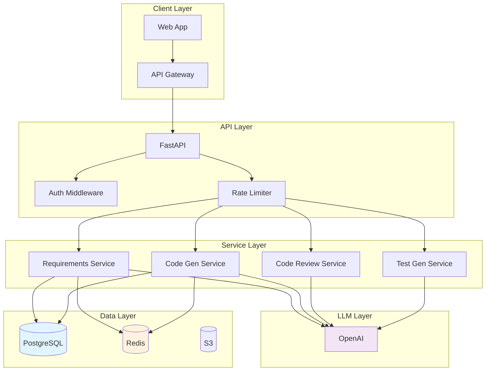
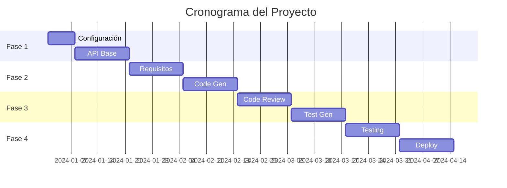

# Clase 31: Proyecto Integrador - Parte 1

## Duración
4 horas

## Objetivos de Aprendizaje
- Diseñar y planificar un proyecto completo de IA para Ingeniería de Software
- Definir la arquitectura de la solución integrando las técnicas aprendidas
- Implementar incrementally las diferentes fases del proyecto
- Aplicar metodologías ágiles en el desarrollo del proyecto
- Documentar las decisiones técnicas y justificación

## Contenidos Detallados

### 1. Descripción del Proyecto

El proyecto integrador consiste en construir un sistema completo de asistencia de IA para el desarrollo de software que combine múltiples técnicas aprendidas durante el curso:

- Extracción automática de requisitos desde texto
- Generación automatizada de código
- Code review asistido por IA
- Generación de pruebas unitarias
- Despliegue en producción

#### Requisitos del Proyecto

| Componente | Descripción | Prioridad |
|------------|-------------|-----------|
| Interfaz API | API REST para interacción | Alta |
| Extracción de Requisitos | NLP para procesar documentos | Alta |
| Generación de Código | LLM para crear código | Alta |
| Code Review | Análisis automático | Media |
| Tests Automatizados | Generación de pruebas | Media |
| Despliegue | Contenerización | Alta |
| Monitoreo | Observabilidad | Media |

### 2. Diseño de Arquitectura

```python
"""
Arquitectura del Sistema - Proyecto Integrador

┌─────────────────────────────────────────────────────────────┐
│                    PROYECTO INTEGRADOR                       │
├─────────────────────────────────────────────────────────────┤
│                                                              │
│  ┌─────────────┐     ┌─────────────┐     ┌─────────────┐   │
│  │   Frontend  │────▶│  API Gateway│────▶│   Services  │   │
│  │   (React)   │     │   (nginx)   │     │  (FastAPI)  │   │
│  └─────────────┘     └─────────────┘     └──────┬──────┘   │
│                                                  │          │
│  ┌────────────────────────────────────────────────│────────┐│
│  │                  CORE SERVICES                   │        ││
│  │                                                  │        ││
│  │  ┌───────────────┐  ┌───────────────┐  ┌───────┴──────┐ ││
│  │  │ Requirements  │  │    Code Gen   │  │ Code Review │ ││
│  │  │  Extractor   │  │    Service    │  │   Service   │ ││
│  │  └───────┬───────┘  └───────┬───────┘  └──────────────┘ ││
│  │          │                  │                             ││
│  │  ┌───────┴───────┐  ┌───────┴───────┐  ┌──────────────┐  ││
│  │  │ Test Gen     │  │ LLM Integration│  │ Security    │  ││
│  │  │ Service      │  │    (OpenAI)    │  │   Module    │  ││
│  │  └───────────────┘  └────────────────┘  └─────────────┘  ││
│  └──────────────────────────────────────────────────────────┘│
│                           │                                    │
│  ┌────────────────────────│────────────────────────────────┐  │
│  │                  DATA LAYER                             │  │
│  │  ┌─────────┐  ┌────────┐  ┌─────────┐  ┌────────────┐  │  │
│  │  │ PostgreSQL│ │ Redis  │  │  S3/Blob │  │  Weights   │  │  │
│  │  │         │  │ Cache  │  │ Storage │  │  & Biases  │  │  │
│  │  └─────────┘  └────────┘  └─────────┘  └────────────┘  │  │
│  └────────────────────────────────────────────────────────┘  │
│                                                              │
└─────────────────────────────────────────────────────────────┘
"""

# Estructura del proyecto
PROJECT_STRUCTURE = """
ai-software-assistant/
├── api/                      # API principal
│   ├── main.py              # FastAPI app
│   ├── routes/              # Endpoints
│   ├── models/              # Modelos de datos
│   └── services/            # Lógica de negocio
├── core/                    # Nucleo del sistema
│   ├── requirements/        # Extracción de requisitos
│   ├── code_gen/            # Generación de código
│   ├── code_review/         # Code review
│   ├── test_gen/            # Generación de tests
│   └── security/           # Módulo de seguridad
├── ml/                     # Modelos de ML
│   ├── models/             # Modelos guardados
│   ├── training/            # Scripts de entrenamiento
│   └── evaluation/         # Evaluación
├── infrastructure/         # Infraestrutura
│   ├── docker/             # Dockerfiles
│   ├── kubernetes/         # K8s configs
│   └── terraform/          # IaC
├── tests/                  # Tests
├── docs/                   # Documentación
└── config/                  # Configuración
"""
```

### 3. Implementación - Fase 1

#### 3.1 Configuración del Proyecto

```bash
# Crear estructura del proyecto
mkdir -p ai-software-assistant/{api/{routes,models,services},core/{requirements,code_gen,code_review,test_gen,security},ml/{models,training,evaluation},infrastructure/{docker,kubernetes,terraform},tests,docs,config}

# requirements.txt
cat > requirements.txt << 'EOF'
fastapi==0.104.1
uvicorn[standard]==0.24.0
pydantic==2.5.0
langchain==0.1.0
langchain-openai==0.0.2
openai==1.3.0
spacy==3.7.2
python-dotenv==1.0.0
pytest==7.4.3
pytest-cov==4.1.0
redis==5.0.1
sqlalchemy==2.0.23
alembic==1.12.1
httpx==0.25.2
black==23.11.0
mypy==1.7.1
EOF
```

#### 3.2 API Principal

```python
# api/main.py
from fastapi import FastAPI, HTTPException, BackgroundTasks
from fastapi.middleware.cors import CORSMiddleware
from pydantic import BaseModel, Field
from typing import List, Optional, Dict, Any
import uuid
from datetime import datetime
import logging

# Configuración de logging
logging.basicConfig(level=logging.INFO)
logger = logging.getLogger(__name__)

# Crear aplicación FastAPI
app = FastAPI(
    title="AI Software Assistant API",
    description="API para asistencia de IA en desarrollo de software",
    version="1.0.0",
    docs_url="/docs",
    redoc_url="/redoc"
)

# CORS middleware
app.add_middleware(
    CORSMiddleware,
    allow_origins=["*"],
    allow_credentials=True,
    allow_methods=["*"],
    allow_headers=["*"],
)

# Modelos de datos
class RequirementInput(BaseModel):
    """Entrada para extracción de requisitos"""
    document_text: str = Field(..., description="Texto del documento")
    extract_user_stories: bool = Field(default=True, description="Generar user stories")

class CodeGenerationInput(BaseModel):
    """Entrada para generación de código"""
    specification: str = Field(..., description="Especificación del código")
    language: str = Field(default="python", description="Lenguaje de programación")
    framework: Optional[str] = Field(default=None, description="Framework a usar")

class CodeReviewInput(BaseModel):
    """Entrada para code review"""
    code: str = Field(..., description="Código a revisar")
    language: str = Field(default="python", description="Lenguaje")

class TestGenerationInput(BaseModel):
    """Entrada para generación de tests"""
    code: str = Field(..., description="Código para generar tests")
    test_framework: str = Field(default="pytest", description="Framework de tests")
    coverage_level: str = Field(default="medium", description="Nivel de cobertura")

# Respuestas estándar
class SuccessResponse(BaseModel):
    """Respuesta exitosa"""
    request_id: str
    status: str = "success"
    timestamp: str
    data: Dict[str, Any]

class ErrorResponse(BaseModel):
    """Respuesta de error"""
    request_id: str
    status: str = "error"
    error: str
    timestamp: str

# Rutas
@app.get("/")
async def root():
    """Endpoint raíz"""
    return {
        "service": "AI Software Assistant",
        "version": "1.0.0",
        "status": "operational",
        "docs": "/docs"
    }

@app.get("/health")
async def health_check():
    """Health check del servicio"""
    return {
        "status": "healthy",
        "timestamp": datetime.now().isoformat(),
        "components": {
            "api": "healthy",
            "llm": "healthy",
            "storage": "healthy"
        }
    }

@app.post("/requirements/extract", response_model=SuccessResponse)
async def extract_requirements(
    input_data: RequirementInput,
    background_tasks: BackgroundTasks
):
    """Extrae requisitos de documento"""
    request_id = str(uuid.uuid4())
    
    try:
        # Aquí se llamaría al servicio de extracción
        logger.info(f"Processing requirements extraction: {request_id}")
        
        # Simulación de respuesta
        result = {
            "requirements": [
                {
                    "id": "REQ-001",
                    "type": "functional",
                    "description": "El sistema debe permitir búsqueda de productos",
                    "priority": "high"
                }
            ],
            "user_stories": [
                {
                    "id": "US-001",
                    "actor": "Usuario",
                    "action": "buscar productos",
                    "benefit": "encontrar productos específicos"
                }
            ]
        }
        
        return SuccessResponse(
            request_id=request_id,
            timestamp=datetime.now().isoformat(),
            data=result
        )
    
    except Exception as e:
        logger.error(f"Error processing request: {e}")
        raise HTTPException(status_code=500, detail=str(e))

@app.post("/code/generate", response_model=SuccessResponse)
async def generate_code(input_data: CodeGenerationInput):
    """Genera código desde especificación"""
    request_id = str(uuid.uuid4())
    
    try:
        logger.info(f"Generating code: {request_id}")
        
        result = {
            "code": "# Generated code here",
            "language": input_data.language,
            "framework": input_data.framework
        }
        
        return SuccessResponse(
            request_id=request_id,
            timestamp=datetime.now().isoformat(),
            data=result
        )
    
    except Exception as e:
        logger.error(f"Error generating code: {e}")
        raise HTTPException(status_code=500, detail=str(e))

@app.post("/code/review", response_model=SuccessResponse)
async def review_code(input_data: CodeReviewInput):
    """Revisa código"""
    request_id = str(uuid.uuid4())
    
    try:
        logger.info(f"Reviewing code: {request_id}")
        
        result = {
            "issues": [],
            "score": 85,
            "suggestions": []
        }
        
        return SuccessResponse(
            request_id=request_id,
            timestamp=datetime.now().isoformat(),
            data=result
        )
    
    except Exception as e:
        logger.error(f"Error reviewing code: {e}")
        raise HTTPException(status_code=500, detail=str(e))

@app.post("/tests/generate", response_model=SuccessResponse)
async def generate_tests(input_data: TestGenerationInput):
    """Genera tests"""
    request_id = str(uuid.uuid4())
    
    try:
        logger.info(f"Generating tests: {request_id}")
        
        result = {
            "tests": "# Generated tests",
            "framework": input_data.test_framework
        }
        
        return SuccessResponse(
            request_id=request_id,
            timestamp=datetime.now().isoformat(),
            data=result
        )
    
    except Exception as e:
        logger.error(f"Error generating tests: {e}")
        raise HTTPException(status_code=500, detail=str(e))

if __name__ == "__main__":
    import uvicorn
    uvicorn.run(app, host="0.0.0.0", port=8000)
```

### 4. Servicios del Nucleo

#### 4.1 Servicio de Extracción de Requisitos

```python
# core/requirements/extractor.py
from typing import Dict, List, Any
import spacy
from langchain_openai import ChatOpenAI
from langchain.prompts import PromptTemplate
import json

class RequirementExtractor:
    """Extractor de requisitos"""
    
    def __init__(self, api_key: str):
        self.llm = ChatOpenAI(api_key=api_key, temperature=0.3)
        self.nlp = spacy.load("es_core_news_sm")
        
        self.extraction_prompt = PromptTemplate(
            template="""
Eres un experto en ingeniería de requisitos.
Extrae todos los requisitos del siguiente documento.

Documento:
{doc}

Extrae:
1. Requisitos funcionales
2. Requisitos no funcionales
3. Restricciones

Responde en JSON estructurado.
""",
            input_variables=["doc"]
        )
    
    def extract_from_text(self, text: str) -> Dict[str, Any]:
        """Extrae requisitos de texto"""
        
        # Análisis con spaCy
        doc = self.nlp(text)
        
        # Extracción con LLM
        response = self.llm.invoke(
            self.extraction_prompt.format(doc=text)
        )
        
        # Parsear respuesta
        requirements = json.loads(response.content)
        
        return requirements
    
    def generate_user_stories(self, requirements: List[Dict]) -> List[Dict]:
        """Genera user stories desde requisitos"""
        
        stories_prompt = PromptTemplate(
            template="""
Genera user stories para los siguientes requisitos.

Requisitos:
{requirements}

Formato: JSON array con campos actor, action, benefit
""",
            input_variables=["requirements"]
        )
        
        response = self.llm.invoke(
            stories_prompt.format(requirements=json.dumps(requirements))
        )
        
        return json.loads(response.content)
```

#### 4.2 Servicio de Generación de Código

```python
# core/code_gen/generator.py
from typing import Dict, List, Any, Optional
from langchain_openai import ChatOpenAI
from langchain.prompts import PromptTemplate

class CodeGenerator:
    """Generador de código"""
    
    def __init__(self, api_key: str):
        self.llm = ChatOpenAI(api_key=api_key, temperature=0.3)
        
        self.code_prompt = PromptTemplate(
            template="""
Eres un experto desarrollador de software.
Genera código completo y funcional desde la siguiente especificación.

Especificación:
{specification}

Lenguaje: {language}
Framework: {framework}

Requisitos del código:
1. Código completo y ejecutable
2. Sigue mejores prácticas de {language}
3. Incluye manejo de errores
4. Incluye documentación
5. Sigue principios de Clean Code

Genera SOLO el código, sin explicaciones adicionales.
""",
            input_variables=["specification", "language", "framework"]
        )
    
    def generate(
        self,
        specification: str,
        language: str = "python",
        framework: Optional[str] = None
    ) -> str:
        """Genera código"""
        
        response = self.llm.invoke(
            self.code_prompt.format(
                specification=specification,
                language=language,
                framework=framework or "none"
            )
        )
        
        return response.content
    
    def generate_with_tests(self, specification: str, language: str) -> Dict[str, str]:
        """Genera código con tests"""
        
        # Generar código
        code = self.generate(specification, language)
        
        # Generar tests
        tests_prompt = PromptTemplate(
            template="""
Genera tests unitarios para el siguiente código.

Código:
{code}

Lenguaje: {language}
""",
            input_variables=["code", "language"]
        )
        
        tests_response = self.llm.invoke(
            tests_prompt.format(code=code, language=language)
        )
        
        return {
            "code": code,
            "tests": tests_response.content
        }
```

#### 4.3 Servicio de Code Review

```python
# core/code_review/reviewer.py
from typing import Dict, List, Any
from langchain_openai import ChatOpenAI
from langchain.prompts import PromptTemplate
import re

class CodeReviewer:
    """Revisor de código"""
    
    def __init__(self, api_key: str):
        self.llm = ChatOpenAI(api_key=api_key, temperature=0.1)
        
        self.review_prompt = PromptTemplate(
            template="""
Eres un experto en code review.
Analiza el siguiente código y proporciona retroalimentación detallada.

Código:
```{language}
{code}
```

Proporciona:
1. Bugs potenciales
2. Problemas de seguridad
3. Mejoras de rendimiento
4. Mejoras de legibilidad
5. Mejoras de estilo

Responde en JSON:
{{
    "bugs": [],
    "security_issues": [],
    "performance_issues": [],
    "style_issues": [],
    "overall_score": 0,
    "suggestions": []
}}
""",
            input_variables=["code", "language"]
        )
    
    def review(self, code: str, language: str = "python") -> Dict[str, Any]:
        """Revisa código"""
        
        response = self.llm.invoke(
            self.review_prompt.format(code=code, language=language)
        )
        
        import json
        return json.loads(response.content)
```

### 5. Sistema de Seguridad

```python
# core/security/guard.py
from typing import Optional, Dict, Any
import re

class SecurityGuard:
    """Guardia de seguridad"""
    
    def __init__(self):
        self.injection_patterns = [
            r"ignore\s+(?:all\s+)?(?:previous|prior)",
            r"disregard\s+(?:all\s+)?",
            r"system\s*prompt:",
            r"<\s*/?system\s*>",
        ]
        
        self.sensitive_patterns = [
            r"api[_-]?key\s*[:=]\s*[\w-]{20,}",
            r"password\s*[:=]\s*[^\s]{8,}",
            r"secret\s*[:=]\s*[\w-]{20,}",
        ]
    
    def check_input(self, text: str) -> Dict[str, Any]:
        """Verifica entrada"""
        
        issues = []
        
        # Check for injection
        for pattern in self.injection_patterns:
            if re.search(pattern, text, re.IGNORECASE):
                issues.append({
                    "type": "prompt_injection",
                    "severity": "high",
                    "matched": pattern
                })
        
        # Check for sensitive data
        for pattern in self.sensitive_patterns:
            if re.search(pattern, text, re.IGNORECASE):
                issues.append({
                    "type": "sensitive_data",
                    "severity": "medium",
                    "matched": pattern
                })
        
        return {
            "safe": len(issues) == 0,
            "issues": issues
        }
```

### 6. Contenerización

```dockerfile
# Dockerfile
FROM python:3.11-slim

WORKDIR /app

COPY requirements.txt .
RUN pip install --no-cache-dir -r requirements.txt

COPY . .

RUN useradd -m -u 1000 appuser && chown -R appuser:appuser /app
USER appuser

EXPOSE 8000

CMD ["uvicorn", "api.main:app", "--host", "0.0.0.0", "--port", "8000"]
```

```yaml
# docker-compose.yml
version: '3.8'

services:
  api:
    build: .
    ports:
      - "8000:8000"
    environment:
      - OPENAI_API_KEY=${OPENAI_API_KEY}
      - DATABASE_URL=postgresql://db:5432/app
      - REDIS_HOST=redis
    depends_on:
      - redis
      - db
    healthcheck:
      test: ["CMD", "curl", "-f", "http://localhost:8000/health"]
      interval: 30s
      timeout: 5s

  redis:
    image: redis:7-alpine
    ports:
      - "6379:6379"

  db:
    image: postgres:15-alpine
    environment:
      POSTGRES_DB: app
      POSTGRES_USER: user
      POSTGRES_PASSWORD: password
    volumes:
      - pgdata:/var/lib/postgresql/data

volumes:
  pgdata:
```

## Diagramas en Mermaid

### Arquitectura del Sistema



### Flujo de Desarrollo



## Referencias Externas

1. **FastAPI Documentation**: https://fastapi.tiangolo.com/
2. **LangChain Documentation**: https://python.langchain.com/docs/
3. **Docker Best Practices**: https://docs.docker.com/develop/develop-best-practices/
4. **Clean Architecture**: https://blog.cleancoder.com/uncle-bob/2012/08/13/the-clean-architecture.html

## Ejercicios de la Clase

### Ejercicio 1: Estructurar el Proyecto

Crear la estructura completa del proyecto según la arquitectura diseñada.

### Ejercicio 2: Implementar API Base

Implementar los endpoints básicos con validación de datos.

### Ejercicio 3: Integrar Servicios

Conectar los servicios de extracción, generación y revisión.

## Resumen de Puntos Clave

1. **Arquitectura modular** permite desarrollo incremental
2. **FastAPI** proporciona API moderna y robusta
3. **Servicios independientes** facilitan testing y mantenimiento
4. **Seguridad** debe integrarse desde el inicio
5. **Docker** permite deployment consistente
6. **Contenedores** facilitan escalamiento
7. **Documentación** es esencial para mantenimiento
8. **Testing** debe ser parte del desarrollo
9. **GitOps** simplifica deployments
10. **Monitoreo** permite detección temprana de problemas
