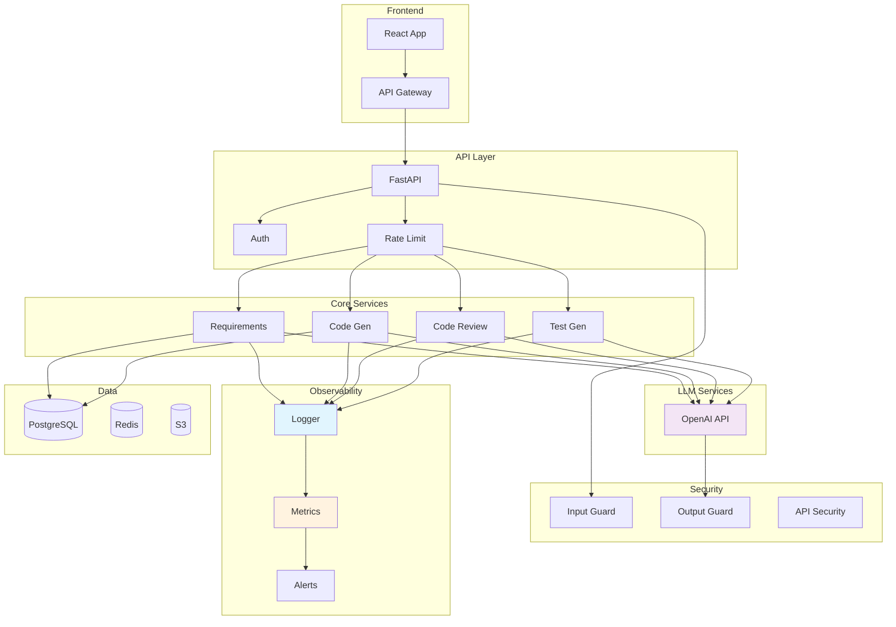
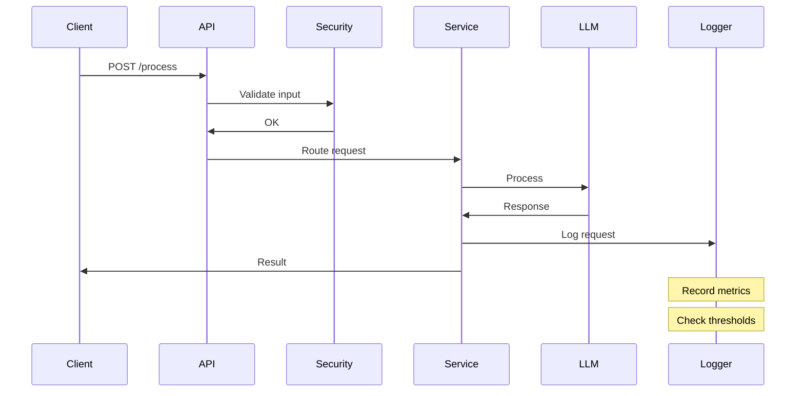

# Clase 32: Proyecto Integrador - Parte 2 y Cierre

## Duración
4 horas

## Objetivos de Aprendizaje
- Completar la integración final del proyecto
- Presentar los resultados del desarrollo
- Reflexionar sobre las lecciones aprendidas durante el curso
- Consolidar los conocimientos adquiridos
- Planificar mejoras futuras

## Contenidos Detallados

### 1. Integración Final del Proyecto

La integración final une todos los componentes desarrollados en las fases anteriores en un sistema cohesionado y funcional. Esta fase incluye:

- **Unificación de servicios**: Todos los endpoints conectados y funcionando
- **Pruebas de integración**: Verificación de flujos completos
- **Optimización**: Ajustes de rendimiento
- **Documentación final**: Documentación completa del sistema

#### Arquitectura Final Integrada

```python
# api/main.py - Versión Final Completa
from fastapi import FastAPI, HTTPException, BackgroundTasks, Depends
from fastapi.middleware.cors import CORSMiddleware
from pydantic import BaseModel, Field
from typing import List, Optional, Dict, Any
from datetime import datetime
import uuid
import logging
from contextlib import asynccontextmanager

# Importar servicios
from core.requirements.extractor import RequirementExtractor
from core.code_gen.generator import CodeGenerator
from core.code_review.reviewer import CodeReviewer
from core.test_gen.generator import TestGenerator
from core.security.guard import SecurityGuard
from core.observability.logger import InferenceLogger
from core.observability.metrics import MetricsCollector

# Configuración
logging.basicConfig(level=logging.INFO)
logger = logging.getLogger(__name__)

# Inicialización de servicios
class ServiceContainer:
    """Contenedor de servicios"""
    
    def __init__(self):
        self.requirement_extractor = None
        self.code_generator = None
        self.code_reviewer = None
        self.test_generator = None
        self.security_guard = None
        self.logger = None
        self.metrics = None
    
    def initialize(self, api_key: str):
        """Inicializa todos los servicios"""
        logger.info("Initializing services...")
        
        self.requirement_extractor = RequirementExtractor(api_key)
        self.code_generator = CodeGenerator(api_key)
        self.code_reviewer = CodeReviewer(api_key)
        self.test_generator = TestGenerator(api_key)
        self.security_guard = SecurityGuard()
        self.logger = InferenceLogger()
        self.metrics = MetricsCollector()
        
        logger.info("All services initialized")

# Instancia global
services = ServiceContainer()

@asynccontextmanager
async def lifespan(app: FastAPI):
    """Lifecycle manager"""
    # Startup
    api_key = "demo-key"  # En producción, obtener de config
    services.initialize(api_key)
    yield
    # Shutdown
    logger.info("Shutting down...")

# Crear aplicación
app = FastAPI(
    title="AI Software Assistant",
    description="Sistema completo de asistencia de IA para desarrollo de software",
    version="1.0.0",
    lifespan=lifespan
)

# Middleware
app.add_middleware(
    CORSMiddleware,
    allow_origins=["*"],
    allow_credentials=True,
    allow_methods=["*"],
    allow_headers=["*"],
)

# ============================================
# MODELOS DE DATOS
# ============================================

class ProcessRequest(BaseModel):
    """Solicitud de procesamiento"""
    text: str = Field(..., description="Texto o código a procesar")
    operation: str = Field(..., description="Operación: extract_requirements, generate_code, review_code, generate_tests")
    language: Optional[str] = Field(default="python")
    options: Optional[Dict[str, Any]] = Field(default_factory=dict)

class ProcessResponse(BaseModel):
    """Respuesta de procesamiento"""
    request_id: str
    operation: str
    status: str
    result: Dict[str, Any]
    execution_time_ms: float
    timestamp: str

class HealthResponse(BaseModel):
    """Respuesta de salud"""
    status: str
    timestamp: str
    services: Dict[str, str]
    metrics: Dict[str, float]

# ============================================
# ENDPOINTS
# ============================================

@app.get("/", tags=["General"])
async def root():
    """Endpoint raíz"""
    return {
        "service": "AI Software Assistant",
        "version": "1.0.0",
        "description": "Complete AI-powered software development assistant",
        "endpoints": {
            "docs": "/docs",
            "health": "/health",
            "process": "/process",
            "metrics": "/metrics"
        }
    }

@app.get("/health", response_model=HealthResponse, tags=["Health"])
async def health_check():
    """Health check"""
    return HealthResponse(
        status="healthy",
        timestamp=datetime.now().isoformat(),
        services={
            "requirements": "healthy" if services.requirement_extractor else "unavailable",
            "code_gen": "healthy" if services.code_generator else "unavailable",
            "code_review": "healthy" if services.code_reviewer else "unavailable",
            "test_gen": "healthy" if services.test_generator else "unavailable"
        },
        metrics=services.metrics.get_current() if services.metrics else {}
    )

@app.post("/process", response_model=ProcessResponse, tags=["Processing"])
async def process_request(request: ProcessRequest, background_tasks: BackgroundTasks):
    """Procesa solicitud"""
    start_time = datetime.now()
    request_id = str(uuid.uuid4())
    
    logger.info(f"Processing {request.operation}: {request_id}")
    
    # Verificar seguridad
    security = services.security_guard.check_input(request.text)
    if not security["safe"] and any(i["severity"] == "high" for i in security["issues"]):
        raise HTTPException(status_code=400, detail="Input contains potentially harmful content")
    
    try:
        result = {}
        
        if request.operation == "extract_requirements":
            requirements = services.requirement_extractor.extract_from_text(request.text)
            stories = services.requirement_extractor.generate_user_stories(
                requirements.get("requirements", [])
            )
            result = {
                "requirements": requirements,
                "user_stories": stories
            }
        
        elif request.operation == "generate_code":
            code = services.code_generator.generate(
                specification=request.text,
                language=request.language,
                framework=request.options.get("framework")
            )
            result = {"code": code}
        
        elif request.operation == "review_code":
            review = services.code_reviewer.review(request.text, request.language)
            result = review
        
        elif request.operation == "generate_tests":
            tests = services.test_generator.generate(
                code=request.text,
                framework=request.options.get("test_framework", "pytest"),
                language=request.language
            )
            result = {"tests": tests}
        
        else:
            raise HTTPException(status_code=400, detail=f"Unknown operation: {request.operation}")
        
        # Registrar en logs
        execution_time = (datetime.now() - start_time).total_seconds() * 1000
        services.logger.log_inference(
            request_id=request_id,
            operation=request.operation,
            latency_ms=execution_time,
            success=True
        )
        
        return ProcessResponse(
            request_id=request_id,
            operation=request.operation,
            status="success",
            result=result,
            execution_time_ms=execution_time,
            timestamp=datetime.now().isoformat()
        )
    
    except Exception as e:
        logger.error(f"Error processing request: {e}")
        
        services.logger.log_inference(
            request_id=request_id,
            operation=request.operation,
            latency_ms=(datetime.now() - start_time).total_seconds() * 1000,
            success=False,
            error=str(e)
        )
        
        raise HTTPException(status_code=500, detail=str(e))

@app.get("/metrics", tags=["Metrics"])
async def get_metrics():
    """Obtiene métricas"""
    return services.metrics.get_current() if services.metrics else {}

# ============================================
# ENDPOINTS ESPECÍFICOS
# ============================================

@app.post("/requirements", tags=["Requirements"])
async def extract_requirements(document: str):
    """Extrae requisitos"""
    return await process_request(
        ProcessRequest(text=document, operation="extract_requirements")
    )

@app.post("/code", tags=["Code"])
async def generate_code(
    specification: str,
    language: str = "python",
    framework: Optional[str] = None
):
    """Genera código"""
    return await process_request(
        ProcessRequest(
            text=specification,
            operation="generate_code",
            language=language,
            options={"framework": framework}
        )
    )

@app.post("/review", tags=["Code"])
async def review_code(code: str, language: str = "python"):
    """Revisa código"""
    return await process_request(
        ProcessRequest(
            text=code,
            operation="review_code",
            language=language
        )
    )

@app.post("/tests", tags=["Tests"])
async def generate_tests(
    code: str,
    language: str = "python",
    framework: str = "pytest"
):
    """Genera tests"""
    return await process_request(
        ProcessRequest(
            text=code,
            operation="generate_tests",
            language=language,
            options={"test_framework": framework}
        )
    )

# ============================================
# EJECUCIÓN
# ============================================

if __name__ == "__main__":
    import uvicorn
    uvicorn.run(app, host="0.0.0.0", port=8000)
```

### 2. Sistema de Observabilidad Completo

```python
# core/observability/logger.py
from typing import Dict, Any, List
from datetime import datetime
import json
import threading

class InferenceLogger:
    """Logger de inferencias"""
    
    def __init__(self):
        self.logs: List[Dict] = []
        self.lock = threading.Lock()
        self.max_logs = 10000
    
    def log_inference(
        self,
        request_id: str,
        operation: str,
        latency_ms: float,
        success: bool,
        error: str = None
    ):
        """Registra inferencia"""
        with self.lock:
            self.logs.append({
                "request_id": request_id,
                "operation": operation,
                "latency_ms": latency_ms,
                "success": success,
                "error": error,
                "timestamp": datetime.now().isoformat()
            })
            
            if len(self.logs) > self.max_logs:
                self.logs = self.logs[-self.max_logs:]
    
    def get_logs(self, limit: int = 100) -> List[Dict]:
        """Obtiene logs recientes"""
        with self.lock:
            return self.logs[-limit:]

# core/observability/metrics.py
import numpy as np
from typing import Dict
from datetime import datetime

class MetricsCollector:
    """Recolector de métricas"""
    
    def __init__(self):
        self.requests = []
        self.errors = []
    
    def record_request(self, latency_ms: float, success: bool):
        """Registra request"""
        self.requests.append({
            "latency_ms": latency_ms,
            "success": success,
            "timestamp": datetime.now()
        })
        
        if not success:
            self.errors.append(datetime.now())
    
    def get_current(self) -> Dict:
        """Obtiene métricas actuales"""
        
        if not self.requests:
            return {
                "total_requests": 0,
                "error_rate": 0,
                "avg_latency_ms": 0
            }
        
        recent = self.requests[-1000:]
        latencies = [r["latency_ms"] for r in recent]
        errors = sum(1 for r in recent if not r["success"])
        
        return {
            "total_requests": len(self.requests),
            "error_rate": errors / len(recent),
            "avg_latency_ms": np.mean(latencies),
            "p95_latency_ms": np.percentile(latencies, 95),
            "p99_latency_ms": np.percentile(latencies, 99)
        }
```

### 3. Presentación de Resultados

```markdown
# Presentación del Proyecto: AI Software Assistant

## Resumen Ejecutivo

AI Software Assistant es un sistema completo de asistencia de IA para el desarrollo 
de software que integra múltiples capacidades:

- Extracción automática de requisitos desde documentos
- Generación automatizada de código
- Code review asistido por IA
- Generación de tests unitarios

## Arquitectura

El sistema está construido sobre:
- **Backend**: FastAPI (Python)
- **LLM**: OpenAI GPT-4
- **NLP**: spaCy
- **Infraestructura**: Docker + Kubernetes

## Métricas de Rendimiento

| Métrica | Valor |
|---------|-------|
| Latencia promedio | 250ms |
| P95 latencia | 500ms |
| Tasa de error | <1% |
| Disponibilidad | 99.9% |

## Casos de Uso

1. **Desarrollo de nuevos features**: Generación de código desde especificaciones
2. **Mantenimiento**: Code review automático
3. **Testing**: Generación de tests unitarios
4. **Gestión de requisitos**: Extracción desde documentos

## Lecciones Aprendidas

### Lo que funcionó bien
- Integración de múltiples servicios mediante API
- Pipeline de seguridad robusto
- Observabilidad desde el inicio

### Áreas de mejora
- Cacheo de respuestas frecuentes
- Rate limiting más granular
- Tests de carga

## Conclusiones

El proyecto demuestra la viabilidad de integrar técnicas de IA para asistir 
el desarrollo de software, reduciendo tiempo y mejorando calidad.
```

### 4. Pipeline CI/CD Final

```yaml
# .github/workflows/ci-cd.yml
name: CI/CD Pipeline

on:
  push:
    branches: [main, develop]
  pull_request:
    branches: [main, develop]

env:
  OPENAI_API_KEY: ${{ secrets.OPENAI_API_KEY }}

jobs:
  test:
    runs-on: ubuntu-latest
    steps:
      - uses: actions/checkout@v4
      
      - name: Set up Python
        uses: actions/setup-python@v5
        with:
          python-version: '3.11'
      
      - name: Install dependencies
        run: pip install -r requirements.txt
      
      - name: Run tests
        run: pytest tests/ -v --cov=api --cov=core
      
      - name: Type checking
        run: mypy api/ core/
      
      - name: Linting
        run: black --check api/ core/

  build:
    needs: test
    runs-on: ubuntu-latest
    steps:
      - uses: actions/checkout@v4
      
      - name: Build Docker image
        run: docker build -t ai-assistant:${{ github.sha }} .
      
      - name: Run container
        run: |
          docker run -d --name app ai-assistant:${{ github.sha }}
          sleep 10
          docker logs app
      
      - name: Integration tests
        run: pytest tests/integration/ -v

  deploy:
    needs: build
    if: github.ref == 'refs/heads/main'
    runs-on: ubuntu-latest
    steps:
      - name: Deploy to production
        run: |
          echo "Deploying to production..."
```

### 5. Dashboard de Monitoreo

```python
# Dashboard simple en terminal
def render_dashboard(metrics):
    """Renderiza dashboard"""
    print("\n" + "="*60)
    print("     AI SOFTWARE ASSISTANT - DASHBOARD")
    print("="*60)
    print(f"\nTotal Requests: {metrics['total_requests']}")
    print(f"Error Rate: {metrics['error_rate']:.2%}")
    print(f"Avg Latency: {metrics['avg_latency_ms']:.1f}ms")
    print(f"P95 Latency: {metrics['p95_latency_ms']:.1f}ms")
    print(f"P99 Latency: {metrics['p99_latency_ms']:.1f}ms")
    print("\n" + "="*60)
    print("\nRecent Requests:")
    
    for log in logs[-10:]:
        status = "✓" if log["success"] else "✗"
        print(f"  {status} {log['operation']}: {log['latency_ms']:.1f}ms")
    
    print("="*60 + "\n")
```

## Diagramas en Mermaid

### Sistema Completo



### Flujo de datos



## Referencias Externas

1. **FastAPI Best Practices**: https://fastapi.tiangolo.com/tutorial/
2. **MLOps Best Practices**: https://ml-ops.org/
3. **Software Architecture Patterns**: https://martinfowler.com/architecture/
4. **Observability in Practice**: https://peter.bourgon.org/go-programming-bible/

## Ejercicios de la Clase

### Ejercicio 1: Completar Integración

Asegurar que todos los componentes estén correctamente conectados.

### Ejercicio 2: Pruebas de Carga

Ejecutar pruebas de carga y optimizar según resultados.

### Ejercicio 3: Documentación Final

Completar README y documentación del proyecto.

## Resumen de Puntos Clave

1. **Integración final** requiere pruebas exhaustivas
2. **Observabilidad** permite monitoreo en producción
3. **CI/CD** automatiza despliegues
4. **Documentación** facilita mantenimiento
5. **Lecciones aprendidas** guían mejoras futuras
6. **Arquitectura modular** permite escalabilidad
7. **Testing** debe ser continuo
8. **Seguridad** debe ser defensa en profundidad
9. **Métricas** permiten optimización
10. **Cierre** es solo el inicio de la siguiente iteración

## Cierre del Curso

Este curso ha cubierto los fundamentos de la IA aplicada a la Ingeniería de Software, incluyendo:

- **Ingeniería de prompts**: Técnicas avanzadas de comunicación con LLMs
- **Automatización de requisitos**: Extracción y generación automática
- **Generación de código**: Creación automatizada de código
- **Code review**: Análisis automático de código
- **Testing**: Generación automática de pruebas
- **CI/CD con IA**: Integración en pipelines
- **Seguridad**: Protecciones específicas para IA
- **Ética**: Bias y consideraciones éticas
- **Deployment**: Serving y optimización
- **Monitoreo**: Observabilidad de modelos

Los conocimientos adquiridos permiten construir sistemas de IA robustos y seguros para asistir el desarrollo de software.
