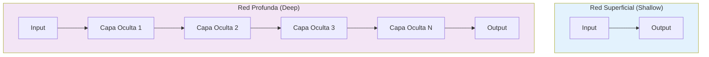
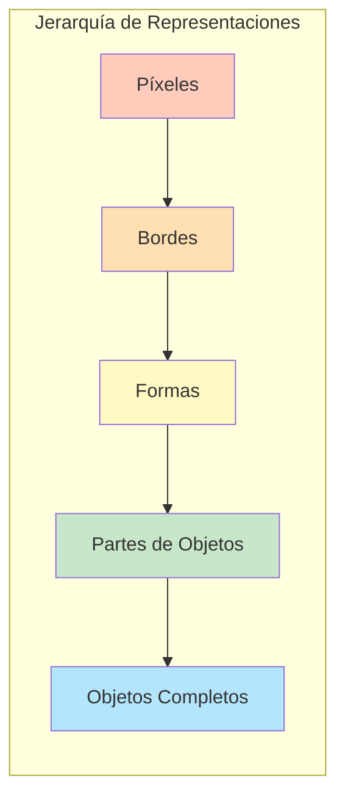
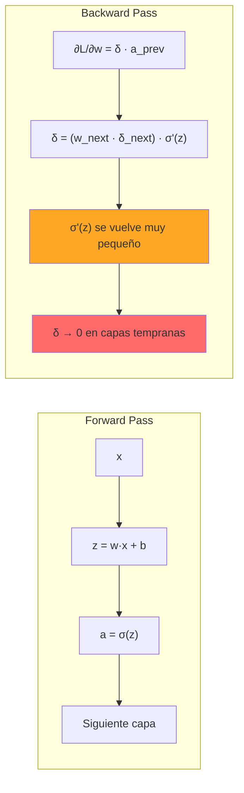
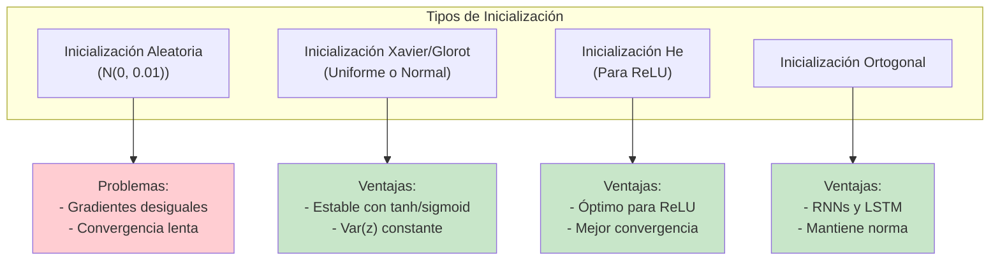
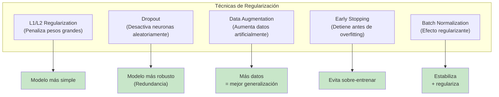
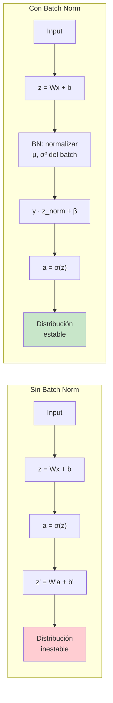
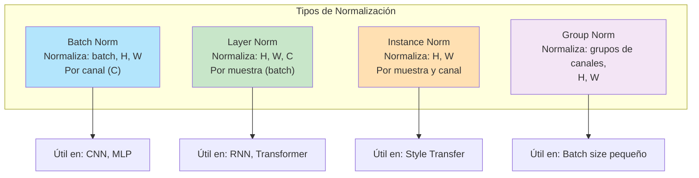

# CLASE 7: Redes Neuronales Profundas - Introducción

## 📋 Información General

| Campo | Detalle |
|-------|---------|
| **Duración** | 4 horas (240 minutos) |
| **Modalidad** | Teórico-Práctico |
| **Prerrequisitos** | Clases 3-6 completadas (perceptrón, forward propagation, backpropagation), cálculo diferencial |
| **Tecnología** | PyTorch, TensorFlow, NumPy |

---

## 🎯 Objetivos de Aprendizaje

Al finalizar esta clase, el estudiante será capaz de:

1. **Comprender** el concepto de profundidad en redes neuronales y su impacto en la capacidad de representación
2. **Identificar** y diagnosticar el problema del gradiente evanescente (vanishing gradient)
3. **Implementar** técnicas de inicialización de pesos (Xavier, He) y regularización (Dropout, L2)
4. **Aplicar** Batch Normalization para estabilizar el entrenamiento
5. **Construir** redes profundas en PyTorch y TensorFlow
6. **Evaluar** el rendimiento de modelos profundos vs. superficiales

---

## 📚 Contenidos Detallados

### 7.1 Introducción a Redes Profundas

Las redes neuronales profundas (Deep Neural Networks, DNN) son redes con múltiples capas ocultas entre la entrada y la salida. La "profundidad" se refiere al número de capas ocultas.



#### 7.1.1 ¿Por qué profundidad?

La profundidad permite que la red aprenda representaciones jerárquicas:



**Teorema de aproximación universal**: Una red con una sola capa oculta puede aproximar cualquier función continua, pero puede necesitar exponencialmente más neuronas que una red profunda.

#### 7.1.2 Profundidad vs. Ancho

```python
import numpy as np
import matplotlib.pyplot as plt

"""
Comparación entre redes profundas y anchas.
Las redes profundas son más eficientes en términos de parámetros.
"""

def contar_parametros(layer_sizes):
    """Cuenta parámetros totales de una red dados los tamaños de capa."""
    total = 0
    for i in range(len(layer_sizes) - 1):
        weights = layer_sizes[i] * layer_sizes[i+1]
        biases = layer_sizes[i+1]
        total += weights + biases
    return total

# Red ancha (1 capa oculta grande)
wide_net = [100, 500, 10]  # entrada, oculta, salida
wide_params = contar_parametros(wide_net)

# Red profunda (múltiples capas pequeñas)
deep_net = [100, 100, 80, 60, 40, 10]  # 4 capas ocultas
deep_params = contar_parametros(deep_net)

print(f"Red ancha (1 capa oculta de 500): {wide_params} parámetros")
print(f"Red profunda (4 capas ocultas):    {deep_params} parámetros")

# Demostrar eficiencia
print(f"\nLa red profunda tiene {deep_params/wide_params:.1%} de los parámetros")
print("pero puede aprender representaciones más complejas.")

# Visualizar
fig, axes = plt.subplots(1, 2, figsize=(10, 5))

# Red ancha
ax1 = axes[0]
n_layers_wide = len(wide_net)
for i in range(n_layers_wide - 1):
    for j in range(wide_net[i]):
        for k in range(wide_net[i+1]):
            ax1.plot([i, i+1], [j, k], 'b-', alpha=0.02)
ax1.set_title(f"Red Ancha ({wide_params} params)")
ax1.set_xlabel("Capa")
ax1.set_ylabel("Neurona")

# Red profunda
ax2 = axes[1]
n_layers_deep = len(deep_net)
for i in range(n_layers_deep - 1):
    for j in range(deep_net[i]):
        for k in range(deep_net[i+1]):
            ax2.plot([i, i+1], [j, k], 'b-', alpha=0.02)
ax2.set_title(f"Red Profunda ({deep_params} params)")
ax2.set_xlabel("Capa")
ax2.set_ylabel("Neurona")

plt.tight_layout()
plt.savefig('wide_vs_deep.png')
plt.show()
```

---

### 7.2 El Problema del Gradiente Evanescente (Vanishing Gradient)

#### 7.2.1 Causa del problema

Cuando las redes se vuelven profundas, los gradientes tienden a hacerse extremadamente pequeños (o extremadamente grandes) al retropropagarse a través de muchas capas.

```python
"""
Demostración del vanishing gradient problem.
"""

import torch
import torch.nn as nn
import torch.optim as optim
import matplotlib.pyplot as plt

class RedProfunda(nn.Module):
    """Red profunda para demostrar vanishing gradient."""
    
    def __init__(self, n_layers=10, activation='sigmoid'):
        super().__init__()
        self.layers = nn.ModuleList()
        self.activation_name = activation
        
        # Capa de entrada
        self.layers.append(nn.Linear(10, 10))
        
        # Capas ocultas
        for _ in range(n_layers):
            self.layers.append(nn.Linear(10, 10))
        
        # Capa de salida
        self.layers.append(nn.Linear(10, 1))
    
    def forward(self, x):
        for i, layer in enumerate(self.layers[:-1]):
            x = layer(x)
            if self.activation_name == 'sigmoid':
                x = torch.sigmoid(x)
            elif self.activation_name == 'tanh':
                x = torch.tanh(x)
            else:
                x = torch.relu(x)
        x = self.layers[-1](x)
        return x


def gradientes_por_capa(model, x, y):
    """Calcula la magnitud del gradiente en cada capa."""
    # Forward
    output = model(x)
    loss = nn.MSELoss()(output, y)
    
    # Backward
    loss.backward()
    
    grad_magnitudes = []
    for i, layer in enumerate(model.layers):
        if layer.weight.grad is not None:
            grad_magnitudes.append(layer.weight.grad.norm().item())
        else:
            grad_magnitudes.append(0)
    
    return grad_magnitudes


def experimento_vanishing_gradient():
    """Demostrar vanishing gradient con sigmoid vs ReLU."""
    
    torch.manual_seed(42)
    
    # Datos
    x = torch.randn(32, 10)
    y = torch.randn(32, 1)
    
    # Modelos con diferentes activaciones
    model_sigmoid = RedProfunda(n_layers=10, activation='sigmoid')
    model_relu = RedProfunda(n_layers=10, activation='relu')
    
    # Calcular gradientes
    grads_sigmoid = gradientes_por_capa(model_sigmoid, x, y)
    grads_relu = gradientes_por_capa(model_relu, x, y)
    
    # Visualizar
    plt.figure(figsize=(12, 5))
    
    plt.subplot(1, 2, 1)
    plt.plot(grads_sigmoid, 'r-o', markersize=4)
    plt.xlabel('Capa (0 = entrada, mayor = salida)')
    plt.ylabel('Magnitud del Gradiente')
    plt.title('Vanishing Gradient con Sigmoid')
    plt.yscale('log')
    plt.grid(True, alpha=0.3)
    plt.axhline(y=1e-6, color='gray', linestyle='--', label='Límite de precisión')
    plt.legend()
    
    plt.subplot(1, 2, 2)
    plt.plot(grads_relu, 'b-o', markersize=4)
    plt.xlabel('Capa (0 = entrada, mayor = salida)')
    plt.ylabel('Magnitud del Gradiente')
    plt.title('Gradientes con ReLU')
    plt.yscale('log')
    plt.grid(True, alpha=0.3)
    
    plt.tight_layout()
    plt.savefig('vanishing_gradient.png')
    plt.show()
    
    print("Vanishing Gradient - Resultados:")
    print(f"  Sigmoid: capa 0 (entrada) = {grads_sigmoid[0]:.8f}")
    print(f"  Sigmoid: capa última = {grads_sigmoid[-1]:.8f}")
    print(f"  ReLU: capa 0 (entrada) = {grads_relu[0]:.8f}")
    print(f"  ReLU: capa última = {grads_relu[-1]:.8f}")


if __name__ == "__main__":
    experimento_vanishing_gradient()
```



#### 7.2.2 Análisis Matemático del Vanishing Gradient

Para una red con función de activación sigmoid:

$$\sigma(z) = \frac{1}{1 + e^{-z}} \quad \Rightarrow \quad \sigma'(z) = \sigma(z)(1 - \sigma(z))$$

La derivada máxima de sigmoid es 0.25. Cuando se retropropaga a través de $L$ capas:

$$\frac{\partial L}{\partial w^{(1)}} \propto \prod_{l=1}^{L} \sigma'(z^{(l)}) \cdot w^{(l+1)}$$

Con inicialización estándar ($w \approx 1$) y sigmoid:

$$\left|\frac{\partial L}{\partial w^{(1)}}\right| \approx (0.25)^L$$

Para $L = 10$: $(0.25)^{10} \approx 9.5 \times 10^{-7}$ — ¡prácticamente cero!

#### 7.2.3 Exploding Gradient

El problema opuesto ocurre cuando los gradientes crecen exponencialmente, causando overflow numérico. Es más común en RNNs y capas con inicialización incorrecta.

---

### 7.3 Inicialización de Pesos

La inicialización de pesos es crítica para entrenar redes profundas. Una buena inicialización mantiene la varianza de las activaciones estable a través de las capas.



#### 7.3.1 Inicialización Xavier (Glorot)

Propuesta por Glorot & Bengio (2010). Mantiene la varianza constante tanto en forward como en backward.

$$W \sim \mathcal{U}\left[-\frac{\sqrt{6}}{\sqrt{n_{in} + n_{out}}}, \frac{\sqrt{6}}{\sqrt{n_{in} + n_{out}}}\right]$$

o bien:

$$W \sim \mathcal{N}\left(0, \frac{2}{n_{in} + n_{out}}\right)$$

#### 7.3.2 Inicialización He (Kaiming)

Propuesta por He et al. (2015). Optimizada para ReLU y sus variantes.

$$W \sim \mathcal{N}\left(0, \frac{2}{n_{in}}\right)$$

```python
"""
Implementación de diferentes estrategias de inicialización de pesos.
"""

import numpy as np
import torch
import torch.nn as nn
import matplotlib.pyplot as plt

class WeightInitializer:
    """Diferentes métodos de inicialización de pesos."""
    
    @staticmethod
    def xavier_uniform(fan_in, fan_out):
        """Inicialización Xavier (uniforme)."""
        limit = np.sqrt(6.0 / (fan_in + fan_out))
        return np.random.uniform(-limit, limit, (fan_in, fan_out))
    
    @staticmethod
    def xavier_normal(fan_in, fan_out):
        """Inicialización Xavier (normal)."""
        std = np.sqrt(2.0 / (fan_in + fan_out))
        return np.random.normal(0, std, (fan_in, fan_out))
    
    @staticmethod
    def he_uniform(fan_in, fan_out):
        """Inicialización He (uniforme)."""
        limit = np.sqrt(6.0 / fan_in)
        return np.random.uniform(-limit, limit, (fan_in, fan_out))
    
    @staticmethod
    def he_normal(fan_in, fan_out):
        """Inicialización He (normal)."""
        std = np.sqrt(2.0 / fan_in)
        return np.random.normal(0, std, (fan_in, fan_out))
    
    @staticmethod
    def random_small(fan_in, fan_out):
        """Inicialización ingenua con valores pequeños."""
        return np.random.normal(0, 0.01, (fan_in, fan_out))


def comparar_inicializaciones():
    """Compara cómo afecta la inicialización a la propagación forward."""
    
    np.random.seed(42)
    
    n_layers = 50
    layer_size = 256
    n_samples = 1000
    
    # Datos de entrada
    x = np.random.randn(n_samples, layer_size)
    
    methods = {
        'Random (σ=0.01)': WeightInitializer.random_small,
        'Xavier Normal': WeightInitializer.xavier_normal,
        'He Normal': WeightInitializer.he_normal,
    }
    
    fig, axes = plt.subplots(1, 3, figsize=(15, 4))
    
    for idx, (name, init_fn) in enumerate(methods.items()):
        activations = x.copy()
        
        # Forward pass a través de capas lineales + tanh
        for _ in range(n_layers):
            W = init_fn(layer_size, layer_size)
            activations = np.dot(activations, W)
            activations = np.tanh(activations)
        
        # Estadísticas
        mean_act = np.mean(activations)
        std_act = np.std(activations)
        frac_alive = np.mean(np.abs(activations) > 0.01)
        
        ax = axes[idx]
        ax.hist(activations.flatten(), bins=50, alpha=0.7)
        ax.set_title(f"{name}\nmedia={mean_act:.3f}, σ={std_act:.3f}\nalive={frac_alive:.1%}")
        ax.set_xlabel('Valor de activación')
        ax.set_ylabel('Frecuencia')
        ax.set_xlim(-1.5, 1.5)
    
    plt.tight_layout()
    plt.savefig('weight_init_comparison.png')
    plt.show()
    
    print("Comparación de inicializaciones:")
    for name, init_fn in methods.items():
        W = init_fn(256, 256)
        print(f"  {name}: media={np.mean(W):.4f}, σ={np.std(W):.4f}")


if __name__ == "__main__":
    comparar_inicializaciones()
```

#### 7.3.3 Inicialización en PyTorch y TensorFlow

```python
"""
Uso de inicializadores en PyTorch y TensorFlow.
"""

import torch
import torch.nn as nn

# ============================================================
# PyTorch: Inicialización personalizada
# ============================================================

class RedConInicializacion(nn.Module):
    """Red con diferentes inicializaciones en PyTorch."""
    
    def __init__(self, input_size=784, hidden_size=256, num_classes=10):
        super().__init__()
        
        self.fc1 = nn.Linear(input_size, hidden_size)
        self.fc2 = nn.Linear(hidden_size, hidden_size)
        self.fc3 = nn.Linear(hidden_size, num_classes)
        
        self._inicializar_pesos()
    
    def _inicializar_pesos(self):
        """Aplica diferentes inicializaciones a cada capa."""
        
        # Inicialización Xavier para tanh
        nn.init.xavier_uniform_(self.fc1.weight)
        
        # Inicialización He para ReLU
        nn.init.kaiming_uniform_(self.fc2.weight, mode='fan_in', nonlinearity='relu')
        
        # Inicialización Xavier para la capa de salida
        nn.init.xavier_normal_(self.fc3.weight)
        
        # Inicializar biases a 0
        nn.init.zeros_(self.fc1.bias)
        nn.init.zeros_(self.fc2.bias)
        nn.init.zeros_(self.fc3.bias)
    
    def forward(self, x):
        x = torch.tanh(self.fc1(x))
        x = torch.relu(self.fc2(x))
        x = self.fc3(x)
        return x


def demostrar_inicializadores_pytorch():
    """Demostrar diferentes inicializadores disponibles en PyTorch."""
    
    print("=" * 60)
    print("INICIALIZADORES EN PYTORCH")
    print("=" * 60)
    
    capa = nn.Linear(100, 100)
    
    # Xavier Uniform
    nn.init.xavier_uniform_(capa.weight)
    print(f"Xavier Uniform: media={capa.weight.mean():.4f}, std={capa.weight.std():.4f}")
    
    # Xavier Normal
    nn.init.xavier_normal_(capa.weight)
    print(f"Xavier Normal:  media={capa.weight.mean():.4f}, std={capa.weight.std():.4f}")
    
    # Kaiming (He) Uniform
    nn.init.kaiming_uniform_(capa.weight, mode='fan_in', nonlinearity='relu')
    print(f"He Uniform:    media={capa.weight.mean():.4f}, std={capa.weight.std():.4f}")
    
    # Kaiming (He) Normal
    nn.init.kaiming_normal_(capa.weight, mode='fan_in', nonlinearity='relu')
    print(f"He Normal:     media={capa.weight.mean():.4f}, std={capa.weight.std():.4f}")
    
    # Inicialización constante
    nn.init.constant_(capa.weight, 0.1)
    print(f"Constant(0.1): media={capa.weight.mean():.4f}, std={capa.weight.std():.4f}")
    
    # Inicialización ortogonal (útil para RNNs)
    nn.init.orthogonal_(capa.weight)
    print(f"Orthogonal:    media={capa.weight.mean():.4f}, std={capa.weight.std():.4f}")
    
    # Identidad (solo para capas cuadradas)
    nn.init.eye_(capa.weight)
    print(f"Eye:           media={capa.weight.mean():.4f}, std={capa.weight.std():.4f}")


if __name__ == "__main__":
    modelo = RedConInicializacion()
    print(f"Modelo creado con {sum(p.numel() for p in modelo.parameters())} parámetros")
    demostrar_inicializadores_pytorch()
```

#### 7.3.4 Inicialización en TensorFlow

```python
"""
Uso de inicializadores en TensorFlow/Keras.
"""

import tensorflow as tf

def crear_modelo_tf():
    """Red con diferentes inicializaciones en TensorFlow."""
    
    model = tf.keras.Sequential([
        tf.keras.layers.Dense(
            256, 
            activation='relu',
            kernel_initializer=tf.keras.initializers.HeNormal(),
            bias_initializer='zeros',
            input_shape=(784,)
        ),
        tf.keras.layers.Dense(
            128,
            activation='relu',
            kernel_initializer=tf.keras.initializers.HeUniform()
        ),
        tf.keras.layers.Dense(
            64,
            activation='relu',
            kernel_initializer=tf.keras.initializers.HeNormal()
        ),
        tf.keras.layers.Dense(
            10,
            activation='softmax',
            kernel_initializer=tf.keras.initializers.GlorotUniform()
        )
    ])
    
    return model


def inicializadores_tf():
    """Lista de inicializadores disponibles en TensorFlow."""
    
    print("=" * 60)
    print("INICIALIZADORES EN TENSORFLOW")
    print("=" * 60)
    
    inicializadores = [
        ('GlorotUniform', tf.keras.initializers.GlorotUniform()),
        ('GlorotNormal', tf.keras.initializers.GlorotNormal()),
        ('HeNormal', tf.keras.initializers.HeNormal()),
        ('HeUniform', tf.keras.initializers.HeUniform()),
        ('LecunNormal', tf.keras.initializers.LecunNormal()),
        ('Orthogonal', tf.keras.initializers.Orthogonal()),
        ('RandomNormal(0,0.01)', tf.keras.initializers.RandomNormal(mean=0., stddev=0.01)),
        ('VarianceScaling', tf.keras.initializers.VarianceScaling()),
    ]
    
    for name, initializer in inicializadores:
        values = initializer(shape=(100, 100)).numpy()
        print(f"  {name:25s}: media={values.mean():.4f}, std={values.std():.4f}")
    
    modelo = crear_modelo_tf()
    print(f"\nModelo TF creado con {modelo.count_params():,} parámetros")
    modelo.summary()


if __name__ == "__main__":
    inicializadores_tf()
```

---

### 7.4 Regularización en Redes Profundas

La regularización previene el overfitting, especialmente importante en redes profundas con muchos parámetros.



#### 7.4.1 Regularización L1 y L2

**L2 Regularization (Weight Decay)**: Penaliza la suma de los cuadrados de los pesos.

$$L_{\text{total}} = L_{\text{original}} + \frac{\lambda}{2} \sum_{i} w_i^2$$

**L1 Regularization (Lasso)**: Penaliza la suma de los valores absolutos de los pesos.

$$L_{\text{total}} = L_{\text{original}} + \lambda \sum_{i} |w_i|$$

```python
"""
Regularización L1 y L2 desde cero y con frameworks.
"""

import numpy as np
import torch
import torch.nn as nn
import torch.optim as optim

# ============================================================
# Implementación desde cero
# ============================================================

class Regularizacion:
    """Funciones de regularización implementadas desde cero."""
    
    @staticmethod
    def l2_penalty(weights, lambda_reg=0.01):
        """
        L2 = (λ/2) * Σ w²
        
        Gradiente: ∂L2/∂w = λ * w
        """
        return (lambda_reg / 2) * np.sum(weights ** 2)
    
    @staticmethod
    def l1_penalty(weights, lambda_reg=0.01):
        """
        L1 = λ * Σ |w|
        
        Gradiente: ∂L1/∂w = λ * sign(w)
        """
        return lambda_reg * np.sum(np.abs(weights))
    
    @staticmethod
    def elastic_net(weights, lambda_reg=0.01, l1_ratio=0.5):
        """
        Elastic Net: combina L1 y L2
        
        L = λ * (r * L1 + (1-r) * L2)
        donde r = l1_ratio
        """
        l1 = lambda_reg * l1_ratio * np.sum(np.abs(weights))
        l2 = (lambda_reg * (1 - l1_ratio) / 2) * np.sum(weights ** 2)
        return l1 + l2


def gradiente_descenso_con_regularizacion():
    """GD con y sin regularización - comparación."""
    
    np.random.seed(42)
    
    # Datos sintéticos
    N = 50
    X = np.random.randn(N, 10)
    # Solo 3 características relevantes
    w_true = np.zeros(10)
    w_true[:3] = [2, -3, 1.5]
    y = X @ w_true + 0.5 * np.random.randn(N)
    
    def mse_grad(X, y, w):
        pred = X @ w
        return 2 * X.T @ (pred - y) / len(y)
    
    # Entrenar sin regularización
    w_no_reg = np.random.randn(10) * 0.01
    lr = 0.01
    
    for _ in range(1000):
        grad = mse_grad(X, y, w_no_reg)
        w_no_reg -= lr * grad
    
    # Entrenar con L2
    w_l2 = np.random.randn(10) * 0.01
    lambda_l2 = 0.1
    
    for _ in range(1000):
        grad = mse_grad(X, y, w_l2)
        grad += lambda_l2 * w_l2  # L2 gradient
        w_l2 -= lr * grad
    
    # Entrenar con L1
    w_l1 = np.random.randn(10) * 0.01
    lambda_l1 = 0.1
    
    for _ in range(1000):
        grad = mse_grad(X, y, w_l1)
        grad += lambda_l1 * np.sign(w_l1)  # L1 gradient
        w_l1 -= lr * grad
    
    print("=" * 60)
    print("COMPARACIÓN DE REGULARIZACIÓN")
    print("=" * 60)
    print(f"\nPesos verdaderos:  {w_true}")
    print(f"Sin regularización: {np.round(w_no_reg, 3)}")
    print(f"Con L2 (λ=0.1):     {np.round(w_l2, 3)}")
    print(f"Con L1 (λ=0.1):     {np.round(w_l1, 3)}")
    print(f"\nNorma L2 - Sin reg: {np.linalg.norm(w_no_reg):.3f}")
    print(f"Norma L2 - Con L2:  {np.linalg.norm(w_l2):.3f}")
    print(f"Norma L2 - Con L1:  {np.linalg.norm(w_l1):.3f}")
    print(f"\nObservación: L1 produce pesos más dispersos (más ceros).")


if __name__ == "__main__":
    gradiente_descenso_con_regularizacion()
```

**Regularización L2 en PyTorch** (weight_decay en el optimizador):

```python
# weight_decay = λ (el coeficiente de regularización L2)
optimizer_sgd_wd = optim.SGD(model.parameters(), lr=0.01, weight_decay=0.0001)
optimizer_adam_wd = optim.Adam(model.parameters(), lr=0.001, weight_decay=0.0001)
```

**Regularización L2 en TensorFlow** (kernel_regularizer):

```python
model = tf.keras.Sequential([
    tf.keras.layers.Dense(256, activation='relu', 
                          kernel_regularizer=tf.keras.regularizers.l2(0.0001)),
    tf.keras.layers.Dense(128, activation='relu',
                          kernel_regularizer=tf.keras.regularizers.l2(0.0001)),
    tf.keras.layers.Dense(10, activation='softmax',
                          kernel_regularizer=tf.keras.regularizers.l2(0.0001))
])
```

#### 7.4.2 Dropout

Dropout desactiva aleatoriamente un porcentaje de neuronas durante el entrenamiento, forzando a la red a aprender representaciones redundantes.

```python
"""
Implementación de Dropout desde cero y con frameworks.
"""

import numpy as np
import torch
import torch.nn as nn

# ============================================================
# Dropout desde cero
# ============================================================

class DropoutManual:
    """
    Dropout: Desactiva neuronas con probabilidad p durante training.
    
    En forward (training):
        a_drop = a * mask / (1 - p)
        donde mask ~ Bernoulli(1-p)
    
    En inference:
        a_drop = a (sin dropout)
    
    El factor 1/(1-p) mantiene la misma magnitud esperada.
    """
    
    def __init__(self, dropout_rate=0.5):
        self.dropout_rate = dropout_rate
        self.mask = None
    
    def forward(self, activations, training=True):
        if not training:
            return activations
        
        # Crear máscara: 1 para mantener, 0 para descartar
        self.mask = np.random.binomial(1, 1 - self.dropout_rate, activations.shape)
        
        # Escalar para mantener la expectativa
        return activations * self.mask / (1 - self.dropout_rate)
    
    def backward(self, grad_output):
        """Propagar gradiente solo a través de neuronas activas."""
        return grad_output * self.mask


def demostrar_dropout():
    """Demostrar el efecto de dropout en las activaciones."""
    
    print("=" * 60)
    print("DEMOSTRACIÓN DE DROPOUT")
    print("=" * 60)
    
    np.random.seed(42)
    
    # Simular activaciones de una capa
    activations = np.random.randn(1, 10)
    print(f"Activaciones originales: {activations[0]}")
    
    for rate in [0.0, 0.3, 0.5, 0.8]:
        dropout = DropoutManual(dropout_rate=rate)
        
        # Forward con dropout
        dropped = dropout.forward(activations, training=True)
        
        n_zeros = np.sum(dropped == 0)
        mean_active = np.mean(dropped[dropped != 0]) if np.any(dropped != 0) else 0
        
        print(f"\nDropout rate = {rate}:")
        print(f"  Neuronas activas: {10 - n_zeros}/10")
        print(f"  Salida: {dropped[0].round(3)}")
        print(f"  Media (activas): {mean_active:.3f}")
    
    print("\nEn inference, dropout NO se aplica.")
    print("Todas las neuronas contribuyen con su activación completa.")


if __name__ == "__main__":
    demostrar_dropout()
```

**Dropout en PyTorch**:

```python
class RedConDropout(nn.Module):
    """Red con dropout en PyTorch."""
    
    def __init__(self, input_size=784, hidden_size=512, num_classes=10, dropout_rate=0.5):
        super().__init__()
        
        self.fc1 = nn.Linear(input_size, hidden_size)
        self.bn1 = nn.BatchNorm1d(hidden_size)
        self.dropout1 = nn.Dropout(dropout_rate)
        
        self.fc2 = nn.Linear(hidden_size, hidden_size // 2)
        self.bn2 = nn.BatchNorm1d(hidden_size // 2)
        self.dropout2 = nn.Dropout(dropout_rate)
        
        self.fc3 = nn.Linear(hidden_size // 2, num_classes)
    
    def forward(self, x):
        x = torch.relu(self.bn1(self.fc1(x)))
        x = self.dropout1(x)
        
        x = torch.relu(self.bn2(self.fc2(x)))
        x = self.dropout2(x)
        
        x = self.fc3(x)
        return x


def entrenar_con_dropout():
    """Comparar entrenamiento con y sin dropout."""
    
    torch.manual_seed(42)
    
    # Datos sintéticos de sobreajuste
    N = 200
    X = torch.randn(N, 100)  # 100 features
    y = (X[:, 0] + X[:, 1] > 0).float().unsqueeze(1)  # solo 2 features importan
    
    # Dividir
    X_train, X_val = X[:150], X[150:]
    y_train, y_val = y[:150], y[150:]
    
    class RedSimple(nn.Module):
        def __init__(self, use_dropout=False, dropout_rate=0.3):
            super().__init__()
            self.use_dropout = use_dropout
            self.fc1 = nn.Linear(100, 200)
            self.fc2 = nn.Linear(200, 200)
            self.fc3 = nn.Linear(200, 1)
            self.dropout = nn.Dropout(dropout_rate)
        
        def forward(self, x):
            x = torch.relu(self.fc1(x))
            if self.use_dropout:
                x = self.dropout(x)
            x = torch.relu(self.fc2(x))
            if self.use_dropout:
                x = self.dropout(x)
            x = torch.sigmoid(self.fc3(x))
            return x
    
    modelos = {
        'Sin Dropout': RedSimple(use_dropout=False),
        'Con Dropout': RedSimple(use_dropout=True, dropout_rate=0.3),
    }
    
    criterion = nn.BCELoss()
    results = {}
    
    for name, model in modelos.items():
        optimizer = optim.Adam(model.parameters(), lr=0.001)
        train_losses, val_losses = [], []
        
        for epoch in range(500):
            # Train
            model.train()
            optimizer.zero_grad()
            outputs = model(X_train)
            loss = criterion(outputs, y_train)
            loss.backward()
            optimizer.step()
            train_losses.append(loss.item())
            
            # Val
            model.eval()
            with torch.no_grad():
                val_outputs = model(X_val)
                val_loss = criterion(val_outputs, y_val)
                val_losses.append(val_loss.item())
        
        results[name] = (train_losses, val_losses)
        print(f"\n{name}:")
        print(f"  Train loss final: {train_losses[-1]:.4f}")
        print(f"  Val loss final:   {val_losses[-1]:.4f}")
    
    # Detectar overfitting
    sin_dropout = results['Sin Dropout']
    con_dropout = results['Con Dropout']
    
    gap_sin = sin_dropout[1][-1] - sin_dropout[0][-1]
    gap_con = con_dropout[1][-1] - con_dropout[0][-1]
    
    print(f"\nBrecha train-val sin dropout:  {gap_sin:.4f}")
    print(f"Brecha train-val con dropout:   {gap_con:.4f}")
    
    if gap_con < gap_sin:
        print("✓ Dropout redujo el overfitting significativamente.")


if __name__ == "__main__":
    entrenar_con_dropout()
```

**Dropout en TensorFlow**:

```python
import tensorflow as tf

modelo_tf_dropout = tf.keras.Sequential([
    tf.keras.layers.Dense(512, activation='relu', input_shape=(784,)),
    tf.keras.layers.Dropout(0.5),
    tf.keras.layers.Dense(256, activation='relu'),
    tf.keras.layers.Dropout(0.3),
    tf.keras.layers.Dense(10, activation='softmax')
])

modelo_tf_dropout.compile(
    optimizer='adam',
    loss='sparse_categorical_crossentropy',
    metrics=['accuracy']
)

# Durante el entrenamiento, dropout está activo automáticamente
# Durante model.evaluate() o model.predict(), dropout se desactiva
```

---

### 7.5 Batch Normalization

Batch Normalization (Ioffe & Szegedy, 2015) normaliza las activaciones de cada capa, reduciendo el cambio de distribución (internal covariate shift) y permitiendo tasas de aprendizaje más altas.



#### 7.5.1 Algoritmo de Batch Normalization

Para un mini-batch $B = \{x_1, ..., x_m\}$ con parámetros aprendibles $\gamma$ (escala) y $\beta$ (desplazamiento):

1. **Media del batch**: $\mu_B = \frac{1}{m} \sum_{i=1}^{m} x_i$
2. **Varianza del batch**: $\sigma^2_B = \frac{1}{m} \sum_{i=1}^{m} (x_i - \mu_B)^2$
3. **Normalizar**: $\hat{x}_i = \frac{x_i - \mu_B}{\sqrt{\sigma^2_B + \epsilon}}$
4. **Escalar y desplazar**: $y_i = \gamma \hat{x}_i + \beta$

En **inference**: se usa la media móvil (running mean/var) acumulada durante el entrenamiento.

```python
"""
Batch Normalization: implementación desde cero y con frameworks.
"""

import numpy as np
import torch
import torch.nn as nn
import torch.optim as optim
import matplotlib.pyplot as plt

# ============================================================
# Batch Normalization desde cero
# ============================================================

class BatchNormManual:
    """
    Batch Normalization implementado manualmente.
    
    Durante training:
        - Normaliza usando μ, σ² del batch actual
        - Mantiene running mean/var para inference
    
    Durante inference:
        - Usa running mean/var acumulados
    """
    
    def __init__(self, num_features, eps=1e-5, momentum=0.9):
        self.eps = eps
        self.momentum = momentum
        
        # Parámetros aprendibles
        self.gamma = np.ones(num_features)  # escala
        self.beta = np.zeros(num_features)    # desplazamiento
        
        # Estadísticas acumuladas (running)
        self.running_mean = np.zeros(num_features)
        self.running_var = np.ones(num_features)
        
        # Estadísticas del batch actual (para backward)
        self.batch_mean = None
        self.batch_var = None
        self.x_normalized = None
        self.x_centered = None
    
    def forward(self, x, training=True):
        """
        Args:
            x: (batch_size, num_features)
            training: True durante entrenamiento, False en inference
        """
        if training:
            # Calcular estadísticas del batch
            self.batch_mean = np.mean(x, axis=0)
            self.batch_var = np.var(x, axis=0)
            
            # Actualizar running statistics
            self.running_mean = self.momentum * self.running_mean + (1 - self.momentum) * self.batch_mean
            self.running_var = self.momentum * self.running_var + (1 - self.momentum) * self.batch_var
            
            # Normalizar
            self.x_centered = x - self.batch_mean
            self.x_normalized = self.x_centered / np.sqrt(self.batch_var + self.eps)
        else:
            # Inference: usar running statistics
            self.x_normalized = (x - self.running_mean) / np.sqrt(self.running_var + self.eps)
        
        # Escalar y desplazar
        out = self.gamma * self.x_normalized + self.beta
        return out


def demostrar_batch_norm():
    """Demostrar el efecto de Batch Normalization en la distribución."""
    
    np.random.seed(42)
    
    # Simular datos con distribución cambiante
    n_batches = 50
    batch_size = 32
    
    bn = BatchNormManual(num_features=4)
    
    print("=" * 60)
    print("DEMOSTRACIÓN DE BATCH NORMALIZATION")
    print("=" * 60)
    
    means_before = []
    means_after = []
    
    for i in range(n_batches):
        # Las activaciones cambian su distribución a lo largo del entrenamiento
        shift = i * 0.1
        x = np.random.randn(batch_size, 4) + shift
        
        # Antes de BN
        mean_before = np.mean(x)
        
        # Después de BN
        x_norm = bn.forward(x, training=True)
        mean_after = np.mean(x_norm)
        
        means_before.append(mean_before)
        means_after.append(mean_after)
        
        if i % 10 == 0:
            print(f"Batch {i:3d}: media antes={mean_before:.3f}, después={mean_after:.3f}")
    
    print(f"\nResumen:")
    print(f"  Media antes de BN: {np.mean(means_before):.3f} ± {np.std(means_before):.3f}")
    print(f"  Media después de BN: {np.mean(means_after):.3f} ± {np.std(means_after):.3f}")
    print(f"  BN mantiene la distribución estable independientemente del input.")
    
    # Inference
    x_test = np.random.randn(4) * 10 + 5  # distribución muy diferente
    x_norm_test = bn.forward(x_test.reshape(1, -1), training=False)
    print(f"\nInference con input extremo:")
    print(f"  Input: {x_test.round(2)}")
    print(f"  Output: {x_norm_test[0].round(2)}")


if __name__ == "__main__":
    demostrar_batch_norm()
```

#### 7.5.2 Batch Normalization en PyTorch

```python
"""
Uso de BatchNorm en PyTorch.
"""

class RedConBatchNorm(nn.Module):
    """Red profunda con Batch Normalization."""
    
    def __init__(self, input_size=784, num_classes=10):
        super().__init__()
        
        self.block1 = nn.Sequential(
            nn.Linear(input_size, 256),
            nn.BatchNorm1d(256),
            nn.ReLU(inplace=True)
        )
        
        self.block2 = nn.Sequential(
            nn.Linear(256, 128),
            nn.BatchNorm1d(128),
            nn.ReLU(inplace=True)
        )
        
        self.block3 = nn.Sequential(
            nn.Linear(128, 64),
            nn.BatchNorm1d(64),
            nn.ReLU(inplace=True)
        )
        
        self.classifier = nn.Linear(64, num_classes)
    
    def forward(self, x):
        x = self.block1(x)
        x = self.block2(x)
        x = self.block3(x)
        x = self.classifier(x)
        return x


def comparar_con_y_sin_bn():
    """Comparar convergencia con y sin Batch Normalization."""
    
    torch.manual_seed(42)
    
    # Datos
    N = 1000
    X = torch.randn(N, 784)
    y = torch.randint(0, 10, (N,))
    
    # Modelos
    class RedSinBN(nn.Module):
        def __init__(self):
            super().__init__()
            self.fc1 = nn.Linear(784, 256)
            self.fc2 = nn.Linear(256, 128)
            self.fc3 = nn.Linear(128, 64)
            self.fc4 = nn.Linear(64, 10)
        
        def forward(self, x):
            x = torch.relu(self.fc1(x))
            x = torch.relu(self.fc2(x))
            x = torch.relu(self.fc3(x))
            x = self.fc4(x)
            return x
    
    model_sin_bn = RedSinBN()
    model_con_bn = RedConBatchNorm()
    
    criterion = nn.CrossEntropyLoss()
    optim_sin = optim.SGD(model_sin_bn.parameters(), lr=0.01, momentum=0.9)
    optim_con = optim.SGD(model_con_bn.parameters(), lr=0.01, momentum=0.9)
    
    losses_sin = []
    losses_con = []
    
    print("=" * 60)
    print("COMPARACIÓN: CON vs SIN BATCH NORM")
    print("=" * 60)
    print(f"{'Epoch':<8}{'Sin BN':<12}{'Con BN':<12}")
    print("-" * 32)
    
    for epoch in range(50):
        # Sin BN
        optim_sin.zero_grad()
        outputs_sin = model_sin_bn(X)
        loss_sin = criterion(outputs_sin, y)
        loss_sin.backward()
        optim_sin.step()
        losses_sin.append(loss_sin.item())
        
        # Con BN
        optim_con.zero_grad()
        outputs_con = model_con_bn(X)
        loss_con = criterion(outputs_con, y)
        loss_con.backward()
        optim_con.step()
        losses_con.append(loss_con.item())
        
        if (epoch + 1) % 10 == 0:
            print(f"{epoch+1:<8}{loss_sin.item():.4f}      {loss_con.item():.4f}")
    
    print(f"\nLoss final - Sin BN: {losses_sin[-1]:.4f}")
    print(f"Loss final - Con BN: {losses_con[-1]:.4f}")
    
    # Visualizar
    plt.figure(figsize=(10, 5))
    plt.plot(losses_sin, 'r-', label='Sin Batch Norm', alpha=0.7)
    plt.plot(losses_con, 'b-', label='Con Batch Norm', alpha=0.7)
    plt.xlabel('Epoch')
    plt.ylabel('Loss')
    plt.title('Efecto de Batch Normalization en la Convergencia')
    plt.legend()
    plt.grid(True, alpha=0.3)
    plt.savefig('batch_norm_comparison.png')
    plt.show()


if __name__ == "__main__":
    comparar_con_y_sin_bn()
```

#### 7.5.3 Batch Normalization en TensorFlow

```python
"""
Batch Normalization en TensorFlow/Keras.
"""

import tensorflow as tf

modelo_tf_bn = tf.keras.Sequential([
    tf.keras.layers.Dense(256, input_shape=(784,), use_bias=False),  # bias innecesario con BN
    tf.keras.layers.BatchNormalization(),
    tf.keras.layers.Activation('relu'),
    
    tf.keras.layers.Dense(128, use_bias=False),
    tf.keras.layers.BatchNormalization(),
    tf.keras.layers.Activation('relu'),
    
    tf.keras.layers.Dense(64, use_bias=False),
    tf.keras.layers.BatchNormalization(),
    tf.keras.layers.Activation('relu'),
    
    tf.keras.layers.Dense(10, activation='softmax')
])

modelo_tf_bn.compile(
    optimizer=tf.keras.optimizers.Adam(learning_rate=0.001),
    loss='sparse_categorical_crossentropy',
    metrics=['accuracy']
)

print("Modelo con Batch Normalization:")
modelo_tf_bn.summary()

# Notas importantes:
# - BatchNormalization se comporta diferente en train vs inference
# - En training: normaliza por batch statistics
# - En inference: usa running mean/var acumulados
# - Keras maneja esto automáticamente
```

#### 7.5.4 Tipos de Normalización



---

### 7.6 Implementación Completa en PyTorch y TensorFlow

```python
"""
Red profunda completa con todas las técnicas modernas.
"""

# ============================================================
# VERSIÓN PYTORCH
# ============================================================

import torch
import torch.nn as nn
import torch.optim as optim
import torch.nn.functional as F

class DeepNetworkPyTorch(nn.Module):
    """
    Red profunda con:
    - Inicialización He (Kaiming)
    - Batch Normalization
    - Dropout
    - Regularización L2 (vía weight_decay)
    """
    
    def __init__(self, input_dim, hidden_dims, output_dim, dropout_rate=0.3):
        """
        Args:
            input_dim: Dimensión de entrada
            hidden_dims: Lista con dimensiones de capas ocultas
            output_dim: Dimensión de salida
            dropout_rate: Tasa de dropout
        """
        super().__init__()
        
        self.layers = nn.ModuleList()
        self.bn_layers = nn.ModuleList()
        self.dropout = nn.Dropout(dropout_rate)
        
        # Construir capas
        prev_dim = input_dim
        for hidden_dim in hidden_dims:
            layer = nn.Linear(prev_dim, hidden_dim)
            
            # Inicialización He (Kaiming)
            nn.init.kaiming_uniform_(layer.weight, mode='fan_in', nonlinearity='relu')
            nn.init.zeros_(layer.bias)
            
            self.layers.append(layer)
            self.bn_layers.append(nn.BatchNorm1d(hidden_dim))
            prev_dim = hidden_dim
        
        # Capa de salida
        self.output_layer = nn.Linear(prev_dim, output_dim)
        nn.init.xavier_uniform_(self.output_layer.weight)
        nn.init.zeros_(self.output_layer.bias)
    
    def forward(self, x):
        for layer, bn in zip(self.layers, self.bn_layers):
            x = layer(x)
            x = bn(x)
            x = F.relu(x)
            x = self.dropout(x)
        
        x = self.output_layer(x)
        return x


# ============================================================
# VERSIÓN TENSORFLOW
# ============================================================

import tensorflow as tf

def crear_deep_network_tf(input_dim=784, hidden_dims=None, output_dim=10, dropout_rate=0.3):
    """Crea una red profunda en TensorFlow/Keras."""
    
    if hidden_dims is None:
        hidden_dims = [256, 128, 64]
    
    model = tf.keras.Sequential()
    model.add(tf.keras.layers.Input(shape=(input_dim,)))
    
    for i, hidden_dim in enumerate(hidden_dims):
        model.add(tf.keras.layers.Dense(
            hidden_dim,
            kernel_initializer=tf.keras.initializers.HeUniform(),
            use_bias=True
        ))
        model.add(tf.keras.layers.BatchNormalization())
        model.add(tf.keras.layers.Activation('relu'))
        model.add(tf.keras.layers.Dropout(dropout_rate))
    
    model.add(tf.keras.layers.Dense(
        output_dim,
        activation='softmax',
        kernel_initializer=tf.keras.initializers.GlorotUniform()
    ))
    
    return model


def entrenar_en_mnist():
    """Entrenar red profunda en MNIST."""
    
    print("=" * 60)
    print("ENTRENAMIENTO EN MNIST CON RED PROFUNDA")
    print("=" * 60)
    
    # Cargar MNIST
    from torchvision import datasets, transforms
    
    transform = transforms.Compose([
        transforms.ToTensor(),
        transforms.Normalize((0.1307,), (0.3081,)),
        transforms.Lambda(lambda x: x.view(-1))  # aplanar
    ])
    
    train_dataset = datasets.MNIST('./data', train=True, download=True, transform=transform)
    test_dataset = datasets.MNIST('./data', train=False, transform=transform)
    
    train_loader = torch.utils.data.DataLoader(train_dataset, batch_size=64, shuffle=True)
    test_loader = torch.utils.data.DataLoader(test_dataset, batch_size=1000, shuffle=False)
    
    # Crear modelo
    model = DeepNetworkPyTorch(
        input_dim=784,
        hidden_dims=[256, 128, 64],
        output_dim=10,
        dropout_rate=0.3
    )
    
    device = torch.device('cuda' if torch.cuda.is_available() else 'cpu')
    model.to(device)
    
    criterion = nn.CrossEntropyLoss()
    optimizer = optim.Adam(model.parameters(), lr=0.001, weight_decay=1e-5)
    
    print(f"Modelo en {device}")
    print(f"Parámetros: {sum(p.numel() for p in model.parameters()):,}")
    
    # Entrenamiento
    n_epochs = 10
    for epoch in range(n_epochs):
        model.train()
        train_loss = 0
        correct = 0
        
        for data, target in train_loader:
            data, target = data.to(device), target.to(device)
            
            optimizer.zero_grad()
            output = model(data)
            loss = criterion(output, target)
            loss.backward()
            optimizer.step()
            
            train_loss += loss.item()
            pred = output.argmax(dim=1, keepdim=True)
            correct += pred.eq(target.view_as(pred)).sum().item()
        
        train_loss /= len(train_loader)
        accuracy = 100. * correct / len(train_loader.dataset)
        
        print(f"Epoch {epoch+1:2d}: Loss={train_loss:.4f}, Accuracy={accuracy:.2f}%")
    
    # Evaluación
    model.eval()
    test_loss = 0
    correct = 0
    
    with torch.no_grad():
        for data, target in test_loader:
            data, target = data.to(device), target.to(device)
            output = model(data)
            test_loss += criterion(output, target).item()
            pred = output.argmax(dim=1, keepdim=True)
            correct += pred.eq(target.view_as(pred)).sum().item()
    
    test_loss /= len(test_loader)
    accuracy = 100. * correct / len(test_loader.dataset)
    
    print(f"\nResultados en test:")
    print(f"  Loss: {test_loss:.4f}")
    print(f"  Accuracy: {accuracy:.2f}%")


if __name__ == "__main__":
    # Ver redes
    modelo_pt = DeepNetworkPyTorch(784, [256, 128, 64], 10)
    print("Arquitectura PyTorch:")
    print(modelo_pt)
    
    modelo_tf = crear_deep_network_tf()
    print("\nArquitectura TensorFlow:")
    modelo_tf.summary()
    
    # Entrenar
    entrenar_en_mnist()
```

---

## 🔬 Actividades de Laboratorio

### Laboratorio 1: Diagnóstico de Vanishing Gradient

**Duración**: 45 minutos

```python
# Crear redes con 5, 10, 15 y 20 capas ocultas.
# Usar activación sigmoid vs ReLU.
# Para cada red:
#   1. Calcular magnitud de gradiente en cada capa
#   2. Graficar gradiente vs profundidad
#   3. Determinar a partir de qué profundidad el gradiente desaparece
# 
# Preguntas:
# - ¿Qué profundidad máxima permite sigmoid?
# - ¿ReLU evita completamente el vanishing gradient?
```

### Laboratorio 2: Comparación de Inicializaciones

**Duración**: 45 minutos

```python
# Comparar 4 métodos de inicialización:
#   1. Aleatorio pequeño (σ=0.01)
#   2. Aleatorio grande (σ=1.0)
#   3. Xavier/Glorot
#   4. He/Kaiming
#
# Para cada uno:
#   1. Crear red de 20 capas con tanh
#   2. Pasar datos y observar varianza de activaciones
#   3. Entrenar por 100 épocas y registrar pérdida
#   4. Determinar cuál converge más rápido
```

### Laboratorio 3: Regularización en Red Profunda

**Duración**: 60 minutos

```python
# Entrenar red profunda con 5 capas ocultas en MNIST.
# Comparar 4 configuraciones:
#   A) Sin regularización
#   B) Solo Dropout (0.5)
#   C) Solo L2 (weight_decay=0.0001)
#   D) Dropout + L2 + BatchNorm
#
# Para cada configuración:
#   1. Registrar train loss y validation loss
#   2. Calcular accuracy en test
#   3. Identificar overfitting (gap train-val)
```

### Laboratorio 4: Grid Search de Hiperparámetros

**Duración**: 30 minutos

```python
# Explorar el efecto de:
# - Tasa de dropout: {0.0, 0.2, 0.5, 0.7}
# - Weight decay: {0, 1e-5, 1e-4, 1e-3}
# - Learning rate: {0.1, 0.01, 0.001, 0.0001}
#
# Reportar: mejor combinación y accuracy en test.
```

---

## 🧪 Ejercicios Prácticos Resueltos

### Ejercicio 1: Implementar Red Profunda desde Cero

```python
"""
Ejercicio 1: Red profunda con todas las técnicas de regularización.
"""

import numpy as np
import torch
import torch.nn as nn
import torch.optim as optim
from sklearn.datasets import make_classification
from sklearn.model_selection import train_test_split
from sklearn.preprocessing import StandardScaler

def ejercicio_red_profunda():
    """
    Construir y entrenar una red profunda para clasificación binaria.
    
    Arquitectura: 20 features -> 64 -> 128 -> 64 -> 32 -> 1
    Técnicas: He init, BatchNorm, Dropout(0.3), L2(1e-4)
    """
    
    print("=" * 60)
    print("EJERCICIO 1: RED PROFUNDA COMPLETA")
    print("=" * 60)
    
    # Generar datos
    X, y = make_classification(
        n_samples=2000, n_features=20, n_informative=10,
        n_redundant=5, random_state=42
    )
    
    X_train, X_test, y_train, y_test = train_test_split(
        X, y, test_size=0.2, random_state=42
    )
    
    # Normalizar
    scaler = StandardScaler()
    X_train = scaler.fit_transform(X_train)
    X_test = scaler.transform(X_test)
    
    # Convertir a tensores
    X_train_t = torch.FloatTensor(X_train)
    y_train_t = torch.FloatTensor(y_train).unsqueeze(1)
    X_test_t = torch.FloatTensor(X_test)
    y_test_t = torch.FloatTensor(y_test).unsqueeze(1)
    
    # Definir modelo
    class RedProfundaRegularizada(nn.Module):
        def __init__(self):
            super().__init__()
            
            self.fc1 = nn.Linear(20, 64)
            self.bn1 = nn.BatchNorm1d(64)
            
            self.fc2 = nn.Linear(64, 128)
            self.bn2 = nn.BatchNorm1d(128)
            
            self.fc3 = nn.Linear(128, 64)
            self.bn3 = nn.BatchNorm1d(64)
            
            self.fc4 = nn.Linear(64, 32)
            self.bn4 = nn.BatchNorm1d(32)
            
            self.fc5 = nn.Linear(32, 1)
            
            self.dropout = nn.Dropout(0.3)
            
            self._init_weights()
        
        def _init_weights(self):
            for m in self.modules():
                if isinstance(m, nn.Linear):
                    nn.init.kaiming_normal_(m.weight, mode='fan_in', nonlinearity='relu')
                    nn.init.zeros_(m.bias)
        
        def forward(self, x):
            x = self.dropout(torch.relu(self.bn1(self.fc1(x))))
            x = self.dropout(torch.relu(self.bn2(self.fc2(x))))
            x = self.dropout(torch.relu(self.bn3(self.fc3(x))))
            x = self.dropout(torch.relu(self.bn4(self.fc4(x))))
            x = torch.sigmoid(self.fc5(x))
            return x
    
    model = RedProfundaRegularizada()
    criterion = nn.BCELoss()
    optimizer = optim.Adam(model.parameters(), lr=0.001, weight_decay=1e-4)
    
    print(f"Parámetros totales: {sum(p.numel() for p in model.parameters()):,}")
    
    # Entrenamiento
    train_losses = []
    test_losses = []
    
    for epoch in range(200):
        model.train()
        optimizer.zero_grad()
        outputs = model(X_train_t)
        loss = criterion(outputs, y_train_t)
        loss.backward()
        optimizer.step()
        train_losses.append(loss.item())
        
        model.eval()
        with torch.no_grad():
            test_outputs = model(X_test_t)
            test_loss = criterion(test_outputs, y_test_t)
            test_losses.append(test_loss.item())
        
        if (epoch + 1) % 40 == 0:
            print(f"Epoch {epoch+1:3d}: Train Loss={loss.item():.4f}, Test Loss={test_loss.item():.4f}")
    
    # Evaluación final
    model.eval()
    with torch.no_grad():
        predictions = (model(X_test_t) > 0.5).float()
        accuracy = (predictions == y_test_t).float().mean()
    
    print(f"\n✓ Precisión en test: {accuracy.item() * 100:.2f}%")
    
    # Verificar que no hay overfitting
    gap = test_losses[-1] - train_losses[-1]
    print(f"  Gap train-test: {gap:.4f}")
    
    if gap < 0.3:
        print("  ✓ La regularización controló el overfitting.")
    else:
        print("  ⚠ Podría necesitar más regularización.")
    
    return model, train_losses, test_losses


if __name__ == "__main__":
    model, train_losses, test_losses = ejercicio_red_profunda()
```

**Explicación paso a paso:**

1. **Datos**: 2000 muestras, 20 features, 10 informativas, 5 redundantes
2. **Arquitectura**: 5 capas con forma de embudo (64→128→64→32)
3. **Inicialización He**: mantiene varianza de activaciones con ReLU
4. **BatchNorm**: estabiliza el entrenamiento y permite learning rate más alto
5. **Dropout(0.3)**: previene co-adaptación de neuronas
6. **Adam + weight_decay**: optimizador adaptativo con regularización L2

### Ejercicio 2: Transfer Learning con Red Profunda Pre-entrenada

```python
"""
Ejercicio 2: Usar una red pre-entrenada como extractor de características.
"""

import torch
import torch.nn as nn
import torch.optim as optim
import torchvision
import torchvision.transforms as transforms

def ejercicio_transfer_learning():
    """
    Usar ResNet18 pre-entrenado para clasificar CIFAR-10.
    
    Estrategia:
    1. Cargar ResNet18 con pesos de ImageNet
    2. Congelar todas las capas excepto la última
    3. Reemplazar la última capa para 10 clases
    4. Entrenar solo el clasificador
    """
    
    print("=" * 60)
    print("EJERCICIO 2: TRANSFER LEARNING CON RESNET18")
    print("=" * 60)
    
    # Transformaciones
    transform_train = transforms.Compose([
        transforms.RandomHorizontalFlip(),
        transforms.RandomCrop(32, padding=4),
        transforms.ToTensor(),
        transforms.Normalize((0.4914, 0.4822, 0.4465), (0.2023, 0.1994, 0.2010)),
    ])
    
    transform_test = transforms.Compose([
        transforms.ToTensor(),
        transforms.Normalize((0.4914, 0.4822, 0.4465), (0.2023, 0.1994, 0.2010)),
    ])
    
    # Descargar CIFAR-10
    trainset = torchvision.datasets.CIFAR10(
        root='./data', train=True, download=True, transform=transform_train
    )
    testset = torchvision.datasets.CIFAR10(
        root='./data', train=False, download=True, transform=transform_test
    )
    
    trainloader = torch.utils.data.DataLoader(trainset, batch_size=128, shuffle=True)
    testloader = torch.utils.data.DataLoader(testset, batch_size=128, shuffle=False)
    
    # Cargar ResNet18 pre-entrenado
    device = torch.device('cuda' if torch.cuda.is_available() else 'cpu')
    model = torchvision.models.resnet18(pretrained=True)
    
    # Congelar todas las capas
    for param in model.parameters():
        param.requires_grad = False
    
    # Reemplazar la última capa
    num_features = model.fc.in_features
    model.fc = nn.Sequential(
        nn.Dropout(0.3),
        nn.Linear(num_features, 128),
        nn.ReLU(),
        nn.BatchNorm1d(128),
        nn.Dropout(0.3),
        nn.Linear(128, 10)
    )
    
    model = model.to(device)
    
    # Solo entrenar la nueva cabeza
    optimizer = optim.Adam(model.fc.parameters(), lr=0.001, weight_decay=1e-4)
    criterion = nn.CrossEntropyLoss()
    
    print(f"Parámetros entrenables: {sum(p.numel() for p in model.parameters() if p.requires_grad):,}")
    print(f"Parámetros congelados: {sum(p.numel() for p in model.parameters() if not p.requires_grad):,}")
    
    # Entrenar solo la cabeza
    for epoch in range(5):
        model.train()
        running_loss = 0.0
        correct = 0
        total = 0
        
        for inputs, labels in trainloader:
            inputs, labels = inputs.to(device), labels.to(device)
            
            optimizer.zero_grad()
            outputs = model(inputs)
            loss = criterion(outputs, labels)
            loss.backward()
            optimizer.step()
            
            running_loss += loss.item()
            _, predicted = outputs.max(1)
            total += labels.size(0)
            correct += predicted.eq(labels).sum().item()
        
        print(f"Epoch {epoch+1}: Loss={running_loss/len(trainloader):.4f}, Acc={100.*correct/total:.2f}%")
    
    # Evaluación
    model.eval()
    correct = 0
    total = 0
    
    with torch.no_grad():
        for inputs, labels in testloader:
            inputs, labels = inputs.to(device), labels.to(device)
            outputs = model(inputs)
            _, predicted = outputs.max(1)
            total += labels.size(0)
            correct += predicted.eq(labels).sum().item()
    
    print(f"\n✓ Precisión en CIFAR-10 test: {100.*correct/total:.2f}%")
    print("  (Solo se entrenó la cabeza clasificadora)")
    
    return model


if __name__ == "__main__":
    model = ejercicio_transfer_learning()
```

---

## 📚 Referencias Externas

### Documentación Oficial

1. **PyTorch - torch.nn.init**
   - URL: https://pytorch.org/docs/stable/nn.init.html
   - Documentación completa de inicializadores

2. **TensorFlow - Layer Weight Initializers**
   - URL: https://www.tensorflow.org/api_docs/python/tf/keras/initializers

3. **PyTorch - BatchNorm1d**
   - URL: https://pytorch.org/docs/stable/generated/torch.nn.BatchNorm1d.html

4. **TensorFlow - BatchNormalization**
   - URL: https://www.tensorflow.org/api_docs/python/tf/keras/layers/BatchNormalization

### Papers Importantes

5. **Glorot, X. & Bengio, Y. (2010).** "Understanding the difficulty of training deep feedforward neural networks."
   - URL: https://proceedings.mlr.press/v9/glorot10a.html
   - Paper original de inicialización Xavier/Glorot

6. **He, K. et al. (2015).** "Delving Deep into Rectifiers: Surpassing Human-Level Performance on ImageNet Classification."
   - URL: https://arxiv.org/abs/1502.01852
   - Inicialización He/Kaiming

7. **Ioffe, S. & Szegedy, C. (2015).** "Batch Normalization: Accelerating Deep Network Training by Reducing Internal Covariate Shift."
   - URL: https://arxiv.org/abs/1502.03167
   - Paper original de Batch Normalization

8. **Srivastava, N. et al. (2014).** "Dropout: A Simple Way to Prevent Neural Networks from Overfitting."
   - URL: https://www.cs.toronto.edu/~hinton/absps/JMLRdropout.pdf
   - Paper original de Dropout

### Tutoriales y Cursos

9. **CS231n - Neural Networks Part 3: Learning and Evaluation**
    - URL: https://cs231n.github.io/neural-networks-3/

10. **Stanford CS224n - Deep Learning for NLP**
    - URL: https://web.stanford.edu/class/cs224n/

### Recursos Adicionales

11. **Deep Learning Book - Goodfellow, Bengio & Courville**
    - URL: https://www.deeplearningbook.org/
    - Capítulos 6-8 sobre redes profundas

12. **PyTorch Lightning - Training in production**
    - URL: https://lightning.ai/docs/pytorch/stable/

---

## 📝 Resumen de Puntos Clave

### Redes Profundas

1. **Profundidad**: múltiples capas ocultas aprenden representaciones jerárquicas (bordes→formas→objetos)
2. **Eficiencia**: las redes profundas son más eficientes en parámetros que las anchas (Deep Learning Book, Sec 6.4)

### Vanishing/Exploding Gradient

3. **Causa**: multiplicación repetida de derivadas de activación (< 1 para sigmoid) durante backprop
4. **Sigmoid**: derivada máxima = 0.25 → $(0.25)^L$ se vuelve 0 para L grande
5. **ReLU**: derivada = 1 (para x > 0) → evita vanishing gradient
6. **Exploding gradient**: ocurre con pesos grandes o inicialización incorrecta

### Inicialización de Pesos

7. **Xavier/Glorot**: $\mathcal{N}(0, \frac{2}{n_{in} + n_{out}})$ - óptimo para tanh/sigmoid
8. **He/Kaiming**: $\mathcal{N}(0, \frac{2}{n_{in}})$ - óptimo para ReLU
9. **En PyTorch**: `nn.init.xavier_uniform_()`, `nn.init.kaiming_uniform_()`
10. **En TensorFlow**: `kernel_initializer=HeNormal()`, `GlorotUniform()`

### Regularización

11. **Dropout**: desactiva neuronas con probabilidad p, escala por $1/(1-p)$ en training
12. **L2 (Weight Decay)**: penaliza $||w||^2$, implementado como `weight_decay` en optimizadores
13. **L1 (Lasso)**: penaliza $|w|$, produce pesos dispersos
14. **Dropout en PyTorch**: `nn.Dropout(p)`, `model.train()` lo activa, `model.eval()` lo desactiva

### Batch Normalization

15. **Entrenamiento**: normaliza por $\mu, \sigma^2$ del mini-batch; mantiene running statistics
16. **Inference**: usa running mean/var acumulados
17. **Beneficios**: permite learning rate más alto, acelera convergencia, efecto regularizante
18. **En PyTorch**: `nn.BatchNorm1d()`, `nn.BatchNorm2d()` para CNN
19. **En TensorFlow**: `tf.keras.layers.BatchNormalization()`
20. **Tipos**: Batch Norm (CNN/MLP), Layer Norm (RNN/Transformer), Instance Norm (Style Transfer)

### Mejores Prácticas

21. Siempre usar inicialización adecuada (He para ReLU, Xavier para tanh/sigmoid)
22. Agregar BatchNorm después de capas lineales/convolucionales y antes de activación
23. Usar Dropout (0.3-0.5) en capas con muchos parámetros
24. Weight decay (L2) de $10^{-4}$ a $10^{-5}$ en el optimizador
25. Monitorear train/val loss para detectar overfitting

---

## 📋 Tarea Pre-Clase 8

Antes de la próxima clase, los estudiantes deben:

1. **Lectura recomendada**:
   - Estudiar conceptos básicos de CNN (convolución, pooling, stride, padding)
   - Revisar RNNs y procesamiento de secuencias

2. **Investigar**:
   - ¿Qué es una operación de convolución en 2D?
   - ¿Cómo manejan las RNNs secuencias de longitud variable?
   - Diferencia entre CNN y RNN en términos de arquitectura

3. **Práctica**:
   - Ejecutar el código de Clase 7 en un notebook
   - Experimentar con diferentes tasas de dropout
   - Probar la red profunda con MNIST y variar la profundidad

---

*Fin de la Clase 7*
