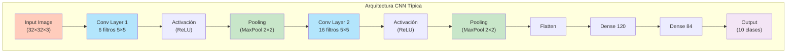
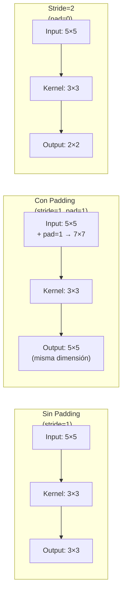
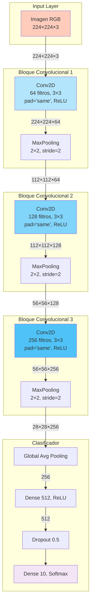
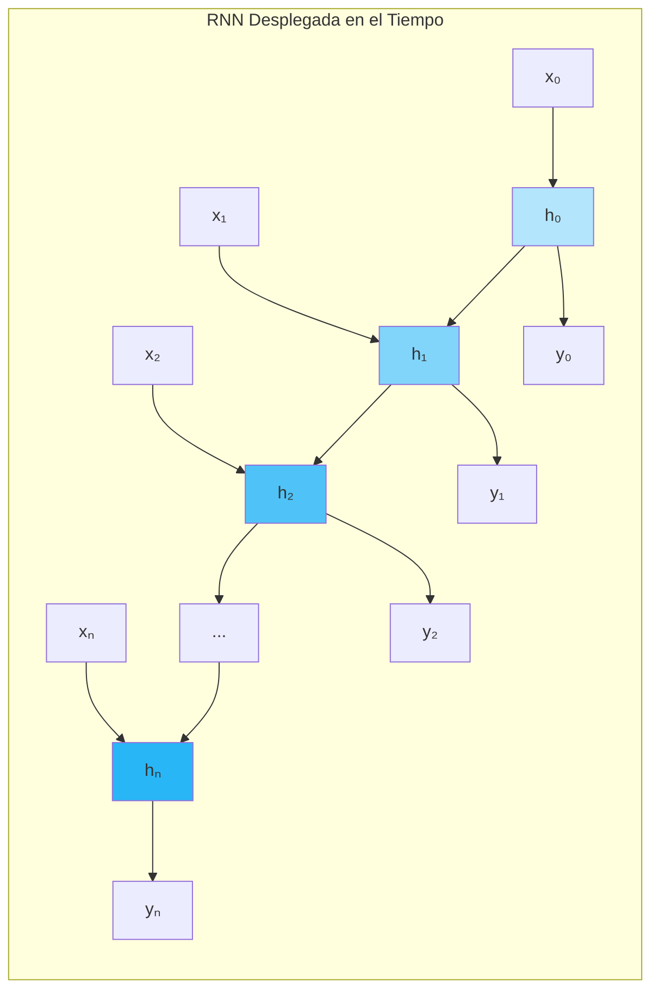
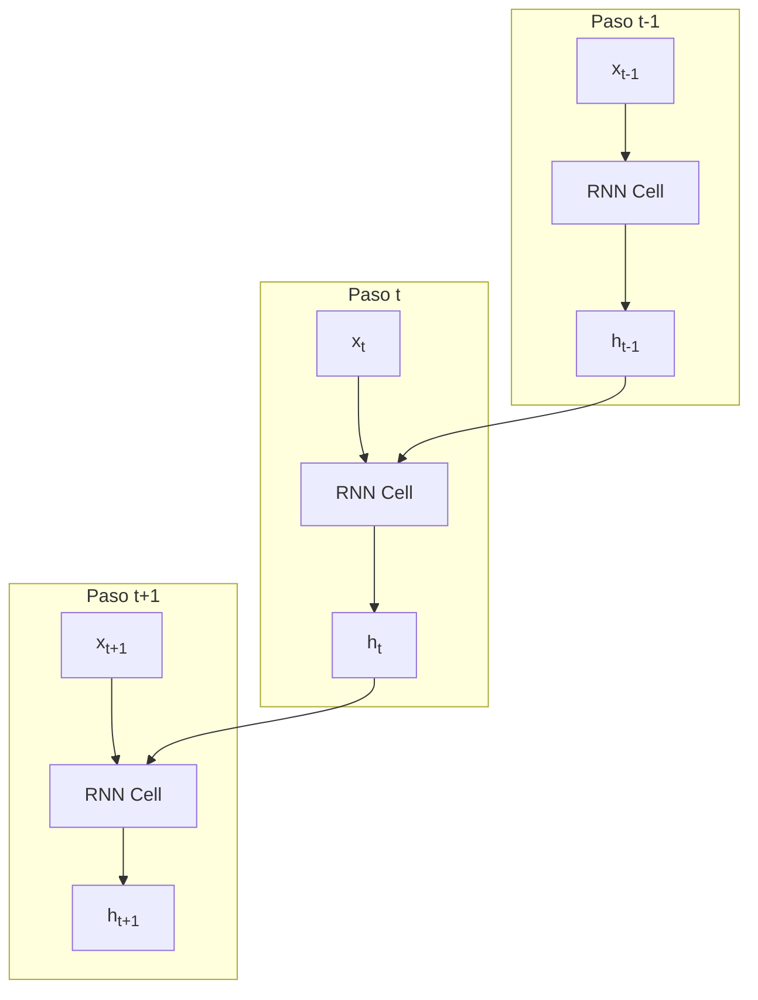
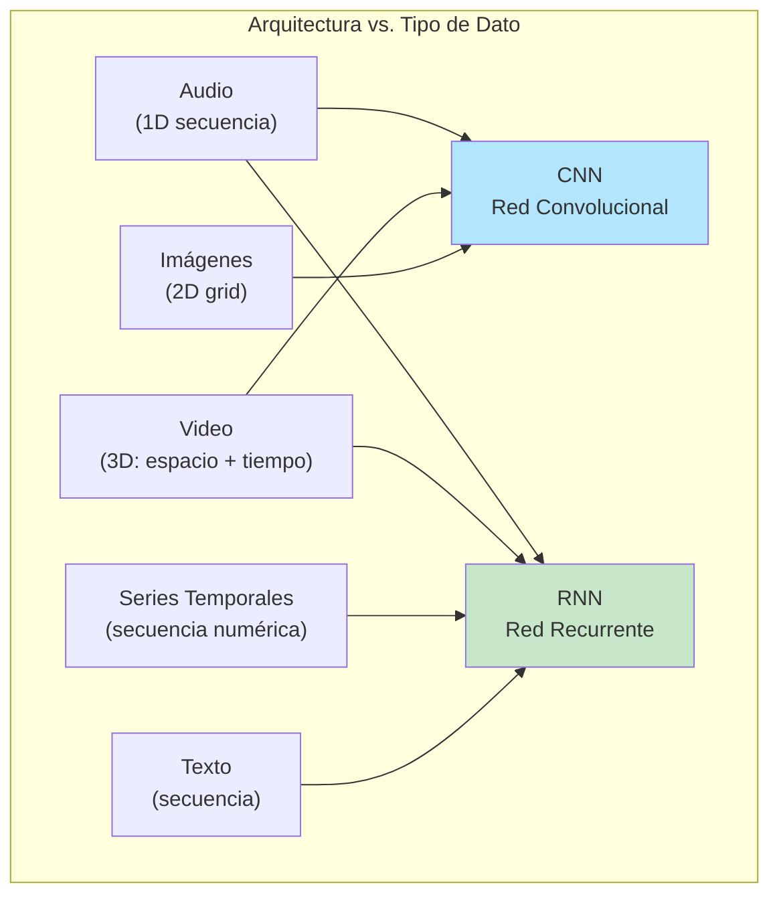
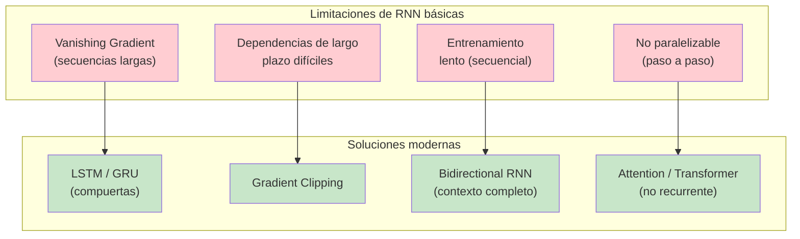

# CLASE 8: Arquitecturas CNN y RNN Básicas

## 📋 Información General

| Campo | Detalle |
|-------|---------|
| **Duración** | 4 horas (240 minutos) |
| **Modalidad** | Teórico-Práctico |
| **Prerrequisitos** | Clase 7 completada (redes profundas), álgebra lineal, conceptos de convolución |
| **Tecnología** | PyTorch, TensorFlow, Keras, NumPy |

---

## 🎯 Objetivos de Aprendizaje

Al finalizar esta clase, el estudiante será capaz de:

1. **Comprender** los fundamentos de las redes convolucionales (CNN) y sus componentes
2. **Implementar** capas convolucionales, pooling y arquitecturas CNN completas
3. **Comprender** el funcionamiento de las redes recurrentes (RNN) y el estado oculto
4. **Distinguir** entre casos de uso de CNN (imágenes) y RNN (secuencias, texto, series temporales)
5. **Construir** modelos CNN y RNN en PyTorch y TensorFlow/Keras
6. **Aplicar** estas arquitecturas a problemas reales de clasificación de imágenes y predicción de secuencias

---

## 📚 Contenidos Detallados

### 8.1 Redes Neuronales Convolucionales (CNN)

Las CNN son arquitecturas especializadas para procesar datos con topología de cuadrícula (imágenes, señales 2D).



#### 8.1.1 Operación de Convolución

La convolución 2D es una operación donde un kernel (filtro) se desliza sobre la imagen de entrada, produciendo un mapa de activación (feature map).

```python
"""
Operación de convolución 2D implementada desde cero.
"""

import numpy as np
import matplotlib.pyplot as plt

class Convolucion2DManual:
    """
    Implementación manual de convolución 2D.
    
    Para una imagen I y kernel K:
    (I * K)[i, j] = Σ_m Σ_n I[i+m, j+n] · K[m, n]
    """
    
    @staticmethod
    def convolucion_2d(imagen, kernel, stride=1, padding=0):
        """
        Aplica convolución 2D a una imagen.
        
        Args:
            imagen: array 2D (alto, ancho)
            kernel: array 2D (k_h, k_w)
            stride: paso del deslizamiento
            padding: cantidad de ceros en el borde
        
        Returns:
            feature_map: array 2D resultante
        """
        # Agregar padding
        if padding > 0:
            imagen = np.pad(imagen, padding, mode='constant', constant_values=0)
        
        h_img, w_img = imagen.shape
        k_h, k_w = kernel.shape
        
        # Dimensiones de salida
        h_out = (h_img - k_h) // stride + 1
        w_out = (w_img - k_w) // stride + 1
        
        # Inicializar feature map
        feature_map = np.zeros((h_out, w_out))
        
        # Aplicar convolución
        for i in range(h_out):
            for j in range(w_out):
                i_start = i * stride
                j_start = j * stride
                i_end = i_start + k_h
                j_end = j_start + k_w
                
                # Región de la imagen
                region = imagen[i_start:i_end, j_start:j_end]
                
                # Producto punto (convolución)
                feature_map[i, j] = np.sum(region * kernel)
        
        return feature_map
    
    @staticmethod
    def convolucion_3d(imagen, kernels, bias=None, stride=1, padding=0):
        """
        Convolución para imagen multicanal (3D).
        
        Args:
            imagen: (H, W, C_in) imagen de entrada
            kernels: (C_out, k_h, k_w, C_in) filtros
            bias: (C_out,) bias para cada filtro
        
        Returns:
            output: (H_out, W_out, C_out)
        """
        c_out = kernels.shape[0]
        h_out = (imagen.shape[0] + 2*padding - kernels.shape[1]) // stride + 1
        w_out = (imagen.shape[1] + 2*padding - kernels.shape[2]) // stride + 1
        
        output = np.zeros((h_out, w_out, c_out))
        
        for c in range(c_out):
            # Convolucionar cada canal de entrada y sumar
            for ch in range(imagen.shape[2]):
                kernel_c = kernels[c, :, :, ch]
                output[:, :, c] += Convolucion2DManual.convolucion_2d(
                    imagen[:, :, ch], kernel_c, stride, padding
                )
            
            # Agregar bias
            if bias is not None:
                output[:, :, c] += bias[c]
        
        return output


def demostrar_convolucion():
    """Demostrar el efecto de diferentes kernels en una imagen."""
    
    print("=" * 60)
    print("DEMOSTRACIÓN DE CONVOLUCIÓN 2D")
    print("=" * 60)
    
    # Crear imagen sintética
    img = np.zeros((32, 32))
    img[8:24, 8:24] = 1.0  # cuadrado blanco
    img[12:20, 12:20] = 0.5  # cuadrado gris interior
    
    # Definir diferentes kernels
    kernels = {
        'Detección de bordes\n(horizontal)': np.array([
            [-1, -1, -1],
            [0, 0, 0],
            [1, 1, 1]
        ]),
        'Detección de bordes\n(vertical)': np.array([
            [-1, 0, 1],
            [-1, 0, 1],
            [-1, 0, 1]
        ]),
        'Blur (suavizado)': np.ones((3, 3)) / 9,
        'Sharpen (realce)': np.array([
            [0, -1, 0],
            [-1, 5, -1],
            [0, -1, 0]
        ]),
        'Detección de bordes\n(Sobel X)': np.array([
            [-1, 0, 1],
            [-2, 0, 2],
            [-1, 0, 1]
        ]),
        'Detección de bordes\n(Sobel Y)': np.array([
            [-1, -2, -1],
            [0, 0, 0],
            [1, 2, 1]
        ]),
    }
    
    fig, axes = plt.subplots(2, 4, figsize=(16, 8))
    
    # Mostrar imagen original
    axes[0, 0].imshow(img, cmap='gray')
    axes[0, 0].set_title('Original')
    axes[0, 0].axis('off')
    
    for idx, (name, kernel) in enumerate(kernels.items()):
        row = (idx + 1) // 4
        col = (idx + 1) % 4
        
        # Aplicar convolución
        feature_map = Convolucion2DManual.convolucion_2d(img, kernel)
        
        axes[row, col].imshow(feature_map, cmap='gray')
        axes[row, col].set_title(name, fontsize=9)
        axes[row, col].axis('off')
    
    # Ocultar el último subplot si no hay kernel
    axes[1, 3].axis('off')
    
    plt.tight_layout()
    plt.savefig('convolution_kernels.png')
    plt.show()
    
    print("Cada kernel extrae diferentes características de la imagen:")
    print("  - Bordes horizontales/verticales")
    print("  - Suavizado (blur)")
    print("  - Realce de bordes (sharpen)")
    print("  - Gradientes (Sobel)")


if __name__ == "__main__":
    demostrar_convolucion()
```

#### 8.1.2 Parámetros de Convolución: Stride y Padding



**Fórmula de dimensiones de salida:**

$$W_{out} = \frac{W_{in} - K + 2P}{S} + 1$$

Donde:
- $W_{in}$: dimensión de entrada
- $K$: tamaño del kernel
- $P$: padding
- $S$: stride

```python
"""
Cálculo de dimensiones en capas convolucionales.
"""

def calcular_dimension_salida(W_in, K, P=0, S=1):
    """
    Calcula la dimensión de salida de una capa convolucional.
    
    Args:
        W_in: dimensión de entrada (alto o ancho)
        K: tamaño del kernel
        P: padding
        S: stride
    
    Returns:
        W_out: dimensión de salida
    """
    W_out = (W_in - K + 2 * P) // S + 1
    return W_out


def calcular_parametros_conv(C_in, C_out, K, use_bias=True):
    """
    Calcula el número de parámetros de una capa convolucional.
    
    Args:
        C_in: canales de entrada
        C_out: canales de salida (filtros)
        K: tamaño del kernel (cuadrado)
        use_bias: si incluye bias
    
    Returns:
        num_params: número de parámetros
    """
    params = C_out * (C_in * K * K)  # pesos
    if use_bias:
        params += C_out  # bias
    return params


def explorar_convoluciones():
    """Explorar diferentes configuraciones de convolución."""
    
    print("=" * 60)
    print("EXPLORACIÓN DE CONVOLUCIONES")
    print("=" * 60)
    
    # Ejemplo: imagen 32×32×3, kernel 5×5, 6 filtros
    configs = [
        # (W_in, K, P, S, C_in, C_out, nombre)
        (32, 5, 0, 1, 3, 6, "Conv1: 32→28, 6 filtros 5×5"),
        (28, 5, 0, 1, 6, 16, "Conv2: 28→24, 16 filtros 5×5"),
        (32, 3, 1, 1, 3, 32, "Conv3: same padding, 32 filtros"),
        (32, 3, 0, 2, 3, 64, "Conv4: stride=2, reduce dim a la mitad"),
        (224, 7, 3, 2, 3, 64, "Conv5: estilo AlexNet, 224→112"),
        (32, 1, 0, 1, 3, 32, "Conv6: 1×1 conv, reduce canales"),
    ]
    
    print(f"\n{'Nombre':<40} {'W_out':<10} {'Parámetros':<12}")
    print("-" * 62)
    
    for W_in, K, P, S, C_in, C_out, nombre in configs:
        W_out = calcular_dimension_salida(W_in, K, P, S)
        params = calcular_parametros_conv(C_in, C_out, K)
        print(f"{nombre:<40} {W_out:<10} {params:<12,}")


if __name__ == "__main__":
    explorar_convoluciones()
```

#### 8.1.3 Capas de Pooling

El pooling reduce la dimensión espacial, manteniendo las características más importantes.

```python
"""
Capas de Pooling: MaxPooling y AveragePooling.
"""

import numpy as np

class PoolingManual:
    """Implementación manual de capas de pooling."""
    
    @staticmethod
    def max_pooling(feature_map, pool_size=2, stride=2):
        """
        Max Pooling: toma el máximo valor en cada ventana.
        
        Args:
            feature_map: (H, W)
            pool_size: tamaño de la ventana
            stride: paso
        
        Returns:
            pooled: feature map reducido
        """
        H, W = feature_map.shape
        h_out = (H - pool_size) // stride + 1
        w_out = (W - pool_size) // stride + 1
        
        pooled = np.zeros((h_out, w_out))
        
        for i in range(h_out):
            for j in range(w_out):
                i_start = i * stride
                j_start = j * stride
                i_end = i_start + pool_size
                j_end = j_start + pool_size
                
                pooled[i, j] = np.max(feature_map[i_start:i_end, j_start:j_end])
        
        return pooled
    
    @staticmethod
    def average_pooling(feature_map, pool_size=2, stride=2):
        """
        Average Pooling: toma el promedio en cada ventana.
        """
        H, W = feature_map.shape
        h_out = (H - pool_size) // stride + 1
        w_out = (W - pool_size) // stride + 1
        
        pooled = np.zeros((h_out, w_out))
        
        for i in range(h_out):
            for j in range(w_out):
                i_start = i * stride
                j_start = j * stride
                i_end = i_start + pool_size
                j_end = j_start + pool_size
                
                pooled[i, j] = np.mean(feature_map[i_start:i_end, j_start:j_end])
        
        return pooled


def demostrar_pooling():
    """Demostrar efecto de Max y Average Pooling."""
    
    print("=" * 60)
    print("DEMOSTRACIÓN DE POOLING")
    print("=" * 60)
    
    # Feature map sintético con patrones
    np.random.seed(42)
    fm = np.random.randn(8, 8)
    # Agregar un pico fuerte
    fm[2, 3] = 10.0
    
    print(f"Feature map original: {fm.shape}")
    print(f"  Máximo: {fm.max():.2f}, Promedio: {fm.mean():.2f}")
    
    # Max Pooling
    max_pooled = PoolingManual.max_pooling(fm, pool_size=2, stride=2)
    print(f"\nMaxPool (2×2): {max_pooled.shape}")
    print(f"  Máximo: {max_pooled.max():.2f}")
    print(f"  Retiene los valores máximos (incluyendo el pico en {max_pooled.max():.2f})")
    
    # Average Pooling
    avg_pooled = PoolingManual.average_pooling(fm, pool_size=2, stride=2)
    print(f"\nAvgPool (2×2): {avg_pooled.shape}")
    print(f"  Máximo: {avg_pooled.max():.2f}")
    print(f"  Suaviza los valores (el pico se diluye)")
    
    # Reducción de dimensionalidad
    print(f"\nReducción: {fm.shape[0]*fm.shape[1]} → {max_pooled.shape[0]*max_pooled.shape[1]} píxeles")
    print(f"  Factor de reducción: 75%")


if __name__ == "__main__":
    demostrar_pooling()
```

#### 8.1.4 Flujo de Datos en una CNN



---

### 8.2 CNN en PyTorch y TensorFlow

#### 8.2.1 CNN en PyTorch

```python
"""
Implementación de CNN en PyTorch para clasificación de imágenes.
"""

import torch
import torch.nn as nn
import torch.nn.functional as F
import torch.optim as optim
import torchvision
import torchvision.transforms as transforms

# ============================================================
# CNN para MNIST (28×28, 1 canal)
# ============================================================

class CNN_MNIST(nn.Module):
    """
    CNN simple para clasificación MNIST.
    
    Arquitectura:
    - Conv1: 1→32, kernel 3×3, pad=1, ReLU, MaxPool 2×2
    - Conv2: 32→64, kernel 3×3, pad=1, ReLU, MaxPool 2×2
    - Dense: 64×7×7 → 128 → 10
    """
    
    def __init__(self):
        super().__init__()
        
        # Bloque convolucional 1
        self.conv1 = nn.Conv2d(in_channels=1, out_channels=32, 
                               kernel_size=3, padding=1)
        self.bn1 = nn.BatchNorm2d(32)
        self.pool1 = nn.MaxPool2d(kernel_size=2, stride=2)
        
        # Bloque convolucional 2
        self.conv2 = nn.Conv2d(in_channels=32, out_channels=64,
                               kernel_size=3, padding=1)
        self.bn2 = nn.BatchNorm2d(64)
        self.pool2 = nn.MaxPool2d(kernel_size=2, stride=2)
        
        # Clasificador
        self.fc1 = nn.Linear(64 * 7 * 7, 128)
        self.dropout = nn.Dropout(0.5)
        self.fc2 = nn.Linear(128, 10)
        
        # Inicialización
        self._init_weights()
    
    def _init_weights(self):
        for m in self.modules():
            if isinstance(m, nn.Conv2d):
                nn.init.kaiming_normal_(m.weight, mode='fan_out', nonlinearity='relu')
            elif isinstance(m, nn.Linear):
                nn.init.xavier_normal_(m.weight)
    
    def forward(self, x):
        # x: (batch, 1, 28, 28)
        
        # Bloque 1
        x = self.pool1(F.relu(self.bn1(self.conv1(x))))
        # x: (batch, 32, 14, 14)
        
        # Bloque 2
        x = self.pool2(F.relu(self.bn2(self.conv2(x))))
        # x: (batch, 64, 7, 7)
        
        # Aplanar
        x = x.view(x.size(0), -1)
        # x: (batch, 64*7*7)
        
        # Clasificador
        x = F.relu(self.fc1(x))
        x = self.dropout(x)
        x = self.fc2(x)
        # x: (batch, 10)
        
        return x


# ============================================================
# CNN para CIFAR-10 (32×32, 3 canales)
# ============================================================

class CNN_CIFAR10(nn.Module):
    """
    CNN para CIFAR-10 (más compleja que MNIST).
    
    Arquitectura:
    - Conv1: 3→64, 3×3, BN, ReLU, MaxPool
    - Conv2: 64→128, 3×3, BN, ReLU, MaxPool
    - Conv3: 128→256, 3×3, BN, ReLU, MaxPool
    - Dense: 256×4×4 → 512 → 256 → 10
    """
    
    def __init__(self):
        super().__init__()
        
        self.block1 = nn.Sequential(
            nn.Conv2d(3, 64, kernel_size=3, padding=1),
            nn.BatchNorm2d(64),
            nn.ReLU(inplace=True),
            nn.Conv2d(64, 64, kernel_size=3, padding=1),
            nn.BatchNorm2d(64),
            nn.ReLU(inplace=True),
            nn.MaxPool2d(2, 2)
        )
        
        self.block2 = nn.Sequential(
            nn.Conv2d(64, 128, kernel_size=3, padding=1),
            nn.BatchNorm2d(128),
            nn.ReLU(inplace=True),
            nn.Conv2d(128, 128, kernel_size=3, padding=1),
            nn.BatchNorm2d(128),
            nn.ReLU(inplace=True),
            nn.MaxPool2d(2, 2)
        )
        
        self.block3 = nn.Sequential(
            nn.Conv2d(128, 256, kernel_size=3, padding=1),
            nn.BatchNorm2d(256),
            nn.ReLU(inplace=True),
            nn.Conv2d(256, 256, kernel_size=3, padding=1),
            nn.BatchNorm2d(256),
            nn.ReLU(inplace=True),
            nn.MaxPool2d(2, 2)
        )
        
        self.classifier = nn.Sequential(
            nn.Dropout(0.3),
            nn.Linear(256 * 4 * 4, 512),
            nn.ReLU(inplace=True),
            nn.Dropout(0.3),
            nn.Linear(512, 256),
            nn.ReLU(inplace=True),
            nn.Linear(256, 10)
        )
    
    def forward(self, x):
        x = self.block1(x)
        x = self.block2(x)
        x = self.block3(x)
        x = x.view(x.size(0), -1)
        x = self.classifier(x)
        return x


def entrenar_cnn_mnist():
    """Entrenar CNN en MNIST."""
    
    print("=" * 60)
    print("ENTRENAMIENTO CNN EN MNIST")
    print("=" * 60)
    
    # Transformaciones
    transform = transforms.Compose([
        transforms.ToTensor(),
        transforms.Normalize((0.1307,), (0.3081,))
    ])
    
    # Datos
    trainset = torchvision.datasets.MNIST(
        root='./data', train=True, download=True, transform=transform
    )
    testset = torchvision.datasets.MNIST(
        root='./data', train=False, transform=transform
    )
    
    trainloader = torch.utils.data.DataLoader(trainset, batch_size=64, shuffle=True)
    testloader = torch.utils.data.DataLoader(testset, batch_size=1000, shuffle=False)
    
    # Modelo
    device = torch.device('cuda' if torch.cuda.is_available() else 'cpu')
    model = CNN_MNIST().to(device)
    
    criterion = nn.CrossEntropyLoss()
    optimizer = optim.Adam(model.parameters(), lr=0.001)
    
    print(f"Dispositivo: {device}")
    print(f"Parámetros: {sum(p.numel() for p in model.parameters()):,}")
    
    # Entrenamiento
    for epoch in range(5):
        model.train()
        running_loss = 0.0
        correct = 0
        total = 0
        
        for inputs, labels in trainloader:
            inputs, labels = inputs.to(device), labels.to(device)
            
            optimizer.zero_grad()
            outputs = model(inputs)
            loss = criterion(outputs, labels)
            loss.backward()
            optimizer.step()
            
            running_loss += loss.item()
            _, predicted = outputs.max(1)
            total += labels.size(0)
            correct += predicted.eq(labels).sum().item()
        
        accuracy = 100. * correct / total
        print(f"Epoch {epoch+1}: Loss={running_loss/len(trainloader):.4f}, Acc={accuracy:.2f}%")
    
    # Evaluación
    model.eval()
    correct = 0
    total = 0
    
    with torch.no_grad():
        for inputs, labels in testloader:
            inputs, labels = inputs.to(device), labels.to(device)
            outputs = model(inputs)
            _, predicted = outputs.max(1)
            total += labels.size(0)
            correct += predicted.eq(labels).sum().item()
    
    print(f"\n✓ Precisión en test MNIST: {100.*correct/total:.2f}%")
    return model


if __name__ == "__main__":
    model = entrenar_cnn_mnist()
```

#### 8.2.2 CNN en TensorFlow/Keras

```python
"""
CNN en TensorFlow/Keras para clasificación de imágenes.
"""

import tensorflow as tf

def crear_cnn_mnist_tf():
    """CNN para MNIST en TensorFlow."""
    
    model = tf.keras.Sequential([
        # Bloque 1
        tf.keras.layers.Conv2D(32, (3, 3), padding='same', 
                               activation='relu', input_shape=(28, 28, 1)),
        tf.keras.layers.BatchNormalization(),
        tf.keras.layers.MaxPooling2D((2, 2)),
        
        # Bloque 2
        tf.keras.layers.Conv2D(64, (3, 3), padding='same', activation='relu'),
        tf.keras.layers.BatchNormalization(),
        tf.keras.layers.MaxPooling2D((2, 2)),
        
        # Clasificador
        tf.keras.layers.Flatten(),
        tf.keras.layers.Dense(128, activation='relu'),
        tf.keras.layers.Dropout(0.5),
        tf.keras.layers.Dense(10, activation='softmax')
    ])
    
    model.compile(
        optimizer='adam',
        loss='sparse_categorical_crossentropy',
        metrics=['accuracy']
    )
    
    return model


def crear_cnn_cifar10_tf():
    """CNN para CIFAR-10 en TensorFlow."""
    
    model = tf.keras.Sequential([
        # Bloque 1
        tf.keras.layers.Conv2D(32, (3, 3), padding='same', 
                               activation='relu', input_shape=(32, 32, 3)),
        tf.keras.layers.Conv2D(32, (3, 3), padding='same', activation='relu'),
        tf.keras.layers.BatchNormalization(),
        tf.keras.layers.MaxPooling2D((2, 2)),
        
        # Bloque 2
        tf.keras.layers.Conv2D(64, (3, 3), padding='same', activation='relu'),
        tf.keras.layers.Conv2D(64, (3, 3), padding='same', activation='relu'),
        tf.keras.layers.BatchNormalization(),
        tf.keras.layers.MaxPooling2D((2, 2)),
        
        # Bloque 3
        tf.keras.layers.Conv2D(128, (3, 3), padding='same', activation='relu'),
        tf.keras.layers.Conv2D(128, (3, 3), padding='same', activation='relu'),
        tf.keras.layers.BatchNormalization(),
        tf.keras.layers.MaxPooling2D((2, 2)),
        
        # Clasificador
        tf.keras.layers.Flatten(),
        tf.keras.layers.Dense(256, activation='relu'),
        tf.keras.layers.Dropout(0.5),
        tf.keras.layers.Dense(10, activation='softmax')
    ])
    
    model.compile(
        optimizer=tf.keras.optimizers.Adam(learning_rate=0.001),
        loss='sparse_categorical_crossentropy',
        metrics=['accuracy']
    )
    
    return model


def ver_arquitecturas_cnn():
    """Mostrar resumen de ambas arquitecturas CNN."""
    
    print("=" * 60)
    print("ARQUITECTURAS CNN EN TENSORFLOW/KERAS")
    print("=" * 60)
    
    print("\n--- CNN para MNIST ---")
    model_mnist = crear_cnn_mnist_tf()
    model_mnist.summary()
    
    print("\n--- CNN para CIFAR-10 ---")
    model_cifar = crear_cnn_cifar10_tf()
    model_cifar.summary()


if __name__ == "__main__":
    ver_arquitecturas_cnn()
```

#### 8.2.3 Data Augmentation para CNN

```python
"""
Data Augmentation: aumenta la cantidad de datos de entrenamiento
aplicando transformaciones realistas.
"""

import torchvision.transforms as transforms
import tensorflow as tf

# ============================================================
# Data Augmentation en PyTorch
# ============================================================

transform_augmentado = transforms.Compose([
    transforms.RandomHorizontalFlip(p=0.5),
    transforms.RandomRotation(degrees=15),
    transforms.RandomAffine(degrees=0, translate=(0.1, 0.1)),
    transforms.ColorJitter(brightness=0.2, contrast=0.2, saturation=0.2),
    transforms.ToTensor(),
    transforms.Normalize((0.4914, 0.4822, 0.4465), (0.2023, 0.1994, 0.2010)),
])

# Uso:
# trainset = torchvision.datasets.CIFAR10(
#     root='./data', train=True, download=True, transform=transform_augmentado
# )

# ============================================================
# Data Augmentation en TensorFlow/Keras
# ============================================================

data_augmentation_tf = tf.keras.Sequential([
    tf.keras.layers.RandomFlip("horizontal"),
    tf.keras.layers.RandomRotation(0.15),
    tf.keras.layers.RandomZoom(0.1),
    tf.keras.layers.RandomContrast(0.2),
])

# Uso (incluir como primera capa del modelo):
# model = tf.keras.Sequential([
#     data_augmentation_tf,
#     tf.keras.layers.Rescaling(1./255),
#     tf.keras.layers.Conv2D(32, 3, activation='relu'),
#     ...
# ])

print("Data Augmentation configurado:")
print("  - Rotaciones aleatorias (±15°)")
print("  - Volteo horizontal (50%)")
print("  - Translaciones (10%)")
print("  - Brillo/contraste/saturación")
print("  - Zoom aleatorio")
```

---

### 8.3 Redes Neuronales Recurrentes (RNN)

Las RNN están diseñadas para procesar datos secuenciales manteniendo un estado oculto que captura información de pasos anteriores.



#### 8.3.1 El Estado Oculto en RNN

La RNN básica (Elman RNN) actualiza su estado oculto en cada paso temporal:

$$h_t = \tanh(W_{ih} x_t + b_{ih} + W_{hh} h_{t-1} + b_{hh})$$

```python
"""
RNN desde cero: implementación de la célula recurrente básica.
"""

import numpy as np
import matplotlib.pyplot as plt

class RNNCeldaManual:
    """
    Implementación manual de una célula RNN.
    
    h_t = tanh(W_ih @ x_t + b_ih + W_hh @ h_{t-1} + b_hh)
    
    donde:
    - x_t: input en paso t
    - h_{t-1}: estado oculto anterior
    - h_t: nuevo estado oculto
    - W_ih, W_hh: matrices de pesos
    """
    
    def __init__(self, input_size, hidden_size):
        """
        Args:
            input_size: dimensión del input en cada paso
            hidden_size: dimensión del estado oculto
        """
        self.input_size = input_size
        self.hidden_size = hidden_size
        
        # Inicialización Xavier
        limit_ih = np.sqrt(6.0 / (input_size + hidden_size))
        limit_hh = np.sqrt(6.0 / (hidden_size + hidden_size))
        
        self.W_ih = np.random.uniform(-limit_ih, limit_ih, (hidden_size, input_size))
        self.W_hh = np.random.uniform(-limit_hh, limit_hh, (hidden_size, hidden_size))
        self.b_ih = np.zeros((hidden_size, 1))
        self.b_hh = np.zeros((hidden_size, 1))
    
    def forward(self, x, h_prev=None):
        """
        Un paso de RNN.
        
        Args:
            x: input en este paso (input_size, 1)
            h_prev: estado oculto anterior (hidden_size, 1) o None
        
        Returns:
            h_next: nuevo estado oculto (hidden_size, 1)
        """
        if h_prev is None:
            h_prev = np.zeros((self.hidden_size, 1))
        
        # h_t = tanh(W_ih @ x + b_ih + W_hh @ h_{t-1} + b_hh)
        h_next = np.tanh(
            self.W_ih @ x + self.b_ih + self.W_hh @ h_prev + self.b_hh
        )
        
        return h_next


class RNNManual:
    """
    RNN completa: procesa una secuencia completa.
    """
    
    def __init__(self, input_size, hidden_size, output_size):
        self.hidden_size = hidden_size
        self.celda = RNNCeldaManual(input_size, hidden_size)
        
        # Capa de salida (opcional, para predicción)
        self.W_ho = np.random.randn(output_size, hidden_size) * 0.01
        self.b_ho = np.zeros((output_size, 1))
    
    def forward(self, x_seq):
        """
        Procesa una secuencia completa.
        
        Args:
            x_seq: lista de arrays (input_size, 1) para cada paso temporal
        
        Returns:
            h_states: lista de estados ocultos para cada paso
            output: salida final (opcional)
        """
        h = None
        h_states = []
        
        for x in x_seq:
            h = self.celda.forward(x, h)
            h_states.append(h.copy())
        
        # Salida final
        output = self.W_ho @ h + self.b_ho
        
        return h_states, output


def demostrar_rnn():
    """Demostrar el comportamiento de una RNN."""
    
    print("=" * 60)
    print("DEMOSTRACIÓN DE RNN")
    print("=" * 60)
    
    # Configuración
    input_size = 3
    hidden_size = 5
    seq_len = 10
    
    rnn = RNNManual(input_size, hidden_size, output_size=2)
    
    # Crear secuencia sintética (senoidal con ruido)
    t = np.linspace(0, 4*np.pi, seq_len)
    x_seq = [
        np.array([[np.sin(t[i])], 
                  [np.cos(t[i])], 
                  [np.sin(t[i]) * np.cos(t[i])]])
        for i in range(seq_len)
    ]
    
    # Forward pass
    h_states, output = rnn.forward(x_seq)
    
    print(f"Secuencia de {seq_len} pasos")
    print(f"Input size: {input_size} → Hidden size: {hidden_size}")
    print(f"\nEstados ocultos (norma L2 en cada paso):")
    
    for i, h in enumerate(h_states):
        norm = np.linalg.norm(h)
        print(f"  Paso {i}: ||h|| = {norm:.4f}")
    
    print(f"\nSalida final: {output.flatten().round(4)}")
    print("\nEl estado oculto evoluciona con cada paso,")
    print("capturando información de toda la secuencia.")


if __name__ == "__main__":
    demostrar_rnn()
```

#### 8.3.2 Flujo de Información en RNN



#### 8.3.3 RNN en PyTorch

```python
"""
RNN en PyTorch para procesamiento de secuencias.
"""

import torch
import torch.nn as nn
import torch.optim as optim

# ============================================================
# RNN básica en PyTorch
# ============================================================

class RNNPyTorch(nn.Module):
    """
    RNN simple usando nn.RNN de PyTorch.
    
    Arquitectura:
    - Embedding: vocab_size → embedding_dim
    - RNN: embedding_dim → hidden_size (con capas)
    - Linear: hidden_size → num_classes
    """
    
    def __init__(self, vocab_size, embedding_dim, hidden_size, 
                 num_layers=1, num_classes=2, dropout=0.3):
        super().__init__()
        
        self.embedding = nn.Embedding(vocab_size, embedding_dim, padding_idx=0)
        
        self.rnn = nn.RNN(
            input_size=embedding_dim,
            hidden_size=hidden_size,
            num_layers=num_layers,
            batch_first=True,
            dropout=dropout if num_layers > 1 else 0,
            nonlinearity='tanh'  # o 'relu'
        )
        
        self.fc = nn.Linear(hidden_size, num_classes)
        self.dropout = nn.Dropout(dropout)
    
    def forward(self, x):
        """
        Args:
            x: (batch, seq_len) índices de tokens
        
        Returns:
            output: (batch, num_classes) predicción
        """
        # Embedding
        embedded = self.embedding(x)  # (batch, seq_len, embedding_dim)
        
        # RNN
        rnn_output, hidden = self.rnn(embedded)
        # rnn_output: (batch, seq_len, hidden_size)
        # hidden: (num_layers, batch, hidden_size)
        
        # Usar el último estado oculto
        last_hidden = hidden[-1]  # (batch, hidden_size)
        
        # Clasificar
        output = self.fc(self.dropout(last_hidden))  # (batch, num_classes)
        
        return output


# ============================================================
# RNN para clasificación de texto
# ============================================================

class ClasificadorTextoRNN(nn.Module):
    """
    RNN para clasificación de sentimiento.
    
    Procesa secuencias de texto tokenizado y clasifica
    (ej: positivo/negativo, categorías, etc.)
    """
    
    def __init__(self, vocab_size, embedding_dim=100, hidden_size=128,
                 num_layers=2, num_classes=2, dropout=0.5, bidirectional=False):
        super().__init__()
        
        self.embedding = nn.Embedding(vocab_size, embedding_dim, padding_idx=0)
        
        rnn_direction = 2 if bidirectional else 1
        
        self.rnn = nn.RNN(
            embedding_dim, hidden_size, num_layers,
            batch_first=True, dropout=dropout if num_layers > 1 else 0,
            bidirectional=bidirectional
        )
        
        self.fc = nn.Linear(hidden_size * rnn_direction, 128)
        self.bn = nn.BatchNorm1d(128)
        self.dropout = nn.Dropout(dropout)
        self.fc_out = nn.Linear(128, num_classes)
    
    def forward(self, x, lengths=None):
        embedded = self.embedding(x)
        
        if lengths is not None:
            packed = nn.utils.rnn.pack_padded_sequence(
                embedded, lengths.cpu(), batch_first=True, enforce_sorted=False
            )
            packed_output, hidden = self.rnn(packed)
        else:
            _, hidden = self.rnn(embedded)
        
        # hidden: (num_layers * num_directions, batch, hidden_size)
        if self.rnn.bidirectional:
            # Concatenar forward y backward
            hidden_fwd = hidden[-2]  # última capa forward
            hidden_bwd = hidden[-1]  # última capa backward
            hidden_concat = torch.cat([hidden_fwd, hidden_bwd], dim=1)
            h = hidden_concat  # (batch, hidden_size * 2)
        else:
            h = hidden[-1]  # (batch, hidden_size)
        
        x = torch.relu(self.bn(self.fc(h)))
        x = self.dropout(x)
        output = self.fc_out(x)
        
        return output


def instanciar_modelos_rnn():
    """Crear e inspeccionar modelos RNN."""
    
    print("=" * 60)
    print("MODELOS RNN EN PYTORCH")
    print("=" * 60)
    
    # RNN simple
    rnn_simple = RNNPyTorch(
        vocab_size=10000, embedding_dim=100, 
        hidden_size=128, num_layers=2, num_classes=2
    )
    
    print(f"\n--- RNN Simple ---")
    print(f"  Parámetros: {sum(p.numel() for p in rnn_simple.parameters()):,}")
    
    # RNN bidireccional
    rnn_bi = ClasificadorTextoRNN(
        vocab_size=10000, embedding_dim=100,
        hidden_size=128, num_layers=2, num_classes=2, bidirectional=True
    )
    
    print(f"\n--- RNN Bidireccional ---")
    print(f"  Parámetros: {sum(p.numel() for p in rnn_bi.parameters()):,}")
    
    # Datos de prueba
    batch = 4
    seq_len = 10
    x = torch.randint(1, 1000, (batch, seq_len))
    
    with torch.no_grad():
        out_simple = rnn_simple(x)
        out_bi = rnn_bi(x)
    
    print(f"\n  Input shape: {x.shape}")
    print(f"  Output shape (simple): {out_simple.shape}")
    print(f"  Output shape (bidirectional): {out_bi.shape}")

    # Comparación num_layers
    for layers in [1, 2, 3]:
        model = RNNPyTorch(10000, 100, 128, layers, 2)
        params = sum(p.numel() for p in model.parameters())
        print(f"  RNN con {layers} capa(s): {params:,} parámetros")


if __name__ == "__main__":
    instanciar_modelos_rnn()
```

#### 8.3.4 RNN en TensorFlow/Keras

```python
"""
RNN en TensorFlow/Keras para secuencias.
"""

import tensorflow as tf

# ============================================================
# RNN simple en Keras
# ============================================================

def crear_rnn_texto_tf(vocab_size=10000, embedding_dim=100, 
                       hidden_size=128, num_classes=2):
    """RNN para clasificación de texto en Keras."""
    
    model = tf.keras.Sequential([
        tf.keras.layers.Embedding(vocab_size, embedding_dim, mask_zero=True),
        tf.keras.layers.SimpleRNN(hidden_size, return_sequences=False),
        tf.keras.layers.Dropout(0.5),
        tf.keras.layers.Dense(64, activation='relu'),
        tf.keras.layers.Dense(num_classes, activation='softmax')
    ])
    
    model.compile(
        optimizer='adam',
        loss='sparse_categorical_crossentropy',
        metrics=['accuracy']
    )
    
    return model


# ============================================================
# RNN bidireccional en Keras
# ============================================================

def crear_rnn_bidireccional_tf(vocab_size=10000, embedding_dim=100,
                                hidden_size=128, num_classes=2):
    """RNN bidireccional en Keras."""
    
    model = tf.keras.Sequential([
        tf.keras.layers.Embedding(vocab_size, embedding_dim, mask_zero=True),
        tf.keras.layers.Bidirectional(
            tf.keras.layers.SimpleRNN(hidden_size, return_sequences=False)
        ),
        tf.keras.layers.Dropout(0.5),
        tf.keras.layers.Dense(64, activation='relu'),
        tf.keras.layers.Dense(num_classes, activation='softmax')
    ])
    
    model.compile(
        optimizer='adam',
        loss='sparse_categorical_crossentropy',
        metrics=['accuracy']
    )
    
    return model


def ver_rnn_tf():
    """Mostrar modelos RNN en Keras."""
    
    print("=" * 60)
    print("MODELOS RNN EN TENSORFLOW/KERAS")
    print("=" * 60)
    
    print("\n--- RNN Simple ---")
    model_simple = crear_rnn_texto_tf()
    model_simple.summary()
    
    print("\n--- RNN Bidireccional ---")
    model_bi = crear_rnn_bidireccional_tf()
    model_bi.summary()


if __name__ == "__main__":
    ver_rnn_tf()
```

---

### 8.4 Casos de Uso: Imágenes, Texto y Series Temporales



#### 8.4.1 CNN: Clasificación de Imágenes

```python
"""
Ejemplo completo: Clasificación de imágenes con CNN en CIFAR-10.
"""

import torch
import torch.nn as nn
import torch.optim as optim
import torchvision
import torchvision.transforms as transforms

def clasificar_imagenes_cifar10():
    """CNN para CIFAR-10: clasificación de 10 clases de objetos."""
    
    print("=" * 60)
    print("CASO DE USO: CLASIFICACIÓN DE IMÁGENES (CIFAR-10)")
    print("=" * 60)
    
    # CIFAR-10 clases: avión, auto, pájaro, gato, venado, perro, rana, caballo, barco, camión
    
    transform = transforms.Compose([
        transforms.RandomHorizontalFlip(),
        transforms.RandomCrop(32, padding=4),
        transforms.ToTensor(),
        transforms.Normalize((0.4914, 0.4822, 0.4465), (0.2023, 0.1994, 0.2010))
    ])
    
    trainset = torchvision.datasets.CIFAR10(
        root='./data', train=True, download=True, transform=transform
    )
    testset = torchvision.datasets.CIFAR10(
        root='./data', train=False, transform=transform
    )
    
    trainloader = torch.utils.data.DataLoader(trainset, batch_size=128, shuffle=True)
    testloader = torch.utils.data.DataLoader(testset, batch_size=128, shuffle=False)
    
    # CNN
    model = CNN_CIFAR10()
    device = torch.device('cuda' if torch.cuda.is_available() else 'cpu')
    model = model.to(device)
    
    criterion = nn.CrossEntropyLoss()
    optimizer = optim.Adam(model.parameters(), lr=0.001)
    scheduler = optim.lr_scheduler.StepLR(optimizer, step_size=10, gamma=0.5)
    
    print(f"Modelo: {sum(p.numel() for p in model.parameters()):,} parámetros")
    print(f"Dispositivo: {device}")
    
    for epoch in range(20):
        model.train()
        train_loss = 0
        correct = 0
        total = 0
        
        for inputs, labels in trainloader:
            inputs, labels = inputs.to(device), labels.to(device)
            
            optimizer.zero_grad()
            outputs = model(inputs)
            loss = criterion(outputs, labels)
            loss.backward()
            optimizer.step()
            
            train_loss += loss.item()
            _, predicted = outputs.max(1)
            total += labels.size(0)
            correct += predicted.eq(labels).sum().item()
        
        scheduler.step()
        accuracy = 100. * correct / total
        
        print(f"Epoch {epoch+1:2d}: Loss={train_loss/len(trainloader):.4f}, "
              f"Acc={accuracy:.2f}%, LR={scheduler.get_last_lr()[0]:.6f}")
    
    # Evaluación
    model.eval()
    correct = 0
    total = 0
    
    with torch.no_grad():
        for inputs, labels in testloader:
            inputs, labels = inputs.to(device), labels.to(device)
            outputs = model(inputs)
            _, predicted = outputs.max(1)
            total += labels.size(0)
            correct += predicted.eq(labels).sum().item()
    
    print(f"\n✓ Precisión en CIFAR-10 test: {100.*correct/total:.2f}%")
    return model


if __name__ == "__main__":
    model = clasificar_imagenes_cifar10()
```

#### 8.4.2 RNN: Clasificación de Texto (Sentimiento)

```python
"""
Ejemplo completo: Análisis de sentimiento con RNN.
"""

import torch
import torch.nn as nn
import torch.optim as optim
from torch.utils.data import Dataset, DataLoader

# Datos sintéticos de sentimiento
datos_entrenamiento = [
    ("this movie is amazing and wonderful", 1),
    ("i loved this film it was great", 1),
    ("best movie i have ever seen", 1),
    ("fantastic acting and beautiful story", 1),
    ("absolutely loved it highly recommend", 1),
    ("terrible movie waste of time", 0),
    ("worst film i have ever watched", 0),
    ("boring and predictable plot", 0),
    ("awful acting and horrible script", 0),
    ("disappointing and frustrating experience", 0),
    ("good movie but could be better", 1),
    ("not bad not great just okay", 1),
    ("decent film with some good moments", 1),
    ("poor quality and uninteresting story", 0),
    ("impressive cinematography and direction", 1),
    ("horrible sound and terrible editing", 0),
]


class Vocabulario:
    """Manejo de vocabulario para texto."""
    
    def __init__(self):
        self.token2idx = {'<PAD>': 0, '<UNK>': 1}
        self.idx2token = {0: '<PAD>', 1: '<UNK>'}
    
    def construir(self, textos):
        idx = 2
        for texto in textos:
            for token in texto.lower().split():
                if token not in self.token2idx:
                    self.token2idx[token] = idx
                    self.idx2token[idx] = token
                    idx += 1
    
    def encode(self, texto, max_len=10):
        tokens = texto.lower().split()
        indices = [self.token2idx.get(t, self.token2idx['<UNK>']) for t in tokens]
        
        # Padding
        if len(indices) < max_len:
            indices += [0] * (max_len - len(indices))
        else:
            indices = indices[:max_len]
        
        return indices
    
    def __len__(self):
        return len(self.token2idx)


class SentimentDataset(Dataset):
    def __init__(self, datos, vocab, max_len=10):
        self.textos = [d[0] for d in datos]
        self.labels = [d[1] for d in datos]
        self.vocab = vocab
        self.max_len = max_len
    
    def __len__(self):
        return len(self.textos)
    
    def __getitem__(self, idx):
        x = torch.tensor(self.vocab.encode(self.textos[idx], self.max_len))
        y = torch.tensor(self.labels[idx])
        return x, y


class RNNClasificador(nn.Module):
    def __init__(self, vocab_size, embedding_dim=32, hidden_size=64, num_classes=2):
        super().__init__()
        self.embedding = nn.Embedding(vocab_size, embedding_dim, padding_idx=0)
        self.rnn = nn.RNN(embedding_dim, hidden_size, batch_first=True)
        self.fc = nn.Linear(hidden_size, num_classes)
    
    def forward(self, x):
        embedded = self.embedding(x)
        _, hidden = self.rnn(embedded)
        output = self.fc(hidden[-1])
        return output


def entrenar_clasificador_sentimiento():
    """Entrenar RNN para clasificación de sentimiento."""
    
    print("=" * 60)
    print("CASO DE USO: ANÁLISIS DE SENTIMIENTO CON RNN")
    print("=" * 60)
    
    # Construir vocabulario
    vocab = Vocabulario()
    textos = [d[0] for d in datos_entrenamiento]
    vocab.construir(textos)
    
    print(f"Tamaño del vocabulario: {len(vocab)}")
    print(f"Tokens: {list(vocab.token2idx.keys())}")
    
    # Dataset
    dataset = SentimentDataset(datos_entrenamiento, vocab, max_len=10)
    loader = DataLoader(dataset, batch_size=4, shuffle=True)
    
    # Modelo
    model = RNNClasificador(vocab_size=len(vocab), embedding_dim=16, hidden_size=32)
    criterion = nn.CrossEntropyLoss()
    optimizer = optim.Adam(model.parameters(), lr=0.01)
    
    # Entrenamiento
    for epoch in range(50):
        model.train()
        total_loss = 0
        correct = 0
        total = 0
        
        for inputs, labels in loader:
            optimizer.zero_grad()
            outputs = model(inputs)
            loss = criterion(outputs, labels)
            loss.backward()
            optimizer.step()
            
            total_loss += loss.item()
            _, predicted = outputs.max(1)
            total += labels.size(0)
            correct += (predicted == labels).sum().item()
        
        if (epoch + 1) % 10 == 0:
            accuracy = 100. * correct / total
            print(f"Epoch {epoch+1:2d}: Loss={total_loss/len(loader):.4f}, Acc={accuracy:.2f}%")
    
    # Prueba
    model.eval()
    frases_prueba = [
        "i really enjoyed this movie",
        "it was absolutely terrible",
        "fantastic film",
        "boring and slow",
        "not bad at all",
    ]
    
    print("\n--- Pruebas de Sentimiento ---")
    with torch.no_grad():
        for frase in frases_prueba:
            x = torch.tensor(vocab.encode(frase, max_len=10)).unsqueeze(0)
            output = model(x)
            prob = torch.softmax(output, dim=1)
            positivo = prob[0, 1].item()
            negativo = prob[0, 0].item()
            sentimiento = "Positivo 😊" if positivo > negativo else "Negativo 😞"
            print(f"  '{frase}' → {sentimiento} (P: {positivo:.2%}, N: {negativo:.2%})")


if __name__ == "__main__":
    entrenar_clasificador_sentimiento()
```

#### 8.4.3 RNN: Predicción de Series Temporales

```python
"""
Ejemplo completo: Predicción de series temporales con RNN.
"""

import numpy as np
import torch
import torch.nn as nn
import torch.optim as optim

def prediccion_series_temporales():
    """
    Predecir el siguiente valor de una serie senoidal usando RNN.
    
    Entrada: secuencia de valores pasados
    Salida: siguiente valor
    """
    
    print("=" * 60)
    print("CASO DE USO: PREDICCIÓN DE SERIES TEMPORALES")
    print("=" * 60)
    
    # Generar datos: sinusoide con ruido
    np.random.seed(42)
    t = np.linspace(0, 100, 1000)
    data = np.sin(t) + 0.1 * np.random.randn(1000)
    
    # Crear secuencias: usar 10 pasos para predecir el siguiente
    def crear_secuencias(data, seq_length=10):
        X, y = [], []
        for i in range(len(data) - seq_length):
            X.append(data[i:i + seq_length])
            y.append(data[i + seq_length])
        return np.array(X), np.array(y)
    
    X, y = crear_secuencias(data, seq_length=10)
    
    # Normalizar
    mean, std = X.mean(), X.std()
    X = (X - mean) / std
    y = (y - mean) / std
    
    # Dividir
    split = int(0.8 * len(X))
    X_train, X_test = X[:split], X[split:]
    y_train, y_test = y[:split], y[split:]
    
    # Convertir a tensores
    X_train_t = torch.FloatTensor(X_train).unsqueeze(-1)  # (N, seq_len, 1)
    y_train_t = torch.FloatTensor(y_train).unsqueeze(-1)  # (N, 1)
    X_test_t = torch.FloatTensor(X_test).unsqueeze(-1)
    y_test_t = torch.FloatTensor(y_test).unsqueeze(-1)
    
    class RNN_temporal(nn.Module):
        def __init__(self, input_size=1, hidden_size=32, output_size=1):
            super().__init__()
            self.rnn = nn.RNN(input_size, hidden_size, batch_first=True)
            self.fc = nn.Linear(hidden_size, output_size)
        
        def forward(self, x):
            out, hidden = self.rnn(x)
            # out: (batch, seq_len, hidden_size)
            # Usar la última salida
            out = out[:, -1, :]  # (batch, hidden_size)
            out = self.fc(out)   # (batch, output_size)
            return out
    
    model = RNN_temporal()
    criterion = nn.MSELoss()
    optimizer = optim.Adam(model.parameters(), lr=0.01)
    
    # Entrenamiento
    for epoch in range(100):
        model.train()
        optimizer.zero_grad()
        outputs = model(X_train_t)
        loss = criterion(outputs, y_train_t)
        loss.backward()
        optimizer.step()
        
        if (epoch + 1) % 20 == 0:
            model.eval()
            with torch.no_grad():
                test_loss = criterion(model(X_test_t), y_test_t)
            print(f"Epoch {epoch+1:3d}: Train Loss={loss.item():.6f}, Test Loss={test_loss.item():.6f}")
    
    # Predicción
    model.eval()
    with torch.no_grad():
        predictions = model(X_test_t).squeeze().numpy()
    
    print(f"\n✓ Predicción de series temporales completada")
    print(f"  RMSE en test: {np.sqrt(np.mean((predictions - y_test) ** 2)):.4f}")
    
    return model


if __name__ == "__main__":
    model = prediccion_series_temporales()
```

---

### 8.5 Limitaciones y Mejoras



---

## 🔬 Actividades de Laboratorio

### Laboratorio 1: Construir CNN para Clasificación de Dígitos

**Duración**: 60 minutos

```python
# Construir y entrenar una CNN para clasificar dígitos MNIST.
#
# Requisitos:
# 1. Arquitectura con al menos 2 capas convolucionales + pooling
# 2. BatchNormalization después de cada convolución
# 3. Dropout en las capas densas
# 4. Inicialización He (Kaiming)
# 5. Reportar precisión en test
#
# Extras:
# - Probar diferentes números de filtros (16, 32, 64, 128)
# - Probar tamaño de kernel (3×3 vs 5×5)
# - Variar profundidad (1, 2, 3 bloques convolucionales)
```

### Laboratorio 2: Data Augmentation para CIFAR-10

**Duración**: 45 minutos

```python
# Comparar entrenamiento de CNN en CIFAR-10:
# A) Sin data augmentation
# B) Con data augmentation (Rotación, Flip, ColorJitter)
#
# Para cada caso:
# - Entrenar por 10 épocas
# - Graficar curva de pérdida
# - Reportar precisión en test
# - Analizar si el augmentation reduce overfitting
```

### Laboratorio 3: Clasificador de Texto con RNN

**Duración**: 60 minutos

```python
# Implementar clasificador de sentimiento con RNN en PyTorch.
#
# Usar el dataset IMDB (torchvision.datasets.IMDB o datos sintéticos).
#
# Probar:
# 1. RNN simple vs RNN bidireccional
# 2. Diferente número de capas (1, 2, 3)
# 3. Diferente hidden_size (32, 64, 128)
#
# Reportar:
# - Precisión en test
# - Tiempo de entrenamiento
# - Número de parámetros
```

### Laboratorio 4: Predicción de Temperatura con RNN

**Duración**: 45 minutos

```python
# Usar el dataset Jena Climate (temperatura por hora).
# Predecir temperatura futura usando valores pasados.
#
# Pasos:
# 1. Cargar y normalizar datos
# 2. Crear secuencias (ej: 72 horas → próxima hora)
# 3. Construir RNN
# 4. Entrenar y evaluar con MAE
# 5. Visualizar predicciones vs valores reales
```

---

## 🧪 Ejercicios Prácticos Resueltos

### Ejercicio 1: CNN para Clasificación de Imágenes (Resuelto)

```python
"""
Ejercicio 1: CNN completa para CIFAR-10 con todas las técnicas.
"""

import torch
import torch.nn as nn
import torch.optim as optim
import torchvision
import torchvision.transforms as transforms

def ejercicio_cnn_cifar10():
    """
    Construir CNN para CIFAR-10 con:
    - 3 bloques convolucionales
    - Batch Normalization
    - Dropout
    - He initialization
    - Data augmentation
    - Learning rate scheduling
    """
    
    print("=" * 60)
    print("EJERCICIO 1: CNN COMPLETA PARA CIFAR-10")
    print("=" * 60)
    
    # 1. Data Augmentation
    transform_train = transforms.Compose([
        transforms.RandomCrop(32, padding=4),
        transforms.RandomHorizontalFlip(),
        transforms.ColorJitter(brightness=0.2, contrast=0.2),
        transforms.ToTensor(),
        transforms.Normalize((0.4914, 0.4822, 0.4465), (0.2023, 0.1994, 0.2010)),
    ])
    
    transform_test = transforms.Compose([
        transforms.ToTensor(),
        transforms.Normalize((0.4914, 0.4822, 0.4465), (0.2023, 0.1994, 0.2010)),
    ])
    
    # 2. Datos
    trainset = torchvision.datasets.CIFAR10(
        root='./data', train=True, download=True, transform=transform_train
    )
    testset = torchvision.datasets.CIFAR10(
        root='./data', train=False, transform=transform_test
    )
    
    trainloader = torch.utils.data.DataLoader(trainset, batch_size=128, shuffle=True)
    testloader = torch.utils.data.DataLoader(testset, batch_size=128, shuffle=False)
    
    # 3. Modelo CNN
    class CNNCompleta(nn.Module):
        def __init__(self, num_classes=10):
            super().__init__()
            
            # Bloque 1: 3→64
            self.conv1 = nn.Conv2d(3, 64, 3, padding=1)
            self.bn1 = nn.BatchNorm2d(64)
            self.conv2 = nn.Conv2d(64, 64, 3, padding=1)
            self.bn2 = nn.BatchNorm2d(64)
            self.pool1 = nn.MaxPool2d(2, 2)
            
            # Bloque 2: 64→128
            self.conv3 = nn.Conv2d(64, 128, 3, padding=1)
            self.bn3 = nn.BatchNorm2d(128)
            self.conv4 = nn.Conv2d(128, 128, 3, padding=1)
            self.bn4 = nn.BatchNorm2d(128)
            self.pool2 = nn.MaxPool2d(2, 2)
            
            # Bloque 3: 128→256
            self.conv5 = nn.Conv2d(128, 256, 3, padding=1)
            self.bn5 = nn.BatchNorm2d(256)
            self.conv6 = nn.Conv2d(256, 256, 3, padding=1)
            self.bn6 = nn.BatchNorm2d(256)
            self.pool3 = nn.MaxPool2d(2, 2)
            
            # Clasificador
            self.fc1 = nn.Linear(256 * 4 * 4, 512)
            self.bn7 = nn.BatchNorm1d(512)
            self.dropout = nn.Dropout(0.5)
            self.fc2 = nn.Linear(512, num_classes)
            
            self._init_weights()
        
        def _init_weights(self):
            for m in self.modules():
                if isinstance(m, nn.Conv2d):
                    nn.init.kaiming_normal_(m.weight, mode='fan_out', 
                                           nonlinearity='relu')
                elif isinstance(m, nn.Linear):
                    nn.init.xavier_normal_(m.weight)
        
        def forward(self, x):
            # Bloque 1
            x = self.pool1(torch.relu(self.bn2(self.conv2(
                torch.relu(self.bn1(self.conv1(x)))))))
            
            # Bloque 2
            x = self.pool2(torch.relu(self.bn4(self.conv4(
                torch.relu(self.bn3(self.conv3(x)))))))
            
            # Bloque 3
            x = self.pool3(torch.relu(self.bn6(self.conv6(
                torch.relu(self.bn5(self.conv5(x)))))))
            
            # Clasificador
            x = x.view(x.size(0), -1)
            x = self.dropout(torch.relu(self.bn7(self.fc1(x))))
            x = self.fc2(x)
            
            return x
    
    # 4. Entrenamiento
    device = torch.device('cuda' if torch.cuda.is_available() else 'cpu')
    model = CNNCompleta().to(device)
    
    criterion = nn.CrossEntropyLoss()
    optimizer = optim.SGD(model.parameters(), lr=0.1, momentum=0.9, 
                          weight_decay=5e-4)
    scheduler = optim.lr_scheduler.CosineAnnealingLR(optimizer, T_max=50)
    
    print(f"Modelo: {sum(p.numel() for p in model.parameters()):,} parámetros")
    print(f"Dispositivo: {device}")
    
    n_epochs = 50
    best_acc = 0.0
    
    for epoch in range(n_epochs):
        model.train()
        train_loss = 0
        correct = 0
        total = 0
        
        for inputs, labels in trainloader:
            inputs, labels = inputs.to(device), labels.to(device)
            
            optimizer.zero_grad()
            outputs = model(inputs)
            loss = criterion(outputs, labels)
            loss.backward()
            optimizer.step()
            
            train_loss += loss.item()
            _, predicted = outputs.max(1)
            total += labels.size(0)
            correct += predicted.eq(labels).sum().item()
        
        scheduler.step()
        train_acc = 100. * correct / total
        
        # Evaluación
        model.eval()
        correct = 0
        total = 0
        
        with torch.no_grad():
            for inputs, labels in testloader:
                inputs, labels = inputs.to(device), labels.to(device)
                outputs = model(inputs)
                _, predicted = outputs.max(1)
                total += labels.size(0)
                correct += predicted.eq(labels).sum().item()
        
        test_acc = 100. * correct / total
        
        if test_acc > best_acc:
            best_acc = test_acc
        
        if (epoch + 1) % 5 == 0:
            print(f"Epoch {epoch+1:2d}: Train Acc={train_acc:.2f}%, "
                  f"Test Acc={test_acc:.2f}%, Best={best_acc:.2f}%")
    
    print(f"\n✓ Mejor precisión en test: {best_acc:.2f}%")
    return model


if __name__ == "__main__":
    model = ejercicio_cnn_cifar10()
```

**Explicación paso a paso:**

1. **Data Augmentation**: Rotación, flip y cambios de color previenen overfitting
2. **CNN de 3 bloques**: 64→128→256 filtros, profundidad progresiva
3. **BatchNorm**: estabiliza distribuciones, permite learning rate alto
4. **He init**: mantiene varianza de gradientes con ReLU
5. **SGD + momentum + weight_decay**: optimización con regularización L2
6. **CosineAnnealingLR**: reduce learning rate gradualmente
7. **Dropout(0.5)**: en el clasificador, previene co-adaptación

### Ejercicio 2: RNN para Predicción de Series Temporales (Resuelto)

```python
"""
Ejercicio 2: Predicción de temperatura con RNN.
"""

import numpy as np
import torch
import torch.nn as nn
import torch.optim as optim
import matplotlib.pyplot as plt

def ejercicio_rnn_series():
    """
    RNN para predecir el seno de una onda.
    
    Entrada: 20 valores consecutivos
    Salida: el siguiente valor
    """
    
    print("=" * 60)
    print("EJERCICIO 2: RNN PARA SERIES TEMPORALES")
    print("=" * 60)
    
    # Generar datos
    t = np.linspace(0, 20 * np.pi, 2000)
    signal = np.sin(t) + 0.05 * np.random.randn(2000)
    
    # Crear secuencias
    seq_length = 20
    X, y = [], []
    for i in range(len(signal) - seq_length):
        X.append(signal[i:i+seq_length])
        y.append(signal[i+seq_length])
    
    X = np.array(X).reshape(-1, seq_length, 1)
    y = np.array(y).reshape(-1, 1)
    
    # Normalizar
    X = (X - X.mean()) / X.std()
    y = (y - y.mean()) / y.std()
    
    # Train/test
    split = int(0.8 * len(X))
    X_train, X_test = X[:split], X[split:]
    y_train, y_test = y[:split], y[split:]
    
    X_train_t = torch.FloatTensor(X_train)
    y_train_t = torch.FloatTensor(y_train)
    X_test_t = torch.FloatTensor(X_test)
    y_test_t = torch.FloatTensor(y_test)
    
    # Modelo
    class RNNPrediccion(nn.Module):
        def __init__(self, input_size=1, hidden_size=64, num_layers=2, output_size=1):
            super().__init__()
            self.rnn = nn.RNN(input_size, hidden_size, num_layers, 
                              batch_first=True, dropout=0.2)
            self.fc = nn.Linear(hidden_size, output_size)
        
        def forward(self, x):
            out, _ = self.rnn(x)
            out = self.fc(out[:, -1, :])
            return out
    
    model = RNNPrediccion(input_size=1, hidden_size=64, num_layers=2)
    criterion = nn.MSELoss()
    optimizer = optim.Adam(model.parameters(), lr=0.005)
    
    print(f"Parámetros: {sum(p.numel() for p in model.parameters()):,}")
    print(f"Secuencias: train={len(X_train)}, test={len(X_test)}")
    
    # Entrenamiento
    for epoch in range(100):
        model.train()
        optimizer.zero_grad()
        outputs = model(X_train_t)
        loss = criterion(outputs, y_train_t)
        loss.backward()
        optimizer.step()
        
        if (epoch + 1) % 20 == 0:
            model.eval()
            with torch.no_grad():
                test_loss = criterion(model(X_test_t), y_test_t)
            print(f"Epoch {epoch+1:3d}: Train MSE={loss.item():.6f}, Test MSE={test_loss.item():.6f}")
    
    # Evaluación final
    model.eval()
    with torch.no_grad():
        predictions = model(X_test_t).numpy()
        actual = y_test_t.numpy()
    
    rmse = np.sqrt(np.mean((predictions - actual) ** 2))
    print(f"\n✓ RMSE en test: {rmse:.4f}")
    
    # Visualizar
    plt.figure(figsize=(12, 5))
    plt.plot(actual[:200], 'b-', label='Real', alpha=0.7)
    plt.plot(predictions[:200], 'r-', label='Predicción', alpha=0.7)
    plt.xlabel('Paso temporal')
    plt.ylabel('Valor (normalizado)')
    plt.title('Predicción de Series Temporales con RNN')
    plt.legend()
    plt.grid(True, alpha=0.3)
    plt.savefig('rnn_time_series.png')
    plt.show()
    
    return model


if __name__ == "__main__":
    model = ejercicio_rnn_series()
```

---

## 📚 Referencias Externas

### Documentación Oficial

1. **PyTorch - nn.Conv2d**
   - URL: https://pytorch.org/docs/stable/generated/torch.nn.Conv2d.html

2. **PyTorch - nn.RNN**
   - URL: https://pytorch.org/docs/stable/generated/torch.nn.RNN.html

3. **TensorFlow - Conv2D Layer**
   - URL: https://www.tensorflow.org/api_docs/python/tf/keras/layers/Conv2D

4. **TensorFlow - SimpleRNN Layer**
   - URL: https://www.tensorflow.org/api_docs/python/tf/keras/layers/SimpleRNN

5. **Keras - Convolutional Layers**
   - URL: https://keras.io/api/layers/convolution_layers/

### Papers Importantes

6. **LeCun, Y. et al. (1998).** "Gradient-Based Learning Applied to Document Recognition."
   - URL: https://ieeexplore.ieee.org/document/726791
   - Paper original de LeNet-5, la primera CNN exitosa

7. **Krizhevsky, A. et al. (2012).** "ImageNet Classification with Deep Convolutional Neural Networks" (AlexNet)
   - URL: https://papers.nips.cc/paper/2012/hash/c399862d3b9d6b76c8436e924a68c45b-Abstract.html

8. **Simonyan, K. & Zisserman, A. (2014).** "Very Deep Convolutional Networks for Large-Scale Image Recognition" (VGGNet)
   - URL: https://arxiv.org/abs/1409.1556

9. **Szegedy, C. et al. (2014).** "Going Deeper with Convolutions" (GoogLeNet/Inception)
   - URL: https://arxiv.org/abs/1409.4842

10. **He, K. et al. (2015).** "Deep Residual Learning for Image Recognition" (ResNet)
    - URL: https://arxiv.org/abs/1512.03385

11. **Rumelhart, D. et al. (1986).** "Learning representations by back-propagating errors"
    - URL: https://www.nature.com/articles/323533a0
    - Paper original de backpropagation (base de las RNN)

### Tutoriales y Cursos

12. **CS231n - Convolutional Neural Networks for Visual Recognition**
    - URL: https://cs231n.github.io/

13. **CS224n - Natural Language Processing with Deep Learning**
    - URL: https://web.stanford.edu/class/cs224n/
    - Incluye RNN para NLP

14. **PyTorch - Sequence Models and Long-Short Term Memory Networks**
    - URL: https://pytorch.org/tutorials/beginner/nlp/sequence_models_tutorial.html

15. **TensorFlow - Text classification with RNN**
    - URL: https://www.tensorflow.org/text/tutorials/text_classification_rnn

### Dataset Resources

16. **MNIST Database**
    - URL: http://yann.lecun.com/exdb/mnist/

17. **CIFAR-10/100**
    - URL: https://www.cs.toronto.edu/~kriz/cifar.html

18. **IMDB Reviews Dataset**
    - URL: https://ai.stanford.edu/~amaas/data/sentiment/

---

## 📝 Resumen de Puntos Clave

### Convolutional Neural Networks (CNN)

1. **Convolución**: operación de kernel deslizante que extrae características locales
2. **Kernel/Filtro**: matriz pequeña de pesos aprendibles que detecta patrones específicos
3. **Feature Map**: mapa de activación resultante de aplicar un filtro
4. **Stride**: paso del deslizamiento del kernel; stride > 1 reduce dimensionalidad
5. **Padding**: ceros añadidos al borde para controlar el tamaño de salida
6. **Pooling**: reduce dimensión manteniendo invarianza (MaxPool, AvgPool)
7. **Fórmula de salida**: $W_{out} = (W_{in} - K + 2P) / S + 1$

### Arquitectura CNN Típica

8. **Bloques convolucionales**: Conv2D → BatchNorm → ReLU → MaxPool
9. **Profundidad progresiva**: más filtros en capas profundas (ej: 32→64→128)
10. **Clasificador**: GlobalAvgPool o Flatten → Dense → Dropout → Softmax
11. **Data Augmentation**: rotaciones, flips, cambios de color para más datos

### Recurrent Neural Networks (RNN)

12. **Estado oculto**: $h_t = \tanh(W_{ih}x_t + b_{ih} + W_{hh}h_{t-1} + b_{hh})$
13. **RNN procesa secuencias**: cada paso recibe input + estado oculto anterior
14. **Parámetros compartidos**: misma $W_{ih}$, $W_{hh}$ en todos los pasos temporales
15. **Bidirectional RNN**: procesa secuencia en ambas direcciones (pasado + futuro)
16. **Stacked RNN**: múltiples capas recurrentes para mayor capacidad

### Casos de Uso

17. **CNN**: imágenes (clasificación, detección, segmentación), video, audio espectral
18. **RNN**: texto (clasificación, generación, traducción), series temporales, audio
19. **Video**: CNN para frames + RNN para temporal (CNN-LSTM)

### Limitaciones de RNN Básicas

20. **Vanishing Gradient**: gradientes desaparecen en secuencias largas
21. **Solución**: LSTM/GRU (compuertas de control de flujo), Attention, Transformers
22. **No paralelizable**: procesa paso a paso, a diferencia de Transformers

### Frameworks

23. **PyTorch**: `nn.Conv2d`, `nn.MaxPool2d`, `nn.RNN`, `nn.Embedding`
24. **TensorFlow/Keras**: `Conv2D`, `MaxPooling2D`, `SimpleRNN`, `Bidirectional`
25. **Inicialización**: `kaiming_normal_` para Conv2D, `xavier_normal_` para Dense

---

## 📋 Tarea Pre-Clase 9

Antes de la próxima clase, los estudiantes deben:

1. **Lectura recomendada**:
   - Estudiar el paper "Attention Is All You Need" (Vaswani et al., 2017)
   - Revisar el mecanismo de atención y el Transformer

2. **Investigar**:
   - ¿Qué problemas resuelve el mecanismo de atención en comparación con RNN?
   - ¿Qué es la atención multi-head?
   - Diferencia entre self-attention y cross-attention

3. **Práctica**:
   - Ejecutar los ejercicios de CNN en MNIST/CIFAR-10
   - Probar la RNN de clasificación de sentimiento
   - Experimentar cambiando hiperparámetros (hidden_size, num_layers, dropout)

4. **Leer**:
   - Capítulo 9 del Deep Learning Book sobre CNN
   - Capítulo 10 sobre RNN y secuencias

---

*Fin de la Clase 8*
