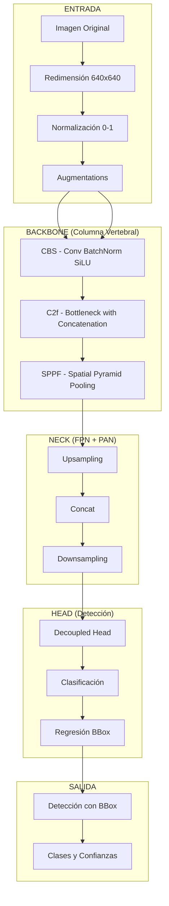
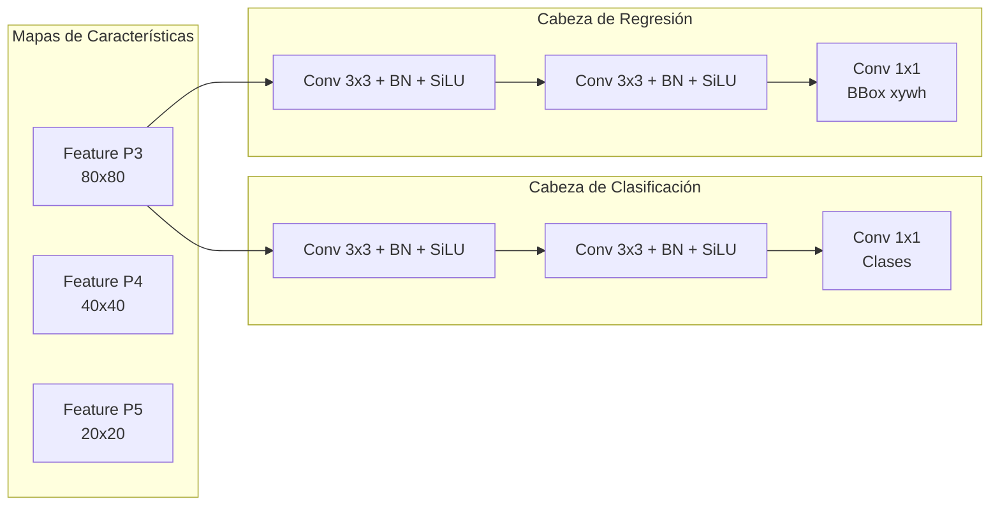
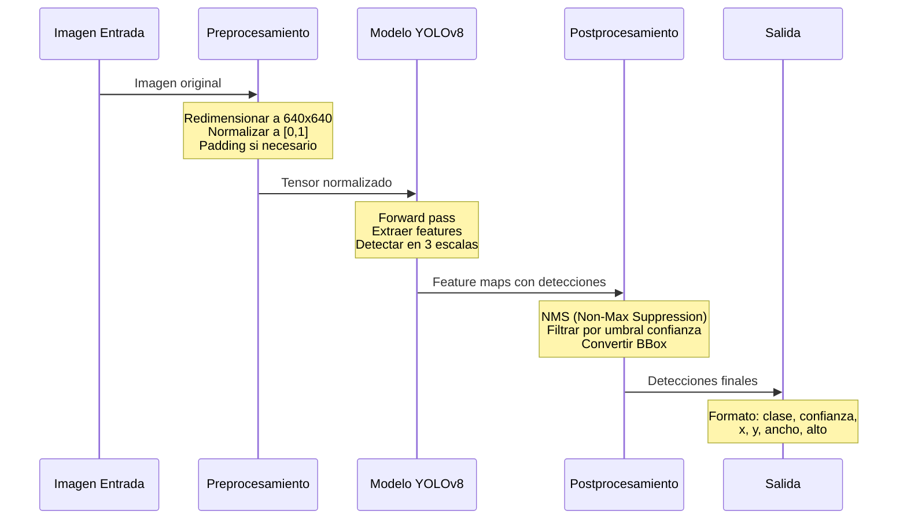
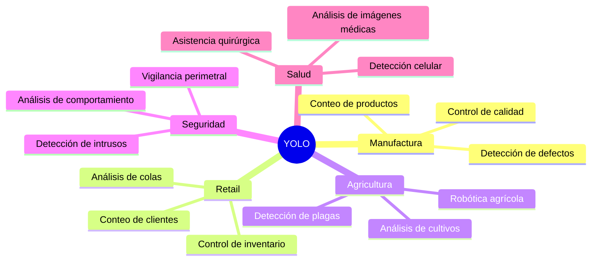

# Clase 1: Percepción Computacional con YOLO

## Duración
**4 horas (240 minutos)**

---

## Objetivos de Aprendizaje

Al finalizar esta clase, el estudiante será capaz de:

1. **Comprender** los fundamentos de la visión por computadora y su evolución histórica
2. **Explicar** la arquitectura y funcionamiento interno de YOLOv8
3. **Implementar** detección de objetos en tiempo real utilizando YOLO
4. **Diferenciar** entre las variantes de modelos YOLO (n, s, m, l, x)
5. **Aplicar** técnicas de preprocesamiento y postprocesamiento para detecciones óptimas
6. **Evaluar** el rendimiento de modelos de detección de objetos mediante métricas apropiadas

---

## Contenidos Detallados

### 1.1 Fundamentos de Visión por Computadora (45 minutos)

#### 1.1.1 Introducción Histórica

La visión por computadora es una disciplina que busca enable machines to "see" and interpret images and videos. El campo ha evolucionado dramáticamente desde sus inicios en la década de 1960:

```
Década 1960: Primeros experimentos con reconocimiento de bordes
1970s: Modelo de Pirámide de Marr
1980s: Redes neuronales convolucionales tempranas
1990s: Detección de características (SIFT, HOG)
2012: AlexNet - breakthrough en deep learning
2015: R-CNN, Fast R-CNN, Faster R-CNN
2016-2018: SSD, RetinaNet, YOLOv1-v3
2020-2023: YOLOv4-v8, DETR, Vision Transformers
```

#### 1.1.2 Conceptos Fundamentales

**Definición de Imagen Digital:**
Una imagen digital es una representación matricial de valores. Para imágenes en color, usamos el modelo RGB:
- **R** (Red): Canal rojo, valores 0-255
- **G** (Green): Canal verde, valores 0-255
- **B** (Blue): Canal azul, valores 0-255

Cada pixel contiene tres valores de intensidad. Una imagen de 640x480 tiene 307,200 píxeles y almacena aproximadamente 921,600 valores (sin compresión).

**Resolución y Dimensiones:**
```
Imagen típica: 1920x1080 = 2,073,600 píxeles
Canales: 3 (RGB)
Profundidad de color: 8 bits por canal
Memoria: 2,073,600 × 3 × 8 bits = ~6MB por imagen
```

**Espacios de Color:**
- **RGB**: Aditivo, usado para pantallas
- **HSV**: Tono, Saturación, Valor - más intuitivo para segmentación
- **LAB**: Perceptual, independiente del dispositivo
- **Escala de grises**: Reducción dimensional, 1 canal

#### 1.1.3 Tareas en Visión por Computadora

La visión por computadora abarca múltiples tareas, cada una con diferente complejidad:

```
┌─────────────────────────────────────────────────────────────┐
│                    JERARQUÍA DE TAREAS                      │
├─────────────────────────────────────────────────────────────┤
│  CLASIFICACIÓN    → ¿Qué hay en la imagen?                  │
│       ↓                                                         │
│  LOCALIZACIÓN     → ¿Dónde está el objeto?                    │
│       ↓                                                         │
│  DETECCIÓN        → ¿Qué hay y dónde? (Bounding boxes)        │
│       ↓                                                         │
│  SEGMENTACIÓN     → ¿Qué hay exactamente? (Máscaras)          │
│       ↓                                                         │
│  SEGMENTACIÓN INSTANCIAS → ¿Qué hay, dónde y cuáles son      │
│       ↓                                                         │
│  CAPTIONING       → ¿Qué está pasando? (Descripción)         │
└─────────────────────────────────────────────────────────────┘
```

**Clasificación de Imágenes:**
Asignar una etiqueta de categoría a una imagen completa. Ejemplo: clasificar una foto como "gato" o "perro".

**Detección de Objetos (Object Detection):**
Identificar y localizar múltiples objetos dentro de una imagen, proporcionando:
- Clase del objeto
- Bounding box (caja delimitadora)
- Confianza de la predicción

### 1.2 Arquitectura YOLOv8 (60 minutos)

#### 1.2.1 Evolución de YOLO

YOLO (You Only Look Once) revolucionó la detección de objetos al proponer un enfoque de red única:

```
YOLOv1 (2016): 45 FPS, mAP 63.4%
├── Propuesta: Grid de 7x7, 2 bounding boxes por celda
├── Problema: Difficulty with small objects
├── Backbone: Custom CNN

YOLOv2 (2017): 67 FPS, mAP 78.6%
├──引入: Anchor boxes, Batch Normalization
├── Mejora: Passthrough layers para detección multi-escala

YOLOv3 (2018): 35 FPS (ResNet backbone), mAP 55.3%
├──引入: Feature Pyramid Network (FPN)
├── 3 escalas de detección

YOLOv4 (2020): 65 FPS, mAP 43.5% (AP50: 65.7%)
├── CSPDarknet53 backbone
├── Mosaic augmentation
├── CIOU loss

YOLOv5 (2020): 250 FPS,进步 en eficiencia
├── Implementación en PyTorch
├── AutoAnchor, Exponential Moving Average

YOLOv8 (2023): Estado del arte actual
├── Arquitectura unificada
├── Mejor balance velocidad/precisión
├── Soporte para tareas múltiples
```

#### 1.2.2 Arquitectura Detallada de YOLOv8

YOLOv8 presenta una arquitectura modular dividida en tres componentes principales:



**Componentes del Backbone:**

1. **CBS (Conv BatchNorm SiLU):**
   - Convolución 2D: Extrae características espaciales
   - Batch Normalization: Estabiliza el entrenamiento
   - SiLU (Sigmoid Linear Unit): Función de activación f(x) = x * sigmoid(x)

2. **C2f (Bottleneck with Concatenation):**
   - Inspirado en CSPNet y ELAN
   - Múltiples conexiones residuales
   - Permite flujo de gradientes más eficiente

3. **SPPF (Spatial Pyramid Pooling - Fast):**
   - Versión optimizada del SPP original
   - Pooling a múltiples escalas: 5x5, 9x9, 13x13
   - Captura contexto a diferentes escalas

#### 1.2.3 Variantes de YOLOv8

Ultralytics ofrece 5 variantes con diferentes tamaños y capacidades:

```
┌────────────┬──────────┬───────────┬────────────┬──────────────┐
│  Variante  │  Params  │   FLOPs   │   mAP®     │    FPS       │
├────────────┼──────────┼───────────┼────────────┼──────────────┤
│   YOLOv8n  │   3.2M   │   8.7B    │   37.3     │   280+       │
│   YOLOv8s  │   11.2M  │   28.6B   │   44.9     │   220+       │
│   YOLOv8m  │   25.9M  │   78.9B   │   50.2     │   100+       │
│   YOLOv8l  │   43.7M  │   165.2B  │   52.9     │    60+       │
│   YOLOv8x  │   68.2M  │   257.8B  │   53.9     │    40+       │
└────────────┴──────────┴───────────┴────────────┴──────────────┘

NOTA: mAP® se mide en COCO val2017, FPS en V100 con batch=1
```

**Guía de Selección:**
- **n (nano)**: Aplicaciones móviles, embedded systems, alta velocidad
- **s (small)**: Robótica, drones, velocidad crítica
- **m (medium)**: Balance general, edge computing
- **l (large)**: Alta precisión, GPU dedicada
- **x (extra-large): Investigación, máxima precisión

#### 1.2.4 Decoupled Head

YOLOv8 implementa "cabezas desacopladas" para clasificación y regresión:



**Diferencia vs YOLOv5 (Coupled Head):**
- YOLOv5: Una cabeza compartida para clasificación y regresión
- YOLOv8: Cabezas separadas, permitiendo aprendizaje especializado
- Resultado: Mejor precisión, especialmente en clasificación

### 1.3 Detección de Objetos en Tiempo Real (50 minutos)

#### 1.3.1 Pipeline de Detección

El proceso completo de detección con YOLO sigue estos pasos:



#### 1.3.2 Non-Maximum Suppression (NMS)

NMS es crucial para eliminar detecciones redundantes:

**Algoritmo:**
```
1. Ordenar todas las detecciones por confianza (descendente)
2. Para cada detección (empezando por la mayor confianza):
   a. Marcar como "keep"
   b. Calcular IoU con todas las detecciones restantes
   c. Eliminar detecciones con IoU > umbral (típicamente 0.45)
3. Retornar solo las detecciones marcadas como "keep"
```

**IoU (Intersection over Union):**
```
IoU = Area(Intercepción) / Area(Unión)

    ┌─────────────┐
    │   BBox 1    │
    │  ┌───────┐  │
    │  │   ⋂   │  │  IoU alto = Objetos que representan lo mismo
    │  │ BBox2 │  │
    │  └───────┘  │
    └─────────────┘
```

**Código de IoU:**
```python
def calculate_iou(box1, box2):
    """
    Calcula IoU entre dos bounding boxes
    box formato: [x1, y1, x2, y2]
    """
    x1_inter = max(box1[0], box2[0])
    y1_inter = max(box1[1], box2[1])
    x2_inter = min(box1[2], box2[2])
    y2_inter = min(box1[3], box2[3])
    
    inter_area = max(0, x2_inter - x1_inter) * max(0, y2_inter - y1_inter)
    
    box1_area = (box1[2] - box1[0]) * (box1[3] - box1[1])
    box2_area = (box2[2] - box2[0]) * (box2[3] - box2[1])
    
    union_area = box1_area + box2_area - inter_area
    
    return inter_area / union_area if union_area > 0 else 0
```

#### 1.3.3 Métricas de Evaluación

**mAP (mean Average Precision):**
La métrica más importante para detección de objetos.

```
┌─────────────────────────────────────────────────────────────┐
│                    CÁLCULO DE mAP                          │
├─────────────────────────────────────────────────────────────┤
│                                                              │
│  1. Para cada clase:                                         │
│     a. Calcular Precision-Recall curve                      │
│     b. Promediar precision en diferentes recall levels      │
│     c. AP = Area bajo la curva PR                           │
│                                                              │
│  2. mAP = Promedio de AP sobre todas las clases             │
│                                                              │
│  3. mAP@0.5: AP con IoU threshold = 0.5                     │
│     mAP@0.5:0.95: Promedio en IoU 0.5 a 0.95 (estándar)     │
│                                                              │
└─────────────────────────────────────────────────────────────┘
```

**Precisión y Recall:**
```
Precisión = TP / (TP + FP)     → ¿Cuántos de mis positivos son correctos?
Recall    = TP / (TP + FN)     → ¿Cuántos objetos reales detecté?
```

**Visualización de la curva PR:**
```
Precision
    1.0 │
        │    ████▒▒▒
        │   ████▒▒▒▒
        │  ████▒▒▒▒▒
        │ ████▒▒▒▒▒▒
        │█████▒▒▒▒▒▒
        │██████▒▒▒▒▒
    0.0 └───────────────→ Recall
          0.0         1.0
          
    Área bajo esta curva = AP (Average Precision)
```

### 1.4 Implementación Práctica con Ultralytics (45 minutos)

#### 1.4.1 Instalación y Configuración

```bash
# Crear entorno virtual (recomendado)
python -m venv yolo-env
source yolo-env/bin/activate  # Linux/Mac
# yolo-env\Scripts\activate   # Windows

# Instalar ultralytics
pip install ultralytics

# Verificar instalación
python -c "import ultralytics; print(ultralytics.__version__)"
```

#### 1.4.2 Detección Básica

```python
"""
Detección de objetos básica con YOLOv8
=======================================
Este script demuestra la detección de objetos en una imagen
usando el modelo pre-entrenado YOLOv8m.
"""

from ultralytics import YOLO
import cv2

# Cargar modelo pre-entrenado
model = YOLO('yolov8m.pt')

# Detección en imagen
results = model('https://ultralytics.com/images/bus.jpg')

# Visualizar resultados
for result in results:
    boxes = result.boxes
    
    # Información de cada detección
    print(f"Número de objetos detectados: {len(boxes)}")
    
    for box in boxes:
        # Coordenadas del bounding box
        x1, y1, x2, y2 = box.xyxy[0].tolist()
        
        # Clase predicha
        cls_id = int(box.cls[0])
        cls_name = result.names[cls_id]
        
        # Confianza
        conf = float(box.conf[0])
        
        print(f"  - {cls_name}: {conf:.2%} en [{x1:.0f}, {y1:.0f}, {x2:.0f}, {y2:.0f}]")

# Guardar imagen con detecciones
result.save('resultado_deteccion.jpg')
```

**Salida esperada:**
```
Número de objetos detectados: 9
  - person: 91.23% en [56, 41, 238, 510]
  - person: 89.45% en [362, 41, 542, 509]
  - person: 88.12% en [155, 41, 293, 510]
  - bus: 87.34% en [18, 100, 597, 432]
  - person: 85.67% en [65, 212, 118, 338]
  - person: 82.45% en [420, 210, 488, 345]
  - tie: 78.90% en [175, 180, 195, 290]
  - ...
```

#### 1.4.3 Detección en Video y Streaming

```python
"""
Detección en tiempo real desde webcam
=====================================
Procesa frames de webcam y muestra detecciones en tiempo real.
"""

from ultralytics import YOLO
import cv2

model = YOLO('yolov8n.pt')  # Modelo más rápido para tiempo real

# Abrir webcam (0 = cámara default)
cap = cv2.VideoCapture(0)

# Configurar resolución (opcional)
cap.set(cv2.CAP_PROP_FRAME_WIDTH, 1280)
cap.set(cv2.CAP_PROP_FRAME_HEIGHT, 720)

print("Presiona 'q' para salir")

while cap.isOpened():
    success, frame = cap.read()
    
    if not success:
        print("Error al leer frame de la cámara")
        break
    
    # Realizar detección
    results = model(frame, conf=0.5, verbose=False)
    
    # Anotar frame con detecciones
    annotated_frame = results[0].plot()
    
    # Mostrar FPS
    cv2.putText(
        annotated_frame,
        f"FPS: {int(results[0].speed['inference'])}",
        (10, 30),
        cv2.FONT_HERSHEY_SIMPLEX,
        1,
        (0, 255, 0),
        2
    )
    
    # Mostrar frame
    cv2.imshow('YOLOv8 Detección en Tiempo Real', annotated_frame)
    
    # Salir con 'q'
    if cv2.waitKey(1) & 0xFF == ord('q'):
        break

cap.release()
cv2.destroyAllWindows()
```

#### 1.4.4 Uso Avanzado: Personalizar Clases

```python
"""
Detección selectiva de clases
=============================
Detectar solo objetos específicos (personas y vehículos)
"""

from ultralytics import YOLO

model = YOLO('yolov8m.pt')

# Mapa de clases COCO
print("Clases disponibles:", model.names)

# Filtrar solo clases relevantes para vigilancia
CLASES_VIGILANCIA = {
    0: 'person',    # Persona
    2: 'car',       # Carro
    3: 'motorcycle', # Motocicleta
    5: 'bus',       # Autobús
    7: 'truck',     # Camión
    15: 'cat',      # Gato
    16: 'dog'       # Perro
}

# Detección con clases filtradas
results = model(
    'imagen_calle.jpg',
    classes=list(CLASES_VIGILANCIA.keys()),
    conf=0.6
)

# Mostrar solo detecciones de interés
for result in results:
    for box in result.boxes:
        cls_id = int(box.cls[0])
        if cls_id in CLASES_VIGILANCIA:
            conf = float(box.conf[0])
            print(f"{CLASES_VIGILANCIA[cls_id]}: {conf:.2%}")
```

### 1.5 OpenCV para Procesamiento de Imágenes (30 minutos)

#### 1.5.1 Fundamentos de OpenCV con YOLO

```python
"""
Integración de OpenCV con YOLO
===============================
Preprocesamiento y postprocesamiento con OpenCV
"""

import cv2
import numpy as np
from ultralytics import YOLO

model = YOLO('yolov8m.pt')

# Leer imagen con OpenCV
image = cv2.imread('imagen.jpg')
image_rgb = cv2.cvtColor(image, cv2.COLOR_BGR2RGB)

# Aplicar filtros de preprocesamiento
def preprocess_for_yolo(image):
    """Preprocesamiento mejorado para YOLO"""
    # Reducir ruido
    denoised = cv2.bilateralFilter(image, 9, 75, 75)
    
    # Aumentar contraste
    lab = cv2.cvtColor(denoised, cv2.COLOR_RGB2LAB)
    l, a, b = cv2.split(lab)
    clahe = cv2.createCLAHE(clipLimit=3.0, tileGridSize=(8, 8))
    l = clahe.apply(l)
    enhanced = cv2.merge([l, a, b])
    enhanced = cv2.cvtColor(enhanced, cv2.COLOR_LAB2RGB)
    
    return enhanced

# Detección
processed = preprocess_for_yolo(image_rgb)
results = model(processed)

# Postprocesamiento con OpenCV
def draw_detections(image, results):
    """Dibuja detecciones personalizadas con OpenCV"""
    annotated = image.copy()
    
    for result in results:
        boxes = result.boxes
        
        for box in boxes:
            # Obtener coordenadas
            x1, y1, x2, y2 = map(int, box.xyxy[0].tolist())
            
            # Color según clase
            cls_id = int(box.cls[0])
            confidence = float(box.conf[0])
            
            # Colores para las 10 primeras clases
            colors = [(255, 0, 0), (0, 255, 0), (0, 0, 255), 
                     (255, 255, 0), (255, 0, 255), (0, 255, 255),
                     (128, 0, 0), (0, 128, 0), (0, 0, 128), (128, 128, 0)]
            
            color = colors[cls_id % len(colors)]
            
            # Dibujar rectángulo
            cv2.rectangle(annotated, (x1, y1), (x2, y2), color, 2)
            
            # Texto con fondo
            label = f"{result.names[cls_id]}: {confidence:.1%}"
            (w, h), _ = cv2.getTextSize(label, cv2.FONT_HERSHEY_SIMPLEX, 0.5, 1)
            
            cv2.rectangle(annotated, (x1, y1-h-10), (x1+w, y1), color, -1)
            cv2.putText(annotated, label, (x1, y1-5),
                       cv2.FONT_HERSHEY_SIMPLEX, 0.5, (255, 255, 255), 1)
    
    return annotated

output = draw_detections(image, results)
cv2.imwrite('output.jpg', cv2.cvtColor(output, cv2.COLOR_RGB2BGR))
```

### 1.6 Casos de Uso y Consideraciones (30 minutos)

#### 1.6.1 Aplicaciones Industriales



#### 1.6.2 Consideraciones de Rendimiento

```python
"""
Benchmark de diferentes modelos YOLOv8
=======================================
Compara velocidad y precisión de variantes
"""

import time
import cv2
from ultralytics import YOLO

models = ['yolov8n.pt', 'yolov8s.pt', 'yolov8m.pt', 'yolov8l.pt', 'yolov8x.pt']
image = cv2.imread('test_image.jpg')

print("=" * 60)
print(f"{'Modelo':<12} {'Tiempo (ms)':<15} {'FPS':<10} {'Objetos':<10}")
print("=" * 60)

for model_name in models:
    model = YOLO(model_name)
    
    # Warmup
    model(image, verbose=False)
    
    # Benchmark
    times = []
    for _ in range(10):
        start = time.time()
        results = model(image, verbose=False)
        times.append(time.time() - start)
    
    avg_time = np.mean(times) * 1000
    fps = 1000 / avg_time
    num_objects = len(results[0].boxes)
    
    print(f"{model_name:<12} {avg_time:<15.2f} {fps:<10.1f} {num_objects:<10}")

print("=" * 60)
```

---

## Tecnologías y Herramientas Específicas

### Tecnologías Principales

| Tecnología | Versión | Propósito |
|------------|---------|-----------|
| Python | 3.8+ | Lenguaje de programación |
| Ultralytics YOLO | 8.x | Framework de detección |
| OpenCV | 4.8+ | Procesamiento de imágenes |
| NumPy | 1.24+ | Operaciones numéricas |
| PyTorch | 2.0+ | Backend de deep learning |

### Librerías Complementarias

```bash
# Instalación completa
pip install ultralytics>=8.0.0
pip install opencv-python>=4.8.0
pip install numpy>=1.24.0
pip install torch>=2.0.0
pip install torchvision>=0.15.0
pip install pillow>=10.0.0
pip install matplotlib>=3.7.0
```

---

## Actividades de Laboratorio

### Laboratorio 1.1: Configuración del Ambiente

**Objetivo:** Configurar el entorno de desarrollo para YOLO.

**Pasos:**
1. Crear directorio del proyecto
2. Instalar dependencias
3. Verificar funcionamiento

```bash
# Crear proyecto
mkdir yolo-project && cd yolo-project
python -m venv venv
source venv/bin/activate

# Instalar
pip install ultralytics opencv-python numpy torch torchvision

# Verificar
python -c "
from ultralytics import YOLO
import cv2
import numpy as np
print('✓ Ultralytics:', YOLO('yolov8n.pt'))
print('✓ OpenCV:', cv2.__version__)
print('✓ NumPy:', np.__version__)
"
```

### Laboratorio 1.2: Detector de Objetos en Imágenes

**Objetivo:** Implementar un detector completo con visualización.

```python
"""
Laboratorio 1.2: Detector de Objetos
=====================================
Implementar un sistema completo de detección con YOLOv8
"""

import cv2
from ultralytics import YOLO
import numpy as np
from pathlib import Path

class ObjectDetector:
    """Clase para detección de objetos con YOLOv8"""
    
    def __init__(self, model_size='m', conf_threshold=0.5, iou_threshold=0.45):
        self.model = YOLO(f'yolov8{model_size}.pt')
        self.conf_threshold = conf_threshold
        self.iou_threshold = iou_threshold
        
        # Paleta de colores para clases
        self.colors = self._generate_colors(80)
    
    def _generate_colors(self, n):
        """Genera colores únicos para n clases"""
        np.random.seed(42)
        return [tuple(map(int, np.random.randint(0, 255, 3))) for _ in range(n)]
    
    def detect(self, image_path):
        """Detecta objetos en una imagen"""
        # Leer imagen
        if isinstance(image_path, str):
            image = cv2.imread(image_path)
        else:
            image = image_path
            
        if image is None:
            raise ValueError(f"No se pudo cargar la imagen: {image_path}")
        
        # Realizar detección
        results = self.model(
            image,
            conf=self.conf_threshold,
            iou=self.iou_threshold,
            verbose=False
        )
        
        return image, results[0]
    
    def draw_boxes(self, image, result):
        """Dibuja bounding boxes y etiquetas"""
        output = image.copy()
        
        for box in result.boxes:
            # Coordenadas
            x1, y1, x2, y2 = map(int, box.xyxy[0].tolist())
            
            # Clase y confianza
            cls_id = int(box.cls[0])
            conf = float(box.conf[0])
            label = f"{result.names[cls_id]}: {conf:.2%}"
            
            # Color
            color = self.colors[cls_id]
            
            # Dibujar
            cv2.rectangle(output, (x1, y1), (x2, y2), color, 2)
            
            # Etiqueta con fondo
            (w, h), _ = cv2.getTextSize(label, cv2.FONT_HERSHEY_SIMPLEX, 0.6, 1)
            cv2.rectangle(output, (x1, y1-h-8), (x1+w, y1), color, -1)
            cv2.putText(output, label, (x1, y1-3),
                       cv2.FONT_HERSHEY_SIMPLEX, 0.6, (255, 255, 255), 1)
        
        return output
    
    def process_image(self, input_path, output_path):
        """Procesa imagen y guarda resultado"""
        image, result = self.detect(input_path)
        annotated = self.draw_boxes(image, result)
        cv2.imwrite(output_path, annotated)
        return len(result.boxes)
    
    def process_batch(self, input_dir, output_dir):
        """Procesa lote de imágenes"""
        input_path = Path(input_dir)
        output_path = Path(output_dir)
        output_path.mkdir(parents=True, exist_ok=True)
        
        results = []
        for img_path in input_path.glob('*.jpg'):
            try:
                num_objects = self.process_image(
                    str(img_path),
                    str(output_path / img_path.name)
                )
                results.append((img_path.name, num_objects, "OK"))
            except Exception as e:
                results.append((img_path.name, 0, str(e)))
        
        return results


# Ejecutar laboratorio
if __name__ == "__main__":
    detector = ObjectDetector(model_size='n', conf_threshold=0.6)
    
    # Procesar imagen de prueba
    try:
        num = detector.process_image('bus.jpg', 'resultado.jpg')
        print(f"✓ Detectados {num} objetos en la imagen")
    except:
        print("Descarga imagen de prueba...")
        import urllib.request
        urllib.request.urlretrieve(
            'https://ultralytics.com/images/bus.jpg',
            'bus.jpg'
        )
        num = detector.process_image('bus.jpg', 'resultado.jpg')
        print(f"✓ Detectados {num} objetos en la imagen")
```

### Laboratorio 1.3: Sistema de Monitoreo en Tiempo Real

**Objetivo:** Implementar detección en streaming de video.

```python
"""
Laboratorio 1.3: Monitoreo en Tiempo Real
========================================
Sistema de detección para cámaras de seguridad
"""

import cv2
from ultralytics import YOLO
from collections import deque
import numpy as np

class SecurityMonitor:
    """Sistema de monitoreo de seguridad con YOLO"""
    
    def __init__(self, camera_id=0):
        self.model = YOLO('yolov8n.pt')
        self.camera = cv2.VideoCapture(camera_id)
        self.fps_history = deque(maxlen=30)
        self.object_history = deque(maxlen=100)
        
        # Clases de interés para seguridad
        self.interest_classes = [0, 2, 3, 7]  # person, car, motorcycle, truck
    
    def calculate_fps(self, frame_time):
        """Calcula FPS instantáneo"""
        if frame_time > 0:
            fps = 1.0 / frame_time
            self.fps_history.append(fps)
            return np.mean(self.fps_history)
        return 0
    
    def process_frame(self, frame):
        """Procesa un frame individual"""
        start_time = cv2.getTickCount()
        
        # Detección
        results = self.model(frame, conf=0.5, verbose=False)
        result = results[0]
        
        # Filtrar clases de interés
        detections = []
        for box in result.boxes:
            if int(box.cls[0]) in self.interest_classes:
                detections.append({
                    'class': result.names[int(box.cls[0])],
                    'confidence': float(box.conf[0]),
                    'bbox': box.xyxy[0].tolist()
                })
        
        # Calcular FPS
        frame_time = (cv2.getTickCount() - start_time) / cv2.getTickFrequency()
        fps = self.calculate_fps(frame_time)
        
        # Registrar en historial
        self.object_history.append(len(detections))
        
        return frame, detections, fps, result
    
    def draw_overlay(self, frame, detections, fps, result):
        """Dibuja información overlay"""
        output = frame.copy()
        
        # Dibujar detecciones
        for det in detections:
            x1, y1, x2, y2 = map(int, det['bbox'])
            color = (0, 255, 0) if det['class'] == 'person' else (255, 0, 0)
            cv2.rectangle(output, (x1, y1), (x2, y2), color, 2)
            label = f"{det['class']}: {det['confidence']:.1%}"
            cv2.putText(output, label, (x1, y1-5),
                       cv2.FONT_HERSHEY_SIMPLEX, 0.5, color, 1)
        
        # Panel de estadísticas
        cv2.rectangle(output, (10, 10), (250, 130), (0, 0, 0), -1)
        cv2.rectangle(output, (10, 10), (250, 130), (0, 255, 0), 2)
        
        cv2.putText(output, f"FPS: {fps:.1f}", (20, 40),
                   cv2.FONT_HERSHEY_SIMPLEX, 0.7, (0, 255, 0), 2)
        cv2.putText(output, f"Objetos: {len(detections)}", (20, 70),
                   cv2.FONT_HERSHEY_SIMPLEX, 0.7, (255, 255, 255), 2)
        cv2.putText(output, f"Media: {np.mean(self.object_history):.1f}", (20, 100),
                   cv2.FONT_HERSHEY_SIMPLEX, 0.7, (255, 255, 255), 2)
        cv2.putText(output, f"Pico: {max(self.object_history)}", (20, 125),
                   cv2.FONT_HERSHEY_SIMPLEX, 0.7, (255, 255, 255), 2)
        
        return output
    
    def run(self):
        """Ejecuta el loop principal de monitoreo"""
        print("Iniciando sistema de monitoreo...")
        print("Presiona 'q' para salir")
        
        while True:
            ret, frame = self.camera.read()
            if not ret:
                print("Error: No se puede leer el frame")
                break
            
            output, detections, fps, result = self.process_frame(frame)
            display = self.draw_overlay(output, detections, fps, result)
            
            cv2.imshow('Security Monitor', display)
            
            if cv2.waitKey(1) & 0xFF == ord('q'):
                break
        
        self.camera.release()
        cv2.destroyAllWindows()


if __name__ == "__main__":
    monitor = SecurityMonitor(camera_id=0)
    monitor.run()
```

---

## Resumen de Puntos Clave

### Conceptos Fundamentales
1. **Visión por computadora**: Disciplina para enable machines to interpret imágenes
2. **Detección de objetos**: Identificar y localizar múltiples objetos con bounding boxes
3. **YOLO**: Algoritmo de detección en tiempo real con arquitectura de red única

### Arquitectura YOLOv8
1. **Backbone**: CBS + C2f + SPPF para extracción de características
2. **Neck**: FPN + PAN para detección multi-escala
3. **Head**: Cabezas desacopladas para clasificación y regresión
4. **Variantes**: n, s, m, l, x ofrecen diferentes balances velocidad/precisión

### Implementación
1. **Ultralytics**: API simplificada para YOLO en Python
2. **OpenCV**: Complemento para procesamiento adicional
3. **NMS**: Algoritmo para eliminar detecciones redundantes

### Métricas
1. **mAP**: Métrica principal para evaluar detectores
2. **IoU**: Medida de overlap entre bounding boxes
3. **FPS**: Velocidad de procesamiento

---

## Referencias Externas

1. **Ultralytics YOLOv8 Documentation**
   - URL: https://docs.ultralytics.com/
   - Descripción: Documentación oficial de YOLOv8 y Ultralytics

2. **COCO Dataset - Common Objects in Context**
   - URL: https://cocodataset.org/
   - Descripción: Dataset y métricas estándar para detección de objetos

3. **YOLOv8 Paper (Original)**
   - URL: https://arxiv.org/abs/2304.00501
   - Descripción: Paper original de YOLOv8 por Ultralytics

4. **OpenCV Documentation**
   - URL: https://docs.opencv.org/4.8/
   - Descripción: Documentación completa de OpenCV

5. **PyTorch Image Models (timm)**
   - URL: https://github.com/huggingface/pytorch-image-models
   - Descripción: Librería con arquitecturas de visión state-of-the-art

6. **Computer Vision Metrics Survey**
   - URL: https://arxiv.org/abs/1905.05667
   - Descripción: Survey comprehensivo de métricas en visión por computadora

7. **Real-Time Object Detection Survey**
   - URL: https://arxiv.org/abs/2209.07114
   - Descripción: Revisión de métodos de detección en tiempo real

8. **PyTorch Official Tutorials**
   - URL: https://pytorch.org/tutorials/
   - Descripción: Tutoriales oficiales de PyTorch para deep learning

---

## Ejercicios de Práctica

### Ejercicio 1: Detector Personalizado Básico
**Enunciado:** Implementa un detector que procese 10 imágenes de un directorio y genere un reporte con las detecciones.

```python
# SOLUCIÓN
from ultralytics import YOLO
from pathlib import Path
import json

def detector_batch(image_dir, output_dir, model='yolov8n.pt'):
    """Detector por lotes"""
    model = YOLO(model)
    output_path = Path(output_dir)
    output_path.mkdir(parents=True, exist_ok=True)
    
    report = []
    
    for img_path in Path(image_dir).glob('*.jpg'):
        # Detectar
        results = model(str(img_path), verbose=False)
        
        # Recopilar datos
        detections = []
        for box in results[0].boxes:
            detections.append({
                'class': results[0].names[int(box.cls[0])],
                'confidence': float(box.conf[0]),
                'bbox': box.xyxy[0].tolist()
            })
        
        # Guardar imagen anotada
        results[0].save(output_path / img_path.name)
        
        report.append({
            'image': img_path.name,
            'num_detections': len(detections),
            'detections': detections
        })
        
        print(f"✓ {img_path.name}: {len(detections)} objetos")
    
    # Guardar reporte JSON
    with open(output_path / 'report.json', 'w') as f:
        json.dump(report, f, indent=2)
    
    return report

# Ejecutar
report = detector_batch('images/', 'output/')
print(f"\nTotal: {sum(r['num_detections'] for r in report)} detecciones")
```

### Ejercicio 2: Análisis de Performance
**Enunciado:** Compara el rendimiento de todos los modelos YOLOv8 en términos de velocidad y precisión.

```python
# SOLUCIÓN
import time
from ultralytics import YOLO
import numpy as np

def benchmark_models(image_path, models=None):
    """Compara todos los modelos YOLOv8"""
    if models is None:
        models = ['yolov8n.pt', 'yolov8s.pt', 'yolov8m.pt', 'yolov8l.pt', 'yolov8x.pt']
    
    results = []
    
    for model_name in models:
        print(f"Evaluando {model_name}...")
        model = YOLO(model_name)
        
        # Warmup
        for _ in range(3):
            model(image_path, verbose=False)
        
        # Benchmark
        times = []
        detections = []
        
        for _ in range(10):
            start = time.perf_counter()
            result = model(image_path, verbose=False)
            times.append(time.perf_counter() - start)
            detections.append(len(result[0].boxes))
        
        results.append({
            'model': model_name,
            'avg_time': np.mean(times) * 1000,
            'std_time': np.std(times) * 1000,
            'fps': 1000 / np.mean(times) / 1000,
            'avg_detections': np.mean(detections)
        })
        
        print(f"  Tiempo: {results[-1]['avg_time']:.1f}ms, "
              f"FPS: {results[-1]['fps']:.1f}")
    
    return results

# Ejecutar
results = benchmark_models('bus.jpg')
best_speed = min(results, key=lambda x: x['avg_time'])
best_accuracy = max(results, key=lambda x: x['avg_detections'])

print(f"\nMás rápido: {best_speed['model']}")
print(f"Más detections: {best_accuracy['model']}")
```

---

**Fin de la Clase 1**
