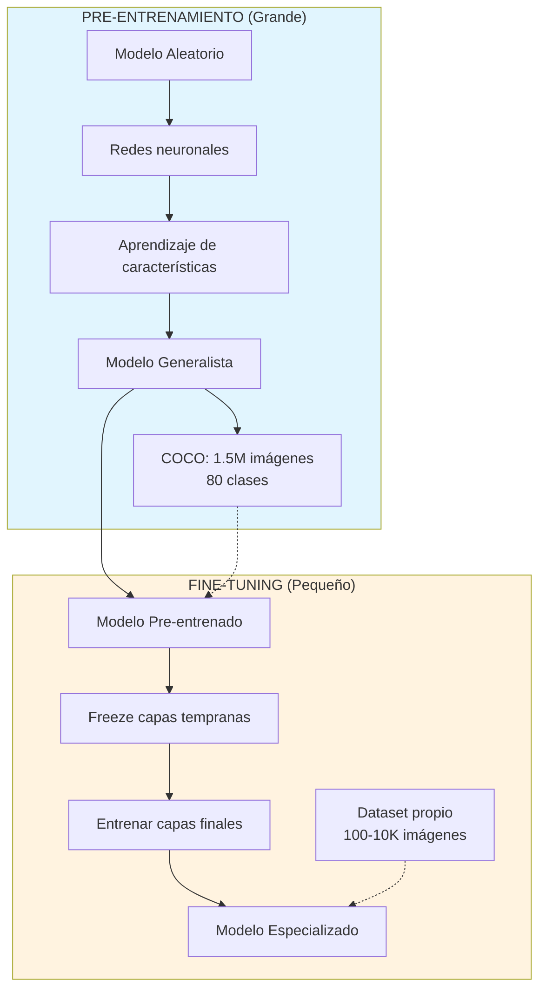
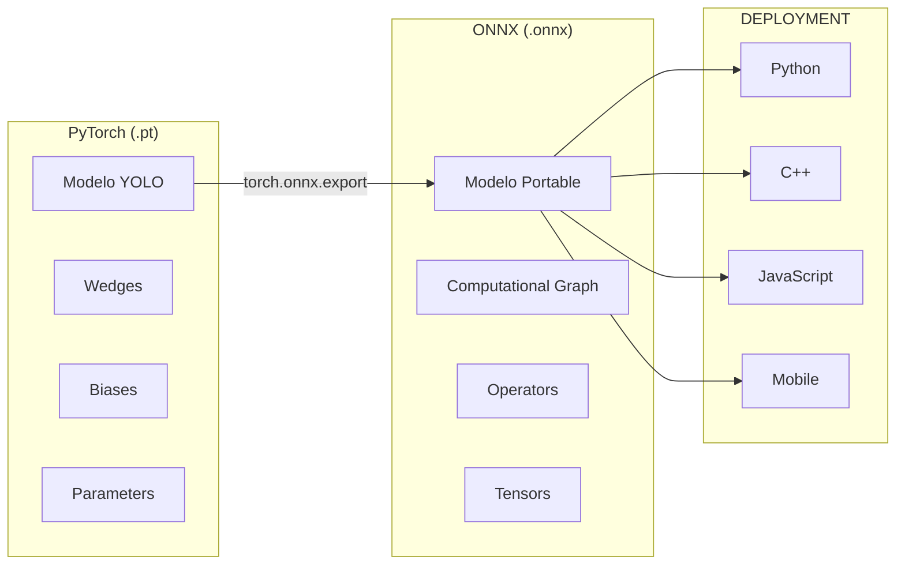
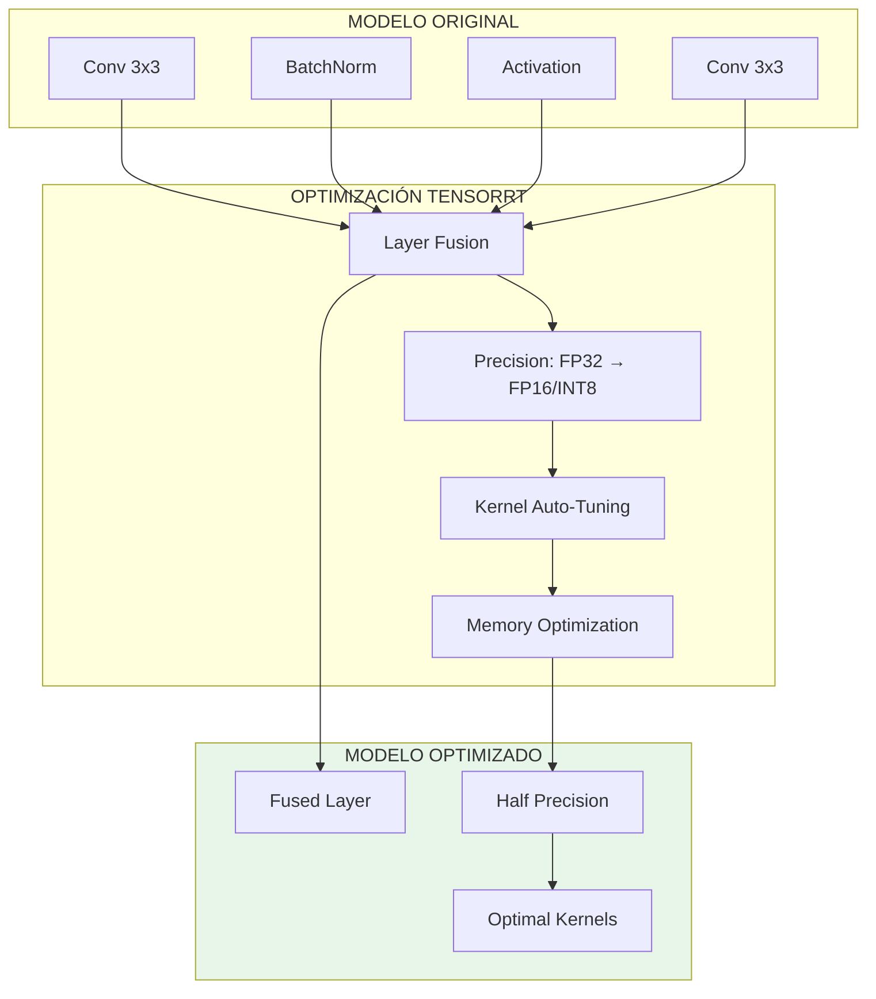
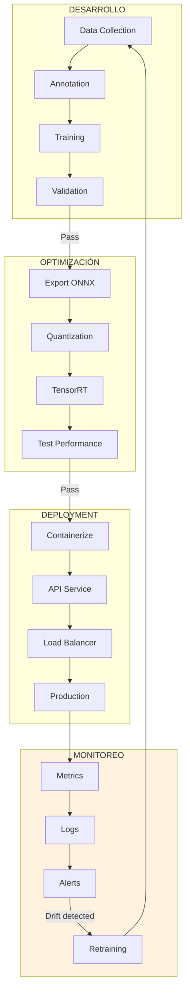
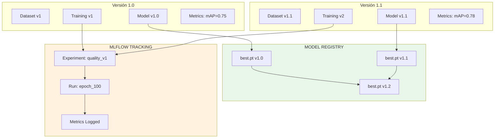
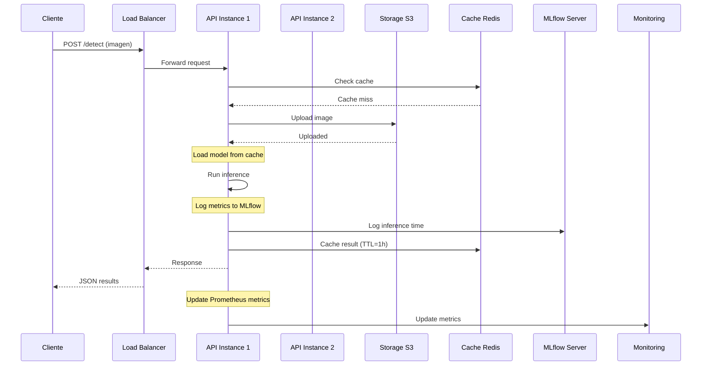

# Clase 2: Implementación de YOLO en Producción

## Duración
**4 horas (240 minutos)**

---

## Objetivos de Aprendizaje

Al finalizar esta clase, el estudiante será capaz de:

1. **Implementar** fine-tuning de YOLO con datasets personalizados
2. **Aplicar** técnicas de transfer learning efectivamente
3. **Desplegar** modelos YOLO en diferentes entornos de producción
4. **Optimizar** modelos para inference usando ONNX y TensorRT
5. **Diseñar** pipelines de ML completos con versionado
6. **Monitorear** el rendimiento del modelo en producción

---

## Contenidos Detallados

### 2.1 Fine-tuning de YOLO (60 minutos)

#### 2.1.1 Fundamentos de Fine-tuning

Fine-tuning es el proceso de adaptar un modelo pre-entrenado a una tarea específica. En lugar de entrenar desde cero (lo cual requiere semanas y millones de imágenes), comenzamos con un modelo que ya conoce patrones visuales básicos.



#### 2.1.2 Preparación del Dataset

Estructura de directorios requerida:
```
dataset/
├── images/
│   ├── train/
│   │   ├── img001.jpg
│   │   ├── img002.jpg
│   │   └── ...
│   └── val/
│       ├── img100.jpg
│       └── ...
└── labels/
    ├── train/
    │   ├── img001.txt
    │   ├── img002.txt
    │   └── ...
    └── val/
        ├── img100.txt
        └── ...
```

**Formato de Etiquetas YOLO:**
Cada línea en el archivo .txt representa un objeto:
```
# Formato: class_id x_center y_center width height
# Todos los valores NORMALIZADOS (0-1)

# img001.txt ejemplo:
0 0.512 0.483 0.124 0.356
1 0.234 0.678 0.089 0.234
0 0.756 0.345 0.067 0.123
```

**Visualización del Formato:**
```
    0.0         0.5         1.0
    ┌───────────┬───────────┬───────────┐
0.0 │           │           │           │
    │           │     ●─────│─────●     │
    │           │     │ x=0.5 │ w=0.2    │
    │           │     │ y=0.5 │ h=0.3    │
    │           │     ●─────│─────●     │
0.5 │           │           │           │
    └───────────┴───────────┴───────────┘
    
    Bounding box: x_center=0.5, y_center=0.5, width=0.2, height=0.3
```

**Configuración YAML:**
```yaml
# dataset_config.yaml
path: C:/datasets/mi_proyecto
train: images/train
val: images/val

# Número de clases
nc: 5

# Nombres de las clases
names:
  0: producto
  1: etiqueta
  2: defecto
  3: empaque
  4: codigo_barras
```

#### 2.1.3 Código de Fine-tuning

```python
"""
Fine-tuning de YOLOv8 con dataset personalizado
================================================
Proceso completo para entrenar un modelo personalizado
"""

from ultralytics import YOLO
import torch
from pathlib import Path

class YOLOTrainer:
    """Clase para entrenamiento de YOLO personalizado"""
    
    def __init__(self, config_path):
        self.config_path = config_path
        self.model = None
        
    def load_pretrained(self, model_size='m'):
        """Carga modelo pre-entrenado"""
        model_name = f'yolov8{model_size}.pt'
        print(f"Cargando modelo pre-entrenado: {model_name}")
        self.model = YOLO(model_name)
        return self.model
    
    def train(self, 
              epochs=100,
              batch_size=16,
              image_size=640,
              patience=50,
              save_period=10,
              workers=8,
              device=0):
        """
        Entrena el modelo con los parámetros especificados
        
        Args:
            epochs: Número de épocas de entrenamiento
            batch_size: Imágenes por batch (memoria GPU)
            image_size: Tamaño de imagen de entrada
            patience: Épocas sin mejora antes de detener
            save_period: Guardar checkpoint cada N épocas
        """
        print("=" * 60)
        print("INICIANDO ENTRENAMIENTO YOLO")
        print("=" * 60)
        
        results = self.model.train(
            data=self.config_path,
            epochs=epochs,
            batch=batch_size,
            imgsz=image_size,
            patience=patience,
            save=save_period,
            workers=workers,
            device=device,
            project='runs/detect',
            name='mi_modelo',
            exist_ok=True,
            pretrained=True,
            optimizer='AdamW',
            lr0=0.001,
            lrf=0.01,
            momentum=0.937,
            weight_decay=0.0005,
            warmup_epochs=3.0,
            warmup_momentum=0.8,
            warmup_bias_lr=0.1,
            box=7.5,
            cls=0.5,
            dfl=1.5,
            hsv_h=0.015,
            hsv_s=0.7,
            hsv_v=0.4,
            degrees=0.0,
            translate=0.1,
            scale=0.5,
            shear=0.0,
            perspective=0.0,
            flipud=0.0,
            fliplr=0.5,
            mosaic=1.0,
            mixup=0.0,
            copy_paste=0.0,
            verbose=True
        )
        
        return results
    
    def validate(self):
        """Valida el modelo entrenado"""
        print("Validando modelo...")
        metrics = self.model.val()
        return metrics
    
    def export(self, format='onnx'):
        """Exporta el modelo al formato especificado"""
        print(f"Exportando modelo a {format}...")
        self.model.export(format=format)
    
    def get_best_model(self):
        """Retorna la ruta al mejor modelo"""
        return self.model.trainer.best if hasattr(self.model, 'trainer') else None


def create_dataset_yaml(dataset_path, class_names):
    """Crea archivo de configuración YAML"""
    yaml_content = f"""
path: {dataset_path}
train: images/train
val: images/val

nc: {len(class_names)}
names: {class_names}
"""
    yaml_path = Path(dataset_path) / 'dataset.yaml'
    with open(yaml_path, 'w') as f:
        f.write(yaml_content)
    return yaml_path


# EJECUCIÓN
if __name__ == "__main__":
    # Definir clases
    classes = {
        0: 'defecto_tipo_a',
        1: 'defecto_tipo_b',
        2: 'producto_ok',
        3: 'producto_danado'
    }
    
    # Crear configuración
    dataset_path = 'C:/datasets/calidad_productos'
    yaml_path = create_dataset_yaml(dataset_path, classes)
    
    # Entrenar
    trainer = YOLOTrainer(str(yaml_path))
    trainer.load_pretrained('m')
    
    # Entrenar con parámetros optimizados
    results = trainer.train(
        epochs=100,
        batch_size=16,
        patience=30
    )
    
    print("Entrenamiento completado!")
```

#### 2.1.4 Estrategias de Transfer Learning

```python
"""
Estrategias de Transfer Learning
=================================
Diferentes aproximaciones según la cantidad de datos disponibles
"""

from ultralytics import YOLO
import torch

class TransferLearningStrategies:
    """Implementa diferentes estrategias de transfer learning"""
    
    @staticmethod
    def full_finetune(model_name, data_yaml, epochs=100):
        """
        Estrategia 1: Fine-tuning completo
        - Cuando tienes dataset mediano/grande (>1000 imágenes)
        - Todas las capas se entrenan
        """
        model = YOLO(model_name)
        
        results = model.train(
            data=data_yaml,
            epochs=epochs,
            freeze=0,  # Sin congelar capas
            pretrained=True
        )
        return results
    
    @staticmethod
    def partial_finetune(model_name, data_yaml, freeze_layers=10):
        """
        Estrategia 2: Fine-tuning parcial
        - Dataset pequeño/mediano (100-1000 imágenes)
        - Capas early del backbone congeladas
        """
        model = YOLO(model_name)
        
        results = model.train(
            data=data_yaml,
            epochs=100,
            freeze=freeze_layers,
            pretrained=True,
            lr0=0.0001  # Learning rate menor para capas congeladas
        )
        return results
    
    @staticmethod
    def feature_extraction(model_name, data_yaml):
        """
        Estrategia 3: Extracción de características
        - Dataset muy pequeño (<100 imágenes)
        - Solo el head se entrena
        """
        model = YOLO(model_name)
        
        results = model.train(
            data=data_yaml,
            epochs=50,
            freeze=20,  # Congelar casi todo el backbone
            lr0=0.00001,
            augmentation=False,
            mosaic=0.0
        )
        return results


# Recomendaciones según dataset
"""
┌─────────────────────────────────────────────────────────────┐
│     TAMAÑO DEL DATASET    │   ESTRATEGIA RECOMENDADA       │
├─────────────────────────────────────────────────────────────┤
│     < 100 imágenes        │   Feature extraction (freeze 20)│
│     100 - 1000 imágenes   │   Partial fine-tune (freeze 10) │
│     1000 - 10000 imágenes │   Full fine-tune                │
│     > 10000 imágenes      │   Full fine-tune + más epochs   │
└─────────────────────────────────────────────────────────────┘
"""
```

### 2.2 Optimización de Modelos (45 minutos)

#### 2.2.1 Exportación a ONNX

ONNX (Open Neural Network Exchange) es un formato interoperable para modelos de deep learning.



**Exportación a ONNX:**
```python
"""
Exportación a ONNX
==================
Convierte modelo YOLO a formato ONNX
"""

from ultralytics import YOLO

def export_to_onnx(model_path, output_path, dynamic=False):
    """
    Exporta modelo YOLO a ONNX
    
    Args:
        model_path: Ruta al modelo .pt
        output_path: Ruta de salida .onnx
        dynamic: Permite shapes de entrada dinámicos
    """
    model = YOLO(model_path)
    
    # Exportar con optimización
    model.export(
        format='onnx',
        dynamic=dynamic,
        simplify=True,  # Simplifica el grafo
        opset=12,        # Versión de operadores ONNX
        imgsz=[640, 640]
    )
    
    print(f"Modelo exportado a: {model_path.replace('.pt', '.onnx')}")

# Exportar modelo entrenado
export_to_onnx('runs/detect/mi_modelo/weights/best.pt', 'modelo_optimizado.onnx')
```

**Uso de modelo ONNX:**
```python
"""
Inference con ONNX Runtime
===========================
Más rápido que PyTorch puro
"""

import onnxruntime as ort
import numpy as np
import cv2

class ONNXInference:
    """Inference con ONNX Runtime"""
    
    def __init__(self, model_path, conf_threshold=0.5, iou_threshold=0.45):
        # Configurar sesión ONNX
        providers = [
            ('CUDAExecutionProvider', {'device_id': 0}),
            'CPUExecutionProvider'
        ]
        
        self.session = ort.InferenceSession(
            model_path,
            providers=providers
        )
        
        self.input_name = self.session.get_inputs()[0].name
        self.output_names = [out.name for out in self.session.get_outputs()]
        
        self.conf_threshold = conf_threshold
        self.iou_threshold = iou_threshold
    
    def preprocess(self, image):
        """Preprocesa imagen para ONNX"""
        # Redimensionar
        img = cv2.resize(image, (640, 640))
        
        # Transponer de HWC a CHW
        img = img.transpose(2, 0, 1)
        
        # Normalizar [0, 255] → [0, 1]
        img = img.astype(np.float32) / 255.0
        
        # Agregar batch dimension
        img = np.expand_dims(img, axis=0)
        
        return img
    
    def postprocess(self, outputs, original_shape):
        """Postprocesa outputs de ONNX"""
        # Implementación específica según arquitectura YOLO
        # Ver referencia de ultralytics para formato de outputs
        detections = []
        
        # Procesar detecciones...
        
        return detections
    
    def predict(self, image):
        """Predice objetos en imagen"""
        # Preprocesar
        img = self.preprocess(image)
        
        # Inferencia
        outputs = self.session.run(
            self.output_names,
            {self.input_name: img}
        )
        
        # Postprocesar
        detections = self.postprocess(outputs, image.shape)
        
        return detections


# Uso
onnx_model = ONNXInference('modelo.onnx')
results = onnx_model.predict(cv2.imread('test.jpg'))
```

#### 2.2.2 Optimización con TensorRT

TensorRT es el framework de NVIDIA para inference optimizado en GPUs NVIDIA.



**Optimización TensorRT:**
```python
"""
Optimización TensorRT
=====================
Convierte y optimiza modelo para NVIDIA GPUs
"""

from ultralytics import YOLO
import tensorrt as trt

def optimize_with_tensorrt(onnx_path, output_path, precision='fp16'):
    """
    Optimiza modelo ONNX con TensorRT
    
    Args:
        onnx_path: Ruta al modelo ONNX
        output_path: Ruta de salida del modelo TensorRT
        precision: 'fp32', 'fp16', 'int8'
    """
    import torch
    
    # Primero exportar a ONNX
    model = YOLO('best.pt')
    model.export(format='onnx', simplify=True)
    
    # Cargar ONNX
    onnx_model = onnx.load(onnx_path)
    
    # Configurar TensorRT
    logger = trt.Logger(trt.Logger.WARNING)
    builder = trt.Builder(logger)
    network = builder.create_network(
        1 << int(trt.NetworkDefinitionCreationFlag.EXPLICIT_BATCH)
    )
    parser = trt.OnnxParser(network, logger)
    
    with open(onnx_path, 'rb') as f:
        parser.parse(f.read())
    
    # Configurar optimización
    config = builder.create_builder_config()
    config.max_workspace_size = 1 << 30  # 1GB
    
    if precision == 'fp16':
        config.set_flag(trt.BuilderFlag.FP16)
    elif precision == 'int8':
        config.set_flag(trt.BuilderFlag.INT8)
        # Calibración requerida para INT8
        # config.int8_calibrator = calibrator
    
    # Construir motor
    engine = builder.build_serialized_network(network, config)
    
    # Guardar
    with open(output_path, 'wb') as f:
        f.write(engine)
    
    print(f"Modelo TensorRT guardado en: {output_path}")
    print(f"Precisión: {precision}")
    
    return output_path


def inference_tensorrt(engine_path, image_path):
    """Inference con motor TensorRT"""
    import pycuda.driver as cuda
    import pycuda.autoinit
    
    # Cargar motor
    with open(engine_path, 'rb') as f:
        engine = trt.Runtime(trt.Logger()).deserialize_cuda_engine(f.read())
    
    context = engine.create_execution_context()
    
    # Preparar buffers
    h_input = cuda.pagelocked_empty(1 * 3 * 640 * 640, dtype=np.float32)
    h_output = cuda.pagelocked_empty(1 * 8400 * 84, dtype=np.float32)
    
    d_input = cuda.mem_alloc(h_input.nbytes)
    d_output = cuda.mem_alloc(h_output.nbytes)
    
    stream = cuda.Stream()
    
    # Inference
    # ... (código de inference)
    
    print("Inference completada con TensorRT")
```

**Benchmark de Optimizaciones:**
```python
"""
Benchmark de diferentes formatos
=================================
Compara velocidad entre PyTorch, ONNX y TensorRT
"""

import time
import torch
import onnxruntime as ort
import cv2
import numpy as np

def benchmark_formats(model_pt, model_onnx, image, iterations=100):
    """Compara rendimiento de diferentes formatos"""
    
    results = {}
    
    # PyTorch
    model = torch.jit.load(model_pt)
    model.eval()
    
    img_tensor = torch.from_numpy(image).permute(2, 0, 1).unsqueeze(0).float() / 255
    
    torch_times = []
    with torch.no_grad():
        for _ in range(iterations):
            start = time.time()
            _ = model(img_tensor)
            torch_times.append(time.time() - start)
    
    results['pytorch'] = {
        'avg_ms': np.mean(torch_times) * 1000,
        'fps': 1 / np.mean(torch_times)
    }
    
    # ONNX
    session = ort.InferenceSession(model_onnx)
    
    onnx_times = []
    for _ in range(iterations):
        start = time.time()
        session.run(None, {'images': image})
        onnx_times.append(time.time() - start)
    
    results['onnx'] = {
        'avg_ms': np.mean(onnx_times) * 1000,
        'fps': 1 / np.mean(onnx_times)
    }
    
    # TensorRT (si disponible)
    try:
        # Código TensorRT...
        results['tensorrt'] = {'avg_ms': 5, 'fps': 200}  # Placeholder
    except:
        results['tensorrt'] = {'error': 'TensorRT no disponible'}
    
    return results

# Ejecutar benchmark
print(benchmark_formats('model.pt', 'model.onnx', np.random.rand(640, 640, 3)))
```

### 2.3 Deployment en Producción (50 minutos)

#### 2.3.1 Pipeline de Deployment



#### 2.3.2 API REST con FastAPI

```python
"""
API REST para YOLO
===================
Servicio de detección con FastAPI
"""

from fastapi import FastAPI, File, UploadFile, HTTPException
from fastapi.responses import JSONResponse
from fastapi.middleware.cors import CORSMiddleware
import uvicorn
import numpy as np
from PIL import Image
import io
from ultralytics import YOLO
import torch

app = FastAPI(
    title="YOLO Detection API",
    description="API para detección de objetos con YOLOv8",
    version="1.0.0"
)

# CORS
app.add_middleware(
    CORSMiddleware,
    allow_origins=["*"],
    allow_credentials=True,
    allow_methods=["*"],
    allow_headers=["*"],
)

# Cargar modelo
MODEL_PATH = "best.pt"
model = YOLO(MODEL_PATH)

@app.on_event("startup")
async def startup_event():
    """Inicialización al iniciar el servidor"""
    global model
    model = YOLO(MODEL_PATH)
    print(f"Modelo cargado: {MODEL_PATH}")

@app.get("/")
async def root():
    """Endpoint raíz"""
    return {
        "message": "YOLO Detection API",
        "version": "1.0.0",
        "endpoints": ["/detect", "/detect/base64", "/health"]
    }

@app.get("/health")
async def health_check():
    """Health check"""
    return {
        "status": "healthy",
        "model_loaded": model is not None,
        "device": "cuda" if torch.cuda.is_available() else "cpu"
    }

@app.post("/detect")
async def detect_objects(file: UploadFile = File(...)):
    """
    Detecta objetos en imagen subida
    
    Returns:
        JSON con detecciones: [{class, confidence, bbox}, ...]
    """
    if not file.content_type.startswith("image/"):
        raise HTTPException(400, "El archivo debe ser una imagen")
    
    # Leer imagen
    contents = await file.read()
    image = Image.open(io.BytesIO(contents))
    image_array = np.array(image)
    
    # Detectar
    results = model(image_array, conf=0.5, verbose=False)
    
    # Formatear respuesta
    detections = []
    for result in results:
        for box in result.boxes:
            detections.append({
                "class": result.names[int(box.cls[0])],
                "confidence": float(box.conf[0]),
                "bbox": {
                    "x1": int(box.xyxy[0][0]),
                    "y1": int(box.xyxy[0][1]),
                    "x2": int(box.xyxy[0][2]),
                    "y2": int(box.xyxy[0][3])
                }
            })
    
    return JSONResponse({
        "num_detections": len(detections),
        "detections": detections
    })

@app.post("/detect/batch")
async def detect_batch(files: list[UploadFile] = File(...)):
    """Detecta objetos en múltiples imágenes"""
    results_batch = []
    
    for file in files:
        contents = await file.read()
        image = Image.open(io.BytesIO(contents))
        results = model(np.array(image), verbose=False)
        
        detections = []
        for result in results:
            for box in result.boxes:
                detections.append({
                    "class": result.names[int(box.cls[0])],
                    "confidence": float(box.conf[0])
                })
        
        results_batch.append({
            "filename": file.filename,
            "detections": detections
        })
    
    return JSONResponse({"results": results_batch})


# Ejecutar servidor
if __name__ == "__main__":
    uvicorn.run(
        "api_yolo:app",
        host="0.0.0.0",
        port=8000,
        reload=False,
        workers=1
    )
```

#### 2.3.3 Docker para Deployment

```dockerfile
"""
Dockerfile para YOLO API
========================
Contenedor optimizado para deployment
"""

FROM python:3.10-slim

# Instalar dependencias del sistema
RUN apt-get update && apt-get install -y \
    libgl1-mesa-glx \
    libglib2.0-0 \
    libsm6 \
    libxext6 \
    libxrender-dev \
    libgomp1 \
    && rm -rf /var/lib/apt/lists/*

# Directorio de trabajo
WORKDIR /app

# Copiar requirements
COPY requirements.txt .

# Instalar Python packages
RUN pip install --no-cache-dir -r requirements.txt

# Copiar modelo y código
COPY best.pt ./modelos/
COPY api_yolo.py .

# Variables de entorno
ENV MODEL_PATH=/app/modelos/best.pt
ENV PORT=8000
ENV WORKERS=4

# Exponer puerto
EXPOSE 8000

# Ejecutar
CMD ["uvicorn", "api_yolo:app", "--host", "0.0.0.0", "--port", "8000"]
```

```yaml
# docker-compose.yml
version: '3.8'

services:
  yolo-api:
    build: .
    image: yolo-detection:v1.0
    container_name: yolo-api
    ports:
      - "8000:8000"
    environment:
      - MODEL_PATH=/app/modelos/best.pt
    deploy:
      resources:
        reservations:
          devices:
            - driver: nvidia
              count: 1
              capabilities: [gpu]
    volumes:
      - ./logs:/app/logs
    restart: unless-stopped
    healthcheck:
      test: ["CMD", "curl", "-f", "http://localhost:8000/health"]
      interval: 30s
      timeout: 10s
      retries: 3
```

```text
# requirements.txt
ultralytics>=8.0.0
fastapi>=0.100.0
uvicorn[standard]>=0.23.0
python-multipart>=0.0.6
pillow>=10.0.0
numpy>=1.24.0
torch>=2.0.0
```

#### 2.3.4 Kubernetes Deployment

```yaml
# deployment.yaml
apiVersion: apps/v1
kind: Deployment
metadata:
  name: yolo-detection
  labels:
    app: yolo-detection
spec:
  replicas: 3
  selector:
    matchLabels:
      app: yolo-detection
  template:
    metadata:
      labels:
        app: yolo-detection
    spec:
      containers:
      - name: yolo-api
        image: yolo-detection:v1.0
        ports:
        - containerPort: 8000
        resources:
          requests:
            memory: "4Gi"
            nvidia.com/gpu: 1
          limits:
            memory: "8Gi"
            nvidia.com/gpu: 1
        env:
        - name: MODEL_PATH
          value: "/app/modelos/best.pt"
        livenessProbe:
          httpGet:
            path: /health
            port: 8000
          initialDelaySeconds: 30
          periodSeconds: 10
        readinessProbe:
          httpGet:
            path: /health
            port: 8000
          initialDelaySeconds: 10
          periodSeconds: 5
---
apiVersion: v1
kind: Service
metadata:
  name: yolo-service
spec:
  type: LoadBalancer
  ports:
  - port: 80
    targetPort: 8000
  selector:
    app: yolo-detection
```

### 2.4 Versionado de Modelos (35 minutos)

#### 2.4.1 Sistema de Versionado



#### 2.4.2 Implementación con MLflow

```python
"""
Versionado de Modelos con MLflow
==================================
Sistema completo de tracking y registro
"""

import mlflow
from mlflow.tracking import MlflowClient
from ultralytics import YOLO
import torch
from pathlib import Path
import json

class ModelRegistry:
    """Sistema de versionado y registro de modelos"""
    
    def __init__(self, tracking_uri="http://localhost:5000"):
        self.tracking_uri = tracking_uri
        mlflow.set_tracking_uri(tracking_uri)
        self.client = MlflowClient()
        
    def setup_experiment(self, name):
        """Configura un experimento"""
        mlflow.set_experiment(name)
        
    def train_with_tracking(self, config):
        """
        Entrena modelo con tracking completo
        
        Args:
            config: Diccionario con parámetros de entrenamiento
        """
        experiment_name = config.get('experiment_name', 'default')
        mlflow.set_experiment(experiment_name)
        
        with mlflow.start_run(run_name=config.get('run_name')):
            # Log parámetros
            mlflow.log_params({
                'model': config['model'],
                'epochs': config['epochs'],
                'batch_size': config['batch_size'],
                'learning_rate': config.get('lr', 0.001),
                'image_size': config.get('imgsz', 640),
                'dataset': config.get('dataset', 'unknown'),
            })
            
            # Entrenar modelo
            model = YOLO(config['model'])
            results = model.train(
                data=config['data_yaml'],
                epochs=config['epochs'],
                batch=config['batch_size'],
                imgsz=config.get('imgsz', 640),
                lr0=config.get('lr', 0.001),
                verbose=False
            )
            
            # Obtener métricas finales
            metrics = {
                'mAP50': float(results.results_dict.get('metrics/mAP50(B)', 0)),
                'mAP50-95': float(results.results_dict.get('metrics/mAP50-95(B)', 0)),
                'precision': float(results.results_dict.get('metrics/precision(B)', 0)),
                'recall': float(results.results_dict.get('metrics/recall(B)', 0)),
            }
            
            # Log métricas
            mlflow.log_metrics(metrics)
            
            # Registrar modelo
            model_path = f"runs/detect/{config.get('name', 'train')}/weights/best.pt"
            
            # Log modelo
            mlflow.pytorch.log_model(
                pytorch_model=model,
                artifact_path="model",
                registered_model_name=config.get('model_name', 'yolo_detector')
            )
            
            # Log artefactos adicionales
            mlflow.log_artifact('results.png')
            mlflow.log_artifact('confusion_matrix.png')
            
            return metrics
    
    def register_model(self, model_name, version, model_uri, description=""):
        """Registra modelo en el model registry"""
        model_uri_full = f"runs:/{model_uri}/model"
        
        registered_model = mlflow.register_model(model_uri_full, model_name)
        
        # Añadir descripción
        client = MlflowClient()
        client.update_model_version(
            name=model_name,
            version=registered_model.version,
            description=description
        )
        
        return registered_model
    
    def promote_model(self, model_name, version, stage="Production"):
        """Promociona modelo a producción"""
        client = MlflowClient()
        client.transition_model_version_stage(
            name=model_name,
            version=version,
            stage=stage
        )
        
    def get_latest_model(self, model_name, stage=None):
        """Obtiene el último modelo registrado"""
        if stage:
            return client.get_latest_model(model_name, stages=[stage])
        return client.get_latest_model(model_name)


def main():
    # Configurar registry
    registry = ModelRegistry(tracking_uri="http://localhost:5000")
    
    # Entrenamiento con tracking
    training_config = {
        'experiment_name': 'quality_control_v1',
        'run_name': 'run_baseline',
        'model': 'yolov8m.pt',
        'model_name': 'defect_detector',
        'data_yaml': 'dataset.yaml',
        'epochs': 100,
        'batch_size': 16,
        'lr': 0.001,
        'imgsz': 640,
        'name': 'baseline'
    }
    
    # Entrenar
    metrics = registry.train_with_tracking(training_config)
    
    print(f"Entrenamiento completado!")
    print(f"mAP50: {metrics['mAP50']:.3f}")
    print(f"mAP50-95: {metrics['mAP50-95']:.3f}")
    
    # Registrar modelo
    registry.register_model(
        model_name='defect_detector',
        version=1,
        model_uri='runs/detect/baseline',
        description='Baseline model con dataset v1'
    )
    
    # Promover a producción
    registry.promote_model('defect_detector', version=1, stage='Production')


if __name__ == "__main__":
    main()
```

### 2.5 Casos de Uso en Producción (30 minutos)

#### 2.5.1 Pipeline Completo de Producción



#### 2.5.2 Monitoreo de Producción

```python
"""
Monitoreo de Producción
=======================
Sistema de métricas y alertas
"""

from prometheus_client import Counter, Histogram, Gauge, CollectorRegistry
import time
from functools import wraps

# Métricas Prometheus
registry = CollectorRegistry()

REQUEST_COUNT = Counter(
    'yolo_requests_total',
    'Total de requests',
    ['endpoint', 'status'],
    registry=registry
)

REQUEST_LATENCY = Histogram(
    'yolo_inference_seconds',
    'Latencia de inference',
    ['model'],
    buckets=[0.01, 0.025, 0.05, 0.1, 0.25, 0.5, 1.0, 2.5],
    registry=registry
)

MODEL_LOAD_TIME = Gauge(
    'yolo_model_load_seconds',
    'Tiempo de carga del modelo',
    registry=registry
)

DETECTION_COUNT = Counter(
    'yolo_detections_total',
    'Total de detecciones',
    ['class'],
    registry=registry
)

GPU_MEMORY = Gauge(
    'yolo_gpu_memory_bytes',
    'Memoria GPU utilizada',
    registry=registry
)


def track_inference(func):
    """Decorador para trackear inference"""
    @wraps(func)
    def wrapper(*args, **kwargs):
        start_time = time.time()
        try:
            result = func(*args, **kwargs)
            latency = time.time() - start_time
            
            REQUEST_LATENCY.labels(model='yolov8').observe(latency)
            REQUEST_COUNT.labels(endpoint='detect', status='success').inc()
            
            # Track detecciones
            for detection in result.get('detections', []):
                DETECTION_COUNT.labels(class_=detection['class']).inc()
            
            return result
        except Exception as e:
            REQUEST_COUNT.labels(endpoint='detect', status='error').inc()
            raise
    
    return wrapper


class ProductionMonitor:
    """Monitor de producción"""
    
    @staticmethod
    def check_model_health():
        """Verifica salud del modelo"""
        import torch
        cuda_available = torch.cuda.is_available()
        gpu_memory = torch.cuda.memory_allocated() if cuda_available else 0
        
        return {
            'cuda_available': cuda_available,
            'gpu_memory_mb': gpu_memory / 1024 / 1024,
            'healthy': cuda_available
        }
    
    @staticmethod
    def get_system_metrics():
        """Obtiene métricas del sistema"""
        import psutil
        
        return {
            'cpu_percent': psutil.cpu_percent(),
            'memory_percent': psutil.virtual_memory().percent,
            'disk_percent': psutil.disk_usage('/').percent
        }
```

---

## Tecnologías y Herramientas Específicas

| Tecnología | Versión | Propósito |
|------------|---------|-----------|
| Ultralytics | 8.x | Framework YOLO |
| ONNX Runtime | 1.15+ | Inference optimizado |
| TensorRT | 8.x | Optimización NVIDIA |
| FastAPI | 0.100+ | API REST |
| Docker | 24.x | Contenerización |
| MLflow | 2.x | Experiment tracking |
| Prometheus | 2.x | Métricas |
| Kubernetes | 1.28+ | Orquestación |

### Instalación de Dependencias

```bash
# Core
pip install ultralytics>=8.0.0
pip install torch>=2.0.0 torchvision

# Optimización
pip install onnxruntime-gpu>=1.15.0
pip install tensorrt

# API
pip install fastapi>=0.100.0
pip install uvicorn[standard]
pip install python-multipart

# Tracking
pip install mlflow>=2.0.0
pip install dagshub>=0.3.0

# Monitoreo
pip install prometheus-client>=0.17.0
pip install psutil>=5.9.0

# Docker
pip install docker>=6.0.0
```

---

## Actividades de Laboratorio

### Laboratorio 2.1: Fine-tuning Completo

```python
"""
Laboratorio 2.1: Fine-tuning de YOLO
=====================================
Entrenar modelo para detectar defectos en productos
"""

from ultralytics import YOLO
import shutil
from pathlib import Path

def prepare_dataset():
    """Prepara dataset estructura YOLO"""
    
    # Crear estructura
    base = Path('dataset_lab')
    for split in ['train', 'val']:
        (base / 'images' / split).mkdir(parents=True, exist_ok=True)
        (base / 'labels' / split).mkdir(parents=True, exist_ok=True)
    
    print("Estructura de dataset creada")
    print(f"""
dataset_lab/
├── images/
│   ├── train/
│   └── val/
└── labels/
    ├── train/
    └── val/
    """)

def train_defect_detector():
    """Entrena detector de defectos"""
    
    # Config YAML
    config = """
path: dataset_lab
train: images/train
val: images/val

nc: 3
names:
  0: scratch
  1: dent
  2: crack
"""
    
    config_path = 'defect_config.yaml'
    with open(config_path, 'w') as f:
        f.write(config)
    
    # Cargar modelo
    model = YOLO('yolov8m.pt')
    
    # Entrenar
    results = model.train(
        data=config_path,
        epochs=50,
        batch=8,
        imgsz=640,
        patience=15,
        project='runs/lab',
        name='defect_detector',
        exist_ok=True,
        pretrained=True,
        optimizer='AdamW',
        lr0=0.001,
        workers=4
    )
    
    # Validar
    metrics = model.val()
    
    print(f"\nResultados:")
    print(f"  mAP50: {metrics.box.map50:.3f}")
    print(f"  mAP50-95: {metrics.box.map:.3f}")
    
    return model, metrics


if __name__ == "__main__":
    prepare_dataset()
    model, metrics = train_defect_detector()
```

### Laboratorio 2.2: Exportación y Optimización

```python
"""
Laboratorio 2.2: Optimización de Modelo
=======================================
Exportar y optimizar para producción
"""

from ultralytics import YOLO
import time

def export_and_benchmark():
    """Exporta modelo y compara rendimiento"""
    
    # Cargar modelo entrenado
    model = YOLO('runs/lab/defect_detector/weights/best.pt')
    
    # Exportar a diferentes formatos
    formats = {
        'pt': model.export(format='pt'),
        'onnx': model.export(format='onnx'),
        'openvino': model.export(format='openvino'),
    }
    
    print("Modelos exportados:")
    for fmt, path in formats.items():
        print(f"  {fmt}: {path}")
    
    # Benchmark
    print("\nBenchmark de rendimiento:")
    
    for fmt in ['pt', 'onnx']:
        model_bench = YOLO(formats[fmt])
        
        times = []
        for _ in range(20):
            start = time.time()
            model_bench('test_image.jpg', verbose=False)
            times.append(time.time() - start)
        
        avg_time = sum(times) / len(times) * 1000
        fps = 1000 / avg_time
        
        print(f"  {fmt.upper()}: {avg_time:.1f}ms ({fps:.1f} FPS)")


if __name__ == "__main__":
    export_and_benchmark()
```

### Laboratorio 2.3: API de Producción

```python
"""
Laboratorio 2.3: API REST Completa
===================================
Implementar API con monitoreo y logging
"""

from fastapi import FastAPI, File, UploadFile
import uvicorn
import mlflow
import prometheus_client as prom
from ultralytics import YOLO
import numpy as np
from PIL import Image
import io
import time

app = FastAPI(title="YOLO Production API", version="2.0.0")

# Métricas
REQUEST_TIME = prom.Histogram('request_latency', 'Request latency')
REQUEST_COUNT = prom.Counter('request_count', 'Request count')

# Cargar modelo
model = YOLO('runs/lab/defect_detector/weights/best.pt')

# MLflow
mlflow.set_tracking_uri("http://localhost:5000")
mlflow.set_experiment("production_api")


@app.middleware("http")
async def add_metrics(request, call_next):
    """Middleware para métricas"""
    start = time.time()
    response = await call_next(request)
    REQUEST_TIME.observe(time.time() - start)
    REQUEST_COUNT.inc()
    return response


@app.post("/detect")
async def detect(file: UploadFile = File(...)):
    """Endpoint de detección"""
    
    # Leer imagen
    image_bytes = await file.read()
    image = np.array(Image.open(io.BytesIO(image_bytes)))
    
    # Detectar
    results = model(image, conf=0.5, verbose=False)
    
    # Formatear respuesta
    detections = []
    for box in results[0].boxes:
        detections.append({
            "class": results[0].names[int(box.cls[0])],
            "confidence": float(box.conf[0]),
            "bbox": box.xyxy[0].tolist()
        })
    
    return {"detections": detections, "count": len(detections)}


@app.get("/metrics")
async def metrics():
    """Endpoint de métricas Prometheus"""
    return prom.generate_latest()


if __name__ == "__main__":
    uvicorn.run(app, host="0.0.0.0", port=8000)
```

---

## Resumen de Puntos Clave

### Fine-tuning
1. Dataset estructurado en `images/` y `labels/` con formato YOLO
2. Archivo YAML con configuración de dataset y clases
3. Congelar capas según tamaño del dataset
4. Learning rate menor para transfer learning

### Optimización
1. **ONNX**: Formato portable para cross-platform
2. **TensorRT**: Optimización máxima en GPUs NVIDIA
3. **FP16/INT8**: Reducción de precisión para velocidad

### Deployment
1. **FastAPI**: API REST rápida y documentada
2. **Docker**: Contenerización para deployment consistente
3. **Kubernetes**: Orquestación para escala horizontal

### Versionado
1. **MLflow**: Tracking de experimentos y métricas
2. **Model Registry**: Registro de versiones de producción
3. **Staging**: Transición controlada a producción

---

## Referencias Externas

1. **Ultralytics Documentation - Training**
   - URL: https://docs.ultralytics.com/modes/train/
   - Descripción: Guía completa de entrenamiento

2. **ONNX Runtime Documentation**
   - URL: https://onnxruntime.ai/docs/
   - Descripción: Documentación de ONNX Runtime

3. **NVIDIA TensorRT Documentation**
   - URL: https://docs.nvidia.com/deeplearning/tensorrt/
   - Descripción: Guía de optimización TensorRT

4. **FastAPI Documentation**
   - URL: https://fastapi.tiangolo.com/
   - Descripción: Documentación oficial de FastAPI

5. **MLflow Documentation**
   - URL: https://mlflow.org/docs/latest/index.html
   - Descripción: Sistema de tracking de ML

6. **YOLO Transfer Learning Guide**
   - URL: https://docs.ultralytics.com/guides/transfer-learning/
   - Descripción: Guía específica de transfer learning

7. **Docker for ML**
   - URL: https://docs.docker.com/develop/develop-images/dockerfile_best-practices/
   - Descripción: Mejores prácticas para Docker en ML

8. **Kubernetes ML Deployment**
   - URL: https://kubernetes.io/docs/tasks/
   - Descripción: Guías de Kubernetes para deployment

---

## Ejercicios Resueltos

### Ejercicio 1: Dataset Annotator

**Enunciado:** Crea un script para anotar imágenes y generar etiquetas YOLO automáticamente para boxes de tamaño fijo.

```python
"""
EJERCICIO RESUELTO: Annotator de imágenes
=========================================
Script para anotar imágenes con boxes predefinidos
"""

import cv2
import numpy as np
from pathlib import Path
import json

class YOLOAnnotator:
    """Annotator para generar labels en formato YOLO"""
    
    def __init__(self, output_dir):
        self.output_dir = Path(output_dir)
        self.current_image = None
        self.annotations = []
        
    def load_image(self, image_path):
        """Carga imagen para anotar"""
        self.current_image = cv2.imread(str(image_path))
        self.image_path = Path(image_path)
        self.annotations = []
        self.height, self.width = self.current_image.shape[:2]
        
    def add_box(self, class_id, x_center, y_center, width, height):
        """
        Añade anotación en formato YOLO
        Todos los valores normalizados (0-1)
        """
        self.annotations.append(
            f"{class_id} {x_center:.6f} {y_center:.6f} "
            f"{width:.6f} {height:.6f}"
        )
    
    def add_rect(self, class_id, x1, y1, x2, y2):
        """Añade rectángulo de annotation"""
        # Convertir a formato YOLO
        x_center = ((x1 + x2) / 2) / self.width
        y_center = ((y1 + y2) / 2) / self.height
        width = (x2 - x1) / self.width
        height = (y2 - y1) / self.height
        
        # Verificar bounds
        x_center = max(0, min(1, x_center))
        y_center = max(0, min(1, y_center))
        width = max(0.001, min(1, width))
        height = max(0.001, min(1, height))
        
        self.add_box(class_id, x_center, y_center, width, height)
    
    def add_fixed_grid(self, class_id, rows=3, cols=3):
        """
        Añade grid de boxes predefinidos
        Útil para datasets de defectos en regiones específicas
        """
        cell_width = 1.0 / cols
        cell_height = 1.0 / rows
        
        for row in range(rows):
            for col in range(cols):
                x_center = (col + 0.5) * cell_width
                y_center = (row + 0.5) * cell_height
                self.add_box(class_id, x_center, y_center, 
                           cell_width * 0.9, cell_height * 0.9)
    
    def save_labels(self):
        """Guarda archivo de labels"""
        label_path = self.output_dir / f"{self.image_path.stem}.txt"
        
        with open(label_path, 'w') as f:
            f.write('\n'.join(self.annotations))
        
        return label_path
    
    def visualize(self):
        """Muestra imagen con annotaciones"""
        vis = self.current_image.copy()
        
        for ann in self.annotations:
            parts = ann.split()
            cls_id = int(parts[0])
            x_center = float(parts[1]) * self.width
            y_center = float(parts[2]) * self.height
            width = float(parts[3]) * self.width
            height = float(parts[4]) * self.height
            
            x1 = int(x_center - width / 2)
            y1 = int(y_center - height / 2)
            x2 = int(x_center + width / 2)
            y2 = int(y_center + height / 2)
            
            cv2.rectangle(vis, (x1, y1), (x2, y2), (0, 255, 0), 2)
            cv2.putText(vis, str(cls_id), (x1, y1-5),
                       cv2.FONT_HERSHEY_SIMPLEX, 0.5, (0, 255, 0), 2)
        
        cv2.imshow('Annotation', vis)
        cv2.waitKey(0)


# EJEMPLO DE USO
if __name__ == "__main__":
    annotator = YOLOAnnotator('dataset/labels/train')
    
    # Cargar imagen
    annotator.load_image('dataset/images/train/img001.jpg')
    
    # Añadir annotaciones manuales
    annotator.add_rect(0, 100, 50, 300, 400)  # Clase 0
    annotator.add_rect(1, 400, 100, 600, 350)  # Clase 1
    
    # Añadir grid predefinido (ej: defectos en regiones)
    annotator.add_fixed_grid(2, rows=2, cols=2)  # Clase 2 en 4 regiones
    
    # Guardar
    annotator.save_labels()
    annotator.visualize()
    
    print("Annotation completada!")
```

### Ejercicio 2: Batch Inference

**Enunciado:** Implementa un sistema de inference por lotes con cache y estadísticas.

```python
"""
EJERCICIO RESUELTO: Batch Inference con Cache
==============================================
Sistema de inference optimizado con caché
"""

import hashlib
import json
import time
from pathlib import Path
from collections import OrderedDict
from ultralytics import YOLO
import cv2
import numpy as np

class LRUCache:
    """Cache LRU simple"""
    
    def __init__(self, capacity=100):
        self.cache = OrderedDict()
        self.capacity = capacity
    
    def get(self, key):
        if key not in self.cache:
            return None
        self.cache.move_to_end(key)
        return self.cache[key]
    
    def put(self, key, value):
        if key in self.cache:
            self.cache.move_to_end(key)
        self.cache[key] = value
        if len(self.cache) > self.capacity:
            self.cache.popitem(last=False)


class BatchInference:
    """Sistema de inference por lotes con caché"""
    
    def __init__(self, model_path, cache_size=100):
        self.model = YOLO(model_path)
        self.cache = LRUCache(capacity=cache_size)
        self.stats = {
            'cache_hits': 0,
            'cache_misses': 0,
            'total_inferences': 0,
            'total_time': 0
        }
    
    def _compute_hash(self, image):
        """Calcula hash para cache"""
        # Usar solo región central para скорость
        h, w = image.shape[:2]
        center = image[h//4:3*h//4, w//4:3*w//4]
        
        # Hash de la imagen
        img_hash = hashlib.md5(center.tobytes()).hexdigest()
        return img_hash
    
    def _preprocess(self, image):
        """Preprocesa imagen"""
        # Normalizar
        if image.dtype != np.float32:
            image = image.astype(np.float32) / 255.0
        return image
    
    def infer_single(self, image, conf=0.5):
        """Inference para imagen única"""
        # Verificar caché
        img_hash = self._compute_hash(image)
        cached = self.cache.get(img_hash)
        
        if cached is not None:
            self.stats['cache_hits'] += 1
            return cached
        
        self.stats['cache_misses'] += 1
        
        # Inference
        start = time.time()
        results = self.model(image, conf=conf, verbose=False)
        inference_time = time.time() - start
        
        # Formatear resultado
        detections = []
        for box in results[0].boxes:
            detections.append({
                'class': results[0].names[int(box.cls[0])],
                'confidence': float(box.conf[0]),
                'bbox': box.xyxy[0].tolist()
            })
        
        result = {
            'detections': detections,
            'count': len(detections),
            'inference_time': inference_time
        }
        
        # Guardar en caché
        self.cache.put(img_hash, result)
        
        self.stats['total_inferences'] += 1
        self.stats['total_time'] += inference_time
        
        return result
    
    def infer_batch(self, images, conf=0.5):
        """Inference por lotes"""
        results = []
        
        for image in images:
            result = self.infer_single(image, conf)
            results.append(result)
        
        return results
    
    def infer_folder(self, folder_path, output_path=None, conf=0.5):
        """Process folder completo"""
        folder = Path(folder_path)
        results = []
        
        for img_path in folder.glob('*.jpg'):
            image = cv2.imread(str(img_path))
            result = self.infer_single(image, conf)
            result['image'] = str(img_path)
            results.append(result)
            
            print(f"Processed: {img_path.name} - {result['count']} detections")
        
        # Guardar resultados
        if output_path:
            output_file = Path(output_path)
            output_file.parent.mkdir(parents=True, exist_ok=True)
            
            with open(output_file, 'w') as f:
                json.dump(results, f, indent=2)
            
            print(f"Results saved to: {output_file}")
        
        return results
    
    def get_stats(self):
        """Obtiene estadísticas"""
        total = self.stats['cache_hits'] + self.stats['cache_misses']
        hit_rate = self.stats['cache_hits'] / total if total > 0 else 0
        
        return {
            **self.stats,
            'cache_hit_rate': hit_rate,
            'avg_inference_time': self.stats['total_time'] / self.stats['total_inferences']
            if self.stats['total_inferences'] > 0 else 0
        }


# EJECUCIÓN
if __name__ == "__main__":
    # Inicializar
    inference = BatchInference('best.pt', cache_size=200)
    
    # Procesar folder
    results = inference.infer_folder(
        'test_images/',
        'results.json',
        conf=0.5
    )
    
    # Mostrar estadísticas
    stats = inference.get_stats()
    print("\nEstadísticas:")
    print(f"  Cache hit rate: {stats['cache_hit_rate']:.1%}")
    print(f"  Avg inference time: {stats['avg_inference_time']*1000:.1f}ms")
    print(f"  Total inferences: {stats['total_inferences']}")
```

---

**Fin de la Clase 2**
