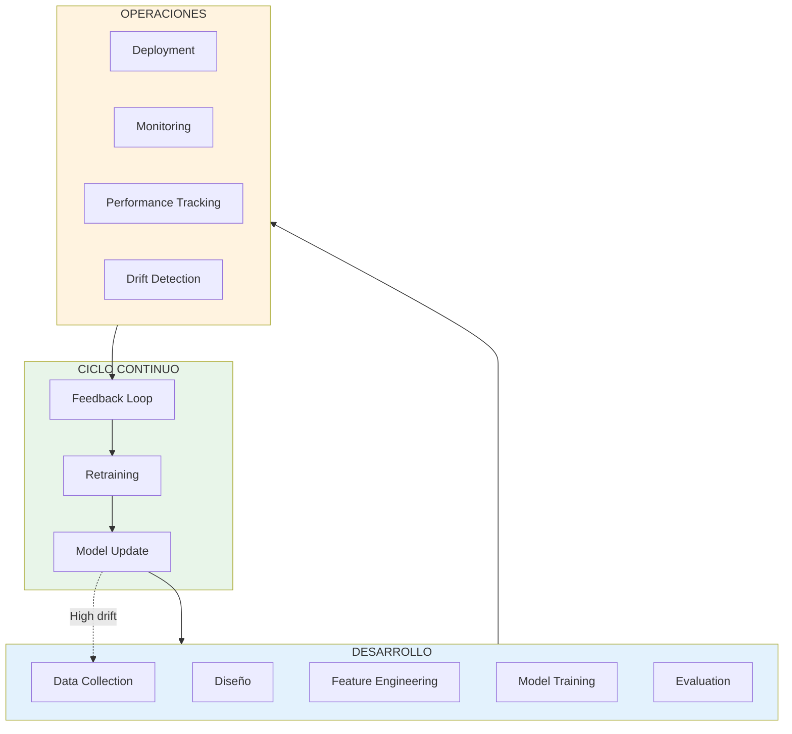
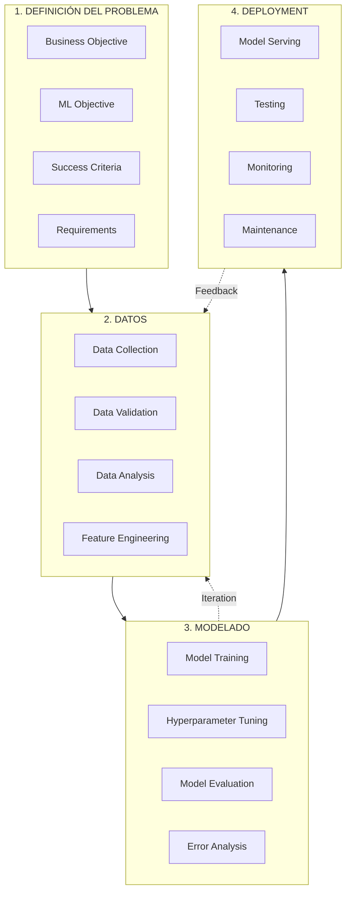
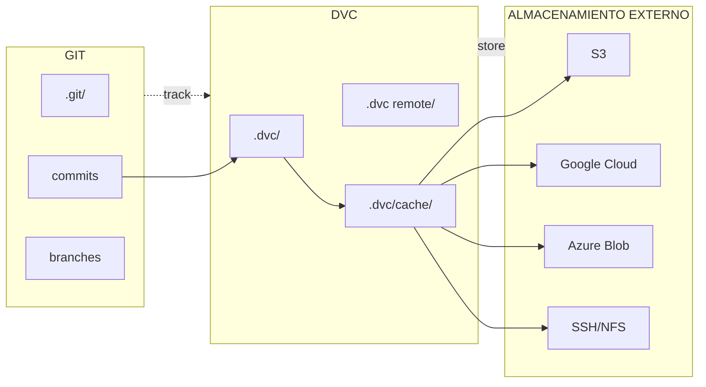
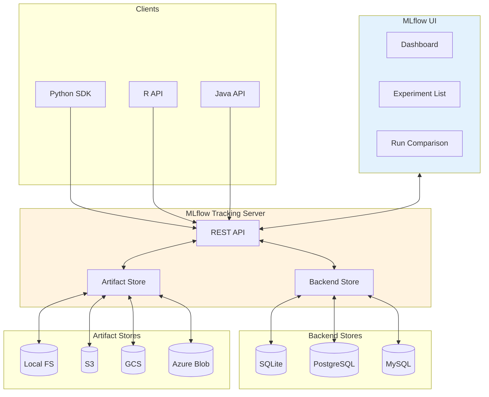
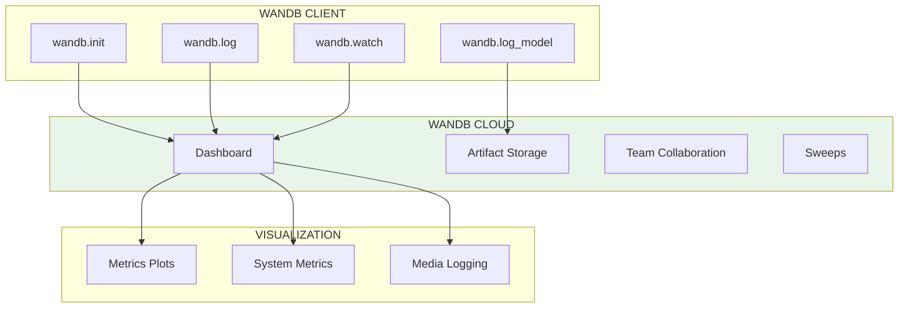
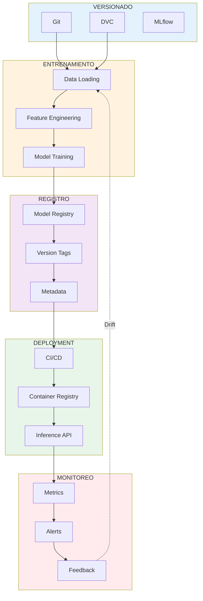

# Clase 3: MLOps - Fundamentos

## Duración
**4 horas (240 minutos)**

---

## Objetivos de Aprendizaje

Al finalizar esta clase, el estudiante será capaz de:

1. **Comprender** el ciclo de vida completo del Machine Learning
2. **Implementar** versionado de datos y modelos con DVC
3. **Configurar** experiment tracking con MLflow
4. **Diseñar** pipelines de ML reproducibles
5. **Automatizar** workflows de entrenamiento y despliegue
6. **Integrar** múltiples herramientas de MLOps en un sistema coherente

---

## Contenidos Detallados

### 3.1 Fundamentos de MLOps (45 minutos)

#### 3.1.1 ¿Qué es MLOps?

MLOps (Machine Learning Operations) es el conjunto de prácticas que busca automatizar y estandarizar el ciclo de vida de los modelos de machine learning, desde el desarrollo hasta la producción y mantenimiento.



#### 3.1.2 Diferencia entre DevOps y MLOps

```
┌─────────────────────────────────────────────────────────────────┐
│                        DEVOPS vs MLOps                          │
├─────────────────────────────────────────────────────────────────┤
│                                                                  │
│  DEVOPS                                                          │
│  ├── Código es el único artefacto                               │
│  ├── Reprodubile: Build → Test → Deploy                        │
│  ├── Entorno relativamente estático                             │
│  └── Cambios: Código + Config                                   │
│                                                                  │
│  MLOps                                                          │
│  ├── Código + Datos + Modelo son artefactos                     │
│  ├── Reprodubile: Data → Features → Train → Deploy              │
│  ├── Entorno dinámico (datos cambian)                           │
│  └── Cambios: Código + Datos + Modelo + Hiperparámetros        │
│                                                                  │
└─────────────────────────────────────────────────────────────────┘
```

#### 3.1.3 Niveles de MLOps

```mermaid
flowchart LR
    subgraph Level0["Level 0: Manual"]
        A1[Manual Training]
        A2[Manual Deploy]
        A3[Disconnected]
    end
    
    subgraph Level1["Level 1: CI/CD de ML"]
        B1[Automated Training]
        B2[Pipeline Triggers]
        B3[Model Registry]
        B4[Feature Store]
    end
    
    subgraph Level2["Level 2: Full AutoML"]
        C1[CI/CD Pipeline]
        C2[Auto Retrain]
        C3[Experiment Tracking]
        C4[A/B Testing]
        C5[Monitoring]
    end
    
    Level0 --> Level1 --> Level2
    
    style Level0 fill:#ffcdd2
    style Level1 fill:#fff9c4
    style Level2 fill:#c8e6c9
```



**Level 0: Manual (Startup)**
- Procesos 100% manuales
- Scripts de entrenamiento individuales
- Deployment manual
- Sin tracking de experimentos

**Level 1: ML Pipeline Automation (Medium)**
- Pipelines automatizados de entrenamiento
- Triggers basados en datos o schedules
- Model registry centralizado
- Feature store compartido

**Level 2: Full AutoML (Enterprise)**
- CI/CD completo para ML
- Auto-retraining basado en drift
- Experiment tracking automatizado
- A/B testing y canary deployments

### 3.2 Ciclo de Vida de Machine Learning (40 minutos)

#### 3.2.1 Fases del Ciclo de Vida



#### 3.2.2 Artefactos en el Ciclo de Vida

Cada fase produce artefactos que deben ser versionados:

```
📁 Proyecto ML
├── 📄 Datos/
│   ├── raw/                    # Datos originales (versionado con DVC)
│   ├── processed/              # Datos procesados
│   └── features/              # Features engineering
│
├── 📄 Código/
│   ├── preprocessing/          # Scripts de preprocesamiento
│   ├── training/              # Scripts de entrenamiento
│   ├── evaluation/           # Scripts de evaluación
│   └── serving/               # Scripts de deployment
│
├── 📄 Modelos/
│   ├── experiments/           # Logs de experimentos (MLflow)
│   ├── checkpoints/          # Puntos de control
│   └── production/            # Modelos en producción
│
└── 📄 Configs/
    ├── training.yaml          # Config de entrenamiento
    ├── model.yaml             # Config del modelo
    └── deployment.yaml        # Config de deployment
```

### 3.3 Versionado con DVC (50 minutos)

#### 3.3.1 Introducción a DVC

DVC (Data Version Control) es una herramienta de versionado diseñada específicamente para datos y modelos de ML. Funciona como git para datos.



#### 3.3.2 Instalación y Configuración

```bash
# Instalar DVC
pip install dvc

# Instalar con soporte para cloud
pip install 'dvc[s3]'        # AWS S3
pip install 'dvc[gs]'        # Google Cloud
pip install 'dvc[azure]'     # Azure
pip install 'dvc[ssh]'       # SSH

# Inicializar DVC en repositorio git
git init
dvc init

# Configurar remote storage
dvc remote add -d myremote s3://mybucket/data
dvc remote add -d myremote gs://mybucket/data
dvc remote add -d myremote /path/to/shared/storage

# Configurar credenciales
# AWS
aws configure
# Google Cloud
gcloud auth application-default login
```

#### 3.3.3 Versionado de Datos

```python
"""
Versionado de Datos con DVC
============================
Sistema completo de versionado de datos
"""

# COMANDOS DVC PARA DATA VERSIONING

"""
# 1. Añadir datos a DVC
dvc add data/raw/train.csv
dvc add data/images/train/

# 2. Esto crea archivos .dvc
# data/raw/train.csv.dvc
# data/images/train.dvc

# 3. Commit a git
git add data/raw/train.csv.dvc data/images/train.dvc
git commit -m "Added training data v1"

# 4. Push a remote storage
dvc push

# 5. En otra máquina:
git clone <repo>
git checkout <commit>
dvc pull
"""

# CÓDIGO PYTHON PARA AUTOMATIZAR

import subprocess
import os
from pathlib import Path
import hashlib

class DVCDataManager:
    """Gestor de datos con DVC"""
    
    def __init__(self, project_root=None):
        self.root = Path(project_root) if project_root else Path.cwd()
        self.data_dir = self.root / 'data'
        self.raw_dir = self.data_dir / 'raw'
        self.processed_dir = self.data_dir / 'processed'
        
    def add_dataset(self, data_path, name, stage='raw'):
        """
        Añade dataset a DVC tracking
        
        Args:
            data_path: Ruta al dataset
            name: Nombre del dataset
            stage: Stage del dato (raw, processed, features)
        """
        data_path = Path(data_path)
        
        if not data_path.exists():
            raise FileNotFoundError(f"Dataset not found: {data_path}")
        
        # Comando DVC
        cmd = ['dvc', 'add', str(data_path)]
        result = subprocess.run(cmd, capture_output=True, text=True)
        
        if result.returncode != 0:
            raise RuntimeError(f"DVC add failed: {result.stderr}")
        
        print(f"Dataset '{name}' tracked with DVC")
        
        # Guardar metadata
        self._save_metadata(name, data_path, stage)
        
        return True
    
    def _save_metadata(self, name, path, stage):
        """Guarda metadata del dataset"""
        import yaml
        
        meta = {
            'name': name,
            'path': str(path),
            'stage': stage,
            'git_commit': self._get_git_commit()
        }
        
        meta_file = self.data_dir / f'.{name}.meta.yaml'
        with open(meta_file, 'w') as f:
            yaml.dump(meta, f)
    
    def _get_git_commit(self):
        """Obtiene commit actual de git"""
        result = subprocess.run(
            ['git', 'rev-parse', 'HEAD'],
            capture_output=True, text=True
        )
        return result.stdout.strip()
    
    def checkout_version(self, data_path, version='HEAD'):
        """
        Recupera versión específica de datos
        
        Args:
            data_path: Ruta al archivo .dvc
            version: Commit git con la versión
        """
        # Checkout del commit específico
        subprocess.run(['git', 'checkout', version, '--', str(data_path) + '.dvc'])
        
        # Pull de los datos
        subprocess.run(['dvc', 'checkout', str(data_path) + '.dvc'])
        
        print(f"Checked out version: {version}")
    
    def get_data_hash(self, data_path):
        """Calcula hash MD5 del dataset"""
        hash_md5 = hashlib.md5()
        
        data_path = Path(data_path)
        
        if data_path.is_file():
            with open(data_path, 'rb') as f:
                for chunk in iter(lambda: f.read(4096), b""):
                    hash_md5.update(chunk)
        elif data_path.is_dir():
            for file in sorted(data_path.rglob('*')):
                if file.is_file():
                    with open(file, 'rb') as f:
                        for chunk in iter(lambda: f.read(4096), b""):
                            hash_md5.update(chunk)
        
        return hash_md5.hexdigest()
    
    def compare_versions(self, data_path, commit1, commit2):
        """Compara dos versiones de datos"""
        # Checkout commit 1
        subprocess.run(['git', 'checkout', commit1])
        hash1 = self.get_data_hash(data_path)
        
        # Checkout commit 2
        subprocess.run(['git', 'checkout', commit2])
        hash2 = self.get_data_hash(data_path)
        
        # Volver a HEAD
        subprocess.run(['git', 'checkout', 'HEAD'])
        
        return {
            'commit1': commit1,
            'commit2': commit2,
            'hash1': hash1,
            'hash2': hash2,
            'data_changed': hash1 != hash2
        }
    
    def push_to_remote(self):
        """Sube datos a remote storage"""
        subprocess.run(['dvc', 'push', '-r', 'myremote'])
        print("Data pushed to remote storage")
    
    def pull_from_remote(self):
        """Descarga datos desde remote storage"""
        subprocess.run(['dvc', 'pull', '-r', 'myremote'])
        print("Data pulled from remote storage")


# EJEMPLO DE USO
if __name__ == "__main__":
    manager = DVCDataManager()
    
    # Trackear dataset de entrenamiento
    manager.add_dataset(
        data_path='data/raw/train',
        name='train_images',
        stage='raw'
    )
    
    # Verificar hash
    hash_val = manager.get_data_hash('data/raw/train')
    print(f"Data hash: {hash_val}")
```

#### 3.3.4 Pipelines con DVC

```yaml
# dvc.yaml - Define pipeline de ML
# Este archivo define las etapas del pipeline

stages:
  preprocess:
    cmd: python src/preprocess.py
    deps:
      - data/raw/train
      - src/preprocess.py
    params:
      - preprocessing.image_size
      - preprocessing.augmentation
    outs:
      - data/processed/train_prep
    metrics:
      - metrics/preprocess.json:
          cache: false

  train:
    cmd: python src/train.py
    deps:
      - data/processed/train_prep
      - src/train.py
    params:
      - model.type
      - training.epochs
      - training.lr
    outs:
      - models/checkpoint.pt
    metrics:
      - metrics/train.json:
          cache: false
    plots:
      - logs/training_curves.csv:
          x: epoch
          y:
            - loss
            - accuracy

  evaluate:
    cmd: python src/evaluate.py
    deps:
      - models/checkpoint.pt
      - data/processed/test
      - src/evaluate.py
    outs:
      - metrics/test_results.json
    metrics:
      - metrics/test.json:
          cache: false
    plots:
      - plots/confusion_matrix.png
```

```python
# src/preprocess.py - Ejemplo de etapa de preprocessing
"""
Preprocessing Pipeline Stage
=============================
Ejemplo de script para usar en DVC pipeline
"""

import argparse
import json
from pathlib import Path
import numpy as np
from PIL import Image
from tqdm import tqdm

def preprocess_images(input_dir, output_dir, image_size=640, augment=False):
    """Preprocesa imágenes para entrenamiento"""
    
    input_path = Path(input_dir)
    output_path = Path(output_dir)
    output_path.mkdir(parents=True, exist_ok=True)
    
    processed = 0
    
    for img_file in tqdm(list(input_path.glob('*.jpg'))):
        # Cargar imagen
        img = Image.open(img_file)
        
        # Redimensionar
        img = img.resize((image_size, image_size), Image.LANCZOS)
        
        # Guardar
        output_file = output_path / img_file.name
        img.save(output_file, quality=95)
        
        processed += 1
    
    # Guardar métricas
    metrics = {
        'processed_images': processed,
        'input_dir': str(input_dir),
        'output_dir': str(output_dir),
        'image_size': image_size,
        'augmentation': augment
    }
    
    metrics_file = output_path.parent.parent / 'metrics' / 'preprocess.json'
    metrics_file.parent.mkdir(parents=True, exist_ok=True)
    
    with open(metrics_file, 'w') as f:
        json.dump(metrics, f, indent=2)
    
    print(f"Preprocessed {processed} images")
    return metrics


if __name__ == "__main__":
    parser = argparse.ArgumentParser()
    parser.add_argument('--input', type=str, required=True)
    parser.add_argument('--output', type=str, required=True)
    parser.add_argument('--size', type=int, default=640)
    parser.add_argument('--augment', action='store_true')
    
    args = parser.parse_args()
    
    preprocess_images(
        args.input,
        args.output,
        args.size,
        args.augment
    )
```

### 3.4 Experiment Tracking con MLflow (55 minutos)

#### 3.4.1 Arquitectura de MLflow



#### 3.4.2 MLflow Tracking en Profundidad

```python
"""
MLflow Experiment Tracking
===========================
Sistema completo de tracking de experimentos
"""

import mlflow
from mlflow.tracking import MlflowClient
from mlflow.models import infer_signature
import numpy as np
import pandas as pd
from pathlib import Path
from datetime import datetime
import json

class MLflowExperimentTracker:
    """
    Sistema de tracking de experimentos con MLflow
    Soporta experimentos anidados, búsqueda y registro de modelos
    """
    
    def __init__(self, tracking_uri=None, experiment_name=None):
        """
        Inicializa el tracker
        
        Args:
            tracking_uri: URI del servidor MLflow
            experiment_name: Nombre del experimento
        """
        if tracking_uri:
            mlflow.set_tracking_uri(tracking_uri)
        
        if experiment_name:
            mlflow.set_experiment(experiment_name)
        
        self.client = MlflowClient()
        
    def start_run(self, name=None, nested=False, tags=None):
        """
        Inicia un run de experiment
        
        Args:
            name: Nombre del run
            nested: Permite runs anidados
            tags: Tags adicionales
        """
        if nested:
            mlflow.start_run(nested=True, run_name=name)
        else:
            mlflow.start_run(run_name=name)
        
        if tags:
            for key, value in tags.items():
                mlflow.set_tag(key, value)
        
        return mlflow.active_run()
    
    def log_params(self, params):
        """Loggear parámetros"""
        if isinstance(params, dict):
            mlflow.log_params(params)
        else:
            for key, value in params:
                mlflow.log_param(key, value)
    
    def log_metrics(self, metrics, step=None):
        """
        Loggear métricas
        
        Args:
            metrics: Diccionario de métricas
            step: Step de entrenamiento (para series temporales)
        """
        for name, value in metrics.items():
            mlflow.log_metric(name, value, step=step)
    
    def log_metrics_batch(self, metrics_dict):
        """Loggear múltiples métricas en un paso"""
        mlflow.log_metrics(metrics_dict)
    
    def log_artifacts(self, local_path, artifact_path=None):
        """
        Loggear artefactos (archivos, modelos, imágenes)
        
        Args:
            local_path: Ruta local del artefacto
            artifact_path: Ruta en MLflow artifact store
        """
        mlflow.log_artifact(local_path, artifact_path)
    
    def log_model(self, model, name, signature=None, input_example=None):
        """
        Loggear modelo de ML
        
        Args:
            model: Modelo entrenado
            name: Nombre del modelo
            signature: Firma del modelo (input/output)
            input_example: Ejemplo de input
        """
        mlflow.sklearn.log_model(
            sk_model=model,
            artifact_path=name,
            signature=signature,
            input_example=input_example
        )
    
    def end_run(self, status='SUCCESS'):
        """Terminar el run"""
        mlflow.end_run(status=status)


class YOLOMLflowIntegration:
    """Integración de YOLO con MLflow"""
    
    def __init__(self, experiment_name='yolo_experiments'):
        self.tracker = MLflowExperimentTracker(
            experiment_name=experiment_name
        )
        from ultralytics import YOLO
        self.YOLO = YOLO
        
    def train_with_tracking(self, config):
        """
        Entrena YOLO con tracking completo
        
        Args:
            config: Diccionario con configuración
        """
        self.tracker.start_run(
            name=f"train_{config['model']}_{datetime.now().strftime('%Y%m%d_%H%M%S')}",
            tags={
                'project': config.get('project', 'unknown'),
                'model_type': 'yolo'
            }
        )
        
        try:
            # Loggear configuración
            self.tracker.log_params({
                'model': config['model'],
                'epochs': config['epochs'],
                'batch_size': config['batch_size'],
                'image_size': config.get('imgsz', 640),
                'learning_rate': config.get('lr0', 0.001),
                'optimizer': config.get('optimizer', 'AdamW'),
                'dataset': config.get('dataset', 'unknown'),
                'patience': config.get('patience', 50)
            })
            
            # Entrenar modelo
            model = self.YOLO(config['model'])
            
            results = model.train(
                data=config['data_yaml'],
                epochs=config['epochs'],
                batch=config['batch_size'],
                imgsz=config.get('imgsz', 640),
                lr0=config.get('lr0', 0.001),
                optimizer=config.get('optimizer', 'AdamW'),
                patience=config.get('patience', 50),
                verbose=False
            )
            
            # Loggear métricas
            metrics = {
                'mAP50': results.results_dict.get('metrics/mAP50(B)', 0),
                'mAP50-95': results.results_dict.get('metrics/mAP50-95(B)', 0),
                'precision': results.results_dict.get('metrics/precision(B)', 0),
                'recall': results.results_dict.get('metrics/recall(B)', 0),
                'best_fitness': results.best_fitness
            }
            
            self.tracker.log_metrics(metrics)
            
            # Loggear artefactos
            model_path = f"runs/detect/{results.save_dir}/weights/best.pt"
            self.tracker.log_artifacts(f"runs/detect/{results.save_dir}", "training_outputs")
            
            # Loggear mejores gráficos
            if Path('results.png').exists():
                self.tracker.log_artifacts('results.png', 'plots')
            
            # Registrar modelo
            self.register_model(
                model_path=model_path,
                name=config.get('model_name', 'yolo_detector'),
                metrics=metrics
            )
            
            self.tracker.end_run(status='SUCCESS')
            
            return metrics
            
        except Exception as e:
            self.tracker.end_run(status='FAILED')
            mlflow.log_param('error', str(e))
            raise


# EJEMPLO DE USO
if __name__ == "__main__":
    # Inicializar tracker
    tracker = MLflowExperimentTracker(
        tracking_uri="http://localhost:5000",
        experiment_name="defect_detection"
    )
    
    # Experimento de entrenamiento
    config = {
        'model': 'yolov8m.pt',
        'data_yaml': 'dataset.yaml',
        'epochs': 100,
        'batch_size': 16,
        'imgsz': 640,
        'lr0': 0.001,
        'optimizer': 'AdamW',
        'patience': 30,
        'project': 'quality_control',
        'model_name': 'defect_detector'
    }
    
    yolo_tracker = YOLOMLflowIntegration()
    metrics = yolo_tracker.train_with_tracking(config)
    
    print(f"Training completed!")
    print(f"  mAP50: {metrics['mAP50']:.3f}")
    print(f"  mAP50-95: {metrics['mAP50-95']:.3f}")
```

#### 3.4.3 Búsqueda y Análisis de Experimentos

```python
"""
Búsqueda y Análisis de Experimentos
====================================
Herramientas para analizar resultados de MLflow
"""

import mlflow
from mlflow.tracking import MlflowClient
import pandas as pd
import numpy as np

class ExperimentAnalyzer:
    """Analizador de experimentos MLflow"""
    
    def __init__(self, tracking_uri=None):
        if tracking_uri:
            mlflow.set_tracking_uri(tracking_uri)
        self.client = MlflowClient()
    
    def get_experiment(self, experiment_name):
        """Obtiene experimento por nombre"""
        return self.client.get_experiment_by_name(experiment_name)
    
    def search_runs(self, experiment_name, filter_string=None, 
                   order_by=None, max_results=100):
        """
        Busca runs según criterios
        
        Args:
            experiment_name: Nombre del experimento
            filter_string: Filtro en formato MLflow (ej: "metrics.mAP50 > 0.8")
            order_by: Ordenar por (ej: "metrics.mAP50 DESC")
            max_results: Máximo número de resultados
        """
        exp = self.get_experiment(experiment_name)
        
        runs = self.client.search_runs(
            experiment_ids=[exp.experiment_id],
            filter_string=filter_string,
            order_by=order_by,
            max_results=max_results
        )
        
        return runs
    
    def runs_to_dataframe(self, runs):
        """Convierte runs a DataFrame para análisis"""
        data = []
        
        for run in runs:
            row = {
                'run_id': run.info.run_id,
                'run_name': run.info.run_name,
                'status': run.info.status,
                'start_time': run.info.start_time,
                'end_time': run.info.end_time,
                'duration_ms': run.info.end_time - run.info.start_time
            }
            
            # Métricas
            for key, val in run.data.metrics.items():
                row[f'metric_{key}'] = val
            
            # Parámetros
            for key, val in run.data.params.items():
                row[f'param_{key}'] = val
            
            # Tags
            for key, val in run.data.tags.items():
                row[f'tag_{key}'] = val
            
            data.append(row)
        
        return pd.DataFrame(data)
    
    def compare_experiments(self, experiment_names, metric_name='mAP50'):
        """Compara métricas entre experimentos"""
        results = {}
        
        for exp_name in experiment_names:
            runs = self.search_runs(exp_name)
            
            metric_key = f'metric_{metric_name}'
            metrics = [r.data.metrics.get(metric_name, 0) for r in runs]
            
            results[exp_name] = {
                'runs': len(runs),
                'mean': np.mean(metrics) if metrics else 0,
                'std': np.std(metrics) if metrics else 0,
                'max': np.max(metrics) if metrics else 0,
                'min': np.min(metrics) if metrics else 0
            }
        
        return pd.DataFrame(results).T
    
    def get_best_run(self, experiment_name, metric_name, direction='max'):
        """Obtiene el mejor run según métrica"""
        order_by = f'metrics.{metric_name} DESC' if direction == 'max' else f'metrics.{metric_name} ASC'
        
        runs = self.search_runs(
            experiment_name,
            order_by=order_by,
            max_results=1
        )
        
        return runs[0] if runs else None
    
    def analyze_hyperparameters(self, experiment_name):
        """Analiza impacto de hiperparámetros"""
        runs = self.search_runs(experiment_name)
        df = self.runs_to_dataframe(runs)
        
        # Filtrar columnas de parámetros y métricas
        param_cols = [c for c in df.columns if c.startswith('param_')]
        metric_cols = [c for c in df.columns if c.startswith('metric_') and 'mAP' in c]
        
        if not param_cols or not metric_cols:
            return None
        
        # Calcular correlaciones
        analysis = {}
        
        for param in param_cols:
            for metric in metric_cols:
                corr = df[param].astype(str).astype(float).corr(
                    df[metric].astype(float)
                )
                analysis[f'{param}_vs_{metric}'] = corr
        
        return analysis
    
    def get_run_artifacts(self, experiment_name, run_id, artifact_path=None):
        """Descarga artefactos de un run específico"""
        exp = self.get_experiment(experiment_name)
        
        artifacts = self.client.list_artifacts(
            run_id=run_id,
            path=artifact_path
        )
        
        return artifacts
    
    def download_model(self, experiment_name, run_id, output_path):
        """Descarga modelo de un run"""
        artifacts = self.get_run_artifacts(experiment_name, run_id, 'model')
        
        if artifacts:
            self.client.download_artifacts(
                run_id=run_id,
                path='model',
                dst_path=output_path
            )
            print(f"Model downloaded to: {output_path}")


# EJEMPLO DE USO
if __name__ == "__main__":
    analyzer = ExperimentAnalyzer(tracking_uri="http://localhost:5000")
    
    # Buscar mejores runs
    best_run = analyzer.get_best_run(
        experiment_name="defect_detection",
        metric_name="mAP50",
        direction="max"
    )
    
    if best_run:
        print(f"Best Run: {best_run.info.run_name}")
        print(f"  mAP50: {best_run.data.metrics.get('mAP50', 0):.4f}")
        print(f"  mAP50-95: {best_run.data.metrics.get('mAP50-95', 0):.4f}")
        print(f"  Model: {best_run.data.params.get('model', 'unknown')}")
        print(f"  Epochs: {best_run.data.params.get('epochs', 'unknown')}")
    
    # Comparar experimentos
    comparison = analyzer.compare_experiments(
        experiment_names=["defect_detection", "quality_control"],
        metric_name="mAP50"
    )
    print("\nExperiment Comparison:")
    print(comparison)
    
    # Análisis de hiperparámetros
    hp_analysis = analyzer.analyze_hyperparameters("defect_detection")
    print("\nHyperparameter Correlations:")
    for key, value in sorted(hp_analysis.items(), key=lambda x: abs(x[1]), reverse=True)[:10]:
        print(f"  {key}: {value:.3f}")
```

### 3.5 Weights & Biases (W&B) (30 minutos)

#### 3.5.1 Introducción a W&B



#### 3.5.2 Integración con YOLO

```python
"""
Weights & Biases Integration
==============================
Tracking con W&B
"""

import wandb
from ultralytics import YOLO
import os

# Inicializar W&B
wandb.login(key='your-api-key')  # O configurar en entorno

def train_with_wandb():
    """Entrena con logging automático a W&B"""
    
    # Inicializar proyecto
    run = wandb.init(
        project="yolo-detection",
        entity="your-team",
        name="experiment-001",
        notes="Baseline training",
        tags=["baseline", "v1"]
    )
    
    # Configuración
    config = wandb.config
    config.model = "yolov8m.pt"
    config.data_yaml = "dataset.yaml"
    config.epochs = 100
    config.batch_size = 16
    config.imgsz = 640
    config.lr0 = 0.001
    config.optimizer = "AdamW"
    
    # Entrenar
    model = YOLO(config.model)
    
    results = model.train(
        data=config.data_yaml,
        epochs=config.epochs,
        batch=config.batch_size,
        imgsz=config.imgsz,
        lr0=config.lr0,
        optimizer=config.optimizer,
        project="runs/wandb",
        name="train",
        exist_ok=True,
        verbose=False
    )
    
    # Loggear métricas manualmente
    for epoch, metrics in enumerate(results):
        wandb.log({
            'epoch': epoch,
            'mAP50': metrics.get('metrics/mAP50(B)', 0),
            'mAP50-95': metrics.get('metrics/mAP50-95(B)', 0),
            'loss': metrics.get('loss', 0)
        })
    
    # Loggear modelo
    wandb.run.log_model(
        path="runs/wandb/train/weights/best.pt",
        name="yolo_model"
    )
    
    # Finalizar
    wandb.finish()
    
    return results


# Uso de Sweeps para hyperparameter search
def create_sweep():
    """Crea un sweep para búsqueda de hiperparámetros"""
    
    sweep_config = {
        'method': 'bayes',
        'metric': {'name': 'mAP50', 'goal': 'maximize'},
        'parameters': {
            'learning_rate': {'min': 0.0001, 'max': 0.01},
            'batch_size': {'values': [8, 16, 32]},
            'optimizer': {'values': ['AdamW', 'SGD', 'RMSprop']},
            'weight_decay': {'min': 0.0001, 'max': 0.001}
        }
    }
    
    sweep_id = wandb.sweep(sweep_config, project="yolo-optimization")
    
    def train_sweep():
        with wandb.init() as run:
            model = YOLO('yolov8m.pt')
            
            config = wandb.config
            
            model.train(
                data='dataset.yaml',
                epochs=50,
                batch=config.batch_size,
                lr0=config.learning_rate,
                optimizer=config.optimizer,
                weight_decay=config.weight_decay,
                verbose=False
            )
    
    wandb.agent(sweep_id, train_sweep, count=20)


if __name__ == "__main__":
    train_with_wandb()
```

### 3.6 Pipeline Completo de MLOps (20 minutos)

#### 3.6.1 Integración de Herramientas



#### 3.6.2 Makefile para Automatización

```makefile
# Makefile para automatización MLOps
# Simplifica comandos comunes

.PHONY: setup train test deploy clean

# Variables
PYTHON := python3
PIP := pip
DATA_DIR := data
MODEL_DIR := models
EXPERIMENT := defect_detector

# Setup
setup:
	@echo "Setting up environment..."
	$(PYTHON) -m venv venv
	./venv/bin/pip install -r requirements.txt
	dvc init
	git add . && git commit -m "Initialize project"

# Datos
data:
	@echo "Processing data..."
	dvc repro preprocess

data-pull:
	dvc pull

data-push:
	dvc push

# Entrenamiento
train:
	@echo "Training model..."
	mlflow run --entry-point train -P epochs=100 -P batch_size=16

train-wandb:
	@echo "Training with W&B..."
	$(PYTHON) train_wandb.py

tune:
	@echo "Hyperparameter tuning..."
	wandb sweep sweep_config.yaml
	wandb agent $(SWEEP_ID)

# Evaluación
evaluate:
	@echo "Evaluating model..."
	$(PYTHON) evaluate.py --model $(MODEL_DIR)/best.pt

compare:
	@echo "Comparing experiments..."
	$(PYTHON) compare_experiments.py

# Deployment
package:
	@echo "Packaging model..."
	docker build -t $(EXPERIMENT):$(VERSION) .

deploy:
	@echo "Deploying to production..."
	kubectl apply -f deployment.yaml

# Limpieza
clean:
	@echo "Cleaning up..."
	rm -rf venv
	rm -rf __pycache__
	rm -rf .pytest_cache
	rm -rf runs/*
	rm -rf *.egg-info
	find . -type d -name "*.egg-info" -exec rm -rf {} +

# Help
help:
	@echo "Available targets:"
	@echo "  setup      - Initialize project and dependencies"
	@echo "  data       - Process and version data"
	@echo "  train      - Train model with MLflow tracking"
	@echo "  evaluate   - Evaluate model performance"
	@echo "  deploy     - Deploy model to production"
	@echo "  clean      - Clean temporary files"
```

---

## Tecnologías y Herramientas Específicas

| Herramienta | Versión | Propósito |
|------------|---------|-----------|
| Git | 2.40+ | Versionado de código |
| DVC | 2.x | Versionado de datos |
| MLflow | 2.x | Experiment tracking |
| W&B | 0.15+ | Tracking alternativo |
| Docker | 24.x | Contenerización |
| Make | 4.4+ | Automatización |
| Python | 3.8+ | Lenguaje |

### Instalación de Dependencias

```bash
# DVC
pip install dvc
pip install 'dvc[s3]'  # Para AWS S3
pip install 'dvc[gs]'  # Para Google Cloud

# MLflow
pip install mlflow>=2.0.0
pip install sklearn  # Para log_model

# W&B
pip install wandb

# Docker
pip install docker
```

---

## Actividades de Laboratorio

### Laboratorio 3.1: Configuración de MLOps Stack

```python
"""
Laboratorio 3.1: Setup completo de MLOps
=========================================
Configurar Git + DVC + MLflow
"""

import subprocess
import os
from pathlib import Path

class MLOpsSetup:
    """Configura stack completo de MLOps"""
    
    def __init__(self, project_name):
        self.project_name = project_name
        self.project_dir = Path(project_name)
        
    def create_structure(self):
        """Crea estructura de proyecto"""
        directories = [
            'data/raw',
            'data/processed',
            'data/features',
            'models',
            'src/preprocessing',
            'src/training',
            'src/evaluation',
            'src/deployment',
            'notebooks',
            'tests',
            'configs',
            'metrics',
            'logs'
        ]
        
        for d in directories:
            (self.project_dir / d).mkdir(parents=True, exist_ok=True)
        
        print(f"Project structure created in: {self.project_dir}")
        
    def init_git(self):
        """Inicializa repositorio git"""
        subprocess.run(['git', 'init'], check=True, cwd=self.project_dir)
        subprocess.run(
            ['git', 'config', 'user.email', 'mlops@example.com'],
            check=True, cwd=self.project_dir
        )
        subprocess.run(
            ['git', 'config', 'user.name', 'MLOps System'],
            check=True, cwd=self.project_dir
        )
        print("Git initialized")
        
    def init_dvc(self):
        """Inicializa DVC"""
        subprocess.run(['dvc', 'init'], check=True, cwd=self.project_dir)
        print("DVC initialized")
        
    def setup_mlflow(self):
        """Crea configuración de MLflow"""
        mlflow_config = """
[mlflow]
artifact_root = s3://mlflow-artifacts/
tracking_uri = http://localhost:5000
"""
        
        config_file = self.project_dir / 'mlflow_config.txt'
        with open(config_file, 'w') as f:
            f.write(mlflow_config)
        
        print("MLflow configuration created")
        
    def create_gitignore(self):
        """Crea .gitignore"""
        gitignore = """
# Python
__pycache__/
*.py[cod]
*$py.class
venv/
*.egg-info/

# Data (tracked by DVC)
data/raw/
data/processed/
data/features/

# Models
models/*.pt
models/*.onnx
*.h5

# ML
runs/
logs/
*.log

# IDE
.vscode/
.idea/

# OS
.DS_Store
Thumbs.db
"""
        
        gitignore_file = self.project_dir / '.gitignore'
        with open(gitignore_file, 'w') as f:
            f.write(gitignore)
        
        print(".gitignore created")
        
    def run(self):
        """Ejecuta setup completo"""
        self.create_structure()
        self.init_git()
        self.init_dvc()
        self.setup_mlflow()
        self.create_gitignore()
        
        # Commit inicial
        subprocess.run(
            ['git', 'add', '.'],
            check=True, cwd=self.project_dir
        )
        subprocess.run(
            ['git', 'commit', '-m', 'Initial project structure with MLOps setup'],
            check=True, cwd=self.project_dir
        )
        
        print("\n" + "="*50)
        print(f"MLOps project '{self.project_name}' ready!")
        print("="*50)


if __name__ == "__main__":
    setup = MLOpsSetup('mlops_project')
    setup.run()
```

### Laboratorio 3.2: Pipeline de Entrenamiento Completo

```python
"""
Laboratorio 3.2: Pipeline de Entrenamiento con Tracking
========================================================
Pipeline completo con DVC + MLflow
"""

import mlflow
from mlflow.tracking import MlflowClient
from ultralytics import YOLO
import subprocess
import yaml
from pathlib import Path
import json
from datetime import datetime

class TrainingPipeline:
    """Pipeline de entrenamiento con MLOps"""
    
    def __init__(self, config_path):
        with open(config_path) as f:
            self.config = yaml.safe_load(f)
        
        mlflow.set_tracking_uri(self.config.get('mlflow_uri', 'http://localhost:5000'))
        mlflow.set_experiment(self.config['experiment_name'])
        
    def run_preprocessing(self):
        """Ejecuta etapa de preprocesamiento"""
        print("Step 1: Preprocessing...")
        
        subprocess.run([
            'python', 'src/preprocessing/preprocess.py',
            '--input', self.config['data']['raw'],
            '--output', self.config['data']['processed'],
            '--size', str(self.config['preprocessing']['image_size'])
        ])
        
        # Track datos con DVC
        subprocess.run(['dvc', 'add', self.config['data']['processed']])
        
        return True
    
    def run_training(self):
        """Ejecuta etapa de entrenamiento"""
        print("Step 2: Training...")
        
        with mlflow.start_run(run_name=f"run_{datetime.now().strftime('%Y%m%d_%H%M%S')}"):
            # Log parámetros
            mlflow.log_params({
                'model': self.config['model']['name'],
                'epochs': self.config['training']['epochs'],
                'batch_size': self.config['training']['batch_size'],
                'lr': self.config['training']['learning_rate'],
                'optimizer': self.config['training']['optimizer']
            })
            
            # Entrenar
            model = YOLO(self.config['model']['name'])
            
            results = model.train(
                data=self.config['data']['yaml'],
                epochs=self.config['training']['epochs'],
                batch=self.config['training']['batch_size'],
                imgsz=self.config['training']['image_size'],
                lr0=self.config['training']['learning_rate'],
                optimizer=self.config['training']['optimizer'],
                project=self.config['paths']['output_dir'],
                name='train',
                exist_ok=True,
                verbose=False
            )
            
            # Log métricas
            metrics = {
                'mAP50': results.results_dict.get('metrics/mAP50(B)', 0),
                'mAP50-95': results.results_dict.get('metrics/mAP50-95(B)', 0),
                'precision': results.results_dict.get('metrics/precision(B)', 0),
                'recall': results.results_dict.get('metrics/recall(B)', 0)
            }
            
            mlflow.log_metrics(metrics)
            
            # Log modelo
            model_path = f"{self.config['paths']['output_dir']}/train/weights/best.pt"
            mlflow.pytorch.log_model(model, "model")
            
            # Log artefactos
            mlflow.log_artifact('results.png')
            mlflow.log_artifact('confusion_matrix.png')
            
            return metrics, model_path
    
    def run_evaluation(self, model_path):
        """Ejecuta evaluación"""
        print("Step 3: Evaluation...")
        
        model = YOLO(model_path)
        metrics = model.val(data=self.config['data']['yaml'])
        
        # Guardar métricas
        eval_metrics = {
            'test_mAP50': float(metrics.box.map50),
            'test_mAP50-95': float(metrics.box.map),
            'test_precision': float(metrics.box.mp),
            'test_recall': float(metrics.box.mr)
        }
        
        metrics_file = Path(self.config['paths']['output_dir']) / 'evaluation.json'
        with open(metrics_file, 'w') as f:
            json.dump(eval_metrics, f, indent=2)
        
        mlflow.log_metrics(eval_metrics)
        
        return eval_metrics
    
    def execute(self):
        """Ejecuta pipeline completo"""
        print("="*50)
        print("EXECUTING ML PIPELINE")
        print("="*50)
        
        try:
            # Preprocessing
            self.run_preprocessing()
            
            # Training
            metrics, model_path = self.run_training()
            print(f"\nTraining Results:")
            print(f"  mAP50: {metrics['mAP50']:.4f}")
            print(f"  mAP50-95: {metrics['mAP50-95']:.4f}")
            
            # Evaluation
            eval_metrics = self.run_evaluation(model_path)
            print(f"\nEvaluation Results:")
            print(f"  mAP50: {eval_metrics['test_mAP50']:.4f}")
            
            print("\n" + "="*50)
            print("PIPELINE COMPLETED SUCCESSFULLY")
            print("="*50)
            
        except Exception as e:
            print(f"\nERROR: Pipeline failed - {str(e)}")
            raise


if __name__ == "__main__":
    pipeline = TrainingPipeline('configs/training_config.yaml')
    pipeline.execute()
```

---

## Resumen de Puntos Clave

### MLOps Fundamentals
1. **MLOps**: Prácticas para automatizar ciclo de vida de ML
2. **Niveles**: Desde manual hasta Full AutoML
3. **Artefactos**: Código, datos, modelos y configuraciones

### Versionado con DVC
1. **Git para datos**: DVC versiona datos como git versiona código
2. **Remote storage**: S3, GCS, Azure para almacenar datos grandes
3. **Pipelines**: DAG de etapas con dependencias

### Experiment Tracking
1. **MLflow**: Open source, múltiples backends
2. **W&B**: Commercial con features avanzadas
3. **Logging**: Parámetros, métricas, artefactos

### Integración
1. **Makefiles**: Automatización de comandos
2. **CI/CD**: Integración continua para ML
3. **Reproducibilidad**: Clave para MLOps exitoso

---

## Referencias Externas

1. **Google MLOps Guidelines**
   - URL: https://cloud.google.com/architecture/mlops-continuous-delivery-and-automation-pipelines-in-machine-learning
   - Descripción: Best practices de Google para MLOps

2. **DVC Documentation**
   - URL: https://dvc.org/doc
   - Descripción: Documentación oficial de DVC

3. **MLflow Documentation**
   - URL: https://mlflow.org/docs/latest/index.html
   - Descripción: Documentación completa de MLflow

4. **Weights & Biases Documentation**
   - URL: https://docs.wandb.ai/
   - Descripción: Documentación de W&B

5. **MLOps Maturity Model**
   - URL: https://docs.microsoft.com/en-us/azure/architecture/example-scenario/mlops/mlops-maturity-model
   - Descripción: Modelo de madurez de MLOps de Microsoft

6. **Made With ML - MLOps Course**
   - URL: https://madewithml.com/
   - Descripción: Curso práctico de MLOps

7. **MLflow GitHub Examples**
   - URL: https://github.com/mlflow/mlflow
   - Descripción: Ejemplos oficiales de MLflow

8. **DVC Getting Started**
   - URL: https://dvc.org/doc/start
   - Descripción: Tutorial de inicio de DVC

---

## Ejercicios Resueltos

### Ejercicio 1: Sistema de Versionado Completo

**Enunciado:** Implementa un sistema que versione automáticamente datos, modelos y código, permitiendo rollback a cualquier versión.

```python
"""
EJERCICIO RESUELTO: Sistema de Versionado Completo
====================================================
Sistema que versiona automáticamente el pipeline de ML
"""

import subprocess
import json
import hashlib
from pathlib import Path
from datetime import datetime
import shutil

class VersionControlSystem:
    """
    Sistema completo de versionado para ML
    Combina Git + DVC + MLflow
    """
    
    def __init__(self, project_root, remote_storage=None):
        self.project_root = Path(project_root)
        self.remote_storage = remote_storage
        self.versions_file = self.project_root / '.versions.json'
        
        if self.versions_file.exists():
            with open(self.versions_file) as f:
                self.versions = json.load(f)
        else:
            self.versions = []
    
    def compute_data_hash(self, data_path):
        """Calcula hash de datos"""
        data_path = Path(data_path)
        hash_obj = hashlib.sha256()
        
        if data_path.is_file():
            with open(data_path, 'rb') as f:
                for chunk in iter(lambda: f.read(8192), b''):
                    hash_obj.update(chunk)
        elif data_path.is_dir():
            for file in sorted(data_path.rglob('*')):
                if file.is_file():
                    hash_obj.update(str(file.relative_to(data_path)).encode())
                    with open(file, 'rb') as f:
                        for chunk in iter(lambda: f.read(8192), b''):
                            hash_obj.update(chunk)
        
        return hash_obj.hexdigest()[:16]
    
    def compute_code_hash(self):
        """Calcula hash del código fuente"""
        code_dirs = ['src', 'configs']
        hash_obj = hashlib.sha256()
        
        for code_dir in code_dirs:
            dir_path = self.project_root / code_dir
            if dir_path.exists():
                for file in sorted(dir_path.rglob('*.py')):
                    with open(file, 'rb') as f:
                        hash_obj.update(f.read())
        
        return hash_obj.hexdigest()[:16]
    
    def create_version(self, description, tags=None):
        """
        Crea una nueva versión del pipeline
        
        Args:
            description: Descripción de cambios
            tags: Tags opcionales (e.g., 'baseline', 'production')
        """
        # Obtener información de git
        git_hash = subprocess.run(
            ['git', 'rev-parse', 'HEAD'],
            capture_output=True, text=True, cwd=self.project_root
        ).stdout.strip()[:8]
        
        # Calcular hashes
        data_hash = self.compute_data_hash(self.project_root / 'data')
        code_hash = self.compute_code_hash()
        
        version = {
            'version': len(self.versions) + 1,
            'git_hash': git_hash,
            'data_hash': data_hash,
            'code_hash': code_hash,
            'description': description,
            'tags': tags or [],
            'timestamp': datetime.now().isoformat(),
            'artifacts': {
                'data': [],
                'models': []
            }
        }
        
        # Guardar artefactos de datos
        for dvc_file in self.project_root.rglob('*.dvc'):
            version['artifacts']['data'].append(str(dvc_file))
        
        # Guardar modelos
        models_dir = self.project_root / 'models'
        if models_dir.exists():
            for model in models_dir.glob('**/*.pt'):
                version['artifacts']['models'].append(str(model.relative_to(self.project_root)))
        
        # Guardar versión
        self.versions.append(version)
        self._save_versions()
        
        # Commit a git
        subprocess.run(['git', 'add', '.'], cwd=self.project_root)
        subprocess.run([
            'git', 'commit', '-m', 
            f"Version {version['version']}: {description}"
        ], cwd=self.project_root)
        
        # Push a remote
        if self.remote_storage:
            subprocess.run(['dvc', 'push', '-r', self.remote_storage], cwd=self.project_root)
        
        print(f"Created version {version['version']}")
        return version
    
    def rollback_to_version(self, version_num):
        """
        Rollback a una versión específica
        
        Args:
            version_num: Número de versión
        """
        version = next((v for v in self.versions if v['version'] == version_num), None)
        
        if not version:
            raise ValueError(f"Version {version_num} not found")
        
        # Checkout git commit
        subprocess.run([
            'git', 'checkout', version['git_hash']
        ], cwd=self.project_root)
        
        # Pull datos
        subprocess.run(['dvc', 'pull', '-r', self.remote_storage], cwd=self.project_root)
        
        print(f"Rolled back to version {version_num}: {version['description']}")
        return version
    
    def get_version_diff(self, v1, v2):
        """Compara dos versiones"""
        ver1 = next((v for v in self.versions if v['version'] == v1), None)
        ver2 = next((v for v in self.versions if v['version'] == v2), None)
        
        if not ver1 or not ver2:
            raise ValueError("Version not found")
        
        return {
            'version1': ver1,
            'version2': ver2,
            'data_changed': ver1['data_hash'] != ver2['data_hash'],
            'code_changed': ver1['code_hash'] != ver2['code_hash'],
            'time_diff': ver2['timestamp'] + ' - ' + ver1['timestamp']
        }
    
    def list_versions(self, tag=None):
        """Lista todas las versiones"""
        if tag:
            return [v for v in self.versions if tag in v['tags']]
        return self.versions
    
    def _save_versions(self):
        """Guarda historial de versiones"""
        with open(self.versions_file, 'w') as f:
            json.dump(self.versions, f, indent=2)


# EJEMPLO DE USO
if __name__ == "__main__":
    vcs = VersionControlSystem(
        project_root='mlops_project',
        remote_storage='s3://mybucket/versions'
    )
    
    # Crear versiones
    v1 = vcs.create_version("Initial baseline", tags=['baseline'])
    v2 = vcs.create_version("Added augmentation", tags=['experiment'])
    v3 = vcs.create_version("Improved mAP", tags=['production'])
    
    # Listar versiones
    print("\nAll versions:")
    for v in vcs.list_versions():
        print(f"  v{v['version']}: {v['description']} ({v['timestamp'][:10]})")
    
    # Listar solo production
    print("\nProduction versions:")
    for v in vcs.list_versions(tag='production'):
        print(f"  v{v['version']}: {v['description']}")
    
    # Comparar versiones
    diff = vcs.get_version_diff(1, 3)
    print(f"\nDiff v1 vs v3:")
    print(f"  Data changed: {diff['data_changed']}")
    print(f"  Code changed: {diff['code_changed']}")
    
    # Rollback si necesario
    # vcs.rollback_to_version(1)
```

---

**Fin de la Clase 3**
