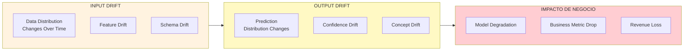
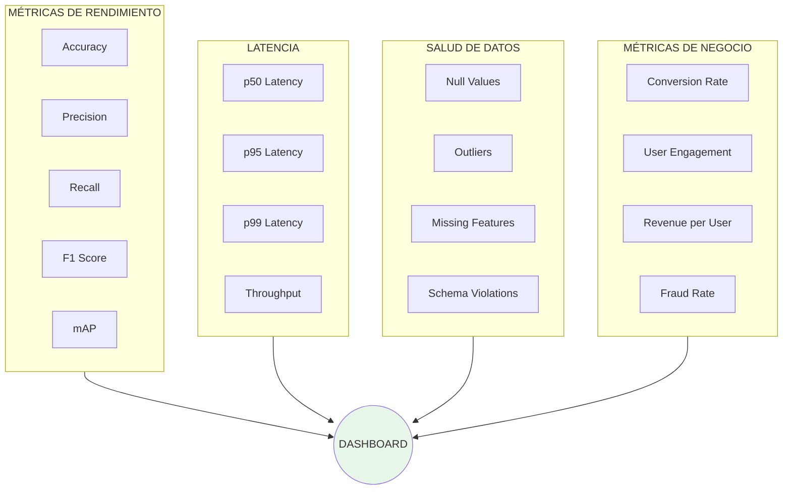
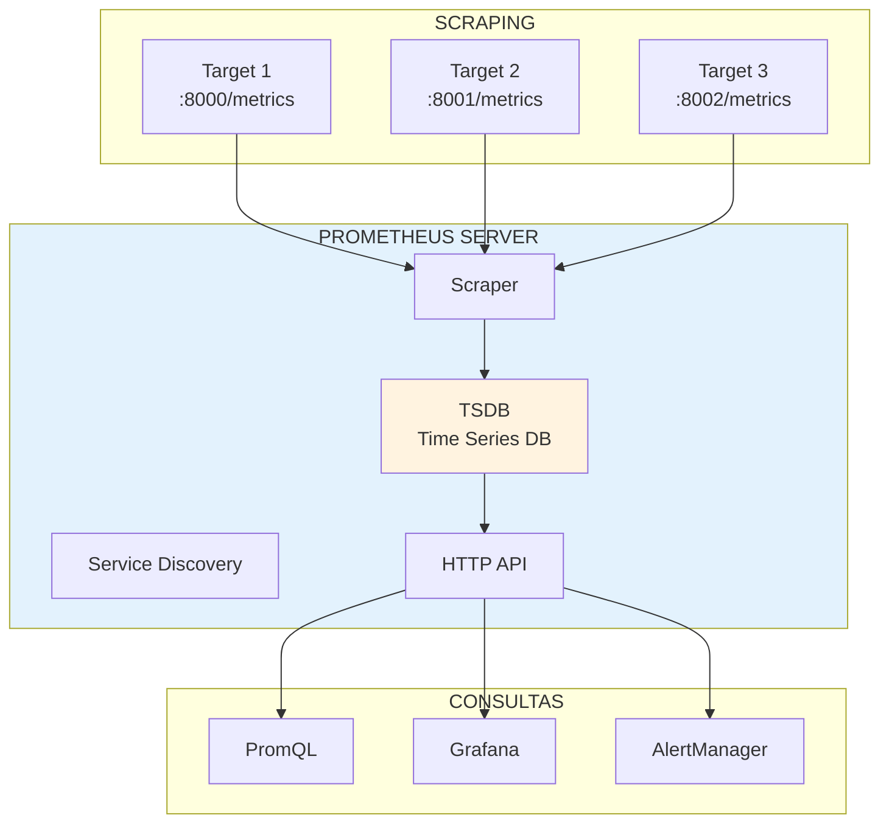
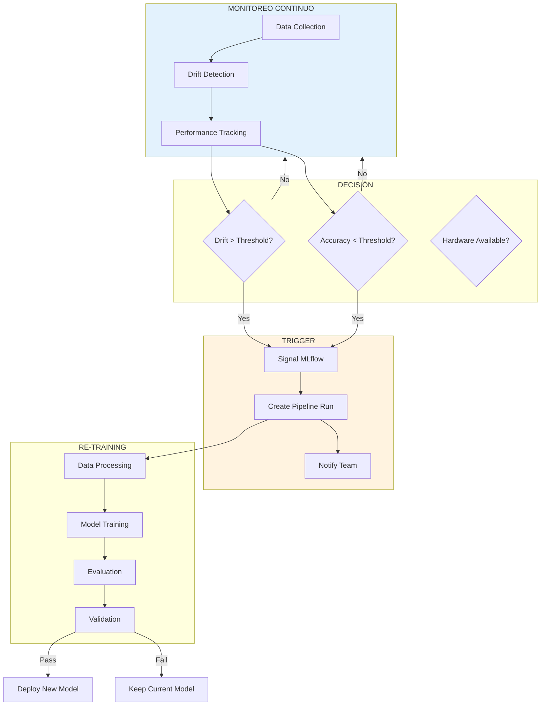

# Clase 4: Monitoreo de Modelos

## Duración
**4 horas (240 minutos)**

---

## Objetivos de Aprendizaje

Al finalizar esta clase, el estudiante será capaz de:

1. **Implementar** detección de drift en modelos de ML
2. **Configurar** monitoreo de métricas de latencia y rendimiento
3. **Diseñar** sistemas de alertas automatizadas
4. **Crear** dashboards de monitoreo con Grafana
5. **Integrar** Prometheus para collection de métricas
6. **Establecer** procesos de mantenimiento preventivo de modelos

---

## Contenidos Detallados

### 4.1 Fundamentos de Monitoreo de ML (45 minutos)

#### 4.1.1 ¿Por qué Monitorear Modelos?

El monitoreo de modelos en producción es crítico porque:



#### 4.1.2 Tipos de Drift

```
┌─────────────────────────────────────────────────────────────────┐
│                      TIPOS DE DRIFT                             │
├─────────────────────────────────────────────────────────────────┤
│                                                                  │
│  1. DATA DRIFT (Covariate Shift)                                │
│     ├── La distribución de features de entrada cambia            │
│     ├── Ej: Usuarios cambian comportamiento                      │
│     └── Detección: KS test, PSI, KL divergence                  │
│                                                                  │
│  2. CONCEPT DRIFT                                               │
│     ├── La relación entre features y labels cambia               │
│     ├── Ej: Definición de "fraude" evoluciona                   │
│     └── Detección: Comparing model boundaries                    │
│                                                                  │
│  3. PREDICTION DRIFT                                            │
│     ├── La distribución de predicciones cambia                   │
│     ├── Ej: Más predicciones positivas                           │
│     └── Detección: Monitoring prediction distribution            │
│                                                                  │
│  4. LABEL DRIFT                                                │
│     ├── La distribución de labels cambia                        │
│     ├── Ej: Re-labellling por humanos                           │
│     └── Detección: Comparing label distributions                 │
│                                                                  │
└─────────────────────────────────────────────────────────────────┘
```

#### 4.1.3 Métricas de Monitoreo



### 4.2 Detección de Drift (55 minutos)

#### 4.2.1 Métodos Estadísticos

```python
"""
Detección de Drift - Métodos Estadísticos
===========================================
Implementación de múltiples métodos de detección de drift
"""

import numpy as np
from scipy import stats
from scipy.spatial.distance import jensenshannon
from typing import Dict, List, Tuple, Optional
import warnings

class DriftDetector:
    """
    Detector de drift utilizando múltiples métodos estadísticos
    """
    
    def __init__(self, reference_data: np.ndarray, threshold: float = 0.1):
        """
        Args:
            reference_data: Datos de referencia (baseline)
            threshold: Umbral para considerar drift significativo
        """
        self.reference_data = reference_data
        self.threshold = threshold
        self.reference_stats = self._compute_statistics(reference_data)
        
    def _compute_statistics(self, data: np.ndarray) -> Dict:
        """Calcula estadísticas de referencia"""
        return {
            'mean': np.mean(data, axis=0) if data.ndim > 1 else np.mean(data),
            'std': np.std(data, axis=0) if data.ndim > 1 else np.std(data),
            'median': np.median(data, axis=0) if data.ndim > 1 else np.median(data),
            'min': np.min(data, axis=0) if data.ndim > 1 else np.min(data),
            'max': np.max(data, axis=0) if data.ndim > 1 else np.max(data),
            'quantiles': np.percentile(data, [25, 50, 75], axis=0) if data.ndim > 1 
                        else np.percentile(data, [25, 50, 75])
        }
    
    def detect_ks_drift(self, current_data: np.ndarray) -> Dict:
        """
        Detecta drift usando Kolmogorov-Smirnov test
        Mejor para detectar cambios en la distribución
        
        Args:
            current_data: Datos actuales a comparar
            
        Returns:
            Dict con resultados del test
        """
        if current_data.ndim > 1:
            ks_results = []
            for i in range(current_data.shape[1]):
                stat, p_value = stats.ks_2samp(
                    self.reference_data[:, i] if self.reference_data.ndim > 1 else self.reference_data,
                    current_data[:, i]
                )
                ks_results.append({
                    'feature': i,
                    'statistic': float(stat),
                    'p_value': float(p_value),
                    'drift': p_value < self.threshold
                })
            return {'method': 'ks_test', 'results': ks_results}
        
        stat, p_value = stats.ks_2samp(self.reference_data, current_data)
        return {
            'method': 'ks_test',
            'statistic': float(stat),
            'p_value': float(p_value),
            'drift': p_value < self.threshold
        }
    
    def detect_psi_drift(self, 
                        current_data: np.ndarray, 
                        num_buckets: int = 10) -> Dict:
        """
        Detecta drift usando Population Stability Index (PSI)
        Comúnmente usado en credit scoring
        
        PSI < 0.1: No significant change
        0.1 <= PSI < 0.2: Minor change
        PSI >= 0.2: Significant change
        """
        if current_data.ndim > 1:
            psi_results = []
            for i in range(current_data.shape[1]):
                ref_col = self.reference_data[:, i] if self.reference_data.ndim > 1 else self.reference_data
                curr_col = current_data[:, i]
                psi = self._calculate_psi(ref_col, curr_col, num_buckets)
                psi_results.append({
                    'feature': i,
                    'psi': float(psi),
                    'drift': psi >= 0.2
                })
            return {'method': 'psi', 'results': psi_results}
        
        psi = self._calculate_psi(self.reference_data, current_data, num_buckets)
        return {
            'method': 'psi',
            'psi': float(psi),
            'interpretation': self._interpret_psi(psi),
            'drift': psi >= 0.2
        }
    
    def _calculate_psi(self, 
                      reference: np.ndarray, 
                      current: np.ndarray, 
                      num_buckets: int) -> float:
        """Calcula PSI entre dos distribuciones"""
        # Crear buckets basados en datos de referencia
        breakpoints = np.percentile(reference, np.linspace(0, 100, num_buckets + 1))
        breakpoints[0] = -np.inf
        breakpoints[-1] = np.inf
        
        # Calcular percentages en cada bucket
        ref_counts = np.histogram(reference, bins=breakpoints)[0]
        curr_counts = np.histogram(current, bins=breakpoints)[0]
        
        # Evitar división por cero
        ref_pct = (ref_counts + 1e-6) / np.sum(ref_counts + 1e-6)
        curr_pct = (curr_counts + 1e-6) / np.sum(curr_counts + 1e-6)
        
        # Calcular PSI
        psi = np.sum((curr_pct - ref_pct) * np.log(curr_pct / ref_pct))
        
        return psi
    
    def _interpret_psi(self, psi: float) -> str:
        """Interpreta valor de PSI"""
        if psi < 0.1:
            return "No significant change"
        elif psi < 0.2:
            return "Minor change - monitor closely"
        else:
            return "Significant drift detected"
    
    def detect_kl_divergence(self, current_data: np.ndarray) -> Dict:
        """
        Detecta drift usando KL Divergence
        Mide información perdida al usar distribución actual vs referencia
        """
        if current_data.ndim > 1:
            kl_results = []
            for i in range(current_data.shape[1]):
                ref_col = self.reference_data[:, i] if self.reference_data.ndim > 1 else self.reference_data
                curr_col = current_data[:, i]
                
                # Discretizar para KL
                ref_hist, _ = np.histogram(ref_col, bins=50, density=True)
                curr_hist, _ = np.histogram(curr_col, bins=50, density=True)
                
                # Evitar zeros
                ref_hist = ref_hist + 1e-10
                curr_hist = curr_hist + 1e-10
                
                # Normalizar
                ref_hist = ref_hist / np.sum(ref_hist)
                curr_hist = curr_hist / np.sum(curr_hist)
                
                # KL divergence
                kl_div = np.sum(curr_hist * np.log(curr_hist / ref_hist))
                
                kl_results.append({
                    'feature': i,
                    'kl_divergence': float(kl_div),
                    'drift': kl_div > 0.5
                })
            
            return {'method': 'kl_divergence', 'results': kl_results}
        
        # Versión 1D
        ref_hist, _ = np.histogram(self.reference_data, bins=50, density=True)
        curr_hist, _ = np.histogram(current_data, bins=50, density=True)
        
        ref_hist = ref_hist + 1e-10
        curr_hist = curr_hist + 1e-10
        
        kl_div = np.sum(curr_hist * np.log(curr_hist / ref_hist))
        
        return {
            'method': 'kl_divergence',
            'kl_divergence': float(kl_div),
            'drift': kl_div > 0.5
        }
    
    def detect_js_distance(self, current_data: np.ndarray) -> Dict:
        """
        Detecta drift usando Jensen-Shannon distance
        Simétrica y siempre definida
        """
        if current_data.ndim > 1:
            js_results = []
            for i in range(current_data.shape[1]):
                ref_col = self.reference_data[:, i] if self.reference_data.ndim > 1 else self.reference_data
                curr_col = current_data[:, i]
                
                ref_hist, _ = np.histogram(ref_col, bins=50, density=True)
                curr_hist, _ = np.histogram(curr_col, bins=50, density=True)
                
                js_dist = jensenshannon(ref_hist + 1e-10, curr_hist + 1e-10)
                
                js_results.append({
                    'feature': i,
                    'js_distance': float(js_dist),
                    'drift': js_dist > 0.5
                })
            
            return {'method': 'jensen_shannon', 'results': js_results}
        
        ref_hist, _ = np.histogram(self.reference_data, bins=50, density=True)
        curr_hist, _ = np.histogram(current_data, bins=50, density=True)
        
        js_dist = jensenshannon(ref_hist + 1e-10, curr_hist + 1e-10)
        
        return {
            'method': 'jensen_shannon',
            'js_distance': float(js_dist),
            'drift': js_dist > 0.5
        }
    
    def detect_batch_drift(self, current_data: np.ndarray) -> Dict:
        """
        Detecta drift usando múltiples métodos
        Retorna un resumen con todos los resultados
        """
        results = {
            'timestamp': str(np.datetime64('now')),
            'reference_size': len(self.reference_data),
            'current_size': len(current_data),
            'methods': {}
        }
        
        # KS Test
        results['methods']['ks_test'] = self.detect_ks_drift(current_data)
        
        # PSI
        results['methods']['psi'] = self.detect_psi_drift(current_data)
        
        # KL Divergence
        results['methods']['kl_divergence'] = self.detect_kl_divergence(current_data)
        
        # Jensen-Shannon
        results['methods']['jensen_shannon'] = self.detect_js_distance(current_data)
        
        # Aggregate drift score
        drift_scores = []
        for method, result in results['methods'].items():
            if isinstance(result, dict) and 'statistic' in result:
                drift_scores.append(result.get('statistic', result.get('psi', 0)))
            elif isinstance(result, dict) and 'results' in result:
                drift_scores.append(np.mean([r.get('statistic', r.get('psi', 0)) for r in result['results']]))
        
        results['aggregate_drift_score'] = float(np.mean(drift_scores))
        results['significant_drift'] = results['aggregate_drift_score'] > self.threshold
        
        return results


def visualize_drift(reference: np.ndarray, current: np.ndarray, feature_name: str = "Feature"):
    """Visualiza drift entre dos distribuciones"""
    import matplotlib.pyplot as plt
    
    fig, axes = plt.subplots(1, 2, figsize=(12, 4))
    
    # Histogram comparison
    axes[0].hist(reference, bins=50, alpha=0.5, label='Reference', density=True)
    axes[0].hist(current, bins=50, alpha=0.5, label='Current', density=True)
    axes[0].set_xlabel(feature_name)
    axes[0].set_ylabel('Density')
    axes[0].set_title('Distribution Comparison')
    axes[0].legend()
    
    # ECDF comparison
    sorted_ref = np.sort(reference)
    sorted_curr = np.sort(current)
    axes[1].plot(sorted_ref, np.arange(1, len(sorted_ref)+1)/len(sorted_ref), label='Reference')
    axes[1].plot(sorted_curr, np.arange(1, len(sorted_curr)+1)/len(sorted_curr), label='Current')
    axes[1].set_xlabel(feature_name)
    axes[1].set_ylabel('Cumulative Probability')
    axes[1].set_title('ECDF Comparison')
    axes[1].legend()
    
    plt.tight_layout()
    return fig
```

#### 4.2.2 Integración con Evidently AI

```python
"""
Evidently AI Integration
========================
Monitoreo de drift usando Evidently
"""

from evidently.dashboard import Dashboard
from evidently.tabs import DataDriftTab, NumTargetDriftTab, CatTargetDriftTab
from evidently.model_profile import Profile
from evidently.profile_sections import DataDriftProfileSection
import pandas as pd
import numpy as np

class EvidentlyMonitor:
    """
    Monitor de drift usando Evidently AI
    """
    
    def __init__(self, reference_data: pd.DataFrame):
        """
        Args:
            reference_data: DataFrame con datos de referencia
        """
        self.reference_data = reference_data
        self.column_mapping = self._infer_column_mapping(reference_data)
    
    def _infer_column_mapping(self, df: pd.DataFrame) -> dict:
        """Infiere mapeo de columnas"""
        numeric_cols = df.select_dtypes(include=[np.number]).columns.tolist()
        
        return {
            'numerical_features': numeric_cols,
            'categorical_features': df.select_dtypes(include=['object', 'category']).columns.tolist()
        }
    
    def detect_data_drift(self, current_data: pd.DataFrame) -> dict:
        """
        Detecta drift en datos
        
        Args:
            current_data: DataFrame con datos actuales
            
        Returns:
            Reporte de drift
        """
        # Crear dashboard de drift
        dashboard = Dashboard(tabs=[
            DataDriftTab(verbose_level=2)
        ])
        
        dashboard.calculate(
            self.reference_data,
            current_data,
            column_mapping=self.column_mapping
        )
        
        return dashboard
        
    def create_drift_profile(self, current_data: pd.DataFrame) -> Profile:
        """
        Crea perfil de drift para usar programáticamente
        
        Args:
            current_data: DataFrame con datos actuales
            
        Returns:
            Profile con métricas
        """
        profile = Profile(sections=[DataDriftProfileSection()])
        
        profile.calculate(
            self.reference_data,
            current_data,
            column_mapping=self.column_mapping
        )
        
        return profile
    
    def get_drift_metrics(self, current_data: pd.DataFrame) -> dict:
        """
        Obtiene métricas de drift específicas
        
        Args:
            current_data: DataFrame con datos actuales
            
        Returns:
            Diccionario con métricas
        """
        profile = self.create_drift_profile(current_data)
        json_report = profile.json()
        
        # Parsear resultados
        drift_data = json_report.get('data_drift', {})
        
        metrics = {
            'dataset_drift': drift_data.get('dataset_drift', False),
            'drift_share': drift_data.get('drift_share', 0),
            'number_of_drifted_features': drift_data.get('number_of_drifted_features', 0),
            'total_features': drift_data.get('total_features', 0)
        }
        
        # Métricas por feature
        feature_metrics = {}
        for feature_name, feature_data in drift_data.get('features', {}).items():
            feature_metrics[feature_name] = {
                'drift_detected': feature_data.get('drift', False),
                'statistic': feature_data.get('statistic'),
                'p_value': feature_data.get('p_value')
            }
        
        metrics['per_feature'] = feature_metrics
        
        return metrics
    
    def save_report(self, current_data: pd.DataFrame, output_path: str):
        """Guarda reporte HTML de drift"""
        dashboard = self.detect_data_drift(current_data)
        dashboard.save(output_path)
        print(f"Report saved to: {output_path}")


# EJEMPLO DE USO
if __name__ == "__main__":
    # Generar datos de ejemplo
    np.random.seed(42)
    reference = pd.DataFrame({
        'feature_1': np.random.normal(0, 1, 1000),
        'feature_2': np.random.exponential(2, 1000),
        'feature_3': np.random.uniform(0, 10, 1000)
    })
    
    # Simular drift
    current = pd.DataFrame({
        'feature_1': np.random.normal(0.5, 1.2, 1000),  # Cambio de media y std
        'feature_2': np.random.exponential(3, 1000),    # Cambio de lambda
        'feature_3': np.random.uniform(0, 10, 1000)    # Sin cambio
    })
    
    # Detectar drift
    monitor = EvidentlyMonitor(reference)
    metrics = monitor.get_drift_metrics(current)
    
    print("Drift Detection Results:")
    print(f"  Dataset Drift: {metrics['dataset_drift']}")
    print(f"  Drift Share: {metrics['drift_share']:.2%}")
    print(f"  Features with Drift: {metrics['number_of_drifted_features']}/{metrics['total_features']}")
    
    # Guardar reporte
    monitor.save_report(current, 'drift_report.html')
```

### 4.3 Monitoreo de Métricas con Prometheus (45 minutos)

#### 4.3.1 Arquitectura de Prometheus



#### 4.3.2 Métricas Personalizadas

```python
"""
Prometheus Metrics for ML Models
==================================
Métricas personalizadas para monitoreo de modelos
"""

from prometheus_client import Counter, Histogram, Gauge, Summary, CollectorRegistry
import time
import numpy as np
from typing import Dict, Any

# Crear registry custom
registry = CollectorRegistry()

# Métricas de Requests
REQUEST_COUNT = Counter(
    'ml_model_requests_total',
    'Total de requests al modelo',
    ['model_name', 'endpoint', 'status'],
    registry=registry
)

REQUEST_LATENCY = Histogram(
    'ml_model_inference_seconds',
    'Latencia de inference en segundos',
    ['model_name', 'endpoint'],
    buckets=[0.01, 0.025, 0.05, 0.075, 0.1, 0.25, 0.5, 0.75, 1.0, 2.5, 5.0],
    registry=registry
)

# Métricas de Modelo
MODEL_ACCURACY = Gauge(
    'ml_model_accuracy',
    'Accuracy actual del modelo',
    ['model_name', 'version'],
    registry=registry
)

MODEL_PREDICTIONS = Histogram(
    'ml_model_predictions',
    'Distribución de predicciones',
    ['model_name', 'class_name'],
    buckets=[0.1, 0.2, 0.3, 0.4, 0.5, 0.6, 0.7, 0.8, 0.9, 1.0],
    registry=registry
)

# Métricas de Drift
DATA_DRIFT_SCORE = Gauge(
    'ml_data_drift_score',
    'Score de drift de datos',
    ['feature_name'],
    registry=registry
)

CONCEPT_DRIFT_FLAG = Gauge(
    'ml_concept_drift_detected',
    'Flag de drift conceptual (1=drift, 0=no drift)',
    ['model_name'],
    registry=registry
)

# Métricas de Sistema
GPU_MEMORY_USAGE = Gauge(
    'ml_gpu_memory_bytes',
    'Memoria GPU en uso',
    ['device'],
    registry=registry
)

CPU_USAGE = Gauge(
    'ml_cpu_percent',
    'Uso de CPU en porcentaje',
    registry=registry
)

MEMORY_USAGE = Gauge(
    'ml_memory_bytes',
    'Memoria RAM en uso',
    registry=registry
)

# Métricas de Negocio
BUSINESS_METRIC = Gauge(
    'ml_business_metric',
    'Métricas de negocio relacionadas con ML',
    ['metric_name', 'segment'],
    registry=registry
)


class ModelMetrics:
    """
    Wrapper para tracking de métricas de modelo
    """
    
    def __init__(self, model_name: str, version: str = "latest"):
        self.model_name = model_name
        self.version = version
        
    def track_request(self, endpoint: str, status: str, latency: float):
        """Trackea request de inference"""
        REQUEST_COUNT.labels(
            model_name=self.model_name,
            endpoint=endpoint,
            status=status
        ).inc()
        
        REQUEST_LATENCY.labels(
            model_name=self.model_name,
            endpoint=endpoint
        ).observe(latency)
    
    def track_prediction(self, prediction: float, class_name: str = "default"):
        """Trackea predicción"""
        MODEL_PREDICTIONS.labels(
            model_name=self.model_name,
            class_name=class_name
        ).observe(prediction)
    
    def track_accuracy(self, accuracy: float):
        """Actualiza accuracy del modelo"""
        MODEL_ACCURACY.labels(
            model_name=self.model_name,
            version=self.version
        ).set(accuracy)
    
    def track_drift(self, feature_name: str, drift_score: float):
        """Trackea drift de feature"""
        DATA_DRIFT_SCORE.labels(feature_name=feature_name).set(drift_score)
    
    def set_concept_drift(self, drift_detected: bool):
        """Establece flag de drift conceptual"""
        CONCEPT_DRIFT_FLAG.labels(
            model_name=self.model_name
        ).set(1 if drift_detected else 0)
    
    def track_business_metric(self, metric_name: str, value: float, segment: str = "all"):
        """Trackea métrica de negocio"""
        BUSINESS_METRIC.labels(
            metric_name=metric_name,
            segment=segment
        ).set(value)


def system_metrics_collector():
    """Colecciona métricas del sistema"""
    import psutil
    
    # CPU
    cpu_percent = psutil.cpu_percent(interval=1)
    CPU_USAGE.set(cpu_percent)
    
    # Memory
    memory = psutil.virtual_memory()
    MEMORY_USAGE.set(memory.used)
    
    # GPU (si disponible)
    try:
        import torch
        if torch.cuda.is_available():
            for i in range(torch.cuda.device_count()):
                mem_used = torch.cuda.memory_allocated(i)
                GPU_MEMORY_USAGE.labels(device=f"cuda:{i}").set(mem_used)
    except ImportError:
        pass


# Middleware para FastAPI
from fastapi import FastAPI, Request
from starlette.middleware.base import BaseHTTPMiddleware
import time

class PrometheusMiddleware(BaseHTTPMiddleware):
    """Middleware para trackear requests en FastAPI"""
    
    async def dispatch(self, request: Request, call_next):
        start_time = time.time()
        
        response = await call_next(request)
        
        # Calcular latencia
        latency = time.time() - start_time
        
        # Determinar status
        status = "success" if response.status_code < 400 else "error"
        
        # Trackear
        REQUEST_COUNT.labels(
            model_name="yolo_api",
            endpoint=request.url.path,
            status=status
        ).inc()
        
        REQUEST_LATENCY.labels(
            model_name="yolo_api",
            endpoint=request.url.path
        ).observe(latency)
        
        return response
```

#### 4.3.3 API de Métricas en FastAPI

```python
"""
FastAPI with Prometheus Metrics
================================
API completa con integración de Prometheus
"""

from fastapi import FastAPI, File, UploadFile, HTTPException
from fastapi.responses import Response
from prometheus_client import generate_latest, CONTENT_TYPE_LATEST, CollectorRegistry
import uvicorn
import numpy as np
from PIL import Image
import io
import time
import torch
from ultralytics import YOLO

app = FastAPI(title="YOLO API with Monitoring")

# Métricas
from prometheus_client import Counter, Histogram, Gauge

REQUEST_COUNT = Counter('yolo_requests_total', 'Total requests', ['endpoint', 'status'])
REQUEST_LATENCY = Histogram('yolo_request_duration_seconds', 'Request latency', ['endpoint'])
MODEL_PREDICTIONS = Counter('yolo_predictions_total', 'Predictions by class', ['class_name'])
INFERENCE_TIME = Histogram('yolo_inference_seconds', 'Inference time')

# Cargar modelo
model = YOLO('best.pt')

# Métricas del sistema
GPU_AVAILABLE = torch.cuda.is_available()

@app.middleware("http")
async def metrics_middleware(request, call_next):
    """Middleware para tracking de métricas"""
    start_time = time.time()
    
    response = await call_next(request)
    
    # Calcular latencia
    latency = time.time() - start_time
    
    # Determinar status
    status = "success" if response.status_code < 400 else "error"
    
    # Log métricas
    REQUEST_COUNT.labels(endpoint=request.url.path, status=status).inc()
    REQUEST_LATENCY.labels(endpoint=request.url.path).observe(latency)
    
    return response

@app.get("/")
async def root():
    """Endpoint raíz"""
    return {
        "service": "YOLO Detection API",
        "version": "1.0.0",
        "gpu_available": GPU_AVAILABLE
    }

@app.get("/health")
async def health():
    """Health check"""
    metrics = {
        "status": "healthy",
        "model_loaded": model is not None,
        "gpu_available": GPU_AVAILABLE
    }
    
    if GPU_AVAILABLE:
        metrics["gpu_memory_allocated"] = torch.cuda.memory_allocated() / 1024**3
        metrics["gpu_memory_reserved"] = torch.cuda.memory_reserved() / 1024**3
    
    return metrics

@app.post("/detect")
async def detect(file: UploadFile = File(...)):
    """
    Detecta objetos en imagen
    """
    if not file.content_type.startswith("image/"):
        raise HTTPException(400, "File must be an image")
    
    # Leer imagen
    contents = await file.read()
    image = Image.open(io.BytesIO(contents))
    image_array = np.array(image)
    
    # Inference con timing
    start_time = time.time()
    results = model(image_array, conf=0.5, verbose=False)
    inference_time = time.time() - start_time
    
    # Track inference time
    INFERENCE_TIME.observe(inference_time)
    
    # Formatear resultados
    detections = []
    for box in results[0].boxes:
        class_name = results[0].names[int(box.cls[0])]
        
        # Track prediction
        MODEL_PREDICTIONS.labels(class_name=class_name).inc()
        
        detections.append({
            "class": class_name,
            "confidence": float(box.conf[0]),
            "bbox": box.xyxy[0].tolist()
        })
    
    return {
        "detections": detections,
        "count": len(detections),
        "inference_time_ms": inference_time * 1000
    }

@app.get("/metrics")
async def metrics():
    """
    Endpoint de métricas Prometheus
    """
    return Response(
        content=generate_latest(CollectorRegistry()),
        media_type=CONTENT_TYPE_LATEST
    )

@app.get("/metrics/gpu")
async def gpu_metrics():
    """
    Métricas detalladas de GPU
    """
    if not GPU_AVAILABLE:
        return {"error": "GPU not available"}
    
    gpu_info = {
        "device_count": torch.cuda.device_count(),
        "devices": []
    }
    
    for i in range(torch.cuda.device_count()):
        device_info = {
            "id": i,
            "name": torch.cuda.get_device_name(i),
            "memory_allocated_gb": torch.cuda.memory_allocated(i) / 1024**3,
            "memory_reserved_gb": torch.cuda.memory_reserved(i) / 1024**3,
            "max_memory_allocated_gb": torch.cuda.max_memory_allocated(i) / 1024**3
        }
        gpu_info["devices"].append(device_info)
    
    return gpu_info


if __name__ == "__main__":
    uvicorn.run(
        "app:app",
        host="0.0.0.0",
        port=8000,
        workers=1
    )
```

### 4.4 Grafana Dashboards (35 minutos)

#### 4.4.1 Configuración de Dashboards

```yaml
# grafana-dashboard.yaml
# Dashboard de monitoreo para modelos ML

apiVersion: 1

providers:
  - name: 'ML Models'
    orgId: 1
    folder: 'ML Monitoring'
    type: file
    disableDeletion: false
    editable: true
    options:
      path: /etc/grafana/provisioning/dashboards

# datasources.yaml
apiVersion: 1

datasources:
  - name: Prometheus
    type: prometheus
    access: proxy
    url: http://prometheus:9090
    isDefault: true
    editable: false
```

```json
{
  "dashboard": {
    "title": "ML Model Monitoring",
    "tags": ["ml", "monitoring"],
    "timezone": "browser",
    "panels": [
      {
        "title": "Request Rate",
        "type": "graph",
        "targets": [
          {
            "expr": "rate(ml_model_requests_total[5m])",
            "legendFormat": "{{model_name}} - {{endpoint}}"
          }
        ]
      },
      {
        "title": "Inference Latency p99",
        "type": "graph",
        "targets": [
          {
            "expr": "histogram_quantile(0.99, rate(ml_model_inference_seconds_bucket[5m]))",
            "legendFormat": "{{model_name}}"
          }
        ]
      },
      {
        "title": "Data Drift Score",
        "type": "gauge",
        "targets": [
          {
            "expr": "ml_data_drift_score",
            "refId": "A"
          }
        ],
        "fieldConfig": {
          "defaults": {
            "thresholds": {
              "mode": "absolute",
              "steps": [
                {"value": 0, "color": "green"},
                {"value": 0.1, "color": "yellow"},
                {"value": 0.2, "color": "red"}
              ]
            },
            "max": 1,
            "min": 0
          }
        }
      },
      {
        "title": "Model Accuracy",
        "type": "stat",
        "targets": [
          {
            "expr": "ml_model_accuracy",
            "legendFormat": "{{model_name}} v{{version}}"
          }
        ]
      },
      {
        "title": "GPU Memory Usage",
        "type": "graph",
        "targets": [
          {
            "expr": "ml_gpu_memory_bytes / 1024^3",
            "legendFormat": "{{device}}"
          }
        ]
      }
    ]
  }
}
```

### 4.5 Sistema de Alertas (35 minutos)

#### 4.5.1 AlertManager Configuration

```yaml
# alertmanager.yaml
global:
  smtp_smarthost: 'smtp.gmail.com:587'
  smtp_from: 'alerts@company.com'
  smtp_auth_username: 'alerts@company.com'
  smtp_auth_identity: 'alerts@company.com'
  smtp_auth_password: 'password'

templates:
  - '/etc/alertmanager/template/*.tmpl'

route:
  group_by: ['alertname', 'severity']
  group_wait: 30s
  group_interval: 5m
  repeat_interval: 4h
  receiver: 'email-notifications'
  routes:
    - match:
        severity: critical
      receiver: 'critical-alerts'
      continue: true
    - match:
        severity: warning
      receiver: 'warning-alerts'

receivers:
  - name: 'email-notifications'
    email_configs:
      - to: 'ml-team@company.com'
        send_resolved: true
        headers:
          subject: 'ML Model Alert: {{ .GroupLabels.alertname }}'

  - name: 'critical-alerts'
    email_configs:
      - to: 'oncall@company.com'
        send_resolved: true
    slack_configs:
      - api_url: 'https://hooks.slack.com/services/XXX'
        channel: '#ml-alerts-critical'
        title: 'CRITICAL: {{ .GroupLabels.alertname }}'
        text: '{{ range .Alerts }}{{ .Annotations.description }}{{ end }}'

  - name: 'warning-alerts'
    email_configs:
      - to: 'ml-team@company.com'
        send_resolved: true
```

```yaml
# prometheus-alerts.yaml
# Reglas de alertas Prometheus

groups:
  - name: ml_model_alerts
    rules:
      # Alerta de drift de datos
      - alert: DataDriftDetected
        expr: ml_data_drift_score > 0.2
        for: 5m
        labels:
          severity: warning
        annotations:
          summary: "Data drift detected in {{ $labels.feature_name }}"
          description: "Drift score {{ $value }} exceeds threshold of 0.2"
        
      # Alerta de drift crítico
      - alert: CriticalDataDrift
        expr: ml_data_drift_score > 0.5
        for: 5m
        labels:
          severity: critical
        annotations:
          summary: "Critical data drift in {{ $labels.feature_name }}"
          description: "Drift score {{ $value }} indicates major distribution change"
        
      # Alerta de latencia alta
      - alert: HighInferenceLatency
        expr: histogram_quantile(0.99, rate(ml_model_inference_seconds_bucket[5m])) > 1.0
        for: 5m
        labels:
          severity: warning
        annotations:
          summary: "High inference latency detected"
          description: "p99 latency is {{ $value }}s, threshold is 1.0s"
        
      # Alerta de modelo degradado
      - alert: ModelAccuracyDegraded
        expr: ml_model_accuracy < 0.85
        for: 10m
        labels:
          severity: critical
        annotations:
          summary: "Model accuracy degraded"
          description: "Model {{ $labels.model_name }} accuracy is {{ $value }}"
        
      # Alerta de alto error rate
      - alert: HighErrorRate
        expr: rate(ml_model_requests_total{status="error"}[5m]) / rate(ml_model_requests_total[5m]) > 0.05
        for: 5m
        labels:
          severity: warning
        annotations:
          summary: "High error rate detected"
          description: "Error rate is {{ $value | humanizePercentage }}"
        
      # Alerta de concepto drift
      - alert: ConceptDriftDetected
        expr: ml_concept_drift_detected == 1
        for: 10m
        labels:
          severity: critical
        annotations:
          summary: "Concept drift detected in {{ $labels.model_name }}"
          description: "The relationship between features and labels has changed"
        
      # Alerta de GPU memory
      - alert: HighGPUMemoryUsage
        expr: ml_gpu_memory_bytes / 1024^3 > 10
        for: 5m
        labels:
          severity: warning
        annotations:
          summary: "High GPU memory usage"
          description: "GPU memory usage is {{ $value }}GB"
```

#### 4.5.2 Alertas Programáticas

```python
"""
Alert Manager Integration
=========================
Sistema de alertas programático
"""

import requests
from typing import List, Dict
import json
from datetime import datetime

class AlertManager:
    """Cliente para AlertManager"""
    
    def __init__(self, alertmanager_url: str):
        self.url = alertmanager_url.rstrip('/')
        self.api_url = f"{self.url}/api/v1"
    
    def send_alert(self, alert: Dict) -> Dict:
        """
        Envía alerta a AlertManager
        
        Args:
            alert: Diccionario con estructura de alerta
        """
        payload = {
            "alerts": [alert]
        }
        
        response = requests.post(
            f"{self.api_url}/alerts",
            json=payload
        )
        
        return response.json()
    
    def create_alert(self,
                    name: str,
                    severity: str,
                    message: str,
                    labels: Dict = None,
                    annotations: Dict = None) -> Dict:
        """
        Crea estructura de alerta
        
        Args:
            name: Nombre de la alerta
            severity: critical, warning, info
            message: Mensaje descriptivo
            labels: Labels para identificación
            annotations: Anotaciones adicionales
        """
        return {
            "labels": {
                "alertname": name,
                "severity": severity,
                **(labels or {})
            },
            "annotations": {
                "summary": message,
                "description": message,
                **(annotations or {})
            },
            "startsAt": datetime.utcnow().isoformat() + "Z"
        }
    
    def alert_drift_detected(self, 
                           feature_name: str, 
                           drift_score: float,
                           threshold: float = 0.2):
        """Envía alerta de drift detectado"""
        if drift_score > threshold:
            severity = "critical" if drift_score > 0.5 else "warning"
            
            alert = self.create_alert(
                name="DataDriftDetected",
                severity=severity,
                message=f"Drift detected in feature {feature_name}: {drift_score:.4f}",
                labels={
                    "feature": feature_name,
                    "drift_score": str(drift_score),
                    "threshold": str(threshold)
                }
            )
            
            return self.send_alert(alert)
    
    def alert_accuracy_degraded(self, 
                               model_name: str, 
                               accuracy: float,
                               threshold: float = 0.85):
        """Envía alerta de accuracy degradado"""
        if accuracy < threshold:
            alert = self.create_alert(
                name="ModelAccuracyDegraded",
                severity="critical",
                message=f"Model {model_name} accuracy degraded to {accuracy:.4f}",
                labels={
                    "model": model_name,
                    "accuracy": str(accuracy),
                    "threshold": str(threshold)
                }
            )
            
            return self.send_alert(alert)
    
    def alert_latency_spike(self,
                          model_name: str,
                          latency_p99: float,
                          threshold: float = 1.0):
        """Envía alerta de spike de latencia"""
        if latency_p99 > threshold:
            alert = self.create_alert(
                name="HighInferenceLatency",
                severity="warning",
                message=f"High latency detected for {model_name}: {latency_p99:.3f}s",
                labels={
                    "model": model_name,
                    "latency_p99": str(latency_p99),
                    "threshold": str(threshold)
                }
            )
            
            return self.send_alert(alert)
    
    def get_alerts(self, status: str = "active") -> List[Dict]:
        """Obtiene alertas activas o resueltas"""
        response = requests.get(f"{self.api_url}/alerts", params={"status": status})
        return response.json().get("data", {}).get("alerts", [])
    
    def silence_alert(self, alert_id: str, duration: int = 3600) -> Dict:
        """
        Silencia una alerta por duración especificada
        
        Args:
            alert_id: ID de la alerta
            duration: Duración en segundos
        """
        payload = {
            "matchers": [
                {"name": "alertname", "value": alert_id}
            ],
            "startsAt": datetime.utcnow().isoformat() + "Z",
            "endsAt": (datetime.utcnow().timestamp() + duration) * 1000000000,
            "createdBy": "api",
            "comment": f"Silenced for {duration}s by automated system"
        }
        
        response = requests.post(f"{self.api_url}/silences", json=payload)
        return response.json()


# EJEMPLO DE USO
if __name__ == "__main__":
    alert_manager = AlertManager("http://localhost:9093")
    
    # Enviar alerta de drift
    alert_manager.alert_drift_detected(
        feature_name="user_age",
        drift_score=0.35,
        threshold=0.2
    )
    
    # Enviar alerta de accuracy
    alert_manager.alert_accuracy_degraded(
        model_name="fraud_detector_v2",
        accuracy=0.78,
        threshold=0.85
    )
    
    # Ver alertas activas
    active_alerts = alert_manager.get_alerts("active")
    print(f"Active alerts: {len(active_alerts)}")
```

### 4.6 Pipeline de Retraining Automatizado (20 minutos)

#### 4.6.1 Trigger de Retraining



```python
"""
Automated Retraining Pipeline
=============================
Pipeline que trigerea reentrenamiento basado en drift
"""

import mlflow
from mlflow.tracking import MlflowClient
from datetime import datetime
import json
from pathlib import Path
import requests

class AutomatedRetrainingPipeline:
    """
    Pipeline de reentrenamiento automatizado
    Se activa cuando se detecta drift o degradación de métricas
    """
    
    def __init__(self, config_path: str):
        with open(config_path) as f:
            self.config = json.load(f)
        
        self.tracking_uri = self.config.get('mlflow_uri', 'http://localhost:5000')
        mlflow.set_tracking_uri(self.tracking_uri)
        self.client = MlflowClient()
        
    def check_retraining_needed(self) -> Dict:
        """
        Verifica si se necesita reentrenamiento
        
        Returns:
            Dict con razones de reentrenamiento
        """
        reasons = []
        
        # 1. Check drift
        drift_score = self._get_current_drift_score()
        if drift_score > self.config.get('drift_threshold', 0.2):
            reasons.append({
                'reason': 'data_drift',
                'score': drift_score,
                'threshold': self.config['drift_threshold']
            })
        
        # 2. Check accuracy
        current_accuracy = self._get_model_accuracy()
        if current_accuracy < self.config.get('accuracy_threshold', 0.85):
            reasons.append({
                'reason': 'accuracy_degradation',
                'accuracy': current_accuracy,
                'threshold': self.config['accuracy_threshold']
            })
        
        # 3. Check data freshness
        data_age = self._get_data_age()
        if data_age > self.config.get('max_data_age_days', 30):
            reasons.append({
                'reason': 'stale_data',
                'age_days': data_age,
                'threshold': self.config['max_data_age_days']
            })
        
        return {
            'needs_retraining': len(reasons) > 0,
            'reasons': reasons
        }
    
    def _get_current_drift_score(self) -> float:
        """Obtiene score de drift actual desde Prometheus"""
        # En producción, esto consultaría Prometheus
        # Aquí simulamos
        return 0.15
    
    def _get_model_accuracy(self) -> float:
        """Obtiene accuracy actual del modelo"""
        # Consultar MLflow para última evaluación
        return 0.88
    
    def _get_data_age(self) -> int:
        """Obtiene edad de datos en días"""
        # Calcular desde última actualización
        return 15
    
    def trigger_retraining(self, reasons: List[Dict]):
        """
        Trigerea pipeline de reentrenamiento
        
        Args:
            reasons: Lista de razones para reentrenar
        """
        print("="*50)
        print("TRIGGERING AUTOMATED RETRAINING")
        print("="*50)
        
        for reason in reasons:
            print(f"  Reason: {reason['reason']} - {reason}")
        
        # 1. Log el trigger en MLflow
        with mlflow.start_run(run_name=f"auto_retrain_{datetime.now().strftime('%Y%m%d_%H%M%S')}"):
            mlflow.log_param("trigger", "automated")
            mlflow.log_param("reasons", json.dumps(reasons))
            mlflow.log_param("timestamp", datetime.now().isoformat())
        
        # 2. Notificar al equipo
        self._notify_team(reasons)
        
        # 3. Ejecutar pipeline (en producción, esto podría ser Airflow, Kubeflow, etc.)
        self._execute_training_pipeline()
        
        print("Retraining pipeline triggered successfully!")
    
    def _notify_team(self, reasons: List[Dict]):
        """Notifica al equipo de ML"""
        # Slack, email, etc.
        message = f"Automated retraining triggered:\n"
        for reason in reasons:
            message += f"- {reason['reason']}: {reason}\n"
        
        # Enviar a Slack
        slack_webhook = self.config.get('slack_webhook')
        if slack_webhook:
            requests.post(slack_webhook, json={"text": message})
    
    def _execute_training_pipeline(self):
        """Ejecuta pipeline de entrenamiento"""
        # En producción, esto iniciaría un job en:
        # - Airflow DAG
        # - Kubeflow Pipeline
        # - AWS SageMaker Pipeline
        # - Vertex AI Pipeline
        
        # Aquí simulamos la ejecución
        print("Executing training pipeline...")
        
        # 1. Pull latest data
        print("  - Pulling latest data...")
        
        # 2. Preprocess
        print("  - Preprocessing data...")
        
        # 3. Train
        print("  - Training model...")
        
        # 4. Evaluate
        print("  - Evaluating model...")
        
        # 5. Register if better
        print("  - Registering new model version...")
    
    def run(self):
        """Ejecuta el pipeline de decisión"""
        check_result = self.check_retraining_needed()
        
        if check_result['needs_retraining']:
            self.trigger_retraining(check_result['reasons'])
        else:
            print("No retraining needed. Model is healthy.")
        
        return check_result


if __name__ == "__main__":
    pipeline = AutomatedRetrainingPipeline('config/retraining_config.json')
    result = pipeline.run()
```

---

## Tecnologías y Herramientas Específicas

| Herramienta | Propósito |
|------------|-----------|
| Evidently AI | Detección de drift en datos |
| Prometheus | Collection de métricas |
| Grafana | Visualización y dashboards |
| AlertManager | Gestión de alertas |
| ELK Stack | Log aggregation |
| Jaeger | Distributed tracing |

### Instalación

```bash
# Prometheus
pip install prometheus-client

# Evidently
pip install evidently

# Grafana
# Descargar desde grafana.com

# AlertManager
# Incluido con Prometheus
```

---

## Resumen de Puntos Clave

### Drift Detection
1. **Data Drift**: Cambio en distribución de features
2. **Concept Drift**: Cambio en relación features-labels
3. **Métodos**: KS test, PSI, KL divergence, Jensen-Shannon

### Monitoreo
1. **Prometheus**: Collection de métricas pull-based
2. **Métricas clave**: Latencia, accuracy, drift, throughput
3. **Dashboards**: Grafana para visualización

### Alertas
1. **AlertManager**: Gestión centralizada de alertas
2. **Canales**: Email, Slack, PagerDuty
3. **Severidades**: Critical, Warning, Info

### Automatización
1. **Retraining triggers**: Basados en drift o métricas
2. **CI/CD para ML**: Pipelines automatizados
3. **Rollback**: Capacidad de revertir cambios

---

## Referencias Externas

1. **Evidently AI Documentation**
   - URL: https://docs.evidentlyai.com/
   - Descripción: Documentación de Evidently para monitoreo

2. **Prometheus Documentation**
   - URL: https://prometheus.io/docs/
   - Descripción: Guía completa de Prometheus

3. **Grafana Documentation**
   - URL: https://grafana.com/docs/
   - Descripción: Tutoriales de Grafana

4. **AlertManager Documentation**
   - URL: https://prometheus.io/docs/alerting/latest/alertmanager/
   - Descripción: Configuración de alertas

5. **MLOps Monitoring Best Practices**
   - URL: https://neptune.ai/blog/ml-model-monitoring-best-practices
   - Descripción: Guía de monitoreo de modelos

6. **A Comprehensive Survey on Concept Drift**
   - URL: https://arxiv.org/abs/2004.00485
   - Descripción: Survey académico sobre concept drift

7. **Monitoring Machine Learning Models in Production**
   - URL: https://christophergs.com/machine%20learning/2020/03/14/how-to-monitor-machine-learning-models/
   - Descripción: Guía práctica de monitoreo

8. **Practical MLOps Book**
   - URL: https://www.oreilly.com/library/view/practical-mlops/9781098103002/
   - Descripción: Libro sobre MLOps con énfasis en monitoreo

---

## Ejercicios Resueltos

### Ejercicio: Dashboard Completo de Monitoreo

```python
"""
EJERCICIO RESUELTO: Sistema Completo de Monitoreo
===================================================
Dashboard completo con Prometheus, Grafana y drift detection
"""

import numpy as np
import pandas as pd
from datetime import datetime, timedelta
import json
from typing import Dict, List
from prometheus_client import Counter, Histogram, Gauge, generate_latest, CollectorRegistry
import time

class MonitoringDashboard:
    """
    Dashboard de monitoreo completo para modelos ML
    """
    
    def __init__(self, model_name: str):
        self.model_name = model_name
        self.registry = CollectorRegistry()
        self.history = []
        
        # Inicializar métricas
        self._init_metrics()
    
    def _init_metrics(self):
        """Inicializa todas las métricas"""
        
        # Counters
        self.requests_total = Counter(
            'requests_total',
            'Total requests',
            ['endpoint', 'status'],
            registry=self.registry
        )
        
        # Histograms
        self.latency_seconds = Histogram(
            'latency_seconds',
            'Request latency',
            ['endpoint'],
            buckets=[0.01, 0.025, 0.05, 0.1, 0.25, 0.5, 1.0, 2.5],
            registry=self.registry
        )
        
        # Gauges
        self.model_accuracy = Gauge(
            'model_accuracy',
            'Current model accuracy',
            ['model_name', 'version'],
            registry=self.registry
        )
        
        self.drift_score = Gauge(
            'drift_score',
            'Current drift score',
            ['feature'],
            registry=self.registry
        )
        
        self.business_metric = Gauge(
            'business_metric',
            'Business metrics',
            ['metric_name'],
            registry=self.registry
        )
        
        # Drift detector
        self.drift_detector = DriftDetector(np.array([]))
        self.reference_data = None
    
    def record_request(self, endpoint: str, status: str, latency: float):
        """Registra request"""
        self.requests_total.labels(endpoint=endpoint, status=status).inc()
        self.latency_seconds.labels(endpoint=endpoint).observe(latency)
        
        self.history.append({
            'timestamp': datetime.now(),
            'endpoint': endpoint,
            'status': status,
            'latency': latency
        })
    
    def record_drift(self, feature: str, score: float):
        """Registra drift"""
        self.drift_score.labels(feature=feature).set(score)
        
        # Guardar historial
        self.history.append({
            'timestamp': datetime.now(),
            'type': 'drift',
            'feature': feature,
            'score': score
        })
    
    def set_accuracy(self, accuracy: float, version: str):
        """Actualiza accuracy"""
        self.model_accuracy.labels(model_name=self.model_name, version=version).set(accuracy)
    
    def get_metrics_summary(self) -> Dict:
        """Obtiene resumen de métricas"""
        
        # Filtrar últimas 24 horas
        cutoff = datetime.now() - timedelta(hours=24)
        recent = [h for h in self.history if h.get('timestamp', datetime.min) > cutoff]
        
        # Calcular estadísticas
        latencies = [h['latency'] for h in recent if 'latency' in h]
        
        summary = {
            'total_requests_24h': len(recent),
            'error_rate': sum(1 for h in recent if h.get('status') == 'error') / max(len(recent), 1),
            'avg_latency_ms': np.mean(latencies) * 1000 if latencies else 0,
            'p95_latency_ms': np.percentile(latencies, 95) * 1000 if latencies else 0,
            'p99_latency_ms': np.percentile(latencies, 99) * 1000 if latencies else 0,
            'current_drift_scores': {},
            'timestamp': datetime.now().isoformat()
        }
        
        # Scores de drift
        drift_records = [h for h in self.history if h.get('type') == 'drift']
        if drift_records:
            latest_by_feature = {}
            for record in drift_records:
                feature = record['feature']
                if feature not in latest_by_feature or \
                   record['timestamp'] > latest_by_feature[feature]['timestamp']:
                    latest_by_feature[feature] = record
            
            summary['current_drift_scores'] = {
                f: {'score': v['score']} 
                for f, v in latest_by_feature.items()
            }
        
        return summary
    
    def generate_prometheus_metrics(self) -> str:
        """Genera formato Prometheus"""
        return generate_latest(self.registry).decode('utf-8')
    
    def generate_dashboard_json(self) -> Dict:
        """Genera JSON para dashboard Grafana"""
        
        summary = self.get_metrics_summary()
        
        dashboard = {
            "dashboard": {
                "title": f"ML Model Monitoring - {self.model_name}",
                "panels": [
                    {
                        "title": "Request Rate",
                        "type": "graph",
                        "targets": [
                            {
                                "expr": f"rate(requests_total{{endpoint=~\".*\"}}[5m])",
                                "legendFormat": "{{endpoint}}"
                            }
                        ],
                        "gridPos": {"h": 8, "w": 12, "x": 0, "y": 0}
                    },
                    {
                        "title": "Latency Distribution",
                        "type": "heatmap",
                        "targets": [
                            {
                                "expr": f"rate(latency_seconds_bucket[5m])",
                                "legendFormat": "{{le}}"
                            }
                        ],
                        "gridPos": {"h": 8, "w": 12, "x": 12, "y": 0}
                    },
                    {
                        "title": "Drift Scores",
                        "type": "gauge",
                        "targets": [
                            {
                                "expr": "drift_score",
                                "legendFormat": "{{feature}}"
                            }
                        ],
                        "fieldConfig": {
                            "defaults": {
                                "thresholds": {
                                    "steps": [
                                        {"value": 0, "color": "green"},
                                        {"value": 0.1, "color": "yellow"},
                                        {"value": 0.2, "color": "red"}
                                    ]
                                },
                                "max": 1,
                                "min": 0
                            }
                        },
                        "gridPos": {"h": 8, "w": 12, "x": 0, "y": 8}
                    },
                    {
                        "title": "Model Accuracy",
                        "type": "stat",
                        "targets": [
                            {
                                "expr": f"model_accuracy{{model_name=\"{self.model_name}\"}}",
                                "legendFormat": "v{{version}}"
                            }
                        ],
                        "gridPos": {"h": 8, "w": 12, "x": 12, "y": 8}
                    }
                ],
                "refresh": "10s",
                "schemaVersion": 30,
                "version": 1
            }
        }
        
        return dashboard
    
    def export_dashboard(self, output_path: str):
        """Exporta dashboard a archivo"""
        dashboard = self.generate_dashboard_json()
        
        with open(output_path, 'w') as f:
            json.dump(dashboard, f, indent=2)
        
        print(f"Dashboard exported to: {output_path}")


# EJEMPLO DE USO
if __name__ == "__main__":
    # Crear dashboard
    dashboard = MonitoringDashboard("yolo_detector")
    
    # Simular requests
    for i in range(100):
        status = "success" if np.random.random() > 0.05 else "error"
        latency = np.random.exponential(0.1)
        dashboard.record_request("/detect", status, latency)
        time.sleep(0.01)
    
    # Simular drift
    dashboard.record_drift("feature_1", 0.08)
    dashboard.record_drift("feature_2", 0.15)
    dashboard.record_drift("feature_3", 0.25)
    
    # Set accuracy
    dashboard.set_accuracy(0.92, "v1.2.0")
    
    # Obtener resumen
    summary = dashboard.get_metrics_summary()
    print("\nMetrics Summary:")
    print(json.dumps(summary, indent=2))
    
    # Generar métricas Prometheus
    metrics = dashboard.generate_prometheus_metrics()
    print("\nPrometheus Metrics:")
    print(metrics[:500])
    
    # Exportar dashboard
    dashboard.export_dashboard("grafana_dashboard.json")
```

---

**Fin de la Clase 4**
