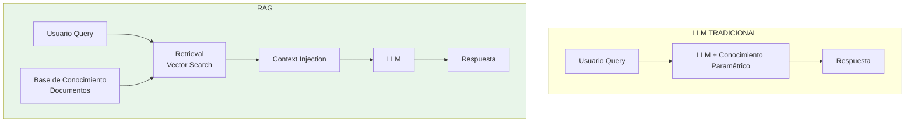
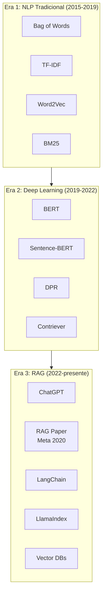
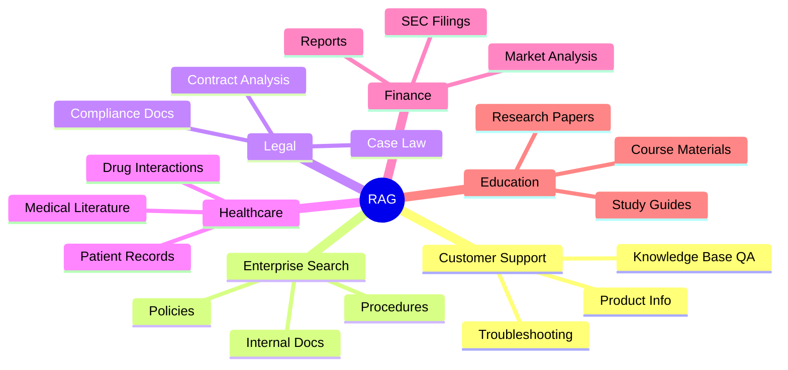
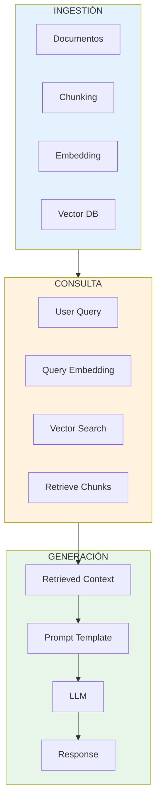
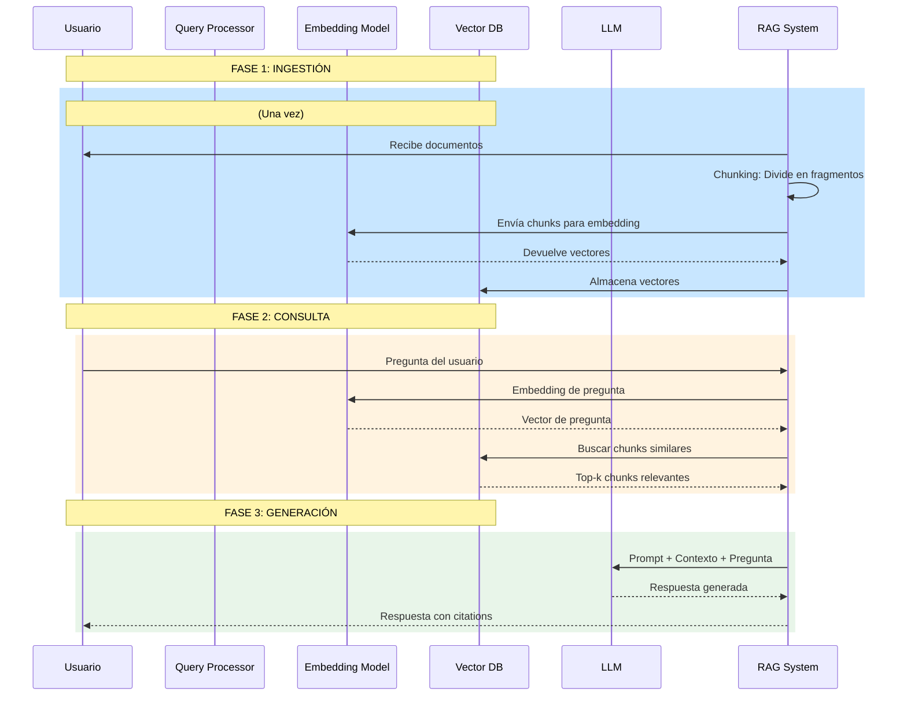
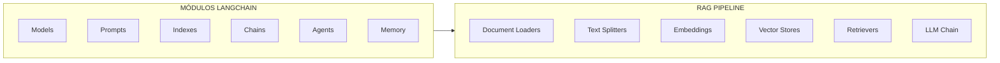
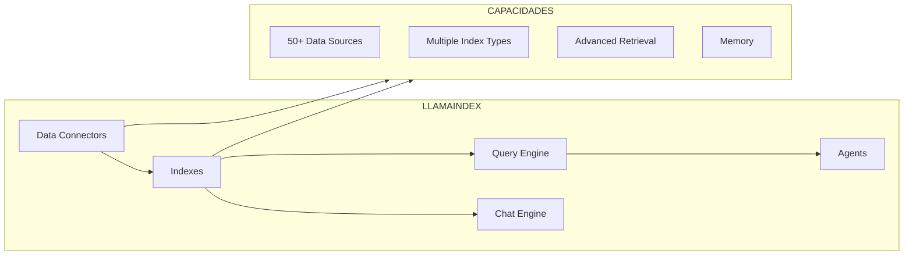
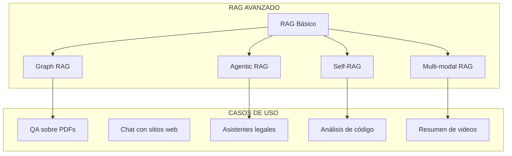

# Clase 5: Introducción a RAG (Retrieval-Augmented Generation)

## Duración
**4 horas (240 minutos)**

---

## Objetivos de Aprendizaje

Al finalizar esta clase, el estudiante será capaz de:

1. **Comprender** qué es RAG y por qué es importante
2. **Explicar** la arquitectura básica de un sistema RAG
3. **Identificar** los componentes fundamentales de RAG
4. **Implementar** un sistema RAG básico con LangChain
5. **Diferenciar** entre diferentes estrategias de retrieval
6. **Evaluar** la calidad de las respuestas generadas

---

## Contenidos Detallados

### 5.1 Fundamentos de RAG (50 minutos)

#### 5.1.1 ¿Qué es RAG?

Retrieval-Augmented Generation (RAG) es una arquitectura que combina la recuperación de información con la generación de texto. El objetivo es enable Large Language Models (LLMs) para acceder a información externa y generar respuestas más precisas y actualizadas.



#### 5.1.2 ¿Por qué RAG?

```
┌─────────────────────────────────────────────────────────────────┐
│                    PROBLEMAS DE LLMs SOLO                        │
├─────────────────────────────────────────────────────────────────┤
│                                                                  │
│  1. CONOCIMIENTO FEOUDO (Hallucinations)                        │
│     ├── Genera información incorrecta con confianza             │
│     ├── No puede verificar sus respuestas                       │
│     └── Difícil de auditar                                      │
│                                                                  │
│  2. DATOS DESACTUALIZADOS                                      │
│     ├── Conocimiento limitado a fecha de entrenamiento          │
│     ├── No puede acceder a información en tiempo real          │
│     └── Costoso re-entrenar                                     │
│                                                                  │
│  3. FALTA DE FUENTE                                             │
│     ├── No cita fuentes de información                         │
│     ├── Usuario no puede verificar respuestas                   │
│     └── No proporciona transparencia                            │
│                                                                  │
│  4. LIMITACIÓN DE CONTEXTO                                     │
│     ├── No puede procesar documentos muy largos                 │
│     └── No tiene acceso a bases de datos externas              │
│                                                                  │
└─────────────────────────────────────────────────────────────────┘
```

**Solución con RAG:**

```
┌─────────────────────────────────────────────────────────────────┐
│                    BENEFICIOS DE RAG                             │
├─────────────────────────────────────────────────────────────────┤
│                                                                  │
│  ✓ DATOS ACTUALIZADOS                                           │
│    → Acceso a documentos en tiempo real                         │
│    → No requiere reentrenamiento                                │
│                                                                  │
│  ✓ RESPUESTAS FUNDAMENTADAS                                     │
│    → Respuestas basadas en evidencia retrieved                 │
│    → Citas y referencias a fuentes                             │
│    → Reducción de alucinaciones                                 │
│                                                                  │
│  ✓ TRANSPARENCIA                                                │
│    → Usuario puede verificar fuentes                            │
│    → Auditable y explicable                                     │
│                                                                  │
│  ✓ COSTO-EFECTIVO                                               │
│    → No reentrenamiento de LLM                                 │
│    → Actualización continua de conocimiento                     │
│                                                                  │
└─────────────────────────────────────────────────────────────────┘
```

#### 5.1.3 Evolución Histórica



#### 5.1.4 Casos de Uso



### 5.2 Arquitectura de RAG (45 minutos)

#### 5.2.1 Arquitectura General



#### 5.2.2 Flujo Detallado de RAG



#### 5.2.3 Componentes Clave

```
┌─────────────────────────────────────────────────────────────────┐
│                    COMPONENTES DE RAG                           │
├─────────────────────────────────────────────────────────────────┤
│                                                                  │
│  1. DOCUMENT LOADER (Cargador de Documentos)                   │
│     ├── PDF, Word, HTML, Markdown                               │
│     ├── Configuración de página/encoding                         │
│     └── Limpieza de texto                                       │
│                                                                  │
│  2. TEXT CHUNKER (Fragmentador)                                │
│     ├── Tamaño de chunk (characters, tokens)                     │
│     ├── Solapamiento (overlap)                                  │
│     └── Estrategia (recursiva, semántica)                       │
│                                                                  │
│  3. EMBEDDING MODEL (Modelo de Embedding)                       │
│     ├── OpenAI: text-embedding-ada-002                         │
│     ├── HuggingFace: sentence-transformers                      │
│     ├── Open Source: all-MiniLM-L6-v2                           │
│     └── Dimensiones: 384, 768, 1536                             │
│                                                                  │
│  4. VECTOR DATABASE (Base de Datos Vectorial)                   │
│     ├── ChromaDB, FAISS, Pinecone, Weaviate                     │
│     ├── Indexación eficiente                                    │
│     └── Búsqueda por similitud                                   │
│                                                                  │
│  5. RETRIEVER (Recuperador)                                    │
│     ├── Similarity search                                       │
│     ├── MMR (Maximal Marginal Relevance)                        │
│     └── Hybrid search                                            │
│                                                                  │
│  6. LLM (Modelo de Lenguaje)                                   │
│     ├── GPT-4, Claude, Llama                                    │
│     ├── Prompt engineering                                       │
│     └── Chain-of-thought                                         │
│                                                                  │
└─────────────────────────────────────────────────────────────────┘
```

### 5.3 LangChain para RAG (60 minutos)

#### 5.3.1 Introducción a LangChain

LangChain es un framework para desarrollar aplicaciones basadas en LLMs. Proporciona abstracciones para cada componente del pipeline RAG.



#### 5.3.2 Instalación

```bash
# LangChain core
pip install langchain>=0.1.0

# LangChain community (integrations)
pip install langchain-community>=0.0.10

# OpenAI integration
pip install openai>=1.0.0

# Document loaders
pip install pypdf
pip install python-docx
pip install unstructured

# Vector stores
pip install chromadb
pip install faiss-cpu

# Embeddings
pip install sentence-transformers

# Environment
pip install python-dotenv
```

#### 5.3.3 Ejemplo Básico de RAG

```python
"""
RAG Básico con LangChain
========================
Ejemplo completo de sistema RAG
"""

import os
from pathlib import Path
from dotenv import load_dotenv

# Cargar API key
load_dotenv()
os.environ["OPENAI_API_KEY"] = os.getenv("OPENAI_API_KEY", "your-api-key")

from langchain_community.document_loaders import TextLoader
from langchain.text_splitter import RecursiveCharacterTextSplitter
from langchain_openai import OpenAIEmbeddings
from langchain_community.vectorstores import Chroma
from langchain_openai import ChatOpenAI
from langchain.chains import RetrievalQA
from langchain.prompts import PromptTemplate

# ============================================
# PASO 1: Cargar Documentos
# ============================================

def load_documents(directory: str = "documents"):
    """
    Carga documentos desde directorio
    
    Args:
        directory: Ruta al directorio de documentos
        
    Returns:
        Lista de documentos
    """
    docs = []
    docs_dir = Path(directory)
    
    for file_path in docs_dir.rglob("*"):
        if file_path.suffix in ['.txt', '.md', '.pdf', '.docx']:
            try:
                if file_path.suffix == '.txt':
                    loader = TextLoader(str(file_path))
                # Agregar más loaders según extensión
                
                loaded_docs = loader.load()
                docs.extend(loaded_docs)
                print(f"✓ Loaded: {file_path.name}")
            except Exception as e:
                print(f"✗ Error loading {file_path.name}: {e}")
    
    return docs

# ============================================
# PASO 2: Fragmentar Documentos (Chunking)
# ============================================

def split_documents(documents, chunk_size=1000, chunk_overlap=200):
    """
    Fragmenta documentos en chunks
    
    Args:
        documents: Lista de documentos
        chunk_size: Tamaño máximo de chunk en caracteres
        chunk_overlap: Solapamiento entre chunks
        
    Returns:
        Lista de chunks
    """
    text_splitter = RecursiveCharacterTextSplitter(
        chunk_size=chunk_size,
        chunk_overlap=chunk_overlap,
        length_function=len,
        separators=["\n\n", "\n", " ", ""]
    )
    
    chunks = text_splitter.split_documents(documents)
    
    print(f"Split {len(documents)} documents into {len(chunks)} chunks")
    
    return chunks

# ============================================
# PASO 3: Crear Embeddings y Vector Store
# ============================================

def create_vector_store(chunks, persist_directory="vector_store"):
    """
    Crea vector store con embeddings
    
    Args:
        chunks: Lista de chunks
        persist_directory: Directorio para persistir el vector store
        
    Returns:
        Vector store
    """
    # Crear embeddings
    embeddings = OpenAIEmbeddings(
        model="text-embedding-ada-002",
        openai_api_key=os.getenv("OPENAI_API_KEY")
    )
    
    # Crear vector store con Chroma
    vector_store = Chroma.from_documents(
        documents=chunks,
        embedding=embeddings,
        persist_directory=persist_directory
    )
    
    # Persistir
    vector_store.persist()
    
    print(f"Vector store created with {vector_store._collection.count()} embeddings")
    
    return vector_store

# ============================================
# PASO 4: Configurar RAG Chain
# ============================================

def create_rag_chain(vector_store):
    """
    Crea chain de RAG
    
    Args:
        vector_store: Vector store con documentos
        
    Returns:
        RAG chain
    """
    # Configurar LLM
    llm = ChatOpenAI(
        model_name="gpt-3.5-turbo",
        temperature=0,
        openai_api_key=os.getenv("OPENAI_API_KEY")
    )
    
    # Configurar retriever
    retriever = vector_store.as_retriever(
        search_type="similarity",
        search_kwargs={"k": 3}
    )
    
    # Template de prompt
    prompt_template = """Use the following pieces of context to answer the question at the end.
    
If you don't know the answer based on the context, say that you don't know.
Don't try to make up an answer.

Context:
{context}

Question: {question}

Answer in a helpful and informative way:"""

    PROMPT = PromptTemplate(
        template=prompt_template,
        input_variables=["context", "question"]
    )
    
    # Crear chain
    chain = RetrievalQA.from_chain_type(
        llm=llm,
        chain_type="stuff",
        retriever=retriever,
        return_source_documents=True,
        chain_type_kwargs={"prompt": PROMPT}
    )
    
    return chain

# ============================================
# EJECUCIÓN COMPLETA
# ============================================

def main():
    """
    Ejecuta pipeline RAG completo
    """
    print("="*60)
    print("RAG SYSTEM - INITIALIZATION")
    print("="*60)
    
    # 1. Cargar documentos
    print("\n[1/4] Loading documents...")
    documents = load_documents("documents")
    
    if not documents:
        print("No documents found. Creating sample document...")
        from langchain.schema import Document
        documents = [
            Document(
                page_content="LangChain is a framework for developing applications powered by language models. It enables applications that are data-aware and agentic.",
                metadata={"source": "sample.txt"}
            )
        ]
    
    # 2. Split documents
    print("\n[2/4] Splitting documents...")
    chunks = split_documents(documents)
    
    # 3. Create vector store
    print("\n[3/4] Creating vector store...")
    vector_store = create_vector_store(chunks)
    
    # 4. Create RAG chain
    print("\n[4/4] Creating RAG chain...")
    chain = create_rag_chain(vector_store)
    
    print("\n" + "="*60)
    print("RAG SYSTEM - READY")
    print("="*60)
    
    # Ejemplo de consulta
    query = "What is LangChain?"
    print(f"\nQuery: {query}")
    
    result = chain({"query": query})
    
    print(f"\nAnswer: {result['result']}")
    print(f"\nSource documents: {len(result['source_documents'])}")
    
    return chain


if __name__ == "__main__":
    rag_chain = main()
    
    # Loop interactivo
    print("\n" + "="*60)
    print("INTERACTIVE MODE - Enter your questions")
    print("="*60)
    
    while True:
        query = input("\nYou: ")
        if query.lower() in ['exit', 'quit', 'q']:
            break
        
        result = rag_chain({"query": query})
        print(f"\nAssistant: {result['result']}")
```

#### 5.3.4 Más Loaders de Documentos

```python
"""
Advanced Document Loaders
=========================
Ejemplos de diferentes loaders en LangChain
"""

# PDF Loader
from langchain_community.document_loaders import PyPDFLoader

def load_pdf(file_path: str):
    """Carga documento PDF"""
    loader = PyPDFLoader(file_path)
    pages = loader.load_and_split()
    
    for page in pages:
        print(f"Page {page.metadata['page']}: {len(page.page_content)} chars")
    
    return pages

# Web Loader
from langchain_community.document_loaders import WebBaseLoader

def load_webpage(url: str):
    """Carga contenido de página web"""
    loader = WebBaseLoader(url)
    docs = loader.load()
    return docs

# Directory Loader
from langchain_community.document_loaders import DirectoryLoader

def load_directory(directory: str):
    """Carga todos los documentos de un directorio"""
    loader = DirectoryLoader(
        directory,
        glob="**/*",
        loader_cls=TextLoader,
        show_progress=True
    )
    docs = loader.load()
    return docs

# Notion Loader
from langchain_community.document_loaders import NotionLoader

def load_notion(database_id: str):
    """Carga desde Notion database"""
    loader = NotionLoader(database_id)
    docs = loader.load()
    return docs
```

#### 5.3.5 Diferentes Estrategias de Retrieval

```python
"""
Advanced Retrieval Strategies
==============================
Implementación de diferentes estrategias de retrieval
"""

from langchain_community.vectorstores import Chroma
from langchain_openai import OpenAIEmbeddings
from langchain.retrievers import BM25Retriever
from langchain.retrievers.multi_query import MultiQueryRetriever
from langchain.chains import LLMChain
from langchain.prompts import PromptTemplate
from langchain_openai import ChatOpenAI

class AdvancedRetrieval:
    """
    Implementa diferentes estrategias de retrieval
    """
    
    def __init__(self, vector_store):
        self.vector_store = vector_store
    
    def similarity_search(self, query: str, k: int = 4):
        """
        Búsqueda por similitud simple
        
        Args:
            query: Consulta del usuario
            k: Número de documentos a recuperar
            
        Returns:
            Lista de documentos
        """
        return self.vector_store.similarity_search(query, k=k)
    
    def similarity_search_with_score(self, query: str, k: int = 4):
        """
        Búsqueda por similitud con scores
        
        Returns:
            Lista de (documento, score)
        """
        return self.vector_store.similarity_search_with_score(query, k=k)
    
    def mmr_retrieval(self, query: str, k: int = 4, fetch_k: int = 20, lambda_mult: float = 0.5):
        """
        Maximum Marginal Relevance retrieval
        Diversifica los resultados para evitar redundancia
        
        Args:
            query: Consulta
            k: Número final de documentos
            fetch_k: Número de documentos a buscar inicialmente
            lambda_mult: Balance entre relevancia y diversidad (0=máxima diversidad, 1=máxima relevancia)
        """
        return self.vector_store.max_marginal_relevance_search(
            query,
            k=k,
            fetch_k=fetch_k,
            lambda_mult=lambda_mult
        )
    
    def create_multi_query_retriever(self, llm, k: int = 4):
        """
        MultiQuery Retriever
        Genera múltiples queries para mejorar recall
        
        Returns:
            MultiQuery Retriever
        """
        prompt_template = """You are an AI assistant. Your task is to generate multiple different versions of the user's question to help retrieve relevant documents.
        
Original question: {question}

Please generate 3-5 different versions of this question that capture different aspects or ways the question might be asked."""
        
        prompt = PromptTemplate.from_template(prompt_template)
        llm_chain = LLMChain(llm=llm, prompt=prompt)
        
        retriever = MultiQueryRetriever(
            retriever=self.vector_store.as_retriever(),
            llm_chain=llm_chain,
            parser_key="lines"
        )
        
        return retriever
    
    def create_hybrid_search(self, documents, k: int = 4):
        """
        Búsqueda híbrida combinando BM25 y vectores
        
        Args:
            documents: Lista de documentos
            k: Número de documentos
            
        Returns:
            Híbrido retriever
        """
        # BM25
        bm25_retriever = BM25Retriever.from_documents(documents)
        bm25_retriever.k = k
        
        # Vector
        vector_retriever = self.vector_store.as_retriever(k=k)
        
        # Combinar
        from langchain.retrievers import EnsembleRetriever
        
        ensemble = EnsembleRetriever(
            retrievers=[bm25_retriever, vector_retriever],
            weights=[0.5, 0.5]
        )
        
        return ensemble


# Ejemplo de uso
def demo_advanced_retrieval():
    """Demuestra diferentes estrategias"""
    
    # Crear vector store (suponiendo que ya existe)
    embeddings = OpenAIEmbeddings()
    vector_store = Chroma(embedding_function=embeddings)
    
    advanced = AdvancedRetrieval(vector_store)
    
    query = "What is LangChain?"
    
    # 1. Similitud simple
    results = advanced.similarity_search(query, k=4)
    
    # 2. Con scores
    results_with_scores = advanced.similarity_search_with_score(query, k=4)
    
    # 3. MMR
    mmr_results = advanced.mmr_retrieval(query, k=4, lambda_mult=0.7)
    
    # 4. Multi-query
    llm = ChatOpenAI(model_name="gpt-3.5-turbo")
    multi_retriever = advanced.create_multi_query_retriever(llm, k=4)
    multi_results = multi_retriever.get_relevant_documents(query)
    
    return results, mmr_results, multi_results
```

### 5.4 LlamaIndex (35 minutos)

#### 5.4.1 Introducción a LlamaIndex

LlamaIndex es otro framework popular para construir sistemas RAG, con un enfoque más orientado a la indexación y recuperación.



#### 5.4.2 Ejemplo con LlamaIndex

```python
"""
RAG con LlamaIndex
===================
Implementación de RAG usando LlamaIndex
"""

import os
from dotenv import load_dotenv

load_dotenv()
os.environ["OPENAI_API_KEY"] = os.getenv("OPENAI_API_KEY", "your-api-key")

from llama_index import (
    SimpleDirectoryReader,
    VectorStoreIndex,
    ServiceContext,
    PromptTemplate
)
from llama_index.llms import OpenAI
from llama_index.node_parser import SimpleNodeParser
from llama_index.vector_stores import ChromaVectorStore
from llama_index.storage import StorageContext

class LlamaIndexRAG:
    """
    Sistema RAG usando LlamaIndex
    """
    
    def __init__(self, persist_dir="index_storage"):
        self.persist_dir = persist_dir
        self.llm = OpenAI(model="gpt-3.5-turbo", temperature=0)
        
    def load_and_index(self, documents_dir: str):
        """
        Carga documentos y crea índice
        
        Args:
            documents_dir: Directorio con documentos
        """
        # Cargar documentos
        print(f"Loading documents from {documents_dir}...")
        documents = SimpleDirectoryReader(documents_dir).load_data()
        
        # Configurar service context
        service_context = ServiceContext.from_defaults(
            llm=self.llm,
            embed_model="text-embedding-ada-002",
            node_parser=SimpleNodeParser.from_defaults(
                chunk_size=1000,
                chunk_overlap=200
            )
        )
        
        # Crear índice
        print("Creating index...")
        self.index = VectorStoreIndex.from_documents(
            documents,
            service_context=service_context,
            show_progress=True
        )
        
        # Persistir índice
        self.index.storage_context.persist(persist_dir=self.persist_dir)
        
        print(f"Index created and saved to {self.persist_dir}")
        
    def load_existing_index(self):
        """
        Carga índice existente
        """
        from llama_index import load_index_from_storage
        
        storage_context = StorageContext.from_defaults(
            persist_dir=self.persist_dir
        )
        
        self.index = load_index_from_storage(storage_context)
        print(f"Index loaded from {self.persist_dir}")
    
    def query(self, question: str, verbose=False):
        """
        Responde pregunta usando RAG
        
        Args:
            question: Pregunta del usuario
            verbose: Si True, muestra fuentes
            
        Returns:
            Respuesta con fuentes
        """
        # Configurar query engine
        query_engine = self.index.as_query_engine(
            similarity_top_k=3,
            response_mode="compact",
            verbose=verbose
        )
        
        # Ejecutar query
        response = query_engine.query(question)
        
        return response
    
    def chat(self, message: str):
        """
        Chat conversacional con memoria
        
        Args:
            message: Mensaje del usuario
            
        Returns:
            Respuesta
        """
        # Usar chat engine con memoria
        chat_engine = self.index.as_chat_engine(
            chat_mode="context",
            verbose=True
        )
        
        response = chat_engine.chat(message)
        
        return response


# EJEMPLO DE USO
def main():
    """Ejecuta demo de LlamaIndex RAG"""
    
    # Crear RAG system
    rag = LlamaIndexRAG(persist_dir="llama_index_storage")
    
    # Indexar documentos
    rag.load_and_index("documents")
    
    # Hacer preguntas
    questions = [
        "What is LangChain?",
        "How does RAG work?",
        "What are the main components of a RAG system?"
    ]
    
    for q in questions:
        print(f"\n{'='*50}")
        print(f"Question: {q}")
        print('='*50)
        
        response = rag.query(q, verbose=True)
        
        print(f"\nAnswer: {response}")
        print(f"\nSources: {len(response.source_nodes)} documents")
    
    # Chat conversacional
    print("\n" + "="*50)
    print("CHAT MODE")
    print("="*50)
    
    chat_engine = rag.index.as_chat_engine(chat_mode="condense_plus_context")
    
    response = chat_engine.chat("Tell me more about that")
    print(f"Assistant: {response}")


if __name__ == "__main__":
    main()
```

#### 5.4.3 Comparación LangChain vs LlamaIndex

```
┌─────────────────────────────────────────────────────────────────┐
│                LANGCHAIN vs LLAMAINDEX                          │
├─────────────────────────────────────────────────────────────────┤
│                                                                  │
│  LANGCHAIN                                                       │
│  ├── Enfoque: Framework general de LLM                         │
│  ├── Flexible: Más control sobre componentes                    │
│  ├── Ecosistema: Más integraciones                              │
│  ├── Curva de aprendizaje: Moderada                             │
│  ├── Mejor para: Agentes, chains complejas                     │
│                                                                  │
│  LLAMAINDEX                                                     │
│  ├── Enfoque: Optimizado para RAG                              │
│  ├── Simple: API más directa para retrieval                    │
│  ├── Indexación: Tipos de índices especializados               │
│  ├── Curva de aprendizaje: Más fácil                            │
│  └── Mejor para: Búsqueda y问答                                  │
│                                                                  │
│  NOTA: Ambos pueden usarse juntos                              │
│                                                                  │
└─────────────────────────────────────────────────────────────────┘
```

### 5.5 Métricas de Evaluación (25 minutos)

#### 5.5.1 Métricas de Retrieval

```python
"""
Evaluation Metrics for RAG
===========================
Métricas para evaluar sistemas RAG
"""

import numpy as np
from typing import List, Dict, Tuple
from dataclasses import dataclass

@dataclass
class RetrievalMetrics:
    """Métricas de retrieval"""
    precision_at_k: float
    recall_at_k: float
    mrr: float  # Mean Reciprocal Rank
    ndcg: float  # Normalized Discounted Cumulative Gain

class RAGEvaluator:
    """
    Evaluador de sistemas RAG
    """
    
    def __init__(self):
        self.results = []
    
    def add_result(self, query: str, retrieved_docs: List[str], 
                   relevant_docs: List[str]):
        """
        Añade resultado para evaluación
        
        Args:
            query: Query del usuario
            retrieved_docs: Documentos recuperados
            relevant_docs: Documentos relevantes (ground truth)
        """
        self.results.append({
            'query': query,
            'retrieved': retrieved_docs,
            'relevant': relevant_docs
        })
    
    def precision_at_k(self, retrieved: List[str], relevant: List[str], k: int) -> float:
        """
        Precisión@k: Proportion of retrieved docs that are relevant
        
        Args:
            retrieved: Documentos recuperados
            relevant: Documentos relevantes
            k: Top k documentos
        """
        retrieved_k = set(retrieved[:k])
        relevant_set = set(relevant)
        
        if k == 0:
            return 0.0
        
        return len(retrieved_k & relevant_set) / k
    
    def recall_at_k(self, retrieved: List[str], relevant: List[str], k: int) -> float:
        """
        Recall@k: Proportion of relevant docs that were retrieved
        
        Args:
            retrieved: Documentos recuperados
            relevant: Documentos relevantes
            k: Top k documentos
        """
        retrieved_k = set(retrieved[:k])
        relevant_set = set(relevant)
        
        if len(relevant_set) == 0:
            return 0.0
        
        return len(retrieved_k & relevant_set) / len(relevant_set)
    
    def mean_reciprocal_rank(self, retrieved: List[str], relevant: List[str]) -> float:
        """
        MRR: Mean Reciprocal Rank
        
        Returns:
            1/rank donde r es el rank del primer documento relevante
        """
        for i, doc in enumerate(retrieved, 1):
            if doc in relevant:
                return 1.0 / i
        return 0.0
    
    def ndcg_at_k(self, retrieved: List[str], relevant: List[str], k: int) -> float:
        """
        NDCG@k: Normalized Discounted Cumulative Gain
        
        Args:
            retrieved: Documentos recuperados (ordenados por relevancia)
            relevant: Documentos relevantes
            k: Top k
        """
        # Calcular DCG
        dcg = 0.0
        for i, doc in enumerate(retrieved[:k], 1):
            if doc in relevant:
                dcg += 1.0 / np.log2(i + 1)
        
        # Calcular IDCG (ideal DCG)
        ideal_retrieved = list(relevant)[:k]
        idcg = 0.0
        for i, doc in enumerate(ideal_retrieved, 1):
            idcg += 1.0 / np.log2(i + 1)
        
        if idcg == 0:
            return 0.0
        
        return dcg / idcg
    
    def evaluate_all(self, k: int = 5) -> Dict:
        """
        Evalúa todos los resultados
        
        Args:
            k: Top k para métricas
            
        Returns:
            Diccionario con métricas promediadas
        """
        if not self.results:
            return {}
        
        precisions = []
        recalls = []
        mrrs = []
        ndcgs = []
        
        for result in self.results:
            retrieved = result['retrieved']
            relevant = result['relevant']
            
            precisions.append(self.precision_at_k(retrieved, relevant, k))
            recalls.append(self.recall_at_k(retrieved, relevant, k))
            mrrs.append(self.mean_reciprocal_rank(retrieved, relevant))
            ndcgs.append(self.ndcg_at_k(retrieved, relevant, k))
        
        return {
            f'precision@{k}': np.mean(precisions),
            f'recall@{k}': np.mean(recalls),
            'mrr': np.mean(mrrs),
            f'ndcg@{k}': np.mean(ndcgs)
        }
    
    def evaluate_retrieval(self, query: str, response: Dict) -> Dict:
        """
        Evalúa retrieval para una query
        
        Returns:
            Métricas de retrieval
        """
        retrieved = [node.text for node in response.get('source_nodes', [])]
        # En práctica, compare con ground truth
        
        metrics = {
            'num_retrieved': len(retrieved),
            'avg_similarity': np.mean([
                node.score for node in response.get('source_nodes', [])
            ]) if response.get('source_nodes') else 0
        }
        
        return metrics


# Ejemplo de uso
def demo_evaluation():
    """Demuestra evaluación de RAG"""
    
    evaluator = RAGEvaluator()
    
    # Añadir resultados
    evaluator.add_result(
        query="What is LangChain?",
        retrieved_docs=["doc1", "doc2", "doc3", "doc4"],
        relevant_docs=["doc1", "doc3", "doc5"]
    )
    
    evaluator.add_result(
        query="How does RAG work?",
        retrieved_docs=["doc2", "doc1", "doc6"],
        relevant_docs=["doc2", "doc6"]
    )
    
    # Evaluar
    metrics = evaluator.evaluate_all(k=3)
    
    print("Retrieval Evaluation Metrics:")
    for metric, value in metrics.items():
        print(f"  {metric}: {value:.4f}")
    
    return metrics
```

### 5.6 Casos de Uso Avanzados (25 minutos)



```python
"""
Advanced RAG Patterns
=====================
Patrones avanzados de RAG
"""

# ============================================
# 1. Multi-Modal RAG
# ============================================

class MultiModalRAG:
    """
    RAG que maneja múltiples tipos de contenido
    (texto, imágenes, tablas)
    """
    
    def __init__(self):
        self.components = {
            'text': TextPipeline(),
            'image': ImagePipeline(),
            'table': TablePipeline()
        }
    
    def process_document(self, document):
        """Procesa documento multimodal"""
        sections = self._split_by_modality(document)
        
        results = {}
        for modality, content in sections.items():
            results[modality] = self.components[modality].process(content)
        
        return results
    
    def query(self, question: str):
        """Responde pregunta considerando todos los modalities"""
        # Buscar en cada modality
        text_results = self.components['text'].search(question)
        image_results = self.components['image'].search(question)
        table_results = self.components['table'].search(question)
        
        # Fusionar resultados
        return self._fuse_results(text_results, image_results, table_results)


# ============================================
# 2. Agentic RAG
# ============================================

class AgenticRAG:
    """
    RAG con agente que decide cómo buscar
    """
    
    def __init__(self, llm):
        self.llm = llm
        self.tools = [
            {"name": "search_docs", "description": "Search in documents"},
            {"name": "web_search", "description": "Search the web"},
            {"name": "calculate", "description": "Perform calculations"},
            {"name": "query_db", "description": "Query database"}
        ]
    
    def query(self, question: str):
        """Query con agente"""
        # Decidir plan de acción
        plan = self._create_plan(question)
        
        results = []
        for step in plan:
            if step['tool'] == 'search_docs':
                result = self._search_documents(step['query'])
            elif step['tool'] == 'web_search':
                result = self._web_search(step['query'])
            # ...
            results.append(result)
        
        # Generar respuesta final
        return self._generate_response(question, results)


# ============================================
# 3. Graph RAG
# ============================================

class GraphRAG:
    """
    RAG que usa grafos de conocimiento
    """
    
    def __init__(self):
        self.graph = None  # Knowledge Graph
        self.vector_store = None
    
    def process_documents(self, documents):
        """Procesa documentos extrayendo entidades y relaciones"""
        for doc in documents:
            # Extraer entidades
            entities = self._extract_entities(doc)
            
            # Extraer relaciones
            relations = self._extract_relations(entities)
            
            # Añadir al grafo
            self._add_to_graph(entities, relations)
            
            # Añadir a vector store
            self._add_to_vector_store(doc)
    
    def query(self, question: str):
        """Query usando grafo + vectors"""
        # Búsqueda en grafo
        graph_results = self._query_graph(question)
        
        # Búsqueda en vectores
        vector_results = self._query_vectors(question)
        
        # Fusionar usando PageRank u otra técnica
        return self._fuse_graph_vector(graph_results, vector_results)
```

---

## Resumen de Puntos Clave

### Fundamentos de RAG
1. **RAG**: Combina retrieval con generación
2. **Ventajas**: Reduce alucinaciones, datos actualizados, citas
3. **Componentes**: Loader → Chunking → Embedding → Vector DB → Retrieval → LLM

### Arquitectura
1. **Ingestión**: Cargar, fragmentar, embeber, indexar
2. **Query**: Embeber query, buscar, recuperar contexto
3. **Generación**: Combinar contexto con prompt, generar respuesta

### Herramientas
1. **LangChain**: Framework general, flexible
2. **LlamaIndex**: Optimizado para RAG
3. **Vector DBs**: ChromaDB, FAISS, Pinecone

### Estrategias de Retrieval
1. **Similarity Search**: Básica por similitud de vectores
2. **MMR**: Diversifica resultados
3. **Hybrid**: Combina BM25 + vectores

---

## Referencias Externas

1. **RAG Paper (Meta)**
   - URL: https://arxiv.org/abs/2005.11401
   - Descripción: Paper original de RAG

2. **LangChain Documentation**
   - URL: https://python.langchain.com/docs/
   - Descripción: Documentación oficial de LangChain

3. **LlamaIndex Documentation**
   - URL: https://docs.llamaindex.ai/
   - Descripción: Documentación de LlamaIndex

4. **Pinecone RAG Guide**
   - URL: https://www.pinecone.io/learn/rag/
   - Descripción: Guía completa de RAG

5. **OpenAI Embeddings Guide**
   - URL: https://platform.openai.com/docs/guides/embeddings
   - Descripción: Documentación de embeddings

6. **Vector Database Comparison**
   - URL: https://arxiv.org/abs/2303.13553
   - Descripción: Comparación de bases de datos vectoriales

7. **RAG Survey 2024**
   - URL: https://arxiv.org/abs/2312.10997
   - Descripción: Survey comprehensivo de RAG

8. **ChromaDB Documentation**
   - URL: https://docs.trychroma.com/
   - Descripción: Documentación de ChromaDB

---

## Ejercicios Resueltos

### Ejercicio: RAG Chatbot Completo

```python
"""
EJERCICIO RESUELTO: RAG Chatbot Completo
=========================================
Sistema RAG funcional con interfaz de chat
"""

import os
import streamlit as st
from pathlib import Path
from dotenv import load_dotenv
from datetime import datetime

# LangChain
from langchain_community.document_loaders import TextLoader, PyPDFLoader
from langchain.text_splitter import RecursiveCharacterTextSplitter
from langchain_openai import OpenAIEmbeddings, ChatOpenAI
from langchain_community.vectorstores import Chroma
from langchain.chains import ConversationalRetrievalChain
from langchain.memory import ConversationBufferMemory
from langchain.prompts import PromptTemplate

load_dotenv()

class RAGChatbot:
    """
    Chatbot RAG completo con memoria conversacional
    """
    
    def __init__(self, persist_dir="chatbot_store"):
        self.persist_dir = persist_dir
        self.chain = None
        self.chat_history = []
        
    def initialize(self, documents_dir="documents"):
        """
        Inicializa el chatbot con documentos
        
        Args:
            documents_dir: Directorio con documentos
        """
        # Cargar documentos
        print("Loading documents...")
        documents = self._load_documents(documents_dir)
        
        # Split documents
        print("Splitting documents...")
        chunks = self._split_documents(documents)
        
        # Create embeddings
        print("Creating embeddings...")
        embeddings = OpenAIEmbeddings(
            model="text-embedding-ada-002"
        )
        
        # Create vector store
        print("Creating vector store...")
        self.vectorstore = Chroma.from_documents(
            documents=chunks,
            embedding=embeddings,
            persist_directory=self.persist_dir
        )
        
        # Create memory
        memory = ConversationBufferMemory(
            memory_key="chat_history",
            output_key="answer",
            return_messages=True
        )
        
        # Create LLM
        llm = ChatOpenAI(
            model="gpt-3.5-turbo",
            temperature=0.7
        )
        
        # Create chain
        self.chain = ConversationalRetrievalChain.from_llm(
            llm=llm,
            retriever=self.vectorstore.as_retriever(
                search_kwargs={"k": 3}
            ),
            memory=memory,
            combine_docs_chain_kwargs={
                "prompt": self._get_prompt_template()
            }
        )
        
        print("Chatbot initialized!")
    
    def _load_documents(self, directory):
        """Carga documentos de varias fuentes"""
        documents = []
        
        # Text files
        for file in Path(directory).glob("**/*.txt"):
            try:
                loader = TextLoader(str(file))
                documents.extend(loader.load())
            except Exception as e:
                print(f"Error loading {file}: {e}")
        
        # PDFs
        for file in Path(directory).glob("**/*.pdf"):
            try:
                loader = PyPDFLoader(str(file))
                documents.extend(loader.load())
            except Exception as e:
                print(f"Error loading {file}: {e}")
        
        return documents
    
    def _split_documents(self, documents):
        """Fragmenta documentos"""
        splitter = RecursiveCharacterTextSplitter(
            chunk_size=1000,
            chunk_overlap=200,
            length_function=len
        )
        return splitter.split_documents(documents)
    
    def _get_prompt_template(self):
        """Retorna template de prompt"""
        template = """You are a helpful AI assistant that answers questions based on the provided context.

Use the following pieces of context to answer the question at the end. If you don't know the answer based on the context, say that you don't know.

{context}

Question: {question}

Helpful Answer:"""
        
        return PromptTemplate(
            template=template,
            input_variables=["context", "question"]
        )
    
    def chat(self, query):
        """
        Procesa pregunta del usuario
        
        Args:
            query: Pregunta del usuario
            
        Returns:
            Respuesta y fuentes
        """
        if not self.chain:
            return "Chatbot not initialized. Please call initialize() first."
        
        result = self.chain({"question": query, "chat_history": self.chat_history})
        
        # Guardar historial
        self.chat_history.append((query, result["answer"]))
        
        return result["answer"], result.get("source_documents", [])
    
    def get_sources(self, query):
        """Obtiene fuentes para una query sin generar respuesta completa"""
        docs = self.vectorstore.similarity_search(query, k=3)
        return docs


# ============================================
# INTERFAZ STREAMLIT
# ============================================

def main():
    """Interfaz Streamlit"""
    
    st.set_page_config(
        page_title="RAG Chatbot",
        page_icon="🤖",
        layout="wide"
    )
    
    st.title("🤖 RAG Chatbot")
    st.markdown("Ask questions about your documents!")
    
    # Inicializar chatbot
    if 'chatbot' not in st.session_state:
        with st.spinner("Initializing chatbot..."):
            chatbot = RAGChatbot(persist_dir="chatbot_store")
            
            # Create sample documents if none exist
            Path("documents").mkdir(exist_ok=True)
            if not list(Path("documents").glob("*")):
                sample_content = """
# Sample Document
This is a sample document about LangChain.
LangChain is a framework for developing applications powered by language models.
It provides tools for building LLM applications including RAG systems.
                """
                (Path("documents") / "sample.txt").write_text(sample_content)
            
            chatbot.initialize("documents")
            st.session_state.chatbot = chatbot
    
    # Chat interface
    if "messages" not in st.session_state:
        st.session_state.messages = []
    
    # Display chat history
    for message in st.session_state.messages:
        with st.chat_message(message["role"]):
            st.markdown(message["content"])
            if "sources" in message:
                with st.expander("Sources"):
                    for i, doc in enumerate(message["sources"]):
                        st.markdown(f"**Source {i+1}:** {doc.page_content[:200]}...")
    
    # Chat input
    if prompt := st.chat_input("Ask a question..."):
        # Add user message
        st.session_state.messages.append({"role": "user", "content": prompt})
        with st.chat_message("user"):
            st.markdown(prompt)
        
        # Get response
        with st.chat_message("assistant"):
            with st.spinner("Thinking..."):
                chatbot = st.session_state.chatbot
                response, sources = chatbot.chat(prompt)
                
                st.markdown(response)
                
                # Show sources
                with st.expander("Sources"):
                    for i, doc in enumerate(sources):
                        st.markdown(f"**Source {i+1}:** {doc.page_content[:300]}...")
        
        # Add assistant message
        st.session_state.messages.append({
            "role": "assistant",
            "content": response,
            "sources": sources
        })


if __name__ == "__main__":
    # Run standalone mode
    chatbot = RAGChatbot()
    
    # Create sample documents
    Path("documents").mkdir(exist_ok=True)
    (Path("documents") / "sample.txt").write_text("LangChain is a framework...")
    
    # Initialize
    chatbot.initialize("documents")
    
    # Interactive mode
    print("\n" + "="*50)
    print("RAG Chatbot - Interactive Mode")
    print("="*50)
    
    while True:
        query = input("\nYou: ")
        if query.lower() in ['exit', 'quit', 'q']:
            break
        
        response, sources = chatbot.chat(query)
        print(f"\nAssistant: {response}")
        
        if sources:
            print(f"\nSources ({len(sources)}):")
            for i, src in enumerate(sources, 1):
                print(f"  {i}. {src.page_content[:100]}...")
```

---

**Fin de la Clase 5**
