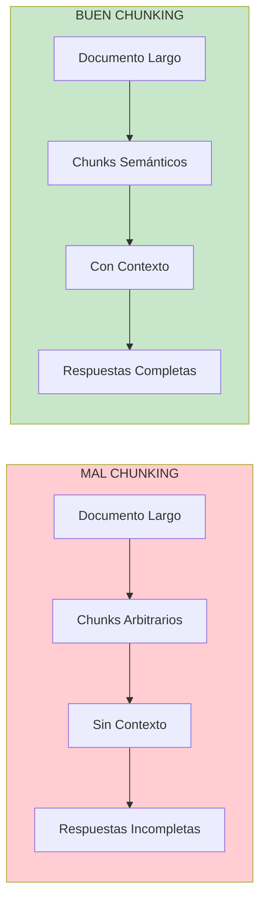
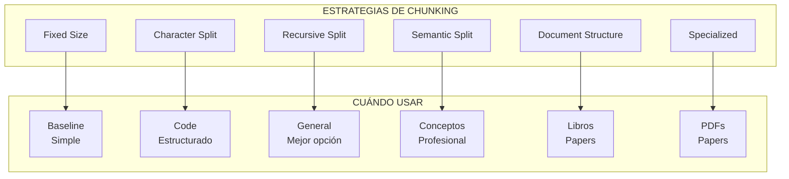
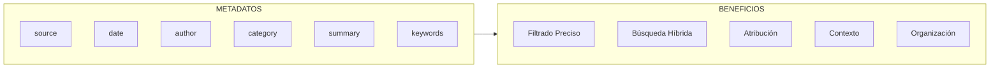

# Clase 6: Preprocesamiento de Documentos para RAG

## Dururación
**4 horas (240 minutos)**

---

## Objetivos de Aprendizaje

Al finalizar esta clase, el estudiante será capaz de:

1. **Implementar** diferentes estrategias de chunking de texto
2. **Aplicar** técnicas de enriquecimiento de metadatos
3. **Optimizar** el preprocesamiento para diferentes tipos de documentos
4. **Utilizar** spaCy y NLTK para procesamiento de lenguaje natural
5. **Diseñar** pipelines de preprocesamiento eficientes
6. **Evaluar** la calidad del chunking

---

## Contenidos Detallados

### 6.1 Fundamentos del Chunking (50 minutos)

#### 6.1.1 ¿Por qué es importante el Chunking?

El chunking es el proceso de dividir documentos largos en fragmentos más pequeños. La calidad del chunking直接影响 la calidad de las respuestas del RAG.



#### 6.1.2 El Problema del Tamaño de Contexto

```
┌─────────────────────────────────────────────────────────────────┐
│                LIMITACIONES DE CONTEXTO                         │
├─────────────────────────────────────────────────────────────────┤
│                                                                  │
│  LLM                    │  Max Tokens  │  Chunk Size Sugerido   │
│  ────────────────────────────────────────────────────────────── │
│  GPT-3.5-turbo         │     4,096    │     ~500-750          │
│  GPT-3.5-turbo-16k    │    16,384    │    ~2,000-3,000       │
│  GPT-4                 │     8,192    │    ~1,000-1,500       │
│  GPT-4-32k             │    32,768    │    ~4,000-6,000       │
│  Claude 2              │    100,000   │    ~10,000-15,000     │
│  Llama 2 (7B)          │     4,096    │     ~500-750          │
│                                                                  │
│  NOTA: Tokens ~ 4 caracteres en inglés, ~ 2 caracteres en       │
│        español. Aproximadamente 0.75 palabras por token.       │
│                                                                  │
└─────────────────────────────────────────────────────────────────┘
```

#### 6.1.3 Estrategias de Chunking



### 6.2 Estrategias de Chunking en Detalle (55 minutos)

#### 6.2.1 Fixed Size Chunking

```python
"""
Fixed Size Chunking
===================
Estrategia simple pero funcional
"""

from typing import List, Generator
from dataclasses import dataclass

@dataclass
class Chunk:
    """Representa un chunk de texto"""
    content: str
    start_index: int
    end_index: int
    chunk_id: int

def fixed_size_chunk(
    text: str,
    chunk_size: int = 1000,
    chunk_overlap: int = 200
) -> List[Chunk]:
    """
    Divide texto en chunks de tamaño fijo
    
    Args:
        text: Texto a dividir
        chunk_size: Tamaño máximo del chunk
        chunk_overlap: Solapamiento entre chunks
        
    Returns:
        Lista de chunks
    """
    chunks = []
    start = 0
    chunk_id = 0
    
    while start < len(text):
        end = start + chunk_size
        chunk_text = text[start:end]
        
        if chunk_text.strip():
            chunks.append(Chunk(
                content=chunk_text,
                start_index=start,
                end_index=end,
                chunk_id=chunk_id
            ))
            chunk_id += 1
        
        start = end - chunk_overlap
    
    return chunks


def chunk_text_by_tokens(
    text: str,
    tokenizer,
    chunk_size: int = 500,
    chunk_overlap: int = 50
) -> List[Chunk]:
    """
    Divide texto basándose en tokens en lugar de caracteres
    
    Args:
        text: Texto a dividir
        tokenizer: Tokenizer (Tiktoken, HuggingFace)
        chunk_size: Número máximo de tokens
        chunk_overlap: Solapamiento en tokens
        
    Returns:
        Lista de chunks
    """
    # Tokenizar texto completo
    tokens = tokenizer.encode(text)
    
    chunks = []
    chunk_id = 0
    start = 0
    
    while start < len(tokens):
        end = start + chunk_size
        chunk_tokens = tokens[start:end]
        
        # Decodificar a texto
        chunk_text = tokenizer.decode(chunk_tokens)
        
        if chunk_text.strip():
            # Calcular posiciones en texto original
            start_char = len(tokenizer.decode(tokens[:start]))
            end_char = len(tokenizer.decode(tokens[:end]))
            
            chunks.append(Chunk(
                content=chunk_text,
                start_index=start_char,
                end_index=end_char,
                chunk_id=chunk_id
            ))
            chunk_id += 1
        
        start = end - chunk_overlap
    
    return chunks


# Ejemplo de uso con tiktoken
def example_fixed_chunking():
    """Ejemplo con tiktoken"""
    import tiktoken
    
    text = """
    LangChain is a framework for developing applications powered by language models.
    It provides tools for building LLM applications including RAG systems.
    The framework enables developers to create sophisticated AI applications.
    This includes chatbots, question answering systems, and autonomous agents.
    LangChain supports multiple LLM providers including OpenAI, Anthropic, and open source models.
    """
    
    # Usar encoding de OpenAI
    encoding = tiktoken.get_encoding("cl100k_base")
    
    # Chunking basado en tokens
    chunks = chunk_text_by_tokens(
        text,
        tokenizer=encoding,
        chunk_size=50,
        chunk_overlap=10
    )
    
    print(f"Created {len(chunks)} chunks:\n")
    for i, chunk in enumerate(chunks):
        tokens = len(encoding.encode(chunk.content))
        print(f"Chunk {i}: {tokens} tokens")
        print(f"  {chunk.content[:80]}...")
        print()
```

#### 6.2.2 Recursive Character Splitting

```python
"""
Recursive Character Text Splitter
=================================
Implementación de splitting recursivo de LangChain
"""

import re
from typing import List, Callable

class RecursiveCharacterTextSplitter:
    """
    Divide texto recursivamente intentando mantener
    unidades semánticas juntas (párrafos, oraciones, palabras)
    """
    
    def __init__(
        self,
        separators: List[str] = None,
        chunk_size: int = 1000,
        chunk_overlap: int = 200,
        length_function: Callable = len,
        is_separator_regex: bool = False,
        keep_separator: bool = True
    ):
        """
        Args:
            separators: Lista de separadores en orden de prioridad
            chunk_size: Tamaño máximo del chunk
            chunk_overlap: Solapamiento entre chunks
            length_function: Función para calcular longitud
            is_separator_regex: Si los separadores son regex
            keep_separator: Mantener separador en el chunk
        """
        if separators is None:
            separators = ["\n\n", "\n", ". ", " ", ""]
        
        self.separators = separators
        self.chunk_size = chunk_size
        self.chunk_overlap = chunk_overlap
        self.length_function = length_function
        self.is_separator_regex = is_separator_regex
        self.keep_separator = keep_separator
    
    def split_text(self, text: str) -> List[str]:
        """
        Divide texto en chunks
        
        Args:
            text: Texto a dividir
            
        Returns:
            Lista de chunks
        """
        final_chunks = []
        
        # Intentar separar con cada separador
        splits = self._split_text(text, self.separators, [])
        
        # Merge splits en chunks del tamaño correcto
        for split in splits:
            if self.length_function(split) < self.chunk_size:
                # Añadir a último chunk si hay overlap disponible
                if final_chunks and \
                   self.length_function(final_chunks[-1]) + self.length_function(split) < self.chunk_size:
                    final_chunks[-1] += self._get_separator() + split
                else:
                    final_chunks.append(split)
            else:
                # Split es muy grande, dividir recursivamente
                if split.strip():
                    sub_splits = self.split_text(split)
                    final_chunks.extend(sub_splits)
        
        return final_chunks
    
    def _split_text(
        self,
        text: str,
        separators: List[str],
        splits: List[str]
    ) -> List[str]:
        """Divide texto recursivamente"""
        separator = separators[0]
        new_separators = separators[1:]
        
        if separator:
            # Dividir por separador
            if self.is_separator_regex:
                parts = re.split(separator, text)
            else:
                parts = text.split(separator)
        else:
            parts = list(text)
        
        # Unir splits con separador
        good_splits = []
        for part in parts:
            if part.strip():
                if self.keep_separator and separator and good_splits:
                    good_splits[-1] += separator + part
                else:
                    good_splits.append(part)
        
        # Recursión si hay más separadores
        if new_separators:
            for text in good_splits:
                splits.extend(self._split_text(text, new_separators, splits))
        else:
            splits.extend(good_splits)
        
        return splits
    
    def _get_separator(self) -> str:
        """Obtiene separador actual"""
        if self.separators[0] == "\n\n":
            return "\n\n"
        elif self.separators[0] == "\n":
            return "\n"
        elif self.separators[0] == ". ":
            return ". "
        else:
            return " "


# Ejemplo de uso
def example_recursive_splitter():
    """Ejemplo del splitter recursivo"""
    
    text = """
    Chapter 1: Introduction to Machine Learning
    
    Machine learning is a subset of artificial intelligence that enables systems to learn and improve from experience.
    
    1.1 What is Machine Learning?
    
    Machine learning focuses on developing algorithms that can access data and use it to learn for themselves.
    The process of learning begins with observations or data, such as examples, direct experience, or instruction.
    
    1.2 Types of Machine Learning
    
    There are three main types of machine learning:
    
    1. Supervised Learning - Learning with labeled data
    2. Unsupervised Learning - Learning from unlabeled data
    3. Reinforcement Learning - Learning through interaction
    
    1.3 Applications
    
    Machine learning has numerous applications across various industries including healthcare, finance, and transportation.
    """
    
    splitter = RecursiveCharacterTextSplitter(
        chunk_size=300,
        chunk_overlap=50,
        separators=["\n\n", "\n", ". ", ", ", " ", ""]
    )
    
    chunks = splitter.split_text(text)
    
    print(f"Created {len(chunks)} chunks:\n")
    for i, chunk in enumerate(chunks):
        print(f"--- Chunk {i} ({len(chunk)} chars) ---")
        print(chunk[:150] + "..." if len(chunk) > 150 else chunk)
        print()
```

#### 6.2.3 Semantic Chunking

```python
"""
Semantic Chunking
================
Chunking basado en significado semántico
"""

import numpy as np
from typing import List, Tuple
from sklearn.metrics.pairwise import cosine_similarity

class SemanticChunker:
    """
    Divide texto basándose en cambios de significado
    Usa embeddings para detectar transiciones semánticas
    """
    
    def __init__(
        self,
        embedding_model,
        threshold: float = 0.3,
        min_chunk_size: int = 100,
        max_chunk_size: int = 1000
    ):
        """
        Args:
            embedding_model: Modelo para generar embeddings
            threshold: Umbral de similitud para detectar cambios
            min_chunk_size: Tamaño mínimo de chunk
            max_chunk_size: Tamaño máximo de chunk
        """
        self.embedding_model = embedding_model
        self.threshold = threshold
        self.min_chunk_size = min_chunk_size
        self.max_chunk_size = max_chunk_size
    
    def split_text(self, text: str) -> List[str]:
        """
        Divide texto semánticamente
        
        Args:
            text: Texto a dividir
            
        Returns:
            Lista de chunks semánticos
        """
        # Dividir en oraciones
        sentences = self._split_into_sentences(text)
        
        if len(sentences) == 0:
            return [text]
        
        # Generar embeddings
        embeddings = []
        for sentence in sentences:
            emb = self.embedding_model.embed_query(sentence)
            embeddings.append(emb)
        
        # Calcular similitud entre oraciones adyacentes
        similarities = []
        for i in range(len(embeddings) - 1):
            sim = cosine_similarity([embeddings[i]], [embeddings[i+1]])[0][0]
            similarities.append(sim)
        
        # Encontrar puntos de corte donde la similitud baja
        break_points = [0]  # Siempre incluir primera oración
        
        for i, sim in enumerate(similarities):
            if sim < self.threshold:
                # Nuevo segmento
                break_points.append(i + 1)
        
        # Crear chunks
        chunks = []
        for i in range(len(break_points)):
            start_idx = break_points[i]
            end_idx = break_points[i + 1] if i + 1 < len(break_points) else len(sentences)
            
            chunk_text = " ".join(sentences[start_idx:end_idx])
            
            # Merge chunks pequeños o dividir chunks grandes
            if len(chunk_text) < self.min_chunk_size and chunks:
                chunks[-1] += " " + chunk_text
            elif len(chunk_text) > self.max_chunk_size:
                # Dividir por la mitad aproximadamente
                mid = len(sentences[start_idx:end_idx]) // 2
                chunks.append(" ".join(sentences[start_idx:start_idx + mid]))
                chunks.append(" ".join(sentences[start_idx + mid:end_idx]))
            else:
                chunks.append(chunk_text)
        
        return chunks
    
    def _split_into_sentences(self, text: str) -> List[str]:
        """Divide texto en oraciones"""
        import re
        # Dividir por . ! ? manteniendo el delimitador
        sentences = re.split(r'(?<=[.!?])\s+', text)
        return [s.strip() for s in sentences if s.strip()]


# Ejemplo de uso
def example_semantic_chunking():
    """Ejemplo de chunking semántico"""
    from langchain_openai import OpenAIEmbeddings
    
    # Crear embedding model
    embeddings = OpenAIEmbeddings()
    
    # Crear chunker
    chunker = SemanticChunker(
        embedding_model=embeddings,
        threshold=0.5,
        min_chunk_size=100,
        max_chunk_size=500
    )
    
    text = """
    Machine learning is revolutionizing how we build software.
    Neural networks are at the heart of modern deep learning.
    These architectures can learn complex patterns from data.
    Computer vision has benefited greatly from these advances.
    Image classification, object detection, and segmentation are now state-of-the-art.
    Natural language processing has also seen remarkable progress.
    Large language models can understand and generate human-like text.
    This has implications for search, summarization, and question answering.
    Healthcare applications are emerging rapidly.
    Medical imaging analysis is becoming automated.
    Drug discovery is being accelerated by AI models.
    The future of AI is both exciting and uncertain.
    """
    
    chunks = chunker.split_text(text)
    
    print(f"Created {len(chunks)} semantic chunks:\n")
    for i, chunk in enumerate(chunks):
        print(f"--- Chunk {i} ---")
        print(chunk[:200] + "..." if len(chunk) > 200 else chunk)
        print()
```

### 6.3 Enriquecimiento de Metadatos (40 minutos)

#### 6.3.1 ¿Por qué Metadatos?



```python
"""
Metadata Enrichment
==================
Enriquecimiento de metadatos para chunks
"""

from typing import Dict, List, Any
from datetime import datetime
from dataclasses import dataclass, field
import re

@dataclass
class EnrichedChunk:
    """Chunk con metadatos enriquecidos"""
    content: str
    metadata: Dict[str, Any] = field(default_factory=dict)

class MetadataEnricher:
    """
    Enriquece chunks con metadatos útiles
    """
    
    def __init__(self, llm=None):
        self.llm = llm
    
    def enrich_chunk(self, chunk: str, document_context: Dict = None) -> EnrichedChunk:
        """
        Enriquece un chunk con metadatos
        
        Args:
            chunk: Texto del chunk
            document_context: Contexto del documento original
            
        Returns:
            Chunk enriquecido
        """
        metadata = {}
        
        # Metadatos básicos
        metadata['char_count'] = len(chunk)
        metadata['word_count'] = len(chunk.split())
        metadata['sentence_count'] = len(re.split(r'[.!?]+', chunk))
        
        # Detectar idioma
        metadata['language'] = self._detect_language(chunk)
        
        # Entidades nombradas
        metadata['entities'] = self._extract_entities(chunk)
        
        # Palabras clave
        metadata['keywords'] = self._extract_keywords(chunk)
        
        # Resumen
        if self.llm:
            metadata['summary'] = self._generate_summary(chunk)
        
        # Combinar con contexto del documento
        if document_context:
            metadata.update(document_context)
        
        return EnrichedChunk(content=chunk, metadata=metadata)
    
    def enrich_batch(self, chunks: List[str], document_context: Dict = None) -> List[EnrichedChunk]:
        """Enriquece múltiples chunks"""
        return [self.enrich_chunk(chunk, document_context) for chunk in chunks]
    
    def _detect_language(self, text: str) -> str:
        """Detecta idioma del texto"""
        # Simple: contar palabras en español vs inglés
        spanish_indicators = ['el', 'la', 'los', 'las', 'un', 'una', 'de', 'que', 'es', 'en', 'con', 'por', 'para']
        english_indicators = ['the', 'a', 'an', 'of', 'is', 'in', 'with', 'by', 'for', 'to', 'and', 'or']
        
        text_lower = text.lower()
        
        spanish_count = sum(1 for word in spanish_indicators if f' {word} ' in f' {text_lower} ')
        english_count = sum(1 for word in english_indicators if f' {word} ' in f' {text_lower} ')
        
        return 'spanish' if spanish_count > english_count else 'english'
    
    def _extract_entities(self, text: str) -> List[str]:
        """Extrae entidades nombradas simples"""
        # Patrones simples para demo
        entities = []
        
        # Mayúsculas seguidas
        for match in re.finditer(r'\b[A-Z][a-z]+(?:\s+[A-Z][a-z]+)*\b', text):
            if len(match.group()) > 3:
                entities.append(match.group())
        
        return list(set(entities))[:10]  # Limitar a 10
    
    def _extract_keywords(self, text: str) -> List[str]:
        """Extrae palabras clave simples"""
        # Palabras comunes a excluir
        stopwords = {
            'the', 'a', 'an', 'is', 'are', 'was', 'were', 'be', 'been', 'being',
            'have', 'has', 'had', 'do', 'does', 'did', 'will', 'would', 'could',
            'should', 'may', 'might', 'must', 'shall', 'can', 'need', 'dare',
            'of', 'in', 'to', 'for', 'with', 'on', 'at', 'by', 'from', 'as',
            'into', 'through', 'during', 'before', 'after', 'above', 'below',
            'and', 'but', 'or', 'nor', 'so', 'yet', 'both', 'either', 'neither',
            'el', 'la', 'los', 'las', 'un', 'una', 'de', 'en', 'que', 'es', 'con',
            'por', 'para', 'del', 'al', 'se', 'lo', 'su', 'esta', 'este'
        }
        
        words = re.findall(r'\b[a-zA-ZáéíóúüñÁÉÍÓÚÜÑ]{4,}\b', text.lower())
        keywords = [w for w in words if w not in stopwords]
        
        # Frecuencia
        from collections import Counter
        word_freq = Counter(keywords)
        
        return [word for word, count in word_freq.most_common(5)]
    
    def _generate_summary(self, text: str) -> str:
        """Genera resumen del chunk usando LLM"""
        if not self.llm:
            return ""
        
        prompt = f"Give a brief 1-2 sentence summary of this text:\n\n{text[:500]}"
        
        response = self.llm.invoke(prompt)
        
        return response.content if hasattr(response, 'content') else str(response)
```

#### 6.3.2 Metadatos Estructurados

```python
"""
Structured Metadata
===================
Metadatos estructurados para diferentes tipos de documentos
"""

from datetime import datetime
from typing import Optional, List
from dataclasses import dataclass, field
import re

@dataclass
class DocumentMetadata:
    """Metadatos base para cualquier documento"""
    source: str
    created_at: datetime = field(default_factory=datetime.now)
    updated_at: Optional[datetime] = None
    file_type: str = ""
    file_path: str = ""
    title: str = ""
    author: str = ""
    
@dataclass
class ArticleMetadata(DocumentMetadata):
    """Metadatos específicos para artículos"""
    publication: str = ""
    publication_date: Optional[datetime] = None
    url: str = ""
    tags: List[str] = field(default_factory=list)
    category: str = ""
    
@dataclass  
class LegalDocumentMetadata(DocumentMetadata):
    """Metadatos para documentos legales"""
    jurisdiction: str = ""
    effective_date: Optional[datetime] = None
    expiration_date: Optional[datetime] = None
    parties: List[str] = field(default_factory=list)
    document_type: str = ""  # contract, policy, regulation
    
@dataclass
class CodeDocumentMetadata(DocumentMetadata):
    """Metadatos para código"""
    language: str = ""
    framework: str = ""
    repository: str = ""
    version: str = ""
    functions: List[str] = field(default_factory=list)
    classes: List[str] = field(default_factory=list)

class MetadataExtractor:
    """Extrae metadatos de diferentes tipos de documentos"""
    
    @staticmethod
    def from_pdf(pdf_path: str) -> DocumentMetadata:
        """Extrae metadatos de PDF"""
        # Usar PyPDF2 o pdfplumber
        import PyPDF2
        
        metadata = DocumentMetadata(
            source=pdf_path,
            file_type="pdf",
            file_path=pdf_path
        )
        
        with open(pdf_path, 'rb') as f:
            reader = PyPDF2.PdfReader(f)
            pdf_meta = reader.metadata
            
            if pdf_meta:
                metadata.title = pdf_meta.get('/Title', '')
                metadata.author = pdf_meta.get('/Author', '')
                metadata.updated_at = pdf_meta.get('/ModDate')
            
            metadata.page_count = len(reader.pages)
        
        return metadata
    
    @staticmethod
    def from_code(file_path: str) -> CodeDocumentMetadata:
        """Extrae metadatos de código"""
        import os
        
        ext = os.path.splitext(file_path)[1]
        language_map = {
            '.py': 'Python',
            '.js': 'JavaScript',
            '.ts': 'TypeScript',
            '.java': 'Java',
            '.cpp': 'C++',
            '.c': 'C',
            '.go': 'Go',
            '.rs': 'Rust'
        }
        
        metadata = CodeDocumentMetadata(
            source=file_path,
            file_type=ext,
            file_path=file_path,
            language=language_map.get(ext, 'Unknown')
        )
        
        # Extraer funciones y clases
        with open(file_path, 'r', encoding='utf-8') as f:
            content = f.read()
            
            # Función simple (para demo)
            functions = re.findall(r'def (\w+)\(', content)
            classes = re.findall(r'class (\w+)', content)
            
            metadata.functions = functions
            metadata.classes = classes
        
        return metadata
    
    @staticmethod
    def from_article(url: str, html_content: str) -> ArticleMetadata:
        """Extrae metadatos de artículo web"""
        from bs4 import BeautifulSoup
        
        soup = BeautifulSoup(html_content, 'html.parser')
        
        metadata = ArticleMetadata(
            source=url,
            url=url,
            file_type="html"
        )
        
        # Extraer del HTML
        if soup.title:
            metadata.title = soup.title.string
        
        # Meta tags
        author_tag = soup.find('meta', {'name': 'author'})
        if author_tag:
            metadata.author = author_tag.get('content', '')
        
        # Open Graph tags
        og_title = soup.find('meta', {'property': 'og:title'})
        if og_title:
            metadata.title = og_title.get('content', metadata.title)
        
        description = soup.find('meta', {'name': 'description'})
        if description:
            metadata.category = description.get('content', '')[:100]
        
        return metadata
```

### 6.4 Procesamiento con spaCy y NLTK (40 minutos)

#### 6.4.1 spaCy para NLP

```python
"""
spaCy para Preprocesamiento
============================
Uso de spaCy para procesamiento de texto
"""

import spacy
from typing import List, Tuple, Set

# Cargar modelo de español
nlp = spacy.load("es_core_news_sm")

class SpaCyProcessor:
    """
    Procesador de texto usando spaCy
    """
    
    def __init__(self, model_name: str = "es_core_news_sm"):
        self.nlp = spacy.load(model_name)
        
        # Añadir pipeline para español si no existe
        if not self.nlp.has_pipe("sentencizer"):
            self.nlp.add_pipe("sentencizer")
    
    def process(self, text: str):
        """Procesa texto con spaCy"""
        return self.nlp(text)
    
    def sentencize(self, text: str) -> List[str]:
        """
        Divide texto en oraciones
        
        Returns:
            Lista de oraciones
        """
        doc = self.nlp(text)
        return [sent.text.strip() for sent in doc.sents]
    
    def extract_entities(self, text: str) -> List[Tuple[str, str]]:
        """
        Extrae entidades nombradas
        
        Returns:
            Lista de (entidad, tipo_entidad)
        """
        doc = self.nlp(text)
        return [(ent.text, ent.label_) for ent in doc.ents]
    
    def extract_noun_phrases(self, text: str) -> List[str]:
        """Extrae frases nominales"""
        doc = self.nlp(text)
        return [np.text for np in doc.noun_chunks]
    
    def extract_keywords(self, text: str, top_n: int = 10) -> List[str]:
        """
        Extrae palabras clave usando POS tagging
        
        Args:
            text: Texto a procesar
            top_n: Número de keywords a devolver
            
        Returns:
            Lista de palabras clave
        """
        doc = self.nlp(text)
        
        # Extraer sustantivos y adjetivos importantes
        keywords = []
        for token in doc:
            if token.pos_ in ['NOUN', 'PROPN', 'ADJ'] and \
               not token.is_stop and \
               len(token.text) > 3:
                keywords.append(token.lemma_)
        
        # Frecuencia
        from collections import Counter
        keyword_freq = Counter(keywords)
        
        return [word for word, _ in keyword_freq.most_common(top_n)]
    
    def extract_relationships(self, text: str) -> List[dict]:
        """
        Extrae relaciones sujeto-verbo-objeto
        
        Returns:
            Lista de tripletas (sujeto, verbo, objeto)
        """
        doc = self.nlp(text)
        relationships = []
        
        for token in doc:
            if token.pos_ == "VERB":
                subject = self._get_subject(token)
                obj = self._get_object(token)
                
                if subject and obj:
                    relationships.append({
                        "subject": subject,
                        "verb": token.lemma_,
                        "object": obj
                    })
        
        return relationships
    
    def _get_subject(self, verb) -> str:
        """Obtiene sujeto de un verbo"""
        for token in verb.lefts:
            if token.dep_ in ["nsubj", "nsubjpass"]:
                return token.text
        return None
    
    def _get_object(self, verb) -> str:
        """Obtiene objeto de un verbo"""
        for token in verb.rights:
            if token.dep_ in ["dobj", "pobj", "attr"]:
                return token.text
        return None
    
    def get_part_of_speech_tags(self, text: str) -> List[Tuple[str, str]]:
        """
        Obtiene etiquetas POS
        
        Returns:
            Lista de (palabra, etiqueta POS)
        """
        doc = self.nlp(text)
        return [(token.text, token.pos_) for token in doc]
    
    def lemmatize(self, text: str) -> str:
        """Lemmatiza texto"""
        doc = self.nlp(text)
        return " ".join([token.lemma_ for token in doc])
    
    def remove_stopwords(self, text: str) -> str:
        """Elimina stopwords"""
        doc = self.nlp(text)
        return " ".join([
            token.text for token in doc 
            if not token.is_stop and not token.is_punct
        ])


# Ejemplo de uso
def example_spacy():
    """Ejemplo de procesamiento con spaCy"""
    
    processor = SpaCyProcessor()
    
    text = """
    Apple Inc. fue fundada en 1976 por Steve Jobs, Steve Wozniak y Ronald Wayne 
    en Cupertino, California. La empresa revolucionó la industria tecnológica 
    con productos como el iPhone, iPad y MacBook. Tim Cook se convirtió en CEO 
    en 2011 después de la muerte de Steve Jobs.
    """
    
    print("=== SpaCy Processing ===\n")
    
    # Oraciones
    sentences = processor.sentencize(text)
    print(f"Oraciones ({len(sentences)}):")
    for i, s in enumerate(sentences, 1):
        print(f"  {i}. {s}")
    
    # Entidades
    entities = processor.extract_entities(text)
    print(f"\nEntidades ({len(entities)}):")
    for entity, label in entities:
        print(f"  {entity} -> {label}")
    
    # Keywords
    keywords = processor.extract_keywords(text)
    print(f"\nKeywords: {keywords}")
    
    # POS tags
    pos_tags = processor.get_part_of_speech_tags(text)
    print(f"\nPOS Tags (primeros 10):")
    for word, tag in pos_tags[:10]:
        print(f"  {word}: {tag}")
```

#### 6.4.2 NLTK para NLP

```python
"""
NLTK para Preprocesamiento
==========================
Uso de NLTK para procesamiento de texto
"""

import nltk
from nltk.tokenize import word_tokenize, sent_tokenize
from nltk.corpus import stopwords
from nltk.stem import SnowballStemmer, WordNetLemmatizer
from nltk.tag import pos_tag
from nltk.chunk import ne_chunk
from nltk.probability import FreqDist
from typing import List, Set

# Descargar recursos necesarios
nltk.download('punkt', quiet=True)
nltk.download('stopwords', quiet=True)
nltk.download('averaged_perceptron_tagger', quiet=True)
nltk.download('wordnet', quiet=True)
nltk.download('maxent_ne_chunker', quiet=True)
nltk.download('words', quiet=True)

class NLTKProcessor:
    """
    Procesador de texto usando NLTK
    """
    
    def __init__(self, language: str = 'spanish'):
        self.stopwords = set(stopwords.words(language))
        self.stemmer = SnowballStemmer(language)
        self.lemmatizer = WordNetLemmatizer()
        self.language = language
    
    def tokenize_sentences(self, text: str) -> List[str]:
        """Tokeniza en oraciones"""
        return sent_tokenize(text, language='spanish' if self.language == 'spanish' else 'english')
    
    def tokenize_words(self, text: str) -> List[str]:
        """Tokeniza en palabras"""
        return word_tokenize(text, language='spanish' if self.language == 'spanish' else 'english')
    
    def remove_stopwords(self, text: str) -> str:
        """Elimina stopwords"""
        words = self.tokenize_words(text)
        filtered = [w for w in words if w.lower() not in self.stopwords]
        return ' '.join(filtered)
    
    def stem(self, text: str) -> str:
        """Aplica stemming"""
        words = self.tokenize_words(text)
        stemmed = [self.stemmer.stem(w) for w in words]
        return ' '.join(stemmed)
    
    def lemmatize(self, text: str) -> str:
        """Aplica lematización"""
        words = self.tokenize_words(text)
        lemmatized = [self.lemmatizer.lemmatize(w) for w in words]
        return ' '.join(lemmatized)
    
    def get_pos_tags(self, text: str) -> List[tuple]:
        """Obtiene etiquetas POS"""
        words = self.tokenize_words(text)
        return pos_tag(words)
    
    def extract_entities(self, text: str) -> List[str]:
        """Extrae entidades nombradas"""
        words = self.tokenize_words(text)
        tagged = pos_tag(words)
        tree = ne_chunk(tagged)
        
        entities = []
        for subtree in tree:
            if hasattr(subtree, 'label'):
                entities.append(' '.join([word for word, tag in subtree.leaves()]))
        
        return entities
    
    def word_frequency(self, text: str, top_n: int = 20) -> List[tuple]:
        """
        Calcula frecuencia de palabras
        
        Returns:
            Lista de (palabra, frecuencia)
        """
        words = self.tokenize_words(text.lower())
        words = [w for w in words if w.isalnum() and w not in self.stopwords]
        
        fdist = FreqDist(words)
        return fdist.most_common(top_n)
    
    def get_ngrams(self, text: str, n: int = 2) -> List[tuple]:
        """Obtiene n-gramas"""
        from nltk import ngrams
        
        words = self.tokenize_words(text.lower())
        return list(ngrams(words, n))
    
    def preprocess_for_rag(self, text: str) -> str:
        """
        Preprocesamiento completo para RAG
        
        1. Tokenizar oraciones
        2. Limpiar texto
        3. Eliminar stopwords
        4. Lematizar
        """
        # Tokenizar
        sentences = self.tokenize_sentences(text)
        
        processed_sentences = []
        for sent in sentences:
            # Tokenizar palabras
            words = self.tokenize_words(sent)
            
            # Limpiar y filtrar
            cleaned_words = []
            for w in words:
                w = w.lower()
                if w.isalnum() and w not in self.stopwords and len(w) > 2:
                    # Lematizar
                    lemma = self.lemmatizer.lemmatize(w)
                    cleaned_words.append(lemma)
            
            if cleaned_words:
                processed_sentences.append(' '.join(cleaned_words))
        
        return ' '.join(processed_sentences)


# Ejemplo de uso
def example_nltk():
    """Ejemplo de procesamiento con NLTK"""
    
    processor = NLTKProcessor(language='spanish')
    
    text = """
    La inteligencia artificial está transformando múltiples industrias.
    El aprendizaje automático permite a las máquinas aprender de datos.
    Las redes neuronales profundas han revolucionado el reconocimiento de imágenes.
    Los modelos de lenguaje grandes pueden generar texto coherente.
    """
    
    print("=== NLTK Processing ===\n")
    
    # Tokenización
    sentences = processor.tokenize_sentences(text)
    print(f"Oraciones ({len(sentences)}):")
    for i, s in enumerate(sentences, 1):
        print(f"  {i}. {s}")
    
    # Stopwords
    clean_text = processor.remove_stopwords(text)
    print(f"\nSin stopwords: {clean_text[:100]}...")
    
    # Frecuencia
    freq = processor.word_frequency(text)
    print(f"\nPalabras más frecuentes:")
    for word, count in freq[:10]:
        print(f"  {word}: {count}")
    
    # N-gramas
    bigrams = processor.get_ngrams(text, 2)
    print(f"\nBigramas: {bigrams[:10]}")
```

### 6.5 Pipeline Completo de Preprocesamiento (35 minutos)

```python
"""
Complete Preprocessing Pipeline
================================
Pipeline completo de preprocesamiento para RAG
"""

from typing import List, Dict, Optional, Callable
from dataclasses import dataclass
from pathlib import Path
import json
from datetime import datetime

from langchain_community.document_loaders import (
    TextLoader, PyPDFLoader, UnstructuredHTMLLoader
)
from langchain.text_splitter import RecursiveCharacterTextSplitter
from langchain_openai import OpenAIEmbeddings

from spacy.lang.es import Spanish

@dataclass
class ProcessedChunk:
    """Chunk procesado con metadata"""
    content: str
    metadata: Dict
    chunk_id: str
    document_id: str

class DocumentPreprocessor:
    """
    Pipeline completo de preprocesamiento de documentos para RAG
    """
    
    def __init__(
        self,
        chunk_size: int = 1000,
        chunk_overlap: int = 200,
        separators: List[str] = None,
        add_metadata: bool = True,
        enrich_with_ai: bool = False,
        llm = None
    ):
        """
        Args:
            chunk_size: Tamaño máximo de chunk
            chunk_overlap: Solapamiento entre chunks
            separators: Separadores para splitting
            add_metadata: Añadir metadatos básicos
            enrich_with_ai: Enriquecer con LLM
            llm: LLM para enriquecimiento
        """
        self.chunk_size = chunk_size
        self.chunk_overlap = chunk_overlap
        self.separators = separators or ["\n\n", "\n", ". ", " ", ""]
        self.add_metadata = add_metadata
        self.enrich_with_ai = enrich_with_ai
        self.llm = llm
        
        # Inicializar componentes
        self.text_splitter = RecursiveCharacterTextSplitter(
            chunk_size=chunk_size,
            chunk_overlap=chunk_overlap,
            separators=separators,
            length_function=len
        )
        
        # Procesador spaCy
        try:
            self.nlp = Spanish()
        except:
            self.nlp = None
    
    def load_document(self, file_path: str) -> List[Dict]:
        """
        Carga documento desde archivo
        
        Args:
            file_path: Ruta al archivo
            
        Returns:
            Lista de documentos con contenido y metadata
        """
        path = Path(file_path)
        suffix = path.suffix.lower()
        
        # Seleccionar loader
        if suffix == '.pdf':
            loader = PyPDFLoader(file_path)
        elif suffix == '.html':
            loader = UnstructuredHTMLLoader(file_path)
        else:
            loader = TextLoader(file_path, encoding='utf-8')
        
        docs = loader.load()
        
        # Añadir metadata adicional
        for doc in docs:
            doc.metadata['source'] = str(file_path)
            doc.metadata['file_name'] = path.name
            doc.metadata['file_type'] = suffix
            doc.metadata['loaded_at'] = datetime.now().isoformat()
        
        return docs
    
    def load_directory(self, directory: str, glob_pattern: str = "**/*") -> List[Dict]:
        """
        Carga todos los documentos de un directorio
        
        Args:
            directory: Ruta al directorio
            glob_pattern: Patrón glob para archivos
            
        Returns:
            Lista de documentos
        """
        docs = []
        dir_path = Path(directory)
        
        for file_path in dir_path.glob(glob_pattern):
            if file_path.is_file() and file_path.suffix in ['.txt', '.pdf', '.html', '.md']:
                try:
                    docs.extend(self.load_document(str(file_path)))
                except Exception as e:
                    print(f"Error loading {file_path}: {e}")
        
        return docs
    
    def split_documents(self, documents: List) -> List[ProcessedChunk]:
        """
        Divide documentos en chunks
        
        Args:
            documents: Lista de documentos
            
        Returns:
            Lista de chunks procesados
        """
        chunks = []
        
        for doc in documents:
            # Split documento
            texts = self.text_splitter.split_documents([doc])
            
            for i, text_doc in enumerate(texts):
                chunk_id = f"{doc.metadata.get('source', 'unknown')}_{i}"
                document_id = doc.metadata.get('source', 'unknown')
                
                # Crear chunk procesado
                chunk = ProcessedChunk(
                    content=text_doc.page_content,
                    metadata={
                        **doc.metadata,
                        'chunk_index': i,
                        'char_count': len(text_doc.page_content)
                    },
                    chunk_id=chunk_id,
                    document_id=document_id
                )
                
                # Añadir metadata NLP si está disponible
                if self.nlp:
                    chunk.metadata.update(self._extract_nlp_metadata(text_doc.page_content))
                
                chunks.append(chunk)
        
        return chunks
    
    def _extract_nlp_metadata(self, text: str) -> Dict:
        """Extrae metadata usando NLP"""
        if not self.nlp:
            return {}
        
        doc = self.nlp(text[:5000])  # Limitar para rendimiento
        
        return {
            'language': 'es',
            'sentence_count': len(list(doc.sents)),
            'entity_count': len(list(doc.ents)),
            'entities': [ent.text for ent in doc.ents][:10]
        }
    
    def enrich_chunk(self, chunk: ProcessedChunk) -> ProcessedChunk:
        """
        Enriquece chunk con metadata adicional
        
        Args:
            chunk: Chunk a enriquecer
            
        Returns:
            Chunk enriquecido
        """
        if not self.enrich_with_ai or not self.llm:
            return chunk
        
        # Generar resumen
        prompt = f"Resumen en 2-3 oraciones:\n\n{chunk.content[:500]}"
        
        try:
            response = self.llm.invoke(prompt)
            summary = response.content if hasattr(response, 'content') else str(response)
            chunk.metadata['ai_summary'] = summary
        except:
            pass
        
        return chunk
    
    def process_directory(
        self,
        directory: str,
        output_path: Optional[str] = None,
        glob_pattern: str = "**/*"
    ) -> List[ProcessedChunk]:
        """
        Procesa directorio completo
        
        Args:
            directory: Directorio con documentos
            output_path: Ruta para guardar chunks procesados
            glob_pattern: Patrón glob
            
        Returns:
            Lista de chunks procesados
        """
        # Cargar documentos
        print(f"Loading documents from {directory}...")
        documents = self.load_directory(directory, glob_pattern)
        print(f"Loaded {len(documents)} documents")
        
        # Split documentos
        print("Splitting documents...")
        chunks = self.split_documents(documents)
        print(f"Created {len(chunks)} chunks")
        
        # Enriquecer si está habilitado
        if self.enrich_with_ai:
            print("Enriching chunks with AI...")
            chunks = [self.enrich_chunk(c) for c in chunks]
        
        # Guardar si se especifica
        if output_path:
            self.save_chunks(chunks, output_path)
        
        return chunks
    
    def save_chunks(self, chunks: List[ProcessedChunk], output_path: str):
        """Guarda chunks procesados a archivo"""
        output = {
            'created_at': datetime.now().isoformat(),
            'chunk_count': len(chunks),
            'config': {
                'chunk_size': self.chunk_size,
                'chunk_overlap': self.chunk_overlap
            },
            'chunks': [
                {
                    'id': c.chunk_id,
                    'document_id': c.document_id,
                    'content': c.content,
                    'metadata': c.metadata
                }
                for c in chunks
            ]
        }
        
        with open(output_path, 'w', encoding='utf-8') as f:
            json.dump(output, f, ensure_ascii=False, indent=2)
        
        print(f"Saved {len(chunks)} chunks to {output_path}")
    
    def get_chunk_stats(self, chunks: List[ProcessedChunk]) -> Dict:
        """Obtiene estadísticas de los chunks"""
        if not chunks:
            return {}
        
        char_counts = [len(c.content) for c in chunks]
        word_counts = [len(c.content.split()) for c in chunks]
        
        return {
            'total_chunks': len(chunks),
            'total_chars': sum(char_counts),
            'total_words': sum(word_counts),
            'avg_chunk_size': sum(char_counts) / len(char_counts),
            'min_chunk_size': min(char_counts),
            'max_chunk_size': max(char_counts),
            'unique_documents': len(set(c.document_id for c in chunks))
        }


# Ejemplo de uso
def example_pipeline():
    """Ejemplo del pipeline completo"""
    
    from langchain_openai import ChatOpenAI
    
    # Crear LLM si se quiere enriquecer
    llm = ChatOpenAI(model="gpt-3.5-turbo", temperature=0)
    
    # Crear preprocessor
    preprocessor = DocumentPreprocessor(
        chunk_size=500,
        chunk_overlap=100,
        add_metadata=True,
        enrich_with_ai=False,
        llm=llm
    )
    
    # Crear documentos de prueba
    Path("test_docs").mkdir(exist_ok=True)
    
    doc1 = """
    La inteligencia artificial es una rama de la ciencia computacional.
    Se enfoca en crear sistemas que puedan realizar tareas que requieren inteligencia humana.
    Estas tareas incluyen reconocimiento de voz, visión computacional, y toma de decisiones.
    """
    
    doc2 = """
    El aprendizaje automático es un subcampo de la inteligencia artificial.
    Permite a las máquinas aprender de datos sin ser programadas explícitamente.
    Los algoritmos de aprendizaje automático mejoran automáticamente con la experiencia.
    """
    
    (Path("test_docs") / "doc1.txt").write_text(doc1)
    (Path("test_docs") / "doc2.txt").write_text(doc2)
    
    # Procesar directorio
    chunks = preprocessor.process_directory("test_docs")
    
    # Estadísticas
    stats = preprocessor.get_chunk_stats(chunks)
    print(f"\nChunk Statistics:")
    for key, value in stats.items():
        print(f"  {key}: {value}")
    
    # Mostrar chunks
    print(f"\nGenerated Chunks:")
    for chunk in chunks[:3]:
        print(f"\n--- {chunk.chunk_id} ---")
        print(f"Content: {chunk.content[:100]}...")
        print(f"Metadata: {chunk.metadata}")


if __name__ == "__main__":
    example_pipeline()
```

---

## Resumen de Puntos Clave

### Chunking
1. **Fijo**: Simple, puede cortar oraciones
2. **Recursivo**: Mejor para texto general
3. **Semántico**: Usa embeddings para división

### Metadatos
1. **Básicos**: source, date, author
2. **NLP**: entidades, keywords, POS tags
3. **AI**: resúmenes, categorías

### Herramientas
1. **spaCy**: Rápido, buena integración
2. **NLTK**: Completo, más opciones
3. **LangChain**: Abstracción de más alto nivel

### Mejores Prácticas
1. 500-1000 tokens por chunk
2. 10-20% de overlap
3. Enriquecer con metadata
4. Probar diferentes estrategias

---

## Referencias Externas

1. **LangChain Text Splitters**
   - URL: https://python.langchain.com/docs/modules/data_connection/document_transformers/
   - Descripción: Documentación de text splitters

2. **spaCy Documentation**
   - URL: https://spacy.io/usage
   - Descripción: Guía completa de spaCy

3. **NLTK Documentation**
   - URL: https://www.nltk.org/
   - Descripción: Documentación oficial de NLTK

4. **Chunking Strategies Guide**
   - URL: https://python.langchain.com/docs/modules/data_connection/document_transformers/text_splitters/recursive_text_splitter
   - Descripción: Estrategias de chunking

5. **Semantic Chunking**
   - URL: https://txt.cohere.com/semantic-chunking/
   - Descripción: Artículo sobre chunking semántico

6. **Tiktoken Documentation**
   - URL: https://github.com/openai/tiktoken
   - Descripción: Tokenizer de OpenAI

---

**Fin de la Clase 6**
