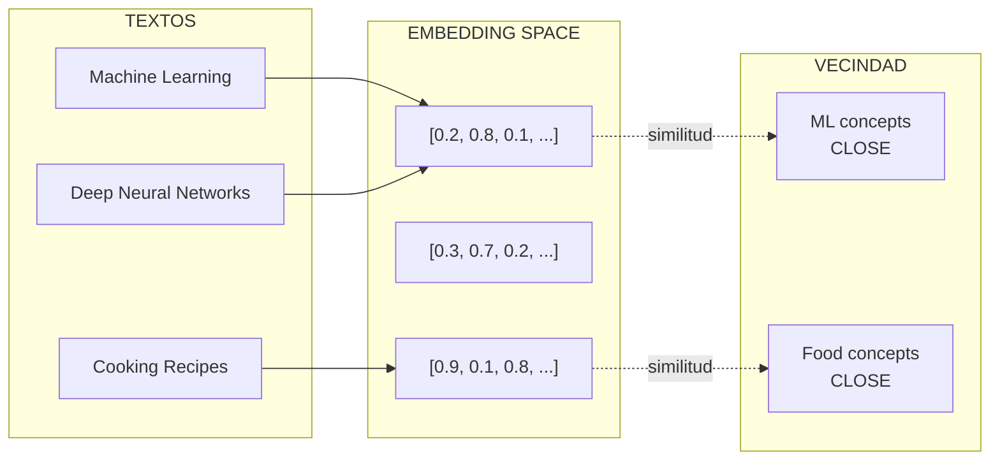
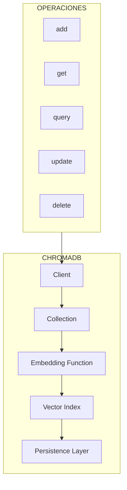
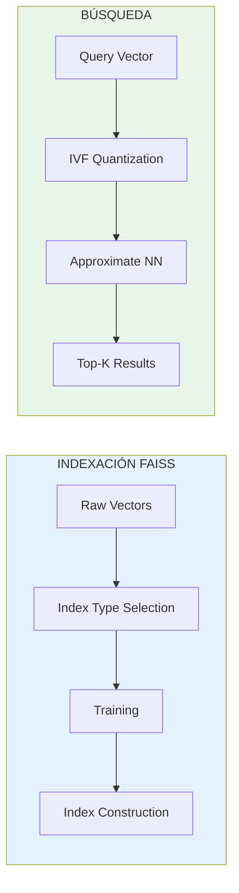

# Clase 7: Bases de Datos Vectoriales

## Duración
**4 horas (240 minutos)**

---

## Objetivos de Aprendizaje

Al finalizar esta clase, el estudiante será capaz de:

1. **Comprender** los fundamentos de embeddings y similitud vectorial
2. **Implementar** búsquedas en bases de datos vectoriales
3. **Comparar** diferentes soluciones de bases de datos vectoriales
4. **Optimizar** índices para búsqueda eficiente
5. **Implementar** búsqueda híbrida
6. **Diseñar** pipelines de indexación escalables

---

## Contenidos Detallados

### 7.1 Fundamentos de Embeddings (45 minutos)

#### 7.1.1 ¿Qué son los Embeddings?

Los embeddings son representaciones vectoriales densas de datos (texto, imágenes, audio) que capturan significado semántico. Vectores similares en el espacio vectorial representan conceptos similares.



#### 7.1.2 Tipos de Similitud

```
┌─────────────────────────────────────────────────────────────────┐
│                    MÉTRICAS DE SIMILITUD                         │
├─────────────────────────────────────────────────────────────────┤
│                                                                  │
│  1. COSINE SIMILARITY                                           │
│     ───────────────────                                         │
│     sim(A,B) = (A · B) / (||A|| × ||B||)                      │
│                                                                  │
│     • Rango: [-1, 1]                                           │
│     • Mejor para: Textos de diferenteslongitudes                  │
│     • Uso: Búsqueda semántica                                   │
│                                                                  │
│  2. EUCLIDEAN DISTANCE                                          │
│     ──────────────────────                                      │
│     dist(A,B) = √(Σ(ai - bi)²)                                 │
│                                                                  │
│     • Rango: [0, ∞)                                            │
│     • Mejor para: Recomendaciones, clustering                    │
│     • Uso: K-NN, anomaly detection                             │
│                                                                  │
│  3. DOT PRODUCT                                                 │
│     ────────────                                                │
│     sim(A,B) = Σ(ai × bi)                                      │
│                                                                  │
│     • Rango: (-∞, ∞)                                           │
│     • Mejor para: Normalized vectors                           │
│     • Uso: Búsqueda de máxima relevancia                        │
│                                                                  │
│  4. MANHATTAN DISTANCE                                          │
│     ────────────────────                                        │
│     dist(A,B) = Σ|ai - bi|                                     │
│                                                                  │
│     • Rango: [0, ∞)                                           │
│     • Mejor para: Datos categóricos                            │
│                                                                  │
└─────────────────────────────────────────────────────────────────┘
```

#### 7.1.3 Modelos de Embedding

```python
"""
Embedding Models
================
Comparación de modelos de embedding
"""

from typing import List, Dict
import numpy as np

class EmbeddingModels:
    """
    Comparación de diferentes modelos de embedding
    """
    
    MODELS = {
        'openai': {
            'name': 'text-embedding-ada-002',
            'dimensions': 1536,
            'max_tokens': 8191,
            'cost_per_1k': 0.0001
        },
        'openai_large': {
            'name': 'text-embedding-3-large',
            'dimensions': 3072,
            'max_tokens': 8191,
            'cost_per_1k': 0.00013
        },
        'sentence_transformers': {
            'name': 'all-MiniLM-L6-v2',
            'dimensions': 384,
            'max_tokens': 256,
            'cost_per_1k': 0  # Local
        },
        'huggingface': {
            'name': 'sentence-transformers/all-mpnet-base-v2',
            'dimensions': 768,
            'max_tokens': 384,
            'cost_per_1k': 0
        }
    }
    
    @staticmethod
    def cosine_similarity(a: np.ndarray, b: np.ndarray) -> float:
        """Calcula similitud coseno entre dos vectores"""
        dot_product = np.dot(a, b)
        norm_a = np.linalg.norm(a)
        norm_b = np.linalg.norm(b)
        
        if norm_a == 0 or norm_b == 0:
            return 0
        
        return dot_product / (norm_a * norm_b)
    
    @staticmethod
    def euclidean_distance(a: np.ndarray, b: np.ndarray) -> float:
        """Calcula distancia euclidiana"""
        return np.linalg.norm(a - b)
    
    @staticmethod
    def batch_cosine_similarity(query: np.ndarray, 
                                vectors: np.ndarray) -> np.ndarray:
        """
        Calcula similitud coseno entre query y múltiples vectores
        
        Args:
            query: Vector de query (1D)
            vectors: Matriz de vectores (2D)
            
        Returns:
            Array de similitudes
        """
        # Normalizar vectores
        query_norm = query / np.linalg.norm(query)
        vectors_norm = vectors / np.linalg.norm(vectors, axis=1, keepdims=True)
        
        # Calcular similitud
        similarities = np.dot(vectors_norm, query_norm)
        
        return similarities


# Ejemplo de uso
def example_embeddings():
    """Ejemplo de embeddings y similitud"""
    
    models = EmbeddingModels()
    
    # Similitud entre conceptos relacionados
    embedding_ai = np.array([0.8, 0.2, 0.1, 0.9])
    embedding_ml = np.array([0.7, 0.3, 0.1, 0.8])
    embedding_food = np.array([0.1, 0.9, 0.8, 0.2])
    
    # AI vs ML
    ai_ml_sim = models.cosine_similarity(embedding_ai, embedding_ml)
    print(f"AI vs ML similarity: {ai_ml_sim:.3f}")
    
    # AI vs Food
    ai_food_sim = models.cosine_similarity(embedding_ai, embedding_food)
    print(f"AI vs Food similarity: {ai_food_sim:.3f}")
    
    # Distancias
    ai_ml_dist = models.euclidean_distance(embedding_ai, embedding_ml)
    ai_food_dist = models.euclidean_distance(embedding_ai, embedding_food)
    print(f"AI-ML distance: {ai_ml_dist:.3f}")
    print(f"AI-Food distance: {ai_food_dist:.3f}")
```

### 7.2 ChromaDB (50 minutos)

#### 7.2.1 Introducción a ChromaDB



```python
"""
ChromaDB - Base de Datos Vectorial Local
==========================================
Implementación completa de ChromaDB
"""

import chromadb
from chromadb.config import Settings
from typing import List, Dict, Optional, Callable
import numpy as np

class ChromaDBClient:
    """
    Cliente para ChromaDB con funcionalidades avanzadas
    """
    
    def __init__(
        self,
        persist_directory: str = "./chroma_db",
        collection_name: str = "documents"
    ):
        """
        Args:
            persist_directory: Directorio para persistencia
            collection_name: Nombre de la colección
        """
        # Inicializar cliente persistente
        self.client = chromadb.PersistentClient(
            path=persist_directory
        )
        self.collection_name = collection_name
        self.collection = None
        
    def create_collection(
        self,
        name: str,
        metadata: Optional[Dict] = None,
        embedding_function: Optional[Callable] = None
    ):
        """
        Crea una nueva colección
        
        Args:
            name: Nombre de la colección
            metadata: Metadata opcional
            embedding_function: Función de embedding custom
        """
        self.collection = self.client.create_collection(
            name=name,
            metadata=metadata,
            embedding_function=embedding_function
        )
        return self.collection
    
    def get_or_create_collection(self, name: str):
        """Obtiene o crea colección"""
        self.collection = self.client.get_or_create_collection(name=name)
        return self.collection
    
    def add_documents(
        self,
        documents: List[str],
        ids: List[str],
        metadatas: Optional[List[Dict]] = None,
        embeddings: Optional[List[List[float]]] = None
    ):
        """
        Añade documentos a la colección
        
        Args:
            documents: Lista de textos
            ids: Lista de IDs únicos
            metadatas: Metadata para cada documento
            embeddings: Embeddings precalculados
        """
        if self.collection is None:
            self.get_or_create_collection(self.collection_name)
        
        self.collection.add(
            documents=documents,
            ids=ids,
            metadatas=metadatas,
            embeddings=embeddings
        )
    
    def query(
        self,
        query_texts: Optional[List[str]] = None,
        query_embeddings: Optional[List[List[float]]] = None,
        n_results: int = 5,
        where: Optional[Dict] = None,
        where_document: Optional[Dict] = None,
        include: Optional[List[str]] = ["documents", "metadatas", "distances"]
    ) -> Dict:
        """
        Consulta la colección
        
        Args:
            query_texts: Textos de query
            query_embeddings: Embeddings de query
            n_results: Número de resultados
            where: Filtro de metadata
            where_document: Filtro de contenido
            include: Qué incluir en resultados
            
        Returns:
            Resultados de la query
        """
        if self.collection is None:
            raise ValueError("No collection selected")
        
        results = self.collection.query(
            query_texts=query_texts,
            query_embeddings=query_embeddings,
            n_results=n_results,
            where=where,
            where_document=where_document,
            include=include
        )
        
        return results
    
    def get(
        self,
        ids: Optional[List[str]] = None,
        where: Optional[Dict] = None,
        limit: Optional[int] = None
    ) -> Dict:
        """Obtiene documentos por ID o filtro"""
        if self.collection is None:
            raise ValueError("No collection selected")
        
        return self.collection.get(
            ids=ids,
            where=where,
            limit=limit
        )
    
    def update_document(
        self,
        id: str,
        document: str,
        metadata: Optional[Dict] = None,
        embedding: Optional[List[float]] = None
    ):
        """Actualiza un documento"""
        if self.collection is None:
            raise ValueError("No collection selected")
        
        self.collection.update(
            ids=[id],
            documents=[document],
            metadatas=[metadata],
            embeddings=[embedding]
        )
    
    def delete(
        self,
        ids: Optional[List[str]] = None,
        where: Optional[Dict] = None,
        where_document: Optional[Dict] = None
    ):
        """Elimina documentos"""
        if self.collection is None:
            raise ValueError("No collection selected")
        
        self.collection.delete(
            ids=ids,
            where=where,
            where_document=where_document
        )
    
    def count(self) -> int:
        """Cuenta documentos en la colección"""
        if self.collection is None:
            raise ValueError("No collection selected")
        
        return self.collection.count()
    
    def peek(self, limit: int = 10) -> Dict:
        """Obtiene los primeros N documentos"""
        if self.collection is None:
            raise ValueError("No collection selected")
        
        return self.collection.peek(limit=limit)
    
    def list_collections(self) -> List[str]:
        """Lista todas las colecciones"""
        return [c.name for c in self.client.list_collections()]
    
    def delete_collection(self, name: str):
        """Elimina una colección"""
        self.client.delete_collection(name=name)
    
    def reset(self):
        """Resetea la base de datos"""
        self.client.reset()


# Ejemplo completo de uso
def example_chroma():
    """Ejemplo completo de ChromaDB"""
    
    # Crear cliente
    client = ChromaDBClient(persist_directory="./chroma_store")
    
    # Crear colección
    collection = client.get_or_create_collection("knowledge_base")
    
    # Documentos de ejemplo
    documents = [
        "LangChain es un framework para aplicaciones con LLMs",
        "Los embeddings permiten representar texto como vectores",
        "ChromaDB es una base de datos vectorial",
        "RAG combina retrieval con generación",
        "Las bases de datos vectoriales permiten búsqueda semántica"
    ]
    
    # IDs únicos
    ids = [f"doc_{i}" for i in range(len(documents))]
    
    # Metadata
    metadatas = [
        {"source": "langchain_docs", "category": "framework"},
        {"source": "embeddings_paper", "category": "ml"},
        {"source": "chromadb_docs", "category": "database"},
        {"source": "rag_paper", "category": "llm"},
        {"source": "vector_db_guide", "category": "database"}
    ]
    
    # Añadir documentos
    client.add_documents(
        documents=documents,
        ids=ids,
        metadatas=metadatas
    )
    
    print(f"Total documents: {client.count()}")
    
    # Query simple
    results = client.query(
        query_texts=["¿Qué es LangChain?"],
        n_results=3
    )
    
    print("\nQuery: ¿Qué es LangChain?")
    for i, doc in enumerate(results['documents'][0]):
        dist = results['distances'][0][i]
        print(f"  {i+1}. {doc[:60]}... (distance: {dist:.3f})")
    
    # Query con filtro
    results_filtered = client.query(
        query_texts=["bases de datos"],
        n_results=2,
        where={"category": "database"}
    )
    
    print("\nQuery: bases de datos (filtered)")
    for i, doc in enumerate(results_filtered['documents'][0]):
        print(f"  {i+1}. {doc[:60]}...")
    
    return client
```

### 7.3 FAISS (40 minutos)

#### 7.3.1 Introducción a FAISS



```python
"""
FAISS - Facebook AI Similarity Search
=====================================
Implementación con FAISS
"""

import numpy as np
from typing import List, Tuple, Optional
import faiss

class FAISSIndex:
    """
    Implementación de índice FAISS para búsqueda de similitud
    """
    
    def __init__(self, dimension: int, index_type: str = "flat"):
        """
        Args:
            dimension: Dimensión de los vectores
            index_type: Tipo de índice
                - flat: Exact search (L2 or IP)
                - ivf: Inverted File Index
                - ivf_flat: IVF with flat vectors
                - ivf_pq: IVF with Product Quantization
                - hnsw: Hierarchical Navigable Small World
        """
        self.dimension = dimension
        self.index_type = index_type
        self.index = None
        self.id_map = {}
        self.vectors = None
        
    def build_index_flat(self, vectors: np.ndarray, use_gpu: bool = False):
        """
        Construye índice FLAT (búsqueda exacta)
        
        Args:
            vectors: Matriz de vectores (n x d)
            use_gpu: Usar GPU si está disponible
        """
        vectors = np.array(vectors, dtype=np.float32)
        
        # Normalizar si usamos similitud coseno
        norms = np.linalg.norm(vectors, axis=1, keepdims=True)
        norms[norms == 0] = 1
        vectors_normalized = vectors / norms
        
        if use_gpu:
            res = faiss.StandardGpuResources()
            self.index = faiss.GpuIndexFlatL2(res, self.dimension)
        else:
            # Índice L2 (euclidiano)
            self.index = faiss.IndexFlatL2(self.dimension)
        
        self.index.add(vectors_normalized)
        self.vectors = vectors_normalized
        
        print(f"Built flat index with {self.index.ntotal} vectors")
    
    def build_index_ivf(
        self,
        vectors: np.ndarray,
        nlist: int = 100,
        nprobe: int = 10,
        use_gpu: bool = False
    ):
        """
        Construye índice IVF (Inverted File)
        Más rápido pero aproximado
        
        Args:
            vectors: Matriz de vectores
            nlist: Número de clusters (sqrt(n) es buen inicio)
            nprobe: Clusters a buscar
            use_gpu: Usar GPU
        """
        vectors = np.array(vectors, dtype=np.float32)
        
        # Normalizar
        norms = np.linalg.norm(vectors, axis=1, keepdims=True)
        norms[norms == 0] = 1
        vectors_normalized = vectors / norms
        
        # Crear índice
        quantizer = faiss.IndexFlatL2(self.dimension)
        self.index = faiss.IndexIVFFlat(quantizer, self.dimension, nlist)
        
        # Entrenar (necesario para IVF)
        self.index.train(vectors_normalized)
        self.index.add(vectors_normalized)
        
        # Configurar búsqueda
        self.index.nprobe = nprobe
        
        self.vectors = vectors_normalized
        
        print(f"Built IVF index with {self.index.ntotal} vectors, {nlist} clusters")
    
    def build_index_hnsw(
        self,
        vectors: np.ndarray,
        M: int = 32,
        efConstruction: int = 200
    ):
        """
        Construye índice HNSW (graph-based)
        
        Args:
            vectors: Matriz de vectores
            M: Número de conexiones
            efConstruction: Calidad del índice
        """
        vectors = np.array(vectors, dtype=np.float32)
        
        # Normalizar
        norms = np.linalg.norm(vectors, axis=1, keepdims=True)
        norms[norms == 0] = 1
        vectors_normalized = vectors / norms
        
        # Crear índice HNSW
        self.index = faiss.IndexHNSWFlat(self.dimension, M)
        self.index.hnsw.efConstruction = efConstruction
        
        self.index.add(vectors_normalized)
        self.vectors = vectors_normalized
        
        print(f"Built HNSW index with {self.index.ntotal} vectors")
    
    def search(
        self,
        query_vectors: np.ndarray,
        k: int = 5,
        ef_search: int = 50
    ) -> Tuple[np.ndarray, np.ndarray]:
        """
        Busca vectores más similares
        
        Args:
            query_vectors: Vectores de query
            k: Número de resultados
            ef_search: Calidad de búsqueda (HNSW)
            
        Returns:
            Tuple de (distancias, índices)
        """
        if self.index is None:
            raise ValueError("Index not built")
        
        query_vectors = np.array(query_vectors, dtype=np.float32)
        
        # Normalizar
        norms = np.linalg.norm(query_vectors, axis=1, keepdims=True)
        norms[norms == 0] = 1
        query_normalized = query_vectors / norms
        
        # Configurar ef_search para HNSW
        if hasattr(self.index, 'hnsw'):
            self.index.hnsw.efSearch = ef_search
        
        # Buscar
        distances, indices = self.index.search(query_normalized, k)
        
        return distances, indices
    
    def save_index(self, path: str):
        """Guarda índice a disco"""
        faiss.write_index(self.index, path)
        print(f"Index saved to {path}")
    
    def load_index(self, path: str):
        """Carga índice desde disco"""
        self.index = faiss.read_index(path)
        print(f"Index loaded from {path}")
    
    def add_vectors(self, vectors: np.ndarray):
        """Añade vectores al índice existente"""
        vectors = np.array(vectors, dtype=np.float32)
        
        norms = np.linalg.norm(vectors, axis=1, keepdims=True)
        norms[norms == 0] = 1
        vectors_normalized = vectors / norms
        
        self.index.add(vectors_normalized)
        
        if self.vectors is not None:
            self.vectors = np.vstack([self.vectors, vectors_normalized])
        else:
            self.vectors = vectors_normalized
    
    def remove_vectors(self, indices: List[int]):
        """Elimina vectores por índice"""
        # FAISS no soporta eliminación directa
        # Se necesita reconstruir el índice
        mask = np.ones(len(self.vectors), dtype=bool)
        mask[indices] = False
        self.vectors = self.vectors[mask]
        
        # Recrear índice
        if "hnsw" in self.index_type.lower():
            self.build_index_hnsw(self.vectors)
        else:
            self.build_index_flat(self.vectors)


# Ejemplo de uso
def example_faiss():
    """Ejemplo completo de FAISS"""
    
    # Crear vectores de ejemplo (simulando embeddings)
    np.random.seed(42)
    n_vectors = 10000
    dimension = 128
    
    # Generar vectores con clusters
    vectors = []
    for _ in range(5):  # 5 clusters
        center = np.random.randn(dimension)
        cluster_vectors = np.random.randn(2000, dimension) * 0.1 + center
        vectors.append(cluster_vectors)
    
    vectors = np.vstack(vectors).astype(np.float32)
    
    print(f"Generated {len(vectors)} vectors of dimension {dimension}")
    
    # Construir índice HNSW (más rápido para datasets grandes)
    index = FAISSIndex(dimension=dimension, index_type="hnsw")
    index.build_index_hnsw(vectors, M=32, efConstruction=200)
    
    # Query
    query = np.random.randn(dimension).astype(np.float32)
    
    distances, indices = index.search(query.reshape(1, -1), k=10)
    
    print(f"\nTop 10 results:")
    print(f"Distances: {distances[0]}")
    print(f"Indices: {indices[0]}")
    
    # Comparar tipos de índice
    print("\n--- Index Comparison ---")
    
    # Flat index
    flat_index = FAISSIndex(dimension=dimension)
    flat_index.build_index_flat(vectors[:1000])  # Subset para velocidad
    
    # IVF index
    ivf_index = FAISSIndex(dimension=dimension)
    ivf_index.build_index_ivf(vectors[:1000], nlist=50, nprobe=10)
    
    # Benchmark
    import time
    
    for name, idx in [("Flat", flat_index), ("IVF", ivf_index), ("HNSW", index)]:
        start = time.time()
        for _ in range(100):
            idx.search(query.reshape(1, -1), k=10)
        elapsed = time.time() - start
        print(f"{name}: {elapsed*10:.2f}ms per query")
    
    # Guardar y cargar
    index.save_index("my_index.faiss")
    
    new_index = FAISSIndex(dimension=dimension)
    new_index.load_index("my_index.faiss")
    
    return index
```

### 7.4 Pinecone y Others (35 minutos)

#### 7.4.1 Pinecone

```python
"""
Pinecone - Vector Database Cloud
=================================
Implementación con Pinecone
"""

from pinecone import Pinecone, ServerlessSpec
from typing import List, Dict, Optional
import os

class PineconeClient:
    """
    Cliente para Pinecone
    """
    
    def __init__(
        self,
        api_key: str,
        environment: str = "us-east-1"
    ):
        """
        Args:
            api_key: API key de Pinecone
            environment: Ambiente de Pinecone
        """
        self.pc = Pinecone(api_key=api_key)
        
    def create_index(
        self,
        name: str,
        dimension: int,
        metric: str = "cosine",
        spec: Optional[ServerlessSpec] = None
    ):
        """
        Crea un índice
        
        Args:
            name: Nombre del índice
            dimension: Dimensión de vectores
            metric: Métrica de similitud
            spec: Especificación del servidor
        """
        if spec is None:
            spec = ServerlessSpec(
                cloud="aws",
                region="us-east-1"
            )
        
        if self.pc.has_index(name):
            print(f"Index {name} already exists")
            return
        
        self.pc.create_index(
            name=name,
            dimension=dimension,
            metric=metric,
            spec=spec
        )
        
        print(f"Created index: {name}")
    
    def get_index(self, name: str):
        """Obtiene referencia a un índice"""
        return self.pc.Index(name)
    
    def upsert_vectors(
        self,
        index_name: str,
        vectors: List[Dict],
        namespace: str = ""
    ):
        """
        Inserta o actualiza vectores
        
        Args:
            index_name: Nombre del índice
            vectors: Lista de vectores con id, values, metadata
            namespace: Namespace opcional
        """
        index = self.pc.Index(index_name)
        
        # Convertir a formato Pinecone
        records = [
            {
                "id": v["id"],
                "values": v["values"],
                "metadata": v.get("metadata", {})
            }
            for v in vectors
        ]
        
        index.upsert(vectors=records, namespace=namespace)
        
        print(f"Upserted {len(vectors)} vectors")
    
    def query(
        self,
        index_name: str,
        query_vector: List[float],
        top_k: int = 10,
        filter_dict: Optional[Dict] = None,
        include_metadata: bool = True
    ) -> Dict:
        """
        Consulta el índice
        
        Args:
            index_name: Nombre del índice
            query_vector: Vector de query
            top_k: Número de resultados
            filter_dict: Filtros de metadata
            include_metadata: Incluir metadata
            
        Returns:
            Resultados de la query
        """
        index = self.pc.Index(index_name)
        
        results = index.query(
            vector=query_vector,
            top_k=top_k,
            filter=filter_dict,
            include_metadata=include_metadata
        )
        
        return results
    
    def delete_index(self, name: str):
        """Elimina un índice"""
        self.pc.delete_index(name)
        print(f"Deleted index: {name}")
    
    def list_indexes(self) -> List[str]:
        """Lista todos los índices"""
        return [idx.name for idx in self.pc.list_indexes()]
    
    def describe_index(self, name: str) -> Dict:
        """Describe un índice"""
        return self.pc.describe_index(name)


# Ejemplo de uso
def example_pinecone():
    """Ejemplo de Pinecone"""
    
    # Inicializar cliente
    api_key = os.environ.get("PINECONE_API_KEY", "your-api-key")
    client = PineconeClient(api_key=api_key)
    
    # Crear índice
    client.create_index(
        name="example-index",
        dimension=1536,
        metric="cosine"
    )
    
    # Obtener referencia
    index = client.get_index("example-index")
    
    # Insertar vectores de ejemplo
    vectors = [
        {
            "id": f"vec_{i}",
            "values": [0.1] * 1536,  # Placeholder
            "metadata": {"text": f"Document {i}", "category": f"cat_{i % 3}"}
        }
        for i in range(100)
    ]
    
    client.upsert_vectors("example-index", vectors)
    
    # Query
    results = client.query(
        index_name="example-index",
        query_vector=[0.1] * 1536,
        top_k=5,
        filter_dict={"category": {"$eq": "cat_0"}}
    )
    
    print(f"Query returned {len(results['matches'])} results")
    
    # Listar índices
    print(f"Indexes: {client.list_indexes()}")
```

#### 7.4.2 Comparación de Vector Databases

```
┌─────────────────────────────────────────────────────────────────┐
│                COMPARACIÓN DE VECTOR DATABASES                    │
├─────────────────────────────────────────────────────────────────┤
│                                                                  │
│  CHROMADB                                                       │
│  ├── Tipo: Local / Embedded                                     │
│  ├── Cloud: No                                                   │
│  ├── Costo: Gratis (open source)                                │
│  ├── Mejor para: Desarrollo, prototipos, datos pequeños          │
│  ├── Escalabilidad: Limitada                                    │
│                                                                  │
│  FAISS                                                          │
│  ├── Tipo: Local / Library                                      │
│  ├── Cloud: No                                                   │
│  ├── Costo: Gratis (Facebook)                                   │
│  ├── Mejor para: Alta velocidad, datos grandes                  │
│  ├── Escalabilidad: Muy alta                                    │
│  └── Limitaciones: Sin metadata, solo vectores                  │
│                                                                  │
│  PINECONE                                                        │
│  ├── Tipo: Cloud                                                │
│  ├── Cloud: Sí (AWS, GCP, Azure)                               │
│  ├── Costo: Pay-per-use                                         │
│  ├── Mejor para: Producción, escala cloud                       │
│  ├── Escalabilidad: Muy alta                                    │
│  └── Extra: Filtrado, namespaces, serverless                    │
│                                                                  │
│  WEAVIATE                                                        │
│  ├── Tipo: Cloud / Self-hosted                                  │
│  ├── Cloud: Ambos                                               │
│  ├── Costo: Open source / Cloud tiers                           │
│  ├── Mejor para: GraphQL API, múltiples tipos de datos         │
│  └── Extra: GraphQL, filtering, hybrid search                   │
│                                                                  │
│  QDRANT                                                         │
│  ├── Tipo: Cloud / Self-hosted                                  │
│  ├── Cloud: Ambos                                               │
│  ├── Costo: Open source / Cloud tiers                           │
│  ├── Mejor para: Alta precisión, búsqueda de vectors + payload  │
│  └── Extra: Filtrado avanzado, time-series                      │
│                                                                  │
│  MILVUS                                                          │
│  ├── Tipo: Cloud / Self-hosted                                  │
│  ├── Cloud: Ambos                                               │
│  ├── Costo: Open source / Cloud tiers                           │
│  ├── Mejor para: Enterprise, escala masiva                       │
│  └── Extra: Alta disponibilidad, múltiples tipos de índice      │
│                                                                  │
└─────────────────────────────────────────────────────────────────┘
```

### 7.5 Búsqueda Híbrida (35 minutos)

#### 7.5.1 Concepto de Búsqueda Híbrida

```mermaid
flowchart TB
    subgraph Query["QUERY"]
        Q1[User Query]
        Q2[Text Query]
        Q3[Semantic Query]
    end
    
    subgraph Hybrid["BÚSQUEDA HÍBRIDA"]
        H1[Keyword Search<br/>(BM25)]
        H2[Vector Search<br/>(Cosine)]
        H3[Reranking<br/>(RRF/Linear)"
    end
    
    subgraph Results["RESULTADOS"]
        R1[Final Ranking]
        R2[Combined Scores]
    end
    
    Q1 --> Q2
    Q1 --> Q3
    
    Q2 --> H1
    Q3 --> H2
    
    H1 --> H3
    H2 --> H3
    
    H3 --> R1
    H3 --> R2
```

#### 7.5.2 Implementación de Búsqueda Híbrida

```python
"""
Hybrid Search Implementation
=============================
Búsqueda híbrida combinando keywords y vectores
"""

from typing import List, Dict, Tuple, Optional
import numpy as np
from dataclasses import dataclass

@dataclass
class SearchResult:
    """Resultado de búsqueda"""
    id: str
    score: float
    content: str
    metadata: Dict

class HybridSearcher:
    """
    Implementa búsqueda híbrida con múltiples estrategias
    """
    
    def __init__(self, vector_index, bm25_index=None):
        """
        Args:
            vector_index: Índice vectorial (Chroma, FAISS, etc.)
            bm25_index: Índice BM25 opcional
        """
        self.vector_index = vector_index
        self.bm25_index = bm25_index
        self.documents = {}  # id -> document
        
    def add_document(self, id: str, content: str, embedding: np.ndarray, metadata: Dict = None):
        """Añade documento"""
        self.documents[id] = {
            "content": content,
            "embedding": embedding,
            "metadata": metadata or {}
        }
    
    def search_hybrid(
        self,
        query: str,
        query_embedding: np.ndarray,
        top_k: int = 10,
        vector_weight: float = 0.5,
        keyword_weight: float = 0.5,
        alpha: float = 0.5  # Para RRF
    ) -> List[SearchResult]:
        """
        Búsqueda híbrida con weighted combination
        
        Args:
            query: Texto de query
            query_embedding: Embedding de query
            top_k: Número de resultados
            vector_weight: Peso para búsqueda vectorial
            keyword_weight: Peso para búsqueda por keywords
            alpha: Parámetro para RRF (Reciprocal Rank Fusion)
            
        Returns:
            Lista ordenada de resultados
        """
        # 1. Búsqueda vectorial
        vector_results = self._search_vector(query_embedding, top_k * 2)
        
        # 2. Búsqueda por keywords (si disponible)
        keyword_results = self._search_bm25(query, top_k * 2) if self.bm25_index else []
        
        # 3. Combinar resultados
        combined_scores = self._combine_scores(
            vector_results,
            keyword_results,
            vector_weight,
            keyword_weight,
            alpha
        )
        
        # 4. Ordenar y devolver top k
        sorted_results = sorted(
            combined_scores.items(),
            key=lambda x: x[1],
            reverse=True
        )[:top_k]
        
        return [
            SearchResult(
                id=doc_id,
                score=score,
                content=self.documents[doc_id]["content"],
                metadata=self.documents[doc_id]["metadata"]
            )
            for doc_id, score in sorted_results
        ]
    
    def _search_vector(
        self,
        query_embedding: np.ndarray,
        top_k: int
    ) -> Dict[str, float]:
        """Búsqueda vectorial"""
        # Normalizar
        query_norm = query_embedding / np.linalg.norm(query_embedding)
        
        scores = {}
        for doc_id, doc in self.documents.items():
            embedding = doc["embedding"]
            if len(embedding) != len(query_embedding):
                continue
            
            # Similitud coseno
            norm_emb = embedding / np.linalg.norm(embedding)
            similarity = np.dot(query_norm, norm_emb)
            
            # Convertir similitud a score (0-1)
            scores[doc_id] = (similarity + 1) / 2
        
        # Ordenar por score
        sorted_scores = sorted(scores.items(), key=lambda x: x[1], reverse=True)
        
        return dict(sorted_scores[:top_k])
    
    def _search_bm25(
        self,
        query: str,
        top_k: int
    ) -> Dict[str, float]:
        """Búsqueda BM25"""
        if not self.bm25_index:
            return {}
        
        results = self.bm25_index.search(query, top_k)
        
        # Normalizar scores
        max_score = max(results.values()) if results else 1
        return {doc_id: score / max_score for doc_id, score in results.items()}
    
    def _combine_scores(
        self,
        vector_results: Dict[str, float],
        keyword_results: Dict[str, float],
        vector_weight: float,
        keyword_weight: float,
        alpha: float
    ) -> Dict[str, float]:
        """
        Combina scores usando diferentes estrategias
        """
        all_ids = set(vector_results.keys()) | set(keyword_results.keys())
        
        combined = {}
        
        for doc_id in all_ids:
            vector_score = vector_results.get(doc_id, 0)
            keyword_score = keyword_results.get(doc_id, 0)
            
            # Weighted average
            weighted_score = (
                vector_weight * vector_score +
                keyword_weight * keyword_score
            )
            
            # Alternativa: Reciprocal Rank Fusion
            rrf_score = self._reciprocal_rank_fusion(
                doc_id,
                vector_results,
                keyword_results,
                alpha
            )
            
            # Combinar ambos métodos
            combined[doc_id] = 0.5 * weighted_score + 0.5 * rrf_score
        
        return combined
    
    def _reciprocal_rank_fusion(
        self,
        doc_id: str,
        vector_results: Dict[str, float],
        keyword_results: Dict[str, float],
        alpha: float
    ) -> float:
        """
        Reciprocal Rank Fusion
        
        RRF = Σ 1/(k + rank)
        donde k es típicamente 60
        """
        k = 60
        
        # Rank en búsqueda vectorial
        vector_ranking = sorted(
            vector_results.keys(),
            key=lambda x: vector_results[x],
            reverse=True
        )
        vector_rank = vector_ranking.index(doc_id) + 1 if doc_id in vector_ranking else float('inf')
        
        # Rank en búsqueda keyword
        keyword_ranking = sorted(
            keyword_results.keys(),
            key=lambda x: keyword_results[x],
            reverse=True
        )
        keyword_rank = keyword_ranking.index(doc_id) + 1 if doc_id in keyword_ranking else float('inf')
        
        # Calcular RRF
        rrf = (1 / (k + vector_rank)) + alpha * (1 / (k + keyword_rank))
        
        return rrf


class BM25Index:
    """Implementación simple de BM25"""
    
    def __init__(self):
        self.documents = {}
        self.doc_freq = {}
        self.avgdl = 0
        self.k1 = 1.5
        self.b = 0.75
        
    def add_document(self, doc_id: str, content: str):
        """Añade documento"""
        words = content.lower().split()
        
        self.documents[doc_id] = words
        
        # Calcular document frequency
        for word in set(words):
            self.doc_freq[word] = self.doc_freq.get(word, 0) + 1
        
        # Calcular average document length
        total_len = sum(len(self.documents[d]) for d in self.documents)
        self.avgdl = total_len / len(self.documents) if self.documents else 0
    
    def search(self, query: str, top_k: int = 10) -> Dict[str, float]:
        """Busca documentos usando BM25"""
        query_words = query.lower().split()
        scores = {}
        
        N = len(self.documents)
        
        for doc_id, words in self.documents.items():
            score = 0
            dl = len(words)
            
            for word in query_words:
                if word not in self.doc_freq:
                    continue
                
                # TF
                tf = words.count(word)
                
                # IDF
                df = self.doc_freq[word]
                idf = np.log((N - df + 0.5) / (df + 0.5) + 1)
                
                # BM25 formula
                term = idf * (tf * (self.k1 + 1)) / (tf + self.k1 * (1 - self.b + self.b * dl / self.avgdl))
                
                score += term
            
            if score > 0:
                scores[doc_id] = score
        
        # Ordenar
        sorted_scores = sorted(scores.items(), key=lambda x: x[1], reverse=True)
        
        return dict(sorted_scores[:top_k])


# Ejemplo de uso
def example_hybrid_search():
    """Ejemplo de búsqueda híbrida"""
    
    # Crear documentos de ejemplo
    documents = [
        ("doc1", "Machine learning is a subset of artificial intelligence"),
        ("doc2", "Deep learning uses neural networks with many layers"),
        ("doc3", "Natural language processing deals with text data"),
        ("doc4", "Computer vision enables machines to understand images"),
        ("doc5", "Reinforcement learning learns through interaction with environment"),
    ]
    
    # Simular embeddings (en producción usar modelo real)
    np.random.seed(42)
    embeddings = {
        doc_id: np.random.randn(128)
        for doc_id, _ in documents
    }
    
    # Crear índices
    bm25 = BM25Index()
    for doc_id, content in documents:
        bm25.add_document(doc_id, content)
    
    # Crear hybrid searcher
    searcher = HybridSearcher(vector_index=None, bm25_index=bm25)
    
    for doc_id, content in documents:
        searcher.add_document(
            id=doc_id,
            content=content,
            embedding=embeddings[doc_id]
        )
    
    # Query
    query = "artificial intelligence machine learning"
    query_embedding = np.random.randn(128)
    
    results = searcher.search_hybrid(
        query=query,
        query_embedding=query_embedding,
        top_k=3,
        vector_weight=0.6,
        keyword_weight=0.4
    )
    
    print("Hybrid Search Results:")
    for result in results:
        print(f"  {result.id}: {result.content[:50]}... (score: {result.score:.3f})")
    
    return results
```

### 7.6 Integración Completa (35 minutos)

```python
"""
Vector Database Integration
===========================
Integración completa con LangChain y múltiples backends
"""

from typing import List, Dict, Optional
from dataclasses import dataclass
import numpy as np

from langchain_openai import OpenAIEmbeddings
from langchain_community.vectorstores import Chroma
from langchain_community.docstore.in_memory import InMemoryDocstore
import chromadb

class VectorDBFactory:
    """
    Factory para crear diferentes tipos de Vector DB
    """
    
    @staticmethod
    def create_chroma(
        persist_directory: str = "./chroma_db",
        collection_name: str = "documents",
        embedding_function = None
    ) -> Chroma:
        """
        Crea cliente Chroma
        
        Args:
            persist_directory: Directorio de persistencia
            collection_name: Nombre de colección
            embedding_function: Función de embedding
            
        Returns:
            Instancia de Chroma
        """
        if embedding_function is None:
            embedding_function = OpenAIEmbeddings()
        
        return Chroma(
            client=chromadb.PersistentClient(path=persist_directory),
            collection_name=collection_name,
            embedding_function=embedding_function
        )
    
    @staticmethod
    def create_faiss(
        dimension: int,
        metric: str = "cosine"
    ):
        """
        Crea índice FAISS
        """
        from langchain_community.vectorstores import FAISS
        
        return FAISS


class VectorDBManager:
    """
    Gestor unificado para múltiples Vector DBs
    """
    
    def __init__(self):
        self.databases = {}
        self.embedding_model = OpenAIEmbeddings()
        
    def add_database(self, name: str, db_type: str, **kwargs):
        """
        Añade una base de datos vectorial
        
        Args:
            name: Nombre identificador
            db_type: Tipo (chroma, faiss, pinecone)
            **kwargs: Parámetros específicos
        """
        if db_type == "chroma":
            self.databases[name] = VectorDBFactory.create_chroma(
                persist_directory=kwargs.get("persist_directory", f"./{name}_db"),
                collection_name=kwargs.get("collection_name", "documents"),
                embedding_function=self.embedding_model
            )
        elif db_type == "faiss":
            from langchain_community.vectorstores import FAISS
            self.databases[name] = FAISS(
                embedding_function=self.embedding_model
            )
        
    def add_documents(self, db_name: str, documents: List, ids: List[str] = None):
        """Añade documentos a una base de datos"""
        if db_name not in self.databases:
            raise ValueError(f"Database {db_name} not found")
        
        self.databases[db_name].add_documents(
            documents=documents,
            ids=ids
        )
    
    def similarity_search(
        self,
        db_name: str,
        query: str,
        k: int = 4,
        filter: Optional[Dict] = None
    ) -> List:
        """Búsqueda por similitud"""
        if db_name not in self.databases:
            raise ValueError(f"Database {db_name} not found")
        
        return self.databases[db_name].similarity_search(
            query=query,
            k=k,
            filter=filter
        )
    
    def similarity_search_with_score(
        self,
        db_name: str,
        query: str,
        k: int = 4
    ) -> List[tuple]:
        """Búsqueda con scores"""
        if db_name not in self.databases:
            raise ValueError(f"Database {db_name} not found")
        
        return self.databases[db_name].similarity_search_with_score(
            query=query,
            k=k
        )
    
    def max_marginal_relevance_search(
        self,
        db_name: str,
        query: str,
        k: int = 4,
        fetch_k: int = 20,
        lambda_mult: float = 0.5
    ) -> List:
        """Búsqueda MMR (Maximal Marginal Relevance)"""
        if db_name not in self.databases:
            raise ValueError(f"Database {db_name} not found")
        
        return self.databases[db_name].max_marginal_relevance_search(
            query=query,
            k=k,
            fetch_k=fetch_k,
            lambda_mult=lambda_mult
        )
    
    def as_retriever(
        self,
        db_name: str,
        search_type: str = "similarity",
        search_kwargs: Dict = None
    ):
        """Convierte a retriever de LangChain"""
        if db_name not in self.databases:
            raise ValueError(f"Database {db_name} not found")
        
        search_kwargs = search_kwargs or {}
        
        return self.databases[db_name].as_retriever(
            search_type=search_type,
            search_kwargs=search_kwargs
        )


@dataclass
class EmbeddingResult:
    """Resultado de embedding con metadata"""
    text: str
    embedding: np.ndarray
    metadata: Dict

class EmbeddingPipeline:
    """
    Pipeline para generar embeddings optimizados
    """
    
    def __init__(self, model_name: str = "text-embedding-ada-002"):
        self.model_name = model_name
        self.embedding_model = OpenAIEmbeddings(model=model_name)
    
    def embed_text(self, text: str) -> np.ndarray:
        """Genera embedding para un texto"""
        return np.array(self.embedding_model.embed_query(text))
    
    def embed_documents(self, texts: List[str]) -> List[np.ndarray]:
        """Genera embeddings para múltiples textos"""
        return [np.array(emb) for emb in self.embedding_model.embed_documents(texts)]
    
    def batch_embed(
        self,
        texts: List[str],
        batch_size: int = 100,
        show_progress: bool = True
    ) -> List[np.ndarray]:
        """Embed con batching para optimización"""
        embeddings = []
        
        for i in range(0, len(texts), batch_size):
            batch = texts[i:i + batch_size]
            batch_embeddings = self.embed_documents(batch)
            embeddings.extend(batch_embeddings)
            
            if show_progress:
                print(f"Embedded {len(embeddings)}/{len(texts)} documents")
        
        return embeddings


# Ejemplo de uso completo
def example_complete_integration():
    """Ejemplo de integración completa"""
    
    from langchain.schema import Document
    
    # Crear manager
    manager = VectorDBManager()
    
    # Añadir base de datos
    manager.add_database(
        name="knowledge_base",
        db_type="chroma",
        persist_directory="./chroma_store"
    )
    
    # Crear documentos de ejemplo
    docs = [
        Document(page_content="LangChain es un framework para construir aplicaciones con LLMs"),
        Document(page_content="Los modelos de lenguaje pueden generar texto coherente"),
        Document(page_content="RAG combina recuperación de información con generación"),
        Document(page_content="Las bases de datos vectoriales permiten búsqueda semántica"),
        Document(page_content="Los embeddings capturan significado semántico en vectores"),
    ]
    
    # Añadir documentos
    manager.add_documents("knowledge_base", docs)
    
    # Buscar
    results = manager.similarity_search(
        db_name="knowledge_base",
        query="¿Qué es LangChain?",
        k=3
    )
    
    print("Search Results:")
    for i, doc in enumerate(results, 1):
        print(f"  {i}. {doc.page_content}")
    
    # Crear retriever para RAG
    retriever = manager.as_retriever(
        db_name="knowledge_base",
        search_type="mmr",
        search_kwargs={"k": 3, "fetch_k": 5}
    )
    
    return manager, retriever
```

---

## Resumen de Puntos Clave

### Embeddings
1. **Similitud coseno**: Común para búsqueda semántica
2. **Modelos**: OpenAI, Sentence-Transformers, HuggingFace
3. **Normalización**: Importante para comparaciones

### Vector Databases
1. **ChromaDB**: Local, fácil de usar, open source
2. **FAISS**: Alta velocidad, múltiples índices
3. **Pinecone**: Cloud, escalable, gestión automática

### Índices FAISS
1. **Flat**: Búsqueda exacta, lento
2. **IVF**: Clusters, más rápido
3. **HNSW**: Grafos, muy rápido

### Búsqueda Híbrida
1. **Combina**: Keywords (BM25) + Vectores
2. **RRF**: Reciprocal Rank Fusion
3. **Weighted**: Combinación lineal de scores

---

## Referencias Externas

1. **ChromaDB Documentation**
   - URL: https://docs.trychroma.com/
   - Descripción: Guía completa de ChromaDB

2. **FAISS Documentation**
   - URL: https://github.com/facebookresearch/faiss
   - Descripción: Documentación de FAISS

3. **Pinecone Documentation**
   - URL: https://docs.pinecone.io/
   - Descripción: Documentación de Pinecone

4. **OpenAI Embeddings**
   - URL: https://platform.openai.com/docs/guides/embeddings
   - Descripción: API de embeddings de OpenAI

5. **Sentence-Transformers**
   - URL: https://www.sbert.net/
   - Descripción: Modelos de embeddings open source

6. **Vector Search Comparison**
   - URL: https:// Benchmark: https://ann-benchmarks.com/
   - Descripción: Benchmarks de diferentes Vector DBs

---

**Fin de la Clase 7**
