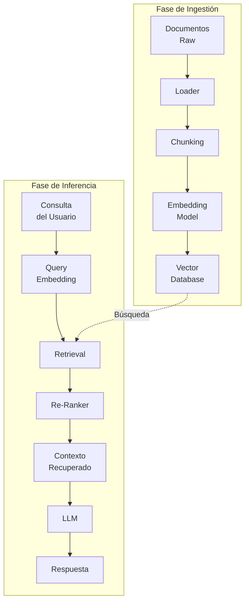
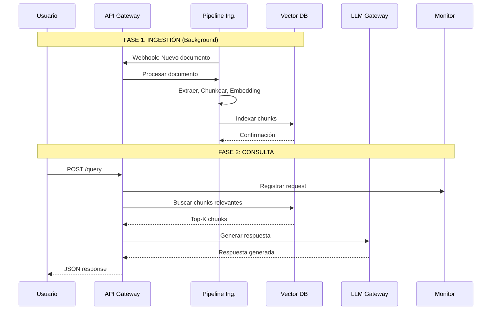
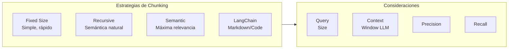
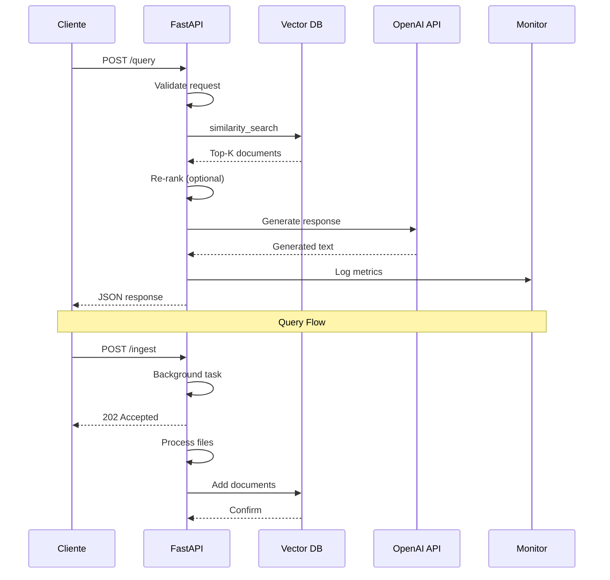
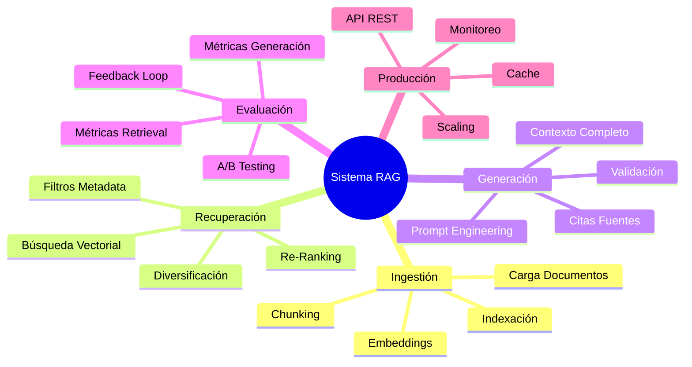

# Clase 08: Construcción de un Pipeline RAG Completo en Producción

## Duración: 4 horas

---

## Objetivos de Aprendizaje

Al finalizar esta clase, el estudiante será capaz de:

1. **Diseñar** una arquitectura completa de sistema RAG desde cero
2. **Implementar** un pipeline de ingestión de documentos robusto y escalable
3. **Integrar** componentes de recuperación y generación de manera eficiente
4. **Desplegar** una aplicación RAG en un entorno de producción
5. **Evaluar** el rendimiento del sistema usando métricas específicas
6. **Optimizar** el pipeline para mejorar la calidad de las respuestas

---

## 1. Arquitectura Completa de un Sistema RAG

### 1.1 Visión General de la Arquitectura

Un sistema RAG en producción requiere la integración coordinada de múltiples componentes. La arquitectura se divide en dos fases principales: **ingestión (indexación)** y **recuperación-generación**.



### 1.2 Flujo de Datos Completo



---

## 2. Pipeline de Ingestión de Documentos

### 2.1 Implementación del Document Loader

```python
"""
Módulo de ingestion para documentos en producción
"""
from abc import ABC, abstractmethod
from dataclasses import dataclass, field
from typing import List, Optional, Dict, Any
from pathlib import Path
import hashlib
import json
from datetime import datetime

from langchain_community.document_loaders import (
    PyPDFLoader,
    UnstructuredHTMLLoader,
    TextLoader,
    UnstructuredMarkdownLoader,
    Docx2txtLoader,
)
from langchain.text_splitter import RecursiveCharacterTextSplitter
from langchain_huggingface import HuggingFaceEmbeddings
from langchain_core.documents import Document


@dataclass
class DocumentMetadata:
    """Metadatos enriquecidos para cada documento."""
    source: str
    title: str
    author: Optional[str] = None
    created_at: Optional[str] = None
    modified_at: Optional[str] = None
    document_type: str = "unknown"
    file_size: Optional[int] = None
    page_count: Optional[int] = None
    chunk_index: int = 0
    total_chunks: int = 0
    content_hash: str = ""
    
    def to_dict(self) -> Dict[str, Any]:
        return {k: v for k, v in self.__dict__.items() if v is not None}


class DocumentLoaderFactory:
    """Factory para crear loaders específicos por tipo de archivo."""
    
    LOADER_MAP = {
        ".pdf": PyPDFLoader,
        ".html": UnstructuredHTMLLoader,
        ".htm": UnstructuredHTMLLoader,
        ".txt": TextLoader,
        ".md": UnstructuredMarkdownLoader,
        ".docx": Docx2txtLoader,
    }
    
    @classmethod
    def get_loader(cls, file_path: str, encoding: str = "utf-8"):
        """Obtiene el loader apropiado según la extensión del archivo."""
        path = Path(file_path)
        extension = path.suffix.lower()
        
        loader_class = cls.LOADER_MAP.get(extension)
        
        if loader_class is None:
            raise ValueError(f"Tipo de archivo no soportado: {extension}")
        
        if extension == ".txt":
            return loader_class(file_path, encoding=encoding)
        
        return loader_class(file_path)
    
    @classmethod
    def supported_extensions(cls) -> List[str]:
        """Lista de extensiones soportadas."""
        return list(cls.LOADER_MAP.keys())


class DocumentProcessor:
    """Procesa documentos crudos y los convierte en chunks indexables."""
    
    def __init__(
        self,
        chunk_size: int = 1000,
        chunk_overlap: int = 200,
        separators: Optional[List[str]] = None,
        model_name: str = "sentence-transformers/all-MiniLM-L6-v2",
    ):
        self.chunk_size = chunk_size
        self.chunk_overlap = chunk_overlap
        self.separators = separators or ["\n\n", "\n", ". ", " ", ""]
        
        self.text_splitter = RecursiveCharacterTextSplitter(
            chunk_size=chunk_size,
            chunk_overlap=chunk_overlap,
            separators=separators,
            length_function=len,
        )
        
        self.embeddings = HuggingFaceEmbeddings(
            model_name=model_name,
            model_kwargs={"device": "cpu"},
            encode_kwargs={"normalize_embeddings": True},
        )
    
    def _compute_hash(self, content: str) -> str:
        """Calcula hash único para el contenido."""
        return hashlib.sha256(content.encode()).hexdigest()[:16]
    
    def _extract_metadata(self, file_path: str, loader) -> Dict[str, Any]:
        """Extrae metadatos del archivo."""
        path = Path(file_path)
        
        stat = path.stat()
        
        metadata = {
            "source": str(path.absolute()),
            "title": path.stem,
            "file_size": stat.st_size,
            "modified_at": datetime.fromtimestamp(stat.st_mtime).isoformat(),
        }
        
        if path.suffix.lower() == ".pdf":
            try:
                pages = loader.load()
                metadata["page_count"] = len(pages)
            except Exception:
                pass
        
        return metadata
    
    def process_file(self, file_path: str) -> List[Document]:
        """Procesa un archivo y retorna lista de documentos chunkeados."""
        loader = DocumentLoaderFactory.get_loader(file_path)
        raw_docs = loader.load()
        
        base_metadata = self._extract_metadata(file_path, loader)
        
        all_chunks = []
        for doc in raw_docs:
            chunks = self.text_splitter.split_documents([doc])
            
            for idx, chunk in enumerate(chunks):
                chunk_hash = self._compute_hash(chunk.page_content)
                
                enriched_metadata = {
                    **base_metadata,
                    "chunk_index": idx,
                    "total_chunks": len(chunks),
                    "content_hash": chunk_hash,
                }
                
                chunk.metadata = enriched_metadata
                all_chunks.append(chunk)
        
        return all_chunks
    
    def process_batch(self, file_paths: List[str]) -> List[Document]:
        """Procesa múltiples archivos en lote."""
        all_documents = []
        
        for file_path in file_paths:
            try:
                chunks = self.process_file(file_path)
                all_documents.extend(chunks)
                print(f"✓ Procesado: {file_path} ({len(chunks)} chunks)")
            except Exception as e:
                print(f"✗ Error procesando {file_path}: {e}")
        
        return all_documents


class IngestionPipeline:
    """
    Pipeline completo de ingestión con soporte para:
    - Procesamiento incremental (solo archivos nuevos/modificados)
    - Batch processing
    - Verificación de integridad
    """
    
    def __init__(
        self,
        vector_store,
        processor: DocumentProcessor,
        state_file: str = ".ingestion_state.json",
    ):
        self.vector_store = vector_store
        self.processor = processor
        self.state_file = Path(state_file)
        self.state = self._load_state()
    
    def _load_state(self) -> Dict[str, str]:
        """Carga el estado de la última ingestión."""
        if self.state_file.exists():
            with open(self.state_file, "r") as f:
                return json.load(f)
        return {}
    
    def _save_state(self):
        """Guarda el estado actual de la ingestión."""
        with open(self.state_file, "w") as f:
            json.dump(self.state, f, indent=2)
    
    def _is_modified(self, file_path: str) -> bool:
        """Verifica si un archivo fue modificado desde la última ingestión."""
        path = Path(file_path)
        if not path.exists():
            return False
        
        current_hash = hashlib.md5(path.read_bytes()).hexdigest()
        stored_hash = self.state.get(str(path))
        
        return current_hash != stored_hash
    
    def _update_state(self, file_path: str):
        """Actualiza el estado después de una ingestión exitosa."""
        path = Path(file_path)
        if path.exists():
            self.state[str(path)] = hashlib.md5(path.read_bytes()).hexdigest()
    
    def ingest_directory(
        self,
        directory: str,
        extensions: Optional[List[str]] = None,
        recursive: bool = True,
    ) -> Dict[str, Any]:
        """
        Ingiere todos los documentos de un directorio.
        
        Args:
            directory: Ruta al directorio
            extensions: Lista de extensiones a procesar (None = todas)
            recursive: Buscar en subdirectorios
            
        Returns:
            Dict con estadísticas de la ingestión
        """
        dir_path = Path(directory)
        if not dir_path.exists():
            raise ValueError(f"Directorio no encontrado: {directory}")
        
        extensions = extensions or DocumentLoaderFactory.supported_extensions()
        pattern = "**/*" if recursive else "*"
        
        files = []
        for ext in extensions:
            files.extend(dir_path.glob(f"{pattern}{ext}"))
        
        stats = {
            "total_files": len(files),
            "new_files": 0,
            "modified_files": 0,
            "unchanged_files": 0,
            "total_chunks": 0,
            "errors": [],
        }
        
        for file_path in files:
            file_str = str(file_path)
            
            if not self._is_modified(file_str):
                stats["unchanged_files"] += 1
                continue
            
            try:
                chunks = self.processor.process_file(file_str)
                self.vector_store.add_documents(chunks)
                
                self._update_state(file_str)
                stats["total_chunks"] += len(chunks)
                
                if file_str in self.state and file_str in self.state:
                    stats["modified_files"] += 1
                else:
                    stats["new_files"] += 1
                    
            except Exception as e:
                stats["errors"].append({"file": file_str, "error": str(e)})
        
        self._save_state()
        return stats
```

### 2.2 Chunking Strategy Comparison



| Estrategia | Chunk Size | Overlap | Pros | Contras |
|------------|------------|---------|------|---------|
| Fixed | 500-1000 | 50-100 | Simple, rápido | Puede cortar oraciones |
| Recursive | 1000-2000 | 200-300 | Mantiene semántica | Más complejo |
| Semantic | Variable | Variable | Máxima relevancia | Más lento |
| LangChain | Variable | Variable | Adaptado a estructura | Dependiente de formato |

---

## 3. Vector Store y Sistema de Indexación

### 3.1 Implementación de ChromaDB con Metadatos

```python
"""
Configuración de ChromaDB con filtering y caching
"""
import chromadb
from chromadb.config import Settings
from langchain_chroma import Chroma
from langchain_huggingface import HuggingFaceEmbeddings
from typing import List, Dict, Any, Optional
from datetime import datetime


class VectorStoreManager:
    """Gestor centralizado del vector store."""
    
    def __init__(
        self,
        persist_directory: str = "./chroma_db",
        collection_name: str = "documents",
        embedding_model: str = "sentence-transformers/all-MiniLM-L6-v2",
    ):
        self.persist_directory = persist_directory
        self.collection_name = collection_name
        
        self.embeddings = HuggingFaceEmbeddings(
            model_name=embedding_model,
            model_kwargs={"device": "cpu"},
            encode_kwargs={"normalize_embeddings": True},
        )
        
        self.client = chromadb.PersistentClient(
            path=persist_directory,
            settings=Settings(
                anonymized_telemetry=False,
                allow_reset=True,
            )
        )
        
        self.vector_store = Chroma(
            client=self.client,
            collection_name=collection_name,
            embedding_function=self.embeddings,
        )
    
    def get_collection_stats(self) -> Dict[str, Any]:
        """Obtiene estadísticas de la colección."""
        collection = self.client.get_collection(self.collection_name)
        
        return {
            "name": collection.name,
            "count": collection.count(),
            "metadata": collection.metadata,
        }
    
    def search_with_filters(
        self,
        query: str,
        n_results: int = 5,
        filter_dict: Optional[Dict[str, Any]] = None,
        score_threshold: float = 0.0,
    ) -> List[Dict[str, Any]]:
        """
        Búsqueda con filtros de metadata y threshold de similitud.
        """
        results = self.vector_store.similarity_search_with_score(
            query=query,
            k=n_results,
            filter=filter_dict,
        )
        
        filtered_results = []
        for doc, score in results:
            if score <= score_threshold:
                filtered_results.append({
                    "content": doc.page_content,
                    "metadata": doc.metadata,
                    "score": float(score),
                })
        
        return filtered_results
    
    def delete_by_source(self, source: str):
        """Elimina todos los chunks de un documento específico."""
        self.vector_store.delete(filter={"source": {"$eq": source}})
    
    def reset(self):
        """Reinicia la colección completa."""
        self.client.delete_collection(self.collection_name)
        self.vector_store = Chroma(
            client=self.client,
            collection_name=self.collection_name,
            embedding_function=self.embeddings,
        )


class HybridSearchManager:
    """Implementa búsqueda híbrida: densa + dispersa."""
    
    def __init__(
        self,
        vector_store: Chroma,
        bm25_builder,
        alpha: float = 0.5,
    ):
        """
        Args:
            vector_store: ChromaDB con embeddings densos
            bm25_builder: Constructor de índice BM25
            alpha: Peso para combinación (0=denso, 1=disperso)
        """
        self.vector_store = vector_store
        self.bm25_builder = bm25_builder
        self.alpha = alpha
    
    def search(
        self,
        query: str,
        n_results: int = 5,
        filter_dict: Optional[Dict[str, Any]] = None,
    ) -> List[Dict[str, Any]]:
        """Ejecuta búsqueda híbrida."""
        
        dense_results = self.vector_store.similarity_search_with_score(
            query=query,
            k=n_results * 2,
            filter=filter_dict,
        )
        
        sparse_results = self.bm25_builder.search(query, k=n_results * 2)
        
        combined = self._reciprocal_rank_fusion(
            dense_results,
            sparse_results,
            k=60,
        )
        
        return combined[:n_results]
    
    def _reciprocal_rank_fusion(
        self,
        dense_results: List,
        sparse_results: List,
        k: int = 60,
    ) -> List[Dict]:
        """Combina resultados usando Reciprocal Rank Fusion."""
        doc_scores = {}
        
        for rank, (doc, score) in enumerate(dense_results):
            doc_id = doc.metadata.get("content_hash", str(doc.page_content))
            rr = 1 / (k + rank + 1)
            doc_scores[doc_id] = doc_scores.get(doc_id, 0) + self.alpha * rr
        
        for rank, (doc, score) in enumerate(sparse_results):
            doc_id = doc.metadata.get("content_hash", str(doc.page_content))
            rr = 1 / (k + rank + 1)
            doc_scores[doc_id] = doc_scores.get(doc_id, 0) + (1 - self.alpha) * rr
        
        sorted_docs = sorted(doc_scores.items(), key=lambda x: x[1], reverse=True)
        
        doc_map = {
            doc.metadata.get("content_hash", str(doc.page_content)): doc
            for doc, _ in dense_results
        }
        doc_map.update({
            doc.metadata.get("content_hash", str(doc.page_content)): doc
            for doc, _ in sparse_results
        })
        
        return [
            {
                "document": doc_map[doc_id],
                "fused_score": score,
            }
            for doc_id, score in sorted_docs
            if doc_id in doc_map
        ]
```

### 3.2 Implementación de BM25 para Búsqueda Híbrida

```python
"""
Implementación de BM25 para búsqueda dispersa
"""
import numpy as np
from typing import List, Dict, Any, Tuple
from collections import Counter
import re


class BM25:
    """
    Implementación de Okapi BM25 para búsqueda de texto.
    """
    
    def __init__(
        self,
        k1: float = 1.5,
        b: float = 0.75,
        average_doc_length: Optional[float] = None,
    ):
        self.k1 = k1
        self.b = b
        self.average_doc_length = average_doc_length or 100
        
        self.doc_lengths = []
        self.doc_freqs = {}
        self.idf = {}
        self.doc_count = 0
        self.corpus = []
    
    def fit(self, corpus: List[str]):
        """
        Construye el índice BM25.
        
        Args:
            corpus: Lista de documentos tokenizados
        """
        self.corpus = corpus
        self.doc_count = len(corpus)
        self.doc_lengths = []
        self.doc_freqs = Counter()
        
        nd = {}
        
        for document in corpus:
            self.doc_lengths.append(len(document))
            
            frequencies = Counter(document)
            
            for term, freq in frequencies.items():
                if term not in nd:
                    nd[term] = 0
                nd[term] += 1
            
            for term in frequencies.keys():
                self.doc_freqs[term] += 1
        
        self.average_doc_length = np.mean(self.doc_lengths)
        
        for term, df in self.doc_freqs.items():
            idf = np.log((self.doc_count - df + 0.5) / (df + 0.5) + 1)
            self.idf[term] = idf
    
    def tokenize(self, text: str) -> List[str]:
        """Tokenización simple."""
        text = text.lower()
        tokens = re.findall(r'\b\w+\b', text)
        return tokens
    
    def get_scores(self, query: List[str]) -> np.ndarray:
        """Calcula scores BM25 para todos los documentos."""
        scores = np.zeros(self.doc_count)
        
        doc_lengths = np.array(self.doc_lengths)
        
        for term in query:
            if term not in self.idf:
                continue
            
            idf = self.idf[term]
            
            for i, doc in enumerate(self.corpus):
                if term not in doc:
                    continue
                
                freq = doc.count(term)
                
                doc_len = doc_lengths[i]
                
                numerator = freq * (self.k1 + 1)
                denominator = freq + self.k1 * (
                    1 - self.b + self.b * doc_len / self.average_doc_length
                )
                
                scores[i] += idf * (numerator / denominator)
        
        return scores
    
    def search(
        self,
        query: str,
        k: int = 10,
    ) -> List[Tuple[Any, float]]:
        """
        Busca los k documentos más relevantes.
        
        Returns:
            Lista de tuplas (documento, score)
        """
        query_tokens = self.tokenize(query)
        scores = self.get_scores(query_tokens)
        
        top_indices = np.argsort(scores)[::-1][:k]
        
        return [(self.corpus[i], scores[i]) for i in top_indices if scores[i] > 0]
```

---

## 4. Integración Retrieval-Generation

### 4.1 Chain de LangChain para RAG

```python
"""
RAG Chain completo con LangChain
"""
from typing import List, Dict, Any, Optional
from dataclasses import dataclass
from langchain_core.prompts import ChatPromptTemplate, PromptTemplate
from langchain_core.output_parsers import StrOutputParser
from langchain_core.runnables import RunnablePassthrough
from langchain_openai import ChatOpenAI
from langchain_anthropic import ChatAnthropic
from langchain.callbacks import get_openai_callback


@dataclass
class RAGConfig:
    """Configuración del sistema RAG."""
    model_provider: str = "openai"
    model_name: str = "gpt-4o"
    temperature: float = 0.3
    max_tokens: int = 2000
    retrieval_k: int = 10
    final_k: int = 5
    score_threshold: float = 0.5
    include_sources: bool = True
    streaming: bool = False


class RAGChain:
    """Cadena completa de Retrieval-Augmented Generation."""
    
    SYSTEM_PROMPT = """Eres un asistente de IA especializado en responder preguntas 
    basándote únicamente en la información proporcionada en el contexto. 

    Instrucciones:
    1. Lee cuidadosamente el contexto proporcionado
    2. Responde la pregunta usando SOLO información del contexto
    3. Si la respuesta no está en el contexto, indica que no tienes esa información
    4. Cita las fuentes cuando sea posible
    
    Contexto:
    {context}
    
    Pregunta: {question}
    
    Respuesta:"""
    
    def __init__(
        self,
        vector_store,
        config: Optional[RAGConfig] = None,
        llm_provider: Optional[Any] = None,
    ):
        self.config = config or RAGConfig()
        self.vector_store = vector_store
        
        self.llm = llm_provider or self._create_llm()
        
        self.prompt = ChatPromptTemplate.from_template(self.SYSTEM_PROMPT)
        
        self.chain = self._build_chain()
    
    def _create_llm(self):
        """Crea el LLM según la configuración."""
        if self.config.model_provider == "openai":
            return ChatOpenAI(
                model=self.config.model_name,
                temperature=self.config.temperature,
                max_tokens=self.config.max_tokens,
                streaming=self.config.streaming,
            )
        elif self.config.model_provider == "anthropic":
            return ChatAnthropic(
                model=self.config.model_name,
                temperature=self.config.temperature,
                max_tokens=self.config.max_tokens,
            )
        else:
            raise ValueError(f"Provider no soportado: {self.config.model_provider}")
    
    def _build_chain(self):
        """Construye la cadena de LangChain."""
        
        def format_docs(docs: List) -> str:
            """Formatea los documentos para el prompt."""
            formatted = []
            for i, doc in enumerate(docs, 1):
                source = doc.metadata.get("source", "Unknown")
                content = doc.page_content
                formatted.append(f"[Documento {i}] (Fuente: {source})\n{content}")
            return "\n\n".join(formatted)
        
        rag_chain = (
            {"context": self._retrieve, "question": RunnablePassthrough()}
            | self.prompt
            | self.llm
            | StrOutputParser()
        )
        
        return rag_chain
    
    def _retrieve(self, query: str) -> str:
        """Recupera y formatea los documentos relevantes."""
        docs = self.vector_store.similarity_search(
            query=query,
            k=self.config.retrieval_k,
        )
        
        formatted = []
        for i, doc in enumerate(docs, 1):
            source = doc.metadata.get("source", "Unknown")
            title = doc.metadata.get("title", "Sin título")
            content = doc.page_content
            formatted.append(f"Documento {i}: {title}\nFuente: {source}\n{content}")
        
        return "\n---\n\n".join(formatted)
    
    def invoke(
        self,
        query: str,
        return_sources: bool = False,
    ) -> Dict[str, Any]:
        """
        Ejecuta la chain con una query.
        
        Args:
            query: Pregunta del usuario
            return_sources: Incluir documentos fuente en la respuesta
            
        Returns:
            Dict con respuesta y opcionalmente fuentes
        """
        docs = self.vector_store.similarity_search(
            query=query,
            k=self.config.final_k,
        )
        
        filtered_docs = [
            doc for doc in docs
            if doc.page_content.strip()
        ]
        
        if not filtered_docs:
            return {
                "answer": "No encontré información relevante para responder tu pregunta.",
                "sources": [],
            }
        
        context = "\n\n".join([
            f"[Doc {i}]: {doc.page_content}"
            for i, doc in enumerate(filtered_docs, 1)
        ])
        
        prompt = self.prompt.format(context=context, question=query)
        
        with get_openai_callback() as cb:
            response = self.llm.invoke(prompt)
            usage = {
                "prompt_tokens": cb.prompt_tokens,
                "completion_tokens": cb.completion_tokens,
                "total_tokens": cb.total_tokens,
                "cost": cb.total_cost,
            }
        
        result = {
            "answer": response.content if hasattr(response, 'content') else str(response),
            "usage": usage,
        }
        
        if return_sources or self.config.include_sources:
            result["sources"] = [
                {
                    "content": doc.page_content[:200] + "...",
                    "metadata": doc.metadata,
                }
                for doc in filtered_docs
            ]
        
        return result
    
    def invoke_with_citations(self, query: str) -> Dict[str, Any]:
        """Versión con citas explícitas en la respuesta."""
        prompt_with_citations = f"""Basándote EXCLUSIVAMENTE en el siguiente contexto, 
        responde la pregunta. Cuando cites información, usa el formato [Doc N].
        
        Contexto recuperado:
        {self._retrieve(query)}
        
        Pregunta: {query}
        
        Respuesta (con citas):"""
        
        response = self.llm.invoke(prompt_with_citations)
        
        return {
            "answer": response.content if hasattr(response, 'content') else str(response),
        }
```

### 4.2 Multi-Query Retrieval

```python
"""
Estrategia de Multi-Query para mejorar recall
"""
from typing import List, Dict, Any
from langchain.output_parsers import CommaSeparatedListOutputParser
from langchain.prompts import PromptTemplate
from langchain_openai import ChatOpenAI


class MultiQueryRetriever:
    """
    Genera múltiples reformulaciones de la query para mejorar
    la recuperación de documentos relevantes.
    """
    
    QUERY_GENERATOR_PROMPT = """Eres un experto en reformulación de preguntas. 
    Dado un pregunta original, genera {n_queries} versiones diferentes que capturen
    diferentes aspectos o formulaciones de la pregunta original.
    
    La pregunta original es: {question}
    
    Devuelve exactamente {n_queries} preguntas, una por línea.""" 
    
    def __init__(
        self,
        vector_store,
        llm: Optional[ChatOpenAI] = None,
        n_queries: int = 5,
        include_original: bool = True,
    ):
        self.vector_store = vector_store
        self.llm = llm or ChatOpenAI(model="gpt-4o", temperature=0.5)
        self.n_queries = n_queries
        self.include_original = include_original
    
    def generate_queries(self, original_query: str) -> List[str]:
        """Genera queries alternativas."""
        prompt = PromptTemplate(
            template=self.QUERY_GENERATOR_PROMPT,
            input_variables=["question", "n_queries"],
        )
        
        chain = prompt | self.llm | CommaSeparatedListOutputParser()
        
        queries = chain.invoke({
            "question": original_query,
            "n_queries": self.n_queries if self.include_original else self.n_queries - 1,
        })
        
        if self.include_original and original_query not in queries:
            queries.insert(0, original_query)
        
        return queries
    
    def retrieve(self, query: str, k_per_query: int = 5) -> List[Dict]:
        """Recupera documentos usando múltiples queries."""
        queries = self.generate_queries(query)
        
        all_docs = {}
        for q in queries:
            docs = self.vector_store.similarity_search_with_score(q, k=k_per_query)
            
            for doc, score in docs:
                doc_id = doc.metadata.get("content_hash", q + doc.page_content[:50])
                
                if doc_id not in all_docs or all_docs[doc_id]["score"] > score:
                    all_docs[doc_id] = {
                        "document": doc,
                        "score": score,
                        "query": q,
                    }
        
        sorted_docs = sorted(all_docs.values(), key=lambda x: x["score"])
        
        return sorted_docs[:k_per_query * 2]
```

---

## 5. Re-Ranking y Optimización

### 5.1 Implementación de Re-Ranker

```python
"""
Re-Ranker para mejorar la calidad de resultados
"""
from typing import List, Dict, Any, Tuple
import numpy as np
from sentence_transformers import CrossEncoder


class DocumentReranker:
    """
    Re-ordena documentos usando un modelo Cross-Encoder
    para mayor precisión.
    """
    
    def __init__(
        self,
        model_name: str = "cross-encoder/ms-marco-MiniLM-L-6-v2",
    ):
        self.model = CrossEncoder(model_name)
    
    def rerank(
        self,
        query: str,
        documents: List[Any],
        top_k: int = 5,
    ) -> List[Dict[str, Any]]:
        """
        Re-ordena documentos según relevancia con la query.
        
        Args:
            query: Query original
            documents: Lista de documentos recuperados
            top_k: Número de documentos a retornar
            
        Returns:
            Lista de documentos ordenados con scores de relevancia
        """
        doc_texts = [
            doc.page_content if hasattr(doc, 'page_content') else str(doc)
            for doc in documents
        ]
        
        pairs = [(query, doc) for doc in doc_texts]
        
        scores = self.model.predict(pairs)
        
        doc_scores = [
            {
                "document": doc,
                "content": doc_texts[i],
                "cross_encoder_score": float(scores[i]),
                "original_index": i,
            }
            for i, doc in enumerate(documents)
        ]
        
        doc_scores.sort(key=lambda x: x["cross_encoder_score"], reverse=True)
        
        return doc_scores[:top_k]


class ReciprocalRankReranker:
    """
    Re-Ranking basado en Reciprocal Rank Fusion.
    """
    
    def __init__(self, k: int = 60):
        self.k = k
    
    def fuse(
        self,
        result_lists: List[List[Tuple[Any, float]]],
    ) -> List[Tuple[Any, float]]:
        """
        Combina múltiples listas de resultados usando RRF.
        
        Args:
            result_lists: Lista de listas de (documento, score)
            
        Returns:
            Lista fusionada ordenada por score
        """
        scores = {}
        
        for result_list in result_lists:
            for rank, (doc, score) in enumerate(result_list):
                doc_key = self._get_doc_key(doc)
                
                if doc_key not in scores:
                    scores[doc_key] = {"doc": doc, "score": 0}
                
                rrf_score = 1 / (self.k + rank + 1)
                scores[doc_key]["score"] += rrf_score * score
        
        sorted_results = sorted(
            scores.values(),
            key=lambda x: x["score"],
            reverse=True,
        )
        
        return [(r["doc"], r["score"]) for r in sorted_results]
    
    def _get_doc_key(self, doc) -> str:
        """Genera una clave única para el documento."""
        if hasattr(doc, 'metadata') and 'content_hash' in doc.metadata:
            return doc.metadata['content_hash']
        elif hasattr(doc, 'page_content'):
            return hash(doc.page_content[:100])
        return hash(str(doc))


class MMRReranker:
    """
    Maximal Marginal Relevance para diversidad en resultados.
    """
    
    def __init__(
        self,
        embeddings_model,
        lambda_mult: float = 0.5,
    ):
        self.embeddings_model = embeddings_model
        self.lambda_mult = lambda_mult
    
    def rerank(
        self,
        query: str,
        documents: List[Any],
        k: int = 5,
    ) -> List[Any]:
        """
        Selecciona documentos balanceando relevancia y diversidad.
        
        Args:
            query: Query original
            documents: Lista de documentos candidatos
            k: Número de documentos a seleccionar
        """
        if len(documents) <= k:
            return documents
        
        query_embedding = self.embeddings_model.embed_query(query)
        
        doc_embeddings = [
            self.embeddings_model.embed_query(
                doc.page_content if hasattr(doc, 'page_content') else str(doc)
            )
            for doc in documents
        ]
        
        relevance_scores = self._cosine_similarity(query_embedding, doc_embeddings)
        
        selected = []
        selected_embeddings = []
        
        while len(selected) < k and len(documents) > 0:
            best_score = -float('inf')
            best_idx = 0
            
            for i, doc in enumerate(documents):
                rel = relevance_scores[i]
                div = self._max_similarity(doc_embeddings[i], selected_embeddings)
                
                mmr_score = self.lambda_mult * rel - (1 - self.lambda_mult) * div
                
                if mmr_score > best_score:
                    best_score = mmr_score
                    best_idx = i
            
            selected.append(documents[best_idx])
            selected_embeddings.append(doc_embeddings[best_idx])
            documents.pop(best_idx)
            doc_embeddings.pop(best_idx)
            relevance_scores.pop(best_idx)
        
        return selected
    
    def _cosine_similarity(self, a: List[float], b_list: List[List[float]]) -> List[float]:
        """Calcula similitud coseno."""
        norm_a = np.linalg.norm(a)
        
        similarities = []
        for b in b_list:
            norm_b = np.linalg.norm(b)
            if norm_a == 0 or norm_b == 0:
                similarities.append(0)
            else:
                similarities.append(np.dot(a, b) / (norm_a * norm_b))
        
        return similarities
    
    def _max_similarity(self, embedding: List[float], selected: List[List[float]]) -> float:
        """Calcula máxima similitud con elementos ya seleccionados."""
        if not selected:
            return 0
        
        similarities = self._cosine_similarity(embedding, selected)
        return max(similarities) if similarities else 0
```

---

## 6. API REST con FastAPI

### 6.1 Implementación de la API

```python
"""
API REST para el sistema RAG
"""
from fastapi import FastAPI, HTTPException, BackgroundTasks
from fastapi.middleware.cors import CORSMiddleware
from pydantic import BaseModel, Field
from typing import List, Optional, Dict, Any
from datetime import datetime
import asyncio

from app.vector_store import VectorStoreManager
from app.rag_chain import RAGChain, RAGConfig
from app.ingestion import IngestionPipeline, DocumentProcessor
from app.reranker import DocumentReranker


app = FastAPI(
    title="RAG API",
    description="API REST para sistema de Retrieval-Augmented Generation",
    version="1.0.0",
)

app.add_middleware(
    CORSMiddleware,
    allow_origins=["*"],
    allow_credentials=True,
    allow_methods=["*"],
    allow_headers=["*"],
)


class QueryRequest(BaseModel):
    query: str = Field(..., min_length=1, max_length=1000)
    return_sources: bool = True
    use_reranker: bool = True
    top_k: int = Field(default=5, ge=1, le=20)


class QueryResponse(BaseModel):
    answer: str
    sources: Optional[List[Dict[str, Any]]] = None
    usage: Optional[Dict[str, Any]] = None
    query_time_ms: float
    timestamp: str


class IngestRequest(BaseModel):
    directory: str
    extensions: Optional[List[str]] = None
    recursive: bool = True


class IngestResponse(BaseModel):
    status: str
    stats: Dict[str, Any]
    timestamp: str


class HealthResponse(BaseModel):
    status: str
    vector_store_stats: Dict[str, Any]
    timestamp: str


vector_store = None
rag_chain = None
reranker = None


@app.on_event("startup")
async def startup_event():
    """Inicializa los componentes al arrancar."""
    global vector_store, rag_chain, reranker
    
    vector_store = VectorStoreManager(
        persist_directory="./chroma_db",
        collection_name="documents",
    )
    
    config = RAGConfig(
        model_provider="openai",
        model_name="gpt-4o",
        temperature=0.3,
        retrieval_k=20,
        final_k=5,
    )
    
    rag_chain = RAGChain(vector_store=vector_store, config=config)
    reranker = DocumentReranker()


@app.post("/query", response_model=QueryResponse)
async def query(request: QueryRequest) -> QueryResponse:
    """
    Procesa una consulta y retorna la respuesta generada.
    """
    import time
    start_time = time.time()
    
    try:
        docs = vector_store.search_with_filters(
            query=request.query,
            n_results=20,
        )
        
        if request.use_reranker and reranker and docs:
            reranked = reranker.rerank(
                query=request.query,
                documents=[d["document"] if "document" in d else d for d in docs],
                top_k=request.top_k,
            )
        else:
            reranked = docs[:request.top_k]
        
        context = "\n\n".join([
            f"[Doc {i}]: {doc.page_content if hasattr(doc, 'page_content') else str(doc)}"
            for i, doc in enumerate(reranked, 1)
        ])
        
        result = rag_chain.invoke(
            query=request.query,
            return_sources=request.return_sources,
        )
        
        elapsed = (time.time() - start_time) * 1000
        
        return QueryResponse(
            answer=result["answer"],
            sources=result.get("sources") if request.return_sources else None,
            usage=result.get("usage"),
            query_time_ms=elapsed,
            timestamp=datetime.utcnow().isoformat(),
        )
    
    except Exception as e:
        raise HTTPException(status_code=500, detail=str(e))


@app.post("/ingest", response_model=IngestResponse)
async def ingest(request: IngestRequest, background_tasks: BackgroundTasks):
    """
    Inicia la ingestión de documentos en background.
    """
    def run_ingestion():
        processor = DocumentProcessor()
        pipeline = IngestionPipeline(
            vector_store=vector_store,
            processor=processor,
        )
        
        stats = pipeline.ingest_directory(
            directory=request.directory,
            extensions=request.extensions,
            recursive=request.recursive,
        )
        
        return stats
    
    stats = await asyncio.to_thread(run_ingestion)
    
    return IngestResponse(
        status="completed" if not stats["errors"] else "completed_with_errors",
        stats=stats,
        timestamp=datetime.utcnow().isoformat(),
    )


@app.get("/health", response_model=HealthResponse)
async def health():
    """
    Verifica el estado del sistema.
    """
    try:
        stats = vector_store.get_collection_stats()
        
        return HealthResponse(
            status="healthy",
            vector_store_stats=stats,
            timestamp=datetime.utcnow().isoformat(),
        )
    
    except Exception as e:
        return HealthResponse(
            status="unhealthy",
            vector_store_stats={"error": str(e)},
            timestamp=datetime.utcnow().isoformat(),
        )


@app.get("/stats")
async def get_stats():
    """
    Obtiene estadísticas del sistema.
    """
    vector_stats = vector_store.get_collection_stats()
    
    return {
        "vector_store": vector_stats,
        "api_version": "1.0.0",
        "timestamp": datetime.utcnow().isoformat(),
    }
```

### 6.2 Diagrama de la API



---

## 7. Métricas de Evaluación

### 7.1 Métricas de Retrieval

```python
"""
Métricas para evaluar el sistema RAG
"""
from typing import List, Dict, Any, Set
import numpy as np
from dataclasses import dataclass


@dataclass
class RetrievalMetrics:
    """Métricas de recuperación."""
    precision: float
    recall: float
    f1: float
    ndcg: float
    mrr: float


class RetrievalEvaluator:
    """Evalúa la calidad del sistema de recuperación."""
    
    def __init__(self, k_values: List[int] = None):
        self.k_values = k_values or [1, 3, 5, 10]
    
    def precision_at_k(self, relevant: Set, predicted: List, k: int) -> float:
        """Precisión en@k."""
        if k == 0:
            return 0.0
        
        predicted_k = set(predicted[:k])
        return len(relevant & predicted_k) / k
    
    def recall_at_k(self, relevant: Set, predicted: List, k: int) -> float:
        """Recall en@k."""
        if len(relevant) == 0:
            return 0.0
        
        predicted_k = set(predicted[:k])
        return len(relevant & predicted_k) / len(relevant)
    
    def dcg_at_k(self, relevances: List[float], k: int) -> float:
        """DCG@k (Discounted Cumulative Gain)."""
        dcg = 0.0
        for i, rel in enumerate(relevances[:k]):
            dcg += rel / np.log2(i + 2)
        return dcg
    
    def ndcg_at_k(self, relevant: Set, relevances: List[float], k: int) -> float:
        """NDCG@k (Normalized DCG)."""
        dcg = self.dcg_at_k(relevances, k)
        
        ideal_relevances = sorted(relevances, reverse=True)
        idcg = self.dcg_at_k(ideal_relevances, k)
        
        if idcg == 0:
            return 0.0
        
        return dcg / idcg
    
    def mrr(self, relevant_docs: List[Set], predicted_lists: List[List]) -> float:
        """Mean Reciprocal Rank."""
        reciprocal_ranks = []
        
        for relevant, predicted in zip(relevant_docs, predicted_lists):
            for i, doc in enumerate(predicted, 1):
                if doc in relevant:
                    reciprocal_ranks.append(1.0 / i)
                    break
            else:
                reciprocal_ranks.append(0.0)
        
        return np.mean(reciprocal_ranks) if reciprocal_ranks else 0.0
    
    def evaluate(
        self,
        queries: List[str],
        relevant_docs: List[Set],
        retrieved_docs: List[List],
    ) -> Dict[str, Any]:
        """Evalúa el sistema completo."""
        results = {"k_values": self.k_values}
        
        for k in self.k_values:
            precisions = []
            recalls = []
            
            for rel, ret in zip(relevant_docs, retrieved_docs):
                precisions.append(self.precision_at_k(rel, ret, k))
                recalls.append(self.recall_at_k(rel, ret, k))
            
            results[f"precision@{k}"] = np.mean(precisions)
            results[f"recall@{k}"] = np.mean(recalls)
            results[f"f1@{k}"] = (
                2 * results[f"precision@{k}"] * results[f"recall@{k}"] /
                (results[f"precision@{k}"] + results[f"recall@{k}"] + 1e-8)
            )
        
        results["mrr"] = self.mrr(relevant_docs, retrieved_docs)
        
        return results


class RAGEvaluator:
    """Evalúa la calidad de las respuestas generadas."""
    
    def __init__(self, llm_evaluator):
        self.llm = llm_evaluator
    
    def evaluate_answer(
        self,
        question: str,
        ground_truth: str,
        generated_answer: str,
    ) -> Dict[str, float]:
        """
        Evalúa la calidad de una respuesta usando LLM.
        """
        evaluation_prompt = f"""Evalúa la siguiente respuesta generada comparándola
        con la respuesta correcta.

        Pregunta: {question}

        Respuesta Correcta: {ground_truth}

        Respuesta Generada: {generated_answer}

        Evalúa en una escala de 0 a 1 en las siguientes dimensiones:
        1. Fidelidad (¿La respuesta es fiel a la realidad?)
        2. Relevancia (¿Responde a lo preguntado?)
        3. Completitud (¿Cubre todos los aspectos?)

        Formato de respuesta: JSON con campos: fidelity, relevance, completeness"""

        response = self.llm.invoke(evaluation_prompt)
        
        return self._parse_evaluation(response.content)
    
    def batch_evaluate(
        self,
        test_cases: List[Dict[str, str]],
    ) -> Dict[str, float]:
        """Evalúa un conjunto de casos de prueba."""
        results = {
            "fidelity": [],
            "relevance": [],
            "completeness": [],
        }
        
        for case in test_cases:
            scores = self.evaluate_answer(
                question=case["question"],
                ground_truth=case["ground_truth"],
                generated_answer=case["generated_answer"],
            )
            
            results["fidelity"].append(scores["fidelity"])
            results["relevance"].append(scores["relevance"])
            results["completeness"].append(scores["completeness"])
        
        return {
            key: np.mean(values) for key, values in results.items()
        }
    
    def _parse_evaluation(self, content: str) -> Dict[str, float]:
        """Parsea la respuesta del LLM evaluator."""
        import json
        import re
        
        match = re.search(r'\{[^}]+\}', content)
        if match:
            try:
                return json.loads(match.group())
            except:
                pass
        
        return {"fidelity": 0.5, "relevance": 0.5, "completeness": 0.5}
```

---

## 8. Ejercicio Práctico Completo

### 8.1 Implementación del Sistema RAG End-to-End

```python
"""
Ejercicio Práctico: Sistema RAG Completo
"""
import os
from pathlib import Path
from typing import List, Dict, Any

from langchain_core.documents import Document
from langchain_openai import OpenAIEmbeddings, ChatOpenAI
from langchain_chroma import Chroma
from langchain.text_splitter import RecursiveCharacterTextSplitter
from langchain_community.document_loaders import TextLoader

import chromadb


class CompleteRAGSystem:
    """
    Sistema RAG completo con todos los componentes integrados.
    """
    
    def __init__(
        self,
        persist_directory: str = "./rag_data",
        embedding_model: str = "text-embedding-3-small",
        llm_model: str = "gpt-4o",
    ):
        self.persist_directory = persist_directory
        self.embedding_model = embedding_model
        self.llm_model = llm_model
        
        self._setup_components()
    
    def _setup_components(self):
        """Inicializa todos los componentes."""
        os.makedirs(self.persist_directory, exist_ok=True)
        
        self.embeddings = OpenAIEmbeddings(model=self.embedding_model)
        
        self.client = chromadb.PersistentClient(
            path=self.persist_directory,
            settings=chromadb.config.Settings(
                anonymized_telemetry=False,
            )
        )
        
        self.vector_store = Chroma(
            client=self.client,
            collection_name="documents",
            embedding_function=self.embeddings,
        )
        
        self.llm = ChatOpenAI(
            model=self.llm_model,
            temperature=0.3,
        )
        
        self.text_splitter = RecursiveCharacterTextSplitter(
            chunk_size=1000,
            chunk_overlap=200,
            separators=["\n\n", "\n", ". ", " ", ""],
        )
    
    def load_and_index_documents(self, documents_path: str) -> Dict[str, Any]:
        """
        Carga documentos desde una ruta y los indexa.
        """
        path = Path(documents_path)
        
        if path.is_file():
            files = [path]
        elif path.is_dir():
            files = list(path.glob("**/*.txt"))
        else:
            raise ValueError(f"Ruta no válida: {documents_path}")
        
        all_chunks = []
        
        for file_path in files:
            loader = TextLoader(str(file_path))
            docs = loader.load()
            
            chunks = self.text_splitter.split_documents(docs)
            
            for chunk in chunks:
                chunk.metadata = {
                    "source": str(file_path),
                    "filename": file_path.name,
                }
            
            all_chunks.extend(chunks)
            print(f"Cargado: {file_path.name} ({len(chunks)} chunks)")
        
        self.vector_store.add_documents(all_chunks)
        
        return {
            "files_processed": len(files),
            "total_chunks": len(all_chunks),
        }
    
    def retrieve(self, query: str, k: int = 5) -> List[Document]:
        """
        Recupera documentos relevantes para una query.
        """
        return self.vector_store.similarity_search(query, k=k)
    
    def generate(
        self,
        query: str,
        context_docs: List[Document],
        include_sources: bool = True,
    ) -> Dict[str, Any]:
        """
        Genera una respuesta usando el contexto recuperado.
        """
        context = "\n\n".join([
            f"[Documento {i+1}]: {doc.page_content}"
            for i, doc in enumerate(context_docs)
        ])
        
        prompt = f"""Basándote en el siguiente contexto, responde la pregunta.
        Si la respuesta no está en el contexto, indica que no lo sabes.

        Contexto:
        {context}

        Pregunta: {query}

        Respuesta:"""
        
        response = self.llm.invoke(prompt)
        
        result = {
            "answer": response.content,
            "num_sources_used": len(context_docs),
        }
        
        if include_sources:
            result["sources"] = [
                {
                    "filename": doc.metadata.get("filename", "Unknown"),
                    "excerpt": doc.page_content[:200] + "...",
                }
                for doc in context_docs
            ]
        
        return result
    
    def query(self, user_query: str, k: int = 5) -> Dict[str, Any]:
        """
        Ejecuta una query completa: retrieval + generation.
        """
        docs = self.retrieve(user_query, k=k)
        
        if not docs:
            return {
                "answer": "No encontré información relevante para tu pregunta.",
                "sources": [],
            }
        
        return self.generate(user_query, docs)
    
    def get_stats(self) -> Dict[str, Any]:
        """Obtiene estadísticas del sistema."""
        collection = self.client.get_collection("documents")
        
        return {
            "total_documents": collection.count(),
            "persist_directory": self.persist_directory,
            "embedding_model": self.embedding_model,
            "llm_model": self.llm_model,
        }
    
    def reset(self):
        """Reinicia la base de datos vectorial."""
        self.client.delete_collection("documents")
        self.vector_store = Chroma(
            client=self.client,
            collection_name="documents",
            embedding_function=self.embeddings,
        )


def main():
    """Función principal de demostración."""
    print("=" * 60)
    print("Sistema RAG Completo - Demostración")
    print("=" * 60)
    
    rag = CompleteRAGSystem(
        persist_directory="./demo_rag_data",
        embedding_model="text-embedding-3-small",
        llm_model="gpt-4o",
    )
    
    print("\n1. Cargando documentos de ejemplo...")
    demo_docs = Path("./demo_documents")
    demo_docs.mkdir(exist_ok=True)
    
    sample_content = """
    Inteligencia Artificial y Machine Learning

    La inteligencia artificial (IA) es un campo de la computación que se enfoca
    en crear sistemas capaces de realizar tareas que normalmente requieren
    inteligencia humana. Estas tareas incluyen el aprendizaje, el razonamiento,
    la resolución de problemas, la percepción y el procesamiento del lenguaje.

    Machine Learning es un subcampo de la IA que permite a las máquinas aprender
    de los datos sin ser programadas explícitamente. Los principales tipos de
    aprendizaje automático son:

    1. Aprendizaje Supervisado: El modelo aprende de datos etiquetados.
    2. Aprendizaje No Supervisado: El modelo encuentra patrones en datos sin etiquetas.
    3. Aprendizaje por Refuerzo: El modelo aprende mediante prueba y error.

    Redes Neuronales y Deep Learning

    Las redes neuronales artificiales están inspiradas en el cerebro humano.
    Una red neuronal consiste en capas de nodos (neuronas) conectados:

    - Capa de Entrada: Recibe los datos iniciales
    - Capas Ocultas: Procesan la información
    - Capa de Salida: Produce el resultado final

    El Deep Learning utiliza redes con muchas capas ocultas para aprender
    representaciones jerárquicas de los datos.
    """
    
    (demo_docs / "ia_intro.txt").write_text(sample_content)
    
    stats = rag.load_and_index_documents(str(demo_docs))
    print(f"\n✓ Indexados {stats['total_chunks']} chunks de {stats['files_processed']} archivos")
    
    print("\n" + "=" * 60)
    print("Consultas de Prueba")
    print("=" * 60)
    
    queries = [
        "¿Qué es el aprendizaje automático?",
        "¿Cuáles son los tipos de aprendizaje automático?",
        "¿Cómo funcionan las redes neuronales?",
    ]
    
    for query in queries:
        print(f"\n❓ Pregunta: {query}")
        print("-" * 40)
        
        result = rag.query(query, k=3)
        
        print(f"\n💬 Respuesta:\n{result['answer']}")
        
        if result.get("sources"):
            print(f"\n📚 Fuentes ({len(result['sources'])}):")
            for i, src in enumerate(result["sources"], 1):
                print(f"   {i}. {src['filename']}")
    
    print("\n" + "=" * 60)
    print("Estadísticas del Sistema")
    print("=" * 60)
    stats = rag.get_stats()
    for key, value in stats.items():
        print(f"  {key}: {value}")
    
    print("\n✓ Demostración completada")


if __name__ == "__main__":
    main()
```

---

## 9. Actividad de Laboratorio

### 9.1 Construcción de un Sistema RAG Funcional

**Duración estimada:** 45 minutos

**Objetivo:** Construir un sistema RAG funcional usando LangChain y ChromaDB

**Pasos:**

1. **Configuración del entorno**
```bash
pip install langchain langchain-openai langchain-community \
    langchain-chroma chromadb huggingface-hub sentence-transformers \
    openai fastapi uvicorn python-dotenv
```

2. **Crear estructura de proyecto**
```bash
mkdir rag_project
cd rag_project
mkdir data models logs
touch .env
```

3. **Configurar variables de entorno** (.env)
```bash
OPENAI_API_KEY=tu-api-key-aqui
```

4. **Implementar componentes:**
   - Document Loader con soporte para PDF, TXT, MD
   - Chunking con RecursiveCharacterTextSplitter
   - Vector store con ChromaDB
   - RAG Chain con LangChain
   - API con FastAPI

5. **Probar con casos de uso reales:**
   - Cargar documentos de muestra
   - Realizar consultas
   - Evaluar respuestas

6. **Métricas a registrar:**
   - Tiempo de indexación
   - Número de chunks creados
   - Tiempo de respuesta por query
   - Calidad de respuestas (subjetiva)

---

## 10. Puntos Clave



### Resumen de Componentes Clave

| Componente | Tecnología | Función |
|------------|------------|---------|
| Document Loading | LangChain Loaders | Carga de archivos |
| Text Splitting | RecursiveCharacterTextSplitter | Chunking semántico |
| Embeddings | OpenAI/Sentence-Transformers | Representación vectorial |
| Vector Store | ChromaDB/FAISS/Pinecone | Almacenamiento y búsqueda |
| LLM | GPT-4/Claude/Llama | Generación de respuestas |
| API | FastAPI | Interfaz REST |
| Monitoring | Prometheus/Grafana | Observabilidad |

### Mejores Prácticas

1. **Chunking:** Usa chunk sizes de 500-1500 tokens con 20-30% overlap
2. **Retrieval:** Recupera 2-3x más documentos de los que usarás finalmente
3. **Re-ranking:** Mejora significativamente la calidad con modelos de cross-encoder
4. **Prompting:** Incluye instrucciones claras sobre cómo usar el contexto
5. **Evaluación:** Implementa métricas automatizadas para tracking continuo

---

## Referencias Externas

1. **LangChain Documentation** - https://python.langchain.com/docs/tutorials/rag/
2. **ChromaDB Getting Started** - https://docs.trychroma.com/getting-started
3. **RAG Evaluation Best Practices** - https://www.rungalileo.io/blog/evaluating-rag-systems
4. **BM25 Algorithm** - https://en.wikipedia.org/wiki/Okapi_BM25
5. **Cross-Encoders for Reranking** - https://www.sbert.net/docs/pretrained-models/ce-msmarco.html
6. **FastAPI Documentation** - https://fastapi.tiangolo.com/tutorial/
7. **OpenAI Embeddings Guide** - https://platform.openai.com/docs/guides/embeddings

---

**Fin de la Clase 08 - Última Clase del Curso**
