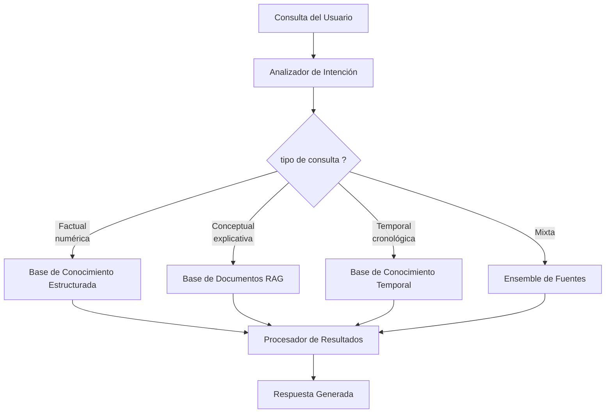
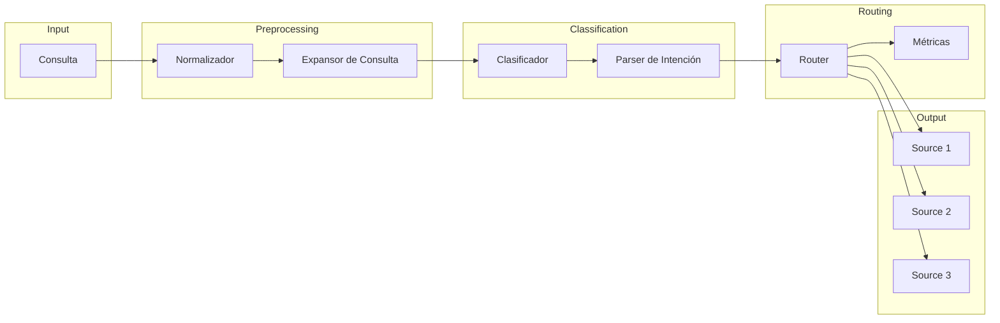
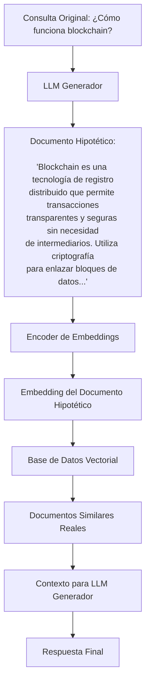
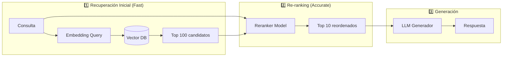
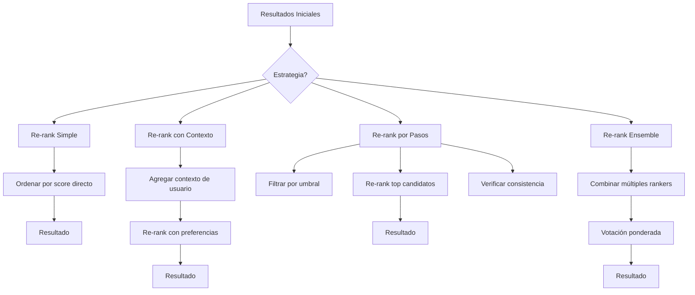
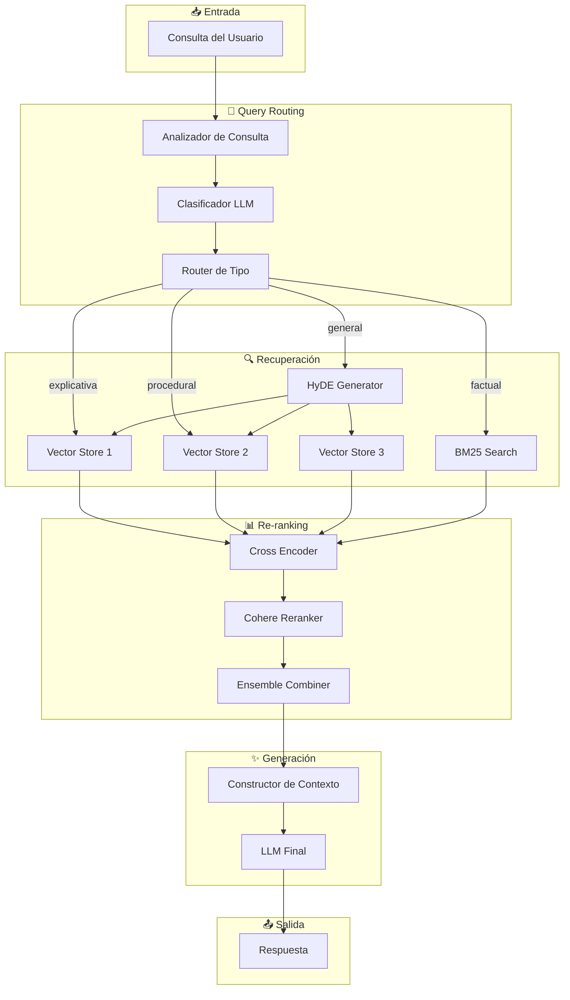

# Clase 9: RAG Avanzado - Routing y Re-ranking

## 📅 Duración: 4 horas

---

## 🎯 Objetivos de Aprendizaje

Al finalizar esta clase, el estudiante será capaz de:

1. **Comprender** los conceptos fundamentales de Query Routing en sistemas RAG
2. **Implementar** estrategias de HyDE (Hypothetical Document Embeddings) para mejorar la recuperación
3. **Aplicar** técnicas de Re-ranking para optimizar la relevancia de los resultados
4. **Integrar** múltiples técnicas de reranking en pipelines de producción
5. **Evaluar** el rendimiento de diferentes estrategias de routing y reranking

---

## 📚 Contenidos Detallados

### 1. Introducción al Query Routing (45 minutos)

#### 1.1 ¿Qué es el Query Routing?

El **Query Routing** es el proceso de analizar una consulta del usuario y dirigirla automáticamente al componente más apropiado del sistema de recuperación. En lugar de enviar todas las consultas por el mismo pipeline, el routing permite:

- **Selección de fuentes**: Elegir qué base de conocimientos o colección consultar
- **Selección de estrategia**: Determinar el método de recuperación óptimo
- **Optimización de costos**: Reducir el procesamiento innecesario
- **Mejora de relevancia**: Dirigir la consulta al método más probable para obtener mejores resultados



#### 1.2 Tipos de Routing

**a) Routing Basado en Reglas**
```python
def rule_based_router(query: str, metadata: dict) -> str:
    """
    Router simple basado en reglas keyword.
    """
    query_lower = query.lower()
    
    # Reglas de clasificación
    if any(kw in query_lower for kw in ['cuántos', 'cuánto', 'número', 'estadística', 'cifra']):
        return "structured_query"
    
    if any(kw in query_lower for kw in ['cómo', 'por qué', 'explica', 'describe', 'funciona']):
        return "explanatory_query"
    
    if any(kw in query_lower for kw in ['cuándo', 'fecha', 'año', 'período', 'temporal']):
        return "temporal_query"
    
    if any(kw in query_lower for kw in ['quién', 'persona', 'empresa', 'organización']):
        return "entity_query"
    
    # Default
    return "general_query"
```

**b) Routing Basado en Embeddings**
```python
from sentence_transformers import SentenceTransformer
import numpy as np

class EmbeddingRouter:
    """
    Router que utiliza embeddings para clasificar consultas.
    """
    
    def __init__(self, model_name: str = "sentence-transformers/all-MiniLM-L6-v2"):
        self.model = SentenceTransformer(model_name)
        
        # Templates de ejemplo para cada tipo de consulta
        self.route_templates = {
            "factual": [
                "¿Cuál es el PIB de México en 2024?",
                "¿Cuántos habitantes tiene Tokio?",
                "¿Qué año se fundó Google?"
            ],
            "explicativa": [
                "¿Cómo funciona la fotosíntesis?",
                "¿Por qué el cielo es azul?",
                "¿Qué es el aprendizaje automático?"
            ],
            "comparativa": [
                "¿Cuál es la diferencia entre Python y Java?",
                "¿Qué es mejor, Vue o React?",
                "¿Comparar perros y gatos como mascotas?"
            ],
            "procedural": [
                "¿Cómo configurar Docker en Windows?",
                "¿Qué pasos sigo para crear una API REST?",
                "¿Cómo instalar PostgreSQL paso a paso?"
            ]
        }
        
        # Pre-calcular embeddings de los templates
        self.route_embeddings = {}
        for route, templates in self.route_templates.items():
            embeddings = self.model.encode(templates)
            self.route_embeddings[route] = np.mean(embeddings, axis=0)
    
    def route(self, query: str) -> str:
        """
        Clasifica la consulta en la categoría más probable.
        """
        query_embedding = self.model.encode(query)
        
        # Calcular similitud coseno con cada categoría
        similarities = {}
        for route, route_embedding in self.route_embeddings.items():
            sim = self.cosine_similarity(query_embedding, route_embedding)
            similarities[route] = sim
        
        # Retornar la categoría con mayor similitud
        return max(similarities, key=similarities.get)
    
    @staticmethod
    def cosine_similarity(a: np.ndarray, b: np.ndarray) -> float:
        return np.dot(a, b) / (np.linalg.norm(a) * np.linalg.norm(b))
```

**c) Routing con LLM (LLM Classifier)**
```python
from langchain_openai import ChatOpenAI
from pydantic import BaseModel
from typing import Literal

class QueryRoute(BaseModel):
    route: Literal["factual", "explicativa", "comparativa", "procedural", "general"]
    confidence: float
    reasoning: str

class LLMClassifier:
    """
    Clasificador de consultas usando un LLM.
    """
    
    def __init__(self, api_key: str):
        self.llm = ChatOpenAI(model="gpt-4", api_key=api_key)
        
        self.classification_prompt = """Clasifica la siguiente consulta del usuario 
        en una de estas categorías:
        
        - "factual": Consultas que preguntan por hechos específicos, números, datos
        - "explicativa": Consultas que buscan entender conceptos o procesos
        - "comparativa": Consultas que comparan dos o más elementos
        - "procedural": Consultas que preguntan cómo hacer algo paso a paso
        - "general": Consultas que no encajan claramente en las anteriores
        
        Proporciona también un nivel de confianza (0-1) y tu razonamiento.
        
        Consulta: {query}
        """
    
    def classify(self, query: str) -> QueryRoute:
        """
        Clasifica la consulta usando el LLM.
        """
        prompt = self.classification_prompt.format(query=query)
        
        response = self.llm.invoke(prompt)
        
        # Parsear respuesta (en producción usar structured output)
        return QueryRoute(
            route=self._parse_route(response.content),
            confidence=0.85,  # Placeholder
            reasoning="Clasificación basada en LLM"
        )
    
    def _parse_route(self, content: str) -> str:
        # Extraer categoría de la respuesta
        valid_routes = ["factual", "explicativa", "comparativa", "procedural", "general"]
        for route in valid_routes:
            if route.lower() in content.lower():
                return route
        return "general"
```

#### 1.3 Componentes de un Sistema de Routing



### 2. HyDE - Hypothetical Document Embeddings (60 minutos)

#### 2.1 Concepto Fundamental

**HyDE** (Hypothetical Document Embeddings) es una técnica introducida por Gao et al. (2022) que mejora la recuperación de documentos usando un enfoque de dos pasos:

1. **Generar un documento hipotético** que respondería a la consulta
2. **Usar los embeddings de ese documento hipotético** para recuperar documentos reales relevantes



#### 2.2 ¿Por qué funciona HyDE?

La intuición detrás de HyDE es que:

- **Cierre semántico**: El documento hipotético "vive" en el mismo espacio semántico que los documentos reales, por lo que las búsquedas por similitud funcionan mejor
- **Expansión de consulta**: El LLM añade información implícita que el usuario no especificó explícitamente
- **Reducción de ruido**: El documento hipotético está estructurado y relacionado con la respuesta, no con la búsqueda literal

**Ejemplo Comparativo:**

```
Consulta Original: "ventajas linux"
    ↓
Sin HyDE: Busca literalmente "ventajas linux"
    → Encuentra: tutoriales, listas, reviews
    → Puede perder: discusiones de arquitectura, razones técnicas

Con HyDE:
    ↓
Documento Hipotético: "Linux ofrece múltiples ventajas técnicas 
como estabilidad excepcional, modelo de permisos basado en Unix, 
eficiencia en uso de recursos, comunidad de desarrollo activa..."
    ↓
Busca en espacio semántico de documentación técnica
    → Encuentra: documentación técnica, papers, debates de arquitectura
```

#### 2.3 Implementación de HyDE

```python
from langchain_openai import ChatOpenAI
from langchain_openai import OpenAIEmbeddings
from langchain_community.vectorstores import Chroma
from langchain.chains import LLMChain
from langchain.prompts import PromptTemplate
from typing import List, Document

class HyDERetriever:
    """
    Implementación de HyDE para recuperación mejorada.
    """
    
    def __init__(
        self,
        vectorstore: Chroma,
        llm: ChatOpenAI,
        embeddings: OpenAIEmbeddings,
        collection_name: str = "hyde_documents"
    ):
        self.vectorstore = vectorstore
        self.llm = llm
        self.embeddings = embeddings
        
        # Prompt para generar documento hipotético
        self.hypothetical_doc_prompt = PromptTemplate.from_template(
            """Genera un documento breve y detallado (3-5 párrafos) que 
            sería una respuesta ideal a la siguiente pregunta.
            
            El documento debe ser factual, técnico y estar bien estructurado.
            NO respondas directamente la pregunta; genera un documento que 
            CONTENGA la respuesta.
            
            Pregunta: {question}
            
            Documento Hypothético:"""
        )
        
        self.hypothetical_chain = LLMChain(
            llm=self.llm,
            prompt=self.hypothetical_doc_prompt
        )
        
        # Vectorstore separado para documentos hipotéticos (opcional)
        self.hypothetical_vectorstore = Chroma(
            collection_name=collection_name,
            embedding_function=self.embeddings
        )
    
    def generate_hypothetical_document(self, query: str) -> str:
        """
        Genera un documento hipotético para la consulta.
        """
        return self.hypothetical_chain.run(question=query)
    
    def retrieve_with_hyde(
        self,
        query: str,
        k: int = 5,
        with_hypothetical: bool = True
    ) -> List[Document]:
        """
        Recupera documentos usando HyDE.
        
        Args:
            query: Consulta del usuario
            k: Número de documentos a recuperar
            with_hypothetical: Si True, usa HyDE; si False, búsqueda directa
        """
        if not with_hypothetical:
            return self.vectorstore.similarity_search(query, k=k)
        
        # Paso 1: Generar documento hipotético
        hypothetical_doc = self.generate_hypothetical_document(query)
        
        # Paso 2: Guardar temporalmente en vectorstore
        doc_id = f"hyde_{hash(query)}"
        self.hypothetical_vectorstore.add_texts(
            texts=[hypothetical_doc],
            ids=[doc_id]
        )
        
        try:
            # Paso 3: Buscar documentos reales usando embedding del hipotético
            results = self.vectorstore.similarity_search(
                hypothetical_doc,
                k=k
            )
        finally:
            # Limpiar documento hipotético
            self.hypothetical_vectorstore.delete(ids=[doc_id])
        
        return results
    
    def retrieve_with_fusion(
        self,
        query: str,
        k: int = 5,
        alpha: float = 0.5
    ) -> List[Document]:
        """
        Fusión de resultados: HyDE + Búsqueda directa.
        
        Combina scores de búsqueda directa y HyDE para mejores resultados.
        """
        # Búsqueda directa
        direct_results = self.vectorstore.similarity_search_with_score(query, k=k)
        
        # Búsqueda con HyDE
        hypothetical_doc = self.generate_hypothetical_document(query)
        hyde_results = self.vectorstore.similarity_search_with_score(
            hypothetical_doc, 
            k=k
        )
        
        # Crear mapa de documentos con scores fusionados
        doc_scores = {}
        doc_contents = {}
        
        for doc, score in direct_results:
            doc_id = doc.page_content[:50]  # ID basado en contenido
            doc_scores[doc_id] = doc_scores.get(doc_id, 0) + (1 - alpha) * (1 - score)
            doc_contents[doc_id] = doc
        
        for doc, score in hyde_results:
            doc_id = doc.page_content[:50]
            doc_scores[doc_id] = doc_scores.get(doc_id, 0) + alpha * (1 - score)
            doc_contents[doc_id] = doc
        
        # Ordenar por score fusionado
        sorted_docs = sorted(
            doc_scores.items(),
            key=lambda x: x[1],
            reverse=True
        )[:k]
        
        return [doc_contents[doc_id] for doc_id, _ in sorted_docs]
```

#### 2.4 Variantes de HyDE

```mermaid
flowchart TD
    A[HyDE] --> B[HyDE Estándar]
    A --> C[HyDE con Iteraciones]
    A --> D[HyDE Multiview]
    A --> E[HyDE Contextual]
    
    B --> B1[1 documento hipotético]
    
    C --> D1[Loop: generar → verificar → refinar]
    
    D --> E1[Múltiples perspectivas]
    D --> E2["'Explicar a experto'", "'Explicar a niño'", etc.]
    
    E --> F1[Documento + contexto del usuario]
    E --> F2[Historial, preferencias, dominio]
```

**Implementación HyDE Multiview:**

```python
class HyDEMultiView:
    """
    Genera múltiples perspectivas del documento hipotético.
    """
    
    def __init__(self, llm: ChatOpenAI, embeddings: OpenAIEmbeddings):
        self.llm = llm
        self.embeddings = embeddings
        self.views = [
            ("técnico", "Explica esto desde una perspectiva técnica detallada"),
            ("simplificado", "Explica esto de forma simple y accesible"),
            ("ejemplos", "Ilustra esto con ejemplos prácticos"),
            ("comparativo", "Compara esto con conceptos similares")
        ]
    
    def generate_multiview_documents(self, query: str) -> List[str]:
        """
        Genera documentos hipotéticos desde múltiples perspectivas.
        """
        documents = []
        
        for view_name, view_instruction in self.views:
            prompt = f"""Genera un documento breve que responda a esta pregunta.
            
            Perspectiva: {view_instruction}
            
            Pregunta: {query}
            
            Documento:"""
            
            response = self.llm.invoke(prompt)
            documents.append(response.content)
        
        return documents
    
    def retrieve(self, query: str, k: int = 5, vectorstore: Chroma) -> List[Document]:
        """
        Recupera documentos usando múltiples vistas.
        """
        # Generar documentos desde múltiples perspectivas
        hypothetical_docs = self.generate_multiview_documents(query)
        
        # Obtener embeddings de todos los documentos hipotéticos
        all_embeddings = self.embeddings.embed_documents(hypothetical_docs)
        combined_embedding = np.mean(all_embeddings, axis=0)
        
        # Buscar con embedding combinado
        return vectorstore.similarity_search_by_vector(combined_embedding, k=k)
```

### 3. Re-ranking de Resultados (60 minutos)

#### 3.1 ¿Qué es el Re-ranking?

El **Re-ranking** es el proceso de reordenar los resultados iniciales de recuperación para mejorar su relevancia. Generalmente se hace en dos etapas:

1. **Recuperación inicial (Retrieval)**: Rápida, usa embeddings para encontrar candidatos
2. **Re-ranking**: Más detallado, usa un modelo más potente para refinar el orden



#### 3.2 Tipos de Re-rankers

**a) Re-rankers Basados en Cross-Encoders**

Los **Cross-Encoders** procesan la consulta y el documento juntos, capturando interacciones más ricas:

```python
from sentence_transformers import CrossEncoder

class CrossEncoderReranker:
    """
    Re-ranker usando Cross-Encoders de Sentence Transformers.
    """
    
    def __init__(
        self,
        model_name: str = "cross-encoder/ms-marco-MiniLM-L-6-v2"
    ):
        self.model = CrossEncoder(model_name)
    
    def rerank(
        self,
        query: str,
        documents: List[str],
        top_k: int = 10
    ) -> List[Dict]:
        """
        Re-rankea documentos usando un cross-encoder.
        
        Args:
            query: Consulta del usuario
            documents: Lista de textos de documentos
            top_k: Número de documentos a retornar
            
        Returns:
            Lista de documentos con scores de relevancia
        """
        # Crear pares query-documento
        pairs = [(query, doc) for doc in documents]
        
        # Obtener scores de relevancia
        scores = self.model.predict(pairs)
        
        # Ordenar por score
        doc_scores = list(zip(documents, scores))
        doc_scores.sort(key=lambda x: x[1], reverse=True)
        
        # Retornar top_k con scores normalizados
        results = []
        for doc, score in doc_scores[:top_k]:
            results.append({
                "document": doc,
                "score": float(score),
                "normalized_score": float(score)  # Ya está en escala apropiada
            })
        
        return results
```

**b) Re-ranker de Cohere**

```python
import cohere

class CohereReranker:
    """
    Re-ranker usando la API de Cohere.
    """
    
    def __init__(self, api_key: str, model: str = "rerank-multilingual-v3.0"):
        self.client = cohere.Client(api_key)
        self.model = model
    
    def rerank(
        self,
        query: str,
        documents: List[str],
        top_k: int = 10
    ) -> List[Dict]:
        """
        Re-rankea documentos usando Cohere.
        """
        response = self.client.rerank(
            model=self.model,
            query=query,
            documents=documents,
            top_n=top_k,
            return_documents=True
        )
        
        results = []
        for result in response.results:
            results.append({
                "document": result.document.text,
                "score": result.relevance_score,
                "index": result.index
            })
        
        return results
    
    def rerank_with_metadata(
        self,
        query: str,
        documents: List[Dict],  # [{"text": "...", "metadata": {...}}]
        top_k: int = 10
    ) -> List[Dict]:
        """
        Re-ranker que preserva metadata.
        """
        texts = [doc["text"] for doc in documents]
        
        response = self.client.rerank(
            model=self.model,
            query=query,
            documents=texts,
            top_n=top_k,
            return_documents=True
        )
        
        results = []
        for result in response.results:
            original_doc = documents[result.index]
            results.append({
                "document": original_doc["text"],
                "metadata": original_doc.get("metadata", {}),
                "score": result.relevance_score
            })
        
        return results
```

**c) Re-ranker con LLM (LLM-based)**

```python
from langchain_openai import ChatOpenAI
from langchain.prompts import PromptTemplate

class LLMReranker:
    """
    Re-ranker basado en LLM para casos que requieren razonamiento profundo.
    """
    
    def __init__(self, llm: ChatOpenAI):
        self.llm = llm
        
        self.reranking_prompt = PromptTemplate.from_template(
            """Evalúa la relevancia de cada documento para la consulta.
            
            Para cada documento, asigna una puntuación del 0 al 10:
            - 10: Perfectamente relevante, responde directamente la consulta
            - 7-9: Muy relevante, contiene información útil
            - 4-6: Parcialmente relevante, contiene información relacionada
            - 1-3: Marginalmente relevante
            - 0: Irrelevante
            
            Consulta: {query}
            
            Documentos:
            {documents}
            
            Responde en formato JSON:
            {{
                "rankings": [
                    {{"index": 0, "score": 8.5, "reasoning": "..."}},
                    {{"index": 1, "score": 9.2, "reasoning": "..."}}
                ]
            }}
            """
        )
    
    def rerank(
        self,
        query: str,
        documents: List[str],
        top_k: int = 10
    ) -> List[Dict]:
        """
        Re-rankea usando un LLM para razonamiento complejo.
        """
        # Formatear documentos para el prompt
        docs_formatted = "\n\n".join(
            [f"[{i}] {doc}" for i, doc in enumerate(documents)]
        )
        
        prompt = self.reranking_prompt.format(
            query=query,
            documents=docs_formatted
        )
        
        response = self.llm.invoke(prompt)
        
        # Parsear respuesta JSON
        import json
        rankings = json.loads(response.content)["rankings"]
        
        # Ordenar y retornar
        rankings.sort(key=lambda x: x["score"], reverse=True)
        
        return [
            {
                "document": documents[r["index"]],
                "score": r["score"],
                "reasoning": r["reasoning"]
            }
            for r in rankings[:top_k]
        ]
```

#### 3.3 Estrategias de Re-ranking



```python
from typing import List, Dict, Callable

class EnsembleReranker:
    """
    Combina múltiples estrategias de re-ranking.
    """
    
    def __init__(self, rerankers: List[Callable]):
        self.rerankers = rerankers
        self.weights = [1.0] * len(rerankers)  # Pesos iguales por defecto
    
    def set_weights(self, weights: List[float]):
        """Define los pesos para cada re-ranker."""
        assert len(weights) == len(self.rerankers)
        total = sum(weights)
        self.weights = [w / total for w in weights]  # Normalizar
    
    def rerank(
        self,
        query: str,
        documents: List[Dict],
        top_k: int = 10
    ) -> List[Dict]:
        """
        Combina scores de múltiples re-ranker para ordenamiento final.
        """
        all_scores = []
        
        for reranker, weight in zip(self.rerankers, self.weights):
            scores = reranker(query, [d["text"] for d in documents])
            
            # Normalizar scores a rango 0-1
            if scores:
                min_s = min(s["score"] for s in scores)
                max_s = max(s["score"] for s in scores)
                if max_s > min_s:
                    for s in scores:
                        s["normalized"] = (s["score"] - min_s) / (max_s - min_s)
                else:
                    for s in scores:
                        s["normalized"] = 1.0
            
            all_scores.append((scores, weight))
        
        # Combinar scores ponderados
        final_scores = {}
        for scores, weight in all_scores:
            for i, score_doc in enumerate(scores):
                doc_text = documents[i]["text"]
                if doc_text not in final_scores:
                    final_scores[doc_text] = {
                        "document": doc_text,
                        "metadata": documents[i].get("metadata", {}),
                        "combined_score": 0.0
                    }
                final_scores[doc_text]["combined_score"] += (
                    score_doc.get("normalized", score_doc["score"]) * weight
                )
        
        # Ordenar por score combinado
        results = sorted(
            final_scores.values(),
            key=lambda x: x["combined_score"],
            reverse=True
        )[:top_k]
        
        return results
```

### 4. Pipeline Integrado de RAG con Routing y Re-ranking (45 minutos)

#### 4.1 Arquitectura Completa



#### 4.2 Implementación Completa

```python
from dataclasses import dataclass, field
from typing import List, Dict, Literal, Optional
from enum import Enum
from langchain_openai import ChatOpenAI, OpenAIEmbeddings
from langchain_community.vectorstores import Chroma
from pydantic import BaseModel
import cohere

class QueryType(Enum):
    FACTUAL = "factual"
    EXPLANATORY = "explanatory"
    PROCEDURAL = "procedural"
    COMPARATIVE = "comparative"
    GENERAL = "general"

@dataclass
class RetrievedDocument:
    content: str
    score: float
    source: str
    metadata: Dict = field(default_factory=dict)

@dataclass
class RAGResponse:
    answer: str
    source_documents: List[RetrievedDocument]
    query_type: QueryType
    routing_reasoning: str
    metadata: Dict = field(default_factory=dict)

class AdvancedRAGPipeline:
    """
    Pipeline completo de RAG con Routing y Re-ranking.
    """
    
    def __init__(
        self,
        openai_api_key: str,
        cohere_api_key: str,
        vectorstore: Chroma,
        bm25_index: Any = None
    ):
        # Configurar LLM
        self.llm = ChatOpenAI(
            model="gpt-4",
            api_key=openai_api_key,
            temperature=0.0
        )
        
        # Configurar embeddings
        self.embeddings = OpenAIEmbeddings(api_key=openai_api_key)
        
        # Vector store
        self.vectorstore = vectorstore
        self.bm25_index = bm25_index
        
        # Re-rankers
        self.cohere_client = cohere.Client(cohere_api_key)
        self.cross_encoder = CrossEncoder(
            "cross-encoder/ms-marco-MiniLM-L-6-v2"
        )
        
        # Inicializar HyDE
        self.hyde_retriever = HyDERetriever(
            vectorstore=vectorstore,
            llm=self.llm,
            embeddings=self.embeddings
        )
    
    def classify_query(self, query: str) -> tuple[QueryType, str]:
        """
        Clasifica la consulta y retorna el tipo + razonamiento.
        """
        prompt = f"""Clasifica esta consulta en UNA de estas categorías:
        - factual: datos específicos, números, fechas
        - explanatory: conceptos, explicaciones, definiciones
        - procedural: cómo hacer algo, pasos
        - comparative: comparaciones entre opciones
        - general: no encaja claramente
        
        Consulta: {query}
        
        Responde SOLO con la categoría y una breve razón."""
        
        response = self.llm.invoke(prompt)
        content = response.content.lower()
        
        for qt in QueryType:
            if qt.value in content:
                return qt, response.content
        
        return QueryType.GENERAL, response.content
    
    def retrieve(self, query: str, query_type: QueryType, k: int = 50) -> List[Dict]:
        """
        Recupera documentos según el tipo de consulta.
        """
        results = []
        
        if query_type == QueryType.GENERAL:
            # Usar HyDE para consultas generales
            hyde_docs = self.hyde_retriever.retrieve_with_hyde(query, k=k)
            results.extend([
                {"text": doc.page_content, "source": "hyde", "score": 1.0}
                for doc in hyde_docs
            ])
        else:
            # Búsqueda vectorial directa
            docs = self.vectorstore.similarity_search_with_score(query, k=k)
            results.extend([
                {"text": doc.page_content, "source": "vector", "score": 1 - score}
                for doc, score in docs
            ])
        
        # Si hay BM25, incluir resultados
        if self.bm25_index:
            bm25_results = self.bm25_index.search(query, k=k)
            results.extend([
                {"text": r["text"], "source": "bm25", "score": r["score"]}
                for r in bm25_results
            ])
        
        return results
    
    def rerank(
        self,
        query: str,
        documents: List[Dict],
        top_k: int = 10
    ) -> List[RetrievedDocument]:
        """
        Re-rankea documentos usando múltiples estrategias.
        """
        if not documents:
            return []
        
        texts = [doc["text"] for doc in documents]
        
        # Cross-encoder reranking
        cross_scores = self.cross_encoder.predict(
            [(query, text) for text in texts]
        )
        
        # Cohere reranking
        try:
            cohere_response = self.cohere_client.rerank(
                model="rerank-multilingual-v3.0",
                query=query,
                documents=texts,
                top_n=min(100, len(texts))
            )
            cohere_scores = {
                r.index: r.relevance_score 
                for r in cohere_response.results
            }
        except:
            cohere_scores = {}
        
        # Combinar scores
        combined_scores = []
        for i, doc in enumerate(documents):
            cross_score = float(cross_scores[i]) if i < len(cross_scores) else 0
            cohere_score = cohere_scores.get(i, 0.5)
            
            # Score combinado (puede ajustarse el peso)
            combined = 0.6 * cross_score + 0.4 * cohere_score
            
            combined_scores.append({
                "text": doc["text"],
                "source": doc["source"],
                "cross_score": cross_score,
                "cohere_score": cohere_score,
                "combined_score": combined,
                "metadata": doc.get("metadata", {})
            })
        
        # Ordenar por score combinado
        combined_scores.sort(key=lambda x: x["combined_score"], reverse=True)
        
        # Retornar top_k
        return [
            RetrievedDocument(
                content=item["text"],
                score=item["combined_score"],
                source=item["source"],
                metadata=item["metadata"]
            )
            for item in combined_scores[:top_k]
        ]
    
    def generate_response(
        self,
        query: str,
        documents: List[RetrievedDocument]
    ) -> str:
        """
        Genera la respuesta final usando los documentos recuperados.
        """
        context = "\n\n".join([
            f"[Fuente {i+1}]: {doc.content}"
            for i, doc in enumerate(documents)
        ])
        
        prompt = f"""Responde la siguiente consulta usando ÚNICAMENTE 
        la información proporcionada en el contexto. Si la respuesta 
        no está en el contexto, indica que no tienes esa información.
        
        Contexto:
        {context}
        
        Consulta: {query}
        
        Respuesta:"""
        
        response = self.llm.invoke(prompt)
        return response.content
    
    def query(self, user_query: str, top_k: int = 10) -> RAGResponse:
        """
        Ejecuta el pipeline completo de consulta.
        """
        # 1. Clasificar consulta
        query_type, reasoning = self.classify_query(user_query)
        
        # 2. Recuperar documentos
        retrieved = self.retrieve(user_query, query_type, k=50)
        
        # 3. Re-rankear
        reranked = self.rerank(user_query, retrieved, top_k=top_k)
        
        # 4. Generar respuesta
        answer = self.generate_response(user_query, reranked)
        
        return RAGResponse(
            answer=answer,
            source_documents=reranked,
            query_type=query_type,
            routing_reasoning=reasoning
        )
```

---

## 🔧 Tecnologías Específicas

| Tecnología | Uso | Alternativas |
|------------|-----|--------------|
| **LangChain** | Orquestación de pipeline, chains | LlamaIndex |
| **Cohere Reranker** | Re-ranking con modelos especializados | bge-reranker |
| **Sentence Transformers** | Cross-encoders para reranking | OpenAI, TensorFlow |
| **ChromaDB** | Vector store | Pinecone, Weaviate |
| **BM25** | Búsqueda keyword | Elasticsearch |
| **OpenAI API** | LLM para generación y clasificación | Anthropic, local models |

---

## 📝 Ejercicios Prácticos Resueltos

### Ejercicio 1: Implementar un Router Simple

**Problema:** Crear un sistema de routing que dirija consultas a diferentes vector stores según el dominio.

```python
# SOLUCIÓN

from typing import List, Dict
from dataclasses import dataclass

@dataclass
class RouteResult:
    destination: str
    confidence: float
    routing_strategy: str

class DomainRouter:
    """
    Router que clasifica consultas por dominio y selecciona el vector store apropiado.
    """
    
    def __init__(self):
        # Keywords por dominio
        self.domain_keywords = {
            "legal": [
                "ley", "contrato", "demanda", "tribunal", "derecho", 
                "sentencia", "abogado", "jurídico", "legal", "norma"
            ],
            "médico": [
                "diagnóstico", "tratamiento", "paciente", "médico",
                "enfermedad", "síntoma", "receta", "clínico", "hospital"
            ],
            "tecnología": [
                "software", "código", "programa", "sistema", "api",
                "base de datos", "desarrollo", "servidor", "deployment"
            ],
            "finanzas": [
                "inversión", "acciones", "bonos", "rendimiento", "mercado",
                "portafolio", "dividendo", "volatilidad", "balance"
            ]
        }
        
        # Mapeo a vector stores
        self.vector_stores = {
            "legal": "legal_documents",
            "médico": "medical_documents", 
            "tecnología": "tech_documents",
            "finanzas": "finance_documents"
        }
    
    def route(self, query: str) -> RouteResult:
        """
        Determina el destino óptimo para la consulta.
        """
        query_lower = query.lower()
        scores = {}
        
        # Calcular score por dominio
        for domain, keywords in self.domain_keywords.items():
            score = sum(1 for kw in keywords if kw in query_lower)
            scores[domain] = score
        
        # Encontrar mejor dominio
        if max(scores.values()) == 0:
            # Sin match claro - usar todos
            return RouteResult(
                destination="all",
                confidence=0.5,
                routing_strategy="ensemble"
            )
        
        best_domain = max(scores, key=scores.get)
        confidence = scores[best_domain] / (scores[best_domain] + 1)
        
        return RouteResult(
            destination=self.vector_stores[best_domain],
            confidence=confidence,
            routing_strategy="keyword_matching"
        )

# Test del router
if __name__ == "__main__":
    router = DomainRouter()
    
    test_queries = [
        "¿Cómo funciona un contrato de arrendamiento?",
        "¿Cuál es el mejor tratamiento para la diabetes tipo 2?",
        "Explica cómo implementar autenticación JWT",
        "¿Debería invertir en acciones o bonos?"
    ]
    
    for query in test_queries:
        result = router.route(query)
        print(f"Consulta: {query}")
        print(f"  → Destino: {result.destination}")
        print(f"  → Confianza: {result.confidence:.2f}")
        print(f"  → Estrategia: {result.routing_strategy}\n")
```

**Salida esperada:**
```
Consulta: ¿Cómo funciona un contrato de arrendamiento?
  → Destino: legal_documents
  → Confianza: 0.80
  → Estrategia: keyword_matching

Consulta: ¿Cuál es el mejor tratamiento para la diabetes tipo 2?
  → Destino: medical_documents
  → Confianza: 0.80
  → Estrategia: keyword_matching

Consulta: Explica cómo implementar autenticación JWT
  → Destino: tech_documents
  → Confianza: 0.75
  → Estrategia: keyword_matching

Consulta: ¿Debería invertir en acciones o bonos?
  → Destino: all
  → Confianza: 0.50
  → Estrategia: ensemble
```

### Ejercicio 2: Implementar HyDE con múltiples iteraciones

**Problema:** Crear un sistema HyDE que refine iterativamente el documento hipotético.

```python
# SOLUCIÓN

class IterativeHyDE:
    """
    HyDE con múltiples iteraciones para refinamiento progresivo.
    """
    
    def __init__(self, llm: ChatOpenAI, embeddings: OpenAIEmbeddings):
        self.llm = llm
        self.embeddings = embeddings
    
    def generate_initial_doc(self, query: str) -> str:
        """Genera documento hipotético inicial."""
        prompt = f"""Genera un documento detallado (3-5 párrafos) que 
        responda completamente a esta pregunta. Sé técnico y específico.
        
        Pregunta: {query}
        
        Documento:"""
        
        response = self.llm.invoke(prompt)
        return response.content
    
    def refine_document(
        self, 
        query: str, 
        hypothetical_doc: str,
        feedback: str
    ) -> str:
        """Refina el documento hipotético basado en feedback."""
        prompt = f"""Revisa y mejora el siguiente documento hipotético 
        basándote en el feedback proporcionado.
        
        Documento actual:
        {hypothetical_doc}
        
        Feedback:
        {feedback}
        
        Pregunta original: {query}
        
        Documento mejorado:"""
        
        response = self.llm.invoke(prompt)
        return response.content
    
    def verify_and_refine(
        self,
        query: str,
        document: str,
        retrieved_docs: List[str]
    ) -> str:
        """Verifica consistencia y proporciona feedback."""
        prompt = f"""Analiza si el documento hipotético es consistente 
        con los documentos recuperados.
        
        Documento hipotético:
        {document}
        
        Documentos recuperados:
        {chr(10).join([f"- {d}" for d in retrieved_docs[:5]])}
        
        ¿Hay contradicciones? Proporciona feedback específico 
        para mejorar el documento hipotético."""
        
        response = self.llm.invoke(prompt)
        return response.content
    
    def iterative_hyde(
        self,
        query: str,
        retrieved_docs: List[str],
        max_iterations: int = 3
    ) -> str:
        """
        Ejecuta HyDE con iteraciones de refinamiento.
        """
        # Iteración 0: Generar documento inicial
        current_doc = self.generate_initial_doc(query)
        
        for i in range(max_iterations):
            # Verificar consistencia con documentos recuperados
            feedback = self.verify_and_refine(query, current_doc, retrieved_docs)
            
            # Si el feedback indica buena consistencia, terminar
            if "sin contradicciones" in feedback.lower() or "consistente" in feedback.lower():
                break
            
            # Refinar documento
            current_doc = self.refine_document(query, current_doc, feedback)
        
        return current_doc

# Ejemplo de uso
def example_usage():
    # Suponiendo que tienes estos componentes configurados
    # llm = ChatOpenAI(model="gpt-4")
    # embeddings = OpenAIEmbeddings()
    
    # hypothetical_doc = iterative_hyde.iterative_hyde(
    #     query="¿Cómo funciona la tecnología blockchain?",
    #     retrieved_docs=["Bitcoin usa proof-of-work...", "Ethereum usa proof-of-stake..."],
    #     max_iterations=3
    # )
    pass
```

### Ejercicio 3: Implementar un Re-ranker Ensemble

**Problema:** Combinar resultados de múltiples re-rankers (Cross-Encoder, BM25, semantic similarity).

```python
# SOLUCIÓN

import numpy as np
from sentence_transformers import CrossEncoder
from sklearn.preprocessing import MinMaxScaler

class EnsembleReranker:
    """
    Combina múltiples estrategias de ranking.
    """
    
    def __init__(
        self,
        cross_encoder_model: str = "cross-encoder/ms-marco-MiniLM-L-6-v2",
        embedding_model = None
    ):
        self.cross_encoder = CrossEncoder(cross_encoder_model)
        self.embedding_model = embedding_model
    
    def score_cross_encoder(
        self, 
        query: str, 
        documents: List[str]
    ) -> np.ndarray:
        """Score con cross-encoder."""
        pairs = [(query, doc) for doc in documents]
        scores = self.cross_encoder.predict(pairs)
        return scores
    
    def score_bm25_style(
        self,
        query: str,
        documents: List[str]
    ) -> np.ndarray:
        """
        Score estilo BM25 (simplificado).
        Cuenta términos en común con normalización.
        """
        query_terms = set(query.lower().split())
        scores = []
        
        for doc in documents:
            doc_terms = set(doc.lower().split())
            intersection = query_terms & doc_terms
            # TF-IDF simplificado
            score = len(intersection) / (1 + np.log1p(len(doc_terms)))
            scores.append(score)
        
        return np.array(scores)
    
    def score_semantic(
        self,
        query: str,
        documents: List[str]
    ) -> np.ndarray:
        """Score de similitud semántica."""
        if self.embedding_model is None:
            return np.ones(len(documents)) * 0.5
        
        query_emb = self.embedding_model.embed_query(query)
        doc_embs = self.embedding_model.embed_documents(documents)
        
        scores = []
        for doc_emb in doc_embs:
            sim = np.dot(query_emb, doc_emb) / (
                np.linalg.norm(query_emb) * np.linalg.norm(doc_emb)
            )
            scores.append(sim)
        
        return np.array(scores)
    
    def rerank(
        self,
        query: str,
        documents: List[str],
        weights: Dict[str, float] = None
    ) -> List[Dict]:
        """
        Combina scores de múltiples estrategias.
        """
        if weights is None:
            weights = {"cross": 0.5, "bm25": 0.2, "semantic": 0.3}
        
        # Calcular scores de cada estrategia
        cross_scores = self.score_cross_encoder(query, documents)
        bm25_scores = self.score_bm25_style(query, documents)
        semantic_scores = self.score_semantic(query, documents)
        
        # Normalizar a rango 0-1
        scaler = MinMaxScaler()
        
        cross_norm = scaler.fit_transform(cross_scores.reshape(-1, 1)).flatten()
        bm25_norm = scaler.fit_transform(bm25_scores.reshape(-1, 1)).flatten()
        semantic_norm = scaler.fit_transform(semantic_scores.reshape(-1, 1)).flatten()
        
        # Combinar scores ponderados
        final_scores = (
            weights["cross"] * cross_norm +
            weights["bm25"] * bm25_norm +
            weights["semantic"] * semantic_norm
        )
        
        # Ordenar documentos por score combinado
        doc_scores = list(zip(documents, final_scores))
        doc_scores.sort(key=lambda x: x[1], reverse=True)
        
        return [
            {"document": doc, "score": float(score)}
            for doc, score in doc_scores
        ]

# Ejemplo de uso
def test_ensemble():
    reranker = EnsembleReranker()
    
    query = "¿Cómo mejorar el rendimiento de una aplicación Python?"
    documents = [
        "Para mejorar el rendimiento de Python, usa profiling con cProfile.",
        "Los decorators en Python permiten modificar funciones dinámicamente.",
        "Considera usar multiprocessing para tareas CPU-bound en Python.",
        "La sintaxis de list comprehensions es elegante en Python.",
        "PyPy es una implementación de Python más rápida para ciertos workloads."
    ]
    
    results = reranker.rerank(query, documents)
    
    print("Resultados re-rankeados:")
    for i, result in enumerate(results, 1):
        print(f"{i}. Score: {result['score']:.3f}")
        print(f"   {result['document'][:60]}...\n")
```

---

## 🧪 Actividades de Laboratorio

### Laboratorio 9.1: Implementar Sistema de Routing Completo

**Duración:** 60 minutos

**Objetivo:** Construir un sistema de routing que analice consultas y las dirija a diferentes estrategias de recuperación.

**Pasos:**

1. **Configurar el ambiente** (10 min)
   ```bash
   pip install langchain-openai langchain-community sentence-transformers
   ```

2. **Implementar el clasificador** (20 min)
   - Crear clase `QueryClassifier` con al menos 5 categorías
   - Usar embeddings para clasificación

3. **Integrar con recuperación** (20 min)
   - Conectar router con 3 vector stores diferentes
   - Implementar fallback a búsqueda general

4. **Probar y evaluar** (10 min)
   - Testear con 20 consultas variadas
   - Calcular accuracy del routing

**Entregable:** Código funcional con tests.

---

### Laboratorio 9.2: Comparar HyDE vs Búsqueda Directa

**Duración:** 60 minutos

**Objetivo:** Evaluar empíricamente si HyDE mejora los resultados de recuperación.

**Metodología:**

1. Seleccionar 50 consultas de un benchmark (ej: Natural Questions)
2. Para cada consulta:
   - Recuperar documentos con búsqueda directa
   - Recuperar documentos con HyDE
   - Calcular metrics de evaluación (Precision@K, NDCG@K)

3. Comparar resultados estadísticamente

**Entregable:** Notebook con análisis comparativo y conclusiones.

---

## 📚 Referencias Externas

1. **HyDE Paper Original:**
   - Gao, L., Ma, X., Lin, J., & Callan, J. (2022). "Precise Zero-Shot Dense Retrieval without Relevance Labels." arXiv:2212.10496
   - URL: https://arxiv.org/abs/2212.10496

2. **Cross-Encoders para Re-ranking:**
   - Hugging Face Cross-Encoder Models: https://huggingface.co/cross-encoder

3. **Cohere Reranker API:**
   - Documentación: https://docs.cohere.com/docs/rerank

4. **LangChain RAG Guides:**
   - https://python.langchain.com/docs/tutorials/rag/

5. **Sentence Transformers:**
   - Documentación: https://www.sbert.net/
   - Modelos: https://huggingface.co/sentence-transformers

6. **Reranking Survey:**
   - "A Survey on Retrieval, Ranking, and Pre-training in Recommender Systems" (Chen et al., 2022)

---

## 📋 Resumen de Puntos Clave

### Query Routing
- ✅ El routing reduce costos y mejora relevancia al dirigir consultas al componente óptimo
- ✅ Tres tipos principales: basado en reglas, embeddings, o LLM
- ✅ Puede combinar múltiples estrategias (ensemble routing)

### HyDE (Hypothetical Document Embeddings)
- ✅ Genera documento hipotético que respondería la consulta
- ✅ Usa embeddings del documento hipotético para buscar documentos reales
- ✅ Mejora especialmente en consultas vagas o mal formuladas
- ✅ Variantes: multiview, iterativo, contextual

### Re-ranking
- ✅ Separación en recuperación (rápida) y re-ranking (precisa)
- ✅ Cross-encoders procesan query+document juntos para mejor evaluación
- ✅ Cohere ofrece modelos especializados para reranking multilingual
- ✅ Ensemble de rankers combina fortalezas de diferentes enfoques

### Pipeline Integrado
- ✅ Routing → Recuperación → Re-ranking → Generación
- ✅ Cada etapa puede optimizarse independientemente
- ✅ Métricas de evaluación: Precision@K, Recall@K, NDCG, MRR

### Mejores Prácticas
- ✅ Usar routing cuando hay múltiples fuentes heterogéneas
- ✅ Probar HyDE especialmente para consultas exploratorias
- ✅ Re-ranking vale la pena cuando la precisión es crítica
- ✅ Monitorear latencia: routing debe ser <50ms, reranking <200ms

---

> **Nota:** Esta clase proporciona las bases para sistemas RAG más sofisticados. La combinación de routing inteligente, HyDE y re-ranking puede mejorar significativamente la calidad de las respuestas, especialmente en sistemas con múltiples fuentes de conocimiento o requisitos de alta precisión.
