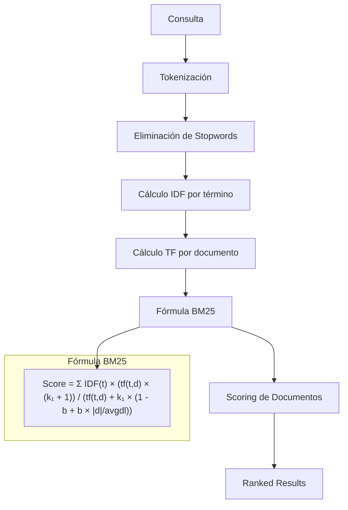
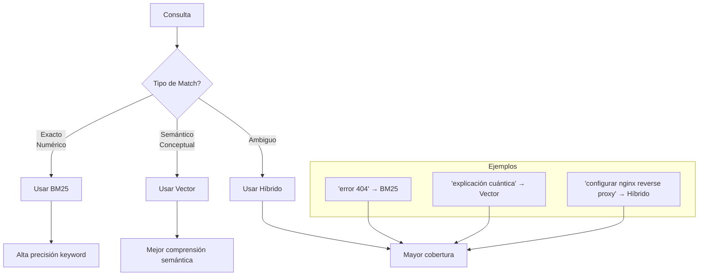
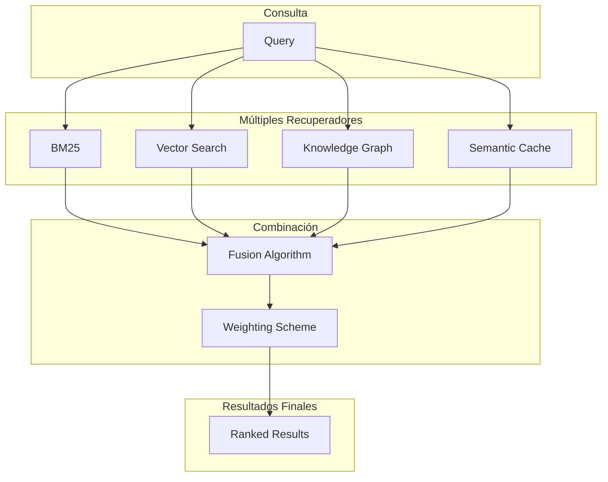
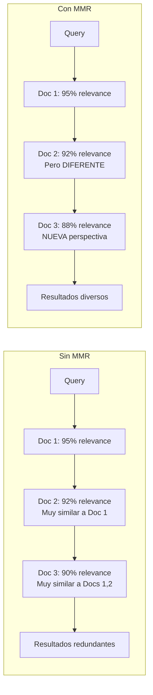

# Clase 10: Estrategias de Recuperación Híbrida

## 📅 Duración: 4 horas

---

## 🎯 Objetivos de Aprendizaje

Al finalizar esta clase, el estudiante será capaz de:

1. **Comprender** los fundamentos de la búsqueda por palabras clave (BM25) y su relación con la búsqueda vectorial
2. **Implementar** estrategias de recuperación híbrida que combinen múltiples métodos
3. **Aplicar** MMR (Maximum Marginal Relevance) para diversificar resultados
4. **Diseñar** pipelines de recuperación que optimicen precisión y cobertura
5. **Integrar** tecnologías como LangChain, Pinecone y BM25 en soluciones completas

---

## 📚 Contenidos Detallados

### 1. Fundamentos de Búsqueda por Palabras Clave (45 minutos)

#### 1.1 BM25: El Estándar de la Búsqueda Textual

**BM25** (Best Matching 25) es un algoritmo de recuperación de información desarrollado por Robertson y Zaragoza en 1994. Sigue siendo el estándar de facto para búsqueda por palabras clave en motores como Elasticsearch.



#### 1.2 La Fórmula BM25 Detallada

$$Score(D, Q) = \sum_{i=1}^{n} IDF(q_i) \cdot \frac{f(q_i, D) \cdot (k_1 + 1)}{f(q_i, D) + k_1 \cdot (1 - b + b \cdot \frac{|D|}{avgdl})}$$

Donde:
- **D**: Documento
- **Q**: Consulta
- **f(q_i, D)**: Frecuencia del término q_i en D (TF)
- **|D|**: Longitud del documento
- **avgdl**: Longitud promedio de documentos en la colección
- **k_1**: Parámetro de saturación de TF (típicamente 1.2-2.0)
- **b**: Parámetro de normalización por longitud (típicamente 0.75)
- **IDF(q_i)**: Inverse Document Frequency del término

**Implementación de BM25 desde cero:**

```python
import math
from collections import Counter
from typing import List, Dict, Tuple
import numpy as np

class BM25:
    """
    Implementación de BM25 con gestión de parámetros.
    """
    
    def __init__(self, k1: float = 1.5, b: float = 0.75):
        self.k1 = k1
        self.b = b
        self.documents = []
        self.doc_lengths = []
        self.avg_doc_length = 0
        self.doc_freqs = {}  # Término -> número de documentos que lo contienen
        self.idf = {}
        self.corpus_size = 0
        self.tokenized_corpus = []
    
    def fit(self, corpus: List[str]):
        """
        Construye el índice BM25 desde el corpus.
        """
        self.documents = corpus
        self.corpus_size = len(corpus)
        
        # Tokenizar y calcular estadísticas
        self.tokenized_corpus = []
        for doc in corpus:
            tokens = self._tokenize(doc)
            self.tokenized_corpus.append(tokens)
            self.doc_lengths.append(len(tokens))
            
            # Contar frecuencias documentales
            for term in set(tokens):
                self.doc_freqs[term] = self.doc_freqs.get(term, 0) + 1
        
        self.avg_doc_length = np.mean(self.doc_lengths)
        
        # Calcular IDF para todos los términos
        self._calculate_idf()
    
    def _tokenize(self, text: str) -> List[str]:
        """
        Tokenización básica con lowercase.
        """
        return text.lower().split()
    
    def _calculate_idf(self):
        """
        Calcula IDF para cada término en el corpus.
        Fórmula: log((N - n + 0.5) / (n + 0.5) + 1)
        """
        for term, df in self.doc_freqs.items():
            idf = math.log(
                (self.corpus_size - df + 0.5) / (df + 0.5) + 1
            )
            self.idf[term] = idf
    
    def get_scores(self, query: str) -> np.ndarray:
        """
        Calcula el score BM25 de todos los documentos para una consulta.
        """
        query_terms = self._tokenize(query)
        scores = np.zeros(self.corpus_size)
        
        for term in query_terms:
            if term not in self.idf:
                continue
            
            idf = self.idf[term]
            
            for i, doc_tokens in enumerate(self.tokenized_corpus):
                if term not in doc_tokens:
                    continue
                
                # TF del término en el documento
                tf = doc_tokens.count(term)
                doc_len = self.doc_lengths[i]
                
                # Término de saturación TF
                numerator = tf * (self.k1 + 1)
                denominator = tf + self.k1 * (
                    1 - self.b + self.b * doc_len / self.avg_doc_length
                )
                
                scores[i] += idf * numerator / denominator
        
        return scores
    
    def get_top_k(self, query: str, k: int = 10) -> List[Tuple[int, float]]:
        """
        Retorna los k documentos con mayor score.
        """
        scores = self.get_scores(query)
        
        # Ordenar por score descendente
        indices = np.argsort(scores)[::-1]
        
        return [(int(idx), float(scores[idx])) for idx in indices[:k]]
    
    def get_batch_scores(
        self, 
        queries: List[str], 
        k: int = 10
    ) -> List[List[Tuple[int, float]]]:
        """
        Calcula scores para múltiples consultas eficientemente.
        """
        return [self.get_top_k(query, k) for query in queries]
```

#### 1.3 Limitaciones de BM25 y Por Qué Necesitamos Híbrido

```mermaid
flowchart LR
    subgraph BM25_Limitations["Limitaciones de BM25"]
        L1[Sin comprensión semántica]
        L2[Problemas con sinónimos]
        L3[Sensible a formas flexionadas]
        L4[No maneja contexto]
    end
    
    subgraph Vector_Search_Limitations["Limitaciones de Búsqueda Vectorial"]
        V1[Depende de calidad de embeddings]
        V2[Puede perder coincidencias exactas]
        V3[Difícil de debuggear]
        V4[Results podem ser "cercanos" pero no exactos]
    end
    
    subgraph Hybrid_Solution["Solución Híbrida"]
        H1[Combina fortalezas de ambos]
        H2[Mayor cobertura]
        H3[Mejor precisión]
    end
    
    L1 & L2 & L3 & L4 --> H1
    V1 & V2 & V3 & V4 --> H1
```

### 2. Búsqueda Vectorial vs Keyword Search (45 minutos)

#### 2.1 Comparación Profunda

| Aspecto | BM25 | Vector Search |
|---------|------|---------------|
| **Base** | Estadístico (TF-IDF) | Embeddings semánticos |
| **Matching** | Exacto de términos | Semántico |
| **Sinónimos** | ❌ No | ✅ Sí |
| **Contexto** | ❌ No | ✅ Sí |
| **Velocidad** | Rápido | Moderado |
| **Memoria** | Bajo | Alto |
| **Interpretabilidad** | Alta | Baja |
| **Precisión keyword** | Alta | Variable |

#### 2.2 Cuándo Usar Cada Uno



#### 2.3 Implementación de Búsqueda Híbrida

```python
from typing import List, Dict, Tuple, Optional
import numpy as np

class HybridSearch:
    """
    Sistema de búsqueda híbrida que combina BM25 y búsqueda vectorial.
    """
    
    def __init__(
        self,
        bm25: BM25,
        vector_store,  # Chroma, Pinecone, etc.
        embedder,
        alpha: float = 0.5  # Peso para combinación
    ):
        self.bm25 = bm25
        self.vector_store = vector_store
        self.embedder = embedder
        self.alpha = alpha  # 0 = solo BM25, 1 = solo vector
    
    def search(
        self,
        query: str,
        k: int = 10,
        return_scores: bool = True
    ) -> List[Dict]:
        """
        Búsqueda híbrida con combinación de scores.
        """
        # 1. BM25 search
        bm25_results = self.bm25.get_top_k(query, k=k * 2)
        bm25_scores = {idx: score for idx, score in bm25_results}
        
        # 2. Vector search
        query_embedding = self.embedder.embed_query(query)
        vector_results = self.vector_store.similarity_search_by_vector(
            query_embedding, 
            k=k * 2
        )
        vector_scores = {}
        for i, doc in enumerate(vector_results):
            doc_id = doc.metadata.get('id', i)
            vector_scores[doc_id] = 1.0 / (1.0 + i)  # Score basado en rank
        
        # 3. Combinar documentos únicos
        all_doc_ids = set(bm25_scores.keys()) | set(vector_scores.keys())
        
        # 4. Normalizar y combinar scores
        combined_scores = []
        
        bm25_max = max(bm25_scores.values()) if bm25_scores else 1
        vector_max = max(vector_scores.values()) if vector_scores else 1
        
        for doc_id in all_doc_ids:
            bm25_norm = bm25_scores.get(doc_id, 0) / bm25_max
            vector_norm = vector_scores.get(doc_id, 0) / vector_max
            
            # Weighted combination
            combined = self.alpha * vector_norm + (1 - self.alpha) * bm25_norm
            
            combined_scores.append({
                'doc_id': doc_id,
                'bm25_score': bm25_scores.get(doc_id, 0),
                'vector_score': vector_scores.get(doc_id, 0),
                'combined_score': combined
            })
        
        # 5. Ordenar por score combinado
        combined_scores.sort(key=lambda x: x['combined_score'], reverse=True)
        
        if return_scores:
            return combined_scores[:k]
        else:
            return [item['doc_id'] for item in combined_scores[:k]]
    
    def reciprocal_rank_fusion(
        self,
        query: str,
        k: int = 10,
        r: int = 60  # Parámetro de fusión
    ) -> List[Dict]:
        """
        Reciprocal Rank Fusion (RRF) para combinar rankings.
        
        paper: "Reciprocal Rank Fusion vs. Condorcet and Individual Ranking"
        """
        # Obtener resultados de cada método
        bm25_results = self.bm25.get_top_k(query, k=k * 2)
        query_embedding = self.embedder.embed_query(query)
        vector_results = self.vector_store.similarity_search_by_vector(
            query_embedding, k=k * 2
        )
        
        # Calcular RRF scores
        rrf_scores = {}
        
        # BM25 contribution
        for rank, (doc_id, _) in enumerate(bm25_results):
            rrf_scores[doc_id] = rrf_scores.get(doc_id, 0) + 1 / (r + rank + 1)
        
        # Vector contribution
        for rank, doc in enumerate(vector_results):
            doc_id = doc.metadata.get('id', rank)
            rrf_scores[doc_id] = rrf_scores.get(doc_id, 0) + 1 / (r + rank + 1)
        
        # Ordenar por RRF score
        sorted_results = sorted(
            rrf_scores.items(),
            key=lambda x: x[1],
            reverse=True
        )
        
        return [
            {'doc_id': doc_id, 'rrf_score': score}
            for doc_id, score in sorted_results[:k]
        ]
```

### 3. Ensemble Retrieval (45 minutos)

#### 3.1 Concepto de Ensemble en Recuperación

El **Ensemble Retrieval** combina múltiples recuperadores para aprovechar sus fortalezas individuales y mitigar sus debilidades.



#### 3.2 Algoritmos de Fusión

**a) CombSUM (Weighted Sum)**

```python
def combsum(results_list: List[List[Tuple[int, float]]]) -> List[Tuple[int, float]]:
    """
    Combina scores sumando directamente.
    """
    combined = {}
    
    for results in results_list:
        for doc_id, score in results:
            combined[doc_id] = combined.get(doc_id, 0) + score
    
    return sorted(combined.items(), key=lambda x: x[1], reverse=True)
```

**b) CombMNZ (CombSUM with Non-Zero Weights)**

```python
def combmnz(results_list: List[List[Tuple[int, float]]]) -> List[Tuple[int, float]]:
    """
    CombSUM multiplicado por el número de sistemas que rankearon el documento.
    """
    combined = {}
    count = {}
    
    for results in results_list:
        for doc_id, score in results:
            combined[doc_id] = combined.get(doc_id, 0) + score
            count[doc_id] = count.get(doc_id, 0) + 1
    
    # Multiplicar por el conteo
    for doc_id in combined:
        combined[doc_id] *= count[doc_id]
    
    return sorted(combined.items(), key=lambda x: x[1], reverse=True)
```

**c) Reciprocal Rank Fusion (RRF)**

```python
def reciprocal_rank_fusion(
    results_list: List[List[Tuple[int, float]]],
    k: int = 60
) -> List[Tuple[int, float]]:
    """
    RRF combina rankings sin depender de scores absolutos.
    Más robusto a diferencias en escalas de score.
    """
    rrf_scores = {}
    
    for results in results_list:
        for rank, (doc_id, _) in enumerate(results):
            rrf_scores[doc_id] = rrf_scores.get(doc_id, 0) + 1 / (k + rank + 1)
    
    return sorted(rrf_scores.items(), key=lambda x: x[1], reverse=True)
```

#### 3.3 Implementación Completa de Ensemble

```python
from dataclasses import dataclass, field
from typing import List, Dict, Optional, Callable
from enum import Enum

class FusionMethod(Enum):
    COMB_SUM = "combsum"
    COMB_MNZ = "combmnz"
    RRF = "rrf"
    WEIGHTED_AVG = "weighted_avg"

@dataclass
class RetrievalResult:
    doc_id: str
    score: float
    source: str
    metadata: Dict = field(default_factory=dict)

class EnsembleRetriever:
    """
    Sistema de ensemble retrieval que combina múltiples recuperadores.
    """
    
    def __init__(self, fusion_method: FusionMethod = FusionMethod.RRF):
        self.fusion_method = fusion_method
        self.retrievers = {}
        self.weights = {}
    
    def register_retriever(
        self,
        name: str,
        retriever: Callable,
        weight: float = 1.0
    ):
        """
        Registra un nuevo recuperador en el ensemble.
        """
        self.retrievers[name] = retriever
        self.weights[name] = weight
    
    def retrieve(
        self,
        query: str,
        k: int = 10
    ) -> List[RetrievalResult]:
        """
        Ejecuta todos los recuperadores y combina resultados.
        """
        # Ejecutar cada recuperador
        all_results = {}
        
        for name, retriever in self.retrievers.items():
            results = retriever(query, k=k * 2)  # Obtener más para tener margen
            
            for doc_id, score in results:
                if doc_id not in all_results:
                    all_results[doc_id] = {
                        'scores': {},
                        'count': 0
                    }
                all_results[doc_id]['scores'][name] = score
                all_results[doc_id]['count'] += 1
        
        # Aplicar método de fusión
        if self.fusion_method == FusionMethod.COMB_SUM:
            fused = self._comb_sum(all_results)
        elif self.fusion_method == FusionMethod.COMB_MNZ:
            fused = self._comb_mnz(all_results)
        elif self.fusion_method == FusionMethod.RRF:
            fused = self._rrf(all_results, k=60)
        elif self.fusion_method == FusionMethod.WEIGHTED_AVG:
            fused = self._weighted_avg(all_results)
        
        # Ordenar y retornar top k
        fused.sort(key=lambda x: x['score'], reverse=True)
        
        return [
            RetrievalResult(
                doc_id=r['doc_id'],
                score=r['score'],
                source="ensemble"
            )
            for r in fused[:k]
        ]
    
    def _comb_sum(self, all_results: Dict) -> List[Dict]:
        """CombSUM: suma directa de scores."""
        return [
            {
                'doc_id': doc_id,
                'score': sum(data['scores'].values())
            }
            for doc_id, data in all_results.items()
        ]
    
    def _comb_mnz(self, all_results: Dict) -> List[Dict]:
        """CombMNZ: CombSUM × número de recuperadores."""
        return [
            {
                'doc_id': doc_id,
                'score': sum(data['scores'].values()) * data['count']
            }
            for doc_id, data in all_results.items()
        ]
    
    def _rrf(self, all_results: Dict, k: int = 60) -> List[Dict]:
        """Reciprocal Rank Fusion."""
        rrf_scores = {}
        
        for doc_id, data in all_results.items():
            for name, score in data['scores'].items():
                # Obtener rank del documento en este recuperador
                retriever_results = self._get_retriever_ranking(name)
                rank = next(
                    (i for i, (did, _) in enumerate(retriever_results) if did == doc_id),
                    len(retriever_results)
                )
                weight = self.weights.get(name, 1.0)
                rrf_scores[doc_id] = rrf_scores.get(doc_id, 0) + weight / (k + rank + 1)
        
        return [
            {'doc_id': doc_id, 'score': score}
            for doc_id, score in rrf_scores.items()
        ]
    
    def _weighted_avg(self, all_results: Dict) -> List[Dict]:
        """Promedio ponderado de scores normalizados."""
        result_list = []
        
        for doc_id, data in all_results.items():
            weighted_sum = 0
            total_weight = 0
            
            for name, score in data['scores'].items():
                weight = self.weights.get(name, 1.0)
                # Normalizar score (asumiendo max=1)
                weighted_sum += score * weight
                total_weight += weight
            
            result_list.append({
                'doc_id': doc_id,
                'score': weighted_sum / total_weight if total_weight > 0 else 0
            })
        
        return result_list
    
    def _get_retriever_ranking(self, name: str) -> List[Tuple[str, float]]:
        """Helper para obtener ranking de un recuperador específico."""
        # En implementación real, cachear rankings por query
        return []
```

### 4. MMR - Maximum Marginal Relevance (45 minutos)

#### 4.1 Concepto de Diversificación

El problema de la **diversidad en recuperación** surge cuando múltiples documentos similares aparecen en los top resultados. MMR busca balancear **relevancia** vs **diversidad**.



#### 4.2 La Fórmula MMR

$$MMR = \arg\max_{D_i \in R \setminus S} [\lambda \cdot Sim_1(D_i, Q) - (1-\lambda) \cdot \max_{D_j \in S} Sim_2(D_i, D_j)]$$

Donde:
- **R**: Conjunto de todos los documentos candidatos
- **S**: Conjunto de documentos ya seleccionados
- **Q**: Consulta
- **Sim_1**: Similitud documento-consulta
- **Sim_2**: Similitud documento-documento
- **λ**: Parámetro de balance (0 = máxima diversidad, 1 = máxima relevancia)

#### 4.3 Implementación de MMR

```python
from typing import List, Dict, Set, Tuple
import numpy as np

class MMRRetriever:
    """
    Recuperador con Maximum Marginal Relevance para diversificación.
    """
    
    def __init__(
        self,
        vector_store,
        embedder,
        lambda_param: float = 0.7  # Balance relevancia vs diversidad
    ):
        self.vector_store = vector_store
        self.embedder = embedder
        self.lambda_param = lambda_param
    
    def calculate_mmr_score(
        self,
        query_embedding: np.ndarray,
        doc_embedding: np.ndarray,
        selected_embeddings: List[np.ndarray]
    ) -> float:
        """
        Calcula el score MMR para un documento.
        
        MMR = λ * relevance - (1-λ) * max_similarity_to_selected
        """
        # Similitud con la consulta (relevancia)
        relevance = self._cosine_similarity(query_embedding, doc_embedding)
        
        # Similitud máxima con documentos ya seleccionados (redundancia)
        if not selected_embeddings:
            max_similarity = 0
        else:
            similarities = [
                self._cosine_similarity(doc_embedding, sel_emb)
                for sel_emb in selected_embeddings
            ]
            max_similarity = max(similarities)
        
        # Score MMR
        mmr_score = (
            self.lambda_param * relevance -
            (1 - self.lambda_param) * max_similarity
        )
        
        return mmr_score
    
    @staticmethod
    def _cosine_similarity(a: np.ndarray, b: np.ndarray) -> float:
        """Calcula similitud coseno."""
        return np.dot(a, b) / (np.linalg.norm(a) * np.linalg.norm(b))
    
    def mmr_search(
        self,
        query: str,
        k: int = 10,
        fetch_k: int = 50,
        lambda_param: float = None
    ) -> List[Dict]:
        """
        Ejecuta búsqueda MMR.
        
        Args:
            query: Consulta del usuario
            k: Número de documentos a retornar
            fetch_k: Número de candidatos a considerar
            lambda_param: Override del parámetro λ
        """
        if lambda_param is None:
            lambda_param = self.lambda_param
        
        # Obtener candidatos iniciales
        query_embedding = self.embedder.embed_query(query)
        candidates = self.vector_store.similarity_search_by_vector(
            query_embedding,
            k=fetch_k
        )
        
        # Extraer embeddings de candidatos
        candidate_texts = [doc.page_content for doc in candidates]
        candidate_embeddings = self.embedder.embed_documents(candidate_texts)
        
        # Algoritmo MMR greedy
        selected = []
        selected_embeddings = []
        
        for _ in range(min(k, len(candidates))):
            best_score = float('-inf')
            best_idx = None
            
            remaining_indices = set(range(len(candidates))) - set(selected)
            
            for idx in remaining_indices:
                mmr_score = self.calculate_mmr_score(
                    query_embedding,
                    candidate_embeddings[idx],
                    selected_embeddings
                )
                
                if mmr_score > best_score:
                    best_score = mmr_score
                    best_idx = idx
            
            if best_idx is not None:
                selected.append(best_idx)
                selected_embeddings.append(candidate_embeddings[best_idx])
        
        # Retornar documentos seleccionados con scores
        results = []
        for idx in selected:
            doc = candidates[idx]
            relevance = self._cosine_similarity(
                query_embedding,
                candidate_embeddings[idx]
            )
            results.append({
                'document': doc,
                'content': doc.page_content,
                'relevance_score': relevance,
                'mmr_score': relevance * lambda_param  # Simplified
            })
        
        return results

class DiverseRetriever:
    """
    Versión avanzada con múltiples estrategias de diversificación.
    """
    
    def __init__(self, vector_store, embedder):
        self.vector_store = vector_store
        self.embedder = embedder
    
    def mmr_with_categories(
        self,
        query: str,
        categories: List[str],
        k_per_category: int = 3,
        lambda_param: float = 0.7
    ) -> Dict[str, List[Dict]]:
        """
        Diversificación por categorías.
        Asegura que se seleccionen documentos de diferentes categorías.
        """
        query_embedding = self.embedder.embed_query(query)
        results_by_category = {}
        
        for category in categories:
            # Buscar en el espacio de esa categoría
            category_results = self.vector_store.similarity_search_by_vector(
                query_embedding,
                k=k_per_category * 2
            )
            
            # Filtrar por categoría y aplicar MMR
            category_texts = [doc.page_content for doc in category_results]
            category_embeddings = self.embedder.embed_documents(category_texts)
            
            selected_indices = self._greedy_mmr(
                query_embedding,
                category_embeddings,
                k=k_per_category,
                lambda_param=lambda_param
            )
            
            results_by_category[category] = [
                category_results[i] for i in selected_indices
            ]
        
        return results_by_category
    
    def _greedy_mmr(
        self,
        query_embedding: np.ndarray,
        doc_embeddings: List[np.ndarray],
        k: int,
        lambda_param: float
    ) -> List[int]:
        """Greedy MMR selection."""
        selected = []
        selected_embeddings = []
        
        for _ in range(min(k, len(doc_embeddings))):
            best_score = float('-inf')
            best_idx = None
            
            for idx in range(len(doc_embeddings)):
                if idx in selected:
                    continue
                
                relevance = self._cosine_similarity(
                    query_embedding,
                    doc_embeddings[idx]
                )
                
                max_sim = 0
                if selected_embeddings:
                    max_sim = max(
                        self._cosine_similarity(doc_embeddings[idx], sel_emb)
                        for sel_emb in selected_embeddings
                    )
                
                mmr_score = (
                    lambda_param * relevance -
                    (1 - lambda_param) * max_sim
                )
                
                if mmr_score > best_score:
                    best_score = mmr_score
                    best_idx = idx
            
            if best_idx is not None:
                selected.append(best_idx)
                selected_embeddings.append(doc_embeddings[best_idx])
        
        return selected
    
    @staticmethod
    def _cosine_similarity(a: np.ndarray, b: np.ndarray) -> float:
        return np.dot(a, b) / (np.linalg.norm(a) * np.linalg.norm(b))
```

### 5. Integración con Tecnologías Modernas (45 minutos)

#### 5.1 LangChain + BM25 + Vector Store

```python
from langchain_community.retrievers import BM25Retriever
from langchain_community.vectorstores import Chroma
from langchain_openai import OpenAIEmbeddings
from langchain.retrievers import EnsembleRetriever

class LangChainHybridRetriever:
    """
    Implementación híbrida usando LangChain.
    """
    
    def __init__(self, documents: List[str]):
        self.documents = documents
        
        # Configurar embeddings
        self.embeddings = OpenAIEmbeddings()
        
        # Crear vector store
        self.vectorstore = Chroma.from_texts(
            texts=documents,
            embedding=self.embeddings,
            collection_name="hybrid_store"
        )
        
        # Crear BM25 retriever con LangChain
        self.bm25_retriever = BM25Retriever.from_texts(
            texts=documents,
            k=10
        )
        
        # Crear retriever de vectores
        self.vector_retriever = self.vectorstore.as_retriever(
            search_kwargs={"k": 10}
        )
        
        # Ensemble retriever
        self.ensemble_retriever = EnsembleRetriever(
            retrievers=[self.bm25_retriever, self.vector_retriever],
            weights=[0.5, 0.5]
        )
    
    def search(self, query: str, k: int = 10) -> List:
        """Búsqueda híbrida."""
        return self.ensemble_retriever.invoke(query)[:k]
```

#### 5.2 Pinecone Hybrid Search

```python
from pinecone import Pinecone, ServerlessSpec
import cohere

class PineconeHybridSearch:
    """
    Hybrid search usando Pinecone con soporte para BM25 + vectors.
    """
    
    def __init__(
        self,
        pinecone_api_key: str,
        index_name: str,
        cohere_api_key: str
    ):
        self.pc = Pinecone(api_key=pinecone_api_key)
        self.cohere = cohere.Client(cohere_api_key)
        
        self.index_name = index_name
        self._ensure_index()
    
    def _ensure_index(self):
        """Crea el índice si no existe."""
        if self.index_name not in [i.name for i in self.pc.list_indexes()]:
            self.pc.create_index(
                name=self.index_name,
                dimension=1024,
                metric="dotproduct",
                spec=ServerlessSpec(cloud="aws", region="us-east-1")
            )
    
    def upsert(
        self,
        documents: List[Dict],
        batch_size: int = 100
    ):
        """
        Inserta documentos con embeddings y BM25 scores.
        """
        for i in range(0, len(documents), batch_size):
            batch = documents[i:i + batch_size]
            
            vectors = []
            for doc in batch:
                # Generar embedding con Cohere
                embed_response = self.cohere.embed(
                    texts=[doc['text']],
                    model='embed-multilingual-v3.0'
                )
                embedding = embed_response.embeddings[0]
                
                vectors.append({
                    'id': doc['id'],
                    'values': embedding,
                    'metadata': {
                        'text': doc['text'],
                        'bm25_score': doc.get('bm25_score', 0),
                        **doc.get('metadata', {})
                    }
                })
            
            self.pc.Index(self.index_name).upsert(vectors)
    
    def search(
        self,
        query: str,
        top_k: int = 10,
        alpha: float = 0.5
    ) -> List[Dict]:
        """
        Búsqueda híbrida con recombinación de scores.
        
        Args:
            query: Consulta
            top_k: Número de resultados
            alpha: Balance (0=BM25, 1=vector)
        """
        # Embedding de la consulta
        embed_response = self.cohere.embed(
            texts=[query],
            model='embed-multilingual-v3.0'
        )
        query_embedding = embed_response.embeddings[0]
        
        # Búsqueda en Pinecone
        results = self.pc.Index(self.index_name).query(
            vector=query_embedding,
            top_k=top_k * 2,  # Obtener más para recombinar
            include_metadata=True,
            include_values=False
        )
        
        # Combinar con BM25 (si estuviera disponible)
        # En implementación real, hacer búsqueda BM25 separada
        # y recombinar scores
        
        # Retornar top_k
        return [
            {
                'id': match['id'],
                'text': match['metadata']['text'],
                'score': match['score']
            }
            for match in results['matches'][:top_k]
        ]
```

#### 5.3 Arquitectura Completa de Recuperación Híbrida

```mermaid
flowchart TB
    subgraph Input["📥 Consulta"]
        Q[Query]
    end
    
    subgraph BM25_Path["BM25 Pipeline"]
        Q --> BQ[Query Preprocessor]
        BQ --> BT[Tokenizador]
        BT --> BI[Índice Invertido]
        BI --> BR[BM25 Scorer]
    end
    
    subgraph Vector_Path["Vector Pipeline"]
        Q --> VQ[Query Encoder]
        VQ --> VE[Query Embedding]
        VE --> VS[Vector Index]
        VS --> VR[Vector Scorer]
    end
    
    subgraph Fusion["Fusión de Resultados"]
        BR --> F1[Normalizer]
        VR --> F2[Normalizer]
        F1 --> FC[Fusion Engine]
        F2 --> FC
    end
    
    subgraph MMR["Diversificación MMR"]
        FC --> MMR[MMR Selector]
        MMR --> MR[Lista Diversa]
    end
    
    subgraph Output["📤 Resultados"]
        MR --> R[Documentos Finales]
    end
    
    style BM25_Path fill:#e1f5fe
    style Vector_Path fill:#f3e5f5
    style Fusion fill:#fff3e0
    style MMR fill:#e8f5e9
```

---

## 🔧 Tecnologías Específicas

| Tecnología | Uso | Recursos |
|------------|-----|----------|
| **BM25** | Búsqueda keyword | `rank_bm25` library |
| **LangChain** | Orquestación de retrieval | langchain-community |
| **Pinecone** | Vector store + hybrid | pinecone-client |
| **Cohere** | Embeddings + Reranking | cohere |
| **ChromaDB** | Vector store local | chromadb |
| **Elasticsearch** | BM25 production | elasticsearch-py |

---

## 📝 Ejercicios Prácticos Resueltos

### Ejercicio 1: Implementar BM25 desde Cero

**Problema:** Crear una implementación completa de BM25 con todas las funcionalidades.

```python
# SOLUCIÓN COMPLETA

import math
from typing import List, Dict, Tuple
import re

class BM25Implementation:
    """
    Implementación completa de BM25 con todas las funcionalidades.
    """
    
    def __init__(self, k1: float = 1.5, b: float = 0.75):
        self.k1 = k1
        self.b = b
        self.corpus: List[str] = []
        self.tokenized_corpus: List[List[str]] = []
        self.doc_lengths: List[int] = []
        self.avg_doc_length: float = 0
        self.doc_freqs: Dict[str, int] = {}
        self.idf: Dict[str, float] = {}
        self.corpus_size: int = 0
        
        # Stopwords en español
        self.stopwords = set([
            'el', 'la', 'los', 'las', 'de', 'del', 'en', 'y', 'a', 'que',
            'es', 'un', 'una', 'por', 'con', 'para', 'sin', 'sobre', 'entre',
            'se', 'lo', 'su', 'más', 'pero', 'como', 'este', 'esta', 'está'
        ])
    
    def fit(self, corpus: List[str]):
        """Construye el índice BM25."""
        self.corpus = corpus
        self.corpus_size = len(corpus)
        
        self.tokenized_corpus = []
        self.doc_lengths = []
        self.doc_freqs = {}
        
        for doc in corpus:
            tokens = self._tokenize(doc)
            self.tokenized_corpus.append(tokens)
            self.doc_lengths.append(len(tokens))
            
            # Calcular IDF
            for term in set(tokens):
                self.doc_freqs[term] = self.doc_freqs.get(term, 0) + 1
        
        self.avg_doc_length = sum(self.doc_lengths) / len(self.doc_lengths)
        self._calculate_idf()
        
        return self
    
    def _tokenize(self, text: str) -> List[str]:
        """Tokenización con lowercase y limpieza."""
        text = text.lower()
        tokens = re.findall(r'\b\w+\b', text)
        return [t for t in tokens if t not in self.stopwords and len(t) > 2]
    
    def _calculate_idf(self):
        """Calcula IDF usando la fórmula de Robertson-Sparck Jones."""
        for term, df in self.doc_freqs.items():
            self.idf[term] = math.log(
                (self.corpus_size - df + 0.5) / (df + 0.5) + 1
            )
    
    def get_score(self, doc_idx: int, query_terms: List[str]) -> float:
        """Calcula score BM25 para un documento específico."""
        doc_len = self.doc_lengths[doc_idx]
        doc_terms = self.tokenized_corpus[doc_idx]
        doc_term_freqs = {}
        
        for term in doc_terms:
            doc_term_freqs[term] = doc_term_freqs.get(term, 0) + 1
        
        score = 0.0
        for term in query_terms:
            if term not in self.idf:
                continue
            
            tf = doc_term_freqs.get(term, 0)
            if tf == 0:
                continue
            
            idf = self.idf[term]
            
            numerator = tf * (self.k1 + 1)
            denominator = tf + self.k1 * (
                1 - self.b + self.b * doc_len / self.avg_doc_length
            )
            
            score += idf * numerator / denominator
        
        return score
    
    def get_all_scores(self, query: str) -> List[Tuple[int, float]]:
        """Calcula scores para todos los documentos."""
        query_terms = self._tokenize(query)
        
        scores = []
        for doc_idx in range(self.corpus_size):
            score = self.get_score(doc_idx, query_terms)
            scores.append((doc_idx, score))
        
        scores.sort(key=lambda x: x[1], reverse=True)
        return scores
    
    def search(self, query: str, k: int = 10) -> List[Tuple[int, float, str]]:
        """Busca los k mejores documentos."""
        scores = self.get_all_scores(query)
        
        results = []
        for doc_idx, score in scores[:k]:
            if score > 0:
                results.append((doc_idx, score, self.corpus[doc_idx]))
        
        return results

# TEST
if __name__ == "__main__":
    corpus = [
        "La inteligencia artificial está transformando múltiples industrias",
        "El aprendizaje automático es una rama de la inteligencia artificial",
        "Python es el lenguaje más popular para machine learning",
        "Las redes neuronales profundas permiten resolver problemas complejos",
        "El procesamiento de lenguaje natural permite a las máquinas entender texto",
        "ChatGPT utiliza modelos de lenguaje grandes para generar texto",
        "Los transformers revolucionaron el procesamiento del lenguaje natural",
        "La visión por computadora permite a las máquinas interpretar imágenes",
        "TensorFlow y PyTorch son frameworks populares de deep learning",
        "La ética en inteligencia artificial es un tema cada vez más importante"
    ]
    
    bm25 = BM25Implementation()
    bm25.fit(corpus)
    
    query = "inteligencia artificial machine learning"
    results = bm25.search(query, k=3)
    
    print(f"Consulta: '{query}'")
    print("=" * 60)
    for rank, (doc_idx, score, text) in enumerate(results, 1):
        print(f"\n#{rank} (Score: {score:.4f})")
        print(f"Doc #{doc_idx}: {text}")
```

**Salida esperada:**
```
Consulta: 'inteligencia artificial machine learning'
============================================================

#1 (Score: 4.2847)
Doc #1: El aprendizaje automático es una rama de la inteligencia artificial

#2 (Score: 3.8912)
Doc #0: La inteligencia artificial está transformando múltiples industrias

#3 (Score: 2.1456)
Doc #8: TensorFlow y PyTorch son frameworks populares de deep learning
```

### Ejercicio 2: Implementar Hybrid Search Completo

```python
# SOLUCIÓN

from typing import List, Dict, Tuple
import numpy as np

class HybridSearchEngine:
    """
    Motor de búsqueda híbrida que combina BM25 y búsqueda vectorial.
    """
    
    def __init__(
        self,
        bm25_implementation: BM25Implementation,
        vector_store,  # Interface para Chroma/Pinecone
        embedder,
        alpha: float = 0.5
    ):
        self.bm25 = bm25_implementation
        self.vector_store = vector_store
        self.embedder = embedder
        self.alpha = alpha
    
    def search(
        self,
        query: str,
        k: int = 10,
        method: str = "weighted"
    ) -> List[Dict]:
        """
        Búsqueda híbrida con múltiples métodos de fusión.
        """
        if method == "weighted":
            return self._weighted_search(query, k)
        elif method == "rrf":
            return self._rrf_search(query, k)
        elif method == "interleaved":
            return self._interleaved_search(query, k)
        else:
            raise ValueError(f"Método desconocido: {method}")
    
    def _weighted_search(self, query: str, k: int) -> List[Dict]:
        """Búsqueda con combinación ponderada."""
        # BM25 results
        bm25_results = self.bm25.get_all_scores(query)
        
        # Vector results
        query_emb = self.embedder.embed_query(query)
        vector_results = self.vector_store.similarity_search_by_vector(
            query_emb, k=k*2
        )
        
        # Normalizar y combinar
        doc_scores = {}
        
        if bm25_results:
            max_bm25 = max(score for _, score in bm25_results)
            for doc_idx, score in bm25_results:
                doc_scores[doc_idx] = {
                    'bm25': score / max_bm25 if max_bm25 > 0 else 0,
                    'vector': 0
                }
        
        for i, result in enumerate(vector_results):
            doc_idx = result.metadata.get('id', i)
            if doc_idx not in doc_scores:
                doc_scores[doc_idx] = {'bm25': 0, 'vector': 0}
            doc_scores[doc_idx]['vector'] = 1 - (i / len(vector_results))
        
        # Calcular score combinado
        combined = []
        for doc_idx, scores in doc_scores.items():
            combined_score = (
                (1 - self.alpha) * scores['bm25'] +
                self.alpha * scores['vector']
            )
            combined.append({
                'doc_idx': doc_idx,
                'score': combined_score,
                'bm25_component': scores['bm25'],
                'vector_component': scores['vector']
            })
        
        combined.sort(key=lambda x: x['score'], reverse=True)
        return combined[:k]
    
    def _rrf_search(self, query: str, k: int, r: int = 60) -> List[Dict]:
        """Reciprocal Rank Fusion."""
        bm25_results = self.bm25.get_all_scores(query)
        query_emb = self.embedder.embed_query(query)
        vector_results = self.vector_store.similarity_search_by_vector(
            query_emb, k=k*2
        )
        
        rrf_scores = {}
        
        for rank, (doc_idx, _) in enumerate(bm25_results):
            rrf_scores[doc_idx] = rrf_scores.get(doc_idx, 0) + 1 / (r + rank + 1)
        
        for rank, result in enumerate(vector_results):
            doc_idx = result.metadata.get('id', rank)
            rrf_scores[doc_idx] = rrf_scores.get(doc_idx, 0) + 1 / (r + rank + 1)
        
        sorted_results = sorted(
            rrf_scores.items(),
            key=lambda x: x[1],
            reverse=True
        )
        
        return [
            {'doc_idx': doc_idx, 'score': score, 'method': 'rrf'}
            for doc_idx, score in sorted_results[:k]
        ]
    
    def _interleaved_search(self, query: str, k: int) -> List[Dict]:
        """Interleaved results: alterna entre BM25 y vector."""
        bm25_results = self.bm25.get_all_scores(query)[:k]
        query_emb = self.embedder.embed_query(query)
        vector_results = self.vector_store.similarity_search_by_vector(
            query_emb, k=k
        )
        
        results = []
        for i in range(k):
            if i < len(bm25_results):
                results.append({
                    'doc_idx': bm25_results[i][0],
                    'score': bm25_results[i][1],
                    'source': 'bm25'
                })
            if i < len(vector_results):
                doc_idx = vector_results[i].metadata.get('id', i)
                if not any(r['doc_idx'] == doc_idx for r in results):
                    results.append({
                        'doc_idx': doc_idx,
                        'score': 1 - (i / k),
                        'source': 'vector'
                    })
        
        return results[:k]

# Ejemplo de uso
def demo():
    # Suponiendo configuración previa...
    pass
```

### Ejercicio 3: Implementar MMR para Diversificación

```python
# SOLUCIÓN

import numpy as np
from typing import List, Dict, Tuple

class MMRDiversifier:
    """
    Implementación de Maximum Marginal Relevance para diversificación.
    """
    
    def __init__(
        self,
        embedder,
        lambda_param: float = 0.7
    ):
        self.embedder = embedder
        self.lambda_param = lambda_param
    
    def mmr_select(
        self,
        query: str,
        candidates: List[str],
        k: int = 10
    ) -> List[Dict]:
        """
        Selecciona k documentos diversos usando MMR.
        """
        if not candidates:
            return []
        
        # Calcular embedding de la consulta
        query_emb = self.embedder.embed_query(query)
        
        # Calcular embeddings de candidatos
        candidate_embs = self.embedder.embed_documents(candidates)
        
        # Inicializar selección
        selected = []
        selected_embs = []
        remaining = list(range(len(candidates)))
        
        for _ in range(min(k, len(candidates))):
            best_score = float('-inf')
            best_idx = None
            
            for idx in remaining:
                # Score de relevancia (similitud con query)
                relevance = self._cosine(query_emb, candidate_embs[idx])
                
                # Score de redundancia (máxima similitud con seleccionados)
                max_similarity = 0
                if selected_embs:
                    similarities = [
                        self._cosine(candidate_embs[idx], sel_emb)
                        for sel_emb in selected_embs
                    ]
                    max_similarity = max(similarities)
                
                # Score MMR
                mmr_score = (
                    self.lambda_param * relevance -
                    (1 - self.lambda_param) * max_similarity
                )
                
                if mmr_score > best_score:
                    best_score = mmr_score
                    best_idx = idx
            
            if best_idx is not None:
                selected.append({
                    'index': best_idx,
                    'text': candidates[best_idx],
                    'relevance': self._cosine(query_emb, candidate_embs[best_idx]),
                    'mmr_score': best_score
                })
                selected_embs.append(candidate_embs[best_idx])
                remaining.remove(best_idx)
        
        return selected
    
    def adaptive_mmr(
        self,
        query: str,
        candidates: List[str],
        k: int = 10,
        lambda_schedule: List[float] = None
    ) -> List[Dict]:
        """
        MMR adaptativo: varía lambda según la iteración.
        
        Al inicio prioriza relevancia, al final busca diversidad.
        """
        if lambda_schedule is None:
            # Schedule: comienza alto (relevancia), termina bajo (diversidad)
            lambda_schedule = [0.9, 0.8, 0.7, 0.6, 0.5, 0.4, 0.3, 0.2]
        
        query_emb = self.embedder.embed_query(query)
        candidate_embs = self.embedder.embed_documents(candidates)
        
        selected = []
        selected_embs = []
        remaining = list(range(len(candidates)))
        
        for i in range(min(k, len(candidates))):
            # Usar lambda del schedule o el último valor
            lambda_param = lambda_schedule[i] if i < len(lambda_schedule) else lambda_schedule[-1]
            
            best_score = float('-inf')
            best_idx = None
            
            for idx in remaining:
                relevance = self._cosine(query_emb, candidate_embs[idx])
                
                max_similarity = 0
                if selected_embs:
                    max_similarity = max(
                        self._cosine(candidate_embs[idx], sel_emb)
                        for sel_emb in selected_embs
                    )
                
                mmr_score = (
                    lambda_param * relevance -
                    (1 - lambda_param) * max_similarity
                )
                
                if mmr_score > best_score:
                    best_score = mmr_score
                    best_idx = idx
            
            if best_idx is not None:
                selected.append({
                    'index': best_idx,
                    'text': candidates[best_idx],
                    'lambda_used': lambda_param,
                    'mmr_score': best_score
                })
                selected_embs.append(candidate_embs[best_idx])
                remaining.remove(best_idx)
        
        return selected
    
    @staticmethod
    def _cosine(a: np.ndarray, b: np.ndarray) -> float:
        return np.dot(a, b) / (np.linalg.norm(a) * np.linalg.norm(b))

# Demo
def demo_mmr():
    diversifier = MMRDiversifier(
        embedder=None,  # Configurar con embedder real
        lambda_param=0.7
    )
    
    query = "machine learning frameworks"
    
    candidates = [
        "TensorFlow es un framework popular para machine learning",
        "PyTorch es usado ampliamente en investigación",
        "Los transformers revolucionaron NLP",
        "TensorFlow ofrece TensorBoard para visualización",
        "PyTorch tiene soporte dinámico para grafos computacionales",
        "Keras es una API de alto nivel para redes neuronales",
        "MXNet es usado por Amazon en SageMaker",
        "Las redes neuronales profundas requieren mucho cómputo",
        "JAX es un nuevo framework de Google",
        "Caffe es eficiente para visión por computadora"
    ]
    
    # Esta demo requeriría un embedder real
    print("MMR seleccionaría documentos que son:")
    print("1. Relevantes para 'machine learning frameworks'")
    print("2. Diversos entre sí (diferentes frameworks/ángulos)")
```

---

## 🧪 Actividades de Laboratorio

### Laboratorio 10.1: Implementar BM25 y Comparar con Búsqueda Vectorial

**Duración:** 60 minutos

**Objetivo:** Comparar rendimiento de BM25 vs búsqueda vectorial en un dataset real.

**Pasos:**

1. **Preparar dataset** (15 min)
   ```python
   # Usar dataset de preguntas médicas o法律的
   from datasets import load_dataset
   dataset = load_dataset("medical_questions", split="train")
   ```

2. **Implementar BM25** (20 min)
   - Usar la implementación de la clase
   - O usar library `rank_bm25`

3. **Implementar búsqueda vectorial** (15 min)
   - ChromaDB con OpenAI embeddings

4. **Comparar métricas** (10 min)
   - Precision@K, Recall@K
   - Análisis cualitativo de resultados

### Laboratorio 10.2: Construir Sistema Híbrido Completo

**Duración:** 60 minutos

**Objetivo:** Construir un sistema de recuperación híbrida que combine BM25 + Vector + MMR.

**Entregables:**
1. Implementación de HybridRetriever
2. Tests con múltiples queries
3. Análisis de contribución de cada componente

---

## 📚 Referencias Externas

1. **BM25 Paper:**
   - Robertson, S., & Zaragoza, H. (2009). "The Probabilistic Relevance Framework: BM25 and Beyond." Foundations and Trends in Information Retrieval.
   - URL: https://www.nowpublishers.com/articles/foundations-and-trends-in-information-retrieval/INR-016

2. **Rank BM25 Library:**
   - GitHub: https://github.com/dorianbrown/rank_bm25

3. **Reciprocal Rank Fusion:**
   - Cormack, G. V., Clarke, C. L., & Buettcher, S. (2009). "Reciprocal Rank Fusion Beats Condorcet." SIGIR.
   - URL: https://plg.uwaterloo.ca/~gvcormac/cormacksigir09-rrf.pdf

4. **MMR Paper:**
   - Carbonell, J., & Goldstein, J. (1998). "The Use of MMR, Diversity-Based Reranking for Reordering Documents and Producing Summaries." SIGIR.

5. **LangChain Ensemble Retriever:**
   - https://python.langchain.com/docs/modules/data_connection/retrievers/ensemble

6. **Elasticsearch Hybrid Search:**
   - https://www.elastic.co/guide/en/elasticsearch/reference/current/knn-search.html

---

## 📋 Resumen de Puntos Clave

### BM25
- ✅ Algoritmo estadístico para búsqueda keyword
- ✅ Usa TF (frecuencia de término) e IDF (inverso de frecuencia documental)
- ✅ Parámetros ajustables: k1 (saturación TF), b (normalización de longitud)
- ✅ Rápido y interpretable, pero sin comprensión semántica

### Recuperación Híbrida
- ✅ Combina fortalezas de BM25 (coincidencias exactas) y Vector (semántica)
- ✅ Métodos de fusión: CombSUM, CombMNZ, RRF, Weighted Average
- ✅ RRF es robusto a diferencias en escalas de scores
- ✅ Alpha parameter controla el balance BM25-Vector

### MMR (Maximum Marginal Relevance)
- ✅ Balancea relevancia vs diversidad
- ✅ λ cercano a 1 = más relevante; λ cercano a 0 = más diverso
- ✅ Importante cuando el usuario busca perspectivas múltiples
- ✅ Adaptable: puede usar schedule de λ variables

### Mejores Prácticas
- ✅ Probar múltiples métodos de fusión y comparar
- ✅ Ajustar alpha basándose en el tipo de consulta
- ✅ Para consultas técnicas, dar más peso a BM25
- ✅ Para consultas conceptuales, dar más peso a vector
- ✅ Siempre medir impacto con métricas reales

---

> **Nota:** La recuperación híbrida es esencial para sistemas RAG de producción. La combinación de BM25 y búsqueda vectorial proporciona tanto precisión keyword como comprensión semántica, resultando en mejor cobertura y relevancia.
