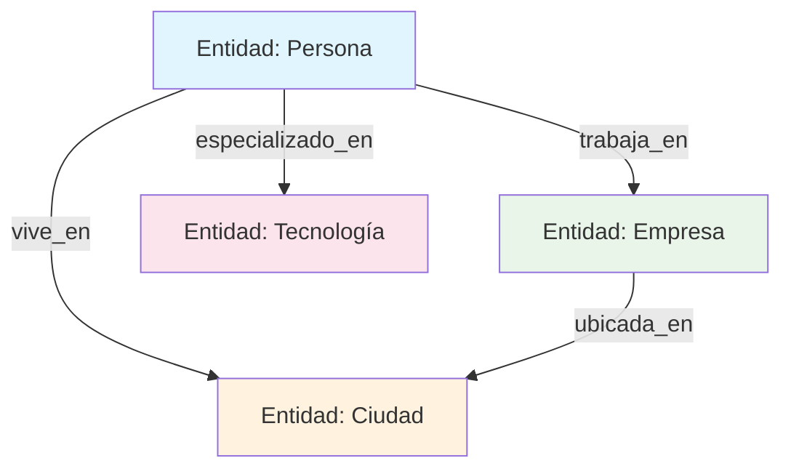
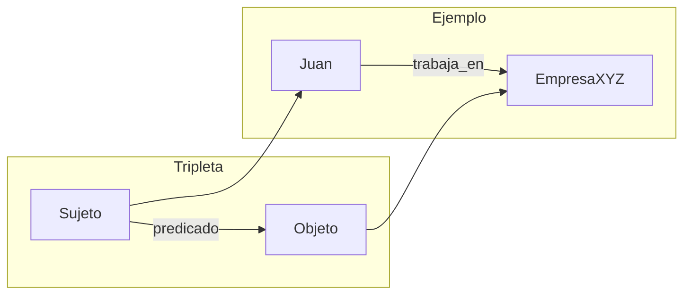
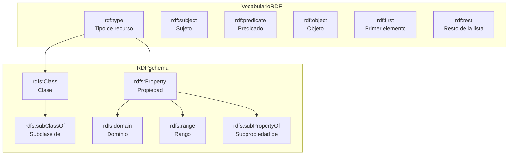
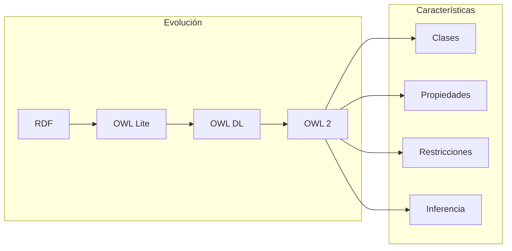
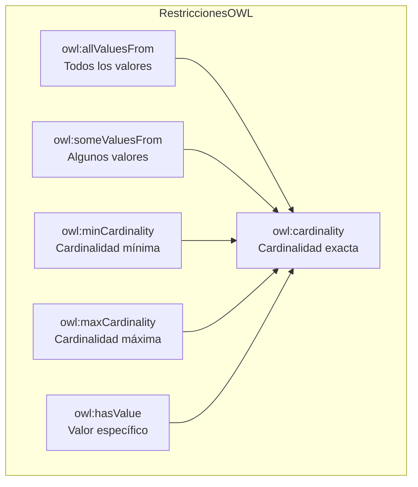
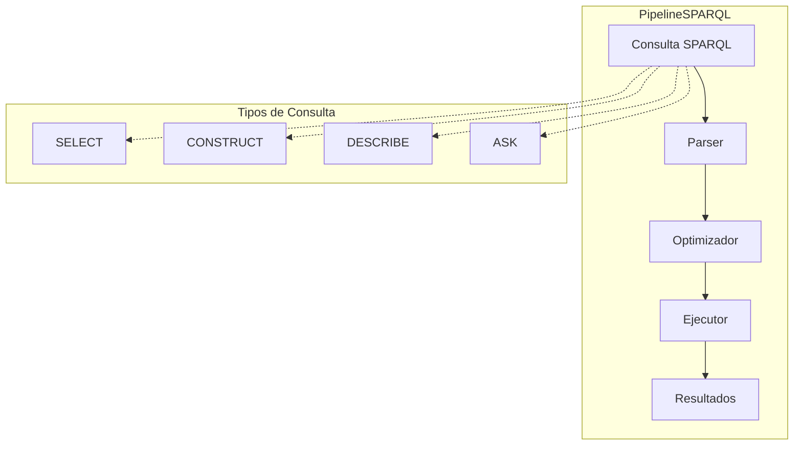
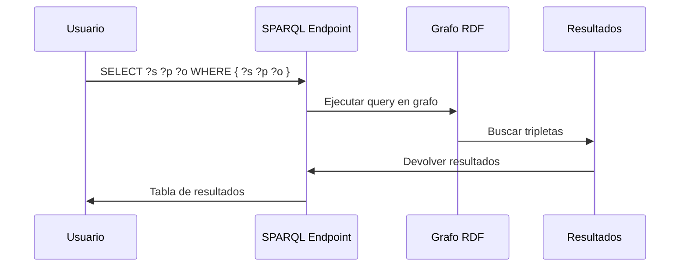
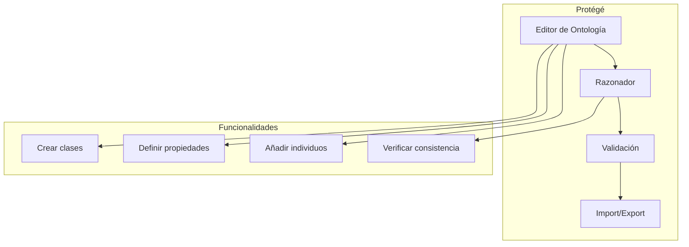
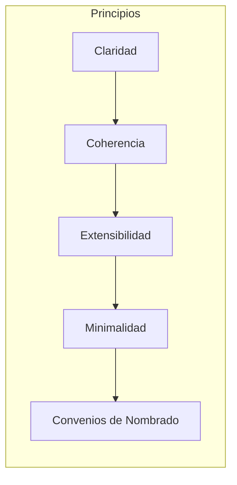

# Clase 11: Fundamentos de Grafos de Conocimiento

## Duración
**4 horas (240 minutos)**

---

## Objetivos de Aprendizaje

Al finalizar esta clase, el estudiante será capaz de:

1. **Comprender** los fundamentos teóricos de los grafos de conocimiento y su importancia en la IA moderna
2. **Explicar** los estándares RDF, OWL y SPARQL para representación de conocimiento
3. **Diseñar** ontologías simples con tripletas (sujeto-predicado-objeto)
4. **Implementar** soluciones básicas de grafos de conocimiento utilizando herramientas como Apache Jena
5. **Utilizar** Protégé para crear y gestionar ontologías
6. **Consultar** grafos de conocimiento utilizando SPARQL

---

## Contenidos Detallados

### 1.1 Introducción a los Grafos de Conocimiento (45 minutos)

#### 1.1.1 ¿Qué es un Grafo de Conocimiento?

Un Grafo de Conocimiento (Knowledge Graph) es una estructura de datos que representa información en forma de grafo, donde:
- **Nodos** representan entidades (personas, lugares, objetos, conceptos)
- **Aristas** (o relaciones) representan las conexiones entre entidades



Los grafos de conocimiento permiten:
- Representar información estructurada y semántica
- Inferir nuevo conocimiento a partir de relaciones existentes
- Facilitar la búsqueda y recuperación de información contextual
- Soportar razonamiento automático

#### 1.1.2 Historia y Evolución

```
┌─────────────────────────────────────────────────────────────────────┐
│                    EVOLUCIÓN DE LOS GRAFOS DE CONOCIMIENTO         │
├─────────────────────────────────────────────────────────────────────┤
│                                                                     │
│  1960s-1970s: Redes Semánticas                                     │
│  ├── Primeras representaciones de conocimiento                    │
│  ├── Ross Quillian - Redes semánticas como modelo de memoria      │
│  └── Limitaciones: Sin formalismo riguroso                        │
│                                                                     │
│  1980s-1990s: Sistemas Expertos y Ontologías                      │
│  ├── MYCIN, CLIPS, Prolog                                          │
│  ├── Frameworks ontológicos (Frame Logic)                         │
│  └── DAML, OIL como precursoras de OWL                            │
│                                                                     │
│  2000s: Web Semántica                                               │
│  ├── RDF (Resource Description Framework)                          │
│  ├── OWL (Web Ontology Language)                                   │
│  └── SPARQL como lenguaje de consulta                              │
│                                                                     │
│  2010s-2020s: Grafos de Conocimiento Modernos                      │
│  ├── Google Knowledge Graph (2012)                                 │
│  ├── Wikidata, DBpedia                                             │
│  ├── Graph Neural Networks                                         │
│  └── GraphRAG y sistemas de IA generativa                         │
│                                                                     │
└─────────────────────────────────────────────────────────────────────┘
```

#### 1.1.3 Componentes Fundamentales

**Tripletas (Sujeto-Predicado-Objeto):**

La unidad básica de un grafo de conocimiento es la tripleta:

```
Sujeto → Predicado → Objeto
```

Ejemplos:
```
<Juan> <es_un> <Persona>
<Juan> <trabaja_en> <EmpresaXYZ>
<EmpresaXYZ> <esta_en> <Madrid>
<EmpresaXYZ> <tiene_empleados> <María>
<María> <es_un> <Persona>
```



---

### 1.2 RDF - Resource Description Framework (50 minutos)

#### 1.2.1 Fundamentos de RDF

RDF es el estándar fundamental para representar información en la Web Semántica. Utiliza tripletas para expresar declaraciones sobre recursos.

**Características principales:**
- Basado en tripletas (sujeto, predicado, objeto)
- Utiliza URIs (Uniform Resource Identifiers) para identificar recursos
- Soporta inferencia mediante razonadores
- Formato extensible y interoperable

**Estructura de una tripleta RDF:**

```mermaid
flowchart TB
    subgraph TripletaRDF
        S[Sujeto<br/>(Subject)]
        P[Predicado<br/>(Predicate)]
        O[Objeto<br/>(Object)]
    end
    
    S --> P --> O
    
    subgraph URIs
        U1[URI del<br/>sujeto]
        U2[URI del<br/>predicado]
        U3[URI del<br/>objeto / Literal]
    end
    
    S -.-> U1
    P -.-> U2
    O -.-> U3
```

#### 1.2.2 Serialización RDF

RDF puede serializarse en varios formatos:

**1. Turtle (Terse RDF Triple Language):**

```turtle
@prefix ex: <http://example.org/> .
@prefix foaf: <http://xmlns.com/foaf/0.1/> .
@prefix rdf: <http://www.w3.org/1999/02/22-rdf-syntax-ns#> .

ex:Juan a foaf:Person ;
    foaf:name "Juan García" ;
    foaf:age 35 ;
    ex:trabajaEn ex:EmpresaXYZ .

ex:EmpresaXYZ a ex:Empresa ;
    ex:nombre "Empresa XYZ S.A." ;
    ex:ubicadaEn ex:Madrid .
```

**2. RDF/XML:**

```xml
<?xml version="1.0"?>
<rdf:RDF xmlns:rdf="http://www.w3.org/1999/02/22-rdf-syntax-ns#"
         xmlns:foaf="http://xmlns.com/foaf/0.1/"
         xmlns:ex="http://example.org/">
  
  <foaf:Person rdf:about="http://example.org/Juan">
    <foaf:name>Juan García</foaf:name>
    <foaf:age>35</foaf:age>
    <ex:trabajaEn rdf:resource="http://example.org/EmpresaXYZ"/>
  </foaf:Person>
  
</rdf:RDF>
```

**3. JSON-LD:**

```json
{
  "@context": {
    "foaf": "http://xmlns.com/foaf/0.1/",
    "ex": "http://example.org/"
  },
  "@type": "foaf:Person",
  "foaf:name": "Juan García",
  "foaf:age": 35,
  "ex:trabajaEn": {
    "@type": "foaf:Organization",
    "ex:nombre": "Empresa XYZ S.A."
  }
}
```

#### 1.2.3 Vocabulario RDF Básico



---

### 1.3 OWL - Web Ontology Language (45 minutos)

#### 1.3.1 Introducción a OWL

OWL es un lenguaje para crear ontologías avanzadas que soportan razonamiento automático. Añade semántica richer a RDF.



**Perfiles de OWL:**

| Perfil | Descripción | Usos |
|--------|-------------|------|
| OWL Lite | Subclases, restricciones simples | Taxonomías simples |
| OWL DL | Lógica descriptiva, razonamiento completo | Aplicaciones formales |
| OWL 2 | Más expresivo, nuevas características | Ontologías complejas |

#### 1.3.2 Elementos de una Ontología OWL

**1. Clases (owl:Class):**

```turtle
@prefix owl: <http://www.w3.org/2002/07/owl#> .
@prefix rdfs: <http://www.w3.org/2000/01/rdf-schema#> .

# Definir clases
ex:Persona a owl:Class .
ex:Empleado a owl:Class ;
    rdfs:subClassOf ex:Persona .
ex:Empresa a owl:Class .
```

**2. Propiedades de Objeto (owl:ObjectProperty):**

```turtle
ex:trabajaEn a owl:ObjectProperty ;
    rdfs:domain ex:Persona ;
    rdfs:range ex:Empresa ;
    owl:inverseOf ex:tieneEmpleado .
    
ex:tieneEmpleado a owl:ObjectProperty ;
    rdfs:domain ex:Empresa ;
    rdfs:range ex:Persona .
```

**3. Propiedades de Datos (owl:DatatypeProperty):**

```turtle
ex:nombre a owl:DatatypeProperty ;
    rdfs:domain ex:Persona ;
    rdfs:range xsd:string .
    
ex:edad a owl:DatatypeProperty ;
    rdfs:domain ex:Persona ;
    rdfs:range xsd:integer .
```

**4. Restricciones (owl:Restriction):**

```turtle
# Todo empleado trabaja en exactamente una empresa
ex:Empleado a owl:Class ;
    owl:equivalentClass [
        a owl:Class ;
        owl:intersectionOf (
            ex:Persona
            [
                a owl:Restriction ;
                owl:onProperty ex:trabajaEn ;
                owl:cardinality 1
            ]
        )
    ] .
```



---

### 1.4 SPARQL - Lenguaje de Consulta (50 minutos)

#### 1.4.1 Fundamentos de SPARQL

SPARQL (SPARQL Protocol and RDF Query Language) es el lenguaje estándar para consultar grafos RDF.



#### 1.4.2 Consultas SPARQL Básicas

**1. SELECT - Obtener datos:**

```sparql
# Obtener todas las personas y sus nombres
PREFIX ex: <http://example.org/>
PREFIX foaf: <http://xmlns.com/foaf/0.1/>

SELECT ?persona ?nombre
WHERE {
    ?persona a foaf:Person .
    ?persona foaf:name ?nombre .
}
```

**2. SELECT con filtros:**

```sparql
# Obtener empleados mayores de 30 años
PREFIX ex: <http://example.org/>
PREFIX foaf: <http://xmlns.com/foaf/0.1/>
PREFIX xsd: <http://www.w3.org/2001/XMLSchema#>

SELECT ?empleado ?nombre ?edad
WHERE {
    ?empleado a ex:Empleado .
    ?empleado foaf:name ?nombre .
    ?empleado foaf:age ?edad .
    FILTER (?edad > 30)
}
```

**3. OPTIONAL - Datos opcionales:**

```sparql
# Obtener personas con email (opcional)
PREFIX ex: <http://example.org/>
PREFIX foaf: <http://xmlns.com/foaf/0.1/>

SELECT ?persona ?nombre ?email
WHERE {
    ?persona foaf:name ?nombre .
    OPTIONAL { ?persona foaf:mbox ?email }
}
```

**4. UNION - Múltiples patrones:**

```sparql
# Obtener personas o empresas
PREFIX ex: <http://example.org/>
PREFIX foaf: <http://xmlns.com/foaf/0.1/>

SELECT ?entidad ?nombre
WHERE {
    { ?entidad a foaf:Person . }
    UNION
    { ?entidad a ex:Empresa . }
    ?entidad foaf:name ?nombre .
}
```



#### 1.4.3 Consultas SPARQL Avanzadas

**1. Consultas con propiedades inversas:**

```sparql
# Encontrar empresas y sus empleados
PREFIX ex: <http://example.org/>
PREFIX foaf: <http://xmlns.com/foaf/0.1/>

SELECT ?empresa ?empleado
WHERE {
    ?empleado ex:trabajaEn ?empresa .
    ?empresa ex:nombre ?nombre .
}
ORDER BY ?nombre
```

**2. CONSTRUCT - Crear nuevo grafo:**

```sparql
# Crear grafo con relaciones inversas
PREFIX ex: <http://example.org/>

CONSTRUCT {
    ?empresa ex:tieneEmpleado ?empleado .
}
WHERE {
    ?empleado ex:trabajaEn ?empresa .
}
```

**3. ASK - Verificar existencia:**

```sparql
# ¿Existe Juan?
PREFIX ex: <http://example.org/>
PREFIX foaf: <http://xmlns.com/foaf/0.1/>

ASK WHERE {
    ?persona a foaf:Person .
    ?persona foaf:name "Juan" .
}
```

---

### 1.5 Herramientas: Apache Jena y Protégé (40 minutos)

#### 1.5.1 Apache Jena

Apache Jena es un framework Java de código abierto para construir aplicaciones de Web Semántica.

```python
"""
Introducción a Apache Jena (usando rdflib en Python)
====================================================
rdflib es una librería Python compatible con Jena
"""

from rdflib import Graph, Namespace, URIRef, Literal
from rdflib.namespace import RDF, RDFS, OWL, FOAF

# Definir namespace
EX = Namespace("http://example.org/")
FOAF = Namespace("http://xmlns.com/foaf/0.1/")

# Crear grafo
g = Graph()

#绑定 namespace
g.bind("ex", EX)
g.bind("foaf", FOAF)

# Agregar tripletas
juan = EX.Juan
empresa = EX.EmpresaXYZ

g.add((juan, RDF.type, FOAF.Person))
g.add((juan, FOAF.name, Literal("Juan García")))
g.add((juan, EX.edad, Literal(35)))
g.add((juan, EX.trabajaEn, empresa))

g.add((empresa, RDF.type, EX.Empresa))
g.add((empresa, EX.nombre, Literal("Empresa XYZ S.A.")))
g.add((empresa, EX.ubicadaEn, EX.Madrid))

# Serializar en Turtle
print(g.serialize(format="turtle"))
```

**Salida:**
```turtle
@prefix ex: <http://example.org/> .
@prefix foaf: <http://xmlns.com/foaf/0.1/> .

ex:Juan a foaf:Person ;
    ex:edad 35 ;
    ex:trabajaEn ex:EmpresaXYZ ;
    foaf:name "Juan García" .

ex:EmpresaXYZ a ex:Empresa ;
    ex:nombre "Empresa XYZ S.A." ;
    ex:ubicadaEn ex:Madrid .
```

#### 1.5.2 Consultas SPARQL con rdflib

```python
"""
Consultas SPARQL con rdflib
============================
"""

from rdflib import Graph, Namespace, URIRef, Literal
from rdflib.namespace import RDF, RDFS, FOAF, XSD

EX = Namespace("http://example.org/")
FOAF = Namespace("http://xmlns.com/foaf/0.1/")

g = Graph()

# Cargar datos de ejemplo
g.parse(data="""
    @prefix ex: <http://example.org/> .
    @prefix foaf: <http://xmlns.com/foaf/0.1/> .
    
    ex:Juan a foaf:Person ;
        foaf:name "Juan García" ;
        ex:edad 35 ;
        ex:trabajaEn ex:EmpresaXYZ .
    
    ex:María a foaf:Person ;
        foaf:name "María López" ;
        ex:edad 28 ;
        ex:trabajaEn ex:EmpresaXYZ .
    
    ex:Pedro a foaf:Person ;
        foaf:name "Pedro Martínez" ;
        ex:edad 42 ;
        ex:trabajaEn ex:EmpresaABC .
    
    ex:EmpresaXYZ a ex:Empresa ;
        ex:nombre "Empresa XYZ" ;
        ex:ubicadaEn ex:Madrid .
    
    ex:EmpresaABC a ex:Empresa ;
        ex:nombre "Empresa ABC" ;
        ex:ubicadaEn ex:Barcelona .
    
    ex:Madrid a ex:Ciudad ;
        ex:nombre "Madrid" .
    
    ex:Barcelona a ex:Ciudad ;
        ex:nombre "Barcelona" .
""", format="turtle")

# Consulta 1: Obtener todas las personas
print("=== Todas las personas ===")
query1 = """
PREFIX ex: <http://example.org/>
PREFIX foaf: <http://xmlns.com/foaf/0.1/>

SELECT ?persona ?nombre
WHERE {
    ?persona a foaf:Person .
    ?persona foaf:name ?nombre .
}
"""

for row in g.query(query1):
    print(f"{row.persona} - {row.nombre}")

# Consulta 2: Filtrar por edad
print("\n=== Personas mayores de 30 ===")
query2 = """
PREFIX ex: <http://example.org/>
PREFIX foaf: <http://xmlns.com/foaf/0.1/>

SELECT ?persona ?nombre ?edad
WHERE {
    ?persona a foaf:Person .
    ?persona foaf:name ?nombre .
    ?persona ex:edad ?edad .
    FILTER (?edad > 30)
}
ORDER BY DESC(?edad)
"""

for row in g.query(query2):
    print(f"{row.persona} - {row.nombre} - {row.edad} años")

# Consulta 3: Obtener empresa y ciudad
print("\n=== Empresas y ciudades ===")
query3 = """
PREFIX ex: <http://example.org/>
PREFIX foaf: <http://xmlns.com/foaf/0.1/>

SELECT ?empresa ?ciudad
WHERE {
    ?empleado ex:trabajaEn ?empresa .
    ?empresa ex:ubicadaEn ?ciudad .
}
DISTINCT
"""

for row in g.query(query3):
    print(f"{row.empresa} - {row.ciudad}")
```

#### 1.5.3 Protégé

Protégé es una herramienta de código abierto para edición de ontologías.



**Uso básico de Protégé:**

1. **Crear nueva ontología:**
   - File → New → OWL DL
   - DefinirIRI base: `http://example.org/ontology`

2. **Definir clases:**
   - En la pestaña "Classes", clic derecho → "Create new class"
   - Establecer jerarquía con subclases

3. **Definir propiedades:**
   - "Object Properties" para relaciones entre clases
   - "Datatype Properties" para atributos

4. **Ejecutar razonador:**
   - Reasoner → Start reasoner
   - Verificar inferencias

---

### 1.6 Diseño de Ontologías (30 minutos)

#### 1.6.1 Principios de Diseño



**Mejores prácticas:**

1. **Claridad:** Los axioms deben tener semántica bien definida
2. **Coherencia:** Consistencia entre clases y propiedades
3. **Extensibilidad:** Permitir añadir nuevas clases sin modificar existentes
4. **Minimalidad:** Evitar redundancia innecesaria
5. **Convenios:** Usar URIs consistentes y legibles

#### 1.6.2 Ejemplo de Diseño Completo

```turtle
@prefix rdf: <http://www.w3.org/1999/02/22-rdf-syntax-ns#> .
@prefix rdfs: <http://www.w3.org/2000/01/rdf-schema#> .
@prefix owl: <http://www.w3.org/2002/07/owl#> .
@prefix ex: <http://example.org/> .
@prefix foaf: <http://xmlns.com/foaf/0.1/> .
@prefix xsd: <http://www.w3.org/2001/XMLSchema#> .

# ==================== CLASES ====================
# Jerarquía de clases
ex:Persona a owl:Class .
ex:Empleado a owl:Class ;
    rdfs:subClassOf ex:Persona .
ex:Gerente a owl:Class ;
    rdfs:subClassOf ex:Empleado .
ex:Empresa a owl:Class .
ex:Departamento a owl:Class .
ex:Proyecto a owl:Class .

# ==================== PROPIEDADES ====================
# Propiedades de objeto
ex:trabajaEn a owl:ObjectProperty ;
    rdfs:domain ex:Persona ;
    rdfs:range ex:Empresa ;
    owl:inverseOf ex:tieneEmpleado .
    
ex:tieneEmpleado a owl:ObjectProperty ;
    rdfs:domain ex:Empresa ;
    rdfs:range ex:Persona .
    
ex:dirige a owl:ObjectProperty ;
    rdfs:domain ex:Gerente ;
    rdfs:range ex:Departamento .
    
ex:perteneceA a owl:ObjectProperty ;
    rdfs:domain ex:Empleado ;
    rdfs:range ex:Departamento .
    
ex:trabajaEnProyecto a owl:ObjectProperty ;
    rdfs:domain ex:Persona ;
    rdfs:range ex:Proyecto .

# Propiedades de datos
ex:nombre a owl:DatatypeProperty ;
    rdfs:domain ex:Persona ;
    rdfs:range xsd:string .
    
ex:edad a owl:DatatypeProperty ;
    rdfs:domain ex:Persona ;
    rdfs:range xsd:integer .
    
ex:salario a owl:DatatypeProperty ;
    rdfs:domain ex:Empleado ;
    rdfs:range xsd:decimal .
    
ex:nombreEmpresa a owl:DatatypeProperty ;
    rdfs:domain ex:Empresa ;
    rdfs:range xsd:string .

# ==================== RESTRICCIONES ====================
# Todo gerente debe dirigir un departamento
ex:Gerente a owl:Class ;
    owl:equivalentClass [
        a owl:Class ;
        owl:intersectionOf (
            ex:Empleado
            [
                a owl:Restriction ;
                owl:onProperty ex:dirige ;
                owl:cardinality 1
            ]
        )
    ] .
```

---

## Tecnologías y Herramientas Específicas

### Tecnologías Principales

| Tecnología | Versión | Propósito |
|------------|---------|-----------|
| Python | 3.8+ | Lenguaje de programación |
| rdflib | 6.0+ | Manipulación de RDF en Python |
| Apache Jena | 4.5+ | Framework de Web Semántica |
| Protégé | 5.5+ | Editor de ontologías |
| SPARQL | 1.1 | Lenguaje de consultas |
| OWL | 2.0 | Lenguaje ontológico |

### Instalación de Herramientas

```bash
# Instalar rdflib
pip install rdflib>=6.0.0
pip install rdflib-jsonld>=6.0.0

# Instalar Sparqlwrapper para endpoints remotos
pip install sparqlwrapper>=1.8.0

# Verificar instalación
python -c "import rdflib; print(rdflib.__version__)"
```

---

## Actividades de Laboratorio

### Laboratorio 11.1: Crear un Grafo de Conocimiento Básico

**Objetivo:** Crear un grafo de conocimiento con información sobre una empresa.

```python
"""
Laboratorio 11.1: Grafo de Conocimiento Empresarial
===================================================
Crear un grafo RDF con información de empleados y empresas
"""

from rdflib import Graph, Namespace, Literal, URIRef
from rdflib.namespace import RDF, RDFS, OWL, FOAF, XSD

# Definir namespaces
EX = Namespace("http://example.org/")
g = Graph()

#绑定 namespace
g.bind("ex", EX)
g.bind("foaf", FOAF)

# ==================== DATOS ====================
# Empresas
empresa_xyz = EX.EmpresaXYZ
empresa_abc = EX.EmpresaABC

# Personas
juan = EX.Juan
maria = EX.Maria
pedro = EX.Pedro

# Proyectos
proyecto_alpha = EX.ProyectoAlpha
proyecto_beta = EX.ProyectoBeta

# Ciudades
madrid = EX.Madrid
barcelona = EX.Barcelona

# ==================== TRIPLETAS ====================
# Juan
g.add((juan, RDF.type, FOAF.Person))
g.add((juan, EX.nombre, Literal("Juan García")))
g.add((juan, EX.edad, Literal(35)))
g.add((juan, EX.salario, Literal(50000, datatype=XSD.decimal)))
g.add((juan, EX.trabajaEn, empresa_xyz))
g.add((juan, EX.perteneceA, EX.Ingenieria))
g.add((juan, EX.participaEn, proyecto_alpha))

# María
g.add((maria, RDF.type, FOAF.Person))
g.add((maria, EX.nombre, Literal("María López")))
g.add((maria, EX.edad, Literal(28)))
g.add((maria, EX.salario, Literal(45000, datatype=XSD.decimal)))
g.add((maria, EX.trabajaEn, empresa_xyz))
g.add((maria, EX.perteneceA, EX.Marketing))
g.add((maria, EX.participaEn, proyecto_beta))

# Pedro
g.add((pedro, RDF.type, FOAF.Person))
g.add((pedro, EX.nombre, Literal("Pedro Martínez")))
g.add((pedro, EX.edad, Literal(42)))
g.add((pedro, EX.salario, Literal(65000, datatype=XSD.decimal)))
g.add((pedro, EX.trabajaEn, empresa_abc))
g.add((pedro, EX.perteneceA, EX.Direccion))
g.add((pedro, EX.dirige, proyecto_alpha))

# Empresas
g.add((empresa_xyz, RDF.type, EX.Empresa))
g.add((empresa_xyz, EX.nombre, Literal("Empresa XYZ S.A.")))
g.add((empresa_xyz, EX.ubicadaEn, madrid))
g.add((empresa_xyz, EX.empleados, Literal(150, datatype=XSD.integer)))

g.add((empresa_abc, RDF.type, EX.Empresa))
g.add((empresa_abc, EX.nombre, Literal("Empresa ABC Corp")))
g.add((empresa_abc, EX.ubicadaEn, barcelona))
g.add((empresa_abc, EX.empleados, Literal(75, datatype=XSD.integer)))

# Proyectos
g.add((proyecto_alpha, RDF.type, EX.Proyecto))
g.add((proyecto_alpha, EX.nombre, Literal("Proyecto Alpha")))
g.add((proyecto_alpha, EX.presupuesto, Literal(500000, datatype=XSD.decimal)))

g.add((proyecto_beta, RDF.type, EX.Proyecto))
g.add((proyecto_beta, EX.nombre, Literal("Proyecto Beta")))
g.add((proyecto_beta, EX.presupuesto, Literal(250000, datatype=XSD.decimal)))

# ==================== CONSULTAS ====================
print("=== Total de tripletas ===")
print(f"Total: {len(g)} tripletas")

print("\n=== Todas las personas ===")
query = """
PREFIX ex: <http://example.org/>
PREFIX foaf: <http://xmlns.com/foaf/0.1/>

SELECT ?persona ?nombre
WHERE {
    ?persona a foaf:Person .
    ?persona ex:nombre ?nombre .
}
"""

for row in g.query(query):
    print(f"  {row.persona.split('/')[-1]}: {row.nombre}")

print("\n=== Empleados de EmpresaXYZ ===")
query2 = """
PREFIX ex: <http://example.org/>
PREFIX foaf: <http://xmlns.com/foaf/0.1/>

SELECT ?nombre ?edad
WHERE {
    ?persona a foaf:Person .
    ?persona ex:nombre ?nombre .
    ?persona ex:edad ?edad .
    ?persona ex:trabajaEn ex:EmpresaXYZ .
}
"""

for row in g.query(query2):
    print(f"  {row.nombre}, {row.edad} años")

# Serializar
print("\n=== Grafo en Turtle ===")
print(g.serialize(format="turtle"))
```

### Laboratorio 11.2: Consultas SPARQL Avanzadas

```python
"""
Laboratorio 11.2: Consultas SPARQL Avanzadas
============================================
"""

from rdflib import Graph, Namespace, Literal
from rdflib.namespace import RDF, RDFS, OWL, FOAF, XSD

EX = Namespace("http://example.org/")

g = Graph()
g.bind("ex", EX)

# Cargar datos del laboratorio anterior
# (código omitido para brevedad)

# Consulta con agregación
print("=== Media de salarios por empresa ===")
query = """
PREFIX ex: <http://example.org/>
PREFIX xsd: <http://www.w3.org/2001/XMLSchema#>

SELECT ?empresa (AVG(?salario) as ?media)
WHERE {
    ?persona ex:trabajaEn ?empresa .
    ?persona ex:salario ?salario .
}
GROUP BY ?empresa
"""

for row in g.query(query):
    print(f"  {row.empresa.split('/')[-1]}: {row.media}")

# Consulta con exists
print("\n=== Proyectos con participantes de Madrid ===")
query = """
PREFIX ex: <http://example.org/>

SELECT ?proyecto
WHERE {
    ?proyecto a ex:Proyecto .
    FILTER EXISTS {
        ?persona ex:participaEn ?proyecto .
        ?persona ex:viveEn ex:Madrid .
    }
}
"""

# Consulta con subquery
print("\n=== Personas con salario above average ===")
query = """
PREFIX ex: <http://example.org/>

SELECT ?nombre ?salario
WHERE {
    ?persona ex:nombre ?nombre .
    ?persona ex:salario ?salario .
    FILTER(?salario > ?avgSalary)
}
ORDER BY DESC(?salario)
"""

subquery = """
PREFIX ex: <http://example.org/>

SELECT (AVG(?salario) as ?avgSalary)
WHERE {
    ?persona ex:salario ?salario .
}
"""

# Nota: rdflib no soporta subqueries directamente,
# se implementaría con dos consultas separadas
avg_result = list(g.query(subquery))
if avg_result:
    avg_salary = avg_result[0][0]
    print(f"Salario promedio: {avg_salary}")
```

---

## Resumen de Puntos Clave

### Conceptos Fundamentales
1. **Grafo de Conocimiento**: Estructura de datos basada en tripletas (sujeto-predicado-objeto)
2. **RDF**: Estándar fundamental para representar información en la Web Semántica
3. **OWL**: Lenguaje para ontologías avanzadas con soporte para razonamiento
4. **SPARQL**: Lenguaje de consultas para grafos RDF

### Elementos Clave
1. **Tripletas**: Unidad básica de información en un grafo de conocimiento
2. **URIs**: Identificadores únicos para recursos
3. **Namespaces**: Espacios de nombres para evitar conflictos
4. **Serialización**: Formatos Turtle, RDF/XML, JSON-LD

### Herramientas
1. **rdflib**: Librería Python para manipulación de RDF
2. **Apache Jena**: Framework Java para Web Semántica
3. **Protégé**: Editor visual de ontologías OWL

### Mejores Prácticas
1. Usar URIs consistentes y significativas
2. Definir ontologías claras y coherentes
3. Validar con razonadores (HermiT, Pellet)
4. Preferir estándares cuando sea posible

---

## Referencias Externas

1. **RDF 1.1 Concepts and Abstract Syntax**
   - URL: https://www.w3.org/TR/rdf11-concepts/
   - Descripción: Especificación oficial de RDF

2. **OWL 2 Web Ontology Language**
   - URL: https://www.w3.org/TR/owl2-overview/
   - Descripción: Visión general de OWL 2

3. **SPARQL 1.1 Query Language**
   - URL: https://www.w3.org/TR/sparql11-query/
   - Descripción: Especificación de SPARQL

4. **Protégé Documentation**
   - URL: https://protege.stanford.edu/
   - Descripción: Wiki y documentación de Protégé

5. **rdflib Documentation**
   - URL: https://rdflib.readthedocs.io/
   - Descripción: Documentación de rdflib

6. **Apache Jena Documentation**
   - URL: https://jena.apache.org/documentation/
   - Descripción: Documentación de Apache Jena

7. **W3C RDF Tutorial**
   - URL: https://www.w3.org/2007/02/turtle/primer/
   - Descripción: Tutorial de Turtle

8. **Semantic Web Journal**
   - URL: https://www.semanticwebjournal.org/
   - Descripción: Journal académico sobre Web Semántica

---

## Ejercicios Prácticos

### Ejercicio 1: Crear Grafo de Conocimiento Médico

**Enunciado:** Crear un grafo de conocimiento para un sistema médico con pacientes, médicos, diagnósticos y tratamientos.

**Solución:**

```python
"""
Ejercicio 1: Grafo de Conocimiento Médico
=========================================
"""

from rdflib import Graph, Namespace, Literal, URIRef
from rdflib.namespace import RDF, RDFS, OWL, FOAF, XSD, DC

# Namespace
MED = Namespace("http://medgraph.example.org/")
g = Graph()
g.bind("med", MED)

# ==================== CLASES ====================
# Paciente
paciente1 = MED.Paciente001
g.add((paciente1, RDF.type, MED.Paciente))
g.add((paciente1, MED.nombre, Literal("Ana García")))
g.add((paciente1, MED.edad, Literal(45)))
g.add((paciente1, MED.genero, Literal("F")))
g.add((paciente1, MED.dni, Literal("12345678A")))

# Médico
medico1 = MED.Medico001
g.add((medico1, RDF.type, MED.Medico))
g.add((medico1, MED.nombre, Literal("Dr. Carlos López")))
g.add((medico1, MED.especialidad, Literal("Cardiología")))
g.add((medico1, MED.numeroColegiado, Literal("12345")))

# Diagnóstico
diagnostico1 = MED.Diag001
g.add((diagnostico1, RDF.type, MED.Diagnostico))
g.add((diagnostico1, MED.codigo, Literal("I10")))
g.add((diagnostico1, MED.descripcion, Literal("Hipertensión esencial")))
g.add((diagnostico1, MED.fecha, Literal("2024-01-15", datatype=XSD.date)))

# Tratamiento
tratamiento1 = MED.Trat001
g.add((tratamiento1, RDF.type, MED.Tratamiento))
g.add((tratamiento1, MED.medicamento, Literal("Lisinopril 10mg")))
g.add((tratamiento1, MED.dosis, Literal("1 comprimido al día")))
g.add((tratamiento1, MED.duracion, Literal("30 días", datatype=XSD.duration)))

# ==================== RELACIONES ====================
# Paciente tiene diagnóstico
g.add((paciente1, MED.tieneDiagnostico, diagnostico1))

# Paciente tiene tratamiento
g.add((paciente1, MED.tieneTratamiento, tratamiento1))

# Médico atiende a paciente
g.add((medico1, MED.atiendeA, paciente1))

# Médico hace diagnóstico
g.add((medico1, MED.diagnostica, diagnostico1))

# Diagnóstico prescribe tratamiento
g.add((diagnostico1, MED.prescribe, tratamiento1))

# ==================== CONSULTAS ====================
print("=== Datos del paciente ===")
query = """
PREFIX med: <http://medgraph.example.org/>

SELECT ?nombre ?edad ?diagnostico
WHERE {
    med:Paciente001 med:nombre ?nombre .
    med:Paciente001 med:edad ?edad .
    med:Paciente001 med:tieneDiagnostico ?diag .
    ?diag med:descripcion ?diagnostico .
}
"""

for row in g.query(query):
    print(f"Paciente: {row.nombre}, {row.edad} años")
    print(f"Diagnóstico: {row.diagnostico}")

print("\n=== Médico y pacientes ===")
query = """
PREFIX med: <http://medgraph.example.org/>

SELECT ?medico ?especialidad ?paciente
WHERE {
    ?medico a med:Medico .
    ?medico med:nombre ?medico .
    ?medico med:especialidad ?especialidad .
    ?medico med:atiendeA ?paciente .
}
"""

for row in g.query(query):
    print(f"{row.medico} ({row.especialidad}) -> {row.paciente}")

# Serializar
print("\n=== Grafo completo ===")
print(g.serialize(format="turtle"))
```

### Ejercicio 2: Consultas SPARQL Complejas

**Enunciado:** Escribir consultas SPARQL para responder:
- ¿Qué pacientes tienen más de 40 años?
- ¿Qué medicamentos se prescriben para hipertensión?

**Solución:**

```python
"""
Ejercicio 2: Consultas SPARQL sobre Datos Médicos
=================================================
"""

from rdflib import Graph, Namespace, Literal
from rdflib.namespace import RDF, XSD

MED = Namespace("http://medgraph.example.org/")
g = Graph()
g.bind("med", MED)

# (Asumiendo datos del ejercicio anterior cargados)

# Consulta 1: Pacientes mayores de 40 años
print("=== Pacientes mayores de 40 años ===")
query1 = """
PREFIX med: <http://medgraph.example.org/>
PREFIX xsd: <http://www.w3.org/2001/XMLSchema#>

SELECT ?paciente ?nombre ?edad
WHERE {
    ?paciente a med:Paciente .
    ?paciente med:nombre ?nombre .
    ?paciente med:edad ?edad .
    FILTER (?edad > 40)
}
ORDER BY DESC(?edad)
"""

for row in g.query(query1):
    print(f"  {row.nombre}: {row.edad} años")

# Consulta 2: Medicamentos para hipertensión
print("\n=== Medicamentos para Hipertensión ===")
query2 = """
PREFIX med: <http://medgraph.example.org/>

SELECT ?medicamento ?dosis
WHERE {
    ?diagnostico a med:Diagnostico .
    ?diagnostico med:descripcion ?desc .
    FILTER(CONTAINS(?desc, "Hipertensión"))
    ?diagnostico med:prescribe ?tratamiento .
    ?tratamiento med:medicamento ?medicamento .
    ?tratamiento med:dosis ?dosis .
}
"""

for row in g.query(query2):
    print(f"  {row.medicamento} - {row.dosis}")

# Consulta 3: Resumen de pacientes por médico
print("\n=== Resumen: Pacientes por médico ===")
query3 = """
PREFIX med: <http://medgraph.example.org/>

SELECT ?medico (COUNT(?paciente) as ?numPacientes)
WHERE {
    ?medico a med:Medico .
    ?medico med:atiendeA ?paciente .
}
GROUP BY ?medico
ORDER BY DESC(?numPacientes)
"""

for row in g.query(query3):
    print(f"  {row.medico.split('#')[-1]}: {row.numPacientes} pacientes")
```

---

**Fin de la Clase 11**
