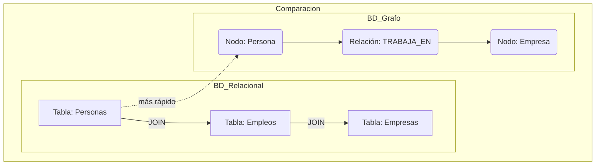
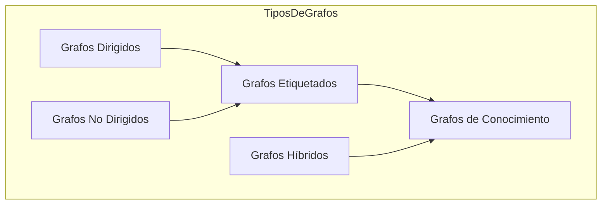
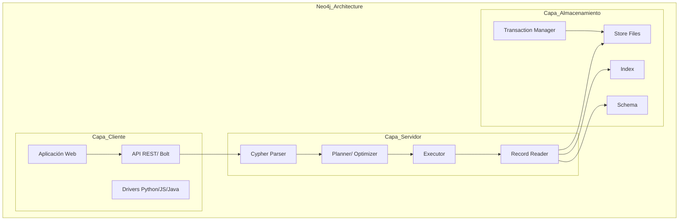
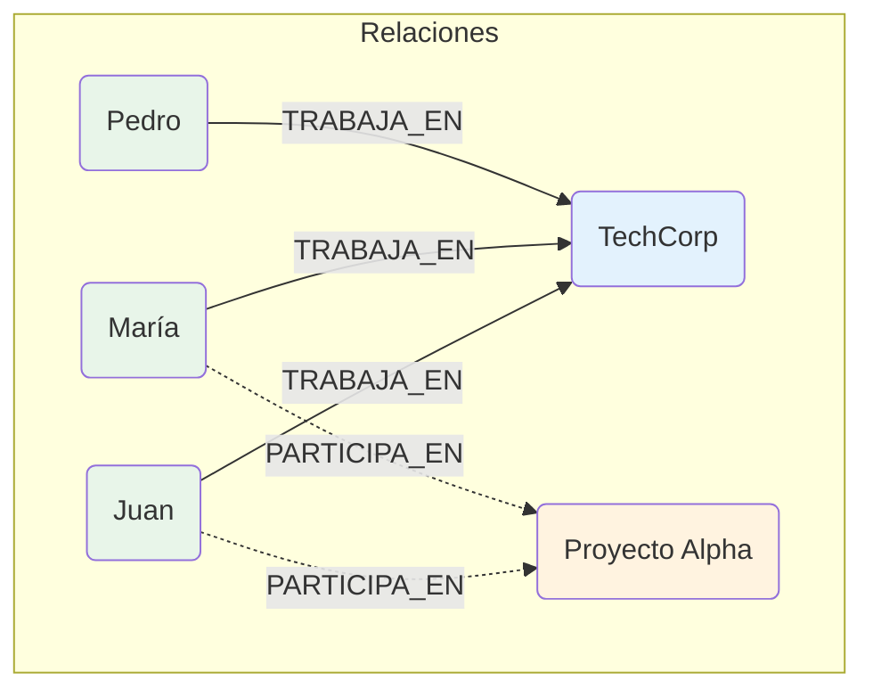
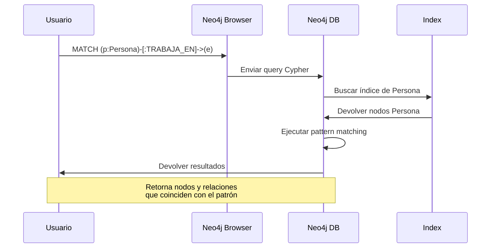
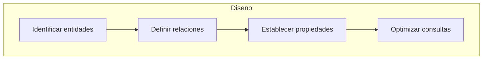
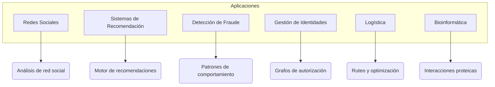

# Clase 12: Bases de Datos de Grafos con Neo4j

## Duración
**4 horas (240 minutos)**

---

## Objetivos de Aprendizaje

Al finalizar esta clase, el estudiante será capaz de:

1. **Comprender** los fundamentos de las bases de datos de grafos y su diferencia con bases de datos relacionales
2. **Instalar y configurar** Neo4j correctamente
3. **Utilizar** el lenguaje de consulta Cypher para crear nodos y relaciones
4. **Implementar** consultas complejas para análisis de datos relacionales
5. **Integrar** Neo4j con Python usando py2neo o neo4j-driver
6. **Diseñar** esquemas de grafos optimizados para casos de uso específicos

---

## Contenidos Detallados

### 1.1 Fundamentos de Bases de Datos de Grafos (40 minutos)

#### 1.1.1 ¿Por qué una Base de Datos de Grafos?

Las bases de datos de grafos están optimizadas para manejar datos altamente relacionados. A diferencia de las bases de datos relacionales, que requieren joins costosos, los grafos naveg relaciones directamente.



**Ventajas de las bases de datos de grafos:**

- **Rendimiento**: Consultas O(1) vs O(n²) en joins complejos
- **Flexibilidad**: Esquema flexible, sin migraciones costosas
- **Intuitivo**: Modelo mental similar al pensamiento humano
- **Rapidez de desarrollo**: Fácil de modificar y extender

#### 1.1.2 Tipos de Grafos



**Grafos Dirigidos vs No Dirigidos:**
- Dirigidos: Las relaciones tienen dirección (ej: Juan → conoce → María)
- No dirigidos: Las relaciones son bidireccionales (ej: Juan ⇄ María son vecinos)

**Grafos Etiquetados:**
- Las relaciones tienen un tipo (ej: TRABAJA_EN, VIVE_EN)
- Los nodos tienen etiquetas (ej: Persona, Empresa)

#### 1.1.3 Neo4j: Arquitectura y Componentes



**Componentes de Neo4j:**

| Componente | Descripción |
|------------|-------------|
| Neo4j DBMS | Sistema de gestión de base de datos |
| Cypher | Lenguaje de consulta declarativo |
| Neo4j Browser | Interfaz web para consultas |
| Neo4j Desktop | Entorno de desarrollo local |
| APOC | Biblioteca de procedimientos |

---

### 2.1 Cypher: El Lenguaje de Consulta (60 minutos)

#### 2.1.1 Fundamentos de Cypher

Cypher es un lenguaje declarativo diseñado específicamente para grafos. Su sintaxis es visual e intuitiva.

```mermaid
graph LR
    subgraph SintaxisCypher
        N[Nodo] -->|relacion| N2[Nodo]
    end
    
    subgraph Equivalente
        E1[(p:Persona)]
        E2[(e:Empresa)]
        E1 -->|TRABAJA_EN| E2
    end
    
    subgraph Query
        Q[MATCH (p:Persona)<br/>-[:TRABAJA_EN]->(e:Empresa)<br/>RETURN e]
    end
    
    N --> Q
    E1 --> Q
```

**Símbolos básicos en Cypher:**

```
()  - Nodo
-[:RELACION]->  - Relación dirigida
-[:RELACION]-   - Relación no dirigida
{}  - Propiedades
[]  - Patrones
```

#### 2.1.2 Creación de Nodos

```cypher
-- Crear un nodo simple
CREATE (n:Persona {nombre: 'Juan', edad: 35})

-- Crear múltiples nodos
CREATE (p1:Persona {nombre: 'María'}), 
       (p2:Persona {nombre: 'Pedro'})

-- Crear nodo con etiqueta
CREATE (p:Persona:Empleado {nombre: 'Ana'})

-- Crear y devolver
CREATE (p:Persona {nombre: 'Luis'})
RETURN p
```

**Ejemplo completo:**

```cypher
// Crear grafo de empresa
CREATE (juan:Persona {nombre: 'Juan García', edad: 35}),
       (maria:Persona {nombre: 'María López', edad: 28}),
       (pedro:Persona {nombre: 'Pedro Martínez', edad: 42}),
       (empresa:Empresa {nombre: 'TechCorp', empleados: 150}),
       (proyecto:Proyecto {nombre: 'Proyecto Alpha'}),
       
       (juan)-[:TRABAJA_EN {desde: '2020-01-01'}]->(empresa),
       (maria)-[:TRABAJA_EN {desde: '2021-06-15'}]->(empresa),
       (pedro)-[:TRABAJA_EN {desde: '2018-03-01'}]->(empresa),
       (juan)-[:PARTICIPA_EN]->(proyecto),
       (maria)-[:PARTICIPA_EN]->(proyecto)

RETURN juan, maria, pedro, empresa, proyecto
```

#### 2.1.3 Creación de Relaciones

```cypher
// Relación simple
MATCH (p:Persona {nombre: 'Juan'})
MATCH (e:Empresa {nombre: 'TechCorp'})
CREATE (p)-[:TRABAJA_EN]->(e)

// Relación con propiedades
MATCH (p:Persona), (e:Empresa)
WHERE p.nombre = 'María' AND e.nombre = 'TechCorp'
CREATE (p)-[:CONTRATADO_POR {salario: 50000, fecha: date('2024-01-01')}]->(e)

// Relación bidireccional
MATCH (a:Persona {nombre: 'Juan'}), (b:Persona {nombre: 'Pedro'})
CREATE (a)-[:CONOCE_A]->(b),
       (b)-[:CONOCE_A]->(a)
```



#### 2.1.4 CONSULTAS BÁSICAS

```cypher
// MATCH básico - encontrar nodos
MATCH (p:Persona)
RETURN p

// MATCH con etiquetas
MATCH (e:Empresa)
RETURN e.nombre

// MATCH con propiedades
MATCH (p:Persona {nombre: 'Juan'})
RETURN p

// MATCH con WHERE
MATCH (p:Persona)
WHERE p.edad > 30
RETURN p.nombre, p.edad

// MATCH con patrón
MATCH (p:Persona)-[:TRABAJA_EN]->(e:Empresa)
WHERE e.nombre = 'TechCorp'
RETURN p.nombre
```

#### 2.1.5 Consultas Complejas

```cypher
// Encontrar todos los empleados de una empresa y sus proyectos
MATCH (p:Persona)-[r:TRABAJA_EN]->(e:Empresa {nombre: 'TechCorp'})
OPTIONAL MATCH (p)-[:PARTICIPA_EN]->(pr:Proyecto)
RETURN p.nombre AS empleado, 
       r.desde AS fecha_ingreso,
       pr.nombre AS proyecto
ORDER BY p.nombre

// Contar relaciones
MATCH (p:Persona)-[:TRABAJA_EN]->(e:Empresa)
RETURN e.nombre AS empresa, 
       COUNT(p) AS num_empleados
ORDER BY num_empleados DESC

// Encontrar camino más corto
MATCH (juan:Persona {nombre: 'Juan'}),
      (maria:Persona {nombre: 'María'})
MATCH path = shortestPath((juan)-[*]->(maria))
RETURN path

// Patrones complejos
MATCH (p1:Persona)-[:TRABAJA_EN]->(e:Empresa)<-[:TRABAJA_EN]-(p2:Persona)
WHERE p1 <> p2
RETURN p1.nombre AS persona1, 
       p2.nombre AS persona2,
       e.nombre AS empresa
LIMIT 20
```



---

### 3.1 Integración con Python (50 minutos)

#### 3.1.1 Instalación y Configuración

```bash
# Instalar driver de Neo4j para Python
pip install neo4j

# Instalar py2neo (alternativo)
pip install py2neo

# Verificar instalación
python -c "from neo4j import GraphDatabase; print('OK')"
```

#### 3.1.2 Conexión a Neo4j

```python
"""
Conexión básica a Neo4j
=======================
"""

from neo4j import GraphDatabase

# Conexión local
URI = "neo4j://localhost:7687"
AUTH = ("neo4j", "password")

driver = GraphDatabase.driver(URI, auth=AUTH)

def verify_connectivity():
    """Verificar conexión"""
    with driver.session() as session:
        result = session.run("RETURN 1 AS n")
        return result.single()

try:
    verify_connectivity()
    print("✓ Conexión exitosa a Neo4j")
except Exception as e:
    print(f"✗ Error de conexión: {e}")
```

#### 3.1.3 Operaciones CRUD

```python
"""
Operaciones CRUD con Neo4j
=========================
"""

from neo4j import GraphDatabase

class Neo4jManager:
    """Gestor de operaciones Neo4j"""
    
    def __init__(self, uri, user, password):
        self.driver = GraphDatabase.driver(uri, auth=(user, password))
    
    def close(self):
        self.driver.close()
    
    # ========== CREATE ==========
    def create_person(self, name, age):
        """Crear una persona"""
        with self.driver.session() as session:
            result = session.run(
                """
                CREATE (p:Persona {nombre: $name, edad: $age})
                RETURN p
                """,
                name=name, age=age
            )
            return result.single()
    
    def create_company(self, name, employees):
        """Crear una empresa"""
        with self.driver.session() as session:
            result = session.run(
                """
                CREATE (e:Empresa {nombre: $name, empleados: $employees})
                RETURN e
                """,
                name=name, employees=employees
            )
            return result.single()
    
    def create_relationship(self, person_name, company_name, relation_type):
        """Crear relación entre persona y empresa"""
        with self.driver.session() as session:
            result = session.run(
                f"""
                MATCH (p:Persona {{nombre: $person_name}})
                MATCH (e:Empresa {{nombre: $company_name}})
                CREATE (p)-[r:{relation_type}]->(e)
                RETURN p, r, e
                """,
                person_name=person_name, 
                company_name=company_name
            )
            return result.single()
    
    # ========== READ ==========
    def get_all_persons(self):
        """Obtener todas las personas"""
        with self.driver.session() as session:
            result = session.run(
                "MATCH (p:Persona) RETURN p.nombre AS nombre, p.edad AS edad"
            )
            return [dict(record) for record in result]
    
    def get_employees(self, company_name):
        """Obtener empleados de una empresa"""
        with self.driver.session() as session:
            result = session.run(
                """
                MATCH (p:Persona)-[:TRABAJA_EN]->(e:Empresa {nombre: $company})
                RETURN p.nombre AS nombre, p.edad AS edad
                ORDER BY p.nombre
                """,
                company=company_name
            )
            return [dict(record) for record in result]
    
    def get_company_with_employees(self, company_name):
        """Obtener empresa con sus empleados"""
        with self.driver.session() as session:
            result = session.run(
                """
                MATCH (e:Empresa {nombre: $company})<-[:TRABAJA_EN]-(p:Persona)
                RETURN e.nombre AS empresa, 
                       e.empleados AS total_empleados,
                       collect(p.nombre) AS lista_empleados
                """,
                company=company_name
            )
            return dict(result.single())
    
    # ========== UPDATE ==========
    def update_person_age(self, name, new_age):
        """Actualizar edad de persona"""
        with self.driver.session() as session:
            result = session.run(
                """
                MATCH (p:Persona {nombre: $name})
                SET p.edad = $new_age
                RETURN p
                """,
                name=name, new_age=new_age
            )
            return result.single()
    
    def add_property_to_node(self, label, property_name, value, new_property, new_value):
        """Agregar nueva propiedad a nodo"""
        with self.driver.session() as session:
            result = session.run(
                f"""
                MATCH (n:{label} {{{property_name}: $value}})
                SET n.{new_property} = $new_value
                RETURN n
                """,
                value=value, new_value=new_value
            )
            return result.single()
    
    # ========== DELETE ==========
    def delete_person(self, name):
        """Eliminar persona"""
        with self.driver.session() as session:
            result = session.run(
                """
                MATCH (p:Persona {nombre: $name})
                DETACH DELETE p
                RETURN 'Eliminado' AS status
                """,
                name=name
            )
            return result.single()
    
    def delete_all(self):
        """Eliminar todos los nodos y relaciones"""
        with self.driver.session() as session:
            result = session.run("MATCH (n) DETACH DELETE n")
            return result.consume()


# ========== USO ==========
if __name__ == "__main__":
    # Crear instancia (usar credenciales reales)
    db = Neo4jManager("neo4j://localhost:7687", "neo4j", "password")
    
    # Crear datos
    db.create_person("Juan García", 35)
    db.create_person("María López", 28)
    db.create_company("TechCorp", 150)
    
    # Crear relación
    db.create_relationship("Juan García", "TechCorp", "TRABAJA_EN")
    
    # Consultar
    employees = db.get_employees("TechCorp")
    print(f"Empleados: {employees}")
    
    # Cerrar conexión
    db.close()
```

#### 3.1.4 Consultas Avanzadas con Python

```python
"""
Consultas avanzadas y análisis de grafos
========================================
"""

from neo4j import GraphDatabase
import pandas as pd

class GraphAnalyzer:
    """Analizador de grafos Neo4j"""
    
    def __init__(self, uri, user, password):
        self.driver = GraphDatabase.driver(uri, auth=(user, password))
    
    def find_shortest_path(self, person1, person2):
        """Encontrar camino más corto entre dos personas"""
        with self.driver.session() as session:
            result = session.run(
                """
                MATCH (p1:Persona {nombre: $name1}), 
                      (p2:Persona {nombre: $name2})
                MATCH path = shortestPath((p1)-[*]-(p2))
                RETURN path, length(path) AS distancia
                """,
                name1=person1, name2=person2
            )
            return [dict(record) for record in result]
    
    def get_common_connections(self, person1, person2):
        """Encontrar conexiones en común"""
        with self.driver.session() as session:
            result = session.run(
                """
                MATCH (p1:Persona {nombre: $name1})-[:CONOCE_A]->(amigo1:Persona)
                MATCH (p2:Persona {nombre: $name2})-[:CONOCE_A]->(amigo2:Persona)
                WHERE amigo1 = amigo2
                RETURN amigo1.nombre AS amigo_comun
                """,
                name1=person1, name2=person2
            )
            return [record["amigo_comun"] for record in result]
    
    def get_network_stats(self, person_name):
        """Obtener estadísticas de red de una persona"""
        with self.driver.session() as session:
            result = session.run(
                """
                MATCH (p:Persona {nombre: $name})-[r]->(otros)
                RETURN p.nombre AS persona,
                       type(r) AS tipo_relacion,
                       count(otros) AS cantidad
                ORDER BY cantidad DESC
                """,
                name=person_name
            )
            return [dict(record) for record in result]
    
    def get_influencers(self, min_connections=10):
        """Encontrar nodos más conectados"""
        with self.driver.session() as session:
            result = session.run(
                """
                MATCH (p:Persona)-[r:CONOCE_A]->(otros)
                WITH p, count(otros) AS conexiones
                WHERE conexiones >= $min
                RETURN p.nombre AS persona, conexiones
                ORDER BY conexiones DESC
                LIMIT 10
                """,
                min=min_connections
            )
            return [dict(record) for record in result]
    
    def community_detection(self):
        """Detectar comunidades usando Louvain"""
        with self.driver.session() as session:
            result = session.run(
                """
                CALL algo.louvain('Persona', 'CONOCE_A', {write: true})
                YIELD nodes, iterations, communityCount
                RETURN nodes, iterations, communityCount
                """
            )
            return dict(result.single())
    
    def similar_people(self, person_name):
        """Encontrar personas similares"""
        with self.driver.session() as session:
            result = session.run(
                """
                MATCH (p:Persona {nombre: $name})-[:TRABAJA_EN]->(e:Empresa)
                MATCH (similar:Persona)-[:TRABAJA_EN]->(e)
                WHERE p <> similar
                RETURN similar.nombre AS persona_similar,
                       count(e) AS empresas_comunes
                ORDER BY empresas_comunes DESC
                LIMIT 5
                """,
                name=person_name
            )
            return [dict(record) for record in result]
    
    def get_centrality(self):
        """Calcular centralidad de nodos"""
        with self.driver.session() as session:
            result = session.run(
                """
                CALL algo.degree('Persona', 'CONOCE_A', {write: true})
                YIELD nodes, avgDegree
                RETURN nodes, avgDegree
                """
            )
            return dict(result.single())
    
    def recommend_projects(self, person_name):
        """Recomendar proyectos basándose en rede"""
        with self.driver.session() as session:
            result = session.run(
                """
                MATCH (p:Persona {nombre: $name})-[:TRABAJA_EN]->(e:Empresa)
                MATCH (e)<-[:TRABAJA_EN]-(col:Persona)-[:PARTICIPA_EN]->(pr:Proyecto)
                WHERE NOT (p)-[:PARTICIPA_EN]->(pr)
                RETURN pr.nombre AS proyecto,
                       collect(e.nombre) AS empresas,
                       count(col) AS numero_participantes
                ORDER BY numero_participantes DESC
                LIMIT 5
                """,
                name=person_name
            )
            return [dict(record) for record in result]
    
    def close(self):
        self.driver.close()


# ========== EJEMPLO COMPLETO ==========
def ejemplo_completo():
    """Ejemplo de uso completo"""
    
    db = GraphAnalyzer("neo4j://localhost:7687", "neo4j", "password")
    
    # 1. Crear red de personas
    personas = [
        ("Juan", "CONOCE_A", "María"),
        ("Juan", "CONOCE_A", "Pedro"),
        ("María", "CONOCE_A", "Ana"),
        ("Pedro", "CONOCE_A", "Ana"),
        ("Ana", "CONOCE_A", "Luis"),
    ]
    
    with db.driver.session() as session:
        for p1, rel, p2 in personas:
            session.run(
                f"""
                MERGE (p1:Persona {{nombre: $p1}})
                MERGE (p2:Persona {{nombre: $p2}})
                MERGE (p1)-[r:{rel}]->(p2)
                """,
                p1=p1, p2=p2
            )
    
    # 2. Consultas de análisis
    print("=== Estadísticas de red de Juan ===")
    stats = db.get_network_stats("Juan")
    print(stats)
    
    print("\n=== Personas influyentes ===")
    influencers = db.get_influencers(2)
    print(influencers)
    
    print("\n=== Recomendaciones de proyecto ===")
    # (Asumiendo que hay proyectos)
    # recommendations = db.recommend_projects("Juan")
    # print(recommendations)
    
    db.close()

# ejemplo_completo()  # Descomentar para ejecutar
```

---

### 4.1 Diseño de Esquemas para Grafos (40 minutos)

#### 4.1.1 Principios de Diseño



**Mejores prácticas:**

1. **Usar etiquetas claras**: `:Persona`, `:Empresa`, `:Producto`
2. **Nombres de relaciones en mayúsculas**: `TRABAJA_EN`, `CONTIENE`
3. **Evitar nodos sin etiquetas**: Siempre incluir al menos una etiqueta
4. **Propiedades en nodos vs relaciones**:
   - Propiedades del objeto → Nodo
   - Propiedades de la relación → Relación

#### 4.1.2 Patrones de Diseño Comunes

```cypher
-- Patrón 1: Estrella (Hub and Spoke)
-- Una empresa central con muchos empleados
MATCH (e:Empresa {nombre: 'TechCorp'})<-[:TRABAJA_EN]-(p:Persona)
RETURN e, collect(p) AS empleados

-- Patrón 2: Cadena (Chain)
-- Secuencia de acciones
MATCH (u:Usuario)-[r1:COMPRA]->(p:Producto)<-[r2:EVALUA]-(u)
WHERE r1.fecha > r2.fecha
RETURN u.nombre, p.nombre

-- Patrón 3: Red (Network)
-- Relaciones entre entidades del mismo tipo
MATCH (p1:Persona)-[r:CONOCE_A]->(p2:Persona)
RETURN p1.nombre, r.desde, p2.nombre

-- Patrón 4: Árbol Jerárquico
-- Estructura organizacional
MATCH (e:Empleado)-[:REPORSA_A]->(jefe:Empleado)
RETURN e.nombre AS empleado, jefe.nombre AS gerente

-- Patrón 5: Grafos Bipartitos
-- Dos tipos de nodos diferentes
MATCH (p:Persona)-[:ASISTE_A]->(e:Evento)
MATCH (e)<-[:ORGANIZA]-(:Organización)
RETURN p.nombre, collect(e.nombre) AS eventos
```

#### 4.1.3 Índices y Constraints

```cypher
-- Crear índice para búsqueda rápida
CREATE INDEX person_name IF NOT EXISTS FOR (p:Persona) ON (p.nombre)

-- Crear índice compuesto
CREATE INDEX person_age_name IF NOT EXISTS 
FOR (p:Persona) ON (p.edad, p.nombre)

-- Crear índice de texto completo
CREATE FULLTEXT INDEX person_search IF NOT EXISTS 
FOR (p:Persona) ON [p.nombre, p.apellido]

-- Crear constraint de unicidad
CREATE CONSTRAINT person_unique IF NOT EXISTS 
FOR (p:Persona) REQUIRE p.dni IS UNIQUE

-- Crear constraint de clave
CREATE CONSTRAINT company_key IF NOT EXISTS 
FOR (c:Empresa) REQUIRE c.id IS PRIMARY KEY

-- Ver constraints existentes
SHOW CONSTRAINTS

-- Ver índices existentes
SHOW INDEXES
```

---

### 5.1 Casos de Uso y Aplicaciones (30 minutos)

#### 5.1.1 Grafos de Conocimiento



#### 5.1.2 Ejemplo: Sistema de Recomendación

```python
"""
Sistema de Recomendación con Neo4j
==================================
"""

class RecommendationEngine:
    """Motor de recomendaciones basado en grafos"""
    
    def __init__(self, uri, user, password):
        self.driver = GraphDatabase.driver(uri, auth=(user, password))
    
    def recommend_friends(self, person_name):
        """Recomendar amigos basándose en amigos en común"""
        with self.driver.session() as session:
            result = session.run(
                """
                MATCH (persona:Persona {nombre: $name})-[:CONOCE_A]->(amigo)
                MATCH (amigo)-[:CONOCE_A]->(sugerido:Persona)
                WHERE NOT (persona)-[:CONOCE_A]->(sugerido)
                AND persona <> sugerido
                RETURN sugerido.nombre AS suggested,
                       count(amigo) AS mutual_friends
                ORDER BY mutual_friends DESC
                LIMIT 10
                """,
                name=person_name
            )
            return [dict(r) for r in result]
    
    def recommend_products(self, person_name):
        """Recomendar productos basándose en compras similares"""
        with self.driver.session() as session:
            result = session.run(
                """
                MATCH (persona:Persona {nombre: $name})-[:COMPRO]->(producto)
                MATCH (producto)<-[:COMPRO]-(comprador)-[:COMPRO]->(sugerido:Producto)
                WHERE NOT (persona)-[:COMPRO]->(sugerido)
                AND persona <> comprador
                RETURN sugerido.nombre AS producto,
                       count(DISTINCT comprador) AS compradores_similares
                ORDER BY compradores_similares DESC
                LIMIT 10
                """,
                name=person_name
            )
            return [dict(r) for r in result]
    
    def recommend_companies(self, skill):
        """Recomendar empresas para una habilidad específica"""
        with self.driver.session() as session:
            result = session.run(
                """
                MATCH (p:Persona)-[:TIENE_HABILIDAD]->(h:Habilidad {nombre: $skill})
                MATCH (p)-[:TRABAJA_EN]->(empresa:Empresa)
                WITH empresa, count(p) AS specialists
                WHERE specialists >= 2
                RETURN empresa.nombre AS empresa,
                       specialists,
                       empresa.ubicacion AS ubicacion
                ORDER BY specialists DESC
                LIMIT 10
                """,
                skill=skill
            )
            return [dict(r) for r in result]
    
    def recommend_coworkers(self, person_name):
        """Recomendar compañeros de trabajo"""
        with self.driver.session() as session:
            result = session.run(
                """
                MATCH (persona:Persona {nombre: $name})-[:TRABAJA_EN]->(e:Empresa)
                MATCH (persona)-[:TRABAJA_EN]->(p2:Persona)-[:TRABAJA_EN]->(e)
                WHERE persona <> p2
                OPTIONAL MATCH (persona)-[r:CONOCE_A]-(p2)
                RETURN p2.nombre AS coworker,
                       CASE WHEN r IS NULL THEN false ELSE true END AS known
                ORDER BY known DESC, coworker
                LIMIT 10
                """,
                name=person_name
            )
            return [dict(r) for r in result]
    
    def close(self):
        self.driver.close()
```

---

## Tecnologías y Herramientas Específicas

### Tecnologías Principales

| Tecnología | Versión | Propósito |
|------------|---------|-----------|
| Neo4j | 5.x | Base de datos de grafos |
| Cypher | 5.x | Lenguaje de consulta |
| neo4j-driver | 5.x | Driver oficial para Python |
| Neo4j Browser | - | Interfaz web |
| Neo4j Desktop | 1.x | Entorno de desarrollo |

### Instalación

```bash
# Instalar driver Neo4j
pip install neo4j>=5.0.0

# Instalar pandas para manipulación de datos
pip install pandas>=2.0.0

# Instalar py2neo (alternativo)
pip install py2neo>=2021.2.0
```

---

## Actividades de Laboratorio

### Laboratorio 12.1: Configuración de Neo4j y Primeros Pasos

```python
"""
Laboratorio 12.1: Configuración de Neo4j
========================================
"""

# Instalación de Neo4j (requiere Java)
# Usar Docker para simplificar:
# docker run -p 7474:7474 -p 7687:7687 -e NEO4J_AUTH=neo4j/password neo4j

from neo4j import GraphDatabase

class Neo4jSetup:
    """Configuración básica de Neo4j"""
    
    def __init__(self, uri="neo4j://localhost:7687", user="neo4j", password="password"):
        self.driver = GraphDatabase.driver(uri, auth=(user, password))
    
    def verify_connection(self):
        """Verificar conectividad"""
        with self.driver.session() as session:
            result = session.run("RETURN 'Conexión exitosa' AS mensaje")
            return result.single()["mensaje"]
    
    def create_sample_data(self):
        """Crear datos de ejemplo"""
        with self.driver.session() as session:
            # Limpiar datos existentes
            session.run("MATCH (n) DETACH DELETE n")
            
            # Crear empleados
            session.run("""
                CREATE (juan:Persona {nombre: 'Juan García', edad: 35, dni: '12345678A'})
                CREATE (maria:Persona {nombre: 'María López', edad: 28, dni: '87654321B'})
                CREATE (pedro:Persona {nombre: 'Pedro Martínez', edad: 42, dni: '11223344C'})
                CREATE (ana:Persona {nombre: 'Ana Gómez', edad: 31, dni: '55667788D'})
                CREATE (luis:Persona {nombre: 'Luis Ruiz', edad: 29, dni: '99887766E'})
            """)
            
            # Crear empresas
            session.run("""
                CREATE (tech:Empresa {nombre: 'TechCorp', ubicacion: 'Madrid', empleados: 150})
                CREATE (data:Empresa {nombre: 'DataSoft', ubicacion: 'Barcelona', empleados: 75})
                CREATE (innov:Empresa {nombre: 'InnovateTech', ubicacion: 'Madrid', empleados: 200})
            """)
            
            # Crear relaciones
            session.run("""
                MATCH (juan:Persona {nombre: 'Juan García'})
                MATCH (tech:Empresa {nombre: 'TechCorp'})
                CREATE (juan)-[:TRABAJA_EN {desde: '2020-01-15', cargo: 'Ingeniero'}]->(tech)
            """)
            
            session.run("""
                MATCH (maria:Persona {nombre: 'María López'})
                MATCH (tech:Empresa {nombre: 'TechCorp'})
                CREATE (maria)-[:TRABAJA_EN {desde: '2021-06-01', cargo: 'Diseñadora'}]->(tech)
            """)
            
            session.run("""
                MATCH (pedro:Persona {nombre: 'Pedro Martínez'})
                MATCH (data:Empresa {nombre: 'DataSoft'})
                CREATE (pedro)-[:TRABAJA_EN {desde: '2018-03-10', cargo: 'Gerente'}]->(data)
            """)
            
            session.run("""
                MATCH (ana:Persona {nombre: 'Ana Gómez'})
                MATCH (innov:Empresa {nombre: 'InnovateTech'})
                CREATE (ana)-[:TRABAJA_EN {desde: '2019-09-01', cargo: 'Directora'}]->(innov)
            """)
            
            session.run("""
                MATCH (luis:Persona {nombre: 'Luis Ruiz'})
                MATCH (innov:Empresa {nombre: 'InnovateTech'})
                CREATE (luis)-[:TRABAJA_EN {desde: '2022-02-15', cargo: 'Desarrollador'}]->(innov)
            """)
            
            # Crear relaciones sociales
            session.run("""
                MATCH (juan:Persona {nombre: 'Juan García'})
                MATCH (maria:Persona {nombre: 'María López'})
                CREATE (juan)-[:CONOCE_A {desde: '2015-01-01'}]->(maria)
                CREATE (maria)-[:CONOCE_A {desde: '2015-01-01'}]->(juan)
            """)
            
            session.run("""
                MATCH (juan:Persona {nombre: 'Juan García'})
                MATCH (pedro:Persona {nombre: 'Pedro Martínez'})
                CREATE (juan)-[:CONOCE_A {desde: '2018-06-15'}]->(pedro)
                CREATE (pedro)-[:CONOCE_A {desde: '2018-06-15'}]->(juan)
            """)
            
            session.run("""
                MATCH (maria:Persona {nombre: 'María López'})
                MATCH (ana:Persona {nombre: 'Ana Gómez'})
                CREATE (maria)-[:CONOCE_A {desde: '2019-03-20'}]->(ana)
                CREATE (ana)-[:CONOCE_A {desde: '2019-03-20'}]->(maria)
            """)
            
            return "Datos de ejemplo creados"
    
    def get_stats(self):
        """Obtener estadísticas del grafo"""
        with self.driver.session() as session:
            result = session.run("""
                MATCH (n)
                RETURN labels(n)[0] AS tipo, count(n) AS cantidad
                ORDER BY cantidad DESC
            """)
            return [dict(r) for r in result]
    
    def close(self):
        self.driver.close()


# Ejecutar laboratorio
if __name__ == "__main__":
    db = Neo4jSetup()
    
    try:
        print(db.verify_connection())
        print(db.create_sample_data())
        print("\nEstadísticas del grafo:")
        for stat in db.get_stats():
            print(f"  {stat['tipo']}: {stat['cantidad']}")
    except Exception as e:
        print(f"Error: {e}")
    finally:
        db.close()
```

### Laboratorio 12.2: Consultas Analíticas

```python
"""
Laboratorio 12.2: Consultas Analíticas Avanzadas
================================================
"""

from neo4j import GraphDatabase

class GraphAnalytics:
    """Análisis avanzado de grafos"""
    
    def __init__(self, uri, user, password):
        self.driver = GraphDatabase.driver(uri, auth=(user, password))
    
    def run_query(self, query, params=None):
        """Ejecutar consulta genérica"""
        with self.driver.session() as session:
            result = session.run(query, params or {})
            return [dict(r) for r in result]
    
    def analysis_queries(self):
        """Colección de consultas analíticas"""
        
        queries = {
            # 1. Empleados por empresa
            "empleados_por_empresa": """
                MATCH (p:Persona)-[r:TRABAJA_EN]->(e:Empresa)
                RETURN e.nombre AS empresa, 
                       count(p) AS num_empleados,
                       collect(p.nombre) AS lista_empleados
                ORDER BY num_empleados DESC
            """,
            
            # 2. Personas mayores de 30 que trabajan en Madrid
            "madrid_senior": """
                MATCH (p:Persona)-[r:TRABAJA_EN]->(e:Empresa)
                WHERE p.edad > 30 AND e.ubicacion = 'Madrid'
                RETURN p.nombre AS nombre, 
                       p.edad AS edad,
                       e.nombre AS empresa,
                       r.cargo AS cargo
                ORDER BY p.edad DESC
            """,
            
            # 3. Red social más conectada
            "red_social": """
                MATCH (p:Persona)-[r:CONOCE_A]->(otro:Persona)
                WITH p, count(otro) AS conexiones
                RETURN p.nombre AS persona, conexiones
                ORDER BY conexiones DESC
                LIMIT 5
            """,
            
            # 4. Jerarquía organizacional
            "jerarquia": """
                MATCH (p:Persona)-[r:TRABAJA_EN]->(e:Empresa)
                RETURN e.nombre AS empresa,
                       r.cargo AS cargo,
                       collect(p.nombre) AS personas
                ORDER BY cargo
            """,
            
            # 5. Análisis de antigüedad
            "antiguedad": """
                MATCH (p:Persona)-[r:TRABAJA_EN]->(e:Empresa)
                RETURN e.nombre AS empresa,
                       avg(p.edad) AS edad_promedio,
                       min(p.edad) AS menor_edad,
                       max(p.edad) AS mayor_edad
            """,
            
            # 6. Conexiones en común entre dos personas
            "conexiones_comunes": """
                MATCH (p1:Persona {nombre: 'Juan García'})-[:CONOCE_A]->(amigo)
                MATCH (p2:Persona {nombre: 'Pedro Martínez'})-[:CONOCE_A]->(amigo)
                RETURN amigo.nombre AS amigo_comun
            """
        }
        
        return queries
    
    def execute_all_queries(self):
        """Ejecutar todas las consultas analíticas"""
        queries = self.analysis_queries()
        results = {}
        
        for name, query in queries.items():
            print(f"\n=== {name.upper().replace('_', ' ')} ===")
            results[name] = self.run_query(query)
            
            for row in results[name]:
                print(f"  {row}")
        
        return results
    
    def search_by_skill(self, skill):
        """Buscar personas por habilidad"""
        return self.run_query("""
            MATCH (p:Persona)-[r:TRABAJA_EN]->(e:Empresa)
            WHERE r.cargo CONTAINS $skill OR p.nombre CONTAINS $skill
            RETURN p.nombre, e.nombre, r.cargo
        """, {"skill": skill})
    
    def close(self):
        self.driver.close()


if __name__ == "__main__":
    db = GraphAnalytics("neo4j://localhost:7687", "neo4j", "password")
    db.execute_all_queries()
    db.close()
```

---

## Resumen de Puntos Clave

### Conceptos Fundamentales
1. **Bases de datos de grafos**: Optimizadas para datos altamente relacionados
2. **Neo4j**: Base de datos de grafos más popular
3. **Cypher**: Lenguaje de consulta declarativo para grafos

### Operaciones CRUD
1. **CREATE**: Crear nodos y relaciones
2. **MATCH**: Buscar patrones en el grafo
3. **SET**: Actualizar propiedades
4. **DETACH DELETE**: Eliminar nodos y relaciones

### Características Avanzadas
1. **Índices**: Para mejorar rendimiento de búsquedas
2. **Constraints**: Para garantizar integridad de datos
3. **Consultas complejas**: Patrones, agregaciones, shortestPath
4. **Integración con Python**: Usando neo4j-driver

### Mejores Prácticas
1. Usar `MERGE` en lugar de `CREATE` cuando corresponda
2. Crear índices para propiedades usadas frecuentemente
3. Usar `DETACH DELETE` para evitar nodos huérfanos
4. Limitar resultados con `LIMIT` para consultas grandes

---

## Referencias Externas

1. **Neo4j Documentation**
   - URL: https://neo4j.com/docs/
   - Descripción: Documentación oficial completa

2. **Cypher Query Language Reference**
   - URL: https://neo4j.com/docs/cypher/current/
   - Descripción: Referencia completa de Cypher

3. **Neo4j Python Driver**
   - URL: https://neo4j.com/docs/python/current/
   - Descripción: Driver oficial de Python

4. **Neo4j Browser**
   - URL: https://neo4j.com/docs/browser/
   - Descripción: Interfaz web para Neo4j

5. **Graph Data Modeling for Neo4j**
   - URL: https://neo4j.com/docs/graph-data-modeling/
   - Guía de modelado de datos

6. **APOC - Awesome Procedures**
   - URL: https://neo4j.com/docs/apoc/current/
   - Biblioteca de procedimientos extendidos

7. **Neo4j Sandbox**
   - URL: https://sandbox.neo4j.com/
   - Entorno de práctica online

8. **GraphAcademy**
   - URL: https://graphacademy.neo4j.com/
   - Cursos oficiales de Neo4j

---

## Ejercicios Prácticos

### Ejercicio 1: Gestor de Contactos

**Enunciado:** Crear un sistema de gestión de contactos usando Neo4j con las siguientes funcionalidades:
- Agregar contactos con nombre, email y teléfono
- Crear relaciones entre contactos (familia, trabajo, amigo)
- Buscar contactos por nombre
- Encontrar contactos en común

**Solución:**

```python
"""
Ejercicio 1: Gestor de Contactos
=================================
"""

from neo4j import GraphDatabase

class ContactManager:
    """Gestor de contactos con Neo4j"""
    
    def __init__(self, uri, user, password):
        self.driver = GraphDatabase.driver(uri, auth=(user, password))
    
    def add_contact(self, name, email, phone):
        """Agregar nuevo contacto"""
        with self.driver.session() as session:
            result = session.run(
                """
                CREATE (c:Contacto {nombre: $name, email: $email, telefono: $phone})
                RETURN c
                """,
                name=name, email=email, phone=phone
            )
            return dict(result.single()["c"])
    
    def add_relationship(self, name1, name2, relation_type):
        """Agregar relación entre contactos"""
        with self.driver.session() as session:
            result = session.run(
                """
                MATCH (c1:Contacto {nombre: $name1})
                MATCH (c2:Contacto {nombre: $name2})
                CREATE (c1)-[r:TIPO]->(c2)
                RETURN c1.nombre, type(r), c2.nombre
                """,
                name1=name1, name2=name2
            )
            return dict(result.single()) if result.single() else None
    
    def find_contact(self, name):
        """Buscar contacto por nombre"""
        with self.driver.session() as session:
            result = session.run(
                """
                MATCH (c:Contacto {nombre: $name})
                RETURN c.nombre AS nombre, c.email AS email, c.telefono AS telefono
                """,
                name=name
            )
            return dict(result.single()) if result.single() else None
    
    def find_common_contacts(self, name1, name2):
        """Encontrar contactos en común"""
        with self.driver.session() as session:
            result = session.run(
                """
                MATCH (c1:Contacto {nombre: $name1})-[r1]->(comun:Contacto)<-[r2]-(c2:Contacto {nombre: $name2})
                RETURN comun.nombre AS contacto_en_comun, 
                       type(r1) AS relacion1, type(r2) AS relacion2
                """,
                name1=name1, name2=name2
            )
            return [dict(r) for r in result]
    
    def get_all_contacts(self):
        """Obtener todos los contactos"""
        with self.driver.session() as session:
            result = session.run(
                "MATCH (c:Contacto) RETURN c.nombre, c.email, c.telefono"
            )
            return [dict(r) for r in result]
    
    def get_network(self, name):
        """Obtener red de contactos"""
        with self.driver.session() as session:
            result = session.run(
                """
                MATCH (c:Contacto {nombre: $name})-[r]->(rel:Contacto)
                RETURN c.nombre AS persona, type(r) AS tipo, rel.nombre AS contacto
                """,
                name=name
            )
            return [dict(r) for r in result]
    
    def delete_contact(self, name):
        """Eliminar contacto"""
        with self.driver.session() as session:
            result = session.run(
                """
                MATCH (c:Contacto {nombre: $name})
                DETACH DELETE c
                RETURN 'Eliminado' AS status
                """,
                name=name
            )
            return result.single()
    
    def close(self):
        self.driver.close()


# ========== USO ==========
if __name__ == "__main__":
    db = ContactManager("neo4j://localhost:7687", "neo4j", "password")
    
    # Agregar contactos
    db.add_contact("Juan García", "juan@email.com", "123456789")
    db.add_contact("María López", "maria@email.com", "987654321")
    db.add_contact("Pedro Martínez", "pedro@email.com", "456123789")
    db.add_contact("Ana Gómez", "ana@email.com", "789123456")
    
    # Agregar relaciones
    db.add_relationship("Juan García", "María López", "AMIGO")
    db.add_relationship("Juan García", "Pedro Martínez", "TRABAJO")
    db.add_relationship("María López", "Ana Gómez", "FAMILIA")
    
    # Consultas
    print("=== Juan García ===")
    print(db.find_contact("Juan García"))
    
    print("\n=== Red de Juan ===")
    for contact in db.get_network("Juan García"):
        print(f"  {contact}")
    
    print("\n=== Contactos en común Juan-Pedro ===")
    print(db.find_common_contacts("Juan García", "María López"))
    
    db.close()
```

### Ejercicio 2: Análisis de Red Social

**Enunciado:** Analizar una red social para encontrar:
- La persona más conectada
- Personas que pueden ser influencers
- Recomendaciones de conexión

**Solución:**

```python
"""
Ejercicio 2: Análisis de Red Social
====================================
"""

from neo4j import GraphDatabase

class SocialNetworkAnalyzer:
    """Analizador de redes sociales"""
    
    def __init__(self, uri, user, password):
        self.driver = GraphDatabase.driver(uri, auth=(user, password))
    
    def get_most_connected(self):
        """Obtener persona más conectada"""
        with self.driver.session() as session:
            result = session.run(
                """
                MATCH (p:Persona)-[r:CONOCE_A]->(otro:Persona)
                WITH p, count(otro) AS conexiones
                RETURN p.nombre AS persona, conexiones
                ORDER BY conexiones DESC
                LIMIT 1
                """
            )
            return dict(result.single()) if result.single() else None
    
    def get_potential_influencers(self, min_connections=5):
        """Encontrar potenciales influencers"""
        with self.driver.session() as session:
            result = session.run(
                """
                MATCH (p:Persona)-[r:CONOCE_A]->(otro:Persona)
                WITH p, count(otro) AS conexiones
                WHERE conexiones >= $min
                RETURN p.nombre AS persona, conexiones
                ORDER BY conexiones DESC
                """,
                min_connections=min_connections
            )
            return [dict(r) for r in result]
    
    def recommend_connections(self, person_name):
        """Recomendar nuevas conexiones"""
        with self.driver.session() as session:
            result = session.run(
                """
                MATCH (persona:Persona {nombre: $name})-[:CONOCE_A]->(amigo)
                MATCH (amigo)-[:CONOCE_A]->(sugerido:Persona)
                WHERE NOT (persona)-[:CONOCE_A]->(sugerido)
                AND persona <> sugerido
                RETURN sugerido.nombre AS sugerido,
                       count(amigo) AS amigos_en_comun
                ORDER BY amigos_en_comun DESC
                LIMIT 10
                """,
                name=person_name
            )
            return [dict(r) for r in result]
    
    def calculate_centrality(self):
        """Calcular centralidad de grado"""
        with self.driver.session() as session:
            result = session.run(
                """
                MATCH (p:Persona)-[r:CONOCE_A]->(otro)
                WITH p, count(otro) AS degree
                RETURN avg(degree) AS centralidad_promedio,
                       max(degree) AS centralidad_maxima,
                       min(degree) AS centralidad_minima
                """
            )
            return dict(result.single())
    
    def find_isolated(self):
        """Encontrar personas aisladas"""
        with self.driver.session() as session:
            result = session.run(
                """
                MATCH (p:Persona)
                WHERE NOT (p)-[:CONOCE_A]->(:Persona)
                AND NOT (:Persona)-[:CONOCE_A]->(p)
                RETURN p.nombre AS persona_aislada
                """
            )
            return [dict(r) for r in result]
    
    def get_communities(self):
        """Detectar comunidades"""
        with self.driver.session() as session:
            result = session.run(
                """
                MATCH (p:Persona)-[r:CONOCE_A]->(amigo:Persona)
                WITH p, collect(amigo) AS amigos
                WHERE size(amigos) > 1
                RETURN p.nombre AS persona, size(amigos) AS tamanho_grupo
                ORDER BY tamanho_grupo DESC
                """
            )
            return [dict(r) for r in result]
    
    def close(self):
        self.driver.close()


# ========== USO ==========
if __name__ == "__main__":
    analyzer = SocialNetworkAnalyzer("neo4j://localhost:7687", "neo4j", "password")
    
    print("=== Persona más conectada ===")
    print(analyzer.get_most_connected())
    
    print("\n=== Potenciales influencers ===")
    print(analyzer.get_potential_influencers(3))
    
    print("\n=== Recomendaciones para Juan García ===")
    print(analyzer.recommend_connections("Juan García"))
    
    print("\n=== Centralidad de la red ===")
    print(analyzer.calculate_centrality())
    
    analyzer.close()
```

---

**Fin de la Clase 12**
