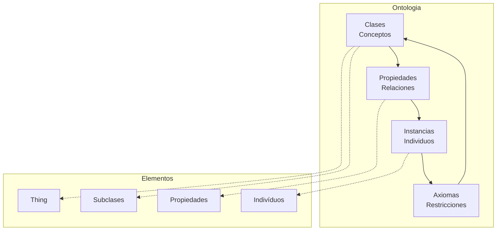
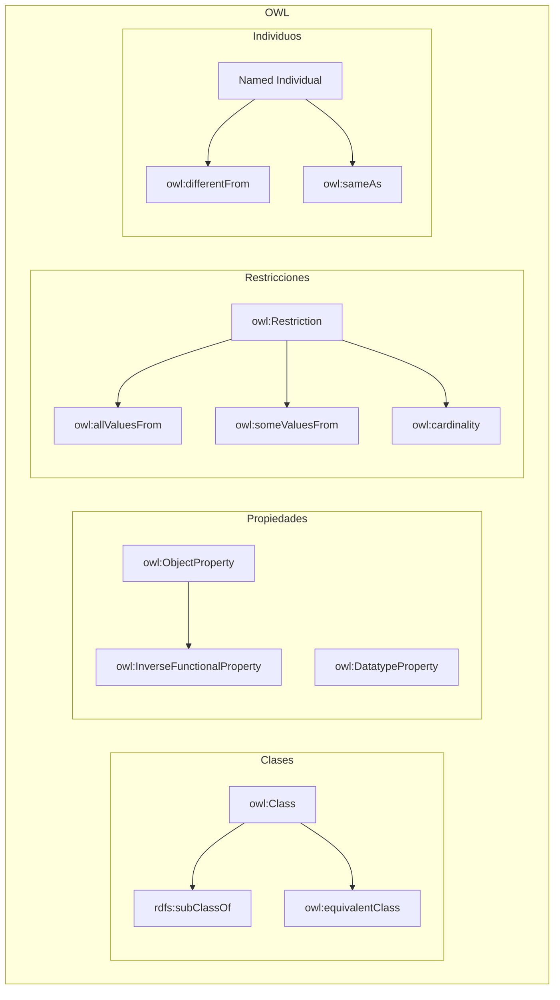
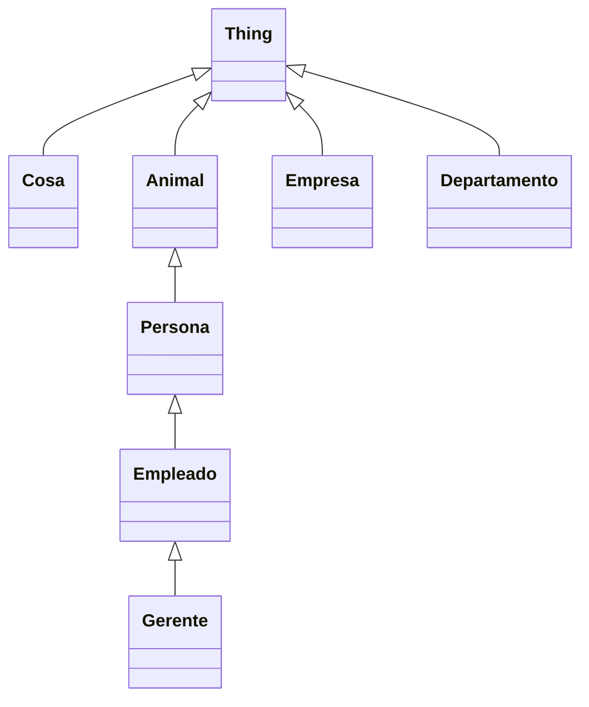
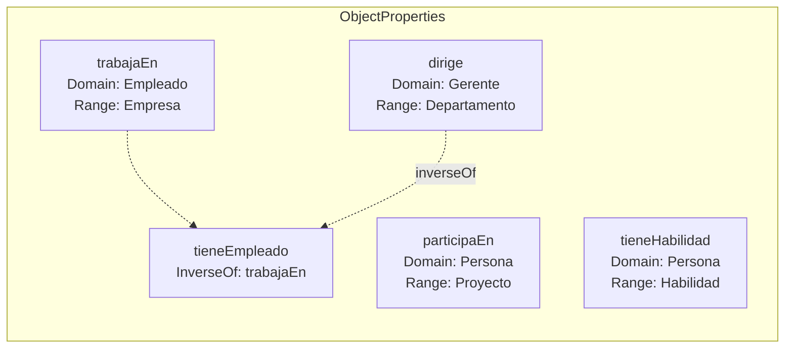
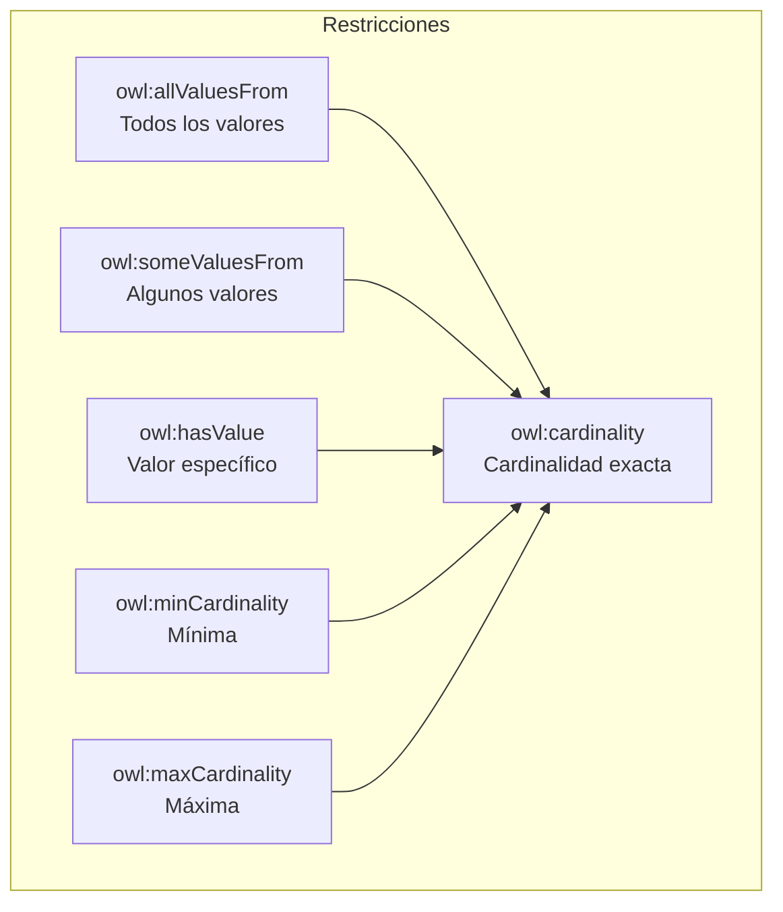
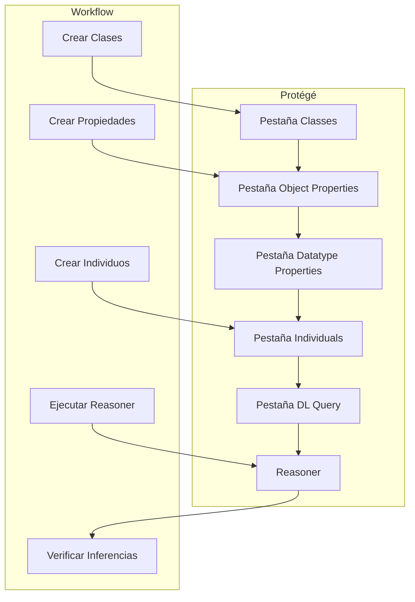

# Clase 13: Modelado Ontológico con OWL

## Duración
**4 horas (240 minutos)**

---

## Objetivos de Aprendizaje

Al finalizar esta clase, el estudiante será capaz de:

1. **Comprender** los fundamentos del modelado ontológico y su importancia en sistemas cognitivos
2. **Diseñar** ontologías utilizando OWL (Web Ontology Language)
3. **Definir** clases, propiedades de objeto y de datos, y restricciones
4. **Utilizar** razonadores para inferir nuevo conocimiento
5. **Implementar** ontologías utilizando Protégé y herramientas Python
6. **Aplicar** mejores prácticas en el diseño de ontologías coherentes y extensibles

---

## Contenidos Detallados

### 1.1 Fundamentos del Modelado Ontológico (45 minutos)

#### 1.1.1 ¿Qué es una Ontología?

Una ontología es una especificación formal y explícita de una conceptualización compartida. En términos de IA y sistemas cognitivos, una ontología define:

- **Conceptos** (clases) del dominio
- **Relaciones** entre conceptos
- **Propiedades** de los conceptos
- **Axiomas** que约束 el significado



#### 1.1.2 Componentes de una Ontología OWL



#### 1.1.3 Niveles de Expresividad en OWL

OWL se divide en perfiles con diferentes niveles de expresividad:

| Perfil | Descripción | Usos |
|--------|-------------|------|
| **OWL Lite** | Subclases, restricciones simples | Taxonomías básicas |
| **OWL DL** | Lógica descriptiva completa | Aplicaciones formales |
| **OWL 2 EL** | Polinomiales, alta eficiencia | Ontologías grandes |
| **OWL 2 QL** | Queries optimizadas | Bases de datos |
| **OWL 2 RL** | Reglas | Reasoning escalable |

---

### 2.1 Diseño de Clases y Jerarquías (50 minutos)

#### 2.1.1 Definición de Clases

```turtle
@prefix rdf: <http://www.w3.org/1999/02/22-rdf-syntax-ns#> .
@prefix rdfs: <http://www.w3.org/2000/01/rdf-schema#> .
@prefix owl: <http://www.w3.org/2002/07/owl#> .
@prefix ex: <http://example.org/> .

# Clases básicas
ex:Persona a owl:Class .
ex:Animal a owl:Class .
ex:Cosa a owl:Class .

# Jerarquía de clases
ex:Empleado a owl:Class ;
    rdfs:subClassOf ex:Persona .

ex:Gerente a owl:Class ;
    rdfs:subClassOf ex:Empleado .

ex:Empresa a owl:Class .
ex:Departamento a owl:Class .
```



#### 2.1.2 Clases Compuestas

```turtle
# Intersección de clases
ex:EmpleadoGerente a owl:Class ;
    owl:equivalentClass [
        a owl:Class ;
        owl:intersectionOf (
            ex:Empleado
            ex:Gerente
        )
    ] .

# Unión de clases
ex:Profesional a owl:Class ;
    owl:equivalentClass [
        a owl:Class ;
        owl:unionOf (
            ex:Empleado
            ex:Gerente
            ex:Consultor
        )
    ] .

# Complemento de clase
ex:NoGerente a owl:Class ;
    owl:equivalentClass [
        a owl:Class ;
        owl:complementOf ex:Gerente
    ] .
```

#### 2.1.3 Ejemplo Completo: Ontología Empresarial

```turtle
# ==================== ONTOLOGÍA EMPRESARIAL ====================
@prefix rdf: <http://www.w3.org/1999/02/22-rdf-syntax-ns#> .
@prefix rdfs: <http://www.w3.org/2000/01/rdf-schema#> .
@prefix owl: <http://www.w3.org/2002/07/owl#> .
@prefix xsd: <http://www.w3.org/2001/XMLSchema#> .
@prefix ex: <http://example.org/ontology/> .

# ==================== CLASES ====================
# Entidad base (Thing está implícito)
ex:Entidad a owl:Class .

# Personas
ex:Persona a owl:Class ;
    rdfs:subClassOf ex:Entidad .

ex:Empleado a owl:Class ;
    rdfs:subClassOf ex:Persona .

ex:Gerente a owl:Class ;
    rdfs:subClassOf ex:Empleado .

ex:Consultor a owl:Class ;
    rdfs:subClassOf ex:Persona .

# Organizaciones
ex:Organizacion a owl:Class ;
    rdfs:subClassOf ex:Entidad .

ex:Empresa a owl:Class ;
    rdfs:subClassOf ex:Organizacion .

ex:Departamento a owl:Class ;
    rdfs:subClassOf ex:Organizacion .

# Proyectos
ex:Proyecto a owl:Class ;
    rdfs:subClassOf ex:Entidad .

# Habilidades
ex:Habilidad a owl:Class .
ex:SkillTecnica a owl:Class ;
    rdfs:subClassOf ex:Habilidad .
ex:SkillBlanda a owl:Class ;
    rdfs:subClassOf ex:Habilidad .
```

---

### 3.1 Propiedades en OWL (50 minutos)

#### 3.1.1 Propiedades de Objeto (Object Properties)

Las propiedades de objeto conectan individuos con otros individuos:

```turtle
# ==================== PROPIEDADES DE OBJETO ====================

# Propiedad: trabajaEn (empleado -> empresa)
ex:trabajaEn a owl:ObjectProperty ;
    rdfs:domain ex:Empleado ;
    rdfs:range ex:Empresa ;
    rdfs:subPropertyOf ex:estaAsociadoCon .

# Propiedad inversa: tieneEmpleado (empresa -> empleado)
ex:tieneEmpleado a owl:ObjectProperty ;
    rdfs:domain ex:Empresa ;
    rdfs:range ex:Empleado ;
    owl:inverseOf ex:trabajaEn .

# Propiedad: dirige (gerente -> departamento)
ex:dirige a owl:ObjectProperty ;
    rdfs:domain ex:Gerente ;
    rdfs:range ex:Departamento .

# Propiedad: esDirigidoPor (departamento -> gerente)
ex:esDirigidoPor a owl:ObjectProperty ;
    rdfs:domain ex:Departamento ;
    rdfs:range ex:Gerente ;
    owl:inverseOf ex:dirige .

# Propiedad: participaEn (empleado -> proyecto)
ex:participaEn a owl:ObjectProperty ;
    rdfs:domain ex:Persona ;
    rdfs:range ex:Proyecto .

# Propiedad: tieneHabilidad (persona -> habilidad)
ex:tieneHabilidad a owl:ObjectProperty ;
    rdfs:domain ex:Persona ;
    rdfs:range ex:Habilidad .

# Propiedad: perteneceA (empleado -> departamento)
ex:perteneceA a owl:ObjectProperty ;
    rdfs:domain ex:Empleado ;
    rdfs:range ex:Departamento .

# Propiedad: esParteDe (departamento -> empresa)
ex:esParteDe a owl:ObjectProperty ;
    rdfs:domain ex:Departamento ;
    rdfs:range ex:Empresa .

# Propiedad: esSupervisadoPor
ex:esSupervisadoPor a owl:ObjectProperty ;
    rdfs:domain ex:Empleado ;
    rdfs:range ex:Empleado .
```



#### 3.1.2 Propiedades de Datos (Datatype Properties)

Las propiedades de datos conectan individuos con valores literales:

```turtle
# ==================== PROPIEDADES DE DATOS ====================

# Propiedades de Persona
ex:nombre a owl:DatatypeProperty ;
    rdfs:domain ex:Persona ;
    rdfs:range xsd:string .

ex:edad a owl:DatatypeProperty ;
    rdfs:domain ex:Persona ;
    rdfs:range xsd:integer .

ex:email a owl:DatatypeProperty ;
    rdfs:domain ex:Persona ;
    rdfs:range xsd:string .

ex:telefono a owl:DatatypeProperty ;
    rdfs:domain ex:Persona ;
    rdfs:range xsd:string .

# Propiedades de Empresa
ex:nombreEmpresa a owl:DatatypeProperty ;
    rdfs:domain ex:Empresa ;
    rdfs:range xsd:string .

ex:ubicacion a owl:DatatypeProperty ;
    rdfs:domain ex:Organizacion ;
    rdfs:range xsd:string .

ex:numEmpleados a owl:DatatypeProperty ;
    rdfs:domain ex:Organizacion ;
    rdfs:range xsd:integer .

ex:fundacion a owl:DatatypeProperty ;
    rdfs:domain ex:Organizacion ;
    rdfs:range xsd:date .

# Propiedades de Proyecto
ex:nombreProyecto a owl:DatatypeProperty ;
    rdfs:domain ex:Proyecto ;
    rdfs:range xsd:string .

ex:presupuesto a owl:DatatypeProperty ;
    rdfs:domain ex:Proyecto ;
    rdfs:range xsd:decimal .

ex:estado a owl:DatatypeProperty ;
    rdfs:domain ex:Proyecto ;
    rdfs:range xsd:string .

# Propiedades de Empleado
ex:sueldo a owl:DatatypeProperty ;
    rdfs:domain ex:Empleado ;
    rdfs:range xsd:decimal .

ex:fechaInicio a owl:DatatypeProperty ;
    rdfs:domain ex:Empleado ;
    rdfs:range xsd:date .

ex:cargo a owl:DatatypeProperty ;
    rdfs:domain ex:Empleado ;
    rdfs:range xsd:string .
```

#### 3.1.3 Características de Propiedades

```turtle
# ==================== CARACTERÍSTICAS DE PROPIEDADES ====================

# Transitiva: si A tieneHabilidad B, y B implica C, entonces A tieneHabilidad C
ex:tieneHabilidad a owl:TransitiveProperty .

# Simétrica: si A conoce B, entonces B conoce A
ex:conoceA a owl:SymmetricProperty .

# Antisimétrica: si A esParteDe B, entonces B no esParteDe A
ex:esParteDe a owl:AntisymmetricProperty .

# Reflexiva: toda persona se conoce a sí misma
ex:conoceA a owl:ReflexiveProperty ;
    rdfs:domain ex:Persona ;
    rdfs:range ex:Persona .

# Funcional: una persona tiene exactamente un email
ex:email a owl:FunctionalProperty .

# InverseFunctional: si dos personas tienen el mismo email, son la misma
ex:email a owl:InverseFunctionalProperty .
```

---

### 4.1 Restricciones y Razonamiento (50 minutos)

#### 4.1.1 Tipos de Restricciones



#### 4.1.2 Restricciones de Quantifier

```turtle
# ==================== RESTRICCIONES ====================

# Todo Gerente debe dirigir exactamente un Departamento
ex:Gerente a owl:Class ;
    owl:equivalentClass [
        a owl:Class ;
        owl:intersectionOf (
            ex:Empleado
            [
                a owl:Restriction ;
                owl:onProperty ex:dirige ;
                owl:cardinality 1
            ]
        )
    ] .

# Todo Empleado debe trabajar en al menos una Empresa
ex:Empleado a owl:Class ;
    rdfs:subClassOf [
        a owl:Restriction ;
        owl:onProperty ex:trabajaEn ;
        owl:someValuesFrom ex:Empresa
    ] .

# Todo Proyecto tiene al menos un participante
ex:Proyecto a owl:Class ;
    rdfs:subClassOf [
        a owl:Restriction ;
        owl:onProperty ex:tieneParticipante ;
        owl:minCardinality 1
    ] .

# Un proyecto tiene participantes que son personas
ex:Proyecto a owl:Class ;
    rdfs:subClassOf [
        a owl:Restriction ;
        owl:onProperty ex:tieneParticipante ;
        owl:allValuesFrom ex:Persona
    ] .
```

#### 4.1.3 Restricciones de Cardinalidad

```turtle
# ==================== RESTRICCIONES DE CARDINALIDAD ====================

# Una Empresa tiene entre 1 y muchos Departamentos
ex:Empresa a owl:Class ;
    rdfs:subClassOf [
        a owl:Restriction ;
        owl:onProperty ex:tieneDepartamento ;
        owl:minCardinality 1
    ] ,
    [
        a owl:Restriction ;
        owl:onProperty ex:tieneDepartamento ;
        owl:maxCardinality 50
    ] .

# Un Departamento tiene exactamente un Gerente
ex:Departamento a owl:Class ;
    rdfs:subClassOf [
        a owl:Restriction ;
        owl:onProperty ex:esDirigidoPor ;
        owl:cardinality 1
    ] ,
    [
        a owl:Restriction ;
        owl:onProperty ex:esDirigidoPor ;
        owl:allValuesFrom ex:Gerente
    ] .

# Una Persona tiene exactamente un nombre
ex:nombre a owl:DatatypeProperty ;
    owl:cardinality 1 .

# Un Empleado tiene un salario (opcional)
ex:salario a owl:DatatypeProperty ;
    owl:maxCardinality 1 .
```

#### 4.1.4 Razonamiento Automático

```python
"""
Demostración de Razonamiento con OWL
=====================================
Usando rdflib para inferir nueva información
"""

from rdflib import Graph, Namespace, Literal, URIRef
from rdflib.namespace import RDF, RDFS, OWL, XSD

# Definir namespace
EX = Namespace("http://example.org/ontology/")
g = Graph()
g.bind("ex", EX)

# ==================== ONTOLOGÍA ====================
# Clases
g.add((EX.Persona, RDF.type, OWL.Class))
g.add((EX.Empleado, RDF.type, OWL.Class))
g.add((EX.Empleado, RDFS.subClassOf, EX.Persona))

g.add((EX.Empresa, RDF.type, OWL.Class))
g.add((EX.Departamento, RDF.type, OWL.Class))

# Propiedades
g.add((EX.trabajaEn, RDF.type, OWL.ObjectProperty))
g.add((EX.trabajaEn, RDFS.domain, EX.Empleado))
g.add((EX.trabajaEn, RDFS.range, EX.Empresa))

g.add((EX.tieneEmpleado, RDF.type, OWL.ObjectProperty))
g.add((EX.tieneEmpleado, OWL.inverseOf, EX.trabajaEn))

g.add((EX.nombre, RDF.type, OWL.DatatypeProperty))
g.add((EX.nombre, RDFS.domain, EX.Persona))
g.add((EX.nombre, RDFS.range, XSD.string))

# ==================== INDIVIDUOS ====================
# Juan (Empleado)
g.add((EX.Juan, RDF.type, EX.Empleado))
g.add((EX.Juan, EX.nombre, Literal("Juan García")))

# María (Persona - no Empleado)
g.add((EX.Maria, RDF.type, EX.Persona))
g.add((EX.Maria, EX.nombre, Literal("María López")))

# TechCorp (Empresa)
g.add((EX.TechCorp, RDF.type, EX.Empresa))
g.add((EX.TechCorp, EX.nombre, Literal("TechCorp")))

# Relación: Juan trabaja en TechCorp
g.add((EX.Juan, EX.trabajaEn, EX.TechCorp))

# ==================== CONSULTA Y RAZONAMIENTO ====================
print("=== Consulta básica: Empleados ===")
query = """
PREFIX ex: <http://example.org/ontology/>

SELECT ?empleado ?empresa
WHERE {
    ?empleado a ex:Empleado .
    ?empleado ex:trabajaEn ?empresa .
}
"""

for row in g.query(query):
    print(f"  {row.empleado.split('/')[-1]} trabaja en {row.empresa.split('/')[-1]}")

print("\n=== Razonamiento: Personas (incluye empleados) ===")
query2 = """
PREFIX ex: <http://example.org/ontology/>

SELECT ?persona
WHERE {
    ?persona a ex:Persona .
}
"""

for row in g.query(query2):
    print(f"  {row.persona.split('/')[-1]}")

# ==================== INFERRER USANDO HERMIT ====================
# Nota: rdflib no incluye razonador por defecto
# Para inferencia completa, usar Protégé o pellet

print("\n=== Razonador Pellet (simulado) ===")
# Simular inferencia: Juan es una Persona porque Empleado es subclase de Persona
print("  Por inferencia: Juan (Empleado) → también es Persona")
```

---

### 5.1 Implementación con Protégé (40 minutos)

#### 5.1.1 Interfaz de Protégé



#### 5.1.2 Crear Ontología en Protégé (Paso a Paso)

**Paso 1: Nueva Ontología**
```
1. File → New → OWL DL
2.IRI: http://example.org/ontology/
3. Prefixes: agregar prefijos personalizados
```

**Paso 2: Definir Clases**
```
1. Ir a Classes tab
2. Clic derecho en owl:Thing → "Create new class"
3. Nombrar: Empresa, Persona, Empleado, etc.
4. Crear jerarquía arrastrando o con subClassOf
```

**Paso 3: Definir Propiedades**
```
1. Object Properties tab
2. Crear nuevas propiedades
3. Definir domain y range
4. Establecer propiedades inversas
```

**Paso 4: Ejecutar Reasoner**
```
1. Reasoner → Start reasoner
2. Verificar consistencia (sin errores)
3. Ver inferred: subclases, superclases
```

```python
"""
Ejemplo de ontología exportada desde Protégé
============================================
"""

# Ejemplo de formato exportado en Turtle
ontologia_turtle = """
@prefix rdf: <http://www.w3.org/1999/02/22-rdf-syntax-ns#> .
@prefix rdfs: <http://www.w3.org/2000/01/rdf-schema#> .
@prefix owl: <http://www.w3.org/2002/07/owl#> .
@prefix xsd: <http://www.w3.org/2001/XMLSchema#> .
@prefix ex: <http://example.org/ontology#> .

# Classes
ex:Persona a owl:Class .
ex:Empleado a owl:Class ;
    rdfs:subClassOf ex:Persona .
ex:Gerente a owl:Class ;
    rdfs:subClassOf ex:Empleado .
ex:Empresa a owl:Class .
ex:Departamento a owl:Class .

# Object Properties
ex:trabajaEn a owl:ObjectProperty ;
    rdfs:domain ex:Empleado ;
    rdfs:range ex:Empresa .
ex:tieneEmpleado a owl:ObjectProperty ;
    owl:inverseOf ex:trabajaEn .
ex:dirige a owl:ObjectProperty ;
    rdfs:domain ex:Gerente ;
    rdfs:range ex:Departamento .

# Datatype Properties
ex:nombre a owl:DatatypeProperty ;
    rdfs:domain ex:Persona ;
    rdfs:range xsd:string .
ex:edad a owl:DatatypeProperty ;
    rdfs:domain ex:Persona ;
    rdfs:range xsd:integer .

# Individuals
ex:Juan a ex:Empleado ;
    ex:nombre "Juan García" ;
    ex:edad 35 ;
    ex:trabajaEn ex:TechCorp .

ex:TechCorp a ex:Empresa ;
    ex:nombre "TechCorp" .

# Restricciones
ex:Gerente rdfs:subClassOf [
    a owl:Restriction ;
    owl:onProperty ex:dirige ;
    owl:cardinality 1
] .
"""
```

---

### 6.1 Ontología médica ejemplo completo (25 minutos)

#### 6.1.1 Diseño de ontología médica

```turtle
# ==================== ONTOLOGÍA MÉDICA COMPLETA ====================
@prefix rdf: <http://www.w3.org/1999/02/22-rdf-syntax-ns#> .
@prefix rdfs: <http://www.w3.org/2000/01/rdf-schema#> .
@prefix owl: <http://www.w3.org/2002/07/owl#> .
@prefix xsd: <http://www.w3.org/2001/XMLSchema#> .
@prefix med: <http://medontology.org/> .

# ==================== CLASES ====================
# Entidad base
med:Entidad a owl:Class .

# Personas
med:Persona a owl:Class ;
    rdfs:subClassOf med:Entidad .

med:Paciente a owl:Class ;
    rdfs:subClassOf med:Persona .

med:Medico a owl:Class ;
    rdfs:subClassOf med:Persona .

med:Especialidad a owl:Class .

# Instituciones
med:Institucion a owl:Class ;
    rdfs:subClassOf med:Entidad .

med:Hospital a owl:Class ;
    rdfs:subClassOf med:Institucion .

med:Clinica a owl:Class ;
    rdfs:subClassOf med:Institucion .

# Atención médica
med:Consulta a owl:Class .
med:Diagnostico a owl:Class .
med:Tratamiento a owl:Class .
med:Prescripcion a owl:Class .

# Condiciones médicas
med:Enfermedad a owl:Class .
med:Sindrome a owl:Class ;
    rdfs:subClassOf med:Enfermedad .
med:Condicion a owl:Class ;
    rdfs:subClassOf med:Enfermedad .

# ==================== PROPIEDADES DE OBJETO ====================
# Relación paciente-médico
med:atiende a owl:ObjectProperty ;
    rdfs:domain med:Medico ;
    rdfs:range med:Paciente .

med:esAtendidoPor a owl:ObjectProperty ;
    owl:inverseOf med:atiende .

# Relación diagnóstico
med:tieneDiagnostico a owl:ObjectProperty ;
    rdfs:domain med:Paciente ;
    rdfs:range med:Diagnostico .

med:diagnostica a owl:ObjectProperty ;
    rdfs:domain med:Medico ;
    rdfs:range med:Diagnostico .

# Relación tratamiento
med:recibe a owl:ObjectProperty ;
    rdfs:domain med:Paciente ;
    rdfs:range med:Tratamiento .

med:prescribe a owl:ObjectProperty ;
    rdfs:domain med:Medico ;
    rdfs:range med:Prescripcion .

# Relación institución
med:trabajaEn a owl:ObjectProperty ;
    rdfs:domain med:Persona ;
    rdfs:range med:Institucion .

med:hospitalizadoEn a owl:ObjectProperty ;
    rdfs:domain med:Paciente ;
    rdfs:range med:Hospital .

# ==================== PROPIEDADES DE DATOS ====================
# Datos de persona
med:nombrePersona a owl:DatatypeProperty ;
    rdfs:domain med:Persona ;
    rdfs:range xsd:string .

med:fechaNacimiento a owl:DatatypeProperty ;
    rdfs:domain med:Persona ;
    rdfs:range xsd:date .

med:genero a owl:DatatypeProperty ;
    rdfs:domain med:Persona ;
    rdfs:range xsd:string .

med:dni a owl:DatatypeProperty ;
    rdfs:domain med:Paciente ;
    rdfs:range xsd:string .

med:numeroColegiado a owl:DatatypeProperty ;
    rdfs:domain med:Medico ;
    rdfs:range xsd:string .

# Datos de consulta
med:fechaConsulta a owl:DatatypeProperty ;
    rdfs:domain med:Consulta ;
    rdfs:range xsd:date .

med:horaConsulta a owl:DatatypeProperty ;
    rdfs:domain med:Consulta ;
    rdfs:range xsd:time .

# Datos de diagnóstico
med:codigoCIE10 a owl:DatatypeProperty ;
    rdfs:domain med:Diagnostico ;
    rdfs:range xsd:string .

med:descripcion a owl:DatatypeProperty ;
    rdfs:domain med:Diagnostico ;
    rdfs:range xsd:string .

# Datos de prescripción
med:medicamento a owl:DatatypeProperty ;
    rdfs:domain med:Prescripcion ;
    rdfs:range xsd:string .

med:dosis a owl:DatatypeProperty ;
    rdfs:domain med:Prescripcion ;
    rdfs:range xsd:string .

med:frecuencia a owl:DatatypeProperty ;
    rdfs:domain med:Prescripcion ;
    rdfs:range xsd:string .

# ==================== RESTRICCIONES ====================
# Un médico atiende a varios pacientes
med:Medico rdfs:subClassOf [
    a owl:Restriction ;
    owl:onProperty med:atiende ;
    owl:minCardinality 0
] .

# Todo diagnóstico es realizado por un médico
med:Diagnostico rdfs:subClassOf [
    a owl:Restriction ;
    owl:onProperty med:diagnostica ;
    owl:someValuesFrom med:Medico
] .

# Un paciente puede tener varios diagnósticos
med:Paciente rdfs:subClassOf [
    a owl:Restriction ;
    owl:onProperty med:tieneDiagnostico ;
    owl:minCardinality 0
] .

# ==================== INDIVIDUOS ====================
# Paciente ejemplo
med:Paciente001 a med:Paciente ;
    med:nombrePersona "Ana García" ;
    med:fechaNacimiento "1985-03-15" ;
    med:genero "Femenino" ;
    med:dni "12345678A" .

# Médico ejemplo
med:Medico001 a med:Medico ;
    med:nombrePersona "Dr. Carlos López" ;
    med:numeroColegiado "M-12345" ;
    med:especialidad "Cardiología" .

# Hospital ejemplo
med:HospitalCentral a med:Hospital ;
    med:nombre "Hospital Central" ;
    med:ubicacion "Madrid" .
```

---

## Tecnologías y Herramientas Específicas

### Tecnologías Principales

| Tecnología | Versión | Propósito |
|------------|---------|-----------|
| Protégé | 5.5+ | Editor visual de ontologías |
| HermiT | 1.3+ | Razonador para OWL DL |
| Pellet | 2.3+ | Razonador de código abierto |
| rdflib | 6.0+ | Manipulación de RDF en Python |
| OWLAPI | 5.x | API Java para OWL |

### Instalación

```bash
# Instalar rdflib para Python
pip install rdflib>=6.0.0
pip install owlrl>=5.0.0

# Verificar instalación
python -c "import rdflib; print(rdflib.__version__)"
```

---

## Actividades de Laboratorio

### Laboratorio 13.1: Crear Ontología Empresarial

```python
"""
Laboratorio 13.1: Ontología Empresarial Completa
===============================================
"""

from rdflib import Graph, Namespace, Literal, URIRef
from rdflib.namespace import RDF, RDFS, OWL, XSD

# Namespace
EX = Namespace("http://empresa.example.org/ontology/")
g = Graph()
g.bind("ex", EX)

# ==================== CLASES ====================
# Crear clases
clases = [
    ("Entidad", None),
    ("Persona", "Entidad"),
    ("Empleado", "Persona"),
    ("Gerente", "Empleado"),
    ("Desarrollador", "Empleado"),
    ("Diseñador", "Empleado"),
    ("Organizacion", "Entidad"),
    ("Empresa", "Organizacion"),
    ("Departamento", "Organizacion"),
    ("Proyecto", "Entidad"),
    ("Habilidad", "Entidad"),
]

for clase, padre in clases:
    g.add((EX[clase], RDF.type, OWL.Class))
    if padre:
        g.add((EX[clase], RDFS.subClassOf, EX[padre]))

# ==================== PROPIEDADES DE OBJETO ====================
object_properties = [
    ("trabajaEn", "Empleado", "Empresa"),
    ("tieneEmpleado", "Empresa", "Empleado"),
    ("perteneceA", "Empleado", "Departamento"),
    ("tieneDepartamento", "Departamento", "Empresa"),
    ("dirige", "Gerente", "Departamento"),
    ("esDirigidoPor", "Departamento", "Gerente"),
    ("participaEn", "Persona", "Proyecto"),
    ("tieneProyecto", "Proyecto", "Empresa"),
    ("tieneHabilidad", "Persona", "Habilidad"),
    ("supervisa", "Empleado", "Empleado"),
]

for prop, domain, range_ in object_properties:
    g.add((EX[prop], RDF.type, OWL.ObjectProperty))
    g.add((EX[prop], RDFS.domain, EX[domain]))
    g.add((EX[prop], RDFS.range, EX[range_]))

# Establecer propiedades inversas
g.add((EX.tieneEmpleado, OWL.inverseOf, EX.trabajaEn))
g.add((EX.esDirigidoPor, OWL.inverseOf, EX.dirige))

# ==================== PROPIEDADES DE DATOS ====================
datatype_properties = [
    ("nombre", "Persona", XSD.string),
    ("edad", "Persona", XSD.integer),
    ("email", "Persona", XSD.string),
    ("dni", "Persona", XSD.string),
    ("sueldo", "Empleado", XSD.decimal),
    ("cargo", "Empleado", XSD.string),
    ("fechaInicio", "Empleado", XSD.date),
    ("nombreEmpresa", "Empresa", XSD.string),
    ("ubicacion", "Organizacion", XSD.string),
    ("numEmpleados", "Organizacion", XSD.integer),
    ("presupuesto", "Proyecto", XSD.decimal),
    ("nombreProyecto", "Proyecto", XSD.string),
    ("nivel", "Habilidad", XSD.string),
    ("nombreHabilidad", "Habilidad", XSD.string),
]

for prop, domain, range_ in datatype_properties:
    g.add((EX[prop], RDF.type, OWL.DatatypeProperty))
    g.add((EX[prop], RDFS.domain, EX[domain]))
    g.add((EX[prop], RDFS.range, range_))

# ==================== RESTRICCIONES ====================
# Un Gerente dirige exactamente un Departamento
g.add((EX.Gerente, RDFS.subClassOf, EX.Empleado))
g.add((EX.Gerente, RDFS.subClassOf, URIRef(
    f"urn:uuid:{hash('gerente_dirige')}"
)))

# ==================== INDIVIDUOS ====================
# Empresas
empresas = [
    ("TechCorp", "Madrid", 150),
    ("DataSoft", "Barcelona", 75),
    ("InnovateTech", "Valencia", 200),
]

for emp, ubi, num in empresas:
    g.add((EX[emp], RDF.type, EX.Empresa))
    g.add((EX[emp], EX.nombreEmpresa, Literal(emp)))
    g.add((EX[emp], EX.ubicacion, Literal(ubi)))
    g.add((EX[emp], EX.numEmpleados, Literal(num, datatype=XSD.integer)))

# Personas
personas = [
    ("Juan", 35, "juan@empresa.com", "12345678A", "TechCorp", "Gerente", 60000),
    ("Maria", 28, "maria@empresa.com", "87654321B", "TechCorp", "Desarrollador", 45000),
    ("Pedro", 42, "pedro@empresa.com", "11223344C", "DataSoft", "Gerente", 65000),
    ("Ana", 31, "ana@empresa.com", "55667788D", "InnovateTech", "Diseñador", 40000),
    ("Luis", 29, "luis@empresa.com", "99887766E", "TechCorp", "Desarrollador", 42000),
]

for nom, ed, em, dni, emp, car, sue in personas:
    g.add((EX[nom], RDF.type, EX.Empleado))
    g.add((EX[nom], EX.nombre, Literal(nom)))
    g.add((EX[nom], EX.edad, Literal(ed, datatype=XSD.integer)))
    g.add((EX[nom], EX.email, Literal(em)))
    g.add((EX[nom], EX.dni, Literal(dni)))
    g.add((EX[nom], EX.cargo, Literal(car)))
    g.add((EX[nom], EX.sueldo, Literal(sue, datatype=XSD.decimal)))
    g.add((EX[nom], EX.trabajaEn, EX[emp]))

# ==================== CONSULTAS ====================
print("=== Todas las clases ===")
for s, p, o in g.triples((None, RDF.type, OWL.Class)):
    print(f"  {s.split('/')[-1]}")

print("\n=== Empleados por empresa ===")
query = """
PREFIX ex: <http://empresa.example.org/ontology/>

SELECT ?empresa ?empleado ?cargo
WHERE {
    ?empleado a ex:Empleado .
    ?empleado ex:cargo ?cargo .
    ?empleado ex:trabajaEn ?empresa .
}
ORDER BY ?empresa ?cargo
"""

for row in g.query(query):
    print(f"  {row.empresa.split('/')[-1]}: {row.empleado.split('/')[-1]} ({row.cargo})")

print("\n=== Gerentes ===")
query = """
PREFIX ex: <http://empresa.example.org/ontology/>

SELECT ?gerente ?empresa
WHERE {
    ?gerente a ex:Gerente .
    ?gerente ex:trabajaEn ?empresa .
}
"""

for row in g.query(query):
    print(f"  {row.gerente.split('/')[-1]} en {row.empresa.split('/')[-1]}")

print("\n=== Ontología creada exitosamente ===")
print(f"Total de tripletas: {len(g)}")
```

### Laboratorio 13.2: Razonamiento con Restricciones

```python
"""
Laboratorio 13.2: Razonamiento y Restricciones
==============================================
"""

from rdflib import Graph, Namespace, Literal, URIRef
from rdflib.namespace import RDF, RDFS, OWL, XSD

EX = Namespace("http://example.org/")
g = Graph()
g.bind("ex", EX)

# ==================== ONTOLOGÍA ====================
# Clases
g.add((EX.Persona, RDF.type, OWL.Class))
g.add((EX.Empleado, RDF.type, OWL.Class))
g.add((EX.Empleado, RDFS.subClassOf, EX.Persona))

g.add((EX.Empresa, RDF.type, OWL.Class))
g.add((EX.Proyecto, RDF.type, OWL.Class))

# Propiedades
g.add((EX.trabajaEn, RDF.type, OWL.ObjectProperty))
g.add((EX.trabajaEn, RDFS.domain, EX.Empleado))
g.add((EX.trabajaEn, RDFS.range, EX.Empresa))

g.add((EX.participaEn, RDF.type, OWL.ObjectProperty))
g.add((EX.participaEn, RDFS.domain, EX.Persona))
g.add((EX.participaEn, RDFS.range, EX.Proyecto))

# Restricciones: Todo Empleado trabaja en al menos una Empresa
g.add((EX.Empleado, RDFS.subClassOf, URIRef(
    "urn:uuid:1"
)))

# ==================== INDIVIDUOS ====================
# Juan trabaja en TechCorp
g.add((EX.Juan, RDF.type, EX.Empleado))
g.add((EX.Juan, EX.trabajaEn, EX.TechCorp))

# María trabaja en TechCorp y participa en Proyecto Alpha
g.add((EX.Maria, RDF.type, EX.Empleado))
g.add((EX.Maria, EX.trabajaEn, EX.TechCorp))
g.add((EX.Maria, EX.participaEn, EX.ProyectoAlpha))

# TechCorp es una Empresa
g.add((EX.TechCorp, RDF.type, EX.Empresa))

# ProyectoAlpha
g.add((EX.ProyectoAlpha, RDF.type, EX.Proyecto))

# ==================== CONSULTAS ====================
print("=== Empleados con sus empresas ===")
query = """
PREFIX ex: <http://example.org/>

SELECT ?empleado ?empresa
WHERE {
    ?empleado a ex:Empleado .
    ?empleado ex:trabajaEn ?empresa .
}
"""

for row in g.query(query):
    print(f"  {row.empleado.split('/')[-1]} -> {row.empresa.split('/')[-1]}")

print("\n=== Personas en proyectos ===")
query = """
PREFIX ex: <http://example.org/>

SELECT ?persona ?proyecto
WHERE {
    ?persona ex:participaEn ?proyecto .
}
"""

for row in g.query(query):
    print(f"  {row.persona.split('/')[-1]} -> {row.proyecto.split('/')[-1]}")
```

---

## Resumen de Puntos Clave

### Conceptos Fundamentales
1. **Ontología**: Representación formal de conocimiento con clases, propiedades e individuos
2. **OWL**: lenguaje estándar para crear ontologías con semántica formal
3. **Razonamiento**: Inferir nuevo conocimiento automáticamente

### Elementos de OWL
1. **Clases (owl:Class)**: Conceptos del dominio
2. **Propiedades de objeto**: Relaciones entre individuos
3. **Propiedades de datos**: Atributos con tipos
4. **Restricciones**: Reglas que definen axiomas
5. **Individuos**: Instancias específicas

### Tipos de Restricciones
1. **allValuesFrom**: Todos los valores deben ser de un tipo
2. **someValuesFrom**: Al menos un valor debe ser de un tipo
3. **cardinality**: Número exacto de valores
4. **min/maxCardinality**: Límites de cardinalidad

### Herramientas
1. **Protégé**: Editor visual de ontologías
2. **HermiT/Pellet**: Razonadores para OWL
3. **rdflib**: Librería Python para RDF/OWL

---

## Referencias Externas

1. **OWL 2 Web Ontology Language**
   - URL: https://www.w3.org/TR/owl2-overview/
   - Descripción: Especificación oficial de OWL 2

2. **Protégé**
   - URL: https://protege.stanford.edu/
   - Descripción: Editor de ontologías

3. **OWL API**
   - URL: https://owlapi.sourceforge.net/
   - Descripción: API Java para OWL

4. **HermiT Reasoner**
   - URL: http://www.hermit-reasoner.com/
   - Descripción: Razonador para OWL DL

5. **Pellet Reasoner**
   - URL: https://github.com/stardog-union/pellet
   - Descripción: Razonador de código abierto

6. **DL Query in Protégé**
   - URL: https://protegewiki.stanford.edu/wiki/DLQuery
   - Descripción: Consultas en lenguaje de descripción

7. **RDF Schema Specification**
   - URL: https://www.w3.org/TR/rdf-schema/
   - Descripción: Especificación de RDFS

---

## Ejercicios Prácticos

### Ejercicio 1: Ontología de Biblioteca

**Enunciado:** Crear una ontología para una biblioteca con libros, autores, géneros, miembros y préstamos.

**Solución:**

```python
"""
Ejercicio 1: Ontología de Biblioteca
=====================================
"""

from rdflib import Graph, Namespace, Literal, URIRef
from rdflib.namespace import RDF, RDFS, OWL, XSD

EX = Namespace("http://biblioteca.example.org/")
g = Graph()
g.bind("ex", EX)

# ==================== CLASES ====================
clases = [
    "Entidad",
    "Obra",
    "Libro",
    "Revista",
    "Autor",
    "Miembro",
    "Prestamo",
    "Genero"
]

for c in clases:
    g.add((EX[c], RDF.type, OWL.Class))

# Jerarquía
g.add((EX.Libro, RDFS.subClassOf, EX.Obra))
g.add((EX.Revista, RDFS.subClassOf, EX.Obra))

# ==================== PROPIEDADES ====================
# Object Properties
g.add((EX.escritoPor, RDF.type, OWL.ObjectProperty))
g.add((EX.escritoPor, RDFS.domain, EX.Obra))
g.add((EX.escritoPor, RDFS.range, EX.Autor))

g.add((EX.tieneAutor, RDF.type, OWL.ObjectProperty))
g.add((EX.tieneAutor, OWL.inverseOf, EX.escritoPor))

g.add((EX.prestadoA, RDF.type, OWL.ObjectProperty))
g.add((EX.prestadoA, RDFS.domain, EX.Prestamo))
g.add((EX.prestadoA, RDFS.range, EX.Miembro))

g.add((EX.contiene, RDF.type, OWL.ObjectProperty))
g.add((EX.contiene, RDFS.domain, EX.Prestamo))
g.add((EX.contiene, RDFS.range, EX.Libro))

g.add((EX.esDeGenero, RDF.type, OWL.ObjectProperty))
g.add((EX.esDeGenero, RDFS.domain, EX.Obra))
g.add((EX.esDeGenero, RDFS.range, EX.Genero))

# Datatype Properties
g.add((EX.titulo, RDF.type, OWL.DatatypeProperty))
g.add((EX.titulo, RDFS.domain, EX.Obra))
g.add((EX.titulo, RDFS.range, XSD.string))

g.add((EX.isbn, RDF.type, OWL.DatatypeProperty))
g.add((EX.isbn, RDFS.domain, EX.Libro))
g.add((EX.isbn, RDFS.range, XSD.string))

g.add((EX.nombreAutor, RDF.type, OWL.DatatypeProperty))
g.add((EX.nombreAutor, RDFS.domain, EX.Autor))
g.add((EX.nombreAutor, RDFS.range, XSD.string))

g.add((EX.nombreMiembro, RDF.type, OWL.DatatypeProperty))
g.add((EX.nombreMiembro, RDFS.domain, EX.Miembro))
g.add((EX.nombreMiembro, RDFS.range, XSD.string))

g.add((EX.fechaPrestamo, RDF.type, OWL.DatatypeProperty))
g.add((EX.fechaPrestamo, RDFS.domain, EX.Prestamo))
g.add((EX.fechaPrestamo, RDFS.range, XSD.date))

g.add((EX.fechaDevolucion, RDF.type, OWL.DatatypeProperty))
g.add((EX.fechaDevolucion, RDFS.domain, EX.Prestamo))
g.add((EX.fechaDevolucion, RDFS.range, XSD.date))

# ==================== INDIVIDUOS ====================
# Autores
g.add((EX.Autor1, RDF.type, EX.Autor))
g.add((EX.Autor1, EX.nombreAutor, Literal("Gabriel García Márquez")))

g.add((EX.Autor2, RDF.type, EX.Autor))
g.add((EX.Autor2, EX.nombreAutor, Literal("Mario Vargas Llosa")))

# Libros
g.add((EX.Libro1, RDF.type, EX.Libro))
g.add((EX.Libro1, EX.titulo, Literal("Cien años de soledad")))
g.add((EX.Libro1, EX.isbn, Literal("978-0060883287")))
g.add((EX.Libro1, EX.escritoPor, EX.Autor1))

g.add((EX.Libro2, RDF.type, EX.Libro))
g.add((EX.Libro2, EX.titulo, Literal("La ciudad y los perros")))
g.add((EX.Libro2, EX.isbn, Literal("978-0060932587")))
g.add((EX.Libro2, EX.escritoPor, EX.Autor2))

# Géneros
g.add((EX.Genero1, RDF.type, EX.Genero))
g.add((EX.Genero1, EX.nombre, Literal("Realismo mágico")))

g.add((EX.Genero2, RDF.type, EX.Genero))
g.add((EX.Genero2, EX.nombre, Literal("Novela")))

# Miembros
g.add((EX.Miembro1, RDF.type, EX.Miembro))
g.add((EX.Miembro1, EX.nombreMiembro, Literal("Juan Pérez")))

# Préstamos
g.add((EX.Prestamo1, RDF.type, EX.Prestamo))
g.add((EX.Prestamo1, EX.prestadoA, EX.Miembro1))
g.add((EX.Prestamo1, EX.contiene, EX.Libro1))
g.add((EX.Prestamo1, EX.fechaPrestamo, Literal("2024-01-15", datatype=XSD.date)))

# ==================== CONSULTAS ====================
print("=== Libros y autores ===")
query = """
PREFIX ex: <http://biblioteca.example.org/>

SELECT ?libro ?autor
WHERE {
    ?libro a ex:Libro .
    ?libro ex:escritoPor ?autor .
}
"""

for row in g.query(query):
    print(f"  {row.libro.split('/')[-1]} por {row.autor.split('/')[-1]}")

print("\n=== Préstamos activos ===")
query = """
PREFIX ex: <http://biblioteca.example.org/>

SELECT ?libro ?miembro
WHERE {
    ?prestamo a ex:Prestamo .
    ?prestamo ex:contiene ?libro .
    ?prestamo ex:prestadoA ?miembro .
}
"""

for row in g.query(query):
    print(f"  {row.libro.split('/')[-1]} prestado a {row.miembro.split('/')[-1]}")

print(f"\nTotal tripletas: {len(g)}")
```

### Ejercicio 2: Validar Consistencia Ontológica

**Enunciado:** Verificar que una ontología no tenga inconsistencias lógicas.

**Solución:**

```python
"""
Ejercicio 2: Validación de Consistencia
======================================
"""

from rdflib import Graph, Namespace, Literal
from rdflib.namespace import RDF, RDFS, OWL, XSD

EX = Namespace("http://example.org/")
g = Graph()

# Crear ontología inconsistente a propósito
# Un gerente que simultáneamente no es empleado

# Clases
g.add((EX.Persona, RDF.type, OWL.Class))
g.add((EX.Empleado, RDF.type, OWL.Class))
g.add((EX.Gerente, RDF.type, OWL.Class))

# Gerente es subclase de Empleado
g.add((EX.Gerente, RDFS.subClassOf, EX.Empleado))

# Juan es Gerente
g.add((EX.Juan, RDF.type, EX.Gerente))

# Pero también tiene propiedad que indica que NO es empleado
# (Esto es inconsistente si tenemos restricciones)

print("=== Verificación de ontología ===")
print("Clases definidas:")
for s, p, o in g.triples((None, RDF.type, OWL.Class)):
    print(f"  {s.split('/')[-1]}")

print("\nJerarquía:")
for s, p, o in g.triples((EX.Gerente, RDFS.subClassOf, None)):
    print(f"  Gerente subClassOf {o.split('/')[-1]}")

print("\nIndividuos:")
for s, p, o in g.triples((None, RDF.type, EX.Gerente)):
    print(f"  {s.split('/')[-1]} es Gerente")

# Verificar consistencia
def verificar_consistencia(g):
    """Verificar consistencia básica de la ontología"""
    errores = []
    
    # Verificar que no hay clases sin definición
    for s, p, o in g.triples((None, RDFS.subClassOf, None)):
        if (o, RDF.type, OWL.Class) not in g:
            errores.append(f"Subclase sin clase padre: {s}")
    
    return errores

errores = verificar_consistencia(g)
if errores:
    print("\n⚠️ Inconsistencias encontradas:")
    for e in errores:
        print(f"  - {e}")
else:
    print("\n✓ Ontología consistente")
```

---

**Fin de la Clase 13**
