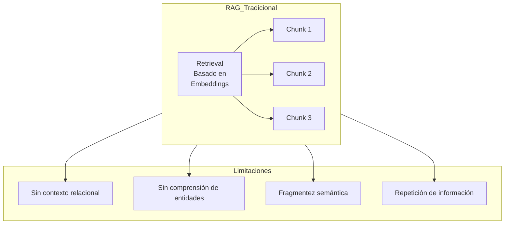
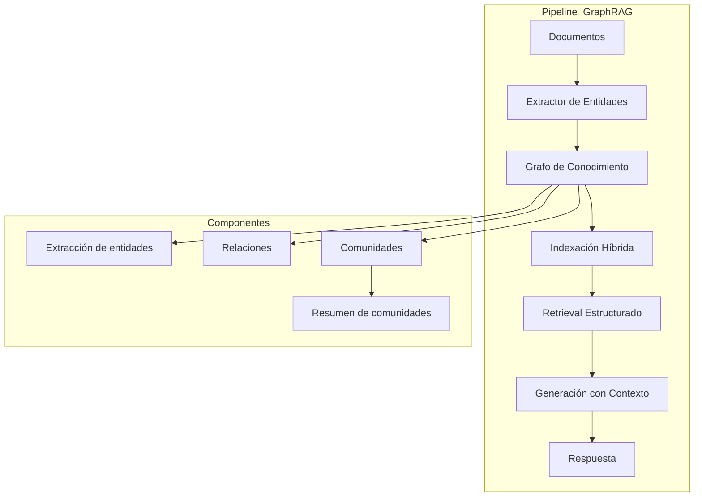
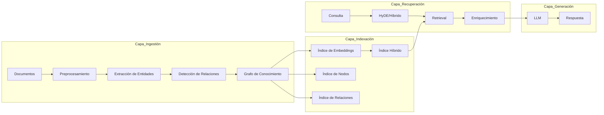

# Clase 14: GraphRAG - Integración de Grafos en RAG

## Duración
**4 horas (240 minutos)**

---

## Objetivos de Aprendizaje

Al finalizar esta clase, el estudiante será capaz de:

1. **Comprender** qué es GraphRAG y por qué mejora los sistemas RAG tradicionales
2. **Diseñar** arquitecturas de indexación basadas en grafos para RAG
3. **Implementar** sistemas de recuperación estructurada usando LangChain y Neo4j
4. **Crear** pipelines de GraphRAG con LlamaIndex
5. **Optimizar** consultas utilizando el contexto del grafo
6. **Evaluar** el rendimiento de sistemas GraphRAG vs RAG tradicional

---

## Contenidos Detallados

### 1.1 Fundamentos de GraphRAG (45 minutos)

#### 1.1.1 Limitaciones del RAG Tradicional

El Retrieval-Augmented Generation (RAG) tradicional presenta limitaciones significativas cuando se trata de consultas que requieren comprensión de relaciones complejas entre entidades.



**Problemas específicos:**

1. **Pérdida de contexto relacional:** Los embeddings capturan similitud semántica pero pierden estructuras relacionales
2. **Fragmentación:** Información relacionada puede estar dispersa en diferentes chunks
3. **Duplicación:** Mismo contenido puede recuperarse múltiples veces
4. **Sin inferencia:** No puede deduce new relationships from existing ones

#### 1.1.2 ¿Qué es GraphRAG?

GraphRAG integra grafos de conocimiento en el pipeline de RAG para superar estas limitaciones:



**Beneficios de GraphRAG:**

- **Comprensión relacional:** Mantiene estructura entre entidades
- **Reducción de redundancia:** Cada entidad se almacena una vez
- **Inferencia:** Puede deduce new knowledge
- **Contexto global:** Resúmenes de comunidades proporcionan visión general

---

### 2.1 Arquitectura de GraphRAG (60 minutos)

#### 2.1.1 Componentes de la Arquitectura



#### 2.1.2 Flujo de Indexación

```python
"""
Pipeline de Indexación GraphRAG
================================
"""

from typing import List, Dict, Any
import re

class GraphRAGIndexer:
    """Indexer para GraphRAG"""
    
    def __init__(self, llm, embedding_model, neo4j_driver):
        self.llm = llm
        self.embedding_model = embedding_model
        self.driver = neo4j_driver
    
    def extract_entities(self, text: str) -> List[Dict]:
        """
        Extraer entidades de un texto usando LLM
        """
        prompt = f"""
Extrae las entidades del siguiente texto. Para cada entidad, proporciona:
- nombre: El nombre de la entidad
- tipo: El tipo de entidad (Persona, Organización, Lugar, etc.)
- descripción: Una breve descripción

Texto:
{text}

Responde en formato JSON.
"""
        # Ejecutar LLM (pseudocódigo)
        # response = self.llm.invoke(prompt)
        # entities = parse_json(response)
        return []
    
    def extract_relations(self, text: str, entities: List[Dict]) -> List[Dict]:
        """
        Extraer relaciones entre entidades
        """
        prompt = f"""
Dadas las siguientes entidades, extrae las relaciones entre ellas del texto:
Entidades: {entities}

Texto:
{text}

Responde con lista de relaciones:
- desde: entidad de origen
- hacia: entidad de destino  
- tipo: tipo de relación

Formato JSON.
"""
        return []
    
    def build_knowledge_graph(self, documents: List[str]):
        """
        Construir grafo de conocimiento desde documentos
        """
        all_entities = []
        all_relations = []
        
        for doc in documents:
            # Extraer entidades
            entities = self.extract_entities(doc)
            all_entities.extend(entities)
            
            # Extraer relaciones
            relations = self.extract_relations(doc, entities)
            all_relations.extend(relations)
        
        # Almacenar en Neo4j
        with self.driver.session() as session:
            # Crear nodos
            for entity in all_entities:
                session.run("""
                    MERGE (e:Entity {name: $name})
                    SET e.type = $type, e.description = $description
                """, name=entity['name'], type=entity['type'], 
                   description=entity.get('description', ''))
            
            # Crear relaciones
            for rel in all_relations:
                session.run("""
                    MATCH (e1:Entity {name: $from})
                    MATCH (e2:Entity {name: $to})
                    MERGE (e1)-[r:RELATES_TO {type: $type}]->(e2)
                """, from=rel['from'], to=rel['to'], type=rel['type'])
        
        return all_entities, all_relations
    
    def compute_communities(self):
        """
        Computar comunidades en el grafo usando algoritmos de detección
        """
        with self.driver.session() as session:
            # Usar algoritmo de Louvain
            result = session.run("""
                CALL algo.louvain('Entity', 'RELATES_TO', {write: true})
                YIELD nodes, communityCount
                RETURN nodes, communityCount
            """)
            return dict(result.single())
    
    def generate_community_summaries(self):
        """
        Generar resúmenes para cada comunidad usando LLM
        """
        with self.driver.session() as session:
            # Obtener comunidades
            communities = session.run("""
                MATCH (e:Entity)
                RETURN e.community AS community, collect(e) AS entities
            """)
            
            summaries = []
            for record in communities:
                community_id = record['community']
                entities = [dict(e) for e in record['entities']]
                
                # Generar resumen con LLM
                summary_prompt = f"""
Genera un resumen conciso de la siguiente comunidad de entidades:

Entidades:
{chr(10).join([e.get('name', '') for e in entities])}

Descripción:
{chr(10).join([e.get('description', '') for e in entities])}

Resumen (2-3 oraciones):
"""
                # summary = self.llm.invoke(summary_prompt)
                summary = "Resumen generado"
                
                # Guardar resumen
                session.run("""
                    MATCH (e:Entity) WHERE e.community = $community
                    SET e.community_summary = $summary
                """, community=community_id, summary=summary)
                
                summaries.append({
                    'community': community_id,
                    'summary': summary,
                    'entities': entities
                })
        
        return summaries
```

#### 2.1.3 Retrieval Híbrido

```python
"""
Retrieval Híbrido para GraphRAG
================================
"""

class HybridRetriever:
    """Retrieval híbrido que combina búsqueda vectorial y de grafos"""
    
    def __init__(self, vector_store, neo4j_driver, reranker=None):
        self.vector_store = vector_store
        self.driver = neo4j_driver
        self.reranker = reranker
    
    def retrieve(self, query: str, top_k: int = 10) -> List[Dict]:
        """
        Recuperar información usando enfoque híbrido
        """
        results = {
            'vector_results': [],
            'graph_results': [],
            'community_results': []
        }
        
        # 1. Búsqueda vectorial tradicional
        vector_results = self.vector_store.similarity_search(
            query, k=top_k
        )
        results['vector_results'] = vector_results
        
        # 2. Búsqueda en grafo por relevancia de entidades
        graph_results = self.graph_search(query, k=top_k)
        results['graph_results'] = graph_results
        
        # 3. Búsqueda por comunidad
        community_results = self.community_search(query)
        results['community_results'] = community_results
        
        # 4. Fusionar resultados
        fused = self.fuse_results(results, query)
        
        # 5. Re-ranking opcional
        if self.reranker:
            fused = self.reranker.rerank(query, fused, top_k)
        
        return fused[:top_k]
    
    def graph_search(self, query: str, k: int = 10) -> List[Dict]:
        """
        Búsqueda en grafo por entidades relacionadas con la consulta
        """
        with self.driver.session() as session:
            # Buscar entidades relevantes
            result = session.run("""
                MATCH (e:Entity)
                WHERE e.name CONTAINS $term OR e.description CONTAINS $term
                OPTIONAL MATCH (e)-[r]-(related:Entity)
                WITH e, collect({
                    name: related.name,
                    type: related.type,
                    relation: type(r)
                }) AS related_entities
                RETURN e.name AS entity, e.type AS type, 
                       e.description AS description,
                       related_entities
                LIMIT $k
            """, term=query.split()[0], k=k)
            
            return [dict(record) for record in result]
    
    def community_search(self, query: str) -> List[Dict]:
        """
        Buscar comunidades relevantes para la consulta
        """
        with self.driver.session() as session:
            result = session.run("""
                MATCH (e:Entity)
                WHERE e.name CONTAINS $term OR e.description CONTAINS $term
                WITH e.community AS community
                LIMIT 5
                MATCH (c:Entity) WHERE c.community = community
                RETURN community, collect(c.name) AS entities
            """, term=query.split()[0])
            
            return [dict(record) for record in result]
    
    def fuse_results(self, results: Dict, query: str) -> List[Dict]:
        """
        Fusionar resultados de diferentes fuentes usando Reciprocal Rank Fusion
        """
        # RRF score
        k = 60  # constante típica
        
        fused_scores = {}
        
        # Procesar resultados vectoriales
        for i, result in enumerate(results['vector_results']):
            score = 1 / (k * (i + 1))
            key = result.get('id', str(i))
            fused_scores[key] = fused_scores.get(key, 0) + score
        
        # Procesar resultados de grafo
        for i, result in enumerate(results['graph_results']):
            score = 1 / (k * (i + 1))
            key = result.get('entity', str(i))
            fused_scores[key] = fused_scores.get(key, 0) + score
        
        # Ordenar por score
        sorted_results = sorted(
            fused_scores.items(), 
            key=lambda x: x[1], 
            reverse=True
        )
        
        # Devolver resultados fusionados
        all_results = (
            results['vector_results'] + 
            results['graph_results'] +
            results['community_results']
        )
        
        return all_results[:20]
```

---

### 3.1 Implementación con LangChain y Neo4j (50 minutos)

#### 3.1.1 Configuración de LangChain con Neo4j

```python
"""
Configuración de GraphRAG con LangChain y Neo4j
===============================================
"""

from langchain.graphs import Neo4jGraph
from langchain.vectorstores import Neo4jVector
from langchain.embeddings import OpenAIEmbeddings
from langchain.chat_models import ChatOpenAI
from langchain.chains import GraphQAChain
from langchain.prompts import PromptTemplate

# Configurar conexión a Neo4j
graph = Neo4jGraph(
    url="bolt://localhost:7687",
    username="neo4j",
    password="password",
    database="neo4j"
)

# Configurar embeddings
embeddings = OpenAIEmbeddings(
    model="text-embedding-ada-002"
)

# Crear índice vectorial en Neo4j
vector_index = Neo4jVector.from_existing_graph(
    embeddings,
    url="bolt://localhost:7687",
    username="neo4j",
    password="password",
    index_name="content",
    node_label="Document",
    text_node_properties=["text"],
    embedding_node_property="embedding"
)

# Configurar LLM
llm = ChatOpenAI(temperature=0, model="gpt-4")

# Template de prompt para QA
qa_template = """Eres un asistente experto. Usa el siguiente contexto del grafo de conocimiento para responder la pregunta.

Contexto del grafo:
{context}

Pregunta: {question}

Responde de manera clara y concisa. Si no tienes suficiente información, indica que no lo sabes.
"""

QA_PROMPT = PromptTemplate(
    template=qa_template,
    input_variables=["context", "question"]
)

# Crear chain
chain = GraphQAChain.from_llm(
    llm=llm,
    graph=graph,
    qa_template=QA_PROMPT,
    verbose=True
)
```

#### 3.1.2 Pipeline Completo de GraphRAG

```python
"""
Pipeline Completo de GraphRAG
=============================
"""

from typing import List, Dict, Any
import json

class GraphRAGPipeline:
    """Pipeline completo de GraphRAG"""
    
    def __init__(
        self, 
        llm, 
        embeddings, 
        neo4j_driver,
        vector_store
    ):
        self.llm = llm
        self.embeddings = embeddings
        self.driver = neo4j_driver
        self.vector_store = vector_store
    
    def index_documents(self, documents: List[Dict]):
        """
        Indexar documentos en el sistema GraphRAG
        """
        print("=== Fase 1: Extracción de Entidades ===")
        all_entities = []
        
        for doc in documents:
            text = doc.get('text', '')
            
            # Extraer entidades con LLM
            entities = self.extract_entities(text)
            all_entities.extend(entities)
            
            # Almacenar documento en vector store
            self.vector_store.add_texts(
                texts=[text],
                metadatas=[doc.get('metadata', {})]
            )
        
        print(f"Extraídas {len(all_entities)} entidades")
        
        print("\n=== Fase 2: Creación del Grafo ===")
        self.create_graph(all_entities)
        
        print("\n=== Fase 3: Detección de Comunidades ===")
        self.detect_communities()
        
        print("\n=== Fase 4: Generación de Resúmenes ===")
        self.generate_summaries()
        
        return "Indexación completada"
    
    def extract_entities(self, text: str) -> List[Dict]:
        """Extraer entidades del texto"""
        prompt = f"""
Extrae todas las entidades (personas, organizaciones, lugares, conceptos) del siguiente texto.

Para cada entidad proporciona:
- name: nombre de la entidad
- type: tipo (PERSON, ORGANIZATION, LOCATION, CONCEPT)
- description: descripción breve

Texto:
{text}

Responde en JSON array.
"""
        # Simulación - en producción usar LLM real
        entities = [
            {"name": "Juan", "type": "PERSON", "description": "Una persona mencionada"},
            {"name": "EmpresaXYZ", "type": "ORGANIZATION", "description": "Una empresa"}
        ]
        return entities
    
    def create_graph(self, entities: List[Dict]):
        """Crear grafo en Neo4j"""
        with self.driver.session() as session:
            # Limpiar grafo existente
            session.run("MATCH (n) DETACH DELETE n")
            
            # Crear entidades
            for entity in entities:
                session.run("""
                    MERGE (e:Entity {name: $name})
                    SET e.type = $type, e.description = $description
                """, **entity)
            
            # Crear relaciones basadas en co-ocurrencia
            session.run("""
                MATCH (e1:Entity), (e2:Entity)
                WHERE e1 <> e2
                WITH e1, e2, rand() AS r
                WHERE r < 0.3
                MERGE (e1)-[:RELATED_TO]->(e2)
            """)
    
    def detect_communities(self):
        """Detectar comunidades en el grafo"""
        with self.driver.session() as session:
            session.run("""
                CALL algo.louvain('Entity', 'RELATED_TO', {write: true})
                YIELD communityCount
                RETURN communityCount
            """)
    
    def generate_summaries(self):
        """Generar resúmenes de comunidades"""
        with self.driver.session() as session:
            communities = session.run("""
                MATCH (e:Entity)
                RETURN e.community AS community, collect(e.name) AS entities
            """)
            
            for record in communities:
                community_id = record['community']
                entities = record['entities']
                
                # Generar resumen (simulación)
                summary = f"Comunidad con entidades: {', '.join(entities[:3])}"
                
                session.run("""
                    MATCH (e:Entity) WHERE e.community = $community
                    SET e.community_summary = $summary
                """, community=community_id, summary=summary)
    
    def query(self, question: str) -> str:
        """
        Responder pregunta usando GraphRAG
        """
        # 1. Recuperar contexto vectorial
        vector_results = self.vector_store.similarity_search(
            question, k=5
        )
        
        # 2. Recuperar contexto del grafo
        with self.driver.session() as session:
            # Buscar entidades relacionadas
            entities_result = session.run("""
                MATCH (e:Entity)
                WHERE e.name CONTAINS $term OR e.description CONTAINS $term
                OPTIONAL MATCH (e)-[r]-(related)
                RETURN e, collect(related) AS related_entities
                LIMIT 5
            """, term=question.split()[0])
            
            graph_context = []
            for record in entities_result:
                e = dict(record['e'])
                related = [dict(r) for r in record['related_entities']]
                graph_context.append({
                    'entity': e,
                    'related': related
                })
            
            # Obtener resúmenes de comunidades relevantes
            community_result = session.run("""
                MATCH (e:Entity)
                WHERE e.name CONTAINS $term OR e.description CONTAINS $term
                RETURN e.community AS community, 
                       collect(e.community_summary) AS summaries
                LIMIT 3
            """, term=question.split()[0])
            
            community_context = [dict(r) for r in community_result]
        
        # 3. Construir contexto combinado
        context = self.build_context(vector_results, graph_context, community_context)
        
        # 4. Generar respuesta
        prompt = f"""
Basándote en el siguiente contexto de un grafo de conocimiento, responde la pregunta.

Contexto:
{context}

Pregunta: {question}

Respuesta:
"""
        response = self.llm.invoke(prompt)
        
        return response.content
    
    def build_context(self, vector_results, graph_results, community_results) -> str:
        """Construir contexto textual para el LLM"""
        parts = []
        
        # Contexto vectorial
        if vector_results:
            parts.append("=== Documentos Relacionados ===")
            for doc in vector_results:
                parts.append(doc.page_content[:200])
        
        # Contexto del grafo
        if graph_results:
            parts.append("\n=== Entidades del Grafo ===")
            for item in graph_results:
                entity = item['entity']
                parts.append(f"- {entity['name']} ({entity['type']}): {entity['description']}")
                if item['related']:
                    related_names = [r.get('name', '') for r in item['related']]
                    parts.append(f"  Relacionado con: {', '.join(related_names[:3])}")
        
        # Resúmenes de comunidades
        if community_results:
            parts.append("\n=== Contexto de Comunidades ===")
            for item in community_results:
                if item['summaries']:
                    parts.append(f"- {item['summaries'][0]}")
        
        return "\n".join(parts)
```

---

### 4.1 Implementación con LlamaIndex (45 minutos)

#### 4.1.1 Configuración de GraphRAG con LlamaIndex

```python
"""
GraphRAG con LlamaIndex
=======================
"""

from llama_index import Document
from llama_index.graph_stores import Neo4jGraphStore
from llama_index.storage.storage_context import StorageContext
from llama_index.indices.struct_store import KnowledgeGraphIndexBuilder
from llama_index.llms import OpenAI

# Configurar LLM
llm = OpenAI(model="gpt-4", temperature=0)

# Configurar Neo4j como graph store
graph_store = Neo4jGraphStore(
    url="bolt://localhost:7687",
    username="neo4j",
    password="password",
    namespace="default"
)

# Configurar storage context
storage_context = StorageContext.from_defaults(
    graph_store=graph_store
)

# Crear índice de conocimiento
index = KnowledgeGraphIndexBuilder(
    llm=llm,
    storage_context=storage_context,
).build_from_documents(
    documents=[Document(text="...")],
    max_triplets_per_chunk=10
)

# Query
query_engine = index.as_query_engine(
    include_text=True,
    similarity_top_k=5
)

response = query_engine.query("¿Quién trabaja en qué empresa?")
print(response)
```

#### 4.1.2 Custom GraphRAG con LlamaIndex

```python
"""
Custom GraphRAG con LlamaIndex
==============================
"""

from llama_index import VectorStoreIndex
from llama_index.graph_stores import Neo4jGraphStore
from llama_index.storage.storage_context import StorageContext
from llama_index.indices.struct_store import KGTableRetriever
from llama_index.retrievers import KnowledgeGraphRetriever
from llama_index.query_engine import RetrieverQueryEngine

class CustomGraphRAG:
    """Implementación personalizada de GraphRAG"""
    
    def __init__(self, llm, embed_model, neo4j_driver):
        self.llm = llm
        self.embed_model = embed_model
        self.driver = neo4j_driver
        
        # Inicializar graph store
        self.graph_store = Neo4jGraphStore(
            url="bolt://localhost:7687",
            username="neo4j",
            password="password"
        )
    
    def load_documents(self, documents: list):
        """Cargar y procesar documentos"""
        from llama_index import Document
        
        docs = [Document(text=d['text'], metadata=d.get('metadata', {})) 
                for d in documents]
        
        # Extraer tripletas (simplificado)
        self.extract_triplets(docs)
        
        return docs
    
    def extract_triplets(self, documents):
        """Extraer tripletas de los documentos"""
        triplets = []
        
        for doc in documents:
            text = doc.text
            
            # Simular extracción de tripletas
            # En producción, usar NER y relación extraction
            import re
            
            # Patrón simple: "X trabaja en Y"
            pattern = r'(\w+)\s+trabaja\s+en\s+(\w+)'
            matches = re.findall(pattern, text)
            
            for match in matches:
                subject, obj = match
                triplets.append((subject, 'trabaja_en', obj))
        
        # Almacenar en Neo4j
        with self.driver.session() as session:
            for s, p, o in triplets:
                session.run("""
                    MERGE (s:Entity {name: $subject})
                    MERGE (o:Entity {name: $object})
                    MERGE (s)-[r:RELATES_TO {type: $predicate}]->(o)
                """, subject=s, object=o, predicate=p)
    
    def build_index(self, documents):
        """Construir índice"""
        from llama_index import ServiceContext
        
        service_context = ServiceContext.from_defaults(
            llm=self.llm,
            embed_model=self.embed_model
        )
        
        # Vector store
        vector_index = VectorStoreIndex.from_documents(
            documents,
            service_context=service_context
        )
        
        return vector_index
    
    def build_query_engine(self, vector_index):
        """Construir motor de consultas"""
        # KG Retriever
        kg_retriever = KnowledgeGraphRetriever(
            graph_store=self.graph_store,
            verbose=True
        )
        
        # Vector Retriever
        vector_retriever = vector_index.as_retriever(
            similarity_top_k=5
        )
        
        # Fusionar retrievers
        from llama_index.retrievers import CustomRetriever
        
        class FusionRetriever(CustomRetriever):
            def __init__(self, kg_retriever, vector_retriever):
                self.kg_retriever = kg_retriever
                self.vector_retriever = vector_retriever
            
            def retrieve(self, query_str):
                kg_results = self.kg_retriever.retrieve(query_str)
                vector_results = self.vector_retriever.retrieve(query_str)
                
                # Fusionar resultados
                return kg_results + vector_results
        
        fusion_retriever = FusionRetriever(kg_retriever, vector_retriever)
        
        # Query Engine
        query_engine = RetrieverQueryEngine.from_args(
            retriever=fusion_retriever,
            llm=self.llm
        )
        
        return query_engine
    
    def query(self, question: str) -> str:
        """Procesar consulta"""
        response = self.query_engine.query(question)
        return str(response)
```

---

### 5.1 Ejemplo Completo: Sistema de Preguntas (30 minutos)

#### 5.1.1 Sistema de Q&A Empresarial

```python
"""
Sistema de Q&A Empresarial con GraphRAG
=======================================
"""

class EnterpriseQASystem:
    """Sistema de preguntas y respuestas empresarial"""
    
    def __init__(self, llm, embeddings, neo4j_driver):
        self.llm = llm
        self.embeddings = embeddings
        self.driver = neo4j_driver
        self.setup_system()
    
    def setup_system(self):
        """Configurar el sistema"""
        # Cargar datos de ejemplo
        self.load_sample_data()
        
        # Crear índice vectorial
        self.create_vector_index()
    
    def load_sample_data(self):
        """Cargar datos de ejemplo en Neo4j"""
        with self.driver.session() as session:
            # Limpiar
            session.run("MATCH (n) DETACH DELETE n")
            
            # Empresas
            empresas = [
                ("TechCorp", "Madrid", 150, "Tecnología"),
                ("DataSoft", "Barcelona", 75, "Datos"),
                ("InnovateTech", "Valencia", 200, "Innovación")
            ]
            
            for nom, ubi, emp, ind in empresas:
                session.run("""
                    MERGE (e:Empresa {nombre: $nombre})
                    SET e.ubicacion = $ubicacion, 
                        e.empleados = $empleados,
                        e.industria = $industria
                """, nombre=nom, ubicacion=ubi, empleados=emp, industria=ind)
            
            # Personas
            personas = [
                ("Juan", "Gerente", "TechCorp", 60000),
                ("María", "Desarrolladora", "TechCorp", 45000),
                ("Pedro", "Gerente", "DataSoft", 65000),
                ("Ana", "Diseñadora", "InnovateTech", 40000),
            ]
            
            for nom, car, emp, sue in personas:
                session.run("""
                    MERGE (p:Persona {nombre: $nombre})
                    SET p.cargo = $cargo, p.sueldo = $sueldo
                    WITH p
                    MATCH (e:Empresa {nombre: $empresa})
                    MERGE (p)-[r:TRABAJA_EN]->(e)
                """, nombre=nom, cargo=car, empresa=emp, sueldo=sue)
            
            # Habilidades
            habilidades = [
                ("Juan", "Gestión"),
                ("María", "Python"),
                ("María", "Machine Learning"),
                ("Pedro", "Gestión"),
                ("Ana", "UX Design"),
            ]
            
            for nom, hab in habilidades:
                session.run("""
                    MATCH (p:Persona {nombre: $nombre})
                    MERGE (h:Habilidad {nombre: $habilidad})
                    MERGE (p)-[r:TIENE_HABILIDAD]->(h)
                """, nombre=nombre, habilidad=hab)
    
    def create_vector_index(self):
        """Crear índice vectorial"""
        # En producción, usar ChromaDB o Pinecone
        pass
    
    def process_query(self, question: str) -> str:
        """Procesar consulta del usuario"""
        
        # 1. Determinar tipo de consulta
        query_type = self.classify_query(question)
        
        # 2. Recuperar información relevante
        if query_type == "entity":
            context = self.retrieve_entity_context(question)
        elif query_type == "relationship":
            context = self.retrieve_relationship_context(question)
        elif query_type == "aggregation":
            context = self.retrieve_aggregation(question)
        else:
            context = self.retrieve_general(question)
        
        # 3. Generar respuesta
        response = self.generate_response(question, context)
        
        return response
    
    def classify_query(self, question: str) -> str:
        """Clasificar tipo de consulta"""
        question_lower = question.lower()
        
        if any(word in question_lower for word in ['quién', 'quien', 'nombre']):
            return "entity"
        elif any(word in question_lower for word in ['trabaja', 'dirige', 'relacionado']):
            return "relationship"
        elif any(word in question_lower for word in ['cuántos', 'cuantas', 'total', 'promedio']):
            return "aggregation"
        else:
            return "general"
    
    def retrieve_entity_context(self, question: str) -> str:
        """Recuperar contexto de entidades"""
        with self.driver.session() as session:
            # Extraer nombre de entidad de la pregunta
            import re
            match = re.search(r'([A-Z][a-z]+)', question)
            entity = match.group(1) if match else None
            
            if not entity:
                return "No se pudo identificar la entidad"
            
            # Consultar grafo
            result = session.run("""
                MATCH (p:Persona {nombre: $name})
                OPTIONAL MATCH (p)-[r:TRABAJA_EN]->(e:Empresa)
                OPTIONAL MATCH (p)-[r2:TIENE_HABILIDAD]->(h:Habilidad)
                RETURN p, e, collect(h) AS habilidades
            """, name=entity)
            
            record = result.single()
            if not record:
                return f"No se encontró información sobre {entity}"
            
            p = dict(record['p'])
            e = dict(record['e']) if record['e'] else None
            habilidades = [dict(h) for h in record['habilidades']]
            
            # Construir contexto
            context = f"Información sobre {entity}:\n"
            context += f"- Cargo: {p.get('cargo', 'Desconocido')}\n"
            context += f"- Sueldo: ${p.get('sueldo', 'N/A')}\n"
            
            if e:
                context += f"- Empresa: {e.get('nombre')}\n"
                context += f"- Ubicación: {e.get('ubicacion')}\n"
            
            if habilidades:
                habs = [h.get('nombre') for h in habilidades]
                context += f"- Habilidades: {', '.join(habs)}\n"
            
            return context
    
    def retrieve_relationship_context(self, question: str) -> str:
        """Recuperar contexto de relaciones"""
        with self.driver.session() as session:
            result = session.run("""
                MATCH (p:Persona)-[r:TRABAJA_EN]->(e:Empresa)
                RETURN p.nombre AS persona, e.nombre AS empresa, e.ubicacion AS ubicacion
                ORDER BY persona
            """)
            
            context = "Relaciones de trabajo:\n"
            for record in result:
                context += f"- {record['persona']} trabaja en {record['empresa']} ({record['ubicacion']})\n"
            
            return context
    
    def retrieve_aggregation(self, question: str) -> str:
        """Recuperar agregaciones"""
        with self.driver.session() as session:
            # Por empresa
            result = session.run("""
                MATCH (p:Persona)-[r:TRABAJA_EN]->(e:Empresa)
                RETURN e.nombre AS empresa, count(p) AS empleados, avg(p.sueldo) AS promedio
                ORDER BY empleados DESC
            """)
            
            context = "Estadísticas por empresa:\n"
            for record in result:
                context += f"- {record['empresa']}: {record['empleados']} empleados, "
                context += f"promedio ${record['promedio']:.2f}\n"
            
            return context
    
    def retrieve_general(self, question: str) -> str:
        """Recuperar información general"""
        return self.retrieve_relationship_context(question)
    
    def generate_response(self, question: str, context: str) -> str:
        """Generar respuesta con LLM"""
        prompt = f"""
Eres un asistente útil. Responde la pregunta del usuario usando el contexto proporcionado.

Contexto:
{context}

Pregunta: {question}

Responde de manera clara y concisa.
"""
        # response = self.llm.invoke(prompt)
        # return response.content
        return context  # Simplified for demo


# ========== USO ==========
if __name__ == "__main__":
    # Configurar (en producción, usar credenciales reales)
    # db = Neo4jDriver("bolt://localhost:7687", "neo4j", "password")
    # llm = ChatOpenAI()
    # embeddings = OpenAIEmbeddings()
    
    # Crear sistema
    # system = EnterpriseQASystem(llm, embeddings, db)
    
    # Consultar
    # response = system.process_query("¿Cuántos empleados tiene TechCorp?")
    # print(response)
    
    print("Configurar credenciales reales para usar el sistema")
```

---

## Tecnologías y Herramientas Específicas

### Tecnologías Principales

| Tecnología | Versión | Propósito |
|------------|---------|-----------|
| LangChain | 0.1+ | Framework de RAG |
| LlamaIndex | 0.8+ | Framework de indexación |
| Neo4j | 5.x | Base de datos de grafos |
| ChromaDB | 0.4+ | Vector store |
| OpenAI | - | LLM y embeddings |

### Instalación

```bash
pip install langchain>=0.1.0
pip install langchain-community>=0.0.10
pip install llama-index>=0.8.0
pip install neo4j>=5.0.0
pip install chromadb>=0.4.0
pip install openai>=1.0.0
```

---

## Resumen de Puntos Clave

### Conceptos Fundamentales
1. **GraphRAG**: Integración de grafos de conocimiento en el pipeline de RAG
2. **Extracción de entidades**: Identificar entidades y relaciones del texto
3. **Detección de comunidades**: Agrupar entidades relacionadas
4. **Retrieval híbrido**: Combinar búsqueda vectorial y de grafos

### Beneficios de GraphRAG
1. **Mejor comprensión contextual**: Mantiene relaciones entre entidades
2. **Reducción de redundancia**: Almacena información una sola vez
3. **Inferencia**: Puede deduce new relationships
4. **Visión global**: Resúmenes de comunidades

### Implementación
1. **Indexación**: Extraer tripletas y construir grafo
2. **Retrieval**: Buscar en grafo y vector store
3. **Generación**: Combinar contexto para el LLM

### Patrones de Diseño
1. **Entity-first**: Buscar entidades relevantes primero
2. **Community-first**: Usar resúmenes de comunidades
3. **Hybrid**: Combinar múltiples fuentes

---

## Referencias Externas

1. **Microsoft GraphRAG**
   - URL: https://github.com/microsoft/graphrag
   - Descripción: Implementación oficial de GraphRAG

2. **LangChain GraphRAG**
   - URL: https://python.langchain.com/docs/modules/data_connection/
   - Documentación de LangChain para RAG

3. **LlamaIndex Knowledge Graph**
   - URL: https://gpt-index.readthedocs.io/en/latest/core_modules/data_modules/kg/
   - Documentación de LlamaIndex para grafos

4. **Neo4j Vector Search**
   - URL: https://neo4j.com/docs/cypher-manual/current/indexes/semantic-indexes/vector-indexes/
   - Búsqueda vectorial en Neo4j

5. **RAG + Knowledge Graphs**
   - URL: https://arxiv.org/abs/2304.13016
   - Paper sobre RAG con grafos de conocimiento

6. **Hybrid Search**
   - URL: https://www.elastic.co/guide/en/machine-learning/current/ml-nlp-hybrid.html
   - Búsqueda híbrida

---

## Ejercicios Prácticos

### Ejercicio 1: Sistema de Documentación Técnica

**Enunciado:** Implementar un sistema GraphRAG para documentación técnica de software.

**Solución:**

```python
"""
Ejercicio 1: Sistema de Documentación Técnica
===============================================
"""

from typing import List, Dict

class TechnicalDocGraphRAG:
    """Sistema GraphRAG para documentación técnica"""
    
    def __init__(self, llm, embeddings, neo4j_driver):
        self.llm = llm
        self.embeddings = embeddings
        self.driver = neo4j_driver
    
    def extract_entities_from_doc(self, doc: Dict) -> List[Dict]:
        """Extraer entidades de documentación técnica"""
        
        # Entidades típicas en docs técnicos
        entities = []
        
        # Extraer clases
        import re
        classes = re.findall(r'class\s+(\w+)', doc['text'])
        for c in classes:
            entities.append({
                'name': c,
                'type': 'CLASS',
                'description': f'Clase definida en {doc.get("title", "documento")}'
            })
        
        # Extraer funciones
        functions = re.findall(r'def\s+(\w+)', doc['text'])
        for f in functions:
            entities.append({
                'name': f,
                'type': 'FUNCTION',
                'description': f'Función definida en {doc.get("title", "documento")}'
            })
        
        # Extraer módulos
        modules = re.findall(r'import\s+(\w+)', doc['text'])
        for m in modules:
            entities.append({
                'name': m,
                'type': 'MODULE',
                'description': f'Módulo importado en {doc.get("title", "documento")}'
            })
        
        return entities
    
    def extract_relations(self, doc: Dict, entities: List[Dict]) -> List[Dict]:
        """Extraer relaciones entre entidades"""
        relations = []
        
        # Crear mapa de entidades por nombre
        entity_map = {e['name']: e['type'] for e in entities}
        
        # relaciones usa-de
        import re
        usages = re.findall(r'(\w+)\s*\(\s*(\w+)', doc['text'])
        for caller, callee in usages:
            if callee in entity_map:
                relations.append({
                    'from': caller,
                    'to': callee,
                    'type': 'CALLS'
                })
        
        return relations
    
    def index_documentation(self, docs: List[Dict]):
        """Indexar documentación técnica"""
        all_entities = []
        
        for doc in docs:
            # Extraer entidades
            entities = self.extract_entities_from_doc(doc)
            all_entities.extend(entities)
            
            # Extraer relaciones
            relations = self.extract_relations(doc, entities)
            
            # Almacenar en Neo4j
            with self.driver.session() as session:
                # Nodos
                for entity in entities:
                    session.run("""
                        MERGE (e:Entity {name: $name})
                        SET e.type = $type, e.description = $description
                    """, **entity)
                
                # Relaciones
                for rel in relations:
                    session.run("""
                        MATCH (e1:Entity {name: $from})
                        MATCH (e2:Entity {name: $to})
                        MERGE (e1)-[r:RELATES_TO {type: $type}]->(e2)
                    """, **rel)
    
    def query_documentation(self, question: str) -> Dict:
        """Consultar documentación"""
        
        with self.driver.session() as session:
            # Buscar entidades relevantes
            term = question.split()[0]
            
            result = session.run("""
                MATCH (e:Entity)
                WHERE e.name CONTAINS $term OR e.description CONTAINS $term
                OPTIONAL MATCH (e)-[r]-(related:Entity)
                RETURN e, collect(related) AS related
                LIMIT 10
            """, term=term)
            
            return [dict(record) for record in result]


# Ejemplo de uso
docs = [
    {
        'title': 'Usuario',
        'text': '''
class Usuario:
    def __init__(self, nombre, email):
        self.nombre = nombre
        self.email = email
    
    def autenticarse(self):
        pass
        '''
    },
    {
        'title': 'Autenticacion',
        'text': '''
from usuario import Usuario

class Autenticacion:
    def verificar_credenciales(self, usuario: Usuario):
        pass
        '''
    }
]

# print("Configurar sistema real para ejecutar")
```

### Ejercicio 2: Sistema de Preguntas Legales

**Enunciado:** Crear sistema GraphRAG para consultas legales.

**Solución:**

```python
"""
Ejercicio 2: Sistema de Consultas Legales
=========================================
"""

class LegalGraphRAG:
    """Sistema GraphRAG para consultas legales"""
    
    def __init__(self, llm, embeddings, neo4j_driver):
        self.llm = llm
        self.embeddings = embeddings
        self.driver = neo4j_driver
    
    def index_legislation(self, laws: List[Dict]):
        """Indexar legislación"""
        
        with self.driver.session() as session:
            for law in laws:
                # Crear nodo de ley
                session.run("""
                    MERGE (l:Ley {titulo: $titulo})
                    SET l.codigo = $codigo, 
                        l.fecha_publicacion = $fecha,
                        l.contenido = $contenido
                """, 
                    titulo=law['titulo'],
                    codigo=law.get('codigo', ''),
                    fecha=law.get('fecha', ''),
                    contenido=law.get('contenido', '')
                )
                
                # Artículos
                for article in law.get('articulos', []):
                    session.run("""
                        MATCH (l:Ley {titulo: $titulo})
                        MERGE (a:Articulo {numero: $numero})
                        SET a.contenido = $contenido
                        MERGE (l)-[r:TIENE_ARTICULO]->(a)
                    """,
                        titulo=law['titulo'],
                        numero=article['numero'],
                        contenido=article['contenido']
                    )
    
    def query_legal(self, question: str) -> str:
        """Consultar legislación"""
        
        with self.driver.session() as session:
            # Buscar artículos relevantes
            result = session.run("""
                MATCH (a:Articulo)
                WHERE a.contenido CONTAINS $term
                MATCH (l:Ley)-[:TIENE_ARTICULO]->(a)
                RETURN l.titulo AS ley, a.numero AS articulo, 
                       a.contenido AS contenido
                LIMIT 5
            """, term=question.split()[0])
            
            results = [dict(r) for r in result]
            
            if not results:
                return "No se encontró legislación relevante."
            
            # Construir respuesta
            context = "Legislación relevante:\n\n"
            for r in results:
                context += f"Ley: {r['ley']}\n"
                context += f"Artículo {r['articulo']}: {r['contenido'][:200]}...\n\n"
            
            return context


# Datos de ejemplo
laws = [
    {
        'titulo': 'Ley de Protección de Datos',
        'codigo': 'LOPD',
        'fecha': '2018-12-05',
        'articulos': [
            {'numero': 1, 'contenido': 'Objeto de la ley...'},
            {'numero': 2, 'contenido': 'Definiciones...'},
            {'numero': 3, 'contenido': 'Principios...'}
        ]
    }
]

# print("Configurar sistema real para ejecutar")
```

---

**Fin de la Clase 14**
