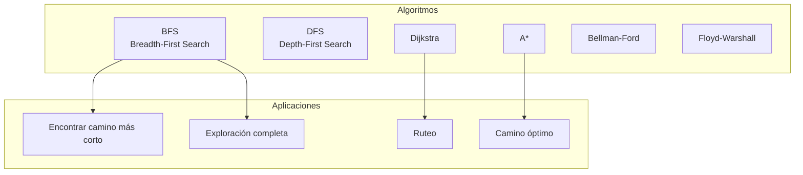
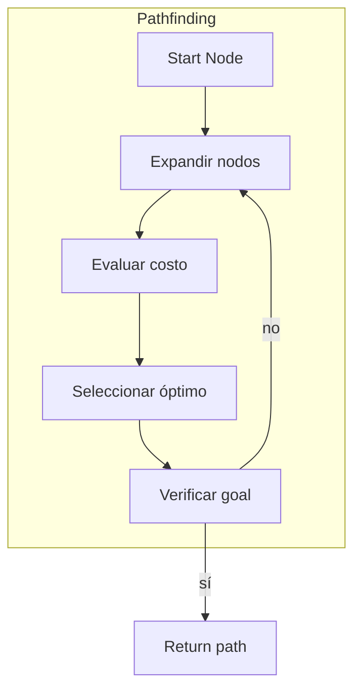
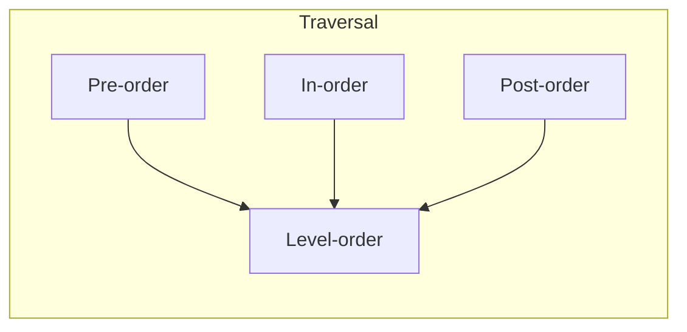

# Clase 15: Razonamiento de Múltiples Saltos

## Duración
**4 horas (240 minutos)**

---

## Objetivos de Aprendizaje

Al finalizar esta clase, el estudiante será capaz de:

1. **Comprender** los algoritmos de búsqueda en grafos para razonamiento multi-salto
2. **Implementar** pathfinding para问答 (Q&A) basado en grafos
3. **Aplicar** algoritmos de graph traversal para navegación de conocimiento
4. **Optimizar** consultas en grafos grandes
5. **Utilizar** NetworkX para análisis de grafos en Python
6. **Diseñar** sistemas de respuesta que requieran múltiples inferencias

---

## Contenidos Detallados

### 1.1 Fundamentos de Búsqueda en Grafos (45 minutos)

#### 1.1.1 Algoritmos de Búsqueda en Grafos

Los algoritmos de búsqueda son fundamentales para el razonamiento multi-salto en grafos de conocimiento. Permiten encontrar caminos, shortest paths, y navegar estructuras complejas.



#### 1.1.2 BFS (Breadth-First Search)

BFS explora todos los nodos a una distancia k antes de mover a distancia k+1. Es óptimo para encontrar el camino más corto en grafos no ponderados.

```python
"""
Implementación de BFS para grafos
==================================
"""

from collections import deque
from typing import List, Dict, Set, Tuple

class GraphSearch:
    """Clase para algoritmos de búsqueda en grafos"""
    
    def __init__(self, graph: Dict):
        """
        Inicializar con un grafo en formato diccionario
        graph = {
            'nodo1': ['nodo2', 'nodo3'],
            'nodo2': ['nodo1', 'nodo4'],
            ...
        }
        """
        self.graph = graph
    
    def bfs(self, start: str, goal: str) -> Tuple[List[str], Set[str]]:
        """
        BFS para encontrar camino más corto
        Retorna: (camino, nodos visitados)
        """
        if start == goal:
            return [start], {start}
        
        visited = {start}
        queue = deque([(start, [start])])
        
        while queue:
            current, path = queue.popleft()
            
            for neighbor in self.graph.get(current, []):
                if neighbor == goal:
                    return path + [neighbor], visited
                
                if neighbor not in visited:
                    visited.add(neighbor)
                    queue.append((neighbor, path + [neighbor]))
        
        return [], visited  # No se encontró camino
    
    def bfs_levels(self, start: str, max_depth: int = 3) -> Dict[int, List[str]]:
        """
        BFS que agrupa nodos por nivel de profundidad
        """
        levels = {0: [start]}
        visited = {start}
        queue = deque([(start, 0)])
        
        while queue:
            current, depth = queue.popleft()
            
            if depth >= max_depth:
                continue
            
            for neighbor in self.graph.get(current, []):
                if neighbor not in visited:
                    visited.add(neighbor)
                    
                    if depth + 1 not in levels:
                        levels[depth + 1] = []
                    levels[depth + 1].append(neighbor)
                    
                    queue.append((neighbor, depth + 1))
        
        return levels
    
    def bfs_all_paths(self, start: str, goal: str, max_length: int = 5) -> List[List[str]]:
        """
        Encontrar todos los caminos entre start y goal
        """
        paths = []
        
        def dfs(current: str, path: List[str], visited: Set[str]):
            if current == goal:
                paths.append(path)
                return
            
            if len(path) >= max_length:
                return
            
            for neighbor in self.graph.get(current, []):
                if neighbor not in visited:
                    visited.add(neighbor)
                    dfs(neighbor, path + [neighbor], visited - {neighbor})
        
        dfs(start, [start], {start})
        return paths


# Ejemplo de uso
graph = {
    'Juan': ['María', 'Pedro', 'Empresa'],
    'María': ['Juan', 'Ana', 'Empresa'],
    'Pedro': ['Juan', 'Luis', 'Empresa'],
    'Ana': ['María', 'Luis'],
    'Luis': ['Pedro', 'Ana'],
    'Empresa': ['Juan', 'María', 'Pedro']
}

search = GraphSearch(graph)

# Encontrar camino de Juan a Ana
path, visited = search.bfs('Juan', 'Ana')
print(f"Camino más corto Juan -> Ana: {path}")
print(f"Nodos visitados: {visited}")

# Obtener niveles desde Juan
levels = search.bfs_levels('Juan', max_depth=2)
print(f"\nNiveles desde Juan:")
for level, nodes in levels.items():
    print(f"  Nivel {level}: {nodes}")
```

#### 1.1.3 DFS (Depth-First Search)

DFS explora tan profundo como sea posible antes de backtrack. Útil para encontrar cualquier camino y para exploración completa.

```python
class DFSearch:
    """Implementación de DFS"""
    
    def __init__(self, graph: Dict):
        self.graph = graph
    
    def dfs(self, start: str, goal: str) -> List[str]:
        """
        DFS para encontrar un camino
        """
        visited = set()
        path = []
        
        def dfs_recursive(current: str) -> bool:
            if current == goal:
                path.append(current)
                return True
            
            if current in visited:
                return False
            
            visited.add(current)
            path.append(current)
            
            for neighbor in self.graph.get(current, []):
                if dfs_recursive(neighbor):
                    return True
            
            path.pop()
            return False
        
        if dfs_recursive(start):
            return path
        return []
    
    def dfs_iterative(self, start: str, goal: str) -> List[str]:
        """
        DFS iterativo (evita recursion para grafos grandes)
        """
        stack = [(start, [start])]
        visited = set()
        
        while stack:
            current, path = stack.pop()
            
            if current == goal:
                return path
            
            if current in visited:
                continue
            
            visited.add(current)
            
            for neighbor in self.graph.get(current, []):
                if neighbor not in visited:
                    stack.append((neighbor, path + [neighbor]))
        
        return []
    
    def find_all_connected_components(self) -> List[List[str]]:
        """
        Encontrar todas las componentes conexas
        """
        visited = set()
        components = []
        
        def dfs_component(node: str, component: List[str]):
            visited.add(node)
            component.append(node)
            
            for neighbor in self.graph.get(node, []):
                if neighbor not in visited:
                    dfs_component(neighbor, component)
        
        for node in self.graph:
            if node not in visited:
                component = []
                dfs_component(node, component)
                components.append(component)
        
        return components


# Ejemplo de uso
search = DFSearch(graph)

# Encontrar camino
path = search.dfs('Juan', 'Ana')
print(f"Camino DFS Juan -> Ana: {path}")

# Encontrar componentes conexas
components = search.find_all_connected_components()
print(f"Componentes conexas: {components}")
```

---

### 2.1 Pathfinding para Q&A (60 minutos)

#### 2.1.1 Algoritmos de Camino Más Corto



#### 2.1.2 Algoritmo de Dijkstra

Dijkstra encuentra el camino más corto en grafos ponderados. Es la base para muchos sistemas de recomendación y navegación de conocimiento.

```python
"""
Implementación de Dijkstra para grafos ponderados
=================================================
"""

import heapq
from typing import List, Dict, Tuple, Optional

class WeightedGraphSearch:
    """Búsqueda en grafos ponderados"""
    
    def __init__(self, weighted_graph: Dict):
        """
        weighted_graph = {
            'A': [('B', 5), ('C', 3)],
            'B': [('A', 5), ('C', 2), ('D', 1)],
            ...
        }
        """
        self.graph = weighted_graph
    
    def dijkstra(self, start: str, goal: str) -> Tuple[List[str], float]:
        """
        Algoritmo de Dijkstra para camino más corto ponderado
        Retorna: (camino, costo total)
        """
        # Cola de prioridad: (costo, nodo, camino)
        heap = [(0, start, [start])]
        visited = set()
        
        while heap:
            cost, current, path = heapq.heappop(heap)
            
            if current in visited:
                continue
            
            visited.add(current)
            
            if current == goal:
                return path, cost
            
            for neighbor, weight in self.graph.get(current, []):
                if neighbor not in visited:
                    new_cost = cost + weight
                    new_path = path + [neighbor]
                    heapq.heappush(heap, (new_cost, neighbor, new_path))
        
        return [], float('inf')
    
    def dijkstra_all(self, start: str) -> Dict[str, Tuple[List[str], float]]:
        """
        Dijkstra hacia todos los nodos
        """
        distances = {start: ([start], 0)}
        visited = set()
        heap = [(0, start, [start])]
        
        while heap:
            cost, current, path = heapq.heappop(heap)
            
            if current in visited:
                continue
            
            visited.add(current)
            distances[current] = (path, cost)
            
            for neighbor, weight in self.graph.get(current, []):
                if neighbor not in visited:
                    new_cost = cost + weight
                    new_path = path + [neighbor]
                    heapq.heappush(heap, (new_cost, neighbor, new_path))
        
        return distances
    
    def a_star(self, start: str, goal: str, heuristic: Dict[str, float]) -> Tuple[List[str], float]:
        """
        Algoritmo A* con heurística
        heuristic = {'A': 5, 'B': 3, ...} (estimación de costo al goal)
        """
        # Cola: (f_score, g_score, nodo, camino)
        # f = g + h
        h_start = heuristic.get(start, 0)
        heap = [(h_start, 0, start, [start])]
        visited = set()
        
        while heap:
            f, g, current, path = heapq.heappop(heap)
            
            if current in visited:
                continue
            
            visited.add(current)
            
            if current == goal:
                return path, g
            
            for neighbor, weight in self.graph.get(current, []):
                if neighbor not in visited:
                    g_neighbor = g + weight
                    h_neighbor = heuristic.get(neighbor, 0)
                    f_neighbor = g_neighbor + h_neighbor
                    new_path = path + [neighbor]
                    heapq.heappush(heap, (f_neighbor, g_neighbor, neighbor, new_path))
        
        return [], float('inf')
    
    def bellman_ford(self, start: str, goal: str) -> Tuple[List[str], float]:
        """
        Algoritmo de Bellman-Ford para grafos con pesos negativos
        """
        # Inicializar distancias
        distances = {start: 0}
        predecessors = {start: None}
        
        nodes = set()
        for node in self.graph:
            nodes.add(node)
            for neighbor, _ in self.graph[node]:
                nodes.add(neighbor)
        
        # Relajar aristas |V| - 1 veces
        for _ in range(len(nodes) - 1):
            for node in nodes:
                if node not in distances:
                    continue
                
                for neighbor, weight in self.graph.get(node, []):
                    new_distance = distances[node] + weight
                    if neighbor not in distances or new_distance < distances[neighbor]:
                        distances[neighbor] = new_distance
                        predecessors[neighbor] = node
        
        # Verificar ciclos negativos
        for node in nodes:
            for neighbor, weight in self.graph.get(node, []):
                if neighbor in distances and distances[node] + weight < distances[neighbor]:
                    raise ValueError("Ciclo negativo detectado")
        
        # Reconstruir camino
        if goal not in predecessors:
            return [], float('inf')
        
        path = []
        current = goal
        while current is not None:
            path.append(current)
            current = predecessors.get(current)
        
        return path[::-1], distances.get(goal, float('inf'))


# Ejemplo de uso
weighted_graph = {
    'Juan': [('María', 2), ('Pedro', 5), ('Empresa', 10)],
    'María': [('Juan', 2), ('Ana', 3), ('Empresa', 4)],
    'Pedro': [('Juan', 5), ('Luis', 2), ('Empresa', 3)],
    'Ana': [('María', 3), ('Luis', 1)],
    'Luis': [('Pedro', 2), ('Ana', 1)],
    'Empresa': [('Juan', 10), ('María', 4), ('Pedro', 3)]
}

wgs = WeightedGraphSearch(weighted_graph)

# Camino más corto Juan -> Luis
path, cost = wgs.dijkstra('Juan', 'Luis')
print(f"Dijkstra: Juan -> Luis = {path}, costo: {cost}")

# Todas las distancias desde Juan
all_distances = wgs.dijkstra_all('Juan')
print("\nDistancias desde Juan:")
for node, (path, cost) in all_distances.items():
    print(f"  {node}: {cost}")
```

#### 2.1.3 Aplicación a问答 (Q&A)

```python
"""
Sistema de Q&A basado en pathfinding
====================================
"""

from typing import Dict, List, Tuple, Optional

class KnowledgePathFinder:
    """Sistema de razonamiento multi-salto para Q&A"""
    
    def __init__(self, knowledge_graph: Dict, neo4j_driver=None):
        self.graph = knowledge_graph
        self.driver = neo4j_driver
    
    def build_graph_from_kg(self, entities: List[Dict], relations: List[Dict]):
        """
        Construir grafo desde grafo de conocimiento
        """
        self.graph = {}
        
        # Agregar nodos
        for entity in entities:
            node = entity['name']
            if node not in self.graph:
                self.graph[node] = []
        
        # Agregar relaciones
        for relation in relations:
            from_node = relation['from']
            to_node = relation['to']
            rel_type = relation['type']
            
            if from_node not in self.graph:
                self.graph[from_node] = []
            if to_node not in self.graph:
                self.graph[to_node] = []
            
            self.graph[from_node].append((to_node, rel_type))
    
    def find_reasoning_path(self, question: str, source: str, target: str) -> Dict:
        """
        Encontrar camino de razonamiento entre entidades
        """
        search = WeightedGraphSearch(self.graph)
        
        # Convertir relaciones a pesos
        weighted = self._convert_to_weighted()
        
        wgs = WeightedGraphSearch(weighted)
        path, cost = wgs.dijkstra(source, target)
        
        return {
            'path': path,
            'length': len(path) - 1,
            'cost': cost,
            'reasoning_steps': self._explain_path(path)
        }
    
    def _convert_to_weighted(self) -> Dict:
        """Convertir a grafo ponderado"""
        weighted = {}
        
        for node, neighbors in self.graph.items():
            weighted[node] = []
            for neighbor, rel_type in neighbors:
                # Asignar pesos según tipo de relación
                weights = {
                    'WORKS_AT': 1,
                    'KNOWS': 2,
                    'RELATED_TO': 3,
                    'PART_OF': 1
                }
                weight = weights.get(rel_type, 2)
                weighted[node].append((neighbor, weight))
        
        return weighted
    
    def _explain_path(self, path: List[str]) -> List[str]:
        """Generar explicación del camino"""
        explanations = []
        
        for i in range(len(path) - 1):
            from_node = path[i]
            to_node = path[i + 1]
            
            # Encontrar tipo de relación
            rel_type = 'RELATED_TO'
            for neighbor, rt in self.graph.get(from_node, []):
                if neighbor == to_node:
                    rel_type = rt
                    break
            
            explanations.append(f"{from_node} {rel_type} {to_node}")
        
        return explanations
    
    def multi_hop_query(self, start_entity: str, relation_chain: List[str]) -> List[str]:
        """
        Consulta multi-salto: seguir cadena de relaciones
        """
        current = start_entity
        
        for relation in relation_chain:
            found = False
            for neighbor, rel_type in self.graph.get(current, []):
                if rel_type == relation:
                    current = neighbor
                    found = True
                    break
            
            if not found:
                return []
        
        return [current]
    
    def find_intermediate_entities(self, source: str, target: str, max_hops: int = 3) -> List[Dict]:
        """
        Encontrar entidades intermedias entre source y target
        """
        search = DFSearch(self.graph)
        
        all_paths = search.bfs_all_paths(source, target, max_length=max_hops + 1)
        
        results = []
        for path in all_paths:
            if len(path) > 2:  # Tiene nodos intermedios
                results.append({
                    'path': path,
                    'intermediate': path[1:-1],
                    'hops': len(path) - 1
                })
        
        return sorted(results, key=lambda x: x['hops'])


# Ejemplo de uso
kg_entities = [
    {'name': 'Juan', 'type': 'PERSON'},
    {'name': 'María', 'type': 'PERSON'},
    {'name': 'Pedro', 'type': 'PERSON'},
    {'name': 'TechCorp', 'type': 'COMPANY'},
    {'name': 'DataSoft', 'type': 'COMPANY'},
    {'name': 'Madrid', 'type': 'LOCATION'},
]

kg_relations = [
    {'from': 'Juan', 'type': 'WORKS_AT', 'to': 'TechCorp'},
    {'from': 'María', 'type': 'WORKS_AT', 'to': 'TechCorp'},
    {'from': 'Pedro', 'type': 'WORKS_AT', 'to': 'DataSoft'},
    {'from': 'TechCorp', 'type': 'LOCATED_IN', 'to': 'Madrid'},
    {'from': 'DataSoft', 'type': 'LOCATED_IN', 'to': 'Madrid'},
    {'from': 'Juan', 'type': 'KNOWS', 'to': 'María'},
    {'from': 'María', 'type': 'KNOWS', 'to': 'Pedro'},
]

kpf = KnowledgePathFinder({})
kpf.build_graph_from_kg(kg_entities, kg_relations)

# Encontrar camino de razonamiento
result = kpf.find_reasoning_path('¿Quién trabaja en Madrid?', 'Juan', 'Madrid')
print(f"Camino de razonamiento: {result['path']}")
print(f"Pasos: {result['reasoning_steps']}")

# Encontrar entidades intermedias
intermediate = kpf.find_intermediate_entities('Juan', 'Pedro', max_hops=3)
print(f"\nEntidades intermedias: {intermediate}")
```

---

### 3.1 Graph Traversal Algorithms (50 minutos)

#### 3.1.1 Algoritmos de Recorrido



```python
"""
Algoritmos de traversal avanzados
================================
"""

from collections import deque
from typing import List, Dict, Callable, Any

class AdvancedGraphTraversal:
    """Algoritmos avanzados de traversal"""
    
    def __init__(self, graph: Dict):
        self.graph = graph
    
    def topological_sort(self) -> List[str]:
        """
        Ordenamiento topológico (para DAGs)
        """
        in_degree = {node: 0 for node in self.graph}
        
        for node in self.graph:
            for neighbor, _ in self.graph[node]:
                in_degree[neighbor] = in_degree.get(neighbor, 0) + 1
        
        queue = deque([node for node, degree in in_degree.items() if degree == 0])
        result = []
        
        while queue:
            current = queue.popleft()
            result.append(current)
            
            for neighbor, _ in self.graph.get(current, []):
                in_degree[neighbor] -= 1
                if in_degree[neighbor] == 0:
                    queue.append(neighbor)
        
        return result
    
    def find_strongly_connected_components(self) -> List[List[str]]:
        """
        Encontrar componentes fuertemente conexas (Tarjan's algorithm)
        """
        index_counter = [0]
        stack = []
        lowlinks = {}
        index = {}
        on_stack = {}
        sccs = []
        
        def strongconnect(node: str):
            index[node] = index_counter[0]
            lowlinks[node] = index_counter[0]
            index_counter[0] += 1
            stack.append(node)
            on_stack[node] = True
            
            for neighbor, _ in self.graph.get(node, []):
                if neighbor not in index:
                    strongconnect(neighbor)
                    lowlinks[node] = min(lowlinks[node], lowlinks[neighbor])
                elif on_stack.get(neighbor, False):
                    lowlinks[node] = min(lowlinks[node], index[neighbor])
            
            if lowlinks[node] == index[node]:
                scc = []
                while True:
                    w = stack.pop()
                    on_stack[w] = False
                    scc.append(w)
                    if w == node:
                        break
                sccs.append(scc)
        
        for node in self.graph:
            if node not in index:
                strongconnect(node)
        
        return sccs
    
    def bfs_with_distance(self, start: str) -> Dict[str, int]:
        """
        BFS que calcula distancia a cada nodo
        """
        distances = {start: 0}
        queue = deque([start])
        
        while queue:
            current = queue.popleft()
            current_distance = distances[current]
            
            for neighbor, _ in self.graph.get(current, []):
                if neighbor not in distances:
                    distances[neighbor] = current_distance + 1
                    queue.append(neighbor)
        
        return distances
    
    def find_shortest_path_unweighted(self, start: str, goal: str) -> List[str]:
        """
        Encontrar shortest path en grafo no ponderado
        """
        if start == goal:
            return [start]
        
        distances = {start: 0}
        predecessors = {start: None}
        queue = deque([start])
        
        while queue:
            current = queue.popleft()
            
            for neighbor, _ in self.graph.get(current, []):
                if neighbor not in distances:
                    distances[neighbor] = distances[current] + 1
                    predecessors[neighbor] = current
                    queue.append(neighbor)
                    
                    if neighbor == goal:
                        break
        
        # Reconstruir camino
        if goal not in predecessors:
            return []
        
        path = []
        current = goal
        while current is not None:
            path.append(current)
            current = predecessors.get(current)
        
        return path[::-1]
    
    def traverse_with_callback(self, start: str, callback: Callable[[str], Any]):
        """
        Traversar grafo con callback para cada nodo
        """
        visited = set()
        
        def dfs(node: str):
            if node in visited:
                return
            visited.add(node)
            callback(node)
            
            for neighbor, _ in self.graph.get(node, []):
                dfs(neighbor)
        
        dfs(start)
    
    def find_all_reachable_nodes(self, start: str, max_depth: int = None) -> Set[str]:
        """
        Encontrar todos los nodos alcanzables desde start
        """
        reachable = set()
        
        def dfs(node: str, depth: int):
            if max_depth is not None and depth > max_depth:
                return
            
            if node in reachable:
                return
            
            reachable.add(node)
            
            for neighbor, _ in self.graph.get(node, []):
                dfs(neighbor, depth + 1)
        
        dfs(start, 0)
        return reachable


# Ejemplo de uso
traversal_graph = {
    'A': [('B', 'edge'), ('C', 'edge')],
    'B': [('D', 'edge'), ('E', 'edge')],
    'C': [('F', 'edge')],
    'D': [('A', 'edge')],  # Cycle
    'E': [],
    'F': [('A', 'edge')],
}

at = AdvancedGraphTraversal(traversal_graph)

# Orden topológico
# topological = at.topological_sort()
# print(f"Topological: {topological}")

# SCCs
sccs = at.find_strongly_connected_components()
print(f"SCCs: {sccs}")

# Distancias
distances = at.bfs_with_distance('A')
print(f"Distancias desde A: {distances}")
```

#### 3.1.2 Algoritmos de Centralidad

```python
"""
Métricas de centralidad para análisis de grafos
================================================
"""

from collections import deque
from typing import Dict

class CentralityMetrics:
    """Métricas de centralidad"""
    
    def __init__(self, graph: Dict):
        self.graph = graph
    
    def degree_centrality(self) -> Dict[str, float]:
        """
        Centralidad de grado: proporción de nodos conectados
        """
        n = len(self.graph)
        if n <= 1:
            return {node: 0 for node in self.graph}
        
        centrality = {}
        
        for node in self.graph:
            degree = len(self.graph.get(node, []))
            centrality[node] = degree / (n - 1)
        
        return centrality
    
    def betweenness_centrality(self) -> Dict[str, float]:
        """
        Centralidad de intermediación: qué tan frecuente es un nodo en shortest paths
        """
        n = len(self.graph)
        betweenness = {node: 0 for node in self.graph}
        
        for source in self.graph:
            # BFS desde source
            S = []  # Stack de nodos
            P = {node: [] for node in self.graph}  # Predecesores
            sigma = {node: 0 for node in self.graph}
            sigma[source] = 1
            d = {node: -1 for node in self.graph}
            d[source] = 0
            
            queue = deque([source])
            
            while queue:
                v = queue.popleft()
                S.append(v)
                
                for w, _ in self.graph.get(v, []):
                    if d[w] < 0:
                        queue.append(w)
                        d[w] = d[v] + 1
                    
                    if d[w] == d[v] + 1:
                        sigma[w] += sigma[v]
                        P[w].append(v)
            
            # Accumulation
            delta = {node: 0 for node in self.graph}
            
            while S:
                w = S.pop()
                for v in P[w]:
                    delta[v] += (sigma[v] / sigma[w]) * (1 + delta[w])
                
                if w != source:
                    betweenness[w] += delta[w]
        
        # Normalizar
        if n > 2:
            norm_factor = 2 / ((n - 1) * (n - 2))
            for node in betweenness:
                betweenness[node] *= norm_factor
        
        return betweenness
    
    def closeness_centrality(self) -> Dict[str, float]:
        """
        Centralidad de proximidad: qué tan cerca está un nodo de todos los otros
        """
        n = len(self.graph)
        closeness = {}
        
        for node in self.graph:
            # BFS para encontrar distancias a todos los nodos
            distances = self._bfs_distances(node)
            
            total_distance = sum(distances.values())
            
            if total_distance > 0:
                closeness[node] = (n - 1) / total_distance
            else:
                closeness[node] = 0
        
        return closeness
    
    def _bfs_distances(self, start: str) -> Dict[str, int]:
        """BFS que retorna distancias"""
        distances = {start: 0}
        queue = deque([start])
        
        while queue:
            current = queue.popleft()
            
            for neighbor, _ in self.graph.get(current, []):
                if neighbor not in distances:
                    distances[neighbor] = distances[current] + 1
                    queue.append(neighbor)
        
        return distances
    
    def pagerank(self, damping: float = 0.85, max_iterations: int = 100, tol: float = 1e-6) -> Dict[str, float]:
        """
        PageRank algorithm
        """
        n = len(self.graph)
        
        # Inicializar PR evenly
        pr = {node: 1.0 / n for node in self.graph}
        
        # Calcular out-degrees
        out_degree = {node: len(neighbors) for node, neighbors in self.graph.items()}
        
        for iteration in range(max_iterations):
            new_pr = {}
            
            for node in self.graph:
                new_pr[node] = (1 - damping) / n
                
                for neighbor, _ in self.graph.get(node, []):
                    if out_degree[neighbor] > 0:
                        new_pr[node] += damping * pr[neighbor] / out_degree[neighbor]
            
            # Verificar convergencia
            diff = sum(abs(new_pr[node] - pr[node]) for node in self.graph)
            pr = new_pr
            
            if diff < tol:
                break
        
        return pr


# Ejemplo de uso
centrality_graph = {
    'A': [('B', 1), ('C', 1)],
    'B': [('A', 1), ('C', 1)],
    'C': [('A', 1), ('B', 1), ('D', 1)],
    'D': [('C', 1)],
}

cm = CentralityMetrics(centrality_graph)

print("Degree Centrality:", cm.degree_centrality())
print("\nCloseness Centrality:", cm.closeness_centrality())
print("\nPageRank:", cm.pagerank())
```

---

### 4.1 Implementación con NetworkX (45 minutos)

#### 4.1.1 Fundamentos de NetworkX

```python
"""
Fundamentos de NetworkX para análisis de grafos
==============================================
"""

import networkx as nx

# Crear grafo dirigido
G = nx.DiGraph()

# Agregar nodos
G.add_node("Juan", type="person", age=35)
G.add_node("María", type="person", age=28)
G.add_node("TechCorp", type="company")

# Agregar aristas con atributos
G.add_edge("Juan", "TechCorp", relationship="WORKS_AT", since=2020)
G.add_edge("María", "TechCorp", relationship="WORKS_AT", since=2021)
G.add_edge("Juan", "María", relationship="KNOWS", since=2015)

# Propiedades del grafo
print(f"Nodos: {G.number_of_nodes()}")
print(f"Aristas: {G.number_of_edges()}")
print(f"¿Es conexo?: {nx.is_weakly_connected(G)}")

# Obtener información de nodos
print(f"\nInformación de Juan: {G.nodes['Juan']}")
print(f"Información de arista Juan->TechCorp: {G.edges['Juan', 'TechCorp']}")

# Iterar sobre nodos
print("\nTodos los nodos:")
for node in G.nodes:
    print(f"  {node}: {G.nodes[node]}")

# Iterar sobre aristas
print("\nTodas las aristas:")
for u, v, data in G.edges(data=True):
    print(f"  {u} -> {v}: {data}")
```

#### 4.1.2 Algoritmos con NetworkX

```python
"""
Algoritmos usando NetworkX
=========================
"""

import networkx as nx

# Crear grafo de ejemplo
G = nx.Graph()

# Agregar nodos y aristas
edges = [
    ("Juan", "María", {"relationship": "KNOWS"}),
    ("Juan", "Pedro", {"relationship": "KNOWS"}),
    ("María", "Ana", {"relationship": "KNOWS"}),
    ("Pedro", "Ana", {"relationship": "KNOWS"}),
    ("Ana", "Luis", {"relationship": "KNOWS"}),
    ("Luis", "Carmen", {"relationship": "KNOWS"}),
    ("Pedro", "Luis", {"relationship": "WORKS_WITH"}),
]

G.add_edges_from(edges)

# Shortest path
print("=== Shortest Path ===")
path = nx.shortest_path(G, "Juan", "Carmen")
print(f"Juan -> Carmen: {path}")

# Longest shortest path (diameter)
print(f"\nDiámetro: {nx.diameter(G)}")

# Connected components
print(f"\nComponentes conexas: {list(nx.connected_components(G))}")

# Degree centrality
print(f"\nDegree Centrality:")
for node, centrality in nx.degree_centrality(G).items():
    print(f"  {node}: {centrality:.3f}")

# Betweenness centrality
print(f"\nBetweenness Centrality:")
for node, centrality in nx.betweenness_centrality(G).items():
    print(f"  {node}: {centrality:.3f}")

# PageRank
print(f"\nPageRank:")
for node, pr in nx.pagerank(G).items():
    print(f"  {node}: {pr:.3f}")

# Cliques (grafos no direccionales)
print(f"\nMax Cliques: {list(nx.find_cliques(G))}")

# Girvan-Newman (detección de comunidades)
print(f"\nCommunities (Girvan-Newman):")
comp = nx.community.girvan_newman(G)
for communities in comp:
    print(f"  {communities}")
    break  # Solo primer nivel
```

#### 4.1.3 Pathfinding Avanzado con NetworkX

```python
"""
Pathfinding avanzado con NetworkX
=================================
"""

import networkx as nx
import heapq

class NetworkXPathFinder:
    """Pathfinder usando NetworkX"""
    
    def __init__(self):
        self.G = nx.DiGraph()
    
    def add_entities(self, entities: list):
        """Agregar entidades como nodos"""
        for entity in entities:
            self.G.add_node(entity['name'], **entity)
    
    def add_relations(self, relations: list):
        """Agregar relaciones como aristas"""
        for rel in relations:
            self.G.add_edge(
                rel['from'], 
                rel['to'], 
                **rel
            )
    
    def find_path(self, source: str, target: str, 
                  relationship_types: list = None) -> dict:
        """
        Encontrar camino entre entidades
        """
        # Filtrar por tipos de relación si se especifica
        if relationship_types:
            H = self.G.copy()
            edges_to_remove = []
            for u, v, data in H.edges(data=True):
                if data.get('type') not in relationship_types:
                    edges_to_remove.append((u, v))
            for e in edges_to_remove:
                H.remove_edge(*e)
        else:
            H = self.G
        
        try:
            path = nx.shortest_path(H, source, target)
            return {
                'found': True,
                'path': path,
                'length': len(path) - 1
            }
        except nx.NetworkXNoPath:
            return {
                'found': False,
                'path': [],
                'length': float('inf')
            }
    
    def find_all_paths(self, source: str, target: str, 
                       max_length: int = 5) -> list:
        """Encontrar todos los caminos"""
        try:
            paths = list(nx.all_simple_paths(
                self.G, source, target, cutoff=max_length
            ))
            return paths
        except nx.NetworkXNoPath:
            return []
    
    def find_shortest_weighted_path(self, source: str, target: str,
                                    weight_attr: str = 'weight') -> dict:
        """Encontrar camino más corto ponderado"""
        try:
            path = nx.shortest_path(
                self.G, source, target, weight=weight_attr
            )
            length = nx.shortest_path_length(
                self.G, source, target, weight=weight_attr
            )
            return {
                'found': True,
                'path': path,
                'length': len(path) - 1,
                'cost': length
            }
        except nx.NetworkXNoPath:
            return {
                'found': False,
                'path': [],
                'cost': float('inf')
            }
    
    def dijkstra_path_with_types(self, source: str, target: str,
                                 allowed_types: list) -> list:
        """Dijkstra solo considerando ciertos tipos de relación"""
        # Crear subgrafo filtrado
        H = nx.DiGraph()
        
        for u, v, data in self.G.edges(data=True):
            if data.get('type') in allowed_types:
                weight = data.get('weight', 1)
                H.add_edge(u, v, weight=weight)
        
        try:
            return nx.dijkstra_path(H, source, target)
        except nx.NetworkXNoPath:
            return []
    
    def find_ego_network(self, node: str, depth: int = 1) -> nx.Graph:
        """Encontrar red ego de un nodo"""
        return nx.ego_graph(self.G, node, radius=depth)
    
    def find_communities(self) -> list:
        """Encontrar comunidades usando Louvain"""
        try:
            communities = nx.community.louvain_communities(self.G)
            return [set(c) for c in communities]
        except:
            return []
    
    def get_node_importance(self) -> dict:
        """Obtener importancia de nodos (PageRank + Centrality)"""
        importance = {}
        
        # PageRank
        pagerank = nx.pagerank(self.G)
        
        # Degree centrality
        degree_cent = nx.degree_centrality(self.G)
        
        # Betweenness
        betweenness = nx.betweenness_centrality(self.G)
        
        # Combinar
        for node in self.G.nodes():
            importance[node] = {
                'pagerank': pagerank.get(node, 0),
                'degree': degree_cent.get(node, 0),
                'betweenness': betweenness.get(node, 0)
            }
        
        return importance


# Ejemplo de uso
finder = NetworkXPathFinder()

# Agregar entidades
entities = [
    {'name': 'Juan', 'type': 'PERSON'},
    {'name': 'María', 'type': 'PERSON'},
    {'name': 'Pedro', 'type': 'PERSON'},
    {'name': 'TechCorp', 'type': 'COMPANY'},
    {'name': 'Madrid', 'type': 'LOCATION'},
]

finder.add_entities(entities)

# Agregar relaciones
relations = [
    {'from': 'Juan', 'to': 'TechCorp', 'type': 'WORKS_AT', 'weight': 1},
    {'from': 'María', 'to': 'TechCorp', 'type': 'WORKS_AT', 'weight': 1},
    {'from': 'Pedro', 'to': 'TechCorp', 'type': 'WORKS_AT', 'weight': 1},
    {'from': 'TechCorp', 'to': 'Madrid', 'type': 'LOCATED_IN', 'weight': 2},
    {'from': 'Juan', 'to': 'María', 'type': 'KNOWS', 'weight': 1},
    {'from': 'María', 'to': 'Pedro', 'type': 'KNOWS', 'weight': 1},
]

finder.add_relations(relations)

# Encontrar camino Juan -> Madrid
result = finder.find_path('Juan', 'Madrid')
print(f"Camino Juan -> Madrid: {result}")

# Encontrar todos los caminos Juan -> Pedro
all_paths = finder.find_all_paths('Juan', 'Pedro', max_length=3)
print(f"Todos los caminos Juan -> Pedro: {all_paths}")

# Encontrar comunidades
communities = finder.find_communities()
print(f"Comunidades: {communities}")
```

---

### 5.1 Sistema de Razonamiento Multi-salto (30 minutos)

#### 5.1.1 Implementación Completa

```python
"""
Sistema de razonamiento multi-salto para Q&A
============================================
"""

from typing import List, Dict, Tuple
import networkx as nx

class MultiHopReasoningSystem:
    """Sistema de razonamiento multi-salto"""
    
    def __init__(self):
        self.kg = nx.MultiDiGraph()
        self.entity_index = {}
    
    def load_knowledge_graph(self, data: Dict):
        """
        Cargar grafo de conocimiento
        """
        # Agregar entidades
        for entity in data.get('entities', []):
            self.kg.add_node(
                entity['name'],
                type=entity.get('type', 'ENTITY'),
                properties=entity.get('properties', {})
            )
            self.entity_index[entity['name']] = entity
        
        # Agregar relaciones
        for relation in data.get('relations', []):
            self.kg.add_edge(
                relation['from'],
                relation['to'],
                type=relation.get('type', 'RELATED_TO'),
                properties=relation.get('properties', {})
            )
    
    def query(self, question: str, source: str, target: str, 
              max_hops: int = 3) -> Dict:
        """
        Procesar consulta multi-salto
        """
        # Determinar tipo de consulta
        query_type = self.classify_query(question)
        
        if query_type == 'direct':
            return self._direct_query(source, target)
        elif query_type == 'multi_hop':
            return self._multi_hop_query(source, target, max_hops)
        elif query_type == 'aggregation':
            return self._aggregation_query(source, target)
        else:
            return {'error': 'Tipo de consulta no reconocido'}
    
    def classify_query(self, question: str) -> str:
        """Clasificar tipo de consulta"""
        q = question.lower()
        
        if any(word in q for word in ['quién', 'quien', 'qué', 'what']):
            return 'direct'
        elif any(word in q for word in ['relacionado', 'conectado', 'through']):
            return 'multi_hop'
        elif any(word in q for word in ['cuántos', 'todos', 'total']):
            return 'aggregation'
        
        return 'direct'
    
    def _direct_query(self, source: str, target: str) -> Dict:
        """Consulta directa"""
        try:
            path = nx.shortest_path(self.kg, source, target)
            return {
                'type': 'direct',
                'path': path,
                'length': len(path) - 1,
                'reasoning': self._explain_path(path)
            }
        except nx.NetworkXNoPath:
            return {
                'type': 'direct',
                'found': False,
                'message': f'No hay camino de {source} a {target}'
            }
    
    def _multi_hop_query(self, source: str, target: str, max_hops: int) -> Dict:
        """Consulta multi-salto"""
        try:
            all_paths = list(nx.all_simple_paths(
                self.kg, source, target, cutoff=max_hops
            ))
            
            # Filtrar paths válidos
            valid_paths = [p for p in all_paths if len(p) <= max_hops + 1]
            
            if not valid_paths:
                # Intentar con más saltos
                all_paths = list(nx.all_simple_paths(
                    self.kg, source, target
                ))
                valid_paths = all_paths[:10]  # Limitar a 10
            
            return {
                'type': 'multi_hop',
                'paths': valid_paths,
                'count': len(valid_paths),
                'best_path': min(valid_paths, key=len) if valid_paths else [],
                'reasoning': [self._explain_path(p) for p in valid_paths[:3]]
            }
        except nx.NetworkXNoPath:
            return {
                'type': 'multi_hop',
                'found': False,
                'message': 'No se encontró ningún camino'
            }
    
    def _aggregation_query(self, source: str, target: str) -> Dict:
        """Consulta de agregación"""
        # Encontrar todos los nodos relacionados
        descendants = nx.descendants(self.kg, source)
        
        return {
            'type': 'aggregation',
            'source': source,
            'related_nodes': list(descendants),
            'count': len(descendants)
        }
    
    def _explain_path(self, path: List[str]) -> List[str]:
        """Generar explicación del camino"""
        explanations = []
        
        for i in range(len(path) - 1):
            from_node = path[i]
            to_node = path[i + 1]
            
            # Obtener tipo de relación
            edge_data = self.kg.get_edge_data(from_node, to_node)
            if edge_data:
                rel_type = list(edge_data.values())[0].get('type', 'RELATED_TO')
                explanations.append(f"{from_node} -{rel_type}-> {to_node}")
        
        return explanations
    
    def find_intermediate_entities(self, source: str, target: str) -> List[Dict]:
        """Encontrar entidades intermedias"""
        intermediate = []
        
        for source_node in self.kg.successors(source):
            for target_node in self.kg.predecessors(target):
                if nx.has_path(self.kg, source_node, target_node):
                    intermediate.append({
                        'entity': source_node,
                        'type': self.kg.nodes[source_node].get('type', 'UNKNOWN')
                    })
        
        return intermediate


# Ejemplo de uso
kg_data = {
    'entities': [
        {'name': 'Juan', 'type': 'PERSON'},
        {'name': 'María', 'type': 'PERSON'},
        {'name': 'Pedro', 'type': 'PERSON'},
        {'name': 'TechCorp', 'type': 'COMPANY'},
        {'name': 'Madrid', 'type': 'LOCATION'},
    ],
    'relations': [
        {'from': 'Juan', 'to': 'María', 'type': 'KNOWS'},
        {'from': 'Juan', 'to': 'Pedro', 'type': 'KNOWS'},
        {'from': 'María', 'to': 'TechCorp', 'type': 'WORKS_AT'},
        {'from': 'Pedro', 'to': 'TechCorp', 'type': 'WORKS_AT'},
        {'from': 'TechCorp', 'to': 'Madrid', 'type': 'LOCATED_IN'},
    ]
}

system = MultiHopReasoningSystem()
system.load_knowledge_graph(kg_data)

# Consulta
result = system.query('¿Quién trabaja en Madrid?', 'Juan', 'Madrid')
print(f"Resultado: {result}")
```

---

## Resumen de Puntos Clave

### Algoritmos de Búsqueda
1. **BFS**: Óptimo para caminos no ponderados, nivel por nivel
2. **DFS**: Exploración profunda, uso de memoria menor
3. **Dijkstra**: Caminos más cortos ponderados
4. **A***: Dijkstra con heurística, más eficiente

### Pathfinding para Q&A
1. **Construcción de grafo**:Desde tripletas a estructura navegable
2. **Búsqueda de camino**: Encontrar relaciones entre entidades
3. **Explicación**: Generar reasoning steps
4. **Multi-saltos**:Consultas que requieren múltiples inferencias

### Métricas de Centralidad
1. **Degree**: Cantidad de conexiones
2. **Betweenness**: Frecuencia en shortest paths
3. **Closeness**: Proximidad a otros nodos
4. **PageRank**: Importancia basada en recursión

### NetworkX
1. **Creación de grafos**: Directed, Undirected, Multi
2. **Algoritmos integrados**: Shortest path, centralidad, comunidades
3. **Visualización**: Para debugging y análisis

---

## Tecnologías y Herramientas Específicas

| Tecnología | Propósito |
|------------|-----------|
| NetworkX | Análisis de grafos en Python |
| Neo4j | Base de datos de grafos |
| Python | Implementación de algoritmos |
| HeapQ | Cola de prioridad para Dijkstra |

---

## Referencias Externas

1. **NetworkX Documentation**
   - URL: https://networkx.org/documentation/
   - Descripción: Documentación oficial

2. **Graph Theory Basics**
   - URL: https://en.wikipedia.org/wiki/Graph_theory
   - Descripción: Fundamentos de teoría de grafos

3. **Shortest Path Algorithms**
   - URL: https://en.wikipedia.org/wiki/Shortest_path_problem
   - Descripción: Algoritmos de camino más corto

4. **A* Algorithm**
   - URL: https://en.wikipedia.org/wiki/A*_search_algorithm
   - Descripción: Algoritmo A*

---

## Ejercicios Prácticos

### Ejercicio 1: Sistema de Razonamiento Organizacional

```python
"""
Sistema de razonamiento organizacional multi-salto
=================================================
"""

import networkx as nx

class OrgReasoning:
    """Sistema de razonamiento organizacional"""
    
    def __init__(self):
        self.G = nx.DiGraph()
    
    def load_org_data(self, employees: list, org_chart: list):
        """Cargar datos organizacionales"""
        for emp in employees:
            self.G.add_node(emp['name'], **emp)
        
        for rel in org_chart:
            self.G.add_edge(rel['from'], rel['to'], **rel)
    
    def find_manager_chain(self, employee: str) -> list:
        """Encontrar cadena de managers hasta CEO"""
        path = [employee]
        current = employee
        
        while True:
            successors = list(self.G.successors(current))
            managers = [s for s in successors 
                       if self.G.nodes[s].get('type') == 'MANAGER']
            
            if not managers:
                break
            
            current = managers[0]
            path.append(current)
        
        return path
    
    def find_peers(self, employee: str) -> list:
        """Encontrar compañeros (mismo nivel, mismo manager)"""
        manager = None
        for s in self.G.successors(employee):
            if self.G.nodes[s].get('type') == 'MANAGER':
                manager = s
                break
        
        if not manager:
            return []
        
        # Encontrar otros reportando al mismo manager
        peers = []
        for s in self.G.predecessors(manager):
            if s != employee:
                peers.append(s)
        
        return peers


# Datos de ejemplo
employees = [
    {'name': 'CEO', 'type': 'CEO', 'title': 'CEO'},
    {'name': 'CTO', 'type': 'MANAGER', 'title': 'CTO'},
    {'name': 'CFO', 'type': 'MANAGER', 'title': 'CFO'},
    {'name': 'Dev1', 'type': 'EMPLOYEE', 'title': 'Desarrollador'},
    {'name': 'Dev2', 'type': 'EMPLOYEE', 'title': 'Desarrollador'},
]

org_chart = [
    {'from': 'CEO', 'to': 'CTO'},
    {'from': 'CEO', 'to': 'CFO'},
    {'from': 'CTO', 'to': 'Dev1'},
    {'from': 'CTO', 'to': 'Dev2'},
]

org = OrgReasoning()
org.load_org_data(employees, org_chart)

print("Cadena de manager Dev1:", org.find_manager_chain('Dev1'))
print("Compañeros de Dev1:", org.find_peers('Dev1'))
```

### Ejercicio 2: Sistema de Recomendación

```python
"""
Sistema de recomendación basado en grafos
========================================
"""

class GraphRecommender:
    """Sistema de recomendación basado en pathfinding"""
    
    def __init__(self):
        self.G = nx.Graph()
    
    def add_user(self, user_id: str, interests: list):
        """Agregar usuario"""
        self.G.add_node(user_id, type='USER', interests=interests)
    
    def add_item(self, item_id: str, category: str):
        """Agregar item"""
        self.G.add_node(item_id, type='ITEM', category=category)
    
    def add_interaction(self, user_id: str, item_id: str, rating: float):
        """Agregar interacción usuario-item"""
        self.G.add_edge(user_id, item_id, rating=rating)
    
    def add_similarity(self, item1: str, item2: str, score: float):
        """Agregar similitud entre items"""
        self.G.add_edge(item1, item2, similarity=score)
    
    def recommend_items(self, user_id: str, n: int = 5) -> list:
        """Recomendar items para usuario"""
        # Encontrar items que el usuario no ha visto
        user_items = set(self.G.neighbors(user_id))
        
        # Encontrar items similares a los que el usuario vio
        recommendations = {}
        
        for item in user_items:
            similar_items = self.G.neighbors(item)
            
            for sim_item in similar_items:
                if sim_item not in user_items:
                    edge_data = self.G.get_edge_data(item, sim_item)
                    if edge_data and 'similarity' in edge_data:
                        score = edge_data['similarity']
                        recommendations[sim_item] = recommendations.get(sim_item, 0) + score
        
        # Ordenar por score
        sorted_recs = sorted(recommendations.items(), key=lambda x: x[1], reverse=True)
        
        return [item for item, score in sorted_recs[:n]]


# Ejemplo de uso
rec = GraphRecommender()

rec.add_user('user1', ['technology', 'science'])
rec.add_item('item1', 'technology')
rec.add_item('item2', 'science')
rec.add_item('item3', 'technology')
rec.add_item('item4', 'sports')

rec.add_interaction('user1', 'item1', 5)
rec.add_interaction('user1', 'item2', 4)

rec.add_similarity('item1', 'item3', 0.9)
rec.add_similarity('item2', 'item3', 0.3)

print("Recomendaciones para user1:", rec.recommend_items('user1'))
```

---

**Fin de la Clase 15**
