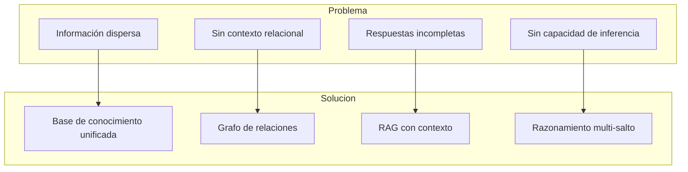
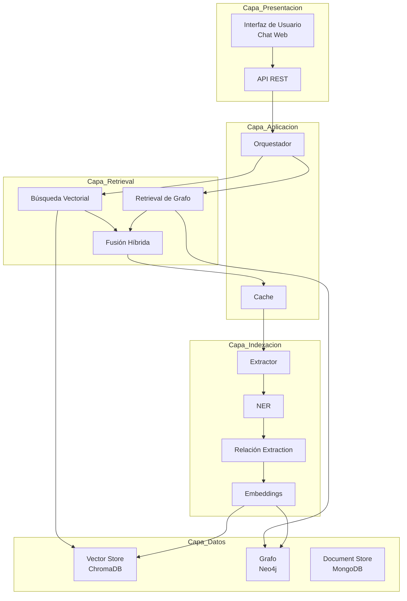
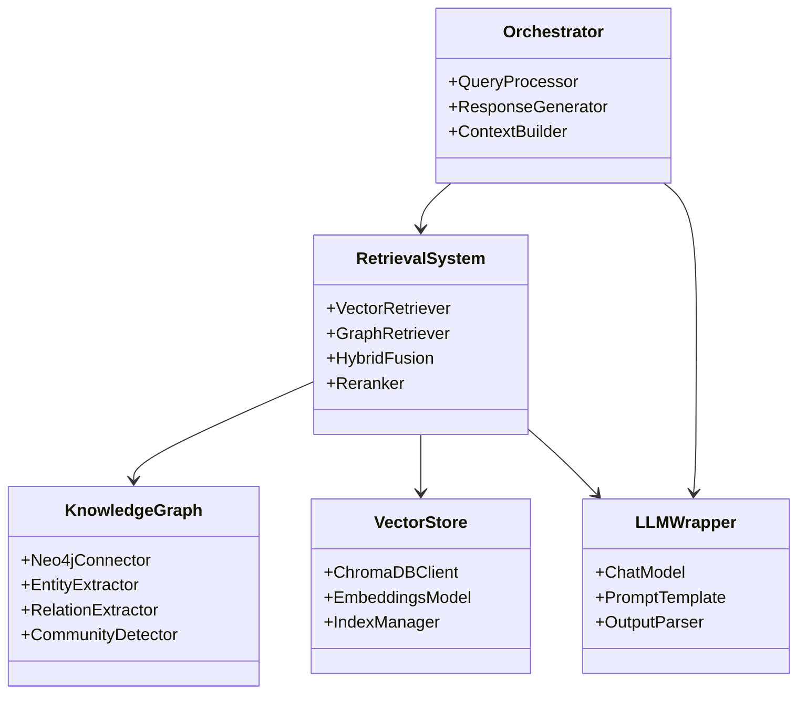
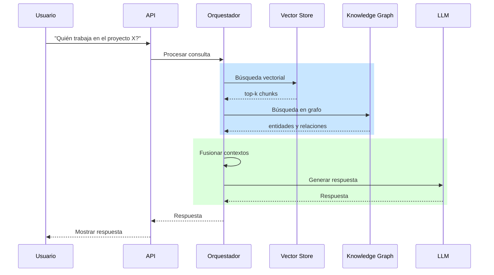
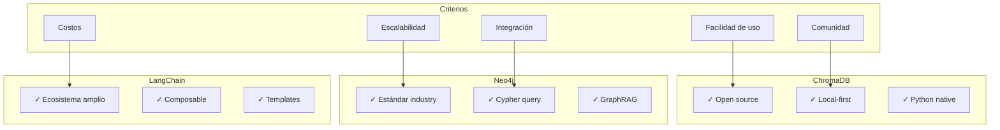

# Clase 16: Proyecto RAG + Grafos - Parte 1

## Duración
**4 horas (240 minutos)**

---

## Objetivos de Aprendizaje

Al finalizar esta clase, el estudiante será capaz de:

1. **Diseñar** una arquitectura completa para un sistema RAG con Grafos de Conocimiento
2. **Seleccionar** las tecnologías apropiadas según los requisitos del proyecto
3. **Planificar** la implementación de un pipeline de datos
4. **Estructurar** el código de manera modular y mantenible
5. **Implementar** un prototype del sistema propuesto
6. **Documentar** las decisiones de diseño

---

## Contenidos Detallados

### 1.1 Análisis de Requisitos del Proyecto (45 minutos)

#### 1.1.1 Definición del Problema

Para este proyecto, trabajaremos en un **Sistema de Gestión de Conocimiento Empresarial (EKMS)** que permita a los empleados consultar información sobre la empresa, políticas, proyectos y empleados de manera natural.



#### 1.1.2 Requisitos Funcionales

| ID | Requisito | Descripción |
|----|-----------|-------------|
| RF-01 | Consulta de políticas | El sistema debe poder responder preguntas sobre políticas empresariales |
| RF-02 | Información de empleados | Consultar información sobre empleados y estructura organizacional |
| RF-03 | Proyectos | Consultar detalles de proyectos y participantes |
| RF-04 | Búsqueda semántica | Búsqueda por contenido similar semánticamente |
| RF-05 | Razonamiento | Responder preguntas que requieren múltiples saltos |
| RF-06 | Contexto relacional | Proporcionar información relacionada automáticamente |

#### 1.1.3 Requisitos No Funcionales

| ID | Requisito | Meta |
|----|-----------|-----|
| RNF-01 | Latencia | Tiempo de respuesta < 3 segundos |
| RNF-02 | Precisión | Precisión de retrieval > 80% |
| RNF-03 | Disponibilidad | Sistema disponible 99.5% del tiempo |
| RNF-04 | Escalabilidad | Soportar hasta 10,000 documentos |

---

### 2.1 Diseño de Arquitectura (60 minutos)

#### 2.1.1 Arquitectura de Alto Nivel



#### 2.1.2 Componentes de la Arquitectura



#### 2.1.3 Flujo de Datos



---

### 3.1 Selección de Tecnologías (50 minutos)

#### 3.1.1 Matriz de Decisión

| Componente | Opción 1 | Opción 2 | Opción 3 | Selección |
|------------|----------|----------|----------|-----------|
| **Vector Store** | Pinecone | ChromaDB | Weaviate | ChromaDB |
| **Graph DB** | Neo4j | ArangoDB | Amazon Neptune | Neo4j |
| **LLM** | OpenAI GPT-4 | Anthropic Claude | Local (Llama) | OpenAI GPT-4 |
| **Embeddings** | OpenAI ADA | HuggingFace | Cohere | OpenAI ADA |
| **Framework** | LangChain | LlamaIndex | Custom | LangChain |
| **Doc Store** | MongoDB | PostgreSQL | Redis | MongoDB |
| **Cache** | Redis | Memcached | In-memory | Redis |

#### 3.1.2 Justificación de Selección



---

### 4.1 Implementación del Pipeline (60 minutos)

#### 4.1.1 Estructura del Proyecto

```python
"""
Estructura del Proyecto RAG + Grafos
=====================================
"""

project_structure = """
enterprise-knowledge-system/
├── src/
│   ├── __init__.py
│   ├── config/
│   │   ├── __init__.py
│   │   ├── settings.py           # Configuración global
│   │   └── prompts.py             # Templates de prompts
│   │
│   ├── data/
│   │   ├── __init__.py
│   │   ├── connectors/
│   │   │   ├── __init__.py
│   │   │   ├── neo4j_connector.py
│   │   │   ├── chroma_connector.py
│   │   │   └── mongo_connector.py
│   │   └── models/
│   │       ├── __init__.py
│   │       └── schemas.py         # Modelos de datos
│   │
│   ├── retrieval/
│   │   ├── __init__.py
│   │   ├── vector_retriever.py
│   │   ├── graph_retriever.py
│   │   ├── hybrid_fusion.py
│   │   └── reranker.py
│   │
│   ├── processing/
│   │   ├── __init__.py
│   │   ├── extractor.py           # Extracción de entidades
│   │   ├── embedder.py            # Generación de embeddings
│   │   └── indexer.py             # Indexación
│   │
│   ├── generation/
│   │   ├── __init__.py
│   │   ├── llm_wrapper.py
│   │   ├── prompt_builder.py
│   │   └── response_formatter.py
│   │
│   ├── orchestration/
│   │   ├── __init__.py
│   │   ├── query_processor.py
│   │   └── pipeline.py
│   │
│   └── api/
│       ├── __init__.py
│       ├── routes.py
│       └── main.py
│
├── tests/
│   ├── __init__.py
│   ├── test_retrieval.py
│   ├── test_processing.py
│   └── test_integration.py
│
├── data/
│   ├── documents/                # Documentos fuente
│   └── models/                   # Modelos guardados
│
├── scripts/
│   ├── init_db.py               # Inicializar bases de datos
│   ├── load_data.py              # Cargar datos iniciales
│   └── run_indexing.py           # Ejecutar indexación
│
├── notebooks/
│   └── exploration.ipynb        # Jupyter notebooks
│
├── requirements.txt
├── docker-compose.yml
├── README.md
└── .env.example
"""
```

#### 4.1.2 Configuración Centralizada

```python
"""
src/config/settings.py
======================
"""

from pydantic_settings import BaseSettings
from typing import Optional
import os
from functools import lru_cache


class Settings(BaseSettings):
    """Configuración global del proyecto"""
    
    # Configuración de aplicación
    app_name: str = "Enterprise Knowledge System"
    debug: bool = True
    environment: str = "development"
    
    # Neo4j
    neo4j_uri: str = "bolt://localhost:7687"
    neo4j_user: str = "neo4j"
    neo4j_password: str = "password"
    neo4j_database: str = "neo4j"
    
    # ChromaDB
    chroma_persist_directory: str = "./data/chroma"
    
    # MongoDB
    mongo_uri: str = "mongodb://localhost:27017"
    mongo_database: str = "enterprise_kb"
    
    # Redis
    redis_host: str = "localhost"
    redis_port: int = 6379
    
    # OpenAI
    openai_api_key: str = ""
    openai_model: str = "gpt-4"
    openai_embedding_model: str = "text-embedding-ada-002"
    
    # Retrieval
    top_k_vectors: int = 10
    top_k_graph: int = 5
    fusion_k: int = 10
    
    # RAG
    max_context_length: int = 4000
    temperature: float = 0.0
    
    class Config:
        env_file = ".env"
        case_sensitive = False


@lru_cache()
def get_settings() -> Settings:
    """Obtener configuración cacheada"""
    return Settings()
```

#### 4.1.3 Conectores de Base de Datos

```python
"""
src/data/connectors/neo4j_connector.py
=====================================
"""

from neo4j import GraphDatabase
from typing import List, Dict, Optional, Any
import logging

logger = logging.getLogger(__name__)


class Neo4jConnector:
    """Conector para Neo4j"""
    
    def __init__(self, uri: str, user: str, password: str, database: str = "neo4j"):
        self.uri = uri
        self.user = user
        self.password = password
        self.database = database
        self.driver = None
    
    def connect(self):
        """Establecer conexión"""
        try:
            self.driver = GraphDatabase.driver(
                self.uri, 
                auth=(self.user, self.password)
            )
            logger.info("✓ Conexión a Neo4j establecida")
        except Exception as e:
            logger.error(f"✗ Error al conectar a Neo4j: {e}")
            raise
    
    def close(self):
        """Cerrar conexión"""
        if self.driver:
            self.driver.close()
            logger.info("✓ Conexión a Neo4j cerrada")
    
    def verify_connectivity(self) -> bool:
        """Verificar conectividad"""
        try:
            with self.driver.session() as session:
                result = session.run("RETURN 1 AS n")
                return result.single() is not None
        except:
            return False
    
    def execute_query(self, query: str, parameters: Dict = None) -> List[Dict]:
        """Ejecutar consulta Cypher"""
        with self.driver.session() as session:
            result = session.run(query, parameters or {})
            return [dict(record) for record in result]
    
    def create_entity(self, label: str, properties: Dict) -> Dict:
        """Crear entidad"""
        query = f"""
        MERGE (e:{label} {{name: $name}})
        SET e += $props
        RETURN e
        """
        with self.driver.session() as session:
            result = session.run(query, {"name": properties.get("name"), "props": properties})
            return dict(result.single())
    
    def create_relation(self, from_entity: str, to_entity: str, 
                       relation_type: str, properties: Dict = None) -> bool:
        """Crear relación"""
        query = f"""
        MATCH (e1 {{name: $from}})
        MATCH (e2 {{name: $to}})
        MERGE (e1)-[r:{relation_type}]->(e2)
        """
        if properties:
            query += " SET r += $props"
        
        with self.driver.session() as session:
            session.run(query, {"from": from_entity, "to": to_entity, "props": properties or {}})
            return True
    
    def find_entity(self, name: str, label: str = None) -> Optional[Dict]:
        """Encontrar entidad por nombre"""
        if label:
            query = f"MATCH (e:{label} {{name: $name}}) RETURN e"
        else:
            query = "MATCH (e {name: $name}) RETURN e"
        
        with self.driver.session() as session:
            result = session.run(query, {"name": name})
            record = result.single()
            return dict(record["e"]) if record else None
    
    def find_related_entities(self, entity_name: str, 
                              relation_type: str = None, 
                              depth: int = 1) -> List[Dict]:
        """Encontrar entidades relacionadas"""
        rel_pattern = f"-[:{relation_type}*1..{depth}]->" if relation_type else f"-[*1..{depth}]->"
        query = f"""
        MATCH (e {{name: $name}}){rel_pattern}(related)
        RETURN DISTINCT related
        """
        
        with self.driver.session() as session:
            result = session.run(query, {"name": entity_name, "depth": depth})
            return [dict(record["related"]) for record in result]
    
    def get_entity_neighbors(self, entity_name: str, 
                            max_distance: int = 2) -> Dict[str, List]:
        """Obtener vecinos con distancias"""
        query = f"""
        MATCH path = (e {{name: $name}})-[r*1..{max_distance}]-(neighbor)
        WITH path, neighbor, LENGTH(path) AS distance
        ORDER BY distance
        RETURN distance, collect(DISTINCT neighbor.name) AS neighbors
        """
        
        with self.driver.session() as session:
            result = session.run(query, {"name": entity_name, "max_distance": max_distance})
            return {record["distance"]: record["neighbors"] for record in result}
    
    def get_communities(self) -> List[Dict]:
        """Obtener comunidades detectadas"""
        query = """
        MATCH (e:Entity)
        RETURN e.community AS community, collect(e.name) AS entities
        """
        
        with self.driver.session() as session:
            result = session.run(query)
            return [{"community": r["community"], "entities": r["entities"]} for r in result]
    
    def get_stats(self) -> Dict:
        """Obtener estadísticas del grafo"""
        queries = {
            "nodes": "MATCH (n) RETURN count(n) AS count",
            "relationships": "MATCH ()-[r]->() RETURN count(r) AS count",
            "entity_types": "MATCH (n) RETURN labels(n)[0] AS type, count(n) AS count",
        }
        
        stats = {}
        with self.driver.session() as session:
            for key, query in queries.items():
                result = session.run(query)
                if key in ["nodes", "relationships"]:
                    stats[key] = result.single()["count"]
                else:
                    stats[key] = [dict(r) for r in result]
        
        return stats


# Factory function
def create_neo4j_connector(settings) -> Neo4jConnector:
    """Crear conector Neo4j desde configuración"""
    connector = Neo4jConnector(
        uri=settings.neo4j_uri,
        user=settings.neo4j_user,
        password=settings.neo4j_password,
        database=settings.neo4j_database
    )
    connector.connect()
    return connector
```

```python
"""
src/data/connectors/chroma_connector.py
======================================
"""

import chromadb
from chromadb.config import Settings as ChromaSettings
from typing import List, Dict, Optional
import logging

logger = logging.getLogger(__name__)


class ChromaConnector:
    """Conector para ChromaDB"""
    
    def __init__(self, persist_directory: str):
        self.persist_directory = persist_directory
        self.client = None
        self.collection = None
    
    def connect(self):
        """Establecer conexión"""
        try:
            self.client = chromadb.PersistentClient(
                path=self.persist_directory,
                settings=ChromaSettings(
                    anonymized_telemetry=False,
                    allow_reset=True
                )
            )
            logger.info("✓ Conexión a ChromaDB establecida")
        except Exception as e:
            logger.error(f"✗ Error al conectar a ChromaDB: {e}")
            raise
    
    def create_collection(self, name: str, metadata: Dict = None):
        """Crear colección"""
        self.collection = self.client.get_or_create_collection(
            name=name,
            metadata=metadata or {"description": "Default collection"}
        )
        logger.info(f"✓ Colección '{name}' creada/obtenida")
    
    def add_documents(self, ids: List[str], documents: List[str], 
                     metadatas: List[Dict] = None, embeddings: List[List[float]] = None):
        """Agregar documentos"""
        if not self.collection:
            raise ValueError("Colección no inicializada")
        
        self.collection.add(
            ids=ids,
            documents=documents,
            metadatas=metadatas,
            embeddings=embeddings
        )
        logger.info(f"✓ {len(documents)} documentos agregados")
    
    def similarity_search(self, query: str, n: int = 10, 
                         where: Dict = None) -> List[Dict]:
        """Búsqueda por similitud"""
        if not self.collection:
            raise ValueError("Colección no inicializada")
        
        results = self.collection.query(
            query_texts=[query],
            n_results=n,
            where=where
        )
        
        return self._parse_results(results)
    
    def similarity_search_with_score(self, query: str, n: int = 10) -> List[Dict]:
        """Búsqueda con scores"""
        if not self.collection:
            raise ValueError("Colección no inicializada")
        
        results = self.collection.query(
            query_texts=[query],
            n_results=n,
            include=["documents", "distances"]
        )
        
        parsed = []
        for i in range(len(results["ids"][0])):
            parsed.append({
                "id": results["ids"][0][i],
                "document": results["documents"][0][i],
                "distance": results["distances"][0][i],
                "metadata": results["metadatas"][0][i] if results["metadatas"] else None
            })
        
        return parsed
    
    def get_by_id(self, id: str) -> Optional[Dict]:
        """Obtener documento por ID"""
        if not self.collection:
            raise ValueError("Colección no inicializada")
        
        result = self.collection.get(ids=[id])
        
        if result["ids"]:
            return {
                "id": result["ids"][0],
                "document": result["documents"][0],
                "metadata": result["metadatas"][0]
            }
        return None
    
    def delete_by_id(self, id: str):
        """Eliminar documento por ID"""
        if not self.collection:
            raise ValueError("Colección no inicializada")
        
        self.collection.delete(ids=[id])
        logger.info(f"✓ Documento {id} eliminado")
    
    def count(self) -> int:
        """Contar documentos"""
        if not self.collection:
            return 0
        return self.collection.count()
    
    def reset(self):
        """Resetear colección"""
        if self.client:
            self.client.reset()
            logger.warning("⚠ Colección reseteada")
    
    def _parse_results(self, results: Dict) -> List[Dict]:
        """Parsear resultados de ChromaDB"""
        parsed = []
        
        if not results["ids"]:
            return parsed
        
        for i in range(len(results["ids"][0])):
            parsed.append({
                "id": results["ids"][0][i],
                "document": results["documents"][0][i],
                "metadata": results["metadatas"][0][i] if results["metadatas"] else None
            })
        
        return parsed


def create_chroma_connector(settings) -> ChromaConnector:
    """Crear conector ChromaDB desde configuración"""
    connector = ChromaConnector(persist_directory=settings.chroma_persist_directory)
    connector.connect()
    return connector
```

---

### 5.1 Implementación del Sistema de Retrieval (30 minutos)

```python
"""
src/retrieval/hybrid_fusion.py
==============================
"""

from typing import List, Dict, Tuple
import numpy as np
from abc import ABC, abstractmethod


class BaseRetriever(ABC):
    """Clase base para retrievers"""
    
    @abstractmethod
    def retrieve(self, query: str, top_k: int = 10) -> List[Dict]:
        """Recuperar documentos"""
        pass


class VectorRetriever(BaseRetriever):
    """Retrieval basado en embeddings"""
    
    def __init__(self, chroma_connector, embedding_model):
        self.chroma = chroma_connector
        self.embedding_model = embedding_model
    
    def retrieve(self, query: str, top_k: int = 10) -> List[Dict]:
        """Recuperar documentos similares"""
        results = self.chroma.similarity_search_with_score(query, n=top_k)
        
        return [
            {
                "id": r["id"],
                "content": r["document"],
                "score": 1 - r["distance"],  # Convertir distancia a similitud
                "metadata": r.get("metadata", {})
            }
            for r in results
        ]


class GraphRetriever(BaseRetriever):
    """Retrieval basado en grafo"""
    
    def __init__(self, neo4j_connector):
        self.neo4j = neo4j_connector
    
    def retrieve(self, query: str, top_k: int = 10) -> List[Dict]:
        """Recuperar entidades y relaciones relacionadas"""
        # Extraer términos relevantes de la consulta
        terms = query.lower().split()
        
        results = []
        
        for term in terms[:3]:  # Limitar a 3 términos
            # Buscar entidades
            entities = self.neo4j.execute_query("""
                MATCH (e:Entity)
                WHERE e.name CONTAINS $term OR e.description CONTAINS $term
                OPTIONAL MATCH (e)-[r]-(related:Entity)
                RETURN e.name AS name, e.type AS type, 
                       e.description AS description,
                       collect({name: related.name, type: related.type}) AS related
                LIMIT 5
            """, {"term": term})
            
            results.extend([
                {
                    "id": f"entity_{r['name']}",
                    "content": f"{r['name']}: {r['description']}",
                    "type": "entity",
                    "score": 0.8,
                    "metadata": {"entity_type": r['type']}
                }
                for r in entities if r
            ])
        
        # Limitar resultados
        return results[:top_k]


class HybridFusion:
    """Fusión híbrida de resultados"""
    
    def __init__(self, vector_retriever: VectorRetriever, 
                 graph_retriever: GraphRetriever):
        self.vector_retriever = vector_retriever
        self.graph_retriever = graph_retriever
    
    def retrieve(self, query: str, top_k: int = 10,
                vector_weight: float = 0.6, 
                graph_weight: float = 0.4) -> List[Dict]:
        """
        Retrieval híbrido con fusión de resultados
        """
        # Retrieval paralelo
        vector_results = self.vector_retriever.retrieve(query, top_k)
        graph_results = self.graph_retriever.retrieve(query, top_k)
        
        # Normalizar scores
        vector_results = self._normalize_scores(vector_results)
        graph_results = self._normalize_scores(graph_results)
        
        # Fusionar usando RRF (Reciprocal Rank Fusion)
        fused = self._reciprocal_rank_fusion(
            vector_results, 
            graph_results,
            vector_weight,
            graph_weight
        )
        
        # Ordenar y limitar
        fused = sorted(fused, key=lambda x: x["score"], reverse=True)
        
        return fused[:top_k]
    
    def _normalize_scores(self, results: List[Dict]) -> List[Dict]:
        """Normalizar scores a rango [0, 1]"""
        if not results:
            return results
        
        max_score = max(r["score"] for r in results)
        min_score = min(r["score"] for r in results)
        
        if max_score == min_score:
            return results
        
        for r in results:
            r["score"] = (r["score"] - min_score) / (max_score - min_score)
        
        return results
    
    def _reciprocal_rank_fusion(self, results1: List[Dict], results2: List[Dict],
                               w1: float, w2: float, k: int = 60) -> List[Dict]:
        """
        Reciprocal Rank Fusion con pesos
        """
        scores = {}
        
        # Procesar resultados vectoriales
        for i, r in enumerate(results1):
            key = r["id"]
            score = w1 * (1 / (k * (i + 1)))
            scores[key] = scores.get(key, 0) + score
            if key not in [item.get("id") for item in scores.values()]:
                r["source"] = "vector"
        
        # Procesar resultados de grafo
        for i, r in enumerate(results2):
            key = r["id"]
            score = w2 * (1 / (k * (i + 1)))
            scores[key] = scores.get(key, 0) + score
        
        # Combinar resultados originales
        all_results = {r["id"]: r for r in results1 + results2}
        
        for key, score in scores.items():
            if key in all_results:
                all_results[key]["score"] = score
        
        return list(all_results.values())
```

---

### 6.1 Pipeline de Orquestación (25 minutos)

```python
"""
src/orchestration/pipeline.py
=============================
"""

from typing import Dict, List, Optional
import logging
from .hybrid_fusion import HybridFusion, VectorRetriever, GraphRetriever

logger = logging.getLogger(__name__)


class RAGPipeline:
    """Pipeline completo de RAG + Grafos"""
    
    def __init__(self, hybrid_fusion: HybridFusion, llm_wrapper):
        self.hybrid_fusion = hybrid_fusion
        self.llm = llm_wrapper
    
    def process_query(self, query: str, include_sources: bool = True) -> Dict:
        """
        Procesar consulta completa
        """
        logger.info(f"Procesando consulta: {query}")
        
        # 1. Retrieval híbrido
        retrieved = self.hybrid_fusion.retrieve(query, top_k=10)
        
        # 2. Construir contexto
        context = self._build_context(retrieved)
        
        # 3. Generar respuesta
        response = self.llm.generate(query, context)
        
        # 4. Preparar resultado
        result = {
            "query": query,
            "response": response,
            "sources": retrieved if include_sources else None
        }
        
        return result
    
    def _build_context(self, retrieved: List[Dict]) -> str:
        """Construir contexto desde resultados retrieval"""
        parts = []
        
        # Contexto de documentos
        doc_results = [r for r in retrieved if r.get("source") == "vector" or r.get("type") != "entity"]
        if doc_results:
            parts.append("=== Documentos Relevantes ===")
            for i, r in enumerate(doc_results[:5], 1):
                content = r.get("content", "")[:300]
                parts.append(f"{i}. {content}...")
        
        # Contexto de grafo
        entity_results = [r for r in retrieved if r.get("type") == "entity"]
        if entity_results:
            parts.append("\n=== Entidades Relacionadas ===")
            for r in entity_results[:5]:
                parts.append(f"- {r.get('content', '')}")
        
        return "\n".join(parts)
    
    def batch_process(self, queries: List[str]) -> List[Dict]:
        """Procesar múltiples consultas"""
        return [self.process_query(q) for q in queries]


class QueryProcessor:
    """Procesador de consultas"""
    
    def __init__(self, pipeline: RAGPipeline):
        self.pipeline = pipeline
    
    def process(self, query: str) -> Dict:
        """Procesar consulta"""
        return self.pipeline.process_query(query)
    
    def process_streaming(self, query: str):
        """Procesar consulta con streaming"""
        # Similar a process pero con генерация streaming
        pass
```

---

### 7.1 API REST Basic (20 minutos)

```python
"""
src/api/main.py
==============
"""

from fastapi import FastAPI, HTTPException
from pydantic import BaseModel
from typing import List, Optional
import logging

from ..orchestration.pipeline import RAGPipeline, QueryProcessor
from ..data.connectors.neo4j_connector import create_neo4j_connector
from ..data.connectors.chroma_connector import create_chroma_connector

# Logging
logging.basicConfig(level=logging.INFO)
logger = logging.getLogger(__name__)

# App
app = FastAPI(
    title="Enterprise Knowledge System API",
    description="API para consultas de conocimiento empresarial",
    version="1.0.0"
)

# Modelos
class QueryRequest(BaseModel):
    query: str
    include_sources: bool = True


class QueryResponse(BaseModel):
    query: str
    response: str
    sources: Optional[List[Dict]] = None


# Instancias globales (serán inyectadas)
pipeline = None


@app.on_event("startup")
async def startup_event():
    """Inicializar componentes"""
    global pipeline
    
    try:
        # Cargar configuración
        from ..config.settings import get_settings
        settings = get_settings()
        
        # Conectar a bases de datos
        neo4j = create_neo4j_connector(settings)
        chroma = create_chroma_connector(settings)
        chroma.create_collection("documents")
        
        # Crear retrievers
        # (simplificado - en producción usar embeddings reales)
        
        logger.info("✓ Sistema inicializado")
        
    except Exception as e:
        logger.error(f"✗ Error en startup: {e}")


@app.post("/query", response_model=QueryResponse)
async def query(request: QueryRequest):
    """Procesar consulta"""
    try:
        result = pipeline.process_query(
            request.query,
            include_sources=request.include_sources
        )
        return QueryResponse(**result)
    
    except Exception as e:
        logger.error(f"Error procesando consulta: {e}")
        raise HTTPException(status_code=500, detail=str(e))


@app.get("/health")
async def health():
    """Health check"""
    return {"status": "healthy"}


@app.get("/stats")
async def stats():
    """Estadísticas del sistema"""
    # Obtener stats de Neo4j y Chroma
    return {
        "neo4j": {"status": "connected"},
        "chroma": {"status": "connected"}
    }
```

---

## Resumen de Puntos Clave

### Arquitectura
1. **Diseño modular**: Separación clara de responsabilidades
2. **Flujo de datos**: Del documento a la respuesta
3. **Componentes**: Retrieval, generación, orquestación

### Tecnologías Seleccionadas
1. **ChromaDB**: Vector store open source
2. **Neo4j**: Base de datos de grafos
3. **LangChain**: Framework de RAG
4. **FastAPI**: API REST

### Pipeline
1. **Indexación**: Extracción, embeddings, almacenamiento
2. **Retrieval**: Búsqueda híbrida vector + grafo
3. **Generación**: Contexto + LLM

---

## Referencias Externas

1. **LangChain RAG**
   - URL: https://python.langchain.com/docs/modules/data_connection/
   - Documentación de RAG en LangChain

2. **GraphRAG Microsoft**
   - URL: https://github.com/microsoft/graphrag
   - Implementación de referencia

3. **FastAPI**
   - URL: https://fastapi.tiangolo.com/
   - Framework web

4. **Neo4j Python Driver**
   - URL: https://neo4j.com/docs/python/current/
   - Driver de Python

---

## Ejercicios Prácticos

### Ejercicio 1: Completar Conectores

```python
"""
Completar implementación de conectores
======================================
"""

# Ejercicio: Completar el connector de MongoDB
# y verificar la implementación existente

class MongoDBConnector:
    """Conector para MongoDB - EJERCICIO"""
    
    def __init__(self, uri: str, database: str):
        self.uri = uri
        self.database = database
        self.client = None
        self.db = None
    
    def connect(self):
        """Establecer conexión"""
        # TODO: Implementar conexión a MongoDB
        # Usar pymongo o motor
        pass
    
    def insert_document(self, collection: str, document: Dict) -> str:
        """Insertar documento"""
        # TODO: Implementar inserción
        pass
    
    def find_documents(self, collection: str, query: Dict) -> List[Dict]:
        """Buscar documentos"""
        # TODO: Implementar búsqueda
        pass
```

### Ejercicio 2: Mejorar Retrieval

```python
"""
Mejorar el sistema de retrieval - EJERCICIO
==========================================
"""

# Ejercicio: Implementar reranking
# y mejorar la fusión de resultados

class Reranker:
    """Reranker para mejorar resultados"""
    
    def __init__(self, llm):
        self.llm = llm
    
    def rerank(self, query: str, results: List[Dict], top_k: int = 5) -> List[Dict]:
        """
        Reordenar resultados usando LLM
        """
        # TODO: Implementar reranking
        # 1. Crear prompts con query y cada resultado
        # 2. Obtener scores del LLM
        # 3. Reordenar
        pass
```

---

**Fin de la Clase 16**
