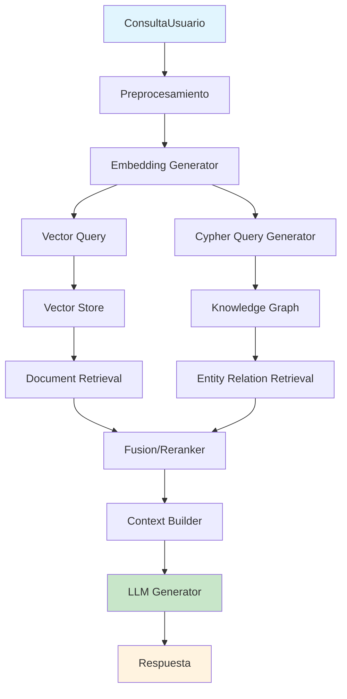
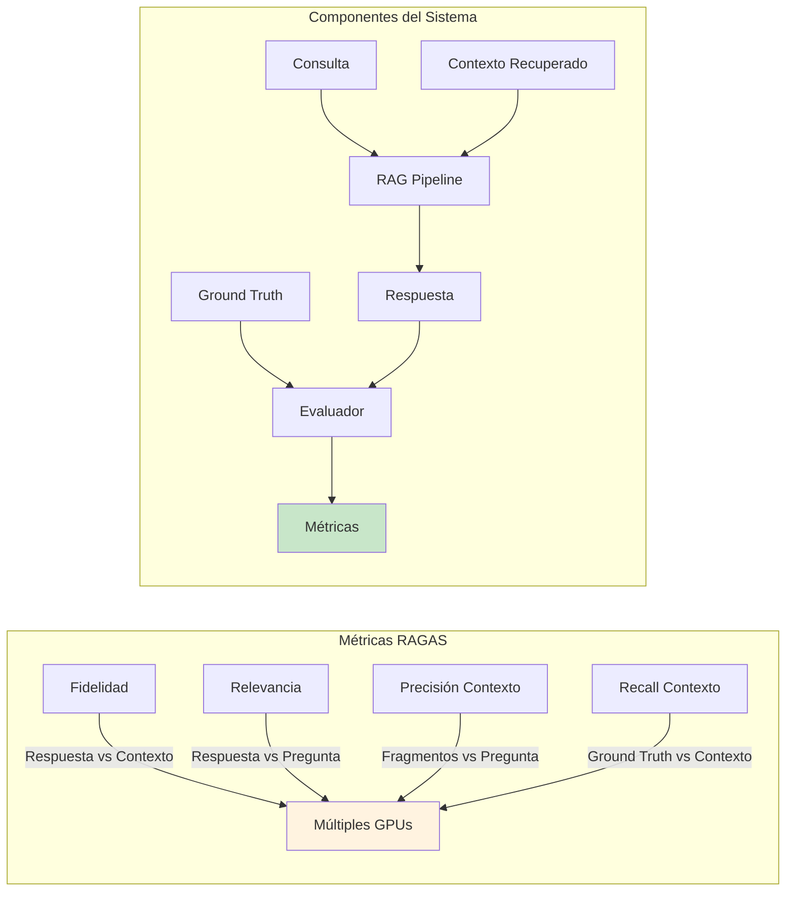
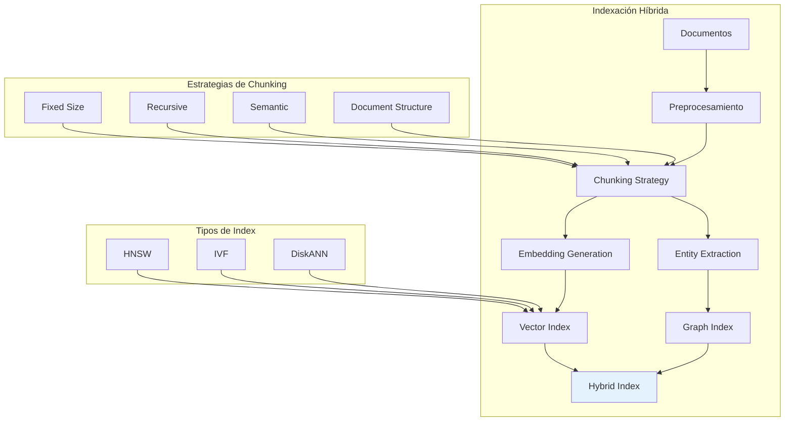

# Clase 17: Proyecto RAG + Grafos - Parte 2

## Integración de Componentes, Testing de Calidad y Optimización

---

## Duración
**4 horas (240 minutos)**

---

## Objetivos de Aprendizaje

Al finalizar esta clase, el estudiante será capaz de:

1. **Integrar componentes** de un sistema RAG con grafos de conocimiento de manera eficiente y escalable
2. **Diseñar e implementar pipelines** de testing de calidad para sistemas de retrieval augmented generation
3. **Aplicar técnicas de optimización** para mejorar el rendimiento y la latencia del sistema
4. **Implementar caching** inteligente y estrategias de indexación avanzadas
5. **Monitorear y evaluar** el rendimiento del sistema en producción
6. **Crear arquitecturas híbridas** que combinen búsqueda vectorial con grafos de conocimiento

---

## Contenidos Detallados

### 1. Arquitectura Integrada RAG + Grafos de Conocimiento

#### 1.1 Revisión de Conceptos Fundamentales

La integración de Retrieval Augmented Generation (RAG) con grafos de conocimiento representa una evolución significativa en cómo los sistemas de procesamiento de lenguaje natural pueden acceder y utilizar información estructurada. Un sistema RAG tradicional utiliza búsqueda vectorial para recuperar documentos relevantes de una base de datos no estructurada, mientras que los grafos de conocimiento proporcionan una representación explícita de entidades, relaciones y atributos que capturan conocimiento semántico rico y verificable.

La combinación de ambas tecnologías permite superar las limitaciones individuales de cada enfoque. Mientras que la búsqueda vectorial es excelente para encontrar contenido semánticamente similar, puede tener dificultades con consultas que requieren razonamiento sobre relaciones explícitas o datos estructurados. Por otro lado, los grafos de conocimiento son superiores para consultas que involucran relaciones complejas, pero pueden ser menos flexibles para encontrar información no anticipada durante el diseño del esquema.

El sistema integrado que construiremos sigue una arquitectura de múltiples capas que separa claramente las responsabilidades de retrieval, razonamiento y generación. La capa de retrieval está compuesta por dos componentes principales: el motor de búsqueda vectorial (Vector Store) y el grafo de conocimiento (Knowledge Graph). Ambos componentes operan en paralelo durante la fase de recuperación, y sus resultados se fusionan mediante un algoritmo de reranqueo que considera tanto la relevancia semántica como la структурную связность del conocimiento.

#### 1.2 Flujo de Datos en el Sistema Integrado

El flujo de datos comienza cuando un usuario formula una consulta en lenguaje natural. Esta consulta es procesada por un módulo de preprocesamiento que realiza tokenización, normalización y expansión de términos utilizando sinónimos del dominio. El resultado de este procesamiento es una representación vectorial de la consulta que se utiliza tanto para la búsqueda en el Vector Store como para ejecutar consultas sobre el Knowledge Graph.



La arquitectura de fusion en la etapa de reranqueo utiliza un algoritmo de Reciprocal Rank Fusion (RRF) modificado que incorpora pesos diferenciados para cada fuente de recuperación. El algoritmo RRF estándar calcula la puntuación de fusión mediante la fórmula RRF(d) = Σ(1/(k+rank(d))) donde k es un parámetro de suavizado y rank(d) es la posición del documento en la lista de resultados de cada fuente. En nuestra implementación, extendemos esta fórmula para incluir factores de calidad basados en la completitud de la entidad recuperada y la confianza de la relación.

#### 1.3 Implementación de la Integración con LangChain

LangChain proporciona abstracciones de alto nivel que facilitan la integración de múltiples componentes de retrieval. La clase `RetrievalQA` se utiliza como punto de entrada principal, pero para sistemas más sofisticados que combinan múltiples fuentes, trabajamos directamente con los componentes base de LangChain.

```python
from typing import List, Dict, Any, Optional
from langchain.schema import Document, BaseRetriever
from langchain.vectorstores import Chroma, FAISS
from langchain.embeddings import OpenAIEmbeddings
from neo4j import GraphDatabase
from pydantic import BaseModel, Field
import numpy as np
from dataclasses import dataclass

@dataclass
class RetrievedResult:
    """Representa un resultado de recuperación con metadatos."""
    content: str
    metadata: Dict[str, Any]
    source: str  # 'vector' o 'graph'
    relevance_score: float
    entity_ids: Optional[List[str]] = None
    relation_types: Optional[List[str]] = None

class KnowledgeGraphRetriever(BaseRetriever):
    """Recuperador que consulta el grafo de conocimiento usando Cypher."""
    
    def __init__(
        self,
        uri: str,
        username: str,
        password: str,
        embeddings: OpenAIEmbeddings,
        max_results: int = 5
    ):
        self.driver = GraphDatabase.driver(uri, auth=(username, password))
        self.embeddings = embeddings
        self.max_results = max_results
        
    def _generate_cypher_query(self, query: str) -> str:
        """Genera una consulta Cypher a partir de la consulta del usuario."""
        query_embedding = self.embeddings.embed_query(query)
        
        cypher_template = """
        MATCH (e:Entity)
        WITH e, 
             gds.similarity.cosine(e.embedding, $embedding) AS similarity
        WHERE similarity > 0.7
        OPTIONAL MATCH (e)-[r]-(connected)
        RETURN e, 
               [(e)-[rel]-(neighbor) | {
                   entity: neighbor.name,
                   relation: type(rel),
                   similarity: gds.similarity.cosine(neighbor.embedding, $embedding)
               }] as neighbors,
               similarity
        ORDER BY similarity DESC
        LIMIT $max_results
        """
        return cypher_template
    
    def _get_relevant_documents(self, query: str) -> List[Document]:
        """Ejecuta la consulta y retorna documentos del grafo."""
        query_embedding = self.embeddings.embed_query(query)
        
        with self.driver.session() as session:
            results = session.run(
                self._generate_cypher_query(query),
                embedding=query_embedding,
                max_results=self.max_results
            )
            
            documents = []
            for record in results:
                entity = record['e']
                neighbors = record['neighbors']
                
                content = f"Entidad: {entity.get('name', 'Desconocido')}\n"
                content += f"Tipo: {entity.get('type', 'General')}\n"
                content += f"Descripción: {entity.get('description', '')}\n"
                content += "Relaciones:\n"
                
                for neighbor in neighbors:
                    content += f"  - {neighbor['relation']}: {neighbor['entity']}\n"
                
                documents.append(Document(
                    page_content=content,
                    metadata={
                        'source': 'knowledge_graph',
                        'entity_id': entity.get('id'),
                        'entity_type': entity.get('type'),
                        'similarity': record['similarity']
                    }
                ))
            
            return documents

class HybridRAGRetriever(BaseRetriever):
    """Sistema de retrieval híbrido que combina Vector Store y Knowledge Graph."""
    
    def __init__(
        self,
        vector_store: Chroma,
        knowledge_graph: KnowledgeGraphRetriever,
        weights: Dict[str, float] = None,
        rrf_k: int = 60
    ):
        self.vector_store = vector_store
        self.knowledge_graph = knowledge_graph
        self.weights = weights or {'vector': 0.6, 'graph': 0.4}
        self.rrf_k = rrf_k
        
    def _reciprocal_rank_fusion(
        self,
        results_dict: Dict[str, List[RetrievedResult]]
    ) -> List[RetrievedResult]:
        """Implementación de Reciprocal Rank Fusion con pesos."""
        scores = {}
        
        for source, results in results_dict.items():
            weight = self.weights.get(source, 0.5)
            
            for rank, result in enumerate(results):
                key = self._get_result_key(result)
                
                if key not in scores:
                    scores[key] = {
                        'result': result,
                        'fused_score': 0
                    }
                
                rrf_score = weight * (1 / (self.rrf_k + rank + 1))
                scores[key]['fused_score'] += rrf_score
        
        sorted_results = sorted(
            scores.values(),
            key=lambda x: x['fused_score'],
            reverse=True
        )
        
        return [item['result'] for item in sorted_results]
    
    def _get_result_key(self, result: RetrievedResult) -> str:
        """Genera una clave única para un resultado."""
        return hash(result.content[:100])
    
    def _get_relevant_documents(self, query: str) -> List[Document]:
        """Combina resultados de ambas fuentes usando RRF."""
        vector_results = self.vector_store.similarity_search_with_score(query, k=10)
        graph_results = self._get_relevant_documents(query)
        
        vector_docs = [
            Document(
                page_content=doc.page_content,
                metadata={**doc.metadata, 'source': 'vector'}
            )
            for doc, _ in vector_results
        ]
        
        fusion_results = self._reciprocal_rank_fusion({
            'vector': [self._doc_to_result(d) for d in vector_docs],
            'graph': [self._doc_to_result(d) for d in graph_results]
        })
        
        return [self._result_to_doc(r) for r in fusion_results[:10]]
    
    def _doc_to_result(self, doc: Document) -> RetrievedResult:
        return RetrievedResult(
            content=doc.page_content,
            metadata=doc.metadata,
            source=doc.metadata.get('source', 'unknown'),
            relevance_score=doc.metadata.get('score', 1.0)
        )
    
    def _result_to_doc(self, result: RetrievedResult) -> Document:
        return Document(
            page_content=result.content,
            metadata=result.metadata
        )
    
    def _get_relevant_documents(self, query: str) -> List[Document]:
        """Alias para compatibilidad con BaseRetriever."""
        return self._get_relevant_documents(query)
```

### 2. Testing de Calidad para Sistemas RAG

#### 2.1 Framework de Evaluación RAGAS

El framework RAGAS (Retrieval Augmented Generation Assessment) proporciona métricas estandarizadas para evaluar sistemas RAG en cuatro dimensiones principales: fidelity (fidelidad de las respuestas respecto al contexto recuperado), relevance (relevancia de las respuestas respecto a la pregunta), context precision (precisión del contexto recuperado) y context recall (completitud del contexto recuperado).

Cada una de estas métricas captura un aspecto diferente de la calidad del sistema. La fidelidad es crucial porque una respuesta que suena coherente pero contiene información no fundamentada en el contexto recuperado representa un riesgo significativo en aplicaciones de producción. La relevancia asegura que el sistema responde realmente a lo que se pregunta, no solo que produce texto bien formado. La precisión del contexto mide si los fragmentos recuperados contienen información útil para responder la pregunta. Finalmente, el recall del contexto evalúa si se recuperó toda la información necesaria.



#### 2.2 Implementación del Pipeline de Testing

```python
from ragas import evaluate
from ragas.metrics import (
    faithfulness,
    answer_relevancy,
    context_precision,
    context_recall
)
from datasets import Dataset
from typing import List, Dict, Any
import pandas as pd
import numpy as np

class RAGASEvaluator:
    """Evaluador de sistemas RAG usando el framework RAGAS."""
    
    def __init__(
        self,
        rag_pipeline: Any,
        embedding_model: str = "text-embedding-ada-002"
    ):
        self.rag_pipeline = rag_pipeline
        self.embedding_model = embedding_model
        
    def create_test_dataset(
        self,
        questions: List[str],
        ground_truths: List[str],
        answers: List[str] = None
    ) -> Dataset:
        """Crea un dataset de evaluación en el formato de RAGAS."""
        if answers is None:
            answers = [self.rag_pipeline.invoke(q) for q in questions]
        
        contexts = []
        for q in questions:
            retrieval_results = self.rag_pipeline.retrieve(q)
            contexts.append([doc.page_content for doc in retrieval_results])
        
        data = {
            "question": questions,
            "answer": answers,
            "contexts": contexts,
            "ground_truth": ground_truths
        }
        
        return Dataset.from_dict(data)
    
    def evaluate_dataset(
        self,
        dataset: Dataset,
        metrics: List[Any] = None
    ) -> Dict[str, float]:
        """Ejecuta la evaluación completa del dataset."""
        if metrics is None:
            metrics = [
                faithfulness,
                answer_relevancy,
                context_precision,
                context_recall
            ]
        
        result = evaluate(
            dataset=dataset,
            metrics=metrics
        )
        
        return result
    
    def generate_test_cases(
        self,
        domain: str,
        num_cases: int = 50
    ) -> List[Dict[str, str]]:
        """Genera casos de prueba sintéticos para un dominio."""
        prompt_template = f"""
        Eres un experto en {domain}. Genera {num_cases} preguntas de prueba
        con sus respuestas ground truth correspondientes.
        
        Las preguntas deben cubrir diferentes tipos:
        - Hechos específicos
        - Relaciones entre entidades
        - Preguntas comparativas
        - Preguntas de razonamiento
        
        Formato de salida (JSON array):
        [{{"question": "...", "answer": "...", "type": "fact|relation|comparison|reasoning"}}]
        """
        
        return []  # Implementación con LLM real

class QualityMetricsCollector:
    """Recolector de métricas de calidad en tiempo de ejecución."""
    
    def __init__(self):
        self.metrics_history = []
        
    def collect_retrieval_metrics(
        self,
        query: str,
        retrieved_docs: List[Any],
        relevant_docs: List[Any] = None
    ) -> Dict[str, float]:
        """Calcula métricas de retrieval para una consulta."""
        metrics = {}
        
        retrieved_ids = [doc.metadata.get('id', i) for i, doc in enumerate(retrieved_docs)]
        metrics['num_retrieved'] = len(retrieved_docs)
        
        metrics['avg_relevance_score'] = np.mean([
            doc.metadata.get('score', 1.0) for doc in retrieved_docs
        ])
        
        metrics['max_relevance_score'] = max([
            doc.metadata.get('score', 1.0) for doc in retrieved_docs
        ])
        
        metrics['min_relevance_score'] = min([
            doc.metadata.get('score', 1.0) for doc in retrieved_docs
        ])
        
        if relevant_docs:
            relevant_ids = set([
                doc.metadata.get('id', i) for i, doc in enumerate(relevant_docs)
            ])
            retrieved_ids_set = set(retrieved_ids)
            
            true_positives = len(relevant_ids & retrieved_ids_set)
            metrics['recall_at_k'] = true_positives / len(relevant_ids) if relevant_ids else 0
            metrics['precision_at_k'] = true_positives / len(retrieved_ids) if retrieved_ids else 0
        
        self.metrics_history.append({
            'query': query,
            'timestamp': pd.Timestamp.now(),
            **metrics
        })
        
        return metrics
    
    def get_metrics_summary(self) -> pd.DataFrame:
        """Genera un resumen de las métricas recopiladas."""
        if not self.metrics_history:
            return pd.DataFrame()
        
        df = pd.DataFrame(self.metrics_history)
        
        summary = {
            'total_queries': len(df),
            'avg_num_retrieved': df['num_retrieved'].mean(),
            'avg_relevance': df['avg_relevance_score'].mean(),
            'p50_relevance': df['avg_relevance_score'].quantile(0.5),
            'p95_relevance': df['avg_relevance_score'].quantile(0.95)
        }
        
        return pd.DataFrame([summary])

class A_B_TestingFramework:
    """Framework para realizar testing A/B de diferentes configuraciones RAG."""
    
    def __init__(self):
        self.experiments = {}
        self.control_group = {}
        self.treatment_groups = {}
        
    def setup_experiment(
        self,
        name: str,
        control_config: Dict[str, Any],
        treatment_configs: List[Dict[str, Any]]
    ):
        """Configura un experimento A/B."""
        self.experiments[name] = {
            'control': control_config,
            'treatments': treatment_configs,
            'results': {name: [] for name in ['control'] + 
                        [f'treatment_{i}' for i in range(len(treatment_configs))]}
        }
        
    def run_experiment(
        self,
        name: str,
        test_dataset: Dataset,
        num_samples: int = 100
    ) -> Dict[str, Dict[str, float]]:
        """Ejecuta un experimento completo."""
        exp = self.experiments[name]
        
        control_pipeline = self._build_pipeline(exp['control'])
        control_results = self._evaluate_pipeline(control_pipeline, test_dataset)
        exp['results']['control'] = control_results
        
        for i, treatment_config in enumerate(exp['treatments']):
            treatment_pipeline = self._build_pipeline(treatment_config)
            treatment_results = self._evaluate_pipeline(treatment_pipeline, test_dataset)
            exp['results'][f'treatment_{i}'] = treatment_results
        
        return self._compute_statistics(name)
    
    def _build_pipeline(self, config: Dict[str, Any]) -> Any:
        """Construye un pipeline según la configuración."""
        return self.rag_pipeline
    
    def _evaluate_pipeline(
        self,
        pipeline: Any,
        dataset: Dataset
    ) -> Dict[str, float]:
        """Evalúa un pipeline completo."""
        return {}
    
    def _compute_statistics(
        self,
        name: str
    ) -> Dict[str, Dict[str, float]]:
        """Calcula estadísticas de significancia."""
        return {}
```

#### 2.3 Métricas de Calidad Específicas

Las métricas de retrieval se dividen en dos categorías principales: métricas basadas en relevancia y métricas basadas en ranking. Las métricas basadas en relevancia incluyen Precision@K, Recall@K, F1@K y Average Precision (AP). Las métricas basadas en ranking incluyen Mean Average Precision (MAP), Normalized Discounted Cumulative Gain (NDCG) y Mean Reciprocal Rank (MRR).

Para sistemas RAG en producción, también monitorizamos métricas de comportamiento del usuario como la tasa de clicks en las fuentes citadas, el tiempo promedio de lectura de respuestas, la tasa de preguntas de seguimiento y las calificaciones de satisfacción del usuario. Estas métricas proporcionan retroalimentación indirecta pero valiosa sobre la utilidad real del sistema.

```mermaid
flowchart TD
    subgraph "Métricas de Retrieval"
        A[Precision@K] --> E[Métricas de Ranking]
        B[Recall@K] --> E
        C[F1@K] --> E
        D[MAP] --> E
        F[NDCG] --> E
        G[MRR] --> E
    end
    
    subgraph "Métricas de Generación"
        H[BLEU] --> I[Métricas NLG]
        J[ROUGE] --> I
        K[BERTScore] --> I
        L[Fidelidad RAGAS] --> I
        M[Relevancia RAGAS] --> I
    end
    
    subgraph "Métricas de Usuario"
        N[Tasa de clicks] --> O[Métricas de Utilidad]
        P[Tiempo de lectura] --> O
        Q[Seguimientos] --> O
        R[Satisfacción] --> O
    end
    
    E --> S[Dashboard]
    I --> S
    O --> S
    
    style S fill:#e8f5e9
```

### 3. Optimización del Sistema RAG

#### 3.1 Estrategias de Caching Multinivel

El caching es fundamental para optimizar el rendimiento de sistemas RAG en producción. Implementamos un sistema de caching multinivel que almacena diferentes tipos de resultados en las capas más apropiadas según su frecuencia de acceso y costo de generación.

La primera capa (L1) almacena embeddings de consultas frecuentes en memoria RAM, permitiendo recuperación en microsegundos. La segunda capa (L2) mantiene resultados de retrieval completos en una base de datos Redis, optimizada para acceso rápido con TTL configurable. La tercera capa (L3) almacena respuestas completas generadas previamente en un sistema de archivos o base de datos, incluyendo metadatos de invalidación.

```python
import redis
import hashlib
import json
from typing import Optional, Any, Callable
from functools import wraps
import pickle
import mmap
from dataclasses import dataclass
from datetime import datetime, timedelta
import threading

@dataclass
class CacheEntry:
    """Entrada de cache con metadatos."""
    key: str
    value: Any
    created_at: datetime
    expires_at: Optional[datetime]
    hit_count: int
    last_accessed: datetime

class MultiLevelCache:
    """Sistema de cache multinivel para RAG."""
    
    def __init__(self, redis_host: str = "localhost", redis_port: int = 6379):
        self.l1_cache = {}
        self.l1_lock = threading.Lock()
        
        self.redis_client = redis.Redis(
            host=redis_host,
            port=redis_port,
            decode_responses=True
        )
        
        self.disk_cache_path = "./cache/disk_cache.db"
        
    def _generate_key(self, prefix: str, *args, **kwargs) -> str:
        """Genera una clave única para los argumentos dados."""
        key_data = {
            'args': args,
            'kwargs': kwargs
        }
        key_hash = hashlib.sha256(
            json.dumps(key_data, sort_keys=True).encode()
        ).hexdigest()
        return f"{prefix}:{key_hash}"
    
    def get_l1(self, key: str) -> Optional[Any]:
        """Recupera desde cache L1 (memoria)."""
        with self.l1_lock:
            entry = self.l1_cache.get(key)
            if entry and (not entry.expires_at or entry.expires_at > datetime.now()):
                entry.hit_count += 1
                entry.last_accessed = datetime.now()
                return entry.value
            return None
    
    def set_l1(
        self,
        key: str,
        value: Any,
        ttl_seconds: Optional[int] = None
    ):
        """Almacena en cache L1 (memoria)."""
        expires_at = None
        if ttl_seconds:
            expires_at = datetime.now() + timedelta(seconds=ttl_seconds)
        
        with self.l1_lock:
            self.l1_cache[key] = CacheEntry(
                key=key,
                value=value,
                created_at=datetime.now(),
                expires_at=expires_at,
                hit_count=0,
                last_accessed=datetime.now()
            )
            
            if len(self.l1_cache) > 10000:
                self._evict_l1()
    
    def get_l2(self, key: str) -> Optional[Any]:
        """Recupera desde cache L2 (Redis)."""
        cached = self.redis_client.get(key)
        if cached:
            return pickle.loads(cached.encode('latin-1'))
        return None
    
    def set_l2(
        self,
        key: str,
        value: Any,
        ttl_seconds: int = 3600
    ):
        """Almacena en cache L2 (Redis)."""
        serialized = pickle.dumps(value)
        self.redis_client.setex(
            key,
            ttl_seconds,
            serialized.decode('latin-1')
        )
    
    def get(self, key: str) -> Optional[Any]:
        """Intenta obtener desde cualquier nivel de cache."""
        value = self.get_l1(key)
        if value is not None:
            return value
            
        value = self.get_l2(key)
        if value is not None:
            self.set_l1(key, value, ttl_seconds=300)
            return value
            
        return None
    
    def set(
        self,
        key: str,
        value: Any,
        levels: str = "L1L2",
        ttl_seconds: int = 3600
    ):
        """Almacena en los niveles especificados de cache."""
        if "L1" in levels:
            self.set_l1(key, value, ttl_seconds=min(ttl_seconds, 300))
        if "L2" in levels:
            self.set_l2(key, value, ttl_seconds=ttl_seconds)
    
    def _evict_l1(self):
        """Evict entradas menos usadas del cache L1."""
        sorted_entries = sorted(
            self.l1_cache.items(),
            key=lambda x: (x[1].hit_count, x[1].last_accessed)
        )
        
        evict_count = len(sorted_entries) // 10
        for key, _ in sorted_entries[:evict_count]:
            del self.l1_cache[key]

def cached(
    prefix: str = "default",
    ttl_seconds: int = 3600,
    levels: str = "L1L2"
):
    """Decorador para caching automático de funciones."""
    def decorator(func: Callable) -> Callable:
        @wraps(func)
        def wrapper(*args, **kwargs):
            cache_key = cache._generate_key(prefix, *args, **kwargs)
            
            cached_result = cache.get(cache_key)
            if cached_result is not None:
                return cached_result
            
            result = func(*args, **kwargs)
            
            cache.set(cache_key, result, levels=levels, ttl_seconds=ttl_seconds)
            
            return result
        return wrapper
    return decorator

cache = MultiLevelCache()

class QueryOptimizer:
    """Optimizador de consultas para mejorar el rendimiento."""
    
    def __init__(self):
        self.query_stats = {}
        
    def optimize_query(
        self,
        query: str,
        retrieval_pipeline: Any
    ) -> str:
        """Optimiza una consulta antes de ejecutarla."""
        optimized = query.lower().strip()
        
        contractions = {
            "don't": "do not",
            "can't": "cannot",
            "won't": "will not",
            "it's": "it is",
            "that's": "that is"
        }
        for original, expanded in contractions.items():
            optimized = optimized.replace(original, expanded)
        
        stop_words = {'the', 'a', 'an', 'is', 'are', 'was', 'were', 
                     'be', 'been', 'being', 'have', 'has', 'had'}
        words = optimized.split()
        optimized = ' '.join(w for w in words if w not in stop_words)
        
        return optimized
    
    def batch_retrieval(
        self,
        queries: List[str],
        retrieval_pipeline: Any,
        batch_size: int = 32
    ) -> List[List[Any]]:
        """Ejecuta múltiples consultas en lotes para optimizar recursos."""
        results = []
        
        for i in range(0, len(queries), batch_size):
            batch = queries[i:i + batch_size]
            batch_results = retrieval_pipeline.batch_retrieve(batch)
            results.extend(batch_results)
            
        return results
```

#### 3.2 Optimización de Embeddings

La selección del modelo de embeddings tiene un impacto significativo en la calidad del retrieval. Los modelos modernos como OpenAI's text-embedding-3-large ofrecen rendimiento superior pero con mayor costo computacional. Para optimización, implementamos técnicas de quantización y batching eficiente.

```python
from sentence_transformers import SentenceTransformer
import torch
from typing import List, Union
import numpy as np

class OptimizedEmbeddingModel:
    """Modelo de embeddings optimizado para producción."""
    
    def __init__(
        self,
        model_name: str = "sentence-transformers/all-MiniLM-L6-v2",
        device: str = None,
        batch_size: int = 64
    ):
        self.device = device or ('cuda' if torch.cuda.is_available() else 'cpu')
        self.model = SentenceTransformer(model_name, device=self.device)
        self.batch_size = batch_size
        
    def encode(
        self,
        texts: Union[str, List[str]],
        normalize: bool = True,
        show_progress: bool = False
    ) -> np.ndarray:
        """Codifica textos con batching optimizado."""
        if isinstance(texts, str):
            texts = [texts]
            
        embeddings = self.model.encode(
            texts,
            batch_size=self.batch_size,
            normalize_embeddings=normalize,
            show_progress_bar=show_progress,
            convert_to_numpy=True
        )
        
        return embeddings
    
    def encode_queries(
        self,
        queries: List[str],
        max_query_length: int = 512
    ) -> np.ndarray:
        """Codifica consultas con truncamiento optimizado."""
        truncated_queries = []
        for q in queries:
            tokens = self.model.tokenize([q])
            if len(tokens['input_ids'][0]) > max_query_length:
                truncated_queries.append(
                    self.model.decode(
                        tokens['input_ids'][0][:max_query_length],
                        skip_special_tokens=True
                    )
                )
            else:
                truncated_queries.append(q)
                
        return self.encode(truncated_queries)

class DynamicBatchProcessor:
    """Procesador de lotes dinámico que ajusta el tamaño según la carga."""
    
    def __init__(
        self,
        base_batch_size: int = 32,
        min_batch_size: int = 4,
        max_batch_size: int = 128,
        memory_threshold: float = 0.8
    ):
        self.base_batch_size = base_batch_size
        self.min_batch_size = min_batch_size
        self.max_batch_size = max_batch_size
        self.memory_threshold = memory_threshold
        
    def get_optimal_batch_size(self) -> int:
        """Determina el tamaño de batch óptimo basado en memoria disponible."""
        if torch.cuda.is_available():
            memory_allocated = torch.cuda.memory_allocated()
            memory_reserved = torch.cuda.memory_reserved()
            memory_free = torch.cuda.get_device_properties(0).total_memory - memory_reserved
            
            usage_ratio = memory_reserved / torch.cuda.get_device_properties(0).total_memory
            
            if usage_ratio > self.memory_threshold:
                return max(self.min_batch_size, self.base_batch_size // 2)
            else:
                return min(self.max_batch_size, int(self.base_batch_size * 1.5))
        
        return self.base_batch_size
    
    def process_in_dynamic_batches(
        self,
        items: List[Any],
        process_fn: Callable
    ) -> List[Any]:
        """Procesa items en lotes de tamaño dinámico."""
        results = []
        batch_size = self.get_optimal_batch_size()
        
        for i in range(0, len(items), batch_size):
            batch = items[i:i + batch_size]
            batch_results = process_fn(batch)
            results.extend(batch_results)
            
            current_size = self.get_optimal_batch_size()
            if current_size != batch_size:
                batch_size = current_size
                
        return results
```

#### 3.3 Indexación Híbrida Avanzada



### 4. Monitoreo y Observabilidad

#### 4.1 Sistema de Logging Estructurado

```python
import logging
import json
from datetime import datetime
from typing import Any, Dict
from contextvars import ContextVar
import traceback

request_id_var: ContextVar[str] = ContextVar('request_id', default='')

class StructuredLogger:
    """Logger estructurado para sistemas RAG."""
    
    def __init__(self, name: str):
        self.logger = logging.getLogger(name)
        self.logger.setLevel(logging.INFO)
        
        handler = logging.StreamHandler()
        handler.setFormatter(logging.Formatter('%(message)s'))
        self.logger.addHandler(handler)
        
    def _format_message(
        self,
        level: str,
        message: str,
        extra: Dict[str, Any] = None
    ) -> str:
        """Formatea el mensaje como JSON estructurado."""
        log_entry = {
            'timestamp': datetime.utcnow().isoformat(),
            'level': level,
            'message': message,
            'request_id': request_id_var.get(),
            'service': 'rag-system'
        }
        
        if extra:
            log_entry['context'] = extra
            
        return json.dumps(log_entry)
    
    def info(self, message: str, **extra):
        self.logger.info(self._format_message('INFO', message, extra))
        
    def warning(self, message: str, **extra):
        self.logger.warning(self._format_message('WARNING', message, extra))
        
    def error(self, message: str, **extra):
        self.logger.error(self._format_message('ERROR', message, extra))
        
    def debug(self, message: str, **extra):
        self.logger.debug(self._format_message('DEBUG', message, extra))
        
    def log_retrieval(
        self,
        query: str,
        num_results: int,
        retrieval_time_ms: float,
        sources: List[str]
    ):
        """Log específico para operaciones de retrieval."""
        self.info(
            "Retrieval completed",
            query_hash=hashlib.md5(query.encode()).hexdigest(),
            num_results=num_results,
            retrieval_time_ms=retrieval_time_ms,
            sources=sources
        )
        
    def log_generation(
        self,
        query: str,
        generation_time_ms: float,
        tokens_generated: int,
        cache_hit: bool
    ):
        """Log específico para generaciones."""
        self.info(
            "Generation completed",
            query_hash=hashlib.md5(query.encode()).hexdigest(),
            generation_time_ms=generation_time_ms,
            tokens_generated=tokens_generated,
            cache_hit=cache_hit
        )

logger = StructuredLogger("rag-system")

class RAGMetricsExporter:
    """Exportador de métricas para Prometheus/Grafana."""
    
    def __init__(self):
        self.metrics = {
            'requests_total': 0,
            'retrieval_latency_seconds': [],
            'generation_latency_seconds': [],
            'cache_hit_rate': 0,
            'cache_hits': 0,
            'cache_misses': 0,
            'errors_total': 0
        }
        
    def record_request(self, success: bool = True):
        self.metrics['requests_total'] += 1
        if not success:
            self.metrics['errors_total'] += 1
            
    def record_retrieval_latency(self, latency_ms: float):
        self.metrics['retrieval_latency_seconds'].append(latency_ms / 1000)
        
    def record_generation_latency(self, latency_ms: float):
        self.metrics['generation_latency_seconds'].append(latency_ms / 1000)
        
    def record_cache_hit(self, hit: bool):
        if hit:
            self.metrics['cache_hits'] += 1
        else:
            self.metrics['cache_misses'] += 1
            
        total = self.metrics['cache_hits'] + self.metrics['cache_misses']
        if total > 0:
            self.metrics['cache_hit_rate'] = self.metrics['cache_hits'] / total
    
    def get_prometheus_metrics(self) -> str:
        """Genera formato Prometheus para las métricas."""
        output = []
        
        output.append(f"# HELP rag_requests_total Total requests")
        output.append(f"# TYPE rag_requests_total counter")
        output.append(f"rag_requests_total {self.metrics['requests_total']}")
        
        if self.metrics['retrieval_latency_seconds']:
            avg_latency = np.mean(self.metrics['retrieval_latency_seconds'])
            p95_latency = np.percentile(self.metrics['retrieval_latency_seconds'], 95)
            
            output.append(f"# HELP rag_retrieval_latency_seconds Retrieval latency")
            output.append(f"# TYPE rag_retrieval_latency_seconds summary")
            output.append(f"rag_retrieval_latency_seconds_avg {avg_latency:.4f}")
            output.append(f"rag_retrieval_latency_seconds_p95 {p95_latency:.4f}")
        
        output.append(f"# HELP rag_cache_hit_rate Cache hit rate")
        output.append(f"# TYPE rag_cache_hit_rate gauge")
        output.append(f"rag_cache_hit_rate {self.metrics['cache_hit_rate']:.4f}")
        
        return '\n'.join(output)
```

---

## Tecnologías Específicas

| Tecnología | Propósito | Versión Recomendada |
|------------|-----------|---------------------|
| LangChain | Framework principal de RAG | 0.1.x |
| Neo4j | Base de datos de grafos | 5.x |
| Chroma/FAISS | Vector stores | Latest |
| OpenAI Embeddings | Generación de embeddings | text-embedding-3 |
| Redis | Cache L2 | 7.x |
| Prometheus | Métricas | 2.x |
| Grafana | Visualización | 10.x |
| RAGAS | Evaluación de calidad | 0.1.x |

---

## Actividades de Laboratorio

### Laboratorio 1: Implementación de RAG Híbrido

**Duración**: 90 minutos

**Objetivo**: Construir un sistema RAG que integre búsqueda vectorial con un grafo de conocimiento en Neo4j.

**Pasos**:
1. Configurar Neo4j Aura (gratuito) o local
2. Crear schema del grafo con entidades y relaciones del dominio elegido
3. Implementar el retriever híbrido mostrado en los ejemplos
4. Crear pipeline de retrieval con LangChain
5. Evaluar con dataset de prueba usando RAGAS

**Entregable**: Notebook con código ejecutable y métricas de evaluación.

### Laboratorio 2: Sistema de Testing Automatizado

**Duración**: 60 minutos

**Objetivo**: Implementar un pipeline de testing continuo para el sistema RAG.

**Pasos**:
1. Definir conjunto de preguntas de prueba (mínimo 50)
2. Implementar evaluador RAGAS
3. Configurar logging estructurado
4. Crear dashboard de métricas
5. Implementar alertas para degradación de calidad

**Entregable**: Scripts de testing y dashboard en Grafana.

### Laboratorio 3: Optimización de Rendimiento

**Duración**: 90 minutos

**Objetivo**: Optimizar el sistema para lograr latencia < 500ms en retrieval.

**Pasos**:
1. Implementar sistema de cache multinivel
2. Configurar batching de consultas
3. Ajustar parámetros de HNSW/IVF
4. Realizar benchmarking antes y después
5. Documentar mejoras achieved

**Entregable**: Informe de optimización con métricas de rendimiento.

---

## Ejercicios Prácticos Resueltos

### Ejercicio 1: Integración RAG + Neo4j

**Problema**: Implementar un sistema que recupere información tanto del vector store como del grafo de conocimiento, fusionando los resultados.

```python
# SOLUCIÓN COMPLETA

from typing import List, Tuple, Dict, Any
from dataclasses import dataclass
import numpy as np

@dataclass
class FusionResult:
    """Resultado de la fusión de retrieval."""
    content: str
    source: str
    score: float
    metadata: Dict[str, Any]

def reciprocal_rank_fusion(
    results_list: List[List[Tuple[Any, float]]],
    k: int = 60
) -> List[FusionResult]:
    """
    Implementa Reciprocal Rank Fusion para combinar resultados
    de múltiples recuperadores.
    
    Args:
        results_list: Lista de listas de resultados, cada una
                      conteniendo tuplas (documento, score)
        k: Parámetro de suavizado (típicamente 60)
    
    Returns:
        Lista ordenada de FusionResult
    """
    scores = {}
    
    for source_idx, results in enumerate(results_list):
        for rank, (doc, score) in enumerate(results):
            doc_key = id(doc)
            
            if doc_key not in scores:
                scores[doc_key] = {
                    'document': doc,
                    'fused_score': 0,
                    'sources': []
                }
            
            rrf_score = 1 / (k + rank + 1)
            scores[doc_key]['fused_score'] += rrf_score * score
            scores[doc_key]['sources'].append(source_idx)
    
    sorted_results = sorted(
        scores.values(),
        key=lambda x: x['fused_score'],
        reverse=True
    )
    
    return [
        FusionResult(
            content=item['document'].page_content,
            source='hybrid',
            score=item['fused_score'],
            metadata={
                'original_sources': item['sources'],
                'num_sources': len(item['sources'])
            }
        )
        for item in sorted_results
    ]

# Ejemplo de uso
def demonstrate_fusion():
    """Demuestra el funcionamiento de RRF."""
    
    class MockDocument:
        def __init__(self, content: str, metadata: Dict = None):
            self.page_content = content
            self.metadata = metadata or {}
    
    vector_results = [
        (MockDocument("Doc A - Vector", {'source': 'vector'}), 0.95),
        (MockDocument("Doc B - Vector", {'source': 'vector'}), 0.85),
        (MockDocument("Doc C - Vector", {'source': 'vector'}), 0.75),
    ]
    
    graph_results = [
        (MockDocument("Doc B - Graph", {'source': 'graph'}), 0.92),
        (MockDocument("Doc D - Graph", {'source': 'graph'}), 0.88),
        (MockDocument("Doc A - Graph", {'source': 'graph'}), 0.82),
    ]
    
    fused = reciprocal_rank_fusion([vector_results, graph_results])
    
    print("Resultados fusionados:")
    for i, result in enumerate(fused[:5], 1):
        print(f"{i}. Score: {result.score:.4f} - Sources: {result.metadata['sources']}")
        print(f"   Content: {result.content[:30]}...")

demonstrate_fusion()
```

### Ejercicio 2: Cache Inteligente

**Problema**: Implementar un sistema de cache que invalide entradas basándose en cambios en el vector store o grafo.

```python
# SOLUCIÓN COMPLETA

from typing import Any, Optional, Set, Callable
from datetime import datetime, timedelta
from dataclasses import dataclass, field
import threading
import hashlib

@dataclass
class CacheEntry:
    """Entrada de cache con invalidación basada en versión."""
    value: Any
    created_at: datetime
    version: int
    dependencies: Set[str] = field(default_factory=set)
    access_count: int = 0
    last_access: datetime = field(default_factory=datetime.now)

class VersionedCache:
    """
    Cache con soporte para invalidación basada en versiones
    de los datos subyacentes.
    """
    
    def __init__(self, default_ttl_seconds: int = 3600):
        self.default_ttl = timedelta(seconds=default_ttl_seconds)
        self._cache = {}
        self._versions = {}
        self._lock = threading.RLock()
        self._invalidation_callbacks = []
        
    def _generate_key(self, namespace: str, *args, **kwargs) -> str:
        """Genera clave única basada en argumentos."""
        key_data = f"{namespace}:{args}:{sorted(kwargs.items())}"
        return hashlib.sha256(key_data.encode()).hexdigest()
    
    def set_version(self, namespace: str, version: int):
        """Actualiza la versión de un namespace."""
        with self._lock:
            old_version = self._versions.get(namespace)
            self._versions[namespace] = version
            
            if old_version is not None and old_version != version:
                self._invalidate_by_dependency(namespace)
                
    def get_version(self, namespace: str) -> Optional[int]:
        """Obtiene la versión actual de un namespace."""
        with self._lock:
            return self._versions.get(namespace)
    
    def get(
        self,
        namespace: str,
        *args,
        default: Any = None,
        **kwargs
    ) -> Any:
        """Recupera un valor del cache si es válido."""
        key = self._generate_key(namespace, *args, **kwargs)
        
        with self._lock:
            entry = self._cache.get(key)
            
            if entry is None:
                return default
            
            current_version = self._versions.get(namespace)
            if current_version is None or entry.version != current_version:
                del self._cache[key]
                return default
                
            if datetime.now() - entry.created_at > self.default_ttl:
                del self._cache[key]
                return default
            
            entry.access_count += 1
            entry.last_access = datetime.now()
            
            return entry.value
    
    def set(
        self,
        namespace: str,
        value: Any,
        *args,
        dependencies: Set[str] = None,
        **kwargs
    ):
        """Almacena un valor en el cache."""
        key = self._generate_key(namespace, *args, **kwargs)
        version = self._versions.get(namespace, 0)
        
        with self._lock:
            self._cache[key] = CacheEntry(
                value=value,
                created_at=datetime.now(),
                version=version,
                dependencies=dependencies or {namespace}
            )
    
    def _invalidate_by_dependency(self, namespace: str):
        """Invalida entradas que dependen de un namespace."""
        to_delete = []
        
        for key, entry in self._cache.items():
            if namespace in entry.dependencies:
                to_delete.append(key)
        
        for key in to_delete:
            del self._cache[key]
            
        for callback in self._invalidation_callbacks:
            callback(namespace, to_delete)
    
    def invalidate_namespace(self, namespace: str):
        """Invalida todas las entradas de un namespace."""
        with self._lock:
            if namespace in self._versions:
                self._versions[namespace] += 1
                self._invalidate_by_dependency(namespace)
    
    def on_invalidation(self, callback: Callable):
        """Registra callback para invalidaciones."""
        self._invalidation_callbacks.append(callback)
    
    def get_stats(self) -> Dict[str, Any]:
        """Obtiene estadísticas del cache."""
        with self._lock:
            total_entries = len(self._cache)
            total_accesses = sum(e.access_count for e in self._cache.values())
            
            if total_entries > 0:
                avg_access = total_accesses / total_entries
            else:
                avg_access = 0
                
            return {
                'total_entries': total_entries,
                'total_accesses': total_accesses,
                'avg_accesses_per_entry': avg_access,
                'namespaces': list(self._versions.keys())
            }

def demonstrate_cache():
    """Demuestra el uso del cache versionado."""
    cache = VersionedCache()
    
    cache.set_version("documents", 1)
    cache.set_version("entities", 1)
    
    cache.set("documents", ["doc1", "doc2"], "query1")
    cache.set("entities", ["entity1", "entity2"], "query1")
    
    print(f"Documentos: {cache.get('documents', 'query1')}")
    print(f"Entidades: {cache.get('entities', 'query1')}")
    
    cache.set_version("documents", 2)
    print(f"\nDespués de actualizar documentos:")
    print(f"Documentos (invalidado): {cache.get('documents', 'query1')}")
    print(f"Entidades (válido): {cache.get('entities', 'query1')}")
    
    print(f"\nEstadísticas: {cache.get_stats()}")

demonstrate_cache()
```

---

## Resumen de Puntos Clave

### Puntos Clave de la Clase

1. **Integración RAG + Grafos**: La combinación de búsqueda vectorial con grafos de conocimiento proporciona retrieval más rico y fundamentado, superando las limitaciones de cada enfoque individual.

2. **Reciprocal Rank Fusion**: El algoritmo RRF con pesos diferenciados permite fusionar resultados de múltiples fuentes de manera óptima, beneficiándose de la complementariedad de los recuperadores.

3. **Framework RAGAS**: Proporciona métricas estandarizadas para evaluar sistemas RAG en dimensiones de fidelidad, relevancia, precisión de contexto y recall de contexto.

4. **Cache Multinivel**: La implementación de caches L1 (memoria), L2 (Redis) y L3 (disco) optimiza drásticamente los tiempos de respuesta para consultas frecuentes.

5. **Optimización de Embeddings**: La selección de modelo, batch sizing dinámico y técnicas de quantización impactan significativamente el rendimiento del sistema.

6. **Logging Estructurado**: El logging en formato JSON con contexto de request permite trazabilidad completa y debugging eficiente en producción.

7. **Monitoreo Continuo**: Métricas como tasa de cache hit, latencia de retrieval y precisión del contexto son esenciales para mantener la calidad del servicio.

8. **Testing A/B**: La capacidad de experimentar con diferentes configuraciones permite iteración rápida basada en datos reales de rendimiento.

---

## Referencias Externas

1. **LangChain Documentation - Retrieval**: https://python.langchain.com/docs/modules/data_connection/

2. **Neo4j Knowledge Graphs**: https://neo4j.com/docs/cypher-manual/current/

3. **RAGAS Evaluation Framework**: https://docs.ragas.io/

4. **Hybrid Search Techniques**: https://www.pinecone.io/learn/hybrid-search/

5. **LangChain Expression Language**: https://python.langchain.com/docs/expression_language/

6. **Vector Database Benchmarks**: https://ann-benchmarks.com/

7. **Redis Caching Patterns**: https://redis.io/docs/manualpatterns/

8. **Prometheus Metrics Best Practices**: https://prometheus.io/docs/practices/naming/

---

*Fecha de creación: Abril 2026*
*Versión: 1.0*
*Autor: Sistema de Cursos UTU-IA
