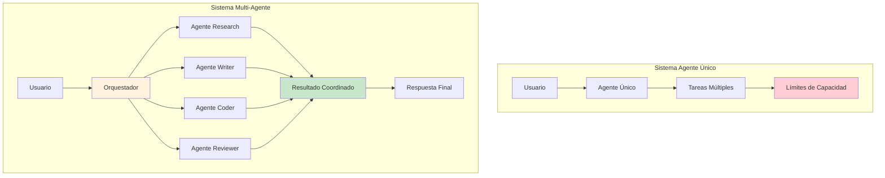
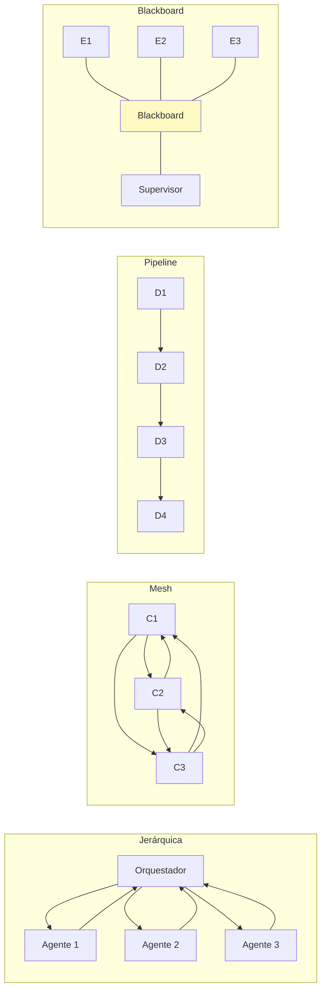
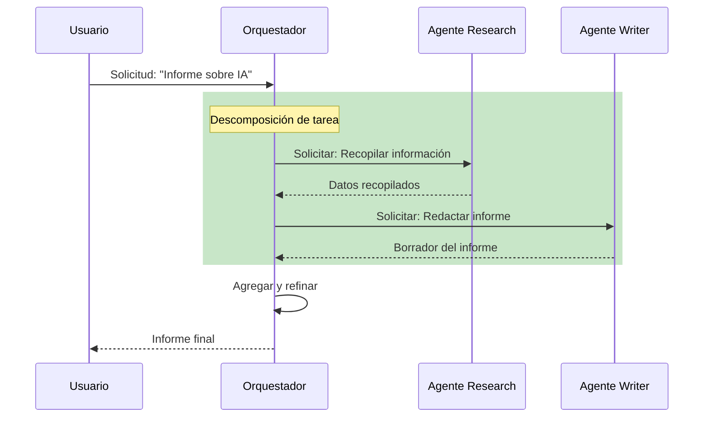
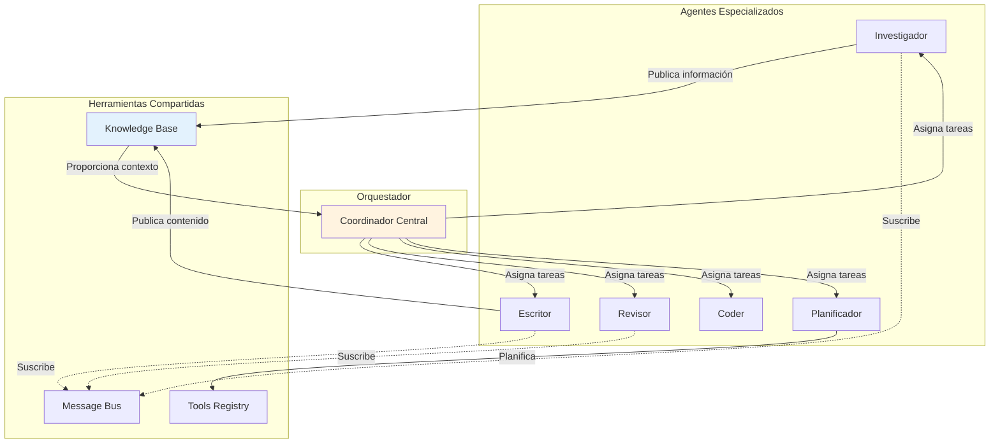

# Clase 18: Orquestación Multi-Agente

## Conceptos de Multi-Agency, Protocolos de Comunicación y Roles de Agentes

---

## Duración
**4 horas (240 minutos)**

---

## Objetivos de Aprendizaje

Al finalizar esta clase, el estudiante será capaz de:

1. **Comprender** los fundamentos de sistemas multi-agente y sus ventajas sobre agentes únicos
2. **Diseñar arquitecturas** de multi-agencia con roles diferenciados y complementarios
3. **Implementar protocolos de comunicación** entre agentes usando patrones estándar
4. **Crear flujos de trabajo** cooperativos y jerárquicos entre agentes
5. **Evaluar y seleccionar** estrategias de orquestación apropiadas para diferentes casos de uso
6. **Implementar agentes** usando LangChain Agents y AutoGen

---

## Contenidos Detallados

### 1. Fundamentos de Sistemas Multi-Agente

#### 1.1 ¿Por qué Multi-Agencia?

Los sistemas multi-agente emergen de la necesidad de resolver problemas complejos que exceden las capacidades de un único agente. En la ingeniería de software tradicional, seguimos el principio de "separation of concerns" para dividir sistemas complejos en componentes manejables. De manera análoga, en los sistemas de IA generativa, la multi-agencia permite que cada agente se especialice en una tarea específica, desarrollando expertise profundo en su dominio particular.

La arquitectura multi-agente ofrece múltiples ventajas sobre el enfoque de agente único. Primero, la **escalabilidad** permite agregar nuevos agentes para manejar capacidades adicionales sin modificar los existentes. Segundo, la **robustez** del sistema aumenta porque la falla de un agente no necesariamente compromete todo el sistema. Tercero, la **especialización** permite que cada agente optimice su comportamiento para una tarea específica. Cuarto, la **paralelización** natural permite ejecutar múltiples tareas simultáneamente. Quinto, el **razonamiento distribuido** puede abordar problemas que requieren diferentes tipos de pensamiento o conocimiento.

Sin embargo, la multi-agencia también introduce desafíos significativos: la coordinación entre agentes, la gestión de conflictos, la comunicación eficiente, la consistencia del estado compartido y la complejidad de debugging cuando algo falla. Estos desafíos requieren patrones arquitectónicos específicos y herramientas de orquestación sofisticadas.



#### 1.2 Taxonomía de Arquitecturas Multi-Agente

Existen varios patrones arquitectónicos para sistemas multi-agente, cada uno con características específicas de coordinación y flujo de información.

**Arquitectura Jerárquica**: En este patrón, existe un agente orquestador o supervisor que coordina el trabajo de agentes subordinados. El orquestador recibe la tarea inicial, la descompone en subtareas, las asigna a los agentes apropiados, y agrega los resultados parciales en una respuesta coherente. Este patrón es similar a una estructura organizacional tradicional con gerentes y empleados especializados.

**Arquitectura de Red (Mesh)**: Los agentes se comunican directamente entre sí sin un coordinador central. Cada agente puede enviar mensajes a otros agentes según sea necesario para completar su tarea. Este patrón ofrece alta flexibilidad pero puede dificultar la coordinación global y la depuración.

**Arquitectura de Pipeline**: Las tareas fluyen secuencialmente a través de una serie de agentes especializados, donde cada agente procesa la salida del anterior. Este patrón es ideal para flujos de trabajo donde cada etapa transforma gradualmente la entrada hacia el resultado final.

**Arquitectura de blackboard**: Los agentes comparten un espacio de trabajo común (blackboard) donde publican información y consultan lo que otros agentes han publicado. Un agente supervisor o un mecanismo automatizado determina cuándo se han cumplido las condiciones para proceder.

**Arquitectura de mercado**: Inspirada en modelos económicos, los agentes actúan como participantes de un mercado donde las tareas se "subastan" o los agentes "negocian" para realizar trabajo. Cada agente puede actuar como proveedor o consumidor de resultados.



### 2. Protocolos de Comunicación entre Agentes

#### 2.1 Patrones de Mensajería

La comunicación efectiva entre agentes es fundamental para el éxito de cualquier sistema multi-agente. Definimos protocolos que establecen formatos de mensajes, reglas de enrutamiento y comportamientos esperados.

**Request-Response**: El patrón más básico donde un agente envía una solicitud a otro y espera una respuesta. Es síncrono y asume que el agente receptor está disponible y puede procesar la solicitud inmediatamente.

**Publish-Subscribe**: Los agentes se suscriben atopics específicos y reciben notificaciones cuando se publican mensajes relevantes. Este patrón desacopla productores y consumidores, permitiendo arquitectura más flexible.

**Message Queue**: Los mensajes se almacenan en colas persistentes hasta que el agente destinatario los procesa. Garantiza entrega confiable incluso en presencia de fallos temporales.

**Streaming**: Para casos donde se necesitan resultados parciales o continuos, como en generación de texto en streaming donde cada token se transmite conforme se genera.



#### 2.2 Definición de Mensajes Estructurados

```python
from typing import Any, Dict, List, Optional, Literal
from pydantic import BaseModel, Field
from enum import Enum
from datetime import datetime
import uuid

class MessageType(str, Enum):
    """Tipos de mensajes entre agentes."""
    REQUEST = "request"
    RESPONSE = "response"
    BROADCAST = "broadcast"
    EVENT = "event"
    ERROR = "error"
    STATUS_UPDATE = "status_update"

class AgentMessage(BaseModel):
    """Mensaje estándar para comunicación entre agentes."""
    message_id: str = Field(default_factory=lambda: str(uuid.uuid4()))
    sender: str
    receivers: List[str]
    message_type: MessageType
    content: Dict[str, Any]
    timestamp: datetime = Field(default_factory=datetime.now)
    reply_to: Optional[str] = None
    conversation_id: Optional[str] = None
    metadata: Dict[str, Any] = Field(default_factory=dict)
    
    class Config:
        json_encoders = {
            datetime: lambda v: v.isoformat()
        }

class TaskMessage(AgentMessage):
    """Mensaje específico para tareas."""
    task_id: str
    task_type: str
    priority: int = 0
    deadline: Optional[datetime] = None
    dependencies: List[str] = Field(default_factory=list)
    status: Literal["pending", "in_progress", "completed", "failed"] = "pending"
    result: Optional[Dict[str, Any]] = None
    error: Optional[str] = None

class AgentCapability(BaseModel):
    """Define las capacidades de un agente."""
    name: str
    description: str
    input_types: List[str]
    output_types: List[str]
    parameters: Dict[str, Any] = Field(default_factory=dict)
    max_concurrent_tasks: int = 1
    estimated_duration_seconds: Optional[int] = None

class AgentStatus(BaseModel):
    """Estado de un agente en el sistema."""
    agent_id: str
    status: Literal["idle", "busy", "error", "offline"]
    current_tasks: List[str] = Field(default_factory=list)
    capabilities: List[AgentCapability]
    metrics: Dict[str, Any] = Field(default_factory=dict)
    last_heartbeat: datetime = Field(default_factory=datetime.now)

class AgentRegistry:
    """Registro central de agentes y sus capacidades."""
    
    def __init__(self):
        self._agents: Dict[str, AgentStatus] = {}
        self._capabilities: Dict[str, List[str]] = {}
        
    def register_agent(self, agent_id: str, capabilities: List[AgentCapability]):
        """Registra un nuevo agente con sus capacidades."""
        self._agents[agent_id] = AgentStatus(
            agent_id=agent_id,
            status="idle",
            capabilities=capabilities
        )
        
        for cap in capabilities:
            if cap.name not in self._capabilities:
                self._capabilities[cap.name] = []
            self._capabilities[cap.name].append(agent_id)
    
    def find_agents_by_capability(self, capability: str) -> List[str]:
        """Encuentra agentes que pueden realizar una capacidad específica."""
        return self._capabilities.get(capability, [])
    
    def get_agent_status(self, agent_id: str) -> Optional[AgentStatus]:
        """Obtiene el estado actual de un agente."""
        return self._agents.get(agent_id)
    
    def update_agent_status(self, agent_id: str, status: str):
        """Actualiza el estado de un agente."""
        if agent_id in self._agents:
            self._agents[agent_id].status = status
            self._agents[agent_id].last_heartbeat = datetime.now()

class MessageBus:
    """Bus de mensajes para comunicación entre agentes."""
    
    def __init__(self, registry: AgentRegistry):
        self.registry = registry
        self._queues: Dict[str, List[AgentMessage]] = {}
        self._subscriptions: Dict[str, List[str]] = {}
        self._handlers: Dict[str, List[callable]] = {}
        
    def send_message(self, message: AgentMessage) -> bool:
        """Envía un mensaje a los destinatarios especificados."""
        for receiver in message.receivers:
            if receiver not in self._queues:
                self._queues[receiver] = []
            self._queues[receiver].append(message)
            
        for topic in message.metadata.get("topics", []):
            self._notify_topic_subscribers(topic, message)
            
        return True
    
    def subscribe(self, agent_id: str, topic: str):
        """Suscribe un agente a un topic."""
        if topic not in self._subscriptions:
            self._subscriptions[topic] = []
        if agent_id not in self._subscriptions[topic]:
            self._subscriptions[topic].append(agent_id)
    
    def _notify_topic_subscribers(self, topic: str, message: AgentMessage):
        """Notifica a los suscriptores de un topic."""
        for handler in self._handlers.get(topic, []):
            handler(message)
    
    def register_handler(self, topic: str, handler: callable):
        """Registra un handler para un topic."""
        if topic not in self._handlers:
            self._handlers[topic] = []
        self._handlers[topic].append(handler)
    
    def get_messages(self, agent_id: str, limit: int = 10) -> List[AgentMessage]:
        """Obtiene mensajes pendientes para un agente."""
        messages = self._queues.get(agent_id, [])[:limit]
        self._queues[agent_id] = self._queues.get(agent_id, [])[limit:]
        return messages
```

### 3. Diseño de Roles de Agentes

#### 3.1 Patrones de Rol Comunes

En sistemas multi-agente bien diseñados, cada agente tiene un rol claramente definido con responsabilidades específicas. Aquí exploramos los patrones de rol más comunes.

**Investigador (Researcher)**: Este agente se especializa en buscar, recuperar y sintetizar información de múltiples fuentes. Utiliza herramientas de búsqueda web, APIs de bases de datos y sistemas RAG para recopilar información relevante. Su output es típicamente un compendio organizado de hechos, datos y referencias.

**Escritor (Writer)**: Transforma información estructurada en texto comprensible y bien organizado. Puede especializarse aún más en diferentes estilos: técnico, narrativo, persuasivo, académico, etc. Trabaja en colaboración con el investigador para asegurar precisión factual.

**Revisor (Reviewer/Critic)**: Evalúa el trabajo de otros agentes, identifica errores, inconsistencias, omisiones y áreas de mejora. Puede aplicar diferentes criterios según el dominio: calidad técnica, legibilidad, cumplimiento de requisitos, seguridad, etc.

**Coder**: Especializado en escribir, revisar y depurar código. Puede asistir en la implementación de soluciones, la creación de prototipos y la automatización de tareas.

**Planificador (Planner)**: Descompone tareas complejas en pasos manejables, estima recursos y tiempos, identifica dependencias y riesgos. Coordina con otros agentes para asegurar que el plan sea factible.

**Coordinador (Coordinator/Orchestrator)**: Gestiona el flujo de trabajo general, asigna tareas a agentes, maneja la comunicación entre componentes y asegura que los objetivos generales se cumplan.



#### 3.2 Implementación de Agentes con Roles

```python
from typing import List, Dict, Any, Optional, Callable
from abc import ABC, abstractmethod
import asyncio

class BaseAgent(ABC):
    """Clase base para todos los agentes."""
    
    def __init__(
        self,
        agent_id: str,
        name: str,
        description: str,
        capabilities: List[AgentCapability],
        message_bus: MessageBus,
        llm: Any
    ):
        self.agent_id = agent_id
        self.name = name
        self.description = description
        self.capabilities = capabilities
        self.message_bus = message_bus
        self.llm = llm
        self._running = False
        
    @abstractmethod
    async def process_task(self, task: TaskMessage) -> Dict[str, Any]:
        """Procesa una tarea asignada."""
        pass
    
    async def run(self):
        """Loop principal del agente."""
        self._running = True
        while self._running:
            messages = self.message_bus.get_messages(self.agent_id)
            
            for msg in messages:
                if msg.message_type == MessageType.REQUEST:
                    task = TaskMessage(**msg.content)
                    result = await self.process_task(task)
                    
                    response = AgentMessage(
                        sender=self.agent_id,
                        receivers=[msg.sender],
                        message_type=MessageType.RESPONSE,
                        content=result,
                        conversation_id=msg.conversation_id,
                        reply_to=msg.message_id
                    )
                    self.message_bus.send_message(response)
            
            await asyncio.sleep(0.1)
    
    def stop(self):
        """Detiene el agente."""
        self._running = False

class ResearcherAgent(BaseAgent):
    """Agente especializado en investigación y recuperación de información."""
    
    def __init__(
        self,
        agent_id: str,
        message_bus: MessageBus,
        llm: Any,
        vector_store: Any,
        knowledge_graph: Any
    ):
        capabilities = [
            AgentCapability(
                name="web_search",
                description="Busca información en la web",
                input_types=["query"],
                output_types=["search_results"]
            ),
            AgentCapability(
                name="knowledge_retrieval",
                description="Recupera información de bases de conocimiento",
                input_types=["query"],
                output_types=["documents"]
            ),
            AgentCapability(
                name="fact_check",
                description="Verifica hechos encontrados",
                input_types=["claims"],
                output_types=["verified_facts"]
            )
        ]
        
        super().__init__(
            agent_id=agent_id,
            name="Researcher",
            description="Agente especializado en búsqueda y síntesis de información",
            capabilities=capabilities,
            message_bus=message_bus,
            llm=llm
        )
        
        self.vector_store = vector_store
        self.knowledge_graph = knowledge_graph
        
    async def process_task(self, task: TaskMessage) -> Dict[str, Any]:
        """Procesa una tarea de investigación."""
        query = task.content.get("query", "")
        search_depth = task.content.get("depth", "standard")
        
        results = {
            "web_results": await self._search_web(query),
            "knowledge_results": await self._search_knowledge(query),
            "entity_results": await self._extract_entities(query)
        }
        
        synthesized = await self._synthesize_results(query, results)
        
        return {
            "task_id": task.task_id,
            "status": "completed",
            "query": query,
            "findings": synthesized,
            "sources": self._collect_sources(results)
        }
    
    async def _search_web(self, query: str) -> List[Dict[str, Any]]:
        """Busca en la web."""
        return []
    
    async def _search_knowledge(self, query: str) -> List[Dict[str, Any]]:
        """Busca en la base de conocimiento vectorial."""
        docs = self.vector_store.similarity_search(query, k=5)
        return [{"content": doc.page_content, "source": "vector_db"} for doc in docs]
    
    async def _extract_entities(self, query: str) -> List[Dict[str, Any]]:
        """Extrae entidades del grafo de conocimiento."""
        return []
    
    async def _synthesize_results(
        self,
        query: str,
        results: Dict[str, Any]
    ) -> str:
        """Sintetiza los resultados de búsqueda."""
        prompt = f"""
        Basándote en los siguientes resultados de investigación para la consulta "{query}",
        proporciona un resumen conciso pero completo de los hallazgos.
        
        Resultados web: {results.get('web_results', [])}
        Resultados de base de conocimiento: {results.get('knowledge_results', [])}
        Entidades relacionadas: {results.get('entity_results', [])}
        """
        
        response = self.llm.invoke(prompt)
        return response.content

class WriterAgent(BaseAgent):
    """Agente especializado en redacción de contenido."""
    
    def __init__(
        self,
        agent_id: str,
        message_bus: MessageBus,
        llm: Any
    ):
        capabilities = [
            AgentCapability(
                name="technical_writing",
                description="Escribe contenido técnico",
                input_types=["topic", "findings"],
                output_types=["document"]
            ),
            AgentCapability(
                name="creative_writing",
                description="Escribe contenido creativo",
                input_types=["topic", "style"],
                output_types=["document"]
            ),
            AgentCapability(
                name="editing",
                description="Edita y mejora textos",
                input_types=["draft"],
                output_types=["revised_draft"]
            )
        ]
        
        super().__init__(
            agent_id=agent_id,
            name="Writer",
            description="Agente especializado en redacción de contenido",
            capabilities=capabilities,
            message_bus=message_bus,
            llm=llm
        )
        
    async def process_task(self, task: TaskMessage) -> Dict[str, Any]:
        """Procesa una tarea de escritura."""
        task_type = task.content.get("type", "technical")
        
        if task_type == "technical":
            return await self._write_technical(task)
        elif task_type == "creative":
            return await self._write_creative(task)
        elif task_type == "edit":
            return await self._edit_content(task)
        
        return {"error": "Unknown task type"}
    
    async def _write_technical(self, task: TaskMessage) -> Dict[str, Any]:
        """Escribe contenido técnico."""
        topic = task.content.get("topic", "")
        findings = task.content.get("findings", "")
        audience = task.content.get("audience", "technical")
        
        prompt = f"""
        Escribe un documento técnico completo sobre: {topic}
        
        Audiencia objetivo: {audience}
        
        Contenido de referencia:
        {findings}
        
        El documento debe incluir:
        - Introducción con contexto
        - Desarrollo del tema con secciones claras
        - Conclusiones y recomendaciones
        - Referencias a las fuentes proporcionadas
        """
        
        document = self.llm.invoke(prompt)
        
        return {
            "task_id": task.task_id,
            "status": "completed",
            "document": document.content,
            "word_count": len(document.content.split())
        }

class ReviewerAgent(BaseAgent):
    """Agente especializado en revisión y validación."""
    
    def __init__(
        self,
        agent_id: str,
        message_bus: MessageBus,
        llm: Any
    ):
        capabilities = [
            AgentCapability(
                name="code_review",
                description="Revisa código fuente",
                input_types=["code"],
                output_types=["review_report"]
            ),
            AgentCapability(
                name="content_review",
                description="Revisa calidad de contenido",
                input_types=["content"],
                output_types=["review_report"]
            ),
            AgentCapability(
                name="fact_check",
                description="Verifica precisión factual",
                input_types=["claims", "context"],
                output_types=["verification_report"]
            )
        ]
        
        super().__init__(
            agent_id=agent_id,
            name="Reviewer",
            description="Agente especializado en revisión y validación",
            capabilities=capabilities,
            message_bus=message_bus,
            llm=llm
        )
        
    async def process_task(self, task: TaskMessage) -> Dict[str, Any]:
        """Procesa una tarea de revisión."""
        review_type = task.content.get("review_type", "content")
        
        if review_type == "content":
            return await self._review_content(task)
        elif review_type == "fact":
            return await self._check_facts(task)
        elif review_type == "code":
            return await self._review_code(task)
        
        return {"error": "Unknown review type"}
    
    async def _review_content(self, task: TaskMessage) -> Dict[str, Any]:
        """Revisa la calidad del contenido."""
        content = task.content.get("content", "")
        criteria = task.content.get("criteria", [])
        
        prompt = f"""
        Revisa el siguiente contenido y proporciona un reporte de calidad.
        
        Criterios de evaluación: {', '.join(criteria) if criteria else 'general'}
        
        Contenido a revisar:
        {content}
        
        Tu reporte debe incluir:
        1. Puntuación general (1-10)
        2. Fortalezas identificadas
        3. Debilidades identificadas
        4. Sugerencias de mejora específicas
        5. Veredicto final
        """
        
        report = self.llm.invoke(prompt)
        
        return {
            "task_id": task.task_id,
            "status": "completed",
            "review_report": report.content,
            "approved": "puntuación" in report.content.lower()
        }
```

### 4. Orquestación con LangChain Agents

#### 4.1 Configuración de Agentes Coordinados

```python
from langchain.agents import AgentExecutor, create_openai_functions_agent
from langchain.tools import Tool, StructuredTool
from langchain.prompts import ChatPromptTemplate, MessagesPlaceholder
from langchain.schema import SystemMessage, HumanMessage
from typing import List, Dict, Any

class MultiAgentOrchestrator:
    """Orquestador de múltiples agentes usando LangChain."""
    
    def __init__(
        self,
        llm: Any,
        tools: Dict[str, Tool],
        agents_config: List[Dict[str, Any]]
    ):
        self.llm = llm
        self.tools = tools
        self.agents_config = agents_config
        self.agents = {}
        self._initialize_agents()
        
    def _initialize_agents(self):
        """Inicializa los agentes según la configuración."""
        for config in self.agents_config:
            agent = self._create_agent(config)
            self.agents[config["name"]] = agent
            
    def _create_agent(self, config: Dict[str, Any]) -> AgentExecutor:
        """Crea un agente individual con sus herramientas asignadas."""
        agent_tools = [
            self.tools[t] for t in config.get("tools", [])
            if t in self.tools
        ]
        
        system_message = SystemMessage(content=config.get("system_prompt", ""))
        
        prompt = ChatPromptTemplate.from_messages([
            system_message,
            MessagesPlaceholder(variable_name="chat_history", optional=True),
            HumanMessage(content="{input}"),
            MessagesPlaceholder(variable_name="agent_scratchpad")
        ])
        
        agent = create_openai_functions_agent(
            llm=self.llm,
            tools=agent_tools,
            prompt=prompt
        )
        
        return AgentExecutor(
            agent=agent,
            tools=agent_tools,
            verbose=config.get("verbose", False),
            max_iterations=config.get("max_iterations", 15),
            handle_parsing_errors=True
        )
    
    def invoke(self, task: str, strategy: str = "single") -> Dict[str, Any]:
        """Invoca el orquestador con una tarea."""
        if strategy == "single":
            return self._invoke_single_agent(task)
        elif strategy == "sequential":
            return self._invoke_sequential(task)
        elif strategy == "parallel":
            return self._invoke_parallel(task)
        elif strategy == "hierarchical":
            return self._invoke_hierarchical(task)
        
        return {"error": "Unknown strategy"}
    
    def _invoke_single_agent(self, task: str) -> Dict[str, Any]:
        """Invoca un solo agente basado en la naturaleza de la tarea."""
        if any(keyword in task.lower() for keyword in ["investigar", "buscar", "encontrar"]):
            agent_name = "researcher"
        elif any(keyword in task.lower() for keyword in ["escribir", "redactar", "crear"]):
            agent_name = "writer"
        elif any(keyword in task.lower() for keyword in ["revisar", "verificar", "corregir"]):
            agent_name = "reviewer"
        else:
            agent_name = "generalist"
        
        result = self.agents[agent_name].invoke({"input": task})
        return {"agent": agent_name, "result": result["output"]}
    
    def _invoke_sequential(self, task: str) -> Dict[str, Any]:
        """Ejecuta agentes en secuencia: researcher -> writer -> reviewer."""
        results = {}
        
        research_result = self.agents["researcher"].invoke({
            "input": f"Investiga sobre: {task}"
        })
        results["research"] = research_result["output"]
        
        writer_result = self.agents["writer"].invoke({
            "input": f"Basándote en esta investigación:\n{results['research']}\n\nEscribe un documento completo."
        })
        results["writing"] = writer_result["output"]
        
        review_result = self.agents["reviewer"].invoke({
            "input": f"Revisa el siguiente contenido:\n{results['writing']}"
        })
        results["review"] = review_result["output"]
        
        return results
    
    def _invoke_parallel(self, task: str) -> Dict[str, Any]:
        """Ejecuta múltiples agentes en paralelo."""
        import concurrent.futures
        
        with concurrent.futures.ThreadPoolExecutor() as executor:
            futures = {
                name: executor.submit(agent.invoke, {"input": task})
                for name, agent in self.agents.items()
            }
            
            results = {
                name: future.result()["output"]
                for name, future in futures.items()
            }
        
        return results
    
    def _invoke_hierarchical(self, task: str) -> Dict[str, Any]:
        """Ejecuta con orquestador supervisor."""
        supervisor_prompt = """
        Eres el supervisor de un equipo de agentes de IA.
        
        Tu equipo tiene:
        - Researcher: Investiga y recopila información
        - Writer: Escribe documentos basados en la información
        - Reviewer: Revisa y valida el contenido
        
        Para la tarea dada, decide:
        1. ¿Qué agentes necesitas?
        2. ¿En qué orden deben trabajar?
        3. ¿Cómo deben colaborar?
        
        Responde con un plan de acción detallado.
        """
        
        plan = self.llm.invoke(supervisor_prompt + f"\n\nTarea: {task}")
        
        if "researcher" in plan.content.lower():
            research_result = self.agents["researcher"].invoke({
                "input": f"Investiga: {task}"
            })
        else:
            research_result = {"output": "No se requiere investigación"}
            
        if "writer" in plan.content.lower():
            writer_result = self.agents["writer"].invoke({
                "input": f"Basándote en esto:\n{research_result.get('output', '')}\n\nRealiza la tarea."
            })
        else:
            writer_result = research_result
            
        if "reviewer" in plan.content.lower():
            review_result = self.agents["reviewer"].invoke({
                "input": f"Revisa: {writer_result.get('output', '')}"
            })
        else:
            review_result = writer_result
            
        return {
            "plan": plan.content,
            "final_result": review_result.get("output", "")
        }

def create_researcher_tools(vector_store: Any, web_search: Any) -> List[Tool]:
    """Crea herramientas para el agente investigador."""
    return [
        Tool(
            name="search_knowledge_base",
            func=lambda q: vector_store.similarity_search(q, k=5),
            description="Busca en la base de conocimiento vectorial"
        ),
        Tool(
            name="web_search",
            func=web_search,
            description="Busca información en la web"
        ),
        Tool(
            name="get_current_date",
            func=lambda _: str(__import__('datetime').date.today()),
            description="Obtiene la fecha actual"
        )
    ]

def create_writer_tools() -> List[Tool]:
    """Crea herramientas para el agente escritor."""
    return [
        Tool(
            name="format_markdown",
            func=lambda text: f"# Resultado\n\n{text}",
            description="Formatea texto como markdown"
        ),
        Tool(
            name="count_words",
            func=lambda text: f"Palabras: {len(text.split())}",
            description="Cuenta palabras en un texto"
        )
    ]
```

### 5. AutoGen para Multi-Agencia

#### 5.1 Configuración de Agentes AutoGen

```python
from autogen import ConversableAgent, Agent, GroupChat, GroupChatManager
from typing import Dict, Any, List, Optional

class AutoGenMultiAgentSystem:
    """Sistema multi-agente usando AutoGen."""
    
    def __init__(
        self,
        llm_config: Dict[str, Any],
        config_list: List[Dict[str, Any]]
    ):
        self.llm_config = llm_config
        self.agents = {}
        self._create_agents(config_list)
        
    def _create_agents(self, config_list: List[Dict[str, Any]]):
        """Crea agentes según la configuración."""
        for config in config_list:
            agent = self._create_single_agent(config)
            self.agents[config["name"]] = agent
            
    def _create_single_agent(self, config: Dict[str, Any]) -> ConversableAgent:
        """Crea un agente individual."""
        system_message = config.get(
            "system_message",
            "Eres un asistente de IA útil."
        )
        
        agent = ConversableAgent(
            name=config["name"],
            system_message=system_message,
            llm_config=self.llm_config,
            human_input_mode=config.get("human_input_mode", "NEVER"),
            max_consecutive_auto_reply=config.get("max_auto_replies", 10),
            code_execution_config=config.get("code_execution", False)
        )
        
        return agent
    
    def setup_group_chat(
        self,
        agent_names: List[str],
        speaker_selection_method: str = "auto"
    ) -> GroupChatManager:
        """Configura un chat grupal entre agentes."""
        selected_agents = [self.agents[name] for name in agent_names]
        
        group_chat = GroupChat(
            agents=selected_agents,
            messages=[],
            max_round=config.get("max_rounds", 10),
            speaker_selection_method=speaker_selection_method,
            allow_repeat_speaker=config.get("allow_repeat", True)
        )
        
        manager = GroupChatManager(
            groupchat=group_chat,
            llm_config=self.llm_config
        )
        
        return manager
    
    def initiate_chat(
        self,
        agent_name: str,
        message: str,
        recipient_name: Optional[str] = None
    ) -> Dict[str, Any]:
        """Inicia un chat entre agentes."""
        agent = self.agents[agent_name]
        
        if recipient_name:
            recipient = self.agents[recipient_name]
            response = agent.initiate_chat(
                recipient=recipient,
                message=message
            )
        else:
            response = agent.generate_reply(messages=[{"role": "user", "content": message}])
        
        return {"agent": agent_name, "response": response}
    
    def run_collaborative_task(
        self,
        task: str,
        agent_sequence: List[str]
    ) -> Dict[str, Any]:
        """Ejecuta una tarea colaborativa con secuencia de agentes."""
        results = {}
        current_context = task
        
        for agent_name in agent_sequence:
            agent = self.agents[agent_name]
            response = agent.generate_reply(
                messages=[{"role": "user", "content": current_context}]
            )
            
            results[agent_name] = response
            current_context += f"\n\n[{agent_name}]:\n{response}"
        
        return results

def create_task_decomposition_agent(llm_config: Dict) -> ConversableAgent:
    """Crea un agente especializado en descomposición de tareas."""
    return ConversableAgent(
        name="TaskDecomposer",
        system_message="""
        Eres un experto en descomposición de tareas complejas.
        
        Cuando recibes una tarea:
        1. Analiza la tarea para entender sus componentes
        2. Identifica qué subtareas son necesarias
        3. Determina el orden de ejecución óptimo
        4. Especifica qué tipo de agente es necesario para cada subtarea
        
        Responde en formato JSON con la siguiente estructura:
        {
            "main_task": "descripción de la tarea principal",
            "subtasks": [
                {
                    "id": 1,
                    "description": "descripción",
                    "agent_type": "researcher|writer|reviewer|coder",
                    "depends_on": []
                }
            ],
            "execution_order": [1, 2, 3]
        }
        """,
        llm_config=llm_config,
        human_input_mode="NEVER"
    )

def create_orchestrator_agent(llm_config: Dict) -> ConversableAgent:
    """Crea un agente orquestador que coordina otros agentes."""
    return ConversableAgent(
        name="Orchestrator",
        system_message="""
        Eres el coordinador de un equipo multi-agente.
        
        Tu responsabilidad es:
        1. Recibir tareas del usuario
        2. Descomponerlas en subtareas
        3. Asignar cada subtarea al agente apropiado
        4. Coordinar la ejecución
        5. Agregar los resultados parciales
        
        Trabaja con:
        - TaskDecomposer: Para planificar
        - Researcher: Para investigar
        - Writer: Para redactar
        - Reviewer: Para validar
        
        Mantén al usuario informado del progreso.
        """,
        llm_config=llm_config,
        human_input_mode="NEVER"
    )
```

---

## Tecnologías Específicas

| Tecnología | Propósito | Versión Recomendada |
|------------|-----------|---------------------|
| LangChain Agents | Framework de orquestación base | 0.1.x |
| AutoGen | Sistema multi-agente de Microsoft | 0.2.x |
| LangGraph | Orquestación basada en grafos | 0.0.x |
| CrewAI | Orquestación por roles | Latest |
| Redis Pub/Sub | Message bus distribuido | 7.x |
| gRPC | Comunicación de alto rendimiento | 1.6.x |

---

## Actividades de Laboratorio

### Laboratorio 1: Sistema Multi-Agente Básico

**Duración**: 90 minutos

**Objetivo**: Implementar un sistema multi-agente con investigador, escritor y revisor usando LangChain.

**Pasos**:
1. Configurar los tres agentes con prompts especializados
2. Implementar el message bus para comunicación
3. Crear flujo de trabajo secuencial
4. Probar con una tarea de ejemplo
5. Evaluar calidad del resultado

### Laboratorio 2: Chat Grupal con AutoGen

**Duración**: 60 minutos

**Objetivo**: Crear un sistema de debate entre agentes usando AutoGen.

**Pasos**:
1. Crear tres agentes con perspectivas diferentes
2. Configurar GroupChat
3. Definir reglas de conversación
4. Ejecutar debate sobre un tema controversial
5. Analizar las respuestas generadas

### Laboratorio 3: Orquestador Jerárquico

**Duración**: 90 minutos

**Objetivo**: Implementar un orquestador que dirija un equipo de agentes especializados.

**Pasos**:
1. Crear agente supervisor
2. Implementar lógica de descomposición de tareas
3. Configurar herramientas para cada agente especializado
4. Implementar agregación de resultados
5. Probar con tareas complejas

---

## Ejercicios Prácticos Resueltos

### Ejercicio 1: Implementación de Message Bus

```python
# SOLUCIÓN COMPLETA

import asyncio
from typing import Dict, List, Callable, Any
from dataclasses import dataclass, field
from datetime import datetime
import uuid

@dataclass
class Message:
    """Representa un mensaje entre agentes."""
    sender: str
    content: Any
    message_type: str
    timestamp: datetime = field(default_factory=datetime.now)
    conversation_id: str = field(default_factory=lambda: str(uuid.uuid4()))
    reply_to: str = None
    metadata: Dict[str, Any] = field(default_factory=dict)

class SimpleMessageBus:
    """Implementación simple de message bus para agentes."""
    
    def __init__(self):
        self._queues: Dict[str, asyncio.Queue] = {}
        self._subscriptions: Dict[str, List[str]] = {}
        self._handlers: Dict[str, List[Callable]] = {}
        
    async def send(self, receiver: str, message: Message):
        """Envía un mensaje a la cola de un receptor."""
        if receiver not in self._queues:
            self._queues[receiver] = asyncio.Queue()
        
        await self._queues[receiver].put(message)
        
        for handler in self._handlers.get(message.message_type, []):
            await handler(message)
    
    async def broadcast(self, message: Message, recipients: List[str]):
        """Broadcast a múltiples receptores."""
        tasks = [self.send(r, message) for r in recipients]
        await asyncio.gather(*tasks)
    
    async def subscribe(self, agent_id: str, topic: str):
        """Suscribe un agente a un topic."""
        if topic not in self._subscriptions:
            self._subscriptions[topic] = []
        if agent_id not in self._subscriptions[topic]:
            self._subscriptions[topic].append(agent_id)
    
    def register_handler(self, message_type: str, handler: Callable):
        """Registra un handler para un tipo de mensaje."""
        if message_type not in self._handlers:
            self._handlers[message_type] = []
        self._handlers[message_type].append(handler)
    
    async def receive(self, agent_id: str, timeout: float = None) -> Message:
        """Recibe un mensaje para un agente."""
        if agent_id not in self._queues:
            self._queues[agent_id] = asyncio.Queue()
        
        try:
            return await asyncio.wait_for(
                self._queues[agent_id].get(),
                timeout=timeout
            )
        except asyncio.TimeoutError:
            return None
    
    async def get_all_messages(self, agent_id: str) -> List[Message]:
        """Obtiene todos los mensajes pendientes para un agente."""
        messages = []
        while not self._queues.get(agent_id, asyncio.Queue()).empty():
            try:
                messages.append(self._queues[agent_id].get_nowait())
            except asyncio.QueueEmpty:
                break
        return messages

class Agent:
    """Clase base para agentes que usan el message bus."""
    
    def __init__(self, agent_id: str, message_bus: SimpleMessageBus):
        self.agent_id = agent_id
        self.message_bus = message_bus
        self._running = False
        
    async def send_message(self, receiver: str, content: Any, 
                          message_type: str = "message"):
        """Envía un mensaje a otro agente."""
        message = Message(
            sender=self.agent_id,
            content=content,
            message_type=message_type
        )
        await self.message_bus.send(receiver, message)
        
    async def broadcast(self, content: Any, recipients: List[str]):
        """Broadcast a múltiples agentes."""
        message = Message(
            sender=self.agent_id,
            content=content,
            message_type="broadcast"
        )
        await self.message_bus.broadcast(message, recipients)
    
    async def receive(self, timeout: float = None) -> Message:
        """Recibe un mensaje."""
        return await self.message_bus.receive(self.agent_id, timeout)
    
    async def run(self):
        """Loop principal del agente (override en subclases)."""
        self._running = True
        while self._running:
            message = await self.receive(timeout=1.0)
            if message:
                await self.process_message(message)
                
    async def process_message(self, message: Message):
        """Procesa un mensaje recibido (override en subclases)."""
        pass
    
    def stop(self):
        """Detiene el agente."""
        self._running = False

async def demonstrate_message_bus():
    """Demuestra el uso del message bus."""
    bus = SimpleMessageBus()
    
    class SimpleAgent(Agent):
        def __init__(self, agent_id: str, bus: SimpleMessageBus):
            super().__init__(agent_id, bus)
            self.received_messages = []
            
        async def process_message(self, message: Message):
            self.received_messages.append(message)
            print(f"{self.agent_id} recibió: {message.content}")
    
    agent1 = SimpleAgent("Agent1", bus)
    agent2 = SimpleAgent("Agent2", bus)
    
    await agent1.send_message("Agent2", "Hola desde Agent1!")
    await agent2.send_message("Agent1", "Hola de vuelta!")
    
    await asyncio.sleep(0.1)
    
    await agent1.receive(timeout=1.0)
    await agent2.receive(timeout=1.0)
    
    print(f"\nMensajes recibidos por Agent1: {len(agent1.received_messages)}")
    print(f"Mensajes recibidos por Agent2: {len(agent2.received_messages)}")

asyncio.run(demonstrate_message_bus())
```

### Ejercicio 2: Pipeline Secuencial de Agentes

```python
# SOLUCIÓN COMPLETA

from typing import List, Dict, Any, Callable
import asyncio

class SequentialPipeline:
    """Pipeline que ejecuta agentes en secuencia."""
    
    def __init__(self):
        self.stages: List[Dict[str, Any]] = []
        
    def add_stage(
        self,
        name: str,
        agent: Callable,
        input_key: str = None,
        output_key: str = "result"
    ):
        """Añade una etapa al pipeline."""
        self.stages.append({
            "name": name,
            "agent": agent,
            "input_key": input_key,
            "output_key": output_key
        })
        
    async def execute(self, initial_input: Any) -> Dict[str, Any]:
        """Ejecuta el pipeline completo."""
        context = {"input": initial_input, "results": {}}
        
        for stage in self.stages:
            stage_name = stage["name"]
            agent = stage["agent"]
            input_key = stage["input_key"]
            output_key = stage["output_key"]
            
            print(f"\n--- Ejecutando etapa: {stage_name} ---")
            
            if input_key and input_key in context:
                stage_input = context[input_key]
            elif input_key:
                stage_input = context["results"].get(input_key, context.get("input"))
            else:
                stage_input = context.get("input")
            
            if asyncio.iscoroutinefunction(agent):
                result = await agent(stage_input, context)
            else:
                result = agent(stage_input, context)
            
            context["results"][stage_name] = result
            context[output_key] = result
            
            print(f"Resultado de {stage_name}: {str(result)[:100]}...")
        
        return context

async def example_research_agent(input_data: str, context: Dict) -> str:
    """Agente de investigación de ejemplo."""
    await asyncio.sleep(0.1)
    return f"Investigación completada sobre: {input_data}"

async def example_writer_agent(input_data: str, context: Dict) -> str:
    """Agente de escritura de ejemplo."""
    research = context["results"].get("research", "Sin investigación")
    await asyncio.sleep(0.1)
    return f"Documento basado en: {research[:50]}..."

async def example_reviewer_agent(input_data: str, context: Dict) -> str:
    """Agente de revisión de ejemplo."""
    writer = context["results"].get("writer", "Sin documento")
    await asyncio.sleep(0.1)
    return f"Revisión completada. Documento: {writer[:50]}..."

async def demonstrate_pipeline():
    """Demuestra el uso del pipeline."""
    pipeline = SequentialPipeline()
    
    pipeline.add_stage("research", example_research_agent)
    pipeline.add_stage("writer", example_writer_agent, input_key="research")
    pipeline.add_stage("reviewer", example_reviewer_agent, input_key="writer")
    
    result = await pipeline.execute("Inteligencia Artificial")
    
    print("\n" + "="*50)
    print("RESULTADO FINAL:")
    print("="*50)
    print(result["results"]["reviewer"])

asyncio.run(demonstrate_pipeline())
```

---

## Resumen de Puntos Clave

### Puntos Clave de la Clase

1. **Multi-agencia vs Agente Único**: Los sistemas multi-agente permiten escalabilidad, robustez y especialización que un agente único no puede proporcionar.

2. **Patrones Arquitectónicos**: Existen múltiples patrones (jerárquico, mesh, pipeline, blackboard, mercado) cada uno apropiado para diferentes tipos de problemas.

3. **Protocolos de Comunicación**: Los mensajes estructurados con tipos, identificación y metadatos permiten comunicación confiable entre agentes.

4. **Definición de Roles**: Agentes especializados (investigador, escritor, revisor, coordinador) con responsabilidades claras mejoran la calidad del resultado.

5. **LangChain Agents**: Proporciona abstracciones de alto nivel para crear y orquestar agentes con herramientas específicas.

6. **AutoGen**: Framework de Microsoft que facilita la creación de sistemas conversacionales multi-agente.

7. **Message Bus**: Patrón central para desacoplar agentes y permitir comunicación asíncrona.

8. **Pipeline Secuencial**: Patrón común donde la salida de un agente alimenta la entrada del siguiente.

---

## Referencias Externas

1. **LangChain Agents Documentation**: https://python.langchain.com/docs/concepts/agents/

2. **AutoGen Framework**: https://microsoft.github.io/autogen/

3. **Multi-Agent Systems**: https://en.wikipedia.org/wiki/Multi-agent_system

4. **Agent Communication Protocols**: https://www.fipa.org/specs/fipa00061/

5. **CrewAI Framework**: https://docs.crewai.com/

6. **LangGraph Documentation**: https://python.langchain.com/docs/concepts/langgraph/

7. **Agent Design Patterns**: https://github.com/hwchase17/langchain-agents

8. **Multi-Agent Orchestration**: https://research.google.com/research-areas/multi-agent-systems/

---

*Fecha de creación: Abril 2026*
*Versión: 1.0*
*Autor: Sistema de Cursos UTU-IA*
