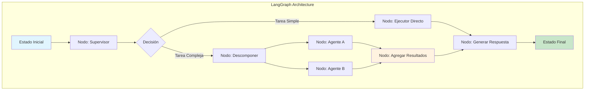
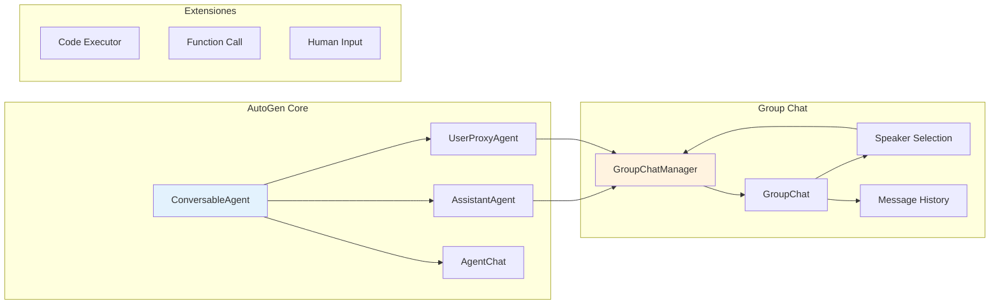
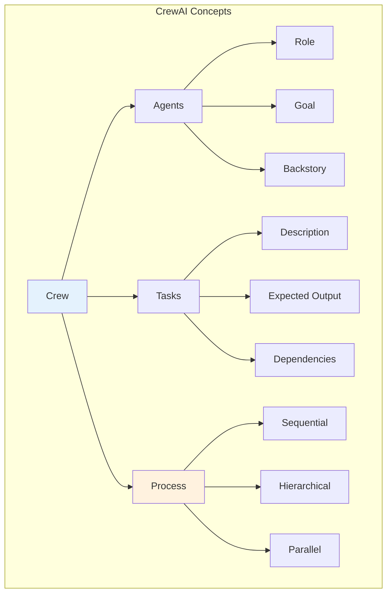

# Clase 19: Herramientas de Orquestación

## LangGraph, AutoGen, CrewAI y Orquestación con Docker

---

## Duración
**4 horas (240 minutos)**

---

## Objetivos de Aprendizaje

Al finalizar esta clase, el estudiante será capaz de:

1. **Dominar LangGraph** para crear grafos de estados y workflows de agentes
2. **Implementar sistemas con AutoGen** para conversaciones multi-agente
3. **Utilizar CrewAI** para orquestación basada en roles
4. **Contenerizar sistemas multi-agente** con Docker
5. **Diseñar pipelines de orquestación** complejos con control de flujo
6. **Implementar patrones de supervisión** y manejo de errores

---

## Contenidos Detallados

### 1. LangGraph: Orquestación Basada en Grafos

#### 1.1 Conceptos Fundamentales de LangGraph

LangGraph es una biblioteca que extiende LangChain para permitir la creación de grafos de estados (state graphs), donde los nodos representan funciones o agentes y las aristas representan transiciones basadas en el estado actual. A diferencia de las cadenas de LangChain que son secuenciales, LangGraph permite ciclos, ramas condicionales y múltiples puntos de entrada y salida.

El concepto central de LangGraph es el **StateGraph**, que mantiene un estado compartido que se actualiza a medida que el grafo se ejecuta. Cada nodo es una función que recibe el estado actual, realiza alguna operación y retorna una actualización del estado. Las aristas determinan qué nodo se ejecuta a continuación basándose en el estado.

Esta arquitectura es particularmente útil para sistemas multi-agente porque permite modelar interacciones complejas como:
- Ciclos de retroalimentación donde un agente puede pedir clarificación a otro
- Ramificación condicional basada en el tipo de tarea o resultados intermedios
- Puntos de sincronización donde múltiples ramas deben converger
- Manejo de errores con reintentos o escalamiento



#### 1.2 Implementación de StateGraphs

```python
from langgraph.graph import StateGraph, END
from langgraph.prebuilt import create_react_agent
from typing import TypedDict, Annotated, List
from typing_extensions import NotRequired
import operator

class AgentState(TypedDict):
    """Estado del grafo de agentes."""
    messages: List[str]
    current_agent: str
    task_result: NotRequired[str]
    error: NotRequired[str]
    retry_count: int
    final_response: NotRequired[str]

def create_supervisor_node(llm):
    """Crea el nodo supervisor que decide el flujo."""
    
    def supervisor_node(state: AgentState) -> AgentState:
        messages = state.get("messages", [])
        
        if not messages:
            return {"current_agent": "end"}
        
        last_message = messages[-1]
        
        if "investigar" in last_message.lower():
            return {"current_agent": "researcher"}
        elif "escribir" in last_message.lower():
            return {"current_agent": "writer"}
        elif "revisar" in last_message.lower():
            return {"current_agent": "reviewer"}
        else:
            return {"current_agent": "generalist"}
    
    return supervisor_node

def create_researcher_node(tools: List):
    """Crea el nodo del agente investigador."""
    
    def researcher_node(state: AgentState) -> AgentState:
        task = state.get("messages", [""])[-1]
        
        agent = create_react_agent(llm, tools)
        result = agent.invoke({"messages": [("user", f"Investiga: {task}")})
        
        return {
            "task_result": result["messages"][-1].content,
            "current_agent": "supervisor"
        }
    
    return researcher_node

def create_writer_node(llm):
    """Crea el nodo del agente escritor."""
    
    def writer_node(state: AgentState) -> AgentState:
        research = state.get("task_result", "")
        
        prompt = f"""
        Basándote en la siguiente investigación, escribe un documento completo:
        
        {research}
        """
        
        response = llm.invoke(prompt)
        
        return {
            "task_result": response.content,
            "current_agent": "supervisor"
        }
    
    return writer_node

def route_to_agent(state: AgentState) -> str:
    """Función de enrutamiento basada en el estado."""
    return state.get("current_agent", "supervisor")

def create_multi_agent_graph(llm, tools: List) -> StateGraph:
    """Crea el grafo completo de múltiples agentes."""
    
    workflow = StateGraph(AgentState)
    
    workflow.add_node("supervisor", create_supervisor_node(llm))
    workflow.add_node("researcher", create_researcher_node(tools))
    workflow.add_node("writer", create_writer_node(llm))
    workflow.add_node("generalist", create_generalist_node(llm))
    
    workflow.set_entry_point("supervisor")
    
    workflow.add_conditional_edges(
        "supervisor",
        route_to_agent,
        {
            "researcher": "researcher",
            "writer": "writer",
            "generalist": "generalist",
            "end": END
        }
    )
    
    workflow.add_edge("researcher", "supervisor")
    workflow.add_edge("writer", "supervisor")
    workflow.add_edge("generalist", END)
    
    return workflow.compile()

def create_generalist_node(llm):
    """Nodo para tareas generales sin especialización."""
    
    def generalist_node(state: AgentState) -> AgentState:
        task = state.get("messages", [""])[-1]
        
        response = llm.invoke(task)
        
        return {
            "final_response": response.content,
            "current_agent": "end"
        }
    
    return generalist_node
```

#### 1.3 Patrones Avanzados de LangGraph

```python
from langgraph.graph import StateGraph
from typing import Dict, Any, List, Literal
from pydantic import BaseModel
import asyncio

class WorkflowState(BaseModel):
    """Estado para workflows complejos."""
    task: str
    subtasks: List[Dict[str, Any]] = []
    completed_subtasks: List[Dict[str, Any]] = []
    current_subtask_index: int = 0
    results: Dict[str, Any] = {}
    errors: List[str] = []
    status: Literal["pending", "in_progress", "completed", "failed"] = "pending"

class ParallelExecutor:
    """Ejecutor de nodos en paralelo usando LangGraph."""
    
    def __init__(self):
        self.graph = StateGraph(WorkflowState)
        self._setup_graph()
    
    def _setup_graph(self):
        """Configura el grafo con ejecución paralela."""
        
        def decomposer(state: WorkflowState) -> WorkflowState:
            subtasks = self._generate_subtasks(state.task)
            return {
                "subtasks": subtasks,
                "status": "in_progress"
            }
        
        def parallel_executor(state: WorkflowState) -> WorkflowState:
            current_idx = state.current_subtask_index
            
            if current_idx >= len(state.subtasks):
                return {"status": "completed"}
            
            current_task = state.subtasks[current_idx]
            result = self._execute_subtask(current_task)
            
            return {
                "completed_subtasks": state.completed_subtasks + [result],
                "current_subtask_index": current_idx + 1,
                "results": {**state.results, current_task["id"]: result}
            }
        
        def check_completion(state: WorkflowState) -> Literal["continue", "end"]:
            if state.current_subtask_index < len(state.subtasks):
                return "continue"
            return "end"
        
        self.graph.add_node("decomposer", decomposer)
        self.graph.add_node("executor", parallel_executor)
        
        self.graph.set_entry_point("decomposer")
        self.graph.add_edge("decomposer", "executor")
        
        self.graph.add_conditional_edges(
            "executor",
            lambda x: "executor" if x["current_subtask_index"] < len(x["subtasks"]) else END,
            {"executor": "executor", END: END}
        )
    
    def _generate_subtasks(self, task: str) -> List[Dict[str, Any]]:
        """Genera subtareas para una tarea dada."""
        return [
            {"id": "subtask_1", "description": f"Parte 1 de: {task}"},
            {"id": "subtask_2", "description": f"Parte 2 de: {task}"},
            {"id": "subtask_3", "description": f"Parte 3 de: {task}"}
        ]
    
    def _execute_subtask(self, subtask: Dict[str, Any]) -> Dict[str, Any]:
        """Ejecuta una subtarea individual."""
        return {
            "id": subtask["id"],
            "result": f"Completado: {subtask['description']}"
        }
    
    def compile(self):
        """Compila el grafo."""
        return self.graph.compile()
    
    async def run(self, task: str) -> Dict[str, Any]:
        """Ejecuta el workflow."""
        compiled = self.compile()
        result = await compiled.ainvoke({"task": task})
        return result

class ConditionalBranchGraph:
    """Grafo con ramas condicionales complejas."""
    
    def __init__(self, llm):
        self.llm = llm
        self.graph = StateGraph(WorkflowState)
        self._setup()
    
    def _setup(self):
        """Configura el grafo condicional."""
        
        def classify_task(state: WorkflowState) -> str:
            task = state.task.lower()
            
            if any(word in task for word in ["investigar", "buscar", "analizar"]):
                return "research"
            elif any(word in task for word in ["escribir", "crear", "generar"]):
                return "create"
            elif any(word in task for word in ["revisar", "verificar", "corregir"]):
                return "review"
            else:
                return "general"
        
        def research_path(state: WorkflowState) -> WorkflowState:
            return {"results": {"path": "research_executed"}}
        
        def create_path(state: WorkflowState) -> WorkflowState:
            return {"results": {"path": "create_executed"}}
        
        def review_path(state: WorkflowState) -> WorkflowState:
            return {"results": {"path": "review_executed"}}
        
        def general_path(state: WorkflowState) -> WorkflowState:
            return {"results": {"path": "general_executed"}}
        
        self.graph.add_node("classifier", classify_task)
        self.graph.add_node("research", research_path)
        self.graph.add_node("create", create_path)
        self.graph.add_node("review", review_path)
        self.graph.add_node("general", general_path)
        
        self.graph.set_entry_point("classifier")
        
        self.graph.add_conditional_edges(
            "classifier",
            lambda x: x,
            {
                "research": "research",
                "create": "create",
                "review": "review",
                "general": "general"
            }
        )
        
        for node in ["research", "create", "review", "general"]:
            self.graph.add_edge(node, END)
    
    def compile(self):
        """Compila el grafo."""
        return self.graph.compile()
```

### 2. AutoGen: Sistema Multi-Agente de Microsoft

#### 2.1 Arquitectura de AutoGen

AutoGen es un framework de Microsoft que facilita la creación de sistemas multi-agente donde los agentes pueden conversar entre sí para resolver tareas. A diferencia de LangGraph que se centra en el control de flujo, AutoGen enfatiza la conversación y colaboración entre agentes.

Los componentes principales de AutoGen incluyen:
- **ConversableAgent**: Clase base para agentes que pueden participar en conversaciones
- **GroupChat**: Permite que múltiples agentes conversen en un grupo
- **GroupChatManager**: Gestiona el flujo de conversación en grupos
- **AssistantAgent**: Agente que actúa como asistente usando un LLM
- **UserProxyAgent**: Agente que simula interacción de usuario

AutoGen soporta diferentes modos de conversación:一对一 (uno a uno), grupos con selección automática de hablante, y grupos con selección programada.



#### 2.2 Implementación de Agentes AutoGen

```python
import autogen
from typing import Dict, List, Any, Optional

class AutoGenMultiAgentSystem:
    """Sistema multi-agente completo usando AutoGen."""
    
    def __init__(
        self,
        llm_config: Dict[str, Any],
        config_list: List[Dict[str, Any]]
    ):
        self.llm_config = llm_config
        self.agents = {}
        self._create_agents(config_list)
        
    def _create_agents(self, config_list: List[Dict[str, Any]]):
        """Crea agentes según la configuración."""
        
        self.agents["user_proxy"] = autogen.UserProxyAgent(
            name="user_proxy",
            human_input_mode="NEVER",
            max_consecutive_auto_reply=10,
            code_execution_config={
                "work_dir": "coding",
                "use_docker": False
            }
        )
        
        for config in config_list:
            agent = self._create_assistant_agent(config)
            self.agents[config["name"]] = agent
    
    def _create_assistant_agent(self, config: Dict[str, Any]) -> autogen.AssistantAgent:
        """Crea un agente asistente."""
        return autogen.AssistantAgent(
            name=config["name"],
            system_message=config.get("system_message", "Eres un asistente útil."),
            llm_config=self.llm_config,
            max_consecutive_auto_reply=config.get("max_replies", 10)
        )
    
    def setup_two_agents_chat(
        self,
        agent1_name: str,
        agent2_name: str,
        initial_message: str
    ) -> Dict[str, Any]:
        """Configura chat entre dos agentes."""
        agent1 = self.agents[agent1_name]
        agent2 = self.agents[agent2_name]
        
        agent1.initiate_chat(
            agent2,
            message=initial_message
        )
        
        return {
            "chat_history": agent1.chat_messages.get(agent2, []),
            "summary": agent1.last_message(agent2)
        }
    
    def setup_group_chat(
        self,
        agent_names: List[str],
        speaker_selection: str = "auto"
    ) -> autogen.GroupChatManager:
        """Configura chat grupal."""
        participants = [self.agents[name] for name in agent_names]
        
        group_chat = autogen.GroupChat(
            agents=participants,
            messages=[],
            max_round=10,
            speaker_selection_method=speaker_selection
        )
        
        manager = autogen.GroupChatManager(
            groupchat=group_chat,
            llm_config=self.llm_config
        )
        
        return manager
    
    def run_group_discussion(
        self,
        topic: str,
        participants: List[str],
        max_rounds: int = 10
    ) -> Dict[str, Any]:
        """Ejecuta una discusión grupal."""
        manager = self.setup_group_chat(participants)
        
        self.agents["user_proxy"].initiate_chat(
            manager,
            message=f"Inicien una discusión sobre: {topic}"
        )
        
        return {
            "messages": self.agents["user_proxy"].chat_messages.get(manager, []),
            "summary": self._generate_summary(manager)
        }
    
    def _generate_summary(self, manager: autogen.GroupChatManager) -> str:
        """Genera un resumen de la discusión."""
        return "Resumen de la discusión..."

class AutoGenWithTools:
    """AutoGen con herramientas definidas."""
    
    def __init__(self, llm_config: Dict[str, Any]):
        self.llm_config = llm_config
        self._setup_agents()
    
    def _setup_agents(self):
        """Configura agentes con herramientas."""
        
        self.agents = {}
        
        researcher_tools = [
            {
                "name": "search_web",
                "description": "Busca información en la web",
                "parameters": {
                    "type": "object",
                    "properties": {
                        "query": {"type": "string", "description": "Consulta de búsqueda"}
                    },
                    "required": ["query"]
                }
            },
            {
                "name": "get_current_date",
                "description": "Obtiene la fecha actual",
                "parameters": {
                    "type": "object",
                    "properties": {}
                }
            }
        ]
        
        self.agents["researcher"] = autogen.AssistantAgent(
            name="researcher",
            system_message="""
            Eres un investigador experto. Tu rol es:
            1. Buscar información relevante sobre el tema dado
            2. Sintetizar los hallazgos
            3. Proporcionar hechos verificables con fuentes
            
            Usa las herramientas disponibles para buscar información actualizada.
            """,
            llm_config=self.llm_config,
            function_map={
                "get_current_date": lambda: {"date": "2026-04-06"}
            }
        )
        
        writer_tools = [
            {
                "name": "format_document",
                "description": "Formatea un documento en markdown",
                "parameters": {
                    "type": "object",
                    "properties": {
                        "content": {"type": "string"},
                        "style": {"type": "string", "enum": ["formal", "informal", "technical"]}
                    },
                    "required": ["content"]
                }
            }
        ]
        
        self.agents["writer"] = autogen.AssistantAgent(
            name="writer",
            system_message="""
            Eres un escritor técnico experto. Tu rol es:
            1. Transformar información en documentos claros
            2. Adaptar el estilo según la audiencia
            3. Mantener precisión factual mientras mejoras legibilidad
            
            Trabaja con el investigador para obtener información precisa.
            """,
            llm_config=self.llm_config
        )
        
        self.agents["user_proxy"] = autogen.UserProxyAgent(
            name="user_proxy",
            human_input_mode="NEVER",
            code_execution_config=False
        )
    
    def collaborative_write(self, topic: str) -> str:
        """Ejecuta escritura colaborativa entre agentes."""
        
        chat_result = self.agents["user_proxy"].initiate_chat(
            self.agents["researcher"],
            message=f"Investiga sobre: {topic}"
        )
        
        research_summary = self._extract_research(chat_result)
        
        writer_result = self.agents["researcher"].initiate_chat(
            self.agents["writer"],
            message=f"Basándote en esta investigación, escribe un documento:\n\n{research_summary}"
        )
        
        return writer_result.summary
    
    def _extract_research(self, chat_result) -> str:
        """Extrae el resumen de la investigación."""
        return chat_result.summary if hasattr(chat_result, 'summary') else ""
```

### 3. CrewAI: Orquestación por Roles

#### 3.1 Conceptos de CrewAI

CrewAI es un framework que se centra en la creación de "crews" (equipos) de agentes con roles definidos que trabajan juntos hacia objetivos comunes. El modelo mental de CrewAI está inspirado en equipos de trabajo humanos donde cada miembro tiene un rol específico y contribuye al éxito del equipo.

Los conceptos clave de CrewAI incluyen:
- **Agent**: Un actor autónomo con rol, objetivo y backstory definidos
- **Task**: Una unidad de trabajo asignada a un agente
- **Crew**: Un grupo de agentes que trabajan en conjunto
- **Process**: Define cómo los agentes ejecutan sus tareas (sequential, hierarchical, parallel)



#### 3.2 Implementación con CrewAI

```python
from crewai import Agent, Task, Crew, Process
from langchain.agents import Tool
from typing import List, Dict, Any

class CrewAIMultiAgentSystem:
    """Sistema multi-agente usando CrewAI."""
    
    def __init__(self, llm: Any, tools: List[Tool]):
        self.llm = llm
        self.tools = tools
        self.agents = {}
        self.tasks = []
        self.crew = None
        
    def create_researcher_agent(self) -> Agent:
        """Crea el agente investigador."""
        return Agent(
            role="Senior Research Analyst",
            goal="Find and synthesize the most relevant information about the given topic",
            backstory="""
            You are an experienced research analyst with a PhD in Information Science.
            You have spent 15 years helping organizations make informed decisions by 
            providing comprehensive, accurate, and well-sourced information.
            You excel at finding patterns in complex data and presenting insights clearly.
            """,
            tools=self.tools,
            llm=self.llm,
            verbose=True,
            allow_delegation=False
        )
    
    def create_writer_agent(self) -> Agent:
        """Crea el agente escritor."""
        return Agent(
            role="Technical Content Writer",
            goal="Transform research findings into clear, engaging, and accurate content",
            backstory="""
            You are a professional technical writer with 10 years of experience creating
            documentation, articles, and reports for various industries. You have a talent
            for explaining complex concepts in accessible language without sacrificing accuracy.
            You always cite your sources and maintain high standards of quality.
            """,
            tools=self.tools,
            llm=self.llm,
            verbose=True,
            allow_delegation=False
        )
    
    def create_reviewer_agent(self) -> Agent:
        """Crea el agente revisor."""
        return Agent(
            role="Quality Assurance Specialist",
            goal="Ensure all content meets quality standards for accuracy and clarity",
            backstory="""
            You are a meticulous QA specialist with a background in both technical writing
            and fact-checking. You have a keen eye for detail and a commitment to accuracy.
            You provide constructive feedback that helps improve content quality.
            """,
            tools=self.tools,
            llm=self.llm,
            verbose=True,
            allow_delegation=False
        )
    
    def create_tasks(
        self,
        researcher: Agent,
        writer: Agent,
        reviewer: Agent,
        topic: str
    ) -> List[Task]:
        """Crea las tareas para cada agente."""
        
        research_task = Task(
            description=f"""
            Conduct comprehensive research on: {topic}
            
            Your deliverables:
            1. Key findings and insights
            2. Supporting data and statistics
            3. Relevant sources and references
            4. A summary report of your findings
            
            Ensure your research is current (up to April 2026) and from reliable sources.
            """,
            agent=researcher,
            expected_output="A detailed research report with findings, data, and sources"
        )
        
        writing_task = Task(
            description="""
            Using the research provided, create a comprehensive document that:
            
            1. Presents the topic clearly with proper structure
            2. Includes all key findings from the research
            3. Uses appropriate tone for the target audience
            4. Properly cites all sources
            5. Concludes with actionable insights
            
            The document should be well-formatted in markdown.
            """,
            agent=writer,
            expected_output="A well-structured markdown document with research findings",
            context=[research_task]
        )
        
        review_task = Task(
            description="""
            Review the draft document and provide feedback:
            
            1. Check factual accuracy of all claims
            2. Verify proper source citations
            3. Assess clarity and readability
            4. Suggest improvements for structure and flow
            5. Ensure the document meets the original objectives
            
            Provide specific, actionable feedback.
            """,
            agent=reviewer,
            expected_output="A detailed review report with suggested improvements",
            context=[writing_task]
        )
        
        return [research_task, writing_task, review_task]
    
    def create_crew(
        self,
        agents: List[Agent],
        tasks: List[Task],
        process: Process = Process.sequential
    ) -> Crew:
        """Crea el crew con agentes y tareas."""
        return Crew(
            agents=agents,
            tasks=tasks,
            process=process,
            verbose=True,
            manager_agent=None if process != Process.hierarchical else self._create_manager()
        )
    
    def _create_manager(self) -> Agent:
        """Crea el agente manager para proceso jerárquico."""
        return Agent(
            role="Project Manager",
            goal="Coordinate the team to achieve optimal results efficiently",
            backstory="""
            You are an experienced project manager who excels at coordinating teams,
            managing timelines, and ensuring quality deliverables. You understand
            each team member's strengths and delegate tasks appropriately.
            """,
            llm=self.llm,
            verbose=True
        )
    
    def kickoff(self, topic: str) -> Dict[str, Any]:
        """Ejecuta el crew con el tema dado."""
        researcher = self.create_researcher_agent()
        writer = self.create_writer_agent()
        reviewer = self.create_reviewer_agent()
        
        tasks = self.create_tasks(researcher, writer, reviewer, topic)
        
        crew = self.create_crew(
            agents=[researcher, writer, reviewer],
            tasks=tasks,
            process=Process.sequential
        )
        
        result = crew.kickoff()
        
        return {
            "result": result,
            "research_output": tasks[0].output,
            "writing_output": tasks[1].output,
            "review_output": tasks[2].output
        }

def create_crewai_system(llm: Any, tools: List[Tool]) -> CrewAIMultiAgentSystem:
    """Factory function para crear el sistema CrewAI."""
    return CrewAIMultiAgentSystem(llm, tools)
```

### 4. Docker para Sistemas Multi-Agente

#### 4.1 Containerización de Agentes

```dockerfile
# Dockerfile para agente individual
FROM python:3.11-slim

WORKDIR /app

RUN pip install --no-cache-dir \
    langchain \
    langchain-openai \
    langchain-community \
    chromadb \
    neo4j-driver \
    redis \
    pydantic

COPY requirements.txt .
RUN pip install --no-cache-dir -r requirements.txt

COPY src/ ./src/

ENV PYTHONUNBUFFERED=1
ENV LOG_LEVEL=INFO

CMD ["python", "-m", "src.agent"]
```

```yaml
# docker-compose.yml para sistema multi-agente
version: '3.8'

services:
  redis:
    image: redis:7-alpine
    ports:
      - "6379:6379"
    volumes:
      - redis_data:/data
    command: redis-server --appendonly yes
    
  message_bus:
    build:
      context: .
      dockerfile: Dockerfile.message_bus
    ports:
      - "8000:8000"
    depends_on:
      - redis
    environment:
      - REDIS_HOST=redis
      - REDIS_PORT=6379
    
  orchestrator:
    build:
      context: .
      dockerfile: Dockerfile.orchestrator
    ports:
      - "8001:8001"
    depends_on:
      - message_bus
      - redis
    environment:
      - MESSAGE_BUS_URL=http://message_bus:8000
      - REDIS_HOST=redis
    volumes:
      - ./config:/app/config
      
  researcher_agent:
    build:
      context: .
      dockerfile: Dockerfile.agent
    depends_on:
      - message_bus
      - redis
    environment:
      - AGENT_TYPE=researcher
      - MESSAGE_BUS_URL=http://message_bus:8000
      - REDIS_HOST=redis
    deploy:
      replicas: 2
      
  writer_agent:
    build:
      context: .
      dockerfile: Dockerfile.agent
    depends_on:
      - message_bus
      - redis
    environment:
      - AGENT_TYPE=writer
      - MESSAGE_BUS_URL=http://message_bus:8000
      - REDIS_HOST=redis
    deploy:
      replicas: 2
      
  api_gateway:
    build:
      context: .
      dockerfile: Dockerfile.gateway
    ports:
      - "8080:8080"
    depends_on:
      - orchestrator
    environment:
      - ORCHESTRATOR_URL=http://orchestrator:8001

volumes:
  redis_data:
```

```dockerfile
# Dockerfile para Message Bus
FROM python:3.11-slim

WORKDIR /app

RUN pip install --no-cache-dir \
    fastapi \
    uvicorn \
    redis \
    pydantic \
    websockets

COPY message_bus/ ./message_bus/

CMD ["uvicorn", "message_bus.main:app", "--host", "0.0.0.0", "--port", "8000"]
```

#### 4.2 Orquestación de Agentes con Docker

```python
# agent_docker.py - Configuración para agentes en Docker

import os
from typing import Dict, Any
import redis
import json
import asyncio
from abc import ABC, abstractmethod

class AgentConfig:
    """Configuración para agentes dockerizados."""
    
    def __init__(self):
        self.agent_type = os.getenv("AGENT_TYPE", "generic")
        self.agent_id = os.getenv("AGENT_ID", f"{self.agent_type}-{os.getenv('HOSTNAME', 'local')}")
        self.message_bus_url = os.getenv("MESSAGE_BUS_URL", "http://localhost:8000")
        self.redis_host = os.getenv("REDIS_HOST", "localhost")
        self.redis_port = int(os.getenv("REDIS_PORT", "6379"))
        
class DockerizedAgent(ABC):
    """Clase base para agentes que corren en Docker."""
    
    def __init__(self, config: AgentConfig):
        self.config = config
        self.redis = redis.Redis(
            host=config.redis_host,
            port=config.redis_port,
            decode_responses=True
        )
        self._running = False
        
    @abstractmethod
    async def process_message(self, message: Dict[str, Any]) -> Dict[str, Any]:
        """Procesa un mensaje entrante."""
        pass
    
    async def run(self):
        """Loop principal del agente."""
        self._running = True
        subscription_key = f"agent:{self.config.agent_type}:tasks"
        
        pubsub = self.redis.pubsub()
        pubsub.subscribe(subscription_key)
        
        print(f"Agent {self.config.agent_id} started, listening on {subscription_key}")
        
        while self._running:
            message = pubsub.get_message(ignore_subscribe_messages=True)
            
            if message and message["type"] == "message":
                try:
                    task_data = json.loads(message["data"])
                    result = await self.process_message(task_data)
                    
                    result_key = f"result:{task_data.get('task_id')}"
                    self.redis.setex(
                        result_key,
                        3600,
                        json.dumps(result)
                    )
                    
                    self.redis.publish(
                        f"agent:{self.config.agent_type}:results",
                        json.dumps({
                            "task_id": task_data.get("task_id"),
                            "agent_id": self.config.agent_id,
                            "status": "completed"
                        })
                    )
                except Exception as e:
                    print(f"Error processing message: {e}")
            
            await asyncio.sleep(0.1)
    
    def stop(self):
        """Detiene el agente."""
        self._running = False

class DockerMessageBus:
    """Cliente de message bus para agentes dockerizados."""
    
    def __init__(self, message_bus_url: str):
        self.message_bus_url = message_bus_url
        self.redis = redis.Redis(
            host=os.getenv("REDIS_HOST", "localhost"),
            port=int(os.getenv("REDIS_PORT", "6379")),
            decode_responses=True
        )
    
    def publish_task(self, agent_type: str, task: Dict[str, Any]) -> str:
        """Publica una tarea para un tipo de agente."""
        task_id = f"task_{self.redis.incr('task_counter')}"
        task["task_id"] = task_id
        
        self.redis.publish(
            f"agent:{agent_type}:tasks",
            json.dumps(task)
        )
        
        return task_id
    
    def wait_for_result(self, task_id: str, timeout: int = 60) -> Dict[str, Any]:
        """Espera el resultado de una tarea."""
        result_key = f"result:{task_id}"
        
        start_time = asyncio.get_event_loop().time()
        while asyncio.get_event_loop().time() - start_time < timeout:
            result = self.redis.get(result_key)
            if result:
                return json.loads(result)
        
        return {"error": "Timeout waiting for result"}
```

```bash
#!/bin/bash
# deploy_multi_agent.sh - Script de despliegue

set -e

echo "Building Docker images..."
docker-compose build

echo "Starting Redis..."
docker-compose up -d redis

echo "Starting Message Bus..."
docker-compose up -d message_bus

echo "Starting Orchestrator..."
docker-compose up -d orchestrator

echo "Waiting for services to be ready..."
sleep 10

echo "Scaling agents..."
docker-compose up -d --scale researcher_agent=3
docker-compose up -d --scale writer_agent=2

echo "Starting API Gateway..."
docker-compose up -d api_gateway

echo "Deployment complete!"
docker-compose ps
```

---

## Tecnologías Específicas

| Tecnología | Propósito | Versión Recomendada |
|------------|-----------|---------------------|
| LangGraph | Orquestación basada en grafos | 0.0.x |
| AutoGen | Sistema multi-agente Microsoft | 0.2.x |
| CrewAI | Orquestación por roles | Latest |
| Docker | Containerización | 24.x |
| Docker Compose | Orquestación de contenedores | 2.x |
| Redis | Message broker y cache | 7.x |
| FastAPI | API del message bus | 0.1xx |

---

## Actividades de Laboratorio

### Laboratorio 1: LangGraph con Control de Flujo

**Duración**: 90 minutos

**Objetivo**: Implementar un grafo de estados para un pipeline de procesamiento de documentos.

**Pasos**:
1. Crear StateGraph con estados para cada etapa del pipeline
2. Implementar nodos: parser, validator, transformer, exporter
3. Añadir ramificación condicional basada en validación
4. Implementar manejo de errores con reintentos
5. Compilar y ejecutar el grafo con diferentes inputs

### Laboratorio 2: AutoGen Group Chat

**Duración**: 60 minutos

**Objetivo**: Crear un debate automático entre agentes con diferentes perspectivas.

**Pasos**:
1. Configurar 3-4 agentes con roles y perspectivas distintas
2. Implementar GroupChat con selección automática de hablante
3. Iniciar debate sobre un tema controversial
4. Analizar el desarrollo de la conversación
5. Extraer puntos de convergencia y divergencia

### Laboratorio 3: Sistema Completo en Docker

**Duración**: 90 minutos

**Objetivo**: Desplegar un sistema multi-agente completo con Docker Compose.

**Pasos**:
1. Crear Dockerfiles para cada componente
2. Configurar docker-compose.yml
3. Implementar health checks
4. Configurar red y volúmenes
5. Escalar agentes horizontalmente
6. Probar con carga concurrente

---

## Ejercicios Prácticos Resueltos

### Ejercicio 1: LangGraph con Ramificación Condicional

```python
# SOLUCIÓN COMPLETA

from langgraph.graph import StateGraph, END
from typing import TypedDict, Literal
import random

class DocumentState(TypedDict):
    """Estado para procesamiento de documentos."""
    document: dict
    validation_result: str
    processing_stage: str
    errors: list
    output: str

def create_validation_node():
    """Nodo que valida el documento."""
    def validate(state: DocumentState) -> DocumentState:
        doc = state["document"]
        
        required_fields = ["title", "content", "author"]
        missing_fields = [f for f in required_fields if f not in doc]
        
        if missing_fields:
            return {
                "validation_result": "failed",
                "errors": [f"Missing fields: {missing_fields}"]
            }
        
        if len(doc.get("content", "")) < 100:
            return {
                "validation_result": "failed",
                "errors": ["Content too short"]
            }
        
        return {"validation_result": "passed"}
    
    return validate

def create_processing_nodes():
    """Crea nodos de procesamiento."""
    
    def clean_node(state: DocumentState) -> DocumentState:
        return {
            "processing_stage": "cleaning",
            "output": f"Cleaned: {state['document'].get('title', 'Untitled')}"
        }
    
    def enrich_node(state: DocumentState) -> DocumentState:
        return {
            "processing_stage": "enriching",
            "output": f"Enriched: {state['output']}"
        }
    
    def format_node(state: DocumentState) -> DocumentState:
        return {
            "processing_stage": "formatting",
            "output": f"Formatted: {state['output']}"
        }
    
    return clean_node, enrich_node, format_node

def route_based_on_validation(state: DocumentState) -> Literal["process", "end"]:
    """Rutea basado en el resultado de validación."""
    if state.get("validation_result") == "passed":
        return "process"
    return "end"

def create_document_pipeline() -> StateGraph:
    """Crea el pipeline completo de documentos."""
    
    workflow = StateGraph(DocumentState)
    
    workflow.add_node("validate", create_validation_node())
    
    clean, enrich, format_fn = create_processing_nodes()
    workflow.add_node("clean", clean)
    workflow.add_node("enrich", enrich)
    workflow.add_node("format", format_fn)
    
    workflow.set_entry_point("validate")
    
    workflow.add_conditional_edges(
        "validate",
        route_based_on_validation,
        {
            "process": "clean",
            "end": END
        }
    )
    
    workflow.add_edge("clean", "enrich")
    workflow.add_edge("enrich", "format")
    workflow.add_edge("format", END)
    
    return workflow.compile()

def demonstrate_pipeline():
    """Demuestra el pipeline."""
    pipeline = create_document_pipeline()
    
    test_cases = [
        {
            "name": "Documento válido",
            "doc": {
                "title": "Reporte de Investigación",
                "content": "A" * 150,
                "author": "Dr. Smith"
            }
        },
        {
            "name": "Documento inválido",
            "doc": {
                "title": "Nota corta",
                "content": "Muy corto"
            }
        }
    ]
    
    for test in test_cases:
        print(f"\n{'='*50}")
        print(f"Test: {test['name']}")
        print(f"{'='*50}")
        
        result = pipeline.invoke({
            "document": test["doc"],
            "validation_result": "",
            "processing_stage": "",
            "errors": []
        })
        
        print(f"Validation: {result.get('validation_result', 'N/A')}")
        print(f"Stage: {result.get('processing_stage', 'N/A')}")
        print(f"Output: {result.get('output', 'None')}")
        if result.get("errors"):
            print(f"Errors: {result['errors']}")

demonstrate_pipeline()
```

### Ejercicio 2: AutoGen con Funciones Personalizadas

```python
# SOLUCIÓN COMPLETA

import autogen
from typing import Dict, Any, List

def create_agents_with_functions() -> Dict[str, autogen.AssistantAgent]:
    """Crea agentes con funciones personalizadas."""
    
    llm_config = {
        "model": "gpt-4",
        "api_key": "your-api-key",
        "temperature": 0.7
    }
    
    def calculate_budget(budget_data: Dict) -> str:
        """Función para calcular presupuesto."""
        items = budget_data.get("items", [])
        total = sum(item.get("cost", 0) * item.get("quantity", 1) for item in items)
        return f"Presupuesto total: ${total:.2f}"
    
    def analyze_risk(risk_factors: List[str]) -> str:
        """Función para analizar riesgos."""
        high_risk = [f for f in risk_factors if "high" in f.lower()]
        medium_risk = [f for f in risk_factors if "medium" in f.lower()]
        
        return f"""
        Análisis de Riesgos:
        - Alto riesgo: {len(high_risk)} factores
        - Riesgo medio: {len(medium_risk)} factores
        - Total factores: {len(risk_factors)}
        """
    
    budget_agent = autogen.AssistantAgent(
        name="budget_agent",
        system_message="""
        Eres un agente especializado en presupuestos y costos.
        Usa la función calculate_budget para estimar costos.
        Proporciona desgloses detallados de los costos.
        """,
        llm_config=llm_config,
        function_map={
            "calculate_budget": calculate_budget
        }
    )
    
    risk_agent = autogen.AssistantAgent(
        name="risk_agent",
        system_message="""
        Eres un agente especializado en gestión de riesgos.
        Usa la función analyze_risk para evaluar factores.
        Proporciona recomendaciones de mitigación.
        """,
        llm_config=llm_config,
        function_map={
            "analyze_risk": analyze_risk
        }
    )
    
    coordinator = autogen.AssistantAgent(
        name="coordinator",
        system_message="""
        Eres el coordinador de un equipo de análisis.
        Tu rol es:
        1. Recibir solicitudes del usuario
        2. Delegar tareas a los agentes apropiados
        3. Agregar los resultados
        
        Trabaja con budget_agent y risk_agent.
        """,
        llm_config=llm_config
    )
    
    user_proxy = autogen.UserProxyAgent(
        name="user_proxy",
        human_input_mode="NEVER"
    )
    
    return {
        "budget_agent": budget_agent,
        "risk_agent": risk_agent,
        "coordinator": coordinator,
        "user_proxy": user_proxy
    }

def demonstrate_multi_agent_function():
    """Demuestra agentes con funciones."""
    
    agents = create_agents_with_functions()
    
    budget_data = {
        "items": [
            {"name": "Servidores", "cost": 5000, "quantity": 3},
            {"name": "Licencias", "cost": 1000, "quantity": 10},
            {"name": "Capacitación", "cost": 2000, "quantity": 2}
        ]
    }
    
    risk_factors = [
        "Alta dependencia de proveedores",
        "Complejidad técnica media",
        "Recursos humanos limitados"
    ]
    
    print("Presupuesto:")
    result = agents["budget_agent"].generate_reply(
        [{"content": f"Calcula el presupuesto: {budget_data}", "role": "user"}]
    )
    print(result)
    
    print("\nAnálisis de Riesgos:")
    result = agents["risk_agent"].generate_reply(
        [{"content": f"Analiza los riesgos: {risk_factors}", "role": "user"}]
    )
    print(result)

demonstrate_multi_agent_function()
```

---

## Resumen de Puntos Clave

### Puntos Clave de la Clase

1. **LangGraph**: Proporciona grafos de estados para modelar flujos de trabajo complejos con ciclos, ramas condicionales y manejo de errores.

2. **StateGraph**: Mantiene estado compartido que se actualiza a través de nodos, permitiendo coordinación sofisticada entre agentes.

3. **AutoGen**: Framework de Microsoft centrado en conversaciones entre agentes, ideal para debates y colaboración dinámica.

4. **GroupChat**: Permite que múltiples agentes conversen con selección automática o programada de hablantes.

5. **CrewAI**: Modelo de "equipos" con roles definidos, optimizado para flujos de trabajo estructurados y jerárquicos.

6. **Docker**: Essential para desplegar sistemas multi-agente en producción con escalabilidad horizontal.

7. **Service Discovery**: Los agentes dockerizados necesitan mecanismos para descubrir y comunicarse entre sí.

8. **Orquestación**: Docker Compose permite definir y gestionar sistemas multi-agente complejos como servicios coordinados.

---

## Referencias Externas

1. **LangGraph Documentation**: https://python.langchain.com/docs/concepts/langgraph/

2. **AutoGen GitHub**: https://github.com/microsoft/autogen

3. **CrewAI Documentation**: https://docs.crewai.com/

4. **Docker Multi-Agent Patterns**: https://docs.docker.com/compose/

5. **LangGraph Examples**: https://github.com/langchain-ai/langgraph

6. **AutoGen Gallery**: https://microsoft.github.io/autogen/docs/Gallery

7. **Container Orchestration**: https://kubernetes.io/

8. **Message Queue Patterns**: https://www.enterpriseintegrationpatterns.com/

---

*Fecha de creación: Abril 2026*
*Versión: 1.0*
*Autor: Sistema de Cursos UTU-IA*
