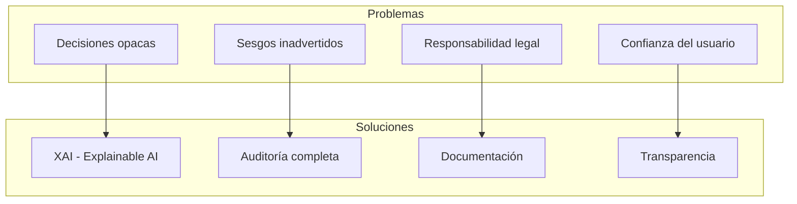

# Clase 21: Auditoría de Decisiones de IA

## Duración
**4 horas (240 minutos)**

---

## Objetivos de Aprendizaje

Al finalizar esta clase, el estudiante será capaz de:

1. **Comprender** los fundamentos de la explicabilidad (Explainability) en sistemas de IA
2. **Implementar** logging detallado de decisiones de IA
3. **Diseñar** sistemas de trazabilidad para modelos de lenguaje
4. **Utilizar** herramientas como LangSmith y Shapash para auditoría
5. **Crear** registros de auditoría compliance-ready
6. **Analizar** y debuggear decisiones del modelo

---

## Contenidos Detallados

### 1.1 Fundamentos de Explainability en IA (45 minutos)

#### 1.1.1 ¿Por qué necesitamos explicabilidad?



**Niveles de explicabilidad:**

| Nivel | Descripción | Ejemplo |
|-------|-------------|---------|
| **Globally** | Cómo funciona el modelo en general | Feature importance |
| **Locally** | Por qué una predicción específica | LIME, SHAP |
| **Procedural** | Cómo se llegó al resultado | Chain of thought |

#### 1.1.2 Marco de Explicabilidad

```python
"""
Framework de Explicabilidad
===========================
"""

from typing import Dict, List, Any, Optional
from dataclasses import dataclass, field
from datetime import datetime
import json
import hashlib


@dataclass
class DecisionRecord:
    """Registro de una decisión de IA"""
    decision_id: str
    timestamp: datetime
    model_name: str
    input_data: Dict
    output: Any
    confidence: float
    reasoning: List[str] = field(default_factory=list)
    metadata: Dict = field(default_factory=dict)
    trace_id: Optional[str] = None


class ExplainabilityFramework:
    """Framework para explicabilidad"""
    
    def __init__(self):
        self.decision_log = []
    
    def record_decision(self, decision: DecisionRecord) -> str:
        """Registrar una decisión"""
        decision.decision_id = self._generate_id(decision)
        self.decision_log.append(decision)
        return decision.decision_id
    
    def explain_decision(self, decision_id: str) -> Dict:
        """Explicar una decisión específica"""
        decision = self._find_decision(decision_id)
        if not decision:
            return {"error": "Decisión no encontrada"}
        
        return {
            "decision_id": decision.decision_id,
            "timestamp": decision.timestamp.isoformat(),
            "model": decision.model_name,
            "input_summary": self._summarize_input(decision.input_data),
            "output": decision.output,
            "confidence": decision.confidence,
            "reasoning_steps": decision.reasoning,
            "explanation": self._generate_explanation(decision)
        }
    
    def _generate_id(self, decision: DecisionRecord) -> str:
        """Generar ID único"""
        content = f"{decision.timestamp}{decision.input_data}"
        return hashlib.md5(content.encode()).hexdigest()[:16]
    
    def _find_decision(self, decision_id: str) -> Optional[DecisionRecord]:
        """Encontrar decisión"""
        for d in self.decision_log:
            if d.decision_id == decision_id:
                return d
        return None
    
    def _summarize_input(self, input_data: Dict) -> Dict:
        """ resumir input (remover datos sensibles)"""
        summary = {}
        for key, value in input_data.items():
            if key.lower() in ["password", "token", "secret"]:
                summary[key] = "***REDACTED***"
            elif isinstance(value, str) and len(value) > 100:
                summary[key] = value[:100] + "..."
            else:
                summary[key] = value
        return summary
    
    def _generate_explanation(self, decision: DecisionRecord) -> str:
        """Generar explicación textual"""
        parts = [
            f"El modelo {decision.model_name} generó esta decisión.",
            f"El nivel de confianza fue {decision.confidence:.1%}."
        ]
        
        if decision.reasoning:
            parts.append("Pasos de razonamiento:")
            for i, step in enumerate(decision.reasoning, 1):
                parts.append(f"  {i}. {step}")
        
        return "\n".join(parts)
```

---

### 2.1 Logging de Decisiones (60 minutos)

#### 2.1.1 Sistema de Logging Estructurado

```python
"""
Sistema de Logging de Decisiones
=================================
"""

import logging
import json
from datetime import datetime
from typing import Any, Dict, Optional
from enum import Enum
import traceback


class DecisionLevel(Enum):
    """Nivel de criticidad de la decisión"""
    INFO = "info"
    WARNING = "warning"
    ERROR = "error"
    CRITICAL = "critical"


class DecisionLogger:
    """Logger estructurado para decisiones de IA"""
    
    def __init__(self, log_file: str = "decisions.log"):
        self.logger = logging.getLogger("ai_decisions")
        self.logger.setLevel(logging.DEBUG)
        
        # Handler para archivo
        file_handler = logging.FileHandler(log_file)
        file_handler.setLevel(logging.DEBUG)
        
        # Formato estructurado
        formatter = logging.Formatter(
            '%(asctime)s | %(levelname)s | %(message)s',
            defaults={'extra': {}}
        )
        file_handler.setFormatter(formatter)
        
        self.logger.addHandler(file_handler)
    
    def log_decision(
        self,
        level: DecisionLevel,
        message: str,
        model: str,
        input_data: Dict = None,
        output: Any = None,
        metadata: Dict = None,
        trace_id: Optional[str] = None
    ):
        """Registrar decisión"""
        log_entry = {
            "timestamp": datetime.utcnow().isoformat(),
            "level": level.value,
            "model": model,
            "trace_id": trace_id,
            "message": message,
            "input": self._sanitize_data(input_data or {}),
            "output": str(output)[:500],  # Truncar output largo
            "metadata": metadata or {}
        }
        
        log_message = json.dumps(log_entry)
        
        if level == DecisionLevel.INFO:
            self.logger.info(log_message)
        elif level == DecisionLevel.WARNING:
            self.logger.warning(log_message)
        elif level == DecisionLevel.ERROR:
            self.logger.error(log_message)
        elif level == DecisionLevel.CRITICAL:
            self.logger.critical(log_message)
    
    def _sanitize_data(self, data: Dict) -> Dict:
        """Sanitizar datos sensibles"""
        sensitive_keys = {
            'password', 'token', 'secret', 'api_key', 
            'credit_card', 'ssn', 'dni'
        }
        
        sanitized = {}
        for key, value in data.items():
            if any(s in key.lower() for s in sensitive_keys):
                sanitized[key] = "***REDACTED***"
            else:
                sanitized[key] = value
        
        return sanitized


class DecisionTracer:
    """Trazador de decisiones para debugging"""
    
    def __init__(self):
        self.traces = {}
    
    def start_trace(self, trace_id: str, context: Dict) -> str:
        """Iniciar un trace"""
        if trace_id in self.traces:
            # Continuar trace existente
            return trace_id
        
        self.traces[trace_id] = {
            "trace_id": trace_id,
            "start_time": datetime.utcnow(),
            "context": context,
            "steps": []
        }
        return trace_id
    
    def add_step(
        self, 
        trace_id: str, 
        step_name: str, 
        data: Dict = None,
        result: Any = None
    ):
        """Agregar paso al trace"""
        if trace_id not in self.traces:
            return
        
        step = {
            "step": step_name,
            "timestamp": datetime.utcnow().isoformat(),
            "data": data,
            "result": str(result)[:200] if result else None
        }
        
        self.traces[trace_id]["steps"].append(step)
    
    def end_trace(self, trace_id: str, final_result: Any = None) -> Dict:
        """Finalizar trace"""
        if trace_id not in self.traces:
            return {}
        
        trace = self.traces[trace_id]
        trace["end_time"] = datetime.utcnow()
        trace["duration"] = (trace["end_time"] - trace["start_time"]).total_seconds()
        trace["final_result"] = str(final_result)[:500] if final_result else None
        
        return trace
    
    def get_trace(self, trace_id: str) -> Optional[Dict]:
        """Obtener trace"""
        return self.traces.get(trace_id)
    
    def get_all_traces(self) -> List[Dict]:
        """Obtener todos los traces"""
        return list(self.traces.values())


# Instancias globales
logger = DecisionLogger()
tracer = DecisionTracer()
```

#### 2.1.2 Decoradores para Logging Automático

```python
"""
Decoradores para logging automático
===================================
"""

import functools
import time
from typing import Callable, Any


def log_decision(model_name: str = "default"):
    """Decorador para registrar decisiones de funciones"""
    def decorator(func: Callable) -> Callable:
        @functools.wraps(func)
        def wrapper(*args, **kwargs):
            start_time = time.time()
            trace_id = tracer.start_trace(
                f"{func.__name__}_{int(start_time * 1000)}",
                {"function": func.__name__, "model": model_name}
            )
            
            # Log de entrada
            logger.log_decision(
                DecisionLevel.INFO,
                f"Llamando a {func.__name__}",
                model=model_name,
                input_data={"args": str(args)[:200], "kwargs": str(kwargs)[:200]},
                trace_id=trace_id
            )
            
            try:
                # Ejecutar función
                result = func(*args, **kwargs)
                
                # Log de éxito
                duration = time.time() - start_time
                logger.log_decision(
                    DecisionLevel.INFO,
                    f"{func.__name__} completada en {duration:.2f}s",
                    model=model_name,
                    output=str(result)[:200],
                    metadata={"duration_seconds": duration},
                    trace_id=trace_id
                )
                
                # Agregar paso al trace
                tracer.add_step(trace_id, "execution", {"duration": duration}, result)
                
                return result
                
            except Exception as e:
                # Log de error
                logger.log_decision(
                    DecisionLevel.ERROR,
                    f"Error en {func.__name__}: {str(e)}",
                    model=model_name,
                    metadata={"error_type": type(e).__name__},
                    trace_id=trace_id
                )
                tracer.add_step(trace_id, "error", {"error": str(e)})
                raise
        
        return wrapper
    return decorator


def log_rag_decision(func: Callable) -> Callable:
    """Decorador específico para funciones RAG"""
    @functools.wraps(func)
    def wrapper(*args, **kwargs):
        trace_id = tracer.start_trace(
            f"rag_{int(time.time() * 1000)}",
            {"type": "rag_pipeline"}
        )
        
        # Agregar paso de input
        tracer.add_step(trace_id, "input", {"query": args[0] if args else kwargs.get('query')})
        
        result = func(*args, **kwargs)
        
        # Agregar paso de output
        tracer.add_step(trace_id, "output", {"response": result.get('response', '')[:200]})
        
        tracer.end_trace(trace_id, result)
        
        return result
    
    return wrapper


# Ejemplo de uso
class RAGService:
    """Servicio RAG con logging"""
    
    @log_decision(model_name="gpt-4")
    def generate_response(self, query: str, context: str) -> str:
        """Generar respuesta"""
        # Simulación
        return f"Respuesta para: {query}"
    
    @log_decision(model_name="embedding-model")
    def embed_text(self, text: str) -> List[float]:
        """Generar embeddings"""
        return [0.1] * 1536
```

---

### 3.1 Implementación con LangSmith (50 minutos)

#### 3.1.1 Configuración de LangSmith

```python
"""
Configuración de LangSmith para Tracing
=======================================
"""

from langchain.callbacks import LangChainTracer
from langchain.schema import AgentAction, AgentFinish, LLMResult
import os


class LangSmithIntegration:
    """Integración con LangSmith"""
    
    def __init__(self, project_name: str = "enterprise-rag"):
        self.project_name = project_name
        self.tracer = None
    
    def setup(self):
        """Configurar LangSmith"""
        # Configurar variables de entorno
        os.environ["LANGCHAIN_TRACING_V2"] = "true"
        os.environ["LANGCHAIN_PROJECT"] = self.project_name
        os.environ["LANGCHAIN_API_KEY"] = os.getenv("LANGCHAIN_API_KEY", "")
        
        # Crear tracer
        self.tracer = LangChainTracer(
            project_name=self.project_name
        )
        
        return self.tracer
    
    def get_tracer(self):
        """Obtener tracer configurado"""
        return self.tracer


class CustomCallbackHandler:
    """Callback handler personalizado para LangSmith"""
    
    def __init__(self):
        self.run_id = None
    
    def on_llm_start(
        self, 
        serialized: dict, 
        prompts: list, 
        run_id: str
    ):
        """Called when LLM starts"""
        self.run_id = run_id
        print(f"[LangSmith] LLM started: {run_id}")
    
    def on_llm_end(self, response: LLMResult, run_id: str):
        """Called when LLM ends"""
        print(f"[LangSmith] LLM ended: {run_id}")
        # Guardar respuesta
        if response.generations:
            for gen in response.generations:
                for g in gen:
                    print(f"  Response: {g.text[:100]}...")
    
    def on_agent_action(
        self, 
        action: AgentAction, 
        run_id: str
    ):
        """Called when agent takes action"""
        print(f"[LangSmith] Agent action: {action.tool}")
        print(f"  Input: {action.tool_input}")
    
    def on_agent_finish(self, finish: AgentFinish, run_id: str):
        """Called when agent finishes"""
        print(f"[LangSmith] Agent finished: {run_id}")
        print(f"  Output: {finish.return_values['output'][:200]}")


# Uso con LangChain
def create_traced_chain():
    """Crear chain con tracing"""
    from langchain.chat_models import ChatOpenAI
    from langchain.prompts import ChatPromptTemplate
    from langchain.chains import LLMChain
    
    # Configurar LangSmith
    ls = LangSmithIntegration(project_name="enterprise-kg")
    tracer = ls.setup()
    
    # Crear chain
    llm = ChatOpenAI(temperature=0)
    prompt = ChatPromptTemplate.from_template(
        "Responde a la pregunta: {question}"
    )
    chain = LLMChain(llm=llm, prompt=prompt)
    
    # Agregar callback handler
    callback_handler = CustomCallbackHandler()
    
    # Ejecutar con callbacks
    response = chain.invoke(
        {"question": "¿Qué es un grafo de conocimiento?"},
        config={"callbacks": [callback_handler]}
    )
    
    return response
```

#### 3.1.2 Monitoreo de Métricas

```python
"""
Monitoreo de métricas con LangSmith
===================================
"""

from typing import Dict, List
from dataclasses import dataclass
import time


@dataclass
class MetricRecord:
    """Registro de métrica"""
    name: str
    value: float
    timestamp: float
    tags: Dict


class MetricsMonitor:
    """Monitor de métricas"""
    
    def __init__(self):
        self.metrics = []
    
    def record_metric(self, name: str, value: float, tags: Dict = None):
        """Registrar métrica"""
        record = MetricRecord(
            name=name,
            value=value,
            timestamp=time.time(),
            tags=tags or {}
        )
        self.metrics.append(record)
    
    def get_metrics(self, name: str = None) -> List[MetricRecord]:
        """Obtener métricas"""
        if name:
            return [m for m in self.metrics if m.name == name]
        return self.metrics
    
    def calculate_latency(self) -> Dict:
        """Calcular latencias"""
        latencies = [m.value for m in self.metrics if m.name == "latency"]
        
        if not latencies:
            return {}
        
        return {
            "avg": sum(latencies) / len(latencies),
            "min": min(latencies),
            "max": max(latencies),
            "p50": sorted(latencies)[len(latencies) // 2],
            "p95": sorted(latencies)[int(len(latencies) * 0.95)],
            "p99": sorted(latencies)[int(len(latencies) * 0.99)]
        }
    
    def calculate_accuracy(self) -> Dict:
        """Calcular precisión"""
        correct = [m.value for m in self.metrics if m.name == "correct"]
        total = len(correct)
        
        if total == 0:
            return {}
        
        return {
            "correct": sum(correct),
            "total": total,
            "accuracy": sum(correct) / total
        }


# Instancia global
metrics_monitor = MetricsMonitor()


def track_latency(func):
    """Decorator para trackear latencia"""
    def wrapper(*args, **kwargs):
        start = time.time()
        result = func(*args, **kwargs)
        duration = time.time() - start
        
        metrics_monitor.record_metric(
            "latency", 
            duration,
            {"function": func.__name__}
        )
        
        return result
    return wrapper
```

---

### 4.1 Implementación con Shapash (45 minutos)

#### 4.1.1 Shapash para Explicabilidad Local

```python
"""
Shapash para explicabilidad local
==================================
"""

from shapash import SmartExplainer
from shapash.utils import load_pretraining
import pandas as pd
import numpy as np


class ShapashExplainer:
    """Explainer usando Shapash"""
    
    def __init__(self, model, features_names: List[str]):
        self.model = model
        self.features_names = features_names
        self.explainer = None
    
    def create_explainer(self, x_train: pd.DataFrame):
        """Crear explainer"""
        self.explainer = SmartExplainer(
            model=self.model,
            features_names=self.features_names
        )
        
        self.explainer.compile(
            x=x_train,
            y_pred= self.model.predict(x_train)
        )
    
    def explain_prediction(self, x: pd.DataFrame, index: int = 0) -> Dict:
        """Explicar predicción específica"""
        if not self.explainer:
            return {"error": "Explainer no inicializado"}
        
        # Obtener predicción específica
        x_pred = x.iloc[[index]]
        
        # Generar explicación
        self.explainer.compile(x=x_pred)
        
        # Obtener contribución de features
        contribution = self.explainer.contribution()
        
        return {
            "prediction": self.model.predict(x_pred)[0],
            "features": self._format_contribution(contribution, index)
        }
    
    def _format_contribution(self, contribution, index: int) -> List[Dict]:
        """Formatear contribución de features"""
        contrib_values = contribution.iloc[index]
        
        return [
            {
                "feature": name,
                "contribution": value,
                "direction": "positive" if value > 0 else "negative"
            }
            for name, value in zip(self.features_names, contrib_values)
        ]
    
    def generate_html_report(self, x: pd.DataFrame, output_path: str = "report.html"):
        """Generar reporte HTML"""
        if not self.explainer:
            return
        
        # Compilar
        self.explainer.compile(x=x.head(10))
        
        # Generar HTML
        self.explainer.to_html(output_path)
        
        return output_path


# Ejemplo de uso
def ejemplo_shapash():
    """Ejemplo de uso de Shapash"""
    from sklearn.ensemble import RandomForestClassifier
    from sklearn.datasets import load_iris
    
    # Cargar datos
    iris = load_iris()
    X = pd.DataFrame(iris.data, columns=iris.feature_names)
    y = iris.target
    
    # Entrenar modelo
    model = RandomForestClassifier(n_estimators=10)
    model.fit(X, y)
    
    # Crear explainer
    explainer = ShapashExplainer(model, iris.feature_names)
    explainer.create_explainer(X)
    
    # Explicar predicción
    explanation = explainer.explain_prediction(X, index=0)
    print(f"Predicción: {explanation['prediction']}")
    print(f"Features: {explanation['features'][:3]}")
    
    return explanation
```

---

### 5.1 Sistema de Auditoría Completo (40 minutos)

```python
"""
Sistema de Auditoría Completo
=============================
"""

from typing import Dict, List, Optional
from dataclasses import dataclass, field
from datetime import datetime
import json
import hashlib
import uuid


@dataclass
class AuditEntry:
    """Entrada de auditoría"""
    entry_id: str
    timestamp: datetime
    event_type: str
    user_id: str
    action: str
    resource: str
    result: str
    details: Dict = field(default_factory=dict)
    session_id: Optional[str] = None
    trace_id: Optional[str] = None
    ip_address: Optional[str] = None


class AuditSystem:
    """Sistema completo de auditoría"""
    
    def __init__(self):
        self.entries = []
    
    def log_event(
        self,
        event_type: str,
        user_id: str,
        action: str,
        resource: str,
        result: str,
        details: Dict = None,
        session_id: str = None,
        trace_id: str = None,
        ip_address: str = None
    ) -> str:
        """Registrar evento de auditoría"""
        
        entry = AuditEntry(
            entry_id=str(uuid.uuid4()),
            timestamp=datetime.utcnow(),
            event_type=event_type,
            user_id=user_id,
            action=action,
            resource=resource,
            result=result,
            details=details or {},
            session_id=session_id,
            trace_id=trace_id,
            ip_address=ip_address
        )
        
        self.entries.append(entry)
        
        # Persistir a archivo/BD (implementación simplificada)
        self._persist_entry(entry)
        
        return entry.entry_id
    
    def _persist_entry(self, entry: AuditEntry):
        """Persistir entrada"""
        # En producción, guardar a BD o archivo
        print(f"[AUDIT] {entry.entry_id}: {entry.action} - {entry.result}")
    
    def query_audit(
        self,
        user_id: str = None,
        event_type: str = None,
        start_date: datetime = None,
        end_date: datetime = None
    ) -> List[AuditEntry]:
        """Consultar entradas de auditoría"""
        
        results = self.entries
        
        if user_id:
            results = [e for e in results if e.user_id == user_id]
        
        if event_type:
            results = [e for e in results if e.event_type == event_type]
        
        if start_date:
            results = [e for e in results if e.timestamp >= start_date]
        
        if end_date:
            results = [e for e in results if e.timestamp <= end_date]
        
        return results
    
    def generate_audit_report(
        self,
        start_date: datetime,
        end_date: datetime
    ) -> Dict:
        """Generar reporte de auditoría"""
        
        entries = self.query_audit(start_date=start_date, end_date=end_date)
        
        return {
            "report_period": {
                "start": start_date.isoformat(),
                "end": end_date.isoformat()
            },
            "total_events": len(entries),
            "events_by_type": self._count_by_type(entries),
            "events_by_user": self._count_by_user(entries),
            "events_by_result": self._count_by_result(entries),
            "failed_authentication": len([
                e for e in entries 
                if e.event_type == "authentication" and e.result == "failed"
            ]),
            "sensitive_access": len([
                e for e in entries 
                if "sensitive" in e.resource.lower()
            ])
        }
    
    def _count_by_type(self, entries: List[AuditEntry]) -> Dict:
        """Contar por tipo de evento"""
        counts = {}
        for e in entries:
            counts[e.event_type] = counts.get(e.event_type, 0) + 1
        return counts
    
    def _count_by_user(self, entries: List[AuditEntry]) -> Dict:
        """Contar por usuario"""
        counts = {}
        for e in entries:
            counts[e.user_id] = counts.get(e.user_id, 0) + 1
        return counts
    
    def _count_by_result(self, entries: List[AuditEntry]) -> Dict:
        """Contar por resultado"""
        counts = {}
        for e in entries:
            counts[e.result] = counts.get(e.result, 0) + 1
        return counts


# Instancia global
audit_system = AuditSystem()


# Decorador para auditar funciones
def audit_function(action: str, resource: str):
    """Decorador para auditar funciones"""
    def decorator(func):
        def wrapper(*args, **kwargs):
            user_id = kwargs.get('user_id', 'system')
            
            # Log de inicio
            entry_id = audit_system.log_event(
                event_type="function_call",
                user_id=user_id,
                action=action,
                resource=resource,
                result="started",
                details={"function": func.__name__}
            )
            
            try:
                result = func(*args, **kwargs)
                
                # Log de éxito
                audit_system.log_event(
                    event_type="function_call",
                    user_id=user_id,
                    action=action,
                    resource=resource,
                    result="success",
                    trace_id=entry_id
                )
                
                return result
                
            except Exception as e:
                # Log de error
                audit_system.log_event(
                    event_type="function_call",
                    user_id=user_id,
                    action=action,
                    resource=resource,
                    result="error",
                    details={"error": str(e)},
                    trace_id=entry_id
                )
                raise
        
        return wrapper
    return decorator


# Ejemplo de uso
class DocumentService:
    """Servicio de documentos con auditoría"""
    
    @audit_function(action="read_document", resource="document")
    def get_document(self, doc_id: str, user_id: str) -> Dict:
        """Obtener documento"""
        # Lógica de negocio
        return {"id": doc_id, "content": "..."}
    
    @audit_function(action="create_document", resource="document")
    def create_document(self, data: Dict, user_id: str) -> str:
        """Crear documento"""
        return "doc_123"


# Uso
service = DocumentService()
doc = service.get_document("doc_123", user_id="user_1")
```

---

## Resumen de Puntos Clave

### Explicabilidad
1. **Niveles**: Global, Local, Procedural
2. **Herramientas**: SHAP, LIME, Shapash
3. **Frameworks**: LangSmith, Weights & Biases

### Logging
1. **Estructurado**: JSON con campos definidos
2. **Trazabilidad**: Trace IDs para seguir el flujo
3. **Sanitización**: Remover datos sensibles

### Auditoría
1. **Compliance**: RGPD, SOX, etc.
2. **Eventos**: Authentication, Authorization, Data Access
3. **Reportes**: Métricas agregadas

---

## Referencias Externas

1. **LangSmith Documentation**
   - URL: https://docs.langchain.com/docs/langsmith
   - Descripción: Documentación oficial

2. **Shapash**
   - URL: https://github.com/UBO-Open/shapash
   - Descripción: Librería de explicabilidad

3. **SHAP**
   - URL: https://github.com/slundberg/shap
   - Descripción: SHapley Additive exPlanations

4. **AI Explainability 360**
   - URL: https://ai-explainability-360.readthedocs.io/
   - Descripción: IBM toolkit for explainability

---

## Ejercicios Prácticos

### Ejercicio 1: Sistema de Logging para RAG

```python
"""
Sistema de logging para RAG
===========================
"""

class RAGLogger:
    """Logger específico para RAG"""
    
    def __init__(self):
        self.logger = DecisionLogger("rag_decisions.log")
    
    def log_retrieval(
        self,
        query: str,
        retrieved_docs: List[Dict],
        trace_id: str
    ):
        """Log de retrieval"""
        self.logger.log_decision(
            DecisionLevel.INFO,
            f"Retrieval: {len(retrieved_docs)} documentos",
            model="retrieval",
            input_data={"query": query},
            metadata={
                "num_docs": len(retrieved_docs),
                "trace_id": trace_id
            },
            trace_id=trace_id
        )
    
    def log_generation(
        self,
        response: str,
        context_used: str,
        trace_id: str
    ):
        """Log de generación"""
        self.logger.log_decision(
            DecisionLevel.INFO,
            "Generación completada",
            model="gpt-4",
            output=response[:200],
            metadata={
                "context_length": len(context_used),
                "trace_id": trace_id
            },
            trace_id=trace_id
        )


# Uso
rag_logger = RAGLogger()
rag_logger.log_retrieval("¿Qué es RAG?", [{"id": "1"}], "trace_123")
```

### Ejercicio 2: Reporte de Auditoría

```python
"""
Generar reporte de auditoría
============================
"""

def generar_reporte_auditoria(audit_system: AuditSystem, dias: int = 30):
    """Generar reporte de auditoría"""
    from datetime import timedelta
    
    end_date = datetime.utcnow()
    start_date = end_date - timedelta(days=dias)
    
    reporte = audit_system.generate_audit_report(start_date, end_date)
    
    # Formatear reporte
    report_text = f"""
=== REPORTE DE AUDITORÍA ===
Período: {start_date.date()} a {end_date.date()}

RESUMEN EJECUTIVO
-----------------
Total de eventos: {reporte['total_events']}
Eventos por tipo:
"""
    
    for event_type, count in reporte['events_by_type'].items():
        report_text += f"  - {event_type}: {count}\n"
    
    report_text += "\nEVENTOS DE SEGURIDAD\n--------------------\n"
    report_text += f"Autenticaciones fallidas: {reporte['failed_authentication']}\n"
    report_text += f"Accesos a datos sensibles: {reporte['sensitive_access']}\n"
    
    return report_text


# print(generar_reporte_auditoria(audit_system))
```

---

**Fin de la Clase 21**
