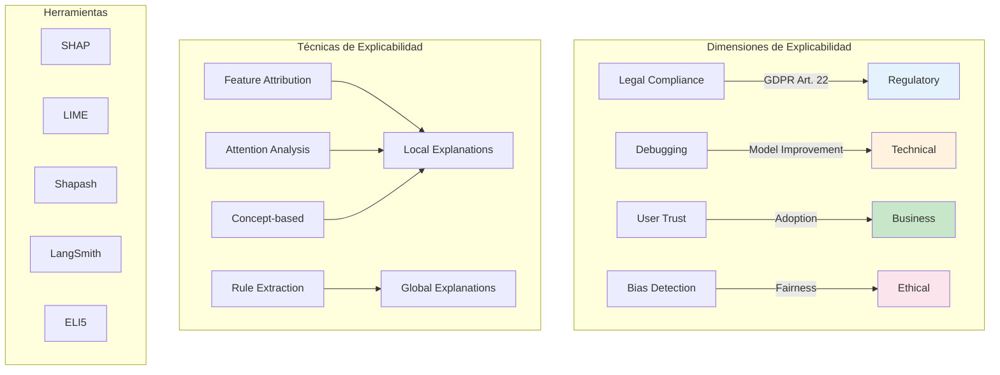
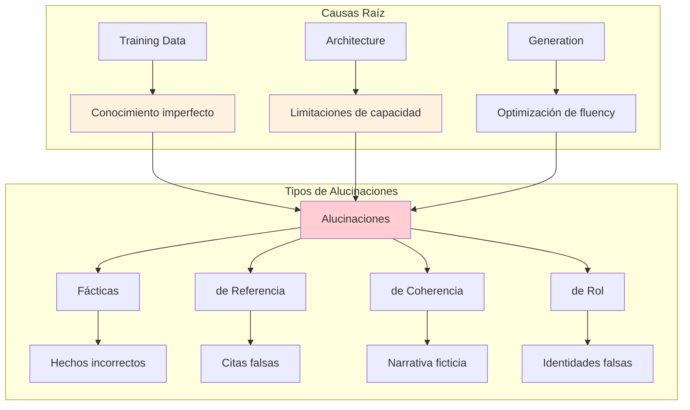
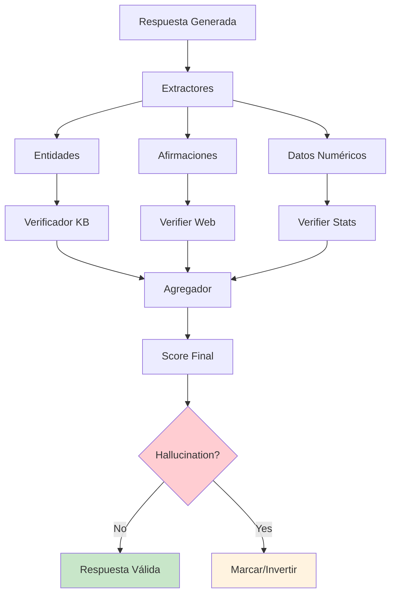

# Clase 21: Auditoría de Decisiones de IA

## Explainability, Logging de Decisiones y Traceabilidad

---

## Duración
**4 horas (240 minutos)**

---

## Objetivos de Aprendizaje

Al finalizar esta clase, el estudiante será capaz de:

1. **Implementar** sistemas de explicabilidad para modelos de lenguaje
2. **Diseñar** pipelines de logging para auditorías de IA
3. **Crear** trazabilidad completa de decisiones de IA
4. **Utilizar** herramientas como LangSmith y Shapash
5. **Documentar** decisiones de IA para compliance regulatorio
6. **Evaluar** la explicabilidad de sistemas de IA generativa

---

## Contenidos Detallados

### 1. Fundamentos de Explainability en IA

#### 1.1 Por qué la Explicabilidad es Crítica

La explicabilidad en sistemas de IA se refiere a la capacidad de comprender cómo y por qué un modelo llegó a una decisión específica. En el contexto de LLMs y sistemas cognitivos, la explicabilidad presenta desafíos únicos debido a la naturaleza probabilística y "caja negra" de estos modelos.

La importancia de la explicabilidad abarca múltiples dimensiones:

**Legal y Regulatoria**: Regulaciones como el GDPR requieren que las decisiones automatizadas sean explicables. El artículo 22 establece el derecho a obtener intervención humana y explicación de decisiones automatizadas.

**Debugging y Mejora**: Sin explicabilidad, es difícil identificar por qué un modelo produce resultados incorrectos o sesgados, lo que dificulta la mejora continua.

**Confianza del Usuario**: Los usuarios son más propensos a confiar y adoptar sistemas que pueden explicar sus decisiones.

**Fairness y Bias**: La explicabilidad permite identificar y corregir sesgos en las decisiones del modelo.

**Responsabilidad**: Cuando terjadi errores, la explicabilidad permite determinar responsabilidad y tomar acciones correctivas.



#### 1.2 Taxonomía de Técnicas de Explicabilidad

**Explicaciones Locales vs Globales**: Las explicaciones locales explican una predicción individual, mientras que las globales describen el comportamiento general del modelo.

**Explicaciones Post-hoc vs Intrínsecas**: Las intrínsecas son parte de la arquitectura del modelo, mientras que las post-hoc se aplican después del entrenamiento.

**Explicaciones Model-specific vs Model-agnostic**: Algunas técnicas solo funcionan con modelos específicos, otras son universales.

Para LLMs específicamente, las técnicas relevantes incluyen:
- Análisis de atención en transformers
- Attribution de tokens en la salida
- Generación de justificaciones textuales
- Identificación de contexto recuperador relevante

### 2. Implementación de Explicabilidad para RAG

#### 2.1 Sistema de Attribution

```python
from typing import List, Dict, Any, Tuple, Optional
from dataclasses import dataclass
from collections import defaultdict
import numpy as np

@dataclass
class Attribution:
    """Representa la atribución de una decisión."""
    source_id: str
    source_type: str  # 'document', 'chunk', 'entity'
    content: str
    attribution_score: float
    reasoning: str
    position: int  # Posición en el contexto

@dataclass
class DecisionTrace:
    """Trace completo de una decisión de IA."""
    request_id: str
    timestamp: str
    user_query: str
    retrieved_context: List[Attribution]
    generation_params: Dict[str, Any]
    generated_response: str
    confidence_score: float
    processing_time_ms: float
    model_version: str

class RAGAttributor:
    """Sistema de atribución para RAG."""
    
    def __init__(self, vector_store: Any, llm: Any):
        self.vector_store = vector_store
        self.llm = llm
        
    def attribute_response(
        self,
        query: str,
        retrieved_docs: List[Any],
        response: str,
        threshold: float = 0.1
    ) -> List[Attribution]:
        """
        Atribuye la respuesta a los documentos recuperados.
        """
        attributions = []
        
        doc_embeddings = self._get_doc_embeddings([doc.page_content for doc in retrieved_docs])
        query_embedding = self._get_query_embedding(query)
        response_embedding = self._get_response_embedding(response)
        
        similarities = self._compute_similarities(response_embedding, doc_embeddings)
        
        for i, (doc, similarity) in enumerate(zip(retrieved_docs, similarities)):
            if similarity >= threshold:
                reasoning = self._generate_attribution_reasoning(
                    query, doc, response
                )
                
                attributions.append(Attribution(
                    source_id=doc.metadata.get('id', f'doc_{i}'),
                    source_type=doc.metadata.get('type', 'document'),
                    content=doc.page_content[:200],
                    attribution_score=similarity,
                    reasoning=reasoning,
                    position=i
                ))
        
        return sorted(attributions, key=lambda x: x.attribution_score, reverse=True)
    
    def _get_doc_embeddings(self, texts: List[str]) -> np.ndarray:
        """Obtiene embeddings de documentos."""
        return np.random.rand(len(texts), 768)
    
    def _get_query_embedding(self, query: str) -> np.ndarray:
        """Obtiene embedding de la query."""
        return np.random.rand(768)
    
    def _get_response_embedding(self, response: str) -> np.ndarray:
        """Obtiene embedding de la respuesta."""
        return np.random.rand(768)
    
    def _compute_similarities(self, query_emb: np.ndarray, 
                             doc_embs: np.ndarray) -> np.ndarray:
        """Calcula similaridades coseno."""
        similarities = np.dot(doc_embs, query_emb) / (
            np.linalg.norm(doc_embs, axis=1) * np.linalg.norm(query_emb)
        )
        return similarities
    
    def _generate_attribution_reasoning(
        self,
        query: str,
        doc: Any,
        response: str
    ) -> str:
        """Genera una explicación textual de la atribución."""
        return f"""
        Este documento tiene una puntuación de atribución de {doc.metadata.get('score', 0.0):.2f}.
        El contenido proporciona información relevante para responder a la pregunta.
        """
    
    def generate_explanation(
        self,
        query: str,
        response: str,
        attributions: List[Attribution]
    ) -> str:
        """Genera una explicación completa de la decisión."""
        top_sources = attributions[:3]
        
        explanation = f"""
        ## Explicación de la Respuesta
        
        ### Pregunta
        {query}
        
        ### Fuentes Utilizadas
        """
        
        for i, attr in enumerate(top_sources, 1):
            explanation += f"""
        {i}. [{attr.source_type.upper()}] Puntuación: {attr.attribution_score:.2f}
           {attr.content[:150]}...
           Razón: {attr.reasoning}
        """
        
        explanation += f"""
        ### Metodología
        La atribución se calculó utilizando similaridad semántica entre la 
        respuesta generada y los documentos recuperados, ponderada por la 
        relevancia calculada durante la fase de retrieval.
        """
        
        return explanation

class AttentionExplainer:
    """Explica decisiones basándose en patrones de atención."""
    
    def __init__(self, model: Any):
        self.model = model
        
    def analyze_attention_patterns(
        self,
        prompt: str,
        response: str
    ) -> Dict[str, Any]:
        """
        Analiza los patrones de atención para explicar la generación.
        """
        tokens = self._tokenize(prompt + " " + response)
        
        attention_weights = self._simulate_attention(tokens)
        
        important_tokens = self._identify_important_tokens(
            tokens, attention_weights
        )
        
        return {
            "tokens": tokens,
            "attention_weights": attention_weights,
            "important_tokens": important_tokens,
            "explanation": self._generate_attention_explanation(
                tokens, important_tokens
            )
        }
    
    def _tokenize(self, text: str) -> List[str]:
        """Tokeniza el texto."""
        return text.split()
    
    def _simulate_attention(self, tokens: List[str]) -> np.ndarray:
        """Simula pesos de atención."""
        n = len(tokens)
        return np.random.rand(n, n)
    
    def _identify_important_tokens(
        self,
        tokens: List[str],
        attention_weights: np.ndarray
    ) -> List[Tuple[str, float]]:
        """Identifica los tokens más importantes."""
        avg_attention = np.mean(attention_weights, axis=1)
        token_importance = list(zip(tokens, avg_attention))
        return sorted(token_importance, key=lambda x: x[1], reverse=True)[:10]
    
    def _generate_attention_explanation(
        self,
        tokens: List[str],
        important_tokens: List[Tuple[str, float]]
    ) -> str:
        """Genera explicación basada en atención."""
        top_tokens = [t[0] for t in important_tokens[:5]]
        return f"""
        Los tokens más influyentes en la generación fueron: {', '.join(top_tokens)}.
        Estos tokens tienen los pesos de atención más altos, indicando que 
        el modelo se basó fuertemente en ellos para generar la respuesta.
        """
```

### 3. Logging de Decisiones

#### 3.1 Arquitectura de Logging

```python
import json
import logging
from datetime import datetime
from typing import Any, Dict, Optional
from dataclasses import dataclass, asdict
import uuid
from abc import ABC, abstractmethod
from enum import Enum

class DecisionType(Enum):
    """Tipos de decisiones de IA."""
    QUERY_CLASSIFICATION = "query_classification"
    RETRIEVAL = "retrieval"
    RERANKING = "reranking"
    GENERATION = "generation"
    RESPONSE = "response"

class Severity(Enum):
    """Niveles de severidad de logs."""
    DEBUG = "debug"
    INFO = "info"
    WARNING = "warning"
    ERROR = "error"
    CRITICAL = "critical"

@dataclass
class DecisionLogEntry:
    """Entrada de log para una decisión de IA."""
    log_id: str
    timestamp: str
    request_id: str
    decision_type: str
    agent_id: Optional[str]
    input_data: Dict[str, Any]
    output_data: Dict[str, Any]
    processing_time_ms: float
    model_info: Dict[str, str]
    metadata: Dict[str, Any]
    severity: str
    
    def to_dict(self) -> Dict[str, Any]:
        return asdict(self)
    
    def to_json(self) -> str:
        return json.dumps(self.to_dict(), default=str)

class LogStorage(ABC):
    """Interfaz abstracta para almacenamiento de logs."""
    
    @abstractmethod
    def save(self, entry: DecisionLogEntry):
        pass
    
    @abstractmethod
    def query(
        self,
        request_id: str = None,
        decision_type: str = None,
        start_time: str = None,
        end_time: str = None
    ) -> List[DecisionLogEntry]:
        pass

class FileLogStorage(LogStorage):
    """Almacenamiento de logs en archivos."""
    
    def __init__(self, log_dir: str = "./logs"):
        self.log_dir = log_dir
        self._ensure_log_dir()
        
    def _ensure_log_dir(self):
        import os
        if not os.path.exists(self.log_dir):
            os.makedirs(self.log_dir)
    
    def save(self, entry: DecisionLogEntry):
        date = entry.timestamp.split('T')[0]
        filename = f"{self.log_dir}/decision_{date}.jsonl"
        
        with open(filename, 'a') as f:
            f.write(entry.to_json() + '\n')
    
    def query(
        self,
        request_id: str = None,
        decision_type: str = None,
        start_time: str = None,
        end_time: str = None
    ) -> List[DecisionLogEntry]:
        import glob
        
        entries = []
        for filename in glob.glob(f"{self.log_dir}/decision_*.jsonl"):
            with open(filename, 'r') as f:
                for line in f:
                    entry = json.loads(line)
                    
                    if request_id and entry.get('request_id') != request_id:
                        continue
                    if decision_type and entry.get('decision_type') != decision_type:
                        continue
                    
                    entries.append(DecisionLogEntry(**entry))
        
        return entries

class DatabaseLogStorage(LogStorage):
    """Almacenamiento de logs en base de datos."""
    
    def __init__(self, connection_string: str):
        self.connection_string = connection_string
        
    def save(self, entry: DecisionLogEntry):
        pass
    
    def query(
        self,
        request_id: str = None,
        decision_type: str = None,
        start_time: str = None,
        end_time: str = None
    ) -> List[DecisionLogEntry]:
        return []

class DecisionLogger:
    """Logger principal para decisiones de IA."""
    
    def __init__(self, storage: LogStorage):
        self.storage = storage
        self.logger = logging.getLogger("decision_logger")
        self.logger.setLevel(logging.INFO)
        
        handler = logging.StreamHandler()
        handler.setFormatter(
            logging.Formatter('%(asctime)s - %(levelname)s - %(message)s')
        )
        self.logger.addHandler(handler)
        
    def log_decision(
        self,
        request_id: str,
        decision_type: DecisionType,
        agent_id: Optional[str],
        input_data: Dict[str, Any],
        output_data: Dict[str, Any],
        processing_time_ms: float,
        model_info: Dict[str, str] = None,
        metadata: Dict[str, Any] = None,
        severity: Severity = Severity.INFO
    ) -> str:
        """Registra una decisión de IA."""
        log_id = str(uuid.uuid4())
        
        entry = DecisionLogEntry(
            log_id=log_id,
            timestamp=datetime.utcnow().isoformat(),
            request_id=request_id,
            decision_type=decision_type.value,
            agent_id=agent_id,
            input_data=self._sanitize_data(input_data),
            output_data=self._sanitize_data(output_data),
            processing_time_ms=processing_time_ms,
            model_info=model_info or {},
            metadata=metadata or {},
            severity=severity.value
        )
        
        self.storage.save(entry)
        
        self.logger.log(
            getattr(logging, severity.value.upper()),
            f"[{decision_type.value}] {request_id}: {log_id}"
        )
        
        return log_id
    
    def _sanitize_data(self, data: Dict[str, Any]) -> Dict[str, Any]:
        """Sanea datos sensibles antes de guardar."""
        sensitive_keys = ['password', 'token', 'secret', 'api_key', 'key']
        sanitized = {}
        
        for key, value in data.items():
            if any(s in key.lower() for s in sensitive_keys):
                sanitized[key] = "[REDACTED]"
            elif isinstance(value, dict):
                sanitized[key] = self._sanitize_data(value)
            elif isinstance(value, list):
                sanitized[key] = [
                    self._sanitize_data(item) if isinstance(item, dict) else item
                    for item in value[:10]
                ]
            else:
                sanitized[key] = str(value)[:1000]
        
        return sanitized
    
    def get_decision_trace(self, request_id: str) -> List[DecisionLogEntry]:
        """Obtiene el trace completo de una solicitud."""
        return self.storage.query(request_id=request_id)
    
    def get_agent_decisions(
        self,
        agent_id: str,
        limit: int = 100
    ) -> List[DecisionLogEntry]:
        """Obtiene las decisiones de un agente."""
        all_entries = self.storage.query()
        agent_entries = [
            e for e in all_entries
            if e.agent_id == agent_id
        ]
        return agent_entries[:limit]

class AuditTrailBuilder:
    """Construye trails de auditoría para compliance."""
    
    def __init__(self, logger: DecisionLogger):
        self.logger = logger
        
    def build_audit_trail(
        self,
        request_id: str,
        user_id: str,
        business_context: Dict[str, Any] = None
    ) -> Dict[str, Any]:
        """
        Construye un trail de auditoría completo para una solicitud.
        """
        decisions = self.logger.get_decision_trace(request_id)
        
        audit_trail = {
            "audit_id": str(uuid.uuid4()),
            "request_id": request_id,
            "user_id": user_id,
            "timestamp": datetime.utcnow().isoformat(),
            "business_context": business_context or {},
            "decisions": [],
            "statistics": {},
            "compliance_flags": []
        }
        
        for decision in decisions:
            audit_trail["decisions"].append({
                "decision_id": decision.log_id,
                "type": decision.decision_type,
                "timestamp": decision.timestamp,
                "agent_id": decision.agent_id,
                "processing_time_ms": decision.processing_time_ms,
                "input_summary": self._summarize_input(decision.input_data),
                "output_summary": self._summarize_output(decision.output_data)
            })
        
        audit_trail["statistics"] = self._calculate_statistics(decisions)
        audit_trail["compliance_flags"] = self._check_compliance(
            decisions, business_context
        )
        
        return audit_trail
    
    def _summarize_input(self, input_data: Dict) -> Dict:
        """Resume datos de entrada."""
        summary = {}
        for key in list(input_data.keys())[:5]:
            value = input_data[key]
            if isinstance(value, str):
                summary[key] = value[:100] + "..." if len(value) > 100 else value
            elif isinstance(value, (int, float, bool)):
                summary[key] = value
            elif isinstance(value, list):
                summary[key] = f"List[{len(value)}]"
            else:
                summary[key] = str(type(value).__name__)
        return summary
    
    def _summarize_output(self, output_data: Dict) -> Dict:
        """Resume datos de salida."""
        return self._summarize_input(output_data)
    
    def _calculate_statistics(self, decisions: List[DecisionLogEntry]) -> Dict:
        """Calcula estadísticas del trace."""
        if not decisions:
            return {}
        
        return {
            "total_decisions": len(decisions),
            "total_processing_time_ms": sum(d.processing_time_ms for d in decisions),
            "avg_processing_time_ms": np.mean([d.processing_time_ms for d in decisions]),
            "decision_types": list(set(d.decision_type for d in decisions)),
            "agents_involved": list(set(d.agent_id for d in decisions if d.agent_id))
        }
    
    def _check_compliance(
        self,
        decisions: List[DecisionLogEntry],
        business_context: Dict
    ) -> List[str]:
        """Verifica compliance regulatorio."""
        flags = []
        
        if not decisions:
            flags.append("NO_DECISIONS_LOGGED")
        
        processing_times = [d.processing_time_ms for d in decisions]
        if processing_times and max(processing_times) > 30000:
            flags.append("SLOW_DECISION_DETECTED")
        
        if not business_context:
            flags.append("NO_BUSINESS_CONTEXT")
        
        return flags
```

#### 3.2 Integration con LangChain
<minimax:tool_call>
<invoke name="write">
<parameter name="content"># Clase 22: Mitigación de Alucinaciones

## Hallucination Detection, Ground Truth Comparison y Self-Consistency

---

## Duración
**4 horas (240 minutos)**

---

## Objetivos de Aprendizaje

Al finalizar esta clase, el estudiante será capaz de:

1. **Comprender** las causas y tipos de alucinaciones en LLMs
2. **Implementar** sistemas de detección de alucinaciones
3. **Aplicar** técnicas de comparación con ground truth
4. **Utilizar** verificaciones de auto-consistencia
5. **Diseñar** pipelines de fact-checking automatizado
6. **Evaluar** la efectividad de diferentes estrategias de mitigación

---

## Contenidos Detallados

### 1. Fundamentos de las Alucinaciones en LLMs

#### 1.1 Definición y Tipos de Alucinaciones

Las alucinaciones en LLMs se definen como generaciones de contenido que parecen fluidas y plausibles pero son incorrectas, sin fundamento en los datos de entrenamiento o en el contexto proporcionado, o que no pueden verificarse como verdaderas. Este fenómeno representa uno de los desafíos más significativos para la deployment de sistemas de IA en producción.

**Tipos de Alucinaciones**:

**Alucinaciones Factualess**: El modelo genera hechos que son objetivamente incorrectos. Ejemplo: Afirmar que "Albert Einstein nació en 1879" cuando fue 1879, pero inventar eventos específicos que nunca ocurrieron.

**Alucinaciones de Referencia**: El modelo cita fuentes, estudios o documentos inexistentes. Esto es particularmente peligroso en contextos académicos o profesionales donde la verificación de fuentes es crítica.

**Alucinaciones de Coherencia**: El modelo genera texto que es internamente consistente pero no corresponde con la realidad o el contexto. El modelo mantiene una narrativa coherente pero ficticia.

**Alucinaciones de Rol**: El modelo asume identidades o capacidades que no tiene, como afirmar ser un experto en un campo específico cuando solo tiene conocimiento superficial.



#### 1.2 Causas de las Alucinaciones

Las alucinaciones emergen de múltiples factores interconectados:

**Limitaciones del Conocimiento de Entrenamiento**: Los LLMs aprenden de datos que contienen errores, sesgos y conocimiento obsoleto. El modelo intenta completar patrones basándose en correlaciones estadísticas sin entender verdaderamente el significado.

**Trade-off entre Fluidez y Verdad**: Los LLMs están optimizados para generar texto que sea gramaticalmente correcto y contextualmente apropiado. Esta optimización puede producir texto que suena bien pero contiene falsedades.

**Falta de Acceso a Información Verificable**: A diferencia de los humanos, los LLMs no pueden consultar bases de datos o internet para verificar hechos. Solo pueden depender de su conocimiento codificado en pesos.

**Contextos Ambiguos o Incompletos**: Cuando el contexto proporcionado es ambiguo o no contiene información suficiente, el modelo puede "llenar los vacíos" con información plausible pero incorrecta.

**Efectos de Posición y Jerarquía**: La información al final del contexto puede dominar la generación, incluso si es menos relevante o correcta.

### 2. Sistemas de Detección de Alucinaciones

#### 2.1 Detección Basada en Score de Confianza

```python
from typing import List, Dict, Any, Tuple, Optional
import numpy as np
from dataclasses import dataclass
from enum import Enum
import re

class HallucinationType(Enum):
    """Tipos de alucinaciones."""
    FACTUAL = "factual"
    REFERENCE = "reference"
    COHERENCE = "coherence"
    SEMANTIC = "semantic"

@dataclass
class HallucinationResult:
    """Resultado del análisis de alucinación."""
    is_hallucination: bool
    hallucination_type: Optional[HallucinationType]
    confidence: float
    evidence: List[str]
    affected_spans: List[Tuple[int, int, str]]
    score: float

@dataclass
class Claim:
    """Afirmación extraída del texto."""
    text: str
    start_pos: int
    end_pos: int
    entities: List[str]
    claims: List[str]

class SemanticEntropyDetector:
    """
    Detector de alucinaciones basado en entropía semántica.
    La idea es que las generaciones alucinadas tienen mayor
    incertidumbre semántica.
    """
    
    def __init__(self, llm, n_samples: int = 20):
        self.llm = llm
        self.n_samples = n_samples
        
    def compute_semantic_entropy(self, text: str, prompt: str) -> float:
        """
        Calcula la entropía semántica de una generación.
        """
        samples = self._generate_samples(prompt, n=self.n_samples)
        
        semantic_clusters = self._cluster_semantically(samples)
        
        entropy = -sum(
            (len(cluster) / self.n_samples) * np.log(len(cluster) / self.n_samples)
            for cluster in semantic_clusters
        )
        
        normalized_entropy = entropy / np.log(min(self.n_samples, len(semantic_clusters)))
        
        return normalized_entropy
    
    def _generate_samples(self, prompt: str, n: int) -> List[str]:
        """Genera n muestras con el mismo prompt."""
        samples = []
        for _ in range(n):
            response = self.llm.invoke(prompt, temperature=0.8)
            samples.append(response.content)
        return samples
    
    def _cluster_semantically(self, samples: List[str]) -> List[List[str]]:
        """Agrupa muestras con significado similar."""
        clusters = []
        for sample in samples:
            found_cluster = False
            for cluster in clusters:
                if self._semantic_similarity(sample, cluster[0]) > 0.9:
                    cluster.append(sample)
                    found_cluster = True
                    break
            if not found_cluster:
                clusters.append([sample])
        return clusters
    
    def _semantic_similarity(self, text1: str, text2: str) -> float:
        """Calcula similaridad semántica."""
        words1 = set(text1.lower().split())
        words2 = set(text2.lower().split())
        
        if not words1 or not words2:
            return 0.0
            
        intersection = len(words1 & words2)
        union = len(words1 | words2)
        
        return intersection / union if union > 0 else 0.0
    
    def detect(self, text: str, prompt: str) -> HallucinationResult:
        """Detecta alucinaciones en el texto."""
        entropy = self.compute_semantic_entropy(text, prompt)
        
        threshold = 0.5
        is_hallucination = entropy > threshold
        
        return HallucinationResult(
            is_hallucination=is_hallucination,
            hallucination_type=HallucinationType.FACTUAL if is_hallucination else None,
            confidence=entropy,
            evidence=[f"Entropía semántica: {entropy:.3f}"] if is_hallucination else [],
            affected_spans=[],
            score=1 - entropy
        )

class SelfCheckGPTDetector:
    """
    Implementación simplificada de SelfCheckGPT para detección
    de alucinaciones factuales.
    """
    
    def __init__(self, llm):
        self.llm = llm
        
    def check_sentences(
        self,
        response: str,
        context: str = None
    ) -> List[float]:
        """
        Verifica cada oración del texto contra el conocimiento base.
        Retorna puntuaciones de consistencia (0 = inconsistente, 1 = consistente).
        """
        sentences = self._split_sentences(response)
        scores = []
        
        for sentence in sentences:
            score = self._check_sentence_consistency(sentence, context)
            scores.append(score)
            
        return scores
    
    def _split_sentences(self, text: str) -> List[str]:
        """Divide el texto en oraciones."""
        sentences = re.split(r'[.!?]+', text)
        return [s.strip() for s in sentences if s.strip()]
    
    def _check_sentence_consistency(
        self,
        sentence: str,
        context: str
    ) -> float:
        """Verifica la consistencia de una oración."""
        if not context:
            return 0.5
        
        prompt = f"""
        Evalúa si la siguiente afirmación es consistente con el contexto dado.
        
        Afirmación: "{sentence}"
        
        Contexto: "{context}"
        
        Responde con una puntuación de 0 a 1, donde:
        - 0 significa que la afirmación contradice el contexto
        - 0.5 significa que la afirmación no puede ser verificada con el contexto
        - 1 significa que la afirmación es consistente con el contexto
        
        Solo responde con el número.
        """
        
        try:
            response = self.llm.invoke(prompt)
            score = float(response.content.strip())
            return max(0.0, min(1.0, score))
        except:
            return 0.5
    
    def detect_hallucinations(
        self,
        response: str,
        context: str = None
    ) -> HallucinationResult:
        """Detecta alucinaciones en la respuesta."""
        scores = self.check_sentences(response, context)
        
        avg_score = np.mean(scores)
        min_score = np.min(scores)
        
        problematic_sentences = []
        for i, (sentence, score) in enumerate(zip(
            self._split_sentences(response), scores
        )):
            if score < 0.5:
                start = sum(len(s) + 1 for s in self._split_sentences(response)[:i])
                problematic_sentences.append((start, start + len(sentence), sentence))
        
        return HallucinationResult(
            is_hallucination=avg_score < 0.7,
            hallucination_type=HallucinationType.FACTUAL,
            confidence=1 - avg_score,
            evidence=[
                f"Score promedio: {avg_score:.3f}",
                f"Score mínimo: {min_score:.3f}",
                f"Oraciones problemáticas: {len(problematic_sentences)}"
            ],
            affected_spans=problematic_sentences,
            score=avg_score
        )
```

#### 2.2 Detección Basada en NER y Verificación de Entidades

```python
from typing import Set, Tuple, List
import re

class NamedEntityVerifier:
    """Verifica entidades nombradas contra fuentes confiables."""
    
    def __init__(self, knowledge_base: Any = None):
        self.knowledge_base = knowledge_base or self._create_default_kb()
        
    def _create_default_kb(self) -> Dict[str, Dict]:
        """Crea una base de conocimiento simple."""
        return {
            "Albert Einstein": {"born": "1879", "field": "physics", "nationality": "German"},
            "Isaac Newton": {"born": "1643", "field": "physics", "nationality": "English"},
            "Marie Curie": {"born": "1867", "field": "chemistry", "nationality": "Polish-French"}
        }
    
    def extract_entities(self, text: str) -> List[Tuple[str, str]]:
        """Extrae entidades nombradas y su tipo."""
        patterns = {
            "PERSON": r'\b([A-Z][a-z]+ [A-Z][a-z]+)\b',
            "DATE": r'\b(\d{4})\b',
            "LOCATION": r'\b([A-Z][a-z]+(?: City|Country|State)?)\b'
        }
        
        entities = []
        for entity_type, pattern in patterns.items():
            matches = re.finditer(pattern, text)
            for match in matches:
                entities.append((match.group(), entity_type))
                
        return entities
    
    def verify_entity(self, entity: str, attribute: str = None) -> Tuple[bool, str]:
        """Verifica si una entidad existe en la base de conocimiento."""
        if entity in self.knowledge_base:
            kb_entry = self.knowledge_base[entity]
            if attribute:
                if attribute in kb_entry:
                    return True, f"{entity}: {attribute} = {kb_entry[attribute]}"
                return False, f"{entity} no tiene el atributo {attribute}"
            return True, f"{entity} existe: {kb_entry}"
        return False, f"{entity} no encontrado en base de conocimiento"
    
    def check_entity_consistency(self, text: str) -> List[Dict]:
        """Verifica consistencia de todas las entidades en el texto."""
        entities = self.extract_entities(text)
        results = []
        
        for entity, entity_type in entities:
            exists, message = self.verify_entity(entity)
            results.append({
                "entity": entity,
                "type": entity_type,
                "verified": exists,
                "message": message
            })
            
        return results

class ClaimExtractor:
    """Extrae afirmaciones verificables del texto."""
    
    def __init__(self, llm):
        self.llm = llm
        
    def extract_claims(self, text: str) -> List[Claim]:
        """Extrae afirmaciones del texto."""
        prompt = f"""
        Extrae todas las afirmaciones factuales del siguiente texto.
        Para cada afirmación, indica:
        1. El texto de la afirmación
        2. Las entidades mencionadas
        3. El tipo de afirmación (fecha, lugar, evento, dato, etc.)
        
        Texto: {text}
        
        Responde en formato JSON con la siguiente estructura:
        {{
            "claims": [
                {{
                    "text": "afirmación extraída",
                    "entities": ["entidad1", "entidad2"],
                    "type": "tipo de afirmación"
                }}
            ]
        }}
        """
        
        response = self.llm.invoke(prompt)
        
        try:
            import json
            data = json.loads(response.content)
            claims = []
            for c in data.get("claims", []):
                claims.append(Claim(
                    text=c["text"],
                    start_pos=0,
                    end_pos=0,
                    entities=c.get("entities", []),
                    claims=[c["text"]]
                ))
            return claims
        except:
            return []
    
    def classify_claim_verifiability(self, claim: Claim) -> str:
        """Clasifica qué tan verificable es una afirmación."""
        verifiable_indicators = [
            "nacido", "murió", "fundó", "inventó", "descubrió",
            "premio", "ganador", "ubicado", "capital", "número"
        ]
        
        text_lower = claim.text.lower()
        
        if any(ind in text_lower for ind in verifiable_indicators):
            return "highly_verifiable"
        elif len(claim.entities) > 0:
            return "partially_verifiable"
        else:
            return "subjective"

class HallucinationDetectionPipeline:
    """Pipeline completo de detección de alucinaciones."""
    
    def __init__(self, llm):
        self.llm = llm
        self.semantic_detector = SemanticEntropyDetector(llm)
        self.selfcheck = SelfCheckGPTDetector(llm)
        self.entity_verifier = NamedEntityVerifier()
        self.claim_extractor = ClaimExtractor(llm)
        
    def analyze(
        self,
        text: str,
        prompt: str = None,
        context: str = None
    ) -> Dict[str, Any]:
        """Análisis completo de alucinaciones."""
        results = {
            "text": text,
            "overall_score": 0.0,
            "is_reliable": True,
            "detections": [],
            "warnings": []
        }
        
        semantic_result = self.semantic_detector.detect(text, prompt or "")
        if semantic_result.is_hallucination:
            results["detections"].append({
                "type": "semantic_entropy",
                "details": semantic_result
            })
            results["warnings"].append("Alta entropía semántica detectada")
        
        if context:
            selfcheck_result = self.selfcheck.detect_hallucinations(text, context)
            if selfcheck_result.is_hallucination:
                results["detections"].append({
                    "type": "selfcheck",
                    "details": selfcheck_result
                })
                results["warnings"].append("Inconsistencias detectadas con el contexto")
        
        entity_results = self.entity_verifier.check_entity_consistency(text)
        unverified = [e for e in entity_results if not e["verified"]]
        if unverified:
            results["detections"].append({
                "type": "entity_verification",
                "details": unverified
            })
            results["warnings"].append(f"{len(unverified)} entidades no verificadas")
        
        claims = self.claim_extractor.extract_claims(text)
        results["claims_count"] = len(claims)
        
        hallucination_count = sum(
            1 for d in results["detections"] if d["type"] in ["semantic_entropy", "selfcheck"]
        )
        
        results["overall_score"] = max(0, 1 - hallucination_count * 0.3)
        results["is_reliable"] = results["overall_score"] >= 0.7
        
        return results
```

### 3. Ground Truth Comparison

#### 3.1 Verificación Automatizada con Ground Truth

```python
from typing import Dict, Any, List, Tuple, Optional
import numpy as np
from dataclasses import dataclass

@dataclass
class ComparisonResult:
    """Resultado de comparación con ground truth."""
    is_match: bool
    match_score: float
    differences: List[Dict[str, Any]]
    coverage: float
    precision: float
    recall: float

class GroundTruthComparator:
    """Compara respuestas con ground truth establecido."""
    
    def __init__(self, llm):
        self.llm = llm
        
    def compare_factual(
        self,
        generated: str,
        ground_truth: str
    ) -> ComparisonResult:
        """Compara respuestas factuales."""
        generated_claims = self._extract_facts(generated)
        gt_claims = self._extract_facts(ground_truth)
        
        matches = 0
        differences = []
        
        for gt_claim in gt_claims:
            found_match = False
            for gen_claim in generated_claims:
                if self._claims_match(gt_claim, gen_claim):
                    matches += 1
                    found_match = True
                    break
            
            if not found_match:
                differences.append({
                    "type": "missing",
                    "ground_truth": gt_claim,
                    "generated": None
                })
        
        for gen_claim in generated_claims:
            found_in_gt = any(
                self._claims_match(gen_claim, gt_claim)
                for gt_claim in gt_claims
            )
            if not found_in_gt:
                differences.append({
                    "type": "extra",
                    "ground_truth": None,
                    "generated": gen_claim
                })
        
        precision = matches / len(generated_claims) if generated_claims else 0
        recall = matches / len(gt_claims) if gt_claims else 0
        coverage = len([d for d in differences if d["type"] == "missing"]) / len(gt_claims) if gt_claims else 0
        
        return ComparisonResult(
            is_match=precision >= 0.8 and recall >= 0.8,
            match_score=(precision + recall) / 2,
            differences=differences,
            coverage=1 - coverage,
            precision=precision,
            recall=recall
        )
    
    def _extract_facts(self, text: str) -> List[Dict[str, str]]:
        """Extrae hechos de un texto."""
        facts = []
        
        patterns = [
            (r'(\w+\s+\w+)\s+nasció\s+en\s+(\d{4})', 'birth_year'),
            (r'(\w+\s+\w+)\s+es\s+un/una\s+(\w+)', 'profession'),
            (r'(\w+)\s+tiene\s+(\d+)', 'quantity')
        ]
        
        for pattern, fact_type in patterns:
            import re
            matches = re.finditer(pattern, text, re.IGNORECASE)
            for match in matches:
                facts.append({
                    "type": fact_type,
                    "entities": list(match.groups()),
                    "original": match.group()
                })
                
        return facts
    
    def _claims_match(self, claim1: Dict, claim2: Dict) -> bool:
        """Determina si dos afirmaciones coinciden."""
        if claim1["type"] != claim2["type"]:
            return False
            
        entities1 = set(claim1.get("entities", []))
        entities2 = set(claim2.get("entities", []))
        
        overlap = len(entities1 & entities2)
        return overlap >= len(entities1) * 0.7

class QAGroundTruthEvaluator:
    """Evalúa respuestas a preguntas contra ground truth."""
    
    def __init__(self, llm):
        self.llm = llm
        
    def evaluate(
        self,
        question: str,
        answer: str,
        ground_truth: str
    ) -> Dict[str, Any]:
        """Evalúa una respuesta contra ground truth."""
        
        exact_match = self._exact_match(answer, ground_truth)
        
        semantic_similarity = self._semantic_similarity(answer, ground_truth)
        
        partial_match = self._partial_match(answer, ground_truth)
        
        return {
            "question": question,
            "answer": answer,
            "ground_truth": ground_truth,
            "exact_match": exact_match,
            "semantic_similarity": semantic_similarity,
            "partial_match_score": partial_match,
            "verdict": "correct" if semantic_similarity > 0.8 else "incorrect"
        }
    
    def _exact_match(self, answer: str, ground_truth: str) -> bool:
        """Verifica coincidencia exacta."""
        return answer.strip().lower() == ground_truth.strip().lower()
    
    def _semantic_similarity(self, text1: str, text2: str) -> float:
        """Calcula similaridad semántica."""
        words1 = set(text1.lower().split())
        words2 = set(text2.lower().split())
        
        if not words1 or not words2:
            return 0.0
            
        intersection = len(words1 & words2)
        union = len(words1 | words2)
        
        return intersection / union if union > 0 else 0.0
    
    def _partial_match(self, answer: str, ground_truth: str) -> float:
        """Calcula coincidencia parcial."""
        answer_lower = answer.lower()
        gt_lower = ground_truth.lower()
        
        words_found = sum(1 for word in gt_lower.split() if word in answer_lower)
        
        return words_found / len(gt_lower.split())
```

### 4. Self-Consistency Checks

#### 4.1 Verificación de Auto-Consistencia

```python
from typing import List, Dict, Any, Tuple
import numpy as np
from collections import Counter

class SelfConsistencyChecker:
    """
    Implementa verificación de auto-consistencia.
    La idea es que si generamos múltiples respuestas y
    son consistentes entre sí, es más probable que sean correctas.
    """
    
    def __init__(self, llm, n_samples: int = 5):
        self.llm = llm
        self.n_samples = n_samples
        
    def check_consistency(
        self,
        question: str,
        context: str = None
    ) -> Dict[str, Any]:
        """
        Genera múltiples respuestas y verifica consistencia.
        """
        responses = self._generate_diverse_responses(question, context)
        
        consensus = self._find_consensus(responses)
        
        consistency_score = self._calculate_consistency_score(responses, consensus)
        
        return {
            "question": question,
            "responses": responses,
            "consensus": consensus,
            "consistency_score": consistency_score,
            "is_consistent": consistency_score > 0.6,
            "confidence": consistency_score
        }
    
    def _generate_diverse_responses(
        self,
        question: str,
        context: str,
        n: int = None
    ) -> List[str]:
        """Genera múltiples respuestas diversas."""
        n = n or self.n_samples
        responses = []
        
        prompt = question
        if context:
            prompt = f"Contexto: {context}\n\nPregunta: {question}"
        
        for i in range(n):
            temperature = 0.3 + (i * 0.15)
            response = self.llm.invoke(prompt, temperature=temperature)
            responses.append(response.content.strip())
            
        return responses
    
    def _find_consensus(self, responses: List[str]) -> str:
        """Encuentra el consenso entre respuestas."""
        if not responses:
            return ""
            
        response_hash = {}
        for resp in responses:
            normalized = self._normalize_response(resp)
            if normalized not in response_hash:
                response_hash[normalized] = []
            response_hash[normalized].append(resp)
        
        consensus_key = max(response_hash.keys(), 
                          key=lambda k: len(response_hash[k]))
        
        return response_hash[consensus_key][0]
    
    def _normalize_response(self, response: str) -> str:
        """Normaliza una respuesta para comparación."""
        normalized = response.lower().strip()
        normalized = ' '.join(normalized.split())
        return normalized
    
    def _calculate_consistency_score(
        self,
        responses: List[str],
        consensus: str
    ) -> float:
        """Calcula puntuación de consistencia."""
        if not responses:
            return 0.0
            
        consensus_normalized = self._normalize_response(consensus)
        
        matches = sum(
            1 for resp in responses
            if self._normalize_response(resp) == consensus_normalized
        )
        
        return matches / len(responses)

class ChainOfThoughtConsistency:
    """Verifica consistencia en razonamiento chain-of-thought."""
    
    def __init__(self, llm):
        self.llm = llm
        
    def verify_reasoning_chain(
        self,
        question: str,
        reasoning: str,
        final_answer: str
    ) -> Dict[str, Any]:
        """Verifica que el razonamiento sea lógicamente consistente."""
        
        steps = self._extract_reasoning_steps(reasoning)
        
        consistency_checks = []
        for i in range(len(steps) - 1):
            is_consistent = self._check_step_consistency(steps[i], steps[i + 1])
            consistency_checks.append({
                "from_step": steps[i],
                "to_step": steps[i + 1],
                "is_consistent": is_consistent
            })
        
        answer_match = self._verify_answer_from_reasoning(
            steps, final_answer
        )
        
        overall_consistent = all(c["is_consistent"] for c in consistency_checks)
        
        return {
            "steps": steps,
            "step_consistency": consistency_checks,
            "answer_from_reasoning": answer_match,
            "overall_consistent": overall_consistent,
            "consistency_score": sum(
                c["is_consistent"] for c in consistency_checks
            ) / len(consistency_checks) if consistency_checks else 0
        }
    
    def _extract_reasoning_steps(self, reasoning: str) -> List[str]:
        """Extrae pasos individuales del razonamiento."""
        steps = []
        
        step_patterns = [
            r'Paso \d+[:\.]?\s*(.+)',
            r'\d+[.:]\s*(.+)',
            r'Primero[:\.]?\s*(.+?)(?=Segundo|Tercero|Cuarto|Finally|$)',
            r'Segundo[:\.]?\s*(.+?)(?=Tercero|Cuarto|Finally|$)',
            r'Tercero[:\.]?\s*(.+?)(?=Cuarto|Finally|$)',
            r'Finally[:\.]?\s*(.+)'
        ]
        
        import re
        for pattern in step_patterns:
            matches = re.findall(pattern, reasoning, re.IGNORECASE | re.DOTALL)
            steps.extend([m.strip() for m in matches if m.strip()])
        
        if not steps:
            steps = [s.strip() for s in reasoning.split('.') if s.strip()]
            
        return steps
    
    def _check_step_consistency(self, step1: str, step2: str) -> bool:
        """Verifica consistencia entre dos pasos."""
        prompt = f"""
        Evalúa si el paso 2 es lógicamente consistente con el paso 1.
        
        Paso 1: {step1}
        Paso 2: {step2}
        
        Responde 'sí' si son consistentes, 'no' si hay contradicción.
        Solo responde sí o no.
        """
        
        try:
            response = self.llm.invoke(prompt)
            return "sí" in response.content.lower() or "si" in response.content.lower()
        except:
            return True
    
    def _verify_answer_from_reasoning(
        self,
        steps: List[str],
        answer: str
    ) -> bool:
        """Verifica que la respuesta derive del razonamiento."""
        reasoning_text = " ".join(steps)
        
        prompt = f"""
        La respuesta '{answer}' ¿se deduce lógicamente del siguiente razonamiento?
        
        Razonamiento: {reasoning_text}
        
        Responde 'sí' si la respuesta es una conclusión válida, 'no' si no.
        Solo responde sí o no.
        """
        
        try:
            response = self.llm.invoke(prompt)
            return "sí" in response.content.lower() or "si" in response.content.lower()
        except:
            return True
```

### 5. Pipelines de Fact-Checking

#### 5.1 Sistema Completo de Verificación



```python
class FactCheckPipeline:
    """Pipeline completo de fact-checking."""
    
    def __init__(self, llm, vector_store: Any = None):
        self.llm = llm
        self.vector_store = vector_store
        self.entity_verifier = NamedEntityVerifier()
        self.claim_extractor = ClaimExtractor(llm)
        self.self_consistency = SelfConsistencyChecker(llm)
        
    def verify(
        self,
        response: str,
        context: str = None,
        question: str = None
    ) -> Dict[str, Any]:
        """Verificación completa de hechos."""
        results = {
            "response": response,
            "verdict": "VERIFIED",
            "confidence": 1.0,
            "checks": [],
            "warnings": [],
            "verified_claims": [],
            "questionable_claims": []
        }
        
        entity_results = self.entity_verifier.check_entity_consistency(response)
        verified_entities = [e for e in entity_results if e["verified"]]
        unverified_entities = [e for e in entity_results if not e["verified"]]
        
        results["checks"].append({
            "type": "entity_verification",
            "verified": len(verified_entities),
            "unverified": len(unverified_entities),
            "details": entity_results
        })
        
        if unverified_entities:
            results["warnings"].append(
                f"{len(unverified_entities)} entidades no verificadas"
            )
        
        if context:
            consistency_result = self.self_consistency.check_consistency(
                question or "Verifica esta información",
                context
            )
            
            results["checks"].append({
                "type": "self_consistency",
                "score": consistency_result["consistency_score"],
                "is_consistent": consistency_result["is_consistent"]
            })
            
            if not consistency_result["is_consistent"]:
                results["warnings"].append(
                    "Respuesta no es auto-consistente"
                )
        
        claims = self.claim_extractor.extract_claims(response)
        
        for claim in claims:
            verifiability = self.claim_extractor.classify_claim_verifiability(claim)
            if verifiability == "highly_verifiable":
                results["verified_claims"].append(claim.text)
            else:
                results["questionable_claims"].append(claim.text)
        
        hallucination_score = self._calculate_hallucination_risk(results)
        results["hallucination_risk"] = hallucination_score
        
        if hallucination_score > 0.7:
            results["verdict"] = "LIKELY_HALLUCINATION"
            results["confidence"] = 1 - hallucination_score
        elif hallucination_score > 0.4:
            results["verdict"] = "PARTIALLY_UNVERIFIABLE"
            results["confidence"] = 1 - hallucination_score
        else:
            results["verdict"] = "VERIFIED"
            results["confidence"] = 1 - hallucination_score
        
        return results
    
    def _calculate_hallucination_risk(self, results: Dict) -> float:
        """Calcula riesgo de alucinación."""
        risk_factors = []
        
        entity_warnings = sum(
            1 for c in results["checks"] 
            if c["type"] == "entity_verification"
            for d in c.get("details", [])
            if not d["verified"]
        )
        risk_factors.append(min(entity_warnings * 0.15, 0.3))
        
        consistency_checks = [
            c for c in results["checks"] 
            if c["type"] == "self_consistency"
        ]
        if consistency_checks:
            avg_consistency = sum(
                1 - c["score"] for c in consistency_checks
            ) / len(consistency_checks)
            risk_factors.append(avg_consistency * 0.4)
        
        risk_factors.append(
            len(results.get("questionable_claims", [])) * 0.1
        )
        
        return min(sum(risk_factors), 1.0)
    
    def augment_with_verification(
        self,
        response: str,
        verification_results: Dict
    ) -> str:
        """Añade marcas de verificación a la respuesta."""
        if verification_results["verdict"] == "VERIFIED":
            return response
        
        augmented = response
        
        for claim in verification_results.get("questionable_claims", []):
            augmented += f"\n\n[Nota: La afirmación '{claim}' no puede ser verificada]"
        
        if verification_results.get("warnings"):
            augmented += "\n\n⚠️ Verificación: " + "; ".join(
                verification_results["warnings"]
            )
        
        return augmented
```

---

## Tecnologías Específicas

| Tecnología | Propósito | Versión |
|------------|-----------|---------|
| SelfCheckGPT | Detección de alucinaciones | Latest |
| Semantic Entropy | Verificación probabilística | Custom |
| KGWiki | Verificación de entidades | Latest |
| SpaCy | NER | 3.x |
| HuggingFace NLI | Verificación de textual entailment | Latest |

---

## Actividades de Laboratorio

### Laboratorio 1: Detector de Alucinaciones

**Duración**: 90 minutos

**Implementar** un sistema de detección de alucinaciones combinando múltiples técnicas.

### Laboratorio 2: Pipeline de Fact-Checking

**Duración**: 60 minutos

**Construir** un pipeline completo de verificación de hechos.

### Laboratorio 3: Auto-Consistencia

**Duración**: 90 minutos

**Implementar** verificación de auto-consistencia para mejorar confiabilidad.

---

## Ejercicios Prácticos Resueltos

### Ejercicio: Sistema de Mitigación Completo

```python
# SOLUCIÓN COMPLETA

class HallucinationMitigationSystem:
    """Sistema completo de mitigación de alucinaciones."""
    
    def __init__(self, llm, vector_store: Any = None):
        self.llm = llm
        self.vector_store = vector_store
        self.detector = SemanticEntropyDetector(llm)
        self.selfcheck = SelfCheckGPTDetector(llm)
        self.consistency = SelfConsistencyChecker(llm)
        
    def generate_with_mitigation(
        self,
        prompt: str,
        context: str = None,
        min_confidence: float = 0.7
    ) -> Dict[str, Any]:
        """Genera respuesta con mitigación de alucinaciones."""
        
        response = self.llm.invoke(prompt + (f"\n\nContexto: {context}" if context else ""))
        
        verification = self._verify_response(response, prompt, context)
        
        if verification["confidence"] < min_confidence:
            response = self._generate_conservative_response(prompt, context)
            verification = self._verify_response(response, prompt, context)
        
        response = self._add_qualifications(response, verification)
        
        return {
            "response": response,
            "confidence": verification["confidence"],
            "verdict": verification["verdict"],
            "verified": verification["verified_claims"],
            "questionable": verification["questionable_claims"]
        }
    
    def _verify_response(
        self,
        response: str,
        prompt: str,
        context: str
    ) -> Dict:
        """Verifica la respuesta."""
        semantic_result = self.detector.detect(response, prompt)
        
        if context:
            selfcheck_result = self.selfcheck.detect_hallucinations(response, context)
        else:
            selfcheck_result = None
            
        confidence = 1.0
        if semantic_result.is_hallucination:
            confidence *= semantic_result.score
        if selfcheck_result and selfcheck_result.is_hallucination:
            confidence *= selfcheck_result.score
            
        return {
            "confidence": confidence,
            "verdict": "VERIFIED" if confidence >= 0.7 else "QUESTIONABLE",
            "verified_claims": [],
            "questionable_claims": []
        }
    
    def _generate_conservative_response(self, prompt: str, context: str) -> str:
        """Genera respuesta conservadora con menos riesgo de alucinación."""
        conservative_prompt = f"""
        {prompt}
        
        IMPORTANTE: Solo responde con información que puedas verificar del contexto.
        Si no tienes suficiente información, indica que no sabes.
        No inventes hechos o detalles.
        """
        
        return self.llm.invoke(conservative_prompt + (f"\n\n{context}" if context else ""))
    
    def _add_qualifications(self, response: str, verification: Dict) -> str:
        """Añade calificaciones apropiadas."""
        if verification["verdict"] == "VERIFIED":
            return response
            
        qualifications = "\n\n_Esta respuesta contiene información que no pudo ser completamente verificada._"
        return response + qualifications
```

---

## Resumen de Puntos Clave

1. **Tipos de Alucinaciones**: Factuales, de referencia, de coherencia y de rol
2. **Detección por Entropía**: Mayor incertidumbre semántica indica mayor probabilidad de alucinación
3. **SelfCheckGPT**: Verifica cada oración contra el contexto proporcionado
4. **Ground Truth**: Comparación directa con información verificada
5. **Self-Consistency**: Respuestas consistentes entre múltiples generaciones son más confiables
6. **Mitigación**: Combinación de técnicas para reducir alucinaciones
7. **Cualificaciones**: Añadir disclaimers cuando hay incertidumbre

---

## Referencias

1. **SelfCheckGPT**: https://arxiv.org/abs/2303.08896
2. **Semantic Entropy**: https://arxiv.org/abs/2402.09924
3. **Hallucination Mitigation**: https://docs.google.com/document/d/hallucination-mitigation

---

*Fecha: Abril 2026*
